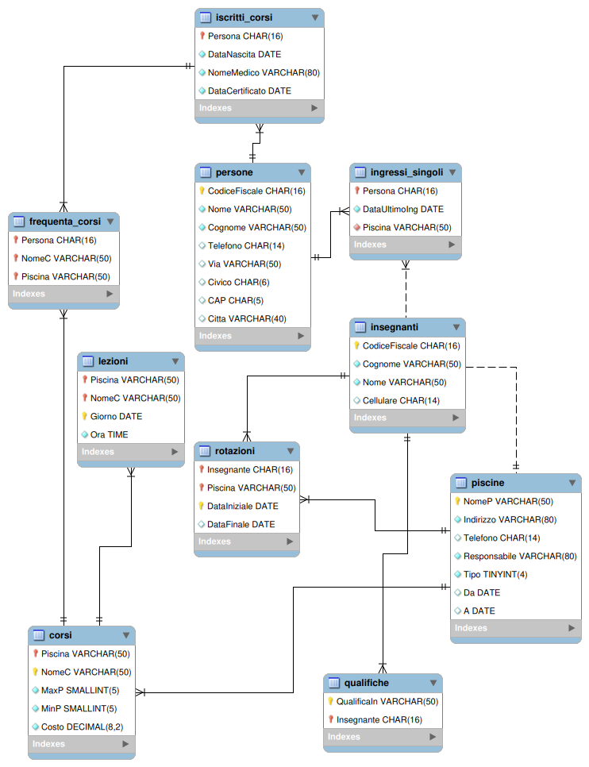

# SQL in MySQL/MariaDB - Parte 2

## Sommario

- Inserimento dati
- Ridenominazione delle colonne
- Modifica dati
- Cancellazione dati
- Integrità referenziale

## Inserimento di dati in una tabella

[MySQL INSERT](https://www.mysqltutorial.org/mysql-basics/mysql-insert/)

```sql
INSERT INTO table_name(column1, column2,...) 
VALUES (value1, value2,...);
```

## Un database per la gestione delle piscine di Milano

Gestione delle piscine comunali di Milano

Si vuole rappresentare una base dati contenete le informazioni relative alle piscine gestite del comune di Milano, tenendo conto delle seguenti informazioni:

- *Le piscine sono identificate univocamente attraverso il nome (ad esempio Cozzi, Comunale, De Marchi, ecc). Per ciascuna sono inoltre noti l'indirizzo, un numero di telefono, ed il nome di un responsabile. Nel caso la piscina disponga anche di una vasca all'aperto, la base dati contiene l'informazione di quando tale vasca è utilizzabile (ad esempio da Marzo a Settembre, da Luglio ad Agosto, ecc.)*
- *Presso le piscine sono organizzati dei corsi; lo stesso tipo di corso può essere svolto presso piscine diverse, eventualmente con modalità differenti. Ciascun corso è pertanto identificato dal nome dell'attività svolta, quali Aerobica, Acquagym, Corso di Sincronizzato o corso per Gestanti, e dal nome della Piscina presso cui tale corso si svolge. Per ciascun corso, svolto presso una certa piscina, è noto il costo, il numero massimo e minimo di partecipanti, in quali giorni della settimana si svolge ed a che ora. Si ipotizzi che presso ciascuna piscina ogni corso sia svolto una sola volta al giorno, ma più volte durante la settimana.*
- *Il corpo insegnante lavora a rotazione presso le varie piscine. Per ciascun insegnante è noto il codice fiscale, che lo identifica, un nome, il numero di cellulare, se disponibile, e l'elenco delle qualifiche dell'insegnante (ad esempio istruttore di sub, istruttore di aerobica, ecc). All'interno della base dati si vuole tener traccia di tutti gli intervalli di tempo in cui un insegnante ha lavorato presso ciascuna piscina. Non si escluda che lo stesso insegnante possa aver lavorato presso una stessa piscina in intervalli di tempo diversi.*
- *Le piscine possono essere frequentate o da persone che sono iscritte ai corsi, o secondo la modalità ad ``ingresso singolo'' per svolgere nuoto libero (si noti che sono registrate per l'ingresso singolo solo le persone che non hanno mai frequentato corsi). Tutte le persone che accedono alle piscine comunali sono identificate attraverso il loro codice fiscale ed inoltre sono noti il nome, un indirizzo ed un numero di telefono.*
- *Le persone che sono iscritte ai corsi devono presentare un certificato medico. Pertanto, nel caso la persona sia iscritta ad un corso, il database contiene l'informazione del medico che ha redatto il certificato, la data in cui la persona ha presentato il certificato, l'età della persona, e l'elenco dei corsi a cui è iscritta. Per le persone che hanno fatto solo ingressi sono noti solo la data in cui è stato effettuato l'ultimo ingresso e presso quale piscina.*

Dopo un'analisi della realtà di interesse, sotto opportune ipotesi aggiuntive, che qui non sono riportate per il momento, si ha che il database è caratterizzato dalle seguenti tabelle:



Il database può essere creato a partire dallo [script](../../sql-scripts/02-piscine/Piscine_Milano_FW_engineering.sql) SQL seguente:

```sql
-- -----------------------------------------------------
-- Schema piscine_milano
-- -----------------------------------------------------
CREATE SCHEMA IF NOT EXISTS `piscine_milano`;
USE `piscine_milano` ;

-- -----------------------------------------------------
-- Table `piscine_milano`.`piscine`
-- -----------------------------------------------------
CREATE TABLE IF NOT EXISTS `piscine_milano`.`piscine` (
  `NomeP` VARCHAR(50) NOT NULL,
  `Indirizzo` VARCHAR(80) NOT NULL,
  `Telefono` CHAR(14) NULL DEFAULT NULL,
  `Responsabile` VARCHAR(80) NOT NULL,
  `Tipo` TINYINT NOT NULL DEFAULT '0',
  `Da` DATE NULL DEFAULT NULL,
  `A` DATE NULL DEFAULT NULL,
  PRIMARY KEY (`NomeP`))
ENGINE = InnoDB;


-- -----------------------------------------------------
-- Table `piscine_milano`.`corsi`
-- -----------------------------------------------------
CREATE TABLE IF NOT EXISTS `piscine_milano`.`corsi` (
  `Piscina` VARCHAR(50) NOT NULL,
  `NomeC` VARCHAR(50) NOT NULL,
  `MaxP` SMALLINT UNSIGNED NOT NULL DEFAULT '20',
  `MinP` SMALLINT UNSIGNED NOT NULL DEFAULT '10',
  `Costo` DECIMAL(8,2) NOT NULL,
  PRIMARY KEY (`Piscina`, `NomeC`),
  INDEX `Piscine` (`Piscina` ASC),
  CONSTRAINT `corsi_ibfk_1`
    FOREIGN KEY (`Piscina`)
    REFERENCES `piscine_milano`.`piscine` (`NomeP`))
ENGINE = InnoDB;


-- -----------------------------------------------------
-- Table `piscine_milano`.`persone`
-- -----------------------------------------------------
CREATE TABLE IF NOT EXISTS `piscine_milano`.`persone` (
  `CodiceFiscale` CHAR(16) NOT NULL,
  `Nome` VARCHAR(50) NOT NULL,
  `Cognome` VARCHAR(50) NOT NULL,
  `Telefono` CHAR(14) NULL DEFAULT NULL,
  `Via` VARCHAR(50) NULL DEFAULT NULL,
  `Civico` CHAR(6) NULL DEFAULT NULL,
  `CAP` CHAR(5) NULL DEFAULT NULL,
  `Citta` VARCHAR(40) NULL DEFAULT NULL,
  PRIMARY KEY (`CodiceFiscale`))
ENGINE = InnoDB;


-- -----------------------------------------------------
-- Table `piscine_milano`.`iscritti_corsi`
-- -----------------------------------------------------
CREATE TABLE IF NOT EXISTS `piscine_milano`.`iscritti_corsi` (
  `Persona` CHAR(16) NOT NULL,
  `DataNascita` DATE NOT NULL,
  `NomeMedico` VARCHAR(80) NOT NULL,
  `DataCertificato` DATE NOT NULL,
  PRIMARY KEY (`Persona`),
  CONSTRAINT `iscritti_corsi_ibfk_1`
    FOREIGN KEY (`Persona`)
    REFERENCES `piscine_milano`.`persone` (`CodiceFiscale`))
ENGINE = InnoDB;


-- -----------------------------------------------------
-- Table `piscine_milano`.`frequenta_corsi`
-- -----------------------------------------------------
CREATE TABLE IF NOT EXISTS `piscine_milano`.`frequenta_corsi` (
  `Persona` CHAR(16) NOT NULL,
  `NomeC` VARCHAR(50) NOT NULL,
  `Piscina` VARCHAR(50) NOT NULL,
  PRIMARY KEY (`Persona`, `NomeC`, `Piscina`),
  INDEX `Corso` (`Piscina` ASC, `NomeC` ASC),
  INDEX `Persona` (`Persona` ASC),
  CONSTRAINT `frequenta_corsi_ibfk_1`
    FOREIGN KEY (`Piscina` , `NomeC`)
    REFERENCES `piscine_milano`.`corsi` (`Piscina` , `NomeC`),
  CONSTRAINT `frequenta_corsi_ibfk_2`
    FOREIGN KEY (`Persona`)
    REFERENCES `piscine_milano`.`iscritti_corsi` (`Persona`))
ENGINE = InnoDB;


-- -----------------------------------------------------
-- Table `piscine_milano`.`ingressi_singoli`
-- -----------------------------------------------------
CREATE TABLE IF NOT EXISTS `piscine_milano`.`ingressi_singoli` (
  `Persona` CHAR(16) NOT NULL,
  `DataUltimoIng` DATE NOT NULL,
  `Piscina` VARCHAR(50) NOT NULL,
  PRIMARY KEY (`Persona`),
  INDEX `Piscina` (`Piscina` ASC),
  CONSTRAINT `ingressi_singoli_ibfk_1`
    FOREIGN KEY (`Persona`)
    REFERENCES `piscine_milano`.`persone` (`CodiceFiscale`),
  CONSTRAINT `ingressi_singoli_ibfk_2`
    FOREIGN KEY (`Piscina`)
    REFERENCES `piscine_milano`.`piscine` (`NomeP`))
ENGINE = InnoDB;


-- -----------------------------------------------------
-- Table `piscine_milano`.`insegnanti`
-- -----------------------------------------------------
CREATE TABLE IF NOT EXISTS `piscine_milano`.`insegnanti` (
  `CodiceFiscale` CHAR(16) NOT NULL,
  `Cognome` VARCHAR(50) NOT NULL,
  `Nome` VARCHAR(50) NOT NULL,
  `Cellulare` CHAR(14) NULL DEFAULT NULL,
  PRIMARY KEY (`CodiceFiscale`))
ENGINE = InnoDB;


-- -----------------------------------------------------
-- Table `piscine_milano`.`lezioni`
-- -----------------------------------------------------
CREATE TABLE IF NOT EXISTS `piscine_milano`.`lezioni` (
  `Piscina` VARCHAR(50) NOT NULL,
  `NomeC` VARCHAR(50) NOT NULL,
  `Giorno` DATE NOT NULL,
  `Ora` TIME NOT NULL,
  PRIMARY KEY (`Piscina`, `NomeC`, `Giorno`),
  INDEX `Corsi` (`Piscina` ASC, `NomeC` ASC),
  CONSTRAINT `lezioni_ibfk_1`
    FOREIGN KEY (`Piscina` , `NomeC`)
    REFERENCES `piscine_milano`.`corsi` (`Piscina` , `NomeC`))
ENGINE = InnoDB;


-- -----------------------------------------------------
-- Table `piscine_milano`.`qualifiche`
-- -----------------------------------------------------
CREATE TABLE IF NOT EXISTS `piscine_milano`.`qualifiche` (
  `QualificaIn` VARCHAR(50) NOT NULL,
  `Insegnante` CHAR(16) NOT NULL,
  PRIMARY KEY (`QualificaIn`, `Insegnante`),
  INDEX `Insegnante` (`Insegnante` ASC),
  CONSTRAINT `qualifiche_ibfk_1`
    FOREIGN KEY (`Insegnante`)
    REFERENCES `piscine_milano`.`insegnanti` (`CodiceFiscale`))
ENGINE = InnoDB;


-- -----------------------------------------------------
-- Table `piscine_milano`.`rotazioni`
-- -----------------------------------------------------
CREATE TABLE IF NOT EXISTS `piscine_milano`.`rotazioni` (
  `Insegnante` CHAR(16) NOT NULL,
  `Piscina` VARCHAR(50) NOT NULL,
  `DataIniziale` DATE NOT NULL,
  `DataFinale` DATE NULL DEFAULT NULL,
  PRIMARY KEY (`Insegnante`, `Piscina`, `DataIniziale`),
  INDEX `Piscina` (`Piscina` ASC),
  INDEX `Insegnante` (`Insegnante` ASC),
  CONSTRAINT `rotazioni_ibfk_1`
    FOREIGN KEY (`Insegnante`)
    REFERENCES `piscine_milano`.`insegnanti` (`CodiceFiscale`),
  CONSTRAINT `rotazioni_ibfk_2`
    FOREIGN KEY (`Piscina`)
    REFERENCES `piscine_milano`.`piscine` (`NomeP`))
ENGINE = InnoDB;
```

Il database `piscine_milano` può essere popolato con questo [script](../../sql-scripts/02-piscine/Piscine_Milano_INSERIMENTO_DATI.sql).

## Interrogazione di un database - clausola SELECT

- [MySQL Tutorial - SELECT FROM](https://www.mysqltutorial.org/mysql-basics/mysql-select-from/)

```sql
SELECT select_list
FROM table_name;
```

- [MariaDB SELECT statement](https://mariadb.com/kb/en/select/)

```sql
SELECT
    [ALL | DISTINCT | DISTINCTROW]
    [HIGH_PRIORITY]
    [STRAIGHT_JOIN]
    [SQL_SMALL_RESULT] [SQL_BIG_RESULT] [SQL_BUFFER_RESULT]
    [SQL_CACHE | SQL_NO_CACHE] [SQL_CALC_FOUND_ROWS]
    select_expr [, select_expr ...]
    [ FROM table_references
      [WHERE where_condition]
      [GROUP BY {col_name | expr | position} [ASC | DESC], ... [WITH ROLLUP]]
      [HAVING where_condition]
      [ORDER BY {col_name | expr | position} [ASC | DESC], ...]
      [LIMIT {[offset,] row_count | row_count OFFSET offset  [ROWS EXAMINED rows_limit] } |
        [OFFSET start { ROW | ROWS }]
        [FETCH { FIRST | NEXT } [ count ] { ROW | ROWS } { ONLY | WITH TIES }] ]
      procedure|[PROCEDURE procedure_name(argument_list)]
      [INTO OUTFILE 'file_name' [CHARACTER SET charset_name] [export_options] |
        INTO DUMPFILE 'file_name' | INTO var_name [, var_name] ]
      [FOR UPDATE lock_option | LOCK IN SHARE MODE lock_option]


export_options:
    [{FIELDS | COLUMNS}
        [TERMINATED BY 'string']
        [[OPTIONALLY] ENCLOSED BY 'char']
        [ESCAPED BY 'char']
    ]
    [LINES
        [STARTING BY 'string']
        [TERMINATED BY 'string']
    ]


lock_option:
    [WAIT n | NOWAIT | SKIP LOCKED]
```

- [MySQL SELECT statement](https://dev.mysql.com/doc/refman/9.0/en/select.html)

```sql
SELECT
    [ALL | DISTINCT | DISTINCTROW ]
    [HIGH_PRIORITY]
    [STRAIGHT_JOIN]
    [SQL_SMALL_RESULT] [SQL_BIG_RESULT] [SQL_BUFFER_RESULT]
    [SQL_NO_CACHE] [SQL_CALC_FOUND_ROWS]
    select_expr [, select_expr] ...
    [into_option]
    [FROM table_references
      [PARTITION partition_list]]
    [WHERE where_condition]
    [GROUP BY {col_name | expr | position}, ... [WITH ROLLUP]]
    [HAVING where_condition]
    [WINDOW window_name AS (window_spec)
        [, window_name AS (window_spec)] ...]
    [ORDER BY {col_name | expr | position}
      [ASC | DESC], ... [WITH ROLLUP]]
    [LIMIT {[offset,] row_count | row_count OFFSET offset}]
    [into_option]
    [FOR {UPDATE | SHARE}
        [OF tbl_name [, tbl_name] ...]
        [NOWAIT | SKIP LOCKED]
      | LOCK IN SHARE MODE]
    [into_option]

into_option: {
    INTO OUTFILE 'file_name'
        [CHARACTER SET charset_name]
        export_options
  | INTO DUMPFILE 'file_name'
  | INTO var_name [, var_name] ...
}
```

## SELECT - primi esempi

```sql
-- visualizzo il Cognome ed il Nome degli insegnanti
SELECT Nome, Cognome FROM Insegnanti;

-- visualizzo il cognome ed il nome dell'insegnante che ha un codice fiscale dato
SELECT Nome, Cognome FROM Insegnanti
WHERE CodiceFiscale = 'SALMAT74C24F129F';

-- visualizzo il cognome ed il nome dell'insegnante che ha un codice fiscale dato
SELECT Nome, Cognome FROM Insegnanti
WHERE CodiceFiscale = 'SALMAT74C24F129F';
```

### SELECT - significato

La parte SELECT `select_list`  di una interrogazione SQL rappresenta l’operazione di PROIEZIONE dell’algebra relazionale, ossia l’algebra della teoria relazionale in quanto permette di selezionare le colonne di una tabella (relazione)  che saranno riportate in output dalla query.

### Ridenominazione di colonne: operatore AS

Supponiamo di voler chiamare la colonna `NomeP` di `Piscina` col nome di `Nome Piscina`. La query che fornisce questo risultato è:

```sql
SELECT NomeP AS 'Nome Piscina', Indirizzo, Responsabile FROM Piscine ORDER BY Responsabile DESC;
```

L’uso della parola `AS` è facoltativa, infatti si potrebbe scrivere l'istruzione precedente come:

```sql
SELECT NomeP `Nome Piscina`, Indirizzo, Responsabile FROM Piscine ORDER BY Responsabile DESC;
```

> :memo: **Nota**
> I backtick vanno messi quando c'è uno spazio altrimenti non servono

La ridenominazione di colonne dell'SQL  corrisponde all'operazione di RIDENOMINAZIONE dell'algebra relazionale, ossia all'operazione che permette di cambiare il nome di un attributo in una relazione (tabella).

## Modifica dei dati di una tabella - (UPDATE)

[MySQL Tutorial UPDATE](https://www.mysqltutorial.org/mysql-basics/mysql-update/)

```sql
UPDATE [LOW_PRIORITY] [IGNORE] table_name 
SET 
    column_name1 = expr1,
    column_name2 = expr2,
    ...
[WHERE
    condition];
```

Supponiamo che per l’insegnante di nuoto con C.F. `'ALBGIN77B31C133C'`  ci sia stato un errore nell'inserimento del brevetto di Sub: non di `terzo grado` ma di `primo grado`. In questo caso la query che effettua l'aggiornamento è:

```sql
UPDATE Qualifiche SET QualificaIn = 'Brevetto di Sub di Primo Grado'
WHERE QualificaIn ='Brevetto di Sub di Terzo Grado' AND Insegnante = 'ALBGIN77B31C133C';
```

## Eliminazione dei dati da una tabella

[MySQL Tutorial DELETE](https://www.mysqltutorial.org/mysql-basics/mysql-delete/)

```sql
DELETE FROM table_name
WHERE condition;
```

Ad esempio se volessimo eliminare le qualifiche dell’insegnante con codice fiscale `'ALBGIN77B31C133C'` potremmo scrivere:

```sql
DELETE FROM Qualifiche 
WHERE Insegnante = 'ALBGIN77B31C133C’;
```

## Vincoli di integrità referenziale (o di chiave esterna)

I vincoli di integrità referenziale coinvolgono le relazioni esistenti di tipo `1:N` oppure `1:1` tra le tabelle dello schema logico.
Vediamo il caso `1:N`, il caso `1:1` è un caso particolare di `1:N`.


Un esempio di integrità referenziale:


- Un vincolo di integrità referenziale impone che **per ogni valore della colonna (o colonne) in comune nella parte a molti (tabella esterna) sia sempre presente un valore uguale nella parte a uno (tabella interna).**
- *Nell'esempio della figura i valori di `Studente` nella tabella `Assenze` devono corrispondere a valori di `Codice` nella tabella `Studenti`.*
- Per imporre il vincolo di integrità referenziale in SQL, la colonna (o le colonne) in comune della tabella esterna deve essere dichiarata come chiave esterna (FOREIGN KEY) secondo la sintassi:

```sql
[CONSTRAINT [symbol]] FOREIGN KEY
    [index_name] (col_name, ...)
    REFERENCES tbl_name (col_name,...)
    [ON DELETE reference_option]
    [ON UPDATE reference_option]

reference_option:
    RESTRICT | CASCADE | SET NULL | NO ACTION | SET DEFAULT
```

> :warning: **Attenzione:**
>
> - In MySQL l'integrità referenziale è supportata solo su tabelle di tipo InnoDB
> - In MySQL e MariaDB l'opzione SET DEFAULT non è supportata da InnoDB. Si veda a tal proposito la [documentazione di MySQL](https://dev.mysql.com/doc/refman/9.0/en/create-table-foreign-keys.html) o [quella di MariaDB](https://mariadb.com/kb/en/foreign-keys/
> )

### Un esempio di integrità referenziale

Si consideri il database `dbscuola`, descritto dalle seguenti tabelle:

```sql
CREATE TABLE IF NOT EXISTS studenti (
  Matricola MEDIUMINT UNSIGNED NOT NULL AUTO_INCREMENT,
  Cognome varchar(30) NOT NULL,
  Nome varchar(30) NOT NULL,
  DataNascita date NOT NULL,
  Genere enum('M','F') NOT NULL,
  Nazione varchar(30) NOT NULL default 'Italia',
  E-Mail varchar(50),
  PRIMARY KEY  (Matricola),
  UNIQUE KEY CognomeNomeDataN(Cognome,Nome, DataNascita)
) ENGINE=InnoDB; 

CREATE TABLE IF NOT EXISTS assenze (
ID MEDIUMINT UNSIGNED AUTO_INCREMENT PRIMARY KEY,
Studente MEDIUMINT UNSIGNED  NOT NULL,
Tipo ENUM('AA','AG', 'RR','RG') DEFAULT 'AA',
Data DATE NOT NULL ,
FOREIGN KEY (Studente) REFERENCES studenti(Matricola)
) ENGINE = InnoDB;
```

La definizione completa dello schema e le istruzioni per l'inserimento dei valori sono disponibili in questo [script](../../sql-scripts/01-dbscuola/DB_scuola.sql).

> :memo: **Nota:** In mysql e mariadb è possibile vedere la struttura di una tabella, con le indicazioni delle chiavi primarie ed esterne usando il comando:
>
> ```sql
>  SHOW CREATE TABLE nome_tabella{;|\G} 
> ```
>
> Notare il \G al posto del ; per avere una formattazione dell’output più leggibile

#### Inserimento di dati in un database con tabelle legate dal vincolo di integrità referenziale

Supponiamo che nel database siano stati inseriti solo gli studenti seguenti:

```sql
INSERT INTO Studenti (Cognome, Nome, DataNascita,Classe, Indirizzo) 
VALUES ('Alberti', 'Giacomo', '2010-03-24','3A','Via Tal Dei Tali n.5 Milano');

INSERT INTO Studenti (Cognome, Nome, DataNascita,Classe, Indirizzo) 
VALUES ('Beccaria', 'Giovanni', '2011-03-13','3B','Via La Qualunque n.10 Milano');

```

Cosa succede se si inserisce un'assenza a cui non corrisponde uno studente?

```sql
INSERT INTO Assenze (Studente, Tipo, Data) VALUES (1, 'AA', CURRENT_DATE);
INSERT INTO Assenze (Studente,Data) VALUES (2, CURRENT_DATE);

# caso non valido
INSERT INTO Assenze (Studente,Data) VALUES (3, CURRENT_DATE);
```

#### Vincoli di integrità referenziale - REGOLA

Un vincolo d'integrità referenziale può essere applicato:

- Se le colonne in comune della tabella interna ed esterna sono dello stesso dominio (anche se hanno nome diverso);
- Se la colonna ( o colonne) della tabella interna è una chiave primaria oppure è soggetta ad un vincolo UNIQUE;
- Alla medesima tabella.

> :fire: **Importante:** Nel codice sorgente dello schema logico, la dichiarazione della tabella interna deve sempre precedere la dichiarazione della tabella esterna

#### Vincoli di integrità referenziale - ON DELETE | ON UPDATE

Cosa succede se si tenta di eliminare una tupla della tabella interna a cui sono associate una o più tuple della tabella esterna? Ad esempio, se si tenta di eliminare uno studente dalla tabella degli studenti, cosa succede alle assenze fatte da quello studente?

La risposta è *"dipende"* … da cosa?

E cosa succede se si tenta di modificare la chiave primaria di una tupla della tabella interna a cui sono associate una o più tuple della tabella esterna? 

#### Vincoli di integrità referenziale - NO ACTION | RESTRICT

Consideriamo il seguente statement:

```sql
CREATE TABLE Assenze (
ID MEDIUMINT UNSIGNED  AUTO_INCREMENT  PRIMARY KEY,
-- altre colonne
FOREIGN KEY (Studente) REFERENCES Studenti(Matricola)
) ENGINE = InnoDB;
```

Equivale a

```sql
CREATE TABLE Assenze (
ID MEDIUMINT UNSIGNED  AUTO_INCREMENT  PRIMARY KEY,
-- altre colonne
FOREIGN KEY (Studente) REFERENCES Studenti(Matricola)
ON DELETE RESTRICT
ON UPDATE RESTRICT
) ENGINE = InnoDB;
```

In MySQL/MariaDB, se non è specificata l'opzione `ON DELETE` oppure `ON UPDATE`, il comportamento di default è `RESTRICT` ovvero non è permesso di eliminare una tupla (modificare la chiave primaria) della tabella interna se vi sono tuple della tabella esterna che la riferiscono.
In MySQL/MySQL l'opzione `RESTRICT` equivale a `NO ACTION`

#### Vincoli di integrità referenziale - ON DELETE

Cosa succede se si provasse ad eliminare uno studente con assenze?

```sql
DELETE FROM Studenti
  WHERE Matricola = 1;
```

In questo caso si otterrebbe un messaggio d'errore perché l'opzione `RESTRICT` non consentirebbe di eliminare uno studente con assenze ad esso associate.

Cosa succederebbe se si provasse ad eliminare uno studente senza assenze associate?

```sql
# inseriamo uno studente a cui non è associato nessuna  assenza
INSERT INTO Studenti (Cognome, Nome, DataNascita,Classe, Indirizzo) 
VALUES ('Cimitile', 'Erminio', '1991-04-23','5B','Via Larga 1 Milano');

# provo ad eliminare uno studente senza assenze
DELETE FROM Studenti
  WHERE Matricola = 3;
```

In questo caso la query di cancellazione avrebbe successo perché non sarebbe violato alcun vincolo di integrità referenziale.

#### Vincoli di integrità referenziale - ON UPDATE

Cosa succederebbe se si provasse a modificare la chiave primaria di uno studente con assenze associate?

```sql
UPDATE Studenti
  SET Matricola = 5
  WHERE Matricola = 1;
```

In questo caso si otterrebbe un messaggio d'errore perché l'opzione `RESTRICT` non consentirebbe di modificare una chiave primaria, se ad essa è associato il valore di una chiave esterna in una tabella collegata.

Ovviamente se provassimo a modificare la Matricola di uno studente senza assenze associate non verrebbe segnalato alcun messaggio d'errore.

#### Vincoli di integrità referenziale - CASCADE

Supponiamo di alterare la definizione di integrità referenziale come mostrato nel codice seguente:

```sql
 -- rimuoviamo la chiave esterna precedente
ALTER TABLE assenze DROP FOREIGN KEY assenze_ibfk_1;
-- ricostruiamo la chiave esterna con la clausola CASCADE
ALTER TABLE assenze ADD CONSTRAINT assenze_fk1 
  FOREIGN KEY (Studente) REFERENCES studenti(Matricola) 
  ON DELETE CASCADE 
  ON UPDATE CASCADE;
# inseriamo alcune assenze
INSERT INTO Assenze (Studente, Tipo, Data) VALUES (1, 'AA', CURRENT_DATE);
INSERT INTO Assenze (Studente,Data) VALUES (2, CURRENT_DATE);
```

Cosa succederebbe se si provasse ad eliminare lo studente con Matricola = 1 ?

```sql
DELETE FROM Studenti
WHERE Matricola = 1;
```

L'eliminazione dello studente con matricola = 1 implicherebbe la cancellazione anche delle assenze da questi effettuate!

#### Vincoli di integrità referenziale - SET NULL

Supponiamo di alterare la definizione di integrità referenziale come mostrato nel codice seguente:

```sql
 -- rimuoviamo la chiave esterna precedente
ALTER TABLE assenze DROP FOREIGN KEY assenze_ibfk_1;
-- ricostruiamo la chiave esterna con la clausola CASCADE
ALTER TABLE assenze ADD CONSTRAINT assenze_fk1 
  FOREIGN KEY (Studente) REFERENCES studenti(Matricola) 
  ON DELETE SET NULL 
  ON UPDATE CASCADE;
# inseriamo alcune assenze
INSERT INTO Assenze (Studente, Tipo, Data) VALUES (1, 'AA', CURRENT_DATE);
INSERT INTO Assenze (Studente,Data) VALUES (2, CURRENT_DATE);
```

Cosa succederebbe se si provasse ad eliminare lo studente con Matricola = 1 ?

```sql
DELETE FROM Studenti
WHERE Matricola = 1;
```

L'eliminazione dello studente con matricola = 1 implicherebbe che l'assenza da questi effettuata si traduca in una chiave esterna messa a NULL nella tabella assenze.

#### Sintesi sui vincoli di integrità referenziale - ON DELETE | ON UPDATE

In sintesi:


> :memo: **Nota:** SET DEFAULT non è supportato da InnoDB di MySQL e MariaDB

### Case sensitive or case insensitive?

Attenzione al case dei nomi di tabelle in MySQL/MariaDB.

<cite>In MySQL[^1] and MariaDB, databases correspond to directories within the data directory. Each table within a database corresponds to at least one file within the database directory. Consequently, the case sensitivity of the underlying operating system plays a part in the case sensitivity of database, table, and trigger names.
This means such names are not case sensitive in Windows, but are case sensitive in most varieties of Unix.</cite>

La variabile `lower_case_table_names` specifica il comportamento del DBMS Server con riferimento al case dei nomi delle tabelle:

<cite>[^2]`lower_case_table_names`: If set to 0, table names are stored as specified and comparisons are case sensitive. If set to 1, table names are stored in lowercase on disk and comparisons are not case sensitive. If set to 2, table names are stored as given but compared in lowercase. This option also applies to database names and table aliases.</cite>

```sql
SELECT @@global. lower_case_table_names;
```

In Windows il risultato è 1; in Linux è 0.

Ad esempio, supponendo di avere le tabelle `studenti` e `assenze` descritte con il case minuscolo:

```sql
CREATE TABLE IF NOT EXISTS studenti (…etc…
) ENGINE=InnoDB;
CREATE TABLE  assenze (…etc…
) ENGINE = InnoDB CHARSET = latin1;
```

La query seguente:

```sql
ALTER TABLE assenze ADD CONSTRAINT FK_assenze_studenti FOREIGN KEY
(Studente) REFERENCES Studenti (matricola);
```

È corretta in Windows, ma dà errore in Linux perché in Linux `Studenti` e `studenti` non sono la stessa tabella!

### Dove sono le tabelle?

<cite>[^3]By default, MySQL stores database files in `/var/lib/mysql`. However, we can override the location in the configuration file. Typically, this is the `/etc/mysql/mysql.conf.d/mysqld.cnf` file.</cite>

To find out the current data directory, we can use a basic select command at the mysql prompt:

### Quali tabelle?[^4]

- .frm :
MySQL represents each table by an .frm table format file, stores table definition in the database directory. It is stored as .frm under data directory.
- .ibd :
If you specify innodb_file_per_table option to my.cnf, InnoDB stores each table in its own .ibd file in the same MySQL database directory where the .frm file is created. For InnoDB tables, the data and the indexes are stored together in the .ibd file.
- db.opt :
In CREATE DATABASE command, create_specification options specify database characteristics. Database characteristics are stored in the db.opt file in the database directory.

[^1]: [MySQL Manual](https://dev.mysql.com/doc/refman/9.0/en/identifier-case-sensitivity.html)
[^2]: [MySQL Manual](https://dev.mysql.com/doc/refman/9.0/en/server-system-variables.html#sysvar_lower_case_table_names)
[^3]: [www.baeldung.com](https://www.baeldung.com/linux/mysql-database-files-location#default-location)
[^4]: [https://kedar.nitty-witty.com/](https://kedar.nitty-witty.com/blog/quick-look-mysql-data-directory-files)