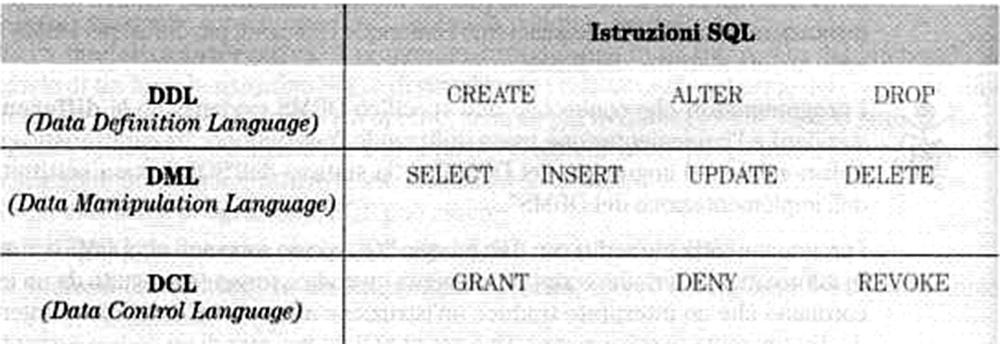

# SQL in MySQL/MariaDB

## Sommario

- Introduzione all’SQL in MySQL
- Caratteristiche del linguaggio
- Creazione di un database con mysql
- Definizione delle colonne
- Domini
- Vincoli di integrità di colonna
- SQL strict mode in MySQL
  
## Riferimenti

I riferimenti a MySQL e MariaDB si trovano sul manuale utente del database:

- [MySQL 9 Manual](https://dev.mysql.com/doc/refman/9.0/en/)
- [MariaDB Documentation](https://mariadb.com/kb/en/documentation/)

## Caratteristiche del linguaggio

### SQL è un linguaggio per la gestione dei database relazionali

- **Definizione dello schema logico**
- **Aggiornamento e interrogazione dei  dati**
- **Gestione della sicurezza del DBMS**

### SQL è un linguaggio dichiarativo

Per realizzare un servizio del sistema informativo basta dichiarare le proprietà che devono soddisfare i risultati e non come ottenerli …
Ad esempio per *"ricercare nella base di dati tutti gli studenti della classe 5A"* Il programmatore non deve realizzare un programma per la ricerca dei dati, ma si limiterà a scrivere:

```sql
SELECT *
FROM Studenti
WHERE ClasseFrequentata = '5A' 
```

### SQL può essere utilizzato in due modi

#### Modalità interattiva

Si utilizza un interprete di comandi testuale o grafico che permette di eseguire e visualizzare i risultati delle query

#### Modalità programma

L’SQL è utilizzato all’interno di un altro linguaggio,denominato host (ad esempio PHP,  Java, etc …)

## SQL: componenti del linguaggio



## SQL: primi passi, con MySQL

L’introduzione all'SQL sarà fatta per passi con esempi tratti dall’utilizzo del database MySQL/mariaDB.

Il database MySQL/mariaDB è strutturato secondo un’architettura client/server.

Il server è l’entità che gestisce i cataloghi dei database con le tabelle e risponde alle richieste pervenute tramite un client.

Il client è un programma che comunica col server tramite un socket TCP/IP ( tipicamente sulla porta 3306)

Client e server sono tipicamente su host differenti!

Per il database MySQL sono disponibili diversi client:

- MySQL WorkBench, phpMyAdmin, etc. – sono strumenti grafici (GUI)
- MySQL monitor - è un client a riga di comando

### Visualizzazione dei database disponibili

```sql
SHOW DATABASES ;
```

### Selezione di uno specifico DB

```sql
USE database_name;
```

Con questa direttiva si indica di voler lavorare con il DB database_name, fino a quando non si indica un database diverso.

### Creazione di un database

Un database può essere creato con l'istruzione:

```sql
CREATE DATABASE database_name;
```

oppure, in generale (le parentesi quadre indicano un parametro opzionale)

```sql
CREATE DATABASE [IF NOT EXISTS] database_name
[CHARACTER SET charset_name]
[COLLATE collation_name];
```

Sulla [pagina di MySQL Tutorial relativa alla creazione di un database](https://www.mysqltutorial.org/mysql-basics/mysql-create-database/) si trovano maggiori dettagli su come creare un database. In particolare si presti attenzione al concetto di **[charset](https://www.mysqltutorial.org/mysql-basics/mysql-character-set/)** e di **[collation](https://www.mysqltutorial.org/mysql-basics/mysql-collation/)**.

Le impostazioni di default del server di MySQL possono essere ispezionate con il comando [indicato nel manuale di ](https://dev.mysql.com/doc/refman/9.0/en/server-system-variables.html):

```sql
mysqld --verbose --help
```

Ad esempio:

```sh
mysqld --verbose --help | grep character
mysqld --verbose --help | grep collation
```

### CHARACTER e COLLATION

Il CHARACTER e la COLLATION possono essere impostati 

- a livello di database:

  - In fase di creazione:

  ```sql
  CREATE DATABASE database_name
  CHARACTER SET character_set_name
  COLLATE collation_name;
  ```

  - oppure, in fase di modifica del database:

  ```sql
  ALTER DATABASE database_name
  CHARACTER SET character_set_name
  COLLATE collation_name;
  ```

- a livello di tabella:

  - In fase di creazione:

      ```sql
      CREATE TABLE table_name(
      ...
      )
      CHARACTER SET character_set_name
      COLLATE collation_name;
      ```

  - oppure, in fase di modifica:

      ```sql
      ALTER TABLE table_name(
      ...
      )
      CHARACTER SET character_set_name
      COLLATE collation_name;
      ```

- a livello di colonna, sia in fase di creazione che di modifica:
  
    ```sql
    column_name [CHAR | VARCHAR | TEXT] (length)
    CHARACTER SET character_set_name
    COLLATE collation_name
    ```

### Cancellazione di un database

```sql
DROP DATABASE [IF EXISTS] database_name;
```

Oppure, siccome in MySQL lo schema è sinonimo di database, si può anche scrivere:

```sql
DROP SCHEMA [IF EXISTS] database_name;
```

Si veda anche [MySQL DROP DATABASE su mysqltutorial.org](https://www.mysqltutorial.org/mysql-basics/mysql-drop-database/)

### Creazione di una tabella

[Creazione di una tabella su mysqltutorial.org](https://www.mysqltutorial.org/mysql-basics/mysql-create-table/)

Una tabella può essere creata con un'istruzione del tipo seguente:

```sql
CREATE TABLE [IF NOT EXISTS] table_name(
   column1 datatype constraints,
   column2 datatype constraints,
   ...
) ENGINE=storage_engine;
```

Ad esempio:

```sql
CREATE TABLE IF NOT EXISTS studenti (
  Matricola mediumint unsigned NOT NULL auto_increment ,
  Cognome varchar(30) NOT NULL,
  Nome varchar(30) NOT NULL,
  DataNascita date NOT NULL,
  Genere enum('M','F') NOT NULL,
  Nazione varchar(30) NOT NULL default 'Italia',
  PRIMARY KEY  (Matricola),
  UNIQUE KEY CognomeNome (Cognome,Nome)
) ENGINE=InnoDB DEFAULT CHARSET=latin1 ;
```

Per specificare una tabella occorre definire i domini (i tipi) delle colonne, ed i vincoli d’integrità.
I vincoli d’integrità sono di tre tipi:

- Integrità sulle colonne
- Integrità sulle tabelle
- Integrità referenziale (tra le colonne in comune delle tabelle in relazione)

### Cancellazione di una tabella (DROP TABLE)

[Cancellazione di una tabella su mysqltutorial.org](https://www.mysqltutorial.org/mysql-basics/mysql-drop-table/)

```sql
DROP [TEMPORARY] TABLE [IF EXISTS] table_name [, table_name] ...
[RESTRICT | CASCADE]
```

### Visualizzazione delle tabelle di un database (SHOW TABLES)

[Visualizzazione delle tabelle di un database su mysqltutorial.org](https://www.mysqltutorial.org/mysql-administration/mysql-show-tables/)

```sql
SHOW TABLES;
```

Oppure:

```sql
SHOW FULL TABLES;
```

## Domini

### Numeri in MySQL/MariaDB

- [Bit](https://www.mysqltutorial.org/mysql-basics/mysql-bit/)
- Numeri [Interi](https://www.mysqltutorial.org/mysql-basics/mysql-int/) (INT, TINYINT, SMALLINT, MEDIUMINT, BIGINT)
- Numeri floating point (valori approssimati) [(FLOAT, DOUBLE)](https://dev.mysql.com/doc/refman/9.0/en/floating-point-types.html)
- Numeri [DECIMAL](https://www.mysqltutorial.org/mysql-basics/mysql-decimal/)

Attenzione al giusto dominio:

Nei calcoli scientifici di solito si usano i domini numerici approssimati FLOAT o DOUBLE, mentre nei calcoli finanziari ed economici si usano i numeri esatti in virgola fissa DECIMAL. Un FLOAT ha solo 6 cifre decimali significative, mentre un DOUBLE ne ha (solo) 15.

Ad esempio `DECIMAL(10,3)` è un numero a 10 cifre decimali complessive e con 3 cifre dopo la virgola.
In MySQL un DECIMAL può avere fino a 65 cifre significative complessive e fino a 30 cifre dopo la virgola


### Caratteri e testo

- Caratteri [CHAR](https://www.mysqltutorial.org/mysql-basics/mysql-char-data-type/) e [VARCHAR](https://www.mysqltutorial.org/mysql-basics/mysql-varchar/)
- Testo [TEXT](https://www.mysqltutorial.org/mysql-basics/mysql-text/)

### Enumerativo

- [ENUM](https://www.mysqltutorial.org/mysql-basics/mysql-enum/)
  Ad esempio:

  ```sql
    CREATE TABLE tickets (
        id INT PRIMARY KEY AUTO_INCREMENT,
        title VARCHAR(255) NOT NULL,
        priority ENUM('Low', 'Medium', 'High') NOT NULL
    );

    # inserimento con il valore letterale
    INSERT INTO tickets(title, priority)
    VALUES('Scan virus for computer A', 'High');

    # inserimento con l'indice dell'enumerativo
    INSERT INTO tickets(title, priority)
    VALUES('Upgrade Windows OS for all computers', 1);
  ```

### Date

- [DATE](https://www.mysqltutorial.org/mysql-basics/mysql-date/)
- [DATETIME](https://www.mysqltutorial.org/mysql-basics/mysql-datetime/)
- [TIME](https://www.mysqltutorial.org/mysql-basics/mysql-time/)
- [TIMESTAMP](https://www.mysqltutorial.org/mysql-basics/understanding-mysql-timestamp/)
  
### BLOB and BINARY

- [BLOB](https://www.mysqltutorial.org/mysql-basics/mysql-blob/)
- [BINARY](https://www.mysqltutorial.org/mysql-basics/mysql-binary/)
- [VARBINARY](https://www.mysqltutorial.org/mysql-basics/mysql-varbinary/)

### Boolean

- [BOOLEAN](https://www.mysqltutorial.org/mysql-basics/mysql-boolean/)

### JSON

- [JSON](https://www.mysqltutorial.org/mysql-json/mysql-json-data-type/)