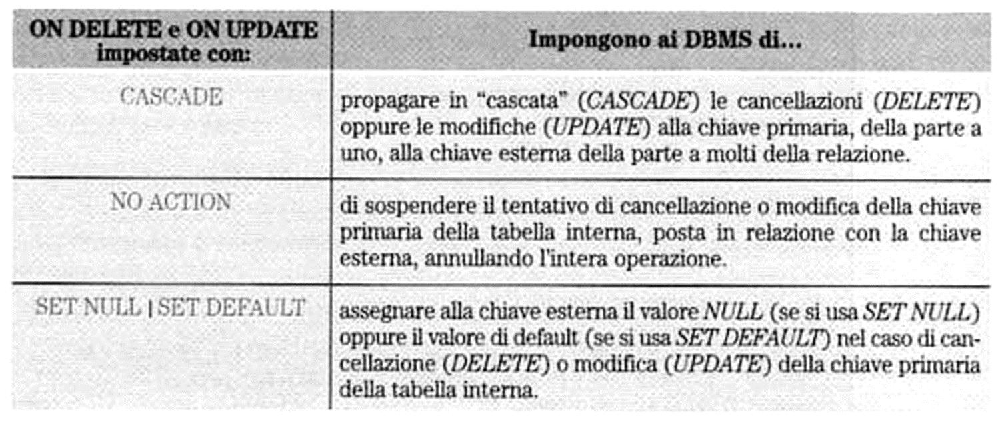

# SQL in MySQL/MariaDB - Parte 2

- [SQL in MySQL/MariaDB - Parte 2](#sql-in-mysqlmariadb---parte-2)
  - [Inserimento di dati in una tabella](#inserimento-di-dati-in-una-tabella)
    - [Il database `dbscuola`](#il-database-dbscuola)
  - [Interrogazione di un database - clausola SELECT](#interrogazione-di-un-database---clausola-select)
  - [SELECT - primi esempi](#select---primi-esempi)
    - [SELECT - significato](#select---significato)
    - [Ridenominazione di colonne: operatore `AS`](#ridenominazione-di-colonne-operatore-as)
    - [Quando usare single quote (`'`), double quote (`"`), e backtick (\`) in MySQL/MariaDB](#quando-usare-single-quote--double-quote--e-backtick--in-mysqlmariadb)
  - [Modifica dei dati di una tabella - (UPDATE)](#modifica-dei-dati-di-una-tabella---update)
  - [Eliminazione dei dati da una tabella](#eliminazione-dei-dati-da-una-tabella)
  - [Modifica della struttura di una tabella - ALTER TABLE](#modifica-della-struttura-di-una-tabella---alter-table)
  - [Vincoli di integrità referenziale (o di chiave esterna)](#vincoli-di-integrità-referenziale-o-di-chiave-esterna)
    - [Inserimento di dati in un database con tabelle soggette al vincolo di integrità referenziale](#inserimento-di-dati-in-un-database-con-tabelle-soggette-al-vincolo-di-integrità-referenziale)
    - [Vincoli di integrità referenziale - REGOLA](#vincoli-di-integrità-referenziale---regola)
    - [Vincoli di integrità referenziale - ON DELETE | ON UPDATE](#vincoli-di-integrità-referenziale---on-delete--on-update)
    - [Vincoli di integrità referenziale - NO ACTION | RESTRICT](#vincoli-di-integrità-referenziale---no-action--restrict)
    - [Vincoli di integrità referenziale - ON DELETE](#vincoli-di-integrità-referenziale---on-delete)
    - [Vincoli di integrità referenziale - ON UPDATE](#vincoli-di-integrità-referenziale---on-update)
    - [Vincoli di integrità referenziale - CASCADE](#vincoli-di-integrità-referenziale---cascade)
    - [Vincoli di integrità referenziale - SET NULL](#vincoli-di-integrità-referenziale---set-null)
    - [Sintesi sui vincoli di integrità referenziale - ON DELETE | ON UPDATE](#sintesi-sui-vincoli-di-integrità-referenziale---on-delete--on-update)
    - [Case sensitive or case insensitive?](#case-sensitive-or-case-insensitive)
    - [Dove sono le tabelle?](#dove-sono-le-tabelle)
    - [Quali tabelle?\[^4\]](#quali-tabelle4)

## Inserimento di dati in una tabella

[MySQL INSERT](https://www.mysqltutorial.org/mysql-basics/mysql-insert/)

```sql
INSERT INTO table_name(column1, column2,...) 
VALUES (value1, value2,...);
```

### Il database `dbscuola`

Si consideri il database `dbscuola`, descritto dalle seguenti tabelle:

```sql
CREATE TABLE IF NOT EXISTS studenti (
  Matricola MEDIUMINT UNSIGNED NOT NULL AUTO_INCREMENT,
  Cognome varchar(30) NOT NULL,
  Nome varchar(30) NOT NULL,
  DataNascita date NOT NULL,
  Genere enum('M','F') NOT NULL,
  Nazione varchar(30) NOT NULL default 'Italia',
  EMail varchar(50),
  PRIMARY KEY  (Matricola),
  UNIQUE KEY CognomeNomeDataN(Cognome,Nome, DataNascita)
) ENGINE=InnoDB; 

CREATE TABLE IF NOT EXISTS assenze (
ID MEDIUMINT UNSIGNED AUTO_INCREMENT PRIMARY KEY,
Studente MEDIUMINT UNSIGNED  NOT NULL,
Tipo ENUM('AA','AG', 'RR','RG') DEFAULT 'AA',
Data DATE NOT NULL ,
FOREIGN KEY (Studente) REFERENCES studenti(Matricola)
) ENGINE = InnoDB;
```

La definizione completa dello schema e le istruzioni per l'inserimento dei valori sono disponibili in questo [script](../../sql-scripts/01-dbscuola/dbscuola.sql).

> :memo: **Nota:** In mysql e mariadb è possibile vedere la struttura di una tabella, con le indicazioni delle chiavi primarie ed esterne usando il comando:
>
> ```sql
>  SHOW CREATE TABLE nome_tabella{;|\G} 
> ```
>
> Notare il \G al posto del ; per avere una formattazione dell’output più leggibile

## Interrogazione di un database - clausola SELECT

- [MySQL Tutorial - SELECT FROM](https://www.mysqltutorial.org/mysql-basics/mysql-select-from/)

```sql
SELECT select_list
FROM table_name;
```

- [MariaDB SELECT statement](https://mariadb.com/kb/en/select/)

```sql
SELECT
    [ALL | DISTINCT | DISTINCTROW]
    [HIGH_PRIORITY]
    [STRAIGHT_JOIN]
    [SQL_SMALL_RESULT] [SQL_BIG_RESULT] [SQL_BUFFER_RESULT]
    [SQL_CACHE | SQL_NO_CACHE] [SQL_CALC_FOUND_ROWS]
    select_expr [, select_expr ...]
    [ FROM table_references
      [WHERE where_condition]
      [GROUP BY {col_name | expr | position} [ASC | DESC], ... [WITH ROLLUP]]
      [HAVING where_condition]
      [ORDER BY {col_name | expr | position} [ASC | DESC], ...]
      [LIMIT {[offset,] row_count | row_count OFFSET offset  [ROWS EXAMINED rows_limit] } |
        [OFFSET start { ROW | ROWS }]
        [FETCH { FIRST | NEXT } [ count ] { ROW | ROWS } { ONLY | WITH TIES }] ]
      procedure|[PROCEDURE procedure_name(argument_list)]
      [INTO OUTFILE 'file_name' [CHARACTER SET charset_name] [export_options] |
        INTO DUMPFILE 'file_name' | INTO var_name [, var_name] ]
      [FOR UPDATE lock_option | LOCK IN SHARE MODE lock_option]


export_options:
    [{FIELDS | COLUMNS}
        [TERMINATED BY 'string']
        [[OPTIONALLY] ENCLOSED BY 'char']
        [ESCAPED BY 'char']
    ]
    [LINES
        [STARTING BY 'string']
        [TERMINATED BY 'string']
    ]


lock_option:
    [WAIT n | NOWAIT | SKIP LOCKED]
```

- [MySQL SELECT statement](https://dev.mysql.com/doc/refman/9.0/en/select.html)

```sql
SELECT
    [ALL | DISTINCT | DISTINCTROW ]
    [HIGH_PRIORITY]
    [STRAIGHT_JOIN]
    [SQL_SMALL_RESULT] [SQL_BIG_RESULT] [SQL_BUFFER_RESULT]
    [SQL_NO_CACHE] [SQL_CALC_FOUND_ROWS]
    select_expr [, select_expr] ...
    [into_option]
    [FROM table_references
      [PARTITION partition_list]]
    [WHERE where_condition]
    [GROUP BY {col_name | expr | position}, ... [WITH ROLLUP]]
    [HAVING where_condition]
    [WINDOW window_name AS (window_spec)
        [, window_name AS (window_spec)] ...]
    [ORDER BY {col_name | expr | position}
      [ASC | DESC], ... [WITH ROLLUP]]
    [LIMIT {[offset,] row_count | row_count OFFSET offset}]
    [into_option]
    [FOR {UPDATE | SHARE}
        [OF tbl_name [, tbl_name] ...]
        [NOWAIT | SKIP LOCKED]
      | LOCK IN SHARE MODE]
    [into_option]

into_option: {
    INTO OUTFILE 'file_name'
        [CHARACTER SET charset_name]
        export_options
  | INTO DUMPFILE 'file_name'
  | INTO var_name [, var_name] ...
}
```

## SELECT - primi esempi

```sql
-- visualizzo il Cognome ed il Nome degli studenti
SELECT Nome, Cognome FROM studenti;

-- visualizzo il cognome ed il nome dello studente che ha una data matricola
SELECT Nome, Cognome FROM studenti
WHERE Matricola = '3';
```

### SELECT - significato

La parte SELECT `select_list`  di una interrogazione SQL rappresenta l’operazione di PROIEZIONE dell’algebra relazionale, ossia l’algebra della teoria relazionale in quanto permette di selezionare le colonne di una tabella (relazione)  che saranno riportate in output dalla query.

### Ridenominazione di colonne: operatore `AS`

Supponiamo di voler chiamare la colonna `Nome` di `Studenti` col nome di `Nome Studente`. La query che fornisce questo risultato è:

```sql
SELECT Nome AS 'Nome Studente', Cognome, DataNascita FROM studenti;
```

L’uso della parola `AS` è facoltativa, infatti si potrebbe scrivere l'istruzione precedente come:

```sql
SELECT Nome 'Nome Studente', Cognome, DataNascita FROM studenti;
```

### Quando usare single quote (`'`), double quote (`"`), e backtick (\`) in MySQL/MariaDB

- Le doppie virgolette (`"`) sono ammesse solo per le stringhe, anche se le virgolette singole (`'`) sono maggiormente accettate.

- Per i tipi di dato `CHAR`, `VARCHAR`, `TEXT`, `DATE`, `DATETIME`, `TIME` bisognerebbe sempre usare gli apici singoli (`'`).

- I backtick (\`) andrebbero usati solo per i nomi di tabelle e di colonne, ma sono necessari solo quando gli identificatori sono nomi di parole riservate di MySQL/MariaDb, oppure quando l'identificatore contiene degli spazi.

Per i dettagli si veda la [discussione su StackOverflow relativa all'uso delle quote in MySQL](https://stackoverflow.com/a/11321508/11116419):

<cite>Backticks are to be used for table and column identifiers, but are only necessary when the identifier is a MySQL reserved keyword, or when the identifier contains whitespace characters or characters beyond a limited set (see below) It is often recommended to avoid using reserved keywords as column or table identifiers when possible, avoiding the quoting issue.</cite>

<cite>Single quotes should be used for string values like in the VALUES() list. Double quotes are supported by MySQL for string values as well, but single quotes are more widely accepted by other RDBMS, so it is a good habit to use single quotes instead of double.</cite>

<cite>MySQL also expects DATE and DATETIME literal values to be single-quoted as strings like '2001-01-01 00:00:00'. Consult the Date and Time Literals documentation for more details, in particular alternatives to using the hyphen - as a segment delimiter in date strings.</cite>

## Modifica dei dati di una tabella - (UPDATE)

[MySQL Tutorial UPDATE](https://www.mysqltutorial.org/mysql-basics/mysql-update/)

```sql
UPDATE [LOW_PRIORITY] [IGNORE] table_name 
SET 
    column_name1 = expr1,
    column_name2 = expr2,
    ...
[WHERE
    condition];
```

Supponiamo di voler cambiare la nazionalità di uno studente, impostando il nuovo valore al valore `Argentina`:

```sql
UPDATE studenti SET Nazione='Argentina'
WHERE Matricola=232 LIMIT 1;
```

L'opzione `LIMIT 1` non è obbligatoria, ma è altamente raccomandata nel caso di operazioni come la cancellazione per evitare di eliminare accidentalmente tutte le righe (tuple) della tabella.

## Eliminazione dei dati da una tabella

[MySQL Tutorial DELETE](https://www.mysqltutorial.org/mysql-basics/mysql-delete/)

```sql
DELETE FROM table_name
WHERE condition;
```

Ad esempio se volessimo eliminare lo studente con `Matricola` pari a 233, la query SQL da eseguire sarebbe la seguente:

```sql
DELETE FROM studenti WHERE Matricola = 233 LIMIT 1;
```

## Modifica della struttura di una tabella - ALTER TABLE

Quando bisogna cambiare la struttura di una tabella, ad esempio, per aggiungere o eliminare una colonna, oppure per modificare il tipo o il vincolo su una colonna si può utilizzare il comando [`ALTER TABLE`](https://www.mysqltutorial.org/mysql-basics/mysql-alter-table/)

- Esempio di aggiunta di una colonna
  
  ```sql
  ALTER TABLE table_name
  ADD 
    new_column_name column_definition
    [FIRST | AFTER column_name]
  ```

- Esempio di aggiunta di più colonne
  
  ```sql
  ALTER TABLE table_name
    ADD new_column_name column_definition
    [FIRST | AFTER column_name],
    ADD new_column_name column_definition
    [FIRST | AFTER column_name],
    ...;
  ```

- Esempio di modifica di una colonna
  
  ```sql
  ALTER TABLE table_name
  MODIFY column_name column_definition
  [ FIRST | AFTER column_name];    
  ```

- Esempio di modifica di più colonne
  
  ```sql
  ALTER TABLE table_name
    MODIFY column_name column_definition
    [ FIRST | AFTER column_name],
    MODIFY column_name column_definition
    [ FIRST | AFTER column_name],
    ...;
  ```

- Esempio di ridenominazione di una colonna
  
  ```sql
  ALTER TABLE table_name
    CHANGE COLUMN original_name new_name column_definition
    [FIRST | AFTER column_name];
  ```

- Esempio di cancellazione di una colonna
  
  ```sql
  ALTER TABLE table_name
  DROP COLUMN column_name;
  ```

- Esempio di ridenominazione di una tabella
  
  ```sql
  ALTER TABLE table_name
  RENAME TO new_table_name;
  ```

## Vincoli di integrità referenziale (o di chiave esterna)

I vincoli di integrità referenziale coinvolgono le relazioni esistenti di tipo `1:N` oppure `1:1` tra le tabelle dello schema logico.
Vediamo il caso `1:N`, il caso `1:1` è un caso particolare di `1:N`.


Un esempio di integrità referenziale:


- Un vincolo di integrità referenziale impone che **per ogni valore della colonna (o colonne) in comune nella parte a molti (tabella esterna) sia sempre presente un valore uguale nella parte a uno (tabella interna).**
- *Nell'esempio della figura i valori di `Studente` nella tabella `Assenze` devono corrispondere a valori di `Codice` nella tabella `Studenti`.*
- Per imporre il vincolo di integrità referenziale in SQL, la colonna (o le colonne) in comune della tabella esterna deve essere dichiarata come chiave esterna (FOREIGN KEY) secondo la sintassi:

```sql
[CONSTRAINT [symbol]] FOREIGN KEY
    [index_name] (col_name, ...)
    REFERENCES tbl_name (col_name,...)
    [ON DELETE reference_option]
    [ON UPDATE reference_option]

reference_option:
    RESTRICT | CASCADE | SET NULL | NO ACTION | SET DEFAULT
```

> :warning: **Attenzione:**
>
> - In MySQL e MariaDB l'integrità referenziale è supportata solo su tabelle di tipo InnoDB
> - In MySQL e MariaDB l'opzione SET DEFAULT non è supportata da InnoDB. Si veda a tal proposito la [documentazione di MySQL](https://dev.mysql.com/doc/refman/9.0/en/create-table-foreign-keys.html) o [quella di MariaDB](https://mariadb.com/kb/en/foreign-keys/
> )

### Inserimento di dati in un database con tabelle soggette al vincolo di integrità referenziale

Supponiamo che nel database siano stati inseriti solo gli studenti seguenti:

```sql
INSERT INTO Studenti (Cognome, Nome, DataNascita,Classe, Indirizzo) 
VALUES ('Alberti', 'Giacomo', '2010-03-24','3A','Via Tal Dei Tali n.5 Milano');

INSERT INTO Studenti (Cognome, Nome, DataNascita,Classe, Indirizzo) 
VALUES ('Beccaria', 'Giovanni', '2011-03-13','3B','Via La Qualunque n.10 Milano');

```

Cosa succede se si inserisce un'assenza a cui non corrisponde uno studente?

```sql
INSERT INTO Assenze (Studente, Tipo, Data) VALUES (1, 'AA', CURRENT_DATE);
INSERT INTO Assenze (Studente,Data) VALUES (2, CURRENT_DATE);

# caso non valido
INSERT INTO Assenze (Studente,Data) VALUES (3, CURRENT_DATE);
```

### Vincoli di integrità referenziale - REGOLA

Un vincolo d'integrità referenziale può essere applicato:

- Se le colonne in comune della tabella interna ed esterna sono dello stesso dominio (anche se hanno nome diverso);
- Se la colonna ( o colonne) della tabella interna è una chiave primaria oppure è soggetta ad un vincolo UNIQUE;
- Alla medesima tabella.

> :fire: **Importante:** Nel codice sorgente dello schema logico, la dichiarazione della tabella interna deve sempre precedere la dichiarazione della tabella esterna

### Vincoli di integrità referenziale - ON DELETE | ON UPDATE

Cosa succede se si tenta di eliminare una tupla della tabella interna a cui sono associate una o più tuple della tabella esterna? Ad esempio, se si tenta di eliminare uno studente dalla tabella degli studenti, cosa succede alle assenze fatte da quello studente?

La risposta è *"dipende"* … da cosa?

E cosa succede se si tenta di modificare la chiave primaria di una tupla della tabella interna a cui sono associate una o più tuple della tabella esterna?

### Vincoli di integrità referenziale - NO ACTION | RESTRICT

Consideriamo il seguente statement per la definizione della tabella `studenti`:

```sql
CREATE TABLE Assenze (
ID MEDIUMINT UNSIGNED  AUTO_INCREMENT  PRIMARY KEY,
-- altre colonne
...
FOREIGN KEY (Studente) REFERENCES Studenti(Matricola)
) ENGINE = InnoDB;
```

Lo statement precedente equivale a

```sql
CREATE TABLE Assenze (
ID MEDIUMINT UNSIGNED  AUTO_INCREMENT  PRIMARY KEY,
-- altre colonne
FOREIGN KEY (Studente) REFERENCES Studenti(Matricola)
ON DELETE RESTRICT
ON UPDATE RESTRICT
) ENGINE = InnoDB;
```

In MySQL/MariaDB, se non è specificata l'opzione `ON DELETE` oppure `ON UPDATE`, il comportamento di default è `RESTRICT` ovvero non è permesso di eliminare una tupla (modificare la chiave primaria) della tabella interna se vi sono tuple della tabella esterna che la riferiscono.
In MySQL/MySQL l'opzione `RESTRICT` equivale a `NO ACTION`

### Vincoli di integrità referenziale - ON DELETE

Cosa succede se si provasse ad eliminare uno studente con assenze?

```sql
DELETE FROM Studenti
  WHERE Matricola = 1;
```

In questo caso si otterrebbe un messaggio d'errore perché l'opzione `RESTRICT` non consentirebbe di eliminare uno studente con assenze ad esso associate.

Cosa succederebbe se si provasse ad eliminare uno studente senza assenze associate?

```sql
# inseriamo uno studente a cui non è associato nessuna  assenza
INSERT INTO Studenti (Cognome, Nome, DataNascita,Classe, Indirizzo) 
VALUES ('Cimitile', 'Erminio', '1991-04-23','5B','Via Larga 1 Milano');

# provo ad eliminare uno studente senza assenze
DELETE FROM Studenti
  WHERE Matricola = 3;
```

In questo caso la query di cancellazione avrebbe successo perché non sarebbe violato alcun vincolo di integrità referenziale.

### Vincoli di integrità referenziale - ON UPDATE

Cosa succederebbe se si provasse a modificare la chiave primaria di uno studente con assenze associate?

```sql
UPDATE Studenti
  SET Matricola = 5
  WHERE Matricola = 1;
```

In questo caso si otterrebbe un messaggio d'errore perché l'opzione `RESTRICT` non consentirebbe di modificare una chiave primaria, se ad essa è associato il valore di una chiave esterna in una tabella collegata.

Ovviamente se provassimo a modificare la Matricola di uno studente senza assenze associate non verrebbe segnalato alcun messaggio d'errore.

### Vincoli di integrità referenziale - CASCADE

Supponiamo di alterare la definizione di integrità referenziale come mostrato nel codice seguente:

```sql
 -- rimuoviamo la chiave esterna precedente
ALTER TABLE assenze DROP FOREIGN KEY assenze_ibfk_1;
-- ricostruiamo la chiave esterna con la clausola CASCADE
ALTER TABLE assenze ADD CONSTRAINT assenze_fk1 
  FOREIGN KEY (Studente) REFERENCES studenti(Matricola) 
  ON DELETE CASCADE 
  ON UPDATE CASCADE;
# inseriamo alcune assenze
INSERT INTO Assenze (Studente, Tipo, Data) VALUES (1, 'AA', CURRENT_DATE);
INSERT INTO Assenze (Studente,Data) VALUES (2, CURRENT_DATE);
```

Cosa succederebbe se si provasse ad eliminare lo studente con Matricola = 1 ?

```sql
DELETE FROM Studenti
WHERE Matricola = 1;
```

L'eliminazione dello studente con matricola = 1 implicherebbe la cancellazione anche delle assenze da questi effettuate!

### Vincoli di integrità referenziale - SET NULL

Supponiamo di alterare la definizione di integrità referenziale come mostrato nel codice seguente:

```sql
 -- rimuoviamo la chiave esterna precedente
ALTER TABLE assenze DROP FOREIGN KEY assenze_ibfk_1;

-- modifichiamo la definizione della colonna Studente, in modo da rimuovere il vincolo NOT NULL su Studente
ALTER TABLE assenze MODIFY Studente VARCHAR(30);

-- ricostruiamo la chiave esterna con la clausola CASCADE
ALTER TABLE assenze ADD CONSTRAINT assenze_fk1 
  FOREIGN KEY (Studente) REFERENCES studenti(Matricola) 
  ON DELETE SET NULL 
  ON UPDATE CASCADE;

# inseriamo alcune assenze
INSERT INTO Assenze (Studente, Tipo, Data) VALUES (1, 'AA', CURRENT_DATE);
INSERT INTO Assenze (Studente,Data) VALUES (2, CURRENT_DATE);
```

Cosa succederebbe se si provasse ad eliminare lo studente con Matricola = 1 ?

```sql
DELETE FROM Studenti
WHERE Matricola = 1;
```

L'eliminazione dello studente con Matricola = 1 implicherebbe che l'assenza da questi effettuata si tradurrebbe in una chiave esterna messa a NULL nella tabella assenze.

### Sintesi sui vincoli di integrità referenziale - ON DELETE | ON UPDATE

In sintesi:



> :memo: **Nota:** SET DEFAULT non è supportato da InnoDB di MySQL e MariaDB

### Case sensitive or case insensitive?

Attenzione al case dei nomi di tabelle in MySQL/MariaDB.

<cite>In MySQL[^1] and MariaDB, databases correspond to directories within the data directory. Each table within a database corresponds to at least one file within the database directory. Consequently, the case sensitivity of the underlying operating system plays a part in the case sensitivity of database, table, and trigger names.
This means such names are not case sensitive in Windows, but are case sensitive in most varieties of Unix.</cite>

La variabile `lower_case_table_names` specifica il comportamento del DBMS Server con riferimento al case dei nomi delle tabelle:

<cite>[^2]`lower_case_table_names`: If set to 0, table names are stored as specified and comparisons are case sensitive. If set to 1, table names are stored in lowercase on disk and comparisons are not case sensitive. If set to 2, table names are stored as given but compared in lowercase. This option also applies to database names and table aliases.</cite>

```sql
SELECT @@global. lower_case_table_names;
```

In Windows il risultato è 1; in Linux è 0.

Ad esempio, supponendo di avere le tabelle `studenti` e `assenze` descritte con il case minuscolo:

```sql
CREATE TABLE IF NOT EXISTS studenti (…etc…
) ENGINE=InnoDB;
CREATE TABLE  assenze (…etc…
) ENGINE = InnoDB CHARSET = latin1;
```

La query seguente:

```sql
ALTER TABLE assenze ADD CONSTRAINT FK_assenze_studenti FOREIGN KEY
(Studente) REFERENCES Studenti (matricola);
```

È corretta in Windows, ma dà errore in Linux perché in Linux `Studenti` e `studenti` non sono la stessa tabella!

### Dove sono le tabelle?

<cite>[^3]By default, MySQL stores database files in `/var/lib/mysql`. However, we can override the location in the configuration file. Typically, this is the `/etc/mysql/mysql.conf.d/mysqld.cnf` file.</cite>

To find out the current data directory, we can use a basic select command at the mysql prompt:

### Quali tabelle?[^4]

- .frm :
MySQL represents each table by an .frm table format file, stores table definition in the database directory. It is stored as .frm under data directory.
- .ibd :
If you specify innodb_file_per_table option to my.cnf, InnoDB stores each table in its own .ibd file in the same MySQL database directory where the .frm file is created. For InnoDB tables, the data and the indexes are stored together in the .ibd file.
- db.opt :
In CREATE DATABASE command, create_specification options specify database characteristics. Database characteristics are stored in the db.opt file in the database directory.

[^1]: [MySQL Manual](https://dev.mysql.com/doc/refman/9.0/en/identifier-case-sensitivity.html)
[^2]: [MySQL Manual](https://dev.mysql.com/doc/refman/9.0/en/server-system-variables.html#sysvar_lower_case_table_names)
[^3]: [www.baeldung.com](https://www.baeldung.com/linux/mysql-database-files-location#default-location)
[^4]: [https://kedar.nitty-witty.com/](https://kedar.nitty-witty.com/blog/quick-look-mysql-data-directory-files)