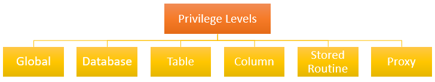

# SQL in MySQL/MariaDB - Parte 4

- [SQL in MySQL/MariaDB - Parte 4](#sql-in-mysqlmariadb---parte-4)
  - [DBMS e sicurezza](#dbms-e-sicurezza)
    - [Accesso al server fisico che ospita il servizio DBMS](#accesso-al-server-fisico-che-ospita-il-servizio-dbms)
    - [Accesso al DBMS server e allo schema logico della base dei dati](#accesso-al-dbms-server-e-allo-schema-logico-della-base-dei-dati)
      - [Cambiare la password di `root`](#cambiare-la-password-di-root)
      - [Creazione di utenti](#creazione-di-utenti)
        - [Creazione di utenti per DBMS Server in container Docker](#creazione-di-utenti-per-dbms-server-in-container-docker)
      - [Cancellare un utente - DROP USER](#cancellare-un-utente---drop-user)
      - [Cambiare la password di un utente](#cambiare-la-password-di-un-utente)
      - [Visualizzare gli utenti in MySQL/MariaDb - uso di `mysql.user`](#visualizzare-gli-utenti-in-mysqlmariadb---uso-di-mysqluser)
      - [Visualizzare gli utenti in MariaDb - uso di `mysql.global_priv` (Solo in MariaDb)](#visualizzare-gli-utenti-in-mariadb---uso-di-mysqlglobal_priv-solo-in-mariadb)
      - [I privilegi di accesso del Server di MySQL/MariaDB](#i-privilegi-di-accesso-del-server-di-mysqlmariadb)
      - [Gestione degli utenti e dei privilegi - Account Management Statements](#gestione-degli-utenti-e-dei-privilegi--account-management-statements)
        - [I comandi DCL (Data Control Language)](#i-comandi-dcl-data-control-language)
          - [Il comando GRANT](#il-comando-grant)
          - [Visualizzare i permessi per unn utente](#visualizzare-i-permessi-per-unn-utente)
          - [Il comando REVOKE](#il-comando-revoke)
        - [Esempi di privilegi assegnati ad utenti](#esempi-di-privilegi-assegnati-ad-utenti)
    - [information\_schema](#information_schema)

## DBMS e sicurezza

I moderni DBMS, come MySQL, permettono di gestire la sicurezza in un ambiente multiutente. Si possono distinguere diversi livelli di accesso ai dati gestiti da un DBMS:

- Accesso al server fisico che ospita il servizio DBMS
- Accesso al DBMS server e allo schema logico della base dei dati;
- Accesso ai file fisici del database

Sono tre "sbarramenti" successivi che un utente deve superare per accedere ai dati presenti nel DBMS

### Accesso al server fisico che ospita il servizio DBMS

L’accesso al server fisico che ospita il servizio DBMS può essere:

- Affidato al sistema operativo su cui è installato il DBMS Server
- Gestito in modo autonomo dal fornitore di servizio (Ad esempio Azure, Oracle, Google, Etc.), quando l'operatività del DBMS server è fornita come servizio[^1], in un contesto di ([SaaS - Software as A Service](https://www.redhat.com/it/topics/cloud-computing/what-is-saas)).

### Accesso al DBMS server e allo schema logico della base dei dati

Per poter interagire con un DBMS Server occorre, prima di tutto, essere autenticati sul DBMS Server e successivamente essere autorizzati ad operare su un determinato database.

Negli esempi precedenti, l'accesso al DBMS Server è stato effettuato con l'account amministrativo `root` che è un account con privilegi massimi su tutto il DBMS Server e su tutti i database creati.

In generale, non è mai una buona idea utilizzare l'account `root` in contesti di produzione e vale la solita regola, nota come *"Principio del minimo privilegio"*, ossia che *"un utente dovrebbe avere i privilegi minimi che gli consentano di effettuare gli accessi e le operazioni a cui ha diritto"*

Utilizzare un account di tipo super amministrativo per la connessione di una applicazione ad un DBMS Server può essere un gravissimo rischio per la sicurezza, poiché in caso di attacco da parte di un hacker che si impossessa delle credenziali di `root` sarebbero compromessi tutti i database gestiti dal DBMS server.

#### Cambiare la password di `root`

Cambiare la password di root per il localhost può essere fatto con l'istruzione:

```sql
ALTER USER 'root'@localhost IDENTIFIED BY 'root-password';
FLUSH PRIVILEGES;
```

> :memo: **Nota**: lo stesso `user_name` potrebbe avere permessi diversi a seconda dell'host da cui si connette. Ad esempio, l'utente `root` potrebbe avere privilegi massimi quando si connette da `localhost`, ma privilegi inferiori quando si connette da un host diverso, specificato mediante un indirizzo IP, oppure un nome DNS.
>
> :warning: **Attenzione**: Dalla versione 10.4 di MariaDB in poi `mysql.user` è una view ed è sostituita dalla tabella `mysql.global_priv`. In MySQL invece `mysql.user` è una tabella e la tabella `mysql.global_priv` non esiste. Per verificarlo basta eseguire (come utente root) il comando:
>
> ```sql
> SHOW FULL TABLES FROM mysql;
> -- In MariaDB e in MySQL si otterranno risultati diversi
> ```

Per cambiare le password bisogna sempre usare il comando `ALTER USER`

#### Creazione di utenti

[MySQL Tutorial - CREATE USER](https://www.mysqltutorial.org/mysql-administration/mysql-create-user/)

[MariaDB Knowledge Base](https://mariadb.com/kb/en/create-user/)

[MySQL Manual](https://dev.mysql.com/doc/refman/9.0/en/create-user.html)

Dopo aver cambiato la password di `root`, per migliorare la sicurezza delle applicazioni che utilizzano il DBMS Server è assolutamente necessario creare nuovi utenti per l’accesso ai database presenti nel catalogo del DBMS.

> :warning::fire: **Attenzione!**: Non utilizzare **MAI** l’utente `root` per accedere al database durante il normale funzionamento di un applicazione che utilizza il DBMS Server!

La creazione di un utente in MySQL/MariaDB può essere effettuata mediante il comando `CREATE USER`:

```sql
CREATE USER [IF NOT EXISTS] account_name 
IDENTIFIED BY 'password';
```

In generale `account_name` è definito come `'user_name'@'host_name'`. Ad esempio, per creare un account che si possa connettere da `localhost` al database `dbscuola` si può utilizzare l'istruzione:

```sql
CREATE USER 'dbscuola_user'@'localhost' IDENTIFIED BY 'lapassword';
```

##### Creazione di utenti per DBMS Server in container Docker

Se si utilizza un container Docker per far eseguire il server di MySQL o di MariaDB l'account `dbscuola_user@localhost` non funzionerà per connessioni che non avvengano direttamente dall'interno del container. In altri termini, per connettersi al DBMS Server si dovrebbe effettuare una connessione direttamente dal container con un comando del tipo:

```sh
docker exec -it nome-server /bin/bash 
 # e poi dall'interno del container eseguire il comando:
mariadb -u dbscuola_user -h localhost -p 
# oppure
mariadb -u dbscuola_user -p
# nel caso di MySQL si dovrebbe usare:
mysql -u dbscuola_user -h localhost -p
# oppure 
mysql -u dbscuola_user -p
```

Per creare un account che si possa connettere al server di MariaDB o di MySQL dall'esterno del container si può procedere come segue:

- **Opzione 1**: si crea un account che si possa connettere da qualunque host (come accade alla configurazione di di default di dell'utente root nel container di MariaDB o di MySQL)

    ```sql
    CREATE USER 'dbscuola_user_omni'@'%' IDENTIFIED BY 'lapassword';
    ```

- **Opzione 2**: si crea un account che si possa connettere da un host specifico di cui si conosce l'indirizzo IP, oppure il nome di dominio DNS.
  
  Se la connessione dovesse avvenire da un altro container Docker della stessa subnet, si può utilizzare l'indirizzo IP, oppure il nome del container da cui deve essere effettuato l'accesso al DBMS Server.

  Se le connessione dovesse avvenire dal Docker host (ad esempio dalla WSL Ubuntu), allora la configurazione diventa più complessa perché bisogna aver ben chiaro il funzionamento del networking di Docker. In tal caso, supponendo di utilizzare una rete di tipo `bridge`, la connessione dal Docker host verso i container del Docker engine avviene attraverso il NAT/Firewall di Docker: i pacchetti IP che dall'host (WSL Ubuntu) vengono spediti verso i container subiscono un'operazione di NAT (Network Address Translation) ad opera del bridge. Infatti, in una rete di tipo **bridge** in Docker, ogni container ottiene un indirizzo IP all'interno di quella rete privata.

  Quando un pacchetto arriva al container da una macchina esterna al **bridge** (ad esempio dall' host o da un'altra macchina sulla rete esterna), Docker usa il **Network Address Translation (NAT)** per tradurre l'indirizzo IP di origine. Quindi, nel caso in cui ci si connetta dall'esterno (ad esempio dall'host) al container che esegue MySQL/MariaDb, il server MySQL/MariaDb vedrà l'indirizzo del Gateway della rete bridge come indirizzo sorgente dei pacchetti, non l'indirizzo della macchina esterna.

  Per ottenere l'indirizzo IP del Gateway della rete a cui sono connessi i container è possibile usare il comando `docker inspect` in combinazione con il comando `jp` (nella WSL Ubuntu).

  Supponendo che la bridge network di Docker si chiami `my-net`, è possibile ottenere l'indirizzo IP del Gateway con il comando:
  
  ```sh
  gateway_ip=docker network inspect my-net | jq - r '.[0].IPAM.Config[0].Gateway'
  echo $gateway_ip
  172.18.0.1 
  ```

  Con l'indirizzo IP del Gateway è possibile creare l'account di mysql/mariadb come segue

  ```sql
  CREATE USER 'dbscuola_user_gateway'@'172.18.0.1' IDENTIFIED BY 'lapassword';
  ```

#### Cancellare un utente - DROP USER

Per cancellare un utente si può utilizzare il comando:

```sql
DROP USER [IF EXISTS] account_name1, [account_name2]...;
-- account_name è nella forma user_name@host_name
```

#### Cambiare la password di un utente

Il DBMS server MySQL e MariaDB memorizzano gli account e i permessi in un database di sistema chiamato `mysql`. In questo database c’è una tabella (nelle ultime versione di MySQL e MariaDB è una view) `user`, dove sono elencati gli utenti con le rispettive password criptate oltre ad altre informazioni.

Il comando per modificare la password di un utente, ed in particolare quella dell'utente `root`, è [ALTER USER](https://dev.mysql.com/doc/refman/9.0/en/alter-user.html):

```sql
ALTER USER user_name@hostname IDENTIFIED BY 'auth_string';
FLUSH PRIVILEGES;
```

Nell'istruzione precedente user è specificato nella forma `user_name@host_name`, dove `host_name` identifica l'host da cui `user_name` si connette.

#### Visualizzare gli utenti in MySQL/MariaDb - uso di `mysql.user`

```sql
-- in MariaDB
SELECT User, Password, Host FROM mysql.user;
-- in MySQL/MariaDB
SELECT User, authentication_string, Host FROM mysql.user;

```

In MariaDB in un container Docker si potrebbe ottenere un risultato come il seguente:

| User        | Password                                  | Host      |
|-------------|-------------------------------------------|-----------|
| mariadb.sys |                                           | localhost |
| root        | *81F5E21E35407D884A6CD4A731AEBFB6AF209E1B | localhost |
| root        | *81F5E21E35407D884A6CD4A731AEBFB6AF209E1B | %         |
| healthcheck | *0C3708B30A8CFC10BB603CCCE0BAA348B2ABBBD0 | 127.0.0.1 |
| healthcheck | *0C3708B30A8CFC10BB603CCCE0BAA348B2ABBBD0 | ::1       |
| healthcheck | *0C3708B30A8CFC10BB603CCCE0BAA348B2ABBBD0 | localhost |

> :memo: Le password non sono memorizzate in chiaro, ma viene utilizzato un algoritmo di hashing, ad esempio SHA2 per memorizzare l'hash della password. In questo modo nessuno è a conoscenza della password di ciascun utente, ad eccezione dell'utente stesso.
>
> Quando viene inserita la password in chiaro per connettersi al DBMS viene calcolato h'hash della password in chiaro e viene fatto un confronto con il valore memorizzato nella tabella/view `mysql.user`.

#### Visualizzare gli utenti in MariaDb - uso di `mysql.global_priv` (Solo in MariaDb)

È anche possibile interrogare la tabella `mysql.global_priv` con una query come quella riportata di seguito:

```sql
-- in MariaDB
SELECT Host, User, JSON_EXTRACT(Priv, "$.authentication_string") AS Password 
FROM mysql.global_priv;
```

In MariaDB in un container Docker si potrebbe ottenere un risultato come il seguente:

| Host      | User        | Password                                    |
|-----------|-------------|---------------------------------------------|
| localhost | mariadb.sys | ""                                          |
| localhost | root        | "*81F5E21E35407D884A6CD4A731AEBFB6AF209E1B" |
| %         | root        | "*81F5E21E35407D884A6CD4A731AEBFB6AF209E1B" |
| 127.0.0.1 | healthcheck | "*0C3708B30A8CFC10BB603CCCE0BAA348B2ABBBD0" |
| ::1       | healthcheck | "*0C3708B30A8CFC10BB603CCCE0BAA348B2ABBBD0" |
| localhost | healthcheck | "*0C3708B30A8CFC10BB603CCCE0BAA348B2ABBBD0" |

Nella seconda query si è usata la funzione [`JSON_EXTRACT`](https://dev.mysql.com/doc/refman/9.0/en/json-search-functions.html) per recuperare un campo all’interno di una stringa JSON  

#### I privilegi di accesso del Server di MySQL/MariaDB

MySQL e MariaDB utilizzano un meccanismo di privilegi di accesso per limitare l’accesso a certi specifici comandi su specifiche tabelle di un dato database.

Ogni utente di MySQL/MariaDB può avere specifici privilegi su specifici database da specifici hosts (computers) da cui è connesso.

> :warning: L’utente `root` di MySQL/MariaDB può eseguire qualsiasi operazione all’interno del DBMS.

Quando un utente tenta di fare qualcosa con il DBMS server, MySQL/MariaDB server, prima di tutto, controlla se l’utente ha il privilegio di connettersi al server:

- controlla che `user_name` e `host` siano presenti in una riga  della tabella/view `user`, e in caso affermativo, che la password fornita dall’utente coincida con quella memorizzata in corrispondenza di `user` e `host`.

Se un utente ha il privilegio di connettersi al DBMS server dal computer host specificato, /MariaDB controlla se l’utente ha il privilegio di lanciare specifici comandi su specifici database. Ad esempio, se un utente connesso al DBMS server tenta di effettuare una `SELECT`, oppure una `INSERT`, oppure una `CREATE` su un certo database, MySQL/MariaDB prima di lanciare il comando, verifica se l’utente ha i diritti (privilegi) per poterlo fare.

MySQL/MariaDB determina i permessi usando le tabelle db, host, user, tables_priv, columns_priv del database mysql.

Per vedere i privilegi di un utente (ad esempio dell’utente `root`)  ci si può connettere come `root` da terminale e inserire i comandi:

```sql
use mysql;
SELECT * FROM user WHERE User = 'root’\G
```

È ovvio che solo l’utente `root` deve poter accedere al database `mysql`

#### Gestione degli utenti e dei privilegi - Account Management Statements

##### I comandi DCL (Data Control Language)

- `GRANT`
- `DENY` (definito dallo standard, ma non presente in MySQL)
- `REVOKE` (revoca i permessi concessi con GRANT)

###### Il comando GRANT

[MySQL Tutorial - comando GRANT](https://www.mysqltutorial.org/mysql-administration/mysql-grant/). Il comando `GRANT` permette di assegnare dei permessi (privilegi) ad un dato utente su una specifica risorsa. I privilegi possono essere dati a vari livelli (globali, database, tabella, ect), secondo lo schema riportato nella figura seguente:



La sintassi del comando `GRANT` è riportata negli esempi seguenti, nei quali si assume che l'utente `dbscuola_user@localhost` sia già stato creato con il comando :

- Privilegi globali:
  
  ```sql
  GRANT SELECT 
    ON *.* 
    TO dbscuola_user@localhost;
  ```

- Privilegi su uno specifico database:
  
  ```sql
    GRANT INSERT 
    ON dbscuola.* 
    TO dbscuola_user@localhost;
  ```

- Privilegi su una specifica tabella:
  
  ```sql
    GRANT DELETE 
    ON dbscuola.studenti 
    TO dbscuola_user@localhost;
  ```

- Privilegi su colonne specifiche:
  
  ```sql
    GRANT 
    SELECT (Matricola,Cognome,Nome,EMail), 
    UPDATE(Cognome) 
    ON dbscuola 
    TO dbscuola_user@localhost;
  ```

In generale:

```sql
GRANT privileges ON db_name.table TO 'username'@'hostname'  [WITH GRANT OPTION];
-- oppure
GRANT privileges ON *.* TO 'username'@'hostname'  [WITH GRANT OPTION];

```

`privileges` : può essere una lista di privilegi specifici come `SELECT`,`INSERT`,`UPDATE`,`DELETE`,`CREATE`,`DROP`,`ALTER` etc. oppure può essere `ALL` per permettere tutto su `db_name.table` .
Se si indica db_name.* i privilegi sono applicati a tutte le tabelle del database db_name, anche a quelle che verranno create in seguito.

È anche possibile specificare `*.*` per assegnare i privilegi su tutte le tabelle di tutti i database (non prudente).

`GRANT OPTION` permette di dare ad altri utenti i permessi che un utente ha.

È anche possibile limitare l’accesso al DB server da un particolare host:

- può essere il computer/VM/container sul quale è in esecuzione MySQL server (localhost)
- computer/VM/container dal quale l’applicazione client accede al server.

`hostname` può essere il nome di rete del computer oppure il suo indirizzo IP o una sottorete IP. Se si utilizza `%` come hostname si abilita l’accesso da qualsiasi host.

Esempi:

```sql
GRANT ALL ON my_db.* TO 'some_user'@'some_host'; 

GRANT SELECT, INSERT ON my_db.* TO 'some_user'@'some_host'; 

-- 'user_name'@'%.example.com' si applica a user_name per ogni host nel dominio example.com

-- user_name@'192.168.1.%' si applica a user_name per ogni host nella 192.168.1 class C subnet. 

-- user_name non seguito da nulla è sinonimo di user_name@'%'
```

###### Visualizzare i permessi per unn utente

```sql
SHOW GRANTS FOR user_name;
```

###### Il comando REVOKE

[MySQL Tutorial - REVOKE](https://www.mysqltutorial.org/mysql-administration/mysql-revoke/)

[MariaDB](https://mariadb.com/kb/en/revoke/)

[MySQL Manual](https://dev.mysql.com/doc/refman/9.0/en/revoke.html)

Il comando `REVOKE` consente di revocare i permessi precedentemente assegnati ad un utente. La sintassi del comando è:

```sql
REVOKE privilege [,privilege]..
ON [object_type] privilege_level
FROM user1 [, user2] ..;
```

È anche possibile revocare tutti i privilegi assegnati ad un utente con il comando:

```sql
REVOKE ALL PRIVILEGES, GRANT OPTION FROM user [, user2];
```

##### Esempi di privilegi assegnati ad utenti

```sql
-- crea un utente senza privilegi
CREATE USER 'jeffrey'@'localhost' IDENTIFIED BY 'my_password';  
-- assegna tutti i privilegi su tutte le tabelle di db1 all'utente
GRANT ALL ON db1.* TO 'jeffrey'@'localhost'; 
-- assegna il permesso di SELECT sulla tabella invoice del database db2 all'utente
GRANT SELECT ON db2.invoice TO 'jeffrey'@'localhost'; 

CREATE USER IF NOT EXISTS 'dbscuola_user_omni'@'%' IDENTIFIED BY 'lapassword';
GRANT SELECT, INSERT, UPDATE ON dbscuola.* TO 'dbscuola_user'@'localhost';
ALTER USER 'dbscuola_user'@'localhost’  WITH MAX_QUERIES_PER_HOUR 100 MAX_CONNECTIONS_PER_HOUR 10;
```

### information_schema

[Manuale di MySQL](https://dev.mysql.com/doc/refman/9.0/en/information-schema.html)

<cite>`information_schema` is a database within each MySQL instance, the place that stores information about all the other databases that the MySQL server maintains. The `information_schema` database contains several read-only tables. They are actually views, not base tables, so there are no files associated with them, and you cannot set triggers on them. Also, there is no database directory with that name. You can only read the contents of tables, not perform `INSERT`, `UPDATE`, or `DELETE` operations on them. Here is an example of a statement that retrieves information from `information_schema`:</cite>

```sql
SELECT table_name, table_type, engine
    FROM information_schema.tables
    WHERE table_schema = 'dbscuola'
    ORDER BY table_name;
-- oppure
SELECT *
    FROM information_schema.tables
    WHERE table_schema = 'dbscuola'
    ORDER BY table_name\G
```

[^1]: [Servizi cloud: Confronto tra IaaS, PaaS e SaaS - documentazione di RedHat](https://www.redhat.com/it/topics/cloud-computing/iaas-vs-paas-vs-saas)
