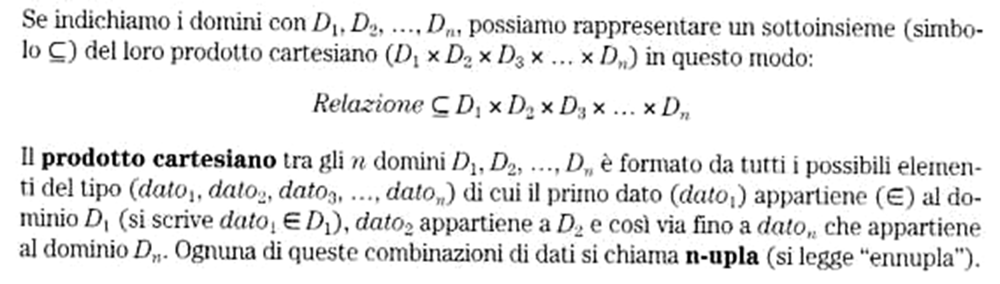
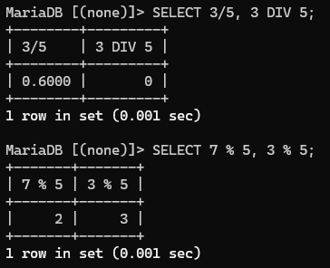
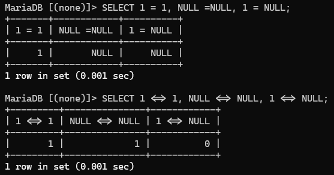
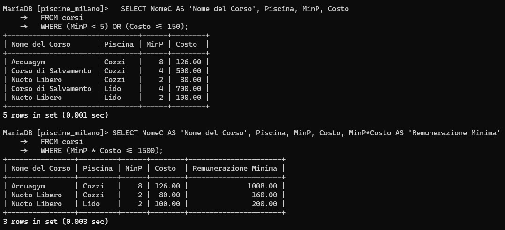
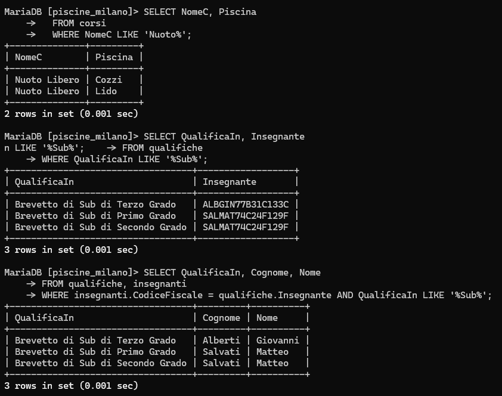
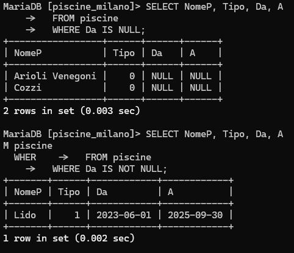
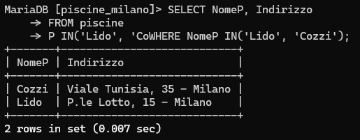
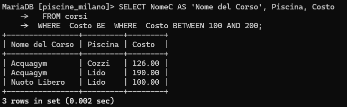
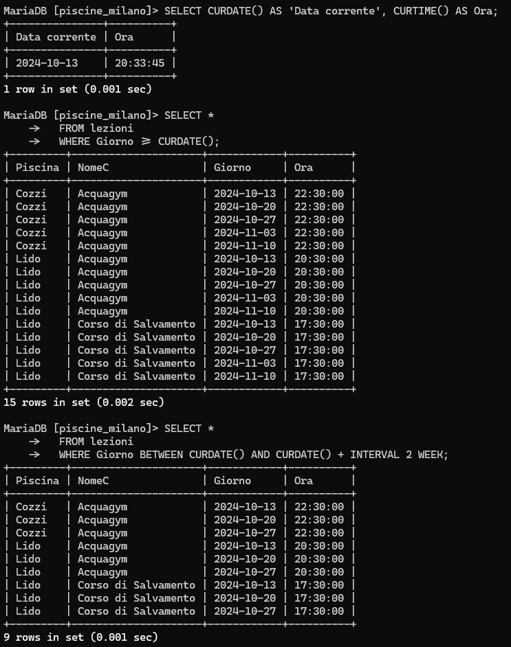
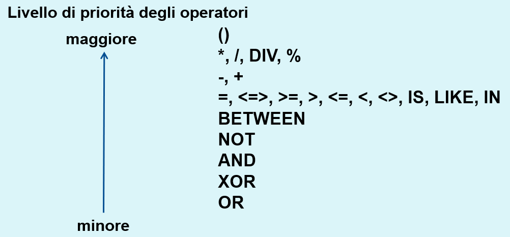

# SQL in MySQL/MariaDB - Parte 5

- [SQL in MySQL/MariaDB - Parte 5](#sql-in-mysqlmariadb---parte-5)
  - [Il database `piscine_milano`](#il-database-piscine_milano)
  - [Concetto di prodotto cartesiano](#concetto-di-prodotto-cartesiano)
    - [Esempio di prodotto cartesiano](#esempio-di-prodotto-cartesiano)
    - [Definizioni delle condizioni di ricerca dei dati in una query SQL](#definizioni-delle-condizioni-di-ricerca-dei-dati-in-una-query-sql)
    - [Operatori dell'SQL](#operatori-dellsql)
      - [Operatori di confronto](#operatori-di-confronto)
        - [Esempio di confronto](#esempio-di-confronto)
      - [Operatori logici](#operatori-logici)
        - [Esempio di uso di operatori logici](#esempio-di-uso-di-operatori-logici)
      - [Operatori speciali dell'SQL - `LIKE`, `NOT LIKE`](#operatori-speciali-dellsql---like-not-like)
        - [Esempi di uso di `LIKE` e `NOT LIKE`](#esempi-di-uso-di-like-e-not-like)
      - [Operatori speciali dell'SQL - `IS NULL`, `IS NOT NULL`](#operatori-speciali-dellsql---is-null-is-not-null)
        - [Esempi di uso di `IS NULL` e `IS NOT NULL`](#esempi-di-uso-di-is-null-e-is-not-null)
      - [Operatori speciali dell'SQL - `expr IN (value,...)`](#operatori-speciali-dellsql---expr-in-value)
        - [Esempio d'uso di `expr IN (value,...)`](#esempio-duso-di-expr-in-value)
      - [Operatori speciali dell'SQL - `expr BETWEEN min AND max`](#operatori-speciali-dellsql---expr-between-min-and-max)
        - [Esempio d'uso di `expr BETWEEN min AND max`](#esempio-duso-di-expr-between-min-and-max)
      - [Priorità degli operatori in SQL](#priorità-degli-operatori-in-sql)
      - [Operatore punto (`.`)](#operatore-punto-)

## Il database `piscine_milano`

In questo paragrafo si riporta la descrizione del database che verrà usato negli esempi delle sezioni seguenti sull'SQL.

Gestione delle piscine comunali di Milano

Si vuole rappresentare una base dati contenete le informazioni relative alle piscine gestite del comune di Milano, tenendo conto delle seguenti informazioni:

- *Le piscine sono identificate univocamente attraverso il nome (ad esempio Cozzi, Comunale, De Marchi, ecc). Per ciascuna sono inoltre noti l'indirizzo, un numero di telefono, ed il nome di un responsabile. Nel caso la piscina disponga anche di una vasca all'aperto, la base dati contiene l'informazione di quando tale vasca è utilizzabile (ad esempio da Marzo a Settembre, da Luglio ad Agosto, ecc.)*
- *Presso le piscine sono organizzati dei corsi; lo stesso tipo di corso può essere svolto presso piscine diverse, eventualmente con modalità differenti. Ciascun corso è pertanto identificato dal nome dell'attività svolta, quali Aerobica, Acquagym, Corso di Sincronizzato o corso per Gestanti, e dal nome della Piscina presso cui tale corso si svolge. Per ciascun corso, svolto presso una certa piscina, è noto il costo, il numero massimo e minimo di partecipanti, in quali giorni della settimana si svolge ed a che ora. Si ipotizzi che presso ciascuna piscina ogni corso sia svolto una sola volta al giorno, ma più volte durante la settimana.*
- *Il corpo insegnante lavora a rotazione presso le varie piscine. Per ciascun insegnante è noto il codice fiscale, che lo identifica, un nome, il numero di cellulare, se disponibile, e l'elenco delle qualifiche dell'insegnante (ad esempio istruttore di sub, istruttore di aerobica, ecc). All'interno della base dati si vuole tener traccia di tutti gli intervalli di tempo in cui un insegnante ha lavorato presso ciascuna piscina. Non si escluda che lo stesso insegnante possa aver lavorato presso una stessa piscina in intervalli di tempo diversi.*
- *Le piscine possono essere frequentate o da persone che sono iscritte ai corsi, o secondo la modalità ad ``ingresso singolo'' per svolgere nuoto libero (si noti che sono registrate per l'ingresso singolo solo le persone che non hanno mai frequentato corsi). Tutte le persone che accedono alle piscine comunali sono identificate attraverso il loro codice fiscale ed inoltre sono noti il nome, un indirizzo ed un numero di telefono.*
- *Le persone che sono iscritte ai corsi devono presentare un certificato medico. Pertanto, nel caso la persona sia iscritta ad un corso, il database contiene l'informazione del medico che ha redatto il certificato, la data in cui la persona ha presentato il certificato, l'età della persona, e l'elenco dei corsi a cui è iscritta. Per le persone che hanno fatto solo ingressi sono noti solo la data in cui è stato effettuato l'ultimo ingresso e presso quale piscina.*

Dopo un'analisi della realtà di interesse, sotto opportune ipotesi aggiuntive, che qui non sono riportate per il momento, si ha che il database è caratterizzato dalle seguenti tabelle:


Il database può essere creato a partire dallo [script](../../sql-scripts/02-piscine/Piscine-Milano-FW-engineering.sql) SQL seguente:

```sql
-- -----------------------------------------------------
-- Schema piscine_milano
-- -----------------------------------------------------
CREATE SCHEMA IF NOT EXISTS `piscine_milano`;
USE `piscine_milano` ;

-- -----------------------------------------------------
-- Table `piscine_milano`.`piscine`
-- -----------------------------------------------------
CREATE TABLE IF NOT EXISTS `piscine_milano`.`piscine` (
  `NomeP` VARCHAR(50) NOT NULL,
  `Indirizzo` VARCHAR(80) NOT NULL,
  `Telefono` CHAR(14) NULL DEFAULT NULL,
  `Responsabile` VARCHAR(80) NOT NULL,
  `Tipo` TINYINT NOT NULL DEFAULT '0',
  `Da` DATE NULL DEFAULT NULL,
  `A` DATE NULL DEFAULT NULL,
  PRIMARY KEY (`NomeP`))
ENGINE = InnoDB;


-- -----------------------------------------------------
-- Table `piscine_milano`.`corsi`
-- -----------------------------------------------------
CREATE TABLE IF NOT EXISTS `piscine_milano`.`corsi` (
  `Piscina` VARCHAR(50) NOT NULL,
  `NomeC` VARCHAR(50) NOT NULL,
  `MaxP` SMALLINT UNSIGNED NOT NULL DEFAULT '20',
  `MinP` SMALLINT UNSIGNED NOT NULL DEFAULT '10',
  `Costo` DECIMAL(8,2) NOT NULL,
  PRIMARY KEY (`Piscina`, `NomeC`),
  INDEX `Piscine` (`Piscina` ASC),
  CONSTRAINT `corsi_ibfk_1`
    FOREIGN KEY (`Piscina`)
    REFERENCES `piscine_milano`.`piscine` (`NomeP`))
ENGINE = InnoDB;


-- -----------------------------------------------------
-- Table `piscine_milano`.`persone`
-- -----------------------------------------------------
CREATE TABLE IF NOT EXISTS `piscine_milano`.`persone` (
  `CodiceFiscale` CHAR(16) NOT NULL,
  `Nome` VARCHAR(50) NOT NULL,
  `Cognome` VARCHAR(50) NOT NULL,
  `Telefono` CHAR(14) NULL DEFAULT NULL,
  `Via` VARCHAR(50) NULL DEFAULT NULL,
  `Civico` CHAR(6) NULL DEFAULT NULL,
  `CAP` CHAR(5) NULL DEFAULT NULL,
  `Citta` VARCHAR(40) NULL DEFAULT NULL,
  PRIMARY KEY (`CodiceFiscale`))
ENGINE = InnoDB;


-- -----------------------------------------------------
-- Table `piscine_milano`.`iscritti_corsi`
-- -----------------------------------------------------
CREATE TABLE IF NOT EXISTS `piscine_milano`.`iscritti_corsi` (
  `Persona` CHAR(16) NOT NULL,
  `DataNascita` DATE NOT NULL,
  `NomeMedico` VARCHAR(80) NOT NULL,
  `DataCertificato` DATE NOT NULL,
  PRIMARY KEY (`Persona`),
  CONSTRAINT `iscritti_corsi_ibfk_1`
    FOREIGN KEY (`Persona`)
    REFERENCES `piscine_milano`.`persone` (`CodiceFiscale`))
ENGINE = InnoDB;


-- -----------------------------------------------------
-- Table `piscine_milano`.`frequenta_corsi`
-- -----------------------------------------------------
CREATE TABLE IF NOT EXISTS `piscine_milano`.`frequenta_corsi` (
  `Persona` CHAR(16) NOT NULL,
  `NomeC` VARCHAR(50) NOT NULL,
  `Piscina` VARCHAR(50) NOT NULL,
  PRIMARY KEY (`Persona`, `NomeC`, `Piscina`),
  INDEX `Corso` (`Piscina` ASC, `NomeC` ASC),
  INDEX `Persona` (`Persona` ASC),
  CONSTRAINT `frequenta_corsi_ibfk_1`
    FOREIGN KEY (`Piscina` , `NomeC`)
    REFERENCES `piscine_milano`.`corsi` (`Piscina` , `NomeC`),
  CONSTRAINT `frequenta_corsi_ibfk_2`
    FOREIGN KEY (`Persona`)
    REFERENCES `piscine_milano`.`iscritti_corsi` (`Persona`))
ENGINE = InnoDB;


-- -----------------------------------------------------
-- Table `piscine_milano`.`ingressi_singoli`
-- -----------------------------------------------------
CREATE TABLE IF NOT EXISTS `piscine_milano`.`ingressi_singoli` (
  `Persona` CHAR(16) NOT NULL,
  `DataUltimoIng` DATE NOT NULL,
  `Piscina` VARCHAR(50) NOT NULL,
  PRIMARY KEY (`Persona`),
  INDEX `Piscina` (`Piscina` ASC),
  CONSTRAINT `ingressi_singoli_ibfk_1`
    FOREIGN KEY (`Persona`)
    REFERENCES `piscine_milano`.`persone` (`CodiceFiscale`),
  CONSTRAINT `ingressi_singoli_ibfk_2`
    FOREIGN KEY (`Piscina`)
    REFERENCES `piscine_milano`.`piscine` (`NomeP`))
ENGINE = InnoDB;


-- -----------------------------------------------------
-- Table `piscine_milano`.`insegnanti`
-- -----------------------------------------------------
CREATE TABLE IF NOT EXISTS `piscine_milano`.`insegnanti` (
  `CodiceFiscale` CHAR(16) NOT NULL,
  `Cognome` VARCHAR(50) NOT NULL,
  `Nome` VARCHAR(50) NOT NULL,
  `Cellulare` CHAR(14) NULL DEFAULT NULL,
  PRIMARY KEY (`CodiceFiscale`))
ENGINE = InnoDB;


-- -----------------------------------------------------
-- Table `piscine_milano`.`lezioni`
-- -----------------------------------------------------
CREATE TABLE IF NOT EXISTS `piscine_milano`.`lezioni` (
  `Piscina` VARCHAR(50) NOT NULL,
  `NomeC` VARCHAR(50) NOT NULL,
  `Giorno` DATE NOT NULL,
  `Ora` TIME NOT NULL,
  PRIMARY KEY (`Piscina`, `NomeC`, `Giorno`),
  INDEX `Corsi` (`Piscina` ASC, `NomeC` ASC),
  CONSTRAINT `lezioni_ibfk_1`
    FOREIGN KEY (`Piscina` , `NomeC`)
    REFERENCES `piscine_milano`.`corsi` (`Piscina` , `NomeC`))
ENGINE = InnoDB;


-- -----------------------------------------------------
-- Table `piscine_milano`.`qualifiche`
-- -----------------------------------------------------
CREATE TABLE IF NOT EXISTS `piscine_milano`.`qualifiche` (
  `QualificaIn` VARCHAR(50) NOT NULL,
  `Insegnante` CHAR(16) NOT NULL,
  PRIMARY KEY (`QualificaIn`, `Insegnante`),
  INDEX `Insegnante` (`Insegnante` ASC),
  CONSTRAINT `qualifiche_ibfk_1`
    FOREIGN KEY (`Insegnante`)
    REFERENCES `piscine_milano`.`insegnanti` (`CodiceFiscale`))
ENGINE = InnoDB;


-- -----------------------------------------------------
-- Table `piscine_milano`.`rotazioni`
-- -----------------------------------------------------
CREATE TABLE IF NOT EXISTS `piscine_milano`.`rotazioni` (
  `Insegnante` CHAR(16) NOT NULL,
  `Piscina` VARCHAR(50) NOT NULL,
  `DataIniziale` DATE NOT NULL,
  `DataFinale` DATE NULL DEFAULT NULL,
  PRIMARY KEY (`Insegnante`, `Piscina`, `DataIniziale`),
  INDEX `Piscina` (`Piscina` ASC),
  INDEX `Insegnante` (`Insegnante` ASC),
  CONSTRAINT `rotazioni_ibfk_1`
    FOREIGN KEY (`Insegnante`)
    REFERENCES `piscine_milano`.`insegnanti` (`CodiceFiscale`),
  CONSTRAINT `rotazioni_ibfk_2`
    FOREIGN KEY (`Piscina`)
    REFERENCES `piscine_milano`.`piscine` (`NomeP`))
ENGINE = InnoDB;
```

Il database `piscine_milano` può essere popolato con questo [script](../../sql-scripts/02-piscine/Piscine-Milano-INSERIMENTO_DATI.sql).

## Concetto di prodotto cartesiano

Definizione di prodotto cartesiano:



Il prodotto cartesiano di due (o più) tabelle è una nuova tabella costituita da tutte le possibili combinazioni senza ripetizioni tra le righe delle tabelle di partenza.

Il prodotto cartesiano tra due tabelle `A` e `B` si indica con `A x B`

> :memo: **Nota**: nel prodotto cartesiano si parla di `ennupla`, nelle quali l’ordine degli attributi è rilevante. Nella teoria relazionale si parla di `tuple`, per le quali l’ordine degli attributi non è rilevante.

Se nella clausola `FROM` di una query SQL compaiono due o più tabelle, l’interrogazione è eseguita da un DBMS secondo il seguente ordine:

1. **Effettuando il prodotto cartesiano tra le tabelle** ( definito dall’insieme di tutte le possibili combinazioni senza ripetizioni tra le righe)
2. **Selezionando tutte le righe ed effettuando la *proiezione* sulle colonne elencate dopo la `SELECT`**.

### Esempio di prodotto cartesiano

Consideriamo le seguenti tabelle:

Tabella `insegnanti` (2 righe. 4 colonne):

```sql
SELECT * FROM insegnanti;
```

| CodiceFiscale    | Cognome | Nome     | Cellulare  |
|------------------|---------|----------|------------|
| ALBGIN77B31C133C | Alberti | Giovanni | NULL       |
| SALMAT74C24F129F | Salvati | Matteo   | 3471824234 |

Tabella `qualifiche` (5 righe. 2 colonne):

```sql
SELECT * FROM qualifiche;
```

| QualificaIn                      | Insegnante       |
|----------------------------------|------------------|
| Bagnino di Salvataggio           | ALBGIN77B31C133C |
| Brevetto di Sub di Terzo Grado   | ALBGIN77B31C133C |
| Bagnino di Salvataggio           | SALMAT74C24F129F |
| Brevetto di Sub di Primo Grado   | SALMAT74C24F129F |
| Brevetto di Sub di Secondo Grado | SALMAT74C24F129F |

Il loro prodotto cartesiano è la tabella di 2*5 righe e 4+2 colonne riportata di seguito:

```sql
SELECT * FROM insegnanti, qualifiche;
```

| CodiceFiscale    | Cognome | Nome     | Cellulare  | QualificaIn                      | Insegnante       |
|------------------|---------|----------|------------|----------------------------------|------------------|
| ALBGIN77B31C133C | Alberti | Giovanni | NULL       | Bagnino di Salvataggio           | ALBGIN77B31C133C |
| SALMAT74C24F129F | Salvati | Matteo   | 3471824234 | Bagnino di Salvataggio           | ALBGIN77B31C133C |
| ALBGIN77B31C133C | Alberti | Giovanni | NULL       | Brevetto di Sub di Terzo Grado   | ALBGIN77B31C133C |
| SALMAT74C24F129F | Salvati | Matteo   | 3471824234 | Brevetto di Sub di Terzo Grado   | ALBGIN77B31C133C |
| ALBGIN77B31C133C | Alberti | Giovanni | NULL       | Bagnino di Salvataggio           | SALMAT74C24F129F |
| SALMAT74C24F129F | Salvati | Matteo   | 3471824234 | Bagnino di Salvataggio           | SALMAT74C24F129F |
| ALBGIN77B31C133C | Alberti | Giovanni | NULL       | Brevetto di Sub di Primo Grado   | SALMAT74C24F129F |
| SALMAT74C24F129F | Salvati | Matteo   | 3471824234 | Brevetto di Sub di Primo Grado   | SALMAT74C24F129F |
| ALBGIN77B31C133C | Alberti | Giovanni | NULL       | Brevetto di Sub di Secondo Grado | SALMAT74C24F129F |
| SALMAT74C24F129F | Salvati | Matteo   | 3471824234 | Brevetto di Sub di Secondo Grado | SALMAT74C24F129F |

Eseguendo la query:

```sql
SELECT Cognome, Nome, QualificaIn AS 'Qualifiche Possedute' FROM qualifiche, insegnanti;
```

Si ottiene:

| Cognome | Nome     | Qualifiche Possedute             |
|---------|----------|----------------------------------|
| Alberti | Giovanni | Bagnino di Salvataggio           |
| Salvati | Matteo   | Bagnino di Salvataggio           |
| Alberti | Giovanni | Brevetto di Sub di Terzo Grado   |
| Salvati | Matteo   | Brevetto di Sub di Terzo Grado   |
| Alberti | Giovanni | Bagnino di Salvataggio           |
| Salvati | Matteo   | Bagnino di Salvataggio           |
| Alberti | Giovanni | Brevetto di Sub di Primo Grado   |
| Salvati | Matteo   | Brevetto di Sub di Primo Grado   |
| Alberti | Giovanni | Brevetto di Sub di Secondo Grado |
| Salvati | Matteo   | Brevetto di Sub di Secondo Grado |

> :warning: **Attenzione**: si notino le righe ripetute.

Usando la clausola `DISTINCT` nella precedente query, non si hanno query ripetute:

```sql
SELECT DISTINCT Cognome, Nome, QualificaIn AS 'Qualifiche Possedute' FROM qualifiche, insegnanti;
```

Il risultato è:

| Cognome | Nome     | Qualifiche Possedute             |
|---------|----------|----------------------------------|
| Alberti | Giovanni | Bagnino di Salvataggio           |
| Salvati | Matteo   | Bagnino di Salvataggio           |
| Alberti | Giovanni | Brevetto di Sub di Terzo Grado   |
| Salvati | Matteo   | Brevetto di Sub di Terzo Grado   |
| Alberti | Giovanni | Brevetto di Sub di Primo Grado   |
| Salvati | Matteo   | Brevetto di Sub di Primo Grado   |
| Alberti | Giovanni | Brevetto di Sub di Secondo Grado |
| Salvati | Matteo   | Brevetto di Sub di Secondo Grado |

La clausola `DISTINCT` permette di avere solo tuple distinte restituite dalla query.

È anche possibile ordinare i dati …

```sql
SELECT DISTINCT Cognome, Nome, QualificaIn AS 'Qualifiche Possedute' FROM qualifiche, insegnanti ORDER BY Cognome, Nome, QualificaIn;
```

Si ottiene la seguente tabella:

| Cognome | Nome     | Qualifiche Possedute             |
|---------|----------|----------------------------------|
| Alberti | Giovanni | Bagnino di Salvataggio           |
| <span style="background:red">Alberti</span> | <span style="background:red">Giovanni</span> | <span style="background:red">Brevetto di Sub di Primo Grado</span>   |
| <span style="background:red">Alberti</span> | <span style="background:red">Giovanni</span> | <span style="background:red">Brevetto di Sub di Secondo Grado</span> |
| Alberti | Giovanni | Brevetto di Sub di Terzo Grado   |
| Salvati | Matteo   | Bagnino di Salvataggio           |
| Salvati | Matteo   | Brevetto di Sub di Primo Grado   |
| Salvati | Matteo   | Brevetto di Sub di Secondo Grado |
| <span style="background:red">Salvati</span> | <span style="background:red">Matteo</span>   | <span style="background:red">Brevetto di Sub di Terzo Grado</span>   |

> :boom: :warning: **Osservazione importante**: **Nella tabella precedente in cui compaiono solo alcune colonne del prodotto cartesiano si hanno delle righe, quelle evidenziate in rosso, che non corrispondono a reali qualifiche possedute dagli insegnanti**. Ad esempio l’insegnante `Salvati Matteo` possiede solo il `brevetto di Bagnino di Salvataggio` e di `Primo` e `Secondo Grado` ma non anche quello di `Terzo Grado`.
Il problema nasce dal fatto che il prodotto cartesiano non fa alcun controllo sulle righe, ma si limita a considerare tutte le possibili combinazioni. Vedremo che **per ottenere i risultati attesi si definisce un’altra operazione sulle tabelle chiamata JOIN**.

### Definizioni delle condizioni di ricerca dei dati in una query SQL

Se in una query compare la clausola `WHERE`:

```sql
SELECT <ElencoColone>
FROM <ElencoTabelle>
WHERE <CondizioneDiRicerca>
```

**L'interrogazione è eseguita da un DBMS nel seguente ordine**:

1. Effettuando il prodotto cartesiano tra le tabelle dichiarate dopo la clausola `FROM`
2. Cercando nella tabella prodotto tutte le righe che soddisfano la condizione di ricerca posta dopo la clausola `WHERE`
3. Visualizzando nella tabella risultato le colonne scritte dopo la parola chiave `SELECT`

La `<CondizioneDiRicerca>`  è un’espressione logica in SQL, ossia un'espressione costituita da nomi di colonne, costanti, espressioni aritmetiche e da operatori che restituisce un valore booleano.

### Operatori dell'SQL

Operatori aritmetici: `*`, `/`, `DIV`, `%`, `-`, `+`

- `DIV` è la divisione intera, mentre `/` è la divisione reale
- `%` è il resto della divisione intera



#### Operatori di confronto

Operatori di confronto:

- `=`:arrow_right: `uguale`
- `<=>`:arrow_right: (`NULL SAFE`)

La differenza tra `=` e `<=>` si ha con riferimento ai valori nulli. Infatti se uno degli operandi è `NULL` l’operatore `=` restituisce `NULL`, mentre l’operatore `<=>` restituisce un valore booleano (`0, 1`)

- `>=` :arrow_right: `maggiore o uguale`
- `>` :arrow_right: `maggiore`
- `<=` :arrow_right: `minore o uguale`
- `<` :arrow_right: `minore`
- `<>` :arrow_right: `diverso`



##### Esempio di confronto

*Trovare gli iscritti ai corsi delle piscine con certificato medico scaduto (più vecchio di 1 anno)*.

L’elenco degli iscritti è :

```sql
SELECT * FROM iscritti_corsi;
```

| Persona          | DataNascita | NomeMedico          | DataCertificato |
|------------------|-------------|---------------------|-----------------|
| CRSALS90B24B347R | 2006-04-01  | Altobelli Giovanni  | 2023-07-03      |
| DGNMTT74B24C127R | 1990-02-21  | De Benedittis Carlo | 2024-08-03      |

Gli iscritti ai corsi con certificato scaduto si trovano così

```sql
SELECT Persona, DataCertificato 
FROM iscritti_corsi 
WHERE ((YEAR(CURDATE()) - YEAR(DataCertificato))  - (RIGHT(DataCertificato, 5) > RIGHT(CURDATE(), 5)) )>=1;
```

| Persona          | DataCertificato |
|------------------|-----------------|
| CRSALS90B24B347R | 2023-07-03      |

#### Operatori logici

`AND`, `OR`, `NOT`, `XOR`

##### Esempio di uso di operatori logici

*Trovare i corsi delle piscine di Milano con un costo compreso tra  100 e  200 EUR*.

Nel database sono presenti i seguenti corsi:

```sql
SELECT * FROM corsi;
```

| Piscina | NomeC               | MaxP | MinP | Costo  |
|---------|---------------------|------|------|--------|
| Cozzi   | Acquagym            |   26 |    8 | 126.00 |
| Cozzi   | Corso di Salvamento |   10 |    4 | 500.00 |
| Cozzi   | Nuoto Libero        |   30 |    0 |  80.00 |
| Lido    | Acquagym            |   34 |    8 | 190.00 |
| Lido    | Corso di Salvamento |   10 |    4 | 700.00 |
| Lido    | Nuoto Libero        |   38 |    0 | 100.00 |

La query che restituisce il risultato atteso è:

```sql
SELECT NomeC AS 'Nome del Corso', Piscina, Costo 
  FROM corsi
  WHERE (Costo >= 100) AND (Costo <= 200);
```

| Nome del Corso | Piscina | Costo  |
|----------------|---------|--------|
| Acquagym       | Cozzi   | 126.00 |
| Acquagym       | Lido    | 190.00 |
| Nuoto Libero   | Lido    | 100.00 |

```sql
-- trovare i corsi con soglie minime troppo poco remunerative:
-- corsi che hanno un numero di iscritti minimo inferiore a 5, oppure un prezzo per persona inferiore a 150 EUR.
SELECT NomeC AS 'Nome del Corso', Piscina, MinP, Costo 
  FROM corsi
  WHERE (MinP < 5) OR (Costo <= 150);

-- trovare i corsi che hanno un prodotto MinP*Costo <= 1500

SELECT NomeC AS 'Nome del Corso', Piscina, MinP, Costo, MinP*Costo AS 'Remunerazione Minima' 
  FROM corsi
  WHERE (MinP * Costo <= 1500);
```



#### Operatori speciali dell'SQL - `LIKE`, `NOT LIKE`

Operatori speciali `LIKE`, `NOT LIKE`

- Operatore `LIKE` :arrow_right: `expr LIKE pattern`
  - Restituisce `1 (VERO)` oppure `0 (FALSO)`.
  - Se `expr` oppure `pattern` è `NULL`, il risultato è `NULL`.

L'operatore `LIKE` è spesso usato in combinazione con i caratteri speciali:

- `%` :arrow_right: corrisponde a un qualsiasi numero di caratteri, anche zero caratteri
- `_` :arrow_right: corrisponde esattamente ad un solo carattere (che può essere qualsiasi)

##### Esempi di uso di `LIKE` e `NOT LIKE`

```sql
-- Trovare i corsi che iniziano con la parola 'Nuoto'
SELECT NomeC, Piscina
  FROM corsi
  WHERE NomeC LIKE 'Nuoto%';

-- Trovare gli insegnanti che hanno un brevetto di Sub di qualsiasi tipo.

SELECT QualificaIn, Insegnante
FROM qualifiche 
WHERE QualificaIn LIKE '%Sub%';

# o meglio: 

SELECT QualificaIn, Cognome, Nome
FROM qualifiche, insegnanti 
WHERE insegnanti.CodiceFiscale = qualifiche.Insegnante AND QualificaIn LIKE '%Sub%';

```



#### Operatori speciali dell'SQL - `IS NULL`, `IS NOT NULL`

Operatori speciali `IS NULL`, `IS NOT NULL` :arrow_right: servono a verificare se una colonna contiene un valore `NULL` oppure `NOT NULL`.

##### Esempi di uso di `IS NULL` e `IS NOT NULL`

```sql
-- piscine che non hanno vasche all'aperto
SELECT NomeP, Tipo, Da, A 
  FROM piscine
  WHERE Da IS NULL;

-- le piscine che hanno vasche all'aperto
SELECT NomeP, Tipo, Da, A 
  FROM piscine
  WHERE Da IS NOT NULL;
```



#### Operatori speciali dell'SQL - `expr IN (value,...)`

Verificare se il valore di una colonna è contenuto in un insieme finito di costanti specificato tra parentesi:

##### Esempio d'uso di `expr IN (value,...)`

```sql
SELECT NomeP, Indirizzo 
FROM piscine
WHERE NomeP IN('Lido', 'Cozzi');
```



#### Operatori speciali dell'SQL - `expr BETWEEN min AND max`

Verificare se una colonna presenta un valore compreso tra un minimo ed un massimo

##### Esempio d'uso di `expr BETWEEN min AND max`

```sql
-- i corsi delle piscine con un costo compreso tra 100 e 200 EUR
SELECT NomeC AS 'Nome del Corso', Piscina, Costo 
  FROM corsi
  WHERE  Costo BETWEEN 100 AND 200;
```



```sql
-- visualizzare la data e l'ora correnti
SELECT CURDATE() AS 'Data corrente', CURTIME() AS Ora;

-- visualizzare tutte le prossime lezioni di tutti i corsi di tutte le piscine di Milano
SELECT * 
  FROM lezioni
  WHERE Giorno >= CURDATE();
 
-- visualizzare le lezioni dei corsi comprese tra la data di oggi e le prossime 2 settimane
SELECT * 
  FROM lezioni
  WHERE Giorno BETWEEN CURDATE() AND CURDATE() + INTERVAL 2 WEEK;
```



#### Priorità degli operatori in SQL

La [priorità degli operatori](https://dev.mysql.com/doc/refman/9.0/en/non-typed-operators.html) è descritta dalla seguente scala che riporta gli operatori dalla priorità più elevata a quelli con priorità più bassa.



Per evitare problemi è sempre opportuno utilizzare le parentesi.

#### Operatore punto (`.`)

Quando si effettuano query che coinvolgono più tabelle, può accadere che vi siano delle colonne di tabelle diverse che abbiano lo stesso nome. Ad esempio due tabelle come `insegnanti` e `studenti` in un database di una scuola potrebbero avere entrambi una colonna chiamata `Codice`

**Come fare a distinguere `Codice` di `studenti` da `Codice` di `insegnanti`?**

In SQL è sempre possibile riferire una colonna di una tabella mediante l'operatore punto (`.`) secondo la sintassi:

```sql
NomeTabella.NomeColonna
```

Ad esempio, nel database `piscine_milano` se avessimo una query che coinvolgesse le tabelle `corsi` e `lezioni` potremmo distinguere la colonna `Piscina` di `corsi` dalla colonna `Piscina` di `lezioni` scrivendo: `corsi.Piscina` e `lezioni.Piscina`
