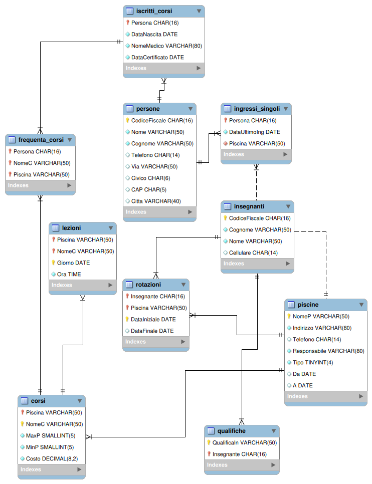

# SQL in MySQL/MariaDB - Parte 5

- [SQL in MySQL/MariaDB - Parte 5](#sql-in-mysqlmariadb---parte-5)
  - [Il database `piscine_milano`](#il-database-piscine_milano)
  - [Concetto di prodotto cartesiano](#concetto-di-prodotto-cartesiano)
    - [Esempio di prodotto cartesiano](#esempio-di-prodotto-cartesiano)

## Il database `piscine_milano`

In questo paragrafo si riporta la descrizione del database che verrà usato negli esempi delle sezioni seguenti sull'SQL.

Gestione delle piscine comunali di Milano

Si vuole rappresentare una base dati contenete le informazioni relative alle piscine gestite del comune di Milano, tenendo conto delle seguenti informazioni:

- *Le piscine sono identificate univocamente attraverso il nome (ad esempio Cozzi, Comunale, De Marchi, ecc). Per ciascuna sono inoltre noti l'indirizzo, un numero di telefono, ed il nome di un responsabile. Nel caso la piscina disponga anche di una vasca all'aperto, la base dati contiene l'informazione di quando tale vasca è utilizzabile (ad esempio da Marzo a Settembre, da Luglio ad Agosto, ecc.)*
- *Presso le piscine sono organizzati dei corsi; lo stesso tipo di corso può essere svolto presso piscine diverse, eventualmente con modalità differenti. Ciascun corso è pertanto identificato dal nome dell'attività svolta, quali Aerobica, Acquagym, Corso di Sincronizzato o corso per Gestanti, e dal nome della Piscina presso cui tale corso si svolge. Per ciascun corso, svolto presso una certa piscina, è noto il costo, il numero massimo e minimo di partecipanti, in quali giorni della settimana si svolge ed a che ora. Si ipotizzi che presso ciascuna piscina ogni corso sia svolto una sola volta al giorno, ma più volte durante la settimana.*
- *Il corpo insegnante lavora a rotazione presso le varie piscine. Per ciascun insegnante è noto il codice fiscale, che lo identifica, un nome, il numero di cellulare, se disponibile, e l'elenco delle qualifiche dell'insegnante (ad esempio istruttore di sub, istruttore di aerobica, ecc). All'interno della base dati si vuole tener traccia di tutti gli intervalli di tempo in cui un insegnante ha lavorato presso ciascuna piscina. Non si escluda che lo stesso insegnante possa aver lavorato presso una stessa piscina in intervalli di tempo diversi.*
- *Le piscine possono essere frequentate o da persone che sono iscritte ai corsi, o secondo la modalità ad ``ingresso singolo'' per svolgere nuoto libero (si noti che sono registrate per l'ingresso singolo solo le persone che non hanno mai frequentato corsi). Tutte le persone che accedono alle piscine comunali sono identificate attraverso il loro codice fiscale ed inoltre sono noti il nome, un indirizzo ed un numero di telefono.*
- *Le persone che sono iscritte ai corsi devono presentare un certificato medico. Pertanto, nel caso la persona sia iscritta ad un corso, il database contiene l'informazione del medico che ha redatto il certificato, la data in cui la persona ha presentato il certificato, l'età della persona, e l'elenco dei corsi a cui è iscritta. Per le persone che hanno fatto solo ingressi sono noti solo la data in cui è stato effettuato l'ultimo ingresso e presso quale piscina.*

Dopo un'analisi della realtà di interesse, sotto opportune ipotesi aggiuntive, che qui non sono riportate per il momento, si ha che il database è caratterizzato dalle seguenti tabelle:



Il database può essere creato a partire dallo [script](../../sql-scripts/02-piscine/Piscine_Milano_FW_engineering.sql) SQL seguente:

```sql
-- -----------------------------------------------------
-- Schema piscine_milano
-- -----------------------------------------------------
CREATE SCHEMA IF NOT EXISTS `piscine_milano`;
USE `piscine_milano` ;

-- -----------------------------------------------------
-- Table `piscine_milano`.`piscine`
-- -----------------------------------------------------
CREATE TABLE IF NOT EXISTS `piscine_milano`.`piscine` (
  `NomeP` VARCHAR(50) NOT NULL,
  `Indirizzo` VARCHAR(80) NOT NULL,
  `Telefono` CHAR(14) NULL DEFAULT NULL,
  `Responsabile` VARCHAR(80) NOT NULL,
  `Tipo` TINYINT NOT NULL DEFAULT '0',
  `Da` DATE NULL DEFAULT NULL,
  `A` DATE NULL DEFAULT NULL,
  PRIMARY KEY (`NomeP`))
ENGINE = InnoDB;


-- -----------------------------------------------------
-- Table `piscine_milano`.`corsi`
-- -----------------------------------------------------
CREATE TABLE IF NOT EXISTS `piscine_milano`.`corsi` (
  `Piscina` VARCHAR(50) NOT NULL,
  `NomeC` VARCHAR(50) NOT NULL,
  `MaxP` SMALLINT UNSIGNED NOT NULL DEFAULT '20',
  `MinP` SMALLINT UNSIGNED NOT NULL DEFAULT '10',
  `Costo` DECIMAL(8,2) NOT NULL,
  PRIMARY KEY (`Piscina`, `NomeC`),
  INDEX `Piscine` (`Piscina` ASC),
  CONSTRAINT `corsi_ibfk_1`
    FOREIGN KEY (`Piscina`)
    REFERENCES `piscine_milano`.`piscine` (`NomeP`))
ENGINE = InnoDB;


-- -----------------------------------------------------
-- Table `piscine_milano`.`persone`
-- -----------------------------------------------------
CREATE TABLE IF NOT EXISTS `piscine_milano`.`persone` (
  `CodiceFiscale` CHAR(16) NOT NULL,
  `Nome` VARCHAR(50) NOT NULL,
  `Cognome` VARCHAR(50) NOT NULL,
  `Telefono` CHAR(14) NULL DEFAULT NULL,
  `Via` VARCHAR(50) NULL DEFAULT NULL,
  `Civico` CHAR(6) NULL DEFAULT NULL,
  `CAP` CHAR(5) NULL DEFAULT NULL,
  `Citta` VARCHAR(40) NULL DEFAULT NULL,
  PRIMARY KEY (`CodiceFiscale`))
ENGINE = InnoDB;


-- -----------------------------------------------------
-- Table `piscine_milano`.`iscritti_corsi`
-- -----------------------------------------------------
CREATE TABLE IF NOT EXISTS `piscine_milano`.`iscritti_corsi` (
  `Persona` CHAR(16) NOT NULL,
  `DataNascita` DATE NOT NULL,
  `NomeMedico` VARCHAR(80) NOT NULL,
  `DataCertificato` DATE NOT NULL,
  PRIMARY KEY (`Persona`),
  CONSTRAINT `iscritti_corsi_ibfk_1`
    FOREIGN KEY (`Persona`)
    REFERENCES `piscine_milano`.`persone` (`CodiceFiscale`))
ENGINE = InnoDB;


-- -----------------------------------------------------
-- Table `piscine_milano`.`frequenta_corsi`
-- -----------------------------------------------------
CREATE TABLE IF NOT EXISTS `piscine_milano`.`frequenta_corsi` (
  `Persona` CHAR(16) NOT NULL,
  `NomeC` VARCHAR(50) NOT NULL,
  `Piscina` VARCHAR(50) NOT NULL,
  PRIMARY KEY (`Persona`, `NomeC`, `Piscina`),
  INDEX `Corso` (`Piscina` ASC, `NomeC` ASC),
  INDEX `Persona` (`Persona` ASC),
  CONSTRAINT `frequenta_corsi_ibfk_1`
    FOREIGN KEY (`Piscina` , `NomeC`)
    REFERENCES `piscine_milano`.`corsi` (`Piscina` , `NomeC`),
  CONSTRAINT `frequenta_corsi_ibfk_2`
    FOREIGN KEY (`Persona`)
    REFERENCES `piscine_milano`.`iscritti_corsi` (`Persona`))
ENGINE = InnoDB;


-- -----------------------------------------------------
-- Table `piscine_milano`.`ingressi_singoli`
-- -----------------------------------------------------
CREATE TABLE IF NOT EXISTS `piscine_milano`.`ingressi_singoli` (
  `Persona` CHAR(16) NOT NULL,
  `DataUltimoIng` DATE NOT NULL,
  `Piscina` VARCHAR(50) NOT NULL,
  PRIMARY KEY (`Persona`),
  INDEX `Piscina` (`Piscina` ASC),
  CONSTRAINT `ingressi_singoli_ibfk_1`
    FOREIGN KEY (`Persona`)
    REFERENCES `piscine_milano`.`persone` (`CodiceFiscale`),
  CONSTRAINT `ingressi_singoli_ibfk_2`
    FOREIGN KEY (`Piscina`)
    REFERENCES `piscine_milano`.`piscine` (`NomeP`))
ENGINE = InnoDB;


-- -----------------------------------------------------
-- Table `piscine_milano`.`insegnanti`
-- -----------------------------------------------------
CREATE TABLE IF NOT EXISTS `piscine_milano`.`insegnanti` (
  `CodiceFiscale` CHAR(16) NOT NULL,
  `Cognome` VARCHAR(50) NOT NULL,
  `Nome` VARCHAR(50) NOT NULL,
  `Cellulare` CHAR(14) NULL DEFAULT NULL,
  PRIMARY KEY (`CodiceFiscale`))
ENGINE = InnoDB;


-- -----------------------------------------------------
-- Table `piscine_milano`.`lezioni`
-- -----------------------------------------------------
CREATE TABLE IF NOT EXISTS `piscine_milano`.`lezioni` (
  `Piscina` VARCHAR(50) NOT NULL,
  `NomeC` VARCHAR(50) NOT NULL,
  `Giorno` DATE NOT NULL,
  `Ora` TIME NOT NULL,
  PRIMARY KEY (`Piscina`, `NomeC`, `Giorno`),
  INDEX `Corsi` (`Piscina` ASC, `NomeC` ASC),
  CONSTRAINT `lezioni_ibfk_1`
    FOREIGN KEY (`Piscina` , `NomeC`)
    REFERENCES `piscine_milano`.`corsi` (`Piscina` , `NomeC`))
ENGINE = InnoDB;


-- -----------------------------------------------------
-- Table `piscine_milano`.`qualifiche`
-- -----------------------------------------------------
CREATE TABLE IF NOT EXISTS `piscine_milano`.`qualifiche` (
  `QualificaIn` VARCHAR(50) NOT NULL,
  `Insegnante` CHAR(16) NOT NULL,
  PRIMARY KEY (`QualificaIn`, `Insegnante`),
  INDEX `Insegnante` (`Insegnante` ASC),
  CONSTRAINT `qualifiche_ibfk_1`
    FOREIGN KEY (`Insegnante`)
    REFERENCES `piscine_milano`.`insegnanti` (`CodiceFiscale`))
ENGINE = InnoDB;


-- -----------------------------------------------------
-- Table `piscine_milano`.`rotazioni`
-- -----------------------------------------------------
CREATE TABLE IF NOT EXISTS `piscine_milano`.`rotazioni` (
  `Insegnante` CHAR(16) NOT NULL,
  `Piscina` VARCHAR(50) NOT NULL,
  `DataIniziale` DATE NOT NULL,
  `DataFinale` DATE NULL DEFAULT NULL,
  PRIMARY KEY (`Insegnante`, `Piscina`, `DataIniziale`),
  INDEX `Piscina` (`Piscina` ASC),
  INDEX `Insegnante` (`Insegnante` ASC),
  CONSTRAINT `rotazioni_ibfk_1`
    FOREIGN KEY (`Insegnante`)
    REFERENCES `piscine_milano`.`insegnanti` (`CodiceFiscale`),
  CONSTRAINT `rotazioni_ibfk_2`
    FOREIGN KEY (`Piscina`)
    REFERENCES `piscine_milano`.`piscine` (`NomeP`))
ENGINE = InnoDB;
```

Il database `piscine_milano` può essere popolato con questo [script](../../sql-scripts/02-piscine/Piscine_Milano_INSERIMENTO_DATI.sql).

## Concetto di prodotto cartesiano


Il prodotto cartesiano di due (o più) tabelle è una nuova tabella costituita da tutte le possibili combinazioni senza ripetizioni tra le righe delle tabelle di partenza.

Il prodotto tra due tabelle `A` e `B` si indica con `A x B`

> :memo: **Nota**: nel prodotto cartesiano si parla di `ennupla`, nelle quali l’ordine degli attributi è rilevante. Nella teoria relazionale si parla di `tuple`, per le quali l’ordine degli attributi non è rilevante.

Se nella clausola `FROM` di una query SQL compaiono due o più tabelle, l’interrogazione è eseguita da un DBMS secondo il seguente ordine:

1. **Effettuando il prodotto cartesiano tra le tabelle** ( definito dall’insieme di tutte le possibili combinazioni senza ripetizioni tra le righe)
2. **Selezionando tutte le righe ed effettuando la *proiezione* sulle colonne elencate dopo la `SELECT`**.

### Esempio di prodotto cartesiano

