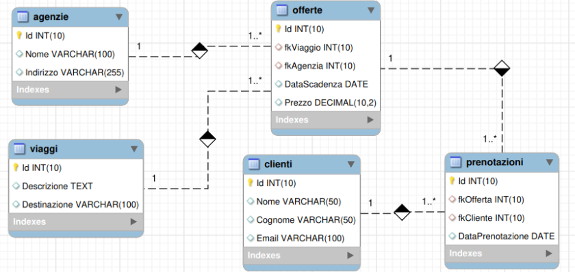

# SQL in MySQL/MariaDB - Vari tipi di JOIN

- [SQL in MySQL/MariaDB - Vari tipi di JOIN](#sql-in-mysqlmariadb---vari-tipi-di-join)
  - [Incrocio di due o più tabelle - JOIN](#incrocio-di-due-o-più-tabelle---join)
    - [Concetto di JOIN](#concetto-di-join)
    - [Come fare a ricavare i dati derivanti dall’incrocio di due (o più) tabelle?](#come-fare-a-ricavare-i-dati-derivanti-dallincrocio-di-due-o-più-tabelle)
    - [Concetto di Equi-Join](#concetto-di-equi-join)
      - [Un esempio di Join eseguito con un prodotto cartesiano seguito da clausola WHERE](#un-esempio-di-join-eseguito-con-un-prodotto-cartesiano-seguito-da-clausola-where)
    - [Ridenominazione di un riferimento a tabella](#ridenominazione-di-un-riferimento-a-tabella)
    - [L'operatore JOIN dell'SQL](#loperatore-join-dellsql)
      - [Tipi di JOIN](#tipi-di-join)
    - [INNER JOIN](#inner-join)
      - [Primo esempio di INNER JOIN](#primo-esempio-di-inner-join)
      - [Secondo esempio di INNER JOIN](#secondo-esempio-di-inner-join)
    - [INNER JOIN vs. Prodotto Cartesiano seguito da WHERE `<condizione_di_join>`](#inner-join-vs-prodotto-cartesiano-seguito-da-where-condizione_di_join)
    - [NATURAL JOIN](#natural-join)
      - [Esempio di NATURAL JOIN](#esempio-di-natural-join)
    - [NATURAL JOIN vs. INNER JOIN](#natural-join-vs-inner-join)
    - [Altri esempi di JOIN](#altri-esempi-di-join)
      - [Database `studenti_stages_aziende`](#database-studenti_stages_aziende)
      - [Database `travel_agency`](#database-travel_agency)
    - [Join di più di due tabelle](#join-di-più-di-due-tabelle)
      - [Esempi di JOIN tra più tabelle con il database `piscine_milano`](#esempi-di-join-tra-più-tabelle-con-il-database-piscine_milano)
    - [Self JOIN](#self-join)
      - [Self JOIN - (primo caso) Incrocio di dati appartenenti alle colonne della stessa tabella](#self-join---primo-caso-incrocio-di-dati-appartenenti-alle-colonne-della-stessa-tabella)
      - [Self JOIN - (secondo caso) schema logico che realizza un’associazione ricorsiva](#self-join---secondo-caso-schema-logico-che-realizza-unassociazione-ricorsiva)

## Incrocio di due o più tabelle - JOIN

Le interrogazioni fatte su un database molto spesso riguardano i dati memorizzati su più tabelle e il collegamento tra queste è realizzato mediante una o più colonne in comune che contengono gli stessi valori.

In genere tali colonne rappresentano la chiave esterna nella tabella del lato N (molti) e la chiave primaria nella tabella del lato 1.


### Concetto di JOIN

Ad esempio, per ricavare `Cognome`, `Nome` e la `Classe` degli `studenti` che hanno compiuto più di 15 giorni di assenze nel quadrimestre occorre incrociare i dati delle tabelle `studenti` e `assenze`, ma come fare?


### Come fare a ricavare i dati derivanti dall’incrocio di due (o più) tabelle?

Intuitivamente si capisce che per fare l’incrocio tra tabelle si può:

1. considerare la tabella derivante da tutte le possibili combinazioni tra le righe delle due tabelle
2. selezionare nella tabella risultato solo quelle righe per le quali si ha uguaglianza tra la chiave  primaria della tabella del lato 1 con la chiave esterna della tabella del lato N

### Concetto di Equi-Join

Un JOIN in SQL è un'operazione che permette di combinare righe di due o più tabelle in base a una condizione specificata, creando una nuova tabella virtuale. Questa nuova tabella contiene colonne provenienti da entrambe le tabelle originali e le righe sono formate dalle combinazioni di righe che soddisfano la condizione di join.

Nell’esempio della scuola l’uguaglianza di join diventa `Studenti.Matricola = Assenze.Studente`

Le colonne su cui si verifica l’uguaglianza di join non devono necessariamente essere rispettivamente chiave primaria e chiave esterna, anche se nella stragrande maggioranza dei casi lo sono.

**L’unica condizione richiesta per effettuare un'operazione di join è che le colonne dell’uguaglianza di join appartengano allo stesso dominio.**

> :point_right: **Osservazione**: Quando gli sviluppatori software parlano di join intendono l’equi-join.

#### Un esempio di Join eseguito con un prodotto cartesiano seguito da clausola WHERE

Con riferimento al database `piscine_milano` utilizzato precedentemente *riportare i cognomi e i nomi delle persone iscritte ad almeno un corso delle piscine di Milano*

```sql
SELECT persone.Cognome, persone.Nome -- 👈 la SELECT permette di selezionare le colonne (proiezione sulle colonne)
FROM persone, iscritti_corsi -- 👈 prodotto cartesiano
WHERE persone.CodiceFiscale = iscritti_corsi.Persona; -- 👈 condizione di join (restrizione sulle tuple)
```

| Cognome     | Nome    |
|-------------|---------|
| Caruso      | Alessio |
| Di Giovanni | Mattia  |

La condizione di join è essenziale, infatti, senza di essa, otterremmo un semplice prodotto cartesiano …

```sql
SELECT persone.Cognome, persone.Nome -- 👈 la SELECT permette di selezionare le colonne (proiezione)
FROM persone, iscritti_corsi; -- 👈 prodotto cartesiano
```

| Cognome     | Nome    |
|-------------|---------|
| Albertini   | Giacomo |
| Albertini   | Giacomo |
| Caruso      | Alessio |
| Caruso      | Alessio |
| Di Giovanni | Mattia  |
| Di Giovanni | Mattia  |

Se riportassimo tutte le colonne del prodotto cartesiano capiremmo facilmente che il prodotto cartesiano da solo non basta per effettuare un incrocio (join) tra due tabelle:

```sql
SELECT persone.CodiceFiscale, persone.Cognome, persone.Nome, iscritti_corsi.Persona -- 👈 la SELECT permette di selezionare le colonne (proiezione)
FROM persone, iscritti_corsi; -- 👈 prodotto cartesiano
```

| CodiceFiscale    | Cognome     | Nome    | Persona          |
|------------------|-------------|---------|------------------|
| ALBGNC80B30C123F | Albertini   | Giacomo | CRSALS90B24B347R |
| ALBGNC80B30C123F | Albertini   | Giacomo | DGNMTT74B24C127R |
| CRSALS90B24B347R | Caruso      | Alessio | CRSALS90B24B347R |
| CRSALS90B24B347R | Caruso      | Alessio | DGNMTT74B24C127R |
| DGNMTT74B24C127R | Di Giovanni | Mattia  | CRSALS90B24B347R |
| DGNMTT74B24C127R | Di Giovanni | Mattia  | DGNMTT74B24C127R |

:warning: **Le righe nelle quali il campo `CodiceFiscale` non corrisponde a `Persona` non sono righe collegate tra di loro!**

### Ridenominazione di un riferimento a tabella

In ogni query, sia con JOIN che senza, il riferimento ad una tabella può essere rinominato usando la sintassi:

```sql
 tbl_name AS alias_name or tbl_name alias_name
 ```

Ad esempio, la query precedente si può scrivere come:

```sql
SELECT p.CodiceFiscale, p.Cognome, p.Nome
FROM persone AS p, iscritti_corsi AS ic
WHERE p.CodiceFiscale = ic.Persona;
-- Oppure come:
SELECT p.CodiceFiscale, p.Cognome, p.Nome
FROM persone p, iscritti_corsi ic
WHERE p.CodiceFiscale = ic.Persona;
```

### L'operatore JOIN dell'SQL

L'operazione di JOIN tra due tabelle, oltre che essere ottenibile da un `prodotto cartesiano` seguito da una `clausola WHERE con la condizione di JOIN`, è definito in SQL con un operatore specifico, chiamato proprio JOIN:

```sql
SELECT <ElencoColonne>
FROM TabellaA <TipoJoin> JOIN TabellaB ON <CondizioneJoin>
[WHERE <CondizioneRicerca>]
```

Secondo lo standard SQL `<TipoJoin>` può essere di diversi tipi. I DBMS, in genere, non dispongono di tutti i tipi di join previsti dallo standard. In seguito si illustrano i tipi di join disponibili nel DBMS MySQL/MariaDb.

Si noti che la condizione di ricerca `WHERE <CondizioneRicerca>` presente nella espressione del JOIN SQL è una condizione aggiuntiva che può anche non esserci. Server per effettuare filtraggi ulteriori rispetto a quello che permette di effettuare il collegamento (JOIN) tra le tabelle.

#### Tipi di JOIN

Esistono diversi tipi di JOIN, ciascuno con un comportamento specifico:

- `INNER JOIN`: restituisce solo le righe che hanno valori corrispondenti nella colonna specificata in entrambe le tabelle. È il tipo di join più comune.
- `LEFT JOIN`: restituisce tutte le righe della tabella a sinistra e le righe corrispondenti della tabella a destra. Se non esiste una corrispondenza, i valori della tabella a destra vengono impostati a NULL.
- `RIGHT JOIN`: simile al LEFT JOIN, ma restituisce tutte le righe della tabella a destra e le righe corrispondenti della tabella a sinistra.
- `SELF JOIN`: un join di una tabella con se stessa, utile per confrontare i dati all'interno della stessa tabella.
- `NATURAL JOIN`: un natural join è un INNER JOIN che unisce le tabelle in base a tutte le colonne con lo stesso nome e lo stesso tipo di dato presenti in entrambe le tabelle. In altre parole, il sistema di gestione del database (DBMS) identifica automaticamente le colonne comuni e le utilizza come condizione di join.

### INNER JOIN

In MySQL/MariaDb <cite>JOIN, CROSS JOIN, and INNER JOIN are syntactic equivalents (they can replace each other)</cite>[^1][^2]

```sql
[INNER | CROSS] JOIN:
SELECT <ElencoColonne>
FROM TabellaA [INNER] JOIN TabellaB ON <CondizioneJoin>
[WHERE <CondizioneRicerca>]
```

#### Primo esempio di INNER JOIN

```sql
-- Riportare i cognomi e i nomi delle persone iscritte ad almeno un corso delle piscine di Milano;

SELECT persone.Cognome, persone.Nome
FROM persone INNER JOIN iscritti_corsi
ON persone.CodiceFiscale = iscritti_corsi.Persona;
```

| Cognome     | Nome    |
|-------------|---------|
| Caruso      | Alessio |
| Di Giovanni | Mattia  |

#### Secondo esempio di INNER JOIN

```sql
-- riportare i cognomi e i nomi delle persone maggiorenni iscritte ad almeno un corso delle piscine di Milano ;
SELECT p.Cognome, p.Nome, ic.DataNascita
FROM persone  p INNER JOIN iscritti_corsi ic
ON p.CodiceFiscale = ic.Persona
WHERE ((YEAR(CURDATE()) - YEAR(ic.DataNascita) ) - (RIGHT(CURDATE(),5) < RIGHT(ic.DataNascita,5)))>= 18;
```

| Cognome     | Nome    | DataNascita |
|-------------|---------|-------------|
| Caruso      | Alessio | 2006-04-01  |
| Di Giovanni | Mattia  | 1990-02-21  |

### INNER JOIN vs. Prodotto Cartesiano seguito da WHERE `<condizione_di_join>`

Tecnicamente lo stesso risultato dell'INNER JOIN si può ottenere con un `prodotto cartesiano` seguito dalla clausola `WHERE` che applica la condizione di `JOIN`, ma quale delle due versioni è da preferire?

- JOIN
  
```sql
SELECT <ElencoColonne>
FROM TabellaA [INNER] JOIN TabellaB ON <CondizioneJoin>;
-- ad esempio
SELECT <ElencoColonne>
FROM TabellaA [INNER] JOIN TabellaB ON TabellaA.ColonnaComuneA = TabellaB.ColonnaComuneB;
```

- Prodotto cartesiano, seguito da WHERE sulla condizione di JOIN

```sql
SELECT <ElencoColonne>
FROM TabellaA, TabellaB WHERE <CondizioneJoin>;
-- ad esempio
SELECT <ElencoColonne>
FROM TabellaA, TabellaB WHERE TabellaA.ColonnaComuneA = TabellaB.ColonnaComuneB;
```
Per rispondere a questa domanda, confrontiamo i due approcci:

1. INNER JOIN
2. Prodotto cartesiano seguito da una condizione WHERE

In genere, un `INNER JOIN` è più veloce ed efficiente di un `prodotto cartesiano` seguito da una condizione `WHERE`. Di seguito sono riportati i motivi:

1. Piano di esecuzione

   - `INNER JOIN`: il motore del database può ottimizzare l'esecuzione della query utilizzando indici e algoritmi di join come nested loop join, hash join o merge join.
   - `Prodotto cartesiano + WHERE`: il database crea prima un prodotto cartesiano completo, quindi filtra i risultati. Questo approccio è meno efficiente, soprattutto per grandi set di dati.

2. Elaborazione dei dati

   - `INNER JOIN`: vengono combinate solo le righe corrispondenti, riducendo la quantità di dati elaborati.
   - `Prodotto cartesiano + WHERE`: vengono create prima tutte le possibili combinazioni, quindi filtrate, il che può richiedere molte risorse.

3. Utilizzo della memoria

   - `INNER JOIN`: in genere richiede meno memoria poiché gestisce solo le righe corrispondenti.
   - `Prodotto cartesiano + WHERE`: può consumare molta memoria, soprattutto per tabelle di grandi dimensioni, poiché crea tutte le possibili combinazioni prima del filtraggio.

4. Utilizzo di indici

   - `INNER JOIN`: può utilizzare in modo efficiente gli indici sulle colonne di join.
   - `Prodotto cartesiano + WHERE`: potrebbe non utilizzare gli indici in modo efficace, soprattutto durante la fase del prodotto cartesiano.

5. Query optimizer

   - `INNER JOIN`: fornisce più informazioni al query optimizer, consentendo migliori piani di esecuzione.
   - `Prodotto cartesiano + WHERE`: fornisce meno informazioni al query optimizer, con conseguenti potenziali piani di esecuzione non ottimali.

Tuttavia, vale la pena notare che in alcuni moderni sistemi di database, il query optimizer potrebbe riconoscere che un prodotto cartesiano seguito da una condizione `WHERE` è equivalente a un `INNER JOIN` e ottimizzarlo di conseguenza. Tuttavia, è generalmente meglio scrivere query usando `INNER JOIN` per chiarezza e per garantire prestazioni ottimali su diversi sistemi di database.

In conclusione, `INNER JOIN` è in genere più veloce ed efficiente di un prodotto cartesiano seguito da una condizione `WHERE`. È il metodo preferito per unire tabelle in base a relazioni tra chiave esterna e chiave primaria.

### NATURAL JOIN

```sql
SELECT <ElencoColonne>
FROM TabellaA NATURAL JOIN TabellaB
[WHERE <CondizioneRicerca>]
```

> :memo: Notare che nel NATURAL JOIN la condizione di JOIN è implicita e corrisponde all'uguaglianza dei campi delle tabelle che hanno los tesso nome.

#### Esempio di NATURAL JOIN

Riportare di ogni `lezione` il nome della `piscina`, il nome del `corso`, il `giorno`, l’`orario`, il `numero minimo` ed il `numero massimo di iscritti`.

Nel database di esempio piscine_milano le istanze delle tabelle `lezioni` e `corsi` sono rispettivamente:

```sql
SELECT * FROM lezioni;
```

| Piscina | NomeC               | Giorno     | Ora      |
|---------|---------------------|------------|----------|
| Cozzi   | Acquagym            | 2024-10-15 | 22:30:00 |
| Cozzi   | Acquagym            | 2024-10-22 | 22:30:00 |
| Cozzi   | Acquagym            | 2024-10-29 | 22:30:00 |
| Cozzi   | Acquagym            | 2024-11-05 | 22:30:00 |
| Cozzi   | Acquagym            | 2024-11-12 | 22:30:00 |
| Lido    | Acquagym            | 2024-10-15 | 20:30:00 |
| Lido    | Acquagym            | 2024-10-22 | 20:30:00 |
| Lido    | Acquagym            | 2024-10-29 | 20:30:00 |
| Lido    | Acquagym            | 2024-11-05 | 20:30:00 |
| Lido    | Acquagym            | 2024-11-12 | 20:30:00 |
| Lido    | Corso di Salvamento | 2024-10-15 | 17:30:00 |
| Lido    | Corso di Salvamento | 2024-10-22 | 17:30:00 |
| Lido    | Corso di Salvamento | 2024-10-29 | 17:30:00 |
| Lido    | Corso di Salvamento | 2024-11-05 | 17:30:00 |
| Lido    | Corso di Salvamento | 2024-11-12 | 17:30:00 |

```sql
SELECT * FROM corsi;
```

| Piscina | NomeC               | MaxP | MinP | Costo  |
|---------|---------------------|------|------|--------|
| Cozzi   | Acquagym            |   26 |    8 | 126.00 |
| Cozzi   | Corso di Salvamento |   10 |    4 | 500.00 |
| Cozzi   | Nuoto Libero        |   30 |    0 |  80.00 |
| Lido    | Acquagym            |   34 |    8 | 190.00 |
| Lido    | Corso di Salvamento |   10 |    4 | 700.00 |
| Lido    | Nuoto Libero        |   38 |    0 | 100.00 |

La query che restituisce i dati richiesti è la seguente:

```sql
SELECT l.*, c.MinP 'N. min di iscritti', c.MaxP 'N. max di iscritti'
FROM lezioni l NATURAL JOIN corsi c;
```

| Piscina | NomeC               | Giorno     | Ora      | N. min di iscritti | N. max di iscritti |
|---------|---------------------|------------|----------|--------------------|--------------------|
| Cozzi   | Acquagym            | 2024-10-15 | 22:30:00 |                  8 |                 26 |
| Cozzi   | Acquagym            | 2024-10-22 | 22:30:00 |                  8 |                 26 |
| Cozzi   | Acquagym            | 2024-10-29 | 22:30:00 |                  8 |                 26 |
| Cozzi   | Acquagym            | 2024-11-05 | 22:30:00 |                  8 |                 26 |
| Cozzi   | Acquagym            | 2024-11-12 | 22:30:00 |                  8 |                 26 |
| Lido    | Acquagym            | 2024-10-15 | 20:30:00 |                  8 |                 34 |
| Lido    | Acquagym            | 2024-10-22 | 20:30:00 |                  8 |                 34 |
| Lido    | Acquagym            | 2024-10-29 | 20:30:00 |                  8 |                 34 |
| Lido    | Acquagym            | 2024-11-05 | 20:30:00 |                  8 |                 34 |
| Lido    | Acquagym            | 2024-11-12 | 20:30:00 |                  8 |                 34 |
| Lido    | Corso di Salvamento | 2024-10-15 | 17:30:00 |                  4 |                 10 |
| Lido    | Corso di Salvamento | 2024-10-22 | 17:30:00 |                  4 |                 10 |
| Lido    | Corso di Salvamento | 2024-10-29 | 17:30:00 |                  4 |                 10 |
| Lido    | Corso di Salvamento | 2024-11-05 | 17:30:00 |                  4 |                 10 |
| Lido    | Corso di Salvamento | 2024-11-12 | 17:30:00 |                  4 |                 10 |

:memo: Si noti che nel `NATURAL JOIN` le colonne in comune sono riportate una sola volta nella tabella risultato, come si evince dalla seguente query:

```sql
SELECT * 
FROM corsi NATURAL JOIN lezioni;
```

| Piscina | NomeC               | MaxP | MinP | Costo  | Giorno     | Ora      |
|---------|---------------------|------|------|--------|------------|----------|
| Cozzi   | Acquagym            |   26 |    8 | 126.00 | 2024-10-15 | 22:30:00 |
| Cozzi   | Acquagym            |   26 |    8 | 126.00 | 2024-10-22 | 22:30:00 |
| Cozzi   | Acquagym            |   26 |    8 | 126.00 | 2024-10-29 | 22:30:00 |
| Cozzi   | Acquagym            |   26 |    8 | 126.00 | 2024-11-05 | 22:30:00 |
| Cozzi   | Acquagym            |   26 |    8 | 126.00 | 2024-11-12 | 22:30:00 |
| Lido    | Acquagym            |   34 |    8 | 190.00 | 2024-10-15 | 20:30:00 |
| Lido    | Acquagym            |   34 |    8 | 190.00 | 2024-10-22 | 20:30:00 |
| Lido    | Acquagym            |   34 |    8 | 190.00 | 2024-10-29 | 20:30:00 |
| Lido    | Acquagym            |   34 |    8 | 190.00 | 2024-11-05 | 20:30:00 |
| Lido    | Acquagym            |   34 |    8 | 190.00 | 2024-11-12 | 20:30:00 |
| Lido    | Corso di Salvamento |   10 |    4 | 700.00 | 2024-10-15 | 17:30:00 |
| Lido    | Corso di Salvamento |   10 |    4 | 700.00 | 2024-10-22 | 17:30:00 |
| Lido    | Corso di Salvamento |   10 |    4 | 700.00 | 2024-10-29 | 17:30:00 |
| Lido    | Corso di Salvamento |   10 |    4 | 700.00 | 2024-11-05 | 17:30:00 |
| Lido    | Corso di Salvamento |   10 |    4 | 700.00 | 2024-11-12 | 17:30:00 |

### NATURAL JOIN vs. INNER JOIN

```sql
Esempio: Riportare per ogni insegnante tutti i dati e le qualifiche possedute.
-- 1° metodo: con un INNER JOIN
SELECT * 
FROM insegnanti i INNER JOIN qualifiche q ON i.CodiceFiscale = q.Insegnante;
-- 2° metodo: con un prodotto cartesiano ed una restrizione (WHERE)
SELECT *
FROM insegnanti i, qualifiche q
WHERE i.codiceFiscale = q.insegnante;
-- 3° metodo: con una ridenominazione e un NATURAL JOIN
SELECT *
FROM insegnanti NATURAL JOIN (SELECT QualificaIn, Insegnante AS CodiceFiscale FROM qualifiche) AS qualifiche2;
```

### Altri esempi di JOIN

#### Database `studenti_stages_aziende`

Si consideri il database `studenti_stages_aziende` descritto dallo schema:


Il database può essere ricreato a partire da [questo script](../../sql-scripts/03-stages/studenti_stages_aziende.sql).

La struttura del database è:

```sql
CREATE DATABASE IF NOT EXISTS studenti_stages_aziende;
USE studenti_stages_aziende;

-- Creazione della tabella classe
CREATE TABLE IF NOT EXISTS classe (
    Codice VARCHAR(4) PRIMARY KEY,
    Aula VARCHAR(10) NOT NULL
);

-- Creazione della tabella aziende
CREATE TABLE IF NOT EXISTS aziende (
    Codice VARCHAR(16) PRIMARY KEY, -- Partita IVA o CF
    Denominazione VARCHAR(100) NOT NULL,
    Indirizzo VARCHAR(255) NOT NULL,
    Sede VARCHAR(255) NOT NULL,
    Telefono VARCHAR(15),
    EMail VARCHAR(100)
);

-- Creazione della tabella studenti
CREATE TABLE IF NOT EXISTS studenti (
    Codice CHAR(8) PRIMARY KEY,
    Cognome VARCHAR(50) NOT NULL,
    Nome VARCHAR(50) NOT NULL,
    DataNascita DATE NOT NULL,
    Genere ENUM('M', 'F') NOT NULL,
    EMail VARCHAR(100) NOT NULL,
    Classe VARCHAR(4),
    FOREIGN KEY (Classe) REFERENCES classe (Codice) ON DELETE SET NULL ON UPDATE CASCADE
);

-- Creazione della tabella stages
CREATE TABLE IF NOT EXISTS stages (
    Id INT AUTO_INCREMENT PRIMARY KEY,
    Azienda VARCHAR(16),
    Studente CHAR(8),
    AnnoScolastico VARCHAR(9) NOT NULL,
    DataInizio DATE NOT NULL,
    DurataComplessiva INT NOT NULL,
    FOREIGN KEY (Azienda) REFERENCES aziende (Codice) ON DELETE SET NULL ON UPDATE CASCADE,
    FOREIGN KEY (Studente) REFERENCES studenti (Codice) ON DELETE CASCADE ON UPDATE CASCADE
);
```

Eseguiamo le seguenti query:

```sql
-- Ricercare i cognomi ed i nomi degli allievi a cui è stato assegnato uno stage in un certo anno scolastico
SELECT DISTINCT s.Codice, s.Cognome, s.Nome
FROM studenti s
JOIN stages st ON s.Codice = st.Studente
WHERE st.AnnoScolastico = '2023/2024';

-- Ricercare la denominazione delle aziende che hanno offerto stage in un certo periodo di tempo (tra una data iniziale ed una data finale
SELECT DISTINCT a.Denominazione
FROM aziende a
JOIN stages st ON a.Codice = st.Azienda
WHERE st.DataInizio BETWEEN '2024-06-01' AND '2024-08-31';

-- Ricercare codice, cognome e nome degli allievi a cui è stato assegnato uno stage in un certo anno scolastico
SELECT DISTINCT s.Codice, s.Cognome, s.Nome
FROM studenti s
JOIN stages st ON s.Codice = st.Studente
WHERE st.AnnoScolastico = '2023/2024';
```

#### Database `travel_agency`

Si consideri il database il cui schema relazionale è dato da:



Il database può essere ricreato a partire da [questo script](../../sql-scripts/04-agenzie-viaggi/travel_agency.sql).

La struttura del database è:

```sql
-- Create the database
CREATE DATABASE IF NOT EXISTS travel_agency;

-- Use the newly created database
USE travel_agency;

-- Create viaggio table
CREATE TABLE IF NOT EXISTS viaggio (
    Id INT UNSIGNED AUTO_INCREMENT PRIMARY KEY,
    Descrizione TEXT,
    Destinazione VARCHAR(100)
);

-- Create agenzia table
CREATE TABLE IF NOT EXISTS agenzia (
    Id INT UNSIGNED AUTO_INCREMENT PRIMARY KEY,
    Nome VARCHAR(100),
    Indirizzo VARCHAR(255)
);

-- Create cliente table
CREATE TABLE IF NOT EXISTS cliente (
    Id INT UNSIGNED AUTO_INCREMENT PRIMARY KEY,
    Nome VARCHAR(50),
    Cognome VARCHAR(50),
    Email VARCHAR(100)
);

-- Create offerte table
CREATE TABLE IF NOT EXISTS offerte (
    Id INT UNSIGNED AUTO_INCREMENT PRIMARY KEY,
    fkViaggio INT UNSIGNED,
    fkAgenzia INT UNSIGNED,
    DataScadenza DATE,
    Prezzo DECIMAL(10, 2),
    FOREIGN KEY (fkViaggio) REFERENCES viaggio (Id),
    FOREIGN KEY (fkAgenzia) REFERENCES agenzia (Id)
);

-- Create prenotazioni table
CREATE TABLE IF NOT EXISTS prenotazioni (
    Id INT UNSIGNED AUTO_INCREMENT PRIMARY KEY,
    fkOfferta INT UNSIGNED,
    fkCliente INT UNSIGNED,
    DataPrenotazione DATE,
    FOREIGN KEY (fkOfferta) REFERENCES offerte (Id),
    FOREIGN KEY (fkCliente) REFERENCES cliente (Id)
);
```

Eseguiamo le seguenti query:

```sql
-- Ricercare le prenotazioni fatte dai clienti con data antecedente alla scadenza dell’offerta
SELECT 
    c.Nome, 
    c.Cognome, 
    v.Destinazione, 
    p.DataPrenotazione, 
    o.DataScadenza,
    a.Nome AS NomeAgenzia
FROM 
    prenotazioni p 
JOIN 
    offerte o ON p.fkOfferta = o.Id
JOIN 
    cliente c ON p.fkCliente = c.Id
JOIN 
    viaggio v ON o.fkViaggio = v.Id
JOIN 
    agenzia a ON o.fkAgenzia = a.Id
WHERE 
    p.DataPrenotazione < o.DataScadenza
ORDER BY 
    p.DataPrenotazione;

-- Trovare i viaggi che hanno prenotazioni (senza riportare il numero di prenotazioni)
SELECT DISTINCT
    v.Id AS IdViaggio,
    v.Descrizione,
    v.Destinazione
FROM
    viaggio v
    JOIN offerte o ON v.Id = o.fkViaggio
    JOIN prenotazioni p ON o.Id = p.fkOfferta;

-- Trovare i viaggi che hanno prenotazioni (riportare anche il numero di prenotazioni)
-- prima versione
SELECT DISTINCT
    v.Id AS IdViaggio,
    v.Descrizione,
    v.Destinazione,
    (
        SELECT COUNT(*)
        FROM prenotazioni p
            JOIN offerte o ON p.fkOfferta = o.Id
        WHERE
            o.fkViaggio = v.Id
    ) AS NumeroPrenotazioni
FROM
    viaggio v
    JOIN offerte o ON v.Id = o.fkViaggio
    JOIN prenotazioni p ON o.Id = p.fkOfferta
ORDER BY NumeroPrenotazioni DESC;
```

### Join di più di due tabelle

Nei DBMS capita spesso di dover incrociare i dati di tre o più tabelle … `come fare?`


Si osservi che l’operatore di JOIN gode delle seguenti proprietà:

- Proprietà commutativa
  
  ```sql
    A JOIN B = B JOIN A
  ```

- Proprietà associativa
  
  ```sql
    (A JOIN B) JOIN C = A JOIN (B JOIN C ) = A JOIN B JOIN C
  ```

Per realizzare l'operazione di `JOIN` tra tre o più tabelle si può procedere in due modi:

- Usando la definizione di `JOIN` mediante `PRODOTTO CARTESIANO` e `WHERE <condizione di join>` **(sconsigliato)**
  
  ```sql
  SELECT <ElencoColonne>
    FROM TabellaA, TabellaB, TabellaC
    WHERE TabellaA.ColonnaA1 = TabellaB.ColonnaB2 AND
         TabellaB.ColonnaB3 = TabellaC.ColonnaC1 AND
         <CondizioneRicerca>
  ```

- Usando l’operatore di `JOIN` **(metodo consigliato)**

  ```sql
  SELECT <ElencoColonne>
    FROM 
    TabellaA 
    [INNER] JOIN 
    TabellaB 
      ON TabellaA.ColonnaA1 = TabellaB.ColonnaB2 
    [INNER] JOIN TabellaC 
      ON  TabellaB.ColonnaB3 = TabellaC.ColonnaC1
  ```

#### Esempi di JOIN tra più tabelle con il database `piscine_milano`

Con riferimento al database [`piscine_milano`](../../sql-scripts/02-piscine/Piscine-Milano-FW-engineering.sql)


eseguire le seguenti query:

```sql
USE piscine_milano;
-- visualizzare l’età delle persone iscritte ai corsi di Acquagym di tutte le piscine
-- uso di prodotto cartesiano seguito da WHERE (sconsigliato)
SELECT DISTINCT IF( RIGHT(ic.DataNascita,5)  <= RIGHT(CURDATE(),5),
      YEAR(CURDATE()) - YEAR(ic.DataNascita), 
      YEAR(CURDATE()) - YEAR(ic.DataNascita) - 1) AS 'Età'
  FROM iscritti_corsi ic, frequenta_corsi fc
  WHERE ic.Persona = fc.Persona AND fc.NomeC ='Acquagym';

-- uso di INNER JOIN (consigliato)
SELECT DISTINCT IF( RIGHT(ic.DataNascita,5) <= RIGHT(CURDATE(),5),
      YEAR(CURDATE()) - YEAR(ic.DataNascita),
      (YEAR(CURDATE()) - YEAR(ic.DataNascita)) - 1 ) AS 'Età'
  FROM iscritti_corsi ic JOIN frequenta_corsi fc
    ON ic.Persona = fc.Persona 
  WHERE fc.NomeC ='Acquagym';

-- visualizzare cognome, nome e data di nascita delle persone iscritte al corso di Acquagym della piscina Lido.
-- uso di prodotto cartesiano seguito da WHERE (sconsigliato)
SELECT DISTINCT  p.Cognome, p.Nome, ic.DataNascita
  FROM persone p, iscritti_corsi ic, frequenta_corsi fc
  WHERE fc.Persona = ic.Persona AND ic.Persona = p.CodiceFiscale AND
     fc.Piscina= 'Lido' AND fc.NomeC='Acquagym';
-- uso di INNER JOIN (consigliato)
SELECT DISTINCT p.Cognome, p.Nome, ic.DataNascita
  FROM 
  persone p 
  JOIN 
  iscritti_corsi ic 
    ON ic.Persona = p.CodiceFiscale 
  JOIN frequenta_corsi fc 
    ON fc.Persona = ic.Persona 
  WHERE  fc.Piscina= 'Lido' AND fc.NomeC='Acquagym';
```

### Self JOIN

Il self join è un’operazione di join tra una tabella ed una sua copia. È utile in tutti i casi in cui:

- Si devono incrociare dati appartenenti alle colonne della stessa tabella
- Nel caso in cui si debbano eseguire interrogazioni sulla base di uno schema logico che realizza un’associazione ricorsiva

Non esiste un operatore `SELF JOIN` in MySQL/MariaDb, ma per per creare un self join bisogna:

1. Creare una copia della tabella mediante ridenominazione
2. Applicare l'operatore JOIN con una condizione di join associata alle colonne della tabella di partenza

Con qualche esempio la definizione di self join sarà chiara.

#### Self JOIN - (primo caso) Incrocio di dati appartenenti alle colonne della stessa tabella

Si supponga di voler eseguire la seguente query: *Trovare gli insegnanti che hanno sia la qualifica di "Bagnino Salvataggio" che il "Brevetto di Sub di Terzo Grado"*

:bomb: :fire: :skull: La seguente versione è sbagliata:

```sql
SELECT * 
FROM qualifiche
WHERE QualificaIn LIKE '%Bagnino di Salvataggio%' AND QualificaIn LIKE '%Sub di Terzo Grado%';
```

Il risultato sarebbe sempre:

```sql
Empty set 
```

Il motivo per cui la query precedente, anche se sintatticamente senza errori, è concettualmente sbagliata, è dovuto al fatto che ogni tupla di una tabella di un modello relazionale può assumere un solo valore.

Se si scorrono le righe della tabella `insegnanti`, si vedrà che non c'è nessuna riga (tupla) nella quale il campo `QualificaIn` assume due valori contemporaneamente...

Per poter eseguire correttamente la query richiesta occorre eseguire un self join mediante la scrittura di due alias della tabella `insegnanti`:

```sql
-- con prodotto cartesiano + condizione di join (sconsigliato)
SELECT * 
FROM qualifiche q1, qualifiche q2
WHERE q1.Insegnante = q2.Insegnante;

-- con JOIN (consigliato)
SELECT * 
FROM qualifiche q1 JOIN qualifiche q2 
ON q1.Insegnante = q2.Insegnante;

```

In entrambi i casi il risultato è:

| QualificaIn                      | Insegnante       | QualificaIn                      | Insegnante       |
|----------------------------------|------------------|----------------------------------|------------------|
| Bagnino di Salvataggio           | ALBGIN77B31C133C | Bagnino di Salvataggio           | ALBGIN77B31C133C |
| Bagnino di Salvataggio           | ALBGIN77B31C133C | Brevetto di Sub di Terzo Grado   | ALBGIN77B31C133C |
| Brevetto di Sub di Terzo Grado   | ALBGIN77B31C133C | Bagnino di Salvataggio           | ALBGIN77B31C133C |
| Brevetto di Sub di Terzo Grado   | ALBGIN77B31C133C | Brevetto di Sub di Terzo Grado   | ALBGIN77B31C133C |
| Bagnino di Salvataggio           | SALMAT74C24F129F | Bagnino di Salvataggio           | SALMAT74C24F129F |
| Bagnino di Salvataggio           | SALMAT74C24F129F | Brevetto di Sub di Primo Grado   | SALMAT74C24F129F |
| Bagnino di Salvataggio           | SALMAT74C24F129F | Brevetto di Sub di Secondo Grado | SALMAT74C24F129F |
| Brevetto di Sub di Primo Grado   | SALMAT74C24F129F | Bagnino di Salvataggio           | SALMAT74C24F129F |
| Brevetto di Sub di Primo Grado   | SALMAT74C24F129F | Brevetto di Sub di Primo Grado   | SALMAT74C24F129F |
| Brevetto di Sub di Primo Grado   | SALMAT74C24F129F | Brevetto di Sub di Secondo Grado | SALMAT74C24F129F |
| Brevetto di Sub di Secondo Grado | SALMAT74C24F129F | Bagnino di Salvataggio           | SALMAT74C24F129F |
| Brevetto di Sub di Secondo Grado | SALMAT74C24F129F | Brevetto di Sub di Primo Grado   | SALMAT74C24F129F |
| Brevetto di Sub di Secondo Grado | SALMAT74C24F129F | Brevetto di Sub di Secondo Grado | SALMAT74C24F129F |

La query che restituisce il risultato richiesto è dunque:

```sql
SELECT * 
FROM qualifiche q1 JOIN qualifiche q2 
         ON q1.Insegnante = q2.Insegnante 
WHERE q1.QualificaIn LIKE '%Bagnino di Salvataggio%' AND 
           q2.QualificaIn LIKE '%Sub di Terzo Grado%';
```

Il risultato è:

| QualificaIn            | Insegnante       | QualificaIn                    | Insegnante       |
|------------------------|------------------|--------------------------------|------------------|
| Bagnino di Salvataggio | ALBGIN77B31C133C | Brevetto di Sub di Terzo Grado | ALBGIN77B31C133C |

Si supponga di voler eseguire la seguente query: *riportare il cognome ed il nome degli insegnanti che hanno sia la qualifica di "Bagnino Salvataggio" che il "Brevetto di Sub di Terzo Grado".*

```sql
-- versione con JOIN (consigliato)
SELECT i.Cognome, i.Nome
  FROM 
  insegnanti i 
  JOIN 
  qualifiche q1
    ON i.CodiceFiscale = q1.Insegnante
  JOIN qualifiche q2
    ON q1.Insegnante = q2.Insegnante 
  WHERE q1.QualificaIn LIKE '%Bagnino di Salvataggio%' AND
      q2.QualificaIn LIKE '%Sub di Terzo Grado%';

-- versione con prodotto cartesiano seguito da selezione (sconsigliato)
SELECT i.Cognome, i.Nome
  FROM 
  insegnanti i, qualifiche q1, qualifiche q2
  WHERE i.CodiceFiscale = q1.Insegnante AND q1.Insegnante = q2.Insegnante AND q1.QualificaIn LIKE '%Bagnino di Salvataggio%' AND q2.QualificaIn LIKE '%Sub di Terzo Grado%';
```

Il risultato è:

| Cognome | Nome     |
|---------|----------|
| Alberti | Giovanni |

#### Self JOIN - (secondo caso) schema logico che realizza un’associazione ricorsiva

Si supponga di avere una base di dati il cui schema concettuale Entity/Relationship (ER) sia descritto dagli oggetti definiti nella figura seguente:


Si supponga di dover rispondere alla seguente query: *stampare i risultati delle partite giocate in una certa data del campionato; per la squadra di casa si riporti il nome della squadra, la sua città e lo stadio, mentre per la squadra in trasferta si riporti solo la città di provenienza.*


[^1]: [MySQL JOIN Clause](https://dev.mysql.com/doc/refman/9.1/en/join.html)
[^2]: [MariaDb JOIN Syntax](https://mariadb.com/kb/en/join-syntax/)
