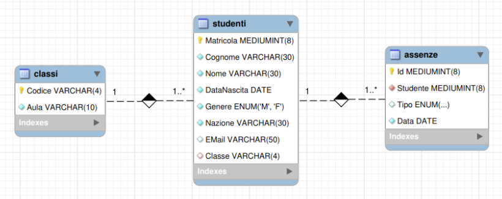

# SQL in MySQL/MariaDB - ordinamento, elaborazione, raggruppamento

- [SQL in MySQL/MariaDB - ordinamento, elaborazione, raggruppamento](#sql-in-mysqlmariadb---ordinamento-elaborazione-raggruppamento)
  - [Ordinamento dei dati](#ordinamento-dei-dati)
    - [Esempio di ordinamento di dati](#esempio-di-ordinamento-di-dati)
  - [Elaborazione dei dati](#elaborazione-dei-dati)
    - [Colonne calcolate](#colonne-calcolate)
      - [un esempio di colonne calcolate](#un-esempio-di-colonne-calcolate)
    - [Funzioni di gruppo](#funzioni-di-gruppo)
      - [COUNT(\*)](#count)
      - [COUNT(expr)](#countexpr)
      - [COUNT(DISTINCT expr,\[expr...\])](#countdistinct-exprexpr)
      - [Esempi di utilizzo di COUNT(expr) e COUNT(DISTINCT expr)](#esempi-di-utilizzo-di-countexpr-e-countdistinct-expr)
      - [AVG()](#avg)
      - [MIN() e MAX()](#min-e-max)
      - [SUM()](#sum)
      - [Esempi di utilizzo di funzioni di gruppo](#esempi-di-utilizzo-di-funzioni-di-gruppo)
    - [Raggruppamento dei dati](#raggruppamento-dei-dati)
      - [Sintassi SQL per il raggruppamento](#sintassi-sql-per-il-raggruppamento)
      - [Esempi di query con GROUP BY con il database `piscine_milano`](#esempi-di-query-con-group-by-con-il-database-piscine_milano)
      - [Esempi di query con GROUP BY con il database `dbscuola2`](#esempi-di-query-con-group-by-con-il-database-dbscuola2)

## Ordinamento dei dati

Per ordinare i risultati di una query si usa la clausola `ORDER BY`:

`ORDER BY <Colonna1> [ASC, DESC] {,<Colonna2> [ASC, DESC]}`

`ASC` è usato per l’ordinamento crescente (default in MySQL/MariaDb) :arrow_right: prima i valori minori e poi i valori maggiori rispetto alla relazione d'ordine applicata.

`DESC` è usato per l’ordinamento decrescente :arrow_right: prima i valori maggiori e poi i valori maggiori rispetto alla relazione d'ordine applicata.

:memo: **Importante**: Nell’ordinamento multiplo, le righe della tabella risultato sono ordinate prima in base ai valori della prima colonna, in seguito, nel caso di valori uguali sulla prima colonna, si effettua un ordinamento sulla base della seconda colonna e così via.

### Esempio di ordinamento di dati

Con riferimento al database `piscine_milano`, eseguire la query seguente:

```sql
-- riportare i nomi delle persone iscritte ai corsi che hanno un certificato medico rilasciato da un dato dottore. Ordinare il risultato in base al cognome, al nome e alla data di nascita

SELECT p.Cognome, p.Nome, ic.DataNascita
FROM persone p INNER JOIN iscritti_corsi ic 
ON p.CodiceFiscale = ic.Persona
WHERE ic.NomeMedico = 'nome_del_medico'
ORDER BY p.Cognome, p.Nome, ic.DataNascita;
```

> :memo: **Importante**: **La clausola `ORDER BY` è eseguita dopo la `SELECT`**
>
> Come conseguenza di ciò **è possibile ordinare i dati anche rispetto ad alias e a colonne calcolate definite nella SELECT**

## Elaborazione dei dati

In una query SQL è possibile definire nuove elaborazioni sulle colonne presenti nella tabella derivata, ottenuta dalla stessa query. Le elaborazioni posso riguardare:

- La definizione di colonne calcolate;

- L'applicazione di funzioni aggregate SQL.

### Colonne calcolate

Le `colonne calcolate` sono colonne dichiarate dopo la clausola `SELECT` e legate mediante un'espressione ai valori delle altre colonne.

Le espressioni possono essere di diverso tipo: aritmetiche, logiche, etc.

Nel [manuale di MySQL](https://dev.mysql.com/doc/refman/9.1/en/functions.html) oppure in [quello di MariaDb](https://mariadb.com/kb/en/function-and-operator-reference/) è presente un elenco molto vasto di operatori e funzioni utilizzabili per realizzare colonne calcolate.
> :memo: È buona norma rinominare le colonne calcolate.

#### un esempio di colonne calcolate

Con riferimento al database `piscine_milano`, eseguire la query seguente:

```sql
SELECT CONCAT(i.Cognome,', ',i.Nome, ' (', i.CodiceFiscale,')') AS `Nome, Cognome (Codice Fiscale)`
FROM insegnanti i
ORDER BY  i.Cognome, i.Nome;
```

Per approfondimenti sulle funzioni relative alle stringhe si può consultare la documentazione di [MySQL](https://dev.mysql.com/doc/refman/9.1/en/string-functions.html), oppure quella di [MariaDb](https://mariadb.com/kb/en/string-functions/).

### Funzioni di gruppo

In SQL vi sono diverse funzioni aggregate tra cui le fondamentali sono:

- `COUNT`
- `AVG`
- `MIN`
- `MAX`
- `SUM`

I DBMS implementano anche altre funzioni di gruppo. Per vedere l'elenco completo di tali funzioni si veda la documentazione specifica di [MySQL](https://dev.mysql.com/doc/refman/9.1/en/aggregate-functions.html), oppure di [MariaDb](https://mariadb.com/kb/en/aggregate-functions/)

#### COUNT(*)

Uso: `SELECT COUNT(*) FROM <Tabella>`

Fornisce il numero di righe di una tabella, anche se queste contengono valori `NULL`

Ad esempio, con riferimento al database `piscine_milano`:

```sql
SELECT COUNT(*) AS `Numero di piscine` FROM piscine;
```

| Numero di piscine |
|-------------------|
|                 3 |

#### COUNT(expr)

Uso: `SELECT COUNT(expr) FROM <Tabella>`

Fornisce il numero di valori `NOT NULL` di `expr` nelle colonne ricavate dall’istruzione `SELECT`.

Il risultato è un `BIGINT`.

Nel caso non vi fossero colonne con valori `NOT NULL` di `expr` la `COUNT(expr)` fornisce `0`.

#### COUNT(DISTINCT expr,[expr...])

Uso: `SELECT COUNT(DISTINCT expr,[expr...]) FROM <Tabella>;`

Fornisce il numero di righe con *valori distinti* di `expr` `NOT NULL`.

> :memo: `COUNT(DISTINCT)` fornisce `0` se non ci sono righe con valori di `expr` `NOT NULL`  
  
#### Esempi di utilizzo di COUNT(expr) e COUNT(DISTINCT expr)

Con riferimento al database `piscine_milano`, Si supponga di dover rispondere alla seguente query: *trovare le persone iscritte ai corsi di tutte le piscine*

```sql
-- le persone iscritte ai corsi con i relativi corsi 
SELECT p.Cognome, p.Nome, fc.NomeC
FROM 
frequenta_corsi fc
NATURAL JOIN
iscritti_corsi ic
INNER JOIN persone p
ON p.CodiceFiscale = ic.Persona;

-- il numero di persone iscritte ai corsi si può trovare considerando semplicemente la tabella frequenta_corsi

SELECT Persona, NomeC `Nome Corso`
FROM frequenta_corsi;
```

Si noti che nell'output della seconda query compare due volte la stessa persona (stesso codice fiscale). Il motivo di ciò è che una stessa persona può essere iscritto a più corsi.

| Persona          | Nome Corso          |
|------------------|---------------------|
| CRSALS90B24B347R | Acquagym            |
| DGNMTT74B24C127R | Corso di Salvamento |
| DGNMTT74B24C127R | Nuoto Libero        |

```sql
-- il numero di persone iscritte ai corsi
SELECT COUNT(Persona) `Numero di iscrizioni ai corsi`
from frequenta_corsi;
```

| Numero di persone iscritte ai corsi |
|-------------------------------------|
|                                   3 |

```sql
-- il numero di persone distinte, che frequentano i corsi è dato da:
SELECT COUNT(DISTINCT Persona) `Numero di persone distinte iscritte`
FROM frequenta_corsi;
```

| Numero di persone distinte iscritte |
|-------------------------------------|
|                                   2 |

```sql
-- trovare il numero di persone maggiorenni iscritte ai corsi
-- L'età delle persone iscritte si può trovare in diversi modi, ad esempio :
SELECT IF( RIGHT(ic.DataNascita,5) <= RIGHT(CURDATE(),5),
    YEAR(CURDATE()) - YEAR(ic.DataNascita), 
    (YEAR(CURDATE()) - YEAR(ic.DataNascita)) - 1) AS `Età`
  FROM iscritti_corsi ic;

-- un altro modo per calcolare l'età delle persone è il seguente:
SELECT  YEAR(CURDATE()) - YEAR(ic.DataNascita) - (RIGHT(CURDATE(),5) < RIGHT(ic.DataNascita,5)) AS `Età`
FROM iscritti_corsi ic;

-- se si volesse CodiceFiscale, Nome, Cognome ed Età delle persone, la query diventerebbe: 
SELECT p.Cognome, p.Nome, YEAR(CURDATE()) - YEAR(ic.DataNascita) - (RIGHT(CURDATE(),5) < RIGHT(ic.DataNascita,5)) AS `Età`
FROM 
iscritti_corsi ic 
JOIN persone p
ON ic.Persona = p.CodiceFiscale;
```

| Cognome     | Nome    | Età  |
|-------------|---------|------|
| Caruso      | Alessio |   18 |
| Di Giovanni | Mattia  |   34 |

```sql
-- se si volesse riportare il numero di maggiorenni iscritti ai corsi

SELECT COUNT(*) AS `Numero Maggiorenni`
FROM iscritti_corsi ic
WHERE  YEAR(CURDATE()) - YEAR(ic.DataNascita) - (RIGHT(CURDATE(),5) < RIGHT(ic.DataNascita,5)) >= 18;
```

| Numero Maggiorenni |
|--------------------|
|                  2 |

```sql
-- Riportare cognome, nome e l’età delle sole persone maggiorenni iscritte ai corsi.
SELECT p.Cognome, p.Nome, YEAR(CURDATE()) - YEAR(ic.DataNascita) - (RIGHT(CURDATE(),5) < RIGHT(ic.DataNascita,5)) AS `Età`
FROM 
iscritti_corsi ic 
JOIN persone p
ON ic.Persona = p.CodiceFiscale
WHERE YEAR(CURDATE()) - YEAR(ic.DataNascita) - (RIGHT(CURDATE(),5) < RIGHT(ic.DataNascita,5))>=18;
```

Si osservi che non è possibile definire un alias per le colonne calcolate nella clausola `WHERE`, né è possibile utilizzare l'alias della `SELECT` all'interno della clausola `WHERE` perché in una query si esegue prima la clausola `FROM` poi la `WHERE` e poi la `SELECT`.

> :memo: **Importante**: non è possibile definire un alias nella clausola `WHERE`[^1]. <cite>Standard SQL disallows references to column aliases in a WHERE clause. This restriction is imposed because when the WHERE clause is evaluated, the column value may not yet have been determined</cite>

[^1]: [MySQL Manual - Problems with Column Alias](https://dev.mysql.com/doc/refman/9.1/en/problems-with-alias.html)

#### AVG()

`AVG([DISTINCT] expr)`

Uso, ad esempio: `SELECT AVG([DISTINCT] expr) FROM <Tabella>`

Fornisce il `valor medio` di `expr`. L’opzione `DISTINCT` può essere usata per fornire il valor medio dei valori distinti di expr.

`AVG(expr)` fornisce `NULL` se non ci sono righe su cui valutare la media.

#### MIN() e MAX()

`MIN([DISTINCT] expr)`

`MAX([DISTINCT] expr)`

Uso, ad esempio:

`SELECT MIN([DISTINCT] expr) FROM <Tabella>`

`SELECT MAX ([DISTINCT] expr) FROM <Tabella>`

`MIN`: Fornisce il `minimo valore` di `expr`.

`MIN()` può accettare una stringa come argomento; in questo caso fornisce la stringa con valore minimo, ossia più piccola in base all’ordinamento sulle stringhe. La clausola `DISTINCT` può essere usata per trovare il minimo tra valori distinti di `expr`, ma ovviamente fornisce lo stesso risultato che si ottiene omettendo `DISTINCT`.

`MAX`: è analoga a `MIN`, *fatte le dovute modifiche* …

#### SUM()

`SUM([DISTINCT] expr)`

Uso, ad esempio:

`SELECT SUM([DISTINCT] expr)  FROM <Tabella>`

Fornisce la somma di expr.

Se l’insieme su cui eseguire la somma è vuoto, `SUM()` fornisce il valore `NULL`.
La parola chiave DISTINCT può essere usata per sommare solo i `valori distinti` di `expr`.

#### Esempi di utilizzo di funzioni di gruppo

```sql
-- l'età media di tutti gli iscritti ai corsi del database piscine_milano
SELECT AVG(YEAR(CURDATE()) - YEAR(ic.DataNascita) - (RIGHT(CURDATE(),5) < RIGHT(ic.DataNascita,5))) AS `Età media`
FROM iscritti_corsi ic;
```

| Età media  |
|------------|
|    26.0000 |

```sql
-- l'età minima tra tutti gli iscritti ai corsi del database piscine_milano
SELECT MIN(YEAR(CURDATE()) - YEAR(ic.DataNascita) - (RIGHT(CURDATE(),5) < RIGHT(ic.DataNascita,5))) AS `Età minima`
FROM iscritti_corsi ic;
```

| Età minima  |
|-------------|
|          18 |

### Raggruppamento dei dati

SQL permette di applicare le funzioni di gruppo per elaborare gruppi di dati.

- Il gruppo di dati è individuato dalla clausola `GROUP BY`.
- Ad un gruppo di dati è applicata una **funzione di gruppo** in modo da ottenere un solo valore per ogni gruppo;

#### Sintassi SQL per il raggruppamento

```sql
SELECT NomeColonnaGruppo, FunzioneGruppo(NomeColonna) 
…
GROUP BY NomeColonnaGruppo
[HAVING <CondizioneRicercaColonnaGruppo>]
```

In generale:

```sql
SELECT NomeColonnaGruppo1 [,NomeColonnaGruppo2]...[,NomeColonnaGruppoN], FunzioneGruppo1(NomeColonna1),[FunzioneGruppo2(NomeColonna2)]...[FunzioneGruppoN(NomeColonnaN)]
…
GROUP BY NomeColonnaGruppo1 [,NomeColonnaGruppo2]...[NomeColonnaGruppoN]
[HAVING <CondizioneRicercaColonnaGruppo>]
```

MySQL/MariaDb valutano la [GROUP BY](https://www.mysqltutorial.org/mysql-basics/mysql-group-by/) dopo le clausole `FROM` e [WHERE](https://www.mysqltutorial.org/mysql-basics/mysql-where/) ma prima delle clausole [HAVING](https://www.mysqltutorial.org/mysql-basics/mysql-having/), `SELECT`, [DISTINCT](https://www.mysqltutorial.org/mysql-basics/mysql-distinct/), [ORDER BY](https://www.mysqltutorial.org/mysql-basics/mysql-order-by/) and [LIMIT](https://www.mysqltutorial.org/mysql-basics/mysql-limit/):


Nel caso in cui ci sia anche la clausola [`HAVING`](https://www.mysqltutorial.org/mysql-basics/mysql-having/) il diagramma di esecuzione è:


Nella pratica, l'utilizzo della clausola `GROUP BY` è abbinato all'uso di una funzione di gruppo ([aggregate functions](https://www.mysqltutorial.org/mysql-aggregate-functions/)) come [SUM](https://www.mysqltutorial.org/mysql-aggregate-functions/mysql-sum/), [AVG](https://www.mysqltutorial.org/mysql-aggregate-functions/mysql-avg/), [MAX](https://www.mysqltutorial.org/mysql-aggregate-functions/mysql-max-function/), [MIN](https://www.mysqltutorial.org/mysql-aggregate-functions/mysql-min/), e [COUNT](https://www.mysqltutorial.org/mysql-aggregate-functions/mysql-count/). In questo caso la funzione di gruppo che appare nella clausola `SELECT` definisce ciò che viene riportato dalla query per ogni gruppo.

> :memo: :bulb: **Osservazione importante**: Quando in una query SQL compare una funzione di gruppo, i DBMS eseguono, nell’ordine, i seguenti passi:
>
> - Esecuzione della query SQL senza le funzioni aggregate e calcolo della tabella derivata con il risultato
> - Applicazione delle funzioni di gruppo alle colonne della tabella derivata.

#### Esempi di query con GROUP BY con il database `piscine_milano`

```sql
-- riportare le prossime lezioni in programma per le piscine

-- la situazione nel  momento in cui si esegue la query è
SELECT CURDATE();
```

| CURDATE()  |
|------------|
| 2024-10-25 |

```SQL
SELECT * FROM lezioni;
```

| Piscina | NomeC               | Giorno     | Ora      |
|---------|---------------------|------------|----------|
| Cozzi   | Acquagym            | 2024-10-15 | 22:30:00 |
| Cozzi   | Acquagym            | 2024-10-22 | 22:30:00 |
| Cozzi   | Acquagym            | 2024-10-29 | 22:30:00 |
| Cozzi   | Acquagym            | 2024-11-05 | 22:30:00 |
| Cozzi   | Acquagym            | 2024-11-12 | 22:30:00 |
| Lido    | Acquagym            | 2024-10-15 | 20:30:00 |
| Lido    | Acquagym            | 2024-10-22 | 20:30:00 |
| Lido    | Acquagym            | 2024-10-29 | 20:30:00 |
| Lido    | Acquagym            | 2024-11-05 | 20:30:00 |
| Lido    | Acquagym            | 2024-11-12 | 20:30:00 |
| Lido    | Corso di Salvamento | 2024-10-15 | 17:30:00 |
| Lido    | Corso di Salvamento | 2024-10-22 | 17:30:00 |
| Lido    | Corso di Salvamento | 2024-10-29 | 17:30:00 |
| Lido    | Corso di Salvamento | 2024-11-05 | 17:30:00 |
| Lido    | Corso di Salvamento | 2024-11-12 | 17:30:00 |

```sql
-- il numero delle lezioni programmate, raggruppate per piscina è
SELECT l.Piscina, COUNT(*) AS `Numero delle prossime lezioni in programma`
FROM lezioni l
GROUP BY l.Piscina;
```

| Piscina | Numero delle prossime lezioni in programma |
|---------|--------------------------------------------|
| Cozzi   |                                          5 |
| Lido    |                                         10 |

```sql
-- il numero delle prossime lezioni in programma per le piscine, raggruppate per piscina è
SELECT l.Piscina, COUNT(*) AS `Numero delle prossime lezioni in programma`
FROM lezioni l
WHERE l.Giorno >= CURDATE() 
GROUP BY l.Piscina;
```

| Piscina | Numero delle prossime lezioni in programma |
|---------|--------------------------------------------|
| Cozzi   |                                          3 |
| Lido    |                                          6 |

Per spiegare come si giunge al precedente risultato si deve ricordare come un DBMS esegue la `GROUP BY`:

1. Esecuzione dell’interrogazione senza `GROUP BY`, `HAVING`  e le funzioni di gruppo.  La query dell’esempio diventa:

    ```sql
    SELECT l.Piscina, l.NomeC, l.Giorno, l.Ora
    FROM lezioni l
    WHERE l.Giorno >= CURDATE(); 
    ```

    | Piscina | NomeC               | Giorno     | Ora      |
    |---------|---------------------|------------|----------|
    | Cozzi   | Acquagym            | 2024-10-29 | 22:30:00 |
    | Cozzi   | Acquagym            | 2024-11-05 | 22:30:00 |
    | Cozzi   | Acquagym            | 2024-11-12 | 22:30:00 |
    | Lido    | Acquagym            | 2024-10-29 | 20:30:00 |
    | Lido    | Acquagym            | 2024-11-05 | 20:30:00 |
    | Lido    | Acquagym            | 2024-11-12 | 20:30:00 |
    | Lido    | Corso di Salvamento | 2024-10-29 | 17:30:00 |
    | Lido    | Corso di Salvamento | 2024-11-05 | 17:30:00 |
    | Lido    | Corso di Salvamento | 2024-11-12 | 17:30:00 |

2. Il DBMS raggruppa le righe della tabella derivata in sottoinsiemi che hanno lo stesso valore del `NomeColonnaGruppo` presente nella clausola `GROUP BY`. Nell’esempio le righe sono raggruppate per Piscina.

3. Sulla tabella con i dati raggruppati si esegue una eventuale restrizione  dei gruppi sulla base della clausola `HAVING` e si eseguono  le funzioni di gruppo su ciascun gruppo

Ricapitolando:

La clausola `GROUP BY`:

1. Raggruppa le righe della tabella derivata in sottoinsiemi, ognuno dei quali è individuato dallo stesso valore della colonna di gruppo (`NomeColonnaGruppo`);
2. Applica la funzione aggregata ai gruppi di valori individuati.

La clausola `HAVING` (opzionale) :

1. Ricerca tra i valori della colonna di gruppo soltanto quelli che soddisfano la condizione scritta dopo la stessa parola chiave (HAVING).

```sql
-- trovare il numero delle prossime lezioni in programma per le piscine, raggruppate per piscina e per nome del corso
SELECT l.Piscina,l.NomeC, COUNT(*) AS `Numero di lezioni in programma`
FROM lezioni l
WHERE l.Giorno >= CURDATE() 
GROUP BY l.Piscina, l.NomeC;
```

| Piscina | NomeC               | Numero di lezioni in programma |
|---------|---------------------|--------------------------------|
| Cozzi   | Acquagym            |                              3 |
| Lido    | Acquagym            |                              3 |
| Lido    | Corso di Salvamento |                              3 |

```sql
-- il numero delle prossime lezioni in programma per tutte le piscine, relative ai corsi di Acquagym
-- prima versione
SELECT l.Piscina, l.NomeC, COUNT(*) AS `Numero di lezioni in programma`
FROM lezioni l
WHERE l.Giorno >= CURDATE() 
GROUP BY l.Piscina, l.NomeC
HAVING l.NomeC LIKE '%Acquagym%';
```

| Piscina | NomeC    | Numero di lezioni in programma |
|---------|----------|--------------------------------|
| Cozzi   | Acquagym |                              3 |
| Lido    | Acquagym |                              3 |

```sql
-- seconda versione, in questo caso la condizione di filtro è applicata prima di fare la GROUP BY
-- questa versione è più efficiente dell'altra fatta con la clausola HAVING, poiché riduce prima 
-- la dimensione dell'insieme su cui operare
SELECT l.Piscina, l.NomeC, COUNT(*) AS `Numero di lezioni in programma`
FROM lezioni l
WHERE l.Giorno >= CURDATE() AND l.NomeC LIKE '%Acquagym%'
GROUP BY l.Piscina, l.NomeC;

-- trovare le piscine che hanno almeno due corsi di Acquagym in programma
SELECT l.Piscina, l.NomeC, COUNT(*) AS `Numero lezioni`
FROM lezioni l
WHERE l.Giorno >= CURDATE() 
GROUP BY l.Piscina, l.NomeC
HAVING `Numero lezioni` >=2;
```

 :memo: :fire: **Osservazione importante**: nella query precedente è corretto utilizzare l'alias per la funzione di gruppo `COUNT(*)` nella clausola `HAVING`, perché la funzione di gruppo è calcolata quando viene eseguita la clausola `GROUP BY` e non quando viene eseguita la clausola `SELECT`. Si osservi anche che è fondamentale usare i backtick (\`) quando nei nomi di colonna calcolati ci sono degli spazi. Se al posto dei backtick (\`), usassimo i ingle quote (\'), la query precedente non darebbe il risultato corretto.

:memo: :skull: **Errori da evitare**:

1. Dimenticare di scrivere dopo la clausola `SELECT` il nome delle colonne usate per il raggruppamento, indicate dopo la clausola `GROUP BY`
2. Non confondere la clausola `HAVING` con la clausola `WHERE`: la clausola `WHERE` definisce una restrizione nella prima fase della query (quando il raggruppamento non è stato ancora eseguito); `HAVING` interviene nella seconda fase della query per definire un'altra restrizione successiva al primo passo; questa restrizione deve riguardare obbligatoriamente le colonne dopo la clausola `GROUP BY`.

#### Esempi di query con GROUP BY con il database `dbscuola2`

Si consideri il database `dbscuola2`, descritto dal seguente schema:



```SQL
CREATE DATABASE IF NOT EXISTS dbscuola2;
USE dbscuola2;
-- creazione delle tabelle

-- il Codice è del tipo 3IA, 4IA, 2IB, 5IB, 3SC, etc.
-- l'aula è il codice dell'aula nell'istituto, quindi, ad esempio, A33, A21, 'Est. 1'
CREATE TABLE IF NOT EXISTS classi (
    Codice VARCHAR(4) PRIMARY KEY,
    Aula VARCHAR(10) NOT NULL
);

CREATE TABLE IF NOT EXISTS studenti (
    Matricola MEDIUMINT UNSIGNED AUTO_INCREMENT PRIMARY KEY,
    Cognome varchar(30) NOT NULL,
    Nome varchar(30) NOT NULL,
    DataNascita date NOT NULL,
    Genere enum('M', 'F') NOT NULL,
    Nazione varchar(30) NOT NULL default 'Italia',
    EMail varchar(50),
    Classe VARCHAR(4),
    FOREIGN KEY (Classe) REFERENCES classi (Codice) ON DELETE SET NULL ON UPDATE CASCADE
) ENGINE = InnoDB;

CREATE TABLE IF NOT EXISTS assenze (
    Id MEDIUMINT UNSIGNED AUTO_INCREMENT PRIMARY KEY,
    Studente MEDIUMINT UNSIGNED NOT NULL,
    Tipo ENUM('AA', 'AG', 'RR', 'RG') DEFAULT 'AA',
    Data DATE NOT NULL,
    FOREIGN KEY (Studente) REFERENCES studenti (Matricola)
) ENGINE = InnoDB;
```

Il database può essere ricreato a partire da questo [script](../../sql-scripts/06-scuola2/dbscuola2.sql).

Q1: stampare il numero totale di assenze fatte in tutto l’anno scolastico da uno studente (di cui sono noti nome e cognome) di una data classe, classificate per tipo.
Q2: visualizzare, al termine di un anno scolastico, il numero totale di assenze non giustificate effettuate nelle classi della scuola; le classi devono essere presentate in ordine alfabetico.
Q3: stampare l’andamento delle assenze e dei ritardi non giustificati (classificati per mese) di un anno scolastico di uno studente di una classe.

```sql
-- Query Q1: Stampare il numero totale di assenze fatte in tutto l'anno scolastico da uno studente (di cui sono noti nome e cognome) di una data classe, classificate per tipo.
SELECT Tipo, COUNT(*) AS TotaleAssenze
FROM assenze a
JOIN studenti s ON a.Studente = s.Matricola
WHERE s.Nome = 'Mario' AND s.Cognome = 'Rossi' AND s.Classe = '3IA'
GROUP BY Tipo;

-- Query Q2: Visualizzare, al termine di un anno scolastico, il numero totale di assenze non giustificate effettuate nelle classi della scuola; 
-- le classi devono essere presentate in ordine alfabetico

SELECT s.Classe, COUNT(*) AS TotaleAssenzeNonGiustificate
FROM assenze a
JOIN studenti s ON a.Studente = s.Matricola
WHERE a.Tipo = 'AA'
GROUP BY s.Classe
ORDER BY s.Classe ASC;

-- Query Q3: Stampare l’andamento delle assenze e dei ritardi non giustificati (classificati per mese) di uno studente di una classe.
SELECT 
    MONTH(a.Data) AS Mese, 
    a.Tipo, 
    COUNT(*) AS Totale
FROM assenze a
JOIN studenti s ON a.Studente = s.Matricola
WHERE s.Nome = 'Mario' AND s.Cognome = 'Rossi' AND s.Classe = '3IA'
AND a.Tipo IN ('AA', 'RR')
GROUP BY Mese, a.Tipo
ORDER BY Mese;
```

