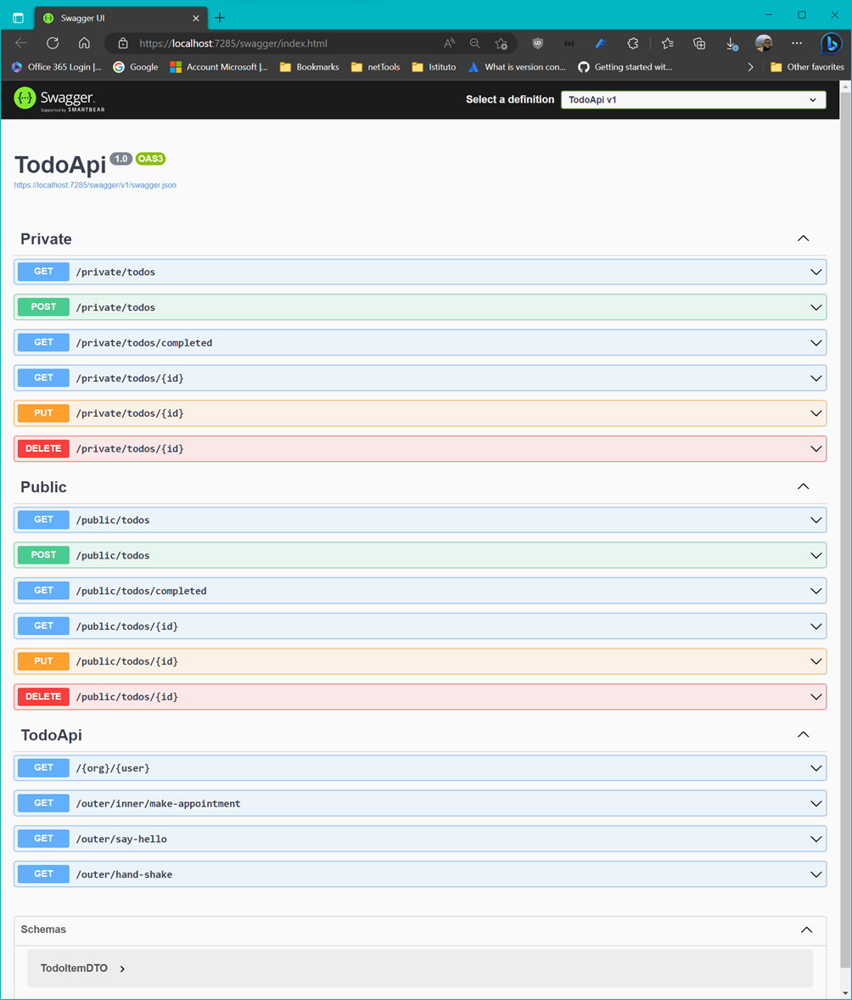

# Minimal API: OpenAPI Support, Route Handling, Error Handling

- [Minimal API: OpenAPI Support, Route Handling, Error Handling](#minimal-api-openapi-support-route-handling-error-handling)
  - [OpenAPI Support](#openapi-support)
    - [Installazione dei pacchetti](#installazione-dei-pacchetti)
    - [Un progetto di esempio - `PizzaStoreV3`](#un-progetto-di-esempio---pizzastorev3)
    - [Generazione e configurazione di OpenAPI](#generazione-e-configurazione-di-openapi)
      - [Configurazione del `document name`](#configurazione-del-document-name)
      - [Configurazione della versione di OpenAPI generata](#configurazione-della-versione-di-openapi-generata)
      - [Configurazione dell'endpoint route di OpenAPI](#configurazione-dellendpoint-route-di-openapi)
      - [Accesso limitato alla documentazione di OpenAPI](#accesso-limitato-alla-documentazione-di-openapi)
      - [Caching del documento di OpenAPI](#caching-del-documento-di-openapi)
      - [Generazione del documento di OpenAPI al tempo di compilazione](#generazione-del-documento-di-openapi-al-tempo-di-compilazione)
      - [Integrazione delle configurazioni di OpenAPI in Swagger](#integrazione-delle-configurazioni-di-openapi-in-swagger)
      - [Include OpenAPI metadata in an ASP.NET Core app](#include-openapi-metadata-in-an-aspnet-core-app)
        - [Include OpenAPI metadata for endpoints](#include-openapi-metadata-for-endpoints)
          - [Summary and description](#summary-and-description)
          - [tags](#tags)
          - [operationId](#operationid)
          - [parameters](#parameters)
          - [Describe the request body](#describe-the-request-body)
          - [Describe response types](#describe-response-types)
          - [Set responses for ProblemDetails](#set-responses-for-problemdetails)
          - [Multiple response types](#multiple-response-types)
          - [Exclude endpoints from the generated document](#exclude-endpoints-from-the-generated-document)
          - [Include OpenAPI metadata for data types](#include-openapi-metadata-for-data-types)
          - [type and format](#type-and-format)
          - [Use attributes to add metadata](#use-attributes-to-add-metadata)
  - [Route Handlers in Minimal API apps](#route-handlers-in-minimal-api-apps)
    - [Route handlers](#route-handlers)
      - [Lambda expression](#lambda-expression)
      - [Local function](#local-function)
      - [Instance method](#instance-method)
      - [Static method](#static-method)
      - [Endpoint defined outside of `Program.cs`](#endpoint-defined-outside-ofprogramcs)
      - [Named endpoints and link generation](#named-endpoints-and-link-generation)
      - [Route Parameters](#route-parameters)
      - [Wildcard and catch all routes](#wildcard-and-catch-all-routes)
      - [Route constraints](#route-constraints)
      - [Route groups](#route-groups)
  - [Error Handling](#error-handling)
    - [Exceptions](#exceptions)
      - [Developer Exception Page](#developer-exception-page)
      - [Exception handler](#exception-handler)
      - [Client and Server error responses](#client-and-server-error-responses)
      - [Problem details](#problem-details)

## OpenAPI Support

In questa sezione verranno approfonditi alcuni concetti già visti nei primi esempi di `Minimal API`, relativi al supporto alla documentazione `OpenAPI`.

La [documentazione Microsoft relativa alla generazione della documentazione OpenAPI](https://learn.microsoft.com/en-us/aspnet/core/fundamentals/openapi/aspnetcore-openapi) specifica che:

The [`Microsoft.AspNetCore.OpenApi`](https://www.nuget.org/packages/Microsoft.AspNetCore.OpenApi) package provides built-in support for OpenAPI document generation in ASP.NET Core. The package provides the following features:

- Support for generating OpenAPI documents at run time and accessing them via an endpoint on the application.
- Support for "transformer" APIs that allow modifying the generated document.
- Support for generating multiple OpenAPI documents from a single app.
- Takes advantage of JSON schema support provided by [`System.Text.Json`](https://learn.microsoft.com/en-us/dotnet/api/system.text.json).
- Is compatible with native AoT.

### Installazione dei pacchetti

Il pacchetto richiesto per il supporto alla documentazione OpenAPI in ASP.NET Core è:

```sh
dotnet add package Microsoft.AspNetCore.OpenApi
```

Tuttavia, per avere anche il supporto alla versione grafica della documentazione mediante l'interfaccia `Swagger`, è opportuno installare anche il pacchetto:

```sh
dotnet add package NSwag.AspNetCore
```

### Un progetto di esempio - `PizzaStoreV3`

La configurazione di una applicazione ASP.NET Core per il supporto a `OpenAPI` può essere fatta come già visto negli esempi precedenti. Ad esempio, si consideri il progetto [`PizzaStoreV3`](../../../api-samples/minimal-api/PizzaStore/PizzaStoreV3/) il cui punto di partenza è il progetto [`PizzaStoreV1`](../../../api-samples/minimal-api/PizzaStore/PizzaStoreV1/):

```cs
using Microsoft.EntityFrameworkCore;
using PizzaStoreV3.Data;
using PizzaStoreV3.Model;

var builder = WebApplication.CreateBuilder(args);
// 👈 si aggiunga la connection string
var connectionString = builder.Configuration.GetConnectionString("Pizzas") ?? "Data Source=DefaultPizzas.db";

// Add services to the container.
// Learn more about configuring OpenAPI at https://aka.ms/aspnet/openapi
builder.Services.AddOpenApi();
//adding API explorer
builder.Services.AddEndpointsApiExplorer();
//adding OpenAPI configuration with NSwag
//questa configurazione è richiesta solo nel caso in cui si voglia il supporto a Swagger tramite NSwag
builder.Services.AddOpenApiDocument(config =>
{
	config.DocumentName = "PizzaStoreAPIv3";
	config.Title = "PizzaStore v3";
	config.Version = "v1";
});

//adding services to the container
if (builder.Environment.IsDevelopment())
{
	//il servizio AddDatabaseDeveloperPageExceptionFilter andrebbe usato solo in fase di testing e non in produzione.
	builder.Services.AddDatabaseDeveloperPageExceptionFilter();
}
// 👈 si aggiunga il DbContext per l'accesso al database
//builder.Services.AddDbContext<PizzaDb>(options => options.UseInMemoryDatabase("items"));  
// 👈 si modifichi il DbContext per l'accesso al database 
builder.Services.AddDbContext<PizzaDb>(options => options.UseSqlite(connectionString));
var app = builder.Build();


//app.UseHttpsRedirection();

//adding middleware for Swagger and OpenAPI
if (app.Environment.IsDevelopment())
{
	//adding middleware for OpenAPI
	app.MapOpenApi();
	//adding middleware for Swagger
	app.UseOpenApi();
	//adding web UI for Swagger with NSwag
	app.UseSwaggerUi(config =>

	{
		config.DocumentTitle = "PizzaStore API v3";
		config.Path = "/swagger";
		config.DocumentPath = "/swagger/{documentName}/swagger.json";
		config.DocExpansion = "list";
	});
}
//creations of API Endpoint Routes
app.MapGet("/", () => "Hello World!");

app.MapGet("/pizzas", async (PizzaDb db) => await db.Pizzas.ToListAsync());

app.MapPost("/pizza", async (PizzaDb db, Pizza pizza) =>
{
	db.Pizzas.Add(pizza);
	await db.SaveChangesAsync();
	return Results.Created($"/pizza/{pizza.Id}", pizza);
});

app.MapGet("/pizza/{id}", async (PizzaDb db, int id) => await db.Pizzas.FindAsync(id));

app.MapPut("/pizza/{id}", async (PizzaDb db, Pizza updatePizza, int id) =>
{
	var pizza = await db.Pizzas.FindAsync(id);
	if (pizza is null) return Results.NotFound();
	pizza.Name = updatePizza.Name;
	pizza.Description = updatePizza.Description;
	await db.SaveChangesAsync();
	return Results.NoContent();
});
app.MapDelete("/pizza/{id}", async (PizzaDb db, int id) =>
{
	var pizza = await db.Pizzas.FindAsync(id);
	if (pizza is null)
	{
		return Results.NotFound();
	}
	db.Pizzas.Remove(pizza);
	await db.SaveChangesAsync();
	return Results.Ok();
});

app.Run();

```

Se si prova a lanciare l'esecuzione del progetto si vedrà che è possibile ottenere la documentazione prodotta da OpenAPI con:

```sh
GET http://localhost:5064/openapi/v1.json
```

Il numero di porta a cui è possibile reperire la documentazione in formato `JSON` è lo stesso su cui è in ascolto l'applicazione `ASP.NET Core` e che può essere configurato modificando i parametri del file `launchSettings.json`. Si noti che il nome del documento è `v1.json`.

Se oltre a configurare `OpenApi`, si configura anche il supporto alla visualizzazione della documentazione mediante `Swagger` con il pacchetto `NSwag`, è possibile reperire la documentazione delle API in formato `JSON` anche con:

```sh
GET http://localhost:5064/swagger/PizzaStoreAPIv3/swagger.json
```

Se si analizzano i due file `JSON` di documentazione, si vedrà che questi sono molto simili tra loro, ma non identici.

### [Generazione e configurazione di OpenAPI](https://learn.microsoft.com/en-us/aspnet/core/fundamentals/openapi/aspnetcore-openap)

#### Configurazione del `document name`

Each OpenAPI document in an app has a unique name. The default document name that is registered is v1.

```cs
builder.Services.AddOpenApi(); // Document name is v1
```

The document name can be modified by passing the name as a parameter to the AddOpenApi call.

```cs
builder.Services.AddOpenApi("internal"); // Document name is internal
```

Con questa ultima configurazione il documento `JSON` che descrive le API è reperibile mediante:

```sh
GET http://localhost:5064/openapi/internal.json
```

#### Configurazione della versione di OpenAPI generata

By default, OpenAPI document generation creates a document that is compliant with [v3.0 of the OpenAPI specification](https://spec.openapis.org/oas/v3.0.0). The following code demonstrates how to modify the default version of the OpenAPI document:

```cs
builder.Services.AddOpenApi(options =>
{
    options.OpenApiVersion = OpenApiSpecVersion.OpenApi2_0;
});

//oppure, se si volesse modificare sia il nome che le opzioni:
builder.Services.AddOpenApi("internal", options => 
{
	options.OpenApiVersion = OpenApiSpecVersion.OpenApi2_0;
});
```

#### Configurazione dell'endpoint route di OpenAPI

By default, the OpenAPI endpoint registered via a call to [MapOpenApi](https://learn.microsoft.com/en-us/dotnet/api/microsoft.aspnetcore.builder.openapiendpointroutebuilderextensions.mapopenapi) exposes the document at the `/openapi/{documentName}.json` endpoint. The following code demonstrates how to customize the route at which the OpenAPI document is registered:

```cs
app.MapOpenApi("/openapi/{documentName}/openapi.json");
```

It's possible, but not recommended, to remove the `documentName` route parameter from the endpoint route. When the `documentName` route parameter is removed from the endpoint route, the framework attempts to resolve the document name from the query parameter. Not providing the `documentName` in either the route or query can result in unexpected behavior.

:memo: Because the OpenAPI document is served via a route handler endpoint, any customization that is available to standard minimal endpoints is available to the OpenAPI endpoint.

#### Accesso limitato alla documentazione di OpenAPI

The OpenAPI endpoint doesn't enable any authorization checks by default. However, authorization checks can be applied to the OpenAPI document. In the following code, access to the OpenAPI document is limited to those with the `tester` role:

```cs
using Microsoft.AspNetCore.Authentication;
using Microsoft.AspNetCore.Builder;
using Microsoft.AspNetCore.OpenApi;
using Microsoft.Extensions.DependencyInjection;
using Microsoft.OpenApi.Models;

var builder = WebApplication.CreateBuilder();

builder.Services.AddAuthentication().AddJwtBearer();

//👇  definisce una authorization policy per l'accesso
//all'endpoint della documentazione di OpenAPI. 
//I dettagli sulle authorization policies verranno chiariti in seguito
builder.Services.AddAuthorization(o =>
{
    o.AddPolicy("ApiTesterPolicy", b => b.RequireRole("tester"));
});
builder.Services.AddOpenApi();

var app = builder.Build();

//👇 applica l'authorization policy denominata "ApiTesterPolicy"
app.MapOpenApi()
    .RequireAuthorization("ApiTesterPolicy");

app.MapGet("/", () => "Hello world!");

app.Run();

```

#### Caching del documento di OpenAPI

The OpenAPI document is regenerated every time a request to the OpenAPI endpoint is sent. Regeneration enables transformers to incorporate dynamic application state into their operation. For example, regenerating a request with details of the HTTP context. When applicable, the OpenAPI document can be cached to avoid executing the document generation pipeline on each HTTP request.

```cs
using Microsoft.AspNetCore.Builder;
using Microsoft.AspNetCore.OpenApi;
using Microsoft.Extensions.DependencyInjection;
using Microsoft.OpenApi.Models;

var builder = WebApplication.CreateBuilder();

//👇definisce un servizio di cache
// i dettagli sull'uso della cache verranno chiariti in seguito
builder.Services.AddOutputCache(options =>
{
    options.AddBasePolicy(policy => policy.Expire(TimeSpan.FromMinutes(10)));
});
builder.Services.AddOpenApi();

var app = builder.Build();

app.UseOutputCache();

//👇 applica il servizio di cache
app.MapOpenApi()
    .CacheOutput();

app.MapGet("/", () => "Hello world!");

app.Run();
```

#### Generazione del documento di OpenAPI al tempo di compilazione

In typical web applications, OpenAPI documents are generated at run-time and served via an HTTP request to the application server.

In some scenarios, it's helpful to generate the OpenAPI document during the application's build step. These scenarios include:

- Generating OpenAPI documentation that is committed into source control.
- Generating OpenAPI documentation that is used for spec-based integration testing.
- Generating OpenAPI documentation that is served statically from the web server.

To add support for generating OpenAPI documents at build time, install the `Microsoft.Extensions.ApiDescription.Server` package:

```sh
dotnet add package Microsoft.Extensions.ApiDescription.Server
```

:memo: :warning: [Enable document generation at build time by setting the following properties in the app's .csproj file](https://learn.microsoft.com/en-us/aspnet/core/fundamentals/openapi/using-openapi-documents):

```xml
<Project Sdk="Microsoft.NET.Sdk.Web">

  <PropertyGroup>
    <TargetFramework>net9.0</TargetFramework>
    <Nullable>enable</Nullable>
    <ImplicitUsings>enable</ImplicitUsings>
  </PropertyGroup>

  
<!--👇 Il seguente property group va aggiunto per avere la generazione del documento con le specifiche OpenAPI. Viene generato un file con il nome del progetto e con estensione .json
https://stackoverflow.com/questions/79303741/asp-net-core-openapi-buildtime-generated-specs-file-does-not-include-prefix -->
  <PropertyGroup>
   <OpenApiDocumentsDirectory>$(MSBuildProjectDirectory)/ApiSpecs</OpenApiDocumentsDirectory>
    <OpenApiGenerateDocumentsOnBuild>true</OpenApiGenerateDocumentsOnBuild>
  </PropertyGroup>

</Project>
```

#### Integrazione delle configurazioni di OpenAPI in Swagger

Nei paragrafi seguenti verranno mostrati i meccanismi per configurare la documentazione di `OpenAPI`. Tale documentazione è tipicamente rappresentata da un file in formato `JSON` che può essere generato al tempo di compilazione (come mostrato al paragrafo precedente) oppure a runtime, reperibile al link `http://application-url/openapi/internal.json`. **In aggiunta a tale documentazione è possibile generare anche la documentazione di `Swagger`, tramite pacchetti aggiuntivi come `NSwag`.**

La documentazione di `Swagger` è reperibile a runtime all'indirizzo configurato nella pipeline dell'applicazione, tipicamente al link `http://application-url/swagger/index.html` nella versione interattiva, oppure, sotto forma di documento `JSON`, all'indirizzo `http://application-url/swagger/{documentName}/swagger.json`, dove `{documentName}` è il nome dato al documento di `Swagger` in fase di configurazione del servizio ( `PizzaStoreAPIv3` nell'esempio).

**Se si modificano i metadati di `OpenAPI`, come descritto nei paragrafi seguenti, le documentazioni di `OpenAPI` e di `Swagger` potrebbero non essere più intercambiabili, a meno di non utilizzare il metodo di estensione `.WithOpenApi()` (definito in `Microsoft.AspNetCore`) sui singoli endpoint, oppure sugli endpoint group.**

#### [Include OpenAPI metadata in an ASP.NET Core app](https://learn.microsoft.com/en-us/aspnet/core/fundamentals/openapi/include-metadata)

##### [Include OpenAPI metadata for endpoints](https://learn.microsoft.com/en-us/aspnet/core/fundamentals/openapi/include-metadata?tabs=minimal-apis#include-openapi-metadata-for-endpoints)

ASP.NET collects metadata from the web app's endpoints and uses it to generate an OpenAPI document. In controller-based apps, metadata is collected from attributes like [`[EndpointDescription]`](https://learn.microsoft.com/en-us/dotnet/api/microsoft.aspnetcore.http.endpointdescriptionattribute), [`[HttpPost]`](https://learn.microsoft.com/en-us/dotnet/api/microsoft.aspnetcore.mvc.httppostattribute), and [`[Produces]`](https://learn.microsoft.com/en-us/dotnet/api/microsoft.aspnetcore.mvc.producesattribute). In minimal APIs, metadata can be collected from attributes, but may also be set by using extension methods and other strategies, such as returning [TypedResults](https://learn.microsoft.com/en-us/dotnet/api/microsoft.aspnetcore.http.typedresults) from route handlers. The following table provides an overview of the metadata collected and the strategies for setting it.

| Metadata | Attribute | Extension method | Other strategies |
| --- |  --- |  --- |  --- |
| summary | [`[EndpointSummary]`](https://learn.microsoft.com/en-us/dotnet/api/microsoft.aspnetcore.http.endpointsummaryattribute) | [WithSummary](https://learn.microsoft.com/en-us/dotnet/api/microsoft.aspnetcore.http.openapiroutehandlerbuilderextensions.withsummary) |  |
| description | [`[EndpointDescription]`](https://learn.microsoft.com/en-us/dotnet/api/microsoft.aspnetcore.http.endpointdescriptionattribute) | [WithDescription](https://learn.microsoft.com/en-us/dotnet/api/microsoft.aspnetcore.http.openapiroutehandlerbuilderextensions.withdescription) |  |
| tags | [`[Tags]`](https://learn.microsoft.com/en-us/dotnet/api/microsoft.aspnetcore.http.tagsattribute) | [WithTags](https://learn.microsoft.com/en-us/dotnet/api/microsoft.aspnetcore.http.openapiroutehandlerbuilderextensions.withtags) |  |
| operationId | [`[EndpointName]`](https://learn.microsoft.com/en-us/dotnet/api/microsoft.aspnetcore.routing.endpointnameattribute) | [WithName](https://learn.microsoft.com/en-us/dotnet/api/microsoft.aspnetcore.builder.routingendpointconventionbuilderextensions.withname) |  |
| parameters | [`[FromQuery]`](https://learn.microsoft.com/en-us/dotnet/api/microsoft.aspnetcore.mvc.fromqueryattribute), [`[FromRoute]`](https://learn.microsoft.com/en-us/dotnet/api/microsoft.aspnetcore.mvc.fromrouteattribute), [`[FromHeader]`](https://learn.microsoft.com/en-us/dotnet/api/microsoft.aspnetcore.mvc.fromheaderattribute), [`[FromForm]`](https://learn.microsoft.com/en-us/dotnet/api/microsoft.aspnetcore.mvc.fromformattribute) |  |  |
| parameter description | [`[Description]`](https://learn.microsoft.com/en-us/dotnet/api/system.componentmodel.descriptionattribute) |  |  |
| requestBody | [`[FromBody]`](https://learn.microsoft.com/en-us/dotnet/api/microsoft.aspnetcore.mvc.frombodyattribute) | [Accepts](https://learn.microsoft.com/en-us/dotnet/api/microsoft.aspnetcore.http.openapiroutehandlerbuilderextensions.accepts) |  |
| responses | [`[Produces]`](https://learn.microsoft.com/en-us/dotnet/api/microsoft.aspnetcore.mvc.producesattribute) | [Produces](https://learn.microsoft.com/en-us/dotnet/api/microsoft.aspnetcore.http.openapiroutehandlerbuilderextensions.produces), [ProducesProblem](https://learn.microsoft.com/en-us/dotnet/api/microsoft.aspnetcore.http.openapiroutehandlerbuilderextensions.producesproblem) | [TypedResults](https://learn.microsoft.com/en-us/dotnet/api/microsoft.aspnetcore.http.typedresults) |
| Excluding endpoints | [`[ExcludeFromDescription]`](https://learn.microsoft.com/en-us/dotnet/api/microsoft.aspnetcore.routing.excludefromdescriptionattribute), [`[ApiExplorerSettings]`](https://learn.microsoft.com/en-us/dotnet/api/microsoft.aspnetcore.mvc.apiexplorersettingsattribute) | [ExcludeFromDescription](https://learn.microsoft.com/en-us/dotnet/api/microsoft.aspnetcore.http.openapiroutehandlerbuilderextensions.excludefromdescription) |  |

**ASP.NET Core does not collect metadata from XML doc comments.**

The following sections demonstrate how to include metadata in an app to customize the generated OpenAPI document.

###### Summary and description

The endpoint summary and description can be set using the [`[EndpointSummary]`](https://learn.microsoft.com/en-us/dotnet/api/microsoft.aspnetcore.http.endpointsummaryattribute) and [`[EndpointDescription]`](https://learn.microsoft.com/en-us/dotnet/api/microsoft.aspnetcore.http.endpointdescriptionattribute) attributes, or in minimal APIs, using the [WithSummary](https://learn.microsoft.com/en-us/dotnet/api/microsoft.aspnetcore.http.openapiroutehandlerbuilderextensions.withsummary) and [WithDescription](https://learn.microsoft.com/en-us/dotnet/api/microsoft.aspnetcore.http.openapiroutehandlerbuilderextensions.withdescription) extension methods.

```cs
//👇 i metadati summary e Description inseriti sull'Endpoint /extension-methods 
//sono presenti nella documentazione di OpenAPI, ma non in quella di Swagger
app.MapGet("/extension-methods", () => "Hello world!")
  .WithSummary("This is a summary.")
  .WithDescription("This is a description.");
//👇 i metadati summary e Description inseriti sull'Endpoint /attributes 
//sono presenti sia nella documentazione di OpenAPI che in quella di Swagger
//perché è stato usato il metodo di estensione WithOpenApi
app.MapGet("/attributes",
  [EndpointSummary("This is a summary.")]
[EndpointDescription("This is a description.")]
() => "Hello world!").WithOpenApi();
```

È possibile usare il linguaggio `Markdown` per la descrizione degli endpoint:

```cs
app.MapGet("/extension-methods", () => "Hello world!")
  .WithSummary("This is a summary.")
  //è possibile usare CommonMark per la descrizione
  //https://commonmark.org/
  //https://www.markdownguide.org/
  //https://markdown-it.github.io/
  //Per il markdown può essere utile l'uso del nuovo operatore per le stringhe triple quote
  //https://devblogs.microsoft.com/dotnet/csharp-11-preview-updates/#raw-string-literals
  //il testo stampato è preso da:
  //https://github.com/swagger-api/swagger-ui/blob/master/README.md
  //https://raw.githubusercontent.com/swagger-api/swagger-ui/master/README.md
  
  //https://learn.microsoft.com/en-us/dotnet/api/microsoft.openapi.models.openapioperation
  //https://learn.microsoft.com/en-us/dotnet/api/microsoft.openapi.models.openapioperation.requestbody
  //The request body applicable for this operation. The requestBody is only supported in HTTP methods where
  //the HTTP 1.1 specification RFC7231 has explicitly defined semantics for request bodies.
  //In other cases where the HTTP spec is vague, requestBody SHALL be ignored by consumers.

  .WithDescription(
			"""
			# 

			[](http://badge.fury.io/js/swagger-ui)
			[](https://jenkins.swagger.io/view/OSS%20-%20JavaScript/job/oss-swagger-ui-master/)
			[](https://jenkins.swagger.io/job/oss-swagger-ui-security-audit/lastBuild/console)
			

			
			
			
			

			## Introduction
			[Swagger UI](https://swagger.io/tools/swagger-ui/) allows anyone — be it your development team or your end consumers — to visualize and interact with the API’s resources without having any of the implementation logic in place. It’s automatically generated from your OpenAPI (formerly known as Swagger) Specification, with the visual documentation making it easy for back end implementation and client side consumption.

			## General
			**👉🏼 Want to score an easy open-source contribution?** Check out our [Good first issue](https://github.com/swagger-api/swagger-ui/issues?q=is%3Aissue+is%3Aopen+label%3A%22Good+first+issue%22) label.

			**🕰️ Looking for the older version of Swagger UI?** Refer to the [*2.x* branch](https://github.com/swagger-api/swagger-ui/tree/2.x).
			"""
			).WithOpenApi();
```

###### tags

OpenAPI supports specifying tags on each endpoint as a form of categorization.
In minimal APIs, tags can be set using either the [`[Tags]`](https://learn.microsoft.com/en-us/dotnet/api/microsoft.aspnetcore.http.tagsattribute) attribute or the [WithTags](https://learn.microsoft.com/en-us/dotnet/api/microsoft.aspnetcore.http.openapiroutehandlerbuilderextensions.withtags) extension method.

The following sample demonstrates the different strategies for setting tags.

```cs
//WithTags oppure Tags permettono di inserire i tag sia in OpenAPI che in Swagger
app.MapGet("/extension-methods", () => "Hello world!")
  .WithTags("todos", "projects");
app.MapGet("/attributes",[Tags("todos", "projects")]() => "Hello world!");
```

###### operationId

OpenAPI supports an operationId on each endpoint as a unique identifier or name for the operation.

In minimal APIs, the operationId can be set using either the [`[EndpointName]`](https://learn.microsoft.com/en-us/dotnet/api/microsoft.aspnetcore.routing.endpointnameattribute) attribute or the [WithName](https://learn.microsoft.com/en-us/dotnet/api/microsoft.aspnetcore.builder.routingendpointconventionbuilderextensions.withname) extension method.

The following sample demonstrates the different strategies for setting the operationId.

```cs
//👇 per assicurare coerenza tra OpenAPI e Swagger è opportuno aggiungere .WithOpenApi()
app.MapGet("/extension-methods", () => "Hello world!").WithName("FromExtensionMethods").WithOpenApi();
app.MapGet("/attributes",[EndpointName("FromAttributes")]() => "Hello world!").WithOpenApi();
```

###### parameters

OpenAPI supports annotating path, query string, header, and cookie parameters that are consumed by an API.

The framework infers the types for request parameters automatically based on the signature of the route handler.

The [`[Description]`](https://learn.microsoft.com/en-us/dotnet/api/system.componentmodel.descriptionattribute) attribute can be used to provide a description for a parameter.

The follow sample demonstrates how to set a description for a parameter.

```cs
app.MapGet("/attributes",([Description("This is a description.")] string name) => "Hello world!");
```

###### [Describe the request body](https://learn.microsoft.com/en-us/aspnet/core/fundamentals/openapi/include-metadata?tabs=minimal-apis#describe-the-request-body)

The `requestBody` field in OpenAPI describes the body of a request that an API client can send to the server, including the content type(s) supported and the schema for the body content.

When the endpoint handler method accepts parameters that are bound from the request body, ASP.NET Core generates a corresponding `requestBody` for the operation in the OpenAPI document. Metadata for the request body can also be specified using attributes or extension methods. Additional metadata can be set with a [document transformer](https://learn.microsoft.com/en-us/aspnet/core/fundamentals/openapi/customize-openapi?view=aspnetcore-9.0#use-document-transformers) or [operation transformer](https://learn.microsoft.com/en-us/aspnet/core/fundamentals/openapi/customize-openapi?view=aspnetcore-9.0#use-operation-transformers).

If the endpoint doesn't define any parameters bound to the request body, but instead consumes the request body from the [HttpContext](https://learn.microsoft.com/en-us/dotnet/api/microsoft.aspnetcore.http.httpcontext) directly, ASP.NET Core provides mechanisms to specify request body metadata. This is a common scenario for endpoints that process the request body as a stream.

Some request body metadata can be determined from the [`FromBody`](https://learn.microsoft.com/en-us/dotnet/api/microsoft.aspnetcore.mvc.frombodyattribute) or [`FromForm`](https://learn.microsoft.com/en-us/dotnet/api/microsoft.aspnetcore.mvc.fromformattribute) parameters of the route handler method.

A description for the request body can be set with a [`[Description]`](https://learn.microsoft.com/en-us/dotnet/api/system.componentmodel.descriptionattribute) attribute on the parameter with [`FromBody`](https://learn.microsoft.com/en-us/dotnet/api/microsoft.aspnetcore.mvc.frombodyattribute) or [`FromForm`](https://learn.microsoft.com/en-us/dotnet/api/microsoft.aspnetcore.mvc.fromformattribute).

If the [`FromBody`](https://learn.microsoft.com/en-us/dotnet/api/microsoft.aspnetcore.mvc.frombodyattribute) parameter is non-nullable and [EmptyBodyBehavior](https://learn.microsoft.com/en-us/dotnet/api/microsoft.aspnetcore.mvc.frombodyattribute.emptybodybehavior#microsoft-aspnetcore-mvc-frombodyattribute-emptybodybehavior) is not set to [Allow](https://learn.microsoft.com/en-us/dotnet/api/microsoft.aspnetcore.mvc.modelbinding.emptybodybehavior#microsoft-aspnetcore-mvc-modelbinding-emptybodybehavior-allow) in the [`FromBody`](https://learn.microsoft.com/en-us/dotnet/api/microsoft.aspnetcore.mvc.frombodyattribute) attribute, the request body is required and the `required` field of the `requestBody` is set to `true` in the generated OpenAPI document. Form bodies are always required and have `required` set to `true`.

Use a [document transformer](https://learn.microsoft.com/en-us/aspnet/core/fundamentals/openapi/customize-openapi?view=aspnetcore-9.0#use-document-transformers) or an [operation transformer](https://learn.microsoft.com/en-us/aspnet/core/fundamentals/openapi/customize-openapi?view=aspnetcore-9.0#use-operation-transformers) to set the `example`, `examples`, or `encoding` fields, or to add specification extensions for the request body in the generated OpenAPI document.

Other mechanisms for setting request body metadata depend on the type of app being developed and are described in the following sections.

The content types for the request body in the generated OpenAPI document are determined from the type of the parameter that is bound to the request body or specified with the [Accepts](https://learn.microsoft.com/en-us/dotnet/api/microsoft.aspnetcore.http.openapiroutehandlerbuilderextensions.accepts) extension method. By default, the content type of a [`FromBody`](https://learn.microsoft.com/en-us/dotnet/api/microsoft.aspnetcore.mvc.frombodyattribute) parameter will be `application/json` and the content type for [`FromForm`](https://learn.microsoft.com/en-us/dotnet/api/microsoft.aspnetcore.mvc.fromformattribute) parameter(s) will be `multipart/form-data` or `application/x-www-form-urlencoded`.

Support for these default content types is built in to Minimal APIs, and other content types can be handled by using custom binding. See the [Custom binding](https://learn.microsoft.com/en-us/aspnet/core/fundamentals/minimal-apis/parameter-binding?view=aspnetcore-9.0#custom-binding) topic of the Minimal APIs documentation for more information.

```cs
var pizzaGroup = app.MapGroup("pizza").WithOpenApi();
pizzaGroup.MapPost("/", async (PizzaDb db,[Description("The pizza to post") ] Pizza pizza) =>
{
	db.Pizzas.Add(pizza);
	await db.SaveChangesAsync();
	return Results.Created($"/pizza/{pizza.Id}", pizza);
});
```

###### [Describe response types](https://learn.microsoft.com/en-us/aspnet/core/fundamentals/openapi/include-metadata?tabs=minimal-apis#describe-the-request-body)

OpenAPI supports providing a description of the responses returned from an API. ASP.NET Core provides several strategies for setting the response metadata of an endpoint. Response metadata that can be set includes the status code, the type of the response body, and content type(s) of a response. Responses in OpenAPI may have additional metadata, such as description, headers, links, and examples. This additional metadata can be set with a [document transformer](https://learn.microsoft.com/en-us/aspnet/core/fundamentals/openapi/customize-openapi?view=aspnetcore-9.0#use-document-transformers) or [operation transformer](https://learn.microsoft.com/en-us/aspnet/core/fundamentals/openapi/customize-openapi?view=aspnetcore-9.0#use-operation-transformers).

The specific mechanisms for setting response metadata depend on the type of app being developed.

In Minimal API apps, ASP.NET Core can extract the response metadata added by extension methods on the endpoint, attributes on the route handler, and the return type of the route handler.

- The [Produces](https://learn.microsoft.com/en-us/dotnet/api/microsoft.aspnetcore.http.openapiroutehandlerbuilderextensions.produces) extension method can be used on the endpoint to specify the status code, the type of the response body, and content type(s) of a response from an endpoint.
- The [`[ProducesResponseType]`](https://learn.microsoft.com/en-us/dotnet/api/microsoft.aspnetcore.mvc.producesresponsetypeattribute) or [ProducesResponseTypeAttribute<T>](https://learn.microsoft.com/en-us/dotnet/api/microsoft.aspnetcore.mvc.producesresponsetypeattribute-1) attribute can be used to specify the type of the response body.
- A route handler can be used to return a type that implements [IEndpointMetadataProvider](https://learn.microsoft.com/en-us/dotnet/api/microsoft.aspnetcore.http.metadata.iendpointmetadataprovider) to specify the type and content-type(s) of the response body.
- The [ProducesProblem](https://learn.microsoft.com/en-us/dotnet/api/microsoft.aspnetcore.http.openapiroutehandlerbuilderextensions.producesproblem) extension method on the endpoint can be used to specify the status code and content-type(s) of an error response.

Note that the [Produces](https://learn.microsoft.com/en-us/dotnet/api/microsoft.aspnetcore.http.openapiroutehandlerbuilderextensions.produces) and [ProducesProblem](https://learn.microsoft.com/en-us/dotnet/api/microsoft.aspnetcore.http.openapiroutehandlerbuilderextensions.producesproblem) extension methods are supported on both [RouteHandlerBuilder](https://learn.microsoft.com/en-us/dotnet/api/microsoft.aspnetcore.builder.routehandlerbuilder) and on [RouteGroupBuilder](https://learn.microsoft.com/en-us/dotnet/api/microsoft.aspnetcore.routing.routegroupbuilder). This allows, for example, a common set of error responses to be defined for all operations in a group.

**When not specified by one of the preceding strategies, the:**

- **Status code for the response defaults to 200.**
- **Schema for the response body can be inferred from the implicit or explicit return type of the endpoint method, for example, from `T` in [Task<TResult>](https://learn.microsoft.com/en-us/dotnet/api/system.threading.tasks.task-1); otherwise, it's considered to be unspecified.**
- **Content-type for the specified or inferred response body is "application/json".**

In Minimal APIs, the [Produces](https://learn.microsoft.com/en-us/dotnet/api/microsoft.aspnetcore.http.openapiroutehandlerbuilderextensions.produces) extension method and the [`[ProducesResponseType]`](https://learn.microsoft.com/en-us/dotnet/api/microsoft.aspnetcore.mvc.producesresponsetypeattribute) attribute only set the response metadata for the endpoint. They do not modify or constrain the behavior of the endpoint, which may return a different status code or response body type than specified by the metadata, and the content-type is determined by the return type of the route handler method, irrespective of any content-type specified in attributes or extension methods.

The [Produces](https://learn.microsoft.com/en-us/dotnet/api/microsoft.aspnetcore.http.openapiroutehandlerbuilderextensions.produces) extension method can specify an endpoint's response type, with a default status code of 200 and a default content type of `application/json`. The following example illustrates this:

```cs
app.MapGet("/pizzas", async (PizzaDb db) => await db.Pizzas.ToListAsync()).Produces<IList<Pizza>>();
```

The [`[ProducesResponseType]`](https://learn.microsoft.com/en-us/dotnet/api/microsoft.aspnetcore.mvc.producesresponsetypeattribute) can be used to add response metadata to an endpoint. Note that the attribute is applied to the route handler method, not the method invocation to create the route, as shown in the following example:

```cs
app.MapGet("/pizzas", [ProducesResponseType<List<Pizza>>(200)] async (PizzaDb db) => await db.Pizzas.ToListAsync());
```

Using [TypedResults](https://learn.microsoft.com/en-us/dotnet/api/microsoft.aspnetcore.http.typedresults) in the implementation of an endpoint's route handler automatically includes the response type metadata for the endpoint. For example, the following code automatically annotates the endpoint with a response under the `200` status code with an `application/json` content type.

```cs
app.MapGet("/pizzas", async (PizzaDb db) => {
	
	var pizzas =await db.Pizzas.ToListAsync();
	return TypedResults.Ok(pizzas);
	});
```

Only return types that implement IEndpointMetadataProvider create a responses entry in the OpenAPI document. The following is a partial list of some of the TypedResults helper methods that produce a responses entry:

| TypedResults helper method | status code |
| --- |  --- |
| Ok() | 200 |
| Created() | 201 |
| CreatedAtRoute() | 201 |
| Accepted() | 202 |
| AcceptedAtRoute() | 202 |
| NoContent() | 204 |
| BadRequest() | 400 |
| ValidationProblem() | 400 |
| NotFound() | 404 |
| Conflict() | 409 |
| UnprocessableEntity() | 422 |

All of these methods except `NoContent` have a generic overload that specifies the type of the response body.

A class can be implemented to set the endpoint metadata and return it from the route handler.

###### [Set responses for ProblemDetails](https://learn.microsoft.com/en-us/aspnet/core/fundamentals/openapi/include-metadata?tabs=minimal-apis#set-responses-for-problemdetails)

When setting the response type for endpoints that may return a ProblemDetails response, the following can be used to add the appropriate response metadata for the endpoint:

- [ProducesProblem](https://learn.microsoft.com/en-us/dotnet/api/microsoft.aspnetcore.http.openapiroutehandlerbuilderextensions.producesproblem)
- [ProducesValidationProblem](https://learn.microsoft.com/en-us/dotnet/api/microsoft.aspnetcore.http.openapiroutehandlerbuilderextensions.producesvalidationproblem) extension method.
- [TypedResults](https://learn.microsoft.com/en-us/dotnet/api/microsoft.aspnetcore.http.typedresults) with a status code in the (400-499) range.

For more information on how to configure a Minimal API app to return ProblemDetails responses, see [Handle errors in minimal APIs](https://learn.microsoft.com/en-us/aspnet/core/fundamentals/minimal-apis/handle-errors?view=aspnetcore-9.0).

###### [Multiple response types](https://learn.microsoft.com/en-us/aspnet/core/fundamentals/openapi/include-metadata?tabs=minimal-apis#multiple-response-types)

If an endpoint can return different response types in different scenarios, you can provide metadata in the following ways:

- Call the [Produces](https://learn.microsoft.com/en-us/dotnet/api/microsoft.aspnetcore.http.openapiroutehandlerbuilderextensions.produces) extension method multiple times, as shown in the following example:

```cs
app.MapGet("/pizza/{id}", async (int id, PizzaDb db) =>
		 await db.Pizzas.FindAsync(id)
		 is Pizza pizza
		 ? Results.Ok(pizza)
		 : Results.NotFound())
   .Produces<Pizza>(StatusCodes.Status200OK)
   .Produces(StatusCodes.Status404NotFound);
```

Use [Results<TResult1,TResult2,TResult3,TResult4,TResult5,TResult6>](https://learn.microsoft.com/en-us/dotnet/api/microsoft.aspnetcore.http.httpresults.results-6) in the signature and [TypedResults](https://learn.microsoft.com/en-us/dotnet/api/microsoft.aspnetcore.http.typedresults) in the body of the handler, as shown in the following example:

```cs
app.MapGet("/pizza/{id}", async Task<Results<Ok<Pizza>, NotFound>> (int id, PizzaDb db) =>
{
	return await db.Pizzas.FindAsync(id)
			is Pizza pizza
				? TypedResults.Ok(pizza)
				: TypedResults.NotFound();
});
```

The `Results<TResult1,TResult2,TResultN>` [union types](https://en.wikipedia.org/wiki/Union_type) declare that a route handler returns multiple `IResult`\-implementing concrete types, and any of those types that implement [IEndpointMetadataProvider](https://learn.microsoft.com/en-us/dotnet/api/microsoft.aspnetcore.http.metadata.iendpointmetadataprovider) will contribute to the endpoint's metadata.

The union types implement implicit cast operators. These operators enable the compiler to automatically convert the types specified in the generic arguments to an instance of the union type. This capability has the added benefit of providing compile-time checking that a route handler only returns the results that it declares it does. Attempting to return a type that isn't declared as one of the generic arguments to `Results<TResult1,TResult2,TResultN>` results in a compilation error.

###### [Exclude endpoints from the generated document](https://learn.microsoft.com/en-us/aspnet/core/fundamentals/openapi/include-metadata?tabs=minimal-apis#exclude-endpoints-from-the-generated-document)

By default, all endpoints that are defined in an app are documented in the generated OpenAPI file, but endpoints can be excluded from the document using attributes or extension methods.

The mechanism for specifying an endpoint that should be excluded depends on the type of app being developed.

Minimal APIs support two strategies for excluding a given endpoint from the OpenAPI document:

- [ExcludeFromDescription](https://learn.microsoft.com/en-us/dotnet/api/microsoft.aspnetcore.http.openapiroutehandlerbuilderextensions.excludefromdescription) extension method
- [`[ExcludeFromDescription]`](https://learn.microsoft.com/en-us/dotnet/api/microsoft.aspnetcore.routing.excludefromdescriptionattribute) attribute

The following sample demonstrates the different strategies for excluding a given endpoint from the generated OpenAPI document.

```cs
app.MapGet("/extension-method", () => "Hello world!")
  .ExcludeFromDescription();

app.MapGet("/attributes",
  [ExcludeFromDescription]
  () => "Hello world!");
```

###### [Include OpenAPI metadata for data types](https://learn.microsoft.com/en-us/aspnet/core/fundamentals/openapi/include-metadata?tabs=minimal-apis#include-openapi-metadata-for-data-types)

C# classes or records used in request or response bodies are represented as schemas in the generated OpenAPI document. By default, only public properties are represented in the schema, but there are [JsonSerializerOptions](https://learn.microsoft.com/en-us/dotnet/api/system.text.json.jsonserializeroptions) to also create schema properties for fields.

When the [PropertyNamingPolicy](https://learn.microsoft.com/en-us/dotnet/api/system.text.json.jsonserializeroptions.propertynamingpolicy#system-text-json-jsonserializeroptions-propertynamingpolicy) is set to camel-case (this is the default in ASP.NET web applications), property names in a schema are the camel-case form of the class or record property name. The [`[JsonPropertyName]`](https://learn.microsoft.com/en-us/dotnet/api/system.text.json.serialization.jsonpropertynameattribute) can be used on an individual property to specify the name of the property in the schema.

###### [type and format](https://learn.microsoft.com/en-us/aspnet/core/fundamentals/openapi/include-metadata?tabs=minimal-apis#type-and-format)

The JSON Schema library maps standard C# types to OpenAPI `type` and `format` as follows:

Expand table

| C# Type | OpenAPI `type` | OpenAPI `format` |
| int | integer | int32 |
| --- |  --- |  --- |
| long | integer | int64 |
| short | integer | int16 |
| byte | integer | uint8 |
| float | number | float |
| double | number | double |
| decimal | number | double |
| bool | boolean |  |
| string | string |  |
| char | string | char |
| byte\[\] | string | byte |
| DateTimeOffset | string | date-time |
| DateOnly | string | date |
| TimeOnly | string | time |
| Uri | string | uri |
| Guid | string | uuid |
| object | *omitted* |  |
| dynamic | *omitted* |  |

Note that object and dynamic types have *no* type defined in the OpenAPI because these can contain data of any type, including primitive types like int or string.

The `type` and `format` can also be set with a [Schema Transformer](https://learn.microsoft.com/en-us/aspnet/core/fundamentals/openapi/customize-openapi?view=aspnetcore-9.0#use-schema-transformers). For example, you may want the `format` of decimal types to be `decimal` instead of `double`.

###### [Use attributes to add metadata](https://learn.microsoft.com/en-us/aspnet/core/fundamentals/openapi/include-metadata?tabs=minimal-apis#use-attributes-to-add-metadata)

ASP.NET uses metadata from attributes on class or record properties to set metadata on the corresponding properties of the generated schema.

The following table summarizes attributes from the `System.ComponentModel` namespace that provide metadata for the generated schema:

| Attribute | Description |
| --- |  --- |
| [`[Description]`](https://learn.microsoft.com/en-us/dotnet/api/system.componentmodel.descriptionattribute) | Sets the `description` of a property in the schema. |
| [`[Required]`](https://learn.microsoft.com/en-us/dotnet/api/system.componentmodel.dataannotations.requiredattribute) | Marks a property as `required` in the schema. |
| [`[DefaultValue]`](https://learn.microsoft.com/en-us/dotnet/api/system.componentmodel.defaultvalueattribute) | Sets the `default` value of a property in the schema. |
| [`[Range]`](https://learn.microsoft.com/en-us/dotnet/api/system.componentmodel.dataannotations.rangeattribute) | Sets the `minimum` and `maximum` value of an integer or number. |
| [`[MinLength]`](https://learn.microsoft.com/en-us/dotnet/api/system.componentmodel.dataannotations.minlengthattribute) | Sets the `minLength` of a string. |
| [`[MaxLength]`](https://learn.microsoft.com/en-us/dotnet/api/system.componentmodel.dataannotations.maxlengthattribute) | Sets the `maxLength` of a string. |
| [`[RegularExpression]`](https://learn.microsoft.com/en-us/dotnet/api/system.componentmodel.dataannotations.regularexpressionattribute) | Sets the `pattern` of a string. |

Note that in controller-based apps, these attributes add filters to the operation to validate that any incoming data satisfies the constraints. In Minimal APIs, these attributes set the metadata in the generated schema but validation must be performed explicitly via an endpoint filter, in the route handler's logic, or via a third-party package.

Attributes can also be placed on parameters in the parameter list of a record definition but must include the `property` modifier. For example:

```cs
public record Todo(
    [property: Required]
    [property: Description("The unique identifier for the todo")]
    int Id,
    [property: Description("The title of the todo")]
    [property: MaxLength(120)]
    string Title,
    [property: Description("Whether the todo has been completed")]
    bool Completed
) {}
```

Or in case of a Class:

```cs
using System.ComponentModel;
using System.ComponentModel.DataAnnotations;

namespace PizzaStoreV3.Model;
public class Pizza
{
	[property: Required]
	[property: Description("The unique identifier for the pizza")]
	public int Id { get; set; }
	[property: Description("The name of the pizza")]
	[property: MaxLength(120)]
	public string? Name { get; set; }
	[property: Description("Description of the pizza")]
	public string? Description { get; set; }
}
```

## [Route Handlers in Minimal API apps](https://learn.microsoft.com/en-us/aspnet/core/fundamentals/minimal-apis/route-handlers)

A configured `WebApplication` supports `Map{Verb}` and [MapMethods](https://learn.microsoft.com/en-us/dotnet/api/microsoft.aspnetcore.builder.endpointroutebuilderextensions.mapmethods) where `{Verb}` is a Pascal-cased HTTP method like `Get`, `Post`, `Put` or `Delete`:

```cs
var builder = WebApplication.CreateBuilder(args);
var app = builder.Build();

app.MapGet("/", () => "This is a GET");
app.MapPost("/", () => "This is a POST");
app.MapPut("/", () => "This is a PUT");
app.MapDelete("/", () => "This is a DELETE");

app.MapMethods("/options-or-head", new[] { "OPTIONS", "HEAD" }, 
                          () => "This is an options or head request ");

app.Run();
```

The [Delegate](https://learn.microsoft.com/en-us/dotnet/api/system.delegate) arguments passed to these methods are called "route handlers".

### [Route handlers](https://learn.microsoft.com/en-us/aspnet/core/fundamentals/minimal-apis/route-handlers#route-handlers)

Route handlers are methods that execute when the route matches. Route handlers can be a lambda expression, a local function, an instance method or a static method. Route handlers can be synchronous or asynchronous.

#### [Lambda expression](https://learn.microsoft.com/en-us/aspnet/core/fundamentals/minimal-apis/route-handlers#lambda-expression)

```cs
var builder = WebApplication.CreateBuilder(args);
var app = builder.Build();

app.MapGet("/inline", () => "This is an inline lambda");

var handler = () => "This is a lambda variable";

app.MapGet("/", handler);

app.Run();
```

#### [Local function](https://learn.microsoft.com/en-us/aspnet/core/fundamentals/minimal-apis/route-handlers#local-function)

```cs
var builder = WebApplication.CreateBuilder(args);
var app = builder.Build();

string LocalFunction() => "This is local function";

app.MapGet("/", LocalFunction);

app.Run();
```

#### [Instance method](https://learn.microsoft.com/en-us/aspnet/core/fundamentals/minimal-apis/route-handlers#instance-method)

```cs
var builder = WebApplication.CreateBuilder(args);
var app = builder.Build();

var handler = new HelloHandler();

app.MapGet("/", handler.Hello);

app.Run();

class HelloHandler
{
    public string Hello()
    {
        return "Hello Instance method";
    }
}
```

#### [Static method](https://learn.microsoft.com/en-us/aspnet/core/fundamentals/minimal-apis/route-handlers#static-method)

```cs
var builder = WebApplication.CreateBuilder(args);
var app = builder.Build();

app.MapGet("/", HelloHandler.Hello);

app.Run();

class HelloHandler
{
    public static string Hello()
    {
        return "Hello static method";
    }
}
```

#### [Endpoint defined outside of `Program.cs`](https://learn.microsoft.com/en-us/aspnet/core/fundamentals/minimal-apis/route-handlers#endpoint-defined-outside-of-programcs)

Minimal APIs don't have to be located in `Program.cs`.

`Program.cs`

```cs
using MinAPISeparateFile;

var builder = WebApplication.CreateSlimBuilder(args);

var app = builder.Build();

TodoEndpoints.Map(app);

app.Run();

```

`TodoEndpoints.cs`

```cs
namespace MinAPISeparateFile;

public static class TodoEndpoints
{
    public static void Map(WebApplication app)
    {
        app.MapGet("/", async context =>
        {
            // Get all todo items
            await context.Response.WriteAsJsonAsync(new { Message = "All todo items" });
        });

        app.MapGet("/{id}", async context =>
        {
            // Get one todo item
            await context.Response.WriteAsJsonAsync(new { Message = "One todo item" });
        });
    }
}
```

See also [Route groups](https://learn.microsoft.com/en-us/aspnet/core/fundamentals/minimal-apis/route-handlers#route-groups) later in this article.

#### [Named endpoints and link generation](https://learn.microsoft.com/en-us/aspnet/core/fundamentals/minimal-apis/route-handlers#named-endpoints-and-link-generation)

Endpoints can be given names in order to generate URLs to the endpoint. Using a named endpoint avoids having to hard code paths in an app:

```cs
var builder = WebApplication.CreateBuilder(args);
var app = builder.Build();

app.MapGet("/hello", () => "Hello named route")
   .WithName("hi");

app.MapGet("/", (LinkGenerator linker) =>
        $"The link to the hello route is {linker.GetPathByName("hi", values: null)}");

app.Run();
```

The preceding code displays `The link to the hello route is /hello` from the `/` endpoint.

:memo: **NOTE**: Endpoint names are case sensitive.

Endpoint names:

- Must be globally unique.
- Are used as the OpenAPI operation id when OpenAPI support is enabled. For more information, see [OpenAPI](https://learn.microsoft.com/en-us/aspnet/core/fundamentals/openapi/aspnetcore-openapi?view=aspnetcore-9.0).

#### [Route Parameters](https://learn.microsoft.com/en-us/aspnet/core/fundamentals/minimal-apis/route-handlers#route-parameters)

Route parameters can be captured as part of the route pattern definition:

```cs
var builder = WebApplication.CreateBuilder(args);
var app = builder.Build();

app.MapGet("/users/{userId}/books/{bookId}",
    (int userId, int bookId) => $"The user id is {userId} and book id is {bookId}");

app.Run();

```

The preceding code returns `The user id is 3 and book id is 7` from the URI `/users/3/books/7`.

The route handler can declare the parameters to capture. When a request is made to a route with parameters declared to capture, the parameters are parsed and passed to the handler. This makes it easy to capture the values in a type safe way. In the preceding code, `userId` and `bookId` are both `int`.

In the preceding code, if either route value cannot be converted to an `int`, an exception is thrown. The GET request `/users/hello/books/3` throws the following exception:

**`BadHttpRequestException: Failed to bind parameter "int userId" from "hello".`**

#### [Wildcard and catch all routes](https://learn.microsoft.com/en-us/aspnet/core/fundamentals/minimal-apis/route-handlers#wildcard-and-catch-all-routes)

The following catch all route returns `Routing to hello` from the `/posts/hello` endpoint:

```cs
var builder = WebApplication.CreateBuilder(args);
var app = builder.Build();

app.MapGet("/posts/{*rest}", (string rest) => $"Routing to {rest}");

app.Run();
```

Nell’esempio precedente qualsiasi stringa sia passata come parametro viene assegnata alla variabile `rest`.

#### [Route constraints](https://learn.microsoft.com/en-us/aspnet/core/fundamentals/minimal-apis/route-handlers#route-constraints)

Route constraints constrain the matching behavior of a route.

```cs
var builder = WebApplication.CreateBuilder(args);
var app = builder.Build();

app.MapGet("/todos/{id:int}", (int id) => db.Todos.Find(id));
app.MapGet("/todos/{text}", (string text) => db.Todos.Where(t => t.Text.Contains(text));
app.MapGet("/posts/{slug:regex(^[a-z0-9_-]+$)}", (string slug) => $"Post {slug}");

app.Run();
```

The following table demonstrates the preceding route templates and their behavior:

| Route Template | Example Matching URI |
| --- |  --- |
| `/todos/{id:int}` | `/todos/1` |
| `/todos/{text}` | `/todos/something` |
| `/posts/{slug:regex(^[a-z0-9_-]+$)}` | `/posts/mypost` |

For more information, see [Route constraint reference](https://learn.microsoft.com/en-us/aspnet/core/fundamentals/routing?view=aspnetcore-9.0) in [Routing in ASP.NET Core](https://learn.microsoft.com/en-us/aspnet/core/fundamentals/routing?view=aspnetcore-9.0).

#### [Route groups](https://learn.microsoft.com/en-us/aspnet/core/fundamentals/minimal-apis/route-handlers#route-groups)

The [MapGroup](https://learn.microsoft.com/en-us/dotnet/api/microsoft.aspnetcore.builder.endpointroutebuilderextensions.mapgroup) extension method helps organize groups of endpoints with a common prefix. It reduces repetitive code and allows for customizing entire groups of endpoints with a single call to methods like [RequireAuthorization](https://learn.microsoft.com/en-us/dotnet/api/microsoft.aspnetcore.builder.authorizationendpointconventionbuilderextensions.requireauthorization) and [WithMetadata](https://learn.microsoft.com/en-us/dotnet/api/microsoft.aspnetcore.builder.routingendpointconventionbuilderextensions.withmetadata) which add [endpoint metadata](https://learn.microsoft.com/en-us/aspnet/core/fundamentals/routing?view=aspnetcore-9.0#endpoint-metadata).

Per mostrare l’utilizzo dell’estensione `MapGroup` si riscriva un aggiornamento del progetto `TodoApi` già mostrato in precedenza. Di seguito sono riportati i file principali del progetto aggiornato.

Si crei la classe statica di estensione `MapEndPoints` come descritto di seguito. Si noti il metodo statico di estensione `MapTodosApi`, utilizzato per creare alcune rotte mediante l'utilizzo di metodi statici come route handler. Si noti che i tipi restituiti dai metodi sono `TypedResults` e che la specifica dei tipi di ritorno dei metodi è stata ottenuta attraverso il meccanismo dello union type ([https://en.wikipedia.org/wiki/Union\_type](https://en.wikipedia.org/wiki/Union_type) ).

`MapEndPoints.cs`

```cs
using Microsoft.AspNetCore.Http.HttpResults;
using Microsoft.EntityFrameworkCore;

namespace TodoApiV2;

public static class MapEndpoints
{
    public static RouteGroupBuilder MapTodosApi(this RouteGroupBuilder group)
    {
        group.MapGet("/", GetAllTodos);
        group.MapGet("/completed", GetCompleteTodos);
        group.MapGet("/{id}", GetTodo);
        group.MapPost("/", CreateTodo);
        group.MapPut("/{id}", UpdateTodo);
        group.MapDelete("/{id}", DeleteTodo);

        return group;
    }

    static async Task<Ok<TodoItemDTO[]>> GetAllTodos(TodoDb db)
    {
        return TypedResults.Ok(await db.Todos.Select(x => new TodoItemDTO(x)).ToArrayAsync());
    }

    static async Task<Ok<List<TodoItemDTO>>> GetCompleteTodos(TodoDb db)
    {
        return TypedResults.Ok(await db.Todos.Where(t => t.IsComplete).Select(x => new TodoItemDTO(x)).ToListAsync());
    }

    static async Task<Results<Ok<TodoItemDTO>, NotFound>> GetTodo(int id, TodoDb db)
    {
        return await db.Todos.FindAsync(id)
            is Todo todo
                ? TypedResults.Ok(new TodoItemDTO(todo))
                : TypedResults.NotFound();
    }

    static async Task<Created<TodoItemDTO>> CreateTodo(TodoItemDTO todoItemDTO, TodoDb db)
    {
        var todoItem = new Todo
        {
            Name = todoItemDTO.Name,
            IsComplete = todoItemDTO.IsComplete,
            Secret = "Secret data"
        };
        db.Todos.Add(todoItem);
        await db.SaveChangesAsync();
        //l'Id viene stabilito dal database
        todoItemDTO = new TodoItemDTO(todoItem);

        return TypedResults.Created($"/todoitems/{todoItemDTO.Id}", todoItemDTO);
    }

    static async Task<Results<NotFound, NoContent>> UpdateTodo(int id, TodoItemDTO todoItemDTO, TodoDb db)
    {
        var todo = await db.Todos.FindAsync(id);

        if (todo is null) return TypedResults.NotFound();

        todo.Name = todoItemDTO.Name;
        todo.IsComplete = todoItemDTO.IsComplete;

        await db.SaveChangesAsync();

        return TypedResults.NoContent();
    }
    static async Task<Results<NoContent, NotFound>> DeleteTodo(int id, TodoDb db)
    {
        if (await db.Todos.FindAsync(id) is Todo todo)
        {
            db.Todos.Remove(todo);
            await db.SaveChangesAsync();
            return TypedResults.NoContent();
        }
        return TypedResults.NotFound();
    }

}
```

La classe `Todo`:

```cs
using System;

namespace TodoApiV2;

public class Todo
{
    public int Id { get; set; }
    public string? Name { get; set; }
    public bool IsComplete { get; set; }
    public string? Secret { get; set; }
}

```

La classe `TodoItemDTO.cs`

```cs
namespace TodoApiV2;

using Microsoft.AspNetCore.Http.Metadata;
using Microsoft.AspNetCore.Mvc;
using System.Reflection;

public class TodoItemDTO //: IEndpointParameterMetadataProvider
{
    public int Id { get; set; }
    public string? Name { get; set; }
    public bool IsComplete { get; set; }

    public TodoItemDTO() { }
    public TodoItemDTO(Todo todoItem) =>
    (Id, Name, IsComplete) = (todoItem.Id, todoItem.Name, todoItem.IsComplete);

    // public static void PopulateMetadata(ParameterInfo parameter, EndpointBuilder builder)
    // {
    //    builder.Metadata.Add(new ConsumesAttribute(typeof(TodoItemDTO),"application/xml"));
    // }
}
```

La classe `TodoDB`:

```cs
using System;

namespace TodoApiV2;

using Microsoft.EntityFrameworkCore;

class TodoDb : DbContext
{
    public TodoDb(DbContextOptions<TodoDb> options)
        : base(options) { }

    public DbSet<Todo> Todos => Set<Todo>();
}
```

`Program.cs`

```cs
using Microsoft.EntityFrameworkCore;
using TodoApiV2;
//creation of Web application builder
var builder = WebApplication.CreateBuilder(args);
//adding services to the container
builder.Services.AddDbContext<TodoDb>(opt => opt.UseInMemoryDatabase("TodoList"));
if (builder.Environment.IsDevelopment())
{
	builder.Services.AddDatabaseDeveloperPageExceptionFilter();
}
// Add services to the container.
// Learn more about configuring OpenAPI at https://aka.ms/aspnet/openapi
builder.Services.AddOpenApi();
//adding API explorer
builder.Services.AddEndpointsApiExplorer();
// adding OpenAPI configuration
builder.Services.AddOpenApiDocument(config =>
{
	config.DocumentName = "TodoApiV2";
	config.Title = "TodoAPI v2";
	config.Version = "v1";
});

//creation of Web application
var app = builder.Build();

//adding middleware for Swagger and OpenAPI
if (app.Environment.IsDevelopment())
{
	//adding middleware for OpenAPI
	app.MapOpenApi();
	//adding middleware for Swagger
	app.UseOpenApi();
	app.UseSwaggerUi(config =>
	{
		config.DocumentTitle = "TodoAPI";
		config.Path = "/swagger";
		config.DocumentPath = "/swagger/{documentName}/swagger.json";
		config.DocExpansion = "list";
	});
}

app.UseHttpsRedirection();
app.MapGroup("/public/todos")
	.MapTodosApi()
	.WithTags("Public");

app.MapGroup("/private/todos")
	.MapTodosApi()
	.WithTags("Private");
//.RequireAuthorization();

//alcuni esempi di rotte con gruppi presi dalla documentazione con qualche adattamento
var all = app.MapGroup("").WithOpenApi();
var org = all.MapGroup("{org}");
var user = org.MapGroup("{user}");
//questa è una GET sulla rotta definita da /{org}/{user}/
//ad esempio effettuando una GET su /greppi-dev/malafronte/ la risposta è greppi-dev/malafronte
user.MapGet("", (string org, string user) => $"{org}/{user}");

var outer = app.MapGroup("/outer");
var inner = outer.MapGroup("/inner");

//rotte di /outer
outer.MapGet("/say-hello", () => "say hello!");
outer.MapGet("/hand-shake", () => "give a firm handshake!");
//rotte di inner, quindi in /outer/inner
inner.MapGet("/make-appointment", () => "See you tomorrow at 6pm!");
app.MapGet("/",()=>Console.WriteLine("Ciao mondo"));

app.Run();
```

Il risultato è:



## [Error Handling](https://learn.microsoft.com/en-us/aspnet/core/fundamentals/minimal-apis/handle-errors)

### [Exceptions](https://learn.microsoft.com/en-us/aspnet/core/fundamentals/minimal-apis/handle-errors#exceptions)

In a Minimal API app there are two different built-in centralized mechanisms to handle unhandled exceptions:

- [Developer Exception Page middleware](https://learn.microsoft.com/en-us/aspnet/core/fundamentals/minimal-apis/handle-errors?view=aspnetcore-9.0#developer-exception-page) (For use in the **Development environment only**.)
- [Exception handler middleware](https://learn.microsoft.com/en-us/aspnet/core/fundamentals/minimal-apis/handle-errors?view=aspnetcore-9.0#exception-handler)

#### [Developer Exception Page](https://learn.microsoft.com/en-us/aspnet/core/fundamentals/minimal-apis/handle-errors#developer-exception-page)

The *Developer Exception Page* displays detailed information about unhandled request exceptions. It uses [DeveloperExceptionPageMiddleware](https://learn.microsoft.com/en-us/dotnet/api/microsoft.aspnetcore.diagnostics.developerexceptionpagemiddleware) to capture synchronous and asynchronous exceptions from the HTTP pipeline and to generate error responses. The developer exception page runs early in the middleware pipeline, so that it can catch unhandled exceptions thrown in middleware that follows.

ASP.NET Core apps enable the developer exception page by default when both:

- Running in the [Development environment](https://learn.microsoft.com/en-us/aspnet/core/fundamentals/environments?view=aspnetcore-9.0).
- The app was created with the current templates, that is, by using [WebApplication.CreateBuilder](https://learn.microsoft.com/en-us/dotnet/api/microsoft.aspnetcore.builder.webapplication.createbuilder).

:warning: :fire: **Don't enable the Developer Exception Page **unless the app is running in the Development environment**. Don't share detailed exception information publicly when the app runs in production. For more information on configuring environments, see [Use multiple environments in ASP.NET Core](https://learn.microsoft.com/en-us/aspnet/core/fundamentals/environments?view=aspnetcore-9.0).**

The Developer Exception Page can include the following information about the exception and the request:

- Stack trace
- Query string parameters, if any
- Cookies, if any
- Headers
- Endpoint metadata, if any

The Developer Exception Page isn't guaranteed to provide any information. Use [Logging](https://learn.microsoft.com/en-us/aspnet/core/fundamentals/logging/?view=aspnetcore-9.0) for complete error information.

#### [Exception handler](https://learn.microsoft.com/en-us/aspnet/core/fundamentals/minimal-apis/handle-errors#exception-handler)

In non-development environments, use the [Exception Handler Middleware](https://learn.microsoft.com/en-us/aspnet/core/fundamentals/error-handling?view=aspnetcore-9.0#exception-handler-page) to produce an error payload. To configure the `Exception Handler Middleware`, call [UseExceptionHandler](https://learn.microsoft.com/en-us/dotnet/api/microsoft.aspnetcore.builder.exceptionhandlerextensions.useexceptionhandler).

For example, the following code changes the app to respond with an [RFC 7807](https://tools.ietf.org/html/rfc7807)\-compliant payload to the client. For more information, see the [Problem Details](https://learn.microsoft.com/en-us/aspnet/core/fundamentals/minimal-apis/handle-errors?view=aspnetcore-9.0#problem-details) section later in this article.

```cs
//Adds a middleware to the pipeline that will catch exceptions, log them, and re-execute
//the request in an alternate pipeline. The request will not be re-executed if
//the response has already started.
app.UseExceptionHandler(exceptionHandlerApp
	=> exceptionHandlerApp.Run(async context
		=> await Results.Problem()
					 .ExecuteAsync(context)));

app.MapGet("/exception", () =>
{
	throw new InvalidOperationException("Sample Exception");
});
```

Nell'esempio precedente, quando si effettua una `GET` sull'endpoint `/exception`, viene restituita una risposta con codice `HTTP 500 (Internal Server Error)`:

```json
{
  "type": "https://tools.ietf.org/html/rfc9110#section-15.6.1",
  "title": "An error occurred while processing your request.",
  "status": 500
}
```

:memo: :fire: **Importante**: se non fosse stato configurato il middleware `ExceptionHandler`, in caso di errore interno del server (eccezione), sarebbe stata restituita al chiamate una pagina con i dettagli sull'eccezione avvenuta in fase di `Development`, e una risposta senza body, ma solo con il codice d'errore (`500 INTERNAL SERVER ERROR`) in fase di `Production`.

#### [Client and Server error responses](https://learn.microsoft.com/en-us/aspnet/core/fundamentals/minimal-apis/handle-errors#client-and-server-error-responses)

Consider the following Minimal API app:

```cs
app.MapGet("/pizza/{id}", async (int id, PizzaDb db) =>
	{
		if(id<0) 
		{
				return Results.BadRequest();
		}
		return	await db.Pizzas.FindAsync(id)
		is Pizza pizza
		? Results.Ok(pizza)
		: Results.NotFound();
	})
   .Produces<Pizza>(StatusCodes.Status200OK)
   .Produces(StatusCodes.Status404NotFound)
   .Produces(StatusCodes.Status400BadRequest);
```

The `/pizza/{id}` endpoint produces `200 OK` with a `json` representation of `Pizza` when `id` is greater than `0`, otherwise a `400 BAD REQUEST` status code **without a response body**. For more information about creating a response, see [Create responses in Minimal API apps](https://learn.microsoft.com/en-us/aspnet/core/fundamentals/minimal-apis/responses).

:memo: **Per impostazione predefinita quando un'applicazione ASP.NET Core restituisce un codice di errore HTTP compreso tra 400 e 599, la risposta ha un body vuoto (c'è solo l'header del messaggio HTTP con il codice d'errore). Per fare in modo che la risposta dell'applicazione abbia un body non vuoto in caso di errore si può procedere con una modifica dello `Status Code Pages middleware`, come indicato di seguito**

The [`Status Code Pages middleware`](https://learn.microsoft.com/en-us/aspnet/core/fundamentals/error-handling?view=aspnetcore-9.0#sestatuscodepages) can be configured to produce a common body content, **when empty**, for all HTTP client (`400`\-`499`) or server (`500` \-`599`) responses. The middleware is configured by calling the [UseStatusCodePages](https://learn.microsoft.com/en-us/dotnet/api/microsoft.aspnetcore.builder.statuscodepagesextensions.usestatuscodepages) extension method.

For example, the following example changes the app to respond with an [RFC 7807](https://tools.ietf.org/html/rfc7807)\-compliant payload to the client for all client and server responses, including routing errors (for example, `404 NOT FOUND`). For more information, see the [Problem Details](https://learn.microsoft.com/en-us/aspnet/core/fundamentals/minimal-apis/handle-errors?view=aspnetcore-9.0#problem-details) section.

```cs
//Adds a StatusCodePages middleware with the specified handler that checks for responses with 
//status codes between 400 and 599 that do not have a body.
app.UseStatusCodePages(async statusCodeContext
	=> await Results.Problem(statusCode: statusCodeContext.HttpContext.Response.StatusCode)
				 .ExecuteAsync(statusCodeContext.HttpContext));
```

Con l'aggiunta del middleware `StatusCodePages`, quando si prova ad effettuare una richiesta di una pizza con id negativo, oltre a ricevere un codice di errore `400 BAD REQUEST`, viene anche prodotto un body nella risposta:

```json
{
  "type": "https://tools.ietf.org/html/rfc9110#section-15.5.1",
  "title": "Bad Request",
  "status": 400
}
```

:memo: :fire: **Importante**: se non fosse stato configurato il middleware `Status Code Pages`, in caso di `BAD REQUEST`, sarebbe stato restituito al chiamate il solo codice d'errore (`400 BAD REQUEST`) in fase di `Development` e in fase di `Production`, senza alcun body.

#### [Problem details](https://learn.microsoft.com/en-us/aspnet/core/fundamentals/minimal-apis/handle-errors#problem-details)

[Problem Details](https://www.rfc-editor.org/rfc/rfc7807.html) are not the only response format to describe an HTTP API error, however, they are commonly used to report errors for HTTP APIs. Questa parte è un argomento avanzato e non verrà affrontato in dettaglio in queste note.
