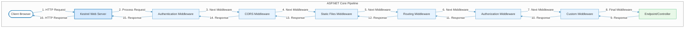

# Minimal API: Filters and Middlewares, Data Binding, Response Types, Service Lifetimes

```mermaid
%%{init: {
  'theme': 'neutral',
  'themeVariables': {
    'fontFamily': 'arial',
    'fontSize': '16px',
    'primaryColor': '#e6f3ff',
    'primaryTextColor': '#000',
    'primaryBorderColor': '#2980b9',
    'lineColor': '#2980b9',
    'textColor': '#333',
    'edgeLabelBackground': '#fff',
    'labelTextColor': '#333'
  }
}}%%

flowchart TD
    subgraph Pipeline[ASP.NET Core Pipeline]
        Client([Client Browser])
        Kestrel[Kestrel Web Server]
        M1[Authentication Middleware]
        M2[CORS Middleware]
        M3[Static Files Middleware]
        M4[Routing Middleware]
        M5[Authorization Middleware]
        M6[Custom Middleware]
        EP[Endpoint/Controller]
    end

    Client -->|1. HTTP Request| Kestrel
    Kestrel -->|2. Process Request| M1
    M1 -->|3. Next Middleware| M2
    M2 -->|4. Next Middleware| M3
    M3 -->|5. Next Middleware| M4
    M4 -->|6. Next Middleware| M5
    M5 -->|7. Next Middleware| M6
    M6 -->|8. Final Middleware| EP
    EP -->|9. Response| M6
    M6 -->|10. Response| M5
    M5 -->|11. Response| M4
    M4 -->|12. Response| M3
    M3 -->|13. Response| M2
    M2 -->|14. Response| M1
    M1 -->|15. Response| Kestrel
    Kestrel -->|16. HTTP Response| Client

    classDef server fill:#d4e9ff,stroke:#2980b9,stroke-width:2px
    classDef middleware fill:#e6f3ff,stroke:#2980b9,stroke-width:1px
    classDef endpoint fill:#e8f8e8,stroke:#27ae60,stroke-width:1px
    classDef client fill:#fff,stroke:#2980b9,stroke-width:2px
    
    class Kestrel server
    class M1,M2,M3,M4,M5,M6 middleware
    class EP endpoint
    class Client client

    linkStyle default stroke:#2980b9,stroke-width:1px


```
