# Minimal API: Middlewares, Routing, Filters

- [Minimal API: Middlewares, Routing, Filters](#minimal-api-middlewares-routing-filters)
  - [Middlewares](#middlewares)
    - [Cosa sono i Middleware?](#cosa-sono-i-middleware)
    - [Middleware order](#middleware-order)
      - [Ordine di esecuzione dei Middleware in ASP.NET Core API](#ordine-di-esecuzione-dei-middleware-in-aspnet-core-api)
      - [Short-circuiting the request pipeline](#short-circuiting-the-request-pipeline)
      - [Esempi di middleware](#esempi-di-middleware)
      - [Middleware pipeline nel caso di Minimal API](#middleware-pipeline-nel-caso-di-minimal-api)
    - [Quando usare i Middleware?](#quando-usare-i-middleware)
    - [Built-in middleware](#built-in-middleware)
    - [Middleware in Minimal API apps](#middleware-in-minimal-api-apps)
  - [Routing](#routing)
    - [Routing basics](#routing-basics)
    - [Endpoints](#endpoints)
    - [Route constraints](#route-constraints)
  - [Filters](#filters)
    - [Introduzione ai filtri con esempi](#introduzione-ai-filtri-con-esempi)
    - [Un esempio di applicazione di filtri in un progetto di Minimal API (Progetto TodoApiV2)](#un-esempio-di-applicazione-di-filtri-in-un-progetto-di-minimal-api-progetto-todoapiv2)
    - [Differenze chiave tra Middleware e Filtri](#differenze-chiave-tra-middleware-e-filtri)

## [Middlewares](https://learn.microsoft.com/en-us/aspnet/core/fundamentals/middleware)

### Cosa sono i Middleware?

**I Middleware sono componenti che vengono eseguiti in una pipeline sequenziale per ogni richiesta HTTP.
Ogni middleware può modificare la richiesta, interrompere la pipeline o passare il controllo al middleware successivo.
Sono globali e agiscono prima che la richiesta raggiunga un endpoint specifico.**

Middleware is software that's assembled into an app pipeline to handle requests and responses. Each component:

- Chooses whether to pass the request to the next component in the pipeline.
- Can perform work before and after the next component in the pipeline.

Request delegates are used to build the request pipeline. The request delegates handle each HTTP request.

Request delegates are configured using [Run](https://learn.microsoft.com/en-us/dotnet/api/microsoft.aspnetcore.builder.runextensions.run), [Map](https://learn.microsoft.com/en-us/dotnet/api/microsoft.aspnetcore.builder.mapextensions.map), and [Use](https://learn.microsoft.com/en-us/dotnet/api/microsoft.aspnetcore.builder.useextensions.use) extension methods. An individual request delegate can be specified in-line as an anonymous method (called in-line middleware), or it can be defined in a reusable class. These reusable classes and in-line anonymous methods are *middleware*, also called *middleware components*. Each middleware component in the request pipeline is responsible for invoking the next component in the pipeline or short-circuiting the pipeline. When a middleware short-circuits, it's called a *terminal middleware* because it prevents further middleware from processing the request.

### [Middleware order](https://learn.microsoft.com/en-us/aspnet/core/fundamentals/middleware/#middleware-order)

La pipeline middleware segue un approccio a catena (chain of responsibility):

```scss
Request → Middleware 1 → Middleware 2 → Endpoint → Middleware 2 (response) → Middleware 1 → Response
```

The following diagram shows the complete request processing pipeline for ASP.NET Core MVC and Razor Pages apps. You can see how, in a typical app, existing middlewares are ordered and where custom middlewares are added. **You have full control over how to reorder existing middlewares or inject new custom middlewares as necessary for your scenarios.**


The ASP.NET Core request pipeline consists of a sequence of request delegates, called one after the other. The following diagram demonstrates the concept. The thread of execution follows the black arrows.

#### Ordine di esecuzione dei Middleware in ASP.NET Core API

1. UseExceptionHandler → Gestione delle eccezioni
2. UseHttpsRedirection → Redirect HTTPS
3. UseStaticFiles → File statici
4. UseRouting → Mappatura degli endpoint
5. UseCors → Gestione CORS (se basato sugli endpoint)
6. UseAuthentication → Autenticazione
7. UseAuthorization → Autorizzazione
8. UseEndpoints → Gestione delle rotte finali


The simplest possible ASP.NET Core app sets up a single request delegate that handles all requests. This case doesn't include an actual request pipeline. Instead, a single anonymous function is called in response to every HTTP request.

```cs
var builder = WebApplication.CreateBuilder(args);
var app = builder.Build();

app.Run(async context =>
{
    await context.Response.WriteAsync("Hello world!");
});

app.Run();
```

Chain multiple request delegates together with [Use](https://learn.microsoft.com/en-us/dotnet/api/microsoft.aspnetcore.builder.useextensions.use). The `next` parameter represents the next delegate in the pipeline. You can short-circuit the pipeline by *not* calling the `next` parameter. You can typically perform actions both before and after the `next` delegate, as the following example demonstrates:

```cs
var builder = WebApplication.CreateBuilder(args);
var app = builder.Build();

app.Use(async (context, next) =>
{
    // Do work that can write to the Response.
    await next.Invoke();
    // Do logging or other work that doesn't write to the Response.
});

app.Run(async context =>
{
    await context.Response.WriteAsync("Hello from 2nd delegate.");
});

app.Run();
```

Each delegate can perform operations before and after the next delegate. Exception-handling delegates should be called early in the pipeline, so they can catch exceptions that occur in later stages of the pipeline.

#### Short-circuiting the request pipeline

When a delegate doesn't pass a request to the next delegate, it's called *short-circuiting the request pipeline*. Short-circuiting is often desirable because it avoids unnecessary work. For example, [Static File Middleware](https://learn.microsoft.com/en-us/aspnet/core/fundamentals/static-files?view=aspnetcore-9.0) can act as a *terminal middleware* by processing a request for a static file and short-circuiting the rest of the pipeline. Middleware added to the pipeline before the middleware that terminates further processing still processes code after their `next.Invoke` statements. However, see the following warning about attempting to write to a response that has already been sent.

:warning: **Warning**: Don't call `next.Invoke` during or after the response has been sent to the client. After an [HttpResponse](https://learn.microsoft.com/en-us/dotnet/api/microsoft.aspnetcore.http.httpresponse) has started, changes result in an exception. For example, [setting headers and a status code throw an exception](https://learn.microsoft.com/en-us/aspnet/core/fundamentals/best-practices?view=aspnetcore-9.0#do-not-modify-the-status-code-or-headers-after-the-response-body-has-started) after the response starts. Writing to the response body after calling `next`:

- May cause a protocol violation, such as writing more than the stated `Content-Length`.
- May corrupt the body format, such as writing an HTML footer to a CSS file.

[HasStarted](https://learn.microsoft.com/en-us/dotnet/api/microsoft.aspnetcore.http.httpresponse.hasstarted) is a useful hint to indicate if headers have been sent or the body has been written to.

For more information, see [Short-circuit middleware after routing](https://learn.microsoft.com/en-us/aspnet/core/fundamentals/routing?view=aspnetcore-9.0#short-circuit-middleware-after-routing).

#### Esempi di middleware

```cs
app.Use(async (context, next) =>
{
    Console.WriteLine("Middleware 1: Prima della richiesta");
    await next(); // Passa al middleware successivo
    Console.WriteLine("Middleware 1: Dopo la risposta");
});
```

Per mostrare l'impiego dei middleware in una applicazione ASP.NET Core Minimal API si consideri l'esempio seguente (progetto `TodoApiV2` con l'aggiunta di middleware di esempio):

`LoggingMiddleware.cs`

```cs
using System;

namespace TodoApiV2.Middlewares;

public class LoggingMiddleware
{
    private readonly RequestDelegate _next;
    private readonly ILogger _logger;

    public LoggingMiddleware(RequestDelegate next, ILogger<LoggingMiddleware> logger)
    {
        _next = next;
        _logger = logger;
    }

    public async Task InvokeAsync(HttpContext context)
    {
        // Logica pre-elaborazione
        _logger.LogInformation("Request iniziata: {context.Request.Path}", context.Request.Path);
        var watch = System.Diagnostics.Stopwatch.StartNew();

        try
        {
            // Chiamata al middleware successivo nella pipeline
            await _next(context);
        }
        finally
        {
            watch.Stop();
            _logger.LogInformation("Request completata in {watch.ElapsedMilliseconds}ms", watch.ElapsedMilliseconds);
        }
    }
}
```

`Program.cs`

```cs
using Microsoft.EntityFrameworkCore;
using TodoApiV2;
using TodoApiV2.Middlewares;
//creation of Web application builder
var builder = WebApplication.CreateBuilder(args);
//adding services to the container
builder.Services.AddDbContext<TodoDb>(opt => opt.UseInMemoryDatabase("TodoList"));
if (builder.Environment.IsDevelopment())
{
	builder.Services.AddDatabaseDeveloperPageExceptionFilter();
}
// Add services to the container.
// Learn more about configuring OpenAPI at https://aka.ms/aspnet/openapi
builder.Services.AddOpenApi();
//adding API explorer
builder.Services.AddEndpointsApiExplorer();
// adding OpenAPI configuration
builder.Services.AddOpenApiDocument(config =>
{
	config.DocumentName = "TodoApiV2";
	config.Title = "TodoAPI v2";
	config.Version = "v1";
});

//creation of Web application
var app = builder.Build();

//adding middleware for Swagger and OpenAPI
if (app.Environment.IsDevelopment())
{
	//adding middleware for OpenAPI
	app.MapOpenApi();
	//adding middleware for Swagger
	app.UseOpenApi();
	app.UseSwaggerUi(config =>
	{
		config.DocumentTitle = "TodoAPI";
		config.Path = "/swagger";
		config.DocumentPath = "/swagger/{documentName}/swagger.json";
		config.DocExpansion = "list";
	});
}

app.UseHttpsRedirection();
app.MapGroup("/public/todos")
	.MapTodosApi()
	.WithTags("Public");

app.MapGroup("/private/todos")
	.MapTodosApi()
	.WithTags("Private");
//.RequireAuthorization();

//alcuni esempi di rotte con gruppi presi dalla documentazione con qualche adattamento
var all = app.MapGroup("").WithOpenApi();
var org = all.MapGroup("{org}");
var user = org.MapGroup("{user}");
//questa è una GET sulla rotta definita da /{org}/{user}/
//ad esempio effettuando una GET su /greppi-dev/malafronte/ la risposta è greppi-dev/malafronte
user.MapGet("", (string org, string user) => $"{org}/{user}");

var outer = app.MapGroup("/outer");
var inner = outer.MapGroup("/inner");

//rotte di /outer
outer.MapGet("/say-hello", () => "say hello!");
outer.MapGet("/hand-shake", () => "give a firm handshake!");
//rotte di inner, quindi in /outer/inner
inner.MapGet("/make-appointment", () => "See you tomorrow at 6pm!");
//rotte con default tag
app.MapGet("/",()=>Console.WriteLine("Ciao mondo"));

//aggiunta di custom middleware. Attenzione: l'ordine conta!
//👇 custom middleware 1
app.Use(async (context, next) =>
{
	app.Logger.LogInformation("Middleware 1: Prima della richiesta");
	await next(); // Passa al middleware successivo
	app.Logger.LogInformation("Middleware 1: Dopo la risposta");
	
});
//👇 custom middleware 2
app.Use(async (context, next) =>
{

	app.Logger.LogInformation("Middleware 2: Prima della richiesta");
	await next(); // Passa al middleware successivo
	app.Logger.LogInformation("Middleware 2: Dopo la risposta");

});
//👇 custom middleware 3
app.Use(async (context, next) =>
{

	app.Logger.LogInformation("Middleware 3: Prima della richiesta");
	app.Logger.LogInformation("Path: {context.Request.Path}", context.Request.Path);
	app.Logger.LogInformation("Method: {context.Request.Method}", context.Request.Method);
	var currentEndpoint = context.GetEndpoint();
	if (currentEndpoint is null)
	{
		await next(context);
		return;
	}

	app.Logger.LogInformation("Endpoint: {currentEndpoint.DisplayName}", currentEndpoint.DisplayName);
	await next(context); // Passa al middleware successivo
	app.Logger.LogInformation("Middleware 3: Dopo la risposta");

});

//👇 aggiunta del middleware LoggingMiddleware alla pipeline
app.UseMiddleware<LoggingMiddleware>();

app.Run();
```

Con l'aggiunta dei custom middleware, quando si effettua una richiesta su uno qualsiasi degli endpoint, si ottiene una risposta (nella console log) del tipo seguente.

Nel caso di `GET /`:

```sh
info: TodoApiV2[0]
      Middleware 1: Prima della richiesta
info: TodoApiV2[0]
      Middleware 2: Prima della richiesta
info: TodoApiV2[0]
      Middleware 3: Prima della richiesta
info: TodoApiV2[0]
      Path: /
info: TodoApiV2[0]
      Method: GET
info: TodoApiV2[0]
      Endpoint: HTTP: GET /
info: TodoApiV2.LoggingMiddleware[0]
      Request iniziata: /
Ciao mondo
info: TodoApiV2.LoggingMiddleware[0]
      Request completata in 0ms
info: TodoApiV2[0]
      Middleware 3: Dopo la risposta
info: TodoApiV2[0]
      Middleware 2: Dopo la risposta
info: TodoApiV2[0]
      Middleware 1: Dopo la risposta
```

oppure, nel caso di `GET /public/todos/`:

```sh
info: TodoApiV2[0]
      Middleware 1: Prima della richiesta
info: TodoApiV2[0]
      Middleware 2: Prima della richiesta
info: TodoApiV2[0]
      Middleware 3: Prima della richiesta
info: TodoApiV2[0]
      Path: /public/todos
info: TodoApiV2[0]
      Method: GET
info: TodoApiV2[0]
      Endpoint: HTTP: GET /public/todos/ => GetAllTodos
info: TodoApiV2.LoggingMiddleware[0]
      Request iniziata: /public/todos
info: TodoApiV2.LoggingMiddleware[0]
      Request completata in 29ms
info: TodoApiV2[0]
      Middleware 3: Dopo la risposta
info: TodoApiV2[0]
      Middleware 2: Dopo la risposta
info: TodoApiV2[0]
      Middleware 1: Dopo la risposta
```

:memo: **si osservi l'ordine di esecuzione dei middleware rispetto all'esecuzione del delegato relativo all'endpoint selezionato. I middleware vengono eseguiti nell'ordine in cui sono stati inseriti nella pipeline dell'applicazione: dal primo all'ultimo in fase di richiesta (executed in order of First In, First Out (FIFO) order) e, dopo aver eseguito il delegato relativo all'endpoint, dall'ultimo al primo in fase di risposta (executed in order of First In, Last Out (FILO) order).**

#### Middleware pipeline nel caso di Minimal API

```mermaid
%%{init: {
  'theme': 'neutral',
  'themeVariables': {
    'fontFamily': 'arial',
    'fontSize': '16px',
    'primaryColor': '#e6f3ff',
    'primaryTextColor': '#000',
    'primaryBorderColor': '#2980b9',
    'lineColor': '#2980b9',
    'textColor': '#333',
    'edgeLabelBackground': '#fff',
    'labelTextColor': '#333'
  }
}}%%

flowchart TD
    subgraph Pipeline[Minimal API Pipeline]
        Client([Client Browser])
        Kestrel[Kestrel Web Server]
        M1[Exception Handler Middleware]
        M2[HTTPS Redirection Middleware]
        M3[Static Files Middleware]
        M4[Routing Middleware]
        M5[CORS Middleware]
        M6[Authentication Middleware]
        M7[Authorization Middleware]
        M8[Custom Middleware]
        EP[Minimal API Endpoints]
    end

    Client -->|"1 - HTTP Request"| Kestrel
    Kestrel -->|"2 - Process Request"| M1
    M1 -->|"3 - Next"| M2
    M2 -->|"4 - Next"| M3
    M3 -->|"5 - Next"| M4
    M4 -->|"6 - Next"| M5
    M5 -->|"7 - Next"| M6
    M6 -->|"8 - Next"| M7
    M7 -->|"9 - Next"| M8
    M8 -->|"10 - Next"| EP
    EP -->|"11 - Response"| M8
    M8 -->|"12 - Response"| M7
    M7 -->|"13 - Response"| M6
    M6 -->|"14 - Response"| M5
    M5 -->|"15 - Response"| M4
    M4 -->|"16 - Response"| M3
    M3 -->|"17 - Response"| M2
    M2 -->|"18 - Response"| M1
    M1 -->|"19 - Response"| Kestrel
    Kestrel -->|"20 - HTTP Response"| Client

    classDef server fill:#d4e9ff,stroke:#2980b9,stroke-width:2px
    classDef middleware fill:#e6f3ff,stroke:#2980b9,stroke-width:1px
    classDef endpoint fill:#e8f8e8,stroke:#27ae60,stroke-width:1px
    classDef client fill:#fff,stroke:#2980b9,stroke-width:2px
    
    class Kestrel server
    class M1,M2,M3,M4,M5,M6,M7,M8 middleware
    class EP endpoint
    class Client client

    linkStyle default stroke:#2980b9,stroke-width:1px
```



### Quando usare i Middleware?

Per funzionalità trasversali/globali, come:

- Logging
- Autenticazione
- Gestione degli errori globali
- Cross-Origin Resource Sharing ([CORS](https://developer.mozilla.org/en-US/docs/Web/HTTP/CORS))
- Compressione delle risposte

### Built-in middleware

ASP.NET Core ships with the following middleware components. The *Order* column provides notes on middleware placement in the request processing pipeline and under what conditions the middleware may terminate request processing. When a middleware short-circuits the request processing pipeline and prevents further downstream middleware from processing a request, it's called a *terminal middleware*. For more information on short-circuiting, see the [Create a middleware pipeline with WebApplication](https://learn.microsoft.com/en-us/aspnet/core/fundamentals/middleware/?view=aspnetcore-9.0#create-a-middleware-pipeline-with-webapplication) section.

Expand table

| Middleware | Description | Order |
| --- |  --- |  --- |
| [Authentication](https://learn.microsoft.com/en-us/aspnet/core/security/authentication/identity?view=aspnetcore-9.0) | Provides authentication support. | Before `HttpContext.User` is needed. Terminal for OAuth callbacks. |
| [Authorization](https://learn.microsoft.com/en-us/dotnet/api/microsoft.aspnetcore.builder.authorizationappbuilderextensions.useauthorization) | Provides authorization support. | Immediately after the Authentication Middleware. |
| [Cookie Policy](https://learn.microsoft.com/en-us/aspnet/core/security/gdpr?view=aspnetcore-9.0) | Tracks consent from users for storing personal information and enforces minimum standards for cookie fields, such as `secure` and `SameSite`. | Before middleware that issues cookies. Examples: Authentication, Session, MVC (TempData). |
| [CORS](https://learn.microsoft.com/en-us/aspnet/core/security/cors?view=aspnetcore-9.0) | Configures Cross-Origin Resource Sharing. | Before components that use CORS. `UseCors` currently must go before `UseResponseCaching` due to [this bug](https://github.com/dotnet/aspnetcore/issues/23218). |
| [DeveloperExceptionPage](https://learn.microsoft.com/en-us/dotnet/api/microsoft.aspnetcore.diagnostics.developerexceptionpagemiddleware) | Generates a page with error information that is intended for use only in the Development environment. | Before components that generate errors. The project templates automatically register this middleware as the first middleware in the pipeline when the environment is Development. |
| [Diagnostics](https://learn.microsoft.com/en-us/aspnet/core/fundamentals/error-handling?view=aspnetcore-9.0) | Several separate middlewares that provide a developer exception page, exception handling, status code pages, and the default web page for new apps. | Before components that generate errors. Terminal for exceptions or serving the default web page for new apps. |
| [Forwarded Headers](https://learn.microsoft.com/en-us/aspnet/core/host-and-deploy/proxy-load-balancer?view=aspnetcore-9.0) | Forwards proxied headers onto the current request. | Before components that consume the updated fields. Examples: scheme, host, client IP, method. |
| [Health Check](https://learn.microsoft.com/en-us/aspnet/core/host-and-deploy/health-checks?view=aspnetcore-9.0) | Checks the health of an ASP.NET Core app and its dependencies, such as checking database availability. | Terminal if a request matches a health check endpoint. |
| [Header Propagation](https://learn.microsoft.com/en-us/aspnet/core/fundamentals/http-requests?view=aspnetcore-9.0#header-propagation-middleware) | Propagates HTTP headers from the incoming request to the outgoing HTTP Client requests. |  |
| [HTTP Logging](https://learn.microsoft.com/en-us/aspnet/core/fundamentals/http-logging/?view=aspnetcore-9.0) | Logs HTTP Requests and Responses. | At the beginning of the middleware pipeline. |
| [HTTP Method Override](https://learn.microsoft.com/en-us/dotnet/api/microsoft.aspnetcore.builder.httpmethodoverrideextensions) | Allows an incoming POST request to override the method. | Before components that consume the updated method. |
| [HTTPS Redirection](https://learn.microsoft.com/en-us/aspnet/core/security/enforcing-ssl?view=aspnetcore-9.0#require-https) | Redirect all HTTP requests to HTTPS. | Before components that consume the URL. |
| [HTTP Strict Transport Security (HSTS)](https://learn.microsoft.com/en-us/aspnet/core/security/enforcing-ssl?view=aspnetcore-9.0#http-strict-transport-security-protocol-hsts) | Security enhancement middleware that adds a special response header. | Before responses are sent and after components that modify requests. Examples: Forwarded Headers, URL Rewriting. |
| [MVC](https://learn.microsoft.com/en-us/aspnet/core/mvc/overview?view=aspnetcore-9.0) | Processes requests with MVC/Razor Pages. | Terminal if a request matches a route. |
| [OWIN](https://learn.microsoft.com/en-us/aspnet/core/fundamentals/owin?view=aspnetcore-9.0) | Interop with OWIN-based apps, servers, and middleware. | Terminal if the OWIN Middleware fully processes the request. |
| [Output Caching](https://learn.microsoft.com/en-us/aspnet/core/performance/caching/output?view=aspnetcore-9.0) | Provides support for caching responses based on configuration. | Before components that require caching. `UseRouting` must come before `UseOutputCaching`. `UseCORS` must come before `UseOutputCaching`. |
| [Response Caching](https://learn.microsoft.com/en-us/aspnet/core/performance/caching/middleware?view=aspnetcore-9.0) | Provides support for caching responses. This requires client participation to work. Use output caching for complete server control. | Before components that require caching. `UseCORS` must come before `UseResponseCaching`. Is typically not beneficial for UI apps such as Razor Pages because browsers generally set request headers that prevent caching. [Output caching](https://learn.microsoft.com/en-us/aspnet/core/performance/caching/output?view=aspnetcore-9.0) benefits UI apps. |
| [Request Decompression](https://learn.microsoft.com/en-us/aspnet/core/fundamentals/middleware/request-decompression?view=aspnetcore-9.0) | Provides support for decompressing requests. | Before components that read the request body. |
| [Response Compression](https://learn.microsoft.com/en-us/aspnet/core/performance/response-compression?view=aspnetcore-9.0) | Provides support for compressing responses. | Before components that require compression. |
| [Request Localization](https://learn.microsoft.com/en-us/aspnet/core/fundamentals/localization?view=aspnetcore-9.0) | Provides localization support. | Before localization sensitive components. Must appear after Routing Middleware when using [RouteDataRequestCultureProvider](https://learn.microsoft.com/en-us/dotnet/api/microsoft.aspnetcore.localization.routing.routedatarequestcultureprovider). |
| [Request Timeouts](https://learn.microsoft.com/en-us/aspnet/core/performance/timeouts?view=aspnetcore-9.0) | Provides support for configuring request timeouts, global and per endpoint. | `UseRequestTimeouts` must come after `UseExceptionHandler`, `UseDeveloperExceptionPage`, and `UseRouting`. |
| [Endpoint Routing](https://learn.microsoft.com/en-us/aspnet/core/fundamentals/routing?view=aspnetcore-9.0) | Defines and constrains request routes. | Terminal for matching routes. |
| [SPA](https://learn.microsoft.com/en-us/dotnet/api/microsoft.aspnetcore.builder.spaapplicationbuilderextensions.usespa) | Handles all requests from this point in the middleware chain by returning the default page for the Single Page Application (SPA) | Late in the chain, so that other middleware for serving static files, MVC actions, etc., takes precedence. |
| [Session](https://learn.microsoft.com/en-us/aspnet/core/fundamentals/app-state?view=aspnetcore-9.0) | Provides support for managing user sessions. | Before components that require Session. |
| [Static Files](https://learn.microsoft.com/en-us/aspnet/core/fundamentals/static-files?view=aspnetcore-9.0) | Provides support for serving static files and directory browsing. | Terminal if a request matches a file. |
| [URL Rewrite](https://learn.microsoft.com/en-us/aspnet/core/fundamentals/url-rewriting?view=aspnetcore-9.0) | Provides support for rewriting URLs and redirecting requests. | Before components that consume the URL. |
| [W3CLogging](https://learn.microsoft.com/en-us/aspnet/core/fundamentals/w3c-logger/?view=aspnetcore-9.0) | Generates server access logs in the [W3C Extended Log File Format](https://www.w3.org/TR/WD-logfile.html). | At the beginning of the middleware pipeline. |
| [WebSockets](https://learn.microsoft.com/en-us/aspnet/core/fundamentals/websockets?view=aspnetcore-9.0) | Enables the WebSockets protocol. | Before components that are required to accept WebSocket requests. |

### [Middleware in Minimal API apps](https://learn.microsoft.com/en-us/aspnet/core/fundamentals/minimal-apis/middleware)

[`WebApplication`](https://learn.microsoft.com/en-us/aspnet/core/fundamentals/minimal-apis/webapplication?view=aspnetcore-9.0) automatically adds the following middleware in [`Minimal API applications`](https://learn.microsoft.com/en-us/aspnet/core/fundamentals/minimal-apis/overview?view=aspnetcore-9.0) depending on certain conditions:

- [`UseDeveloperExceptionPage`](https://learn.microsoft.com/en-us/dotnet/api/microsoft.aspnetcore.diagnostics.developerexceptionpagemiddleware) is added first when the [`HostingEnvironment`](https://learn.microsoft.com/en-us/aspnet/core/fundamentals/environments?view=aspnetcore-9.0) is `"Development"`.
- [`UseRouting`](https://learn.microsoft.com/en-us/dotnet/api/microsoft.aspnetcore.builder.endpointroutingapplicationbuilderextensions.userouting) is added second if user code didn't already call `UseRouting` and if there are endpoints configured, for example `app.MapGet`.
- [`UseEndpoints`](https://learn.microsoft.com/en-us/dotnet/api/microsoft.aspnetcore.builder.endpointroutingapplicationbuilderextensions.useendpoints) is added at the end of the middleware pipeline if any endpoints are configured.
- [`UseAuthentication`](https://learn.microsoft.com/en-us/dotnet/api/microsoft.aspnetcore.builder.authappbuilderextensions.useauthentication) is added immediately after `UseRouting` if user code didn't already call `UseAuthentication` and if [`IAuthenticationSchemeProvider`](https://learn.microsoft.com/en-us/dotnet/api/microsoft.aspnetcore.authentication.iauthenticationschemeprovider) can be detected in the service provider. `IAuthenticationSchemeProvider` is added by default when using [`AddAuthentication`](https://learn.microsoft.com/en-us/dotnet/api/microsoft.extensions.dependencyinjection.authenticationservicecollectionextensions.addauthentication), and services are detected using [`IServiceProviderIsService`](https://learn.microsoft.com/en-us/dotnet/api/microsoft.extensions.dependencyinjection.iserviceproviderisservice).
- [`UseAuthorization`](https://learn.microsoft.com/en-us/dotnet/api/microsoft.aspnetcore.builder.authorizationappbuilderextensions.useauthorization) is added next if user code didn't already call `UseAuthorization` and if [`IAuthorizationHandlerProvider`](https://learn.microsoft.com/en-us/dotnet/api/microsoft.aspnetcore.authorization.iauthorizationhandlerprovider) can be detected in the service provider. `IAuthorizationHandlerProvider` is added by default when using [`AddAuthorization`](https://learn.microsoft.com/en-us/dotnet/api/microsoft.extensions.dependencyinjection.authenticationservicecollectionextensions.addauthentication), and services are detected using `IServiceProviderIsService`.
- User configured middleware and endpoints are added between `UseRouting` and `UseEndpoints`.

The following code is effectively what the automatic middleware being added to the app produces:

```cs
if (isDevelopment)
{
    app.UseDeveloperExceptionPage();
}

app.UseRouting();

if (isAuthenticationConfigured)
{
    app.UseAuthentication();
}

if (isAuthorizationConfigured)
{
    app.UseAuthorization();
}

// user middleware/endpoints
app.CustomMiddleware(...);
app.MapGet("/", () => "hello world");
// end user middleware/endpoints

app.UseEndpoints(e => {});
```

In some cases, the default middleware configuration isn't correct for the app and requires modification. For example, [UseCors](https://learn.microsoft.com/en-us/dotnet/api/microsoft.aspnetcore.builder.corsmiddlewareextensions.usecors) should be called before [UseAuthentication](https://learn.microsoft.com/en-us/dotnet/api/microsoft.aspnetcore.builder.authappbuilderextensions.useauthentication) and [UseAuthorization](https://learn.microsoft.com/en-us/dotnet/api/microsoft.aspnetcore.builder.authorizationappbuilderextensions.useauthorization). The app needs to call `UseAuthentication` and `UseAuthorization` if `UseCors` is called:

```cs
app.UseCors();
app.UseAuthentication();
app.UseAuthorization();
```

If middleware should be run before route matching occurs, [UseRouting](https://learn.microsoft.com/en-us/dotnet/api/microsoft.aspnetcore.builder.endpointroutingapplicationbuilderextensions.userouting) should be called and the middleware should be placed before the call to `UseRouting`. [UseEndpoints](https://learn.microsoft.com/en-us/dotnet/api/microsoft.aspnetcore.builder.endpointroutingapplicationbuilderextensions.useendpoints) isn't required in this case as it is automatically added as described previously:

```cs
app.Use((context, next) =>
{
    return next(context);
});

app.UseRouting();

// other middleware and endpoints
```

When adding a terminal middleware:

- The middleware must be added after `UseEndpoints`.
- The app needs to call `UseRouting` and `UseEndpoints` so that the terminal middleware can be placed at the correct location.

```cs
app.UseRouting();

app.MapGet("/", () => "hello world");

app.UseEndpoints(e => {});

app.Run(context =>
{
    context.Response.StatusCode = 404;
    return Task.CompletedTask;
});
```

Terminal middleware is middleware that runs if no endpoint handles the request.

For information on antiforgery middleware in Minimal APIs, see [Prevent Cross-Site Request Forgery (XSRF/CSRF) attacks in ASP.NET Core](https://learn.microsoft.com/en-us/aspnet/core/security/anti-request-forgery?view=aspnetcore-9.0#afwma)

For more information about middleware see [ASP.NET Core Middleware](https://learn.microsoft.com/en-us/aspnet/core/fundamentals/middleware/), and the [list of built-in middleware](https://learn.microsoft.com/en-us/aspnet/core/fundamentals/middleware/#built-in-middleware) that can be added to applications.

For more information about Minimal APIs see [`Minimal APIs overview`](https://learn.microsoft.com/en-us/aspnet/core/fundamentals/minimal-apis/overview).

## [Routing](https://learn.microsoft.com/en-us/aspnet/core/fundamentals/routing)

Routing is responsible for matching incoming HTTP requests and dispatching those requests to the app's executable endpoints. [Endpoints](https://learn.microsoft.com/en-us/aspnet/core/fundamentals/routing?view=aspnetcore-9.0#endpoints) are the app's units of executable request-handling code. Endpoints are defined in the app and configured when the app starts. The endpoint matching process can extract values from the request's URL and provide those values for request processing. Using endpoint information from the app, routing is also able to generate URLs that map to endpoints.

Apps can configure routing using:

- Controllers
- Razor Pages
- SignalR
- gRPC Services
- Endpoint-enabled [middleware](https://learn.microsoft.com/en-us/aspnet/core/fundamentals/middleware/?view=aspnetcore-9.0) such as [Health Checks](https://learn.microsoft.com/en-us/aspnet/core/host-and-deploy/health-checks?view=aspnetcore-9.0).
- **Delegates and lambdas registered with routing.** 👈 questo è il meccanismo principale utilizzato nelle Minimal API

### [Routing basics](https://learn.microsoft.com/en-us/aspnet/core/fundamentals/routing#routing-basics)

The following code shows a basic example of routing:

```cs
var builder = WebApplication.CreateBuilder(args);
var app = builder.Build();

app.MapGet("/", () => "Hello World!");

app.Run();
```

The preceding example includes a single endpoint using the [MapGet](https://learn.microsoft.com/en-us/dotnet/api/microsoft.aspnetcore.builder.endpointroutebuilderextensions.mapget) method:

- When an HTTP `GET` request is sent to the root URL `/`:
    - The request delegate executes.
    - `Hello World!` is written to the HTTP response.
- If the request method is not `GET` or the root URL is not `/`, no route matches and an HTTP 404 is returned.

**Routing uses a pair of middleware, registered by [UseRouting](https://learn.microsoft.com/en-us/dotnet/api/microsoft.aspnetcore.builder.endpointroutingapplicationbuilderextensions.userouting) and [UseEndpoints](https://learn.microsoft.com/en-us/dotnet/api/microsoft.aspnetcore.builder.endpointroutingapplicationbuilderextensions.useendpoints):**

- `UseRouting` adds route matching to the middleware pipeline. This middleware looks at the set of endpoints defined in the app, and selects the [best match](https://learn.microsoft.com/en-us/aspnet/core/fundamentals/routing?view=aspnetcore-9.0#urlm) based on the request.
- `UseEndpoints` adds endpoint execution to the middleware pipeline. It runs the delegate associated with the selected endpoint.

**Apps typically don't need to call `UseRouting` or `UseEndpoints`. [WebApplicationBuilder](https://learn.microsoft.com/en-us/dotnet/api/microsoft.aspnetcore.builder.webapplicationbuilder) configures a middleware pipeline that wraps middleware added in `Program.cs` with `UseRouting` and `UseEndpoints`. However, apps can change the order in which `UseRouting` and `UseEndpoints` run by calling these methods explicitly. For example, the following code makes an explicit call to `UseRouting`:**

```cs
app.Use(async (context, next) =>
{
    // ...
    await next(context);
});

app.UseRouting();

app.MapGet("/", () => "Hello World!");
```

In the preceding code:

- The call to `app.Use` registers a custom middleware that runs at the start of the pipeline.
- The call to `UseRouting` configures the route matching middleware to run *after* the custom middleware.
- The endpoint registered with `MapGet` runs at the end of the pipeline.

**If the preceding example didn't include a call to `UseRouting`, the custom middleware would run *after* the route matching middleware.**

:memo:**Note:** Routes added directly to the [WebApplication](https://learn.microsoft.com/en-us/dotnet/api/microsoft.aspnetcore.builder.webapplication) execute at the ***end*** of the pipeline.

### [Endpoints](https://learn.microsoft.com/en-us/aspnet/core/fundamentals/routing#endpoints)

The `MapGet` method is used to define an **endpoint**. **An endpoint is something that can be:**

- **Selected, by matching the URL and HTTP method.**
- **Executed, by running the delegate.**

Endpoints that can be matched and executed by the app are configured in `UseEndpoints`. For example, [MapGet](https://learn.microsoft.com/en-us/dotnet/api/microsoft.aspnetcore.builder.endpointroutebuilderextensions.mapget), [MapPost](https://learn.microsoft.com/en-us/dotnet/api/microsoft.aspnetcore.builder.endpointroutebuilderextensions.mappost), and [similar methods](https://learn.microsoft.com/en-us/dotnet/api/microsoft.aspnetcore.builder.endpointroutebuilderextensions) connect request delegates to the routing system. Additional methods can be used to connect ASP.NET Core framework features to the routing system:

- [MapRazorPages for Razor Pages](https://learn.microsoft.com/en-us/dotnet/api/microsoft.aspnetcore.builder.razorpagesendpointroutebuilderextensions.maprazorpages)
- [MapControllers for controllers](https://learn.microsoft.com/en-us/dotnet/api/microsoft.aspnetcore.builder.controllerendpointroutebuilderextensions.mapcontrollers)
- [MapHub<THub> for SignalR](https://learn.microsoft.com/en-us/dotnet/api/microsoft.aspnetcore.signalr.hubroutebuilder.maphub)
- [MapGrpcService<TService> for gRPC](https://learn.microsoft.com/en-us/aspnet/core/grpc/aspnetcore?view=aspnetcore-9.0)

The following example shows routing with a more sophisticated route template:

```cs
app.MapGet("/hello/{name:alpha}", (string name) => $"Hello {name}!");
```

The string `/hello/{name:alpha}` is a **route template**. A route template is used to configure how the endpoint is matched. In this case, the template matches:

- A URL like `/hello/Docs`
- Any URL path that begins with `/hello/` followed by a sequence of alphabetic characters. `:alpha` applies a route constraint that matches only alphabetic characters. [Route constraints](https://learn.microsoft.com/en-us/aspnet/core/fundamentals/routing?view=aspnetcore-9.0#route-constraints) are explained later in this article.

The second segment of the URL path, `{name:alpha}`:

- Is bound to the `name` parameter.
- Is captured and stored in [HttpRequest.RouteValues](https://learn.microsoft.com/en-us/dotnet/api/microsoft.aspnetcore.http.httprequest.routevalues).

### [Route constraints](https://learn.microsoft.com/en-us/aspnet/core/fundamentals/routing#route-constraints)

Route constraints execute when a match has occurred to the incoming URL and the URL path is tokenized into route values. Route constraints generally inspect the route value associated via the route template and make a true or false decision about whether the value is acceptable. Some route constraints use data outside the route value to consider whether the request can be routed. For example, the [HttpMethodRouteConstraint](https://learn.microsoft.com/en-us/dotnet/api/microsoft.aspnetcore.routing.constraints.httpmethodrouteconstraint) can accept or reject a request based on its HTTP verb. Constraints are used in routing requests and link generation.

:warning: **Warning**: **Don't use constraints for input validation. If constraints are used for input validation, invalid input results in a `404` Not Found response. Invalid input should produce a `400` Bad Request with an appropriate error message. Route constraints are used to disambiguate similar routes, not to validate the inputs for a particular route.**

The following table demonstrates example route constraints and their expected behavior:

| constraint | Example | Example Matches | Notes |
| --- |  --- |  --- |  --- |
| `int` | `{id:int}` | `123456789`, `-123456789` | Matches any integer |
| `bool` | `{active:bool}` | `true`, `FALSE` | Matches `true` or `false`. Case-insensitive |
| `datetime` | `{dob:datetime}` | `2016-12-31`, `2016-12-31 7:32pm` | Matches a valid `DateTime` value in the invariant culture. See preceding warning. |
| `decimal` | `{price:decimal}` | `49.99`, `-1,000.01` | Matches a valid `decimal` value in the invariant culture. See preceding warning. |
| `double` | `{weight:double}` | `1.234`, `-1,001.01e8` | Matches a valid `double` value in the invariant culture. See preceding warning. |
| `float` | `{weight:float}` | `1.234`, `-1,001.01e8` | Matches a valid `float` value in the invariant culture. See preceding warning. |
| `guid` | `{id:guid}` | `CD2C1638-1638-72D5-1638-DEADBEEF1638` | Matches a valid `Guid` value |
| `long` | `{ticks:long}` | `123456789`, `-123456789` | Matches a valid `long` value |
| `minlength(value)` | `{username:minlength(4)}` | `Rick` | String must be at least 4 characters |
| `maxlength(value)` | `{filename:maxlength(8)}` | `MyFile` | String must be no more than 8 characters |
| `length(length)` | `{filename:length(12)}` | `somefile.txt` | String must be exactly 12 characters long |
| `length(min,max)` | `{filename:length(8,16)}` | `somefile.txt` | String must be at least 8 and no more than 16 characters long |
| `min(value)` | `{age:min(18)}` | `19` | Integer value must be at least 18 |
| `max(value)` | `{age:max(120)}` | `91` | Integer value must be no more than 120 |
| `range(min,max)` | `{age:range(18,120)}` | `91` | Integer value must be at least 18 but no more than 120 |
| `alpha` | `{name:alpha}` | `Rick` | String must consist of one or more alphabetical characters, `a`\-`z` and case-insensitive. |
| `regex(expression)` | `{ssn:regex(^\\d{{3}}-\\d{{2}}-\\d{{4}}$)}` | `123-45-6789` | String must match the regular expression. See tips about defining a regular expression. |
| `required` | `{name:required}` | `Rick` | Used to enforce that a non-parameter value is present during URL generation |

## [Filters](https://learn.microsoft.com/en-us/aspnet/core/fundamentals/minimal-apis/min-api-filters)

Minimal API filters allow developers to implement business logic that supports:

- **Running code before and after the endpoint handler.**
- **Inspecting and modifying parameters provided during an endpoint handler invocation.**
- **Intercepting the response behavior of an endpoint handler.**

Filters can be helpful in the following scenarios:

- **Validating the request parameters and body that are sent to an endpoint.**
- **Logging information about the request and response.**
- **Validating that a request is targeting a supported API version.**

### Introduzione ai filtri con esempi

Filters can be registered by providing a [Delegate](https://learn.microsoft.com/en-us/dotnet/csharp/programming-guide/delegates/) that takes a [`EndpointFilterInvocationContext`](https://github.com/dotnet/aspnetcore/blob/main/src/Http/Http.Abstractions/src/EndpointFilterInvocationContext.cs) and returns a [`EndpointFilterDelegate`](https://github.com/dotnet/aspnetcore/blob/main/src/Http/Http.Abstractions/src/EndpointFilterDelegate.cs). The `EndpointFilterInvocationContext` provides access to the `HttpContext` of the request and an `Arguments` list indicating the arguments passed to the handler in the order in which they appear in the declaration of the handler.

```cs
var builder = WebApplication.CreateBuilder(args);

var app = builder.Build();

string ColorName(string color) => $"Color specified: {color}!";

app.MapGet("/colorSelector/{color}", ColorName)
    .AddEndpointFilter(async (invocationContext, next) =>
    {
        var color = invocationContext.GetArgument<string>(0);

        if (color == "Red")
        {
            return Results.Problem("Red not allowed!");
        }
        return await next(invocationContext);
    });

app.Run();
```

The preceding code:

- Calls the `AddEndpointFilter` extension method to add a filter to the `/colorSelector/{color}` endpoint.
- Returns the color specified except for the value `"Red"`.
- Returns [Results.Problem](https://learn.microsoft.com/en-us/dotnet/api/microsoft.aspnetcore.http.results.problem) when the `/colorSelector/Red` is requested.
- Uses `next` as the `EndpointFilterDelegate` and `invocationContext` as the `EndpointFilterInvocationContext` to invoke the next filter in the pipeline or the request delegate if the last filter has been invoked.

The filter is run before the endpoint handler. When multiple `AddEndpointFilter` invocations are made on a handler:

- **Filter code called before the `EndpointFilterDelegate` (`next`) is called are executed in order of First In, First Out (FIFO) order.**
- **Filter code called after the `EndpointFilterDelegate` (`next`) is called are executed in order of First In, Last Out (FILO) order.**

Un esempio di Minimal API con più filtri applicati su un endpoint:

```cs
var builder = WebApplication.CreateBuilder(args);

var app = builder.Build();

app.MapGet("/", () =>
    {
        app.Logger.LogInformation("            Endpoint");
        return "Test of multiple filters";
    })
    .AddEndpointFilter(async (efiContext, next) =>
    {
        app.Logger.LogInformation("Before first filter");
        var result = await next(efiContext);
        app.Logger.LogInformation("After first filter");
        return result;
    })
    .AddEndpointFilter(async (efiContext, next) =>
    {
        app.Logger.LogInformation("    Before 2nd filter");
        var result = await next(efiContext);
        app.Logger.LogInformation("    After 2nd filter");
        return result;
    })
    .AddEndpointFilter(async (efiContext, next) =>
    {
        app.Logger.LogInformation("        Before 3rd filter");
        var result = await next(efiContext);
        app.Logger.LogInformation("        After 3rd filter");
        return result;
    });

app.Run();
```

In the preceding code, the filters and endpoint log the following output:

```sh
Before first filter
    Before 2nd filter
        Before 3rd filter
            Endpoint
        After 3rd filter
    After 2nd filter
After first filter
```

The following code uses filters that implement the `IEndpointFilter` interface:

```cs
using Filters.EndpointFilters;

var builder = WebApplication.CreateBuilder(args);

var app = builder.Build();

app.MapGet("/", () =>
    {
        app.Logger.LogInformation("Endpoint");
        return "Test of multiple filters";
    })
    .AddEndpointFilter<AEndpointFilter>()
    .AddEndpointFilter<BEndpointFilter>()
    .AddEndpointFilter<CEndpointFilter>();

app.Run();
```

Filters implementing the `IEndpointFilter` interface are shown in the following example:

```cs
namespace Filters.EndpointFilters;

public abstract class ABCEndpointFilters : IEndpointFilter
{
    protected readonly ILogger Logger;
    private readonly string _methodName;

    protected ABCEndpointFilters(ILoggerFactory loggerFactory)
    {
        Logger = loggerFactory.CreateLogger<ABCEndpointFilters>();
        _methodName = GetType().Name;
    }

    public virtual async ValueTask<object?> InvokeAsync(EndpointFilterInvocationContext context,
        EndpointFilterDelegate next)
    {
        //codice eseguito prima dell'endpoint delegate
        Logger.LogInformation("{MethodName} Before next", _methodName);
        //passa il controllo al filtro successivo se presente
        //oppure all'endpoint delegate
        var result = await next(context);
        //codice eseguito dopo l'endpoint delegate
        Logger.LogInformation("{MethodName} After next", _methodName);
        return result;
    }
}

class AEndpointFilter : ABCEndpointFilters
{
    public AEndpointFilter(ILoggerFactory loggerFactory) : base(loggerFactory) { }
}

class BEndpointFilter : ABCEndpointFilters
{
    public BEndpointFilter(ILoggerFactory loggerFactory) : base(loggerFactory) { }
}

class CEndpointFilter : ABCEndpointFilters
{
    public CEndpointFilter(ILoggerFactory loggerFactory) : base(loggerFactory) { }
}
```

In the preceding code, the filters and handlers logs show the order they are run:

```sh
AEndpointFilter Before next
BEndpointFilter Before next
CEndpointFilter Before next
      Endpoint
CEndpointFilter After next
BEndpointFilter After next
AEndpointFilter After next
```

### Un esempio di applicazione di filtri in un progetto di Minimal API (Progetto TodoApiV2)

`PerformanceFilter.cs`

```cs
using System;
using System.Diagnostics;

namespace TodoApiV2.Filters;

public class PerformanceFilter: IEndpointFilter
{
	protected readonly ILogger _logger;
	private readonly string _filterName;
	public PerformanceFilter(ILogger<PerformanceFilter> logger)
	{
		_logger = logger;
		_filterName = GetType().Name;
	}

	public async ValueTask<object?> InvokeAsync(EndpointFilterInvocationContext context, EndpointFilterDelegate next)
	{
	   
		var sw = Stopwatch.StartNew();
		_logger.LogInformation("Filter: {_filterName} before next", _filterName);
		var result = await next(context);
		sw.Stop();
		var path = context.HttpContext.Request.Path;
		_logger.LogInformation("Filter: {_filterName} after next", _filterName);
		_logger.LogInformation("Filter: {_filterName} - Endpoint con request path: {path} eseguito in {sw.ElapsedMilliseconds}ms", _filterName, path, sw.ElapsedMilliseconds);
		   return result;
	   
	}
}
```

`Program.cs`

```cs
using Microsoft.EntityFrameworkCore;
using TodoApiV2;
using TodoApiV2.Filters;
using TodoApiV2.Middlewares;
//creation of Web application builder
var builder = WebApplication.CreateBuilder(args);
//adding services to the container
builder.Services.AddDbContext<TodoDb>(opt => opt.UseInMemoryDatabase("TodoList"));
if (builder.Environment.IsDevelopment())
{
	builder.Services.AddDatabaseDeveloperPageExceptionFilter();
}
// Add services to the container.
// Learn more about configuring OpenAPI at https://aka.ms/aspnet/openapi
builder.Services.AddOpenApi();
//adding API explorer
builder.Services.AddEndpointsApiExplorer();
// adding OpenAPI configuration
builder.Services.AddOpenApiDocument(config =>
{
	config.DocumentName = "TodoApiV2";
	config.Title = "TodoAPI v2";
	config.Version = "v1";
});

//creation of Web application
var app = builder.Build();

//adding middleware for Swagger and OpenAPI
if (app.Environment.IsDevelopment())
{
	//adding middleware for OpenAPI
	app.MapOpenApi();
	//adding middleware for Swagger
	app.UseOpenApi();
	app.UseSwaggerUi(config =>
	{
		config.DocumentTitle = "TodoAPI";
		config.Path = "/swagger";
		config.DocumentPath = "/swagger/{documentName}/swagger.json";
		config.DocExpansion = "list";
	});
}

app.UseHttpsRedirection();
app.MapGroup("/public/todos")
	.MapTodosApi()
	.WithTags("Public");

app.MapGroup("/private/todos")
	.MapTodosApi()
	.WithTags("Private");
//.RequireAuthorization();

//alcuni esempi di rotte con gruppi presi dalla documentazione con qualche adattamento
var all = app.MapGroup("").WithOpenApi();
var org = all.MapGroup("{org}");
var user = org.MapGroup("{user}");
//questa è una GET sulla rotta definita da /{org}/{user}/
//ad esempio effettuando una GET su /greppi-dev/malafronte/ la risposta è greppi-dev/malafronte
user.MapGet("", (string org, string user) => $"{org}/{user}");

var outer = app.MapGroup("/outer");
var inner = outer.MapGroup("/inner");

//rotte di /outer
outer.MapGet("/say-hello", () => "say hello!");
outer.MapGet("/hand-shake", () => "give a firm handshake!");
//rotte di inner, quindi in /outer/inner
inner.MapGet("/make-appointment", () => "See you tomorrow at 6pm!");
//rotte con default tag
//app.MapGet("/",()=>Console.WriteLine("Ciao mondo"));
app.MapGet("/", () =>
	{
		app.Logger.LogInformation("Endpoint with route /: delegate execution");
		
		return "Test of endpoint with filters";
	})
	.AddEndpointFilter<PerformanceFilter>()
	.AddEndpointFilter(async (efiContext, next) =>
	{
		app.Logger.LogInformation("Before inline filter 1");
		var result = await next(efiContext);
		app.Logger.LogInformation("After inline filter 1");
		return result;
	})
	.AddEndpointFilter(async (efiContext, next) =>
	{
		app.Logger.LogInformation("Before inline filter 2");
		var result = await next(efiContext);
		app.Logger.LogInformation("After inline filter 2");
		return result;
	})
	.AddEndpointFilter(async (efiContext, next) =>
	{
		app.Logger.LogInformation("Before inline filter 3");
		var result = await next(efiContext);
		app.Logger.LogInformation("After inline filter 3");
		return result;
	});
//local function
static string ColorName(string color) => $"Color specified: {color}!";
//nel caso in cui il colore richiesto sia Red viene restituito un messaggio d'errore 
//in tutti gli altri casi viene restituito il colore richiesto
app.MapGet("/colorSelector/{color}", ColorName)
	.AddEndpointFilter(async (invocationContext, next) =>
	{
		app.Logger.LogInformation("Inline filter on color before delegate execution");
		//accesso al primo argomento passato all'endpoint delegate
		var color = invocationContext.GetArgument<string>(0);

		if (color == "Red")
		{
			return Results.Problem("Red not allowed!");
		}
		var result = await next(invocationContext);
		app.Logger.LogInformation("Inline filter on color after delegate execution");
		return result;
	});

//aggiunta di custom middleware. Attenzione: l'ordine conta!
//👇 custom middleware 1
app.Use(async (context, next) =>
{
	app.Logger.LogInformation("Middleware 1: Prima della richiesta");
	await next(); // Passa al middleware successivo
	app.Logger.LogInformation("Middleware 1: Dopo la risposta");
	
});
//👇 custom middleware 2
app.Use(async (context, next) =>
{

	app.Logger.LogInformation("Middleware 2: Prima della richiesta");
	await next(); // Passa al middleware successivo
	app.Logger.LogInformation("Middleware 2: Dopo la risposta");

});
//👇 custom middleware 3
app.Use(async (context, next) =>
{

	app.Logger.LogInformation("Middleware 3: Prima della richiesta");
	app.Logger.LogInformation("Path: {context.Request.Path}", context.Request.Path);
	app.Logger.LogInformation("Method: {context.Request.Method}", context.Request.Method);
	var currentEndpoint = context.GetEndpoint();
	if (currentEndpoint is null)
	{
		await next(context);
		return;
	}

	app.Logger.LogInformation("Endpoint: {currentEndpoint.DisplayName}", currentEndpoint.DisplayName);
	await next(context); // Passa al middleware successivo
	app.Logger.LogInformation("Middleware 3: Dopo la risposta");

});

//👇 aggiunta del middleware LoggingMiddleware alla pipeline
app.UseMiddleware<LoggingMiddleware>();

app.Run();
```

Nel caso di una `GET /` l'output a console è:

```sh
info: TodoApiV2[0]
      Middleware 1: Prima della richiesta
info: TodoApiV2[0]
      Middleware 2: Prima della richiesta
info: TodoApiV2[0]
      Middleware 3: Prima della richiesta
info: TodoApiV2[0]
      Path: /
info: TodoApiV2[0]
      Method: GET
info: TodoApiV2[0]
      Endpoint: HTTP: GET /
info: TodoApiV2.Middlewares.LoggingMiddleware[0]
      Request iniziata: /
info: TodoApiV2.Filters.PerformanceFilter[0]
      Filter: PerformanceFilter before next
info: TodoApiV2[0]
      Before inline filter 1
info: TodoApiV2[0]
      Before inline filter 2
info: TodoApiV2[0]
      Before inline filter 3
info: TodoApiV2[0]
      Endpoint with route /: delegate execution
info: TodoApiV2[0]
      After inline filter 3
info: TodoApiV2[0]
      After inline filter 2
info: TodoApiV2[0]
      After inline filter 1
info: TodoApiV2.Filters.PerformanceFilter[0]
      Filter: PerformanceFilter after next
info: TodoApiV2.Filters.PerformanceFilter[0]
      Filter: PerformanceFilter - Endpoint con request path: / eseguito in 2ms
info: TodoApiV2.Middlewares.LoggingMiddleware[0]
      Request completata in 8ms
info: TodoApiV2[0]
      Middleware 3: Dopo la risposta
info: TodoApiV2[0]
      Middleware 2: Dopo la risposta
info: TodoApiV2[0]
      Middleware 1: Dopo la risposta
```

Nel caso di `GET /colorSelector/Red` l'output a console è:

```sh
info: TodoApiV2[0]
      Middleware 1: Prima della richiesta
info: TodoApiV2[0]
      Middleware 2: Prima della richiesta
info: TodoApiV2[0]
      Middleware 3: Prima della richiesta
info: TodoApiV2[0]
      Path: /colorSelector/Red
info: TodoApiV2[0]
      Method: GET
info: TodoApiV2[0]
      Endpoint: HTTP: GET /colorSelector/{color} => ColorName
info: TodoApiV2.Middlewares.LoggingMiddleware[0]
      Request iniziata: /colorSelector/Red
info: TodoApiV2[0]
      Inline filter on color before delegate execution
info: TodoApiV2.Middlewares.LoggingMiddleware[0]
      Request completata in 16ms
info: TodoApiV2[0]
      Middleware 3: Dopo la risposta
info: TodoApiV2[0]
      Middleware 2: Dopo la risposta
info: TodoApiV2[0]
      Middleware 1: Dopo la risposta
```

Si noti che nel caso di colore "Red" il delegate dell'endpoint non è eseguito, così come non è eseguita la seconda parte del filtro.

La risposta restituita al chiamante è:

```json
{
  "type": "https://tools.ietf.org/html/rfc9110#section-15.6.1",
  "title": "An error occurred while processing your request.",
  "status": 500,
  "detail": "Red not allowed!"
}
```

Nel caso di `GET /colorSelector/QualsiasiColore` l'output a console è:

```sh
info: TodoApiV2[0]
      Middleware 1: Prima della richiesta
info: TodoApiV2[0]
      Middleware 2: Prima della richiesta
info: TodoApiV2[0]
      Middleware 3: Prima della richiesta
info: TodoApiV2[0]
      Path: /colorSelector/QualsiasiColore
info: TodoApiV2[0]
      Method: GET
info: TodoApiV2[0]
      Endpoint: HTTP: GET /colorSelector/{color} => ColorName
info: TodoApiV2.Middlewares.LoggingMiddleware[0]
      Request iniziata: /colorSelector/QualsiasiColore
info: TodoApiV2[0]
      Inline filter on color before delegate execution
info: TodoApiV2[0]
      Inline filter on color after delegate execution
info: TodoApiV2.Middlewares.LoggingMiddleware[0]
      Request completata in 0ms
info: TodoApiV2[0]
      Middleware 3: Dopo la risposta
info: TodoApiV2[0]
      Middleware 2: Dopo la risposta
info: TodoApiV2[0]
      Middleware 1: Dopo la risposta
```

Si noti che in questo caso sia l'endpoint delegate e la seconda parte del filtro sono entrambe eseguite.

Si noti anche che i middleware sono eseguiti, indipendentemente dall'endpoint selezionato, mentre i filtri sono specifici per endpoint.

### Differenze chiave tra Middleware e Filtri

| **Caratteristica** | **Middleware** | **Filtri** |
| --- |  --- |  --- |
| **Ambito** | Globale | Specifico per endpoint/controller |
| **Ordine di esecuzione** | Sequenziale nella pipeline | Determinato dal tipo di filtro (Authorization → Action → Result → Exception) |
| **Visibilità** | Intercetta l'intera pipeline | Intercetta solo endpoint specifici |
| **Scopo principale** | Funzionalità generali e cross-cutting | Logica specifica dell'endpoint delegate/controller |
| **Utilizzo comune** | Logging, CORS, Autenticazione | Validazione, Manipolazione dei risultati |

- **Middleware**:

    - Funzionalità generali che influenzano ogni richiesta.
    - Operazioni prima di raggiungere un endpoint.
- **Filtri**:

    - Logica specifica per endpoint delegate/controller.
    - Operazioni strettamente legate alla logica di un endpoint delegate/controller.

**Esempio concreto:**

- **Autenticazione globale** → Middleware
- **Validazione dei parametri di una endpoint delegate** → Filtro
