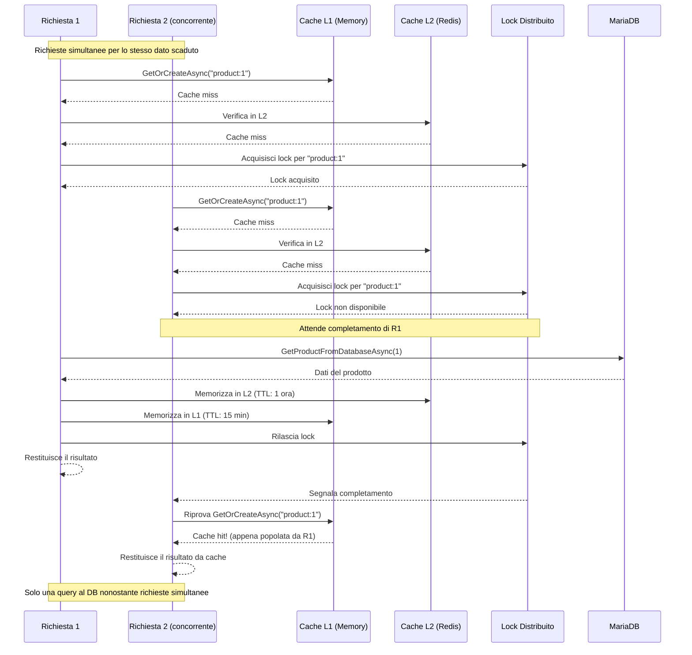
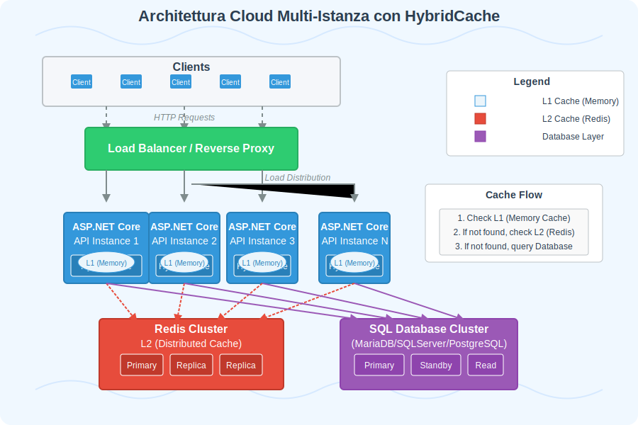
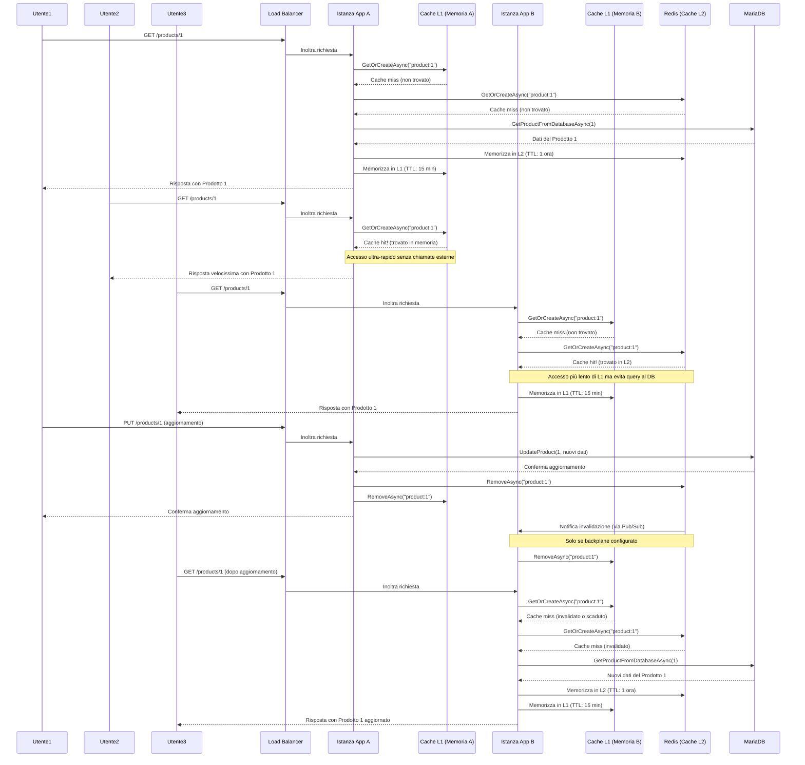

# Sistemi di Cache in ASP.NET Core

- [Sistemi di Cache in ASP.NET Core](#sistemi-di-cache-in-aspnet-core)
  - [Introduzione al Caching e sua Importanza](#introduzione-al-caching-e-sua-importanza)
  - [Caching in ASP.NET](#caching-in-aspnet)
    - [Vantaggi dell'utilizzo della cache](#vantaggi-dellutilizzo-della-cache)
    - [Quando utilizzare la cache](#quando-utilizzare-la-cache)
  - [Strategie di Caching Tradizionali in ASP.NET Core](#strategie-di-caching-tradizionali-in-aspnet-core)
  - [IMemoryCache](#imemorycache)
    - [Configurazione di IMemoryCache](#configurazione-di-imemorycache)
    - [Utilizzo di IMemoryCache](#utilizzo-di-imemorycache)
      - [Utilizzo del pattern `cache aside` con il metodo `GetOrCreateAsync`](#utilizzo-del-pattern-cache-aside-con-il-metodo-getorcreateasync)
    - [Opzioni di scadenza della cache](#opzioni-di-scadenza-della-cache)
    - [Callback e dipendenze](#callback-e-dipendenze)
    - [Limitazioni di IMemoryCache](#limitazioni-di-imemorycache)
  - [IDistributedCache](#idistributedcache)
    - [Configurazione di Redis Distributed Cache](#configurazione-di-redis-distributed-cache)
    - [Utilizzo di base di IDistributedCache](#utilizzo-di-base-di-idistributedcache)
    - [Serializzazione di oggetti complessi](#serializzazione-di-oggetti-complessi)
    - [Vantaggi di IDistributedCache con Redis](#vantaggi-di-idistributedcache-con-redis)
    - [Limitazioni di IDistributedCache](#limitazioni-di-idistributedcache)
    - [Cache-Aside Pattern](#cache-aside-pattern)
    - [Differenze Fondamentali tra `IMemoryCache` e `IDistributedCache`](#differenze-fondamentali-tra-imemorycache-e-idistributedcache)
      - [Scopo e Funzionamento](#scopo-e-funzionamento)
      - [Interfacce e Metodi Principali](#interfacce-e-metodi-principali)
      - [Differenze Chiave nei Metodi Nativi](#differenze-chiave-nei-metodi-nativi)
      - [Metodi di Estensione per IDistributedCache](#metodi-di-estensione-per-idistributedcache)
    - [Aspetti avanzati di gestione di una cache distribuita](#aspetti-avanzati-di-gestione-di-una-cache-distribuita)
      - [Distributed Lock (lock distribuito) sul database della cache](#distributed-lock-lock-distribuito-sul-database-della-cache)
        - [Analisi Dettagliata del Lock Distribuito in Redis](#analisi-dettagliata-del-lock-distribuito-in-redis)
        - [Script Lua in Redis](#script-lua-in-redis)
      - [Strategia di "Staggered Renewal" (rinnovo scaglionato) nella cache](#strategia-di-staggered-renewal-rinnovo-scaglionato-nella-cache)
      - [Strategia "Stale While Revalidate" (SWR) (servire dati obsoleti mentre si aggiorna in background nella gestione della Cache)](#strategia-stale-while-revalidate-swr-servire-dati-obsoleti-mentre-si-aggiorna-in-background-nella-gestione-della-cache)
      - [Cache Penetration: Spiegazione e Soluzioni](#cache-penetration-spiegazione-e-soluzioni)
      - [Soluzione ottimale con Lock Distribuito + Negative Caching](#soluzione-ottimale-con-lock-distribuito--negative-caching)
    - [Analisi delle Strategie di Caching](#analisi-delle-strategie-di-caching)
      - [Confronto tra le tre strategie di caching distribuito implementate](#confronto-tra-le-tre-strategie-di-caching-distribuito-implementate)
      - [Tabella comparativa](#tabella-comparativa)
      - [Casi d'uso ideali](#casi-duso-ideali)
      - [Implementazione Ibrida](#implementazione-ibrida)
      - [Considerazioni conclusive su DistributedCache](#considerazioni-conclusive-su-distributedcache)
  - [HybridCache](#hybridcache)
    - [Introduzione a `HybridCache`](#introduzione-a-hybridcache)
    - [Architettura della Cache Ibrida (`HybridCache`)](#architettura-della-cache-ibrida-hybridcache)
    - [Vantaggi di `HybridCache`](#vantaggi-di-hybridcache)
    - [Confronto: In-Memory vs Distributed vs Hybrid Cache](#confronto-in-memory-vs-distributed-vs-hybrid-cache)
    - [Configurazione ed Esempio Pratico](#configurazione-ed-esempio-pratico)
    - [Focus su Redis come Cache Distribuita (L2)](#focus-su-redis-come-cache-distribuita-l2)
    - [Scenario d'Uso: Applicazione Multi-Istanza](#scenario-duso-applicazione-multi-istanza)
    - [Considerazioni conclusive su HybridCache](#considerazioni-conclusive-su-hybridcache)

## Introduzione al Caching e sua Importanza

Nello sviluppo di applicazioni backend moderne, specialmente quelle progettate per gestire un carico significativo di richieste come le soluzioni multi-server ASP.NET Core dietro un load balancer, le prestazioni e la scalabilità sono fondamentali. Una delle tecniche più efficaci per migliorare le prestazioni e ridurre il carico sui sistemi sottostanti (come i database SQL) è il **caching**.

Il caching consiste nel memorizzare temporaneamente dati frequentemente richiesti in una posizione di accesso rapido (la cache), invece di recuperarli ogni volta dalla fonte originale (spesso più lenta, come un database o un servizio esterno). Questo porta a diversi vantaggi:

1. **Riduzione della Latenza:** Le richieste vengono servite più velocemente recuperando i dati dalla cache.
2. **Riduzione del Carico sul Backend:** Meno richieste raggiungono il database o altri servizi, riducendo il loro carico di lavoro e i costi associati (es. CPU del database, chiamate API a pagamento).
3. **Miglioramento della Scalabilità:** L'applicazione può gestire più richieste concorrenti poiché molte vengono soddisfatte dalla cache.
4. **Maggiore Resilienza:** In caso di indisponibilità temporanea del sistema di origine dati, la cache può continuare a servire dati (anche se potenzialmente "stale", cioè non aggiornatissimi), migliorando la disponibilità percepita dall'utente.

In un'architettura comune con più istanze di un'applicazione web ASP.NET Core distribuite da un load balancer, che interagiscono con un database SQL e potenzialmente con altri servizi come Redis (spesso usato esso stesso come cache distribuita o per altri scopi), una strategia di caching efficace diventa cruciale per garantire coerenza e performance su tutte le istanze.

## Caching in ASP.NET

ASP.NET Core offre [diverse soluzioni per implementare sistemi di cache](https://learn.microsoft.com/en-us/aspnet/core/performance/caching/overview):

1. [**IMemoryCache**](https://learn.microsoft.com/en-us/aspnet/core/performance/caching/memory): cache in-memory per una singola istanza dell'applicazione
2. [**IDistributedCache**](https://learn.microsoft.com/en-us/aspnet/core/performance/caching/distributed): cache distribuita per applicazioni multi-istanza o multi-server
3. [**HybridCache**](https://learn.microsoft.com/en-us/aspnet/core/performance/caching/hybrid): una combinazione di cache in-memory e distribuita

### Vantaggi dell'utilizzo della cache

- Riduzione del carico sui database e servizi esterni
- Diminuzione della latenza nelle risposte
- Miglioramento generale delle prestazioni dell'applicazione
- Maggiore scalabilità

### Quando utilizzare la cache

- Per dati che cambiano raramente
- Per risultati di operazioni costose in termini di risorse
- Per risultati di query di database frequenti
- Per ridurre il carico su servizi esterni

## Strategie di Caching Tradizionali in ASP.NET Core

Le principali strategie di caching tradizionali integrate in ASP.NET Core sono:

1. **In-Memory Cache (`IMemoryCache`):**

    - **Architettura:** Memorizza i dati nella memoria RAM del processo dell'applicazione web stessa. Ogni istanza dell'applicazione ha la sua cache indipendente.
    - **Vantaggi:** Estremamente veloce (accesso alla memoria locale), semplice da configurare e usare.
    - **Svantaggi:**
        - **Non Condivisa:** I dati non sono condivisi tra le diverse istanze dell'applicazione. Se un'istanza popola la sua cache, le altre non ne beneficiano.
        - **Coerenza:** Mantenere la coerenza tra le cache delle varie istanze è difficile. Se i dati sottostanti cambiano, invalidare la cache su tutte le istanze richiede meccanismi aggiuntivi (es. backplane).
        - **Volatilità:** La cache viene persa al riavvio dell'applicazione.
        - **Consumo di Memoria:** Può consumare una quantità significativa di memoria del server web.
2. **Distributed Cache (`IDistributedCache`):**

    - **Architettura:** Memorizza i dati in un sistema esterno condiviso tra tutte le istanze dell'applicazione. Implementazioni comuni includono Redis, SQL Server, NCache.
    - **Vantaggi:**
        - **Condivisa:** Tutte le istanze accedono alla stessa cache, garantendo che un dato cachato sia disponibile per tutte.
        - **Coerenza:** I dati sono più coerenti tra le istanze (anche se la coerenza perfetta dipende dalla strategia di invalidazione).
        - **Persistenza (Opzionale):** Alcuni provider (come Redis con persistenza abilitata) possono mantenere i dati anche dopo riavvii.
        - **Scalabilità:** Il sistema di cache distribuita può scalare indipendentemente dall'applicazione web.
    - **Svantaggi:**
        - **Latenza:** L'accesso richiede una chiamata di rete al server di cache distribuita, risultando più lento dell'in-memory cache.
        - **Complessità:** Richiede la configurazione e la gestione di un servizio esterno.
        - **Serializzazione:** I dati devono essere serializzati (spesso in JSON o binario) per essere memorizzati, aggiungendo un piccolo overhead.

## IMemoryCache

`IMemoryCache` è un servizio che fornisce una cache in-memory all'interno di una singola istanza dell'applicazione. È la soluzione più semplice e veloce, ma ha limitazioni quando si lavora con più istanze dell'applicazione (come in ambienti cloud o con bilanciamento del carico).

### Configurazione di IMemoryCache

Per utilizzare `IMemoryCache`, è necessario prima registrarlo nel container di servizi:

```csharp
var builder = WebApplication.CreateBuilder(args);

// Aggiunta del servizio IMemoryCache
builder.Services.AddMemoryCache();

var app = builder.Build();
```

### Utilizzo di IMemoryCache

Si riporta di seguito un [esempio di Minimal API che utilizza `IMemoryCache`](../../../api-samples/minimal-api/CachingExamples/MemoryCacheDemo/):

```csharp
using Microsoft.Extensions.Caching.Memory;

var builder = WebApplication.CreateBuilder(args);

// Learn more about configuring OpenAPI at https://aka.ms/aspnet/openapi
builder.Services.AddOpenApi();
//aggiunge il servizio che permette ad OpenAPI di leggere i metadati delle API
builder.Services.AddEndpointsApiExplorer();
//configura il servizio OpenAPI
builder.Services.AddOpenApiDocument(config =>
    {
        config.Title = "Memory Cache Demo v1";
        config.DocumentName = "Memory Cache Demo API";
        config.Version = "v1";
    }
);

// Registra il servizio IMemoryCache
builder.Services.AddMemoryCache();

var app = builder.Build();

// Configure the HTTP request pipeline.
if (app.Environment.IsDevelopment())
{
    app.MapOpenApi();
    //permette a Swagger (NSwag) di generare un file JSON con le specifiche delle API
    app.UseOpenApi();
    //permette di configurare l'interfaccia SwaggerUI (l'interfaccia grafica web di Swagger (NSwag) che permette di interagire con le API)
    app.UseSwaggerUi(config =>
    {
        config.DocumentTitle = "Memory Cache Demo v1";
        config.Path = "/swagger";
        config.DocumentPath = "/swagger/{documentName}/swagger.json";
        config.DocExpansion = "list";
    });

    app.UseDeveloperExceptionPage();
}

//app.UseHttpsRedirection();

app.MapGet("/products/{id}", async (int id, IMemoryCache cache) =>
{
    // Chiave univoca per identificare l'elemento nella cache
    string cacheKey = $"product:{id}";

    // Tenta di recuperare il prodotto dalla cache
    if (!cache.TryGetValue(cacheKey, out Product? product))
    {
        // Se non presente in cache, simula il recupero dal database
        product = await GetProductFromDatabaseAsync(id);

        if (product is not null)
        {
            // Imposta le opzioni di cache
            var cacheEntryOptions = new MemoryCacheEntryOptions()

                // Scadenza assoluta - rimuove l'elemento dopo 1 ora
                .SetAbsoluteExpiration(TimeSpan.FromHours(1))

                // Scadenza scorrevole - rimuove l'elemento se non vi si accede per 10 minuti
                .SetSlidingExpiration(TimeSpan.FromMinutes(10))

                // Priorità - definisce la priorità di rimozione quando la memoria è sotto pressione
                .SetPriority(CacheItemPriority.Normal)

                // Imposta la chiamata di una callback function quando l'elemento viene tolto dalla cache
                .RegisterPostEvictionCallback((key, value, reason, state) =>
                    {
                        Console.WriteLine($"L'elemento con chiave {key} è stato rimosso per: {reason}");
                    });

            // Salva il prodotto nella cache
            cache.Set(cacheKey, product, cacheEntryOptions);
        }
    }

    if (product is null)
    {
        return Results.NotFound();
    }
    return Results.Ok(product);
});

// Endpoint che utilizza GetOrCreateAsync
app.MapGet("/products-v2/{id}", async (int id, IMemoryCache cache) =>
{
    // Chiave univoca per identificare l'elemento nella cache
    string cacheKey = $"product-v2:{id}";

    // Utilizza GetOrCreateAsync che semplifica il pattern di caching
    var product = await cache.GetOrCreateAsync(cacheKey, async entry =>
    {
        // Configura le opzioni di cache
        entry.SetAbsoluteExpiration(TimeSpan.FromHours(1));
        entry.SetSlidingExpiration(TimeSpan.FromMinutes(10));
        entry.SetPriority(CacheItemPriority.Normal);

        // Registra la callback di eviction
        entry.RegisterPostEvictionCallback((key, value, reason, state) =>
        {
            Console.WriteLine($"L'elemento con chiave {key} è stato rimosso per: {reason}");
        });

        // Recupero del prodotto dal database solo se non è presente in cache
        Console.WriteLine($"Recupero del prodotto {id} dal database (usando GetOrCreateAsync)");
        return await GetProductFromDatabaseAsync(id);
    });

    if (product is null)
    {
        return Results.NotFound();
    }
    return Results.Ok(product);
});

// Simula il recupero del prodotto dal database
static async Task<Product?> GetProductFromDatabaseAsync(int id)
{
    // ... logica per recuperare il prodotto dal database ...
    await Task.Delay(100); // Simula un'operazione I/O
    return id switch
    {
        1 => new Product { Id = 1, Name = "Prodotto A", Price = 19.99M },
        2 => new Product { Id = 2, Name = "Prodotto B", Price = 29.99M },
        _ => null
    };
}


app.Run();

// Modello Product
public class Product
{
    public int Id { get; set; }
    public string Name { get; set; } = string.Empty;
    public decimal Price { get; set; }
}
```

Nell'endpoint `/products/{id}`, sono state configurate diverse opzioni per la cache della memoria che lavorano insieme per ottimizzare le prestazioni e la gestione delle risorse. Non è necessario configurarle sempre tutte, ma in questo caso sono state inserite per mostrare il loro funzionamento combinato:

1. **Chiave univoca della cache** `cacheKey = $"product:{id}"`

    - Crea un identificatore univoco per ogni prodotto in base al suo ID
    - Permette di recuperare e salvare elementi specifici nella cache
2. **Scadenza assoluta** (`.SetAbsoluteExpiration(TimeSpan.FromHours(1))`)

    - Imposta un limite massimo di 1 ora per qualsiasi elemento nella cache
    - Dopo 1 ora, l'elemento viene rimosso indipendentemente dall'utilizzo
3. **Scadenza scorrevole** (`.SetSlidingExpiration(TimeSpan.FromMinutes(10))`)

    - Rimuove l'elemento se non viene acceduto per 10 minuti
    - Ogni accesso all'elemento ripristina questo timer
    - Funziona in combinazione con la scadenza assoluta: l'elemento verrà comunque rimosso dopo 1 ora
4. **Priorità** (`.SetPriority(CacheItemPriority.Normal)`)

    - Definisce la priorità per la rimozione quando la memoria è sotto pressione
    - Elementi con priorità più bassa vengono rimossi prima
5. **Callback post-rimozione** (`.RegisterPostEvictionCallback(...)`)

    - Esegue una funzione quando l'elemento viene rimosso dalla cache
    - Registra una traccia di quando e perché l'elemento è stato rimosso

Il funzionamento combinato prevede che:

- Un elemento rimane nella cache finché:
    - Non è passata 1 ora (scadenza assoluta), **oppure**
    - Non viene utilizzato per 10 minuti (scadenza scorrevole), **oppure**
    - La memoria è sotto pressione e l'elemento ha priorità inferiore rispetto ad altri elementi

Questo approccio combinato ottimizza l'uso della memoria, mantiene la freschezza dei dati e migliora le prestazioni riducendo gli accessi al database per i prodotti richiesti frequentemente.

Ad esempio, dopo 11 minuti di inattività, il tempo di scadenza scorrevole (10 minuti) sarà già stato superato, quindi l'elemento sarà stato eliminato dalla cache.

Quando ciò accade, verrà anche eseguito la callback di `post-eviction` che mostrerà un messaggio:

`L'elemento con chiave product:X è stato rimosso per: Expired`

dove X è l'ID del prodotto e "Expired" è il motivo della rimozione.

Nell'esempio mostrato, anche se un elemento viene continuamente acceduto (quindi non supera mai il limite di scadenza scorrevole di 10 minuti), verrà comunque rimosso dalla cache dopo un'ora.

Questo perché viene impostata una scadenza assoluta con:

`.SetAbsoluteExpiration(TimeSpan.FromHours(1))`

Questo comportamento garantisce che:

1. **Indipendentemente dalla frequenza di accesso** all'elemento
2. **Indipendentemente dalla scadenza scorrevole**
3. Dopo esattamente un'ora dalla sua inserzione nella cache

L'elemento verrà automaticamente rimosso e sarà necessario recuperarlo nuovamente dal database.

Quando l'elemento viene rimosso per questo motivo, la callback registrata mostrerà nel log:

`L'elemento con chiave product:X è stato rimosso per: Expired`

È un meccanismo importante per assicurarsi che i dati in cache non diventino troppo vecchi, anche se vengono utilizzati frequentemente.

#### Utilizzo del pattern `cache aside` con il metodo `GetOrCreateAsync`

L'endpoint `/product-v2/{id}` utilizza il pattern  `cache aside` che può essere implementato attraverso l'utilizzo del metodo `GetOrCreateAsync`, che semplifica il codice rispetto al pattern precedente con `TryGetValue`. Il metodo `GetOrCreateAsync` automaticamente verifica se l'elemento è in cache e, se non lo è, esegue la factory function per crearlo e aggiungerlo alla cache in un'unica operazione. Questo rende il codice più conciso e leggibile, evitando la gestione manuale di controllo cache e inserimento.

### Opzioni di scadenza della cache

`IMemoryCache` offre diverse opzioni per definire quando un elemento nella cache deve scadere:

1. **Scadenza assoluta**: l'elemento scade dopo un periodo fisso di tempo
2. **Scadenza scorrevole**: l'elemento scade dopo un periodo di inattività
3. **Priorità di cache**: definisce la priorità di rimozione in caso di pressione sulla memoria

```csharp
var cacheEntryOptions = new MemoryCacheEntryOptions()
    // Scadenza assoluta - rimuove l'elemento dopo 1 ora
    .SetAbsoluteExpiration(TimeSpan.FromHours(1))
    // Scadenza scorrevole - rimuove l'elemento se non vi si accede per 10 minuti
    .SetSlidingExpiration(TimeSpan.FromMinutes(10))
    // Priorità - definisce la priorità di rimozione quando la memoria è sotto pressione
    .SetPriority(CacheItemPriority.Normal);
```

### Callback e dipendenze

È possibile registrare callback che vengono attivate quando un elemento viene rimosso dalla cache:

```csharp
var cacheEntryOptions = new MemoryCacheEntryOptions()
    .SetAbsoluteExpiration(TimeSpan.FromMinutes(5))
    .RegisterPostEvictionCallback((key, value, reason, state) =>
    {
        Console.WriteLine($"L'elemento con chiave {key} è stato rimosso per: {reason}");
    });
```

### Limitazioni di IMemoryCache

- La cache è locale per ogni istanza dell'applicazione, quindi non è adatta per applicazioni distribuite
- I dati in cache vengono persi quando l'applicazione viene riavviata
- Il consumo di memoria può diventare un problema se si memorizzano grandi quantità di dati

## IDistributedCache

`IDistributedCache` fornisce un'interfaccia per implementare una cache condivisa tra più istanze dell'applicazione. ASP.NET Core supporta diverse implementazioni:

1. **Distributed SQL Server Cache**
2. **Distributed Redis Cache**
3. **Distributed NCache**
4. **Distributed Memory Cache** (solo per sviluppo/test)

### Configurazione di Redis Distributed Cache

Prima di utilizzare Redis, è necessario avere un'istanza Redis in esecuzione. Per l'ambiente di sviluppo, è possibile utilizzare Docker:

```bash
docker run --name redis-cache -p 6379:6379 -d redis
```

Quindi, configurare l'applicazione per utilizzare Redis come cache distribuita:

```csharp
var builder = WebApplication.CreateBuilder(args);

// Configurazione della cache distribuita Redis
builder.Services.AddStackExchangeRedisCache(options =>
{
    options.Configuration = "localhost:6379";
    options.InstanceName = "SampleInstance:";
});

var app = builder.Build();
```

### Utilizzo di base di IDistributedCache

Ecco un esempio di Minimal API che utilizza `IDistributedCache` con Redis:

```csharp
var builder = WebApplication.CreateBuilder(args);

// Aggiunta di Redis come cache distribuita
builder.Services.AddStackExchangeRedisCache(options =>
{
    options.Configuration = "localhost:6379";
    options.InstanceName = "SampleInstance:";
});

var app = builder.Build();

app.MapGet("/distributed-cached-time", async (IDistributedCache cache) =>
{
    string cacheKey = "DistributedCurrentTime";
    
    // Tentativo di ottenere il valore dalla cache
    string? cachedTimeString = await cache.GetStringAsync(cacheKey);
    DateTime cachedTime;
    
    if (cachedTimeString == null)
    {
        // Se non presente in cache, calcola il nuovo valore
        cachedTime = DateTime.UtcNow;
        
        // Salva in cache per 30 secondi
        var options = new DistributedCacheEntryOptions()
            .SetAbsoluteExpiration(TimeSpan.FromSeconds(30));
        
        await cache.SetStringAsync(cacheKey, cachedTime.ToString("o"), options);
    }
    else
    {
        cachedTime = DateTime.Parse(cachedTimeString);
    }

    return Results.Ok(new
    {
        CachedTime = cachedTime,
        CurrentTime = DateTime.UtcNow,
        Message = "Il tempo memorizzato in cache rimane lo stesso per 30 secondi ed è condiviso tra tutte le istanze dell'applicazione."
    });
});

app.Run();
```

### Serializzazione di oggetti complessi

A differenza di `IMemoryCache`, `IDistributedCache` può memorizzare solo `byte[]` o `string`. Per oggetti complessi, è necessario serializzare e deserializzare:

```csharp
app.MapGet("/cached-product/{id:int}", async (int id, IDistributedCache cache) =>
{
    string cacheKey = $"Product:{id}";
    
    // Tentativo di ottenere il prodotto dalla cache
    byte[]? cachedProduct = await cache.GetAsync(cacheKey);
    
    if (cachedProduct == null)
    {
        // Simulazione di un accesso al database
        var product = new Product
        {
            Id = id,
            Name = $"Prodotto {id}",
            Price = 10.99m * id,
            LastUpdated = DateTime.UtcNow
        };
        
        // Serializzazione dell'oggetto
        byte[] serializedProduct = JsonSerializer.SerializeToUtf8Bytes(product);
        
        // Salva in cache per 5 minuti
        var options = new DistributedCacheEntryOptions()
            .SetAbsoluteExpiration(TimeSpan.FromMinutes(5));
        
        await cache.SetAsync(cacheKey, serializedProduct, options);
        
        return Results.Ok(product);
    }
    else
    {
        // Deserializzazione dell'oggetto
        var product = JsonSerializer.Deserialize<Product>(cachedProduct);
        return Results.Ok(product);
    }
});

// Classe di esempio
public class Product
{
    public int Id { get; set; }
    public string Name { get; set; } = string.Empty;
    public decimal Price { get; set; }
    public DateTime LastUpdated { get; set; }
}
```

### Vantaggi di IDistributedCache con Redis

- I dati in cache sono condivisi tra tutte le istanze dell'applicazione
- Redis è altamente performante e supporta la persistenza
- Offre funzionalità avanzate come impostazione di TTL (Time-To-Live) per gli elementi
- Migliore resilienza: i dati in cache sopravvivono ai riavvii dell'applicazione

### Limitazioni di IDistributedCache

- Maggiore latenza rispetto a IMemoryCache (a causa della rete)
- Richiede la serializzazione/deserializzazione per oggetti complessi
- Necessita di infrastruttura aggiuntiva (server Redis, SQL Server, ecc.)

### Cache-Aside Pattern

Nelle applicazioni distribuite moderne si è affermato il pattern Cache-Aside, che verrà discusso di seguito.

* **Cosa è il Pattern Cache-Aside**

    Il pattern Cache-Aside (noto anche come Lazy Loading) è un modello di gestione della cache dove:

    1. L'applicazione cerca prima un dato nella cache
    2. Se il dato è presente (cache hit), lo utilizza direttamente
    3. Se il dato non è presente (cache miss), l'applicazione:
        - Recupera il dato dalla fonte originale (es. database)
        - Inserisce il dato recuperato nella cache
        - Restituisce il dato all'utente

    È chiamato "aside" perché la cache è gestita "a lato" rispetto al flusso principale di accesso ai dati.

* **Implementazione base del pattern Cache-Aside**

    Nel codice di esempio, si usa il pattern Cache-Aside in modo esplicito, ad esempio in `/products/{id}`:

    ```cs
    // Tenta di recuperare il prodotto dalla cache
    var cachedProduct = await cache.GetStringAsync(cacheKey);

    if (string.IsNullOrEmpty(cachedProduct))
    {
        // Se non presente in cache, simula il recupero dal database
        product = await GetProductFromDatabaseAsync(id);

        if (product is not null)
        {
            // Salva il prodotto nella cache
            await cache.SetStringAsync(cacheKey, serializedProduct, cacheEntryOptions);
        }
    }
    else
    {
        // Deserializza il prodotto dal formato JSON
        product = JsonSerializer.Deserialize<Product>(cachedProduct);
    }
    ```

* **Implementazione con `GetOrCreate`**

    Nell'endpoint dell'esempio `/products-v4/{id}` è stato implementato un approccio più elegante usando il metodo `GetOrCreateAsync`:

    ```cs
    var product = await cache.GetOrCreateAsync(
        cacheKey,
        async () =>
        {
            Console.WriteLine($"Recupero del prodotto {id} dal database (usando GetOrCreateAsync con IDistributedCache)");
            return await GetProductFromDatabaseAsync(id);
        },
        new DistributedCacheEntryOptions()
            .SetAbsoluteExpiration(TimeSpan.FromHours(1))
            .SetSlidingExpiration(TimeSpan.FromMinutes(10))
    );
    ```

    Questo approccio racchiude in un unico metodo la logica del pattern Cache-Aside, migliorando la leggibilità e riducendo il rischio di errori.

* **Vantaggi del Pattern Cache-Aside**

  1. **Resilienza**: Se la cache non è disponibile, l'applicazione può comunque funzionare, recuperando i dati dalla fonte originale
  2. **Caricamento lazy**: I dati vengono caricati in cache solo quando effettivamente richiesti
  3. **Freshness**: È possibile implementare politiche di scadenza per garantire che i dati non diventino troppo obsoleti
  4. **Controllo**: L'applicazione ha il controllo completo su quali dati mettere in cache e quando

* **Implementazione ottimale del pattern Cache-Aside**

    Un'implementazione ottimale del pattern Cache-Aside con `GetOrCreateAsync` potrebbe essere così:

    ```cs
    public static async Task<T?> GetOrCreateAsync<T>(
        this IDistributedCache cache,
        string key,
        Func<Task<T?>> factory,
        DistributedCacheEntryOptions options) where T : class
    {
        byte[]? cachedData = await cache.GetAsync(key);

        if (cachedData != null)
        {
            // Cache hit
            return JsonSerializer.Deserialize<T>(cachedData);
        }

        // Cache miss: esegui la factory per ottenere il dato
        T? result = await factory();

        if (result != null)
        {
            // Salva in cache
            byte[] serializedResult = JsonSerializer.SerializeToUtf8Bytes(result);
            await cache.SetAsync(key, serializedResult, options);
        }

        return result;
    }
    ```

* **Considerazioni sul Pattern Cache-Aside**

  1. **Consistenza**: I dati in cache potrebbero diventare obsoleti rispetto alla fonte originale. Strategie per mitigare la non consistenza della cache sono:

      - Impostare una scadenza appropriata (come mostrato negli esempi con `SetAbsoluteExpiration` e `SetSlidingExpiration`)
      - Invalidare proattivamente la cache quando i dati vengono modificati
      - Utilizzare il rinnovo in background per aggiornare la cache prima della scadenza
  2. **Thundering Herd (o Cache Stampede)**: Se una chiave popolare scade, molte richieste potrebbero colpire contemporaneamente la fonte originale. Possibili soluzioni sono:

      - Implementare un **"distributed lock"**
      - Strategia di **"staggered renewal"**
      - Tecnica **"stale while revalidate"** (servire dati obsoleti mentre si aggiorna in background)
  3. **Cache Penetration**: Richieste di dati che non esistono potrebbero bypassare la cache. Soluzione:

      - Memorizzare in cache anche i risultati negativi (es. con un valore speciale o TTL più breve)

* **Implementazione di strategie anti-thundering herd o cache stampede**:

    ```cs
    // Esempio semplificato
    var lockKey = $"lock:{cacheKey}";
    if (!await TryAcquireLockAsync(lockKey))
    {
        // Attendi un po' e riprova a leggere dalla cache
        await Task.Delay(50);
        return await GetOrCreateAsync(...);
    }

    try 
    {
        // Verifica nuovamente la cache (doppio controllo)
        var recheck = await cache.GetAsync(cacheKey);
        if (recheck != null) return Deserialize(recheck);

        // Ora puoi procedere con il recupero dal database
    }
    finally 
    {
        await ReleaseLockAsync(lockKey);
    }
    ```

Il pattern `Cache-Aside` è uno dei modelli di caching più efficaci in applicazioni distribuite, ed è particolarmente adatto quando si utilizza Redis come cache distribuita.

:memo: Si noti la differenza tra i termini "cache stampede" e "thundering herd"

- Cache Stampede

    Il termine "Cache Stampede" (letteralmente "corsa alla cache") si riferisce specificamente al fenomeno che si verifica quando:

    - Una chiave di cache molto richiesta scade o viene invalidata
    - Molte richieste arrivano simultaneamente trovando la chiave non disponibile
    - Tutte queste richieste tentano di rigenerare il contenuto della cache contemporaneamente
    - Si crea un picco improvviso di carico sulla risorsa sottostante (tipicamente il database)

- Thundering Herd

    Il termine "Thundering Herd" (letteralmente "mandria tuonante") è un concetto più generale che si riferisce a:

    - Un gran numero di processi/thread che attendono un evento
    - L'evento si verifica e sveglia tutti i processi contemporaneamente
    - I processi competono per le risorse, causando sovraccarico

Nel contesto della cache, il "Thundering Herd" si verifica quando molte istanze dell'applicazione tentano di accedere contemporaneamente a una risorsa condivisa dopo che una chiave di cache è scaduta.

Nel progetto [`DistributedCacheDemo`](../../../api-samples/minimal-api/CachingExamples/DistributedCacheDemo/) viene mostrato un esempio di applicazione ASP.NET Minimal API che utilizza il database [Redis](https://redis.io/docs/latest/operate/oss_and_stack/) per implementare un sistema che cache distribuito tra più istanze di backend. L'esempio mostra un utilizzo "semplice" della cache con il pattern `cache aside` negli endpoint `/products/{id}`, `/products-v2/{id}`, `/products-v3/{id}`, `/products-v4/{id}`, `/products-v5/{id}` e un utilizzo "avanzato" che implementa possibili strategie per la soluzione del problema del `Thundering Herd` e `Cache Penetration`.

A titolo di esempio, l'implementazione di un sistema di cache distribuito, basato sul database Redis, richiede:

- L'installazione del pacchetto Redis `Microsoft.Extensions.Caching.StackExchangeRedis`
- La configurazione del servizio di cache nella pipeline dell'applicazione:
  
  ```cs
    // Registra il servizio Redis per IDistributedCache
    builder.Services.AddStackExchangeRedisCache(options =>
    {
        options.Configuration = builder.Configuration.GetSection("Redis:ConnectionString").Value;
        options.InstanceName = builder.Configuration.GetSection("Redis:InstanceName").Value;
    });
  ```

- L'utilizzo della Dependency Injection per iniettare il servizio di cache distribuita nei vari endpoint che implementano il patter del `cache aside`. Per i dettagli completi si veda l'esempio [DistributedCacheDemo](../../../api-samples/minimal-api/CachingExamples/DistributedCacheDemo/).
- Un tipico utilizzo "semplice" della cache distribuita potrebbe essere quello riportato nei seguenti endpoint:
  
  ```cs
    app.MapGet("/products/{id}", async (int id, IDistributedCache cache) =>
    {
        // Chiave univoca per identificare l'elemento nella cache
        string cacheKey = $"product:{id}";

        // Tenta di recuperare il prodotto dalla cache
        var cachedProduct = await cache.GetStringAsync(cacheKey);
        Product? product = null;

        if (string.IsNullOrEmpty(cachedProduct))
        {
            // Se non presente in cache, simula il recupero dal database
            product = await GetProductFromDatabaseAsync(id);

            if (product is not null)
            {
                // Serializza il prodotto in formato JSON
                var serializedProduct = JsonSerializer.Serialize(product);

                // Imposta le opzioni di cache
                var cacheEntryOptions = new DistributedCacheEntryOptions()
                    // Scadenza assoluta - rimuove l'elemento dopo 1 ora
                    .SetAbsoluteExpiration(TimeSpan.FromHours(1))
                    // Scadenza scorrevole - rimuove l'elemento se non vi si accede per 10 minuti
                    .SetSlidingExpiration(TimeSpan.FromMinutes(10));

                // Salva il prodotto nella cache
                await cache.SetStringAsync(cacheKey, serializedProduct, cacheEntryOptions);
                Console.WriteLine($"Prodotto {id} salvato nella cache distribuita");
            }
        }
        else
        {
            // Deserializza il prodotto dal formato JSON
            product = JsonSerializer.Deserialize<Product>(cachedProduct);
            Console.WriteLine($"Prodotto {id} recuperato dalla cache distribuita");
        }

        if (product is null)
        {
            return Results.NotFound();
        }
        return Results.Ok(product);
    });

    // Endpoint che utilizza un pattern più semplice
    app.MapGet("/products-v2/{id}", async (int id, IDistributedCache cache) =>
    {
        // Chiave univoca per identificare l'elemento nella cache
        string cacheKey = $"product-v2:{id}";

        // Tenta di recuperare il prodotto dalla cache
        var cachedProduct = await cache.GetStringAsync(cacheKey);
        Product? product;

        // Se non presente in cache, recuperalo dal database
        if (string.IsNullOrEmpty(cachedProduct))
        {
            Console.WriteLine($"Recupero del prodotto {id} dal database (usando pattern v2)");
            product = await GetProductFromDatabaseAsync(id);

            if (product is not null)
            {
                // Serializza il prodotto e salvalo nella cache
                var serializedProduct = JsonSerializer.Serialize(product);
                var options = new DistributedCacheEntryOptions()
                    .SetAbsoluteExpiration(TimeSpan.FromHours(1))
                    .SetSlidingExpiration(TimeSpan.FromMinutes(10));

                await cache.SetStringAsync(cacheKey, serializedProduct, options);
                Console.WriteLine($"Prodotto {id} salvato nella cache distribuita (pattern v2)");
            }
        }
        else
        {
            // Deserializza il prodotto dalla cache
            product = JsonSerializer.Deserialize<Product>(cachedProduct);
            Console.WriteLine($"Prodotto {id} recuperato dalla cache distribuita (pattern v2)");
        }

        if (product is null)
        {
            return Results.NotFound();
        }
        return Results.Ok(product);
    });

    // Endpoint che utilizza la serializzazione binaria diretta
    app.MapGet("/product-v3/{id:int}", async (int id, IDistributedCache cache) =>
    {
        string cacheKey = $"product-v3:{id}";

        // Tentativo di ottenere il prodotto dalla cache
        byte[]? cachedProduct = await cache.GetAsync(cacheKey);

        if (cachedProduct == null)
        {
            // Simulazione di un accesso al database
            var product = new Product
            {
                Id = id,
                Name = $"Prodotto {id}",
                Price = 10.99m * id,
                LastUpdated = DateTime.UtcNow
            };

            // Serializzazione dell'oggetto
            byte[] serializedProduct = JsonSerializer.SerializeToUtf8Bytes(product);

            // Salva in cache per 5 minuti
            var options = new DistributedCacheEntryOptions()
                .SetAbsoluteExpiration(TimeSpan.FromMinutes(5));

            await cache.SetAsync(cacheKey, serializedProduct, options);
            Console.WriteLine($"Prodotto {id} salvato nella cache distribuita (serializzazione binaria)");

            return Results.Ok(product);
        }
        else
        {
            // Deserializzazione dell'oggetto
            var product = JsonSerializer.Deserialize<Product>(cachedProduct);
            Console.WriteLine($"Prodotto {id} recuperato dalla cache distribuita (serializzazione binaria)");
            return Results.Ok(product);
        }
    });

    // Endpoint che utilizza GetOrCreateAsync con IDistributedCache
    app.MapGet("/products-v4/{id}", async (int id, IDistributedCache cache) =>
    {
        // Chiave univoca per identificare l'elemento nella cache
        string cacheKey = $"product-v4:{id}";

        // Utilizzo del metodo di estensione GetOrCreateAsync
        var product = await cache.GetOrCreateAsync(
            cacheKey,
            async () =>
            {
                Console.WriteLine($"Recupero del prodotto {id} dal database (usando GetOrCreateAsync con IDistributedCache)");
                return await GetProductFromDatabaseAsync(id);
            },
            new DistributedCacheEntryOptions()
                .SetAbsoluteExpiration(TimeSpan.FromHours(1))
                .SetSlidingExpiration(TimeSpan.FromMinutes(10))
        );

        if (product is null)
        {
            return Results.NotFound();
        }

        Console.WriteLine($"Prodotto {id} gestito tramite GetOrCreateAsync con IDistributedCache");
        return Results.Ok(product);
    });

    // Endpoint che utilizza TryGetValueAsync con IDistributedCache
    app.MapGet("/products-v5/{id}", async (int id, IDistributedCache cache) =>
    {
        // Chiave univoca per identificare l'elemento nella cache
        string cacheKey = $"product-v5:{id}";

        // Tenta di recuperare il prodotto dalla cache usando TryGetValueAsync
        var (found, product) = await cache.TryGetValueAsync<Product>(cacheKey);

        if (!found)
        {
            // Se non presente in cache, simula il recupero dal database
            product = await GetProductFromDatabaseAsync(id);

            if (product is not null)
            {
                // Serializza il prodotto e salvalo nella cache
                byte[] serializedProduct = JsonSerializer.SerializeToUtf8Bytes(product);
                var options = new DistributedCacheEntryOptions()
                    .SetAbsoluteExpiration(TimeSpan.FromHours(1))
                    .SetSlidingExpiration(TimeSpan.FromMinutes(10));

                await cache.SetAsync(cacheKey, serializedProduct, options);
                Console.WriteLine($"Prodotto {id} salvato nella cache distribuita (usando TryGetValueAsync)");
            }
        }
        else
        {
            Console.WriteLine($"Prodotto {id} recuperato dalla cache distribuita (usando TryGetValueAsync)");
        }

        if (product is null)
        {
            return Results.NotFound();
        }

        return Results.Ok(product);
    });
  ```  

Di seguito vengono riportate alcune significative differenze tra `IMemoryCache` e `IDistributedCache`

### Differenze Fondamentali tra `IMemoryCache` e `IDistributedCache`

#### Scopo e Funzionamento

- **IMemoryCache**:

    - Cache locale in-memory limitata alla singola istanza dell'applicazione
    - I dati sono memorizzati nella RAM del server che esegue l'applicazione
    - Se l'applicazione è in esecuzione su più server, ogni server ha la prria cache indipendente
- **IDistributedCache**:

    - Cache esterna accessibile da tutte le istanze dell'applicazione
    - I dati sono memorizzati in un sistema esterno (Redis, SQL Server, ecc.)
    - Ideale per ambienti multi-istanza o distribuiti

#### Interfacce e Metodi Principali

* **[`IMemoryCache`](https://learn.microsoft.com/en-us/dotnet/api/microsoft.extensions.caching.memory.imemorycache) (Cache Locale)**

    | [CreateEntry(Object)](https://learn.microsoft.com/en-us/dotnet/api/microsoft.extensions.caching.memory.imemorycache.createentry?view=net-9.0-pp#microsoft-extensions-caching-memory-imemorycache-createentry(system-object)) | Create or overwrite an entry in the cache. |
    | --- |  --- |
    | [GetCurrentStatistics()](https://learn.microsoft.com/en-us/dotnet/api/microsoft.extensions.caching.memory.imemorycache.getcurrentstatistics?view=net-9.0-pp#microsoft-extensions-caching-memory-imemorycache-getcurrentstatistics) | Gets a snapshot of the cache statistics if available. |
    | [Remove(Object)](https://learn.microsoft.com/en-us/dotnet/api/microsoft.extensions.caching.memory.imemorycache.remove?view=net-9.0-pp#microsoft-extensions-caching-memory-imemorycache-remove(system-object)) | Removes the object associated with the given key. |
    | [TryGetValue(Object, Object)](https://learn.microsoft.com/en-us/dotnet/api/microsoft.extensions.caching.memory.imemorycache.trygetvalue?view=net-9.0-pp#microsoft-extensions-caching-memory-imemorycache-trygetvalue(system-object-system-object@)) | Gets the item associated with this key if present. |

    Con metodi di estensione inclusi in `Microsoft.Extensions.Caching`:

    | [Get(IMemoryCache, Object)](https://learn.microsoft.com/en-us/dotnet/api/microsoft.extensions.caching.memory.cacheextensions.get?view=net-9.0-pp#microsoft-extensions-caching-memory-cacheextensions-get(microsoft-extensions-caching-memory-imemorycache-system-object)) | Gets the value associated with this key if present. |
    | --- |  --- |
    | [Get\<TItem>(IMemoryCache, Object)](https://learn.microsoft.com/en-us/dotnet/api/microsoft.extensions.caching.memory.cacheextensions.get?view=net-9.0-pp#microsoft-extensions-caching-memory-cacheextensions-get-1(microsoft-extensions-caching-memory-imemorycache-system-object)) | Gets the value associated with this key if present. |
    | [GetOrCreate\<TItem>(IMemoryCache, Object, Func<ICacheEntry,TItem>, MemoryCacheEntryOptions)](https://learn.microsoft.com/en-us/dotnet/api/microsoft.extensions.caching.memory.cacheextensions.getorcreate?view=net-9.0-pp#microsoft-extensions-caching-memory-cacheextensions-getorcreate-1(microsoft-extensions-caching-memory-imemorycache-system-object-system-func((microsoft-extensions-caching-memory-icacheentry-0))-microsoft-extensions-caching-memory-memorycacheentryoptions)) | Gets the value associated with this key if it exists, or generates a new entry using the provided key and a value from the given factory if the key is not found. |
    | [GetOrCreate\<TItem>(IMemoryCache, Object, Func<ICacheEntry,TItem>)](https://learn.microsoft.com/en-us/dotnet/api/microsoft.extensions.caching.memory.cacheextensions.getorcreate?view=net-9.0-pp#microsoft-extensions-caching-memory-cacheextensions-getorcreate-1(microsoft-extensions-caching-memory-imemorycache-system-object-system-func((microsoft-extensions-caching-memory-icacheentry-0)))) | Gets the value associated with this key if it exists, or generates a new entry using the provided key and a value from the given factory if the key is not found. |
    | [GetOrCreateAsync\<TItem>(IMemoryCache, Object, Func<ICacheEntry,Task\<TItem>>, MemoryCacheEntryOptions)](https://learn.microsoft.com/en-us/dotnet/api/microsoft.extensions.caching.memory.cacheextensions.getorcreateasync?view=net-9.0-pp#microsoft-extensions-caching-memory-cacheextensions-getorcreateasync-1(microsoft-extensions-caching-memory-imemorycache-system-object-system-func((microsoft-extensions-caching-memory-icacheentry-system-threading-tasks-task((-0))))-microsoft-extensions-caching-memory-memorycacheentryoptions)) | Asynchronously gets the value associated with this key if it exists, or generates a new entry using the provided key and a value from the given factory if the key is not found. |
    | [GetOrCreateAsync\<TItem>(IMemoryCache, Object, Func<ICacheEntry,Task\<TItem>>)](https://learn.microsoft.com/en-us/dotnet/api/microsoft.extensions.caching.memory.cacheextensions.getorcreateasync?view=net-9.0-pp#microsoft-extensions-caching-memory-cacheextensions-getorcreateasync-1(microsoft-extensions-caching-memory-imemorycache-system-object-system-func((microsoft-extensions-caching-memory-icacheentry-system-threading-tasks-task((-0)))))) | Asynchronously gets the value associated with this key if it exists, or generates a new entry using the provided key and a value from the given factory if the key is not found. |
    | [Set\<TItem>(IMemoryCache, Object, TItem, MemoryCacheEntryOptions)](https://learn.microsoft.com/en-us/dotnet/api/microsoft.extensions.caching.memory.cacheextensions.set?view=net-9.0-pp#microsoft-extensions-caching-memory-cacheextensions-set-1(microsoft-extensions-caching-memory-imemorycache-system-object-0-microsoft-extensions-caching-memory-memorycacheentryoptions)) | Sets a cache entry with the given key and value and apply the values of an existing [MemoryCacheEntryOptions](https://learn.microsoft.com/en-us/dotnet/api/microsoft.extensions.caching.memory.memorycacheentryoptions?view=net-9.0-pp) to the created entry. |
    | [Set\<TItem>(IMemoryCache, Object, TItem, IChangeToken)](https://learn.microsoft.com/en-us/dotnet/api/microsoft.extensions.caching.memory.cacheextensions.set?view=net-9.0-pp#microsoft-extensions-caching-memory-cacheextensions-set-1(microsoft-extensions-caching-memory-imemorycache-system-object-0-microsoft-extensions-primitives-ichangetoken)) | Sets a cache entry with the given key and value that will expire when [IChangeToken](https://learn.microsoft.com/en-us/dotnet/api/microsoft.extensions.primitives.ichangetoken?view=net-9.0-pp) expires. |
    | [Set\<TItem>(IMemoryCache, Object, TItem, DateTimeOffset)](https://learn.microsoft.com/en-us/dotnet/api/microsoft.extensions.caching.memory.cacheextensions.set?view=net-9.0-pp#microsoft-extensions-caching-memory-cacheextensions-set-1(microsoft-extensions-caching-memory-imemorycache-system-object-0-system-datetimeoffset)) | Sets a cache entry with the given key and value that will expire in the given duration. |
    | [Set\<TItem>(IMemoryCache, Object, TItem, TimeSpan)](https://learn.microsoft.com/en-us/dotnet/api/microsoft.extensions.caching.memory.cacheextensions.set?view=net-9.0-pp#microsoft-extensions-caching-memory-cacheextensions-set-1(microsoft-extensions-caching-memory-imemorycache-system-object-0-system-timespan)) | Sets a cache entry with the given key and value that will expire in the given duration from now. |
    | [Set\<TItem>(IMemoryCache, Object, TItem)](https://learn.microsoft.com/en-us/dotnet/api/microsoft.extensions.caching.memory.cacheextensions.set?view=net-9.0-pp#microsoft-extensions-caching-memory-cacheextensions-set-1(microsoft-extensions-caching-memory-imemorycache-system-object-0)) | Associate a value with a key in the [IMemoryCache](https://learn.microsoft.com/en-us/dotnet/api/microsoft.extensions.caching.memory.imemorycache?view=net-9.0-pp). |
    | [TryGetValue\<TItem>(IMemoryCache, Object, TItem)](https://learn.microsoft.com/en-us/dotnet/api/microsoft.extensions.caching.memory.cacheextensions.trygetvalue?view=net-9.0-pp#microsoft-extensions-caching-memory-cacheextensions-trygetvalue-1(microsoft-extensions-caching-memory-imemorycache-system-object-0@)) | Tries to get the value associated with the given key. |

* **[`IDistributedCache`](https://learn.microsoft.com/en-us/dotnet/api/microsoft.extensions.caching.distributed.idistributedcache) (Cache Distribuita)**

    | [Get(String)](https://learn.microsoft.com/en-us/dotnet/api/microsoft.extensions.caching.distributed.idistributedcache.get?view=net-9.0-pp#microsoft-extensions-caching-distributed-idistributedcache-get(system-string)) | Gets a value with the given key. |
    | --- |  --- |
    | [GetAsync(String, CancellationToken)](https://learn.microsoft.com/en-us/dotnet/api/microsoft.extensions.caching.distributed.idistributedcache.getasync?view=net-9.0-pp#microsoft-extensions-caching-distributed-idistributedcache-getasync(system-string-system-threading-cancellationtoken)) | Gets a value with the given key. |
    | [Refresh(String)](https://learn.microsoft.com/en-us/dotnet/api/microsoft.extensions.caching.distributed.idistributedcache.refresh?view=net-9.0-pp#microsoft-extensions-caching-distributed-idistributedcache-refresh(system-string)) | Refreshes a value in the cache based on its key, resetting its sliding expiration timeout (if any). |
    | [RefreshAsync(String, CancellationToken)](https://learn.microsoft.com/en-us/dotnet/api/microsoft.extensions.caching.distributed.idistributedcache.refreshasync?view=net-9.0-pp#microsoft-extensions-caching-distributed-idistributedcache-refreshasync(system-string-system-threading-cancellationtoken)) | Refreshes a value in the cache based on its key, resetting its sliding expiration timeout (if any). |
    | [Remove(String)](https://learn.microsoft.com/en-us/dotnet/api/microsoft.extensions.caching.distributed.idistributedcache.remove?view=net-9.0-pp#microsoft-extensions-caching-distributed-idistributedcache-remove(system-string)) | Removes the value with the given key. |
    | [RemoveAsync(String, CancellationToken)](https://learn.microsoft.com/en-us/dotnet/api/microsoft.extensions.caching.distributed.idistributedcache.removeasync?view=net-9.0-pp#microsoft-extensions-caching-distributed-idistributedcache-removeasync(system-string-system-threading-cancellationtoken)) | Removes the value with the given key. |
    | [Set(String, Byte\[\], DistributedCacheEntryOptions)](https://learn.microsoft.com/en-us/dotnet/api/microsoft.extensions.caching.distributed.idistributedcache.set?view=net-9.0-pp#microsoft-extensions-caching-distributed-idistributedcache-set(system-string-system-byte()-microsoft-extensions-caching-distributed-distributedcacheentryoptions)) | Sets a value with the given key. |
    | [SetAsync(String, Byte\[\], DistributedCacheEntryOptions, CancellationToken)](https://learn.microsoft.com/en-us/dotnet/api/microsoft.extensions.caching.distributed.idistributedcache.setasync?view=net-9.0-pp#microsoft-extensions-caching-distributed-idistributedcache-setasync(system-string-system-byte()-microsoft-extensions-caching-distributed-distributedcacheentryoptions-system-threading-cancellationtoken)) | Sets the value with the given key. |

    Con metodi di estensione aggiuntivi in `Microsoft.Extensions.Caching.Distributed`

    | [GetString(IDistributedCache, String)](https://learn.microsoft.com/en-us/dotnet/api/microsoft.extensions.caching.distributed.distributedcacheextensions.getstring?view=net-9.0-pp#microsoft-extensions-caching-distributed-distributedcacheextensions-getstring(microsoft-extensions-caching-distributed-idistributedcache-system-string)) | Gets a string from the specified cache with the specified key. |
    | --- |  --- |
    | [GetStringAsync(IDistributedCache, String, CancellationToken)](https://learn.microsoft.com/en-us/dotnet/api/microsoft.extensions.caching.distributed.distributedcacheextensions.getstringasync?view=net-9.0-pp#microsoft-extensions-caching-distributed-distributedcacheextensions-getstringasync(microsoft-extensions-caching-distributed-idistributedcache-system-string-system-threading-cancellationtoken)) | Asynchronously gets a string from the specified cache with the specified key. |
    | [Set(IDistributedCache, String, Byte\[\])](https://learn.microsoft.com/en-us/dotnet/api/microsoft.extensions.caching.distributed.distributedcacheextensions.set?view=net-9.0-pp#microsoft-extensions-caching-distributed-distributedcacheextensions-set(microsoft-extensions-caching-distributed-idistributedcache-system-string-system-byte())) | Sets a sequence of bytes in the specified cache with the specified key. |
    | [SetAsync(IDistributedCache, String, Byte\[\], CancellationToken)](https://learn.microsoft.com/en-us/dotnet/api/microsoft.extensions.caching.distributed.distributedcacheextensions.setasync?view=net-9.0-pp#microsoft-extensions-caching-distributed-distributedcacheextensions-setasync(microsoft-extensions-caching-distributed-idistributedcache-system-string-system-byte()-system-threading-cancellationtoken)) | Asynchronously sets a sequence of bytes in the specified cache with the specified key. |
    | [SetString(IDistributedCache, String, String, DistributedCacheEntryOptions)](https://learn.microsoft.com/en-us/dotnet/api/microsoft.extensions.caching.distributed.distributedcacheextensions.setstring?view=net-9.0-pp#microsoft-extensions-caching-distributed-distributedcacheextensions-setstring(microsoft-extensions-caching-distributed-idistributedcache-system-string-system-string-microsoft-extensions-caching-distributed-distributedcacheentryoptions)) | Sets a string in the specified cache with the specified key. |
    | [SetString(IDistributedCache, String, String)](https://learn.microsoft.com/en-us/dotnet/api/microsoft.extensions.caching.distributed.distributedcacheextensions.setstring?view=net-9.0-pp#microsoft-extensions-caching-distributed-distributedcacheextensions-setstring(microsoft-extensions-caching-distributed-idistributedcache-system-string-system-string)) | Sets a string in the specified cache with the specified key. |
    | [SetStringAsync(IDistributedCache, String, String, DistributedCacheEntryOptions, CancellationToken)](https://learn.microsoft.com/en-us/dotnet/api/microsoft.extensions.caching.distributed.distributedcacheextensions.setstringasync?view=net-9.0-pp#microsoft-extensions-caching-distributed-distributedcacheextensions-setstringasync(microsoft-extensions-caching-distributed-idistributedcache-system-string-system-string-microsoft-extensions-caching-distributed-distributedcacheentryoptions-system-threading-cancellationtoken)) | Asynchronously sets a string in the specified cache with the specified key. |
    | [SetStringAsync(IDistributedCache, String, String, CancellationToken)](https://learn.microsoft.com/en-us/dotnet/api/microsoft.extensions.caching.distributed.distributedcacheextensions.setstringasync?view=net-9.0-pp#microsoft-extensions-caching-distributed-distributedcacheextensions-setstringasync(microsoft-extensions-caching-distributed-idistributedcache-system-string-system-string-system-threading-cancellationtoken)) | Asynchronously sets a string in the specified cache with the specified key. |

#### Differenze Chiave nei Metodi Nativi

* **Tipo di Dati**

- **IMemoryCache**: Gestisce qualsiasi tipo di oggetto .NET (memorizzati come `object`)
- **IDistributedCache**: Gestisce solo array di byte (`byte[]`) o stringhe (tramite estensioni)

* **Pattern GetOrCreate**

- **IMemoryCache**: Include nativamente `GetOrCreate` e GetOrCreateAsync
- **IDistributedCache**: Non include nativamente questi metodi, deve essere il codice dell'applicazione ad implementare dei metodi di estensione.

* **Serializzazione**

- **IMemoryCache**: Non richiede serializzazione (lavora con oggetti in memoria)
- **IDistributedCache**: Richiede serializzazione/deserializzazione esplicita

#### Metodi di Estensione per IDistributedCache

`IDistributedCache` non include nativamente metodi come `GetOrCreateAsync`, oppure `TryGetValueAsync`. Per questo motivo, vengono spesso create classi di estensione per aggiungere queste funzionalità. Nell'esempio del progetto [DistributedCacheDemo](../../../api-samples/minimal-api/CachingExamples/DistributedCacheDemo/) sono riportati i seguenti metodi:

```cs
    public static async Task<T?> GetOrCreateAsync<T>(
        this IDistributedCache cache,
        string key,
        Func<Task<T>> factory,
        DistributedCacheEntryOptions? options = null)
    {
        // Tenta di recuperare l'elemento dalla cache
        byte[]? cachedData = await cache.GetAsync(key);

        if (cachedData != null)
        {
            // Elemento trovato in cache, deserializza
            return JsonSerializer.Deserialize<T>(cachedData);
        }

        // Elemento non trovato, crealo
        T item = await factory();

        // Se l'elemento non è il valore predefinito del tipo, serializza e salvalo in cache
        if (!EqualityComparer<T>.Default.Equals(item, default))
        {
            byte[] serializedData = JsonSerializer.SerializeToUtf8Bytes(item);

            // Usa opzioni predefinite se non specificate
            options ??= new DistributedCacheEntryOptions
            {
                AbsoluteExpirationRelativeToNow = TimeSpan.FromMinutes(30),
                SlidingExpiration = TimeSpan.FromMinutes(5)
            };

            await cache.SetAsync(key, serializedData, options);
        }

        return item;
    }

    public static async Task<(bool Found, T? Value)> TryGetValueAsync<T>(
        this IDistributedCache cache,
        string key)
    {
        byte[]? cachedData = await cache.GetAsync(key);

        if (cachedData == null)
        {
            return (false, default);
        }

        T? value = JsonSerializer.Deserialize<T>(cachedData);
        return (true, value);
    }
```

* **Perché sono necessari i metodi di estensione?**

1. **Semplicità di utilizzo**: L'interfaccia `IDistributedCache` è volutamente semplice per supportare diversi backend (Redis, SQL Server, ecc.)

2. **Serializzazione**: `IDistributedCache` lavora solo con `byte[]`, lasciando la responsabilità della serializzazione/deserializzazione al codice client

3. **Pattern più complessi**: Pattern come "Cache-Aside", "Stale While Revalidate" o "Lock Distribuito" non sono inclusi nativamente perché sono strategie specifiche dell'applicazione

* **Esempio Comparativo dei Due Approcci**

  * **Con IMemoryCache (nativo)**

      ```cs
      var product = memoryCache.GetOrCreate($"product:{id}", entry =>
      {
          entry.AbsoluteExpirationRelativeToNow = TimeSpan.FromHours(1);
          entry.SlidingExpiration = TimeSpan.FromMinutes(10);
          return GetProductFromDatabaseAsync(id);
      });
      ```

  * **Con IDistributedCache (nativo)**

      ```cs
      var cachedProduct = await distributedCache.GetStringAsync($"product:{id}");

      if (string.IsNullOrEmpty(cachedProduct))
      {
          var product = await GetProductFromDatabaseAsync(id);
          if (product is not null)
          {
              var serializedProduct = JsonSerializer.Serialize(product);
              await distributedCache.SetStringAsync($"product:{id}", serializedProduct, 
                  new DistributedCacheEntryOptions
                  {
                      AbsoluteExpirationRelativeToNow = TimeSpan.FromHours(1),
                      SlidingExpiration = TimeSpan.FromMinutes(10)
                  });
          }
          return product;
      }
      else
      {
          return JsonSerializer.Deserialize<Product>(cachedProduct);
      }
      ```

  * **Con IDistributedCache (con metodo di estensione)**

    ```cs
    var product = await distributedCache.GetOrCreateAsync(
        $"product:{id}",
        async () => await GetProductFromDatabaseAsync(id),
        new DistributedCacheEntryOptions()
            .SetAbsoluteExpiration(TimeSpan.FromHours(1))
            .SetSlidingExpiration(TimeSpan.FromMinutes(10))
    );
    ```

* **Conclusioni**

  - **IMemoryCache** offre un'API più ricca e user-friendly ma è limitata a una singola istanza
  - **IDistributedCache** offre un'API più essenziale ma è scalabile e condivisibile tra più istanze
  - La mancanza di metodi come `GetOrCreateAsync` `IDistributedCache` è una scelta deliberata per mantenere l'interfaccia semplice e flessibile
  - I metodi di estensione nel progetto di esempio colmano questa lacuna, fornendo pattern di cache avanzati anche per cache distribuite

Questo approccio rispetta il principio di responsabilità singola: l'interfaccia di base gestisce solo le operazioni fondamentali, mentre i metodi di estensione implementano strategie e pattern più complessi specifici per i casi d'uso.

### Aspetti avanzati di gestione di una cache distribuita

La gestione di una cache distribuita tra diverse istanze può comportare, in scenari applicativi reali diverse complicazioni implementative. Molti aspetti di gestione della cache dipendono dalle strategie di gestione dei dati memorizzati nella cache. Si riportano di seguito alcuni approcci avanzati della cache che mirano a risolvere i problemi di **Thundering Herd** (detto anche **Cache stampede** nel contesto specifico della cache) e **Cache Penetration**.

#### Distributed Lock (lock distribuito) sul database della cache

Per evitare il problema del **Cache Stampede** si può procedere come mostrato di seguito:

- Si crea un servizio `LockService` che implementa un metodo `GetOrCreateWithDistributedLockAsync`. Questo metodo utilizza un lock distribuito per garantire che solo una istanza di backend ASP.NET alla volta possa eseguire l'operazione di inserimento dei dati nella cache ed evitare il problema del cache stampede. Per i dettagli si veda il progetto [DistributedCacheDemo](../../../api-samples/minimal-api/CachingExamples/DistributedCacheDemo/)

    ```cs
    using Microsoft.Extensions.Caching.Distributed;
    using StackExchange.Redis;
    using System.Text.Json;

    namespace DistributedCacheDemo.Services;

    public class LockService
    {
        private static readonly Random _random = new();
        /// <summary>
        /// Metodo per ottenere o creare un valore in cache con lock distribuito.
        /// Utilizza un approccio iterativo con backoff esponenziale e limite di tentativi.
        /// </summary>
        public async Task<T?> GetOrCreateWithDistributedLockAsync<T>(
            IDistributedCache cache,
            IConnectionMultiplexer redis,
            string cacheKey,
            Func<Task<T?>> dataFactory,
            int maxRetryAttempts = 5,
            int lockTimeoutSeconds = 10,
            DistributedCacheEntryOptions? options = null) where T : class
        {
            // Controllo iniziale della cache prima di tentare il lock
            var cachedValue = await cache.GetAsync(cacheKey);
            if (cachedValue != null)
            {
                return JsonSerializer.Deserialize<T>(cachedValue);
            }

            string lockKey = $"lock:{cacheKey}";
            int attempt = 0;
            int baseDelay = 20; // ms

            while (attempt < maxRetryAttempts)
            {
                attempt++;
                string lockValue = Guid.NewGuid().ToString();
                var db = redis.GetDatabase();

                try
                {
                    // Tenta di acquisire il lock
                    bool lockAcquired = await db.StringSetAsync(
                        lockKey,
                        lockValue,
                        TimeSpan.FromSeconds(lockTimeoutSeconds),
                        When.NotExists
                    );

                    if (lockAcquired)
                    {
                        try
                        {
                            // Double-check della cache dopo aver acquisito il lock
                            cachedValue = await cache.GetAsync(cacheKey);
                            if (cachedValue != null)
                            {
                                return JsonSerializer.Deserialize<T>(cachedValue);
                            }

                            // Recupera il dato dalla fonte originale
                            var result = await dataFactory();
                            if (result is null)
                                return null;

                            // Salva in cache
                            var serialized = JsonSerializer.SerializeToUtf8Bytes(result);

                            // Usa opzioni personalizzate o predefinite
                            options ??= new DistributedCacheEntryOptions
                            {
                                AbsoluteExpirationRelativeToNow = TimeSpan.FromMinutes(30),
                                SlidingExpiration = TimeSpan.FromMinutes(5)
                            };

                            await cache.SetAsync(cacheKey, serialized, options);
                            return result;
                        }
                        finally
                        {
                            // Rilascia il lock in modo sicuro
                            await ReleaseLockAsync(db, lockKey, lockValue);
                        }
                    }

                    // Lock non acquisito, calcola il ritardo con backoff esponenziale e jitter
                    // Calcolo con fattore di crescita contenuto e cap massimo
                    int exponentialDelay = baseDelay * (int)Math.Pow(1.8, attempt - 1);
                    int cappedDelay = Math.Min(exponentialDelay, 200); // Cap a 200ms
                    int jitter = _random.Next(cappedDelay / 2); // Jitter proporzionale
                    int totalDelay = cappedDelay + jitter;

                    Console.WriteLine($"Lock non acquisito per {cacheKey}, tentativo {attempt}/{maxRetryAttempts}, attendo {totalDelay}ms");
                    await Task.Delay(totalDelay);

                    // Prima di riprovare, controlla di nuovo la cache
                    cachedValue = await cache.GetAsync(cacheKey);
                    if (cachedValue != null)
                    {
                        return JsonSerializer.Deserialize<T>(cachedValue);
                    }
                }
                catch (RedisConnectionException ex)
                {
                    // Gestisci esplicitamente i problemi di connessione a Redis
                    Console.WriteLine($"Errore di connessione Redis al tentativo {attempt}: {ex.Message}");

                    if (attempt >= maxRetryAttempts)
                    {
                        // Dopo tutti i tentativi, recupera i dati direttamente
                        Console.WriteLine("Numero massimo di tentativi raggiunto, recupero diretto dalla fonte originale");
                        return await dataFactory();
                    }

                    await Task.Delay(baseDelay * (int)Math.Pow(2, attempt));
                }
                catch (Exception ex)
                {
                    // Gestisci altre eccezioni
                    Console.WriteLine($"Errore inaspettato al tentativo {attempt}: {ex.Message}");
                    throw;
                }
            }

            // Se raggiungiamo questo punto, tutti i tentativi sono falliti
            Console.WriteLine($"Impossibile acquisire il lock dopo {maxRetryAttempts} tentativi, recupero diretto");
            return await dataFactory();
        }
    ```

- In `Program.cs`
  - Si configurano i servizi:

    ```cs
    // Aggiunge ConnectionMultiplexer per i lock distribuiti
    builder.Services.AddSingleton<IConnectionMultiplexer>(sp =>
    {
        string? connectionString = builder.Configuration.GetSection("Redis:ConnectionString").Value;
        if (string.IsNullOrEmpty(connectionString))
        {
            // Fornisci un valore di default o lancia un'eccezione
            connectionString = "localhost:6379"; // Valore di default
            Console.WriteLine("AVVISO: Redis:ConnectionString non trovata nella configurazione. Usando il valore di default: " + connectionString);
        }
        return ConnectionMultiplexer.Connect(connectionString);
    });

    // Registra il servizio per il lock distribuito
    builder.Services.AddSingleton<LockService>();
    ```

  - si crea un endpoint come il seguente:

    ```cs
    // Endpoint che utilizza un lock distribuito per risolvere il problema del "Thundering Herd" o "Cache Stampede"
    // Questo approccio è utile quando più richieste concorrenti cercano di accedere a un dato non presente in cache
    app.MapGet("/products-with-lock/{id}", async (int id, IDistributedCache cache,
        IConnectionMultiplexer redis, LockService lockService) =>
    {
        string cacheKey = $"product-lock-v2:{id}";

        Console.WriteLine($"Richiesta per il prodotto {id} ricevuta (usando lock distribuito migliorato)");

        var product = await lockService.GetOrCreateWithDistributedLockAsync<Product>(
            cache,
            redis,
            cacheKey,
            async () =>
            {
                Console.WriteLine($"Recupero del prodotto {id} dal database (lock distribuito)");
                await Task.Delay(500); // Simulazione database
                return await GetProductFromDatabaseAsync(id);
            },
            5,              // Massimo 5 tentativi
            10,             // 10 secondi di timeout per il lock
            new DistributedCacheEntryOptions()
                .SetAbsoluteExpiration(TimeSpan.FromMinutes(30))
                .SetSlidingExpiration(TimeSpan.FromMinutes(5))
        );

        if (product is null)
        {
            return Results.NotFound();
        }

        Console.WriteLine($"Prodotto {id} restituito (lock distribuito v2)");
        return Results.Ok(product);
    });
    ```

##### Analisi Dettagliata del Lock Distribuito in Redis

* **Come Funziona il Lock**

```cs
// Tenta di acquisire un lock distribuito su Redis
var db = redis.GetDatabase();
bool lockAcquired = await db.StringSetAsync(
    lockKey,        // Chiave del lock (es. "lock:product:123")
    lockValue,      // Valore univoco per identificare chi ha il lock
    TimeSpan.FromSeconds(10), // Timeout del lock
    When.NotExists  // SET NX - imposta solo se non esiste
);
```

* **È un lock per chiave, non per database**

**Importante:** Il lock è relativo esclusivamente alla chiave specificata `lockKey`, non all'intero database Redis.

Quando si esegue questa operazione:

1. Redis tenta di creare una chiave chiamata `lockKey` (che nel codice è `"lock:{cacheKey}"`)
2. Se la chiave **non esiste già**, Redis la crea e imposta il suo valore a `lockValue`
3. Se la chiave **esiste già**, l'operazione fallisce e `lockAcquired` sarà `false`

* **Cosa significa esattamente**
    1. Granularità del Lock

        Il lock è **per risorsa** (identificata dalla chiave), non per l'intero database:

        - Se si sta gestendo il prodotto con ID=123, il lock potrebbe essere sulla chiave `"lock:product:123"`
        - Contemporaneamente, un'altra istanza può acquisire un lock su `"lock:product:456"`
        - Le due operazioni **non si bloccano a vicenda**

    2. Operazioni Parallele

        Mentre un processo ha un lock su una chiave specifica:

        - Qualsiasi altra operazione Redis **non correlata a quella chiave** continua normalmente
        - Solo i tentativi di acquisire lo stesso lock (stessa chiave) saranno bloccati
        - Tutte le altre letture e scritture su Redis continuano senza interruzioni

* **Esempio pratico**

    Si immagini di avere due server web che gestiscono lo stesso catalogo prodotti:

    - Il Server A tenta di aggiornare la cache per il prodotto 123
    - Il Server A acquisisce un lock su `"lock:product:123"`
    - Il Server B tenta di aggiornare la cache per lo stesso prodotto 123
    - Il Server B non riesce ad acquisire il lock e attende
    - **Contemporaneamente**, il Server B può comunque aggiornare la cache per il prodotto 456
    - Il Server A completa l'operazione e rilascia il lock
    - Il Server B può ora acquisire il lock e procedere

* **Il comando Redis e il suo significato**

    Il comando Redis che viene eseguito è essenzialmente:

    SET lockKey lockValue EX 10 NX

    dove:

    - `SET` è il comando per impostare una chiave
    - `lockKey` è la chiave del lock (es. `"lock:product:123"`)
    - `lockValue` è un identificatore univoco (un GUID nel tuo caso)
    - `EX 10` imposta la scadenza a 10 secondi
    - `NX` (Not eXists) fa sì che il comando abbia successo solo se la chiave non esiste già

    Questo è un pattern standard per implementare un lock distribuito in Redis. L'opzione `When.NotExists` nella libreria `StackExchange.Redis` corrisponde al parametro `NX` nel comando Redis.

* **L'importanza del valore univoco**

    Nel codice di esempio, ogni tentativo di lock genera un nuovo GUID:

    ```cs
    string lockValue = Guid.NewGuid().ToString();
    ```

    Questo è fondamentale perché:

    1. Identifica chi possiede il lock
    2. Consente di rilasciare in sicurezza solo i lock che hai creato (come fai nello script Lua)

* **Meccanismo di recovery**

    Il codice di esempio include anche un meccanismo di timeout:

    ```cs
    TimeSpan.FromSeconds(10)  // Timeout del lock
    ```

    Questo garantisce che:

    - Se il processo che ha acquisito il lock si blocca o va in crash
    - Il lock viene automaticamente rilasciato dopo 10 secondi
    - Altri processi possono quindi acquisire il lock

* **Rilascio sicuro del lock**

    Il codice di esempio usa uno script Lua per rilasciare il lock in modo sicuro:

    ```cs
    await db.ScriptEvaluateAsync(@"
        if redis.call('get', KEYS[1]) == ARGV[1] then
            return redis.call('del', KEYS[1])
        else
            return 0
        end",
        [lockKey],
        [lockValue]
    );
    ```

    Questo script:

    1. Verifica che il valore attuale della chiave sia uguale al valore che impostato
    2. Solo in questo caso elimina la chiave
    3. Questo garantisce che non si rilasciano accidentalmente il lock di qualcun altro

* **Conclusione**

    In sintesi, il lock distribuito implementato nel codice di esempio:

    1. È **per chiave specifica**, non blocca altre operazioni Redis
    2. È **atomico** grazie alle proprietà di Redis
    3. Include un **timeout automatico** per prevenire deadlock
    4. Usa un **rilascio sicuro** tramite script Lua
    5. Implementa un **backoff con jitter** (ritardo casuale) per ridurre la contesa

    Questo design permette una gestione efficiente ed efficace della concorrenza in un sistema distribuito, evitando la cache stampede mentre si mantiene un'elevata concorrenza per operazioni non correlate.

##### Script Lua in Redis

* **Cos'è uno Script Lua nel contesto di Redis**

Uno script Lua in Redis è un piccolo programma scritto nel linguaggio Lua che viene eseguito direttamente all'interno del server Redis. Quando si utilizza questo script:

```lua
if redis.call('get', KEYS[1]) == ARGV[1] then
    return redis.call('del', KEYS[1])
else
    return 0
end
```

Si sta chiedendo a Redis di eseguire una sequenza di operazioni in modo **atomico** (indivisibile).

* **Perché usare script Lua in Redis**

  1. Atomicità: l'aspetto più importante degli script Lua in Redis è che sono eseguiti **atomicamente**, cioè:
        - Nessun altro comando può essere eseguito mentre lo script è in esecuzione
        - Lo script è eseguito come un'unica operazione indivisibile
        - Non ci sono problemi di concorrenza durante l'esecuzione dello script

  2. Riduzione del roundtrip: invece di inviare più comandi separati al server Redis (con latenza di rete per ciascuno), è possibile eseguire un'intera sequenza di operazioni con una sola comunicazione.

* **Come funziona lo script nell'esempio**

    Lo script mostrato implementa il concetto di "rilascio sicuro" di un lock distribuito:

    ```lua
    if redis.call('get', KEYS[1]) == ARGV[1] then  -- Controlla se il valore della chiave è quello atteso
        return redis.call('del', KEYS[1])           -- Se sì, elimina la chiave (rilascia il lock)
    else
        return 0                                   -- Se no, non fare nulla
    end
    ```

* **Spiegazione dettagliata**

  1. `KEYS[1]` è il primo parametro passato allo script (la chiave del lock, ad es. `lock:product:1`)
  2. `ARGV[1]` è il secondo parametro (il valore univoco che identifica chi ha acquisito il lock)
  3. `redis.call('get', KEYS[1])` recupera il valore attualmente associato alla chiave
  4. Se questo valore corrisponde a quello passato (siamo noi i proprietari del lock), allora cancelliamo la chiave
  5. Altrimenti non facciamo nulla (il lock è di qualcun altro o non esiste più)

* **Perché è necessario in questo caso**

    Senza questo script, il rilascio di un lock distribuito richiederebbe due operazioni separate:

    1. Verificare che si è proprietari del lock (`GET`)
    2. Eliminare il lock (`DEL`)

    Il problema è che tra queste due operazioni, un'altra istanza potrebbe interferire. Con lo script Lua, queste operazioni diventano una singola operazione atomica.

* **Come invocare uno script Lua da C#**

    Nel codice C# mostrato, lo script viene chiamato così:

    ```cs
        await db.ScriptEvaluateAsync(@"
            if redis.call('get', KEYS[1]) == ARGV[1] then
                return redis.call('del', KEYS[1])
            else
                return 0
            end",
             [lockKey],     // Array di chiavi (KEYS)
             [lockValue]  // Array di valori (ARGV)
        );
    ```

    Redis riceverà lo script, lo eseguirà all'interno del suo ambiente e restituirà il risultato (in questo caso, 1 se il lock è stato rilasciato con successo, 0 altrimenti).

* **Altri usi comuni di script Lua in Redis**

  1. **Implementazione di operazioni atomiche complesse**:

     ```lua
     -- Incrementa solo se il valore è sotto una certa soglia
     if tonumber(redis.call('get', KEYS[1]) or "0") < tonumber(ARGV[1]) then
         return redis.call('incr', KEYS[1])
     else
         return redis.call('get', KEYS[1])
     end
     ```

  2. **Implementazione di algoritmi distribuiti**:

   ```lua
   -- Semplice implementazione di un rate limiter
   local current = redis.call('incr', KEYS[1])
   if current == 1 then
       redis.call('expire', KEYS[1], ARGV[1])
   end
   return current <= tonumber(ARGV[2])
   ```

    Lo script precedente potrebbe essere utilizzato da codice C# con un semplice metodo come il seguente:

    ```cs
    public async Task<bool> IsAllowedAsync(string userId, int maxRequests = 100, int periodSeconds = 60)
    {
        var db = _redis.GetDatabase();
        string key = $"rate:user:{userId}";
        
        var result = await db.ScriptEvaluateAsync(
            @"
            local current = redis.call('incr', KEYS[1])
            if current == 1 then
                redis.call('expire', KEYS[1], ARGV[1])
            end
            return current <= tonumber(ARGV[2])
            ",
            new RedisKey[] { key },
            new RedisValue[] { periodSeconds.ToString(), maxRequests.ToString() }
        );
        
        return (bool)result;
    }
    ```

    Questo metodo implementa un rate limiter perché:

    ```lua
    local current = redis.call('incr', KEYS[1])
    ```

    Questa riga incrementa un contatore memorizzato nella chiave specificata da `KEYS[1]` (ad esempio, `rate:user:123`). Se la chiave non esiste, Redis la crea automaticamente con valore 0 e poi la incrementa a 1.

    Il valore restituito (`current`) rappresenta il numero di richieste effettuate finora in questa finestra temporale.

    ```lua
    if current == 1 then
        redis.call('expire', KEYS[1], ARGV[1])
    end
    ```

    Se `current` è 1, significa che questa è la prima richiesta nella finestra temporale (il contatore è appena stato creato). In questo caso, impostiamo un tempo di scadenza sulla chiave.

    `ARGV[1]` contiene il numero di secondi dopo i quali la chiave scadrà automaticamente. Ad esempio, se vogliamo una finestra temporale di 60 secondi, questo valore sarà 60.

    Questa parte è fondamentale: fa sì che il contatore si azzeri automaticamente dopo il periodo specificato, iniziando una nuova finestra temporale.

    ```lua
    return current <= tonumber(ARGV[2])
    ```

    Infine, lo script confronta il contatore corrente con il limite massimo consentito, specificato in `ARGV[2]`. Ad esempio, se vogliamo permettere al massimo 100 richieste in 60 secondi, questo valore sarà 100.

    Lo script restituisce:

    - `true` se il limite non è stato superato (la richiesta dovrebbe essere permessa)
    - `false` se il limite è stato superato (la richiesta dovrebbe essere bloccata)

    Vantaggi di Questo Approccio

     1. **Atomicità**: L'intero processo (incremento, impostazione della scadenza, confronto) avviene in un'unica operazione atomica

     2. **Efficienza**: Richiede una sola comunicazione con Redis, riducendo la latenza

     3. **Semplicità**: Implementa un rate limiter funzionale in sole 5 righe di codice

     4. **Precisione**: Il conteggio è preciso e la finestra temporale scorrevole inizia esattamente dalla prima richiesta

#### Strategia di "Staggered Renewal" (rinnovo scaglionato) nella cache

La strategia di rinnovo staggered (o scaglionato) è un approccio avanzato per gestire la cache che mira a prevenire il problema del "Thundering Herd" (effetto valanga) quando una chiave di cache molto richiesta scade.

* **Il Problema del Thundering Herd o Cache Stampede**

    Quando una chiave cache scade (dopo il periodo assoluto o scorrevole), la prima richiesta che arriva dovrà recuperare i dati dalla fonte originale (database). Se questa chiave è molto richiesta, si potrebbero avere molte richieste contemporanee che devono tutte interrogare il database nello stesso momento, causando:

    1. Un carico improvviso sul database
    2. Latenza elevata per tutte le richieste
    3. Possibili timeout o crash del sistema

* **Come Funziona il Rinnovo Staggered**

    Il rinnovo staggered prevede:

    1. **Rinnovo anticipato**: Rinnovare la cache prima che scada completamente
    2. **Probabilità di rinnovo**: Ogni richiesta ha una certa probabilità di diventare "responsabile" del rinnovo
    3. **Rinnovo asincrono**: Il rinnovo avviene in background mentre si continuano a servire i dati esistenti

* **Implementazione del Rinnovo Staggered**
    - Per i dettagli implementativi si veda il progetto [DistributedCacheDemo](../../../api-samples/minimal-api/CachingExamples/DistributedCacheDemo/)
    - In `DistributedCacheExtensions` si aggiunge il metodo di estensione:

        ```cs
        /// <summary>
        /// Implementa il pattern "Staggered Renewal" per la cache distribuita.
        /// Restituisce i dati dalla cache se disponibili, altrimenti esegue una factory per recuperarli.
        /// Se i dati sono vicini alla scadenza, avvia un rinnovo asincrono in background.
        /// I dati freschi vengono memorizzati in cache con una scadenza più lunga.
        /// </summary>
        /// <typeparam name="T"></typeparam>
        /// <param name="cache"></param>
        /// <param name="key"></param>
        /// <param name="factory"></param>
        /// <param name="absoluteExpiration"></param>
        /// <param name="slidingExpiration"></param>
        /// <param name="renewalPercentage"></param>
        /// <returns></returns>
        public static async Task<T?> GetOrCreateWithStaggeredRenewalAsync<T>(
            this IDistributedCache cache,
            string key,
            Func<Task<T?>> factory,
            TimeSpan absoluteExpiration,
            TimeSpan slidingExpiration,
            double renewalPercentage = 0.75) where T : class
        {
            byte[]? cachedData = await cache.GetAsync(key);

            if (cachedData != null)
            {
                // Verifica se ci sono abbastanza dati per contenere il flag di metadati
                if (cachedData.Length > 0)
                {
                    // Estrai il flag di metadati
                    byte metadataFlag = cachedData[0];

                    // Estrai i dati effettivi (senza il flag)
                    byte[] actualData = new byte[cachedData.Length - 1];
                    Array.Copy(cachedData, 1, actualData, 0, actualData.Length);

                    // Deserializza i dati effettivi
                    T? result = JsonSerializer.Deserialize<T>(actualData);

                    // Se siamo vicini alla scadenza (flag = 1), c'è una probabilità che questa richiesta rinnovi i dati
                    if (metadataFlag == 1 && Random.Shared.NextDouble() < 0.1) // 10% di probabilità
                    {
                        Console.WriteLine($"Chiave {key}: Rilevato flag di prossima scadenza, avvio rinnovo asincrono");

                        // Avvia il rinnovo asincrono (non attendiamo il completamento)
                        _ = Task.Run(async () =>
                        {
                            try
                            {
                                Console.WriteLine($"Rinnovo asincrono iniziato per la chiave {key}");

                                // Recupera nuovi dati
                                T? newData = await factory();
                                if (newData == null) return;

                                // Serializza i nuovi dati
                                byte[] serialized = JsonSerializer.SerializeToUtf8Bytes(newData);

                                // Aggiungi il flag di "freschezza" (0)
                                byte[] withMetadata = new byte[serialized.Length + 1];
                                withMetadata[0] = 0; // Non vicino alla scadenza
                                Array.Copy(serialized, 0, withMetadata, 1, serialized.Length);

                                // Salva in cache con nuova scadenza
                                await cache.SetAsync(key, withMetadata, new DistributedCacheEntryOptions
                                {
                                    AbsoluteExpirationRelativeToNow = absoluteExpiration,
                                    SlidingExpiration = slidingExpiration
                                });

                                Console.WriteLine($"Rinnovo asincrono completato per la chiave {key}");
                            }
                            catch (Exception ex)
                            {
                                Console.WriteLine($"Errore durante il rinnovo asincrono: {ex.Message}");
                            }
                        });
                    }

                    return result;
                }

                // Se non c'è il flag di metadati (caso improbabile), deserializza direttamente
                return JsonSerializer.Deserialize<T>(cachedData);
            }

            // Cache miss - recupera i dati normalmente
            Console.WriteLine($"Cache miss per la chiave {key}, recupero dati dalla fonte originale");
            T? freshData = await factory();
            if (freshData == null) return null;

            // Calcola quando impostare il flag di "vicino alla scadenza"
            var renewalTime = TimeSpan.FromTicks((long)(absoluteExpiration.Ticks * renewalPercentage));

            // Prepara dati con metadati
            byte[] serializedData = JsonSerializer.SerializeToUtf8Bytes(freshData);
            byte[] dataWithMetadata = new byte[serializedData.Length + 1];
            dataWithMetadata[0] = 0; // Flag: non vicino alla scadenza
            Array.Copy(serializedData, 0, dataWithMetadata, 1, serializedData.Length);

            // Salva in cache
            await cache.SetAsync(key, dataWithMetadata, new DistributedCacheEntryOptions
            {
                AbsoluteExpirationRelativeToNow = absoluteExpiration,
                SlidingExpiration = slidingExpiration
            });

            Console.WriteLine($"Dati salvati in cache per la chiave {key} con scadenza tra {absoluteExpiration}");

            // Pianifica un'operazione che imposterà il flag "vicino alla scadenza"
            _ = Task.Delay(renewalTime).ContinueWith(async _ =>
            {
                try
                {
                    var existingData = await cache.GetAsync(key);
                    if (existingData == null || existingData.Length <= 1) return;

                    // Modifica solo il flag di metadati
                    existingData[0] = 1; // Ora è vicino alla scadenza

                    // Aggiorna la cache senza modificare la scadenza (mantiene la stessa scadenza)
                    await cache.SetAsync(key, existingData,
                        new DistributedCacheEntryOptions
                        {
                            AbsoluteExpirationRelativeToNow = TimeSpan.FromTicks(absoluteExpiration.Ticks - renewalTime.Ticks),
                            SlidingExpiration = slidingExpiration
                        });

                    Console.WriteLine($"Flag 'vicino alla scadenza' impostato per la chiave {key}");
                }
                catch (Exception ex)
                {
                    Console.WriteLine($"Errore nell'aggiornamento del flag: {ex.Message}");
                }
            });

            return freshData;
        }
        ```

    - In `Program` si aggiunge un endpoint come il seguente:

    ```cs
    // Endpoint che utilizza la strategia di rinnovo staggered (scaglionato)
    app.MapGet("/products-staggered/{id}", async (int id, IDistributedCache cache) =>
    {
        string cacheKey = $"product-staggered:{id}";

        Console.WriteLine($"Richiesta per il prodotto {id} ricevuta (usando rinnovo staggered)");

        var product = await cache.GetOrCreateWithStaggeredRenewalAsync<Product>(
            cacheKey,
            async () =>
            {
                Console.WriteLine($"Recupero del prodotto {id} dal database per il rinnovo staggered");
                await Task.Delay(500); // Simula un accesso al database più lungo
                return await GetProductFromDatabaseAsync(id);
            },
            TimeSpan.FromMinutes(10),  // Scadenza assoluta
            TimeSpan.FromMinutes(2)    // Scadenza scorrevole
        );

        if (product is null)
        {
            return Results.NotFound();
        }

        Console.WriteLine($"Prodotto {id} restituito (usando rinnovo staggered)");
        return Results.Ok(product);
    });
    ```

#### Strategia "Stale While Revalidate" (SWR) (servire dati obsoleti mentre si aggiorna in background nella gestione della Cache)

La strategia "Stale While Revalidate" (servire dati obsoleti mentre si aggiorna in background) è un pattern avanzato di gestione della cache che bilancia la freschezza dei dati con le prestazioni del sistema.

* **Principio Base**

    Il principio fondamentale è semplice:

    1. Quando una richiesta arriva e trova dati in cache potenzialmente obsoleti (scaduti)
    2. **Invece di bloccare** la richiesta in attesa di nuovi dati
    3. Si **restituiscono immediatamente** i dati obsoleti ("stale")
    4. **Contemporaneamente** si avvia un processo asincrono ("in background") per aggiornare la cache

* **Esempio di applicazione**
    - Per i dettagli si veda il progetto [DistributedCacheDemo](../../../api-samples/minimal-api/CachingExamples/DistributedCacheDemo/)
    - In `DistributedCacheExtensions` si implementa il metodo:

    ```cs
    /// <summary>
    /// Implementa il pattern "Stale-While-Revalidate (SWR)" per la cache distribuita.
    /// Restituisce i dati dalla cache se disponibili, altrimenti esegue una factory per recuperarli.
    /// Se i dati sono obsoleti, restituisce comunque i dati obsoleti e avvia un rinnovo in background.
    /// I dati freschi vengono memorizzati in cache con una scadenza più lunga.
    /// </summary>
    /// <typeparam name="T"></typeparam>
    /// <param name="cache"></param>
    /// <param name="key"></param>
    /// <param name="factory"></param>
    /// <param name="freshDuration"></param>
    /// <param name="staleDuration"></param>
    /// <returns></returns>
    public static async Task<T?> GetOrCreateStaleWhileRevalidateAsync<T>(
        this IDistributedCache cache,
        string key,
        Func<Task<T?>> factory,
        TimeSpan freshDuration,
        TimeSpan staleDuration) where T : class
    {
        byte[]? cachedData = await cache.GetAsync(key);
        CachedItem<T>? cachedItem = null;
        bool needsRevalidation = false;

        // Elabora i dati dalla cache se esistono
        if (cachedData != null)
        {
            try
            {
                cachedItem = JsonSerializer.Deserialize<CachedItem<T>>(cachedData);

                if (cachedItem != null)
                {
                    // Controlla se i dati sono ancora "freschi"
                    var age = DateTime.UtcNow - cachedItem.CreatedAt;

                    // I dati sono obsoleti (stale) ma ancora utilizzabili?
                    if (age > freshDuration && age <= freshDuration + staleDuration)
                    {
                        Console.WriteLine($"Dati obsoleti per {key}, restituiscili mentre aggiorniamo");
                        needsRevalidation = true;
                    }
                    // I dati sono completamente scaduti?
                    else if (age > freshDuration + staleDuration)
                    {
                        Console.WriteLine($"Dati troppo obsoleti per {key}, è necessario un nuovo caricamento");
                        cachedItem = null; // Tratta come cache miss
                    }
                    else
                    {
                        Console.WriteLine($"Dati freschi per {key}");
                    }
                }
            }
            catch
            {
                cachedItem = null; // In caso di errore nella deserializzazione
            }
        }

        // Cache miss o dati completamente scaduti
        if (cachedItem == null)
        {
            var freshData = await factory();

            if (freshData != null)
            {
                // Crea un nuovo item con timestamp
                var newCachedItem = new CachedItem<T>
                {
                    Data = freshData,
                    CreatedAt = DateTime.UtcNow
                };

                // Salva in cache
                var serialized = JsonSerializer.SerializeToUtf8Bytes(newCachedItem);
                await cache.SetAsync(key, serialized, new DistributedCacheEntryOptions
                {
                    // Usa una scadenza molto più lunga della staleDuration
                    AbsoluteExpirationRelativeToNow = freshDuration + staleDuration + TimeSpan.FromHours(1)
                });

                Console.WriteLine($"Nuovi dati caricati e salvati in cache per {key}");
                return freshData;
            }

            return null;
        }

        // Avvia la rivalidazione in background se necessario
        if (needsRevalidation)
        {
            // Non attendiamo il completamento (fire and forget)
            _ = Task.Run(async () =>
            {
                try
                {
                    Console.WriteLine($"Avvio rivalidazione in background per {key}");
                    var freshData = await factory();

                    if (freshData != null)
                    {
                        // Crea un nuovo item con timestamp
                        var newCachedItem = new CachedItem<T>
                        {
                            Data = freshData,
                            CreatedAt = DateTime.UtcNow
                        };

                        // Salva in cache
                        var serialized = JsonSerializer.SerializeToUtf8Bytes(newCachedItem);
                        await cache.SetAsync(key, serialized, new DistributedCacheEntryOptions
                        {
                            AbsoluteExpirationRelativeToNow = freshDuration + staleDuration + TimeSpan.FromHours(1)
                        });

                        Console.WriteLine($"Rivalidazione in background completata con successo per {key}");
                    }
                }
                catch (Exception ex)
                {
                    Console.WriteLine($"Errore durante la rivalidazione in background: {ex.Message}");
                }
            });
        }

        // Restituisci i dati dalla cache (anche se obsoleti)
        return cachedItem.Data;
        }
    }

    // Classe di supporto per memorizzare i dati con metadati
    public class CachedItem<T>
    {
        public T Data { get; set; } = default!;
        public DateTime CreatedAt { get; set; }
    }
    ```

    - In `Program` si aggiunge un endpoint come il seguente:
  
    ```cs
    // Endpoint che implementa la strategia "Stale While Revalidate" (SWR)
    app.MapGet("/products-swr/{id}", async (int id, IDistributedCache cache) =>
    {
        string cacheKey = $"product-swr:{id}";

        Console.WriteLine($"Richiesta per il prodotto {id} ricevuta (usando Stale While Revalidate)");

        var product = await cache.GetOrCreateStaleWhileRevalidateAsync<Product>(
            cacheKey,
            async () =>
            {
                Console.WriteLine($"Recupero del prodotto {id} dal database per SWR");
                await Task.Delay(500); // Simula un accesso al database più lungo
                return await GetProductFromDatabaseAsync(id);
            },
            TimeSpan.FromSeconds(30),  // Durata di "freschezza" (30 secondi per demo, normalmente più lungo)
            TimeSpan.FromMinutes(5)    // Durata di "obsolescenza" (5 minuti)
        );

        if (product is null)
        {
            return Results.NotFound();
        }

        // Aggiungiamo un timestamp per mostrare quando è stato generato il prodotto
        var result = new
        {
            product.Id,
            product.Name,
            product.Price,
            product.LastUpdated,
            ServedAt = DateTime.UtcNow
        };

        Console.WriteLine($"Prodotto {id} restituito (usando Stale While Revalidate)");
        return Results.Ok(result);
    });

    ```

* **Differenze con altri pattern di cache**

    - SWR vs Cache-Aside Standard

        Nel pattern Cache-Aside standard, quando un elemento è scaduto, la richiesta deve attendere il ricaricamento dei dati dalla fonte originale.

* **SWR vs Rinnovo Staggered**

    - **Rinnovo Staggered**: Rinnova proattivamente prima della scadenza
    - **SWR**: Restituisce dati scaduti e aggiorna in background dopo la scadenza

* **Vantaggi della Strategia "Stale While Revalidate"**

  1. **Latenza ridotta**: Gli utenti ricevono sempre risposte immediate
  2. **Resilienza elevata**: Se la fonte dati originale è temporaneamente non disponibile, le richieste ricevono comunque dati
  3. **Carico distribuito**: Le operazioni di aggiornamento avvengono in background e in modo distribuito
  4. **Protezione contro fallimenti cascata**: Anche se l'aggiornamento fallisce, l'utente riceve comunque una risposta

* **Scenari ideali per SWR**

    Questa strategia è particolarmente adatta quando:

    1. **La freschezza dei dati è importante ma non critica**: I dati leggermente obsoleti sono accettabili
    2. **La latenza è prioritaria**: si vuole garantire tempi di risposta costanti
    3. **La fonte dati è instabile o lenta**: Protegge contro picchi di latenza o indisponibilità

* **Considerazioni Implementative**

  1. **Durata di staleness**: Quanto tempo si è disposti a servire dati potenzialmente obsoleti?
  2. **Gestione errori**: Come gestire i fallimenti ripetuti durante l'aggiornamento in background?
  3. **Contesto di sincronizzazione**: Attenzione a catturare correttamente il contesto di sincronizzazione nelle operazioni asincrone
  4. **Monitoraggio**: È importante monitorare quante volte vengono serviti dati obsoleti vs freschi

Il pattern "Stale While Revalidate" è molto popolare in sistemi ad alto traffico come CDN, API pubbliche e applicazioni web che devono bilanciare prestazioni e freschezza dei dati.

#### Cache Penetration: Spiegazione e Soluzioni

* **Cos'è la Cache Penetration**

    La Cache Penetration è un problema che si verifica quando un'applicazione riceve continuamente richieste per dati che **non esistono** nel sistema di origine (es. database). Queste richieste seguono questo ciclo:

    1. L'applicazione cerca l'elemento nella cache
    2. Non lo trova (cache miss)
    3. Interroga il database
    4. Il database non trova nulla
    5. La risposta vuota/null **non viene memorizzata in cache**
    6. Le richieste successive per lo stesso elemento ripetono l'intero ciclo

* **Perché è un Problema**

    Questo fenomeno può causare:

    1. **Carico eccessivo sul database**: Ogni richiesta per un elemento inesistente va a colpire direttamente il database
    2. **Inefficacia della cache**: La cache non protegge il database da queste richieste
    3. **Vulnerabilità a DoS**: Un attaccante potrebbe generare intenzionalmente richieste per elementi inesistenti

* **Esempio concreto nel codice dell'esempio mostrato precedentemente**

    Nel metodo `GetOrCreateAsync` attuale:

    ```cs
    public static async Task<T?> GetOrCreateAsync<T>(
        this IDistributedCache cache,
        string key,
        Func<Task<T>> factory,
        DistributedCacheEntryOptions? options = null)
    {
        // Tenta di recuperare l'elemento dalla cache
        byte[]? cachedData = await cache.GetAsync(key);

        if (cachedData != null)
        {
            // Elemento trovato in cache, deserializza
            return JsonSerializer.Deserialize<T>(cachedData);
        }

        // Elemento non trovato, crealo
        T item = await factory();

        // Se l'elemento non è il valore predefinito del tipo, serializza e salvalo in cache
        if (!EqualityComparer<T>.Default.Equals(item, default))
        {
            byte[] serializedData = JsonSerializer.SerializeToUtf8Bytes(item);
            // ... salvataggio in cache ...
        }

        return item;
    }
    ```

    Se `factory()` restituisce `null` o il valore predefinito del tipo, il risultato **non viene memorizzato in cache**. Quindi, ogni richiesta successiva per un ID inesistente colpirà nuovamente il database.

* **Soluzione: Memorizzare Risultati Negativi**

    La soluzione è memorizzare in cache anche i risultati "negativi" (ovvero, le risposte che indicano che l'elemento non esiste). Ecco come si potrebbe modificare il codice:

    Quando un dato viene creato, dopo che è stato memorizzato in cache un risultato negativo corrispondente allo stesso identificativo, sarebbe necessario invalidare o aggiornare quella voce di cache negativa per evitare di continuare a restituire "Not Found" quando in realtà il dato ora esiste.

* **Il Problema**

    Si consideri questo scenario:

    1. Un client richiede l'elemento con ID=100 che non esiste
    2. Si memorizza nella cache un "risultato negativo" per "product:100"
    3. Successivamente, l'elemento con ID=100 viene creato nel database
    4. Un client richiede nuovamente l'elemento con ID=100
    5. Il sistema restituisce ancora "Not Found" finché la cache negativa non scade

    Questo è un esempio di **falso negativo** causato dalla cache.

* **Soluzioni Possibili**

    1. TTL Breve per Risultati Negativi

        La soluzione più semplice è impostare un TTL (Time-To-Live) molto breve per i risultati negativi, così da limitare la finestra durante la quale possono verificarsi falsi negativi.

    2. Invalidazione Esplicita della Cache su Creazione**

        Una soluzione più robusta è invalidare esplicitamente la cache quando un dato viene creato. Questo richiede che il codice che crea nuovi elementi sia consapevole del sistema di cache.

        ```cs
        // Quando viene creato un nuovo prodotto
        public async Task<Product> CreateProductAsync(Product product)
        {
            // Logica per creare il prodotto nel database
            var createdProduct = await _dbContext.Products.AddAsync(product);
            await _dbContext.SaveChangesAsync();
            
            // Invalidazione esplicita della cache negativa
            string cacheKey = $"product:{product.Id}";
            await _distributedCache.RemoveAsync(cacheKey);
            
            return createdProduct.Entity;
        }
        ```

    3. Cache Tagging e Invalidazione per Categoria
        Un approccio più sofisticato è utilizzare "tag" di cache per invalidare gruppi di elementi correlati:

        ```cs
        // Durante la memorizzazione di un risultato negativo
        await cache.SetAsync(
            $"product:{id}", 
            negativeMarker, 
            negativeOptions);

        // Aggiungi anche una relazione al tag "products"
        await cache.SetAsync(
            $"tag:products:keys:product:{id}", 
            Array.Empty<byte>(), 
            negativeOptions);

        // Quando viene creato un nuovo prodotto
        public async Task<Product> CreateProductAsync(Product product)
        {
            // ... logica di creazione ...

            // Invalida tutte le chiavi di cache collegate al tag "products"
            // (questa potrebbe essere un'operazione costosa se ci sono molte chiavi)
            var keys = await GetAllKeysWithTagAsync("products");
            foreach (var key in keys)
            {
                await _distributedCache.RemoveAsync(key);
            }
            
            return createdProduct.Entity;
        }
        ```

* **Un esempio di soluzione con invalidazione esplicita della cache sulla creazione**
    - Per i dettagli implementativi si veda il progetto [DistributedCacheDemo](../../../api-samples/minimal-api/CachingExamples/DistributedCacheDemo/)
    - In `DistributedCacheExtensions` si aggiunge il metodo:
  
        ```cs
        /// <summary>
        /// Implementa il pattern di caching con invalidazione per i risultati negativi.
        /// Memorizza i risultati negativi (null) in cache con un TTL breve per evitare richieste ripetute.
        /// Se il risultato è positivo, lo memorizza normalmente.
        /// Se il risultato è negativo, lo memorizza con un TTL breve.
        /// In questo modo, le richieste successive per lo stesso dato non richiederanno un accesso alla fonte originale per un breve periodo.
        /// Questo è utile per evitare di sovraccaricare la fonte originale con richieste ripetute per dati che non esistono.
        /// Il TTL breve per i risultati negativi consente di rimuovere rapidamente i dati obsoleti dalla cache.
        /// Se il risultato è positivo, lo memorizza normalmente.
        /// </summary>
        /// <typeparam name="T"></typeparam>
        /// <param name="cache"></param>
        /// <param name="key"></param>
        /// <param name="factory"></param>
        /// <param name="options"></param>
        /// <param name="negativeOptions"></param>
        /// <returns></returns>
        public static async Task<T?> GetOrCreateWithNegativeCachingAsync<T>(
            this IDistributedCache cache,
            string key,
            Func<Task<T?>> factory,
            DistributedCacheEntryOptions? options = null,
            DistributedCacheEntryOptions? negativeOptions = null) where T : class
        {
            // Tenta di recuperare l'elemento dalla cache
            byte[]? cachedData = await cache.GetAsync(key);

            // Verifica se è un valore normale o un risultato negativo
            if (cachedData != null)
            {
                // Se il primo byte è 0, è un risultato normale
                // Se è 1, è un risultato negativo (null/not found)
                bool isNegativeResult = cachedData.Length == 1 && cachedData[0] == 1;

                if (isNegativeResult)
                {
                    Console.WriteLine($"Risultato negativo per la chiave {key} trovato in cache");
                    return null; // Restituisci null per il risultato negativo memorizzato
                }

                // Altrimenti è un risultato normale, rimuovi il flag e deserializza
                byte[] actualData = new byte[cachedData.Length - 1];
                Array.Copy(cachedData, 1, actualData, 0, actualData.Length);

                return JsonSerializer.Deserialize<T>(actualData);
            }

            // Elemento non trovato in cache, bisogna recuperalo
            T? item = await factory();

            // Opzioni predefinite se non specificate
            options ??= new DistributedCacheEntryOptions
            {
                AbsoluteExpirationRelativeToNow = TimeSpan.FromMinutes(30),
                SlidingExpiration = TimeSpan.FromMinutes(5)
            };

            // Opzioni per i risultati negativi (TTL molto breve)
            negativeOptions ??= new DistributedCacheEntryOptions
            {
                AbsoluteExpirationRelativeToNow = TimeSpan.FromMinutes(1), // TTL molto breve
            };

            if (item != null)
            {
                // Serializza con flag = 0 (risultato normale)
                byte[] serialized = JsonSerializer.SerializeToUtf8Bytes(item);
                byte[] withFlag = new byte[serialized.Length + 1];
                withFlag[0] = 0; // Risultato normale
                Array.Copy(serialized, 0, withFlag, 1, serialized.Length);

                await cache.SetAsync(key, withFlag, options);
                Console.WriteLine($"Risultato positivo per la chiave {key} salvato in cache");
                return item;
            }
            else
            {
                // Risultato negativo - lo memorizziamo come marker speciale
                // Un singolo byte con valore 1 indica un risultato negativo
                byte[] negativeMarker = [1];
                await cache.SetAsync(key, negativeMarker, negativeOptions);
                Console.WriteLine($"Risultato negativo per la chiave {key} salvato in cache con TTL breve");
                return null;
            }
        }

        // Metodo per invalidare la cache quando viene creato un nuovo elemento
        public static async Task InvalidateCacheAsync(
            this IDistributedCache cache,
            string keyPattern,
            object identifier)
            {
                string key = string.Format(keyPattern, identifier);
                await cache.RemoveAsync(key);
                Console.WriteLine($"Cache invalidata per la chiave {key} a seguito di creazione/modifica dati");
            }
        }
        ```

    - In Program si aggiunge il seguente codice:
  
        ```cs
        // Endpoint che utilizza la strategia Negative Caching
        app.MapGet("/products-negative/{id}", async (int id, IDistributedCache cache) =>
        {
            string cacheKey = $"product-negative:{id}";

            Console.WriteLine($"Richiesta per il prodotto {id} ricevuta (usando Negative Caching)");

            var product = await cache.GetOrCreateWithNegativeCachingAsync<Product>(
                cacheKey,
                async () =>
                {
                    Console.WriteLine($"Recupero del prodotto {id} dal database per Negative Caching");
                    await Task.Delay(500); // Simula un accesso al database più lungo
                    return await GetProductFromDatabaseAsync(id);
                },
                new DistributedCacheEntryOptions()
                    .SetAbsoluteExpiration(TimeSpan.FromMinutes(30))
                    .SetSlidingExpiration(TimeSpan.FromMinutes(5)),
                new DistributedCacheEntryOptions()
                    .SetAbsoluteExpiration(TimeSpan.FromMinutes(1))  // TTL breve per risultati negativi
            );

            if (product is null)
            {
                return Results.NotFound($"Prodotto con ID {id} non trovato.");
            }

            // Aggiungiamo un timestamp per mostrare quando è stato generato il prodotto
            var result = new
            {
                product.Id,
                product.Name,
                product.Price,
                product.LastUpdated,
                ServedAt = DateTime.UtcNow
            };

            Console.WriteLine($"Prodotto {id} restituito (usando Negative Caching)");
            return Results.Ok(result);
        });

        // Endpoint per la creazione o aggiornamento di un prodotto con invalidazione della cache
        app.MapPost("/products", async (Product product, IDistributedCache cache) =>
        {
            // Simula la creazione/aggiornamento nel database
            await Task.Delay(200); // Simula l'operazione di scrittura nel database

            // Aggiorna il timestamp
            product.LastUpdated = DateTime.UtcNow;

            // Invalida la cache per questo prodotto in tutti gli endpoint
            await cache.InvalidateCacheAsync("product:{0}", product.Id);
            await cache.InvalidateCacheAsync("product-v2:{0}", product.Id);
            await cache.InvalidateCacheAsync("product-v3:{0}", product.Id);
            await cache.InvalidateCacheAsync("product-v4:{0}", product.Id);
            await cache.InvalidateCacheAsync("product-v5:{0}", product.Id);
            await cache.InvalidateCacheAsync("product-lock:{0}", product.Id);
            await cache.InvalidateCacheAsync("product-staggered:{0}", product.Id);
            await cache.InvalidateCacheAsync("product-swr:{0}", product.Id);
            await cache.InvalidateCacheAsync("product-negative:{0}", product.Id);

            Console.WriteLine($"Prodotto {product.Id} creato/aggiornato e cache invalidata");

            return Results.Created($"/products/{product.Id}", product);
        });
        ```

* **Chiarimento sulla flag di metadati per Risultati Negativi**

    Nel precedente esempio viene fatto uso di un byte di metadati per distinguere tra risultati normali e risultati negativi.

* **Come funziona questa tecnica**

    Quando memorizzo dati nella cache distribuita, si utilizza il primo byte come un "indicatore" o "flag" che descrive il tipo di dato:

    _ Flag = 0: Risultato Normale (Positivo)

    Questo significa che il resto dei byte rappresenta un valore effettivo, serializzato normalmente.

    - Flag = 1: Risultato Negativo

    Questo significa che il dato richiesto non esiste nel database (o nella fonte originale). Non ci sono altri dati oltre questo flag.

* **Perché usare questo approccio**

    Nel problema della Cache Penetration, bisogna memorizzare in cache anche i risultati "non trovato". Però, sorge un problema: come distinguere tra:

    - Un valore effettivamente serializzato
    - Un segnalatore che indica "questo elemento non esiste"

    Usando un byte di metadati, è possibile comunicare questa informazione aggiuntiva.

* **Esempio pratico**

    ```cs
    // Quando salviamo un risultato normale (positivo)
    public async Task SavePositiveResult<T>(IDistributedCache cache, string key, T data, DistributedCacheEntryOptions options)
    {
        // Serializza l'oggetto
        byte[] serializedData = JsonSerializer.SerializeToUtf8Bytes(data);
        
        // Prepara un array con un byte in più all'inizio
        byte[] valueToCache = new byte[serializedData.Length + 1];
        valueToCache[0] = 0;  // 0 = risultato normale/positivo
        
        // Copia i dati serializzati dopo il byte di flag
        Array.Copy(serializedData, 0, valueToCache, 1, serializedData.Length);
        
        // Salva con il flag
        await cache.SetAsync(key, valueToCache, options);
    }

    // Quando salviamo un risultato negativo ("non trovato")
    public async Task SaveNegativeResult(IDistributedCache cache, string key, DistributedCacheEntryOptions options)
    {
        // Un singolo byte è sufficiente per il segnalatore negativo
        byte[] valueToCache = new byte[] { 1 };  // 1 = risultato negativo
        
        // Salva il segnalatore
        await cache.SetAsync(key, valueToCache, options);
    }

    // Quando leggiamo dalla cache
    public async Task<(bool Found, bool IsNegative, T? Value)> TryGetValue<T>(IDistributedCache cache, string key)
    {
        byte[]? cachedData = await cache.GetAsync(key);
        
        if (cachedData == null || cachedData.Length == 0)
        {
            return (false, false, default); // Non trovato in cache
        }
        
        // Controlla il byte di flag
        if (cachedData[0] == 1)
        {
            return (true, true, default); // Trovato, ma è un risultato negativo
        }
        
        // Estrai i dati effettivi (senza il flag)
        byte[] actualData = new byte[cachedData.Length - 1];
        Array.Copy(cachedData, 1, actualData, 0, actualData.Length);
        
        // Deserializza
        T? value = JsonSerializer.Deserialize<T>(actualData);
        
        return (true, false, value); // Trovato, è un risultato positivo
    }
    ```

#### Soluzione ottimale con Lock Distribuito + Negative Caching

Questo metodo integra le migliori caratteristiche di entrambi gli approcci:

* **Lock Distribuito**

  - Acquisisce un lock utilizzando `StringSetAsync` con `When.NotExists`
  - Implementa il retry con jitter (ritardo casuale) per ridurre la contesa
  - Utilizza il double-check dopo l'acquisizione del lock
  - Rilascia il lock in sicurezza con uno script Lua

* **Negative Caching**

  - Usa il primo byte come flag (0 per risultati positivi, 1 per risultati negativi)
  - Memorizza risultati negativi con TTL breve
  - Implementa la logica per rilevare e gestire i risultati negativi memorizzati

* **Caratteristiche Avanzate**

  - **Parametri Configurabili**: TTL separati per risultati positivi e negativi
  - **Gestione Errori Robusta**: Struttura try/finally per garantire il rilascio del lock
  - **Logging Dettagliato**: Per tracciare il flusso e diagnosticare problemi
  - **Metodo di Invalidazione**: Per mantenere la coerenza quando i dati cambiano

* **Vantaggi di Questa Soluzione**

  1. **Protezione da Cache Stampede**: Il lock distribuito garantisce che solo un'istanza aggiorni la cache
  2. **Protezione da Cache Penetration**: I risultati negativi vengono memorizzati in cache
  3. **Efficienza**: Implementa il pattern double-check per ridurre il carico
  4. **Resilienza**: Gestisce correttamente le condizioni di contesa con retry
  5. **Sicurezza**: Rilascia solo i lock che possiede
  6. **Coerenza**: Include un metodo per invalidare la cache quando i dati cambiano

* **Soluzione proposta nel progetto d'esempio**
  -Per i dettagli implementativi si veda il progetto [DistributedCacheDemo](../../../api-samples/minimal-api/CachingExamples/DistributedCacheDemo/)
  
  ```cs
        using Microsoft.Extensions.Caching.Distributed;
        using StackExchange.Redis;
        using System.Text.Json;

        namespace DistributedCacheDemo.Services;

        public class LockService
        {
            private static readonly Random _random = new();

            /// <summary>
            /// Implementazione più robusta che combina lock distribuito e negative caching.
            /// Utilizza un approccio iterativo con backoff esponenziale e limite di tentativi.
            /// </summary>
            public async Task<T?> GetOrCreateWithDistributedLockAndNegativeCachingAsync<T>(
                IDistributedCache cache,
                IConnectionMultiplexer redis,
                string cacheKey,
                Func<Task<T?>> dataFactory,
                int maxRetryAttempts = 5,
                int lockTimeoutSeconds = 10,
                DistributedCacheEntryOptions? positiveOptions = null,
                DistributedCacheEntryOptions? negativeOptions = null) where T : class
            {
                // Controllo iniziale della cache (prima del lock)
                var cachedData = await CheckCacheAsync<T>(cache, cacheKey);
                if (cachedData.found)
                {
                    return cachedData.result;
                }

                string lockKey = $"lock:{cacheKey}";

                // Approccio iterativo invece di ricorsivo
                int attempt = 0;
                int baseDelay = 20; // ms

                while (attempt < maxRetryAttempts)
                {
                    attempt++;

                    string lockValue = Guid.NewGuid().ToString();
                    var db = redis.GetDatabase();

                    try
                    {
                        // Tenta di acquisire il lock
                        bool lockAcquired = await db.StringSetAsync(
                            lockKey,
                            lockValue,
                            TimeSpan.FromSeconds(lockTimeoutSeconds),
                            When.NotExists
                        );

                        if (lockAcquired)
                        {
                            try
                            {
                                // Double-check della cache
                                var doubleCheckData = await CheckCacheAsync<T>(cache, cacheKey);
                                if (doubleCheckData.found)
                                {
                                    return doubleCheckData.result;
                                }

                                // Recupera i dati e aggiorna la cache
                                return await UpdateCacheWithDataAsync<T>(
                                    cache, cacheKey, dataFactory, positiveOptions, negativeOptions);
                            }
                            finally
                            {
                                // Rilascia il lock in modo sicuro
                                await ReleaseLockAsync(db, lockKey, lockValue);
                            }
                        }

                        // Lock non acquisito, calcola il ritardo con backoff esponenziale e jitter
                        // Calcolo con fattore di crescita contenuto e cap massimo
                        int exponentialDelay = baseDelay * (int)Math.Pow(1.8, attempt - 1);
                        int cappedDelay = Math.Min(exponentialDelay, 200); // Cap a 200ms
                        int jitter = _random.Next(cappedDelay / 2); // Jitter proporzionale
                        int totalDelay = cappedDelay + jitter;

                        Console.WriteLine($"Lock non acquisito per {cacheKey}, tentativo {attempt}/{maxRetryAttempts}, attendo {totalDelay}ms");

                        await Task.Delay(totalDelay);

                        // Prima di riprovare, controlla di nuovo la cache
                        // (qualcun altro potrebbe aver già completato l'operazione)
                        var retryCheckData = await CheckCacheAsync<T>(cache, cacheKey);
                        if (retryCheckData.found)
                        {
                            return retryCheckData.result;
                        }
                    }
                    catch (RedisConnectionException ex)
                    {
                        // Gestisci esplicitamente i problemi di connessione a Redis
                        Console.WriteLine($"Errore di connessione Redis al tentativo {attempt}: {ex.Message}");

                        if (attempt >= maxRetryAttempts)
                        {
                            // Dopo tutti i tentativi, prova a recuperare i dati dalla fonte originale senza cache
                            Console.WriteLine("Numero massimo di tentativi raggiunto, recupero diretto dalla fonte originale");
                            return await dataFactory();
                        }

                        await Task.Delay(baseDelay * (int)Math.Pow(2, attempt)); // Backoff semplice prima di riprovare
                    }
                    catch (Exception ex)
                    {
                        // Gestisci altre eccezioni
                        Console.WriteLine($"Errore inaspettato al tentativo {attempt}: {ex.Message}");
                        throw; // Rilancia l'eccezione per altri tipi di errori
                    }
                }

                // Se raggiungiamo questo punto, tutti i tentativi sono falliti
                Console.WriteLine($"Impossibile acquisire il lock dopo {maxRetryAttempts} tentativi, recupero diretto");
                return await dataFactory();
            }

            // Metodi di supporto
            private static async Task<(bool found, T? result)> CheckCacheAsync<T>(
                IDistributedCache cache, string cacheKey) where T : class
            {
                byte[]? cachedData = await cache.GetAsync(cacheKey);

                if (cachedData == null || cachedData.Length == 0)
                {
                    return (false, null);
                }

                bool isNegativeResult = cachedData.Length == 1 && cachedData[0] == 1;
                if (isNegativeResult)
                {
                    return (true, null);
                }

                if (cachedData.Length > 1)
                {
                    byte[] actualData = new byte[cachedData.Length - 1];
                    Array.Copy(cachedData, 1, actualData, 0, actualData.Length);
                    var result = JsonSerializer.Deserialize<T>(actualData);
                    return (true, result);
                }

                return (false, null);
            }

            private static async Task<T?> UpdateCacheWithDataAsync<T>(
                IDistributedCache cache,
                string cacheKey,
                Func<Task<T?>> dataFactory,
                DistributedCacheEntryOptions? positiveOptions,
                DistributedCacheEntryOptions? negativeOptions) where T : class
            {
                T? result = await dataFactory();

                positiveOptions ??= new DistributedCacheEntryOptions
                {
                    AbsoluteExpirationRelativeToNow = TimeSpan.FromMinutes(30),
                    SlidingExpiration = TimeSpan.FromMinutes(5)
                };

                negativeOptions ??= new DistributedCacheEntryOptions
                {
                    AbsoluteExpirationRelativeToNow = TimeSpan.FromMinutes(1)
                };

                if (result != null)
                {
                    byte[] serialized = JsonSerializer.SerializeToUtf8Bytes(result);
                    byte[] withFlag = new byte[serialized.Length + 1];
                    withFlag[0] = 0;
                    Array.Copy(serialized, 0, withFlag, 1, serialized.Length);

                    await cache.SetAsync(cacheKey, withFlag, positiveOptions);
                    Console.WriteLine($"Risultato positivo per la chiave {cacheKey} salvato in cache");
                }
                else
                {
                    await cache.SetAsync(cacheKey, new byte[] { 1 }, negativeOptions);
                    Console.WriteLine($"Risultato negativo per la chiave {cacheKey} salvato in cache con TTL breve");
                }

                return result;
            }

            private static async Task ReleaseLockAsync(IDatabase db, string lockKey, string lockValue)
            {
                await db.ScriptEvaluateAsync(@"
                if redis.call('get', KEYS[1]) == ARGV[1] then
                    return redis.call('del', KEYS[1])
                else
                    return 0
                end",
                    [lockKey],
                    [lockValue]
                );
                Console.WriteLine($"Lock per {lockKey} rilasciato");
            }
        }
  ```

### Analisi delle Strategie di Caching

#### Confronto tra le tre strategie di caching distribuito implementate

1. Lock Distribuito

    **Approccio**: Utilizza un lock su Redis per garantire che una sola istanza dell'applicazione aggiorni la cache per una determinata chiave.

    * **Pro**

      - ✅ **Protezione completa dalla cache stampede**: Solo una richiesta alla volta accede alla fonte dati
      - ✅ **Coerenza garantita**: Previene aggiornamenti concorrenti dello stesso dato
      - ✅ **Distribuzione efficace del carico**: Con backoff esponenziale e jitter
      - ✅ **Nessuna chiave scaduta servita**: Gli utenti ricevono sempre dati aggiornati
      - ✅ **Funziona bene in ambienti multi-istanza**: Centralizzato su Redis

    * **Contro**

      - ❌ **Latenza maggiore per cache miss**: Gli utenti devono attendere l'acquisizione del lock
      - ❌ **Complessità implementativa**: Gestione del lock, tentativi, backoff, eccezioni
      - ❌ **Dipendenza da Redis**: Richiede che Redis sia disponibile per il lock
      - ❌ **Potenziali ritardi con contese elevate**: In caso di chiavi molto richieste
      - ❌ **Overhead aggiuntivo**: Operazioni su Redis per gestione del lock

2. Staggered Renewal (Rinnovo Scaglionato)

    **Approccio**: Rinnova la cache in modo probabilistico prima della scadenza effettiva, distribuendo il carico di rinnovo.

    * **Pro**

    - ✅ **Rinnovo preventivo**: La cache viene aggiornata prima della scadenza
    - ✅ **Distribuzione del carico di rinnovo**: Le richieste di rinnovo sono distribuite nel tempo
    - ✅ **Latenza ridotta per l'utente finale**: Non richiede attesa per l'aggiornamento
    - ✅ **Minor rischio di cache stampede**: Rinnovi avvengono in periodi diversi
    - ✅ **Complessità implementativa moderata**: Più semplice del lock distribuito

   * **Contro**

     - ❌ **Aggiornamenti potenzialmente ridondanti**: Più istanze potrebbero avviare un rinnovo
     - ❌ **Inefficienza per dati poco richiesti**: Potrebbe rinnovare dati che non verranno richiesti
     - ❌ **Gestione probabilistica**: Non garantisce che il rinnovo avvenga sempre
     - ❌ **Rinnovi potenzialmente inutili**: Se i dati non cambiano frequentemente
     - ❌ **Difficoltà di calibrazione**: Trovare il giusto valore di soglia percentuale

3. Stale While Revalidate

    **Approccio**: Serve dati "stale" dalla cache mentre aggiorna in background i dati freschi.

    * **Pro**

      - ✅ **Latenza minima per l'utente**: Restituisce immediatamente i dati dalla cache
      - ✅ **Dati sempre disponibili**: Anche durante l'aggiornamento
      - ✅ **Aggiornamento in background**: Nessun ritardo per l'utente durante l'aggiornamento
      - ✅ **Riduzione del carico sulla fonte dati**: Gli utenti non attendono il recupero dei dati
      - ✅ **Degradazione graduale**: Continua a servire dati stale quando il backend ha problemi

    * **Contro**

      - ❌ **Dati potenzialmente obsoleti**: Gli utenti potrebbero ricevere dati non aggiornati
      - ❌ **Coerenza debole**: Diverse richieste possono ricevere versioni diverse dei dati
      - ❌ **Aggiornamenti potenzialmente ridondanti**: Più istanze potrebbero aggiornare contemporaneamente
      - ❌ **Maggiore complessità per tracciare la freschezza**: Richiede metadati aggiuntivi
      - ❌ **Rischio di cache stampede**: Se molte richieste arrivano per una chiave scaduta

#### Tabella comparativa

| Caratteristica | Lock Distribuito | Staggered Renewal | Stale While Revalidate |
| --- |  --- |  --- |  --- |
| **Protezione da Cache Stampede** | ⭐⭐⭐ Alta | ⭐⭐ Media | ⭐ Bassa |
| --- |  --- |  --- |  --- |
| **Coerenza dei Dati** | ⭐⭐⭐ Alta | ⭐⭐ Media | ⭐ Bassa |
| **Latenza Utente** | ⭐ Alta | ⭐⭐ Media | ⭐⭐⭐ Bassa |
| **Complessità Implementativa** | ⭐ Alta | ⭐⭐ Media | ⭐⭐ Media |
| **Resilienza a Problemi Backend** | ⭐ Bassa | ⭐⭐ Media | ⭐⭐⭐ Alta |
| **Efficienza nel Rinnovo** | ⭐⭐⭐ Alta | ⭐ Bassa | ⭐⭐ Media |
| **Stabilità in Ambienti Multi-Istanza** | ⭐⭐⭐ Alta | ⭐⭐ Media | ⭐⭐ Media |
| **Carico su Fonte Dati** | ⭐⭐⭐ Basso | ⭐⭐ Medio | ⭐ Alto |
| **Gestione Dati Negativi (Non Trovati)** | ⭐⭐⭐ Buona | ⭐⭐ Media | ⭐⭐ Media |
| **Overhead su Redis** | ⭐ Alto | ⭐⭐⭐ Basso | ⭐⭐ Medio |

#### Casi d'uso ideali

* **Lock Distribuito**

  - **Ideale per**: Dati critici che richiedono coerenza forte
  - **Esempi**: Transazioni, dati finanziari, inventari con quantità limitate

* **Staggered Renewal**

  - **Ideale per**: Dati che cambiano con frequenza prevedibile
  - **Esempi**: Configurazioni di sistema, cataloghi prodotti, dati meteo

* **Stale While Revalidate**

  - **Ideale per**: Applicazioni dove la latenza è prioritaria sulla coerenza
  - **Esempi**: Feed social media, contenuti informativi, ricerche non critiche

#### Implementazione Ibrida

Una strategia ottimale potrebbe combinare questi approcci:

```cs
public async Task<T?> GetCachedValueAsync<T>(
    string cacheKey,
    Func<Task<T?>> dataFactory,
    CacheStrategy strategy = CacheStrategy.Auto) where T : class
{
    // Determina automaticamente la strategia in base al tipo di chiave o configurazione
    if (strategy == CacheStrategy.Auto)
    {
        // Se la chiave è in una lista di chiavi "hot" o "critiche"
        if (_criticalKeyPatterns.Any(pattern => cacheKey.Contains(pattern)))
        {
            strategy = CacheStrategy.DistributedLock;
        }
        // Se la chiave è per un dato che cambia raramente ma è frequentemente richiesto
        else if (_stableDataPatterns.Any(pattern => cacheKey.Contains(pattern)))
        {
            strategy = CacheStrategy.StaggeredRenewal;
        }
        // Default: usa Stale While Revalidate per massima velocità
        else
        {
            strategy = CacheStrategy.StaleWhileRevalidate;
        }
    }

    // Applica la strategia selezionata
    return strategy switch
    {
        CacheStrategy.DistributedLock => await GetOrCreateWithDistributedLockAsync(cacheKey, dataFactory),
        CacheStrategy.StaggeredRenewal => await GetOrCreateWithStaggeredRenewalAsync(cacheKey, dataFactory),
        CacheStrategy.StaleWhileRevalidate => await GetOrCreateStaleWhileRevalidateAsync(cacheKey, dataFactory),
        _ => throw new ArgumentOutOfRangeException(nameof(strategy))
    };
}
```

#### Considerazioni conclusive su DistributedCache

Non esiste una strategia "migliore" in assoluto: la scelta ottimale dipende dai requisiti specifici dell'applicazione.

- **Lock Distribuito**: Massima protezione e coerenza, al costo di maggiore latenza
- **Staggered Renewal**: Buon equilibrio tra protezione e latenza
- **Stale While Revalidate**: Minima latenza, al costo di potenziale incoerenza

**In linea di massima si può suggerire di utilizzare il lock distribuito per dati critici e chiavi molto richieste, e lo *stale while revalidate* per la maggior parte degli altri casi, specialmente quando la latenza percepita dall'utente è prioritaria.**

## HybridCache

### Introduzione a `HybridCache`

La libreria `Microsoft.Extensions.Caching.Hybrid` introduce un approccio di caching "ibrido" che mira a combinare i vantaggi delle cache in-memory e distribuite, mitigandone gli svantaggi. È progettata per fornire un'esperienza di caching a due livelli ottimizzata per le prestazioni e la scalabilità.

### Architettura della Cache Ibrida (`HybridCache`)

`HybridCache` implementa una strategia di caching a due livelli (L1/L2):

1. **Livello 1 (L1 - Cache Locale):** È una cache **in-memory** (`IMemoryCache`) specifica per ogni istanza dell'applicazione. Fornisce accesso ultra-rapido ai dati messi in cache localmente.
2. **Livello 2 (L2 - Cache Distribuita):** È una cache **distribuita** (`IDistributedCache`), come Redis, condivisa tra tutte le istanze dell'applicazione. Serve come fonte autorevole e condivisa per i dati messi in cache.

**Flusso di Recupero Dati (`GetOrCreateAsync`):**

Quando si richiede un dato tramite `HybridCache`:

1. **Controllo L1:** La libreria verifica prima se il dato è presente nella cache in-memory locale (L1). Se trovato e non scaduto, viene restituito immediatamente (massima performance).
2. **Controllo L2:** Se il dato non è in L1 (o è scaduto localmente), la libreria controlla la cache distribuita (L2).
3. **Recupero dalla Fonte:** Se il dato non è presente nemmeno in L2 (o è scaduto), la libreria invoca la *factory* fornita per recuperare il dato dalla fonte originale (es. database).
4. **Popolamento Cache:** Il dato recuperato viene quindi memorizzato:
    - Prima nella cache distribuita (L2) con la sua scadenza definita.
    - Poi nella cache locale (L1) con la sua scadenza specifica (tipicamente più breve di quella L2).
5. **Restituzione Dato:** Il dato viene restituito all'applicazione.

**Invalidazione e Coerenza:**

Un aspetto cruciale delle cache distribuite e ibride è la gestione dell'invalidazione per mantenere la coerenza. `HybridCache` astrae parte di questa complessità. Quando un elemento viene rimosso o aggiornato esplicitamente (es. tramite `RemoveAsync` o `SetAsync`), la libreria si occupa di:

1. Rimuovere/Aggiornare l'elemento nella cache distribuita (L2).
2. Rimuovere l'elemento dalla cache locale (L1) dell'istanza corrente.
3. **(Importante)** Idealmente, dovrebbe esistere un meccanismo (spesso chiamato "backplane", tipicamente implementato con funzionalità Pub/Sub del provider L2 come Redis) per notificare le *altre* istanze dell'applicazione che quell'elemento è stato invalidato in L2, in modo che possano rimuoverlo dalle loro rispettive cache L1. Sebbene la configurazione esplicita di un backplane possa richiedere passaggi aggiuntivi a seconda del provider L2, l'architettura di `HybridCache` è progettata per integrarsi con tali meccanismi. La scadenza più breve di L1 aiuta anche a mitigare la visualizzazione di dati obsoleti.



### Vantaggi di `HybridCache`

L'adozione di `HybridCache` offre numerosi vantaggi significativi:

1. **Prestazioni Ottimizzate:** Sfrutta la velocità della cache in-memory (L1) per le richieste ripetute sullo stesso server, riducendo drasticamente la latenza media rispetto a una cache solo distribuita.
2. **Riduzione del Carico sulla Cache Distribuita:** Poiché molti accessi vengono soddisfatti da L1, il numero di chiamate alla cache distribuita (L2) diminuisce, riducendo il traffico di rete, il carico sul server L2 e potenzialmente i costi associati.
3. **Riduzione del Carico sul Database:** Come tutte le cache, riduce significativamente le query al database o le chiamate ai servizi di origine dati. L'approccio a due livelli massimizza questo effetto.
4. **Migliore Resilienza ("Dogpiling" o "Cache Stampede" Prevention):** `HybridCache` include meccanismi interni per prevenire il problema del "cache stampede" o "dogpiling", dove più richieste concorrenti per un dato non in cache tentano simultaneamente di rigenerarlo. La libreria assicura che la factory per recuperare il dato venga eseguita una sola volta per chiave, mentre le altre richieste attendono il risultato.
5. **Scalabilità Migliorata:** Riducendo il carico su L2 e sul database, permette all'intera architettura (applicazioni, cache distribuita, database) di scalare in modo più efficiente.
6. **API Semplificata:** Fornisce un'unica interfaccia (`HybridCache`) per interagire con entrambi i livelli di cache, semplificando il codice dell'applicazione.

### Confronto: In-Memory vs Distributed vs Hybrid Cache

| **Caratteristica** | **In-Memory Cache (IMemoryCache)** | **Distributed Cache (IDistributedCache)** | **Hybrid Cache (HybridCache)** |
| --- |  --- |  --- |  --- |
| **Velocità** | Altissima (locale) | Media (rete + serializzazione) | Altissima (hit L1) / Media (hit L2) |
| **Condivisione** | No (per istanza) | Sì (tra istanze) | Sì (tramite L2) |
| **Coerenza** | Bassa (difficile tra istanze) | Alta (dipende da invalidazione) | Buona (L2 autorevole + invalidazione L1) |
| **Scalabilità** | Limitata dal server app | Alta (server cache dedicato) | Alta |
| **Resilienza** | Bassa (persa al riavvio) | Media/Alta (dipende dal provider L2) | Buona (L1 può servire se L2 è down) |
| **Complessità** | Bassa | Media (richiede servizio esterno) | Media (configurazione iniziale) |
| **Infrastruttura** | Nessuna aggiuntiva | Richiede server cache esterno (Redis) | Richiede server cache esterno (Redis) |
| **Uso Memoria App** | Potenzialmente alto | Basso | Moderato (per L1) |

### Configurazione ed Esempio Pratico

Vediamo come configurare e utilizzare `HybridCache` in un'applicazione Minimal API ASP.NET Core, utilizzando Redis come cache distribuita (L2).

Le parti di codice mostrate in questa sezione sono prese dal progetto [HybridCacheDemo](../../../api-samples/minimal-api/CachingExamples/HybridCacheDemo/).

A titolo puramente didattico, gli esempi mostrati con l'utilizzo della libreria `HybridCache` sono stati sviluppati anche con l'utilizzo diretto della `In-Memory Cache` e della `DistributedCache` nel progetto [CustomHybridCacheDemo](../../../api-samples/minimal-api/CachingExamples/CustomHybridCacheDemo/). Per gli sviluppi in ASP.NET è fortemente consigliato l'utilizzo diretto della libreria `HybridCache`.

* **1. Configurazione dei Servizi (`Program.cs`)**

    ```cs
    using DistributedCacheDemo.Models; // Assumi esista questo namespace con la classe Product
    using Microsoft.Extensions.Caching.Hybrid;

    var builder = WebApplication.CreateBuilder(args);

    // Registrazione servizi standard per API e Swagger/OpenAPI
    builder.Services.AddOpenApi();
    builder.Services.AddEndpointsApiExplorer();
    builder.Services.AddOpenApiDocument(/*...*/);

    // *** Configurazione Cache Distribuita (L2 - Redis) ***
    // Legge la stringa di connessione e il nome istanza da appsettings.json
    builder.Services.AddStackExchangeRedisCache(options =>
    {
        options.Configuration = builder.Configuration.GetSection("Redis:ConnectionString").Value;
        options.InstanceName = builder.Configuration.GetSection("Redis:InstanceName").Value;
    });

    // *** Configurazione Cache In-Memory (L1) ***
    // Configura la cache in memoria locale con un limite di dimensione
    builder.Services.AddMemoryCache(options =>
    {
        // Limita la dimensione della cache locale a 100 MB
        options.SizeLimit = 100 * 1024 * 1024;
    });

    // *** Configurazione HybridCache ***
    builder.Services.AddHybridCache(options =>
        {
            // Limiti di sicurezza opzionali
            options.MaximumPayloadBytes = 1024 * 1024; // 1 MB max per singolo item
            options.MaximumKeyLength = 1024;          // Chiave max 1024 caratteri

            // Opzioni di default per le voci di cache
            options.DefaultEntryOptions = new HybridCacheEntryOptions
            {
                // Scadenza nella cache distribuita (L2)
                Expiration = TimeSpan.FromHours(1),
                // Scadenza nella cache locale (L1) - solitamente più breve
                LocalCacheExpiration = TimeSpan.FromMinutes(15),
            };
            // Qui si potrebbero configurare altre opzioni come il Serializer
        });

    var app = builder.Build();

    // Configurazione Middleware (Swagger, Dev Page, etc.)
    if (app.Environment.IsDevelopment())
    {
        app.MapOpenApi();
        app.UseOpenApi();
        app.UseSwaggerUi(/*...*/);
        app.UseDeveloperExceptionPage();
    }

    // Definizione Endpoints API (vedi sotto)
    // ...

    app.Run();

    // Funzioni ausiliarie per simulare accesso al DB
    static async Task<Product?> GetProductFromDatabaseAsync(int id) { /* ... implementazione ... */ }
    static async Task<List<Product>> GetProductsByCategoryAsync(string category) { /* ... implementazione ... */ }

    // Definizione classe Product (esempio)
    namespace DistributedCacheDemo.Models
    {
        public class Product
        {
            public int Id { get; set; }
            public string Name { get; set; }
            public decimal Price { get; set; }
            public DateTime LastUpdated { get; set; }
        }
    }

    ```

    **Spiegazione della Configurazione:**

    - `AddStackExchangeRedisCache`: Registra l'implementazione di `IDistributedCache` che usa Redis. Richiede la stringa di connessione.
    - `AddMemoryCache`: Registra `IMemoryCache`. Impostare `SizeLimit` è una buona pratica per evitare un consumo eccessivo di memoria.
    - `AddHybridCache`: Registra i servizi per `HybridCache`. Utilizzerà automaticamente i servizi `IMemoryCache` e `IDistributedCache` registrati. Le `DefaultEntryOptions` definiscono le scadenze predefinite per L2 (`Expiration`) e L1 (`LocalCacheExpiration`).

* **2. Utilizzo negli Endpoint API**

    `HybridCache` viene iniettato negli endpoint tramite dependency injection. Il metodo principale è `GetOrCreateAsync`.

    - **`GetOrCreateAsync` (Stateless Factory):**

        ```cs
        app.MapGet("/products-stateless/{id}", async (int id, HybridCache cache) =>
        {
            string cacheKey = $"product:{id}";
            Console.WriteLine($"Richiesta per il prodotto {id} ricevuta (usando stateless)");
            // CancellationToken per timeout/cancellazione
            using var cts = new CancellationTokenSource(TimeSpan.FromSeconds(5));

            var product = await cache.GetOrCreateAsync(
                cacheKey, // La chiave univoca per la cache
                async (ct) => // La factory da eseguire se il dato non è in cache
                {
                    Console.WriteLine($"Recupero del prodotto {id} dal database");
                    return await GetProductFromDatabaseAsync(id); // Logica per ottenere il dato
                },
                // Opzioni specifiche per questa voce (sovrascrivono i default se necessario)
                new HybridCacheEntryOptions
                {
                    Expiration = TimeSpan.FromHours(1), // Scadenza L2
                    LocalCacheExpiration = TimeSpan.FromMinutes(15) // Scadenza L1
                    // Flags = HybridCacheEntryFlags.DisableDistributedCache // Vedi esempio flags
                },
                cancellationToken: cts.Token); // Passa il CancellationToken

            return product is null ? Results.NotFound() : Results.Ok(product);
        });

        ```

        Questa è la forma più comune. La factory è una lambda `async (ct) => ...` che non riceve stato esterno (a parte quello catturato dalla closure, come `id`).

    - **`GetOrCreateAsync` (Stateful Factory):**

        ```cs
        app.MapGet("/products-factory-with-state/{id}", async (int id, HybridCache cache) =>
        {
            string cacheKey = $"product-factory:{id}";
            Console.WriteLine($"Richiesta per il prodotto {id} ricevuta (usando factory)");
            using var cts = new CancellationTokenSource(TimeSpan.FromSeconds(5));

            // Stato da passare alla factory (può essere un tipo complesso)
            var factoryState = (ProductId: id, CacheKeyUsed: cacheKey);

            var product = await cache.GetOrCreateAsync(
                cacheKey,
                factoryState, // Oggetto di stato passato alla factory
                async (state, ct) => // La factory riceve lo stato come primo argomento
                {
                    Console.WriteLine($"Factory invocata per il prodotto {state.ProductId} con cacheKey {state.CacheKeyUsed}");
                    return await GetProductFromDatabaseAsync(state.ProductId);
                },
                new HybridCacheEntryOptions { /* ... opzioni ... */ },
                cancellationToken: cts.Token);

            return product is null ? Results.NotFound() : Results.Ok(product);
        });

        ```

        Questa variante permette di passare esplicitamente uno stato alla factory. È utile per evitare problemi di cattura di closure in scenari più complessi o per rendere la factory più testabile.

    - **`SetAsync` (Caching Esplicito):**

        ```cs
        app.MapGet("/products-set/{id}", async (int id, HybridCache cache) =>
        {
            string cacheKey = $"product-set:{id}";
            Console.WriteLine($"Recupero del prodotto {id} dal database (usando direttamente SetAsync)");
            var product = await GetProductFromDatabaseAsync(id); // Ottieni il dato

            if (product is null) return Results.NotFound();

            // Memorizza esplicitamente il dato nella cache (L1 + L2)
            await cache.SetAsync(
                cacheKey,
                product,
                new HybridCacheEntryOptions { /* ... opzioni ... */ });

            Console.WriteLine($"Prodotto {id} salvato direttamente nella cache ibrida con SetAsync");
            return Results.Ok(product);
        });

        ```

        Utile quando si ottiene il dato in un contesto diverso e si vuole popolarne la cache successivamente.

    - **`RemoveAsync` (Rimozione per Chiave):**

        ```cs
        app.MapDelete("/products/{id}", async (int id, HybridCache cache) =>
        {
            Console.WriteLine($"Richiesta di invalidazione cache per prodotto {id}");

            // Rimuove chiavi specifiche da L1, L2 e notifica (se configurato)
            var keysToInvalidate = new[]
            {
                $"product:{id}",
                $"product-factory:{id}",
                // ... altre chiavi correlate allo stesso prodotto
            };
            await cache.RemoveAsync(keysToInvalidate); // Può rimuovere singole chiavi o array

            return Results.Ok(new { Message = "Cache invalidata" });
        });

        ```

        Fondamentale per invalidare la cache quando i dati sottostanti cambiano (es. dopo un aggiornamento o eliminazione nel DB).

    - **`HybridCacheEntryFlags`:**

        ```cs
        app.MapGet("/products-flags/{id}", async (int id, HybridCache cache) =>
        {
            string cacheKey = $"product-flags:{id}";
            var product = await cache.GetOrCreateAsync(
                cacheKey, id,
                async (state, ct) => await GetProductFromDatabaseAsync(state),
                new HybridCacheEntryOptions
                {
                    Expiration = TimeSpan.FromHours(1), // Scadenza L2 (ma non verrà usato)
                    LocalCacheExpiration = TimeSpan.FromMinutes(10), // Scadenza L1
                    // Questo flag disabilita l'uso della cache distribuita (L2)
                    // per questa specifica operazione. Utile per dati temporanei
                    // o specifici dell'istanza che non necessitano condivisione.
                    Flags = HybridCacheEntryFlags.DisableDistributedCache
                });
            // ...
            return Results.Ok(product);
        });

        ```

        I flags permettono di modificare il comportamento per specifiche operazioni, ad esempio disabilitando la cache distribuita.

    - **Tagging (`SetAsync` con Tags e `RemoveByTagAsync`):**

        ```cs
        // Endpoint per caching prodotti per categoria, aggiungendo tag
        app.MapGet("/products-tagged/{category}", async (string category, HybridCache cache) =>
        {
            var productsInCategory = await GetProductsByCategoryAsync(category);
            if (productsInCategory.Count == 0) return Results.NotFound();

            foreach (var product in productsInCategory)
            {
                string cacheKey = $"product-in-category:{product.Id}";
                // Definisci i tag associati a questa voce di cache
                var tags = new List<string> { $"category:{category}", "products" };
                if (product.Price > 25) tags.Add("premium"); // Aggiungi tag condizionale

                await cache.SetAsync(
                    cacheKey, product,
                    new HybridCacheEntryOptions { /* ... opzioni ... */ },
                    tags.ToArray()); // Passa i tag a SetAsync
            }
            return Results.Ok(new { /* ... Dettagli ... */ });
        });

        // Endpoint per rimuovere tutte le voci con un tag specifico
        app.MapDelete("/products/category/{category}", async (string category, HybridCache cache) =>
        {
            Console.WriteLine($"Invalidazione prodotti categoria '{category}'");
            // Rimuove tutte le voci (in L1 e L2) associate al tag specificato
            await cache.RemoveByTagAsync($"category:{category}");
            return Results.Ok(new { Message = $"Cache categoria '{category}' invalidata" });
        });

        // Altri esempi di rimozione per tag
        app.MapDelete("/products/premium", async (HybridCache cache) => { /* ... await cache.RemoveByTagAsync("premium"); ... */ });
        app.MapDelete("/products/all", async (HybridCache cache) => { /* ... await cache.RemoveByTagAsync("products"); ... */ });
        ```

        Il tagging è una funzionalità potente che permette di associare una o più stringhe (tag) a una voce di cache. Successivamente, si può usare `RemoveByTagAsync` per invalidare *tutte* le voci che condividono un determinato tag. Questo è estremamente utile per invalidare dati correlati senza dover conoscere tutte le chiavi specifiche (es. invalidare tutti i prodotti di una categoria, tutti gli articoli di un utente, ecc.). *Nota: Il supporto per i tag dipende dall'implementazione di `IDistributedCache`. Redis lo supporta bene.*

### Focus su Redis come Cache Distribuita (L2)

Redis è una scelta estremamente popolare e performante come backend per la cache distribuita (L2) in `HybridCache`.

* **Perché Redis?**

  - **Velocità:** È un data store in memoria, ottimizzato per letture e scritture rapide.
  - **Strutture Dati:** Supporta varie strutture dati (stringhe, hash, liste, set, sorted set) che possono essere utili.
  - **Funzionalità:** Offre funzionalità avanzate come Pub/Sub (utile per i backplane di invalidazione), scripting Lua, transazioni.
  - **Persistenza:** Può essere configurato per persistere i dati su disco (Snapshotting RDB, Append-Only File AOF).
  - **Scalabilità e Alta Disponibilità:** Supporta clustering e Sentinel per alta disponibilità.
  - **Maturità ed Ecosistema:** È ampiamente adottato, con ottime librerie client (come `StackExchange.Redis` usata da ASP.NET Core) e strumenti di supporto.

* **Redis Community vs Redis Stack**

  - **Redis Community Edition:** È la versione open-source principale di Redis. Fornisce il core delle funzionalità di caching e data structure server.
  - **Redis Stack:** È un bundle creato da Redis Inc. che include:
      - Redis Community Edition (il cuore).
      - **RedisInsight:** Una GUI web per visualizzare dati, monitorare Redis e interagire con esso. Molto utile per lo sviluppo e la gestione.
      - **Moduli Redis:** Estensioni che aggiungono funzionalità potenti come ricerca full-text (`RediSearch`), tipi di dati JSON (`RedisJSON`), time series (`RedisTimeSeries`), grafi (`RedisGraph`), filtri probabilistici (`RedisBloom`). Per il caching di base non sono strettamente necessari, ma `redis-stack` è comodo perché include già RedisInsight.

* **Installazione con Docker (`redis-stack`)**

    Usare Docker e Docker Compose è un modo eccellente per eseguire Redis (specialmente `redis-stack`) in ambienti di sviluppo e test, e potenzialmente anche in produzione. Il file `docker-compose.yml` fornito è un ottimo esempio:

    ```yaml
    services:
    redis-stack:
        # Usa l'immagine ufficiale che include Redis e RedisInsight
        image: redis/redis-stack:latest
        container_name: redis-stack
        ports:
        # Mappa la porta Redis del container (6379) alla porta dell'host (6379)
        - "6379:6379"
        # Mappa la porta RedisInsight del container (8001) alla porta dell'host (8001)
        - "8001:8001"
        networks:
        # Collega il container a una rete definita per la comunicazione
        - redis-network
        volumes:
        # Mappa un volume Docker per persistere i dati di Redis
        # anche se il container viene ricreato
        - redis-data:/data
        environment:
        # Passa argomenti al comando redis-server all'avvio
        # --requirepass: Imposta una password per la connessione
        # --appendonly yes: Abilita la persistenza AOF (Append-Only File)
        - REDIS_ARGS=--requirepass yourpassword --appendonly yes
        restart: always # Riavvia automaticamente il container se si ferma
        healthcheck:
        # Controlla periodicamente se Redis risponde correttamente (con la password)
        test: ["CMD", "redis-cli", "-a", "yourpassword", "ping"]
        interval: 10s
        timeout: 5s
        retries: 3

    networks:
    redis-network:
        driver: bridge # Rete Docker standard

    volumes:
    redis-data: # Volume Docker gestito per i dati persistenti

    ```

* **Spiegazione del `docker-compose.yml`:**

  - `image: redis/redis-stack:latest`: Specifica l'immagine da usare.
  - `ports`: Espone le porte necessarie sull'host. `6379` per la connessione Redis dall'applicazione (es. `localhost:6379` o `redis-stack:6379` da altri container nella stessa rete), `8001` per accedere all'interfaccia web di RedisInsight (`http://localhost:8001`).
  - `networks`: Assicura che il container sia su una rete specifica, utile se altre applicazioni (es. l'app ASP.NET Core in un altro container) devono comunicare con Redis tramite il nome del servizio (`redis-stack`).
  - `volumes`: `redis-data:/data` monta un volume Docker nella directory `/data` del container, dove Redis salva i suoi file (incluso il file AOF se `appendonly yes` è attivo). Questo garantisce che i dati non vengano persi se il container viene rimosso e ricreato.
  - `environment`: `REDIS_ARGS` permette di passare parametri di configurazione. `--requirepass yourpassword` protegge Redis con una password (fondamentale!). `--appendonly yes` abilita la persistenza AOF, che offre una maggiore durabilità rispetto allo snapshotting RDB predefinito, registrando ogni operazione di scrittura.
  - `restart: always`: Mantiene il container in esecuzione.
  - `healthcheck`: Docker verifica periodicamente che il server Redis sia attivo e risponda al comando `PING` (autenticandosi con la password).

* **Gestione con RedisInsight**

    Una volta avviato il container `redis-stack` con `docker-compose up -d`, è possibile accedere a RedisInsight aprendo `http://localhost:8001` nel browser. Da lì, ci si può connettere all'istanza Redis locale (solitamente `localhost` o `redis-stack` come host, porta `6379`, e la password definita in `REDIS_ARGS`). RedisInsight permette di:

    - Navigare tra le chiavi memorizzate.
    - Visualizzare il tipo e il valore delle chiavi.
    - Monitorare le prestazioni del server (memoria usata, comandi al secondo, client connessi).
    - Eseguire comandi Redis tramite una console integrata.
    - Analizzare l'uso della memoria.

    È uno strumento prezioso durante lo sviluppo per verificare cosa viene effettivamente memorizzato nella cache distribuita, per effettuare il debug di problemi e capire come la cache viene utilizzata.

### Scenario d'Uso: Applicazione Multi-Istanza

Consideriamo l'architettura target: diverse istanze dell'app ASP.NET Core dietro un load balancer, con un DB SQL e Redis per la cache distribuita.





1. **Richiesta Utente 1 (a Istanza A):** L'utente richiede `/products/1`.

    - Istanza A usa `HybridCache.GetOrCreateAsync("product:1", ...)`.
    - L1 (memoria di A) è vuota -> Controlla L2 (Redis).
    - L2 (Redis) è vuota -> Esegue `GetProductFromDatabaseAsync(1)`.
    - Memorizza il prodotto in L2 (Redis) con chiave `product:1` e scadenza 1 ora.
    - Memorizza il prodotto in L1 (memoria di A) con chiave `product:1` e scadenza 15 min.
    - Restituisce il prodotto all'utente.
2. **Richiesta Utente 2 (a Istanza A):** Un altro utente richiede `/products/1` (instradato alla stessa istanza A).

    - Istanza A usa `HybridCache.GetOrCreateAsync("product:1", ...)`.
    - L1 (memoria di A) contiene `product:1` (non scaduto) -> Restituisce immediatamente il prodotto da L1.
    - *Risultato: Risposta velocissima, nessun accesso a Redis o al DB.*
3. **Richiesta Utente 3 (a Istanza B):** Un utente richiede `/products/1` (instradato a una diversa istanza B).

    - Istanza B usa `HybridCache.GetOrCreateAsync("product:1", ...)`.
    - L1 (memoria di B) è vuota -> Controlla L2 (Redis).
    - L2 (Redis) contiene `product:1` (messo lì da Istanza A) -> Recupera il prodotto da Redis.
    - Memorizza il prodotto in L1 (memoria di B) con scadenza 15 min.
    - Restituisce il prodotto all'utente.
    - *Risultato: Risposta più lenta della Richiesta 2 (accesso a Redis via rete) ma comunque molto più veloce e meno costosa di una query al DB.*
4. **Aggiornamento Prodotto (es. tramite un endpoint PUT/PATCH su Istanza A):**

    - Il prodotto 1 viene aggiornato nel DB.
    - Il codice dell'endpoint di aggiornamento chiama `HybridCache.RemoveAsync("product:1")`.
    - `HybridCache` rimuove `product:1` da L2 (Redis) e da L1 (memoria di A).
    - Se un backplane è configurato (es. Redis Pub/Sub), Istanza B riceve una notifica e rimuove `product:1` dalla sua L1. Altrimenti, `product:1` rimarrà nella L1 di B finché non scade (dopo max 15 min).

Questo scenario illustra come `HybridCache` ottimizzi le prestazioni sfruttando L1 per accessi ripetuti sulla stessa istanza e L2 per condividere i dati tra istanze, riducendo il carico complessivo.

### Considerazioni conclusive su HybridCache

`HybridCache` rappresenta un'evoluzione significativa nelle strategie di caching per ASP.NET Core, offrendo un equilibrio ottimale tra le prestazioni della cache in-memory e la coerenza/condivisione della cache distribuita. La sua architettura a due livelli, combinata con funzionalità come la prevenzione del "cache stampede" e il tagging, la rende una scelta eccellente per applicazioni backend moderne, specialmente in ambienti multi-istanza che richiedono alta performance e scalabilità. Comprendere la sua architettura, i vantaggi e come configurarla correttamente con un backend robusto come Redis permette di migliorare notevolmente l'efficienza e la reattività delle applicazioni.
