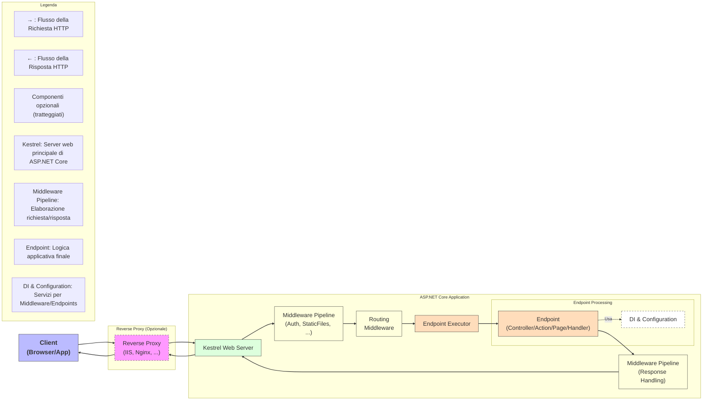
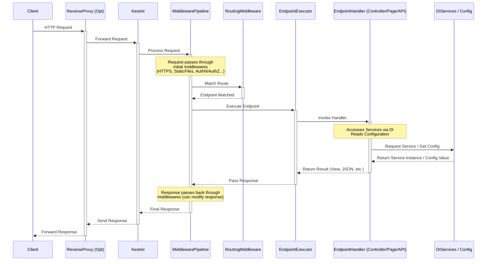
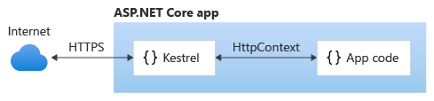
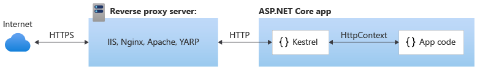

# Introduzione alle Minimal API in ASP.NET Core

- [Introduzione alle Minimal API in ASP.NET Core](#introduzione-alle-minimal-api-in-aspnet-core)
  - [Introduzione alle API Web](#introduzione-alle-api-web)
  - [Progetto di REST API](#progetto-di-rest-api)
  - [Struttura Generale di un'Applicazione ASP.NET Core](#struttura-generale-di-unapplicazione-aspnet-core)
    - [Diagramma Architetturale Concettuale (Flusso di Richiesta)](#diagramma-architetturale-concettuale-flusso-di-richiesta)
    - [Diagramma di Sequenza Concettuale (Ciclo di Vita Richiesta/Risposta)](#diagramma-di-sequenza-concettuale-ciclo-di-vita-richiestarisposta)
    - [Esempio `Program.cs` (.NET 6+ Minimal API Style)](#esempio-programcs-net-6-minimal-api-style)
  - [Creazione di un progetto di Minimal ASP.NET Core](#creazione-di-un-progetto-di-minimal-aspnet-core)
    - [Utilizzo di .NET CLI e VS Code](#utilizzo-di-net-cli-e-vs-code)
      - [Creazione di un progetto di Minimal API ASP.NET Core con il template `web` (progetto web vuoto)](#creazione-di-un-progetto-di-minimal-api-aspnet-core-con-il-template-web-progetto-web-vuoto)
        - [Versione finale del progetto TodoApi nel Tutorial Microsoft, con alcune aggiunte](#versione-finale-del-progetto-todoapi-nel-tutorial-microsoft-con-alcune-aggiunte)
      - [Creazione di un progetto di Minimal API ASP.NET Core con il template `webapi`](#creazione-di-un-progetto-di-minimal-api-aspnet-core-con-il-template-webapi)
      - [Creazione di un progetto di Minimal API ASP.NET Core con `C# Dev Kit`](#creazione-di-un-progetto-di-minimal-api-aspnet-core-con-c-dev-kit)
    - [Strumenti per il testing di API](#strumenti-per-il-testing-di-api)
      - [curl](#curl)
      - [Postman](#postman)
      - [REST Client](#rest-client)
      - [Thunder Client](#thunder-client)
    - [Web server implementations in ASP.NET Core](#web-server-implementations-in-aspnet-core)
    - [Configure endpoints for the ASP.NET Core Kestrel web server](#configure-endpoints-for-the-aspnet-core-kestrel-web-server)
      - [Default endpoints](#default-endpoints)
      - [Configure endpoints](#configure-endpoints)
      - [Set the URLs for an ASP.NET Core app](#set-the-urls-for-an-aspnet-core-app)
    - [Accessing ASP.NET Core Web Server from WSL](#accessing-aspnet-core-web-server-from-wsl)
      - [Accessing Linux networking apps from Windows (localhost)](#accessing-linux-networking-apps-from-windows-localhost)
      - [Accessing Windows networking apps from Linux (host IP)](#accessing-windows-networking-apps-from-linux-host-ip)
      - [Routing in modalità NAT tra Windows e WSL](#routing-in-modalità-nat-tra-windows-e-wsl)
    - [ASP.NET Core web API documentation with Swagger / OpenAPI](#aspnet-core-web-api-documentation-with-swagger--openapi)
      - [Generate OpenAPI documents](#generate-openapi-documents)
      - [Get started with NSwag and ASP.NET Core](#get-started-with-nswag-and-aspnet-core)
        - [Progetto TodoApi nel tutorial Microsoft con le opzioni di NSwag](#progetto-todoapi-nel-tutorial-microsoft-con-le-opzioni-di-nswag)
      - [OpenAPI support in ASP.NET Core API apps](#openapi-support-in-aspnet-core-api-apps)

## Introduzione alle API Web

Le API web (Application Programming Interface) permettono la comunicazione tra diverse applicazioni attraverso il web.
 Le API sono essenziali per lo sviluppo di applicazioni moderne, consentendo l'integrazione di servizi e dati tra sistemi
 diversi. Le API web possono essere utilizzate per vari scopi, come l'accesso ai dati di un database, l'interazione con
  servizi esterni, o la gestione di operazioni di autenticazione e autorizzazione.

## Progetto di REST API

I principi architetturali del REST (REpresentational State Transfer and an architectural style for distributed hypermedia systems) sono descritti nella famosa [dissertazione di Roy Fielding del 2000](https://ics.uci.edu/~fielding/pubs/dissertation/rest_arch_style.htm) e richiamati in diversi tutorial e siti internet, tra cui anche [restfulapi.net](https://restfulapi.net/).

REST è uno stile architetturale per la progettazione di API web e non è un protocollo; è stato studiato in dettaglio nel corso di informatica di quarta e viene ripreso nel corso di quinta per lo sviluppo della parte server delle API. In queste note si richiamano brevemente gli aspetti fondamentali dell'architettura REST.

 Le API RESTful utilizzano i metodi HTTP standard (GET, POST, PUT, DELETE) per eseguire operazioni sui dati. Le caratteristiche principali delle API RESTful includono:

- **Stateless**: Ogni richiesta del client al server deve contenere tutte le informazioni necessarie per comprendere e processare la richiesta. Il server non mantiene lo stato tra le richieste.
- **Cacheable**: Le risposte devono indicare se possono essere memorizzate nella cache o meno, migliorando l'efficienza e le
 prestazioni.
- **Uniform Interface**: Un'interfaccia uniforme che consente l'interazione tra client e server in modo standardizzato. Questo include l'uso di URL per identificare le risorse e l'uso di metodi HTTP per operare su di esse.
- **Client-Server**: Separazione delle preoccupazioni tra client e server, migliorando la scalabilità e la portabilità. Il client gestisce l'interfaccia utente e l'interazione con l'utente, mentre il server gestisce la logica di business e l'archiviazione dei dati.
- **Layered System**: L'architettura può essere composta da più livelli, migliorando la scalabilità e la gestione della sicurezza.

Per il progetto delle RESTful API si può seguire l'ottimo tutorial Microsoft [RESTful web API design](https://learn.microsoft.com/en-us/azure/architecture/best-practices/api-design) che spiega i principi architetturali con esempi concreti che mostrano come dovrebbe essere strutturato un progetto di web API conforme ai principi architetturali REST. In particolare gli aspetti che dovrebbero essere attentamente progettati in una REST API sono:

- **Definizione delle operazioni in termini di metodi HTTP:**
    - **GET:** Utilizzato per recuperare risorse.
    - **POST:** Utilizzato per creare nuove risorse.
    - **PUT:** Utilizzato per aggiornare completamente una risorsa esistente.
    - **DELETE:** Utilizzato per eliminare una risorsa.
    - **PATCH:** Utilizzato per aggiornare parzialmente una risorsa.
- **Idempotenza:** Le operazioni HTTP dovrebbero essere idempotenti, ovvero l'esecuzione ripetuta della stessa richiesta dovrebbe produrre sempre lo stesso risultato finale.
- **Effetti collaterali:** Le operazioni POST dovrebbero limitare i loro effetti collaterali alla risorsa creata e alle risorse direttamente correlate.
- **Stati delle risorse:** Le risorse dovrebbero avere stati definiti e le operazioni HTTP dovrebbero modificare questi stati in modo prevedibile.
- **Versioning:** L'API dovrebbe avere un numero di versione per consentire l'evoluzione nel tempo senza interrompere le applicazioni client esistenti.
- **Scoperta delle risorse:** L'API dovrebbe fornire meccanismi per consentire alle applicazioni client di scoprire le risorse disponibili e le loro relazioni.
- **Formattazione dei dati:** L'API dovrebbe utilizzare formati di dati standard come JSON o XML per facilitare l'integrazione con altri sistemi.
- **Gestione degli errori:** L'API dovrebbe gestire gli errori in modo appropriato, fornendo codici di stato HTTP significativi e messaggi di errore dettagliati.
- **Sicurezza:** L'API dovrebbe implementare misure di sicurezza adeguate, come l'autenticazione e l'autorizzazione, per proteggere i dati e prevenire attacchi.
- **Prestazioni:** L'API dovrebbe essere progettata per offrire prestazioni elevate, minimizzando la latenza e massimizzando la throughput.
- **Scalabilità:** L'API dovrebbe essere progettata per gestire un aumento del carico di lavoro e adattarsi alle crescenti esigenze.

Per le linee guida sullo sviluppo delle REST API si dovrebbero tenere in considerazione le best practices descritte nel tutorial Microsoft [Web API implementation](https://learn.microsoft.com/en-us/azure/architecture/best-practices/api-implementation). Questo tutorial descrive come  creare API efficienti, scalabili e affidabili che soddisfino le esigenze delle applicazioni client, evidenziando in particolare i seguenti punti chiave:

- **Idempotenza:** Le azioni HTTP come GET, PUT, DELETE e HEAD dovrebbero essere idempotenti, ovvero l'esecuzione ripetuta della stessa richiesta sullo stesso risorsa dovrebbe produrre sempre lo stesso risultato finale, indipendentemente dal numero di volte che viene eseguita.
- **Side effects:** Le richieste POST che creano nuove risorse dovrebbero limitare i loro effetti collaterali solo alla nuova risorsa e alle risorse direttamente correlate.
- **Efficienza:** L'implementazione dell'API dovrebbe essere efficiente, minimizzando il tempo di risposta e ottimizzando l'utilizzo delle risorse.
- **Scalabilità:** L'API dovrebbe essere progettata per gestire un aumento del carico di lavoro e adattarsi alle crescenti esigenze.
- **Disponibilità:** L'API dovrebbe essere altamente disponibile, minimizzando i tempi di inattività e garantendo un servizio continuo.
- **Sicurezza:** L'API dovrebbe implementare misure di sicurezza adeguate per proteggere i dati e prevenire attacchi.
- **Standardizzazione:** L'API dovrebbe seguire gli standard HTTP e utilizzare formati di dati comuni come JSON o XML per facilitare l'integrazione con altri sistemi.
- **Gestione degli errori:** L'API dovrebbe gestire in modo appropriato gli errori, fornendo messaggi di errore chiari e significativi.
- **Scoperta delle risorse:** L'API dovrebbe fornire meccanismi per consentire alle applicazioni client di scoprire le risorse disponibili e le loro relazioni.

## Struttura Generale di un'Applicazione ASP.NET Core

ASP.NET Core è un framework moderno, cross-platform e ad alte prestazioni per la creazione di applicazioni web e servizi basati su cloud. La sua architettura è modulare e progettata per essere leggera e flessibile. Vediamo i componenti chiave e come interagiscono:

1. **Hosting (Host Web - `WebHost` / `WebApplication`)**

    - **Concetto:** questo è il cuore dell'applicazione. È responsabile dell'avvio e della gestione del ciclo di vita dell'applicazione. Configura il server web, la dependency injection, il logging e la pipeline di richiesta.
    - **Implementazione:** Nelle versioni più vecchie (< .NET 6), si usava esplicitamente `IWebHostBuilder` e `IWebHost` configurati in `Program.cs` con l'ausilio di una classe `Startup.cs`. Da .NET 6 in poi, il modello è semplificato con `WebApplication` e `WebApplicationBuilder` in `Program.cs`, che incapsulano la configurazione dell'host e dell'applicazione.
    - **Server:** L'host configura un server web per ascoltare le richieste HTTP. Di default è **Kestrel** (veloce, cross-platform), ma può essere ospitato anche dietro un reverse proxy come **IIS** (Windows), **Nginx**, o **Apache**, che inoltrano le richieste a Kestrel.
2. **Configurazione (`IConfiguration`)**

    - **Concetto:** Le applicazioni necessitano di impostazioni (stringhe di connessione, chiavi API, URL esterni, etc.). ASP.NET Core fornisce un sistema flessibile per caricare queste configurazioni da diverse fonti.
    - **Fonti Comuni:** File JSON (`appsettings.json`, `appsettings.Development.json`), variabili d'ambiente, argomenti da riga di comando, Azure Key Vault, etc. L'host carica queste configurazioni e le rende disponibili tramite l'interfaccia `IConfiguration`.
3. **Dependency Injection (DI)**

    - **Concetto:** ASP.NET Core è costruito attorno alla DI. Permette di "iniettare" le dipendenze (oggetti o servizi di cui una classe ha bisogno) invece di crearle direttamente. Questo promuove codice più modulare, testabile e manutenibile (disaccoppiamento).
    - **Implementazione:** I servizi vengono "registrati" in un contenitore di servizi (`IServiceCollection`) durante l'avvio dell'applicazione (in `ConfigureServices` di `Startup.cs` o direttamente su `builder.Services` in `Program.cs` in .NET 6+). Quando un componente (es. un Controller, un middleware) ha bisogno di un servizio, lo richiede nel suo costruttore e il contenitore DI glielo fornisce (`IServiceProvider`).
4. **Middleware Pipeline**

    - **Concetto:** È il cuore della gestione delle richieste HTTP. Si tratta di una catena di componenti software (middleware) che processano una richiesta HTTP in arrivo e la risposta in uscita. Ogni middleware decide se passare la richiesta al componente successivo nella pipeline o "cortocircuitare" e generare direttamente una risposta. I dettagli relativi al funzionamento e gestione dei middleware sarà oggetto di una successivo approfondimento in queste note.
    - **Ordine:** L'ordine in cui i middleware vengono aggiunti alla pipeline è **fondamentale**, poiché determina l'ordine di esecuzione.
    - **Esempi Comuni:**
        - `UseExceptionHandler` / `UseDeveloperExceptionPage`: Gestione degli errori.
        - `UseHttpsRedirection`: Reindirizza le richieste HTTP a HTTPS.
        - `UseStaticFiles`: Serve file statici (CSS, JS, immagini).
        - `UseRouting`: Determina quale "endpoint" deve gestire la richiesta in base all'URL.
        - `UseAuthentication`: Identifica l'utente.
        - `UseAuthorization`: Verifica se l'utente ha i permessi per accedere alla risorsa.
        - `UseEndpoints`: Esegue l'endpoint selezionato dal routing.
        - Middleware personalizzati per logging, caching, etc.
    - **Configurazione:** La pipeline viene definita nel metodo `Configure` di `Startup.cs` (pre-.NET 6) o direttamente sull'oggetto `app` (`WebApplication`) in `Program.cs` (.NET 6+).
5. **Routing**

    - **Concetto:** È il meccanismo che mappa gli URL delle richieste in arrivo a specifiche logiche applicative chiamate "endpoints".
    - **Implementazione:** Il middleware di routing (`UseRouting`) esamina l'URL della richiesta e, basandosi su pattern predefiniti (attributi di route, convenzioni), seleziona l'endpoint più appropriato.
6. **Endpoints**

    - **Concetto:** Sono le unità di codice eseguibili che gestiscono effettivamente una richiesta e producono una risposta. Sono il "bersaglio" finale del routing.
    - **Tipi Comuni:**
        - **Action di Controller MVC:** Metodi pubblici in classi Controller.
        - **Handler di Razor Pages:** Metodi `OnGet`, `OnPost`, etc., nelle classi PageModel associate alle pagine Razor.
        - **Delegati di Minimal APIs:** Funzioni lambda o metodi registrati direttamente con `MapGet`, `MapPost`, etc.
        - **Hub di SignalR:** Per comunicazioni real-time.
        - **Servizi gRPC:** Per chiamate RPC.
    - **Esecuzione:** Il middleware `UseEndpoints` si occupa di eseguire l'endpoint selezionato dal routing.
7. **Application Logic (MVC, Razor Pages, Minimal APIs, Blazor, etc.)**

    - **Concetto:** È qui che risiede la logica specifica dell'applicazione: interazione con database, esecuzione di calcoli, chiamata ad altri servizi, preparazione dei dati per la vista, etc.
    - **Framework/Pattern:** ASP.NET Core supporta diversi modelli per costruire l'interfaccia utente e la logica:
        - **MVC (Model-View-Controller):** Pattern classico per separare responsabilità.
        - **Razor Pages:** Modello più semplice e incentrato sulla pagina per applicazioni web.
        - **Minimal APIs:** Approccio snello per creare API HTTP con codice minimo.
        - **Blazor:** Framework per creare interfacce utente web interattive con C# (lato server o client tramite WebAssembly).
8. **Logging (`ILogger`)**

    - **Concetto:** Sistema integrato per registrare informazioni diagnostiche, errori, avvisi durante l'esecuzione dell'applicazione.
    - **Provider:** Può scrivere log su diverse destinazioni (console, file, Application Insights, etc.) configurate all'avvio.

### Diagramma Architetturale Concettuale (Flusso di Richiesta)

Immaginiamo una richiesta HTTP da un client:



**Descrizione del Flusso:**

1. Il **Client** invia una richiesta HTTP.
2. (Opzionale) Un **Reverse Proxy** (come IIS o Nginx) riceve la richiesta e la inoltra a Kestrel. Questo è comune in produzione per motivi di sicurezza, load balancing, gestione SSL.
3. **Kestrel**, il server web di ASP.NET Core, riceve la richiesta.
4. Kestrel passa la richiesta alla **Middleware Pipeline**.
5. La richiesta attraversa i vari **Middleware** registrati (es. gestione errori, HTTPS redirection, file statici, autenticazione, autorizzazione). Ognuno può agire sulla richiesta o sulla risposta.
6. Il middleware di **Routing** determina quale **Endpoint** deve gestire la richiesta in base all'URL e al metodo HTTP.
7. L'**Endpoint Executor** prende il controllo e invoca l'handler dell'endpoint selezionato (es. un metodo Action di un Controller, un handler di una Razor Page, un delegato di Minimal API).
8. L'**Endpoint** esegue la logica applicativa. Durante questa fase, può interagire con servizi ottenuti tramite **Dependency Injection** (es. accesso al database) e leggere valori dalla **Configurazione**.
9. L'Endpoint produce un risultato (es. una View HTML, un JSON, un redirect, uno status code).
10. La **Risposta** inizia il suo viaggio di ritorno attraverso la **Middleware Pipeline**. I middleware possono ispezionare o modificare la risposta.
11. **Kestrel** riceve la risposta finale dalla pipeline.
12. Kestrel invia la risposta al **Reverse Proxy** (se presente) o direttamente al **Client**.
13. (Opzionale) Il Reverse Proxy invia la risposta al Client.
14. Il **Client** riceve la risposta HTTP.

### Diagramma di Sequenza Concettuale (Ciclo di Vita Richiesta/Risposta)



**Descrizione della Sequenza:**

1. Il **Client** invia la richiesta (potrebbe passare prima dal **ReverseProxy**).
2. **Kestrel** riceve la richiesta e la inoltra alla **MiddlewarePipeline**.
3. La richiesta attraversa la pipeline.
4. La pipeline invoca il **RoutingMiddleware** per trovare una corrispondenza.
5. Una volta trovato l'endpoint, la pipeline invoca l'**EndpointExecutor**.
6. L'**EndpointExecutor** invoca l'**EndpointHandler** specifico.
7. L'**EndpointHandler** esegue la sua logica, interagendo potenzialmente con **Servizi DI** e **Configurazione**.
8. L'Handler restituisce un risultato all'Executor.
9. La risposta torna indietro attraverso la **MiddlewarePipeline**.
10. La pipeline consegna la risposta finale a **Kestrel**.
11. **Kestrel** invia la risposta (eventualmente tramite il **ReverseProxy**) al **Client**.

* * * *

### Esempio `Program.cs` (.NET 6+ Minimal API Style)

Questo snippet mostra dove i concetti discussi vengono configurati:

```cs
// 1. Creazione del WebApplicationBuilder (configura Host, DI, Logging, Configuration)
var builder = WebApplication.CreateBuilder(args);

// ----- 2. Dependency Injection (DI) -----
// Registrazione dei servizi nel contenitore
builder.Services.AddControllersWithViews(); // Esempio per MVC
builder.Services.AddRazorPages();          // Esempio per Razor Pages
builder.Services.AddScoped<IMyService, MyServiceImplementation>(); // Esempio servizio custom
// Altre configurazioni per DbContext, Authentication, etc.

// ----- Costruzione dell'Applicazione Web -----
var app = builder.Build(); // Crea l'istanza WebApplication (contiene l'Host e la pipeline)

// ----- 3. Middleware Pipeline Configuration -----
// L'ordine è importante!
if (!app.Environment.IsDevelopment())
{
    app.UseExceptionHandler("/Home/Error"); // Gestione errori produzione
    app.UseHsts();                          // Sicurezza HSTS
} else {
    app.UseDeveloperExceptionPage();       // Dettagli errori sviluppo
}

app.UseHttpsRedirection(); // Forza HTTPS
app.UseStaticFiles();      // Serve file statici (wwwroot)

app.UseRouting();          // (!) Abilita il routing per selezionare l'endpoint

app.UseAuthentication();   // (!) Prima di Authorization
app.UseAuthorization();    // (!) Verifica i permessi

// ----- 4. Endpoint Mapping -----
// Il middleware UseEndpoints è implicito quando si usano Map... o AddControllers/AddRazorPages
app.MapControllerRoute( // Mapping per MVC
    name: "default",
    pattern: "{controller=Home}/{action=Index}/{id?}");
app.MapRazorPages();       // Mapping per Razor Pages

app.MapGet("/", () => "Hello World!"); // Esempio Minimal API Endpoint

// ----- 5. Avvio dell'Host -----
app.Run(); // Avvia l'applicazione e inizia ad ascoltare le richieste

```

Questo esempio illustra come `Program.cs` (nelle versioni moderne) sia il punto centrale per:

- Configurare l'host e i suoi servizi fondamentali (`WebApplication.CreateBuilder`).
- Registrare i servizi per la Dependency Injection (`builder.Services`).
- Costruire la pipeline di middleware (`app.Use...`).
- Mappare gli URL agli endpoints (`app.Map...`).
- Avviare l'applicazione (`app.Run()`).

## Creazione di un progetto di Minimal ASP.NET Core

### Utilizzo di .NET CLI e VS Code

#### Creazione di un progetto di Minimal API ASP.NET Core con il template `web` (progetto web vuoto)

Per creare un progetto di Minimal API utilizzando la .NET CLI, si può seguire il tutorial
 [Create a minimal API with ASP.NET Core](https://learn.microsoft.com/en-us/aspnet/core/tutorials/min-web-api?tabs=visual-studio-code) che spiega, passo dopo passo, come realizzare un'applicazione ASP.NET Core con la tecnologia delle `Minimal API`, che sono una tecnologia alternativa a quella basata sui `Controllers` per lo sviluppo di `Web API` in ASP.NET Core.

 Per prima cosa occorre definire la cartella dove verrà creata la soluzione con all'interno il progetto web. In questa cartella si apre il terminale (con `Powershell`, oppure con `Git Bash`)

```ps1
dotnet new sln -o TodoApi
cd TodoApi
dotnet new web -o TodoApi
dotnet sln add TodoApi/TodoApi.csproj
code .
```

Rispetto al codice che c'è nel tutorial, in questo caso si è preferito creare una soluzione con al suo interno un progetto web vuoto.

Per capire tutti i dettagli relativi all'uso della `.NET CLI` si può consultare la [documentazione di `.NET CLI`](https://learn.microsoft.com/en-us/dotnet/core/tools/), che mostra con diversi esempi come [creare un progetto a partire da un modello](https://learn.microsoft.com/en-us/dotnet/core/tools/dotnet-new), oppure come [creare una soluzione](https://learn.microsoft.com/en-us/dotnet/core/tools/dotnet-sln).

Per il resto si puà seguire il tutorial, passo dopo passo, dal momento che spiega in dettaglio tutti i passaggi e i concetti fondamentali.

Per l'aggiunta dei pacchetti `NuGet` al progetto si può procedere in diversi modi:

- Utilizzando la `.NET CLI` dalla shell
  - In questo caso occorre impostare correttamente il proxy, eventualmente presente
  
  ```ps1
  # Nel caso di Powershell
  $env:http_proxy="proxy.intranet:3128"
  $env:https_proxy="proxy.intranet:3128"
  # per verificare il valore delle variabili
  echo $env:http_proxy
  echo $env:https_proxy
  # le variabili impostate in questo modo sono attive per la sessione corrente
  ```

  ```sh
  # Nel caso di Bash
  http_proxy="proxy.intranet:3128"
  https_proxy="proxy.intranet:3128"
  # per verificare il valore delle variabili
  echo $http_proxy
  echo $https_proxy
  ```

  ```cmd
  :: Nel caso di CMD
  set http_proxy=proxy.intranet:3128
  set https_proxy=proxy.intranet:3128
  :: per verificare il valore delle variabili
  echo %http_proxy%
  echo %https_proxy%
  ```

  ```ps1
  # Aggiunta di Pacchetti NuGet
   dotnet add package Microsoft.EntityFrameworkCore.InMemory
   dotnet add package Microsoft.AspNetCore.Diagnostics.EntityFrameworkCore
   dotnet add package NSwag.AspNetCore
   dotnet add package Microsoft.AspNetCore.OpenApi
  ```

- Utilizzando un plugin di VS Code come, ad esempio, `Nuget Gallery`
- Utilizzando la funzionalità di `C# Dev Kit`, che permette di aggiungere pacchetti NuGet dal `Solution Explorer`

##### Versione finale del progetto TodoApi nel Tutorial Microsoft, con alcune aggiunte

```cs
// var builder = WebApplication.CreateBuilder(args);
// var app = builder.Build();

// app.MapGet("/", () => "Hello World!");

// app.Run();

using System.ComponentModel;
using Microsoft.AspNetCore.Http.HttpResults;
using Microsoft.AspNetCore.Mvc;
using Microsoft.EntityFrameworkCore;
using NSwag;
using NSwag.Annotations;
using TodoApi;
//creation of Web application builder
var builder = WebApplication.CreateBuilder(args);
//adding services to the container
builder.Services.AddDbContext<TodoDb>(opt => opt.UseInMemoryDatabase("TodoList"));
if (builder.Environment.IsDevelopment())
{
	builder.Services.AddDatabaseDeveloperPageExceptionFilter();
}
// Add services to the container.
// Learn more about configuring OpenAPI at https://aka.ms/aspnet/openapi
builder.Services.AddOpenApi();
//adding API explorer
builder.Services.AddEndpointsApiExplorer();
// adding OpenAPI configuration
// builder.Services.AddOpenApiDocument(config =>
// {
// 	config.DocumentName = "TodoAPI";
// 	config.Title = "TodoAPI v1";
// 	config.Version = "v1";
// });
builder.Services.AddOpenApiDocument(options =>
{
	options.PostProcess = document =>
	{
		document.Info = new OpenApiInfo
		{
			Version = "v1",
			Title = "ToDo API",
			Description = "An ASP.NET Core Web API for managing ToDo items",
			TermsOfService = "https://example.com/terms",
			Contact = new OpenApiContact
			{
				Name = "Example Contact",
				Url = "https://example.com/contact"
			},
			License = new OpenApiLicense
			{
				Name = "Example License",
				Url = "https://example.com/license"
			}
		};
	};
});
//creation of Web application
var app = builder.Build();

//adding middleware for Swagger and OpenAPI
if (app.Environment.IsDevelopment())
{
	//adding middleware for OpenAPI
	app.MapOpenApi();
	//adding middleware for Swagger
	app.UseOpenApi();
	app.UseSwaggerUi(config => 
	{
		config.DocumentTitle = "TodoAPI";
		config.Path = "/swagger";
		config.DocumentPath = "/swagger/{documentName}/swagger.json";
		config.DocExpansion = "list";
	});
}

//creations of API routes
//un esempio di utilizzo di MapGet con attributi
//ProducesResponseType specifica il tipo di risposta, il codice di stato e il tipo di contenuto
//ProducesResponseType richiede using Microsoft.AspNetCore.Mvc
//Description specifica la descrizione dell'endpoint
//Description richiede using System.ComponentModel
app.MapGet("/", [ProducesResponseType(typeof(string), StatusCodes.Status200OK, "text/plain"), Description("Una semplice Get")] () => "Hello World!").WithName("HelloWorld");
var todoItems = app.MapGroup("/todoitems");
todoItems.MapGet("/", GetAllTodos);
todoItems.MapGet("/complete", GetCompleteTodos);
todoItems.MapGet("/{id}", GetTodo);
todoItems.MapPost("/", CreateTodo);
todoItems.MapPut("/{id}", UpdateTodo);
todoItems.MapDelete("/{id}", DeleteTodo);


app.Run();

//metodi richiamati dagli Endpoint Routes 

static async Task<Ok<TodoItemDTO[]>> GetAllTodos(TodoDb db)
{
	return TypedResults.Ok(await db.Todos.Select(x => new TodoItemDTO(x)).ToArrayAsync());
}

static async Task<Ok<List<TodoItemDTO>>> GetCompleteTodos(TodoDb db)
{
	return TypedResults.Ok(await db.Todos.Where(t => t.IsComplete).Select(x => new TodoItemDTO(x)).ToListAsync());
}

static async Task<Results<Ok<TodoItemDTO>, NotFound>> GetTodo(int id, TodoDb db)
{
	return await db.Todos.FindAsync(id)
		is Todo todo
			? TypedResults.Ok(new TodoItemDTO(todo))
			: TypedResults.NotFound();
}

//SwaggerResponse richiede using NSwag.Annotations
[SwaggerResponse(StatusCodes.Status201Created, typeof(TodoItemDTO), Description = "Returns the object created ...")]
[ProducesResponseType(typeof(TodoItemDTO), StatusCodes.Status201Created), Description("Create the specified object ...")]
static async Task<Created<TodoItemDTO>> CreateTodo(TodoItemDTO todoItemDTO, TodoDb db)
{
	var todoItem = new Todo
	{
		Name = todoItemDTO.Name,
		IsComplete = todoItemDTO.IsComplete,
		Secret = "Secret data"
	};
	db.Todos.Add(todoItem);
	await db.SaveChangesAsync();
	//l'Id viene stabilito dal database
	todoItemDTO = new TodoItemDTO(todoItem);

	return TypedResults.Created($"/todoitems/{todoItemDTO.Id}", todoItemDTO);
}

static async Task<Results<NotFound, NoContent>> UpdateTodo(int id, TodoItemDTO todoItemDTO, TodoDb db)
{
	var todo = await db.Todos.FindAsync(id);

	if (todo is null) return TypedResults.NotFound();

	todo.Name = todoItemDTO.Name;
	todo.IsComplete = todoItemDTO.IsComplete;

	await db.SaveChangesAsync();

	return TypedResults.NoContent();
}
//SwaggerResponse richiede using NSwag.Annotations
[SwaggerResponse(StatusCodes.Status204NoContent, typeof(void), Description = "Object has been deleted ...")]
[SwaggerResponse(StatusCodes.Status404NotFound, typeof(void), Description = "Object with specified Id was not found ...")]
static async Task<Results<NoContent,NotFound>> DeleteTodo(int id, TodoDb db)
{
	if (await db.Todos.FindAsync(id) is Todo todo)
	{
		db.Todos.Remove(todo);
		await db.SaveChangesAsync();
		return TypedResults.NoContent();
	}
	return TypedResults.NotFound();
}
```

#### Creazione di un progetto di Minimal API ASP.NET Core con il template `webapi`

#### Creazione di un progetto di Minimal API ASP.NET Core con `C# Dev Kit`

### Strumenti per il testing di API

#### curl

Il command line [`curl`](https://curl.se/) è stato già introdotto nel corso di informatica di quarta. I riferimenti per l'utilizzo di curl sono riassunti nelle dispense di informatica di quarta e nella guida online [everything curl](https://everything.curl.dev/). In questa sede è opportuno ricordare che per effettuare le richieste al server Kestrel di una applicazione Asp.Net mediante `curl` con protocollo https ci sono diverse opzioni disponibili:

- **uso dell'opzione `-k` oppure `--insecure`**: con questa opzione curl non verifica la validità del certificato ssl del server. Questa opzione è insicura e va usata solo in scenari di debug o testing su server di cui si conosce direttamente la provenienza. Ad esempio:

  ```powershell
  # powershell
  curl -k -X 'POST' `
    'https://localhost:7157/todoitems' `
    -H 'accept: */*' `
    -H 'Content-Type: application/json' `
    -d '{
    "id": 0,
    "name": "Studiare ASP.NET",
    "isComplete": false
  }'
  ```

- **uso dell'opzione `--ca-native`**: questa opzione permette a curl di usare i Trusted Root Certificate Authorities dell'OS su cui è in esecuzione. Nel caso di Windows, si tratta dei certificati `trusted` da Windows e che si possono gestire mediante lo strumento `certmgr`. Tuttavia questa opzione non è utilizzabile per tutte le versioni di `curl`, ma solo per quelle che nel loro processo di build hanno abilitato il trust delle Root CA del OS host.
- **uso dell'opzione `--cacert`**: con questa opzione si dice a curl di utilizzare un `custom CA store` e può essere utilizzato in combinazione al comando [`dotnet dev-certs`](https://learn.microsoft.com/en-us/dotnet/core/tools/dotnet-dev-certs), come mostrato di seguito:
  
   >:memo: uso di `dotnet dev-certs https` per la gestione del certificato https di sviluppo auto-prodotto
     1. `dotnet dev-certs https --check`: permette di verificare se esiste un certificato https di sviluppo valido
     2. `dotnet dev-certs https --clean`: elimina eventuali certificati https presenti
     3. `dotnet dev-certs https --trust`: crea un certificato https auto-prodotto per lo sviluppo, se non esiste già un certificato valido
     4. `dotnet dev-certs https -ep "$env:USERPROFILE\.aspnet\https\aspnetapp.pem" --format PEM`: esporta il certificato https auto-prodotto esistente nel file specificato (le cartelle indicate nel path devono esistere)

- Si esporta il certificato auto-prodotto in un file, ad esempio in `$env:USERPROFILE\.aspnet\https\aspnetapp.pem`
- Si utilizza `curl` con l'opzione `--cacert`, ad esempio:
  
  ```powershell
  # powershell
  curl --cacert "$env:USERPROFILE\.aspnet\https\aspnetapp.pem" -X 'POST' `
    'https://localhost:7157/todoitems' `
    -H 'accept: */*' `
    -H 'Content-Type: application/json' `
    -d '{
    "id": 0,
    "name": "Studiare ASP.NET",
    "isComplete": false
  }'
  ```
  
#### Postman

[Postman](https://www.postman.com/) è uno degli strumenti più utilizzati dagli sviluppatori per il testing di applicazioni web. `Postman` può essere utilizzato sia come web application che come applicazione desktop, come descritto nella [documentazione ufficiale](https://learning.postman.com/docs/getting-started/overview/).

Anche `Postman` è stato ampiamente utilizzato nel corso di informatica di quarta e per i dettagli relativi al suo uso si rimanda agli appunti del corso di informatica di quarta.

Esiste anche un plugin di Visual Studio Code che permette di utilizzare `Postman` con il proprio account direttamente all'interno di VS Code, senza ricorrere all'applicazione desktop oppure alla web application. Per installare il plugin di `Postman` in VS Code è sufficiente ricercare il plugin nell'elenco delle estensioni di VS Code e poi installarlo. I dettagli relativi all'utilizzo del plugin di `Postman` in VS Code sono sulla [pagina di Postman](https://marketplace.visualstudio.com/items?itemName=Postman.postman-for-vscode) nel marketplace di VS Code.

#### REST Client

`REST Client` è un plugin di VS Code che permette di testare in maniera molto semplice le Web API, utilizzando file con estensione `.http`, oppure `.rest`. Per installare il plugin di `Rest Client` di Huachao Mao in VS Code è sufficiente ricercare il plugin nell'elenco delle estensioni di VS Code e poi installarlo. L'installazione del plugin di `Rest Client` e il suo utilizzo di base in VS Code sono spiegati sulla [pagina di Rest Client](https://marketplace.visualstudio.com/items?itemName=humao.rest-client) nel marketplace di VS Code.

I dettagli sull'utilizzo di `REST Client` sono disponibili sulla [pagina di Github del progetto](https://github.com/Huachao/vscode-restclient) e in [qualche video online](https://youtu.be/Kxp5h8tXdFE?si=W5XovIN_2iSjlRmF)

Un esempio di file di `.http` che effettua chiamate REST sulla Minimal API del tutorial Microsoft `TodoApi` è il seguente:

```text
@TodoApi_HostAddress = https://localhost:7157

### Get all todo items
GET {{TodoApi_HostAddress}}/todoitems
Accept: application/json

### Get complete todo items
GET {{TodoApi_HostAddress}}/todoitems/complete
Accept: application/json

### Get todo item by id
GET {{TodoApi_HostAddress}}/todoitems/1
Accept: application/json

### Create new todo item
POST {{TodoApi_HostAddress}}/todoitems
Content-Type: application/json

{
    "name": "Walk the dog",
    "isComplete": false
}

### Update todo item
PUT {{TodoApi_HostAddress}}/todoitems/1
Content-Type: application/json

{
    "name": "Walk the dog",
    "isComplete": true
}

### Delete todo item
DELETE {{TodoApi_HostAddress}}/todoitems/1
```

#### Thunder Client

`Thunder Client` è un altro plugin di Visual Studio Code che può essere utilizzato per effettuare il testing di Web API. I dettagli relativi all'utilizzo di questo plugin si trovano sulla [pagina di Thunder Client](https://marketplace.visualstudio.com/items?itemName=rangav.vscode-thunder-client) nel marketplace di VS Code. `Thunder Client` è può essere considerato come un'alternativa a `Postman`, anche se in questo corso si utilizzeranno prevalentemente `Postman` e `Rest Client`.

### Web server implementations in ASP.NET Core

Come descritto nella [documentazione Microsoft relativa al web server Kestrel](https://learn.microsoft.com/en-us/aspnet/core/fundamentals/servers) *"An ASP.NET Core app runs with an in-process HTTP server implementation. The server implementation listens for HTTP requests and surfaces them to the app as a set of request features composed into an HttpContext."*

Il web server di default che è inserito in un'applicazione ASP.NET Core è [Kestrel](https://learn.microsoft.com/en-us/aspnet/core/fundamentals/servers/kestrel)



Si vedrà in seguito che nelle applicazioni reali è prassi utilizzare il web server Kestrel in combinazione con un altri web server,come, ad esempio, Nginx, Apache, Yarp, etc., utilizzati come reverse proxy. I motivi che sono alla base di questo tipo di architettura web saranno chiariti in seguito.



### Configure endpoints for the ASP.NET Core Kestrel web server

Come indicato nella documentazione Microsoft [Configure endpoints for the ASP.NET Core Kestrel web server](https://learn.microsoft.com/en-us/aspnet/core/fundamentals/servers/kestrel/endpoints), *Kestrel endpoints provide the infrastructure for listening to incoming requests and routing them to the appropriate middleware. **The combination of an address and a protocol defines an endpoint**.*

- *The address specifies the network interface that the server listens on for incoming requests, such as a TCP port.*
- *The protocol specifies the communication between the client and server, such as HTTP/1.1, HTTP/2, or HTTP/3.*
- *An endpoint can be secured using the `https` URL scheme or `UseHttps` method.*

#### Default endpoints

*New ASP.NET Core projects are configured to bind to a random HTTP port between 5000-5300 and a random HTTPS port between 7000-7300. The selected ports are stored in the generated `Properties/launchSettings.json` file and can be modified by the developer. The `launchSetting.json` file is only used in local development.*

*If there's no endpoint configuration, then Kestrel binds to `http://localhost:5000`.*

#### Configure endpoints

*Kestrel endpoints listen for incoming connections. When an endpoint is created, it must be configured with the address it will listen to. Usually, this is a TCP address and port number.*

*There are several options for configuring endpoints:*

- [Configure endpoints with URLs](https://learn.microsoft.com/en-us/aspnet/core/fundamentals/servers/kestrel/endpoints?#configure-endpoints-with-urls)
- [Specify ports only](https://learn.microsoft.com/en-us/aspnet/core/fundamentals/servers/kestrel/endpoints?#specify-ports-only)
- [Configure endpoints in appsettings.json](https://learn.microsoft.com/en-us/aspnet/core/fundamentals/servers/kestrel/endpoints?#configure-endpoints-in-appsettingsjson)
- [Configure endpoints in code](https://learn.microsoft.com/en-us/aspnet/core/fundamentals/servers/kestrel/endpoints?#configure-endpoints-in-code)

#### Set the URLs for an ASP.NET Core app

Ci sono diversi modi per impostare le URL per un'applicazione ASP.NET Core. Nell'[articolo di Andrew Lock](https://andrewlock.net/8-ways-to-set-the-urls-for-an-aspnetcore-app/) vengono mostrati otto modi per configurare le URL di una applicazione ASP.NET Core.

### Accessing ASP.NET Core Web Server from WSL

Quando si tenta di accedere ad un'applicazione web installata in Windows da una distribuzione Linux di una WSL ci sono alcune considerazioni da fare, perché di default WSL utilizza un meccanismo di networking basato su NAT come descritto nella [documentazione ufficiale della WSL](https://learn.microsoft.com/en-us/windows/wsl/networking).

#### Accessing Linux networking apps from Windows (localhost)

Come descritto nella [documentazione Microsoft](https://learn.microsoft.com/en-us/windows/wsl/networking#accessing-linux-networking-apps-from-windows-localhost) *If you are building a networking app (for example an app running on a NodeJS or SQL server) in your Linux distribution, you can access it from a Windows app (like your Edge or Chrome internet browser) using `localhost` (just like you normally would).*

#### Accessing Windows networking apps from Linux (host IP)

Come descritto nella [documentazione Microsoft](https://learn.microsoft.com/en-us/windows/wsl/networking#accessing-windows-networking-apps-from-linux-host-ip) *If you want to access a networking app running on Windows (for example an app running on a NodeJS or SQL server) from your Linux distribution (ie Ubuntu), then you need to use the IP address of your host machine. While this is not a common scenario, you can follow these steps to make it work.*

1. *Obtain the IP address of your host machine by running this command from your Linux distribution: `ip route show | grep -i default | awk '{ print $3}'`*
2. *Connect to any Windows server using the copied IP address.*

Anche [questo articolo](https://superuser.com/questions/1679757/accessing-windows-localhost-from-wsl2) mostra diverse opzioni per accedere da una distribuzione Linux WSL ad un'applicazione in esecuzione in `localhost` su Windows.

Ad esempio, supponendo di avere un'applicazione ASP.NET Core in esecuzione in `localhost` in Windows con una configurazione del file `launchSettings.json` come quella riportata di seguito:

```json
{
  "$schema": "https://json.schemastore.org/launchsettings.json",
  "profiles": {
    "http": {
      "commandName": "Project",
      "dotnetRunMessages": true,
      "launchBrowser": true,
      "applicationUrl": "http://localhost:5238;http://*:5001",
      "environmentVariables": {
        "ASPNETCORE_ENVIRONMENT": "Development"
      }
    },
    "https": {
      "commandName": "Project",
      "dotnetRunMessages": true,
      "launchBrowser": true,
      "applicationUrl": "https://localhost:7245;http://localhost:5238;https://*:7001",
      "environmentVariables": {
        "ASPNETCORE_ENVIRONMENT": "Development"
      }
    }
  }
}
```

Si noti che nella configurazione dell'applicazione ASP.NET Core l'`applicationUrl` è stato configurato in modo che il web server Kestrel possa accettare richieste sia in localhost su una determinata porta, che da qualsiasi indirizzo IP su una porta specifica (con la parte `http://*:5001` per il profilo `http`, oppure con la parte `https://*:7001` per il profilo `https`).
Per poter accedere all'applicazione Web da una distribuzione Linux nella WSL, occorre prima di tutto sapere qual è l'indirizzo IP del NAT Gateway. L'accesso all'applicazione che in Windows è in `localhost`, da Linux WSL dovrà essere fatto attraverso l'indirizzo IP del NAT Gateway:

L'indirizzo del NAT Gateway può essere determinato utilizzando il comando:

```sh
ip route
# possibile output:
default via 172.21.144.1 dev eth0 proto kernel
172.21.144.0/20 dev eth0 proto kernel scope link src 172.21.156.145
```

L'indirizzo del NAT Gateway è proprio l'indirizzo IP che viene indicato dopo `default via` e che può essere ottenuto tramite l'istruzione:

```sh
ip route show | grep -i default | awk '{ print $3}'
# possibile output
172.21.144.1
```

Supponendo che da `localhost` l'applicazione risponda sulla rotta `/`  con un semplice messaggio di testo, potremmo ottenere un comportamento come il seguente:

```ps1
# da Windows in Powershell 
curl http://localhost:5238/
# output
Hello World!
```

```sh
# da Windows nella Git Bash
curl http://localhost:5238/
# output
Hello World!
```

Dalla WSL Linux la richiesta verso il server `ASP.NET Core` dovrà essere fatta utilizzando l'indirizzo del NAT Gateway al posto di `localhost` e cambiando la porta TCP, utilizzando il valore indicato nell'`applicationURL` per qualsiasi indirizzo  ( http://*:5001 ). Se si provasse ad utilizzare la porta `5238` valida in localhost, il server non risponderebbe alla richiesta, dal momento che è stato configurato per essere in ascolto solo in localhost sulla porta `5238` con il protocollo `http`.

```sh
# dalla shell di Ubuntu in WSL
curl http://172.21.144.1:5001/
# output
Hello World!
```

#### Routing in modalità NAT tra Windows e WSL

Per analizzare il routing dei pacchetti tra Windows e una distribuzione Linux della WSL si possono utilizzare alcuni comandi presenti sia nella Powershell/CMD che nella Bash di Linux. Ad esempio, dalla Powershell si può digitare il comando:

```ps1
# stampa a console la configurazione di rete per tutte le interfacce di rete dell'host
ipconfig /all 

# possibile output
# Nota bene: alcuni dati sensibili, come il nome del computer, i MAC Address e UUID DHCP sono stati sostituiti con riferimenti generici

Windows IP Configuration

   Host Name . . . . . . . . . . . . : NomeComputer
   Primary Dns Suffix  . . . . . . . :
   Node Type . . . . . . . . . . . . : Hybrid
   IP Routing Enabled. . . . . . . . : No
   WINS Proxy Enabled. . . . . . . . : No

Wireless LAN adapter Local Area Connection* 1:

   Media State . . . . . . . . . . . : Media disconnected
   Connection-specific DNS Suffix  . :
   Description . . . . . . . . . . . : Microsoft Wi-Fi Direct Virtual Adapter
   Physical Address. . . . . . . . . : Real-MAC-Address
   DHCP Enabled. . . . . . . . . . . : Yes
   Autoconfiguration Enabled . . . . : Yes

Wireless LAN adapter Local Area Connection* 2:

   Connection-specific DNS Suffix  . :
   Description . . . . . . . . . . . : Microsoft Wi-Fi Direct Virtual Adapter #2
   Physical Address. . . . . . . . . : Real-MAC-Address
   DHCP Enabled. . . . . . . . . . . : No
   Autoconfiguration Enabled . . . . : Yes
   Link-local IPv6 Address . . . . . : fe80::8a9a:880c:1633:6fe9%25(Preferred)
   IPv4 Address. . . . . . . . . . . : 192.168.137.1(Preferred)
   Subnet Mask . . . . . . . . . . . : 255.255.255.0
   Default Gateway . . . . . . . . . :
   NetBIOS over Tcpip. . . . . . . . : Enabled

Ethernet adapter Ethernet:

   Connection-specific DNS Suffix  . :
   Description . . . . . . . . . . . : Realtek PCIe GbE Family Controller
   Physical Address. . . . . . . . . : Real-MAC-Address
   DHCP Enabled. . . . . . . . . . . : Yes
   Autoconfiguration Enabled . . . . : Yes
   Link-local IPv6 Address . . . . . : fe80::700e:14be:5c38:81a%14(Preferred)
   IPv4 Address. . . . . . . . . . . : 192.168.3.194(Preferred)
   Subnet Mask . . . . . . . . . . . : 255.255.255.0
   Lease Obtained. . . . . . . . . . : mercoledì 20 novembre 2024 17:38:33
   Lease Expires . . . . . . . . . . : venerdì 22 novembre 2024 06:58:19
   Default Gateway . . . . . . . . . : 192.168.3.1
   DHCP Server . . . . . . . . . . . : 192.168.3.1
   DHCPv6 IAID . . . . . . . . . . . : real DHCP UUID
   DHCPv6 Client DUID. . . . . . . . : real DHCP UUID v6
   DNS Servers . . . . . . . . . . . : 8.8.8.8
                                       8.8.4.4
   NetBIOS over Tcpip. . . . . . . . : Enabled

Ethernet adapter VMware Network Adapter VMnet1:

   Connection-specific DNS Suffix  . :
   Description . . . . . . . . . . . : VMware Virtual Ethernet Adapter for VMnet1
   Physical Address. . . . . . . . . : Real-MAC-Address
   DHCP Enabled. . . . . . . . . . . : No
   Autoconfiguration Enabled . . . . : Yes
   Link-local IPv6 Address . . . . . : fe80::5b43:11fd:6e67:8f69%28(Preferred)
   IPv4 Address. . . . . . . . . . . : 192.168.171.1(Preferred)
   Subnet Mask . . . . . . . . . . . : 255.255.255.0
   Default Gateway . . . . . . . . . :
   DHCPv6 IAID . . . . . . . . . . . : real DHCP UUID
   DHCPv6 Client DUID. . . . . . . . : real DHCP UUID v6
   NetBIOS over Tcpip. . . . . . . . : Enabled

Ethernet adapter VMware Network Adapter VMnet8:

   Connection-specific DNS Suffix  . :
   Description . . . . . . . . . . . : VMware Virtual Ethernet Adapter for VMnet8
   Physical Address. . . . . . . . . : Real-MAC-Address
   DHCP Enabled. . . . . . . . . . . : No
   Autoconfiguration Enabled . . . . : Yes
   Link-local IPv6 Address . . . . . : fe80::ab75:d7a:743a:5881%18(Preferred)
   IPv4 Address. . . . . . . . . . . : 192.168.229.1(Preferred)
   Subnet Mask . . . . . . . . . . . : 255.255.255.0
   Default Gateway . . . . . . . . . :
   DHCPv6 IAID . . . . . . . . . . . : real DHCP UUID
   DHCPv6 Client DUID. . . . . . . . : real DHCP UUID v6
   NetBIOS over Tcpip. . . . . . . . : Enabled

Wireless LAN adapter Wi-Fi:

   Media State . . . . . . . . . . . : Media disconnected
   Connection-specific DNS Suffix  . :
   Description . . . . . . . . . . . : Intel(R) Wi-Fi 6 AX200 160MHz
   Physical Address. . . . . . . . . : Real-MAC-Address
   DHCP Enabled. . . . . . . . . . . : Yes
   Autoconfiguration Enabled . . . . : Yes

Ethernet adapter Bluetooth Network Connection:

   Media State . . . . . . . . . . . : Media disconnected
   Connection-specific DNS Suffix  . :
   Description . . . . . . . . . . . : Bluetooth Device (Personal Area Network)
   Physical Address. . . . . . . . . : Real-MAC-Address
   DHCP Enabled. . . . . . . . . . . : Yes
   Autoconfiguration Enabled . . . . : Yes

Ethernet adapter vEthernet (Default Switch):

   Connection-specific DNS Suffix  . :
   Description . . . . . . . . . . . : Hyper-V Virtual Ethernet Adapter
   Physical Address. . . . . . . . . : Real-MAC-Address
   DHCP Enabled. . . . . . . . . . . : No
   Autoconfiguration Enabled . . . . : Yes
   Link-local IPv6 Address . . . . . : fe80::f04f:5efe:2e1d:3391%22(Preferred)
   IPv4 Address. . . . . . . . . . . : 172.24.176.1(Preferred)
   Subnet Mask . . . . . . . . . . . : 255.255.240.0
   Default Gateway . . . . . . . . . :
   DHCPv6 IAID . . . . . . . . . . . : real DHCP UUID
   DHCPv6 Client DUID. . . . . . . . : real DHCP UUID v6
   NetBIOS over Tcpip. . . . . . . . : Enabled

Ethernet adapter vEthernet (WSLCore):

   Connection-specific DNS Suffix  . :
   Description . . . . . . . . . . . : Hyper-V Virtual Ethernet Adapter #2
   Physical Address. . . . . . . . . : Real-MAC-Address
   DHCP Enabled. . . . . . . . . . . : No
   Autoconfiguration Enabled . . . . : Yes
   Link-local IPv6 Address . . . . . : fe80::718a:f2a9:6bb4:68e1%41(Preferred)
   IPv4 Address. . . . . . . . . . . : 172.19.112.1(Preferred)
   Subnet Mask . . . . . . . . . . . : 255.255.240.0
   Default Gateway . . . . . . . . . :
   DHCPv6 IAID . . . . . . . . . . . : real DHCP UUID
   DHCPv6 Client DUID. . . . . . . . : real DHCP UUID v6
   NetBIOS over Tcpip. . . . . . . . : Enabled

```

Come si può notare dall'esempio mostrato, questo comando presenta una lista delle interfacce di rete con relativa configurazione. L'analisi dell'output mostra che nell'esempio ci sono:

1. **Scheda Ethernet (Realtek PCIe GbE Family Controller)**
    - Questa è la connessione principale alla rete esterna (Internet o LAN).
    - **IPv4 Address:** `192.168.3.194`
    - **Subnet Mask:** `255.255.255.0`
    - **Gateway:** `192.168.3.1`
  
   **Interfaccia vEthernet (WSLCore)**
    - Questa è l'interfaccia virtuale dedicata a **WSL** (Windows Subsystem for Linux).
        I pacchetti dalle distribuzioni Linux in WSL attraversano questa interfaccia per raggiungere Windows o il mondo esterno.
    - **IPv4 Address:** `172.19.112.1`
    - **Subnet Mask:** `255.255.240.0`

2. **Interfaccia vEthernet (Default Switch)**
    - Questa è un'altra interfaccia virtuale creata da Hyper-V, utilizzata per gestire connessioni NAT in ambienti virtuali. Non è direttamente legata a WSL ma può essere usata per altre macchine virtuali.
    - **IPv4 Address:** `172.24.176.1`
    - **Subnet Mask:** `255.255.240.0`
  
3. **Interfacce VMware Network Adapter VMnet1 e VMnet8**
    - Queste sono interfacce create da VMware per gestire il traffico tra macchine virtuali sulla macchina host.
    - **VMnet1:** `192.168.171.1`
    - **VMnet8:** `192.168.229.1`

4. **Wireless LAN Adapter**
    - Le interfacce wireless sono disconnesse al momento (`Media State: Media disconnected`).

Un altro comando che permette di avere informazioni importanti sul routing dei pacchetti è:

```ps1
# Powershell/CMD
route print
# possibile output
===========================================================================
Interface List
 MAC address 1 ......Microsoft Wi-Fi Direct Virtual Adapter
 MAC address 2 ......Microsoft Wi-Fi Direct Virtual Adapter #2
 MAC address 3 ......Realtek PCIe GbE Family Controller
 MAC address 4 ......VMware Virtual Ethernet Adapter for VMnet1
 MAC address 5 ......VMware Virtual Ethernet Adapter for VMnet8
 MAC address 6 ......Intel(R) Wi-Fi 6 AX200 160MHz
 MAC address 7 ......Bluetooth Device (Personal Area Network)
  1...........................Software Loopback Interface 1
 MAC address 8 ......Hyper-V Virtual Ethernet Adapter
 MAC address 9 ......Hyper-V Virtual Ethernet Adapter #2
 MAC address 10 ......Hyper-V Virtual Ethernet Adapter #3
===========================================================================

IPv4 Route Table
===========================================================================
Active Routes:
Network Destination        Netmask          Gateway       Interface  Metric
          0.0.0.0          0.0.0.0      192.168.3.1    192.168.3.194     35 <-- main physical interface
        127.0.0.0        255.0.0.0         On-link         127.0.0.1    331
        127.0.0.1  255.255.255.255         On-link         127.0.0.1    331
  127.255.255.255  255.255.255.255         On-link         127.0.0.1    331
     172.19.112.0    255.255.240.0         On-link      172.19.112.1   5256
     172.19.112.1  255.255.255.255         On-link      172.19.112.1   5256 <-- WSL Core interface
   172.19.127.255  255.255.255.255         On-link      172.19.112.1   5256
     172.21.144.0    255.255.240.0         On-link      172.21.144.1   5256 <-- Gateway Windows per WSL
     172.21.144.1  255.255.255.255         On-link      172.21.144.1   5256 <-- Gateway Windows per WSL
   172.21.159.255  255.255.255.255         On-link      172.21.144.1   5256 <-- Gateway Windows per WSL
     172.24.176.0    255.255.240.0         On-link      172.24.176.1   5256
     172.24.176.1  255.255.255.255         On-link      172.24.176.1   5256
   172.24.191.255  255.255.255.255         On-link      172.24.176.1   5256
      192.168.3.0    255.255.255.0         On-link     192.168.3.194    291
    192.168.3.194  255.255.255.255         On-link     192.168.3.194    291
    192.168.3.255  255.255.255.255         On-link     192.168.3.194    291
    192.168.137.0    255.255.255.0         On-link     192.168.137.1    281
    192.168.137.1  255.255.255.255         On-link     192.168.137.1    281
  192.168.137.255  255.255.255.255         On-link     192.168.137.1    281
    192.168.171.0    255.255.255.0         On-link     192.168.171.1    291
    192.168.171.1  255.255.255.255         On-link     192.168.171.1    291
  192.168.171.255  255.255.255.255         On-link     192.168.171.1    291
    192.168.229.0    255.255.255.0         On-link     192.168.229.1    291
    192.168.229.1  255.255.255.255         On-link     192.168.229.1    291
  192.168.229.255  255.255.255.255         On-link     192.168.229.1    291
        224.0.0.0        240.0.0.0         On-link         127.0.0.1    331
        224.0.0.0        240.0.0.0         On-link     192.168.3.194    291
        224.0.0.0        240.0.0.0         On-link      172.24.176.1   5256
        224.0.0.0        240.0.0.0         On-link     192.168.137.1    281
        224.0.0.0        240.0.0.0         On-link      172.19.112.1   5256
        224.0.0.0        240.0.0.0         On-link     192.168.229.1    291
        224.0.0.0        240.0.0.0         On-link     192.168.171.1    291
        224.0.0.0        240.0.0.0         On-link      172.21.144.1   5256 <-- Gateway Windows per WSL
  255.255.255.255  255.255.255.255         On-link         127.0.0.1    331
  255.255.255.255  255.255.255.255         On-link     192.168.3.194    291
  255.255.255.255  255.255.255.255         On-link      172.24.176.1   5256
  255.255.255.255  255.255.255.255         On-link     192.168.137.1    281
  255.255.255.255  255.255.255.255         On-link      172.19.112.1   5256
  255.255.255.255  255.255.255.255         On-link     192.168.229.1    291
  255.255.255.255  255.255.255.255         On-link     192.168.171.1    291
  255.255.255.255  255.255.255.255         On-link      172.21.144.1   5256 <-- Gateway Windows per WSL
===========================================================================
Persistent Routes:
  None

IPv6 Route Table
===========================================================================
Active Routes:
 If Metric Network Destination      Gateway
  1    331 ::1/128                  On-link
 14    291 fe80::/64                On-link
 22   5256 fe80::/64                On-link
 25    281 fe80::/64                On-link
 41   5256 fe80::/64                On-link
 18    291 fe80::/64                On-link
 28    291 fe80::/64                On-link
 79   5256 fe80::/64                On-link
 79   5256 fe80::19e0:da1:82c5:5c55/128
                                    On-link
 28    291 fe80::5b43:11fd:6e67:8f69/128
                                    On-link
 14    291 fe80::700e:14be:5c38:81a/128
                                    On-link
 41   5256 fe80::718a:f2a9:6bb4:68e1/128
                                    On-link
 25    281 fe80::8a9a:880c:1633:6fe9/128
                                    On-link
 18    291 fe80::ab75:d7a:743a:5881/128
                                    On-link
 22   5256 fe80::f04f:5efe:2e1d:3391/128
                                    On-link
  1    331 ff00::/8                 On-link
 14    291 ff00::/8                 On-link
 22   5256 ff00::/8                 On-link
 25    281 ff00::/8                 On-link
 41   5256 ff00::/8                 On-link
 18    291 ff00::/8                 On-link
 28    291 ff00::/8                 On-link
 79   5256 ff00::/8                 On-link
===========================================================================
Persistent Routes:
  None
```

Dalla Bash della WSL Ubuntu si possono lanciare i comandi:

```sh
# riporta la configurazione per le interfacce di rete
ifconfig

# possibile output
eth0: flags=4163<UP,BROADCAST,RUNNING,MULTICAST>  mtu 1500
        inet 172.21.156.145  netmask 255.255.240.0  broadcast 172.21.159.255
        inet6 fe80::215:5dff:fe08:924a  prefixlen 64  scopeid 0x20<link>
        ether 00:15:5d:08:92:4a  txqueuelen 1000  (Ethernet)
        RX packets 15088  bytes 19538294 (19.5 MB)
        RX errors 0  dropped 0  overruns 0  frame 0
        TX packets 7493  bytes 539974 (539.9 KB)
        TX errors 0  dropped 0 overruns 0  carrier 0  collisions 0

lo: flags=73<UP,LOOPBACK,RUNNING>  mtu 65536
        inet 127.0.0.1  netmask 255.0.0.0
        inet6 ::1  prefixlen 128  scopeid 0x10<host>
        loop  txqueuelen 1000  (Local Loopback)
        RX packets 60  bytes 7183 (7.1 KB)
        RX errors 0  dropped 0  overruns 0  frame 0
        TX packets 60  bytes 7183 (7.1 KB)
        TX errors 0  dropped 0 overruns 0  carrier 0  collisions 0

# l'analisi dei pacchetti può essere fatta analizzando la tabella di routing:
ip route
# possibile output
default via 172.21.144.1 dev eth0 proto kernel
172.21.144.0/20 dev eth0 proto kernel scope link src 172.21.156.145
```

Dall'analisi dei parametri di rete da Windows e da Linux emerge quanto segue:

1. **Percorso da WSL verso Internet**:
    - La **distribuzione WSL** usa la propria tabella di routing interna, che punta al **gateway Windows per la WSL** (`172.21.144.1`).
    - Windows inoltra il traffico attraverso la sua interfaccia principale (`192.168.3.194`) tramite il gateway fisico della rete (`192.168.3.1`).
2. **Percorso inverso (dall'esterno verso WSL)**:
    - Il traffico deve essere reindirizzato a WSL tramite regole di NAT configurate automaticamente o manualmente (es. port forwarding).

Configurazione della WSL Ubuntu

1. **Configurazione rilevata**:

    - **Gateway predefinito:** `172.21.144.1`
    - **Subnet di WSL:** `172.21.144.0/20`
    - **IP della distribuzione:** `172.21.156.145`
    - **Interfaccia:** `eth0`
2. **Significato**:

    - WSL si trova in una subnet virtuale gestita da Windows, configurata su `172.21.144.0/20`.
    - Il gateway virtuale di Windows per WSL è `172.21.144.1`.

Lo schema di rete che definisce il routing dei pacchetti tra la WSL Linux e Windows è:

```txt
+-----------------------+        +--------------------------+-----+     +-----------------------+
|   Distribuzione WSL   |        |      Windows Host        |     |     |     Rete Esterna      |
|  (es: Ubuntu)         |        |                          |     |     |                       |
|                       |        |  [vEthernet (WSL)]       |     |     |                       |
|  IP: 172.21.156.145   +------->|  Gateway: 172.21.144.1   |     |     |                       |
|  Gateway: 172.21.144.1|        |  Subnet: 172.21.144.0/20 |     |     |                       |
|                       |        +--------------------------+     |     |  Gateway: 192.168.3.1 |
+-----------------------+        |                                |     |                       |
                                 |                                |     |                       |
                                 | [Ethernet (Interfaccia Fisica)]|     |                       |
                                 |  IP: 192.168.3.194             +---->|                       |
                                 |  Gateway: 192.168.3.1          |     |                       |
                                 |  DNS: 8.8.8.8, 8.8.4.4         |     |                       |
                                 +--------------------------------+     +-----------------------+
Legenda:  
- Il traffico da WSL passa attraverso `172.21.144.1` (gateway virtuale di Windows).
- Windows esegue NAT per inoltrare il traffico verso `192.168.3.1` (gateway della rete fisica).
- Il gateway della rete locale gestisce il traffico verso Internet.
```

### ASP.NET Core web API documentation with Swagger / OpenAPI

Come indicato nella [documentazione Microsoft](https://learn.microsoft.com/en-us/aspnet/core/tutorials/web-api-help-pages-using-swagger) la specifica *[Swagger](https://swagger.io/) ([OpenAPI](https://www.openapis.org/)) is a language-agnostic specification for describing REST APIs. It allows both computers and humans to understand the capabilities of a REST API without direct access to the source code. Its main goals are to:*

- *Minimize the amount of work needed to connect decoupled services.*
- *Reduce the amount of time needed to accurately document a service.*

#### Generate OpenAPI documents

*The [`Microsoft.AspNetCore.OpenApi`](https://www.nuget.org/packages/Microsoft.AspNetCore.OpenApi) package provides built-in support for OpenAPI document generation in ASP.NET Core. The package provides the following features:*[^1]

- *Support for generating OpenAPI documents at run time and accessing them via an endpoint on the application.*
- *Support for "transformer" APIs that allow modifying the generated document.*
- *Support for generating multiple OpenAPI documents from a single app.*
- *Takes advantage of JSON schema support provided by [`System.Text.Json`](https://learn.microsoft.com/en-us/dotnet/api/system.text.json).*
- *Is compatible with native AoT.*

#### Get started with NSwag and ASP.NET Core

NSwag[^2] offers the following capabilities:

- The ability to utilize the Swagger UI and Swagger generator.
- Flexible code generation capabilities.

##### Progetto TodoApi nel tutorial Microsoft con le opzioni di NSwag

Per far in modo che il browser parta in automatico, direttamente sulla documentazione di Swagger è possibile specificare il parametro `"launchUrl": "swagger"` all'interno della configurazione dell'applicazione nel file `launchSetting.json`, impostando anche l'opzione `"launchBrowser": true`:

```json
{
  "$schema": "https://json.schemastore.org/launchsettings.json",
  "profiles": {
    "http": {
      "commandName": "Project",
      "dotnetRunMessages": true,
      "launchBrowser": true,
      "launchUrl": "swagger",
      "applicationUrl": "http://localhost:5238;http://*:5001",
      "environmentVariables": {
        "ASPNETCORE_ENVIRONMENT": "Development"
      }
    },
    "https": {
      "commandName": "Project",
      "dotnetRunMessages": true,
      "launchBrowser": true,
      "launchUrl": "swagger",
      "applicationUrl": "https://localhost:7245;http://localhost:5238;https://*:7001",
      "environmentVariables": {
        "ASPNETCORE_ENVIRONMENT": "Development"
      }
    }
  }
}
```

Il progetto `TodoApi` nel tutorial Microsoft con le aggiunte indicate nella documentazione di NSwag diventa, ad esempio:

```cs
using System.ComponentModel;
using Microsoft.AspNetCore.Http.HttpResults;
using Microsoft.AspNetCore.Mvc;
using Microsoft.EntityFrameworkCore;
using NSwag;
using NSwag.Annotations;
using TodoApi;
//creation of Web application builder
var builder = WebApplication.CreateBuilder(args);
//adding services to the container
builder.Services.AddDbContext<TodoDb>(opt => opt.UseInMemoryDatabase("TodoList"));
if (builder.Environment.IsDevelopment())
{
  builder.Services.AddDatabaseDeveloperPageExceptionFilter();
}
//adding API explorer
builder.Services.AddEndpointsApiExplorer();
// adding OpenAPI configuration
// builder.Services.AddOpenApiDocument(config =>
// {
//    config.DocumentName = "TodoAPI";
//    config.Title = "TodoAPI v1";
//    config.Version = "v1";
// });
builder.Services.AddOpenApiDocument(options =>
{
  options.PostProcess = document =>
  {
    document.Info = new OpenApiInfo
    {
      Version = "v1",
      Title = "ToDo API",
      Description = "An ASP.NET Core Web API for managing ToDo items",
      TermsOfService = "https://example.com/terms",
      Contact = new OpenApiContact
      {
        Name = "Example Contact",
        Url = "https://example.com/contact"
      },
      License = new OpenApiLicense
      {
        Name = "Example License",
        Url = "https://example.com/license"
      }
    };
  };
});
//creation of Web application
var app = builder.Build();

//adding middleware for Swagger
if (app.Environment.IsDevelopment())
{
  app.UseOpenApi();
  app.UseSwaggerUi(config => 
  {
    config.DocumentTitle = "TodoAPI";
    config.Path = "/swagger";
    config.DocumentPath = "/swagger/{documentName}/swagger.json";
    config.DocExpansion = "list";
  });
}

//creations of API routes
//un esempio di utilizzo di MapGet con attributi
//ProducesResponseType specifica il tipo di risposta, il codice di stato e il tipo di contenuto
//ProducesResponseType richiede using Microsoft.AspNetCore.Mvc
//Description specifica la descrizione dell'endpoint
//Description richiede using System.ComponentModel
app.MapGet("/", [ProducesResponseType(typeof(string), StatusCodes.Status200OK, "text/plain"), Description("Una semplice Get")] () => "Hello World!").WithName("HelloWorld");
var todoItems = app.MapGroup("/todoitems");
todoItems.MapGet("/", GetAllTodos);
todoItems.MapGet("/complete", GetCompleteTodos);
todoItems.MapGet("/{id}", GetTodo);
todoItems.MapPost("/", CreateTodo);
todoItems.MapPut("/{id}", UpdateTodo);
todoItems.MapDelete("/{id}", DeleteTodo);


app.Run();

//metodi richiamati dagli Endpoint Routes 

static async Task<Ok<TodoItemDTO[]>> GetAllTodos(TodoDb db)
{
  return TypedResults.Ok(await db.Todos.Select(x => new TodoItemDTO(x)).ToArrayAsync());
}

static async Task<Ok<List<TodoItemDTO>>> GetCompleteTodos(TodoDb db)
{
  return TypedResults.Ok(await db.Todos.Where(t => t.IsComplete).Select(x => new TodoItemDTO(x)).ToListAsync());
}

static async Task<Results<Ok<TodoItemDTO>, NotFound>> GetTodo(int id, TodoDb db)
{
  return await db.Todos.FindAsync(id)
    is Todo todo
      ? TypedResults.Ok(new TodoItemDTO(todo))
      : TypedResults.NotFound();
}

//SwaggerResponse richiede using NSwag.Annotations
[SwaggerResponse(StatusCodes.Status201Created, typeof(TodoItemDTO), Description = "Returns the object created ...")]
[ProducesResponseType(typeof(TodoItemDTO), StatusCodes.Status201Created), Description("Create the specified object ...")]
static async Task<Created<TodoItemDTO>> CreateTodo(TodoItemDTO todoItemDTO, TodoDb db)
{
  var todoItem = new Todo
  {
    Name = todoItemDTO.Name,
    IsComplete = todoItemDTO.IsComplete,
    Secret = "Secret data"
  };
  db.Todos.Add(todoItem);
  await db.SaveChangesAsync();
  //l'Id viene stabilito dal database
  todoItemDTO = new TodoItemDTO(todoItem);

  return TypedResults.Created($"/todoitems/{todoItemDTO.Id}", todoItemDTO);
}

static async Task<Results<NotFound, NoContent>> UpdateTodo(int id, TodoItemDTO todoItemDTO, TodoDb db)
{
  var todo = await db.Todos.FindAsync(id);  
  if (todo is null) return TypedResults.NotFound(); 
  todo.Name = todoItemDTO.Name;
  todo.IsComplete = todoItemDTO.IsComplete; 
  await db.SaveChangesAsync();  
  return TypedResults.NoContent();
}
//SwaggerResponse richiede using NSwag.Annotations
[SwaggerResponse(StatusCodes.Status204NoContent, typeof(void), Description = "Object has been deleted ...")]
[SwaggerResponse(StatusCodes.Status404NotFound, typeof(void), Description = "Object with specified Id was not found ...")]
static async Task<Results<NoContent,NotFound>> DeleteTodo(int id, TodoDb db)
{
  if (await db.Todos.FindAsync(id) is Todo todo)
  {
    db.Todos.Remove(todo);
    await db.SaveChangesAsync();
    return TypedResults.NoContent();
  }
  return TypedResults.NotFound();
}
```

#### OpenAPI support in ASP.NET Core API apps 

ASP.NET Core supports the generation of OpenAPI documents in controller-based and minimal APIs apps[^3]. The [OpenAPI specification](https://spec.openapis.org/oas/latest.html) is a programming language-agnostic standard for documenting HTTP APIs. This standard is supported in ASP.NET Core apps through a combination of built-in APIs and open-source libraries. There are three key aspects to OpenAPI integration in an application:

- Generating information about the endpoints in the app.
- Gathering the information into a format that matches the OpenAPI schema.
- Exposing the generated OpenAPI document via a visual UI or a serialized file.

ASP.NET Core apps provide built-in support for generating information about endpoints in an app via the `Microsoft.AspNetCore.OpenApi` package.

[^1]: [Generate OpenAPI documents](https://learn.microsoft.com/en-us/aspnet/core/fundamentals/openapi/aspnetcore-openapi)

[^2]: [Get started with NSwag and ASP.NET Core](https://learn.microsoft.com/en-us/aspnet/core/tutorials/getting-started-with-nswag)

[^3]: [OpenAPI support in ASP.NET Core API apps](https://learn.microsoft.com/en-us/aspnet/core/fundamentals/openapi/overview)
