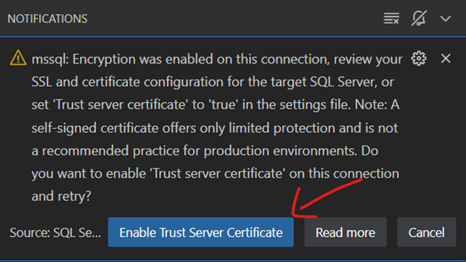
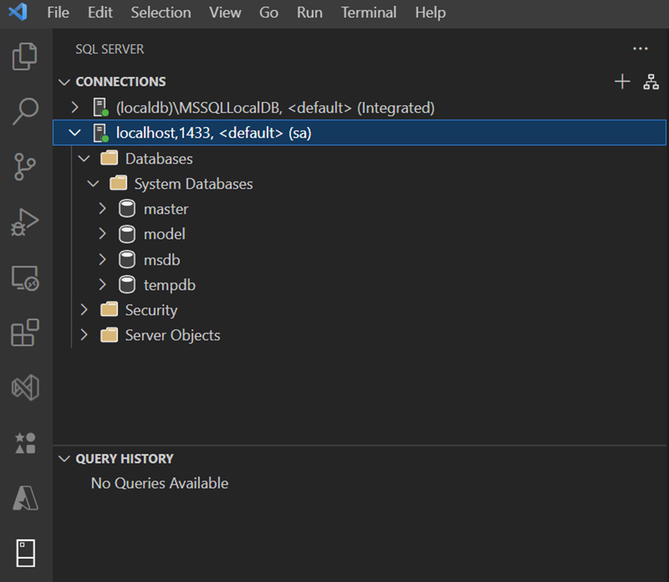

# Minimal API con MariaDB e Microsoft SQL Server: Progetto `AziendaAPI` con EF Core

- [Minimal API con MariaDB e Microsoft SQL Server: Progetto `AziendaAPI` con EF Core](#minimal-api-con-mariadb-e-microsoft-sql-server-progetto-aziendaapi-con-ef-core)
  - [Traccia del progetto](#traccia-del-progetto)
    - [Gestione delle aziende](#gestione-delle-aziende)
    - [Gestione dei prodotti](#gestione-dei-prodotti)
    - [Gestione degli sviluppatori](#gestione-degli-sviluppatori)
    - [Gestione dei progetti](#gestione-dei-progetti)
  - [Sviluppo del progetto](#sviluppo-del-progetto)
    - [Richiami di teoria per il Data Model con EF Core](#richiami-di-teoria-per-il-data-model-con-ef-core)
  - [Il Data Model del progetto](#il-data-model-del-progetto)
    - [Gestione di una associazione "molti a molti"](#gestione-di-una-associazione-molti-a-molti)
      - [Primo modo per gestire la *molti a molti*](#primo-modo-per-gestire-la-molti-a-molti)
      - [Secondo modo per gestire la *molti a molti*](#secondo-modo-per-gestire-la-molti-a-molti)
    - [Collegamento dell'applicazione con il DBMS](#collegamento-dellapplicazione-con-il-dbms)
    - [Migration](#migration)
    - [View Model per i dati - DTO](#view-model-per-i-dati---dto)
    - [Migrazione con `Code First Approach` (solo per sviluppo e testing)](#migrazione-con-code-first-approach-solo-per-sviluppo-e-testing)
    - [Configurazione di Swagger con il View Model](#configurazione-di-swagger-con-il-view-model)
    - [Gestione di tanti Endpoints](#gestione-di-tanti-endpoints)
      - [Il file `Program.cs` finale](#il-file-programcs-finale)
      - [Gestione degli Endpoint (Handlers)](#gestione-degli-endpoint-handlers)
    - [Creazione di account specifici per MySQL/MariaDb](#creazione-di-account-specifici-per-mysqlmariadb)
    - [Creazione del database mediante uno script SQL (in produzione)](#creazione-del-database-mediante-uno-script-sql-in-produzione)
  - [Microsoft SQL Server](#microsoft-sql-server)
    - [Documentazione di riferimento per Microsoft SQL Server in Docker Container](#documentazione-di-riferimento-per-microsoft-sql-server-in-docker-container)
    - [Installazione di Microsoft SQL Server in Docker Container](#installazione-di-microsoft-sql-server-in-docker-container)
    - [Connessione a SQL Server da VS Code con `mssql`](#connessione-a-sql-server-da-vs-code-con-mssql)
    - [Concetti di base di Microsoft SQL Server e differenze con MariaDB/MySQL](#concetti-di-base-di-microsoft-sql-server-e-differenze-con-mariadbmysql)
      - [Database](#database)
      - [Schema](#schema)
      - [Confronto diretto](#confronto-diretto)
      - [Esempio pratico](#esempio-pratico)
        - [Creazione di un database](#creazione-di-un-database)
        - [Creazione di schemi all'interno del database](#creazione-di-schemi-allinterno-del-database)
        - [Creazione di tabelle negli schemi](#creazione-di-tabelle-negli-schemi)
      - [Concetto di "Database" in MySQL/MariaDB](#concetto-di-database-in-mysqlmariadb)
      - [Concetto di "Schema" in MySQL/MariaDB](#concetto-di-schema-in-mysqlmariadb)
      - [Differenza tra MySQL/MariaDB e altri DBMS](#differenza-tra-mysqlmariadb-e-altri-dbms)
        - [In SQL Server](#in-sql-server)
        - [MySQL/MariaDB](#mysqlmariadb)
      - [Confronto diretto: MySQL/MariaDB vs SQL Server](#confronto-diretto-mysqlmariadb-vs-sql-server)
    - [Istruzione `Use Master;` di SQL Server](#istruzione-use-master-di-sql-server)
      - [Perché `USE master`?](#perché-use-master)
    - [Gestione dei permessi in SQL Server](#gestione-dei-permessi-in-sql-server)
      - [Differenza tra Login e Database User](#differenza-tra-login-e-database-user)
      - [Passaggi per creare un utente in SQL Server](#passaggi-per-creare-un-utente-in-sql-server)
      - [Confronto con MariaDB/MySQL](#confronto-con-mariadbmysql)
      - [Esempio completo in SQL Server](#esempio-completo-in-sql-server)
        - [Creare un login, un user e assegnare permessi su una tabella](#creare-un-login-un-user-e-assegnare-permessi-su-una-tabella)
      - [Visualizzazione dei permessi](#visualizzazione-dei-permessi)
        - [Query per mostrare i permessi specifici assegnati all'utente](#query-per-mostrare-i-permessi-specifici-assegnati-allutente)
        - [Visualizzare i membri dei ruoli del database](#visualizzare-i-membri-dei-ruoli-del-database)
        - [Mostrare i permessi a livello di server](#mostrare-i-permessi-a-livello-di-server)
        - [Permessi di SQL Server a confronto con MariaDB/MySQL](#permessi-di-sql-server-a-confronto-con-mariadbmysql)
    - [Utilizzo di SQL Server con applicazioni ASP.NET Core](#utilizzo-di-sql-server-con-applicazioni-aspnet-core)
      - [Esempio `AziendaApi` con SQL Server](#esempio-aziendaapi-con-sql-server)

## Traccia del progetto

Implementare un servizio di API per interfacciarsi ad un database di MariaDb (da creare mediante EF Core) con il seguente schema:

```ps1
aziende(Id, Nome, Indirizzo)
prodotti(Id, AziendaId*, Nome, Descrizione)
sviluppa_prodotti(ProdottoId*, SviluppatoreId*)
sviluppatori(Id,AziendaId*, Nome, Cognome)
```

Come si vede tra `sviluppatori` e `prodotti` c’è una tabella di collegamento che rappresenta un'associazione molti a molti, poiché uno sviluppatore può sviluppare più prodotti e uno stesso prodotto può essere sviluppato da più sviluppatori. Sia la tabella degli sviluppatori che quella dei prodotti hanno una chiave esterna sulla tabella delle aziende. Uno sviluppatore lavora presso una sola azienda, ma un’azienda può avere più sviluppatori. Allo stesso modo, un prodotto appartiene ad una sola azienda, ma un’azienda può possedere più prodotti.

:warning: Sul database c'è un vincolo non esprimibile mediante la notazione del modello relazionale: *uno sviluppatore può sviluppare solo prodotti che appartengono alla stessa azienda a cui afferisce lo sviluppatore*. Quest’ultimo vincolo viene garantito dall'applicazione software: quando si inserisce una nuova riga nella tabella sviluppa_prodotti si deve assicurare che sia lo sviluppatore che il prodotto abbiano lo stesso valore della chiave esterna sulla tabella aziende.

Il servizio deve prevedere i seguenti endpoints:

### Gestione delle aziende

- **GET /aziende**

  - restituisce la lista delle aziende

- **POST /aziende**

  - per creare una nuova azienda;

- **GET /aziende/{id}**

  - restituisce i dati di una specifica azienda

- **PUT /aziende/{id}**

  - modifica una specifica azienda;

- **DELETE /aziende/{id}**

  - elimina l'azienda specificata;

### Gestione dei prodotti

- **GET /aziende/{id}/prodotti**

  - restituisce la lista dei prodotti dell'azienda specificata

- **POST /aziende/{id}/prodotti**

  - per creare un prodotto appartenente all'azienda specificata

- **GET /prodotti**

  - restituisce tutti i prodotti;

- **GET /prodotti/{id}**

  - per ottenere il prodotto specificato;

- **PUT /prodotti/{id}**

  - per modificare il prodotto specificato;

- **DELETE /prodotti/{id}**

  - per eliminare il prodotto specificato

### Gestione degli sviluppatori

- **GET /sviluppatori**

  - per ottenere la lista di tutti gli sviluppatori;

- **POST /aziende/{id}/sviluppatori**

  - per creare uno sviluppatore

- **GET /prodotti/{id}/sviluppatori**

  - per ottenere la lista degli sviluppatori di un determinato prodotto

- **GET /aziende/{id}/sviluppatori**

  - per ottenere la lista degli sviluppatori di una determinata azienda

- **GET /aziende/{id}/sviluppatori?prodottoId={prodottoId}**

  - per ottenere la lista degli sviluppatori di una determinata azienda che hanno lavorato a un determinato prodotto. Se non è presente la query string con la chiave prodottoId viene restituita la lista di tutti gli sviluppatori di una determinata azienda.

- **GET /sviluppatori/{id}**

  - per ottenere i dati di uno sviluppatore

- **PUT /sviluppatori/{id}**

  - per modificare uno sviluppatore

- **DELETE /sviluppatori/{id}**

  - per eliminare uno sviluppatore. Elimina anche tutte le associazioni tra lo sviluppatore e i prodotti a cui ha lavorato (progetti)

### Gestione dei progetti

- **POST /sviluppa-prodotto/{sviluppatoreId}/{prodottoId}**

  - per associare uno sviluppatore ad un prodotto. Il prodotto e lo sviluppatore devono esistere. Lo sviluppatore deve appartenere alla stessa azienda a cui appartiene il prodotto.

- **DELETE /sviluppa-prodotto/{sviluppatoreId}/{prodottoId}**

  - per eliminare l'associazione tra uno sviluppatore e un prodotto. Sviluppatore e prodotto devono esistere

## Sviluppo del progetto

Per prima cosa si crei un progetto di `Minimal API ASP.NET`. Si installino i pacchetti richiesti per l'integrazione di EF Core con MariaDb e per il supporto a OpenApi.

:memo: :warning: Nell'elenco riportato di seguito sono indicate alcune versioni pre-release, in attesa che venga rilasciata la versione stabile di `Pomelo.EntityFrameworkCore.MySql` per `net9.0`:

```ps1
 dotnet add package Microsoft.AspNetCore.Diagnostics.EntityFrameworkCore --version 9.0.0-preview.1.24081.5
 dotnet add package Microsoft.AspNetCore.OpenApi 
 dotnet add package NSwag.AspNetCore 
 dotnet add package Microsoft.EntityFrameworkCore.Design --version 9.0.0-preview.1.24081.2
 dotnet add package Pomelo.EntityFrameworkCore.MySql --version 9.0.0-preview.1
```

:memo: **Nota sull'uso di MySQL/MariaDb**: quando si utilizza la libreria Pomelo, il `default charset` (la codifica usata per memorizzare su file i caratteri) è `utf8mb4`[^1][^2][^3], ossia la codifica UTF8 standard a lunghezza variabile fino a 4 byte per carattere. Questa codifica non è supportata dalle vecchie versioni di MySQL, come ad esempio la versione 5.7. In questi casi, per evitare un errore a runtime quando si effettua la migrazione occorre procedere con una configurazione manuale del charset attraverso il metodo `OnConfiguring`, come descritto nella pagina della documentazione della libreria `Pomelo`:

```cs
// The database, tables and columns will explicitly be set to "latin1" by default.
modelBuilder.HasCharSet("latin1");
//oppure, per ciascuna entità che deve usare un charset legacy
modelBuilder.Entity<LegacyAsciiStuff>(entity => {
// The "LegacyAsciiStuff" table and all its columns will explicitly set to "ascii" by default.
 entity.HasCharSet("ascii");
// The "LegacyUnicodeTranslation" column uses the deprecated "utf8mb3" character set.
 entity.Property(e => e.LegacyUnicodeTranslation)
  .HasCharSet("utf8mb3");
});
```

**Con MariaDb non c'è bisogno di alcuna configurazione manuale del charset di default, a meno che non sia proprio richiesto dall'applicazione**.

### Richiami di teoria per il Data Model con EF Core

Per la definizione del [modello dei dati](https://learn.microsoft.com/en-us/ef/core/modeling/) con l'ORM (Object Relational Mapper) [Entity Framework Core (EF Core)](https://learn.microsoft.com/en-us/ef/core/), occorre seguire le regole definite nella documentazione ufficiale Microsoft. In particolare la definizione del Modello fa riferimento ai concetti di [Entity](https://learn.microsoft.com/en-us/ef/core/modeling/entity-types) e di [Relationship](https://learn.microsoft.com/en-us/ef/core/modeling/relationships). Questi argomenti sono già stati ampiamente trattati nel corso di informatica di quarta e si assumeranno come acquisiti i meccanismi per la definizione delle associazioni, con particolare riferimento alle associazioni:

- [One-to-many relationships](https://learn.microsoft.com/en-us/ef/core/modeling/relationships/one-to-many)
- [One-to-one relationships](https://learn.microsoft.com/en-us/ef/core/modeling/relationships/one-to-one)
- [Many-to-many relationships](https://learn.microsoft.com/en-us/ef/core/modeling/relationships/many-to-many)

## Il Data Model del progetto

Si crei una cartella `Model` nella quale verranno scritte le classi del modello, necessarie per la creazione del database. Per ogni tabella si scriva una classe:

```cs
//file Azienda.cs
using System.ComponentModel.DataAnnotations.Schema;

namespace AziendaAPI.Model;

public class Azienda
{
    public int Id { get; set; }

    [Column(TypeName = "nvarchar(100)")]
    public string Nome { get; set; } = null!;

    [Column(TypeName = "nvarchar(100)")]
    public string? Indirizzo { get; set; }
    public List<Prodotto> Prodotti { get; set; } =null!;
    public List<Sviluppatore> Sviluppatori { get; set; } = null!;
}
```

```cs
//file Prodotto.cs
using System.ComponentModel.DataAnnotations.Schema;

namespace AziendaAPI.Model;

public class Prodotto
{
	public int Id { get; set; }
	public int AziendaId { get; set; }
	public Azienda Azienda { get; set; } = null!;

	[Column(TypeName = "nvarchar(100)")]
	public string Nome { get; set; } = null!;

	[Column(TypeName = "nvarchar(200)")]
	public string? Descrizione { get; set; }
	//collection property
	public List<SviluppaProdotto> SviluppaProdotti { get; set; } = null!;
	//skip navigation property
	public List<Sviluppatore> Sviluppatori { get; set; } = null!;
}
```

```cs
//file Sviluppatore.cs
using System.ComponentModel.DataAnnotations.Schema;

namespace AziendaAPI.Model;

public class Sviluppatore
{
	public int Id { get; set; }
	public int AziendaId { get; set; }
	public Azienda Azienda { get; set; } = null!;

	[Column(TypeName = "nvarchar(40)")]
	public string Nome { get; set; } = null!;

	[Column(TypeName = "nvarchar(40)")]
	public string Cognome { get; set; } = null!;
	//collection property
	public List<SviluppaProdotto> SviluppaProdotti { get; set; } = null!;
	//skip navigation property
	public List<Prodotto> Prodotti { get; set; } = null!;
}
```

```cs
//file SviluppaProdotto.cs
namespace AziendaAPI.Model;

public class SviluppaProdotto
{
    public int ProdottoId { get; set; }
    public Prodotto Prodotto { get; set; } = null!;
    public int SviluppatoreId { get; set; }
    public Sviluppatore Sviluppatore { get; set; } = null!;
}
```

Si crei la cartella `Data` con al suo interno il file `AziendaDbContext.cs`

```cs
using System;
using AziendaAPI.Model;
using Microsoft.EntityFrameworkCore;

namespace AziendaAPI.Data;

public class AziendaDbContext(DbContextOptions<AziendaDbContext> options) : DbContext(options)
{
	public DbSet<Azienda> Aziende { get; set; } = null!;
	public DbSet<Prodotto> Prodotti { get; set; } = null!;
	public DbSet<Sviluppatore> Sviluppatori { get; set; } = null!;
	public DbSet<SviluppaProdotto> SviluppaProdotti { get; set; } = null!;
	protected override void OnModelCreating(ModelBuilder modelBuilder)
	{
    
		//se non si utilizzano le convenzioni di denominazione di EF Core è necessario definire le chiavi esterne. 
		//In questo esempio la definizione delle chiavi esterne è fatta mediante due lambda 
        //expressions all'interno del metodo UsingEntity
			modelBuilder.Entity<Sviluppatore>()
				.HasMany(s => s.Prodotti)
				.WithMany(p => p.Sviluppatori)
				.UsingEntity<SviluppaProdotto>(
					//prima lambda expression per definire la chiave esterna su Prodotti
					left => left
						.HasOne(sp => sp.Prodotto)
						.WithMany(p => p.SviluppaProdotti)
						.OnDelete(DeleteBehavior.Restrict)
						.HasForeignKey(sp => sp.ProdottoId),
					//seconda lambda expression per definire la chiave esterna su Sviluppatori
					right => right
						.HasOne(sp => sp.Sviluppatore)
						.WithMany(s => s.SviluppaProdotti)
						.OnDelete(DeleteBehavior.Restrict)
						.HasForeignKey(sp => sp.SviluppatoreId),
					//terza lambda expression per definire la chiave primaria
					join => join.HasKey(sp => new { sp.SviluppatoreId, sp.ProdottoId })
				);
		
		modelBuilder.Entity<Azienda>().HasData(
			new() { Id = 1, Nome = "Microsoft", Indirizzo = "One Microsoft Way, Redmond, WA 98052, Stati Uniti" },
			new() { Id = 2, Nome = "Google", Indirizzo = "1600 Amphitheatre Pkwy, Mountain View, CA 94043, Stati Uniti" },
			new() { Id = 3, Nome = "Apple", Indirizzo = "1 Apple Park Way Cupertino, California, 95014-0642 United States" }
			);
		modelBuilder.Entity<Prodotto>().HasData(
			new() { Id = 1, Nome = "SuperNote", Descrizione = "Applicazione per la gestione delle Note", AziendaId = 1 },
			new() { Id = 2, Nome = "My Cinema", Descrizione = "Applicazione per la visione di film in streaming", AziendaId = 1 },
			new() { Id = 3, Nome = "SuperCad", Descrizione = "Applicazione per il cad 3d", AziendaId = 2 }
			);
		modelBuilder.Entity<Sviluppatore>().HasData(
			new() { Id = 1, Nome = "Mario", Cognome = "Rossi", AziendaId = 1 },
			new() { Id = 2, Nome = "Giulio", Cognome = "Verdi", AziendaId = 1 },
			new() { Id = 3, Nome = "Leonardo", Cognome = "Bianchi", AziendaId = 2 }
			);
		modelBuilder.Entity<SviluppaProdotto>().HasData(
			new() { SviluppatoreId = 1, ProdottoId = 1 },
			new() { SviluppatoreId = 2, ProdottoId = 1 },
			new() { SviluppatoreId = 3, ProdottoId = 3 }
			);

	}
}
```

### Gestione di una associazione "molti a molti"

I modi per gestire una associazione *"molti a molti"* con EF Core sono molteplici e dipendono anche dal tipo di proprietà di navigazione che sono state inserite nel modello dei dati. Di seguito si riporta una casistica che parte dal presupposto di mappare sempre la tabella di collegamento su un'entità cosiddetta *denominata*, ossia su una classe del modello dei dati.

Supponendo di prendere come esempio l'associazione `SviluppaProdotti` tra `Sviluppatore` e `Prodotto` e assumendo di aver creato su entrambe le entità collegate, sia le collection properties verso `SviluppaProdotto`, che le skip navigation properties verso l'entità collegata (ad esempio una collection di `Prodotto` nella classe `Sviluppatore` e una collection di `Sviluppatore` nella classe `Prodotto`), valgono le seguenti considerazioni:

#### Primo modo per gestire la *molti a molti*

Questo modo di configurare l'associazione "molti a molti" può essere applicato quando si utilizzano le convenzioni di default di EF Core per denominare le chiavi primarie e le chiavi esterne delle entità ([*Conventions for relationship discovery*](https://learn.microsoft.com/en-us/ef/core/modeling/relationships/conventions)).

```cs
//codice da inserire nel metodo OnModelCreating

// si definisce la chiave primaria composta da SviluppatoreId e ProdottoId
// e si definiscono le chiavi esterne su Sviluppatore e Prodotto
//per la gestione della molti a molti "SviluppaProdotto"
modelBuilder.Entity<SviluppaProdotto>()
  .HasKey(sp => new { sp.SviluppatoreId, sp.ProdottoId });//definizione di chiave primaria

//avendo definito le skip navigation property tra Sviluppatore e Prodotto
//occorre istruire EF Core su come gestire la relazione molti a molti
//in questo caso si dice la tabella di collegamento è SviluppaProdotto
modelBuilder.Entity<Sviluppatore>()
.HasMany(s => s.Prodotti)
.WithMany(p => p.Sviluppatori)
.UsingEntity<SviluppaProdotto>();
```

Nel caso che si debba configurare qualche opzione differente dalle impostazioni di default di EF Core, occorre scrivere altro codice nel metodo `OnModelCreating`. Ad esempio, nel caso in cui si debba stabilire l'opzione `ON DELETE RESTRICT` sulle chiavi esterne, occorre aggiungere anche il codice seguente:

```cs
//codice da inserire nel metodo OnModelCreating

//definizione esplicita della chiave esterna su Sviluppatore
modelBuilder.Entity<SviluppaProdotto>()
  .HasOne(sp => sp.Sviluppatore)
  .WithMany(s => s.SviluppaProdotti)
  //https://learn.microsoft.com/en-us/ef/core/saving/cascade-delete
  .OnDelete(DeleteBehavior.Restrict)
  .HasForeignKey(s => s.SviluppatoreId);//definizione di chiave esterna

//definizione esplicita di chiave esterna su Prodotto
modelBuilder.Entity<SviluppaProdotto>()
    .HasOne(sp => sp.Prodotto)
    .WithMany(c => c.SviluppaProdotti)
    .OnDelete(DeleteBehavior.Restrict)
    .HasForeignKey(bc => bc.ProdottoId);//definizione di chiave esterna
```

:memo: :warning: :fire: **Osservazione importante**: Il vincolo `.OnDelete(DeleteBehavior.Restrict)` non è sempre necessario perché per impostazione predefinita EF Core applica la regola del **"cascade delete"** in tutti i casi in cui la chiave esterna non può assumere il valore nullo, perché la relazione "uno a molti" è obbligatoria; EF Core applica la regola del **"set null"** in tutti i casi in cui la chiave esterna può assumere il valore nullo perché la relazione "uno a molti" è opzionale.

Nel caso del modello di `AziendaApi` tutte le chiavi esterne sono state scritte come obbligatorie e poiché c'è un loop tra le tabelle (si osservi il diagramma E/R per rendersene conto) quando si effettua la creazione del database con SQL Server si otterrebbe un messaggio d'errore che indica un messaggio del tipo "*cycles or multiple cascade paths.* *Specify ON DELETE NO ACTION or ON UPDATE NO ACTION or modify other FOREIGN KEY constraints*". Per evitare questo errore che si verifica con SQL Server e che non si verifica con MySQL/MariaDB, è stata aggiunta la clausola che impone il `DeleteBehavior.Restrict`.

Cosa vuol dire `DeleteBehavior.Restrict` in concreto? Nella [documentazione Microsoft](https://learn.microsoft.com/en-us/ef/core/saving/cascade-delete) viene riportato che:

*For entities being tracked by the context, the values of foreign key properties in dependent entities are set to null when the related principal is deleted.*

*This helps keep the graph of entities in a consistent state while they are being tracked, such that a fully consistent graph can then be written to the database. If a property cannot be set to null because it is not a nullable type, then an exception will be thrown when SaveChanges()is called.*

*Entity Framework Core (EF Core) represents relationships using foreign keys. An entity with a foreign key is the child or dependent entity in the relationship. This entity's foreign key value must match the primary key value (or an alternate key value) of the related principal/parent entity.*

*If the principal/parent entity is deleted, then the foreign key values of the dependents/children will no longer match the primary or alternate key of **any** principal/parent. This is an invalid state and will cause a referential constraint violation in most databases.*

*There are two options to avoid this referential constraint violation:*

1. *Set the FK values to null*
2. *Also delete the dependent/child entities*

*The [first option](https://learn.microsoft.com/en-us/ef/core/saving/cascade-delete#cascading-nulls) is only valid for optional relationships where the foreign key property (and the database column to which it is mapped) must be nullable.*

*The [second option](https://learn.microsoft.com/en-us/ef/core/saving/cascade-delete#when-cascading-behaviors-happen) is valid for any kind of relationship and is known as "cascade delete".*

Con il vincolo imposto sulla "molti a molti" `SviluppaProdotto` bisogna prestare attenzione quando si vuole eliminare un elemento che è collegato a qualche riga della tabella `SviluppaProdotto`. Infatti, ad esempio, se si volesse eliminare uno sviluppatore di cui sono presenti dei prodotti nel database, si dovrebbe prima eliminare tutte le righe nella tabella `SviluppaProdotto` che puntano allo sviluppatore che si vuole eliminare e poi si potrebbe procedere all'eliminazione dello sviluppatore. Allo stesso modo, se si volesse eliminare un prodotto per cui ci sono righe collegate in `SviluppaProdotto` bisognerebbe prima eliminare tali righe in `SviluppaProdotto` e poi si potrebbe procedere all'eliminazione del prodotto.

#### Secondo modo per gestire la *molti a molti*

**Nel caso in cui non siano state utilizzate le convenzioni di default per denominare le chiavi primarie e le chiavi esterne, occorre istruire EF Core, tramite il codice da inserire nel metodo `OnModelCreating`**. Ad esempio, nel caso del progetto `AziendaAPI`, un modo alternativo di definire l'associazione "molti a molti" tra `Sviluppatore` e `Prodotto` è il seguente:

```cs
//se invece non si utilizzano le convenzioni di denominazione di EF Core
//è necessario definire le chiavi esterne
modelBuilder.Entity<Sviluppatore>()
    .HasMany(s => s.Prodotti)
    .WithMany(p => p.Sviluppatori)
    .UsingEntity<SviluppaProdotto>(
        //prima lambda expression per definire la chiave esterna su Prodotti
        left => left
            .HasOne(sp => sp.Prodotto)
            .WithMany(p => p.SviluppaProdotti)
            .OnDelete(DeleteBehavior.Restrict)
            .HasForeignKey(sp => sp.ProdottoId),
        //seconda lambda expression per definire la chiave esterna su Sviluppatori
        right => right
            .HasOne(sp => sp.Sviluppatore)
            .WithMany(s => s.SviluppaProdotti)
            .OnDelete(DeleteBehavior.Restrict)
            .HasForeignKey(sp => sp.SviluppatoreId),
        //terza lambda expression per definire la chiave primaria
        join => join.HasKey(sp => new { sp.SviluppatoreId, sp.ProdottoId })
    );
```

### Collegamento dell'applicazione con il DBMS

Prima di poter effettuare la migrazione occorre:

1. configurare il servizio relativo al DBMS MySQL/MariaDb (intervenendo sul file `appsettings.json` e nel codice di `Program.cs`)

2. assicurarsi che il server di MySQL/MariaDB sia raggiungibile dall'applicazione

Per la configurazione del servizio DBMS si può procedere con la descrizione dei servizi e della pipeline dell'app nel file `Program.cs`, in maniera del tutto analoga a quanto visto negli esempi precedenti. Per prima cosa bisogna gestire la connessione con il database MySQL/MariaDb, introducendo nel file **appsettings.json** la stringa di connessione al database:

```json
{
  "ConnectionStrings": {
    "AziendaAPIConnection": "Server=localhost;Port=3306;Database=azienda_api;User Id=root;Password=root;"
  },

  "Logging": {
    "LogLevel": {
      "Default": "Information",
      "Microsoft.AspNetCore": "Warning"
    }
  },
  "AllowedHosts": "*"
}
```

In questo caso l'accesso è effettuato con le credenziali di `root`, ma è buona norma creare un account specifico per l'app con permessi limitati per questioni di sicurezza.

Il database che sarà creato si chiama **azienda_api** e sarà gestito dal DBMS MySQL/MariaDb in ascolto sulla porta 3306 in localhost.

:memo: :warning: Si noti che nel caso di un'applicazione reale potrebbe succedere che il database non sia installato in `localhost`, ma sia su un altro host nel cloud. In questo caso occorre inserire nella stringa di connessione al posto di `localhost`, l'indirizzo `IP`, oppure il `DNS fully qualified name` della macchina server che ospita il DBMS e usare come porta, quella sulla quale è in ascolto il DBMS.

Per permettere all'applicazione ASP.NET Core di interagire con il database di MySQL/MariaDb occorre associare un servizio all'app che consenta di interfacciarsi con il DBMS. In questo esempio viene utilizzato il provider **Pomelo.EntityFrameworkCore.MySql** che permette di usare EF Core sia con MySQL che con MariaDb.

Nel file `Program.cs` si scriva il codice seguente (dopo la creazione dell'oggetto `builder` e prima della creazione dell'oggetto `app`):

```cs
var connectionString = builder.Configuration.GetConnectionString("AziendaAPIConnection");
var serverVersion = ServerVersion.AutoDetect(connectionString);
builder.Services.AddDbContext<AziendaDbContext>(
        opt => opt.UseMySql(connectionString, serverVersion)
            // The following three options help with debugging, but should
            // be changed or removed for production.
            .LogTo(Console.WriteLine, LogLevel.Information)
            .EnableSensitiveDataLogging()
            .EnableDetailedErrors()
    );
```

Questo codice consente di iniettare nella pipeline dell'`app` il servizio che permetterà di interfacciarci con MariaDb.

### Migration

Si effettui la migrazione del database con i comandi della `.NET CLI`. Con la shell posizionata sulla cartella del progetto:

```ps1
dotnet ef migrations add InitialMigrate
```

Per creare il database fisico si può procedere in diversi modi:

1. eseguendo il comando della `:NET CLI` per l'aggiornamento del database in base alla migrazione fatta.

    ```ps1
    dotnet ef database update
    ```

2. effettuando la migrazione direttamente da codice, come sarà mostrato nei prossimi paragrafi.

Nel paragrafo seguente viene mostrato come realizzare un View Model per i dati esposti dalle REST API

### View Model per i dati - DTO

Prima di procedere con la scrittura del codice dell'applicazione web si proceda alla scrittura di una View per il modello dei dati che le API esporranno alle applicazioni client. Infatti, il modello dei dati utilizzato dall'applicazione contiene una serie di componenti che sono funzionali al modo di gestire i dati mediante l'ORM (Object Relational Mapper) `EF Core`, ma che non devono necessariamente essere esposte alle applicazioni client. Ad esempio, le componenti di tipo reference, usate per le chiavi esterne, oppure le collections introdotte per creare le cosiddette navigation properties non dovrebbero comparire negli oggetti restituiti dalle Web API. Tutti questi dettagli devono essere filtrati alle applicazioni client. Per fare questo verrà utilizzato il concetto di [`Data Transfer Object`](https://en.wikipedia.org/wiki/Data_transfer_object), già illustrato negli esempi precedenti.

Si può fare a meno dei DTO? Praticamente sì, ma non è una buona idea. Basta leggere alcuni articoli online per rendersene conto, come, ad esempio:

- [**REST API - DTOs or not?**](https://stackoverflow.com/a/36175349).

	*This pattern was created with a very well defined purpose: **transfer data to *remote interfaces***, just like **web services**. This pattern fits very well in a REST API and DTOs will give you more **flexibility** in the long run.*

	*The models that represent the **domain** of your application and the models that represent the **data handled by your API** are (or at least should be) **different concerns** and should be **decoupled** from each other. You don't want to break your API clients when you add, remove or rename a field from the application domain model.*

	*While your service layer operates over the domain/persistence models, your API controllers should operate over a different set of models. As your domain/persistence models evolve to support new business requirements, for example, you may want to create new versions of the API models to support these changes. You also may want to deprecate the old versions of your API as new versions are released. And it's perfectly possible to achieve when the things are decoupled.*

	*Just to mention a few benefits of exposing DTOs instead of persistence models:*

	- *Decouple* persistence models from API models.
	- DTOs can be *tailored* to your needs and they are great when exposing only a set of attributes of your persistence entities. You won't need annotations such as [@XmlTransient](http://docs.oracle.com/javaee/7/api/javax/xml/bind/annotation/XmlTransient.html) and [@JsonIgnore](https://fasterxml.github.io/jackson-annotations/javadoc/2.7/com/fasterxml/jackson/annotation/JsonIgnore.html) to avoid the serialization of some attributes.
	- By using DTOs, you will avoid a *hell of annotations* in your persistence entities, that is, your persistence entities won't be bloated with non persistence related annotations.
	- You will have *full control* over the attributes you are receiving when creating or updating a resource.
	- If you are using [Swagger](https://github.com/swagger-api/swagger-core), you can use [@ApiModel](https://github.com/swagger-api/swagger-core/wiki/Annotations-1.5.X#apimodel) and [@ApiModelProperty](https://github.com/swagger-api/swagger-core/wiki/Annotations-1.5.X#apimodelproperty) annotations to document your API models without messing your persistence entities.
	- You can have different DTOs for each version of your API.
	- You'll have more flexibility when mapping relationships.
	- You can have different DTOs for different media types.
	- Your DTOs can have a list of links for [HATEOAS](https://en.wikipedia.org/wiki/HATEOAS). That's the kind of thing that shouldn't be added to persistence objects. When using [Spring HATEOAS](https://spring.io/projects/spring-hateoas), you can make your DTO classes extend [RepresentationModel](https://docs.spring.io/spring-hateoas/docs/current/api/org/springframework/hateoas/RepresentationModel.html) (formerly known as [ResourceSupport](https://docs.spring.io/spring-hateoas/docs/0.25.0.RELEASE/api/org/springframework/hateoas/ResourceSupport.html)) or wrap them with [EntityModel](https://docs.spring.io/spring-hateoas/docs/current/api/org/springframework/hateoas/EntityModel.html) (formerly known as [Resource](https://docs.spring.io/spring-hateoas/docs/0.25.0.RELEASE/api/org/springframework/hateoas/Resource.html)).

- [**Why you need to use DTO's in your REST API**](https://medium.com/@enocklubowa/why-you-need-to-use-dtos-in-your-rest-api-d9d6d7be5450)

Si crei la cartella `ModelDTO` con dentro le versioni DTO dei dati del modello:

```cs
//file AziendaDTO.cs
using AziendaAPI.Model;

namespace AziendaAPI.ModelDTO;

public class AziendaDTO
{
    public int Id { get; set; }
    public string Nome { get; set; } = null!;
    public string? Indirizzo { get; set; }
    public AziendaDTO() { }
    public AziendaDTO(Azienda azienda) =>
    (Id, Nome, Indirizzo) = (azienda.Id, azienda.Nome, azienda.Indirizzo);
}
```

```cs
//file ProdottoDTO.cs
using AziendaAPI.Model;

namespace AziendaAPI.ModelDTO;
public class ProdottoDTO
{
    public int Id { get; set; }
    public int AziendaId { get; set; }
    public string Nome { get; set; } = null!;
    public string? Descrizione { get; set; }
    public ProdottoDTO() { }
    public ProdottoDTO(Prodotto prodotto) =>
    (Id, AziendaId, Nome, Descrizione) = (prodotto.Id, prodotto.AziendaId, prodotto.Nome, prodotto.Descrizione);

}
```

```cs
//file SviluppatoreDTO.cs
using AziendaAPI.Model;

namespace AziendaAPI.ModelDTO;

public class SviluppatoreDTO
{
    public int Id { get; set; }
    public int AziendaId { get; set; }
    public string Nome { get; set; } = null!;
    public string Cognome { get; set; } = null!;
    public SviluppatoreDTO() { }
    public SviluppatoreDTO(Sviluppatore sviluppatore) =>
    (Id, AziendaId, Nome, Cognome) = (sviluppatore.Id, sviluppatore.AziendaId, sviluppatore.Nome, sviluppatore.Cognome);
}
```

Si noti che non è stata creata una versione `DTO` della classe `SviluppaProdotto` perché le API non restituiscono valori di questa classe, che serve solo per descrivere i collegamenti tra `Sviluppatore` e `Prodotto`.

### Migrazione con `Code First Approach` (solo per sviluppo e testing)

Quando si è in fase di sviluppo e testing dell'applicazione può risultare comodo fare in modo che l'applicazione possa ricreare essa stessa il database direttamente dall'ultima migrazione, nel caso in cui questo sia stato precedentemente cancellato. Per poter creare il database direttamente dal codice occorre che:

1. Il DBMS sia in ascolto all'indirizzo e porta specificati nella stringa di connessione

2. Iniettare un servizio nell'app che effettui la migrazione se richiesta

```cs
//questa parte va messa dopo aver creato l'app a partire dal builder
//https://stackoverflow.com/questions/42355481/auto-create-database-in-entity-framework-core
//https://stackoverflow.com/a/55232983

//crea il database se non esiste a partire dalla migrazione (che deve esistere)
//se non è stata fatta la migrazione il database non verrà creato
using (var serviceScope = app.Services.CreateScope())

{
     var context = serviceScope.ServiceProvider.GetRequiredService<AziendaDbContext>();
     context.Database.Migrate();

    //vedere IN ALTERNATIVA al comando context.Database.Migrate() anche
    //context.Database.EnsureCreated();

}
```

L'istruzione `context.Database.Migrate()` effettua in automatico la migrazione direttamente quando si manda in esecuzione l'app: **se il database non esiste viene creato ed eventualmente anche popolato con i dati che sono stati inseriti nei file di migration. Se il database esiste già non verrà eseguita alcuna azione.**

### Configurazione di Swagger con il View Model

Per evitare che `Swagger` riporti come schema dei dati restituiti dagli endpoints delle API i modelli DTO è possibile istruire il servizio in modo tale da togliere il suffisso DTO ai nomi delle classi esposte. In questo modo le applicazioni client vedranno la descrizione dei tipi senza il suffisso DTO:

```cs
// Add services to the container.
// Learn more about configuring OpenAPI at https://aka.ms/aspnet/openapi
builder.Services.AddOpenApi();
//adding API explorer
builder.Services.AddEndpointsApiExplorer();
//adding OpenAPI configuration
// builder.Services.AddOpenApiDocument(config =>
// {
//     config.DocumentName = "AziendaAPIv1";
//     config.Title = "AziendaAPI v1";
//     config.Version = "v1";
// });
builder.Services.AddOpenApiDocument(config =>
{
    config.DocumentName = "AziendaAPIv1";
    config.Title = "AziendaAPI v1";
    config.Version = "v1";

    config.PostProcess = document =>
      {
          var schemasToRename = document.Components.Schemas
              .Where(kv => kv.Key.EndsWith("DTO", StringComparison.OrdinalIgnoreCase))
              .ToList(); // Crea una lista temporanea delle chiavi da rinominare

          foreach (var schema in schemasToRename)
          {
              var originalName = schema.Key;
              var newName = originalName[..^3];

              if (!document.Components.Schemas.ContainsKey(newName)) // Si evitano i duplicati
              {
                  document.Components.Schemas.Add(newName, schema.Value);
              }

              document.Components.Schemas.Remove(originalName);
          }
      };
});
```

### Gestione di tanti Endpoints

In questo esempio ci sono molte rotte e per ognuna di queste occorre definire del codice che descriva l'azione da compiere. In questo caso il file `Program.cs` diventerebbe molto grande con moltissime righe di codice. Per evitare di dover gestire tutto il codice all'interno del file `Program.cs` useremo una tecnica basata sulla scrittura di metodi di estensione. Questo non è il metodo migliore in assoluto, ma è sicuramente uno dei più semplice. Ad esempio, esistono altri meccanismi più complessi basati sulla reflection, che permettono di ridurre ulteriormente il codice inserito nel file `Program.cs`, ma richiedono alcune competenze avanzate di programmazione relative alla reflection delle classi.

#### Il file `Program.cs` finale

```cs
//file Program.cs

using AziendaAPI.Data;
using AziendaAPI.Endpoints;
using Microsoft.EntityFrameworkCore;

var builder = WebApplication.CreateBuilder(args);

// Add services to the container.
// Learn more about configuring OpenAPI at https://aka.ms/aspnet/openapi
builder.Services.AddOpenApi();
//adding API explorer
builder.Services.AddEndpointsApiExplorer();
//adding OpenAPI configuration
// builder.Services.AddOpenApiDocument(config =>
// {
//     config.DocumentName = "AziendaAPIv1";
//     config.Title = "AziendaAPI v1";
//     config.Version = "v1";
// });
builder.Services.AddOpenApiDocument(config =>
{
    config.DocumentName = "AziendaAPIv1";
    config.Title = "AziendaAPI v1";
    config.Version = "v1";

    config.PostProcess = document =>
      {
          var schemasToRename = document.Components.Schemas
              .Where(kv => kv.Key.EndsWith("DTO", StringComparison.OrdinalIgnoreCase))
              .ToList(); // Creiamo una lista temporanea delle chiavi da rinominare

          foreach (var schema in schemasToRename)
          {
              var originalName = schema.Key;
              var newName = originalName[..^3];

              if (!document.Components.Schemas.ContainsKey(newName)) // Evitiamo duplicati
              {
                  document.Components.Schemas.Add(newName, schema.Value);
              }

              document.Components.Schemas.Remove(originalName);
          }
      };
});
//adding services to the container
if (builder.Environment.IsDevelopment())
{
    //il servizio AddDatabaseDeveloperPageExceptionFilter andrebbe usato solo in fase di testing e non in produzione.
    builder.Services.AddDatabaseDeveloperPageExceptionFilter();
}
var connectionString = builder.Configuration.GetConnectionString("AziendaAPIConnection");
var serverVersion = ServerVersion.AutoDetect(connectionString);
builder.Services.AddDbContext<AziendaDbContext>(
        opt => opt.UseMySql(connectionString, serverVersion)
            // The following three options help with debugging, but should
            // be changed or removed for production.
            .LogTo(Console.WriteLine, LogLevel.Information)
            .EnableSensitiveDataLogging()
            .EnableDetailedErrors()
    );

var app = builder.Build();
//app.UseHttpsRedirection();

//adding middleware for Swagger and OpenAPI
if (app.Environment.IsDevelopment())
{
    //adding middleware for OpenAPI
	app.MapOpenApi();
	//adding middleware for Swagger
	app.UseOpenApi();
    app.UseSwaggerUi(config =>

    {
        config.DocumentTitle = "AziendaAPI v1";
        config.Path = "/swagger";
        config.DocumentPath = "/swagger/{documentName}/swagger.json";
        config.DocExpansion = "list";

    });
}

using (var serviceScope = app.Services.CreateScope())

{
    var context = serviceScope.ServiceProvider.GetRequiredService<AziendaDbContext>();
    context.Database.Migrate();
    //vedere IN ALTERNATIVA al comando context.Database.Migrate() anche
    //context.Database.EnsureCreated();

}

//app.UseHttpsRedirection();
//app.MapGet("/", () => "Hello World!");
//I metodi seguenti verranno implementati in classi di estensione (descritte più avanti)
app.MapAziendaEndpoints();
app.MapProdottoEndpoints();
app.MapSviluppatoreEndpoints();
app.MapSviluppaProdottoEndpoints();

app.Run();
```

#### Gestione degli Endpoint (Handlers)

Si crei la cartella `Endpoints` con al suo interno i file seguenti:

```cs
//file AziendaEndpoints.cs

using AziendaAPI.Data;
using AziendaAPI.Model;
using AziendaAPI.ModelDTO;
using Microsoft.EntityFrameworkCore;

namespace AziendaAPI.Endpoints;

//gestione aziende
public static class AziendaEndpoints
{
    public static void MapAziendaEndpoints(this WebApplication app)
    {
        app.MapGet("/aziende",
            async (AziendaDbContext db)
            => Results.Ok(await db.Aziende.Select(x => new AziendaDTO(x)).ToListAsync()));

        app.MapPost("/aziende",
            async (AziendaDbContext db, AziendaDTO aziendaDTO) =>
        {
            var azienda = new Azienda { Nome = aziendaDTO.Nome, Indirizzo = aziendaDTO.Indirizzo };
            await db.Aziende.AddAsync(azienda);
            await db.SaveChangesAsync();
            return Results.Created($"/aziende/{azienda.Id}", new AziendaDTO(azienda));
        });

        app.MapGet("/aziende/{id}", async (AziendaDbContext db, int id) =>
        await db.Aziende.FindAsync(id)
         is Azienda azienda
                    ? Results.Ok(new AziendaDTO(azienda))
                    : Results.NotFound()
        );

        app.MapPut("/aziende/{id}", async (AziendaDbContext db, AziendaDTO updateAzienda, int id) =>
        {
            var azienda = await db.Aziende.FindAsync(id);
            if (azienda is null) return Results.NotFound();
            azienda.Nome = updateAzienda.Nome;
            azienda.Indirizzo = updateAzienda.Indirizzo;
            await db.SaveChangesAsync();
            return Results.NoContent();
        });
        app.MapDelete("/azienda/{id}", async (AziendaDbContext db, int id) =>
        {
            var azienda = await db.Aziende.FindAsync(id);
            if (azienda is null)
            {
                return Results.NotFound();
            }
            db.Aziende.Remove(azienda);
            await db.SaveChangesAsync();
            return Results.Ok();
        });
    }

}
```

```cs
//file ProdottoEndpoints.cs

using AziendaAPI.Data;
using AziendaAPI.Model;
using AziendaAPI.ModelDTO;
using Microsoft.EntityFrameworkCore;

namespace AziendaAPI.Endpoints;

public static class ProdottoEndpoints
{
    public static void MapProdottoEndpoints(this WebApplication app)
    {

        app.MapGet("/aziende/{id}/prodotti", async (AziendaDbContext db, int id) =>
        {
            Azienda? azienda = await db.Aziende.Where(a => a.Id == id).Include(a => a.Prodotti).FirstOrDefaultAsync();
            if (azienda != null)
            {
                return Results.Ok(azienda.Prodotti.Select(p => new ProdottoDTO(p)).ToList());
            }
            else
            {
                return Results.NotFound();
            }
        });

        app.MapPost("/aziende/{id}/prodotti", async (AziendaDbContext db, int id, ProdottoDTO prodottoDTO) =>
        {
            Azienda? azienda = await db.Aziende.FindAsync(id);
            if (azienda != null)
            {
                Prodotto prodotto = new() { Nome = prodottoDTO.Nome, Descrizione = prodottoDTO.Descrizione, AziendaId = azienda.Id };
                await db.Prodotti.AddAsync(prodotto);
                await db.SaveChangesAsync();
                return Results.Created($"/aziende/{id}/prodotti/{prodotto.Id}", new ProdottoDTO(prodotto));
            }
            else
            {
                return Results.NotFound();
            }
        });

        app.MapGet("/prodotti", async (AziendaDbContext db) => Results.Ok(await db.Prodotti.Select(x => new ProdottoDTO(x)).ToListAsync()));

        app.MapGet("/prodotti/{id}", async (AziendaDbContext db, int id) =>
        {
            Prodotto? prodotto = await db.Prodotti.Where(p => p.Id == id).FirstOrDefaultAsync();
            if (prodotto != null)
            {
                return Results.Ok(new ProdottoDTO(prodotto));
            }
            else
            {
                return Results.NotFound();
            }

        });

        app.MapPut("/prodotti/{id}", async (AziendaDbContext db, ProdottoDTO updateProdotto, int id) =>
        {
            Prodotto? prodotto = await db.Prodotti.FindAsync(id);
            if (prodotto is null) return Results.NotFound();
            prodotto.Nome = updateProdotto.Nome;
            prodotto.Descrizione = updateProdotto.Descrizione;
            await db.SaveChangesAsync();
            return Results.NoContent();
        });

        app.MapDelete("/prodotti/{id}", async (AziendaDbContext db, int id) =>
        {
            Prodotto? prodotto = await db.Prodotti.FindAsync(id);
            if (prodotto is null)
            {
                return Results.NotFound();
            }
            else
            {
                //elimina prima le righe in SviluppaProdotti
                //questa azione è necessaria perché è stato configurato l'opzione .OnDelete(DeleteBehavior.Restrict) sulla tabella SviluppaProdotto
                //nel collegamento sulla chiave esterna verso Prodotto
                //Se non avessimo impostato questa opzione sarebbe bastato eliminare il prodotto e, a cascata, sarebbero state eliminate anche tutte le 
                //righe delle tabelle collegate tramite foreign key a quel prodotto.
                var righeDaEliminareInSviluppaProdotti = db.SviluppaProdotti.Where(sp => sp.ProdottoId == id);
                db.SviluppaProdotti.RemoveRange(righeDaEliminareInSviluppaProdotti);
                //poi elimina il prodotto
                db.Prodotti.Remove(prodotto);
                //salva le modifiche nel database
                await db.SaveChangesAsync();
                return Results.Ok();
            }
        });
    }
}
```

```cs
//file SviluppatoreEndpoints.cs

using System;
using AziendaAPI.Data;
using AziendaAPI.Model;
using AziendaAPI.ModelDTO;
using Microsoft.AspNetCore.Mvc;
using Microsoft.EntityFrameworkCore;

namespace AziendaAPI.Endpoints;

public static class SviluppatoreEndpoints
{
    public static void MapSviluppatoreEndpoints(this WebApplication app)
    {
        app.MapGet("/sviluppatori", async (AziendaDbContext db) => Results.Ok(await db.Sviluppatori.Select(x => new SviluppatoreDTO(x)).ToListAsync()));

        app.MapPost("/aziende/{id}/sviluppatori", async (AziendaDbContext db, int id, SviluppatoreDTO sviluppatoreDTO) =>
        {
            Azienda? azienda = await db.Aziende.FindAsync(id);
            if (azienda != null)
            {
                Sviluppatore sviluppatore = new() { Nome = sviluppatoreDTO.Nome, Cognome = sviluppatoreDTO.Cognome, AziendaId = azienda.Id };
                await db.Sviluppatori.AddAsync(sviluppatore);
                await db.SaveChangesAsync();
                return Results.Created($"/aziende/{id}/sviluppatori/{sviluppatore.Id}", new SviluppatoreDTO(sviluppatore));
            }
            else
            {
                return Results.NotFound();
            }
        });

        app.MapGet("/prodotti/{id}/sviluppatori", async (AziendaDbContext db, int id) =>
        {
            Prodotto? prodotto = await db.Prodotti.
                Where(p => p.Id == id).
                Include(p => p.SviluppaProdotti).
                ThenInclude(s => s.Sviluppatore).
                FirstOrDefaultAsync();
            if (prodotto != null)
            {
                return Results.Ok(prodotto.SviluppaProdotti.Select(x => new SviluppatoreDTO(x.Sviluppatore)).ToList());
            }
            else
            {
                return Results.NotFound();
            }
        });

        app.MapGet("/aziende/{id}/sviluppatori",
            async (AziendaDbContext db, int id, [FromQuery(Name = "prodottoId")] int? prodottoId) =>
            {
                //questo è il caso in cui non è stato specificato il prodottoId nella query string
                //si deve restituire l'elenco degli sviluppatori dell'azienda di cui è stato fornito l'aziendaId
                if (prodottoId == null)
                {
                    Azienda? azienda = await db.Aziende.
                    Where(a => a.Id == id).
                    Include(a => a.Sviluppatori).
                    FirstOrDefaultAsync();

                    if (azienda != null)
                    {
                        return Results.Ok(azienda.Sviluppatori.Select(x => new SviluppatoreDTO(x)).ToList());
                    }
                    else
                    {
                        return Results.NotFound();
                    }
                }
                else //questo è il caso in cui è stato specificato anche il prodottoId
                {
                    Prodotto? prodotto = await db.Prodotti.FindAsync(prodottoId);
                    if (prodotto == null)
                    {
                        return Results.NotFound();
                    }
                    else
                    {
                        //si deve controllare che il prodotto appartenga all'azienda specificata mediante AziendaId
                        if (prodotto.AziendaId != id)
                        {
                            return Results.BadRequest($"Il prodotto con prodottoId={prodottoId} non appartiene alla'azienda con id={id}");
                        }
                        else
                        {
                            //si effettua la join tra Sviluppatori e SviluppaProdotti per ottenere gli sviluppatori che 
                            //hanno partecipato allo sviluppo di un determinato prodotto
                            List<Sviluppatore> listaSviluppatori =
                                await db.Sviluppatori.Where(s => s.AziendaId == id).
                                Join(db.SviluppaProdotti.Where(sp => sp.ProdottoId == prodottoId),
                                    s => s.Id,
                                    sp => sp.SviluppatoreId,
                                    (s, sp) => s).ToListAsync();
                            return Results.Ok(listaSviluppatori.Select(s => new SviluppatoreDTO(s)));
                        }

                    }

                }

            });

        app.MapGet("/sviluppatori/{id}", async (AziendaDbContext db, int id) =>
        {
            Sviluppatore? sviluppatore = await db.Sviluppatori.FindAsync(id);
            if (sviluppatore != null)
            {
                return Results.Ok(new SviluppatoreDTO(sviluppatore));
            }
            else
            {
                return Results.NotFound();
            }

        });

        app.MapPut("/sviluppatori/{id}", async (AziendaDbContext db, SviluppatoreDTO updateSviluppatore, int id) =>
        {
            Sviluppatore? sviluppatore = await db.Sviluppatori.FindAsync(id);
            if (sviluppatore is null) return Results.NotFound();
            sviluppatore.Nome = updateSviluppatore.Nome;
            sviluppatore.Cognome = updateSviluppatore.Cognome;
            await db.SaveChangesAsync();
            return Results.NoContent();
        });

        app.MapDelete("/sviluppatori/{id}", async (AziendaDbContext db, int id) =>
        {
            Sviluppatore? sviluppatore = await db.Sviluppatori.FindAsync(id);
            if (sviluppatore is null)
            {
                return Results.NotFound();
            }
            else
            {
                //si elimina prima le righe in SviluppaProdotti
                //questa azione è necessaria perché è stato configurato l'opzione .OnDelete(DeleteBehavior.Restrict) sulla tabella SviluppaProdotto
                //nel collegamento sulla chiave esterna verso Sviluppatore
                //Se non avessimo impostato questa opzione sarebbe bastato eliminare lo sviluppatore e, a cascata, sarebbero state eliminate anche tutte le 
                //righe delle tabelle collegate tramite foreign key a quello sviluppatore.
                var righeDaEliminareInSviluppaProdotti = db.SviluppaProdotti.Where(sp => sp.SviluppatoreId == id);
                db.SviluppaProdotti.RemoveRange(righeDaEliminareInSviluppaProdotti);
                //poi elimino il prodotto
                db.Sviluppatori.Remove(sviluppatore);
                //salvo le modifiche nel database
                await db.SaveChangesAsync();
                return Results.Ok();
            }
        });
    }

}
```

```cs
//file SviluppaProdottiEndpoints.cs

using System;
using AziendaAPI.Data;
using AziendaAPI.Model;
using Microsoft.EntityFrameworkCore;

namespace AziendaAPI.Endpoints;

public static class SviluppaProdottiEndpoints
{

    public static void MapSviluppaProdottoEndpoints(this WebApplication app)
    {
        app.MapPost("/sviluppa-prodotto/{sviluppatoreId}/{prodottoId}",
            async (AziendaDbContext db, int sviluppatoreId, int prodottoId) =>
            {
                Prodotto? prodotto = await db.Prodotti.FindAsync(prodottoId);
                Sviluppatore? sviluppatore = await db.Sviluppatori.FindAsync(sviluppatoreId);

                //controlla che l'associazione non sia già stata creata
                SviluppaProdotto? rigaInTabella = await db.SviluppaProdotti.
                    Where(sp => sp.SviluppatoreId == sviluppatoreId && sp.ProdottoId == prodottoId).
                    FirstOrDefaultAsync();
                //la riga esiste già - nessuna azione da effettuare
                if (rigaInTabella != null)
                {

                    return Results.NoContent();
                }
                //la riga non esiste e ci sono il prodotto e lo sviluppatore nelle rispettive tabelle
                if (prodotto != null && sviluppatore != null)
                {
                    //controlla che sviluppatore e prodotto appartengano alla stessa azienda
                    bool prodottoSviluppatoreStessaAzienda = prodotto.AziendaId == sviluppatore.AziendaId;
                    //si deve creare la riga in tabella
                    if (prodottoSviluppatoreStessaAzienda)
                    {
                        var rigaDaCreare = new SviluppaProdotto() { ProdottoId = prodottoId, SviluppatoreId = sviluppatoreId };
                        db.SviluppaProdotti.Add(rigaDaCreare);
                        await db.SaveChangesAsync();
                        return Results.NoContent();
                    }
                    else //sviluppatore e prodotto NON appartengano alla stessa azienda
                    {
                        return Results.BadRequest($"Sviluppatore e prodotto non appartengono alla stessa azienda");
                    }
                }
                else //almeno uno dei due id non è stato trovato
                {
                    return Results.NotFound();
                }
            });

        app.MapDelete("/sviluppa-prodotto/{sviluppatoreId}/{prodottoId}",
            async (AziendaDbContext db, int sviluppatoreId, int prodottoId) =>
            {
                Prodotto? prodotto = await db.Prodotti.FindAsync(prodottoId);
                Sviluppatore? sviluppatore = await db.Sviluppatori.FindAsync(sviluppatoreId);
                if (sviluppatore != null && prodotto != null)
                {
                    //controlla che l'associazione tra sviluppatore e prodotto esista
                    SviluppaProdotto? rigaInTabella = await db.SviluppaProdotti.
                    Where(sp => sp.SviluppatoreId == sviluppatoreId && sp.ProdottoId == prodottoId).
                    FirstOrDefaultAsync();
                    //l'associazione esiste e va eliminata
                    if (rigaInTabella != null)
                    {
                        db.SviluppaProdotti.Remove(rigaInTabella);
                        await db.SaveChangesAsync();
                        return Results.NoContent();
                    }
                    else//l'associazione non esiste
                    {
                        return Results.NotFound();
                    }
                }
                else //non sono stati trovati lo sviluppatore e/o il prodotto
                {
                    return Results.NotFound();
                }
            });
    }

}
```

### Creazione di account specifici per MySQL/MariaDb

Sebbene sia possibile eseguire tutte le attività su tutti i database gestiti da MySQL/MariaDb con l'account `root`, ciò non è opportuno dal punto di vista della sicurezza. Infatti, se un utente malevolo riuscisse a sfruttare una vulnerabilità dell'applicazione con i privilegi di ``root`, potrebbe eseguire qualsiasi attività, compresa la cancellazione o modifica di tutti i dati, su tutti i database gestiti dal DBMS. **È considerata una buona pratica creare account limitati per singola applicazione**. Ciascun account viene utilizzato per effettuare la connessione al database dall'applicazione web e ha i **permessi minimi**, necessari per il corretto funzionamento dell'app. Si applica il cosiddetto **"principio del minimo privilegio"**: *un'applicazione deve avere i permessi strettamente necessari per il suo funzionamento, nulla di più.*

La gestione degli account con MySQL/MariaDb è stata già trattata nelle [note relative dell'SQL relative alla sicurezza](../../../../sql/sql-docs/sql-p4/index.md); in questo paragrafo verranno mostrati alcuni esempi di creazione di utenze specifiche per web app, supponendo che il DBMS sia gestito mediante container Docker.

Se si volesse creare un account limitato che permetta ad un'applicazione Web di poter effettuare CRUD operations su un database (`Create, Read, Update, Delete`), avendo i permessi minimi richiesti (*principio del minimo privilegio*) si potrebbe creare un account come il seguente:

```sql
CREATE USER IF NOT EXISTS 'azienda_api_user'@'%' IDENTIFIED BY 'my_password';

GRANT SELECT, INSERT, UPDATE, DELETE ON azienda_api.* TO 'azienda_api_user'@'%';

FLUSH PRIVILEGES;

```

Supponendo che il database utilizzato dalla Web Application si chiami myapp_database.

- La `SELECT` è richiesta per poter leggere dati

- La `INSERT` è richiesta per poter inserire nuovi dati

- La `UPDATE` è richiesta per poter modificare dati già inseriti

- La `DELETE` è richiesta per poter cancellare dati dal database

Questi indicati sopra sono i permessi minimi necessari per far funzionare la web application, supponendo che il database sia già stato creato.

In effetti, **dal punto di vista della sicurezza sarebbe meglio affidare la creazione del database (con eventuale migrazione) ad un account di MariaDb con i permessi necessari per la creazione del database e di tutte le strutture necessarie (ad esempio Index, Trigger, Temporary Table, etc.) e poi usare un account limitato con solo i permessi sopra indicati per il servizio ordinario.**

:memo: :warning: Si noti che se si volesse effettuare la migrazione del database con l'account `azienda_api_user`@`%` si otterrebbe un errore, poiché l'account non ha tutti i permessi necessari per eseguire una migration. In tal caso i permessi da dare all'utente sarebbero:

- **Creare e modificare schemi**:

    - `CREATE`
    - `ALTER`
- **Gestire tabelle**:

    - `INSERT`
    - `UPDATE`
    - `DELETE`
    - `SELECT`
    - `DROP`
- **Gestire indici**:

    - `INDEX`
- **Gestire il database (opzionale, solo se il database non esiste)**:

    - `CREATE` (a livello globale o sul database, per creare il database). MySQL/MariaDB non permettono di concedere il permesso di creare solo un database specifico. Il permesso `CREATE` è globale e si applica a tutti i database sul server. Questo è un potenziale rischio per la sicurezza

Il comando per la creazione dell'utente sarebbe in questo caso:

```sql
GRANT CREATE, ALTER, INSERT, UPDATE, DELETE, SELECT, DROP, INDEX ON azienda_api.* TO 'azienda_api_user'@'%';

-- se l'utente deve anche creare il database:
-- Concedere CREATE a livello globale permette all'utente di creare qualsiasi database, quindi è una concessione da fare con cautela. Se possibile, creare il database manualmente per evitare rischi.
GRANT CREATE ON *.* TO 'azienda_api_user'@'%';

FLUSH PRIVILEGES;

```

Con l'account creato, il file di configurazione `appsettings.json` diventerebbe:

```json
{
  "ConnectionStrings": {
    "AziendaAPIConnection": "Server=localhost;Port=3306;Database=azienda_api;User Id=azienda_api_user;Password=my_password;"
  },

  "Logging": {
    "LogLevel": {
      "Default": "Information",
      "Microsoft.AspNetCore": "Warning"
    }
  },
  "AllowedHosts": "*"
}
```

### Creazione del database mediante uno script SQL (in produzione)

Supponendo di aver eseguito la migrazione del database e che si voglia generare uno script SQL per la creazione del database a partire dall'ultima migrazione, si può utilizzare il comando seguente, descritto nella [documentazione Microsoft](https://learn.microsoft.com/en-us/ef/core/managing-schemas/migrations/applying?tabs=dotnet-core-cli):

```ps1
 dotnet ef migrations script -o ./Scripts/InitialMigrate_script.sql
```

L'opzione `-o` permette di indicare il nome del file dove inserire lo script. Nell'esempio precedente lo script viene creato nella cartella `Scripts` all'interno della cartella del progetto, ma è ovviamente possibile crearlo in un'altra cartella.

Il file prodotto dal comando `dotnet ef migrations script` può essere impiegato per ricreare il database con codice SQL, come quest'ultimo venisse creato a partire da una migrazione. Nello script sono presenti solo le istruzioni per creare le tabelle, pertanto se se volesse usare lo script SQL per creare il database da capo, occorrerebbe aggiungere in testa al file le relative istruzioni, come mostrato nell'esempio seguente:

```sql
CREATE DATABASE IF NOT EXISTS `azienda_api`; -- 👈 da aggiungere allo script
USE `azienda_api`; -- 👈 da aggiungere allo script

CREATE TABLE IF NOT EXISTS `__EFMigrationsHistory` (
    `MigrationId` varchar(150) CHARACTER SET utf8mb4 NOT NULL,
    `ProductVersion` varchar(32) CHARACTER SET utf8mb4 NOT NULL,
    CONSTRAINT `PK___EFMigrationsHistory` PRIMARY KEY (`MigrationId`)
) CHARACTER SET=utf8mb4;

START TRANSACTION;

ALTER DATABASE CHARACTER SET utf8mb4;

CREATE TABLE `Aziende` (
    `Id` int NOT NULL AUTO_INCREMENT,
    `Nome` nvarchar(100) NOT NULL,
    `Indirizzo` nvarchar(100) NULL,
    CONSTRAINT `PK_Aziende` PRIMARY KEY (`Id`)
) CHARACTER SET=utf8mb4;

CREATE TABLE `Prodotti` (
    `Id` int NOT NULL AUTO_INCREMENT,
    `AziendaId` int NOT NULL,
    `Nome` nvarchar(100) NOT NULL,
    `Descrizione` nvarchar(200) NULL,
    CONSTRAINT `PK_Prodotti` PRIMARY KEY (`Id`),
    CONSTRAINT `FK_Prodotti_Aziende_AziendaId` FOREIGN KEY (`AziendaId`) REFERENCES `Aziende` (`Id`) ON DELETE CASCADE
) CHARACTER SET=utf8mb4;

CREATE TABLE `Sviluppatori` (
    `Id` int NOT NULL AUTO_INCREMENT,
    `AziendaId` int NOT NULL,
    `Nome` nvarchar(40) NOT NULL,
    `Cognome` nvarchar(40) NOT NULL,
    CONSTRAINT `PK_Sviluppatori` PRIMARY KEY (`Id`),
    CONSTRAINT `FK_Sviluppatori_Aziende_AziendaId` FOREIGN KEY (`AziendaId`) REFERENCES `Aziende` (`Id`) ON DELETE CASCADE
) CHARACTER SET=utf8mb4;

CREATE TABLE `SviluppaProdotti` (
    `ProdottoId` int NOT NULL,
    `SviluppatoreId` int NOT NULL,
    CONSTRAINT `PK_SviluppaProdotti` PRIMARY KEY (`SviluppatoreId`, `ProdottoId`),
    CONSTRAINT `FK_SviluppaProdotti_Prodotti_ProdottoId` FOREIGN KEY (`ProdottoId`) REFERENCES `Prodotti` (`Id`) ON DELETE RESTRICT,
    CONSTRAINT `FK_SviluppaProdotti_Sviluppatori_SviluppatoreId` FOREIGN KEY (`SviluppatoreId`) REFERENCES `Sviluppatori` (`Id`) ON DELETE RESTRICT
) CHARACTER SET=utf8mb4;

INSERT INTO `Aziende` (`Id`, `Indirizzo`, `Nome`)
VALUES (1, 'One Microsoft Way, Redmond, WA 98052, Stati Uniti', 'Microsoft'),
(2, '1600 Amphitheatre Pkwy, Mountain View, CA 94043, Stati Uniti', 'Google'),
(3, '1 Apple Park Way Cupertino, California, 95014-0642 United States', 'Apple');

INSERT INTO `Prodotti` (`Id`, `AziendaId`, `Descrizione`, `Nome`)
VALUES (1, 1, 'Applicazione per la gestione delle Note', 'SuperNote'),
(2, 1, 'Applicazione per la visione di film in streaming', 'My Cinema'),
(3, 2, 'Applicazione per il cad 3d', 'SuperCad');

INSERT INTO `Sviluppatori` (`Id`, `AziendaId`, `Cognome`, `Nome`)
VALUES (1, 1, 'Rossi', 'Mario'),
(2, 1, 'Verdi', 'Giulio'),
(3, 2, 'Bianchi', 'Leonardo');

INSERT INTO `SviluppaProdotti` (`ProdottoId`, `SviluppatoreId`)
VALUES (1, 1),
(1, 2),
(3, 3);

CREATE INDEX `IX_Prodotti_AziendaId` ON `Prodotti` (`AziendaId`);

CREATE INDEX `IX_SviluppaProdotti_ProdottoId` ON `SviluppaProdotti` (`ProdottoId`);

CREATE INDEX `IX_Sviluppatori_AziendaId` ON `Sviluppatori` (`AziendaId`);

INSERT INTO `__EFMigrationsHistory` (`MigrationId`, `ProductVersion`)
VALUES ('20241129084855_InitialMigrate', '9.0.0-preview.1.24081.2');

COMMIT;

```

## Microsoft SQL Server

[Microsoft SQL Server](https://www.microsoft.com/en-us/sql-server) è un database relazionale multipiattaforma, sviluppato da Microsoft. SQL Server esiste in [diverse versioni](https://learn.microsoft.com/en-us/sql/sql-server/editions-and-components-of-sql-server-2022#sql-server-editions), alcune a pagamento e altre che possono essere usate liberamente. Tra le versioni free ci sono la `Express Edition` e la `Developer Edition`. La `Developer Edition` ha tutte le funzionalità di SQL Server, ma può essere usata solo a scopo di sviluppo e testing, ma non in produzione. La `Express Edition` è una versione ridotta di SQL Server, che può essere usata liberamente anche in produzione per piccoli progetti.

Microsoft SQL Server può essere scaricato e installato nelle sue diverse versioni, utilizzando gli installer che sono disponibili [sul sito di SQL server](https://www.microsoft.com/en-us/sql-server/sql-server-downloads). Tuttavia, in questo corso verranno utilizzati container Docker per eseguire istanze di Microsoft SQL Server.

### Documentazione di riferimento per Microsoft SQL Server in Docker Container

La documentazione di riferimento per il deployment di Microsoft SQL Server in container Docker sono:

- [La pagina della Immagine Ubuntu di Microsoft SQL Server su Docker Hub](https://hub.docker.com/_/microsoft-mssql-server)
- [La guida rapida per l'installazione e la connessione di container con Microsoft SQL Server](https://learn.microsoft.com/en-us/sql/linux/quickstart-install-connect-docker)
- [La guida completa al deployment di Microsoft SQL Server su container Docker](https://learn.microsoft.com/en-us/sql/linux/sql-server-linux-docker-container-deployment)
- [La guida agli strumenti di sviluppo per Microsoft SQL Server](https://www.microsoft.com/en-us/sql-server/developer-tools/)

### Installazione di Microsoft SQL Server in Docker Container

L'immagine di Microsoft SQL Server si ottiene con il comando:

```sh
docker pull mcr.microsoft.com/mssql/server:2022-latest
```

Si può installare una versione di SQL Server (Express, Developer, etc), semplicemente impostando il valore della variabile `MSSQL_PID`, come riportato sulla [pagina di Microsoft SQL Server di Docker Hub](https://hub.docker.com/_/microsoft-mssql-server). Se non si imposta il valore della variabile d'ambiente `MSSQL_PID`, si installa la versione `Developer`.

Si crei per prima cosa il volume dove verranno salvati i dati di Microsoft SQL Server:

```sh
docker volume create sqlserver1_vol
```

Si assuma che sia stata già creata una Docker network di tipo bridge, chiamata `my-net`

```sh
docker run \
-e "ACCEPT_EULA=Y" \
-e "MSSQL_SA_PASSWORD=PasswordForte1" \
-e "MSSQL_PID=Developer" \
-p 1433:1433 \
--name sqlserver1 \
--hostname sqlserver1 \
--network my-net \
--restart unless-stopped \
-v sqlserver1_vol:/var/opt/mssql \
-d mcr.microsoft.com/mssql/server:2022-latest
```

**Per SQL Server esiste l'applicativo client** [**sqlcmd**](https://learn.microsoft.com/en-us/sql/tools/sqlcmd/sqlcmd-utility) che è analogo di mysql: permette di avere un client da riga di comando con il quale poter interagire con il database server mediante il [Transact-SQL](https://learn.microsoft.com/en-us/sql/t-sql/language-reference)

Si apra un'altra shell e ci si connetta al server con il comando

```sh
docker exec -it sqlserver1 /bin/bash
```

Dalla shell interattiva di Docker si esegua il comando seguente [^4]:

```sh
/opt/mssql-tools18/bin/sqlcmd -S localhost,1433 -U sa -P "PasswordForte1" -C
```

The [`-C` option](https://learn.microsoft.com/en-us/sql/tools/sqlcmd/sqlcmd-utility?view=sql-server-ver16&tabs=go%2Clinux&pivots=cs1-bash#-c) is used by the client to configure it to implicitly trust the server certificate without validation. This option is equivalent to the ADO.NET option `TRUSTSERVERCERTIFICATE = true`.

Il T-SQL ha una sintassi leggermente diversa dall'SQL di MariaDB/MySQL. Ad esempio, per vedere l'elenco dei database installati:

```sql
SELECT name, database_id, create_date
FROM sys.databases;
GO
```

L'ostruzione GO termina un blocco di istruzioni batch (più dettagli in seguito).

**Per uscire dalla sessione di sqlcmd** digitare `quit`

**Per uscire dalla shell** digitare `exit`.

[**Per connettersi da fuori al container**](https://learn.microsoft.com/en-us/sql/linux/quickstart-install-connect-docker?view=sql-server-ver16&tabs=cli&pivots=cs1-powershell#connectexternal) (quindi non da una shell interattiva di Docker, ma proprio da una shell del sistema host, ad esempio da Powershell di Windows):

```ps1
sqlcmd -S <ip_address>,1433 -U <userid> -P "<YourNewStrong@Passw0rd>"
# oppure il comando
sqlcmd -S <ip_address>,1433 -U <userid> -p
# viene chiesto di inserire la password al prompt

# ad esempio:
sqlcmd -S localhost,1433 -U sa -P "PasswordForte1"
# oppure
sqlcmd -S localhost,1433 -U sa -p
```

**Per i dettagli del comando sqlcmd** si veda la [documentazione Microsoft](https://learn.microsoft.com/en-us/sql/tools/sqlcmd/sqlcmd-use-utility?view=sql-server-ver16):

**Per vedere come funzionano i comandi di SQL Server** si veda il [tutorial](https://www.sqlservertutorial.net/sql-server-basics/)

**La stringa di connessione a `SQL Server` che è in esecuzione su container Docker è**[^5][^6][^7]:

```text
"Server=localhost;Database=NomeDB;User Id=sa;Password=PasswordForte1;TrustServerCertificate=True;MultipleActiveResultSets=true;"
```

La porta di default di SQL Server è la `1433`; nel caso in cui si volesse esplicitare la porta del server (ad esempio quando il server è in ascolto su una porta diversa da quella di default), basta mettere una virgola dopo il FQDN del server (o il suo indirizzo ip) e poi la porta.

Ad esempio:

```text
"Server=localhost,1433;Database=NomeDB;User Id=sa;Password=PasswordForte1;TrustServerCertificate=True;MultipleActiveResultSets=true;"
```

Si noti che l'utente `root`, nel caso di SQL Server, si chiama `sa`.

### Connessione a SQL Server da VS Code con `mssql`

Con il plugin per Microsoft SQL Server (mssql) è possibile connettersi a Microsoft SQL Server, passando come parametri per la connessione:

- Server name: localhost,1433
- Database Name: `premere invio` per accettare `default`
- Authentication Type: `SQL Login`
- User name: `sa`
- Password: `PasswordForte1`
- Save Password: `Yes`
- Optional display name for connection profile: `sql-server-docker-local`
- Accettare il certificato del server



Otteniamo:



Provare ad eseguire lo script di prova:

```sh
USE master;
CREATE DATABASE TestDB;
GO
SELECT Name from sys.databases;
GO
USE TestDB;
CREATE TABLE Inventory (id INT, name NVARCHAR(50), quantity INT);
INSERT INTO Inventory VALUES (1, 'banana', 150); INSERT INTO Inventory VALUES (2, 'orange', 154);
GO
SELECT * FROM Inventory WHERE quantity > 152;
GO
```

### Concetti di base di Microsoft SQL Server e differenze con MariaDB/MySQL

In Microsoft SQL Server, **schema** e **database** sono concetti distinti ma strettamente correlati. Ecco una spiegazione chiara delle differenze tra i due:

#### Database

- **Definizione**: Un database è un contenitore di dati. In SQL Server, rappresenta una raccolta di tabelle, viste, procedure memorizzate, funzioni e altri oggetti che lavorano insieme per immagazzinare e gestire i dati.
- **Funzione**: Serve per organizzare e gestire grandi quantità di dati in modo strutturato.
- **Caratteristiche**:
  - Ogni istanza di SQL Server può contenere più database.
  - I database sono isolati l'uno dall'altro.
  - Contengono schemi che organizzano ulteriormente gli oggetti al loro interno.
- **Esempio**:
  Un database chiamato `SalesDB` potrebbe contenere dati relativi a vendite, clienti e prodotti.

#### Schema

- **Definizione**: Uno schema è un livello di organizzazione all'interno di un database. Serve per raggruppare logicamente gli oggetti come tabelle, viste e procedure memorizzate.
- **Funzionalità**: Fornisce un modo per gestire la sicurezza e organizzare gli oggetti all'interno di un database.
- **Caratteristiche**:
  - Ogni database può avere più schemi.
  - Ogni oggetto (es. una tabella) appartiene a uno schema specifico.
  - **Lo schema predefinito in SQL Server è `dbo` (abbreviazione di *database owner*).** Se non viene specificato alcuno schema, i database objects, ad esempio le tabelle, verranno automaticamente inseriti nello schema `dbo`
  - Gli schemi aiutano a segmentare e isolare logicamente i dati.
- **Esempio**:
  Nel database `SalesDB`, potresti avere:
  - Uno schema `Accounting` con tabelle relative alla contabilità.
  - Uno schema `Marketing` con tabelle relative alle campagne di marketing.

Si può pensare al database come a un archivio fisico, mentre gli schemi sono le cartelle all'interno dell'archivio che organizzano i documenti (oggetti come tabelle, viste, ecc.).

#### Confronto diretto

| **Caratteristica**       | **Database**                                      | **Schema**                                     |
|---------------------------|--------------------------------------------------|-----------------------------------------------|
| **Scopo**                | Contenitore principale di dati e oggetti.        | Gruppo logico di oggetti all'interno di un database. |
| **Portata**              | Esiste a livello di istanza SQL Server.          | Esiste a livello di un singolo database.      |
| **Esempio di nome**      | `SalesDB`                                        | `SalesDB.Accounting` o `SalesDB.Marketing`    |
| **Isolamento**           | Ogni database è separato dagli altri.            | Gli schemi non sono isolati, ma organizzano logicamente gli oggetti. |
| **Accesso e sicurezza**  | I permessi possono essere impostati sull'intero database. | I permessi possono essere assegnati per ogni schema. |

#### Esempio pratico

##### Creazione di un database

```sql
USE master;
GO
CREATE DATABASE SalesDB;
GO
```

##### Creazione di schemi all'interno del database

```sql
USE SalesDB;

CREATE SCHEMA Accounting;
CREATE SCHEMA Marketing;
```

##### Creazione di tabelle negli schemi

```sql
CREATE TABLE Accounting.Invoices (
    InvoiceID INT PRIMARY KEY,
    Amount DECIMAL(10,2)
);

CREATE TABLE Marketing.Campaigns (
    CampaignID INT PRIMARY KEY,
    Name NVARCHAR(100)
);
```

Con questa configurazione:

- `Accounting.Invoices` è una tabella nello schema `Accounting` del database `SalesDB`.
- `Marketing.Campaigns` è una tabella nello schema `Marketing` dello stesso database.

In **MySQL/MariaDB**, i termini **database** e **schema** sono spesso usati in modo intercambiabile, ma ci sono alcune differenze concettuali e pratiche, soprattutto se confrontati con altri DBMS come **Oracle** o **SQL Server**.

#### Concetto di "Database" in MySQL/MariaDB

- Un **database** in MySQL/MariaDB è un contenitore logico per oggetti come tabelle, viste, procedure, funzioni, trigger, ecc.
- Quando si crea un database con `CREATE DATABASE`, si crea uno spazio separato per organizzare i dati.
- Internamente, MySQL/MariaDB tratta un database come una directory sul filesystem del server in cui vengono memorizzati i file delle tabelle e altri oggetti.

Esempio:

```sql
CREATE DATABASE my_database;
USE my_database;

CREATE TABLE my_table (id INT, name VARCHAR(50));
```

Qui `my_database` è il database, e `my_table` è una tabella contenuta in esso.

#### Concetto di "Schema" in MySQL/MariaDB

- In MySQL/MariaDB, il termine **schema** è **un sinonimo di database**.
- Se si utilizza il comando `SHOW SCHEMAS;`, in realtà è equivalente a `SHOW DATABASES;` e mostra l'elenco dei database.
- Non c'è una separazione concettuale o strutturale tra **schema** e **database** in MySQL/MariaDB, diversamente da altri DBMS.

Esempio:

```sql
CREATE SCHEMA my_schema;  -- È lo stesso di CREATE DATABASE my_schema;
```

#### Differenza tra MySQL/MariaDB e altri DBMS

In altri DBMS (come SQL Server o Oracle), i termini **database** e **schema** hanno significati distinti:

##### In SQL Server

- Un **database** è una collezione di dati (tabelle, viste, ecc.) isolata dagli altri database. Ogni database è gestito separatamente.
- Uno **schema** è un namespace logico all'interno di un database. Può essere usato per organizzare oggetti in modo gerarchico e assegnare permessi distinti.
  - Ad esempio, puoi avere tabelle con lo stesso nome in schemi diversi all'interno dello stesso database:
  
    ```sql
    CREATE SCHEMA Sales;
    CREATE SCHEMA HR;

    CREATE TABLE Sales.Orders (OrderID INT);
    CREATE TABLE HR.Orders (EmployeeID INT);
    ```

##### MySQL/MariaDB

- I termini **database** e **schema** sono sinonimi.
- In **MySQL/MariaDB**, **database** e **schema** sono lo stesso concetto e non c'è alcuna differenza pratica tra i due termini. Questo è diverso rispetto a SQL Server o Oracle, dove i due termini rappresentano concetti distinti.

#### Confronto diretto: MySQL/MariaDB vs SQL Server

| **Caratteristica**       | **MySQL/MariaDB**            | **SQL Server**                  |
|--------------------------|-----------------------------|----------------------------------|
| **Database**             | Sinonimo di schema          | Contenitore indipendente         |
| **Schema**               | Sinonimo di database        | Namespace logico nel database    |
| **Namespace separati**   | No                          | Sì                               |
| **Permessi distinti**    | Solo a livello di database  | Sì, a livello di schema          |

### Istruzione `Use Master;` di SQL Server

L'istruzione **`USE master;`** è necessaria quando si vuole creare un database in SQL Server perché **il contesto corrente determina dove vengono eseguiti i comandi SQL**.

- Ogni sessione SQL si trova in un **contesto di database** specifico.
- Il contesto determina:
  - Dove vengono eseguiti i comandi.
  - Quale database è "attivo" per le operazioni.
- Quando ci si connette a SQL Server, di solito il contesto predefinito è un database specifico (ad esempio `master` o un altro configurato dalla connessione).

#### Perché `USE master`?

- **Il comando `CREATE DATABASE` può essere eseguito solo nel database `master`.**
  - Il database `master` è il database di sistema principale che contiene informazioni su tutti gli altri database nell'istanza SQL Server.
  - Quando si crea un nuovo database, si modificano i metadati di sistema, che sono gestiti nel database `master`.
- Se il contesto corrente non è `master`, SQL Server potrebbe generare errori o eseguire il comando in modo non previsto.

Esempio:
Se sei nel database `SalesDB` e si prova a creare un nuovo database:

```sql
CREATE DATABASE TestDB;
```

SQL Server potrebbe interpretare il comando in modo errato o generare un errore, perché il database corrente non è progettato per gestire comandi relativi alla gestione di altri database.

Esempio pratico corretto:

```sql
USE master;  -- Cambia il contesto al database master
CREATE DATABASE TestDB;
```

Esempio errato:

```sql
CREATE DATABASE TestDB;  -- Potrebbe fallire se il contesto non è master
```

 Quando è necessario `USE master`?

- Quando si eseguono operazioni che riguardano la gestione dei database, come:
  - **Creare un database (`CREATE DATABASE`)**.
  - **Eliminare un database (`DROP DATABASE`)**.
  - **Modificare opzioni di configurazione a livello di server.**

:memo: Nota sul contesto predefinito

Se si lavora con un'interfaccia come SQL Server Management Studio (SSMS), si può specificare manualmente il contesto:

- Nella barra degli strumenti, si sceglie `master` come database predefinito prima di eseguire i comandi.
- Se si usa uno script, si può sempre includere `USE master;` per sicurezza.

In sintesi: `USE master;` è necessario perché il database `master` gestisce i metadati relativi ai database nell'istanza di SQL Server, ed è il contesto appropriato per eseguire comandi come `CREATE DATABASE`.

### Gestione dei permessi in SQL Server

La gestione degli utenti in **SQL Server** è diversa rispetto a **MariaDB/MySQL**, anche se ci sono alcune somiglianze. La differenza principale sta nella separazione tra **login** (a livello di server) e **database user** (a livello di database).

#### Differenza tra Login e Database User

| **Concetto**       | **SQL Server**                                     | **MariaDB/MySQL**                               |
|---------------------|---------------------------------------------------|------------------------------------------------|
| **Login**          | È un oggetto di sicurezza a livello di istanza SQL Server. Serve per autenticare l'accesso al server. | Combina autenticazione e accesso al database in un unico oggetto. |
| **Database User**  | È un oggetto a livello di database associato a un login. Autorizza l'accesso a specifici database e definisce i permessi. | Gli utenti definiti in MariaDB/MySQL sono legati a un database e i loro permessi si configurano direttamente lì. |
| **Separazione**    | Login = Accesso al server, User = Accesso al database. Puoi avere login senza user e viceversa. | Non c'è una distinzione esplicita. L'utente è sia autenticato che autorizzato nel database. |

In sintesi:

- In SQL Server, **Login** ≈ autenticazione (server-level), mentre **User** ≈ autorizzazione (database-level).
- In MariaDB/MySQL, non esiste questa separazione; un utente è definito con nome, password e privilegi su uno o più database.

#### Passaggi per creare un utente in SQL Server

a. **Creare un Login (a livello di server)**

Un login consente l'accesso al server. Può essere:

- Basato su **SQL Server Authentication** (utente e password).
- Basato su **Windows Authentication** (integrazione con l'account Windows).

Esempio: Creare un login SQL Server con autenticazione basata su utente/password:

```sql
CREATE LOGIN myLogin WITH PASSWORD = 'StrongPassword123!';
```

b. **Creare un User per un database specifico**

Per associare il login al database, si deve creare un **database user**:

```sql
USE MyDatabase;  -- Cambia il contesto al database desiderato
CREATE USER myUser FOR LOGIN myLogin;
```

Questo collega il login `myLogin` con un utente chiamato `myUser` all'interno del database `MyDatabase`.

c. **Assegnare permessi all'utente**

A questo punto si può concedere i permessi sulle tabelle o altri oggetti all'interno del database:

1. **Permessi su tutte le tabelle**:

   ```sql
   GRANT SELECT, INSERT, UPDATE, DELETE ON SCHEMA::dbo TO myUser;
   ```

   Questo concede i permessi `SELECT`, `INSERT`, `UPDATE` e `DELETE` su tutte le tabelle dello schema `dbo`.

2. **Permesso su una tabella specifica**:

   ```sql
   GRANT SELECT, INSERT ON dbo.MyTable TO myUser;
   ```

#### Confronto con MariaDB/MySQL

In MariaDB/MySQL, non c'è distinzione tra login e user. Quando si crea un utente con:

```sql
CREATE USER 'myUser'@'localhost' IDENTIFIED BY 'password';
```

Questo utente può accedere al server e i permessi vengono gestiti direttamente sui database/tabelle con comandi come:

```sql
GRANT SELECT, INSERT ON myDatabase.* TO 'myUser'@'localhost';
```

Differenze principali:

1. **Login vs User**:
   - SQL Server separa autenticazione (login) da autorizzazione (user).
   - In MariaDB/MySQL, il concetto di user include entrambe le funzionalità.

2. **Scope**:
   - In SQL Server, i permessi di accesso al database si definiscono per ogni database associando il login al user.
   - In MariaDB/MySQL, i permessi sono definiti globalmente o per database/tabelle specifiche.

3. **Controllo dettagliato**:
   - SQL Server supporta un controllo più dettagliato (es. schema-level, procedure, funzioni).
   - MariaDB/MySQL ha una granularità simile, ma meno dettagliata a livello di sistema.

#### Esempio completo in SQL Server

##### Creare un login, un user e assegnare permessi su una tabella

```sql
-- 1. Creare un login
CREATE LOGIN myLogin WITH PASSWORD = 'StrongPassword123!';

-- 2. Creare un database
CREATE DATABASE MyDatabase;

-- 3. Creare un user nel database specifico
USE MyDatabase;
CREATE USER myUser FOR LOGIN myLogin;

-- 4. Creare una tabella (opzionale)
CREATE TABLE dbo.MyTable (
    ID INT PRIMARY KEY,
    Name NVARCHAR(50)
);

-- 5. Concedere permessi sull'oggetto
GRANT SELECT, INSERT ON dbo.MyTable TO myUser;
```

#### Visualizzazione dei permessi

In **SQL Server**, per mostrare i permessi di un utente specifico (ad esempio, `myUser`), si possono utilizzare alcune query per ottenere informazioni dai cataloghi di sistema.

##### Query per mostrare i permessi specifici assegnati all'utente

Si può usare la vista `sys.database_permissions` combinata con `sys.database_principals` per elencare i permessi a livello di database:

```sql
USE MyDatabase;  -- Assicurarsi di essere nel contesto del database corretto

SELECT 
    dp.name AS UserName,
    dp.type_desc AS PrincipalType,
    dp.create_date,
    dp.modify_date,
    dp.default_schema_name,
    p.permission_name,
    p.state_desc AS PermissionState,
    o.name AS ObjectName,
    o.type_desc AS ObjectType
FROM 
    sys.database_principals dp
LEFT JOIN 
    sys.database_permissions p ON dp.principal_id = p.grantee_principal_id
LEFT JOIN 
    sys.objects o ON p.major_id = o.object_id
WHERE 
    dp.name = 'myUser';
```

Questa query:

- Estrae le informazioni sul nome dell'utente (`dp.name`).
- Mostra i permessi (`p.permission_name`) e il loro stato (`p.state_desc`, ad esempio *GRANT* o *DENY*).
- Indica a quale oggetto (tabella, vista, ecc.) si applicano i permessi (`o.name` e `o.type_desc`).

##### Visualizzare i membri dei ruoli del database

Un utente potrebbe avere permessi indiretti tramite i ruoli del database (ad esempio, `db_datareader`, `db_owner`). Puoi verificare i ruoli con:

```sql
USE MyDatabase;

SELECT 
    dp.name AS UserName,
    r.name AS RoleName
FROM 
    sys.database_role_members rm
JOIN 
    sys.database_principals r ON rm.role_principal_id = r.principal_id
JOIN 
    sys.database_principals dp ON rm.member_principal_id = dp.principal_id
WHERE 
    dp.name = 'myUser';
```

Questa query:

- Mostra i ruoli a cui appartiene l'utente (`RoleName`).

##### Mostrare i permessi a livello di server

Se si vuole analizzare i permessi assegnati al login associato (`myLogin`), è possibile eseguire la query:

```sql
SELECT 
    sp.name AS LoginName,
    sp.type_desc AS PrincipalType,
    sp.create_date,
    sp.modify_date,
    p.permission_name,
    p.state_desc AS PermissionState
FROM 
    sys.server_principals sp
LEFT JOIN 
    sys.server_permissions p ON sp.principal_id = p.grantee_principal_id
WHERE 
    sp.name = 'myLogin';
```

La query:

- Estrae i permessi del login a livello di server.

##### Permessi di SQL Server a confronto con MariaDB/MySQL

In MariaDB/MySQL, per ottenere i permessi di un utente specifico, si può usare:

```sql
SHOW GRANTS FOR 'myUser'@'localhost';
```

In SQL Server, la gestione dei permessi è più frammentata (a livello di server e database), quindi non esiste un comando diretto equivalente a `SHOW GRANTS`.

### Utilizzo di SQL Server con applicazioni ASP.NET Core

Per utilizzare SQL Server con le applicazioni ASP.NET Core è sufficiente:

1. Impostare correttamente la stringa di connessione:

    ```json
    "ConnectionStrings": {
    "DefaultConnection": "Server=localhost,1433;Database=NomeDB;User Id=sa;Password=PasswordForte1;TrustServerCertificate=True;MultipleActiveResultSets=true;"
    }
    ```

2. Installare il provider di connessione per EF Core `Microsoft.EntityFrameworkCore.SqlServer`

    ```sh
    dotnet add package Microsoft.EntityFrameworkCore.SqlServer
    ```

    Ovviamente occorre installare anche gli altri pacchetti necessari per EF Core

3. Configurare correttamente il provider di connessione per EF Core

    ```cs
    //file Program.cs
    //altro codice
    //connessione al database nel caso di Microsoft SQL Server
    var connectionString = builder.Configuration.GetConnectionString("DefaultConnection");
    builder.Services.AddDbContext<ApplicationDbContext>(option =>option.UseSqlServer(connectionString));
    //altro codice
    ```

4. Effettuare la migrazione per SQL Server

    ```sh
    dotnet ef migrations add ToSQLServerMigration
    ```

5. Aggiornare il database con l'istruzione

    ```sh
    dotnet ef database update
    ```

Questa istruzione può non essere necessaria se si è impostata la migrazione da codice con l'istruzione `context.Database.Migrate();`

#### Esempio `AziendaApi` con SQL Server

L'esempio precedentemente svolto con MariaDB come database può essere facilmente convertito per l'utilizzo di SQL Server LocalDB.

Per evitare confusione tra la migrazione effettuata con MariaDb e la migrazione che faremo con SQL Server si cancelli la cartella Migrations che contiene le istruzioni necessarie per effettuare la migrazione verso MariaDB.

Si effettuino le seguenti modifiche:

1. Cambio della stringa di connessione:

    ```json
    {
    "ConnectionStrings": {
        "AziendaAPIConnection": "Server=localhost,1433;Database=azienda_api;User Id=sa;Password=PasswordForte1;TrustServerCertificate=True;MultipleActiveResultSets=true;"
    },
    "Logging": {
        "LogLevel": {
        "Default": "Information",
        "Microsoft.AspNetCore": "Warning"
        }
    },
    "AllowedHosts": "*"
    }
    ```

2. Installazione del pacchetto Microsoft.EntityFrameworkCore.SqlServer

3. Cambio del provider di connessione al database per il `DBContext` nella classe `Program.cs`

    ```cs
    //file Program.cs
    //connessione al database nel caso di Microsoft SQL Server
    var connectionString = builder.Configuration.GetConnectionString("AziendaAPIConnection");
    builder.Services.AddDbContext<AziendaDbContext>(option => option.UseSqlServer(connectionString));
    ```

4.	Effettuare la migrazione

    **Nel caso siano già state fatte delle migrazioni per un database differente ,ad esempio per MariaDb, è opportuno cancellare la cartella `Migrations` e ricrearla da capo per evitare problemi di incompatibilità tra le vecchie migrazioni per MariaDB/MySQL e le nuove per SQL Server**; in alternativa è anche possibile mantenere differenti migrazioni per differenti database providers, ma, in questo caso, occorre procedere come indicato nella documentazione di EF Core [*"Migrations with Multiple Providers"*](https://learn.microsoft.com/en-us/ef/core/managing-schemas/migrations/providers?tabs=dotnet-core-cli) e quindi definire differenti contesti per differenti database providers, oppure un solo contesto, ma [differenti progetti di migrazione per ciascun database provider](https://learn.microsoft.com/en-us/ef/core/managing-schemas/migrations/providers?tabs=dotnet-core-cli#using-one-context-type). In questo caso l'applicazione della migration andrebbe fatta utilizzando il comando `dotnet ef update database --context <DBContextName>` nel caso di differenti database context, oppure con il comando `dotnet ef update --project <PROJECT>` nel caso di un solo contesto, ma diversi progetti.

    ```sh
    dotnet ef migrations add ToSQLServerMigration
    ```

5.	Aggiornare il database (non necessario se abbiamo impostato la migrazione da codice)

    ```sh
    dotnet ef database update
    ```

6.	Testare l'applicazione

[^1]: https://github.com/PomeloFoundation/Pomelo.EntityFrameworkCore.MySql/wiki/Character-Sets-and-Collations

[^2]: https://dev.mysql.com/doc/refman/8.0/en/charset-unicode-utf8mb4.html

[^3]: https://en.wikipedia.org/wiki/UTF-8

[^4]: Starting with SQL Server 2022 (16.x) CU 14 and SQL Server 2019 (15.x) CU 28, [the container images include the new mssql-tools18 package](https://learn.microsoft.com/en-us/sql/linux/quickstart-install-connect-docker). The previous directory /opt/mssql-tools/bin is being phased out. The new directory for Microsoft ODBC 18 tools is /opt/mssql-tools18/bin, aligning with the latest tools offering. For more information about changes and security enhancements, see ODBC Driver 18.0 for SQL Server Released.

[^5]: https://stackoverflow.com/questions/45712122/connection-string-for-sqlserver-in-docker-container

[^6]: https://stackoverflow.com/a/49860116/11116419

[^7]: https://learn.microsoft.com/en-us/answers/questions/663116/a-connection-was-successfully-established-with-the
