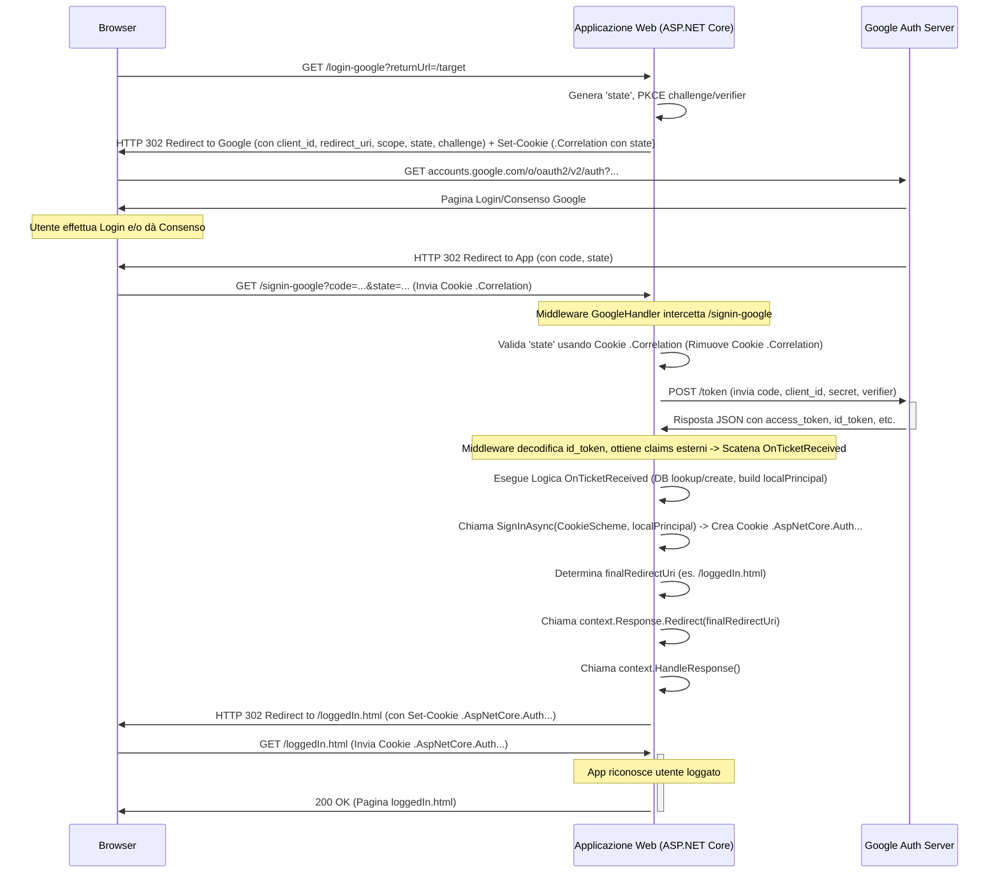

# Indicazioni per lo sviluppo del progetto

- [Indicazioni per lo sviluppo del progetto](#indicazioni-per-lo-sviluppo-del-progetto)
  - [Setup del progetto](#setup-del-progetto)
  - [Configurazione del database (Modello, DbContext, Migrazione)](#configurazione-del-database-modello-dbcontext-migrazione)
  - [Autenticazione e autorizzazione degli utenti e seed del database all'avvio (funzionalità non richieste dalla traccia, ma fondamentali per il prototipo)](#autenticazione-e-autorizzazione-degli-utenti-e-seed-del-database-allavvio-funzionalità-non-richieste-dalla-traccia-ma-fondamentali-per-il-prototipo)
    - [Implementazione del seeding del database in produzione](#implementazione-del-seeding-del-database-in-produzione)
    - [Autenticazione basata su Google - Applicazione ASP.NET Core Minimal API](#autenticazione-basata-su-google---applicazione-aspnet-core-minimal-api)
      - [Prerequisiti](#prerequisiti)
    - [Diagramma di Sequenza (Mermaid)](#diagramma-di-sequenza-mermaid)
    - [Codice completo per il prototipo](#codice-completo-per-il-prototipo)
    - [Conclusione sull'autenticazione basata su Google](#conclusione-sullautenticazione-basata-su-google)

Dobbiamo realizzare un prototipo funzionante per la [traccia di esame di maturità di informatica del 2023](https://www.istruzione.it/esame_di_stato/202223/Istituti%20tecnici/Ordinaria/A038_ORD23.pdf) (con particolare riferimento al punto 6 della prima parte della traccia)

L'architettura di riferimento è una **Applicazione Unificata (Minimal API serve sia API che Pagine)**. Questa applicazione sarà strutturata secondo una Multi Page Application (MPA), come indicato nel documento [progetto-educational-games](progetto-educational-games.md).

Procediamo con i seguenti step:

## Setup del progetto

- partiamo da una struttura di progetto derivata dall'esempio `CookieBasedAuthentication`

## Configurazione del database (Modello, DbContext, Migrazione)

- installiamo i pacchetti Nuget aggiuntivi necessari per il progetto
  - `Microsoft.AspNetCore.Diagnostics.EntityFrameworkCore`
  - `Microsoft.EntityFrameworkCore.Design`
  - `Pomelo.EntityFrameworkCore.MySql`
- configuriamo la stringa di connessione per il database MariaDb (che è in funzione in locale su un container Docker). Per il momento, in fase di sviluppo, usiamo l'account root, ma successivamente verrà creato un account specifico per l'applicazione:
  in `appsettings.json`:

    ```json
    "ConnectionStrings": {
    "EducationalGamesConnection": "Server=localhost;Port=3306;Database=educational_games;User Id=root;Password=root;"
  }
    ```

- Creiamo la cartella Data con all'interno la classe `AppDbContext` che verrà successivamente popolata con i campi necessari per lo sviluppo del progetto.

    ```cs
    using Microsoft.EntityFrameworkCore;

    namespace EducationalGames.Data;

    public class AppDbContext(DbContextOptions<AppDbContext> options) : DbContext(options)
    {

    }
    ```

- Aggiungiamo il servizio di connessione al database alla pipeline dell'applicazione:

    ```cs
    //adding services to the container
    if (builder.Environment.IsDevelopment())
    {
        //il servizio AddDatabaseDeveloperPageExceptionFilter andrebbe usato solo in fase di testing e non in produzione.
        builder.Services.AddDatabaseDeveloperPageExceptionFilter();
    }
    var connectionString = builder.Configuration.GetConnectionString("EducationalGamesConnection");
    var serverVersion = ServerVersion.AutoDetect(connectionString);
    builder.Services.AddDbContext<AppDbContext>(
            opt => opt.UseMySql(connectionString, serverVersion)
                // The following three options help with debugging, but should
                // be changed or removed for production.
                .LogTo(Console.WriteLine, LogLevel.Information)
                .EnableSensitiveDataLogging()
                .EnableDetailedErrors()
        );
    ```

- Nella cartella Models aggiungiamo le classi necessarie a mappare le tabelle del database educational_games definito in [init-db.sql](../EducationaGames/Scripts/init-db.sql). Ad esempio, scriviamo alcune classi del model come segue:

    ```cs
    //Utente.cs
    using System.ComponentModel.DataAnnotations;
    using System.ComponentModel.DataAnnotations.Schema;

    namespace EducationalGames.Models
    {
        public enum RuoloUtente
        {
            Docente,
            Studente,
            Admin
        }

        [Table("UTENTI")]
        public class Utente
        {
            [Key]
            [Column("ID_Utente")]
            public int Id { get; set; }

            [Required]
            [StringLength(50)]
            public string Nome { get; set; } = null!;

            [Required]
            [StringLength(50)]
            public string Cognome { get; set; } = null!;

            [Required]
            [StringLength(100)]
            [EmailAddress]
            public string Email { get; set; } = null!;

            [Required]
            [StringLength(255)]
            [Column("PasswordHash")]
            public string PasswordHash { get; set; } = null!; // Hash of the password

            [Required]
            [Column("Ruolo")]
            public RuoloUtente Ruolo { get; set; }

            // Navigation properties
            public virtual ICollection<ClasseVirtuale> ClassiCreate { get; set; } = [];
            public virtual ICollection<Iscrizione> Iscrizioni { get; set; } = [];
            public virtual ICollection<ProgressoStudente> Progressi { get; set; } = [];

            // --- SKIP NAVIGATION PROPERTY (per Studenti) ---
            public virtual ICollection<ClasseVirtuale> ClassiIscritte { get; set; } = [];
        }
    }

    ```

    ```cs
    //GiocoArgomento.cs
    using System.ComponentModel.DataAnnotations;
    using System.ComponentModel.DataAnnotations.Schema;

    namespace EducationalGames.Models
    {
        [Table("GIOCHI_ARGOMENTI")]
        public class GiocoArgomento
        {
            [Key] // Part of composite key
            [Column("ID_Gioco")]
            public int GiocoId { get; set; }

            [Key] // Part of composite key
            [Column("ID_Argomento")]
            public int ArgomentoId { get; set; }

            // Navigation properties
            [ForeignKey("GiocoId")]
            public virtual Videogioco Gioco { get; set; } = null!;
            [ForeignKey("ArgomentoId")]
            public virtual Argomento Argomento { get; set; } = null!;
        }
    }
    ```

    ```cs
    //ProgressoStudente.cs
    using System.ComponentModel.DataAnnotations;
    using System.ComponentModel.DataAnnotations.Schema;

    namespace EducationalGames.Models
    {
        [Table("PROGRESSI_STUDENTI")]
        public class ProgressoStudente
        {
            [Key] // Part of composite key
            [Column("ID_Studente")]
            public int StudenteId { get; set; }

            [Key] // Part of composite key
            [Column("ID_Gioco")]
            public int GiocoId { get; set; }

            [Key] // Part of composite key
            [Column("ID_Classe")]
            public int ClasseId { get; set; }

            [Required]
            [Column("MoneteRaccolte")]
            public uint MoneteRaccolte { get; set; } = 0; // Use uint for UNSIGNED

            [Column("UltimoAggiornamento")]
            public DateTime UltimoAggiornamento { get; set; } // Default/Update handled by DB

            // Navigation properties
            [ForeignKey("StudenteId")]
            public virtual Utente Studente { get; set; } = null!;
            [ForeignKey("GiocoId")]
            public virtual Videogioco Gioco { get; set; } = null!;
            [ForeignKey("ClasseId")]
            public virtual ClasseVirtuale Classe { get; set; } = null!;
        }
    }
    ```

    Si osservi che nella scrittura delle chiavi esterne con EF Core sono state utilizzate le convenzioni di EF Core:

    1. **Convenzione C# / Entity Framework Core:** In C# e .NET, la convenzione standard è usare **PascalCase** per i nomi delle proprietà (es. `GiocoId`, `ArgomentoId`). Per le chiavi esterne (Foreign Keys), la convenzione specifica di EF Core è spesso quella di usare il nome della *proprietà di navigazione* seguito da `Id` (es., se si ha una proprietà `public virtual Videogioco Gioco { get; set; }`, la chiave esterna corrispondente per convenzione si chiama `GiocoId`).
    2. **Convenzione SQL (nello script SQL):** Nello script [init-db.sql](../EducationaGames/Scripts/init-db.sql), è stata usata una convenzione diversa, **SNAKE_CASE** maiuscolo con un prefisso `ID_` (es. `ID_Gioco`, `ID_Argomento`).

        **Perché EF Core non usa direttamente i nomi SQL?**

        EF Core fa da ponte tra il tuo codice C# (object-oriented) e il database relazionale (SQL). Preferisce seguire le convenzioni del linguaggio C# per rendere il codice più naturale e leggibile per gli sviluppatori .NET.

        **Come avviene il collegamento (Mapping)?**

        Anche se i nomi sono diversi, EF Core è in grado di capire che la proprietà C# `GiocoId` corrisponde alla colonna SQL `ID_Gioco` (e similmente per le altre). Questo avviene principalmente tramite:

        - **Convenzioni:** EF Core ha delle regole predefinite. Se si ha una proprietà di navigazione `Gioco` e una proprietà `GiocoId`, EF Core presume che `GiocoId` sia la chiave esterna per `Gioco`.
        - **Configurazione Esplicita (Fluent API o Data Annotations):** Se le convenzioni non bastano o i nomi sono molto diversi, si può dire esplicitamente a EF Core come mappare una proprietà a una colonna specifica usando:
            - **Fluent API (in `OnModelCreating`):** `modelBuilder.Entity<GiocoArgomento>().Property(ga => ga.GiocoId).HasColumnName("ID_Gioco");`
            - **Data Annotations (sulla proprietà nel modello):** `[Column("ID_Gioco")] public int GiocoId { get; set; }`

        Nel codice `AppDbContext` C# è stata usata la configurazione Fluent API (`HasForeignKey`) per definire le *relazioni* basandoci sulle proprietà con nome convenzionale (`GiocoId`, `ArgomentoId`). Non si sono aggiunte esplicitamente `HasColumnName` perché spesso EF Core (specialmente con provider come Pomelo per MySQL/MariaDB) è abbastanza intelligente da mappare `GiocoId` a `ID_Gioco` (ignorando maiuscole/minuscole e il trattino basso) o la migrazione stessa si occupa di creare la colonna con il nome atteso dal modello C# se il database viene creato da zero tramite migrazioni.

        In sintesi: si usano le convenzioni C# nel codice per coerenza e leggibilità, e si lascia che EF Core gestisca la mappatura verso le convenzioni (potenzialmente diverse) del database, eventualmente aiutandolo con configurazioni esplicite se necessario.
  
- Aggiorniamo la classe `AppDbContext` per fare in modo di avere la corretta implementazione dei DbSet e di configurazioni aggiuntive necessarie per mappare correttamente il database descritto nello script [init-db.sql](../EducationaGames/Scripts/init-db.sql)
  
  ```cs
    using Microsoft.EntityFrameworkCore;
    using EducationalGames.Models; 

    namespace EducationalGames.Data;

    public class AppDbContext(DbContextOptions<AppDbContext> options) : DbContext(options)
    {
        // DbSet per ogni entità
        public DbSet<Utente> Utenti { get; set; } = null!;
        public DbSet<Materia> Materie { get; set; } = null!;
        public DbSet<Argomento> Argomenti { get; set; } = null!;
        public DbSet<Videogioco> Videogiochi { get; set; } = null!;
        public DbSet<ClasseVirtuale> ClassiVirtuali { get; set; } = null!;
        public DbSet<Iscrizione> Iscrizioni { get; set; } = null!;
        public DbSet<ClasseGioco> ClassiGiochi { get; set; } = null!;
        public DbSet<GiocoArgomento> GiochiArgomenti { get; set; } = null!;
        public DbSet<ProgressoStudente> ProgressiStudenti { get; set; } = null!;

        protected override void OnModelCreating(ModelBuilder modelBuilder)
        {
            base.OnModelCreating(modelBuilder);

            // Configurazione Utente
            modelBuilder.Entity<Utente>()
                .HasIndex(u => u.Email)
                .IsUnique();
            modelBuilder.Entity<Utente>()
                .Property(u => u.Ruolo)
                .HasConversion<string>();

            // Configurazione Materia
            modelBuilder.Entity<Materia>()
                .HasIndex(m => m.Nome)
                .IsUnique();

            // Configurazione Argomento
            modelBuilder.Entity<Argomento>()
                .HasIndex(a => a.Nome)
                .IsUnique();

            // Configurazione Videogioco
            modelBuilder.Entity<Videogioco>()
                .HasIndex(v => v.Titolo)
                .IsUnique();
            modelBuilder.Entity<Videogioco>().Property(v => v.DefinizioneGioco).HasColumnType("json");

            // Configurazione ClasseVirtuale
            modelBuilder.Entity<ClasseVirtuale>()
                .HasIndex(cv => cv.CodiceIscrizione)
                .IsUnique();
            modelBuilder.Entity<ClasseVirtuale>()
                .HasIndex(cv => new { cv.DocenteId, cv.Nome })
                .IsUnique();
            // Le FK DocenteId e MateriaId sono definite tramite [ForeignKey] nel modello
            // Ma definiamo qui il comportamento OnDelete
            modelBuilder.Entity<ClasseVirtuale>()
                .HasOne(cv => cv.Docente)
                .WithMany(u => u.ClassiCreate)
                .OnDelete(DeleteBehavior.Restrict);
            modelBuilder.Entity<ClasseVirtuale>()
                .HasOne(cv => cv.Materia)
                .WithMany(m => m.ClassiVirtuali)
                .OnDelete(DeleteBehavior.Restrict);


            // --- Configurazione Iscrizione (M:N Utente-ClasseVirtuale con Skip Navigation) ---
            modelBuilder.Entity<Utente>()
                .HasMany(u => u.ClassiIscritte) // Skip Navigation da Utente a Classe
                .WithMany(cv => cv.StudentiIscritti) // Skip Navigation da Classe a Utente
                .UsingEntity<Iscrizione>(j => // Specifica l'entità di join Iscrizione
                {
                    j.ToTable("ISCRIZIONI"); // Nome tabella
                    j.HasKey(i => new { i.StudenteId, i.ClasseId }); // Chiave primaria composita

                    // Configura la relazione Iscrizione -> Utente (Studente)
                    // e collega alla navigation property Iscrizioni su Utente
                    j.HasOne(i => i.Studente)
                    .WithMany(u => u.Iscrizioni) // Collega alla collection di Iscrizione in Utente
                    .OnDelete(DeleteBehavior.Cascade);

                    // Configura la relazione Iscrizione -> ClasseVirtuale
                    // e collega alla navigation property Iscrizioni su ClasseVirtuale
                    j.HasOne(i => i.Classe)
                    .WithMany(cv => cv.Iscrizioni) // Collega alla collection di Iscrizione in ClasseVirtuale
                    .OnDelete(DeleteBehavior.Cascade);

                    // Configura proprietà specifiche dell'entità di join Iscrizione
                    j.Property(i => i.DataIscrizione)
                    .ValueGeneratedOnAdd()
                    .HasDefaultValueSql("CURRENT_TIMESTAMP");
                });

            // --- Configurazione ClasseGioco (M:N ClasseVirtuale-Videogioco con Skip Navigation) ---
            modelBuilder.Entity<ClasseVirtuale>()
                .HasMany(cv => cv.Giochi)
                .WithMany(g => g.ClassiVirtuali)
                .UsingEntity<ClasseGioco>(j =>
                {
                    j.ToTable("CLASSI_GIOCHI");
                    j.HasKey(cg => new { cg.ClasseId, cg.GiocoId });
                    // Le FK sono definite tramite [ForeignKey] in ClasseGioco.cs
                    // Definiamo qui il comportamento OnDelete per le relazioni *dalla* join table
                    j.HasOne(cg => cg.Classe)
                    .WithMany(cv => cv.ClassiGiochi)
                    .OnDelete(DeleteBehavior.Cascade);
                    j.HasOne(cg => cg.Gioco)
                    .WithMany(v => v.ClassiGiochi)
                    .OnDelete(DeleteBehavior.Cascade);
                });


            // --- Configurazione GiocoArgomento (M:N Videogioco-Argomento con Skip Navigation) ---
            modelBuilder.Entity<Videogioco>()
                .HasMany(v => v.Argomenti)
                .WithMany(a => a.Videogiochi)
                .UsingEntity<GiocoArgomento>(j =>
                {
                    j.ToTable("GIOCHI_ARGOMENTI");
                    j.HasKey(ga => new { ga.GiocoId, ga.ArgomentoId });
                    // Le FK sono definite tramite [ForeignKey] in GiocoArgomento.cs
                    // Definiamo qui il comportamento OnDelete per le relazioni *dalla* join table
                    j.HasOne(ga => ga.Gioco)
                    .WithMany(v => v.GiochiArgomenti)
                    .OnDelete(DeleteBehavior.Cascade);
                    j.HasOne(ga => ga.Argomento)
                    .WithMany(a => a.GiochiArgomenti)
                    .OnDelete(DeleteBehavior.Cascade);
                });

            // --- Configurazione ProgressoStudente ---
            modelBuilder.Entity<ProgressoStudente>()
                .HasKey(ps => new { ps.StudenteId, ps.GiocoId, ps.ClasseId });
            // Le FK sono definite tramite [ForeignKey] nel modello
            // Ma definiamo qui il comportamento OnDelete
            modelBuilder.Entity<ProgressoStudente>()
                .HasOne(ps => ps.Studente)
                .WithMany(u => u.Progressi)
                .OnDelete(DeleteBehavior.Cascade);
            modelBuilder.Entity<ProgressoStudente>()
                .HasOne(ps => ps.Gioco)
                .WithMany(v => v.Progressi)
                .OnDelete(DeleteBehavior.Cascade);
            modelBuilder.Entity<ProgressoStudente>()
                .HasOne(ps => ps.Classe)
                .WithMany(cv => cv.Progressi)
                .OnDelete(DeleteBehavior.Cascade);
            modelBuilder.Entity<ProgressoStudente>()
            .Property(ps => ps.UltimoAggiornamento)
            .ValueGeneratedOnAddOrUpdate()
            .HasDefaultValueSql("CURRENT_TIMESTAMP")
            .Metadata.SetAfterSaveBehavior(Microsoft.EntityFrameworkCore.Metadata.PropertySaveBehavior.Ignore);
        }
    }
  ```

- assicuriamoci di avere dotnet-ef installato. Nel caso non lo sia si procederà ad installarlo con il comando:
  
  ```ps
    dotnet tool install --global dotnet-ef
  ```

- Effettuiamo la prima migrazione
  
  ```ps
    dotnet ef migrations add InitialCreate --project EducationalGames
  ```

- Applichiamo la migrazione
  
  ```ps
    dotnet ef database update --project EducationalGames
  ```

## Autenticazione e autorizzazione degli utenti e seed del database all'avvio (funzionalità non richieste dalla traccia, ma fondamentali per il prototipo)

Per la gestione degli accessi nel prototipo verrà utilizzato il seguente approccio:

- Definizione dei ruoli degli utenti: `Admin`, `Docente`, `Studente`. Per rendere più semplice la gestione dei permessi verranno attribuiti `ruoli in cascata`, ossia l'utente che ha i permessi associati al ruolo gerarchicamente più alto, riceve anche tutti i permessi dei ruoli gerarchicamente inferiori.
- Accesso autenticato alla piattaforma mediante un meccanismo di accesso basato sulla verifica di `username` (corrispondente alla e-mail dell'utente) e `password`. Le password verranno memorizzate in formato criptato nella tabella degli utenti, ricorrendo agli algoritmi di hashing implementati dalla libreria Identity di Microsoft (nello specifico `PBKDF2 with HMAC-SHA1, 128-bit salt, 256-bit subkey, 1000 iterations`). Durante la procedura di login, dopo aver verificato la corrispondenza tra username (e-mail) e password, verrà creato un cookie con il `ClaimsPrincipal` che rappresenta l'utente autenticato.
- Successivamente verrà implementato anche un meccanismo di accesso autenticato, basato sullo standard `OAuth 2.0`, per l'autenticazione degli utenti mediante Google.
- Gli utenti con ruolo `Docente`, oppure `Studente` possono registrarsi liberamente alla piattaforma, mentre gli utenti `Admin` devono necessariamente essere creati da un altro utente con il ruolo di `Admin`.
- La creazione e il popolamento del database in fase di sviluppo viene effettuato direttamente da codice, pertanto alla partenza dell'applicazione, se il database non esiste viene creato e vengono applicate le migrazioni; inoltre viene creato anche un account amministrativo predefinito le cui credenziali vengono prese dagli `User Secrets`.
- Definizione di policies di sicurezza per l'accesso agli endpoint delle API
- Gestione dei codici di errore del client 401 (tentativo di accesso a risorse che richiedono autenticazione) /403 (tentativo di accesso di utente autenticato, ma senza i permessi richiesti) /404 (tentativo di accesso a risorsa non trovata) per richieste API e per richieste non API.
  - Richiesta API(`/api/...`) con Errore (401/403/404):
    - Il `StatusCodeMiddleware` intercetta l'errore e restituisce una risposta JSON standardizzata.
  - Richiesta NON API (`/pagina-protetta`) che richiede Login (401):
    - `CookieAuthenticationEvents` reindirizza a `/login-required`, che poi reindirizza a `/login-page.html?ReturnUrl=....`
  - Richiesta NON API (`/area-admin` oppure `/area-docente` per utente non autorizzato) senza Permessi (403):
    - `CookieAuthenticationEvents` reindirizza a `/access-denied`, che poi reindirizza a `/access-denied.html?ReturnUrl=....`
  - Richiesta NON API (`/pagina-inesistente.html`) non trovata (404):
    - `UseStatusCodePagesWithRedirects` reindirizza a `/not-found.html`.

Il codice di `Program.cs` nel prototipo diventa:

```cs
using Microsoft.AspNetCore.Authentication.Cookies;
using EducationalGames.Models;
using Microsoft.EntityFrameworkCore;
using EducationalGames.Data;
using EducationalGames.Middlewares;
using EducationalGames.Endpoints;
using Microsoft.AspNetCore.Identity; // Per PasswordHasher
using Microsoft.Extensions.Primitives; // Per StringValues

var builder = WebApplication.CreateBuilder(args);

// Add services to the container.
builder.Services.AddOpenApi();
builder.Services.AddEndpointsApiExplorer();
builder.Services.AddOpenApiDocument(config =>
{
    config.Title = "Educational Games v1";
    config.DocumentName = "Educational Games API";
    config.Version = "v1";
});

if (builder.Environment.IsDevelopment())
{
    builder.Services.AddDatabaseDeveloperPageExceptionFilter();
}


// Configura le opzioni di System.Text.Json per gestire gli enum come stringhe
builder.Services.Configure<Microsoft.AspNetCore.Http.Json.JsonOptions>(options =>
{
    // Aggiunge il convertitore che permette di leggere/scrivere enum come stringhe
    options.SerializerOptions.Converters.Add(new System.Text.Json.Serialization.JsonStringEnumConverter());

    // Opzionale: Rende i nomi delle proprietà JSON case-insensitive durante la deserializzazione
    options.SerializerOptions.PropertyNameCaseInsensitive = true;
});

// Se si stesse usando AddControllers() invece di Minimal API, la configurazione sarebbe simile:
// builder.Services.AddControllers().AddJsonOptions(options => {
//     options.JsonSerializerOptions.Converters.Add(new System.Text.Json.Serialization.JsonStringEnumConverter());
// });

// --- Configurazione DbContext ---
var connectionString = builder.Configuration.GetConnectionString("EducationalGamesConnection");
if (string.IsNullOrEmpty(connectionString))
{
    throw new InvalidOperationException("Connection string 'EducationalGamesConnection' not found.");
}
var serverVersion = ServerVersion.AutoDetect(connectionString);
builder.Services.AddDbContext<AppDbContext>(
    opt => opt.UseMySql(connectionString, serverVersion)
        .LogTo(Console.WriteLine, LogLevel.Information)
        .EnableSensitiveDataLogging(builder.Environment.IsDevelopment()) // Log sensibili solo in DEV
        .EnableDetailedErrors(builder.Environment.IsDevelopment())      // Errori dettagliati solo in DEV
);

// --- Configurazione Autenticazione Cookie ---
builder.Services.AddAuthentication(CookieAuthenticationDefaults.AuthenticationScheme)
    .AddCookie(CookieAuthenticationDefaults.AuthenticationScheme, options =>
    {
        options.Cookie.Name = ".AspNetCore.Authentication.EducationalGames"; // Nome specifico per l'app
        options.Cookie.HttpOnly = true;
        options.SlidingExpiration = true;
        options.ExpireTimeSpan = TimeSpan.FromMinutes(60); // Esempio: timeout di 60 minuti (resettato da SlidingExpiration)

        options.Cookie.SecurePolicy = builder.Environment.IsDevelopment()
            ? CookieSecurePolicy.None
            : CookieSecurePolicy.Always; // Forza HTTPS in produzione

        options.Cookie.SameSite = builder.Environment.IsDevelopment()
            ? SameSiteMode.Lax
            : SameSiteMode.Strict; // Più sicuro in produzione

        options.LoginPath = "/login-required"; // Percorso intermedio gestito sotto
        options.AccessDeniedPath = "/access-denied"; // Percorso intermedio gestito sotto

        // Gestione personalizzata redirect per API vs HTML
        options.Events = new CookieAuthenticationEvents
        {
            OnRedirectToLogin = context =>
            {
                if (context.Request.Path.StartsWithSegments("/api")) // Se è una richiesta API
                {
                    context.Response.StatusCode = StatusCodes.Status401Unauthorized;
                    context.Response.Headers.Remove("Location");
                }
                else // Altrimenti, redirect standard (che punterà a /login-required)
                {
                    context.Response.Redirect(context.RedirectUri);
                }
                return Task.CompletedTask;
            },
            OnRedirectToAccessDenied = context =>
            {
                if (context.Request.Path.StartsWithSegments("/api")) // Se è una richiesta API
                {
                    context.Response.StatusCode = StatusCodes.Status403Forbidden;
                    context.Response.Headers.Remove("Location");
                }
                else // Altrimenti, redirect standard (che punterà a /access-denied)
                {
                    context.Response.Redirect(context.RedirectUri);
                }
                return Task.CompletedTask;
            }
        };
    });

// --- Configurazione Autorizzazione con Policy ---
builder.Services.AddAuthorizationBuilder()
    .AddPolicy("AdminOnly", policy => policy.RequireRole("Admin"))
    .AddPolicy("DocenteOnly", policy => policy.RequireRole("Docente"))
    .AddPolicy("AdminOrDocente", policy => policy.RequireRole("Admin", "Docente"))
    .AddPolicy("RegisteredUsers", policy => policy.RequireAuthenticatedUser()); // Richiede solo utente autenticato

// Aggiungi PasswordHasher come servizio
builder.Services.AddScoped<PasswordHasher<Utente>>();


var app = builder.Build();

// --- APPLICA MIGRAZIONI E SEEDING ADMIN ALL'AVVIO ---
using (var scope = app.Services.CreateScope())
{
    var services = scope.ServiceProvider;
    var logger = services.GetRequiredService<ILogger<Program>>();
    try
    {
        var dbContext = services.GetRequiredService<AppDbContext>();
        var configuration = services.GetRequiredService<IConfiguration>();
        var passwordHasher = services.GetRequiredService<PasswordHasher<Utente>>();

        // Applica migrazioni (solo in sviluppo)
        if (app.Environment.IsDevelopment())
        {
            logger.LogInformation("Development environment detected. Applying database migrations...");
            await dbContext.Database.MigrateAsync();
            logger.LogInformation("Database migrations applied successfully.");
        }

        // Seed Admin User
        logger.LogInformation("Checking for existing Admin user...");
        if (!await dbContext.Utenti.AnyAsync(u => u.Ruolo == RuoloUtente.Admin))
        {
            logger.LogWarning("No Admin user found. Attempting to seed default Admin...");
            var adminEmail = configuration["DefaultAdminCredentials:Email"];
            var adminPassword = configuration["DefaultAdminCredentials:Password"];
            var adminNome = configuration["DefaultAdminCredentials:Nome"] ?? "Admin";
            var adminCognome = configuration["DefaultAdminCredentials:Cognome"] ?? "Default";

            if (string.IsNullOrEmpty(adminEmail) || string.IsNullOrEmpty(adminPassword))
            {
                logger.LogError("Default Admin Email or Password not found in configuration. Cannot seed Admin user.");
            }
            else if (adminPassword.Length < 8)
            {
                logger.LogError("Default Admin Password must be at least 8 characters long. Cannot seed Admin user.");
            }
            else
            {
                var adminUser = new Utente
                {
                    Nome = adminNome,
                    Cognome = adminCognome,
                    Email = adminEmail,
                    Ruolo = RuoloUtente.Admin
                };
                adminUser.PasswordHash = passwordHasher.HashPassword(adminUser, adminPassword);
                dbContext.Utenti.Add(adminUser);
                await dbContext.SaveChangesAsync();
                logger.LogInformation("Default Admin user '{Email}' created successfully.", adminEmail);
            }
        }
        else
        {
            logger.LogInformation("Admin user already exists. Skipping seeding.");
        }
    }
    catch (Exception ex)
    {
        logger.LogError(ex, "An error occurred during database migration or seeding.");
    }
}
// --- FINE MIGRAZIONI E SEEDING ---


// Configure the HTTP request pipeline.
if (app.Environment.IsDevelopment())
{
    app.UseDeveloperExceptionPage();
    app.UseOpenApi();
    app.UseSwaggerUi(config =>
    {
        config.DocumentTitle = "Educational Games v1";
        config.Path = "/swagger";
        config.DocumentPath = "/swagger/{documentName}/swagger.json";
        config.DocExpansion = "list";
    });
}
else
{
    app.UseExceptionHandler("/error");
    app.UseHsts();
    app.UseHttpsRedirection();
}

// Middleware per file statici
app.UseDefaultFiles();
app.UseStaticFiles();

// Middleware Autenticazione/Autorizzazione
app.UseAuthentication();
app.UseAuthorization();

// Middleware per gestire gli errori di stato delle API
// Riepilogo della Logica Risultante:
// Richiesta API(/api/...) con Errore(401/403/404): 
//  Il StatusCodeMiddleware intercetta l'errore e restituisce una risposta JSON standardizzata.
// Richiesta NON API (/pagina-protetta) che richiede Login (401): 
//  CookieAuthenticationEvents reindirizza a /login-required, che poi reindirizza a /login-page.html?ReturnUrl=....
// Richiesta NON API (/area-admin) senza Permessi (403): 
//  CookieAuthenticationEvents reindirizza a /access-denied, che poi reindirizza a /access-denied.html?ReturnUrl=....
// Richiesta NON API (/pagina-inesistente.html) non trovata (404):
//   UseStatusCodePagesWithRedirects reindirizza a /not-found.html.

app.UseMiddleware<StatusCodeMiddleware>();

// Reindirizza a /not-found.html per errori 404 che non sono stati gestiti
// e non sono richieste API (perché il middleware StatusCodeMiddleware
// intercetterebbe gli errori API prima che questo venga eseguito completamente)

// NOTA: Questo catturerà anche richieste a file statici non esistenti.
app.UseStatusCodePagesWithRedirects("/not-found.html");

// Map API endpoints
app.MapGroup("/api/account")
   .WithTags("Account")
   .MapAccountEndpoints();

// Endpoint per gestire i redirect a pagine HTML specifiche
// Questi endpoint vengono chiamati dal middleware dei cookie quando rileva
// una richiesta non API che richiede login o non ha i permessi.
app.MapGet("/login-required", (HttpContext context) =>
{
    // Legge il parametro ReturnUrl aggiunto automaticamente dal middleware
    context.Request.Query.TryGetValue("ReturnUrl", out StringValues returnUrlSv);
    var returnUrl = returnUrlSv.FirstOrDefault();

    // Costruisce l'URL per la pagina di login HTML
    var redirectUrl = "/login-page.html";
    if (!string.IsNullOrEmpty(returnUrl))
    {
        // Aggiunge il ReturnUrl alla pagina di login, così può reindirizzare dopo il login
        redirectUrl += $"?ReturnUrl={Uri.EscapeDataString(returnUrl)}";
    }
    // Esegue il redirect alla pagina di login HTML
    return Results.Redirect(redirectUrl);

}).AllowAnonymous();

app.MapGet("/access-denied", (HttpContext context) =>
{
    // Legge il parametro ReturnUrl aggiunto automaticamente dal middleware
    context.Request.Query.TryGetValue("ReturnUrl", out StringValues returnUrlSv);
    var returnUrl = returnUrlSv.FirstOrDefault();

    // Costruisce l'URL per la pagina di accesso negato HTML
    var redirectUrl = "/access-denied.html";
    if (!string.IsNullOrEmpty(returnUrl))
    {
        // Aggiunge il ReturnUrl alla pagina di accesso negato (utile per logging o messaggi)
        redirectUrl += $"?ReturnUrl={Uri.EscapeDataString(returnUrl)}";
    }
    // Esegue il redirect alla pagina di accesso negato HTML
    return Results.Redirect(redirectUrl);

}).AllowAnonymous();

// Endpoint di fallback per errori generici
app.MapGet("/error", () => Results.Problem("Si è verificato un errore interno.")).AllowAnonymous();


app.Run();
```

Il codice del middleware `StatusCodeMiddleware` per il controllo dei codici di risposta nel caso di richiesta API (`/api/...`) è:

```cs
using System.Text.Json; // Per JsonSerializerOptions

namespace EducationalGames.Middlewares
{
    public class StatusCodeMiddleware
    {
        private readonly RequestDelegate _next;
        private readonly ILogger<StatusCodeMiddleware> _logger;

        // Opzioni per la serializzazione JSON (camelCase)
        private static readonly JsonSerializerOptions _jsonOptions = new()
        {
            PropertyNamingPolicy = JsonNamingPolicy.CamelCase
        };


        public StatusCodeMiddleware(RequestDelegate next, ILogger<StatusCodeMiddleware> logger)
        {
            _next = next;
            _logger = logger;
        }

        public async Task InvokeAsync(HttpContext context)
        {
            await _next(context); // Esegui il resto della pipeline

            var response = context.Response;

            // Controlla solo se la richiesta è per un'API e la risposta non è già iniziata
            // e c'è un errore client/server rilevante (401, 403, 404).
            if (response.HasStarted || !context.Request.Path.StartsWithSegments("/api") || response.StatusCode < 400 || response.StatusCode >= 600)
            {
                return; // Non fare nulla se non è un errore API gestibile
            }

            // Se è un errore API (401, 403, 404), formatta la risposta come JSON standard
            // senza fare redirect. I redirect per non-API sono gestiti altrove.

            if (response.StatusCode == StatusCodes.Status401Unauthorized)
            {
                _logger.LogWarning("API Request Unauthorized (401) for {Path}", context.Request.Path);
                response.ContentType = "application/json";
                await response.WriteAsJsonAsync(new ApiErrorResponse
                {
                    Status = 401,
                    Title = "Unauthorized",
                    Detail = "Autenticazione richiesta per accedere a questa risorsa API.",
                    Path = context.Request.Path,
                    Timestamp = DateTime.UtcNow
                }, _jsonOptions);
            }
            else if (response.StatusCode == StatusCodes.Status403Forbidden)
            {
                _logger.LogWarning("API Request Forbidden (403) for {Path}", context.Request.Path);
                response.ContentType = "application/json";
                await response.WriteAsJsonAsync(new ApiErrorResponse
                {
                    Status = 403,
                    Title = "Forbidden",
                    Detail = "Non hai i permessi necessari per accedere a questa risorsa API.",
                    Path = context.Request.Path,
                    Timestamp = DateTime.UtcNow
                }, _jsonOptions);
            }
            else if (response.StatusCode == StatusCodes.Status404NotFound)
            {
                _logger.LogWarning("API Resource Not Found (404) for {Path}", context.Request.Path);
                response.ContentType = "application/json";
                await response.WriteAsJsonAsync(new ApiErrorResponse
                {
                    Status = 404,
                    Title = "Not Found",
                    Detail = "La risorsa API richiesta non è stata trovata.",
                    Path = context.Request.Path,
                    Timestamp = DateTime.UtcNow
                }, _jsonOptions);
            }
            // Puoi aggiungere altri 'else if' per gestire altri codici di stato per le API
        }

        // Classe helper per standardizzare le risposte di errore API
        private sealed class ApiErrorResponse
        {
            public int Status { get; set; }
            public string Title { get; set; } = string.Empty;
            public string Detail { get; set; } = string.Empty;
            public string Path { get; set; } = string.Empty;
            public DateTime Timestamp { get; set; }
        }
    }
}
```

### Implementazione del seeding del database in produzione

Il seeding automatico all'avvio, come implementato nel `Program.cs` (all'interno di `if (app.Environment.IsDevelopment())`), è comodo per lo sviluppo ma **non è la pratica consigliata per la produzione** per diversi motivi:

1. **Controllo:** In produzione, vuoi avere un controllo preciso su quando e come vengono apportate modifiche al database, inclusa l'aggiunta di utenti iniziali. Un avvio automatico potrebbe fallire o avere effetti indesiderati.
2. **Sicurezza delle Credenziali:** Leggere la password dell'admin da `appsettings.Production.json` è rischioso. Anche se usi Azure Key Vault o variabili d'ambiente, eseguire questa logica ad ogni avvio potrebbe esporre le credenziali più del necessario.
3. **Idempotenza:** La logica attuale controlla se l'admin esiste già (`!await dbContext.Utenti.AnyAsync(...)`), il che è buono, ma in scenari complessi, eseguire seeding ad ogni avvio può essere problematico.

**Approcci Comuni per il Seeding in Produzione:**

Due metodi robusti e sicuri per creare l'utente admin iniziale in un ambiente di produzione, tenendo conto dell'hashing della password sono i seguenti:

**Metodo 1: Script SQL Manuale (con Password Pre-Hashed):**

1. **Generare l'Hash:** Bisogna generare l'hash della password che si vuole usare per l'admin *usando lo stesso algoritmo di hashing* che ASP.NET Core Identity utilizza (`PasswordHasher`). Si può farlo:
    - Creando una piccola utility console temporanea che usa `PasswordHasher<Utente>` per generare l'hash di una password data.
    - Temporaneamente aggiungendo un endpoint di debug nella tua applicazione (da rimuovere prima del deploy!) che prende una password e restituisce il suo hash.
    - Eseguendo la logica di hashing in un ambiente di sviluppo e copiando l'hash risultante.
2. **Creare lo Script SQL:** Scrivere uno script SQL `INSERT` che inserisca l'utente admin nella tabella `UTENTI`. Includere tutti i campi necessari (`Nome`, `Cognome`, `Email`, `Ruolo`) e **usare l'hash generato al punto 1** per il campo `PasswordHash`.SQL

    ```sql
    -- Esempio di script SQL (verifica i nomi esatti delle colonne/tabella)
    -- Assicurati che l'email non esista già prima di eseguire!
    INSERT INTO UTENTI (Nome, Cognome, Email, PasswordHash, Ruolo)
    VALUES (
        'Admin',
        'Produzione',
        'admin.prod@tuodominio.com',
        'AQAAAAIAAYagAAAAEBLongGeneratedHashStringFromStep1...', -- Incollare l'hash qui
        'Admin' -- Assumendo che gli enumerativi siano salvati come stringa
    );

    ```

3. **Eseguire lo Script:** Si esegua questo script SQL manualmente sul database di produzione *una sola volta* dopo aver applicato le migrazioni del database e prima di avviare l'applicazione per la prima volta, o come parte del tuo processo di deployment iniziale.

- **Pro:** Controllo completo, nessuna credenziale in chiaro nella configurazione dell'app, pratica standard per DBA.
- **Contro:** Richiede un passaggio manuale o script di deployment separato, devi generare l'hash esternamente.

**Metodo 2: Comando CLI Personalizzato nell'Applicazione:**

1. **Modificare `Program.cs`:** Adattare `Program.cs` per accettare argomenti da riga di comando specifici per il seeding.
2. **Logica di Seeding:** Creare una funzione (es. `SeedAdminUserAsync`) che contenga la logica attuale di seeding (controllo esistenza, lettura credenziali *passate come argomenti*, hashing, salvataggio).
3. **Esecuzione Condizionale:** All'inizio di `Program.cs`, controllare se sono stati passati gli argomenti per il seeding (es. `dotnet run --seed-admin --admin-email="..." --admin-password="..."`). Se sì, eseguire la funzione `SeedAdminUserAsync` e poi terminare l'applicazione (`Environment.Exit(0)`). Altrimenti, procedere con la normale configurazione e avvio del web host (`var app = builder.Build(); ... app.Run();`).
4. **Deployment:** Nello script di deployment per l'ambiente di produzione, dopo aver installato l'applicazione e applicato le migrazioni, eseguire il comando una volta:

    ```sh
    # Esempio (le credenziali vanno passate in modo sicuro, es. da variabili della pipeline)
    dotnet YourApp.dll --seed-admin --admin-email="admin.prod@tuodominio.com" --admin-password="PASSWORD_SICURA_DA_VARIABILE"
    ```

- **Pro:** Riutilizza la logica C# dell'applicazione (DbContext, PasswordHasher), può essere automatizzato negli script di deployment, le credenziali possono essere gestite in modo sicuro tramite variabili d'ambiente o segreti della pipeline di deployment.
- **Contro:** Richiede modifiche a `Program.cs` per gestire gli argomenti, leggermente più complesso dello script SQL.

**In sintesi:** Per la produzione, evitare il seeding automatico all'avvio dell'applicazione web. Scegliere tra uno script SQL manuale (più semplice per un'operazione una tantum) o un comando CLI integrato nell'app (più flessibile e riutilizza la logica C#) per creare l'utente admin iniziale in modo controllato e sicuro.

### Autenticazione basata su Google - Applicazione ASP.NET Core Minimal API

Questa sezione descrive i passaggi per integrare l'autenticazione esterna di Google in un'applicazione ASP.NET Core Minimal API che utilizza già l'autenticazione basata su cookie per gli utenti locali, ma **senza** usare il framework completo ASP.NET Core Identity (`AddDefaultIdentity`, `SignInManager`, ecc.).

L'approccio descritto utilizza gli eventi del middleware di autenticazione per gestire la logica personalizzata necessaria dopo il callback di Google, e l'integrazione di Google Login richiede una configurazione coordinata su due fronti principali. Da un lato, è necessaria la registrazione dell'applicazione sulla Google Cloud Platform per ottenere le credenziali OAuth 2.0 (Client ID e Client Secret) -- che la identificano univocamente -- e per definire gli URI di reindirizzamento autorizzati, garantendo così un ritorno sicuro dell'utente all'applicazione. Dall'altro lato, occorre configurare il codice ASP.NET Core aggiungendo i servizi e middleware specifici per Google, fornendo le credenziali e definendo come l'applicazione deve interagire con il provider esterno e gestire la sua risposta. Nell'approccio adottato qui, senza il framework Identity completo, l'utilizzo dell'evento `OnTicketReceived` diventa cruciale per inserire la logica applicativa necessaria (come la ricerca o creazione dell'utente nel database locale e l'assegnazione dei ruoli corretti) nel momento giusto del flusso di autenticazione.

#### Prerequisiti

- Progetto ASP.NET Core Minimal API esistente con autenticazione Cookie funzionante (`AddAuthentication().AddCookie(...)`).

- Un modello Utente (es. `Utente.cs`) e un `DbContext` (es. `AppDbContext`) per interagire con il database.

- Un account Google e accesso alla [Google Cloud Platform Console](https://console.cloud.google.com/ "null").

- .NET SDK installato.

- Un editor di codice (es. Visual Studio Code).

**Passaggio 1: Configurazione su Google Cloud Platform:**

Prima di scrivere codice, è necessario registrare l'applicazione presso Google per ottenere le credenziali OAuth 2.0.

1. **Creare/Selezionare Progetto:** Accedere alla [Google Cloud Console](https://console.cloud.google.com/ "null") e creare un nuovo progetto o selezionane uno esistente.

2. **Schermata Consenso OAuth:** Andare su "API e servizi" -> "Schermata consenso OAuth".

    - Configurare il tipo di utente su **"Esterno"**.

    - Inserire le informazioni richieste (Nome applicazione, Email assistenza, Contatto sviluppatore). Salvare le modifiche. Potrebbe essere necessario "Pubblicare" l'app per renderla accessibile a tutti.

3. **Creare Credenziali:** Andare su "API e servizi" -> "Credenziali".

    - Cliccare "+ CREA CREDENZIALI" -> "ID client OAuth".

    - Scegliere "Applicazione web" come tipo.

    - Dare un nome (es. "Credenziali Web App Studenti").

    - **URI di reindirizzamento autorizzati:** Aggiungere gli URI **esatti** a cui Google reindirizzerà l'utente dopo l'autenticazione. Questi devono corrispondere al `CallbackPath` che verranno configurati nel codice.

        - Per sviluppo: `https://localhost:PORTA/signin-google` (sostituire `PORTA` con la porta HTTPS locale, es. 7269).

        - *Se si usa un tunnel (come Dev Tunnels/ngrok) per testare:* Aggiungere anche l'URL pubblico del tunnel seguito dal path: `https://<url-tunnel>/signin-google`.

        - Per produzione: `https://tuo-dominio.com/signin-google`.

    - Cliccare "CREA".

4. **Salvare Credenziali:** Copiare l'**ID client** e il **Client secret**. Conservare il Client Secret in modo sicuro (User Secrets per sviluppo, Key Vault/variabili d'ambiente per produzione). **Non inserire mai direttamente nel codice sorgente!**

**Passaggio 2: Installa Pacchetto NuGet:**

Aggiungere il pacchetto necessario al tuo progetto:

```ps
dotnet add package Microsoft.AspNetCore.Authentication.Google

```

**Passaggio 3: Configurazione in `Program.cs`:**

Modificare il file `Program.cs` per configurare i servizi e la pipeline.

```cs
// using necessari all'inizio:
using Microsoft.AspNetCore.Authentication.Cookies;
using Microsoft.AspNetCore.Authentication.Google;
using Microsoft.AspNetCore.Authentication.OAuth; // Per OAuthEvents
using Microsoft.AspNetCore.DataProtection;
using Microsoft.AspNetCore.HttpOverrides; // Se usi proxy/tunnel
using Microsoft.AspNetCore.Identity; // Per PasswordHasher
using EducationalGames.Data; // Namespace del tuo DbContext, Initializer
using EducationalGames.Auth; // Namespace della tua classe GoogleAuthEvents
using System.IO;
// ... altri using necessari ...

var builder = WebApplication.CreateBuilder(args);

// --- 1. Configura Data Protection (IMPORTANTE!) ---
// Necessario per la stabilità dei cookie crittografati (login e correlazione)
var keysFolder = Path.Combine(builder.Environment.ContentRootPath, "DataProtection-Keys");
Directory.CreateDirectory(keysFolder);
builder.Services.AddDataProtection()
    .SetApplicationName("EducationalGames") // Nome univoco per l'app
    .PersistKeysToFileSystem(new DirectoryInfo(keysFolder))
    .SetDefaultKeyLifetime(TimeSpan.FromDays(30));

// --- 2. Configura CORS (Opzionale ma utile con tunnel/frontend separato) ---
// var devTunnelUrl = "..."; // Leggi da config se necessario
// builder.Services.AddCors(options => { /* ... configura policy ... */ });

// --- 3. Aggiungi Servizi (DbContext, PasswordHasher, etc.) ---
builder.Services.AddDbContext<AppDbContext>(/* ... opzioni ... */);
builder.Services.AddScoped<PasswordHasher<Utente>>();
// Aggiungi altri servizi necessari (es. per OpenAPI/Swagger)
builder.Services.AddEndpointsApiExplorer();
builder.Services.AddOpenApiDocument(config => { /* ... */ });
// Configura JSON Enum Converter
builder.Services.Configure<Microsoft.AspNetCore.Http.Json.JsonOptions>(options => {
     options.SerializerOptions.Converters.Add(new System.Text.Json.Serialization.JsonStringEnumConverter());
     options.SerializerOptions.PropertyNameCaseInsensitive = true;
});

// --- 4. Configura Autenticazione (Cookie + Google con Evento) ---
builder.Services.AddAuthentication(options => {
        options.DefaultScheme = CookieAuthenticationDefaults.AuthenticationScheme;
        // Necessario perché la logica in OnTicketReceived eseguirà il SignIn locale
        options.DefaultSignInScheme = CookieAuthenticationDefaults.AuthenticationScheme;
        options.DefaultAuthenticateScheme = CookieAuthenticationDefaults.AuthenticationScheme;
    })
    .AddCookie(CookieAuthenticationDefaults.AuthenticationScheme, options => {
        // Configura il cookie principale come necessario (LoginPath, AccessDeniedPath, etc.)
        options.Cookie.Name = ".AspNetCore.Authentication.EducationalGames";
        // ... altre opzioni cookie ...
        // Rimuovi gli eventi OnRedirectToLogin/AccessDenied se gestisci 401/403 con StatusCodeMiddleware
    })
    .AddGoogle(GoogleDefaults.AuthenticationScheme, options => {
        options.ClientId = builder.Configuration["Authentication:Google:ClientId"] ?? throw new InvalidOperationException("...");
        options.ClientSecret = builder.Configuration["Authentication:Google:ClientSecret"] ?? throw new InvalidOperationException("...");
        options.CallbackPath = "/signin-google"; // Deve corrispondere a Google Console
        options.Scope.Add("profile");
        options.Scope.Add("email");
        options.SaveTokens = true; // Salva token esterni se servono dopo

        // Usa un metodo statico da una classe helper per gestire l'evento OnTicketReceived
        // Questo evento è cruciale per inserire la logica personalizzata (DB, claims locali)
        options.Events = new OAuthEvents
        {
            // Assegna i metodi statici definiti nella classe GoogleAuthEvents
            OnTicketReceived = GoogleAuthEvents.HandleTicketReceived,
            OnRemoteFailure = GoogleAuthEvents.HandleRemoteFailure,
            OnAccessDenied = GoogleAuthEvents.HandleAccessDenied
        };
    });

// --- 5. Configura Autorizzazione (se necessario) ---
// builder.Services.AddAuthorizationBuilder() /* ... policies ... */ ;

// --- 6. Configura Forwarded Headers (Se usi proxy/tunnel) ---
// builder.Services.Configure<ForwardedHeadersOptions>(options => { /* ... opzioni ... */ });

var app = builder.Build();

// --- 7. Esegui Inizializzazione DB e Seeding ---
// using (var scope = app.Services.CreateScope()){ await DatabaseInitializer.InitializeAndSeedAsync(scope.ServiceProvider, app.Environment); }

// --- 8. Configura Pipeline Middleware (Ordine Importante!) ---
if (app.Environment.IsDevelopment()) { /* ... DevPage, Swagger ... */ } else { /* ... Prod ... */ }

// app.UseForwardedHeaders(); // Mettere MOLTO PRESTO se usato
app.UseHttpsRedirection();

// app.UseCors(...); // Mettere prima di UseAuthentication/UseAuthorization

app.UseStaticFiles(); // O UseDefaultFiles + UseStaticFiles

app.UseAuthentication(); // Identifica utente
// app.UseAuthorization(); // Verifica permessi (se configurato)

// app.UseMiddleware<StatusCodeMiddleware>(); // Opzionale per risposte JSON errori API
// app.UseStatusCodePagesWithRedirects(...); // Opzionale per pagine errore HTML

// --- 9. Map Endpoints ---
app.MapGroup("/api/account").MapAccountEndpoints(); // API locali

// Endpoint Sfida Google
app.MapGet("/login-google", async (HttpContext httpContext, [FromQuery] string? returnUrl) => {
     var target = "/"; // Default redirect dopo login
     // Logica opzionale per validare returnUrl se fornito
     // ... (UrlHelper, IsLocalUrl check) ...
     var props = new AuthenticationProperties { Items = { [".redirect"] = target } }; // Usa chiave standard .redirect
     await httpContext.ChallengeAsync(GoogleDefaults.AuthenticationScheme, props);
}).AllowAnonymous();

// Endpoint Callback Google (/signin-google) - NON MAPPATO QUI
// Viene gestito internamente dal middleware Google e dall'evento OnTicketReceived

// Endpoint per pagine HTML di supporto (login, accesso negato, errori)
app.MapGet("/login-required", (HttpContext context) => { /* ... redirect a login-page.html ... */ }).AllowAnonymous();
app.MapGet("/access-denied", (HttpContext context) => { /* ... redirect a access-denied.html ... */ }).AllowAnonymous();
// ... altri endpoint ...

app.Run();

```

**Spiegazione delle Scelte Chiave in `Program.cs`:**

- **Data Protection:** Configurare `PersistKeysToFileSystem` è fondamentale in qualsiasi scenario (anche sviluppo) per garantire che le chiavi usate per proteggere i cookie (sia quello di sessione sia quello di correlazione OAuth) siano stabili tra riavvii dell'applicazione. Senza questo, si verificano errori come "Unprotect ticket failed" o "state missing or invalid".

- **Autenticazione:**

    - Si registra sia il gestore `Cookie` (per la sessione locale) sia `Google`.

    - `DefaultSignInScheme` viene impostato su `Cookies`. Questo dice al sistema che, dopo un'autenticazione esterna (come Google) andata a buon fine, deve creare automaticamente una sessione locale usando lo schema Cookie.

- **Evento `OnTicketReceived` (e altri):** Questo è il cuore della personalizzazione. Poiché non usiamo ASP.NET Core Identity completo, abbiamo bisogno di un punto per:

    1. Ottenere i dati dell'utente da Google (forniti nel `context.Principal`).

    2. Cercare l'utente nel nostro database locale tramite email (o crearlo se non esiste, assegnando un ruolo di default e un hash password fittizio).

    3. Costruire un nuovo `ClaimsPrincipal` ("identità locale") che contenga i dati e i **ruoli specifici della nostra applicazione** letti dal nostro database.

    4. **Eseguire `SignInAsync` locale esplicitamente** passando il `localPrincipal` (questo crea il cookie di sessione).

    5. **Eseguire `Redirect` esplicitamente** alla destinazione finale (`returnUrl` o `/loggedIn.html`).

    6. **Chiamare `context.HandleResponse()`** per indicare che l'evento ha gestito tutto e il middleware non deve proseguire con azioni di default.

    7. Gli eventi `OnRemoteFailure` e `OnAccessDenied` gestiscono i casi di errore reindirizzando a una pagina dedicata.

- **Endpoint `/login-google`:** Serve solo ad avviare il flusso. Chiama `ChallengeAsync` specificando lo schema Google e passando eventuali `returnUrl` nelle `AuthenticationProperties`.

- **Endpoint `/signin-google`:** **Non viene mappato esplicitamente** con `app.MapGet`. Il percorso `/signin-google` (definito in `options.CallbackPath`) viene intercettato e gestito direttamente dal middleware Google, che poi scatena gli eventi configurati (`OnTicketReceived`, `OnRemoteFailure`, `OnAccessDenied`).

**Passaggio 4: Logica di Callback (`GoogleAuthEvents.HandleTicketReceived`):**

Creare una classe statica (es. `GoogleAuthEvents.cs`) con metodi statici `HandleTicketReceived`, `HandleRemoteFailure`, `HandleAccessDenied`. I passaggi logici chiave all'interno di `HandleTicketReceived` sono:

1. Ottenere servizi necessari (`DbContext`, `PasswordHasher`, `Logger`).

2. Controllare `context.Principal` ricevuto da Google.

3. Estrarre i claims necessari (Email, ID Google, Nome, Cognome). Validarli.

4. Cercare l'utente nel DB locale tramite email.

5. Se l'utente non esiste:

    - Creare un nuovo oggetto `Utente` con i dati da Google, un ruolo di default (es. `Studente`), e un hash password fittizio (per impedire login locali).

    - Salvare il nuovo utente nel DB.

    - Gestire eventuali errori DB (reindirizzando a `login-failed.html`).

6. Se l'utente (nuovo o esistente) è valido:

    - Costruire una lista di `Claim` per la sessione locale (ID utente locale, Email, Nome, Cognome, Ruoli locali ottenuti da `RoleUtils`).

    - Creare `ClaimsIdentity` e `ClaimsPrincipal` locali.

    - Recuperare il `returnUrl` originale dalle `context.Properties`.

    - **Eseguire `SignInAsync` locale esplicitamente** passando il `localPrincipal`.

    - **Eseguire `Redirect` esplicitamente** alla destinazione finale (`returnUrl` o `/loggedIn.html`).

    - **Chiamare `context.HandleResponse()`** per indicare che l'evento ha gestito tutto.

**Passaggio 5: UI per Avviare il Login:**

Aggiungere un link o un pulsante nell'interfaccia utente (es. `index.html` o `login-page.html`) che punti all'endpoint di sfida `/login-google`.

```html
<a href="/login-google">Accedi con Google</a>

```

Oppure, se si volesse passare un `returnUrl`:

```html
<a href="/login-google?returnUrl=/pagina-protetta">Accedi con Google</a>

```

**Passaggio 6: Pagina Post-Login (Opzionale):**

Creare una pagina (es. `loggedIn.html`) a cui reindirizzare dopo il login. Questa pagina può usare JavaScript per chiamare un endpoint API protetto (es. `/api/account/my-roles`) e visualizzare i dati dell'utente loggato. Ricordarsi di aggiornare il redirect finale in `HandleTicketReceived` perché punti a questa pagina.

**Passaggio 7: Flusso OAuth 2.0 (Authorization Code Flow):**

Questo è il flusso di interazione che avviene dietro le quinte:

1. **Utente -> App:** L'utente clicca sul link "Accedi con Google" (`/login-google`).

2. **App -> Browser:** L'endpoint `/login-google` chiama `ChallengeAsync`. Il middleware Google crea un URL di autenticazione Google (con `client_id`, `redirect_uri=/signin-google`, `scope`, `state`, `pkce_challenge`) e un cookie di correlazione (`.Correlation...` con lo `state` protetto). Invia una risposta HTTP 302 al browser con l'URL di Google.

3. **Browser -> Google:** Il browser segue il redirect e contatta Google, inviando i parametri ricevuti.

4. **Google <-> Utente:** Google autentica l'utente (se non già loggato su Google) e mostra la schermata di consenso (se è la prima volta o se richiesto) dove l'utente autorizza l'app ad accedere ai dati richiesti (profilo, email).

5. **Google -> Browser:** Google reindirizza il browser all'URI specificato (`https://localhost:7269/signin-google`) aggiungendo un `code` (codice di autorizzazione monouso) e lo `state` originale come parametri query.

6. **Browser -> App:** Il browser effettua la richiesta `GET` a `/signin-google?code=...&state=...`. **Idealmente**, invia anche il cookie di correlazione (`.Correlation...`) impostato al punto 2. *(Nel nostro debug, questo passaggio falliva a causa del browser/localhost).*

7. **App (Middleware):** Il middleware `GoogleHandler` intercetta la richiesta a `/signin-google`:

    - Verifica il cookie di correlazione rispetto al parametro `state` (protezione CSRF). *(Questo era il punto del nostro errore "state missing")*.

    - Se lo stato è valido, contatta Google **server-to-server**.

8. **App -> Google:** L'app invia il `code` ricevuto, il `client_id`, il `client_secret` e il `pkce_verifier` a un endpoint token di Google.

9. **Google -> App:** Google verifica tutto e restituisce i token (access token, ID token, refresh token).

10. **App (Middleware/Evento):** Il middleware riceve i token. L'ID token contiene i claims dell'utente. Scatena l'evento `OnTicketReceived`.

11. **App (OnTicketReceived):** Il nostro codice personalizzato viene eseguito:

    - Trova/crea l'utente locale nel DB.

    - Crea il `localPrincipal` con i claims locali.

    - Esegue `SignInAsync` locale (crea il cookie `.AspNetCore.Authentication.EducationalGames`).

    - Determina l'URL di redirect finale.

    - Esegue `Response.Redirect()` esplicito.

    - Chiama `HandleResponse()`.

12. **App -> Browser:** Invia la risposta HTTP 302 con `Location` impostato sull'URL di redirect finale (es. `/loggedIn.html`).

13. **Browser -> App:** Il browser segue il redirect finale, richiedendo la pagina `/loggedIn.html` (o `/`). Questa volta, invia il nuovo cookie di autenticazione (`.AspNetCore.Authentication.EducationalGames`).

14. **App -> Browser:** L'applicazione serve la pagina richiesta, riconoscendo l'utente come autenticato grazie al cookie.

### Diagramma di Sequenza (Mermaid)



### Codice completo per il prototipo

```cs
//DatabaseInitializer.cs
using Microsoft.EntityFrameworkCore;
using Microsoft.AspNetCore.Identity;
using EducationalGames.Models; 

namespace EducationalGames.Data; 

public static class DatabaseInitializer
{
    // Metodo per inizializzare DB e fare seeding
    public static async Task InitializeAndSeedAsync(IServiceProvider services, IWebHostEnvironment environment)
    {
        // Ottieni i servizi necessari dallo scope
        var loggerFactory = services.GetRequiredService<ILoggerFactory>();
        // Crea il logger usando una stringa per la categoria
        var logger = loggerFactory.CreateLogger("EducationalGames.Data.DatabaseInitializer");
        var dbContext = services.GetRequiredService<AppDbContext>();
        var configuration = services.GetRequiredService<IConfiguration>();
        var passwordHasher = services.GetRequiredService<PasswordHasher<Utente>>();

        logger.LogInformation("Starting database initialization and seeding...");

        try
        {
            // Applica migrazioni (solo in sviluppo per sicurezza)
            if (environment.IsDevelopment())
            {
                logger.LogInformation("Development environment detected. Applying database migrations...");
                // Nota: MigrateAsync() è idempotente, applica solo migrazioni pendenti.
                await dbContext.Database.MigrateAsync();
                logger.LogInformation("Database migrations applied successfully (or database already up-to-date).");
            }

            // Seed Admin User
            logger.LogInformation("Checking for existing Admin user...");
            // Usiamo ToLower per confronto case-insensitive standard, anche se Enum di solito non serve
            if (!await dbContext.Utenti.AnyAsync(u => u.Ruolo == RuoloUtente.Admin))
            {
                logger.LogWarning("No Admin user found. Attempting to seed default Admin...");

                var adminEmail = configuration["DefaultAdminCredentials:Email"];
                var adminPassword = configuration["DefaultAdminCredentials:Password"];
                var adminNome = configuration["DefaultAdminCredentials:Nome"] ?? "Admin";
                var adminCognome = configuration["DefaultAdminCredentials:Cognome"] ?? "Default";

                if (string.IsNullOrEmpty(adminEmail) || string.IsNullOrEmpty(adminPassword))
                {
                    logger.LogError("Default Admin Email or Password not found in configuration. Cannot seed Admin user.");
                }
                else if (adminPassword.Length < 8)
                {
                    logger.LogError("Default Admin Password must be at least 8 characters long. Cannot seed Admin user.");
                }
                else
                {
                    var adminUser = new Utente
                    {
                        Nome = adminNome,
                        Cognome = adminCognome,
                        Email = adminEmail,
                        Ruolo = RuoloUtente.Admin
                    };
                    adminUser.PasswordHash = passwordHasher.HashPassword(adminUser, adminPassword);

                    dbContext.Utenti.Add(adminUser);
                    await dbContext.SaveChangesAsync();
                    logger.LogInformation("Default Admin user '{Email}' created successfully.", adminEmail);
                }
            }
            else
            {
                logger.LogInformation("Admin user already exists. Skipping seeding.");
            }
        }
        catch (Exception ex)
        {
            logger.LogError(ex, "An error occurred during database initialization or seeding.");
            // Considera se terminare l'applicazione qui in caso di errore critico di inizializzazione DB
            // throw;
        }
    }
}
```

```cs
//AccountEndpoints.cs
using System.Security.Claims;
using EducationalGames.Utils;
using EducationalGames.Data;
using EducationalGames.ModelsDTO;
using Microsoft.AspNetCore.Authentication;
using Microsoft.AspNetCore.Authentication.Cookies;
using Microsoft.AspNetCore.Mvc;
using Microsoft.AspNetCore.Identity;
using EducationalGames.Models;
using Microsoft.EntityFrameworkCore;

namespace EducationalGames.Endpoints;

public static class AccountEndpoints
{
    public static RouteGroupBuilder MapAccountEndpoints(this RouteGroupBuilder group)
    {
        group.MapPost("/login", async (AppDbContext db, HttpContext ctx, LoginModel loginModel, [FromQuery] string? returnUrl) =>
        {
            var hasher = new PasswordHasher<Utente>();
            // Cerca l'utente nel database tramite email (ignorando maiuscole/minuscole)
            // --- CORREZIONE ERRORE EF CORE ---
            // Modificato il confronto per essere traducibile in SQL da EF Core MySQL.
            // Si convertono entrambe le email in minuscolo per un confronto case-insensitive.
            var user = await db.Utenti.FirstOrDefaultAsync(u => u.Email.ToLower() == loginModel.Email.ToLower());
            
            // Se l'utente non esiste, restituisce Unauthorized
            if (user is null)
            {
                // Si potrebbe voler restituire un messaggio generico per motivi di sicurezza
                return Results.Problem("Credenziali non valide.", statusCode: StatusCodes.Status401Unauthorized);
                //oppure 
                //return Results.Unauthorized();
            }

            // Verifica l'hash della password fornita con quello memorizzato nel database
            var result = hasher.VerifyHashedPassword(user, user.PasswordHash, loginModel.Password);

            // Se la password non corrisponde, restituisce Unauthorized
            if (result == PasswordVerificationResult.Failed)
            {
                return Results.Problem("Credenziali non valide.", statusCode: StatusCodes.Status401Unauthorized);
                //oppure
                //return Results.Unauthorized();
            }

            // --- Gestione dei Ruoli in Cascata ---
            // Ottiene i ruoli in cascata basati sul ruolo dell'utente dal database
            var cascadedRoles = RoleUtils.GetCascadedRoles(user.Ruolo); // Usa il metodo che restituisce string[]

            // --- Creazione dei Claims ---
            var claims = new List<Claim>
            {
                // Claim per l'identificativo dell'utente (spesso l'email o un ID univoco)
                new(ClaimTypes.NameIdentifier, user.Id.ToString()), // Aggiunto ID utente come NameIdentifier
                new(ClaimTypes.Name, user.Email), // Claim per il nome utente (email in questo caso)
                new(ClaimTypes.GivenName, user.Nome), // Claim per il nome
                new(ClaimTypes.Surname, user.Cognome), // Claim per il cognome
                // Aggiungere un claim per il ruolo "principale" dell'utente (opzionale se si usano i ruoli in cascata come in questo caso)
                // new Claim(ClaimTypes.Role, user.Ruolo.ToString())
            };

            // Aggiunge un claim di tipo Role per *ciascun* ruolo in cascata
            foreach (var role in cascadedRoles)
            {
                claims.Add(new Claim(ClaimTypes.Role, role));
            }

            // --- Creazione dell'Identità e del Principal ---
            // Crea l'identità dell'utente basata sui claims e sullo schema di autenticazione (Cookie)
            var claimsIdentity = new ClaimsIdentity(claims, CookieAuthenticationDefaults.AuthenticationScheme);
            // Crea il principal che rappresenta l'utente autenticato
            var claimsPrincipal = new ClaimsPrincipal(claimsIdentity);

            // --- Autenticazione ---
            // Controlla se l'utente ha richiesto "Ricordami"
            AuthenticationProperties? authProperties = null;
            if (loginModel.RememberMe)
            {
                authProperties = new AuthenticationProperties
                {
                    // Rende il cookie persistente (sopravvive alla chiusura del browser)
                    IsPersistent = true,
                    // Imposta una scadenza assoluta per il cookie (es. 14 giorni)
                    // SlidingExpiration (impostato nel Program.cs) rinnoverà questa scadenza
                    // se l'utente è attivo prima che scada.
                    ExpiresUtc = DateTimeOffset.UtcNow.AddDays(14),
                    // AllowRefresh è generalmente implicito quando si usa SlidingExpiration nel middleware,
                    // ma può essere impostato esplicitamente se necessario per chiarezza o casi specifici.
                    AllowRefresh = true
                };
            }

            // Effettua il login dell'utente creando il cookie di autenticazione.
            // Passa le proprietà di autenticazione se l'utente ha scelto "Ricordami",
            // altrimenti viene creato un cookie di sessione (non persistente).
            await ctx.SignInAsync(CookieAuthenticationDefaults.AuthenticationScheme, claimsPrincipal, authProperties); // Passiamo authProperties qui


            // --- Redirect ---
            // Reindirizza l'utente alla returnUrl se fornita altrimenti a una pagina di successo predefinita.
            // Assicurarsi che returnUrl sia un URL locale per prevenire attacchi di open redirect
            if (!string.IsNullOrEmpty(returnUrl) && Uri.IsWellFormedUriString(returnUrl, UriKind.Relative))
            {
                return Results.Redirect(returnUrl);
            }
            else
            {
                return Results.Redirect("/loggedIn.html"); // Reindirizza a una pagina di successo predefinita
            }

        }).AllowAnonymous(); // Permette accesso anonimo al login

        // --- Endpoint di Registrazione Pubblica (Docente/Studente) ---
        group.MapPost("/register", async (AppDbContext db, RegisterModel model) =>
        {
            // 1. Validazione del Modello (automatica con Minimal API + attributi)
            //    Se il modello non è valido, Minimal API restituisce automaticamente Bad Request.

            // 2. Controllo esplicito sul ruolo
            if (model.Ruolo == RuoloUtente.Admin)
            {
                return Results.BadRequest("La registrazione come Admin non è permessa.");
            }

            // 3. Verifica se l'email esiste già
            var existingUser = await db.Utenti.AnyAsync(u => u.Email.ToLower() == model.Email.ToLower());
            if (existingUser)
            {
                // Usiamo Problem per dare più dettagli standardizzati sull'errore
                return Results.Problem(
                    statusCode: StatusCodes.Status409Conflict,
                    title: "Email già registrata.",
                    detail: "L'indirizzo email fornito è già associato a un account."
                );
            }

            // 4. Hashing della password
            var hasher = new PasswordHasher<Utente>();
            var newUser = new Utente
            {
                Nome = model.Nome,
                Cognome = model.Cognome,
                Email = model.Email,
                Ruolo = model.Ruolo // Ruolo fornito (Docente o Studente)
                                    // PasswordHash verrà impostato sotto
            };
            newUser.PasswordHash = hasher.HashPassword(newUser, model.Password);

            // 5. Salvataggio nel database
            db.Utenti.Add(newUser);
            await db.SaveChangesAsync();

            // 6. Restituisce Ok o Created
            // Si potrebbe restituire l'utente creato (senza password hash) o solo Ok
            return Results.Ok(new { Message = "Registrazione completata con successo." });

        }).AllowAnonymous(); // Permette accesso anonimo alla registrazione

        // --- Endpoint per Creazione Utenti da parte dell'Admin ---
        group.MapPost("/admin/create-user", async (AppDbContext db, AdminCreateUserModel model) =>
        {
            // 1. Validazione del Modello (automatica)

            // 2. Verifica se l'email esiste già
            var existingUser = await db.Utenti.AnyAsync(u => u.Email.ToLower() == model.Email.ToLower());
            if (existingUser)
            {
                return Results.Problem(
                       statusCode: StatusCodes.Status409Conflict,
                       title: "Email già registrata.",
                       detail: "L'indirizzo email fornito è già associato a un account."
                   );
            }

            // 3. Hashing della password
            var hasher = new PasswordHasher<Utente>();
            var newUser = new Utente
            {
                Nome = model.Nome,
                Cognome = model.Cognome,
                Email = model.Email,
                Ruolo = model.Ruolo // L'admin può specificare qualsiasi ruolo
            };
            newUser.PasswordHash = hasher.HashPassword(newUser, model.Password);

            // 4. Salvataggio nel database
            db.Utenti.Add(newUser);
            await db.SaveChangesAsync();

            // 5. Restituisce Ok o Created
            return Results.Ok(new { Message = $"Utente {model.Email} creato con successo con ruolo {model.Ruolo}." });

        }).RequireAuthorization("AdminOnly"); // SOLO gli Admin possono chiamare questo endpoint

        // --- Altri Endpoint (Profile, Admin-Area, Power-Area, My-Roles, Logout...) ---
        // ... Inserisci qui gli altri endpoint che hai già definito ...
        group.MapGet("/profile", (HttpContext ctx) =>
        {
            // Il check IsAuthenticated è ridondante grazie a RequireAuthorization
            return Results.Ok($"Benvenuto, {ctx.User.FindFirstValue(ClaimTypes.GivenName)} {ctx.User.FindFirstValue(ClaimTypes.Surname)} ({ctx.User.FindFirstValue(ClaimTypes.Name)})");
        }).RequireAuthorization(); // Richiede solo autenticazione generica

        group.MapGet("/admin-area", (HttpContext ctx) =>
        {
            return Results.Ok($"Benvenuto nell'area amministrativa, {ctx.User.FindFirstValue(ClaimTypes.GivenName)}");
        }).RequireAuthorization("AdminOnly"); // Usa la policy definita in Program.cs

        group.MapGet("/power-area", (HttpContext ctx) =>
        {
            return Results.Ok($"Benvenuto nell'area power, {ctx.User.FindFirstValue(ClaimTypes.GivenName)}");
        }).RequireAuthorization("AdminOrDocente"); // Usa la policy definita in Program.cs

        group.MapGet("/my-roles", (HttpContext ctx) =>
        {
            var roles = ctx.User.Claims
                .Where(c => c.Type == ClaimTypes.Role)
                .Select(c => c.Value)
                .ToList();

            return Results.Ok(new
            {
                Username = ctx.User.FindFirstValue(ClaimTypes.Name), // Email
                GivenName = ctx.User.FindFirstValue(ClaimTypes.GivenName), // Nome
                Surname = ctx.User.FindFirstValue(ClaimTypes.Surname), // Cognome
                NameIdentifier = ctx.User.FindFirstValue(ClaimTypes.NameIdentifier), // ID
                Roles = roles,
                IsAdmin = ctx.User.IsInRole("Admin"),
                IsDocente = ctx.User.IsInRole("Docente"),
                IsStudente = ctx.User.IsInRole("Studente")
            });
        }).RequireAuthorization(); // Richiede autenticazione

        // --- Endpoint /logout ---
        group.MapPost("/logout", async (HttpContext ctx, [FromQuery] string? returnUrl) =>
        {
            // Esegui il logout rimuovendo il cookie
            await ctx.SignOutAsync(CookieAuthenticationDefaults.AuthenticationScheme);

            // Se la richiesta proviene da un endpoint API (es. chiamata da JavaScript SPA),
            // restituisce uno status code senza redirect.
            if (ctx.Request.Path.StartsWithSegments("/api"))
            {
                // HTTP 204 No Content è appropriato per un'azione POST/DELETE riuscita senza corpo di risposta
                return Results.NoContent();
                // In alternativa: return Results.Ok(new { message = "Logout successful" });
            }

            // Se la richiesta NON proviene da un'API (es. submit di un form HTML):
            // Prova a reindirizzare a returnUrl SE è fornito ED è un URL locale/sicuro.
            if (!string.IsNullOrEmpty(returnUrl))
            {
                // Results.LocalRedirect verifica internamente che l'URL sia locale
                // per prevenire vulnerabilità Open Redirect usando la validazione standard.
                // Questo è l'overload corretto del metodo.
                return Results.LocalRedirect(returnUrl);
            }

            // Se non c'è un returnUrl valido, reindirizza alla pagina principale (o altra pagina di default)
            return Results.Redirect("/");

        }).RequireAuthorization(); // È necessario essere loggati per poter fare logout

        return group;
    }
}
```

```cs
//PageEndpoints.cs
using Microsoft.AspNetCore.Authentication;
using Microsoft.AspNetCore.Authentication.Google;
using Microsoft.AspNetCore.Mvc;
using Microsoft.AspNetCore.Mvc.Abstractions;
using Microsoft.AspNetCore.Mvc.Routing;
using Microsoft.Extensions.Primitives;

namespace EducationalGames.Endpoints;

public static class PageEndpoints
{
    public static RouteGroupBuilder MapPageEndpoints(this RouteGroupBuilder group)
    {
        //Un esempio di pagina protetta da autenticazione
        //Questa pagina è servita da un file statico in wwwroot
        //Non è necessario un controller MVC per servire file statici, basta usare MapGet e specificare il percorso fisico del file 
        //e il Content-Type corretto (text/html per i file HTML)
        //Il middleware di autenticazione gestirà la richiesta e reindirizzerà l'utente alla pagina di login se non autenticato
        // oppure restituirà 401/403 per le richieste API non autorizzate 
        //Se l'utente è autenticato, il file verrà servito normalmente, e l'utente vedrà la pagina HTML come se fosse una normale richiesta
        // di un file statico
        
        //Non per forza bisogna usare questo approccio per impedire l'accesso a file riservati a utenti non autenticati
        //Si può anche non effettuare questo controllo e lasciare che la pagina sia accessibile a tutti
        //ma poi fare assicurare che ja JavaScript non sia possibile accedere a funzioni o dati riservati
        group.MapGet("/loggedIn.html", (HttpContext context, IWebHostEnvironment env) =>
        {
            // RequireAuthorization ensures this endpoint is only accessible by authenticated users.
            // The authentication middleware (configured earlier) will handle redirecting
            // unauthenticated browser requests to the login page or returning 401/403 for API requests.

            // Construct the physical path to the file within wwwroot
            var filePath = Path.Combine(env.WebRootPath, "loggedIn.html");

            // Check if the file exists
            if (!System.IO.File.Exists(filePath))
            {
                // Return a 404 Not Found if the HTML file doesn't exist in wwwroot
                return Results.NotFound("The requested page was not found.");
            }

            // Serve the physical file. Results.File handles setting the correct Content-Type.
            return Results.File(filePath, "text/html");

        }).RequireAuthorization(); // Apply authorization policy

        // Endpoint di sfida a Google
        group.MapGet("/login-google", async (HttpContext httpContext, [FromQuery] string? returnUrl) =>
        {
            // Logica per validare returnUrl e costruire target...
            var actionContext = new ActionContext(httpContext, httpContext.GetRouteData(), new ActionDescriptor());
            var urlHelper = new UrlHelper(actionContext);
            var target = "/";
            if (!string.IsNullOrEmpty(returnUrl) && urlHelper.IsLocalUrl(returnUrl)) { target = returnUrl; }

            // Proprietà passate alla sfida. 
            var props = new AuthenticationProperties
            {
                Items = { ["returnUrl"] = target } // Passiamo solo la destinazione finale
            };

            // Esegui la sfida esplicita
            await httpContext.ChallengeAsync(GoogleDefaults.AuthenticationScheme, props);

        }).AllowAnonymous();


        // Endpoint per gestire i redirect a pagine HTML specifiche
        // Questi endpoint vengono chiamati dal middleware dei cookie quando rileva
        // una richiesta non API che richiede login o non ha i permessi.
        group.MapGet("/login-required", (HttpContext context) =>
        {
            // Legge il parametro ReturnUrl aggiunto automaticamente dal middleware
            context.Request.Query.TryGetValue("ReturnUrl", out StringValues returnUrlSv);
            var returnUrl = returnUrlSv.FirstOrDefault();

            // Costruisce l'URL per la pagina di login HTML
            var redirectUrl = "/login-page.html";
            if (!string.IsNullOrEmpty(returnUrl))
            {
                // Aggiunge il ReturnUrl alla pagina di login, così può reindirizzare dopo il login
                redirectUrl += $"?ReturnUrl={Uri.EscapeDataString(returnUrl)}";
            }
            // Esegue il redirect alla pagina di login HTML
            return Results.Redirect(redirectUrl);

        }).AllowAnonymous();

        group.MapGet("/access-denied", (HttpContext context) =>
        {
            // Legge il parametro ReturnUrl aggiunto automaticamente dal middleware
            context.Request.Query.TryGetValue("ReturnUrl", out StringValues returnUrlSv);
            var returnUrl = returnUrlSv.FirstOrDefault();

            // Costruisce l'URL per la pagina di accesso negato HTML
            var redirectUrl = "/access-denied.html";
            if (!string.IsNullOrEmpty(returnUrl))
            {
                // Aggiunge il ReturnUrl alla pagina di accesso negato (utile per logging o messaggi)
                redirectUrl += $"?ReturnUrl={Uri.EscapeDataString(returnUrl)}";
            }
            // Esegue il redirect alla pagina di accesso negato HTML
            return Results.Redirect(redirectUrl);

        }).AllowAnonymous();

        // Endpoint di fallback per errori generici
        group.MapGet("/error", () => Results.Problem("Si è verificato un errore interno.")).AllowAnonymous();


        return group;
    }
}
```

```cs
//GoogleAuthEvents.cs
using Microsoft.AspNetCore.Authentication;
using Microsoft.AspNetCore.Authentication.Cookies;
using Microsoft.AspNetCore.Identity;
using Microsoft.EntityFrameworkCore;
using System.Security.Claims;
using EducationalGames.Data; 
using EducationalGames.Models; 
using EducationalGames.Utils; 

namespace EducationalGames.Auth;

public static class GoogleAuthEvents
{
    public static async Task HandleTicketReceived(TicketReceivedContext context)
    {
        // Ottieni servizi necessari
        var dbContext = context.HttpContext.RequestServices.GetRequiredService<AppDbContext>();
        var hasher = context.HttpContext.RequestServices.GetRequiredService<PasswordHasher<Utente>>();
        var loggerFactory = context.HttpContext.RequestServices.GetRequiredService<ILoggerFactory>();
        var logger = loggerFactory.CreateLogger("EducationalGames.GoogleOnTicketReceived");

        logger.LogInformation(">>> [EVENT OnTicketReceived] Started processing Google callback.");

        // Controlla Principal
        if (context.Principal == null)
        {
            logger.LogError(">>> [EVENT OnTicketReceived] Principal is null.");
            // --- Gestione Errore Utente ---
            context.Response.Redirect("/login-failed.html?reason=internal_error_principal");
            context.HandleResponse();
            // --- Fine Gestione ---
            return;
        }

        // Estrai Claims
        var claims = context.Principal.Claims;
        var email = claims.FirstOrDefault(c => c.Type == ClaimTypes.Email)?.Value;
        var googleUserId = claims.FirstOrDefault(c => c.Type == ClaimTypes.NameIdentifier)?.Value;
        var givenName = claims.FirstOrDefault(c => c.Type == ClaimTypes.GivenName)?.Value ?? "Utente";
        var surname = claims.FirstOrDefault(c => c.Type == ClaimTypes.Surname)?.Value;
        if (string.IsNullOrWhiteSpace(surname)) { surname = "-"; }
        logger.LogInformation(">>> [EVENT OnTicketReceived] External claims extracted: Email={Email}, GoogleUserId={GoogleUserId}", email, googleUserId);

        // Valida Claims
        if (string.IsNullOrEmpty(googleUserId) || string.IsNullOrEmpty(email))
        {
            logger.LogWarning(">>> [EVENT OnTicketReceived] Google authentication succeeded but missing required claims (UserId or Email).");
            // --- Gestione Errore Utente ---
            context.Response.Redirect("/login-failed.html?reason=google_missing_claims");
            context.HandleResponse();
            // --- Fine Gestione ---
            return;
        }

        // Cerca o Crea Utente Locale
        Utente? user = null;
        try
        {
            logger.LogInformation(">>> [EVENT OnTicketReceived] Searching for existing user with email {Email}", email);
            user = await dbContext.Utenti.FirstOrDefaultAsync(u => u.Email.ToLower() == email.ToLower());
        }
        catch (Exception ex_search)
        {
            logger.LogError(ex_search, ">>> [EVENT OnTicketReceived] Database error while searching for user with email {Email}", email);
            // --- Gestione Errore Utente ---
            context.Response.Redirect("/login-failed.html?reason=db_search_error");
            context.HandleResponse();
            // --- Fine Gestione ---
            return;
        }

        if (user is null)
        {
            // Crea nuovo utente
            logger.LogInformation(">>> [EVENT OnTicketReceived] No local user found for Google email {Email}. Creating new user.", email);
            var newUser = new Utente
            {
                Nome = givenName,
                Cognome = surname,
                Email = email,
                Ruolo = RuoloUtente.Studente, // Ruolo di default
                PasswordHash = hasher.HashPassword(null!, Guid.NewGuid().ToString()) // Hash fittizio
            };
            dbContext.Utenti.Add(newUser);
            try
            {
                await dbContext.SaveChangesAsync();
                user = newUser;
                logger.LogInformation(">>> [EVENT OnTicketReceived] New user {Email} saved successfully with ID {UserId}", email, user.Id);
            }
            catch (Exception ex_save) // Cattura generica per semplicità qui
            {
                logger.LogError(ex_save, ">>> [EVENT OnTicketReceived] Error while saving new user for Google login {Email}.", email);
                // --- Gestione Errore Utente ---
                context.Response.Redirect("/login-failed.html?reason=user_creation_error");
                context.HandleResponse();
                // --- Fine Gestione ---
                return;
            }
        }
        else { logger.LogInformation(">>> [EVENT OnTicketReceived] Found existing local user {Email} with ID {UserId}", email, user.Id); }

        // Assicurati che user non sia null
        if (user is null)
        {
            logger.LogError(">>> [EVENT OnTicketReceived] User is null after find/create logic.");
            context.Response.Redirect("/login-failed.html?reason=internal_error_user");
            context.HandleResponse();
            return;
        }


        // Costruisci Principal Locale
        logger.LogInformation(">>> [EVENT OnTicketReceived] Preparing local principal for user {Email}", user.Email);
        var cascadedRoles = RoleUtils.GetCascadedRoles(user.Ruolo);
        var cookieClaims = new List<Claim>
                {
                    new(ClaimTypes.NameIdentifier, user.Id.ToString()),
                    new(ClaimTypes.Name,           user.Email),
                    new(ClaimTypes.GivenName,      user.Nome),
                    new(ClaimTypes.Surname,        user.Cognome)
                };
        foreach (var role in cascadedRoles) { cookieClaims.Add(new Claim(ClaimTypes.Role, role)); }
        var identity = new ClaimsIdentity(cookieClaims, CookieAuthenticationDefaults.AuthenticationScheme, ClaimTypes.Name, ClaimTypes.Role);
        var localPrincipal = new ClaimsPrincipal(identity);

        // Recupera returnUrl
        var properties = context.Properties;
        string? callbackReturnUrl = null;
        properties?.Items.TryGetValue(".redirect", out callbackReturnUrl);
        if (string.IsNullOrEmpty(callbackReturnUrl)) { properties?.Items.TryGetValue("returnUrl", out callbackReturnUrl); }

        // AZIONI ESPLICITE (SignIn e Redirect)
        try
        {
            // 1. Esegui SignInAsync locale ESPLICITAMENTE
            logger.LogInformation(">>> [EVENT OnTicketReceived] Executing explicit local SignInAsync for user {Email}", user.Email);
            await context.HttpContext.SignInAsync(CookieAuthenticationDefaults.AuthenticationScheme, localPrincipal, properties);
            logger.LogInformation(">>> [EVENT OnTicketReceived] Explicit local SignInAsync completed.");

            // 2. Determina redirect finale
            string finalRedirectUri;
            var isSpecificLocalReturnUrl = !string.IsNullOrEmpty(callbackReturnUrl) && callbackReturnUrl.StartsWith('/') && callbackReturnUrl != "/";
            if (isSpecificLocalReturnUrl) { finalRedirectUri = callbackReturnUrl!; } else { finalRedirectUri = "/loggedIn.html"; }
            logger.LogWarning(">>> [EVENT OnTicketReceived] Final redirect check: Target='{FinalRedirectUri}'", finalRedirectUri);

            // 3. Esegui Redirect ESPLICITAMENTE
            logger.LogInformation(">>> [EVENT OnTicketReceived] Issuing explicit redirect to {Url}", finalRedirectUri);
            context.Response.Redirect(finalRedirectUri);

            // 4. Segnala che la risposta è stata gestita
            context.HandleResponse();
            logger.LogInformation(">>> [EVENT OnTicketReceived] Finished processing and redirect issued.");
        }
        catch (Exception ex_signin)
        {
            logger.LogError(ex_signin, ">>> [EVENT OnTicketReceived] Error during explicit SignInAsync or Redirect for user {Email}", user.Email);
            // --- Gestione Errore Utente ---
            context.Response.Redirect("/login-failed.html?reason=signin_error");
            context.HandleResponse();
            // --- Fine Gestione ---
        }
    }
    // --- Gestore per fallimenti generici ---
    public static Task HandleRemoteFailure(RemoteFailureContext context)
    {
        // Ottieni logger
        var loggerFactory = context.HttpContext.RequestServices.GetRequiredService<ILoggerFactory>();
        var logger = loggerFactory.CreateLogger("EducationalGames.GoogleOnRemoteFailure");

        // Logga l'errore originale per diagnostica server-side
        // context.Failure contiene l'eccezione che ha causato il fallimento
        logger.LogError(context.Failure, ">>> [EVENT OnRemoteFailure] External login failed. Path={Path}, Error={Error}", context.Request.Path, context.Failure?.Message);

        // Prepara un messaggio/codice per la pagina di errore
        var reason = context.Failure?.Message ?? "unknown_external_error";
        // Tronca messaggi lunghi e fa l'escape per l'URL
        var reasonCode = Uri.EscapeDataString(reason.Length > 100 ? reason.Substring(0, 100) : reason);

        // Reindirizza alla pagina di errore generica passando il motivo
        context.Response.Redirect($"/login-failed.html?reason={reasonCode}");
        // Segnala che abbiamo gestito la risposta, il middleware non deve fare altro
        context.HandleResponse();
        return Task.CompletedTask;
    }

    // --- Gestore per accesso negato dall'utente ---
    public static Task HandleAccessDenied(AccessDeniedContext context)
    {
        // Ottieni logger
        var loggerFactory = context.HttpContext.RequestServices.GetRequiredService<ILoggerFactory>();
        var logger = loggerFactory.CreateLogger("EducationalGames.GoogleOnAccessDenied");
        logger.LogWarning(">>> [EVENT OnAccessDenied] User denied access during external login.");

        // Reindirizza alla pagina di errore con un motivo specifico
        context.Response.Redirect("/login-failed.html?reason=access_denied");
        // Segnala che abbiamo gestito la risposta
        context.HandleResponse();
        return Task.CompletedTask;
    }

}

```

```cs
//Program.cs
using System.Security.Claims;
using Microsoft.AspNetCore.Authentication;
using Microsoft.AspNetCore.Authentication.Cookies;
using Microsoft.AspNetCore.Authentication.Google;
using Microsoft.AspNetCore.Authentication.OAuth;
using Microsoft.AspNetCore.DataProtection;
using Microsoft.AspNetCore.HttpOverrides;
using Microsoft.AspNetCore.Identity;
using Microsoft.EntityFrameworkCore;
using Microsoft.Extensions.Primitives;
using EducationalGames.Data;
using EducationalGames.Endpoints;
using EducationalGames.Middlewares;
using EducationalGames.Models;
using Microsoft.AspNetCore.Mvc;
using Microsoft.AspNetCore.Mvc.Routing;
using Microsoft.AspNetCore.Mvc.Abstractions;
using EducationalGames.Auth;
using System.Net;
var builder = WebApplication.CreateBuilder(args);

// Configura DataProtection esplicitamente
var keysFolder = Path.Combine(builder.Environment.ContentRootPath, "DataProtection-Keys");
Directory.CreateDirectory(keysFolder);
builder.Services.AddDataProtection()
    .SetApplicationName("EducationalGames")
    .PersistKeysToFileSystem(new DirectoryInfo(keysFolder))
    .SetDefaultKeyLifetime(TimeSpan.FromDays(30));

// *** Configurazione CORS (da appsettings) ***
var corsSettings = builder.Configuration.GetSection("CorsSettings");
var tunnelOrProxyOrigin = corsSettings["TunnelOrProxyOrigin"]; // Legge l'URL del tunnel/proxy
var allowedLocalOrigins = corsSettings.GetSection("AllowedLocalOrigins").Get<string[]>(); // Legge l'array di URL locali

var AllowTunnelPolicy = "_allowTunnelPolicy";
var AllowLocalhostPolicy = "_allowLocalhostPolicy";

builder.Services.AddCors(options =>
{
    // Policy per Tunnel/Proxy (aggiunta solo se l'URL è configurato)
    if (!string.IsNullOrEmpty(tunnelOrProxyOrigin) && Uri.TryCreate(tunnelOrProxyOrigin, UriKind.Absolute, out var tunnelUri))
    {
        options.AddPolicy(name: AllowTunnelPolicy, policy =>
        {
            policy.WithOrigins(tunnelUri.GetLeftPart(UriPartial.Authority)) // Usa solo scheme://host:port
                  .AllowAnyHeader()
                  .AllowAnyMethod()
                  .AllowCredentials();
        });
    }

    // Policy per Localhost (usa la lista letta da appsettings)
    if (allowedLocalOrigins != null && allowedLocalOrigins.Length > 0)
    {
        options.AddPolicy(name: AllowLocalhostPolicy, policy =>
        {
            policy.WithOrigins([.. allowedLocalOrigins.Select(u => u.TrimEnd('/'))]) // Pulisce e usa l'array
                  .AllowAnyHeader()
                  .AllowAnyMethod()
                  .AllowCredentials();
        });
    }
    else
    {
        // Fallback o log se non configurato? Per ora non aggiunge la policy localhost.
        Console.WriteLine("WARN: CorsSettings:AllowedLocalOrigins non trovato o vuoto in appsettings.json");
    }
});
// *** FINE Configurazione CORS ***

// Add services to the container.
builder.Services.AddOpenApi();
builder.Services.AddEndpointsApiExplorer();
builder.Services.AddOpenApiDocument(config =>
{
    config.Title = "Educational Games v1";
    config.DocumentName = "Educational Games API";
    config.Version = "v1";
});

if (builder.Environment.IsDevelopment())
{
    builder.Services.AddDatabaseDeveloperPageExceptionFilter();
}


// Configura le opzioni di System.Text.Json per gestire gli enum come stringhe
builder.Services.Configure<Microsoft.AspNetCore.Http.Json.JsonOptions>(options =>
{
    // Aggiunge il convertitore che permette di leggere/scrivere enum come stringhe
    options.SerializerOptions.Converters.Add(new System.Text.Json.Serialization.JsonStringEnumConverter());

    // Opzionale: Rende i nomi delle proprietà JSON case-insensitive durante la deserializzazione
    options.SerializerOptions.PropertyNameCaseInsensitive = true;
});

// Se si stesse usando AddControllers() invece di Minimal API, la configurazione sarebbe simile:
// builder.Services.AddControllers().AddJsonOptions(options => {
//     options.JsonSerializerOptions.Converters.Add(new System.Text.Json.Serialization.JsonStringEnumConverter());
// });

// --- Configurazione DbContext ---
var connectionString = builder.Configuration.GetConnectionString("EducationalGamesConnection");
if (string.IsNullOrEmpty(connectionString))
{
    throw new InvalidOperationException("Connection string 'EducationalGamesConnection' not found.");
}
var serverVersion = ServerVersion.AutoDetect(connectionString);
builder.Services.AddDbContext<AppDbContext>(
    opt => opt.UseMySql(connectionString, serverVersion)
        .LogTo(Console.WriteLine, LogLevel.Information)
        .EnableSensitiveDataLogging(builder.Environment.IsDevelopment()) // Log sensibili solo in DEV
        .EnableDetailedErrors(builder.Environment.IsDevelopment())      // Errori dettagliati solo in DEV
);

// --- Configurazione Autenticazione ---
builder.Services.AddAuthentication(options =>
{
    options.DefaultScheme = CookieAuthenticationDefaults.AuthenticationScheme;
    options.DefaultSignInScheme = CookieAuthenticationDefaults.AuthenticationScheme;
    options.DefaultAuthenticateScheme = CookieAuthenticationDefaults.AuthenticationScheme;
})
.AddCookie(CookieAuthenticationDefaults.AuthenticationScheme, options =>
{ // Configurazione Cookie
    options.Cookie.Name = ".AspNetCore.Authentication.EducationalGames";
    options.Cookie.HttpOnly = true;
    options.SlidingExpiration = true;
    options.ExpireTimeSpan = TimeSpan.FromMinutes(60);
    options.Cookie.SecurePolicy = builder.Environment.IsDevelopment() ? CookieSecurePolicy.None : CookieSecurePolicy.Always;
    options.Cookie.SameSite = builder.Environment.IsDevelopment() ? SameSiteMode.Lax : SameSiteMode.Strict;
    options.LoginPath = "/login-required";
    options.AccessDeniedPath = "/access-denied";

    // Gestione personalizzata redirect per API vs HTML
    options.Events = new CookieAuthenticationEvents
    {
        OnRedirectToLogin = context =>
        {
            var logger = context.HttpContext.RequestServices.GetRequiredService<ILogger<Program>>();
            logger.LogWarning(">>> OnRedirectToLogin triggered for path: {Path}", context.Request.Path);
            if (context.Request.Path.StartsWithSegments("/api"))
            {
                logger.LogWarning(">>> API path detected. Setting status code 401 for path: {Path}", context.Request.Path);
                context.Response.StatusCode = StatusCodes.Status401Unauthorized;
            }
            else
            {
                logger.LogWarning(">>> Non-API path detected. Redirecting to: {RedirectUri}", context.RedirectUri);
                context.Response.Redirect(context.RedirectUri);
            }
            return Task.CompletedTask;
        },
        OnRedirectToAccessDenied = context =>
        {
            var logger = context.HttpContext.RequestServices.GetRequiredService<ILogger<Program>>();
            logger.LogWarning(">>> OnRedirectToAccessDenied triggered for path: {Path}", context.Request.Path);
            if (context.Request.Path.StartsWithSegments("/api"))
            {
                logger.LogWarning(">>> API path detected. Setting status code 403 for path: {Path}", context.Request.Path);
                context.Response.StatusCode = StatusCodes.Status403Forbidden;
            }
            else
            {
                logger.LogWarning(">>> Non-API path detected. Redirecting to: {RedirectUri}", context.RedirectUri);
                context.Response.Redirect(context.RedirectUri);
            }
            return Task.CompletedTask;
        }
    };
})
.AddGoogle(GoogleDefaults.AuthenticationScheme, options =>
{ // Configurazione Google
    options.ClientId = builder.Configuration["Authentication:Google:ClientId"] ?? throw new InvalidOperationException("Google ClientId not configured.");
    options.ClientSecret = builder.Configuration["Authentication:Google:ClientSecret"] ?? throw new InvalidOperationException("Google ClientSecret not configured.");
    options.CallbackPath = "/signin-google"; // Il middleware ascolta qui
    options.Scope.Add("profile");
    options.Scope.Add("email");
    options.SaveTokens = true; // Salva i token per eventuale uso futuro

    options.Events = new OAuthEvents
    {
        //Logica Callback in seguito alla verifica delle credenziali di Google spostata nell'evento OnTicketReceived
        //OnTicketReceived : Scatta quando il ticket di autenticazione è stato ricevuto e validato con successo da Google.
        OnTicketReceived = GoogleAuthEvents.HandleTicketReceived,
        //OnRemoteFailure: Scatta quando si verifica un errore durante la comunicazione con il provider esterno (Google) 
        //o durante l'elaborazione della sua risposta (ad esempio, se Google restituisce un errore, o se si verificano problemi di rete,...
        OnRemoteFailure = GoogleAuthEvents.HandleRemoteFailure,
        //OnAccessDenied: Scatta specificamente se l'utente, sulla pagina di consenso di Google, nega esplicitamente l'accesso alla tua applicazione.
        OnAccessDenied = GoogleAuthEvents.HandleAccessDenied
    };
});

// --- Configurazione Autorizzazione con Policy ---
builder.Services.AddAuthorizationBuilder()
    .AddPolicy("AdminOnly", policy => policy.RequireRole("Admin"))
    .AddPolicy("DocenteOnly", policy => policy.RequireRole("Docente"))
    .AddPolicy("AdminOrDocente", policy => policy.RequireRole("Admin", "Docente"))
    .AddPolicy("RegisteredUsers", policy => policy.RequireAuthenticatedUser()); // Richiede solo utente autenticato

// Aggiungi PasswordHasher come servizio
builder.Services.AddScoped<PasswordHasher<Utente>>();

// --- Configurazione Forwarded Headers Options ---
// Lasciamo configurato nel caso si usi un tunnel o proxy
builder.Services.Configure<ForwardedHeadersOptions>(options =>
{
    options.ForwardedHeaders = ForwardedHeaders.XForwardedFor | ForwardedHeaders.XForwardedProto | ForwardedHeaders.XForwardedHost;

    options.KnownNetworks.Clear();// NON USARE .Clear() in produzione!
    options.KnownProxies.Clear();// NON USARE .Clear() in produzione!
    // Aggiungi qui eventuali reti/proxy noti se necessario
    // Esempio: Aggiungi gli IP specifici dei tuoi reverse proxy/load balancer fidati
    //options.KnownProxies.Add(IPAddress.Parse("10.0.5.23")); // IP del tuo proxy 1
    //options.KnownProxies.Add(IPAddress.Parse("10.0.5.24")); // IP del tuo proxy 2

    // Oppure, se i proxy sono in una subnet specifica:
    //options.KnownNetworks.Add(new Microsoft.AspNetCore.HttpOverrides.IPNetwork(IPAddress.Parse("10.0.5.0"), 24)); // Esempio: Subnet 10.0.5.0/24
    // ...
});
// --- FINE Configurazione Forwarded Headers Options ---

var app = builder.Build();

// --- APPLICA MIGRAZIONI E SEEDING ADMIN ALL'AVVIO (Refactored) ---
// Crea uno scope per risolvere i servizi necessari all'inizializzatore
using (var scope = app.Services.CreateScope())
{
    var services = scope.ServiceProvider;
    // Chiama il metodo statico dell'inizializzatore passando i servizi e l'ambiente
    await DatabaseInitializer.InitializeAndSeedAsync(services, app.Environment);
}
// --- FINE MIGRAZIONI E SEEDING ---

// Configure the HTTP request pipeline.
if (app.Environment.IsDevelopment())
{
    app.UseDeveloperExceptionPage();
    app.UseOpenApi();
    app.UseSwaggerUi(config =>
    {
        config.DocumentTitle = "Educational Games v1";
        config.Path = "/swagger";
        config.DocumentPath = "/swagger/{documentName}/swagger.json";
        config.DocExpansion = "list";
    });
}
else
{
    app.UseExceptionHandler("/error");
    app.UseHsts();

}

// Middleware Forwarded Headers (se si usa tunnel/proxy)
app.UseForwardedHeaders();
app.UseHttpsRedirection();

// --- Applica CORS (usando i nomi delle policy) ---
// Applica la policy del tunnel solo se è stata definita (cioè se l'URL era presente)
if (!string.IsNullOrEmpty(tunnelOrProxyOrigin) && Uri.TryCreate(tunnelOrProxyOrigin, UriKind.Absolute, out _))
{
    app.UseCors(AllowTunnelPolicy);
}
// Applica la policy localhost solo se è stata definita
if (allowedLocalOrigins != null && allowedLocalOrigins.Length > 0)
{
    app.UseCors(AllowLocalhostPolicy);
}
// --- FINE Applica CORS ---

// Middleware per file statici
app.UseDefaultFiles();
app.UseStaticFiles();

// Middleware Autenticazione/Autorizzazione
app.UseAuthentication();
app.UseAuthorization();

// Middleware per gestire gli errori di stato delle API
// Riepilogo della Logica Risultante:
// Richiesta API(/api/...) con Errore(401/403/404): 
//  Il StatusCodeMiddleware intercetta l'errore e restituisce una risposta JSON standardizzata.
// Richiesta NON API (/pagina-protetta) che richiede Login (401): 
//  CookieAuthenticationEvents reindirizza a /login-required, che poi reindirizza a /login-page.html?ReturnUrl=....
// Richiesta NON API (/area-admin) senza Permessi (403): 
//  CookieAuthenticationEvents reindirizza a /access-denied, che poi reindirizza a /access-denied.html?ReturnUrl=....
// Richiesta NON API (/pagina-inesistente.html) non trovata (404):
//   UseStatusCodePagesWithRedirects reindirizza a /not-found.html.

app.UseMiddleware<StatusCodeMiddleware>();

// Reindirizza a /not-found.html per errori 404 che non sono stati gestiti
// e non sono richieste API (perché il middleware StatusCodeMiddleware
// intercetterebbe gli errori API prima che questo venga eseguito completamente)

// NOTA: Questo catturerà anche richieste a file statici non esistenti.
app.UseStatusCodePagesWithRedirects("/not-found.html");

// Map API endpoints
app.MapGroup("/api/account")
   .WithTags("Account")
   .MapAccountEndpoints();

//Map pages endpoints
app.MapGroup("")
    .WithTags("Main")
    .MapPageEndpoints();

app.Run();
```

### Conclusione sull'autenticazione basata su Google

L'incorporazione del meccanismo di autenticazione Google all'interno di un'applicazione necessita inevitabilmente di una duplice configurazione: una sulla piattaforma Google Cloud, finalizzata alla registrazione dell'applicazione e all'ottenimento delle credenziali OAuth 2.0, e una nel codice ASP.NET Core, per l'integrazione dei gestori appropriati. In contesti applicativi che non implementano il framework ASP.NET Core Identity nella sua interezza, o laddove si presentino impedimenti nel flusso di autenticazione standard del middleware, l'utilizzo dell'evento `OnTicketReceived` si configura come una strategia efficace. Tale evento, infatti, offre un punto di intervento specifico che permette un controllo granulare sul processo di associazione tra l'utente esterno e l'entità utente locale. È imperativo, infine, porre la massima attenzione alla gestione sicura delle credenziali ottenute da Google, con particolare riguardo per il Client Secret.
