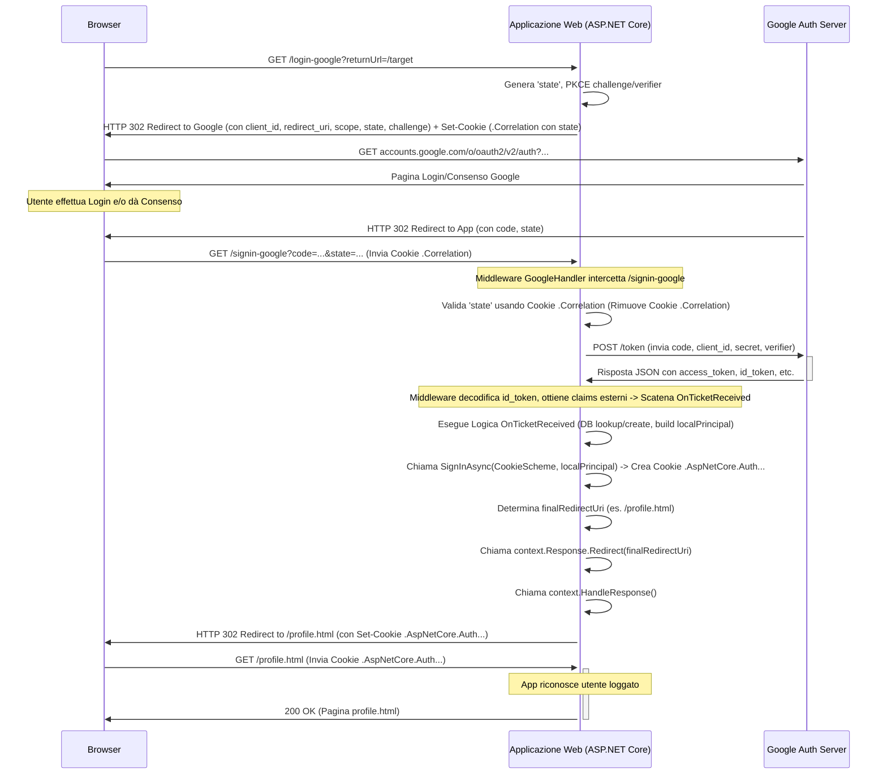
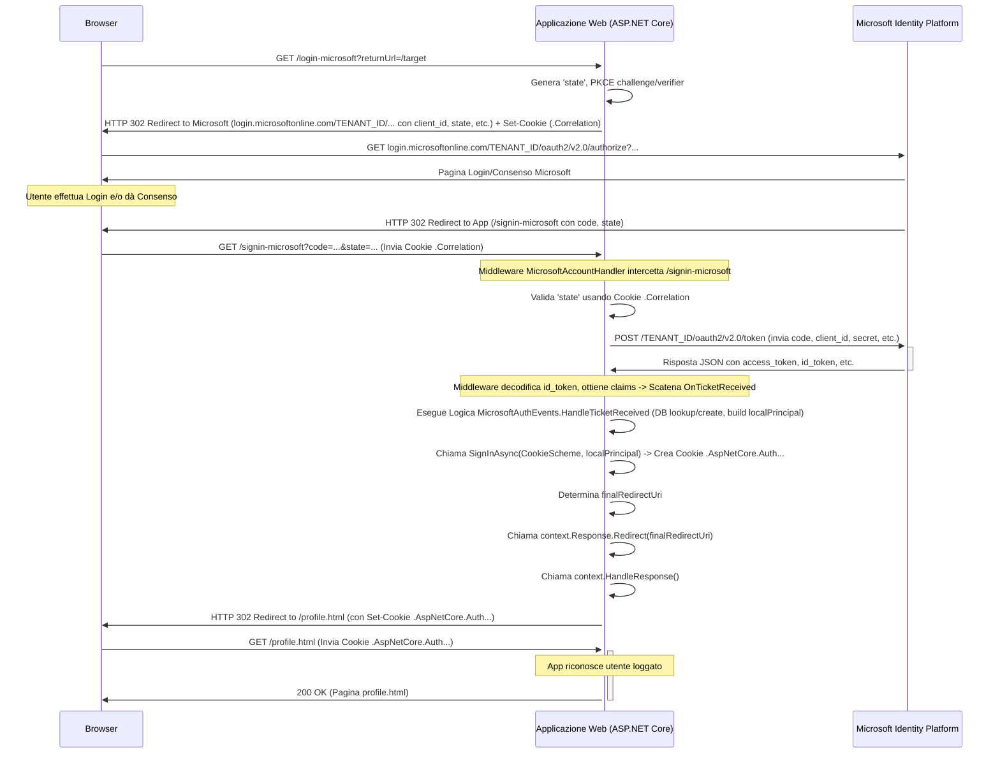

# Indicazioni per lo sviluppo del progetto

- [Indicazioni per lo sviluppo del progetto](#indicazioni-per-lo-sviluppo-del-progetto)
  - [Introduzione](#introduzione)
  - [Setup del progetto](#setup-del-progetto)
  - [Configurazione del database (Modello, DbContext, Migrazione)](#configurazione-del-database-modello-dbcontext-migrazione)
  - [Processo strutturato per lo sviluppo incrementale della piattaforma (moduli funzionali)](#processo-strutturato-per-lo-sviluppo-incrementale-della-piattaforma-moduli-funzionali)
    - [Fase 0: Gestione Utenti](#fase-0-gestione-utenti)
    - [Fase 1: Gestione Catalogo Giochi e Argomenti (Base)](#fase-1-gestione-catalogo-giochi-e-argomenti-base)
    - [Fase 2: Gestione Classi (Docente - Creazione e Visualizzazione)](#fase-2-gestione-classi-docente---creazione-e-visualizzazione)
    - [Fase 3: Gestione Classi (Docente - Dettagli e Associazione Giochi)](#fase-3-gestione-classi-docente---dettagli-e-associazione-giochi)
    - [Fase 4: Gestione Iscrizioni (Studente)](#fase-4-gestione-iscrizioni-studente)
    - [Fase 5: Interfaccia di Gioco e Progresso](#fase-5-interfaccia-di-gioco-e-progresso)
    - [Fase 6: Visualizzazione Classifiche](#fase-6-visualizzazione-classifiche)
    - [Fase 7: Dashboard Docente](#fase-7-dashboard-docente)
    - [Fase 8: Dashboard Studente](#fase-8-dashboard-studente)
    - [Fase 9: Dashboard Admin (Aggiunta)](#fase-9-dashboard-admin-aggiunta)
    - [Processo generale di implementazione dei moduli](#processo-generale-di-implementazione-dei-moduli)
  - [(Fase 0) Autenticazione e autorizzazione degli utenti e seed del database all'avvio (due funzionalità non richieste dalla traccia, ma fondamentali per il prototipo)](#fase-0-autenticazione-e-autorizzazione-degli-utenti-e-seed-del-database-allavvio-due-funzionalità-non-richieste-dalla-traccia-ma-fondamentali-per-il-prototipo)
    - [Implementazione del seeding del database in produzione](#implementazione-del-seeding-del-database-in-produzione)
    - [Autenticazione basata su Google - Applicazione ASP.NET Core Minimal API](#autenticazione-basata-su-google---applicazione-aspnet-core-minimal-api)
      - [Prerequisiti](#prerequisiti)
      - [Diagramma di Sequenza OAuth 2.0 - Google Auth](#diagramma-di-sequenza-oauth-20---google-auth)
      - [Codice completo per il prototipo (Autenticazione basata su Google)](#codice-completo-per-il-prototipo-autenticazione-basata-su-google)
      - [Conclusione sull'autenticazione basata su Google](#conclusione-sullautenticazione-basata-su-google)
    - [Autenticazione basata su Microsoft e Google - Minimal API](#autenticazione-basata-su-microsoft-e-google---minimal-api)
      - [Diagramma di Sequenza per OAuth 2.0 Microsoft](#diagramma-di-sequenza-per-oauth-20-microsoft)
      - [Codice completo per il prototipo (Autenticazione basata su Google e Microsoft)](#codice-completo-per-il-prototipo-autenticazione-basata-su-google-e-microsoft)
      - [Conclusione sull'autenticazione basata su Google e Microsoft](#conclusione-sullautenticazione-basata-su-google-e-microsoft)
    - [Invio di e-mail, validazione della e-mail alla registrazione, cambio del profilo](#invio-di-e-mail-validazione-della-e-mail-alla-registrazione-cambio-del-profilo)
      - [Contesto Iniziale](#contesto-iniziale)
      - [Obiettivi delle Modifiche](#obiettivi-delle-modifiche)
      - [Passaggio 1: Introduzione di un Servizio Email (MailKit)](#passaggio-1-introduzione-di-un-servizio-email-mailkit)
      - [Passaggio 2: Implementazione della Verifica Email](#passaggio-2-implementazione-della-verifica-email)
      - [Passaggio 3: Implementazione del Reset Password](#passaggio-3-implementazione-del-reset-password)
      - [Passaggio 4: Implementazione Reinvio Email di Verifica](#passaggio-4-implementazione-reinvio-email-di-verifica)
      - [Passaggio 5: Implementazione Modifica Profilo](#passaggio-5-implementazione-modifica-profilo)
      - [Passaggio 6: Modifiche al Frontend](#passaggio-6-modifiche-al-frontend)
      - [Codice completo per il prototipo (gestione e-mail e profilo)](#codice-completo-per-il-prototipo-gestione-e-mail-e-profilo)

## Introduzione

Dobbiamo realizzare un prototipo funzionante per la [traccia di esame di maturità di informatica del 2023](https://www.istruzione.it/esame_di_stato/202223/Istituti%20tecnici/Ordinaria/A038_ORD23.pdf) (con particolare riferimento al punto 6 della prima parte della traccia)

L'architettura di riferimento è una **Applicazione Unificata (Minimal API serve sia API che Pagine)**. Questa applicazione sarà strutturata secondo una Multi Page Application (MPA), come indicato nel documento [progetto-educational-games](progetto-educational-games.md).

Procediamo con i seguenti step:

## Setup del progetto

- partiamo da una struttura di progetto derivata dall'esempio `CookieBasedAuthentication`

## Configurazione del database (Modello, DbContext, Migrazione)

- installiamo i pacchetti Nuget aggiuntivi necessari per il progetto
  - `Microsoft.AspNetCore.Diagnostics.EntityFrameworkCore`
  - `Microsoft.EntityFrameworkCore.Design`
  - `Pomelo.EntityFrameworkCore.MySql`
- configuriamo la stringa di connessione per il database MariaDb (che è in funzione in locale su un container Docker). Per il momento, in fase di sviluppo, usiamo l'account root, ma successivamente verrà creato un account specifico per l'applicazione:
  in `appsettings.json`:

    ```json
    "ConnectionStrings": {
    "EducationalGamesConnection": "Server=localhost;Port=3306;Database=educational_games;User Id=root;Password=root;"
  }
    ```

- Creiamo la cartella Data con all'interno la classe `AppDbContext` che verrà successivamente popolata con i campi necessari per lo sviluppo del progetto.

    ```cs
    using Microsoft.EntityFrameworkCore;

    namespace EducationalGames.Data;

    public class AppDbContext(DbContextOptions<AppDbContext> options) : DbContext(options)
    {

    }
    ```

- Aggiungiamo il servizio di connessione al database alla pipeline dell'applicazione:

    ```cs
    //adding services to the container
    if (builder.Environment.IsDevelopment())
    {
        //il servizio AddDatabaseDeveloperPageExceptionFilter andrebbe usato solo in fase di testing e non in produzione.
        builder.Services.AddDatabaseDeveloperPageExceptionFilter();
    }
    var connectionString = builder.Configuration.GetConnectionString("EducationalGamesConnection");
    var serverVersion = ServerVersion.AutoDetect(connectionString);
    builder.Services.AddDbContext<AppDbContext>(
            opt => opt.UseMySql(connectionString, serverVersion)
                // The following three options help with debugging, but should
                // be changed or removed for production.
                .LogTo(Console.WriteLine, LogLevel.Information)
                .EnableSensitiveDataLogging()
                .EnableDetailedErrors()
        );
    ```

- Nella cartella Models aggiungiamo le classi necessarie a mappare le tabelle del database educational_games definito in [init-db.sql](../EducationaGames/Scripts/init-db.sql). Ad esempio, scriviamo alcune classi del model come segue:

    ```cs
    //Utente.cs
    using System.ComponentModel.DataAnnotations;
    using System.ComponentModel.DataAnnotations.Schema;

    namespace EducationalGames.Models
    {
        public enum RuoloUtente
        {
            Docente,
            Studente,
            Admin
        }

        [Table("UTENTI")]
        public class Utente
        {
            [Key]
            [Column("ID_Utente")]
            public int Id { get; set; }

            [Required]
            [StringLength(50)]
            public string Nome { get; set; } = null!;

            [Required]
            [StringLength(50)]
            public string Cognome { get; set; } = null!;

            [Required]
            [StringLength(100)]
            [EmailAddress]
            public string Email { get; set; } = null!;

            [Required]
            [StringLength(255)]
            [Column("PasswordHash")]
            public string PasswordHash { get; set; } = null!; // Hash of the password

            [Required]
            [Column("Ruolo")]
            public RuoloUtente Ruolo { get; set; }

            // Navigation properties
            public virtual ICollection<ClasseVirtuale> ClassiCreate { get; set; } = [];
            public virtual ICollection<Iscrizione> Iscrizioni { get; set; } = [];
            public virtual ICollection<ProgressoStudente> Progressi { get; set; } = [];

            // --- SKIP NAVIGATION PROPERTY (per Studenti) ---
            public virtual ICollection<ClasseVirtuale> ClassiIscritte { get; set; } = [];
        }
    }

    ```

    ```cs
    //GiocoArgomento.cs
    using System.ComponentModel.DataAnnotations;
    using System.ComponentModel.DataAnnotations.Schema;

    namespace EducationalGames.Models
    {
        [Table("GIOCHI_ARGOMENTI")]
        public class GiocoArgomento
        {
            [Key] // Part of composite key
            [Column("ID_Gioco")]
            public int GiocoId { get; set; }

            [Key] // Part of composite key
            [Column("ID_Argomento")]
            public int ArgomentoId { get; set; }

            // Navigation properties
            [ForeignKey("GiocoId")]
            public virtual Videogioco Gioco { get; set; } = null!;
            [ForeignKey("ArgomentoId")]
            public virtual Argomento Argomento { get; set; } = null!;
        }
    }
    ```

    ```cs
    //ProgressoStudente.cs
    using System.ComponentModel.DataAnnotations;
    using System.ComponentModel.DataAnnotations.Schema;

    namespace EducationalGames.Models
    {
        [Table("PROGRESSI_STUDENTI")]
        public class ProgressoStudente
        {
            [Key] // Part of composite key
            [Column("ID_Studente")]
            public int StudenteId { get; set; }

            [Key] // Part of composite key
            [Column("ID_Gioco")]
            public int GiocoId { get; set; }

            [Key] // Part of composite key
            [Column("ID_Classe")]
            public int ClasseId { get; set; }

            [Required]
            [Column("MoneteRaccolte")]
            public uint MoneteRaccolte { get; set; } = 0; // Use uint for UNSIGNED

            [Column("UltimoAggiornamento")]
            public DateTime UltimoAggiornamento { get; set; } // Default/Update handled by DB

            // Navigation properties
            [ForeignKey("StudenteId")]
            public virtual Utente Studente { get; set; } = null!;
            [ForeignKey("GiocoId")]
            public virtual Videogioco Gioco { get; set; } = null!;
            [ForeignKey("ClasseId")]
            public virtual ClasseVirtuale Classe { get; set; } = null!;
        }
    }
    ```

    Si osservi che nella scrittura delle chiavi esterne con EF Core sono state utilizzate le convenzioni di EF Core:

    1. **Convenzione C# / Entity Framework Core:** In C# e .NET, la convenzione standard è usare **PascalCase** per i nomi delle proprietà (es. `GiocoId`, `ArgomentoId`). Per le chiavi esterne (Foreign Keys), la convenzione specifica di EF Core è spesso quella di usare il nome della *proprietà di navigazione* seguito da `Id` (es., se si ha una proprietà `public virtual Videogioco Gioco { get; set; }`, la chiave esterna corrispondente per convenzione si chiama `GiocoId`).
    2. **Convenzione SQL (nello script SQL):** Nello script [init-db.sql](../EducationaGames/Scripts/init-db.sql), è stata usata una convenzione diversa, **SNAKE_CASE** maiuscolo con un prefisso `ID_` (es. `ID_Gioco`, `ID_Argomento`).

        **Perché EF Core non usa direttamente i nomi SQL?**

        EF Core fa da ponte tra il tuo codice C# (object-oriented) e il database relazionale (SQL). Preferisce seguire le convenzioni del linguaggio C# per rendere il codice più naturale e leggibile per gli sviluppatori .NET.

        **Come avviene il collegamento (Mapping)?**

        Anche se i nomi sono diversi, EF Core è in grado di capire che la proprietà C# `GiocoId` corrisponde alla colonna SQL `ID_Gioco` (e similmente per le altre). Questo avviene principalmente tramite:

        - **Convenzioni:** EF Core ha delle regole predefinite. Se si ha una proprietà di navigazione `Gioco` e una proprietà `GiocoId`, EF Core presume che `GiocoId` sia la chiave esterna per `Gioco`.
        - **Configurazione Esplicita (Fluent API o Data Annotations):** Se le convenzioni non bastano o i nomi sono molto diversi, si può dire esplicitamente a EF Core come mappare una proprietà a una colonna specifica usando:
            - **Fluent API (in `OnModelCreating`):** `modelBuilder.Entity<GiocoArgomento>().Property(ga => ga.GiocoId).HasColumnName("ID_Gioco");`
            - **Data Annotations (sulla proprietà nel modello):** `[Column("ID_Gioco")] public int GiocoId { get; set; }`

        Nel codice `AppDbContext` C# è stata usata la configurazione Fluent API (`HasForeignKey`) per definire le *relazioni* basandoci sulle proprietà con nome convenzionale (`GiocoId`, `ArgomentoId`). Non si sono aggiunte esplicitamente `HasColumnName` perché spesso EF Core (specialmente con provider come Pomelo per MySQL/MariaDB) è abbastanza intelligente da mappare `GiocoId` a `ID_Gioco` (ignorando maiuscole/minuscole e il trattino basso) o la migrazione stessa si occupa di creare la colonna con il nome atteso dal modello C# se il database viene creato da zero tramite migrazioni.

        In sintesi: si usano le convenzioni C# nel codice per coerenza e leggibilità, e si lascia che EF Core gestisca la mappatura verso le convenzioni (potenzialmente diverse) del database, eventualmente aiutandolo con configurazioni esplicite se necessario.
  
- Aggiorniamo la classe `AppDbContext` per fare in modo di avere la corretta implementazione dei DbSet e di configurazioni aggiuntive necessarie per mappare correttamente il database descritto nello script [init-db.sql](../EducationaGames/Scripts/init-db.sql)
  
  ```cs
    using Microsoft.EntityFrameworkCore;
    using EducationalGames.Models; 

    namespace EducationalGames.Data;

    public class AppDbContext(DbContextOptions<AppDbContext> options) : DbContext(options)
    {
        // DbSet per ogni entità
        public DbSet<Utente> Utenti { get; set; } = null!;
        public DbSet<Materia> Materie { get; set; } = null!;
        public DbSet<Argomento> Argomenti { get; set; } = null!;
        public DbSet<Videogioco> Videogiochi { get; set; } = null!;
        public DbSet<ClasseVirtuale> ClassiVirtuali { get; set; } = null!;
        public DbSet<Iscrizione> Iscrizioni { get; set; } = null!;
        public DbSet<ClasseGioco> ClassiGiochi { get; set; } = null!;
        public DbSet<GiocoArgomento> GiochiArgomenti { get; set; } = null!;
        public DbSet<ProgressoStudente> ProgressiStudenti { get; set; } = null!;

        protected override void OnModelCreating(ModelBuilder modelBuilder)
        {
            base.OnModelCreating(modelBuilder);

            // Configurazione Utente
            modelBuilder.Entity<Utente>()
                .HasIndex(u => u.Email)
                .IsUnique();
            modelBuilder.Entity<Utente>()
                .Property(u => u.Ruolo)
                .HasConversion<string>();

            // Configurazione Materia
            modelBuilder.Entity<Materia>()
                .HasIndex(m => m.Nome)
                .IsUnique();

            // Configurazione Argomento
            modelBuilder.Entity<Argomento>()
                .HasIndex(a => a.Nome)
                .IsUnique();

            // Configurazione Videogioco
            modelBuilder.Entity<Videogioco>()
                .HasIndex(v => v.Titolo)
                .IsUnique();
            modelBuilder.Entity<Videogioco>().Property(v => v.DefinizioneGioco).HasColumnType("json");

            // Configurazione ClasseVirtuale
            modelBuilder.Entity<ClasseVirtuale>()
                .HasIndex(cv => cv.CodiceIscrizione)
                .IsUnique();
            modelBuilder.Entity<ClasseVirtuale>()
                .HasIndex(cv => new { cv.DocenteId, cv.Nome })
                .IsUnique();
            // Le FK DocenteId e MateriaId sono definite tramite [ForeignKey] nel modello
            // Ma definiamo qui il comportamento OnDelete
            modelBuilder.Entity<ClasseVirtuale>()
                .HasOne(cv => cv.Docente)
                .WithMany(u => u.ClassiCreate)
                .OnDelete(DeleteBehavior.Restrict);
            modelBuilder.Entity<ClasseVirtuale>()
                .HasOne(cv => cv.Materia)
                .WithMany(m => m.ClassiVirtuali)
                .OnDelete(DeleteBehavior.Restrict);


            // --- Configurazione Iscrizione (M:N Utente-ClasseVirtuale con Skip Navigation) ---
            modelBuilder.Entity<Utente>()
                .HasMany(u => u.ClassiIscritte) // Skip Navigation da Utente a Classe
                .WithMany(cv => cv.StudentiIscritti) // Skip Navigation da Classe a Utente
                .UsingEntity<Iscrizione>(j => // Specifica l'entità di join Iscrizione
                {
                    j.ToTable("ISCRIZIONI"); // Nome tabella
                    j.HasKey(i => new { i.StudenteId, i.ClasseId }); // Chiave primaria composita

                    // Configura la relazione Iscrizione -> Utente (Studente)
                    // e collega alla navigation property Iscrizioni su Utente
                    j.HasOne(i => i.Studente)
                    .WithMany(u => u.Iscrizioni) // Collega alla collection di Iscrizione in Utente
                    .OnDelete(DeleteBehavior.Cascade);

                    // Configura la relazione Iscrizione -> ClasseVirtuale
                    // e collega alla navigation property Iscrizioni su ClasseVirtuale
                    j.HasOne(i => i.Classe)
                    .WithMany(cv => cv.Iscrizioni) // Collega alla collection di Iscrizione in ClasseVirtuale
                    .OnDelete(DeleteBehavior.Cascade);

                    // Configura proprietà specifiche dell'entità di join Iscrizione
                    j.Property(i => i.DataIscrizione)
                    .ValueGeneratedOnAdd()
                    .HasDefaultValueSql("CURRENT_TIMESTAMP");
                });

            // --- Configurazione ClasseGioco (M:N ClasseVirtuale-Videogioco con Skip Navigation) ---
            modelBuilder.Entity<ClasseVirtuale>()
                .HasMany(cv => cv.Giochi)
                .WithMany(g => g.ClassiVirtuali)
                .UsingEntity<ClasseGioco>(j =>
                {
                    j.ToTable("CLASSI_GIOCHI");
                    j.HasKey(cg => new { cg.ClasseId, cg.GiocoId });
                    // Le FK sono definite tramite [ForeignKey] in ClasseGioco.cs
                    // Definiamo qui il comportamento OnDelete per le relazioni *dalla* join table
                    j.HasOne(cg => cg.Classe)
                    .WithMany(cv => cv.ClassiGiochi)
                    .OnDelete(DeleteBehavior.Cascade);
                    j.HasOne(cg => cg.Gioco)
                    .WithMany(v => v.ClassiGiochi)
                    .OnDelete(DeleteBehavior.Cascade);
                });


            // --- Configurazione GiocoArgomento (M:N Videogioco-Argomento con Skip Navigation) ---
            modelBuilder.Entity<Videogioco>()
                .HasMany(v => v.Argomenti)
                .WithMany(a => a.Videogiochi)
                .UsingEntity<GiocoArgomento>(j =>
                {
                    j.ToTable("GIOCHI_ARGOMENTI");
                    j.HasKey(ga => new { ga.GiocoId, ga.ArgomentoId });
                    // Le FK sono definite tramite [ForeignKey] in GiocoArgomento.cs
                    // Definiamo qui il comportamento OnDelete per le relazioni *dalla* join table
                    j.HasOne(ga => ga.Gioco)
                    .WithMany(v => v.GiochiArgomenti)
                    .OnDelete(DeleteBehavior.Cascade);
                    j.HasOne(ga => ga.Argomento)
                    .WithMany(a => a.GiochiArgomenti)
                    .OnDelete(DeleteBehavior.Cascade);
                });

            // --- Configurazione ProgressoStudente ---
            modelBuilder.Entity<ProgressoStudente>()
                .HasKey(ps => new { ps.StudenteId, ps.GiocoId, ps.ClasseId });
            // Le FK sono definite tramite [ForeignKey] nel modello
            // Ma definiamo qui il comportamento OnDelete
            modelBuilder.Entity<ProgressoStudente>()
                .HasOne(ps => ps.Studente)
                .WithMany(u => u.Progressi)
                .OnDelete(DeleteBehavior.Cascade);
            modelBuilder.Entity<ProgressoStudente>()
                .HasOne(ps => ps.Gioco)
                .WithMany(v => v.Progressi)
                .OnDelete(DeleteBehavior.Cascade);
            modelBuilder.Entity<ProgressoStudente>()
                .HasOne(ps => ps.Classe)
                .WithMany(cv => cv.Progressi)
                .OnDelete(DeleteBehavior.Cascade);
            modelBuilder.Entity<ProgressoStudente>()
            .Property(ps => ps.UltimoAggiornamento)
            .ValueGeneratedOnAddOrUpdate()
            .HasDefaultValueSql("CURRENT_TIMESTAMP")
            .Metadata.SetAfterSaveBehavior(Microsoft.EntityFrameworkCore.Metadata.PropertySaveBehavior.Ignore);
        }
    }
  ```

- assicuriamoci di avere dotnet-ef installato. Nel caso non lo sia si procederà ad installarlo con il comando:
  
  ```ps
    dotnet tool install --global dotnet-ef
  ```

- Effettuiamo la prima migrazione
  
  ```ps
    dotnet ef migrations add InitialCreate --project EducationalGames
  ```

- Applichiamo la migrazione
  
  ```ps
    dotnet ef database update --project EducationalGames
  ```

## Processo strutturato per lo sviluppo incrementale della piattaforma (moduli funzionali)

Di seguito riportiamo un processo strutturato che possiamo seguire per implementare i moduli richiesti, costruendo funzionalità in modo incrementale:

### Fase 0: Gestione Utenti

- **Obiettivo:** Fornire registrazione, login (locale, Google, Microsoft), gestione profilo base, verifica email e recupero password.

- **Passaggi Backend:**

    1. **Modello `Utente`:** Aggiornato con campi per `EmailVerificata`, token/scadenze per verifica e reset.

    2. **Servizio Email:** Implementato `IEmailService` con MailKit.

    3. **Endpoint Account (`AccountEndpoints.cs`):**

        - `/login`: Verifica password E `EmailVerificata`.

        - `/register`: Crea utente con `EmailVerificata=false`, genera token verifica, invia email.

        - `/verify-email`: Gestisce il link di verifica.

        - `/forgot-password`: Invia email di reset (solo per utenti verificati).

        - `/reset-password`: Imposta nuova password tramite token.

        - `/resend-verification`: Invia nuovo link di verifica per email non verificate.

        - `/admin/create-user`: Crea utente con `EmailVerificata=true`.

        - `/my-roles`: Restituisce i dati dell'utente loggato (inclusi i flag `isAdmin`, `isDocente`, `isStudente`).

        - `/profile` (PUT): Permette all'utente loggato di modificare Nome, Cognome, Ruolo (Studente/Docente) e aggiorna il cookie di sessione.

        - `/logout`: Esegue il logout.

    4. **Autenticazione Esterna (`Program.cs`, `GoogleAuthEvents.cs`, `MicrosoftAuthEvents.cs`):**

        - Configurati i provider Google e Microsoft.

        - Implementata la logica negli eventi `OnTicketReceived` per cercare/creare l'utente locale (impostando `EmailVerificata=true` per questi utenti), costruire il `ClaimsPrincipal` locale con ruoli corretti, eseguire `SignInAsync` e `Redirect` esplicitamente.

        - Implementati `OnRemoteFailure` e `OnAccessDenied` per reindirizzare a `login-failed.html`.

    5. **Configurazione `Program.cs`:** Registrati servizi (Auth, DB, Email, CORS, DataProtection), configurati middleware nell'ordine corretto.

- **Passaggi Frontend:**

    1. **Pagine HTML:** Create `index.html`, `login-page.html`, `register.html`, `profile.html`, `login-failed.html`, `not-found.html`, `forgot-password.html`, `reset-password-page.html`, `email-verified.html`.

    2. **Struttura Comune:** Creati `components/navbar.html`, `components/footer.html`, `css/styles.css`.

    3. **Script Comuni:** Creati `js/template-loader.js` (per caricare componenti) e `js/navbar.js` (per logica navbar dinamica e logout).

    4. **Script Specifici Pagine:** Ogni pagina HTML include `template-loader.js`, `navbar.js` e uno script specifico che attende il caricamento dei template (`await TemplateLoader.initializeCommonTemplates(); await new Promise(resolve => setTimeout(resolve, 0));`), chiama l'API `/my-roles`, aggiorna la navbar (`updateNavbar(userData)`) e gestisce la logica specifica della pagina (es. invio form login/registrazione/reset, visualizzazione profilo/errori).

### Fase 1: Gestione Catalogo Giochi e Argomenti (Base)

- **Obiettivo:** Permettere la visualizzazione dei giochi disponibili e filtrarli per argomento. Creare le basi per la gestione futura.
- **Passaggi Backend:**
    1. **Modelli:** Verificare/Completare i modelli C# per `Videogioco`, `Argomento` e la tabella associativa `GiochiArgomenti` basandoci sullo schema logico definito nel documento di progetto. Assicurarsi che `Videogioco` includa la colonna `DefinizioneGioco` (JSON o TEXT).
    2. **DbContext:** Assicurarsi che `AppDbContext` includa i `DbSet<>` per queste entità e definisca le relazioni (specialmente la many-to-many tra Giochi e Argomenti).
    3. **Migrazione:** Creare e applicare una nuova migrazione EF Core per aggiungere queste tabelle al database.
    4. **Seeding Dati:** Modificare `DatabaseInitializer.cs` per aggiungere alcuni dati di esempio: creare 2-3 `Argomenti` e 3-5 `Videogiochi` (con titoli, descrizioni, MaxMonete e, per ora, un JSON vuoto o semplice in `DefinizioneGioco`), e associarli tramite `GiochiArgomenti`.
    5. **DTOs:** Creare Data Transfer Object (DTO) per rappresentare i dati da esporre via API (es. `GiocoDto`, `ArgomentoDto`).
    6. **Endpoint API (Nuovo File `GameEndpoints.cs`):**
        - `GET /api/argomenti`: Restituisce l'elenco di tutti gli argomenti (`List<ArgomentoDto>`). Accessibile a utenti autenticati.
        - `GET /api/giochi`: Restituisce l'elenco di tutti i giochi (`List<GiocoDto>`), potenzialmente includendo gli argomenti associati. Permette filtri opzionali (es. `?argomentoId=`). Accessibile a utenti autenticati.
- **Passaggi Frontend:**
    1. **Nuova Pagina:** Creare `catalogo-giochi.html` in `wwwroot`.
    2. **Struttura:** Applicare la struttura comune (navbar, footer) usando `template-loader.js`.
    3. **Navbar:** Aggiungere un link "Catalogo Giochi" in `components/navbar.html`, visibile agli utenti loggati (da gestire in `navbar.js`).
    4. **Script Pagina:**
        - Aggiungere lo script `DOMContentLoaded` che attende i template, aggiorna la navbar.
        - Effettuare chiamate `fetch` a `/api/argomenti` e `/api/giochi`.
        - Popolare dinamicamente un'area della pagina (es. usando card Bootstrap) per visualizzare i giochi.
        - Implementare un filtro (es. dropdown `<select>`) basato sugli argomenti caricati per richiamare `fetch('/api/giochi?argomentoId=...')` e aggiornare la lista dei giochi visualizzati.

### Fase 2: Gestione Classi (Docente - Creazione e Visualizzazione)

- **Obiettivo:** Permettere ai docenti di creare nuove classi virtuali e visualizzare quelle che hanno creato.
- **Passaggi Backend:**
    1. **Modelli:** Verificare/Completare i modelli C# per `ClasseVirtuale` e `Materia`.
    2. **DbContext:** Assicurarsi che `AppDbContext` includa i `DbSet<>` e le relazioni (Classe -> Docente, Classe -> Materia).
    3. **Migrazione:** Creare/applicare migrazione se necessaria.
    4. **Seeding Dati:** Aggiungere alcune `Materie` di esempio in `DatabaseInitializer.cs`.
    5. **DTOs:** Creare `ClasseDto` (per visualizzazione), `CreaClasseDto` (per la creazione, richiede solo Nome e ID Materia), `MateriaDto`.
    6. **Endpoint API (Nuovo File `ClassiEndpoints.cs`):**
        - `GET /api/materie`: Restituisce l'elenco delle materie (`List<MateriaDto>`). Accessibile a Docenti.
        - `POST /api/classi`: Riceve `CreaClasseDto`. Verifica che l'utente sia un Docente. Recupera l'ID del docente dai claims. Genera un `CodiceIscrizione` univoco e sicuro. Crea la nuova `ClasseVirtuale` nel DB associandola al docente e alla materia. Restituisce la `ClasseDto` creata (o solo 201 Created). **Richiede autorizzazione (Docente).**
        - `GET /api/classi/mie`: Recupera l'ID del docente loggato dai claims. Restituisce l'elenco delle classi (`List<ClasseDto>`) create da quel docente. **Richiede autorizzazione (Docente).**
- **Passaggi Frontend:**
    1. **Nuova Pagina:** Creare `gestione-classi.html` in `wwwroot`.
    2. **Struttura:** Applicare la struttura comune.
    3. **Navbar:** Aggiungere il link/dropdown "Gestione Classi" in `components/navbar.html`, visibile **solo** ai docenti (modificare `navbar.js` per usare il flag `isDocente` restituito da `/my-roles`).
    4. **Script Pagina:**
        - Script `DOMContentLoaded` (attende template, aggiorna navbar).
        - Fetch a `/api/materie` per popolare un dropdown nel form di creazione.
        - Fetch a `/api/classi/mie` per ottenere e visualizzare l'elenco delle classi esistenti del docente (es. in una tabella).
        - Implementare un form HTML (`#creaClasseForm`) per inserire Nome Classe e selezionare Materia.
        - Aggiungere JavaScript per gestire l'invio del form (`fetch` `POST` a `/api/classi`), mostrando messaggi di successo/errore e aggiornando l'elenco delle classi dopo la creazione.

### Fase 3: Gestione Classi (Docente - Dettagli e Associazione Giochi)

- **Obiettivo:** Mostrare il codice iscrizione e permettere ai docenti di aggiungere/rimuovere giochi dalle loro classi.
- **Passaggi Backend:**
    1. **DTOs:** Potrebbe servire un `ClasseDetailDto` che includa il `CodiceIscrizione` e l'elenco dei `GiocoDto` associati. Creare `AssociaGiocoDto` (contenente `ID_Gioco`).
    2. **Endpoint API (`ClassiEndpoints.cs`):**
        - Modificare `GET /api/classi/mie` (o aggiungere `GET /api/classi/{idClasse}`) per restituire anche il `CodiceIscrizione` e l'elenco dei giochi associati (usando `ClasseDetailDto`). La query dovrà includere i dati dalla tabella `CLASSI_GIOCHI` e `VIDEOGIOCHI`. **Richiede autorizzazione (Docente proprietario della classe).**
        - `POST /api/classi/{idClasse}/giochi`: Riceve `AssociaGiocoDto` nel corpo. Verifica che l'utente loggato sia il docente proprietario della `{idClasse}`. Verifica che il gioco esista. Aggiunge un record alla tabella `CLASSI_GIOCHI`. Restituisce 201 Created o 204 No Content. **Richiede autorizzazione (Docente).**
        - `DELETE /api/classi/{idClasse}/giochi/{idGioco}`: Verifica ownership classe. Rimuove il record corrispondente da `CLASSI_GIOCHI`. Restituisce 204 No Content. **Richiede autorizzazione (Docente).**
- **Passaggi Frontend (`gestione-classi.html`):**
    1. **Visualizzazione Dettagli:** Modificare la visualizzazione dell'elenco classi per mostrare il `CodiceIscrizione` e un pulsante/link "Gestisci Giochi" per ogni classe.
    2. **Sezione/Modal Gestione Giochi:** Al click su "Gestisci Giochi":
        - Mostrare l'elenco dei giochi già associati a quella classe (ottenuti dalla fetch a `/api/classi/mie` o `/api/classi/{idClasse}`).
        - Aggiungere un pulsante "Rimuovi" per ogni gioco associato (che chiama l'API `DELETE`).
        - Mostrare un'interfaccia per aggiungere nuovi giochi:
            - Potrebbe includere un campo di ricerca/filtro per argomento.
            - Effettuare una `fetch` a `/api/giochi` (eventualmente filtrata) per mostrare i giochi disponibili.
            - Permettere la selezione di uno o più giochi.
            - Aggiungere un pulsante "Aggiungi Selezionati" che chiama l'API `POST /api/classi/{idClasse}/giochi` per ogni gioco selezionato.
        - Aggiornare dinamicamente la lista dei giochi associati dopo aggiunta/rimozione.

### Fase 4: Gestione Iscrizioni (Studente)

- **Obiettivo:** Permettere agli studenti di iscriversi a una classe tramite codice e visualizzare le classi/giochi a cui sono iscritti.
- **Passaggi Backend:**
    1. **Modelli:** Verificare/Completare il modello `Iscrizione`.
    2. **DTOs:** Creare `IscrivitiDto` (contenente `CodiceIscrizione`), `ClasseIscrittaDto` (potrebbe includere nome classe, materia, nome docente, e lista `GiocoDto`).
    3. **Endpoint API:**
        - `POST /api/iscrizioni`: Riceve `IscrivitiDto`. Verifica che l'utente sia uno Studente. Trova la `ClasseVirtuale` corrispondente al `CodiceIscrizione`. Verifica che la classe esista e che lo studente non sia già iscritto. Crea un nuovo record `Iscrizione` nel DB collegando lo studente (ID dai claims) e la classe. Restituisce 201 Created o un messaggio di successo/errore. **Richiede autorizzazione (Studente).**
        - `GET /api/iscrizioni/mie`: Recupera l'ID dello studente loggato. Trova tutte le `Iscrizione` per quello studente. Per ogni iscrizione, recupera i dettagli della `ClasseVirtuale` (inclusi materia, docente) e i `Videogiochi` associati a quella classe. Restituisce `List<ClasseIscrittaDto>`. **Richiede autorizzazione (Studente).**
- **Passaggi Frontend:**
    1. **Nuova Pagina:** Creare `mie-classi.html` in `wwwroot`.
    2. **Struttura:** Applicare la struttura comune.
    3. **Navbar:** Aggiungere il link "Le Mie Classi" in `components/navbar.html`, visibile **solo** agli studenti (modificare `navbar.js`).
    4. **Pagina `mie-classi.html` Script:**
        - Script `DOMContentLoaded` (attende template, aggiorna navbar).
        - Fetch a `/api/iscrizioni/mie` per ottenere le classi dello studente.
        - Visualizzare le classi (es. card o righe di tabella), mostrando nome classe, materia, docente e l'elenco dei giochi disponibili per ogni classe.
    5. **Pagina/Componente Iscrizione:**
        - Aggiungere un form (magari nella pagina `profile.html` o in una nuova `iscriviti.html`) con un campo per inserire il `CodiceIscrizione`.
        - Aggiungere JavaScript per inviare il codice con `fetch` `POST` a `/api/iscrizioni`.
        - Mostrare messaggi di successo ("Iscrizione avvenuta!") o errore ("Codice non valido", "Già iscritto"). Dopo successo, magari reindirizzare a `mie-classi.html`.

### Fase 5: Interfaccia di Gioco e Progresso

- **Obiettivo:** Lanciare il gioco e permettere la registrazione delle monete.
- **Passaggi Backend:**
    1. **Modelli:** Verificare/Completare `ProgressoStudente`.
    2. **DTOs:** Creare `AggiornaProgressoDto` (con `ID_Gioco`, `ID_Classe`, `MoneteRaccolte`). Potrebbe servire un `GiocoDetailDto` con `DefinizioneGioco` o `UrlEsterno`.
    3. **Endpoint API:**
        - **(Opzionale) `GET /api/giochi/{idGioco}/play`:** Endpoint protetto che restituisce l'URL del gioco esterno o la definizione JSON del gioco interno, verificando che lo studente loggato possa accedere a quel gioco tramite una delle sue classi iscritte.
        - `POST /api/progressi`: Riceve `AggiornaProgressoDto`. Recupera l'ID studente dai claims. **Verifica cruciale:** Lo studente è iscritto alla `ID_Classe` fornita? Il `ID_Gioco` è associato a quella `ID_Classe`? Le `MoneteRaccolte` non superano `MaxMonete` per quel gioco? Se tutto valido, inserisce o aggiorna (`UPSERT`) il record in `PROGRESSI_STUDENTI`. Restituisce 200 OK o 204 No Content. **Richiede autorizzazione (Studente).**
- **Passaggi Frontend:**
    1. **Pagina `mie-classi.html` (o pagina dedicata al gioco):**
        - Per ogni gioco elencato, aggiungere un link/pulsante "Gioca".
        - Al click:
            - Se è un gioco esterno, il link punta direttamente all'URL esterno (ottenuto magari tramite l'API `/api/giochi/{idGioco}/play`).
            - Se è un gioco interno (JSON quiz): Caricare la pagina "player" generica, passare l'ID del gioco e l'ID della classe. Lo script della pagina player farà la fetch a `/api/giochi/{idGioco}/play` per ottenere il JSON, renderizzerà il quiz, e al termine chiamerà `POST /api/progressi`.
    2. **Logica Invio Progresso (JavaScript del gioco/player):** Dopo che lo studente ha completato il gioco/quiz e sono state calcolate le `MoneteRaccolte`, lo script deve eseguire una `fetch` `POST` a `/api/progressi`, inviando l'ID del gioco, l'ID della classe in cui è stato giocato, e le monete. La richiesta invierà automaticamente il cookie di sessione per l'autenticazione.

### Fase 6: Visualizzazione Classifiche

- **Obiettivo:** Mostrare classifiche per gioco e generali per classe.
- **Passaggi Backend:**
    1. **DTOs:** Creare `ClassificaEntryDto` (con NomeStudente, CognomeStudente, Monete).
    2. **Endpoint API (`ClassificheEndpoints.cs`?):**
        - `GET /api/classifiche/classe/{idClasse}/gioco/{idGioco}`: Recupera i dati da `PROGRESSI_STUDENTI` per la classe e il gioco specificati, fa il join con `UTENTI` per prendere nome/cognome, ordina per `MoneteRaccolte` DESC. Restituisce `List<ClassificaEntryDto>`. **Richiede autorizzazione (Docente della classe o Studente iscritto).**
        - `GET /api/classifiche/classe/{idClasse}`: Recupera i dati da `PROGRESSI_STUDENTI` per la classe specificata, raggruppa per `ID_Studente`, somma le `MoneteRaccolte` per ogni studente, fa il join con `UTENTI`, ordina per somma monete DESC. Restituisce `List<ClassificaEntryDto>`. **Richiede autorizzazione (Docente della classe o Studente iscritto).**
- **Passaggi Frontend:**
    1. **Nuova Pagina/Componente:** aggiungere sezioni alle pagine `gestione-classi.html` (per docente) e `mie-classi.html` (per studente). Sia lo studente che il docente devono poter vedere le classifiche delle classi e del singolo gioco.
    2. **Script Pagina:**
        - Permettere la selezione della classe e (opzionalmente) del gioco.
        - Effettuare chiamate `fetch` agli endpoint `/api/classifiche/...` appropriati.
        - Visualizzare i dati ricevuti in tabelle ordinate.

### Fase 7: Dashboard Docente

- **Obiettivo:** Riepilogo classi e progressi generali.

- **Passaggi Backend:**

    1. **DTOs:** Creare `DashboardDocenteDto` (es. `List<ClasseRiepilogoDto>`, `List<StudenteAttivitaDto>`). `ClasseRiepilogoDto` potrebbe contenere nome, materia, numero iscritti, numero giochi. `StudenteAttivitaDto` potrebbe contenere nome studente, ultima attività, monete totali (aggregazione).

    2. **Endpoint API:** `GET /api/dashboard/docente`: Recupera ID docente loggato. Esegue query aggregate per ottenere numero classi, numero studenti totali (distinti), magari le ultime classi modificate o gli studenti con più/meno progressi. Restituisce `DashboardDocenteDto`. Auth: Docente.

- **Passaggi Frontend:**

    1. **Pagina:** Creare `dashboard.html`.

    2. **Struttura:** Applicare struttura comune.

    3. **Navbar:** Aggiungere link "Dashboard" (o renderlo la home page per docenti), visibile solo a Docenti.

    4. **Script:** `DOMContentLoaded` -> `await TemplateLoader` -> `await delay` -> `fetch /my-roles` -> `updateNavbar`. Fetch a `/api/dashboard/docente`. Visualizzare i dati aggregati in card o piccole sezioni informative. Fornire link a "Gestione Classi" per dettagli.

### Fase 8: Dashboard Studente

- **Obiettivo:** Riepilogo classi, giochi, progressi personali.

- **Passaggi Backend:**

    1. **DTOs:** Creare `DashboardStudenteDto` (es. `List<ClasseIscrittaRiepilogoDto>`, `StatistichePersonaliDto`). `ClasseIscrittaRiepilogoDto` potrebbe avere nome classe, nome docente, numero giochi da completare. `StatistichePersonaliDto` potrebbe avere monete totali, giochi completati.

    2. **Endpoint API:** `GET /api/dashboard/studente`: Recupera ID studente loggato. Esegue query per ottenere le classi a cui è iscritto (magari solo le prime N o quelle con attività recenti), conta i giochi totali/da fare, somma le monete totali da `PROGRESSI_STUDENTI`. Restituisce `DashboardStudenteDto`. Auth: Studente.

- **Passaggi Frontend:**

    1. **Pagina:** Potrebbe essere la stessa `index.html` (se l'utente è studente) o una `dashboard-studente.html` dedicata.

    2. **Struttura:** Applicare struttura comune.

    3. **Navbar:** Il link "Le Mie Classi" porta già alla lista dettagliata. La Home potrebbe mostrare la dashboard.

    4. **Script:** `DOMContentLoaded` -> `await TemplateLoader` -> `await delay` -> `fetch /my-roles` -> `updateNavbar`. Fetch a `/api/dashboard/studente`. Visualizzare i dati aggregati (es. "Sei iscritto a X classi", "Hai Y monete totali") e link a "Le Mie Classi".

### Fase 9: Dashboard Admin (Aggiunta)

- **Obiettivo:** Fornire all'amministratore una vista d'insieme della piattaforma e accesso a funzionalità di gestione globali (es. gestione utenti, catalogo giochi/argomenti/materie).

- **Passaggi Backend:**

    1. **DTOs:** Creare `DashboardAdminDto` (es. `NumeroUtenti`, `NumeroClassi`, `NumeroGiochi`, `NumeroArgomenti`, `NumeroMaterie`) e potenzialmente DTO per liste riepilogative (es. `UtenteAdminDto`, `GiocoAdminDto`).

    2. **Endpoint API (`AdminEndpoints.cs`?):**

        - `GET /api/admin/dashboard/stats`: Esegue query `Count()` su varie tabelle (`Utenti`, `ClassiVirtuali`, `Videogiochi`, etc.) per ottenere statistiche generali. Restituisce `DashboardAdminDto`. **Richiede autorizzazione (Admin).**

        - **(Opzionale) Endpoint CRUD per Utenti:**

            - `GET /api/admin/utenti`: Restituisce lista utenti con filtri/paginazione. Auth: Admin.

            - `GET /api/admin/utenti/{id}`: Dettaglio utente. Auth: Admin.

            - `PUT /api/admin/utenti/{id}`: Modifica utente (es. cambio ruolo, blocco account). Auth: Admin.

            - `DELETE /api/admin/utenti/{id}`: Elimina utente (con cautela!). Auth: Admin.

            - (L'endpoint `POST /api/account/admin/create-user` esiste già).

        - **(Opzionale) Endpoint CRUD per Giochi:**

            - `GET /api/admin/giochi`: Lista giochi. Auth: Admin.

            - `POST /api/admin/giochi`: Crea nuovo gioco (inclusa `DefinizioneGioco` JSON). Auth: Admin.

            - `PUT /api/admin/giochi/{id}`: Modifica gioco. Auth: Admin.

            - `DELETE /api/admin/giochi/{id}`: Elimina gioco. Auth: Admin.

        - **(Opzionale) Endpoint CRUD per Argomenti/Materie:** Endpoint simili per gestire le tabelle `ARGOMENTI` e `MATERIE`. Auth: Admin.

- **Passaggi Frontend:**

    1. **Pagina:** Creare `admin-dashboard.html` (o riutilizzare `dashboard.html` con logica condizionale).

    2. **Struttura:** Applicare struttura comune.

    3. **Navbar:** Il link "Dashboard Admin" (`#nav-admin-dashboard`) è già presente e viene mostrato solo agli Admin da `navbar.js`.

    4. **Script `admin-dashboard.html`:**

        - `DOMContentLoaded` -> `await TemplateLoader` -> `await delay` -> `fetch /my-roles` -> `updateNavbar`.

        - Fetch a `/api/admin/dashboard/stats` per ottenere le statistiche generali.

        - Visualizzare le statistiche in card informative.

        - Aggiungere sezioni/link per la gestione utenti, giochi, argomenti, materie (che porteranno a nuove pagine dedicate o useranno modal/componenti nella stessa dashboard).

    5. **(Opzionale) Pagine CRUD Admin:** Creare pagine HTML separate (es. `admin-utenti.html`, `admin-giochi.html`) con tabelle, form di modifica/creazione e script JavaScript per interagire con i relativi endpoint API CRUD admin.

### Processo generale di implementazione dei moduli

Per implementare i moduli richiesti nell'architettura attuale (Minimal API + Frontend Statico), seguiremo un approccio incrementale, affrontando un modulo alla volta. Per ciascun modulo, i passaggi tipici saranno:

1. **Backend:**
    - **Modelli:** Verificare/Completare i modelli C# necessari per il modulo.
    - **DbContext:** Assicurarsi che `AppDbContext` includa i `DbSet` e le configurazioni delle relazioni necessarie (incluse chiavi primarie/esterne e comportamenti `OnDelete`).
    - **Migrazione:** Creare e applicare una migrazione EF Core per aggiornare lo schema del database.
    - **Seeding (Opzionale):** Aggiungere dati di esempio in `DatabaseInitializer.cs` per facilitare i test.
    - **DTOs:** Creare Data Transfer Object per definire la struttura dei dati scambiati tra frontend e backend via API.
    - **Endpoint API:** Creare nuovi endpoint Minimal API (raggruppati logicamente, es. in `GameEndpoints.cs`, `ClassiEndpoints.cs`, ecc.) per esporre le funzionalità del modulo. Applicare l'autorizzazione necessaria (`RequireAuthorization`, policy specifiche).
    - **Servizi (se necessario):** Creare/utilizzare servizi (come `IEmailService`) per logica trasversale.
2. **Frontend:**
    - **Pagine HTML:** Creare nuove pagine statiche (`.html`) in `wwwroot` per le interfacce utente del modulo.
    - **Struttura Comune:** Applicare la struttura standard includendo i contenitori per navbar (`#navbar-container`) e footer (`#footer-container`) e i link ai CSS comuni (`/css/styles.css`).
    - **Componenti:** Utilizzare `template-loader.js` per caricare `navbar.html` e `footer.html`.
    - **Navbar:** Aggiornare `components/navbar.html` e `js/navbar.js` per aggiungere/gestire nuovi link specifici per il modulo e i ruoli utente.
    - **Script Specifici Pagina:** In ogni nuova pagina HTML, aggiungere uno script JavaScript (`DOMContentLoaded`) che:
        - Attenda il caricamento dei template (`await TemplateLoader.initializeCommonTemplates()`).
        - Attenda il micro-delay (`await new Promise(resolve => setTimeout(resolve, 0));`).
        - Chiami l'API `/api/account/my-roles` per ottenere lo stato utente.
        - Chiami `updateNavbar()` per configurare la navbar.
        - Esegua le chiamate `fetch` agli endpoint API specifici del modulo.
        - Manipoli il DOM per visualizzare i dati, gestire i form e l'interazione utente.
        - Gestisca stati di caricamento ed errori.

## (Fase 0) Autenticazione e autorizzazione degli utenti e seed del database all'avvio (due funzionalità non richieste dalla traccia, ma fondamentali per il prototipo)

Per la gestione degli accessi nel prototipo verrà utilizzato il seguente approccio:

- Definizione dei ruoli degli utenti: `Admin`, `Docente`, `Studente`. Per rendere più semplice la gestione dei permessi verranno attribuiti `ruoli in cascata`, ossia l'utente che ha i permessi associati al ruolo gerarchicamente più alto, riceve anche tutti i permessi dei ruoli gerarchicamente inferiori.
- Accesso autenticato alla piattaforma mediante un meccanismo di accesso basato sulla verifica di `username` (corrispondente alla e-mail dell'utente) e `password`. Le password verranno memorizzate in formato criptato nella tabella degli utenti, ricorrendo agli algoritmi di hashing implementati dalla libreria Identity di Microsoft (nello specifico `PBKDF2 with HMAC-SHA1, 128-bit salt, 256-bit subkey, 1000 iterations`). Durante la procedura di login, dopo aver verificato la corrispondenza tra username (e-mail) e password, verrà creato un cookie con il `ClaimsPrincipal` che rappresenta l'utente autenticato.
- Successivamente verrà implementato anche un meccanismo di accesso autenticato, basato sullo standard `OAuth 2.0`, per l'autenticazione degli utenti mediante Google.
- Gli utenti con ruolo `Docente`, oppure `Studente` possono registrarsi liberamente alla piattaforma, mentre gli utenti `Admin` devono necessariamente essere creati da un altro utente con il ruolo di `Admin`.
- La creazione e il popolamento del database in fase di sviluppo viene effettuato direttamente da codice, pertanto alla partenza dell'applicazione, se il database non esiste viene creato e vengono applicate le migrazioni; inoltre viene creato anche un account amministrativo predefinito le cui credenziali vengono prese dagli `User Secrets`.
- Definizione di policies di sicurezza per l'accesso agli endpoint delle API
- Gestione dei codici di errore del client 401 (tentativo di accesso a risorse che richiedono autenticazione) /403 (tentativo di accesso di utente autenticato, ma senza i permessi richiesti) /404 (tentativo di accesso a risorsa non trovata) per richieste API e per richieste non API.
  - Richiesta API(`/api/...`) con Errore (401/403/404):
    - Il `StatusCodeMiddleware` intercetta l'errore e restituisce una risposta JSON standardizzata.
  - Richiesta NON API (`/pagina-protetta`) che richiede Login (401):
    - `CookieAuthenticationEvents` reindirizza a `/login-required`, che poi reindirizza a `/login-page.html?ReturnUrl=....`
  - Richiesta NON API (`/area-admin` oppure `/area-docente` per utente non autorizzato) senza Permessi (403):
    - `CookieAuthenticationEvents` reindirizza a `/access-denied`, che poi reindirizza a `/access-denied.html?ReturnUrl=....`
  - Richiesta NON API (`/pagina-inesistente.html`) non trovata (404):
    - `UseStatusCodePagesWithRedirects` reindirizza a `/not-found.html`.

Il codice di `Program.cs` nel prototipo diventa:

```cs
using Microsoft.AspNetCore.Authentication.Cookies;
using EducationalGames.Models;
using Microsoft.EntityFrameworkCore;
using EducationalGames.Data;
using EducationalGames.Middlewares;
using EducationalGames.Endpoints;
using Microsoft.AspNetCore.Identity; // Per PasswordHasher
using Microsoft.Extensions.Primitives; // Per StringValues

var builder = WebApplication.CreateBuilder(args);

// Add services to the container.
builder.Services.AddOpenApi();
builder.Services.AddEndpointsApiExplorer();
builder.Services.AddOpenApiDocument(config =>
{
    config.Title = "Educational Games v1";
    config.DocumentName = "Educational Games API";
    config.Version = "v1";
});

if (builder.Environment.IsDevelopment())
{
    builder.Services.AddDatabaseDeveloperPageExceptionFilter();
}


// Configura le opzioni di System.Text.Json per gestire gli enum come stringhe
builder.Services.Configure<Microsoft.AspNetCore.Http.Json.JsonOptions>(options =>
{
    // Aggiunge il convertitore che permette di leggere/scrivere enum come stringhe
    options.SerializerOptions.Converters.Add(new System.Text.Json.Serialization.JsonStringEnumConverter());

    // Opzionale: Rende i nomi delle proprietà JSON case-insensitive durante la deserializzazione
    options.SerializerOptions.PropertyNameCaseInsensitive = true;
});

// Se si stesse usando AddControllers() invece di Minimal API, la configurazione sarebbe simile:
// builder.Services.AddControllers().AddJsonOptions(options => {
//     options.JsonSerializerOptions.Converters.Add(new System.Text.Json.Serialization.JsonStringEnumConverter());
// });

// --- Configurazione DbContext ---
var connectionString = builder.Configuration.GetConnectionString("EducationalGamesConnection");
if (string.IsNullOrEmpty(connectionString))
{
    throw new InvalidOperationException("Connection string 'EducationalGamesConnection' not found.");
}
var serverVersion = ServerVersion.AutoDetect(connectionString);
builder.Services.AddDbContext<AppDbContext>(
    opt => opt.UseMySql(connectionString, serverVersion)
        .LogTo(Console.WriteLine, LogLevel.Information)
        .EnableSensitiveDataLogging(builder.Environment.IsDevelopment()) // Log sensibili solo in DEV
        .EnableDetailedErrors(builder.Environment.IsDevelopment())      // Errori dettagliati solo in DEV
);

// --- Configurazione Autenticazione Cookie ---
builder.Services.AddAuthentication(CookieAuthenticationDefaults.AuthenticationScheme)
    .AddCookie(CookieAuthenticationDefaults.AuthenticationScheme, options =>
    {
        options.Cookie.Name = ".AspNetCore.Authentication.EducationalGames"; // Nome specifico per l'app
        options.Cookie.HttpOnly = true;
        options.SlidingExpiration = true;
        options.ExpireTimeSpan = TimeSpan.FromMinutes(60); // Esempio: timeout di 60 minuti (resettato da SlidingExpiration)

        options.Cookie.SecurePolicy = builder.Environment.IsDevelopment()
            ? CookieSecurePolicy.None
            : CookieSecurePolicy.Always; // Forza HTTPS in produzione

        options.Cookie.SameSite = builder.Environment.IsDevelopment()
            ? SameSiteMode.Lax
            : SameSiteMode.Strict; // Più sicuro in produzione

        options.LoginPath = "/login-required"; // Percorso intermedio gestito sotto
        options.AccessDeniedPath = "/access-denied"; // Percorso intermedio gestito sotto

        // Gestione personalizzata redirect per API vs HTML
        options.Events = new CookieAuthenticationEvents
        {
            OnRedirectToLogin = context =>
            {
                var logger = context.HttpContext.RequestServices.GetRequiredService<ILogger<Program>>();
                logger.LogWarning(">>> OnRedirectToLogin triggered for path: {Path}", context.Request.Path);
                if (context.Request.Path.StartsWithSegments("/api"))
                {
                    logger.LogWarning(">>> API path detected. Setting status code 401 for path: {Path}", context.Request.Path);
                    context.Response.StatusCode = StatusCodes.Status401Unauthorized;
                    context.Response.ContentType = "application/json";
                    return context.Response.WriteAsJsonAsync(new
                    {
                        status = 401,
                        title = "Unauthorized",
                        detail = "Devi eseguire il login per accedere a questa risorsa.",
                        path = context.Request.Path,
                        timestamp = DateTime.UtcNow
                    });
                }
                else
                {
                    logger.LogWarning(">>> Non-API path detected. Redirecting to: {RedirectUri}", context.RedirectUri);
                    context.Response.Redirect(context.RedirectUri);
                }
                return Task.CompletedTask;
            },
            OnRedirectToAccessDenied = context =>
            {
                var logger = context.HttpContext.RequestServices.GetRequiredService<ILogger<Program>>();
                logger.LogWarning(">>> OnRedirectToAccessDenied triggered for path: {Path}", context.Request.Path);
                if (context.Request.Path.StartsWithSegments("/api"))
                {
                    logger.LogWarning(">>> API path detected. Setting status code 403 for path: {Path}", context.Request.Path);
                    context.Response.StatusCode = StatusCodes.Status403Forbidden;
                    context.Response.ContentType = "application/json";
                    return context.Response.WriteAsJsonAsync(new
                    {
                        status = 403,
                        title = "Forbidden",
                        detail = "Non hai i permessi necessari per visualizzare questa risorsa.",
                        path = context.Request.Path,
                        timestamp = DateTime.UtcNow
                    });
                }
                else
                {
                    logger.LogWarning(">>> Non-API path detected. Redirecting to: {RedirectUri}", context.RedirectUri);
                    context.Response.Redirect(context.RedirectUri);
                }
                return Task.CompletedTask;
            }
        };
    });

// --- Configurazione Autorizzazione con Policy ---
builder.Services.AddAuthorizationBuilder()
    .AddPolicy("AdminOnly", policy => policy.RequireRole("Admin"))
    .AddPolicy("DocenteOnly", policy => policy.RequireRole("Docente"))
    .AddPolicy("AdminOrDocente", policy => policy.RequireRole("Admin", "Docente"))
    .AddPolicy("RegisteredUsers", policy => policy.RequireAuthenticatedUser()); // Richiede solo utente autenticato

// Aggiungi PasswordHasher come servizio
builder.Services.AddScoped<PasswordHasher<Utente>>();


var app = builder.Build();

// --- APPLICA MIGRAZIONI E SEEDING ADMIN ALL'AVVIO ---
using (var scope = app.Services.CreateScope())
{
    var services = scope.ServiceProvider;
    var logger = services.GetRequiredService<ILogger<Program>>();
    try
    {
        var dbContext = services.GetRequiredService<AppDbContext>();
        var configuration = services.GetRequiredService<IConfiguration>();
        var passwordHasher = services.GetRequiredService<PasswordHasher<Utente>>();

        // Applica migrazioni (solo in sviluppo)
        if (app.Environment.IsDevelopment())
        {
            logger.LogInformation("Development environment detected. Applying database migrations...");
            await dbContext.Database.MigrateAsync();
            logger.LogInformation("Database migrations applied successfully.");
        }

        // Seed Admin User
        logger.LogInformation("Checking for existing Admin user...");
        if (!await dbContext.Utenti.AnyAsync(u => u.Ruolo == RuoloUtente.Admin))
        {
            logger.LogWarning("No Admin user found. Attempting to seed default Admin...");
            var adminEmail = configuration["DefaultAdminCredentials:Email"];
            var adminPassword = configuration["DefaultAdminCredentials:Password"];
            var adminNome = configuration["DefaultAdminCredentials:Nome"] ?? "Admin";
            var adminCognome = configuration["DefaultAdminCredentials:Cognome"] ?? "Default";

            if (string.IsNullOrEmpty(adminEmail) || string.IsNullOrEmpty(adminPassword))
            {
                logger.LogError("Default Admin Email or Password not found in configuration. Cannot seed Admin user.");
            }
            else if (adminPassword.Length < 8)
            {
                logger.LogError("Default Admin Password must be at least 8 characters long. Cannot seed Admin user.");
            }
            else
            {
                var adminUser = new Utente
                {
                    Nome = adminNome,
                    Cognome = adminCognome,
                    Email = adminEmail,
                    Ruolo = RuoloUtente.Admin
                };
                adminUser.PasswordHash = passwordHasher.HashPassword(adminUser, adminPassword);
                dbContext.Utenti.Add(adminUser);
                await dbContext.SaveChangesAsync();
                logger.LogInformation("Default Admin user '{Email}' created successfully.", adminEmail);
            }
        }
        else
        {
            logger.LogInformation("Admin user already exists. Skipping seeding.");
        }
    }
    catch (Exception ex)
    {
        logger.LogError(ex, "An error occurred during database migration or seeding.");
    }
}
// --- FINE MIGRAZIONI E SEEDING ---


// Configure the HTTP request pipeline.
if (app.Environment.IsDevelopment())
{
    app.UseDeveloperExceptionPage();
    app.UseOpenApi();
    app.UseSwaggerUi(config =>
    {
        config.DocumentTitle = "Educational Games v1";
        config.Path = "/swagger";
        config.DocumentPath = "/swagger/{documentName}/swagger.json";
        config.DocExpansion = "list";
    });
}
else
{
    app.UseExceptionHandler("/error");
    app.UseHsts();
    app.UseHttpsRedirection();
}

// Middleware per file statici
app.UseDefaultFiles();
app.UseStaticFiles();

// Middleware Autenticazione/Autorizzazione
app.UseAuthentication();
app.UseAuthorization();

// Middleware per gestire gli errori di stato delle API
// Riepilogo della Logica Risultante:
// Richiesta API(/api/...) con Errore(401/403/404): 
//  Il StatusCodeMiddleware intercetta l'errore e restituisce una risposta JSON standardizzata.
// Richiesta NON API (/pagina-protetta) che richiede Login (401): 
//  CookieAuthenticationEvents reindirizza a /login-required, che poi reindirizza a /login-page.html?ReturnUrl=....
// Richiesta NON API (/area-admin) senza Permessi (403): 
//  CookieAuthenticationEvents reindirizza a /access-denied, che poi reindirizza a /access-denied.html?ReturnUrl=....
// Richiesta NON API (/pagina-inesistente.html) non trovata (404):
//   UseStatusCodePagesWithRedirects reindirizza a /not-found.html.

app.UseMiddleware<StatusCodeMiddleware>();

// Reindirizza a /not-found.html per errori 404 che non sono stati gestiti
// e non sono richieste API (perché il middleware StatusCodeMiddleware
// intercetterebbe gli errori API prima che questo venga eseguito completamente)

// NOTA: Questo catturerà anche richieste a file statici non esistenti.
app.UseStatusCodePagesWithRedirects("/not-found.html");

// Map API endpoints
app.MapGroup("/api/account")
   .WithTags("Account")
   .MapAccountEndpoints();

// Endpoint per gestire i redirect a pagine HTML specifiche
// Questi endpoint vengono chiamati dal middleware dei cookie quando rileva
// una richiesta non API che richiede login o non ha i permessi.
app.MapGet("/login-required", (HttpContext context) =>
{
    // Legge il parametro ReturnUrl aggiunto automaticamente dal middleware
    context.Request.Query.TryGetValue("ReturnUrl", out StringValues returnUrlSv);
    var returnUrl = returnUrlSv.FirstOrDefault();

    // Costruisce l'URL per la pagina di login HTML
    var redirectUrl = "/login-page.html";
    if (!string.IsNullOrEmpty(returnUrl))
    {
        // Aggiunge il ReturnUrl alla pagina di login, così può reindirizzare dopo il login
        redirectUrl += $"?ReturnUrl={Uri.EscapeDataString(returnUrl)}";
    }
    // Esegue il redirect alla pagina di login HTML
    return Results.Redirect(redirectUrl);

}).AllowAnonymous();

app.MapGet("/access-denied", (HttpContext context) =>
{
    // Legge il parametro ReturnUrl aggiunto automaticamente dal middleware
    context.Request.Query.TryGetValue("ReturnUrl", out StringValues returnUrlSv);
    var returnUrl = returnUrlSv.FirstOrDefault();

    // Costruisce l'URL per la pagina di accesso negato HTML
    var redirectUrl = "/access-denied.html";
    if (!string.IsNullOrEmpty(returnUrl))
    {
        // Aggiunge il ReturnUrl alla pagina di accesso negato (utile per logging o messaggi)
        redirectUrl += $"?ReturnUrl={Uri.EscapeDataString(returnUrl)}";
    }
    // Esegue il redirect alla pagina di accesso negato HTML
    return Results.Redirect(redirectUrl);

}).AllowAnonymous();

// Endpoint di fallback per errori generici
app.MapGet("/error", () => Results.Problem("Si è verificato un errore interno.")).AllowAnonymous();


app.Run();
```

Il codice del middleware `StatusCodeMiddleware` per il controllo dei codici di risposta nel caso di richiesta API (`/api/...`) è:

```cs
using System.Text.Json; // Per JsonSerializerOptions

namespace EducationalGames.Middlewares
{
    public class StatusCodeMiddleware
    {
        private readonly RequestDelegate _next;
        private readonly ILogger<StatusCodeMiddleware> _logger;

        // Opzioni per la serializzazione JSON (camelCase)
        private static readonly JsonSerializerOptions _jsonOptions = new()
        {
            PropertyNamingPolicy = JsonNamingPolicy.CamelCase
        };


        public StatusCodeMiddleware(RequestDelegate next, ILogger<StatusCodeMiddleware> logger)
        {
            _next = next;
            _logger = logger;
        }

        public async Task InvokeAsync(HttpContext context)
        {
            await _next(context); // Esegui il resto della pipeline

            var response = context.Response;

            // Controlla solo se la richiesta è per un'API e la risposta non è già iniziata
            // e c'è un errore client/server rilevante (401, 403, 404).
            if (response.HasStarted || !context.Request.Path.StartsWithSegments("/api") || response.StatusCode < 400 || response.StatusCode >= 600)
            {
                return; // Non fare nulla se non è un errore API gestibile
            }

            // Se è un errore API (401, 403, 404), formatta la risposta come JSON standard
            // senza fare redirect. I redirect per non-API sono gestiti altrove.

            if (response.StatusCode == StatusCodes.Status401Unauthorized)
            {
                _logger.LogWarning("API Request Unauthorized (401) for {Path}", context.Request.Path);
                response.ContentType = "application/json";
                await response.WriteAsJsonAsync(new ApiErrorResponse
                {
                    Status = 401,
                    Title = "Unauthorized",
                    Detail = "Autenticazione richiesta per accedere a questa risorsa API.",
                    Path = context.Request.Path,
                    Timestamp = DateTime.UtcNow
                }, _jsonOptions);
            }
            else if (response.StatusCode == StatusCodes.Status403Forbidden)
            {
                _logger.LogWarning("API Request Forbidden (403) for {Path}", context.Request.Path);
                response.ContentType = "application/json";
                await response.WriteAsJsonAsync(new ApiErrorResponse
                {
                    Status = 403,
                    Title = "Forbidden",
                    Detail = "Non hai i permessi necessari per accedere a questa risorsa API.",
                    Path = context.Request.Path,
                    Timestamp = DateTime.UtcNow
                }, _jsonOptions);
            }
            else if (response.StatusCode == StatusCodes.Status404NotFound)
            {
                _logger.LogWarning("API Resource Not Found (404) for {Path}", context.Request.Path);
                response.ContentType = "application/json";
                await response.WriteAsJsonAsync(new ApiErrorResponse
                {
                    Status = 404,
                    Title = "Not Found",
                    Detail = "La risorsa API richiesta non è stata trovata.",
                    Path = context.Request.Path,
                    Timestamp = DateTime.UtcNow
                }, _jsonOptions);
            }
            // Puoi aggiungere altri 'else if' per gestire altri codici di stato per le API
        }

        // Classe helper per standardizzare le risposte di errore API
        private sealed class ApiErrorResponse
        {
            public int Status { get; set; }
            public string Title { get; set; } = string.Empty;
            public string Detail { get; set; } = string.Empty;
            public string Path { get; set; } = string.Empty;
            public DateTime Timestamp { get; set; }
        }
    }
}
```

### Implementazione del seeding del database in produzione

Il seeding automatico all'avvio, come implementato nel `Program.cs` (all'interno di `if (app.Environment.IsDevelopment())`), è comodo per lo sviluppo ma **non è la pratica consigliata per la produzione** per diversi motivi:

1. **Controllo:** In produzione, vuoi avere un controllo preciso su quando e come vengono apportate modifiche al database, inclusa l'aggiunta di utenti iniziali. Un avvio automatico potrebbe fallire o avere effetti indesiderati.
2. **Sicurezza delle Credenziali:** Leggere la password dell'admin da `appsettings.Production.json` è rischioso. Anche se usi Azure Key Vault o variabili d'ambiente, eseguire questa logica ad ogni avvio potrebbe esporre le credenziali più del necessario.
3. **Idempotenza:** La logica attuale controlla se l'admin esiste già (`!await dbContext.Utenti.AnyAsync(...)`), il che è buono, ma in scenari complessi, eseguire seeding ad ogni avvio può essere problematico.

**Approcci Comuni per il Seeding in Produzione:**

Due metodi robusti e sicuri per creare l'utente admin iniziale in un ambiente di produzione, tenendo conto dell'hashing della password sono i seguenti:

**Metodo 1: Script SQL Manuale (con Password Pre-Hashed):**

1. **Generare l'Hash:** Bisogna generare l'hash della password che si vuole usare per l'admin *usando lo stesso algoritmo di hashing* che ASP.NET Core Identity utilizza (`PasswordHasher`). Si può farlo:
    - Creando una piccola utility console temporanea che usa `PasswordHasher<Utente>` per generare l'hash di una password data.
    - Temporaneamente aggiungendo un endpoint di debug nella tua applicazione (da rimuovere prima del deploy!) che prende una password e restituisce il suo hash.
    - Eseguendo la logica di hashing in un ambiente di sviluppo e copiando l'hash risultante.
2. **Creare lo Script SQL:** Scrivere uno script SQL `INSERT` che inserisca l'utente admin nella tabella `UTENTI`. Includere tutti i campi necessari (`Nome`, `Cognome`, `Email`, `Ruolo`) e **usare l'hash generato al punto 1** per il campo `PasswordHash`.SQL

    ```sql
    -- Esempio di script SQL (verifica i nomi esatti delle colonne/tabella)
    -- Assicurati che l'email non esista già prima di eseguire!
    INSERT INTO UTENTI (Nome, Cognome, Email, PasswordHash, Ruolo)
    VALUES (
        'Admin',
        'Produzione',
        'admin.prod@tuodominio.com',
        'AQAAAAIAAYagAAAAEBLongGeneratedHashStringFromStep1...', -- Incollare l'hash qui
        'Admin' -- Assumendo che gli enumerativi siano salvati come stringa
    );

    ```

3. **Eseguire lo Script:** Si esegua questo script SQL manualmente sul database di produzione *una sola volta* dopo aver applicato le migrazioni del database e prima di avviare l'applicazione per la prima volta, o come parte del tuo processo di deployment iniziale.

- **Pro:** Controllo completo, nessuna credenziale in chiaro nella configurazione dell'app, pratica standard per DBA.
- **Contro:** Richiede un passaggio manuale o script di deployment separato, devi generare l'hash esternamente.

**Metodo 2: Comando CLI Personalizzato nell'Applicazione:**

1. **Modificare `Program.cs`:** Adattare `Program.cs` per accettare argomenti da riga di comando specifici per il seeding.
2. **Logica di Seeding:** Creare una funzione (es. `SeedAdminUserAsync`) che contenga la logica attuale di seeding (controllo esistenza, lettura credenziali *passate come argomenti*, hashing, salvataggio).
3. **Esecuzione Condizionale:** All'inizio di `Program.cs`, controllare se sono stati passati gli argomenti per il seeding (es. `dotnet run --seed-admin --admin-email="..." --admin-password="..."`). Se sì, eseguire la funzione `SeedAdminUserAsync` e poi terminare l'applicazione (`Environment.Exit(0)`). Altrimenti, procedere con la normale configurazione e avvio del web host (`var app = builder.Build(); ... app.Run();`).
4. **Deployment:** Nello script di deployment per l'ambiente di produzione, dopo aver installato l'applicazione e applicato le migrazioni, eseguire il comando una volta:

    ```sh
    # Esempio (le credenziali vanno passate in modo sicuro, es. da variabili della pipeline)
    dotnet YourApp.dll --seed-admin --admin-email="admin.prod@tuodominio.com" --admin-password="PASSWORD_SICURA_DA_VARIABILE"
    ```

- **Pro:** Riutilizza la logica C# dell'applicazione (DbContext, PasswordHasher), può essere automatizzato negli script di deployment, le credenziali possono essere gestite in modo sicuro tramite variabili d'ambiente o segreti della pipeline di deployment.
- **Contro:** Richiede modifiche a `Program.cs` per gestire gli argomenti, leggermente più complesso dello script SQL.

**In sintesi:** Per la produzione, evitare il seeding automatico all'avvio dell'applicazione web. Scegliere tra uno script SQL manuale (più semplice per un'operazione una tantum) o un comando CLI integrato nell'app (più flessibile e riutilizza la logica C#) per creare l'utente admin iniziale in modo controllato e sicuro.

### Autenticazione basata su Google - Applicazione ASP.NET Core Minimal API

Questa sezione descrive i passaggi per integrare l'autenticazione esterna di Google in un'applicazione ASP.NET Core Minimal API che utilizza già l'autenticazione basata su cookie per gli utenti locali, ma **senza** usare il framework completo ASP.NET Core Identity (`AddDefaultIdentity`, `SignInManager`, ecc.).

L'approccio descritto utilizza gli eventi del middleware di autenticazione per gestire la logica personalizzata necessaria dopo il callback di Google, e l'integrazione di Google Login richiede una configurazione coordinata su due fronti principali. Da un lato, è necessaria la registrazione dell'applicazione sulla Google Cloud Platform per ottenere le credenziali OAuth 2.0 (Client ID e Client Secret) -- che la identificano univocamente -- e per definire gli URI di reindirizzamento autorizzati, garantendo così un ritorno sicuro dell'utente all'applicazione. Dall'altro lato, occorre configurare il codice ASP.NET Core aggiungendo i servizi e middleware specifici per Google, fornendo le credenziali e definendo come l'applicazione deve interagire con il provider esterno e gestire la sua risposta. Nell'approccio adottato qui, senza il framework Identity completo, l'utilizzo dell'evento `OnTicketReceived` diventa cruciale per inserire la logica applicativa necessaria (come la ricerca o creazione dell'utente nel database locale e l'assegnazione dei ruoli corretti) nel momento giusto del flusso di autenticazione.

#### Prerequisiti

- Progetto ASP.NET Core Minimal API esistente con autenticazione Cookie funzionante (`AddAuthentication().AddCookie(...)`).

- Un modello Utente (es. `Utente.cs`) e un `DbContext` (es. `AppDbContext`) per interagire con il database.

- Un account Google e accesso alla [Google Cloud Platform Console](https://console.cloud.google.com/ "null").

- .NET SDK installato.

- Un editor di codice (es. Visual Studio Code).

**Passaggio 1: Configurazione su Google Cloud Platform:**

Prima di scrivere codice, è necessario registrare l'applicazione presso Google per ottenere le credenziali OAuth 2.0.

1. **Creare/Selezionare Progetto:** Accedere alla [Google Cloud Console](https://console.cloud.google.com/ "null") e creare un nuovo progetto o selezionane uno esistente.

2. **Schermata Consenso OAuth:** Andare su "API e servizi" -> "Schermata consenso OAuth".

    - Configurare il tipo di utente su **"Esterno"**.

    - Inserire le informazioni richieste (Nome applicazione, Email assistenza, Contatto sviluppatore). Salvare le modifiche. Potrebbe essere necessario "Pubblicare" l'app per renderla accessibile a tutti.

3. **Creare Credenziali:** Andare su "API e servizi" -> "Credenziali".

    - Cliccare "+ CREA CREDENZIALI" -> "ID client OAuth".

    - Scegliere "Applicazione web" come tipo.

    - Dare un nome (es. "Credenziali Web App Studenti").

    - **URI di reindirizzamento autorizzati:** Aggiungere gli URI **esatti** a cui Google reindirizzerà l'utente dopo l'autenticazione. Questi devono corrispondere al `CallbackPath` che verranno configurati nel codice.

        - Per sviluppo: `https://localhost:PORTA/signin-google` (sostituire `PORTA` con la porta HTTPS locale, es. 7269).

        - *Se si usa un tunnel (come Dev Tunnels/ngrok) per testare:* Aggiungere anche l'URL pubblico del tunnel seguito dal path: `https://<url-tunnel>/signin-google`.

        - Per produzione: `https://tuo-dominio.com/signin-google`.

    - Cliccare "CREA".

4. **Salvare Credenziali:** Copiare l'**ID client** e il **Client secret**. Conservare il Client Secret in modo sicuro (User Secrets per sviluppo, Key Vault/variabili d'ambiente per produzione). **Non inserire mai direttamente nel codice sorgente!**

**Passaggio 2: Installa Pacchetto NuGet:**

Aggiungere il pacchetto necessario al tuo progetto:

```ps
dotnet add package Microsoft.AspNetCore.Authentication.Google

```

**Passaggio 3: Configurazione in `Program.cs`:**

Modificare il file `Program.cs` per configurare i servizi e la pipeline.

```cs
// using necessari all'inizio:
using Microsoft.AspNetCore.Authentication.Cookies;
using Microsoft.AspNetCore.Authentication.Google;
using Microsoft.AspNetCore.Authentication.OAuth; // Per OAuthEvents
using Microsoft.AspNetCore.DataProtection;
using Microsoft.AspNetCore.HttpOverrides; // Se usi proxy/tunnel
using Microsoft.AspNetCore.Identity; // Per PasswordHasher
using EducationalGames.Data; // Namespace del tuo DbContext, Initializer
using EducationalGames.Auth; // Namespace della tua classe GoogleAuthEvents
using System.IO;
// ... altri using necessari ...

var builder = WebApplication.CreateBuilder(args);

// --- 1. Configura Data Protection (IMPORTANTE!) ---
// Necessario per la stabilità dei cookie crittografati (login e correlazione)
var keysFolder = Path.Combine(builder.Environment.ContentRootPath, "DataProtection-Keys");
Directory.CreateDirectory(keysFolder);
builder.Services.AddDataProtection()
    .SetApplicationName("EducationalGames") // Nome univoco per l'app
    .PersistKeysToFileSystem(new DirectoryInfo(keysFolder))
    .SetDefaultKeyLifetime(TimeSpan.FromDays(30));

// --- 2. Configura CORS (Opzionale ma utile con tunnel/frontend separato) ---
// var devTunnelUrl = "..."; // Leggi da config se necessario
// builder.Services.AddCors(options => { /* ... configura policy ... */ });

// --- 3. Aggiungi Servizi (DbContext, PasswordHasher, etc.) ---
builder.Services.AddDbContext<AppDbContext>(/* ... opzioni ... */);
builder.Services.AddScoped<PasswordHasher<Utente>>();
// Aggiungi altri servizi necessari (es. per OpenAPI/Swagger)
builder.Services.AddEndpointsApiExplorer();
builder.Services.AddOpenApiDocument(config => { /* ... */ });
// Configura JSON Enum Converter
builder.Services.Configure<Microsoft.AspNetCore.Http.Json.JsonOptions>(options => {
     options.SerializerOptions.Converters.Add(new System.Text.Json.Serialization.JsonStringEnumConverter());
     options.SerializerOptions.PropertyNameCaseInsensitive = true;
});

// --- 4. Configura Autenticazione (Cookie + Google con Evento) ---
builder.Services.AddAuthentication(options => {
        options.DefaultScheme = CookieAuthenticationDefaults.AuthenticationScheme;
        // Necessario perché la logica in OnTicketReceived eseguirà il SignIn locale
        options.DefaultSignInScheme = CookieAuthenticationDefaults.AuthenticationScheme;
        options.DefaultAuthenticateScheme = CookieAuthenticationDefaults.AuthenticationScheme;
    })
    .AddCookie(CookieAuthenticationDefaults.AuthenticationScheme, options => {
        // Configura il cookie principale come necessario (LoginPath, AccessDeniedPath, etc.)
        options.Cookie.Name = ".AspNetCore.Authentication.EducationalGames";
        // ... altre opzioni cookie ...
        // Rimuovi gli eventi OnRedirectToLogin/AccessDenied se gestisci 401/403 con StatusCodeMiddleware
    })
    .AddGoogle(GoogleDefaults.AuthenticationScheme, options => {
        options.ClientId = builder.Configuration["Authentication:Google:ClientId"] ?? throw new InvalidOperationException("...");
        options.ClientSecret = builder.Configuration["Authentication:Google:ClientSecret"] ?? throw new InvalidOperationException("...");
        options.CallbackPath = "/signin-google"; // Deve corrispondere a Google Console
        options.Scope.Add("profile");
        options.Scope.Add("email");
        options.SaveTokens = true; // Salva token esterni se servono dopo

        // Usa un metodo statico da una classe helper per gestire l'evento OnTicketReceived
        // Questo evento è cruciale per inserire la logica personalizzata (DB, claims locali)
        options.Events = new OAuthEvents
        {
            // Assegna i metodi statici definiti nella classe GoogleAuthEvents
            OnTicketReceived = GoogleAuthEvents.HandleTicketReceived,
            OnRemoteFailure = GoogleAuthEvents.HandleRemoteFailure,
            OnAccessDenied = GoogleAuthEvents.HandleAccessDenied
        };
    });

// --- 5. Configura Autorizzazione (se necessario) ---
// builder.Services.AddAuthorizationBuilder() /* ... policies ... */ ;

// --- 6. Configura Forwarded Headers (Se usi proxy/tunnel) ---
// builder.Services.Configure<ForwardedHeadersOptions>(options => { /* ... opzioni ... */ });

var app = builder.Build();

// --- 7. Esegui Inizializzazione DB e Seeding ---
// using (var scope = app.Services.CreateScope()){ await DatabaseInitializer.InitializeAndSeedAsync(scope.ServiceProvider, app.Environment); }

// --- 8. Configura Pipeline Middleware (Ordine Importante!) ---
if (app.Environment.IsDevelopment()) { /* ... DevPage, Swagger ... */ } else { /* ... Prod ... */ }

// app.UseForwardedHeaders(); // Mettere MOLTO PRESTO se usato
app.UseHttpsRedirection();

// app.UseCors(...); // Mettere prima di UseAuthentication/UseAuthorization

app.UseStaticFiles(); // O UseDefaultFiles + UseStaticFiles

app.UseAuthentication(); // Identifica utente
// app.UseAuthorization(); // Verifica permessi (se configurato)

// app.UseMiddleware<StatusCodeMiddleware>(); // Opzionale per risposte JSON errori API
// app.UseStatusCodePagesWithRedirects(...); // Opzionale per pagine errore HTML

// --- 9. Map Endpoints ---
app.MapGroup("/api/account").MapAccountEndpoints(); // API locali

// Endpoint Sfida Google
app.MapGet("/login-google", async (HttpContext httpContext, [FromQuery] string? returnUrl) => {
     var target = "/"; // Default redirect dopo login
     // Logica opzionale per validare returnUrl se fornito
     // ... (UrlHelper, IsLocalUrl check) ...
     var props = new AuthenticationProperties { Items = { [".redirect"] = target } }; // Usa chiave standard .redirect
     await httpContext.ChallengeAsync(GoogleDefaults.AuthenticationScheme, props);
}).AllowAnonymous();

// Endpoint Callback Google (/signin-google) - NON MAPPATO QUI
// Viene gestito internamente dal middleware Google e dall'evento OnTicketReceived

// Endpoint per pagine HTML di supporto (login, accesso negato, errori)
app.MapGet("/login-required", (HttpContext context) => { /* ... redirect a login-page.html ... */ }).AllowAnonymous();
app.MapGet("/access-denied", (HttpContext context) => { /* ... redirect a access-denied.html ... */ }).AllowAnonymous();
// ... altri endpoint ...

app.Run();

```

**Spiegazione delle scelte chiave in `Program.cs`:**

- **Data Protection:** Configurare `PersistKeysToFileSystem` è fondamentale in qualsiasi scenario (anche sviluppo) per garantire che le chiavi usate per proteggere i cookie (sia quello di sessione sia quello di correlazione OAuth) siano stabili tra riavvii dell'applicazione. Senza questo, si verificano errori come "Unprotect ticket failed" o "state missing or invalid".

- **Autenticazione:**

    - Si registra sia il gestore `Cookie` (per la sessione locale) sia `Google`.

    - `DefaultSignInScheme` viene impostato su `Cookies`. Questo dice al sistema che, dopo un'autenticazione esterna (come Google) andata a buon fine, deve creare automaticamente una sessione locale usando lo schema Cookie.

- **Evento `OnTicketReceived` (e altri):** Questo è il cuore della personalizzazione. Poiché non usiamo ASP.NET Core Identity completo, abbiamo bisogno di un punto per:

    1. Ottenere i dati dell'utente da Google (forniti nel `context.Principal`).

    2. Cercare l'utente nel nostro database locale tramite email (o crearlo se non esiste, assegnando un ruolo di default e un hash password fittizio).

    3. Costruire un nuovo `ClaimsPrincipal` ("identità locale") che contenga i dati e i **ruoli specifici della nostra applicazione** letti dal nostro database.

    4. **Eseguire `SignInAsync` locale esplicitamente** passando il `localPrincipal` (questo crea il cookie di sessione).

    5. **Eseguire `Redirect` esplicitamente** alla destinazione finale (`returnUrl` o `/profile.html`).

    6. **Chiamare `context.HandleResponse()`** per indicare che l'evento ha gestito tutto e il middleware non deve proseguire con azioni di default.

    7. Gli eventi `OnRemoteFailure` e `OnAccessDenied` gestiscono i casi di errore reindirizzando a una pagina dedicata.

- **Endpoint `/login-google`:** Serve solo ad avviare il flusso. Chiama `ChallengeAsync` specificando lo schema Google e passando eventuali `returnUrl` nelle `AuthenticationProperties`.

- **Endpoint `/signin-google`:** **Non viene mappato esplicitamente** con `app.MapGet`. Il percorso `/signin-google` (definito in `options.CallbackPath`) viene intercettato e gestito direttamente dal middleware Google, che poi scatena gli eventi configurati (`OnTicketReceived`, `OnRemoteFailure`, `OnAccessDenied`).

**Passaggio 4: Logica di Callback (`GoogleAuthEvents.HandleTicketReceived`):**

Creare una classe statica (es. `GoogleAuthEvents.cs`) con metodi statici `HandleTicketReceived`, `HandleRemoteFailure`, `HandleAccessDenied`. I passaggi logici chiave all'interno di `HandleTicketReceived` sono:

1. Ottenere servizi necessari (`DbContext`, `PasswordHasher`, `Logger`).

2. Controllare `context.Principal` ricevuto da Google.

3. Estrarre i claims necessari (Email, ID Google, Nome, Cognome). Validarli.

4. Cercare l'utente nel DB locale tramite email.

5. Se l'utente non esiste:

    - Creare un nuovo oggetto `Utente` con i dati da Google, un ruolo di default (es. `Studente`), e un hash password fittizio (per impedire login locali).

    - Salvare il nuovo utente nel DB.

    - Gestire eventuali errori DB (reindirizzando a `login-failed.html`).

6. Se l'utente (nuovo o esistente) è valido:

    - Costruire una lista di `Claim` per la sessione locale (ID utente locale, Email, Nome, Cognome, Ruoli locali ottenuti da `RoleUtils`).

    - Creare `ClaimsIdentity` e `ClaimsPrincipal` locali.

    - Recuperare il `returnUrl` originale dalle `context.Properties`.

    - **Eseguire `SignInAsync` locale esplicitamente** passando il `localPrincipal`.

    - **Eseguire `Redirect` esplicitamente** alla destinazione finale (`returnUrl` o `/profile.html`).

    - **Chiamare `context.HandleResponse()`** per indicare che l'evento ha gestito tutto.

**Passaggio 5: UI per Avviare il Login:**

Aggiungere un link o un pulsante nell'interfaccia utente (es. `index.html` o `login-page.html`) che punti all'endpoint di sfida `/login-google`.

```html
<a href="/login-google">Accedi con Google</a>

```

Oppure, se si volesse passare un `returnUrl`:

```html
<a href="/login-google?returnUrl=/pagina-protetta">Accedi con Google</a>

```

**Passaggio 6: Pagina Post-Login (Opzionale):**

Creare una pagina (es. `profile.html`) a cui reindirizzare dopo il login. Questa pagina può usare JavaScript per chiamare un endpoint API protetto (es. `/api/account/my-roles`) e visualizzare i dati dell'utente loggato. Ricordarsi di aggiornare il redirect finale in `HandleTicketReceived` perché punti a questa pagina.

**Passaggio 7: Flusso OAuth 2.0 (Authorization Code Flow):**

Questo è il flusso di interazione che avviene dietro le quinte:

1. **Utente -> App:** L'utente clicca sul link "Accedi con Google" (`/login-google`).

2. **App -> Browser:** L'endpoint `/login-google` chiama `ChallengeAsync`. Il middleware Google crea un URL di autenticazione Google (con `client_id`, `redirect_uri=/signin-google`, `scope`, `state`, `pkce_challenge`) e un cookie di correlazione (`.Correlation...` con lo `state` protetto). Invia una risposta HTTP 302 al browser con l'URL di Google.

3. **Browser -> Google:** Il browser segue il redirect e contatta Google, inviando i parametri ricevuti.

4. **Google <-> Utente:** Google autentica l'utente (se non già loggato su Google) e mostra la schermata di consenso (se è la prima volta o se richiesto) dove l'utente autorizza l'app ad accedere ai dati richiesti (profilo, email).

5. **Google -> Browser:** Google reindirizza il browser all'URI specificato (`https://localhost:7269/signin-google`) aggiungendo un `code` (codice di autorizzazione monouso) e lo `state` originale come parametri query.

6. **Browser -> App:** Il browser effettua la richiesta `GET` a `/signin-google?code=...&state=...`. **Idealmente**, invia anche il cookie di correlazione (`.Correlation...`) impostato al punto 2. *(Nel nostro debug, questo passaggio falliva a causa del browser/localhost).*

7. **App (Middleware):** Il middleware `GoogleHandler` intercetta la richiesta a `/signin-google`:

    - Verifica il cookie di correlazione rispetto al parametro `state` (protezione CSRF). *(Questo era il punto del nostro errore "state missing")*.

    - Se lo stato è valido, contatta Google **server-to-server**.

8. **App -> Google:** L'app invia il `code` ricevuto, il `client_id`, il `client_secret` e il `pkce_verifier` a un endpoint token di Google.

9. **Google -> App:** Google verifica tutto e restituisce i token (access token, ID token, refresh token).

10. **App (Middleware/Evento):** Il middleware riceve i token. L'ID token contiene i claims dell'utente. Scatena l'evento `OnTicketReceived`.

11. **App (OnTicketReceived):** Il nostro codice personalizzato viene eseguito:

    - Trova/crea l'utente locale nel DB.

    - Crea il `localPrincipal` con i claims locali.

    - Esegue `SignInAsync` locale (crea il cookie `.AspNetCore.Authentication.EducationalGames`).

    - Determina l'URL di redirect finale.

    - Esegue `Response.Redirect()` esplicito.

    - Chiama `HandleResponse()`.

12. **App -> Browser:** Invia la risposta HTTP 302 con `Location` impostato sull'URL di redirect finale (es. `/profile.html`).

13. **Browser -> App:** Il browser segue il redirect finale, richiedendo la pagina `/profile.html` (o `/`). Questa volta, invia il nuovo cookie di autenticazione (`.AspNetCore.Authentication.EducationalGames`).

14. **App -> Browser:** L'applicazione serve la pagina richiesta, riconoscendo l'utente come autenticato grazie al cookie.

#### Diagramma di Sequenza OAuth 2.0 - Google Auth



#### Codice completo per il prototipo (Autenticazione basata su Google)

Di seguito si riportano le parti più significative del progetto, per l'implementazione dell'autenticazione basata su Google. Per i dettagli si veda direttamente la [cartella del progetto](../EducationalGames/EducationalGames/).

Il frontend è basato su pagine statiche `HTML, CSS, JavaScript` che accedono alle API dell'applicazione (`/api/...`). Il frontend è servito dalla stessa applicazione che serve anche le Minimal API ASP.NET.

Il backend è basato su un Endpoint che gestisce le rotte per gli account e un endpoint che gestisce le pagine statiche (dalla cartella `wwwroot`)

```cs
//DatabaseInitializer.cs
using Microsoft.EntityFrameworkCore;
using Microsoft.AspNetCore.Identity;
using EducationalGames.Models; 

namespace EducationalGames.Data; 

public static class DatabaseInitializer
{
    // Metodo per inizializzare DB e fare seeding
    public static async Task InitializeAndSeedAsync(IServiceProvider services, IWebHostEnvironment environment)
    {
        // Ottieni i servizi necessari dallo scope
        var loggerFactory = services.GetRequiredService<ILoggerFactory>();
        // Crea il logger usando una stringa per la categoria
        var logger = loggerFactory.CreateLogger("EducationalGames.Data.DatabaseInitializer");
        var dbContext = services.GetRequiredService<AppDbContext>();
        var configuration = services.GetRequiredService<IConfiguration>();
        var passwordHasher = services.GetRequiredService<PasswordHasher<Utente>>();

        logger.LogInformation("Starting database initialization and seeding...");

        try
        {
            // Applica migrazioni (solo in sviluppo per sicurezza)
            if (environment.IsDevelopment())
            {
                logger.LogInformation("Development environment detected. Applying database migrations...");
                // Nota: MigrateAsync() è idempotente, applica solo migrazioni pendenti.
                await dbContext.Database.MigrateAsync();
                logger.LogInformation("Database migrations applied successfully (or database already up-to-date).");
            }

            // Seed Admin User
            logger.LogInformation("Checking for existing Admin user...");
            // Usiamo ToLower per confronto case-insensitive standard, anche se Enum di solito non serve
            if (!await dbContext.Utenti.AnyAsync(u => u.Ruolo == RuoloUtente.Admin))
            {
                logger.LogWarning("No Admin user found. Attempting to seed default Admin...");

                var adminEmail = configuration["DefaultAdminCredentials:Email"];
                var adminPassword = configuration["DefaultAdminCredentials:Password"];
                var adminNome = configuration["DefaultAdminCredentials:Nome"] ?? "Admin";
                var adminCognome = configuration["DefaultAdminCredentials:Cognome"] ?? "Default";

                if (string.IsNullOrEmpty(adminEmail) || string.IsNullOrEmpty(adminPassword))
                {
                    logger.LogError("Default Admin Email or Password not found in configuration. Cannot seed Admin user.");
                }
                else if (adminPassword.Length < 8)
                {
                    logger.LogError("Default Admin Password must be at least 8 characters long. Cannot seed Admin user.");
                }
                else
                {
                    var adminUser = new Utente
                    {
                        Nome = adminNome,
                        Cognome = adminCognome,
                        Email = adminEmail,
                        Ruolo = RuoloUtente.Admin
                    };
                    adminUser.PasswordHash = passwordHasher.HashPassword(adminUser, adminPassword);

                    dbContext.Utenti.Add(adminUser);
                    await dbContext.SaveChangesAsync();
                    logger.LogInformation("Default Admin user '{Email}' created successfully.", adminEmail);
                }
            }
            else
            {
                logger.LogInformation("Admin user already exists. Skipping seeding.");
            }
        }
        catch (Exception ex)
        {
            logger.LogError(ex, "An error occurred during database initialization or seeding.");
            // Considera se terminare l'applicazione qui in caso di errore critico di inizializzazione DB
            // throw;
        }
    }
}
```

```cs
//AccountEndpoints.cs
using System.Security.Claims;
using EducationalGames.Utils;
using EducationalGames.Data;
using EducationalGames.ModelsDTO;
using Microsoft.AspNetCore.Authentication;
using Microsoft.AspNetCore.Authentication.Cookies;
using Microsoft.AspNetCore.Mvc;
using Microsoft.AspNetCore.Identity;
using EducationalGames.Models;
using Microsoft.EntityFrameworkCore;

namespace EducationalGames.Endpoints;

public static class AccountEndpoints
{
    public static RouteGroupBuilder MapAccountEndpoints(this RouteGroupBuilder group)
    {
        group.MapPost("/login", async (AppDbContext db, HttpContext ctx, LoginModel loginModel, [FromQuery] string? returnUrl) =>
        {
            var hasher = new PasswordHasher<Utente>();
            // Cerca l'utente nel database tramite email (ignorando maiuscole/minuscole)
            // --- CORREZIONE ERRORE EF CORE ---
            // Modificato il confronto per essere traducibile in SQL da EF Core MySQL.
            // Si convertono entrambe le email in minuscolo per un confronto case-insensitive.
            var user = await db.Utenti.FirstOrDefaultAsync(u => u.Email.ToLower() == loginModel.Email.ToLower());
            
            // Se l'utente non esiste, restituisce Unauthorized
            if (user is null)
            {
                // Si potrebbe voler restituire un messaggio generico per motivi di sicurezza
                return Results.Problem("Credenziali non valide.", statusCode: StatusCodes.Status401Unauthorized);
                //oppure 
                //return Results.Unauthorized();
            }

            // Verifica l'hash della password fornita con quello memorizzato nel database
            var result = hasher.VerifyHashedPassword(user, user.PasswordHash, loginModel.Password);

            // Se la password non corrisponde, restituisce Unauthorized
            if (result == PasswordVerificationResult.Failed)
            {
                return Results.Problem("Credenziali non valide.", statusCode: StatusCodes.Status401Unauthorized);
                //oppure
                //return Results.Unauthorized();
            }

            // --- Gestione dei Ruoli in Cascata ---
            // Ottiene i ruoli in cascata basati sul ruolo dell'utente dal database
            var cascadedRoles = RoleUtils.GetCascadedRoles(user.Ruolo); // Usa il metodo che restituisce string[]

            // --- Creazione dei Claims ---
            var claims = new List<Claim>
            {
                // Claim per l'identificativo dell'utente (spesso l'email o un ID univoco)
                new(ClaimTypes.NameIdentifier, user.Id.ToString()), // Aggiunto ID utente come NameIdentifier
                new(ClaimTypes.Name, user.Email), // Claim per il nome utente (email in questo caso)
                new(ClaimTypes.GivenName, user.Nome), // Claim per il nome
                new(ClaimTypes.Surname, user.Cognome), // Claim per il cognome
                // Aggiungere un claim per il ruolo "principale" dell'utente (opzionale se si usano i ruoli in cascata come in questo caso)
                // new Claim(ClaimTypes.Role, user.Ruolo.ToString())
            };

            // Aggiunge un claim di tipo Role per *ciascun* ruolo in cascata
            foreach (var role in cascadedRoles)
            {
                claims.Add(new Claim(ClaimTypes.Role, role));
            }

            // --- Creazione dell'Identità e del Principal ---
            // Crea l'identità dell'utente basata sui claims e sullo schema di autenticazione (Cookie)
            var claimsIdentity = new ClaimsIdentity(claims, CookieAuthenticationDefaults.AuthenticationScheme);
            // Crea il principal che rappresenta l'utente autenticato
            var claimsPrincipal = new ClaimsPrincipal(claimsIdentity);

            // --- Autenticazione ---
            // Controlla se l'utente ha richiesto "Ricordami"
            AuthenticationProperties? authProperties = null;
            if (loginModel.RememberMe)
            {
                authProperties = new AuthenticationProperties
                {
                    // Rende il cookie persistente (sopravvive alla chiusura del browser)
                    IsPersistent = true,
                    // Imposta una scadenza assoluta per il cookie (es. 14 giorni)
                    // SlidingExpiration (impostato nel Program.cs) rinnoverà questa scadenza
                    // se l'utente è attivo prima che scada.
                    ExpiresUtc = DateTimeOffset.UtcNow.AddDays(14),
                    // AllowRefresh è generalmente implicito quando si usa SlidingExpiration nel middleware,
                    // ma può essere impostato esplicitamente se necessario per chiarezza o casi specifici.
                    AllowRefresh = true
                };
            }

            // Effettua il login dell'utente creando il cookie di autenticazione.
            // Passa le proprietà di autenticazione se l'utente ha scelto "Ricordami",
            // altrimenti viene creato un cookie di sessione (non persistente).
            await ctx.SignInAsync(CookieAuthenticationDefaults.AuthenticationScheme, claimsPrincipal, authProperties); // Passiamo authProperties qui


            // --- Redirect ---
            // Reindirizza l'utente alla returnUrl se fornita altrimenti a una pagina di successo predefinita.
            // Assicurarsi che returnUrl sia un URL locale per prevenire attacchi di open redirect
            if (!string.IsNullOrEmpty(returnUrl) && Uri.IsWellFormedUriString(returnUrl, UriKind.Relative))
            {
                return Results.Redirect(returnUrl);
            }
            else
            {
                return Results.Redirect("/profile.html"); // Reindirizza a una pagina di successo predefinita
            }

        }).AllowAnonymous(); // Permette accesso anonimo al login

        // --- Endpoint di Registrazione Pubblica (Docente/Studente) ---
        group.MapPost("/register", async (AppDbContext db, RegisterModel model) =>
        {
            // 1. Validazione del Modello (automatica con Minimal API + attributi)
            //    Se il modello non è valido, Minimal API restituisce automaticamente Bad Request.

            // 2. Controllo esplicito sul ruolo
            if (model.Ruolo == RuoloUtente.Admin)
            {
                return Results.BadRequest("La registrazione come Admin non è permessa.");
            }

            // 3. Verifica se l'email esiste già
            var existingUser = await db.Utenti.AnyAsync(u => u.Email.ToLower() == model.Email.ToLower());
            if (existingUser)
            {
                // Usiamo Problem per dare più dettagli standardizzati sull'errore
                return Results.Problem(
                    statusCode: StatusCodes.Status409Conflict,
                    title: "Email già registrata.",
                    detail: "L'indirizzo email fornito è già associato a un account."
                );
            }

            // 4. Hashing della password
            var hasher = new PasswordHasher<Utente>();
            var newUser = new Utente
            {
                Nome = model.Nome,
                Cognome = model.Cognome,
                Email = model.Email,
                Ruolo = model.Ruolo // Ruolo fornito (Docente o Studente)
                                    // PasswordHash verrà impostato sotto
            };
            newUser.PasswordHash = hasher.HashPassword(newUser, model.Password);

            // 5. Salvataggio nel database
            db.Utenti.Add(newUser);
            await db.SaveChangesAsync();

            // 6. Restituisce Ok o Created
            // Si potrebbe restituire l'utente creato (senza password hash) o solo Ok
            return Results.Ok(new { Message = "Registrazione completata con successo." });

        }).AllowAnonymous(); // Permette accesso anonimo alla registrazione

        // --- Endpoint per Creazione Utenti da parte dell'Admin ---
        group.MapPost("/admin/create-user", async (AppDbContext db, AdminCreateUserModel model) =>
        {
            // 1. Validazione del Modello (automatica)

            // 2. Verifica se l'email esiste già
            var existingUser = await db.Utenti.AnyAsync(u => u.Email.ToLower() == model.Email.ToLower());
            if (existingUser)
            {
                return Results.Problem(
                       statusCode: StatusCodes.Status409Conflict,
                       title: "Email già registrata.",
                       detail: "L'indirizzo email fornito è già associato a un account."
                   );
            }

            // 3. Hashing della password
            var hasher = new PasswordHasher<Utente>();
            var newUser = new Utente
            {
                Nome = model.Nome,
                Cognome = model.Cognome,
                Email = model.Email,
                Ruolo = model.Ruolo // L'admin può specificare qualsiasi ruolo
            };
            newUser.PasswordHash = hasher.HashPassword(newUser, model.Password);

            // 4. Salvataggio nel database
            db.Utenti.Add(newUser);
            await db.SaveChangesAsync();

            // 5. Restituisce Ok o Created
            return Results.Ok(new { Message = $"Utente {model.Email} creato con successo con ruolo {model.Ruolo}." });

        }).RequireAuthorization("AdminOnly"); // SOLO gli Admin possono chiamare questo endpoint

        // --- Altri Endpoint (Profile, Admin-Area, Power-Area, My-Roles, Logout...) ---
        // ... Inserisci qui gli altri endpoint che hai già definito ...
        group.MapGet("/profile", (HttpContext ctx) =>
        {
            // Il check IsAuthenticated è ridondante grazie a RequireAuthorization
            return Results.Ok($"Benvenuto, {ctx.User.FindFirstValue(ClaimTypes.GivenName)} {ctx.User.FindFirstValue(ClaimTypes.Surname)} ({ctx.User.FindFirstValue(ClaimTypes.Name)})");
        }).RequireAuthorization(); // Richiede solo autenticazione generica

        group.MapGet("/admin-area", (HttpContext ctx) =>
        {
            return Results.Ok($"Benvenuto nell'area amministrativa, {ctx.User.FindFirstValue(ClaimTypes.GivenName)}");
        }).RequireAuthorization("AdminOnly"); // Usa la policy definita in Program.cs

        group.MapGet("/power-area", (HttpContext ctx) =>
        {
            return Results.Ok($"Benvenuto nell'area power, {ctx.User.FindFirstValue(ClaimTypes.GivenName)}");
        }).RequireAuthorization("AdminOrDocente"); // Usa la policy definita in Program.cs

        group.MapGet("/my-roles", (HttpContext ctx) =>
        {
            var roles = ctx.User.Claims
                .Where(c => c.Type == ClaimTypes.Role)
                .Select(c => c.Value)
                .ToList();

            return Results.Ok(new
            {
                Username = ctx.User.FindFirstValue(ClaimTypes.Name), // Email
                GivenName = ctx.User.FindFirstValue(ClaimTypes.GivenName), // Nome
                Surname = ctx.User.FindFirstValue(ClaimTypes.Surname), // Cognome
                NameIdentifier = ctx.User.FindFirstValue(ClaimTypes.NameIdentifier), // ID
                Roles = roles,
                IsAdmin = ctx.User.IsInRole("Admin"),
                IsDocente = ctx.User.IsInRole("Docente"),
                IsStudente = ctx.User.IsInRole("Studente")
            });
        }).RequireAuthorization(); // Richiede autenticazione

        // --- Endpoint /logout ---
        group.MapPost("/logout", async (HttpContext ctx, [FromQuery] string? returnUrl) =>
        {
            // Esegui il logout rimuovendo il cookie
            await ctx.SignOutAsync(CookieAuthenticationDefaults.AuthenticationScheme);

            // Se la richiesta proviene da un endpoint API (es. chiamata da JavaScript SPA),
            // restituisce uno status code senza redirect.
            if (ctx.Request.Path.StartsWithSegments("/api"))
            {
                // HTTP 204 No Content è appropriato per un'azione POST/DELETE riuscita senza corpo di risposta
                return Results.NoContent();
                // In alternativa: return Results.Ok(new { message = "Logout successful" });
            }

            // Se la richiesta NON proviene da un'API (es. submit di un form HTML):
            // Prova a reindirizzare a returnUrl SE è fornito ED è un URL locale/sicuro.
            if (!string.IsNullOrEmpty(returnUrl))
            {
                // Results.LocalRedirect verifica internamente che l'URL sia locale
                // per prevenire vulnerabilità Open Redirect usando la validazione standard.
                // Questo è l'overload corretto del metodo.
                return Results.LocalRedirect(returnUrl);
            }

            // Se non c'è un returnUrl valido, reindirizza alla pagina principale (o altra pagina di default)
            return Results.Redirect("/");

        }).RequireAuthorization(); // È necessario essere loggati per poter fare logout

        return group;
    }
}
```

```cs
//PageEndpoints.cs
using Microsoft.AspNetCore.Authentication;
using Microsoft.AspNetCore.Authentication.Google;
using Microsoft.AspNetCore.Mvc;
using Microsoft.AspNetCore.Mvc.Abstractions;
using Microsoft.AspNetCore.Mvc.Routing;
using Microsoft.Extensions.Primitives;

namespace EducationalGames.Endpoints;

public static class PageEndpoints
{
    public static RouteGroupBuilder MapPageEndpoints(this RouteGroupBuilder group)
    {
        //Un esempio di pagina protetta da autenticazione
        //Questa pagina è servita da un file statico in wwwroot
        //Non è necessario un controller MVC per servire file statici, basta usare MapGet e specificare il percorso fisico del file 
        //e il Content-Type corretto (text/html per i file HTML)
        //Il middleware di autenticazione gestirà la richiesta e reindirizzerà l'utente alla pagina di login se non autenticato
        // oppure restituirà 401/403 per le richieste API non autorizzate 
        //Se l'utente è autenticato, il file verrà servito normalmente, e l'utente vedrà la pagina HTML come se fosse una normale richiesta
        // di un file statico
        
        //Non per forza bisogna usare questo approccio per impedire l'accesso a file riservati a utenti non autenticati
        //Si può anche non effettuare questo controllo e lasciare che la pagina sia accessibile a tutti
        //ma poi fare assicurare che ja JavaScript non sia possibile accedere a funzioni o dati riservati
        group.MapGet("/profile.html", (HttpContext context, IWebHostEnvironment env) =>
        {
            // RequireAuthorization ensures this endpoint is only accessible by authenticated users.
            // The authentication middleware (configured earlier) will handle redirecting
            // unauthenticated browser requests to the login page or returning 401/403 for API requests.

            // Construct the physical path to the file within wwwroot
            var filePath = Path.Combine(env.WebRootPath, "profile.html");

            // Check if the file exists
            if (!System.IO.File.Exists(filePath))
            {
                // Return a 404 Not Found if the HTML file doesn't exist in wwwroot
                return Results.NotFound("The requested page was not found.");
            }

            // Serve the physical file. Results.File handles setting the correct Content-Type.
            return Results.File(filePath, "text/html");

        }).RequireAuthorization(); // Apply authorization policy

        // Endpoint di sfida a Google
        group.MapGet("/login-google", async (HttpContext httpContext, [FromQuery] string? returnUrl) =>
        {
            // Logica per validare returnUrl e costruire target...
            var actionContext = new ActionContext(httpContext, httpContext.GetRouteData(), new ActionDescriptor());
            var urlHelper = new UrlHelper(actionContext);
            var target = "/";
            if (!string.IsNullOrEmpty(returnUrl) && urlHelper.IsLocalUrl(returnUrl)) { target = returnUrl; }

            // Proprietà passate alla sfida. 
            var props = new AuthenticationProperties
            {
                Items = { ["returnUrl"] = target } // Passiamo solo la destinazione finale
            };

            // Esegui la sfida esplicita
            await httpContext.ChallengeAsync(GoogleDefaults.AuthenticationScheme, props);

        }).AllowAnonymous();


        // Endpoint per gestire i redirect a pagine HTML specifiche
        // Questi endpoint vengono chiamati dal middleware dei cookie quando rileva
        // una richiesta non API che richiede login o non ha i permessi.
        group.MapGet("/login-required", (HttpContext context) =>
        {
            // Legge il parametro ReturnUrl aggiunto automaticamente dal middleware
            context.Request.Query.TryGetValue("ReturnUrl", out StringValues returnUrlSv);
            var returnUrl = returnUrlSv.FirstOrDefault();

            // Costruisce l'URL per la pagina di login HTML
            var redirectUrl = "/login-page.html";
            if (!string.IsNullOrEmpty(returnUrl))
            {
                // Aggiunge il ReturnUrl alla pagina di login, così può reindirizzare dopo il login
                redirectUrl += $"?ReturnUrl={Uri.EscapeDataString(returnUrl)}";
            }
            // Esegue il redirect alla pagina di login HTML
            return Results.Redirect(redirectUrl);

        }).AllowAnonymous();

        group.MapGet("/access-denied", (HttpContext context) =>
        {
            // Legge il parametro ReturnUrl aggiunto automaticamente dal middleware
            context.Request.Query.TryGetValue("ReturnUrl", out StringValues returnUrlSv);
            var returnUrl = returnUrlSv.FirstOrDefault();

            // Costruisce l'URL per la pagina di accesso negato HTML
            var redirectUrl = "/access-denied.html";
            if (!string.IsNullOrEmpty(returnUrl))
            {
                // Aggiunge il ReturnUrl alla pagina di accesso negato (utile per logging o messaggi)
                redirectUrl += $"?ReturnUrl={Uri.EscapeDataString(returnUrl)}";
            }
            // Esegue il redirect alla pagina di accesso negato HTML
            return Results.Redirect(redirectUrl);

        }).AllowAnonymous();

        // Endpoint di fallback per errori generici
        group.MapGet("/error", () => Results.Problem("Si è verificato un errore interno.")).AllowAnonymous();


        return group;
    }
}
```

```cs
//GoogleAuthEvents.cs
using Microsoft.AspNetCore.Authentication;
using Microsoft.AspNetCore.Authentication.Cookies;
using Microsoft.AspNetCore.Identity;
using Microsoft.EntityFrameworkCore;
using System.Security.Claims;
using EducationalGames.Data; 
using EducationalGames.Models; 
using EducationalGames.Utils; 

namespace EducationalGames.Auth;

public static class GoogleAuthEvents
{
    public static async Task HandleTicketReceived(TicketReceivedContext context)
    {
        // Ottieni servizi necessari
        var dbContext = context.HttpContext.RequestServices.GetRequiredService<AppDbContext>();
        var hasher = context.HttpContext.RequestServices.GetRequiredService<PasswordHasher<Utente>>();
        var loggerFactory = context.HttpContext.RequestServices.GetRequiredService<ILoggerFactory>();
        var logger = loggerFactory.CreateLogger("EducationalGames.GoogleOnTicketReceived");

        logger.LogInformation(">>> [EVENT OnTicketReceived] Started processing Google callback.");

        // Controlla Principal
        if (context.Principal == null)
        {
            logger.LogError(">>> [EVENT OnTicketReceived] Principal is null.");
            // --- Gestione Errore Utente ---
            context.Response.Redirect("/login-failed.html?reason=internal_error_principal");
            context.HandleResponse();
            // --- Fine Gestione ---
            return;
        }

        // Estrai Claims
        var claims = context.Principal.Claims;
        var email = claims.FirstOrDefault(c => c.Type == ClaimTypes.Email)?.Value;
        var googleUserId = claims.FirstOrDefault(c => c.Type == ClaimTypes.NameIdentifier)?.Value;
        var givenName = claims.FirstOrDefault(c => c.Type == ClaimTypes.GivenName)?.Value ?? "Utente";
        var surname = claims.FirstOrDefault(c => c.Type == ClaimTypes.Surname)?.Value;
        if (string.IsNullOrWhiteSpace(surname)) { surname = "-"; }
        logger.LogInformation(">>> [EVENT OnTicketReceived] External claims extracted: Email={Email}, GoogleUserId={GoogleUserId}", email, googleUserId);

        // Valida Claims
        if (string.IsNullOrEmpty(googleUserId) || string.IsNullOrEmpty(email))
        {
            logger.LogWarning(">>> [EVENT OnTicketReceived] Google authentication succeeded but missing required claims (UserId or Email).");
            // --- Gestione Errore Utente ---
            context.Response.Redirect("/login-failed.html?reason=google_missing_claims");
            context.HandleResponse();
            // --- Fine Gestione ---
            return;
        }

        // Cerca o Crea Utente Locale
        Utente? user = null;
        try
        {
            logger.LogInformation(">>> [EVENT OnTicketReceived] Searching for existing user with email {Email}", email);
            user = await dbContext.Utenti.FirstOrDefaultAsync(u => u.Email.ToLower() == email.ToLower());
        }
        catch (Exception ex_search)
        {
            logger.LogError(ex_search, ">>> [EVENT OnTicketReceived] Database error while searching for user with email {Email}", email);
            context.Response.Redirect("/login-failed.html?reason=db_search_error");
            context.HandleResponse();
            return;
        }

        if (user is null)
        {
            // Crea nuovo utente
            logger.LogInformation(">>> [EVENT OnTicketReceived] No local user found for Google email {Email}. Creating new user.", email);
            var newUser = new Utente
            {
                Nome = givenName,
                Cognome = surname,
                Email = email,
                Ruolo = RuoloUtente.Studente, // Ruolo di default
                PasswordHash = hasher.HashPassword(null!, Guid.NewGuid().ToString()) // Hash fittizio
            };
            dbContext.Utenti.Add(newUser);
            try
            {
                await dbContext.SaveChangesAsync();
                user = newUser;
                logger.LogInformation(">>> [EVENT OnTicketReceived] New user {Email} saved successfully with ID {UserId}", email, user.Id);
            }
            catch (Exception ex_save) // Cattura generica per semplicità qui
            {
                logger.LogError(ex_save, ">>> [EVENT OnTicketReceived] Error while saving new user for Google login {Email}.", email);
                context.Response.Redirect("/login-failed.html?reason=user_creation_error");
                context.HandleResponse();
                return;
            }
        }
        else { logger.LogInformation(">>> [EVENT OnTicketReceived] Found existing local user {Email} with ID {UserId}", email, user.Id); }

        // Assicurati che user non sia null
        if (user is null)
        {
            logger.LogError(">>> [EVENT OnTicketReceived] User is null after find/create logic.");
            context.Response.Redirect("/login-failed.html?reason=internal_error_user");
            context.HandleResponse();
            return;
        }


        // Costruisci Principal Locale
        logger.LogInformation(">>> [EVENT OnTicketReceived] Preparing local principal for user {Email}", user.Email);
        var cascadedRoles = RoleUtils.GetCascadedRoles(user.Ruolo);
        var cookieClaims = new List<Claim>
                {
                    new(ClaimTypes.NameIdentifier, user.Id.ToString()),
                    new(ClaimTypes.Name,           user.Email),
                    new(ClaimTypes.GivenName,      user.Nome),
                    new(ClaimTypes.Surname,        user.Cognome)
                };
        foreach (var role in cascadedRoles) { cookieClaims.Add(new Claim(ClaimTypes.Role, role)); }
        var identity = new ClaimsIdentity(cookieClaims, CookieAuthenticationDefaults.AuthenticationScheme, ClaimTypes.Name, ClaimTypes.Role);
        var localPrincipal = new ClaimsPrincipal(identity);

        // Recupera returnUrl
        var properties = context.Properties;
        string? callbackReturnUrl = null;
        properties?.Items.TryGetValue(".redirect", out callbackReturnUrl);
        if (string.IsNullOrEmpty(callbackReturnUrl)) { properties?.Items.TryGetValue("returnUrl", out callbackReturnUrl); }

        // AZIONI ESPLICITE (SignIn e Redirect)
        try
        {
            // 1. Esegui SignInAsync locale ESPLICITAMENTE
            logger.LogInformation(">>> [EVENT OnTicketReceived] Executing explicit local SignInAsync for user {Email}", user.Email);
            await context.HttpContext.SignInAsync(CookieAuthenticationDefaults.AuthenticationScheme, localPrincipal, properties);
            logger.LogInformation(">>> [EVENT OnTicketReceived] Explicit local SignInAsync completed.");

            // 2. Determina redirect finale
            string finalRedirectUri;
            var isSpecificLocalReturnUrl = !string.IsNullOrEmpty(callbackReturnUrl) && callbackReturnUrl.StartsWith('/') && callbackReturnUrl != "/";
            if (isSpecificLocalReturnUrl) { finalRedirectUri = callbackReturnUrl!; } else { finalRedirectUri = "/profile.html"; }
            logger.LogWarning(">>> [EVENT OnTicketReceived] Final redirect check: Target='{FinalRedirectUri}'", finalRedirectUri);

            // 3. Esegui Redirect ESPLICITAMENTE
            logger.LogInformation(">>> [EVENT OnTicketReceived] Issuing explicit redirect to {Url}", finalRedirectUri);
            context.Response.Redirect(finalRedirectUri);

            // 4. Segnala che la risposta è stata gestita
            context.HandleResponse();
            logger.LogInformation(">>> [EVENT OnTicketReceived] Finished processing and redirect issued.");
        }
        catch (Exception ex_signin)
        {
            logger.LogError(ex_signin, ">>> [EVENT OnTicketReceived] Error during explicit SignInAsync or Redirect for user {Email}", user.Email);
            // --- Gestione Errore Utente ---
            context.Response.Redirect("/login-failed.html?reason=signin_error");
            context.HandleResponse();
            // --- Fine Gestione ---
        }
    }
    // --- Gestore per fallimenti generici ---
    public static Task HandleRemoteFailure(RemoteFailureContext context)
    {
        // Ottieni logger
        var loggerFactory = context.HttpContext.RequestServices.GetRequiredService<ILoggerFactory>();
        var logger = loggerFactory.CreateLogger("EducationalGames.GoogleOnRemoteFailure");

        // Logga l'errore originale per diagnostica server-side
        // context.Failure contiene l'eccezione che ha causato il fallimento
        logger.LogError(context.Failure, ">>> [EVENT OnRemoteFailure] External login failed. Path={Path}, Error={Error}", context.Request.Path, context.Failure?.Message);

        // Prepara un messaggio/codice per la pagina di errore
        var reason = context.Failure?.Message ?? "unknown_external_error";
        // Tronca messaggi lunghi e fa l'escape per l'URL
        var reasonCode = Uri.EscapeDataString(reason.Length > 100 ? reason.Substring(0, 100) : reason);

        // Reindirizza alla pagina di errore generica passando il motivo
        context.Response.Redirect($"/login-failed.html?reason={reasonCode}");
        // Segnala che abbiamo gestito la risposta, il middleware non deve fare altro
        context.HandleResponse();
        return Task.CompletedTask;
    }

    // --- Gestore per accesso negato dall'utente ---
    public static Task HandleAccessDenied(AccessDeniedContext context)
    {
        // Ottieni logger
        var loggerFactory = context.HttpContext.RequestServices.GetRequiredService<ILoggerFactory>();
        var logger = loggerFactory.CreateLogger("EducationalGames.GoogleOnAccessDenied");
        logger.LogWarning(">>> [EVENT OnAccessDenied] User denied access during external login.");

        // Reindirizza alla pagina di errore con un motivo specifico
        context.Response.Redirect("/login-failed.html?reason=access_denied");
        // Segnala che abbiamo gestito la risposta
        context.HandleResponse();
        return Task.CompletedTask;
    }

}

```

```cs
//Program.cs
using System.Security.Claims;
using Microsoft.AspNetCore.Authentication;
using Microsoft.AspNetCore.Authentication.Cookies;
using Microsoft.AspNetCore.Authentication.Google;
using Microsoft.AspNetCore.Authentication.OAuth;
using Microsoft.AspNetCore.DataProtection;
using Microsoft.AspNetCore.HttpOverrides;
using Microsoft.AspNetCore.Identity;
using Microsoft.EntityFrameworkCore;
using Microsoft.Extensions.Primitives;
using EducationalGames.Data;
using EducationalGames.Endpoints;
using EducationalGames.Middlewares;
using EducationalGames.Models;
using Microsoft.AspNetCore.Mvc;
using Microsoft.AspNetCore.Mvc.Routing;
using Microsoft.AspNetCore.Mvc.Abstractions;
using EducationalGames.Auth;
using System.Net;
var builder = WebApplication.CreateBuilder(args);

// Configura DataProtection esplicitamente
var keysFolder = Path.Combine(builder.Environment.ContentRootPath, "DataProtection-Keys");
Directory.CreateDirectory(keysFolder);
builder.Services.AddDataProtection()
    .SetApplicationName("EducationalGames")
    .PersistKeysToFileSystem(new DirectoryInfo(keysFolder))
    .SetDefaultKeyLifetime(TimeSpan.FromDays(30));

// *** Configurazione CORS (da appsettings) ***
var corsSettings = builder.Configuration.GetSection("CorsSettings");
var tunnelOrProxyOrigin = corsSettings["TunnelOrProxyOrigin"]; // Legge l'URL del tunnel/proxy
var allowedLocalOrigins = corsSettings.GetSection("AllowedLocalOrigins").Get<string[]>(); // Legge l'array di URL locali

var AllowTunnelPolicy = "_allowTunnelPolicy";
var AllowLocalhostPolicy = "_allowLocalhostPolicy";

builder.Services.AddCors(options =>
{
    // Policy per Tunnel/Proxy (aggiunta solo se l'URL è configurato)
    if (!string.IsNullOrEmpty(tunnelOrProxyOrigin) && Uri.TryCreate(tunnelOrProxyOrigin, UriKind.Absolute, out var tunnelUri))
    {
        options.AddPolicy(name: AllowTunnelPolicy, policy =>
        {
            policy.WithOrigins(tunnelUri.GetLeftPart(UriPartial.Authority)) // Usa solo scheme://host:port
                  .AllowAnyHeader()
                  .AllowAnyMethod()
                  .AllowCredentials();
        });
    }

    // Policy per Localhost (usa la lista letta da appsettings)
    if (allowedLocalOrigins != null && allowedLocalOrigins.Length > 0)
    {
        options.AddPolicy(name: AllowLocalhostPolicy, policy =>
        {
            policy.WithOrigins([.. allowedLocalOrigins.Select(u => u.TrimEnd('/'))]) // Pulisce e usa l'array
                  .AllowAnyHeader()
                  .AllowAnyMethod()
                  .AllowCredentials();
        });
    }
    else
    {
        // Fallback o log se non configurato? Per ora non aggiunge la policy localhost.
        Console.WriteLine("WARN: CorsSettings:AllowedLocalOrigins non trovato o vuoto in appsettings.json");
    }
});
// *** FINE Configurazione CORS ***

// Add services to the container.
builder.Services.AddOpenApi();
builder.Services.AddEndpointsApiExplorer();
builder.Services.AddOpenApiDocument(config =>
{
    config.Title = "Educational Games v1";
    config.DocumentName = "Educational Games API";
    config.Version = "v1";
});

if (builder.Environment.IsDevelopment())
{
    builder.Services.AddDatabaseDeveloperPageExceptionFilter();
}


// Configura le opzioni di System.Text.Json per gestire gli enum come stringhe
builder.Services.Configure<Microsoft.AspNetCore.Http.Json.JsonOptions>(options =>
{
    // Aggiunge il convertitore che permette di leggere/scrivere enum come stringhe
    options.SerializerOptions.Converters.Add(new System.Text.Json.Serialization.JsonStringEnumConverter());

    // Opzionale: Rende i nomi delle proprietà JSON case-insensitive durante la deserializzazione
    options.SerializerOptions.PropertyNameCaseInsensitive = true;
});

// Se si stesse usando AddControllers() invece di Minimal API, la configurazione sarebbe simile:
// builder.Services.AddControllers().AddJsonOptions(options => {
//     options.JsonSerializerOptions.Converters.Add(new System.Text.Json.Serialization.JsonStringEnumConverter());
// });

// --- Configurazione DbContext ---
var connectionString = builder.Configuration.GetConnectionString("EducationalGamesConnection");
if (string.IsNullOrEmpty(connectionString))
{
    throw new InvalidOperationException("Connection string 'EducationalGamesConnection' not found.");
}
var serverVersion = ServerVersion.AutoDetect(connectionString);
builder.Services.AddDbContext<AppDbContext>(
    opt => opt.UseMySql(connectionString, serverVersion)
        .LogTo(Console.WriteLine, LogLevel.Information)
        .EnableSensitiveDataLogging(builder.Environment.IsDevelopment()) // Log sensibili solo in DEV
        .EnableDetailedErrors(builder.Environment.IsDevelopment())      // Errori dettagliati solo in DEV
);

// --- Configurazione Autenticazione ---
builder.Services.AddAuthentication(options =>
{
    options.DefaultScheme = CookieAuthenticationDefaults.AuthenticationScheme;
    options.DefaultSignInScheme = CookieAuthenticationDefaults.AuthenticationScheme;
    options.DefaultAuthenticateScheme = CookieAuthenticationDefaults.AuthenticationScheme;
})
.AddCookie(CookieAuthenticationDefaults.AuthenticationScheme, options =>
{ // Configurazione Cookie
    options.Cookie.Name = ".AspNetCore.Authentication.EducationalGames";
    options.Cookie.HttpOnly = true;
    options.SlidingExpiration = true;
    options.ExpireTimeSpan = TimeSpan.FromMinutes(60);
    options.Cookie.SecurePolicy = builder.Environment.IsDevelopment() ? CookieSecurePolicy.None : CookieSecurePolicy.Always;
    options.Cookie.SameSite = builder.Environment.IsDevelopment() ? SameSiteMode.Lax : SameSiteMode.Strict;
    options.LoginPath = "/login-required";
    options.AccessDeniedPath = "/access-denied";

    // Gestione personalizzata redirect per API vs HTML
    options.Events = new CookieAuthenticationEvents
    {
        OnRedirectToLogin = context =>
        {
            var logger = context.HttpContext.RequestServices.GetRequiredService<ILogger<Program>>();
            logger.LogWarning(">>> OnRedirectToLogin triggered for path: {Path}", context.Request.Path);
            if (context.Request.Path.StartsWithSegments("/api"))
            {
                logger.LogWarning(">>> API path detected. Setting status code 401 for path: {Path}", context.Request.Path);
                context.Response.StatusCode = StatusCodes.Status401Unauthorized;
                context.Response.ContentType = "application/json";
                return context.Response.WriteAsJsonAsync(new
                {
                    status = 401,
                    title = "Unauthorized",
                    detail = "Devi eseguire il login per accedere a questa risorsa.",
                    path = context.Request.Path,
                    timestamp = DateTime.UtcNow
                });
            }
            else
            {
                logger.LogWarning(">>> Non-API path detected. Redirecting to: {RedirectUri}", context.RedirectUri);
                context.Response.Redirect(context.RedirectUri);
            }
            return Task.CompletedTask;
        },
        OnRedirectToAccessDenied = context =>
        {
            var logger = context.HttpContext.RequestServices.GetRequiredService<ILogger<Program>>();
            logger.LogWarning(">>> OnRedirectToAccessDenied triggered for path: {Path}", context.Request.Path);
            if (context.Request.Path.StartsWithSegments("/api"))
            {
                logger.LogWarning(">>> API path detected. Setting status code 403 for path: {Path}", context.Request.Path);
                context.Response.StatusCode = StatusCodes.Status403Forbidden;
                context.Response.ContentType = "application/json";
                return context.Response.WriteAsJsonAsync(new
                {
                    status = 403,
                    title = "Forbidden",
                    detail = "Non hai i permessi necessari per visualizzare questa risorsa.",
                    path = context.Request.Path,
                    timestamp = DateTime.UtcNow
                });
            }
            else
            {
                logger.LogWarning(">>> Non-API path detected. Redirecting to: {RedirectUri}", context.RedirectUri);
                context.Response.Redirect(context.RedirectUri);
            }
            return Task.CompletedTask;
        }
    };
})
.AddGoogle(GoogleDefaults.AuthenticationScheme, options =>
{ // Configurazione Google
    options.ClientId = builder.Configuration["Authentication:Google:ClientId"] ?? throw new InvalidOperationException("Google ClientId not configured.");
    options.ClientSecret = builder.Configuration["Authentication:Google:ClientSecret"] ?? throw new InvalidOperationException("Google ClientSecret not configured.");
    options.CallbackPath = "/signin-google"; // Il middleware ascolta qui
    options.Scope.Add("profile");
    options.Scope.Add("email");
    options.SaveTokens = true; // Salva i token per eventuale uso futuro

    options.Events = new OAuthEvents
    {
        //Logica Callback in seguito alla verifica delle credenziali di Google spostata nell'evento OnTicketReceived
        //OnTicketReceived : Scatta quando il ticket di autenticazione è stato ricevuto e validato con successo da Google.
        OnTicketReceived = GoogleAuthEvents.HandleTicketReceived,
        //OnRemoteFailure: Scatta quando si verifica un errore durante la comunicazione con il provider esterno (Google) 
        //o durante l'elaborazione della sua risposta (ad esempio, se Google restituisce un errore, o se si verificano problemi di rete,...
        OnRemoteFailure = GoogleAuthEvents.HandleRemoteFailure,
        //OnAccessDenied: Scatta specificamente se l'utente, sulla pagina di consenso di Google, nega esplicitamente l'accesso alla tua applicazione.
        OnAccessDenied = GoogleAuthEvents.HandleAccessDenied
    };
});

// --- Configurazione Autorizzazione con Policy ---
builder.Services.AddAuthorizationBuilder()
    .AddPolicy("AdminOnly", policy => policy.RequireRole("Admin"))
    .AddPolicy("DocenteOnly", policy => policy.RequireRole("Docente"))
    .AddPolicy("AdminOrDocente", policy => policy.RequireRole("Admin", "Docente"))
    .AddPolicy("RegisteredUsers", policy => policy.RequireAuthenticatedUser()); // Richiede solo utente autenticato

// Aggiungi PasswordHasher come servizio
builder.Services.AddScoped<PasswordHasher<Utente>>();

// --- Configurazione Forwarded Headers Options ---
// Lasciamo configurato nel caso si usi un tunnel o proxy
builder.Services.Configure<ForwardedHeadersOptions>(options =>
{
    options.ForwardedHeaders = ForwardedHeaders.XForwardedFor | ForwardedHeaders.XForwardedProto | ForwardedHeaders.XForwardedHost;

    options.KnownNetworks.Clear();// NON USARE .Clear() in produzione!
    options.KnownProxies.Clear();// NON USARE .Clear() in produzione!
    // Aggiungi qui eventuali reti/proxy noti se necessario
    // Esempio: Aggiungi gli IP specifici dei tuoi reverse proxy/load balancer fidati
    //options.KnownProxies.Add(IPAddress.Parse("10.0.5.23")); // IP del tuo proxy 1
    //options.KnownProxies.Add(IPAddress.Parse("10.0.5.24")); // IP del tuo proxy 2

    // Oppure, se i proxy sono in una subnet specifica:
    //options.KnownNetworks.Add(new Microsoft.AspNetCore.HttpOverrides.IPNetwork(IPAddress.Parse("10.0.5.0"), 24)); // Esempio: Subnet 10.0.5.0/24
    // ...
});
// --- FINE Configurazione Forwarded Headers Options ---

var app = builder.Build();

// --- APPLICA MIGRAZIONI E SEEDING ADMIN ALL'AVVIO (Refactored) ---
// Crea uno scope per risolvere i servizi necessari all'inizializzatore
using (var scope = app.Services.CreateScope())
{
    var services = scope.ServiceProvider;
    // Chiama il metodo statico dell'inizializzatore passando i servizi e l'ambiente
    await DatabaseInitializer.InitializeAndSeedAsync(services, app.Environment);
}
// --- FINE MIGRAZIONI E SEEDING ---

// Configure the HTTP request pipeline.
if (app.Environment.IsDevelopment())
{
    app.UseDeveloperExceptionPage();
    app.UseOpenApi();
    app.UseSwaggerUi(config =>
    {
        config.DocumentTitle = "Educational Games v1";
        config.Path = "/swagger";
        config.DocumentPath = "/swagger/{documentName}/swagger.json";
        config.DocExpansion = "list";
    });
}
else
{
    app.UseExceptionHandler("/error");
    app.UseHsts();

}

// Middleware Forwarded Headers (se si usa tunnel/proxy)
app.UseForwardedHeaders();
app.UseHttpsRedirection();

// --- Applica CORS (usando i nomi delle policy) ---
// Applica la policy del tunnel solo se è stata definita (cioè se l'URL era presente)
if (!string.IsNullOrEmpty(tunnelOrProxyOrigin) && Uri.TryCreate(tunnelOrProxyOrigin, UriKind.Absolute, out _))
{
    app.UseCors(AllowTunnelPolicy);
}
// Applica la policy localhost solo se è stata definita
if (allowedLocalOrigins != null && allowedLocalOrigins.Length > 0)
{
    app.UseCors(AllowLocalhostPolicy);
}
// --- FINE Applica CORS ---

// Middleware per file statici
app.UseDefaultFiles();
app.UseStaticFiles();

// Middleware Autenticazione/Autorizzazione
app.UseAuthentication();
app.UseAuthorization();

// Middleware per gestire gli errori di stato delle API
// Riepilogo della Logica Risultante:
// Richiesta API(/api/...) con Errore(401/403/404): 
//  Il StatusCodeMiddleware intercetta l'errore e restituisce una risposta JSON standardizzata.
// Richiesta NON API (/pagina-protetta) che richiede Login (401): 
//  CookieAuthenticationEvents reindirizza a /login-required, che poi reindirizza a /login-page.html?ReturnUrl=....
// Richiesta NON API (/area-admin) senza Permessi (403): 
//  CookieAuthenticationEvents reindirizza a /access-denied, che poi reindirizza a /access-denied.html?ReturnUrl=....
// Richiesta NON API (/pagina-inesistente.html) non trovata (404):
//   UseStatusCodePagesWithRedirects reindirizza a /not-found.html.

app.UseMiddleware<StatusCodeMiddleware>();

// Reindirizza a /not-found.html per errori 404 che non sono stati gestiti
// e non sono richieste API (perché il middleware StatusCodeMiddleware
// intercetterebbe gli errori API prima che questo venga eseguito completamente)

// NOTA: Questo catturerà anche richieste a file statici non esistenti.
app.UseStatusCodePagesWithRedirects("/not-found.html");

// Map API endpoints
app.MapGroup("/api/account")
   .WithTags("Account")
   .MapAccountEndpoints();

//Map pages endpoints
app.MapGroup("")
    .WithTags("Main")
    .MapPageEndpoints();

app.Run();
```

```json
{
  "ConnectionStrings": {
    "EducationalGamesConnection": "Server=localhost;Port=3306;Database=educational_games;User Id=root;Password=root;"
  },
  "Logging": {
    "LogLevel": {
      "Default": "Information",
      "Microsoft.AspNetCore": "Warning"
    }
  },
  "AllowedHosts": "*",

  "DefaultAdminCredentials": {
    "Nome": "YOUR_ADMIN_NAME",
    "Cognome": "YOUR_ADMIN_LAST_NAME",
    "Email": "YOUR_ADMIN_EMAIL",
    "Password": "YOUR_ADMIN_PASSWORD"
  },
  "Authentication": {
    "Google": {
      "ClientId": "YOUR_GOOGLE_CLIENT_ID",
      "ClientSecret": "YOUR_GOOGLE_CLIENT_SECRET"
    }
  },
  "CorsSettings": {
    "AllowedLocalOrigins": [
      "https://localhost:7269",
      "http://localhost:5173"
    ],
    "TunnelOrProxyOrigin": "YOUR_PROXY_OR_TUNNEL_ORIGIN"
  }
}
```

#### Conclusione sull'autenticazione basata su Google

L'incorporazione del meccanismo di autenticazione Google all'interno di un'applicazione necessita inevitabilmente di una duplice configurazione: una sulla piattaforma Google Cloud, finalizzata alla registrazione dell'applicazione e all'ottenimento delle credenziali OAuth 2.0, e una nel codice ASP.NET Core, per l'integrazione dei gestori appropriati. In contesti applicativi che non implementano il framework ASP.NET Core Identity nella sua interezza, o laddove si presentino impedimenti nel flusso di autenticazione standard del middleware, l'utilizzo dell'evento `OnTicketReceived` si configura come una strategia efficace. Tale evento, infatti, offre un punto di intervento specifico che permette un controllo granulare sul processo di associazione tra l'utente esterno e l'entità utente locale. È imperativo, infine, porre la massima attenzione alla gestione sicura delle credenziali ottenute da Google, con particolare riguardo per il Client Secret.

### Autenticazione basata su Microsoft e Google - Minimal API

Questa sezione illustra come integrare l'autenticazione esterna basata su Microsoft Account (MSA) o Microsoft Entra ID (Azure AD) in un'applicazione ASP.NET Core Minimal API che già gestisce l'autenticazione locale tramite cookie e potenzialmente altri provider come Google. L'approccio descritto non utilizza il framework ASP.NET Core Identity completo.

**Contesto:**

Dopo aver implementato l'autenticazione locale e quella con Google, aggiungere Microsoft come provider offre agli utenti un'ulteriore opzione di accesso comune, specialmente in contesti scolastici o aziendali che utilizzano Microsoft 365 / Entra ID. Il processo è simile a quello di Google ma richiede una registrazione sulla piattaforma Microsoft Identity (Azure Portal) e la gestione di alcune specificità, come la configurazione single-tenant vs multi-tenant.

**Passaggio 1: Registrazione dell'Applicazione su Azure Portal:**

Il primo passo è registrare l'applicazione nella piattaforma di identità Microsoft per ottenere le credenziali necessarie.

1. **Accedere al Portale di Azure:** Andare su <https://portal.azure.com/>.

2. **Microsoft Entra ID:** Cercare e selezionare "Microsoft Entra ID".

3. **Portale Microsoft Entra:** Da Azure viene suggerito di andare sul portale dedicato a [Microsoft Entra](https://entra.microsoft.com/)

4. **Registrazioni app:** Nel menu a sinistra, selezionare "App" > "App registrations".

5. **Nuova registrazione:** Cliccare su "+ Nuova registrazione".

6. **Nome:** Inserire un nome significativo per la tua applicazione (es. "Educational Games Login").

7. **Tipi di account supportati:** Questa è una scelta cruciale:

    - **Single-tenant (Scelta per questo progetto):** Selezionare `Account solo in questa directory organizzativa (NOME_ORGANIZZAZIONE only - Single tenant)`. Questo limita l'accesso **solo** agli account appartenenti al tenant specifico (es. `@issgreppi.it`). È l'opzione più semplice e sicura se l'app è destinata solo a quell'organizzazione.

    - **Multi-tenant (Solo Organizzazioni):** Selezionare `Account in qualsiasi directory organizzativa (qualsiasi tenant di Microsoft Entra ID - Multitenant)`. Permette l'accesso da account di qualsiasi organizzazione che usa Entra ID, ma non account personali.

    - **Multi-tenant + Account Personali:** Seleziona `Account in qualsiasi directory organizzativa ... e account Microsoft personali ...`. Apre l'accesso a tutti, ma richiede la verifica come "Publisher Verificato" da parte di Microsoft per motivi di sicurezza, specialmente per nuove registrazioni.

8. **URI di Reindirizzamento:**

    - Selezionare "Web" come piattaforma.

    - Inserire l'URI **esatto** a cui Microsoft reindirizzerà l'utente dopo l'autenticazione. Deve corrispondere al `CallbackPath` nel codice. Aggiungere tutte le varianti necessarie:

        - Sviluppo locale: `https://localhost:PORTA/signin-microsoft` (es. `https://localhost:7269/signin-microsoft`)

        - Eventuale Tunnel: `https://<url-tunnel>/signin-microsoft`

        - Produzione: `https://tuo-dominio.com/signin-microsoft`

9. **Registrazione:** Cliccare sul pulsante "Registra".

10. **Copiare ID Applicazione (Client) e ID Directory (Tenant):** Nella pagina di panoramica dell'app registrata, copiare e salvare in modo sicuro l'**ID applicazione (client)** e l'**ID della directory (tenant)**. Quest'ultimo è **fondamentale** per la configurazione single-tenant.

11. **Creare Segreto Client:**

    - Andare su "Certificati e segreti" -> "Segreti client".

    - Cliccare "+ Nuovo segreto client".

    - Dare una descrizione (es. "WebAppSecret") e scegliere una scadenza.

    - **Copiare immediatamente il** ***Valore*** **del segreto.** Non sarà più visibile. Salvarlo in modo sicuro (User Secrets, Key Vault, ecc.).

**Passaggio 2 - Installare Pacchetto NuGet:**

Assicurarsi che il pacchetto necessario sia installato nel tuo progetto:

```ps
dotnet add package Microsoft.AspNetCore.Authentication.MicrosoftAccount

```

**Passaggio 3 - Configurazione Codice (`Program.cs` e `MicrosoftAuthEvents.cs`):**

1. **Creare `MicrosoftAuthEvents.cs`:** Creare una nuova classe statica `MicrosoftAuthEvents` (simile a `GoogleAuthEvents`) nello stesso namespace (`EducationalGames.Auth`). Copiare al suo interno i metodi `HandleTicketReceived`, `HandleRemoteFailure` e `HandleAccessDenied` dalla classe `GoogleAuthEvents`.

    - **Modificare i Logger:** Cambiare la categoria del logger in ogni metodo per riflettere che si tratta di eventi Microsoft (es. `loggerFactory.CreateLogger("EducationalGames.MicrosoftOnTicketReceived")`).

    - **Adattare Estrazione Claims in `HandleTicketReceived`:** Modificare la sezione di estrazione dei claims per considerare i tipi comuni usati da Microsoft (usando fallback per email e ID). È consigliabile aggiungere log per visualizzare tutti i claims ricevuti durante il primo test per confermare i tipi corretti.

    - **Modificare i Codici Errore:** Si potrebbe voler usare codici `reason` leggermente diversi nei redirect a `login-failed.html` per distinguere gli errori Microsoft da quelli Google (es. `unknown_microsoft_error`, `access_denied_microsoft`).

2. **Aggiornare `Program.cs`:**

    - **Aggiungere using:** `using Microsoft.AspNetCore.Authentication.MicrosoftAccount;`.

    - **Aggiungere Credenziali e Tenant ID a `appsettings`/User Secrets:** Assicurarsi di avere le sezioni `Authentication:Microsoft:ClientId`, `Authentication:Microsoft:ClientSecret` e `Authentication:Microsoft:TenantId` nella configurazione (User Secrets).

    - **Aggiungere `.AddMicrosoftAccount()`:** All'interno della chiamata a `builder.Services.AddAuthentication(...)`, dopo `.AddGoogle(...)`, aggiungere:

        ```cs
        .AddMicrosoftAccount(MicrosoftAccountDefaults.AuthenticationScheme, options => {
            options.ClientId = builder.Configuration["Authentication:Microsoft:ClientId"] ?? throw new InvalidOperationException("...");
            options.ClientSecret = builder.Configuration["Authentication:Microsoft:ClientSecret"] ?? throw new InvalidOperationException("...");
            options.CallbackPath = "/signin-microsoft"; // Corrisponde ad Azure

            // --- Configura Endpoint Specifici del Tenant (per Single-Tenant) ---
            var tenantId = builder.Configuration["Authentication:Microsoft:TenantId"];
            if (string.IsNullOrEmpty(tenantId)) {
                 throw new InvalidOperationException("Microsoft TenantId not configured for single-tenant application.");
            } else {
                // Costruisci gli URL specifici del tenant
                options.AuthorizationEndpoint = $"https://login.microsoftonline.com/{tenantId}/oauth2/v2.0/authorize";
                options.TokenEndpoint = $"https://login.microsoftonline.com/{tenantId}/oauth2/v2.0/token";
            }
            // --- Fine Configurazione Endpoint ---

            // Assegna i gestori eventi dalla classe helper
            options.Events = new OAuthEvents {
                OnTicketReceived = MicrosoftAuthEvents.HandleTicketReceived,
                OnRemoteFailure = MicrosoftAuthEvents.HandleRemoteFailure,
                OnAccessDenied = MicrosoftAuthEvents.HandleAccessDenied
            };
        });

        ```

    - **Aggiungere Endpoint Sfida:** Mappare un nuovo endpoint per avviare il login Microsoft:

        ```cs
        app.MapGet("/login-microsoft", async (HttpContext httpContext, [FromQuery] string? returnUrl) => {
             var target = "/";
             // ... validazione returnUrl ...
             var props = new AuthenticationProperties { Items = { [".redirect"] = target } };
             await httpContext.ChallengeAsync(MicrosoftAccountDefaults.AuthenticationScheme, props);
        }).AllowAnonymous();

        ```

**Passaggio 4 - Aggiorna Interfaccia Utente:**

Aggiungere i pulsanti "Accedi con Microsoft" nelle pagine `login-page.html` e `register.html`, facendoli puntare a `/login-microsoft`. Assicurarsi di usare uno stile appropriato (es. classe `btn-microsoft`).

**Passaggio 5 - Flusso OAuth 2.0 con Microsoft (Authorization Code Flow):**

Il flusso è concettualmente identico a quello di Google, ma utilizza gli endpoint Microsoft specifici del tenant (se configurato come single-tenant) o gli endpoint comuni (se multi-tenant).

1. **Utente -> App:** Click su "Accedi con Microsoft" (`/login-microsoft`).

2. **App -> Browser:** `ChallengeAsync` genera l'URL `https://login.microsoftonline.com/TENANT_ID/oauth2/v2.0/authorize?...` e un cookie di correlazione. Risposta 302.

3. **Browser -> Microsoft:** Contatta l'endpoint di autorizzazione Microsoft.

4. **Microsoft <-> Utente:** Autenticazione e consenso (se necessario).

5. **Microsoft -> Browser:** Redirect a `https://localhost:7269/signin-microsoft?code=...&state=...`.

6. **Browser -> App:** Richiesta `GET` al callback con codice e stato (e cookie di correlazione).

7. **App (Middleware):** Intercetta `/signin-microsoft`, valida lo stato.

8. **App -> Microsoft:** Contatta l'endpoint token (`https://login.microsoftonline.com/TENANT_ID/oauth2/v2.0/token`) inviando codice, credenziali app, ecc.

9. **Microsoft -> App:** Restituisce i token (access, ID).

10. **App (Middleware/Evento):** Riceve i token, estrae i claims dall'ID token, scatena `OnTicketReceived`.

11. **App (OnTicketReceived):** Il codice in `MicrosoftAuthEvents.HandleTicketReceived` viene eseguito: lookup/creazione utente DB, costruzione `localPrincipal`, `SignInAsync` locale, `Redirect` esplicito, `HandleResponse()`.

12. **App -> Browser:** Risposta 302 con `Location` impostato sull'URL finale (es. `/profile.html`) e il cookie di sessione locale.

13. **Browser -> App:** Richiesta per la pagina finale, inviando il cookie di sessione.

14. **App -> Browser:** Serve la pagina finale all'utente autenticato.

#### Diagramma di Sequenza per OAuth 2.0 Microsoft



**Passaggio 6 - Differenze nei Claims (Microsoft vs Google):**

Sebbene entrambi usino standard come `OpenID Connect`, i tipi (URI) e i nomi dei claims restituiti possono differire leggermente:

- **ID Univoco:** Google usa `ClaimTypes.NameIdentifier`. Microsoft può usare `ClaimTypes.NameIdentifier` ma per account Entra ID spesso l'identificativo più stabile è l'Object ID (OID), rappresentato dal tipo `http://schemas.microsoft.com/identity/claims/objectidentifier`. Il codice in `MicrosoftAuthEvents` prova a cercare entrambi.

- **Email:** Google usa `ClaimTypes.Email`. Microsoft può usare `ClaimTypes.Email`, `ClaimTypes.Upn` (User Principal Name, spesso uguale all'email per account aziendali/scolastici), o `preferred_username`. Il codice di fallback cerca di coprire questi casi.

- **Nome/Cognome:** Entrambi dovrebbero usare `ClaimTypes.GivenName` e `ClaimTypes.Surname`, ma è sempre bene verificare i claims effettivi ricevuti.

- **Altri Claims:** Microsoft Entra ID può restituire molti altri claims specifici dell'organizzazione (es. `tid` per Tenant ID, `groups` per appartenenza a gruppi, ecc.), mentre Google restituisce un set più standard legato al profilo pubblico.

È **fondamentale**, quando si aggiunge un nuovo provider, ispezionare i `context.Principal.Claims` ricevuti nell'evento `OnTicketReceived` (usando il logging Debug) per capire quali claims sono effettivamente disponibili e usare i tipi corretti per estrarre le informazioni necessarie per il proprio database e per costruire il `ClaimsPrincipal` locale. È importante notare che il **`ClaimsPrincipal` locale** dovrebbe sempre usare i tipi di claim **standard** (`ClaimTypes.NameIdentifier`, `ClaimTypes.Name`, `ClaimTypes.Role`, ecc.) per garantire la coerenza all'interno della propria applicazione.

#### Codice completo per il prototipo (Autenticazione basata su Google e Microsoft)

Di seguito si riportano le parti più significative del progetto, per l'implementazione dell'autenticazione basata su Microsoft, in aggiunta all'autenticazione basata su Google. Per i dettagli si veda direttamente la [cartella del progetto](../EducationalGames/EducationalGames/).

Il frontend è basato su pagine statiche `HTML, CSS, JavaScript` che accedono alle API dell'applicazione (`/api/...`). Il frontend è servito dalla stessa applicazione che serve anche le Minimal API ASP.NET.

Il backend è basato su un Endpoint che gestisce le rotte per gli account e un endpoint che gestisce le pagine statiche (dalla cartella `wwwroot`)

```cs
//MicrosoftAuthEvents.cs
using Microsoft.AspNetCore.Authentication;
using Microsoft.AspNetCore.Authentication.Cookies;
using Microsoft.AspNetCore.Identity;
using Microsoft.EntityFrameworkCore;
using System.Security.Claims;
using EducationalGames.Data; 
using EducationalGames.Models; 
using EducationalGames.Utils; 


namespace EducationalGames.Auth; 

public static class MicrosoftAuthEvents
{
    // Gestore per il successo dell'autenticazione esterna Microsoft
    public static async Task HandleTicketReceived(TicketReceivedContext context)
    {
        var dbContext = context.HttpContext.RequestServices.GetRequiredService<AppDbContext>();
        var hasher = context.HttpContext.RequestServices.GetRequiredService<PasswordHasher<Utente>>();
        var loggerFactory = context.HttpContext.RequestServices.GetRequiredService<ILoggerFactory>();
        var logger = loggerFactory.CreateLogger("EducationalGames.MicrosoftOnTicketReceived");

        logger.LogInformation(">>> [EVENT MS OnTicketReceived] Started processing Microsoft callback.");

        // Controlla Principal
        if (context.Principal == null)
        {
            logger.LogError(">>> [EVENT MS OnTicketReceived] Principal is null.");
            context.Fail("Principal is null.");
            return;
        }
        // Estrai Claims (NOTA: I tipi di claim potrebbero differire leggermente da Google)
        // --- Estrazione Claims (Logica per Microsoft) ---
        var claims = context.Principal.Claims;
        logger.LogDebug(">>> [EVENT MS OnTicketReceived] Received Claims from Microsoft:");
        foreach (var claim in claims) { logger.LogDebug("   - Type: {ClaimType}, Value: {ClaimValue}", claim.Type, claim.Value); }

        // Prova diversi tipi comuni per l'email
        var email = claims.FirstOrDefault(c => c.Type == ClaimTypes.Email)?.Value
                 ?? claims.FirstOrDefault(c => c.Type == ClaimTypes.Upn)?.Value // User Principal Name
                 ?? claims.FirstOrDefault(c => c.Type == "preferred_username")?.Value;

        // Prova diversi tipi comuni per l'ID univoco
        var microsoftUserId = claims.FirstOrDefault(c => c.Type == ClaimTypes.NameIdentifier)?.Value
                           ?? claims.FirstOrDefault(c => c.Type == "http://schemas.microsoft.com/identity/claims/objectidentifier")?.Value; // Object ID (OID)

        // Nome e Cognome (standard dovrebbero funzionare, ma aggiungiamo log)
        var givenName = claims.FirstOrDefault(c => c.Type == ClaimTypes.GivenName)?.Value ?? "Utente";
        var surname = claims.FirstOrDefault(c => c.Type == ClaimTypes.Surname)?.Value;
        if (string.IsNullOrWhiteSpace(surname)) { surname = "-"; }

        logger.LogInformation(">>> [EVENT MS OnTicketReceived] Extracted Claims: Email={Email}, UserId={UserId}, GivenName={GivenName}, Surname={Surname}", email, microsoftUserId, givenName, surname);
        // --- Fine Estrazione Claims ---

        // Valida Claims essenziali
        if (string.IsNullOrEmpty(microsoftUserId) || string.IsNullOrEmpty(email))
        {
            logger.LogWarning(">>> [EVENT MS OnTicketReceived] Microsoft authentication succeeded but missing required claims (UserId or Email). Redirecting to failure page.");
            context.Response.Redirect("/login-failed.html?reason=microsoft_missing_claims");
            context.HandleResponse();
            return;
        }

        // Cerca o Crea Utente Locale (Logica IDENTICA a Google)
        Utente? user = null;
        try { user = await dbContext.Utenti.FirstOrDefaultAsync(u => u.Email.ToLower() == email.ToLower()); }
        catch (Exception ex_search) { logger.LogError(ex_search, "DB search error"); context.Fail(ex_search); return; }

        if (user is null)
        {
            logger.LogInformation(">>> [EVENT MS OnTicketReceived] No local user found for email {Email}. Creating new user.", email);
            var newUser = new Utente
            {
                Nome = givenName,
                Cognome = surname,
                Email = email,
                Ruolo = RuoloUtente.Studente, // Default
                PasswordHash = hasher.HashPassword(null!, Guid.NewGuid().ToString())
            };
            dbContext.Utenti.Add(newUser);
            try { await dbContext.SaveChangesAsync(); user = newUser; logger.LogInformation("New user saved ID {UserId}", user.Id); }
            catch (Exception ex_save) { logger.LogError(ex_save, "Error saving new user"); context.Fail(ex_save); return; }
        }
        else { logger.LogInformation(">>> [EVENT MS OnTicketReceived] Found existing local user {Email} with ID {UserId}", email, user.Id); }

        if (user is null) { context.Fail("User could not be found or created."); return; }

        // --- Costruisci Principal Locale (IMPORTANTE USARE I TIPI STANDARD QUI) ---
        logger.LogInformation(">>> [EVENT MS OnTicketReceived] Preparing local principal for user {Email}", user.Email);
        var cascadedRoles = RoleUtils.GetCascadedRoles(user.Ruolo);
        var cookieClaims = new List<Claim>
        {
            // Usiamo SEMPRE i ClaimTypes standard per il nostro cookie locale
            new(ClaimTypes.NameIdentifier, user.Id.ToString()), // ID del NOSTRO DB
            new(ClaimTypes.Name,           user.Email),         // Email come Name
            new(ClaimTypes.GivenName,      user.Nome),
            new(ClaimTypes.Surname,        user.Cognome)
        };
        foreach (var role in cascadedRoles)
        {
            cookieClaims.Add(new Claim(ClaimTypes.Role, role));
        }
        // Specifichiamo lo schema di autenticazione (Cookies) e i tipi per Name e Role
        var identity = new ClaimsIdentity(cookieClaims, CookieAuthenticationDefaults.AuthenticationScheme, ClaimTypes.Name, ClaimTypes.Role);
        var localPrincipal = new ClaimsPrincipal(identity);
        // --- Fine Costruzione Principal Locale ---


        // Recupera returnUrl
        var properties = context.Properties;
        string? callbackReturnUrl = null;
        properties?.Items.TryGetValue(".redirect", out callbackReturnUrl);
        if (string.IsNullOrEmpty(callbackReturnUrl)) { properties?.Items.TryGetValue("returnUrl", out callbackReturnUrl); }

        // AZIONI ESPLICITE (SignIn e Redirect  - Logica IDENTICA a Google)
        try
        {
            logger.LogInformation(">>> [EVENT MS OnTicketReceived] Executing explicit local SignInAsync for user {Email}", user.Email);
            await context.HttpContext.SignInAsync(CookieAuthenticationDefaults.AuthenticationScheme, localPrincipal, properties);
            logger.LogInformation(">>> [EVENT MS OnTicketReceived] Explicit local SignInAsync completed.");

            string finalRedirectUri;
            var isSpecificLocalReturnUrl = !string.IsNullOrEmpty(callbackReturnUrl) && callbackReturnUrl.StartsWith('/') && callbackReturnUrl != "/";
            if (isSpecificLocalReturnUrl) { finalRedirectUri = callbackReturnUrl!; } else { finalRedirectUri = "/profile.html"; }
            logger.LogWarning(">>> [EVENT MS OnTicketReceived] Final redirect check: Target='{FinalRedirectUri}'", finalRedirectUri);

            logger.LogInformation(">>> [EVENT MS OnTicketReceived] Issuing explicit redirect to {Url}", finalRedirectUri);
            context.Response.Redirect(finalRedirectUri);
            context.HandleResponse();
            logger.LogInformation(">>> [EVENT MS OnTicketReceived] Finished processing and redirect issued.");
        }
        catch (Exception ex_signin)
        {
            logger.LogError(ex_signin, ">>> [EVENT MS OnTicketReceived] Error during explicit SignInAsync or Redirect for user {Email}", user.Email);
            context.Response.Redirect("/login-failed.html?reason=signin_error");
            context.HandleResponse();
        }
    }

    // Gestore per fallimenti generici (Logica IDENTICA a Google, cambia solo categoria logger)
    public static Task HandleRemoteFailure(RemoteFailureContext context)
    {
        var loggerFactory = context.HttpContext.RequestServices.GetRequiredService<ILoggerFactory>();
        var logger = loggerFactory.CreateLogger("EducationalGames.MicrosoftOnRemoteFailure"); // Categoria diversa
        logger.LogError(context.Failure, ">>> [EVENT MS OnRemoteFailure] External login failed. Path={Path}, Error={Error}", context.Request.Path, context.Failure?.Message);
        var reason = context.Failure?.Message ?? "unknown_microsoft_error"; // Motivo diverso
        var reasonCode = Uri.EscapeDataString(reason.Length > 100 ? reason[..100] : reason);
        context.Response.Redirect($"/login-failed.html?reason={reasonCode}");
        context.HandleResponse();
        return Task.CompletedTask;
    }

    // Gestore per accesso negato dall'utente (Logica IDENTICA a Google, cambia solo categoria logger)
    public static Task HandleAccessDenied(AccessDeniedContext context)
    {
        var loggerFactory = context.HttpContext.RequestServices.GetRequiredService<ILoggerFactory>();
        var logger = loggerFactory.CreateLogger("EducationalGames.MicrosoftOnAccessDenied"); // Categoria diversa
        logger.LogWarning(">>> [EVENT MS OnAccessDenied] User denied access during external login.");
        context.Response.Redirect("/login-failed.html?reason=access_denied_microsoft"); // Motivo diverso
        context.HandleResponse();
        return Task.CompletedTask;
    }
}
```

```cs
//Program.cs
using System.Security.Claims;
using Microsoft.AspNetCore.Authentication;
using Microsoft.AspNetCore.Authentication.Cookies;
using Microsoft.AspNetCore.Authentication.Google;
using Microsoft.AspNetCore.Authentication.OAuth;
using Microsoft.AspNetCore.DataProtection;
using Microsoft.AspNetCore.HttpOverrides;
using Microsoft.AspNetCore.Identity;
using Microsoft.EntityFrameworkCore;
using Microsoft.Extensions.Primitives;
using EducationalGames.Data;
using EducationalGames.Endpoints;
using EducationalGames.Middlewares;
using EducationalGames.Models;
using Microsoft.AspNetCore.Mvc;
using Microsoft.AspNetCore.Mvc.Routing;
using Microsoft.AspNetCore.Mvc.Abstractions;
using EducationalGames.Auth;
using System.Net;
using Microsoft.AspNetCore.Authentication.MicrosoftAccount;
var builder = WebApplication.CreateBuilder(args);

// Configura DataProtection esplicitamente
var keysFolder = Path.Combine(builder.Environment.ContentRootPath, "DataProtection-Keys");
Directory.CreateDirectory(keysFolder);
builder.Services.AddDataProtection()
    .SetApplicationName("EducationalGames")
    .PersistKeysToFileSystem(new DirectoryInfo(keysFolder))
    .SetDefaultKeyLifetime(TimeSpan.FromDays(30));

// *** Configurazione CORS (da appsettings) ***
var corsSettings = builder.Configuration.GetSection("CorsSettings");
var tunnelOrProxyOrigin = corsSettings["TunnelOrProxyOrigin"]; // Legge l'URL del tunnel/proxy
var allowedLocalOrigins = corsSettings.GetSection("AllowedLocalOrigins").Get<string[]>(); // Legge l'array di URL locali

var AllowTunnelPolicy = "_allowTunnelPolicy";
var AllowLocalhostPolicy = "_allowLocalhostPolicy";

builder.Services.AddCors(options =>
{
    // Policy per Tunnel/Proxy (aggiunta solo se l'URL è configurato)
    if (!string.IsNullOrEmpty(tunnelOrProxyOrigin) && Uri.TryCreate(tunnelOrProxyOrigin, UriKind.Absolute, out var tunnelUri))
    {
        options.AddPolicy(name: AllowTunnelPolicy, policy =>
        {
            policy.WithOrigins(tunnelUri.GetLeftPart(UriPartial.Authority)) // Usa solo scheme://host:port
                  .AllowAnyHeader()
                  .AllowAnyMethod()
                  .AllowCredentials();
        });
    }

    // Policy per Localhost (usa la lista letta da appsettings)
    if (allowedLocalOrigins != null && allowedLocalOrigins.Length > 0)
    {
        options.AddPolicy(name: AllowLocalhostPolicy, policy =>
        {
            policy.WithOrigins([.. allowedLocalOrigins.Select(u => u.TrimEnd('/'))]) // Pulisce e usa l'array
                  .AllowAnyHeader()
                  .AllowAnyMethod()
                  .AllowCredentials();
        });
    }
    else
    {
        // Fallback o log se non configurato? Per ora non aggiunge la policy localhost.
        Console.WriteLine("WARN: CorsSettings:AllowedLocalOrigins non trovato o vuoto in appsettings.json");
    }
});
// *** FINE Configurazione CORS ***

// Add services to the container.
builder.Services.AddOpenApi();
builder.Services.AddEndpointsApiExplorer();
builder.Services.AddOpenApiDocument(config =>
{
    config.Title = "Educational Games v1";
    config.DocumentName = "Educational Games API";
    config.Version = "v1";
});

if (builder.Environment.IsDevelopment())
{
    builder.Services.AddDatabaseDeveloperPageExceptionFilter();
}


// Configura le opzioni di System.Text.Json per gestire gli enum come stringhe
builder.Services.Configure<Microsoft.AspNetCore.Http.Json.JsonOptions>(options =>
{
    // Aggiunge il convertitore che permette di leggere/scrivere enum come stringhe
    options.SerializerOptions.Converters.Add(new System.Text.Json.Serialization.JsonStringEnumConverter());

    // Opzionale: Rende i nomi delle proprietà JSON case-insensitive durante la deserializzazione
    options.SerializerOptions.PropertyNameCaseInsensitive = true;
});

// Se si stesse usando AddControllers() invece di Minimal API, la configurazione sarebbe simile:
// builder.Services.AddControllers().AddJsonOptions(options => {
//     options.JsonSerializerOptions.Converters.Add(new System.Text.Json.Serialization.JsonStringEnumConverter());
// });

// --- Configurazione DbContext ---
var connectionString = builder.Configuration.GetConnectionString("EducationalGamesConnection");
if (string.IsNullOrEmpty(connectionString))
{
    throw new InvalidOperationException("Connection string 'EducationalGamesConnection' not found.");
}
var serverVersion = ServerVersion.AutoDetect(connectionString);
builder.Services.AddDbContext<AppDbContext>(
    opt => opt.UseMySql(connectionString, serverVersion)
        .LogTo(Console.WriteLine, LogLevel.Information)
        .EnableSensitiveDataLogging(builder.Environment.IsDevelopment()) // Log sensibili solo in DEV
        .EnableDetailedErrors(builder.Environment.IsDevelopment())      // Errori dettagliati solo in DEV
);

// --- Configurazione Autenticazione (Cookie + Google + Microsoft) ---
builder.Services.AddAuthentication(options =>
{
    options.DefaultScheme = CookieAuthenticationDefaults.AuthenticationScheme;
    options.DefaultSignInScheme = CookieAuthenticationDefaults.AuthenticationScheme;
    options.DefaultAuthenticateScheme = CookieAuthenticationDefaults.AuthenticationScheme;
})
.AddCookie(CookieAuthenticationDefaults.AuthenticationScheme, options =>
{ // Configurazione Cookie
    options.Cookie.Name = ".AspNetCore.Authentication.EducationalGames";
    options.Cookie.HttpOnly = true;
    options.SlidingExpiration = true;
    options.ExpireTimeSpan = TimeSpan.FromMinutes(60);
    options.Cookie.SecurePolicy = builder.Environment.IsDevelopment() ? CookieSecurePolicy.None : CookieSecurePolicy.Always;
    options.Cookie.SameSite = builder.Environment.IsDevelopment() ? SameSiteMode.Lax : SameSiteMode.Strict;
    options.LoginPath = "/login-required";
    options.AccessDeniedPath = "/access-denied";

    // Gestione personalizzata redirect per API vs HTML
    options.Events = new CookieAuthenticationEvents
    {
        OnRedirectToLogin = context =>
        {
            var logger = context.HttpContext.RequestServices.GetRequiredService<ILogger<Program>>();
            logger.LogWarning(">>> OnRedirectToLogin triggered for path: {Path}", context.Request.Path);
            if (context.Request.Path.StartsWithSegments("/api"))
            {
                logger.LogWarning(">>> API path detected. Setting status code 401 for path: {Path}", context.Request.Path);
                context.Response.StatusCode = StatusCodes.Status401Unauthorized;
                context.Response.ContentType = "application/json";
                return context.Response.WriteAsJsonAsync(new
                {
                    status = 401,
                    title = "Unauthorized",
                    detail = "Devi eseguire il login per accedere a questa risorsa.",
                    path = context.Request.Path,
                    timestamp = DateTime.UtcNow
                });
            }
            else
            {
                logger.LogWarning(">>> Non-API path detected. Redirecting to: {RedirectUri}", context.RedirectUri);
                context.Response.Redirect(context.RedirectUri);
            }
            return Task.CompletedTask;
        },
        OnRedirectToAccessDenied = context =>
        {
            var logger = context.HttpContext.RequestServices.GetRequiredService<ILogger<Program>>();
            logger.LogWarning(">>> OnRedirectToAccessDenied triggered for path: {Path}", context.Request.Path);
            if (context.Request.Path.StartsWithSegments("/api"))
            {
                logger.LogWarning(">>> API path detected. Setting status code 403 for path: {Path}", context.Request.Path);
                context.Response.StatusCode = StatusCodes.Status403Forbidden;
                context.Response.ContentType = "application/json";
                return context.Response.WriteAsJsonAsync(new
                {
                    status = 403,
                    title = "Forbidden",
                    detail = "Non hai i permessi necessari per visualizzare questa risorsa.",
                    path = context.Request.Path,
                    timestamp = DateTime.UtcNow
                });
            }
            else
            {
                logger.LogWarning(">>> Non-API path detected. Redirecting to: {RedirectUri}", context.RedirectUri);
                context.Response.Redirect(context.RedirectUri);
            }
            return Task.CompletedTask;
        }
    };
})
.AddGoogle(GoogleDefaults.AuthenticationScheme, options =>
{ // Configurazione Google
    options.ClientId = builder.Configuration["Authentication:Google:ClientId"] ?? throw new InvalidOperationException("Google ClientId not configured.");
    options.ClientSecret = builder.Configuration["Authentication:Google:ClientSecret"] ?? throw new InvalidOperationException("Google ClientSecret not configured.");
    options.CallbackPath = "/signin-google"; // Il middleware ascolta qui
    options.Scope.Add("profile");
    options.Scope.Add("email");
    options.SaveTokens = true; // Salva i token per eventuale uso futuro

    options.Events = new OAuthEvents
    {
        //Logica Callback in seguito alla verifica delle credenziali di Google spostata nell'evento OnTicketReceived
        //OnTicketReceived : Scatta quando il ticket di autenticazione è stato ricevuto e validato con successo da Google.
        OnTicketReceived = GoogleAuthEvents.HandleTicketReceived,
        //OnRemoteFailure: Scatta quando si verifica un errore durante la comunicazione con il provider esterno (Google) 
        //o durante l'elaborazione della sua risposta (ad esempio, se Google restituisce un errore, o se si verificano problemi di rete,...
        OnRemoteFailure = GoogleAuthEvents.HandleRemoteFailure,
        //OnAccessDenied: Scatta specificamente se l'utente, sulla pagina di consenso di Google, nega esplicitamente l'accesso alla tua applicazione.
        OnAccessDenied = GoogleAuthEvents.HandleAccessDenied
    };
})
.AddMicrosoftAccount(MicrosoftAccountDefaults.AuthenticationScheme, options =>
{
    options.ClientId = builder.Configuration["Authentication:Microsoft:ClientId"] ?? throw new InvalidOperationException("Microsoft ClientId not configured.");
    options.ClientSecret = builder.Configuration["Authentication:Microsoft:ClientSecret"] ?? throw new InvalidOperationException("Microsoft ClientSecret not configured.");
    options.CallbackPath = "/signin-microsoft";

    // --- Configura Endpoint Specifici del Tenant ---
    // Leggi il Tenant ID dalla configurazione
    var tenantId = builder.Configuration["Authentication:Microsoft:TenantId"];
    if (string.IsNullOrEmpty(tenantId))
    {
        // È FONDAMENTALE per app single-tenant
        throw new InvalidOperationException("Microsoft TenantId not configured for single-tenant application.");
    }
    else
    {
        // Costruisci gli URL degli endpoint specifici per il tenant
        // e assegnali alle proprietà corrette delle opzioni.
        options.AuthorizationEndpoint = $"https://login.microsoftonline.com/{tenantId}/oauth2/v2.0/authorize";
        options.TokenEndpoint = $"https://login.microsoftonline.com/{tenantId}/oauth2/v2.0/token";
    }
    // --- FINE Configurazione Endpoint ---

    // Usa i metodi statici dalla classe helper MicrosoftAuthEvents
    options.Events = new OAuthEvents
    {
        OnTicketReceived = MicrosoftAuthEvents.HandleTicketReceived,
        OnRemoteFailure = MicrosoftAuthEvents.HandleRemoteFailure,
        OnAccessDenied = MicrosoftAuthEvents.HandleAccessDenied
    };
});
// --- FINE Configurazione Autenticazione ---

// --- Configurazione Autorizzazione con Policy ---
builder.Services.AddAuthorizationBuilder()
    .AddPolicy("AdminOnly", policy => policy.RequireRole("Admin"))
    .AddPolicy("DocenteOnly", policy => policy.RequireRole("Docente"))
    .AddPolicy("AdminOrDocente", policy => policy.RequireRole("Admin", "Docente"))
    .AddPolicy("RegisteredUsers", policy => policy.RequireAuthenticatedUser()); // Richiede solo utente autenticato

// Aggiungi PasswordHasher come servizio
builder.Services.AddScoped<PasswordHasher<Utente>>();

// --- Configurazione Forwarded Headers Options ---
// Lasciamo configurato nel caso si usi un tunnel o proxy
builder.Services.Configure<ForwardedHeadersOptions>(options =>
{
    options.ForwardedHeaders = ForwardedHeaders.XForwardedFor | ForwardedHeaders.XForwardedProto | ForwardedHeaders.XForwardedHost;

    options.KnownNetworks.Clear();// NON USARE .Clear() in produzione!
    options.KnownProxies.Clear();// NON USARE .Clear() in produzione!
    // Aggiungi qui eventuali reti/proxy noti se necessario
    // Esempio: Aggiungi gli IP specifici dei tuoi reverse proxy/load balancer fidati
    //options.KnownProxies.Add(IPAddress.Parse("10.0.5.23")); // IP del tuo proxy 1
    //options.KnownProxies.Add(IPAddress.Parse("10.0.5.24")); // IP del tuo proxy 2

    // Oppure, se i proxy sono in una subnet specifica:
    //options.KnownNetworks.Add(new Microsoft.AspNetCore.HttpOverrides.IPNetwork(IPAddress.Parse("10.0.5.0"), 24)); // Esempio: Subnet 10.0.5.0/24
    // ...
});
// --- FINE Configurazione Forwarded Headers Options ---

var app = builder.Build();

// --- APPLICA MIGRAZIONI E SEEDING ADMIN ALL'AVVIO (Refactored) ---
// Crea uno scope per risolvere i servizi necessari all'inizializzatore
using (var scope = app.Services.CreateScope())
{
    var services = scope.ServiceProvider;
    // Chiama il metodo statico dell'inizializzatore passando i servizi e l'ambiente
    await DatabaseInitializer.InitializeAndSeedAsync(services, app.Environment);
}
// --- FINE MIGRAZIONI E SEEDING ---

// Configure the HTTP request pipeline.
if (app.Environment.IsDevelopment())
{
    app.UseDeveloperExceptionPage();
    app.UseOpenApi();
    app.UseSwaggerUi(config =>
    {
        config.DocumentTitle = "Educational Games v1";
        config.Path = "/swagger";
        config.DocumentPath = "/swagger/{documentName}/swagger.json";
        config.DocExpansion = "list";
    });
}
else
{
    app.UseExceptionHandler("/error");
    app.UseHsts();

}

// Middleware Forwarded Headers (se si usa tunnel/proxy)
app.UseForwardedHeaders();
app.UseHttpsRedirection();

// --- Applica CORS (usando i nomi delle policy) ---
// Applica la policy del tunnel solo se è stata definita (cioè se l'URL era presente)
if (!string.IsNullOrEmpty(tunnelOrProxyOrigin) && Uri.TryCreate(tunnelOrProxyOrigin, UriKind.Absolute, out _))
{
    app.UseCors(AllowTunnelPolicy);
}
// Applica la policy localhost solo se è stata definita
if (allowedLocalOrigins != null && allowedLocalOrigins.Length > 0)
{
    app.UseCors(AllowLocalhostPolicy);
}
// --- FINE Applica CORS ---

// Middleware per file statici
app.UseDefaultFiles();
app.UseStaticFiles();

// Middleware Autenticazione/Autorizzazione
app.UseAuthentication();
app.UseAuthorization();

// Middleware per gestire gli errori di stato delle API
// Riepilogo della Logica Risultante:
// Richiesta API(/api/...) con Errore(401/403/404): 
//  Il StatusCodeMiddleware intercetta l'errore e restituisce una risposta JSON standardizzata.
// Richiesta NON API (/pagina-protetta) che richiede Login (401): 
//  CookieAuthenticationEvents reindirizza a /login-required, che poi reindirizza a /login-page.html?ReturnUrl=....
// Richiesta NON API (/area-admin) senza Permessi (403): 
//  CookieAuthenticationEvents reindirizza a /access-denied, che poi reindirizza a /access-denied.html?ReturnUrl=....
// Richiesta NON API (/pagina-inesistente.html) non trovata (404):
//   UseStatusCodePagesWithRedirects reindirizza a /not-found.html.

app.UseMiddleware<StatusCodeMiddleware>();

// Reindirizza a /not-found.html per errori 404 che non sono stati gestiti
// e non sono richieste API (perché il middleware StatusCodeMiddleware
// intercetterebbe gli errori API prima che questo venga eseguito completamente)

// NOTA: Questo catturerà anche richieste a file statici non esistenti.
app.UseStatusCodePagesWithRedirects("/not-found.html");

// Map API endpoints
app.MapGroup("/api/account")
   .WithTags("Account")
   .MapAccountEndpoints();

//Map pages endpoints
app.MapGroup("")
    .WithTags("Main")
    .MapPageEndpoints();

app.Run();
```

```json
{
  "ConnectionStrings": {
    "EducationalGamesConnection": "Server=localhost;Port=3306;Database=educational_games;User Id=root;Password=root;"
  },
  "Logging": {
    "LogLevel": {
      "Default": "Information",
      "Microsoft.AspNetCore": "Warning"
    }
  },
  "AllowedHosts": "*",

  "DefaultAdminCredentials": {
    "Nome": "YOUR_ADMIN_NAME",
    "Cognome": "YOUR_ADMIN_LAST_NAME",
    "Email": "YOUR_ADMIN_EMAIL",
    "Password": "YOUR_ADMIN_PASSWORD"
  },
  "Authentication": {
    "Google": {
      "ClientId": "YOUR_GOOGLE_CLIENT_ID",
      "ClientSecret": "YOUR_GOOGLE_CLIENT_SECRET"
    },
    "Microsoft": {
      "ClientId": "IL_TUO_MICROSOFT_CLIENT_ID",
      "ClientSecret": "IL_TUO_MICROSOFT_CLIENT_SECRET",
      "TenantId": "IL_TUO_TENANT_ID_COPIATO_DA_AZURE" 
    }
  },
  "CorsSettings": {
    "AllowedLocalOrigins": [
      "https://localhost:7269",
      "http://localhost:5173"
    ],
    "TunnelOrProxyOrigin": "YOUR_PROXY_OR_TUNNEL_ORIGIN"
  }
}
```

#### Conclusione sull'autenticazione basata su Google e Microsoft

L'aggiunta dell'autenticazione Microsoft Account segue un pattern simile all'integrazione di Google, richiedendo la registrazione dell'applicazione sulla piattaforma Microsoft Identity e la configurazione del gestore corrispondente in ASP.NET Core. La distinzione tra configurazione single-tenant e multi-tenant è cruciale e impatta la scelta degli endpoint da utilizzare. L'uso degli eventi del middleware (`OnTicketReceived`, `OnRemoteFailure`, `OnAccessDenied`) rimane un approccio efficace per gestire la logica personalizzata e gli errori in assenza del framework Identity completo. La verifica attenta dei claims restituiti dal provider è essenziale per un corretto mapping con i dati utente locali.

### Invio di e-mail, validazione della e-mail alla registrazione, cambio del profilo

Questa guida documenta l'evoluzione incrementale di un'applicazione web basata su ASP.NET Core Minimal API, arricchendo le sue capacità di gestione degli account utente. Partendo da un sistema che già supporta l'autenticazione locale mediante cookie e l'accesso tramite provider esterni quali Google e Microsoft, questa sezione illustra l'integrazione di due funzionalità considerate essenziali per la sicurezza e l'usabilità di applicazioni moderne: l'implementazione di un meccanismo di verifica dell'indirizzo email fornito durante la registrazione locale e l'introduzione di un flusso sicuro per il recupero delle password dimenticate. L'obiettivo è trasformare un sistema di autenticazione funzionale ma basilare in uno più robusto, affidabile e conforme alle aspettative degli utenti e alle pratiche standard di sicurezza informatica. Si affronteranno le modifiche necessarie sia a livello di modello dati e logica di backend, sia le corrispondenti implementazioni nel frontend statico per supportare queste nuove interazioni.

#### Contesto Iniziale

L'applicazione, nella sua forma precedente, offriva agli utenti la possibilità di registrarsi e autenticarsi utilizzando credenziali locali (email e password), la cui sessione veniva mantenuta tramite cookie. Inoltre, era già stata implementata l'integrazione con provider di identità esterni come Google e Microsoft, permettendo un accesso alternativo. Tuttavia, una limitazione significativa risiedeva nel trattamento delle registrazioni locali: l'indirizzo email fornito dall'utente non veniva sottoposto ad alcun processo di verifica per confermarne la validità e l'effettivo possesso da parte dell'utente. Gli account creati tramite provider esterni, invece, beneficiavano della verifica email già effettuata da tali servizi. Un'ulteriore mancanza era l'assenza di qualsiasi funzionalità che permettesse agli utenti di recuperare l'accesso al proprio account locale qualora avessero dimenticato la password impostata.

#### Obiettivi delle Modifiche

L'integrazione delle funzionalità descritte in questo tutorial mira a raggiungere i seguenti obiettivi specifici, elevando il livello di sicurezza e completezza della gestione account:

1. **Verificare la proprietà dell'email** per gli utenti registrati localmente, assicurando che l'indirizzo fornito sia valido e accessibile dall'utente.

2. Impedire l'accesso tramite login locale agli utenti la cui email non sia stata ancora confermata attraverso il processo di verifica.

3. Fornire un meccanismo standard e sicuro per consentire agli utenti di **reimpostare la propria password** qualora l'avessero dimenticata.

4. Implementare la possibilità per gli utenti di **richiedere un nuovo invio** dell'email di verifica, nel caso in cui la prima non fosse stata ricevuta o il link fosse scaduto.

5. Consentire agli utenti autenticati di **modificare alcuni dati** del proprio profilo (nome, cognome, ruolo non amministrativo) direttamente dall'interfaccia utente.

#### Passaggio 1: Introduzione di un Servizio Email (MailKit)

Per inviare email di verifica e reset password, è necessario integrare un servizio di invio email.

1. **Scelta Libreria:** È stata scelta la libreria **MailKit**, una soluzione .NET robusta e popolare per l'interazione con protocolli email come SMTP.

2. **Interfaccia e Servizio:** È stata definita un'interfaccia `IEmailService` (con metodi come `SendEmailAsync`, `SendEmailConfirmationAsync`, `SendPasswordResetAsync`) e una classe `EmailService` che la implementa. `EmailService` utilizza MailKit per connettersi a un server SMTP (configurato tramite `appsettings.json`) e inviare messaggi MIME.

3. **Configurazione:** È stata creata una classe `EmailSettings` per mappare le impostazioni SMTP da `appsettings.json` (server, porta, credenziali).

4. **Registrazione DI:** Il servizio è stato registrato nel container di Dependency Injection in `Program.cs` (`builder.Services.AddTransient<IEmailService, EmailService>();`), rendendolo disponibile per l'iniezione negli endpoint.

#### Passaggio 2: Implementazione della Verifica Email

Questo flusso garantisce che l'utente possieda l'indirizzo email fornito durante la registrazione locale.

1. **Modifiche al Modello `Utente`:** Sono stati aggiunti tre campi al modello `Utente` (e alla tabella DB tramite migrazione EF Core):

    - `EmailVerificata` (boolean): Indica se l'email è confermata (default `false`).

    - `TokenVerificaEmail` (string?): Memorizza un token univoco per la verifica.

    - `ScadenzaTokenVerificaEmail` (DateTime?): Memorizza la scadenza del token (es. 24 ore).

2. **Modifiche Endpoint `/register`:**

    - Alla creazione di un nuovo utente locale, il campo `EmailVerificata` viene impostato a `false`.

    - Viene generato un token univoco e sicuro (es. basato su GUID, reso URL-safe) e una data di scadenza, salvati nei nuovi campi dell'utente.

    - L'utente viene salvato nel database.

    - Viene chiamato `IEmailService.SendEmailConfirmationAsync`, passando l'email dell'utente e un link di verifica. Questo link punta al nuovo endpoint `/verify-email` e contiene il token generato come parametro query.

    - L'endpoint restituisce un messaggio di successo che invita l'utente a controllare la propria email, senza eseguire il login.

3. **Nuovo Endpoint `GET /verify-email`:**

    - Riceve il `token` come parametro query.

    - Cerca l'utente nel DB tramite il token.

    - Esegue validazioni: l'utente esiste? L'email non è già verificata? Il token non è scaduto?

    - Se tutto è valido, imposta `EmailVerificata = true`, invalida il token (impostandolo a `null` nel DB) e salva le modifiche.

    - Reindirizza l'utente a una pagina di conferma (es. `/login-page.html?message=email_verified_success`). In caso di errore (token non valido, scaduto), reindirizza a una pagina di errore (es. `/login-failed.html?reason=invalid_token` o `expired_token`).

    - Questo endpoint è `AllowAnonymous` perché l'utente clicca il link dall'email senza essere loggato.

4. **Modifiche Endpoint `/login`:**

    - Dopo aver verificato l'esistenza dell'utente e la correttezza della password, è stato aggiunto un controllo sul campo `user.EmailVerificata`.

    - Se `false`, l'accesso viene negato restituendo uno status `403 Forbidden` con un messaggio specifico (`Results.Problem`) che informa l'utente della necessità di verificare l'email e suggerisce di controllare la posta o richiedere un nuovo invio. È stato aggiunto un campo `extensions` nella risposta `ProblemDetails` per segnalare al frontend che l'opzione di reinvio è disponibile.

#### Passaggio 3: Implementazione del Reset Password

Questo flusso permette agli utenti che hanno dimenticato la password (e la cui email è verificata) di impostarne una nuova.

1. **Modifiche al Modello `Utente`:** Sono stati aggiunti due campi:

    - `TokenResetPassword` (string?): Memorizza un token univoco per il reset.

    - `ScadenzaTokenResetPassword` (DateTime?): Memorizza la scadenza del token (tipicamente più breve, es. 1 ora).

    - È stata applicata la relativa migrazione EF Core.

2. **Nuovo Endpoint `POST /forgot-password`:**

    - Riceve un `ForgotPasswordModel` contenente solo l'email.

    - Cerca l'utente nel DB tramite email.

    - **Considerazione di Sicurezza (Enumerazione Utenti):** Anche se l'utente non viene trovato o se la sua email non è verificata (come implementato nella correzione suggerita in precedenza), l'endpoint restituisce **sempre** un messaggio generico di successo ("Se l'indirizzo email è registrato e verificato..."). Questo è fondamentale per prevenire attacchi di enumerazione utenti, dove un malintenzionato potrebbe provare diverse email per scoprire quali sono registrate nel sistema basandosi su risposte di errore differenti. Non fornire informazioni sull'esistenza o sullo stato di verifica di un'email previene fughe di dati indesiderate.

    - **Controllo Email Verificata:** Se l'utente viene trovato, è **cruciale** verificare che `user.EmailVerificata` sia `true` prima di procedere. Inviare un link di reset a un'email non verificata potrebbe permettere a qualcuno che si è registrato con l'email di un altro utente di prenderne il controllo impostando una password prima che l'email originale venga verificata. Questo controllo previene tale scenario.

    - **Generazione Token:** Se l'utente esiste ed è verificato, viene generato un `TokenResetPassword` univoco (utilizzando una tecnica crittograficamente sicura, come un GUID convertito in Base64 URL-safe) e una `ScadenzaTokenResetPassword` (tipicamente più breve, es. 1 ora, per ridurre la finestra temporale in cui il token è valido e potenzialmente intercettabile). Questi vengono salvati nel record dell'utente.

    - **Invio Email:** Viene chiamato `IEmailService.SendPasswordResetAsync` inviando all'utente un link. Questo link punta a una **pagina frontend** dedicata (es. `/reset-password-page.html`) e include il token come parametro query. È importante che il link non punti direttamente all'API di reset per motivi di usabilità e sicurezza (la pagina frontend gestirà l'interfaccia per inserire la nuova password).

3. **Nuovo Endpoint `POST /reset-password`:**

    - Riceve un `ResetPasswordModel` contenente il `Token`, la `NewPassword` e la `ConfirmPassword`. La validazione del modello verifica che le password coincidano e rispettino eventuali requisiti di complessità.

    - Cerca l'utente nel DB tramite il `TokenResetPassword`.

    - **Validazione Token:** È essenziale validare rigorosamente il token: l'utente deve esistere, il token fornito deve corrispondere a quello salvato, e il token non deve essere scaduto (`ScadenzaTokenResetPassword`). Questi controlli impediscono l'uso di token errati, già utilizzati o scaduti.

    - **Aggiornamento Password:** Se il token è valido, viene eseguito l'hashing della `NewPassword` (utilizzando `PasswordHasher`) e aggiornato il campo `PasswordHash` dell'utente.

    - **Invalidazione Token:** Il `TokenResetPassword` e la sua `ScadenzaTokenResetPassword` vengono **immediatamente invalidati** (impostati a `null` nel DB) dopo l'uso per prevenire riutilizzi malevoli dello stesso link.

    - **Salvataggio e Risposta:** Le modifiche vengono salvate e viene restituito un messaggio di successo. Non si esegue il login automatico per motivi di sicurezza (l'utente deve dimostrare di conoscere la nuova password accedendo separatamente).

    - Questo endpoint è `AllowAnonymous`.

#### Passaggio 4: Implementazione Reinvio Email di Verifica

Per gestire i casi in cui l'utente non riceve l'email iniziale o il link scade.

1. **Nuovo Endpoint `POST /resend-verification`:**

    - Riceve un `ResendVerificationModel` con l'email.

    - Cerca l'utente nel DB.

    - **Considerazione di Sicurezza (Enumerazione Utenti):** Similmente a `/forgot-password`, restituisce sempre un messaggio generico di successo per prevenire l'enumerazione degli utenti.

    - **Controllo Stato Verifica:** Se l'utente viene trovato, controlla se `user.EmailVerificata` è già `true`. In tal caso, non fa nulla (l'email è già verificata) ma restituisce comunque il messaggio generico, evitando di inviare email non necessarie.

    - **Generazione Nuovo Token:** Se l'utente esiste e l'email non è verificata, genera un **nuovo** `TokenVerificaEmail` e una **nuova** `ScadenzaTokenVerificaEmail` (sovrascrivendo quelli precedenti) e li salva nel DB. Questo invalida automaticamente eventuali link di verifica precedenti e garantisce che solo l'ultimo link inviato sia valido.

    - **Invio Nuova Email:** Chiama `IEmailService.SendEmailConfirmationAsync` per inviare il nuovo link di verifica. La gestione degli errori nell'invio email è contenuta per non bloccare la risposta all'utente, ma l'errore viene loggato.

    - Questo endpoint è `AllowAnonymous`.

#### Passaggio 5: Implementazione Modifica Profilo

1. **Definizione del Data Transfer Object (`UpdateProfileModel`):** Viene introdotto un DTO specifico, `UpdateProfileModel`, che funge da contratto dati per la richiesta di aggiornamento. Questo oggetto incapsula esclusivamente i campi che l'utente è autorizzato a modificare: `Nome`, `Cognome` e `Ruolo`. L'utilizzo di un DTO dedicato, distinto dal modello di dominio `Utente`, è una pratica consigliata per motivi di sicurezza e flessibilità, garantendo che solo i dati pertinenti vengano esposti e accettati dall'endpoint API. Su questo DTO vengono applicati attributi di validazione (`[Required]`, `[StringLength]`, `[EnumDataType]`, `[RegularExpression]`) per assicurare l'integrità e la conformità dei dati inviati dal client prima ancora che la logica dell'endpoint venga eseguita. La `RegularExpression("^(Studente|Docente)$")` sul campo `Ruolo` è particolarmente importante per rafforzare la logica di business che limita la scelta ai soli ruoli non amministrativi modificabili dall'utente.

2. **Creazione dell'Endpoint API (`PUT /api/account/profile`):** Viene implementato un nuovo endpoint HTTP PUT, convenzionalmente utilizzato per operazioni di aggiornamento completo o parziale di una risorsa esistente.

    - **Protezione:** L'endpoint è reso accessibile solo agli utenti autenticati mediante l'applicazione dell'attributo o metodo `RequireAuthorization()`.

    - **Identificazione Utente:** All'interno dell'handler, il primo passo consiste nel recuperare in modo sicuro l'identificativo univoco dell'utente attualmente autenticato. Questo viene estratto dal `ClaimsPrincipal` associato alla richiesta (`HttpContext.User`), specificamente dal claim di tipo `ClaimTypes.NameIdentifier`, che è stato precedentemente impostato durante il processo di login (sia locale che esterno). La conversione di questo identificativo in un intero (`int userId`) è necessaria per la ricerca nel database.

    - **Recupero Entità:** Utilizzando l'ID ottenuto, l'entità `Utente` corrispondente viene recuperata dal database tramite `AppDbContext.Utenti.FindAsync(userId)`. È fondamentale verificare che l'utente esista effettivamente.

    - **Validazione Modello:** Le Minimal API gestiscono automaticamente la validazione del modello `UpdateProfileModel` ricevuto nel corpo della richiesta, basandosi sugli attributi di validazione definiti nel DTO. Se la validazione fallisce, viene restituita automaticamente una risposta HTTP 400 Bad Request.

    - **Controllo di Sicurezza sul Ruolo:** Viene implementato un controllo esplicito per impedire che un utente non amministratore tenti di assegnarsi il ruolo `RuoloUtente.Admin` tramite questo endpoint. Questo previene potenziali vulnerabilità di escalation dei privilegi. Ulteriori controlli potrebbero essere aggiunti per gestire altre transizioni di ruolo non permesse.

    - **Aggiornamento Proprietà:** Le proprietà dell'oggetto `Utente` recuperato dal database vengono aggiornate con i valori validati provenienti dal `UpdateProfileModel` (`user.Nome = model.Nome`, `user.Cognome = model.Cognome`, `user.Ruolo = model.Ruolo`).

    - **Persistenza Modifiche:** La chiamata a `dbContext.SaveChangesAsync()` tenta di salvare le modifiche apportate all'entità `Utente` nel database sottostante.

    - **Aggiornamento Cookie di Sessione (Cruciale):** Una semplice modifica nel database non è sufficiente perché la sessione attiva dell'utente, rappresentata dal cookie di autenticazione, conterrebbe ancora i vecchi dati (nome, cognome, ruoli). Per riflettere immediatamente le modifiche nell'interfaccia utente (es. il nome visualizzato nella navbar) e nei controlli di autorizzazione basati sui ruoli, è indispensabile aggiornare il cookie. Questo viene realizzato ricostruendo un nuovo `ClaimsPrincipal` (`newPrincipal`) contenente la lista aggiornata dei claims (con il nuovo `GivenName`, `Surname` e i `Role` ricalcolati in base al nuovo `user.Ruolo`) e rieseguendo l'operazione di sign-in tramite `HttpContext.SignInAsync(CookieAuthenticationDefaults.AuthenticationScheme, newPrincipal, authProperties)`. È importante recuperare le `AuthenticationProperties` originali (`authResult?.Properties`) per preservare impostazioni come la persistenza del cookie (`IsPersistent`). Questa chiamata sovrascrive il cookie esistente con uno nuovo contenente i dati aggiornati.

    - **Gestione Concorrenza:** Viene implementato un blocco `catch` specifico per `DbUpdateConcurrencyException`. Questa eccezione viene lanciata da EF Core se rileva che il record dell'utente nel database è stato modificato da un'altra operazione tra il momento in cui è stato letto e il momento in cui si tenta di salvarlo. In questo caso, viene restituita una risposta HTTP 409 Conflict con un messaggio che informa l'utente del conflitto e suggerisce di ricaricare i dati e riprovare.

    - **Risposta Successo:** In caso di aggiornamento riuscito, l'endpoint restituisce uno status HTTP 204 No Content, che è la risposta standard e appropriata per operazioni PUT o PATCH che modificano una risorsa senza restituire un corpo di risposta.

3. **Esclusione Deliberata della Modifica Email:** Si è scelto consapevolmente di **non** includere la funzionalità di modifica dell'indirizzo email in questa fase implementativa, data la notevole complessità aggiuntiva che essa comporta rispetto alla modifica degli altri dati del profilo. Permettere un cambio email richiederebbe un meccanismo di sicurezza robusto per verificare che il nuovo indirizzo appartenga effettivamente all'utente, tipicamente attraverso l'invio di un'email di conferma al *nuovo* indirizzo contenente un link con un token di verifica univoco e a scadenza. L'applicazione dovrebbe inoltre gestire uno stato transitorio in cui la modifica è stata richiesta ma non ancora confermata, mantenendo l'email originale come identificativo primario fino al completamento della verifica. Infine, la sfida tecnica più significativa risiede nell'aggiornare in modo sicuro il cookie di autenticazione della sessione attiva dell'utente per riflettere la nuova email *dopo* che questa è stata confermata, un'operazione che potrebbe avvenire quando l'utente non è direttamente interagente con l'applicazione (avendo cliccato un link nella sua nuova casella email). Data questa complessità, la funzionalità è stata omessa per mantenere il focus sugli altri aspetti dell'autenticazione e della gestione del profilo.

#### Passaggio 6: Modifiche al Frontend

Sono state necessarie diverse modifiche al frontend (pagine HTML e script JS):

- **`register.html`:** Lo script del form ora mostra il messaggio "Controlla la tua email..." invece di reindirizzare al login.

- **`login-page.html`:**

    - Lo script del form locale ora gestisce l'errore 403 "Email non verificata", mostrando un messaggio specifico e il pulsante "Reinvia email di verifica".

    - Aggiunto il link "Password dimenticata?" che punta a `forgot-password.html`.

    - Aggiunta la logica per il pulsante "Reinvia email di verifica" che chiama l'endpoint `/api/account/resend-verification`.

    - Aggiunta la gestione dei messaggi `?message=email_verified_success` e `email_already_verified` nell'URL (dopo redirect da `/verify-email`).

- **`profile.html`:**

    - Aggiunto un pulsante "Modifica".

    - Aggiunto un form nascosto (`#editProfileForm`) con i campi modificabili (Nome, Cognome, Ruolo select). L'email è mostrata ma disabilitata.

    - Aggiunto script JavaScript per:

        - Popolare sia la visualizzazione che il form con i dati caricati da `/api/account/my-roles`.

        - Gestire la logica per abilitare/disabilitare il select del ruolo per gli Admin.

        - Alternare tra modalità visualizzazione e modifica.

        - Inviare i dati aggiornati con `PUT` a `/api/account/profile`.

        - Gestire la risposta (successo o errore) e aggiornare la UI/navbar di conseguenza.

- **Nuove Pagine:**

    - `forgot-password.html`: Contiene un form per inserire l'email e chiamare `/api/account/forgot-password`.

    - `reset-password-page.html`: Contiene un form per inserire la nuova password e la conferma. Legge il token dall'URL e lo invia insieme alle password a `/api/account/reset-password`.

    - `email-verified.html`: Pagina di successo mostrata dopo la verifica email.

- **`login-failed.html`:** Aggiornato lo script per riconoscere e mostrare messaggi specifici per i nuovi `reason` codes (`invalid_token`, `expired_token`, `verification_save_error`, ecc.).

- **Struttura Comune:** Tutte le pagine sono state refactored per usare `template-loader.js` per caricare `navbar.html` e `footer.html`, e `navbar.js` per la logica comune della navbar.

Questi passaggi hanno aggiunto funzionalità cruciali per la gestione degli account locali, migliorando la sicurezza e l'usabilità dell'applicazione.

#### Codice completo per il prototipo (gestione e-mail e profilo)

Di seguito si riportano le parti più significative del progetto, per l'implementazione della gestione della e-mail e del profilo. Per i dettagli si veda direttamente la [cartella del progetto](../EducationalGames/EducationalGames/).

Il frontend è basato su pagine statiche `HTML, CSS, JavaScript` che accedono alle API dell'applicazione (`/api/...`). Il frontend è servito dalla stessa applicazione che serve anche le Minimal API ASP.NET.

Il backend è basato su un Endpoint che gestisce le rotte per gli account e un endpoint che gestisce le pagine statiche (dalla cartella `wwwroot`)

```cs
using System.ComponentModel.DataAnnotations;
using System.ComponentModel.DataAnnotations.Schema;

namespace EducationalGames.Models
{
    // Enum per i ruoli utente
    public enum RuoloUtente
    {
        Admin,
        Docente,
        Studente
    }

    [Table("UTENTI")] 
    public class Utente
    {
        [Key] // Chiave primaria
        [Column("ID_Utente")] 
        public int Id { get; set; }

        [Required(ErrorMessage = "Il nome è obbligatorio.")] // Campo obbligatorio
        [StringLength(50, ErrorMessage = "Il nome non può superare i 50 caratteri.")] // Lunghezza massima
        public string Nome { get; set; } = null!; 

        [Required(ErrorMessage = "Il cognome è obbligatorio.")]
        [StringLength(50, ErrorMessage = "Il cognome non può superare i 50 caratteri.")]
        public string Cognome { get; set; } = null!;

        [Required(ErrorMessage = "L'email è obbligatoria.")]
        [StringLength(100, ErrorMessage = "L'email non può superare i 100 caratteri.")]
        [EmailAddress(ErrorMessage = "Formato email non valido.")] // Validazione formato email
        public string Email { get; set; } = null!;

        [Required] // L'hash è obbligatorio (anche se fittizio per login esterni)
        [StringLength(255)] // Lunghezza adeguata per hash comuni (es. bcrypt)
        [Column("PasswordHash")]
        public string PasswordHash { get; set; } = null!;

        [Required]
        [Column("Ruolo")]
        public RuoloUtente Ruolo { get; set; }

        [Required] 
        [Column("EmailVerificata")] 
        public bool EmailVerificata { get; set; } = false; // Default a false per nuovi utenti

        [StringLength(100)] // Lunghezza adeguata per un token (es. GUID)
        [Column("TokenVerificaEmail")] 
        public string? TokenVerificaEmail { get; set; } // Nullable: il token viene rimosso dopo la verifica

        [Column("ScadenzaTokenVerificaEmail")] 
        public DateTime? ScadenzaTokenVerificaEmail { get; set; } // Nullable: non c'è scadenza se già verificato o token non generato

        [StringLength(100)] // Lunghezza simile al token di verifica
        [Column("TokenResetPassword")]
        public string? TokenResetPassword { get; set; } // Nullable

        [Column("ScadenzaTokenResetPassword")]
        public DateTime? ScadenzaTokenResetPassword { get; set; } // Nullable

        // Navigation properties 
        public virtual ICollection<ClasseVirtuale> ClassiCreate { get; set; } = []; 
        public virtual ICollection<Iscrizione> Iscrizioni { get; set; } = [];
        public virtual ICollection<ProgressoStudente> Progressi { get; set; } = [];

        // Navigation property "skip" per ottenere le classi a cui uno studente è iscritto
        public virtual ICollection<ClasseVirtuale> ClassiIscritte { get; set; } = [];
    }
}
```

```cs
//IEmailService.cs
namespace EducationalGames.Services;

public interface IEmailService
{
    Task SendEmailAsync(string to, string subject, string body, bool isHtml = false);
    Task SendEmailConfirmationAsync(string to, string confirmationLink);
    Task SendPasswordResetAsync(string to, string resetLink);
}
```

```cs
//EmailService.cs
using EducationalGames.Models;
using MailKit.Net.Smtp;
using MailKit.Security;
using Microsoft.Extensions.Options;
using MimeKit;

namespace EducationalGames.Services;

public class EmailService : IEmailService
{
    private readonly EmailSettings _emailSettings;
    private readonly ILogger<EmailService> _logger;

    public EmailService(IOptions<EmailSettings> emailSettings, ILogger<EmailService> logger)
    {
        _emailSettings = emailSettings.Value;
        _logger = logger;
    }

    public async Task SendEmailAsync(string to, string subject, string body, bool isHtml = false)
    {
        try
        {
            var email = new MimeMessage();
            email.From.Add(new MailboxAddress(_emailSettings.SenderName, _emailSettings.SenderEmail));
            email.To.Add(MailboxAddress.Parse(to));
            email.Subject = subject;

            var builder = new BodyBuilder();
            if (isHtml)
                builder.HtmlBody = body;
            else
                builder.TextBody = body;

            email.Body = builder.ToMessageBody();

            using var smtp = new SmtpClient();
            await smtp.ConnectAsync(_emailSettings.SmtpServer, _emailSettings.Port, SecureSocketOptions.StartTls);
            await smtp.AuthenticateAsync(_emailSettings.Username, _emailSettings.Password);
            await smtp.SendAsync(email);
            await smtp.DisconnectAsync(true);

            _logger.LogInformation("Email sent successfully to {EmailAddress}", to);
        }
        catch (Exception ex)
        {
            _logger.LogError(ex, "Failed to send email to {EmailAddress}", to);
            throw;
        }
    }

    public async Task SendEmailConfirmationAsync(string to, string confirmationLink)
    {
        var subject = "Conferma il tuo indirizzo email";
        var body = $@"
            <h1>Benvenuto in Educational Games!</h1>
            <p>Per confermare il tuo indirizzo email, clicca sul link seguente:</p>
            <p><a href='{confirmationLink}'>Conferma Email</a></p>
            <p>Se non hai richiesto questa email, puoi ignorarla.</p>";

        await SendEmailAsync(to, subject, body, isHtml: true);
    }

    public async Task SendPasswordResetAsync(string to, string resetLink)
    {
        var subject = "Reset Password";
        var body = $@"
            <h1>Reset della Password</h1>
            <p>Per reimpostare la tua password, clicca sul link seguente:</p>
            <p><a href='{resetLink}'>Reset Password</a></p>
            <p>Se non hai richiesto il reset della password, ignora questa email.</p>";

        await SendEmailAsync(to, subject, body, isHtml: true);
    }
}
```

```cs
//EmailSenderAdapter.cs
using Microsoft.AspNetCore.Identity.UI.Services;

namespace EducationalGames.Services;

//questa classe funge da adattatore per il servizio di invio email
//serve solo nel caso in cui si voglia configurare il servizio di invio email con Identity UI
public class EmailSenderAdapter : IEmailSender
{
    private readonly IEmailService _emailService;

    public EmailSenderAdapter(IEmailService emailService)
    {
        _emailService = emailService;
    }

    public async Task SendEmailAsync(string email, string subject, string htmlMessage)
    {
        await _emailService.SendEmailAsync(email, subject, htmlMessage, isHtml: true);
    }
}
```

```cs
//PageEndpoints.cs
using Microsoft.AspNetCore.Authentication;
using Microsoft.AspNetCore.Authentication.Google;
using Microsoft.AspNetCore.Authentication.MicrosoftAccount;
using Microsoft.AspNetCore.Mvc;
using Microsoft.AspNetCore.Mvc.Abstractions;
using Microsoft.AspNetCore.Mvc.Routing;
using Microsoft.Extensions.Primitives;

namespace EducationalGames.Endpoints;

public static class PageEndpoints
{
    public static RouteGroupBuilder MapPageEndpoints(this RouteGroupBuilder group)
    {
        //Un esempio di pagina protetta da autenticazione
        //Questa pagina è servita da un file statico in wwwroot
        //Non è necessario un controller MVC per servire file statici, basta usare MapGet e specificare il percorso fisico del file 
        //e il Content-Type corretto (text/html per i file HTML)
        //Il middleware di autenticazione gestirà la richiesta e reindirizzerà l'utente alla pagina di login se non autenticato
        // oppure restituirà 401/403 per le richieste API non autorizzate 
        //Se l'utente è autenticato, il file verrà servito normalmente, e l'utente vedrà la pagina HTML come se fosse una normale richiesta
        // di un file statico
        
        //Non per forza bisogna usare questo approccio per impedire l'accesso a file riservati a utenti non autenticati
        //Si può anche non effettuare questo controllo e lasciare che la pagina sia accessibile a tutti
        //ma poi fare assicurare che ja JavaScript non sia possibile accedere a funzioni o dati riservati
        group.MapGet("/profile.html", (HttpContext context, IWebHostEnvironment env) =>
        {
            // RequireAuthorization ensures this endpoint is only accessible by authenticated users.
            // The authentication middleware (configured earlier) will handle redirecting
            // unauthenticated browser requests to the login page or returning 401/403 for API requests.

            // Construct the physical path to the file within wwwroot
            var filePath = Path.Combine(env.WebRootPath, "profile.html");

            // Check if the file exists
            if (!System.IO.File.Exists(filePath))
            {
                // Return a 404 Not Found if the HTML file doesn't exist in wwwroot
                return Results.NotFound("The requested page was not found.");
            }

            // Serve the physical file. Results.File handles setting the correct Content-Type.
            return Results.File(filePath, "text/html");

        }).RequireAuthorization(); // Apply authorization policy

        // Endpoint di sfida a Google
        group.MapGet("/login-google", async (HttpContext httpContext, [FromQuery] string? returnUrl) =>
        {
            // Logica per validare returnUrl e costruire target...
            var actionContext = new ActionContext(httpContext, httpContext.GetRouteData(), new ActionDescriptor());
            var urlHelper = new UrlHelper(actionContext);
            var target = "/";
            if (!string.IsNullOrEmpty(returnUrl) && urlHelper.IsLocalUrl(returnUrl)) { target = returnUrl; }

            // Proprietà passate alla sfida. 
            var props = new AuthenticationProperties
            {
                Items = { ["returnUrl"] = target } // Passiamo solo la destinazione finale
            };

            // Esegui la sfida esplicita
            await httpContext.ChallengeAsync(GoogleDefaults.AuthenticationScheme, props);

        }).AllowAnonymous();


        // Endpoint di sfida a Microsoft
        group.MapGet("/login-microsoft", async (HttpContext httpContext, [FromQuery] string? returnUrl) =>
        {
            var target = "/";
            // ... validazione returnUrl (identica a Google) ...
            var actionContext = new ActionContext(httpContext, httpContext.GetRouteData(), new ActionDescriptor());
            var urlHelper = new UrlHelper(actionContext);
            if (!string.IsNullOrEmpty(returnUrl) && urlHelper.IsLocalUrl(returnUrl)) { target = returnUrl; }

            var props = new AuthenticationProperties { Items = { [".redirect"] = target } };
            // Sfida lo schema MicrosoftAccount
            await httpContext.ChallengeAsync(MicrosoftAccountDefaults.AuthenticationScheme, props);
        }).AllowAnonymous();


        // Endpoint per gestire i redirect a pagine HTML specifiche
        // Questi endpoint vengono chiamati dal middleware dei cookie quando rileva
        // una richiesta non API che richiede login o non ha i permessi.
        group.MapGet("/login-required", (HttpContext context) =>
        {
            // Legge il parametro ReturnUrl aggiunto automaticamente dal middleware
            context.Request.Query.TryGetValue("ReturnUrl", out StringValues returnUrlSv);
            var returnUrl = returnUrlSv.FirstOrDefault();

            // Costruisce l'URL per la pagina di login HTML
            var redirectUrl = "/login-page.html";
            if (!string.IsNullOrEmpty(returnUrl))
            {
                // Aggiunge il ReturnUrl alla pagina di login, così può reindirizzare dopo il login
                redirectUrl += $"?ReturnUrl={Uri.EscapeDataString(returnUrl)}";
            }
            // Esegue il redirect alla pagina di login HTML
            return Results.Redirect(redirectUrl);

        }).AllowAnonymous();

        group.MapGet("/access-denied", (HttpContext context) =>
        {
            // Legge il parametro ReturnUrl aggiunto automaticamente dal middleware
            context.Request.Query.TryGetValue("ReturnUrl", out StringValues returnUrlSv);
            var returnUrl = returnUrlSv.FirstOrDefault();

            // Costruisce l'URL per la pagina di accesso negato HTML
            var redirectUrl = "/access-denied.html";
            if (!string.IsNullOrEmpty(returnUrl))
            {
                // Aggiunge il ReturnUrl alla pagina di accesso negato (utile per logging o messaggi)
                redirectUrl += $"?ReturnUrl={Uri.EscapeDataString(returnUrl)}";
            }
            // Esegue il redirect alla pagina di accesso negato HTML
            return Results.Redirect(redirectUrl);

        }).AllowAnonymous();

        // Endpoint di fallback per errori generici
        group.MapGet("/error", () => Results.Problem("Si è verificato un errore interno.")).AllowAnonymous();


        return group;
    }
}
```

```cs
//AccountEndpoints.cs
using System.Security.Claims;
using EducationalGames.Utils;
using EducationalGames.Data;
using EducationalGames.ModelsDTO;
using Microsoft.AspNetCore.Authentication;
using Microsoft.AspNetCore.Authentication.Cookies;
using Microsoft.AspNetCore.Mvc;
using Microsoft.AspNetCore.Identity;
using EducationalGames.Models;
using Microsoft.EntityFrameworkCore;
using EducationalGames.Services;

namespace EducationalGames.Endpoints;

public static class AccountEndpoints
{
    public static RouteGroupBuilder MapAccountEndpoints(this RouteGroupBuilder group, ILoggerFactory loggerFactory)
    {
        group.MapPost("/login", async (AppDbContext db, HttpContext ctx, LoginModel loginModel, [FromQuery] string? returnUrl) =>
        {
            // Crea logger specifico per questo endpoint
            var logger = loggerFactory.CreateLogger("EducationalGames.Endpoints.Login");
            var hasher = new PasswordHasher<Utente>();
            // Cerca l'utente nel database tramite email (ignorando maiuscole/minuscole)
            // --- CORREZIONE ERRORE EF CORE ---
            // Modificato il confronto per essere traducibile in SQL da EF Core MySQL.
            // Si convertono entrambe le email in minuscolo per un confronto case-insensitive.
            var user = await db.Utenti.FirstOrDefaultAsync(u => u.Email.ToLower() == loginModel.Email.ToLower());

            // Se l'utente non esiste, restituisce Unauthorized
            if (user is null)
            {
                logger.LogWarning("Login fallito: utente non trovato per email {Email}", loginModel.Email);
                return Results.Problem("Credenziali non valide.", statusCode: StatusCodes.Status401Unauthorized);
            }

            var result = hasher.VerifyHashedPassword(user, user.PasswordHash, loginModel.Password);
            if (result == PasswordVerificationResult.Failed)
            {
                logger.LogWarning("Login fallito: password errata per utente {Email}", loginModel.Email);
                return Results.Problem("Credenziali non valide.", statusCode: StatusCodes.Status401Unauthorized);
            }

            if (!user.EmailVerificata)
            {
                logger.LogWarning("Login fallito: email non verificata per utente {Email}", loginModel.Email);
                // Restituisce un errore specifico per email non verificata
                return Results.Problem(
                    statusCode: StatusCodes.Status403Forbidden, // 403 Forbidden è appropriato qui
                    title: "Email non verificata.",
                    detail: "Il tuo indirizzo email non è stato ancora verificato. Controlla la tua casella di posta per il link di verifica.",
                    // Potresti aggiungere un campo extra qui per indicare al frontend di mostrare il pulsante "Re-invia Email"
                    extensions: new Dictionary<string, object?> { { "resendAvailable", true } }
                );
            }

            logger.LogInformation("Login riuscito per utente {Email}", loginModel.Email);

            // --- Gestione dei Ruoli in Cascata ---
            // Ottiene i ruoli in cascata basati sul ruolo dell'utente dal database
            var cascadedRoles = RoleUtils.GetCascadedRoles(user.Ruolo); // Usa il metodo che restituisce string[]

            // --- Creazione dei Claims ---
            var claims = new List<Claim>
            {
                // Claim per l'identificativo dell'utente (spesso l'email o un ID univoco)
                new(ClaimTypes.NameIdentifier, user.Id.ToString()), // Aggiunto ID utente come NameIdentifier
                new(ClaimTypes.Name, user.Email), // Claim per il nome utente (email in questo caso)
                new(ClaimTypes.GivenName, user.Nome), // Claim per il nome
                new(ClaimTypes.Surname, user.Cognome), // Claim per il cognome
                // Aggiungere un claim per il ruolo "principale" dell'utente (opzionale se si usano i ruoli in cascata come in questo caso)
                // new Claim(ClaimTypes.Role, user.Ruolo.ToString())
            };

            // Aggiunge un claim di tipo Role per *ciascun* ruolo in cascata
            foreach (var role in cascadedRoles)
            {
                claims.Add(new Claim(ClaimTypes.Role, role));
            }

            // --- Creazione dell'Identità e del Principal ---
            // Crea l'identità dell'utente basata sui claims e sullo schema di autenticazione (Cookie)
            var claimsIdentity = new ClaimsIdentity(claims, CookieAuthenticationDefaults.AuthenticationScheme);
            // Crea il principal che rappresenta l'utente autenticato
            var claimsPrincipal = new ClaimsPrincipal(claimsIdentity);

            // --- Autenticazione ---
            // Controlla se l'utente ha richiesto "Ricordami"
            AuthenticationProperties? authProperties = null;
            if (loginModel.RememberMe)
            {
                authProperties = new AuthenticationProperties
                {
                    // Rende il cookie persistente (sopravvive alla chiusura del browser)
                    IsPersistent = true,
                    // Imposta una scadenza assoluta per il cookie (es. 14 giorni)
                    // SlidingExpiration (impostato nel Program.cs) rinnoverà questa scadenza
                    // se l'utente è attivo prima che scada.
                    ExpiresUtc = DateTimeOffset.UtcNow.AddDays(14),
                    // AllowRefresh è generalmente implicito quando si usa SlidingExpiration nel middleware,
                    // ma può essere impostato esplicitamente se necessario per chiarezza o casi specifici.
                    AllowRefresh = true
                };
            }

            // Effettua il login dell'utente creando il cookie di autenticazione.
            // Passa le proprietà di autenticazione se l'utente ha scelto "Ricordami",
            // altrimenti viene creato un cookie di sessione (non persistente).
            await ctx.SignInAsync(CookieAuthenticationDefaults.AuthenticationScheme, claimsPrincipal, authProperties); // Passiamo authProperties qui


            // --- Redirect ---
            // Reindirizza l'utente alla returnUrl se fornita altrimenti a una pagina di successo predefinita.
            // Assicurarsi che returnUrl sia un URL locale per prevenire attacchi di open redirect
            if (!string.IsNullOrEmpty(returnUrl) && Uri.IsWellFormedUriString(returnUrl, UriKind.Relative))
            {
                return Results.Redirect(returnUrl);
            }
            else
            {
                return Results.Redirect("/profile.html"); // Reindirizza a una pagina di successo predefinita
            }

        }).AllowAnonymous(); // Permette accesso anonimo al login

        // --- Endpoint di Registrazione Pubblica (Docente/Studente) ---
        group.MapPost("/register", async (AppDbContext db, RegisterModel model, IEmailService emailService,
            IHttpContextAccessor httpContextAccessor,
            LinkGenerator linkGenerator) =>
        {
            // Crea logger specifico
            var logger = loggerFactory.CreateLogger("EducationalGames.Endpoints.Register");
            
            // 1. Validazione del Modello (automatica con Minimal API + attributi)
            //    Se il modello non è valido, Minimal API restituisce automaticamente Bad Request.

            // 2. Controllo esplicito sul ruolo
            if (model.Ruolo == RuoloUtente.Admin)
            {
                return Results.BadRequest("La registrazione come Admin non è permessa.");
            }

            // 3. Verifica se l'email esiste già
            var existingUser = await db.Utenti.AnyAsync(u => u.Email.ToLower() == model.Email.ToLower());
            if (existingUser)
            {
                // Usiamo Problem per dare più dettagli standardizzati sull'errore
                return Results.Problem(
                    statusCode: StatusCodes.Status409Conflict,
                    title: "Email già registrata.",
                    detail: "L'indirizzo email fornito è già associato a un account."
                );
            }

            // 4. Hashing della password
            var hasher = new PasswordHasher<Utente>();

            var newUser = new Utente
            {
                Nome = model.Nome,
                Cognome = model.Cognome,
                Email = model.Email,
                Ruolo = model.Ruolo,
                PasswordHash = hasher.HashPassword(null!, model.Password), // Usa null! per il TUser fittizio
                EmailVerificata = false, // Imposta a false alla registrazione
                TokenVerificaEmail = Convert.ToBase64String(Guid.NewGuid().ToByteArray()) // Genera token univoco URL-safe
                                        .Replace("+", "-").Replace("/", "_").TrimEnd('='), // Rende URL-safe
                ScadenzaTokenVerificaEmail = DateTime.UtcNow.AddHours(24) // Scadenza 24 ore
            };


            db.Utenti.Add(newUser);
            try
            {
                await db.SaveChangesAsync();
                logger.LogInformation("Nuovo utente {Email} creato con successo, in attesa di verifica.", newUser.Email);
            }
            catch (Exception ex)
            {
                logger.LogError(ex, "Errore durante il salvataggio del nuovo utente {Email}", newUser.Email);
                return Results.Problem("Errore durante la registrazione.", statusCode: StatusCodes.Status500InternalServerError);
            }


            // --- INVIO EMAIL DI VERIFICA ---
            try
            {
                // Ottieni l'URL base dell'applicazione (es. https://localhost:7269)
                if (httpContextAccessor.HttpContext?.Request is null) throw new InvalidOperationException("Impossibile accedere a HttpContext Request.");

                // Genera il link di verifica usando LinkGenerator (più robusto)
                // Assicurati che l'endpoint /verify-email sia mappato correttamente
                var verificationLink = linkGenerator.GetUriByName(
                    httpContextAccessor.HttpContext!,
                    "VerifyEmailEndpoint", // Nome univoco da assegnare all'endpoint di verifica
                    new { token = newUser.TokenVerificaEmail } // Parametri per il link
                );


                if (string.IsNullOrEmpty(verificationLink))
                {
                    logger.LogError("Impossibile generare il link di verifica per l'utente {Email}", newUser.Email);
                    // Restituisci un errore generico o un messaggio specifico
                    return Results.Problem("Errore nella generazione del link di verifica.", statusCode: StatusCodes.Status500InternalServerError);
                }

                logger.LogInformation("Invio email di verifica a {Email} con link: {Link}", newUser.Email, verificationLink);
                await emailService.SendEmailConfirmationAsync(newUser.Email, verificationLink);
            }
            catch (Exception emailEx)
            {
                logger.LogError(emailEx, "Errore durante l'invio dell'email di verifica a {Email}, ma utente creato.", newUser.Email);
                // Non bloccare la risposta all'utente se l'invio fallisce, ma logga l'errore.
                // L'utente potrebbe dover richiedere un nuovo invio in seguito.
            }
            // --- FINE INVIO EMAIL ---

            // Restituisci un messaggio che informa l'utente di controllare l'email
            return Results.Ok(new { Message = "Registrazione quasi completata! Controlla la tua email per il link di verifica." });

        }).AllowAnonymous();


        group.MapGet("/verify-email", async (
            AppDbContext db,
            [FromQuery] string token) =>
        {
            // Crea logger specifico
            var logger = loggerFactory.CreateLogger("EducationalGames.Endpoints.VerifyEmail");
            if (string.IsNullOrEmpty(token))
            {
                return Results.BadRequest("Token di verifica mancante.");
            }

            // Cerca l'utente con il token fornito
            var user = await db.Utenti.FirstOrDefaultAsync(u => u.TokenVerificaEmail == token);

            // Controlli di validità
            if (user is null)
            {
                logger.LogWarning("Verifica email fallita: token non trovato o già usato.");
                // Reindirizza a una pagina che spiega che il link non è valido o è scaduto
                return Results.Redirect("/login-failed.html?reason=invalid_token");
            }
            if (user.EmailVerificata)
            {
                logger.LogInformation("Verifica email: email {Email} già verificata.", user.Email);
                // Già verificato, reindirizza al login o a una pagina informativa
                return Results.Redirect("/login-page.html?message=email_already_verified");
            }
            if (user.ScadenzaTokenVerificaEmail.HasValue && user.ScadenzaTokenVerificaEmail.Value < DateTime.UtcNow)
            {
                logger.LogWarning("Verifica email fallita: token scaduto per utente {Email}", user.Email);
                // Reindirizza a una pagina che spiega che il link è scaduto e magari permette di richiederne uno nuovo
                return Results.Redirect("/login-failed.html?reason=expired_token");
            }

            // Verifica riuscita: aggiorna l'utente
            user.EmailVerificata = true;
            user.TokenVerificaEmail = null; // Invalida il token
            user.ScadenzaTokenVerificaEmail = null;

            try
            {
                await db.SaveChangesAsync();
                logger.LogInformation("Email {Email} verificata con successo.", user.Email);
                // Reindirizza alla pagina di login con un messaggio di successo
                return Results.Redirect("/login-page.html?message=email_verified_success");
            }
            catch (Exception ex)
            {
                logger.LogError(ex, "Errore durante il salvataggio della verifica email per {Email}", user.Email);
                // Reindirizza a una pagina di errore generica
                return Results.Redirect("/login-failed.html?reason=verification_save_error");
            }

        })
        .WithName("VerifyEmailEndpoint") // Assegna un nome all'endpoint per LinkGenerator
        .AllowAnonymous(); // Deve essere accessibile senza login

        group.MapPost("/forgot-password", async (
            AppDbContext db,
            ForgotPasswordModel model,
            IEmailService emailService,
            IHttpContextAccessor httpContextAccessor,
            LinkGenerator linkGenerator) =>
        {
            var logger = loggerFactory.CreateLogger("EducationalGames.Endpoints.ForgotPassword");
            var user = await db.Utenti.FirstOrDefaultAsync(u => u.Email.ToLower() == model.Email.ToLower());

            // Restituisci sempre OK anche se l'utente non esiste, per non rivelare email registrate
            if (user is not null && user.EmailVerificata)
            {
                // Genera token di reset e scadenza
                user.TokenResetPassword = Convert.ToBase64String(Guid.NewGuid().ToByteArray()).Replace("+", "-").Replace("/", "_").TrimEnd('=');
                user.ScadenzaTokenResetPassword = DateTime.UtcNow.AddHours(1); // Scadenza più breve per reset password (es. 1 ora)

                try
                {
                    await db.SaveChangesAsync();
                    logger.LogInformation("Token reset password generato per {Email}", user.Email);

                    // Invia email di reset
                    var request = httpContextAccessor.HttpContext?.Request;
                    if (request == null) throw new InvalidOperationException("...");

                    // Genera link alla pagina/componente frontend che gestirà l'inserimento nuova password
                    // Passa il token come parametro
                    // NOTA: Il link NON deve puntare a un endpoint API POST, ma a una pagina HTML
                    var resetPageLink = $"{request.Scheme}://{request.Host}/reset-password-page.html?token={Uri.EscapeDataString(user.TokenResetPassword)}";
                    // Oppure, se usi routing frontend: var resetPageLink = $"/reset-password?token={...}";

                    logger.LogInformation("Invio email reset password a {Email}", user.Email);
                    await emailService.SendPasswordResetAsync(user.Email, resetPageLink);
                }
                catch (Exception ex)
                {
                    logger.LogError(ex, "Errore durante generazione token o invio email reset per {Email}", user.Email);
                    // Non rivelare l'errore all'utente
                }
            }
            else
            {
                logger.LogWarning("Richiesta reset password per email non trovata: {Email}", model.Email);
            }

            // Messaggio generico per l'utente
            return Results.Ok(new { Message = "Se l'indirizzo email è registrato, riceverai un link per reimpostare la password." });

        }).AllowAnonymous();

  
        group.MapPost("/reset-password", async (
            AppDbContext db,
            ResetPasswordModel model) =>
        {
            var logger = loggerFactory.CreateLogger("EducationalGames.Endpoints.ResetPassword");

            // Validazione modello automatica (controlla anche ConfirmPassword)

            // Cerca utente tramite token
            var user = await db.Utenti.FirstOrDefaultAsync(u => u.TokenResetPassword == model.Token);

            // Controlli token
            if (user is null)
            {
                logger.LogWarning("Tentativo reset password con token non valido o già usato.");
                return Results.Problem(statusCode: 400, title: "Link non valido", detail: "Il link per il reset della password non è valido o è scaduto.");
            }
            if (user.TokenResetPassword is not null && !user.TokenResetPassword.Equals(model.Token)) // Controllo aggiuntivo (dovrebbe essere già coperto dalla query)
            {
                logger.LogWarning("Token reset password non corrispondente per utente {Email}", user.Email);
                return Results.Problem(statusCode: 400, title: "Link non valido");
            }
            if (user.ScadenzaTokenResetPassword.HasValue && user.ScadenzaTokenResetPassword.Value < DateTime.UtcNow)
            {
                logger.LogWarning("Tentativo reset password con token scaduto per utente {Email}", user.Email);
                // Invalida il token scaduto per sicurezza
                user.TokenResetPassword = null;
                user.ScadenzaTokenResetPassword = null;
                await db.SaveChangesAsync();
                return Results.Problem(statusCode: 400, title: "Link scaduto", detail: "Il link per il reset della password è scaduto. Richiedine uno nuovo.");
            }

            // Resetta la password
            var hasher = new PasswordHasher<Utente>();
            user.PasswordHash = hasher.HashPassword(user, model.NewPassword);
            user.TokenResetPassword = null; // Invalida il token dopo l'uso
            user.ScadenzaTokenResetPassword = null;
            // Opzionale: forza la verifica email se non era già verificata? Dipende dalla logica desiderata.
            // user.EmailVerificata = true;

            try
            {
                await db.SaveChangesAsync();
                logger.LogInformation("Password resettata con successo per utente {Email}", user.Email);
                // Non fare login automatico qui per sicurezza
                return Results.Ok(new { Message = "Password reimpostata con successo. Ora puoi effettuare il login con la nuova password." });
            }
            catch (Exception ex)
            {
                logger.LogError(ex, "Errore durante il salvataggio della nuova password per {Email}", user.Email);
                return Results.Problem("Errore durante il reset della password.", statusCode: 500);
            }

        }).AllowAnonymous(); // Permette accesso anonimo perché l'utente non è loggato


        group.MapPost("/resend-verification", async (
            AppDbContext db,
            ResendVerificationModel model,
            IEmailService emailService,
            IHttpContextAccessor httpContextAccessor,
            LinkGenerator linkGenerator) =>
        {
            var logger = loggerFactory.CreateLogger("EducationalGames.Endpoints.ResendVerification");
            var user = await db.Utenti.FirstOrDefaultAsync(u => u.Email.ToLower() == model.Email.ToLower());

            // Restituisci sempre OK per non rivelare email registrate
            if (user is not null)
            {
                // Controlla se l'email è GIA' verificata
                if (user.EmailVerificata)
                {
                    logger.LogInformation("Richiesta reinvio verifica per email già verificata: {Email}", model.Email);
                    // Non fare nulla, ma restituisci OK
                    return Results.Ok(new { Message = "Se l'indirizzo email è registrato e non ancora verificato, riceverai un nuovo link." });
                }

                // Genera NUOVO token e scadenza
                user.TokenVerificaEmail = Convert.ToBase64String(Guid.NewGuid().ToByteArray()).Replace("+", "-").Replace("/", "_").TrimEnd('=');
                user.ScadenzaTokenVerificaEmail = DateTime.UtcNow.AddHours(24);

                try
                {
                    await db.SaveChangesAsync();
                    logger.LogInformation("Nuovo token di verifica generato per {Email}", user.Email);

                    // Invia nuova email di verifica
                    var request = httpContextAccessor.HttpContext?.Request;
                    if (request == null) throw new InvalidOperationException("...");
                    var verificationLink = linkGenerator.GetUriByName(httpContextAccessor.HttpContext!, "VerifyEmailEndpoint", new { token = user.TokenVerificaEmail });
                    if (string.IsNullOrEmpty(verificationLink)) { logger.LogError("Impossibile generare link reinvio..."); /* Non rivelare errore */ }
                    else
                    {
                        logger.LogInformation("Reinvio email di verifica a {Email}", user.Email);
                        await emailService.SendEmailConfirmationAsync(user.Email, verificationLink);
                    }
                }
                catch (Exception ex)
                {
                    logger.LogError(ex, "Errore durante generazione token o invio email reinvio per {Email}", user.Email);
                    // Non rivelare l'errore all'utente
                }
            }
            else
            {
                logger.LogWarning("Richiesta reinvio verifica per email non trovata: {Email}", model.Email);
            }

            // Messaggio generico per l'utente
            return Results.Ok(new { Message = "Se l'indirizzo email è registrato e non ancora verificato, riceverai un nuovo link di verifica." });

        }).AllowAnonymous();

        // --- Aggiornamento Profilo Utente ---
        group.MapPut("/profile", async (
            AppDbContext db,
            HttpContext ctx,
            UpdateProfileModel model) => // Riceve il DTO con i dati aggiornati
        {
            var logger = loggerFactory.CreateLogger("EducationalGames.Endpoints.UpdateProfile");

            var userIdString = ctx.User.FindFirstValue(ClaimTypes.NameIdentifier);
            if (!int.TryParse(userIdString, out var userId))
            {
                logger.LogWarning("Aggiornamento profilo fallito: ID utente non trovato nei claims.");
                return Results.Unauthorized();
            }

            var user = await db.Utenti.FindAsync(userId);
            if (user is null)
            {
                logger.LogWarning("Aggiornamento profilo fallito: utente {UserId} non trovato.", userId);
                return Results.NotFound("Utente non trovato.");
            }

            // Validazione modello automatica

            // Sicurezza: Impedisci auto-promozione ad Admin
            if (model.Ruolo == RuoloUtente.Admin && user.Ruolo != RuoloUtente.Admin)
            {
                logger.LogWarning("Tentativo non autorizzato di impostare ruolo Admin per utente {UserId}.", userId);
                return Results.BadRequest("Modifica del ruolo non permessa.");
            }

            // Aggiorna proprietà
            bool roleChanged = user.Ruolo != model.Ruolo; // Verifica se il ruolo è cambiato
            user.Nome = model.Nome;
            user.Cognome = model.Cognome;
            user.Ruolo = model.Ruolo; // Aggiorna ruolo (già validato come Studente o Docente dal DTO)

            try
            {
                await db.SaveChangesAsync();
                logger.LogInformation("Profilo per utente {UserId} ({Email}) aggiornato.", userId, user.Email);

                // Aggiorna Cookie di Autenticazione
                var cascadedRoles = RoleUtils.GetCascadedRoles(user.Ruolo);
                var newClaims = new List<Claim>
                 {
                     new(ClaimTypes.NameIdentifier, user.Id.ToString()),
                     new(ClaimTypes.Name,           user.Email),
                     new(ClaimTypes.GivenName,      user.Nome),
                     new(ClaimTypes.Surname,        user.Cognome)
                 };
                foreach (var role in cascadedRoles) { newClaims.Add(new Claim(ClaimTypes.Role, role)); }
                var newIdentity = new ClaimsIdentity(newClaims, CookieAuthenticationDefaults.AuthenticationScheme, ClaimTypes.Name, ClaimTypes.Role);
                var newPrincipal = new ClaimsPrincipal(newIdentity);
                var authResult = await ctx.AuthenticateAsync(CookieAuthenticationDefaults.AuthenticationScheme);
                var authProperties = authResult?.Properties;
                await ctx.SignInAsync(CookieAuthenticationDefaults.AuthenticationScheme, newPrincipal, authProperties);
                logger.LogInformation("Cookie di autenticazione aggiornato per utente {UserId}.", userId);
                return Results.NoContent(); // Successo
            }
            
            catch (DbUpdateConcurrencyException dbEx)
            {
                logger.LogError(dbEx, "Errore di concorrenza aggiornando profilo utente {UserId}. Tentativo di sovrascrittura rilevato.", userId);
                // Informa il client che c'è stato un conflitto
                return Results.Problem(
                    statusCode: StatusCodes.Status409Conflict,
                    title: "Errore di Concorrenza",
                    detail: "I dati del profilo sono stati modificati da un'altra operazione dopo che li hai caricati. Ricarica la pagina e riprova le modifiche.",
                    // È possibile aggiungere dettagli sull'entità in conflitto se utile per il debug:
                    extensions: new Dictionary<string, object?> { { "conflictingEntity", dbEx.Entries.Select(e => e.Metadata.Name).FirstOrDefault() } }
                );
            }
            catch (Exception ex)
            {
                logger.LogError(ex, "Errore durante il salvataggio del profilo per utente {UserId}", userId);
                return Results.Problem("Errore durante l'aggiornamento del profilo.", statusCode: 500);
            }

        }).RequireAuthorization(); // Richiede login

        // --- Endpoint per Creazione Utenti da parte dell'Admin ---
        group.MapPost("/admin/create-user", async (AppDbContext db, AdminCreateUserModel model) =>
        {
            // Crea logger specifico
            var logger = loggerFactory.CreateLogger("EducationalGames.Endpoints.CreateUserByAdmin");
            // 1. Validazione del Modello (automatica)

            // 2. Verifica se l'email esiste già
            var existingUser = await db.Utenti.AnyAsync(u => u.Email.ToLower() == model.Email.ToLower());
            if (existingUser)
            {
                return Results.Problem(
                       statusCode: StatusCodes.Status409Conflict,
                       title: "Email già registrata.",
                       detail: "L'indirizzo email fornito è già associato a un account."
                   );
            }

            // 3. Hashing della password
            var hasher = new PasswordHasher<Utente>();
            var newUser = new Utente
            {
                Nome = model.Nome,
                Cognome = model.Cognome,
                Email = model.Email,
                Ruolo = model.Ruolo,
                PasswordHash = hasher.HashPassword(null!, model.Password),
                // --- IMPOSTA EMAIL COME VERIFICATA PER UTENTI CREATI DA ADMIN ---
                EmailVerificata = true,
                TokenVerificaEmail = null, // Non serve token
                ScadenzaTokenVerificaEmail = null
                // --- FINE ---
            };

            db.Utenti.Add(newUser);
            await db.SaveChangesAsync();
            logger.LogInformation("Utente {Email} creato da admin con ruolo {Role}", newUser.Email, newUser.Ruolo);
            return Results.Ok(new { Message = $"Utente {model.Email} creato con successo." });

        }).RequireAuthorization("AdminOnly");

        // --- Altri Endpoint (Profile, Admin-Area, Power-Area, My-Roles, Logout...) ---
        group.MapGet("/profile", (HttpContext ctx) =>
        {
            // Il check IsAuthenticated è ridondante grazie a RequireAuthorization
            return Results.Ok($"Benvenuto, {ctx.User.FindFirstValue(ClaimTypes.GivenName)} {ctx.User.FindFirstValue(ClaimTypes.Surname)} ({ctx.User.FindFirstValue(ClaimTypes.Name)})");
        }).RequireAuthorization(); // Richiede solo autenticazione generica

        group.MapGet("/admin-area", (HttpContext ctx) =>
        {
            return Results.Ok($"Benvenuto nell'area amministrativa, {ctx.User.FindFirstValue(ClaimTypes.GivenName)}");
        }).RequireAuthorization("AdminOnly"); // Usa la policy definita in Program.cs

        group.MapGet("/power-area", (HttpContext ctx) =>
        {
            return Results.Ok($"Benvenuto nell'area power, {ctx.User.FindFirstValue(ClaimTypes.GivenName)}");
        }).RequireAuthorization("AdminOrDocente"); // Usa la policy definita in Program.cs

        group.MapGet("/my-roles", (HttpContext ctx) =>
        {
            var roles = ctx.User.Claims
                .Where(c => c.Type == ClaimTypes.Role)
                .Select(c => c.Value)
                .ToList();

            return Results.Ok(new
            {
                Username = ctx.User.FindFirstValue(ClaimTypes.Name), // Email
                GivenName = ctx.User.FindFirstValue(ClaimTypes.GivenName), // Nome
                Surname = ctx.User.FindFirstValue(ClaimTypes.Surname), // Cognome
                NameIdentifier = ctx.User.FindFirstValue(ClaimTypes.NameIdentifier), // ID
                Roles = roles,
                IsAdmin = ctx.User.IsInRole("Admin"),
                IsDocente = ctx.User.IsInRole("Docente"),
                IsStudente = ctx.User.IsInRole("Studente")
            });
        }).RequireAuthorization(); // Richiede autenticazione

        // --- Endpoint /logout ---
        group.MapPost("/logout", async (HttpContext ctx, [FromQuery] string? returnUrl) =>
        {
            // Esegui il logout rimuovendo il cookie
            await ctx.SignOutAsync(CookieAuthenticationDefaults.AuthenticationScheme);

            // Se la richiesta proviene da un endpoint API (es. chiamata da JavaScript SPA),
            // restituisce uno status code senza redirect.
            if (ctx.Request.Path.StartsWithSegments("/api"))
            {
                // HTTP 204 No Content è appropriato per un'azione POST/DELETE riuscita senza corpo di risposta
                return Results.NoContent();
                // In alternativa: return Results.Ok(new { message = "Logout successful" });
            }

            // Se la richiesta NON proviene da un'API (es. submit di un form HTML):
            // Prova a reindirizzare a returnUrl SE è fornito ED è un URL locale/sicuro.
            if (!string.IsNullOrEmpty(returnUrl))
            {
                // Results.LocalRedirect verifica internamente che l'URL sia locale
                // per prevenire vulnerabilità Open Redirect usando la validazione standard.
                // Questo è l'overload corretto del metodo.
                return Results.LocalRedirect(returnUrl);
            }

            // Se non c'è un returnUrl valido, reindirizza alla pagina principale (o altra pagina di default)
            return Results.Redirect("/");

        }).RequireAuthorization(); // È necessario essere loggati per poter fare logout

        

        return group;
    }
}
```

```cs
//Program.cs
using System.Security.Claims;
using Microsoft.AspNetCore.Authentication;
using Microsoft.AspNetCore.Authentication.Cookies;
using Microsoft.AspNetCore.Authentication.Google;
using Microsoft.AspNetCore.Authentication.OAuth;
using Microsoft.AspNetCore.DataProtection;
using Microsoft.AspNetCore.HttpOverrides;
using Microsoft.AspNetCore.Identity;
using Microsoft.EntityFrameworkCore;
using Microsoft.Extensions.Primitives;
using EducationalGames.Data;
using EducationalGames.Endpoints;
using EducationalGames.Middlewares;
using EducationalGames.Models;
using Microsoft.AspNetCore.Mvc;
using Microsoft.AspNetCore.Mvc.Routing;
using Microsoft.AspNetCore.Mvc.Abstractions;
using EducationalGames.Auth;
using System.Net;
using Microsoft.AspNetCore.Authentication.MicrosoftAccount;
using Microsoft.AspNetCore.Identity.UI.Services;
using EducationalGames.Services;
var builder = WebApplication.CreateBuilder(args);

// Configurazione del sistema DataProtection per supportare più istanze
var dataProtectionSection = builder.Configuration.GetSection("DataProtection");

// Legge il percorso configurato o usa un default se mancante/vuoto
string? configuredKeysFolder = dataProtectionSection["KeysFolder"];
string defaultProductionPath = "/app/shared/keys"; // Default se non specificato

// Determina il percorso effettivo per le chiavi in produzione
string productionKeysPath = string.IsNullOrEmpty(configuredKeysFolder)
    ? defaultProductionPath
    : configuredKeysFolder;

string keysPath = builder.Environment.IsDevelopment()
    ? Path.Combine(builder.Environment.ContentRootPath, "DataProtection-Keys")
    : productionKeysPath; // Usa il valore da appsettings (o il default se mancava)

// Assicurarsi che la directory esista (particolarmente utile in sviluppo)
if (!Directory.Exists(keysPath))
{
    try
    {
        Directory.CreateDirectory(keysPath);
    }
    catch (Exception ex)
    {
        // Logga un errore se non è possibile creare la directory,
        // specialmente rilevante per il percorso di produzione.
        // Potrebbe indicare un problema di permessi o configurazione.
        var loggerFactoryTemp = LoggerFactory.Create(b => b.AddConsole().SetMinimumLevel(LogLevel.Error));
        var loggerTemp = loggerFactoryTemp.CreateLogger("DataProtectionSetup");
        loggerTemp.LogError(ex, "Impossibile creare la directory per le chiavi DataProtection: {KeysPath}", keysPath);
        // Potrebbe essere utile sollevare l'eccezione o gestire l'errore in modo appropriato con un throw
    }
}

var dataProtectionBuilder = builder.Services.AddDataProtection()
    .SetApplicationName("EducationalGames") // Importante: stesso nome su tutte le istanze
    .PersistKeysToFileSystem(new DirectoryInfo(keysPath)) // Usa il percorso determinato
    .SetDefaultKeyLifetime(TimeSpan.FromDays(
        dataProtectionSection.GetValue<int?>("KeyLifetime") ?? 30)); // Usa GetValue<int?> per sicurezza

// Applica l'impostazione AutoGenerateKeys
// GetValue<bool> restituisce false se la chiave non è trovata o non è un booleano valido.
// Dato che hai true in appsettings, questo leggerà true.
if (!dataProtectionSection.GetValue<bool>("AutoGenerateKeys"))
{
    dataProtectionBuilder.DisableAutomaticKeyGeneration();

    // Crea un logger temporaneo per il logging durante la configurazione
    using var loggerFactory = LoggerFactory.Create(logging =>
    {
        logging.AddConsole();
        logging.SetMinimumLevel(LogLevel.Warning);
    });
    var logger = loggerFactory.CreateLogger("DataProtectionSetup");

    logger.LogWarning("DataProtection:AutoGenerateKeys è impostato a false. La generazione automatica delle chiavi è disabilitata. " +
                   "Assicurarsi che le chiavi di protezione dati siano gestite manualmente o distribuite.");
}
else
{
    // Log opzionale per confermare che la generazione automatica è attiva (se desiderato)
    // using var loggerFactory = LoggerFactory.Create(logging => logging.AddConsole().SetMinimumLevel(LogLevel.Information));
    // var logger = loggerFactory.CreateLogger("DataProtectionSetup");
    // logger.LogInformation("DataProtection:AutoGenerateKeys è impostato a true. La generazione automatica delle chiavi è abilitata.");
}

// Configure Email Settings and Service
builder.Services.Configure<EmailSettings>(
    builder.Configuration.GetSection("EmailSettings"));
builder.Services.AddTransient<IEmailService, EmailService>();
// Aggiungi l'adattatore per IEmailSender (Identity UI) se necessario
builder.Services.AddTransient<IEmailSender, EmailSenderAdapter>();


// *** Configurazione CORS (da appsettings) ***
var corsSettings = builder.Configuration.GetSection("CorsSettings");
var tunnelOrProxyOrigin = corsSettings["TunnelOrProxyOrigin"]; // Legge l'URL del tunnel/proxy
var allowedLocalOrigins = corsSettings.GetSection("AllowedLocalOrigins").Get<string[]>(); // Legge l'array di URL locali

var AllowTunnelPolicy = "_allowTunnelPolicy";
var AllowLocalhostPolicy = "_allowLocalhostPolicy";

builder.Services.AddCors(options =>
{
    // Policy per Tunnel/Proxy (aggiunta solo se l'URL è configurato)
    if (!string.IsNullOrEmpty(tunnelOrProxyOrigin) && Uri.TryCreate(tunnelOrProxyOrigin, UriKind.Absolute, out var tunnelUri))
    {
        options.AddPolicy(name: AllowTunnelPolicy, policy =>
        {
            policy.WithOrigins(tunnelUri.GetLeftPart(UriPartial.Authority)) // Usa solo scheme://host:port
                  .AllowAnyHeader()
                  .AllowAnyMethod()
                  .AllowCredentials();
        });
    }

    // Policy per Localhost (usa la lista letta da appsettings)
    if (allowedLocalOrigins != null && allowedLocalOrigins.Length > 0)
    {
        options.AddPolicy(name: AllowLocalhostPolicy, policy =>
        {
            policy.WithOrigins([.. allowedLocalOrigins.Select(u => u.TrimEnd('/'))]) // Pulisce e usa l'array
                  .AllowAnyHeader()
                  .AllowAnyMethod()
                  .AllowCredentials();
        });
    }
    else
    {
        // Fallback o log se non configurato? Per ora non aggiunge la policy localhost.
        Console.WriteLine("WARN: CorsSettings:AllowedLocalOrigins non trovato o vuoto in appsettings.json");
    }
});
// *** FINE Configurazione CORS ***

// Add services to the container.
builder.Services.AddOpenApi();
builder.Services.AddEndpointsApiExplorer();
builder.Services.AddOpenApiDocument(config =>
{
    config.Title = "Educational Games v1";
    config.DocumentName = "Educational Games API";
    config.Version = "v1";
});

if (builder.Environment.IsDevelopment())
{
    builder.Services.AddDatabaseDeveloperPageExceptionFilter();
}


// Configura le opzioni di System.Text.Json per gestire gli enum come stringhe
builder.Services.Configure<Microsoft.AspNetCore.Http.Json.JsonOptions>(options =>
{
    // Aggiunge il convertitore che permette di leggere/scrivere enum come stringhe
    options.SerializerOptions.Converters.Add(new System.Text.Json.Serialization.JsonStringEnumConverter());

    // Opzionale: Rende i nomi delle proprietà JSON case-insensitive durante la deserializzazione
    options.SerializerOptions.PropertyNameCaseInsensitive = true;
});

// Se si stesse usando AddControllers() invece di Minimal API, la configurazione sarebbe simile:
// builder.Services.AddControllers().AddJsonOptions(options => {
//     options.JsonSerializerOptions.Converters.Add(new System.Text.Json.Serialization.JsonStringEnumConverter());
// });

// --- Configurazione DbContext ---
var connectionString = builder.Configuration.GetConnectionString("EducationalGamesConnection");
if (string.IsNullOrEmpty(connectionString))
{
    throw new InvalidOperationException("Connection string 'EducationalGamesConnection' not found.");
}
var serverVersion = ServerVersion.AutoDetect(connectionString);
builder.Services.AddDbContext<AppDbContext>(
    opt => opt.UseMySql(connectionString, serverVersion)
        .LogTo(Console.WriteLine, LogLevel.Information)
        .EnableSensitiveDataLogging(builder.Environment.IsDevelopment()) // Log sensibili solo in DEV
        .EnableDetailedErrors(builder.Environment.IsDevelopment())      // Errori dettagliati solo in DEV
);

// --- Configurazione Autenticazione (Cookie + Google + Microsoft) ---
builder.Services.AddAuthentication(options =>
{
    options.DefaultScheme = CookieAuthenticationDefaults.AuthenticationScheme;
    options.DefaultSignInScheme = CookieAuthenticationDefaults.AuthenticationScheme;
    options.DefaultAuthenticateScheme = CookieAuthenticationDefaults.AuthenticationScheme;
})
.AddCookie(CookieAuthenticationDefaults.AuthenticationScheme, options =>
{ // Configurazione Cookie
    options.Cookie.Name = ".AspNetCore.Authentication.EducationalGames";
    options.Cookie.HttpOnly = true;
    options.SlidingExpiration = true;
    options.ExpireTimeSpan = TimeSpan.FromMinutes(60);
    options.Cookie.SecurePolicy = builder.Environment.IsDevelopment() ? CookieSecurePolicy.None : CookieSecurePolicy.Always;
    options.Cookie.SameSite = builder.Environment.IsDevelopment() ? SameSiteMode.Lax : SameSiteMode.Strict;
    options.LoginPath = "/login-required";
    options.AccessDeniedPath = "/access-denied";

    // Gestione personalizzata redirect per API vs HTML
    options.Events = new CookieAuthenticationEvents
    {
        OnRedirectToLogin = context =>
        {
            var logger = context.HttpContext.RequestServices.GetRequiredService<ILogger<Program>>();
            logger.LogWarning(">>> OnRedirectToLogin triggered for path: {Path}", context.Request.Path);
            if (context.Request.Path.StartsWithSegments("/api"))
            {
                logger.LogWarning(">>> API path detected. Setting status code 401 for path: {Path}", context.Request.Path);
                context.Response.StatusCode = StatusCodes.Status401Unauthorized;
                context.Response.ContentType = "application/json";
                return context.Response.WriteAsJsonAsync(new
                {
                    status = 401,
                    title = "Unauthorized",
                    detail = "Devi eseguire il login per accedere a questa risorsa.",
                    path = context.Request.Path,
                    timestamp = DateTime.UtcNow
                });
            }
            else
            {
                logger.LogWarning(">>> Non-API path detected. Redirecting to: {RedirectUri}", context.RedirectUri);
                context.Response.Redirect(context.RedirectUri);
            }
            return Task.CompletedTask;
        },
        OnRedirectToAccessDenied = context =>
        {
            var logger = context.HttpContext.RequestServices.GetRequiredService<ILogger<Program>>();
            logger.LogWarning(">>> OnRedirectToAccessDenied triggered for path: {Path}", context.Request.Path);
            if (context.Request.Path.StartsWithSegments("/api"))
            {
                logger.LogWarning(">>> API path detected. Setting status code 403 for path: {Path}", context.Request.Path);
                context.Response.StatusCode = StatusCodes.Status403Forbidden;
                context.Response.ContentType = "application/json";
                return context.Response.WriteAsJsonAsync(new
                {
                    status = 403,
                    title = "Forbidden",
                    detail = "Non hai i permessi necessari per visualizzare questa risorsa.",
                    path = context.Request.Path,
                    timestamp = DateTime.UtcNow
                });
            }
            else
            {
                logger.LogWarning(">>> Non-API path detected. Redirecting to: {RedirectUri}", context.RedirectUri);
                context.Response.Redirect(context.RedirectUri);
            }
            return Task.CompletedTask;
        }
    };
})
.AddGoogle(GoogleDefaults.AuthenticationScheme, options =>
{ // Configurazione Google
    options.ClientId = builder.Configuration["Authentication:Google:ClientId"] ?? throw new InvalidOperationException("Google ClientId not configured.");
    options.ClientSecret = builder.Configuration["Authentication:Google:ClientSecret"] ?? throw new InvalidOperationException("Google ClientSecret not configured.");
    options.CallbackPath = "/signin-google"; // Il middleware ascolta qui
    options.Scope.Add("profile");
    options.Scope.Add("email");
    options.SaveTokens = true; // Salva i token per eventuale uso futuro

    options.Events = new OAuthEvents
    {
        //Logica Callback in seguito alla verifica delle credenziali di Google spostata nell'evento OnTicketReceived
        //OnTicketReceived : Scatta quando il ticket di autenticazione è stato ricevuto e validato con successo da Google.
        OnTicketReceived = GoogleAuthEvents.HandleTicketReceived,
        //OnRemoteFailure: Scatta quando si verifica un errore durante la comunicazione con il provider esterno (Google) 
        //o durante l'elaborazione della sua risposta (ad esempio, se Google restituisce un errore, o se si verificano problemi di rete,...
        OnRemoteFailure = GoogleAuthEvents.HandleRemoteFailure,
        //OnAccessDenied: Scatta specificamente se l'utente, sulla pagina di consenso di Google, nega esplicitamente l'accesso alla tua applicazione.
        OnAccessDenied = GoogleAuthEvents.HandleAccessDenied
    };
})
.AddMicrosoftAccount(MicrosoftAccountDefaults.AuthenticationScheme, options =>
{
    options.ClientId = builder.Configuration["Authentication:Microsoft:ClientId"] ?? throw new InvalidOperationException("Microsoft ClientId not configured.");
    options.ClientSecret = builder.Configuration["Authentication:Microsoft:ClientSecret"] ?? throw new InvalidOperationException("Microsoft ClientSecret not configured.");
    options.CallbackPath = "/signin-microsoft";

    // --- Configura Endpoint Specifici del Tenant ---
    // Leggi il Tenant ID dalla configurazione
    var tenantId = builder.Configuration["Authentication:Microsoft:TenantId"];
    if (string.IsNullOrEmpty(tenantId))
    {
        // È FONDAMENTALE per app single-tenant
        throw new InvalidOperationException("Microsoft TenantId not configured for single-tenant application.");
    }
    else
    {
        // Costruisci gli URL degli endpoint specifici per il tenant
        // e assegnali alle proprietà corrette delle opzioni.
        options.AuthorizationEndpoint = $"https://login.microsoftonline.com/{tenantId}/oauth2/v2.0/authorize";
        options.TokenEndpoint = $"https://login.microsoftonline.com/{tenantId}/oauth2/v2.0/token";
    }
    // --- FINE Configurazione Endpoint ---

    // Usa i metodi statici dalla classe helper MicrosoftAuthEvents
    options.Events = new OAuthEvents
    {
        OnTicketReceived = MicrosoftAuthEvents.HandleTicketReceived,
        OnRemoteFailure = MicrosoftAuthEvents.HandleRemoteFailure,
        OnAccessDenied = MicrosoftAuthEvents.HandleAccessDenied
    };
});
// --- FINE Configurazione Autenticazione ---

// --- Configurazione Autorizzazione con Policy ---
builder.Services.AddAuthorizationBuilder()
    .AddPolicy("AdminOnly", policy => policy.RequireRole("Admin"))
    .AddPolicy("DocenteOnly", policy => policy.RequireRole("Docente"))
    .AddPolicy("AdminOrDocente", policy => policy.RequireRole("Admin", "Docente"))
    .AddPolicy("RegisteredUsers", policy => policy.RequireAuthenticatedUser()); // Richiede solo utente autenticato

// Aggiungi PasswordHasher come servizio
builder.Services.AddScoped<PasswordHasher<Utente>>();

// --- Configurazione Forwarded Headers Options ---
// Lasciamo configurato nel caso si usi un tunnel o proxy
builder.Services.Configure<ForwardedHeadersOptions>(options =>
{
    options.ForwardedHeaders = ForwardedHeaders.XForwardedFor | ForwardedHeaders.XForwardedProto | ForwardedHeaders.XForwardedHost;

    options.KnownNetworks.Clear();// NON USARE .Clear() in produzione!
    options.KnownProxies.Clear();// NON USARE .Clear() in produzione!
    // Aggiungi qui eventuali reti/proxy noti se necessario
    // Esempio: Aggiungi gli IP specifici dei tuoi reverse proxy/load balancer fidati
    //options.KnownProxies.Add(IPAddress.Parse("10.0.5.23")); // IP del tuo proxy 1
    //options.KnownProxies.Add(IPAddress.Parse("10.0.5.24")); // IP del tuo proxy 2

    // Oppure, se i proxy sono in una subnet specifica:
    //options.KnownNetworks.Add(new Microsoft.AspNetCore.HttpOverrides.IPNetwork(IPAddress.Parse("10.0.5.0"), 24)); // Esempio: Subnet 10.0.5.0/24
    // ...
});
// --- FINE Configurazione Forwarded Headers Options ---

// Validate required configuration on startup

builder.Services.AddOptions<EmailSettings>()
    .Bind(builder.Configuration.GetSection("EmailSettings"))
    .ValidateDataAnnotations()
    .ValidateOnStart();
builder.Services.AddOptions<AdminCredentialsOptions>()
    .Bind(builder.Configuration.GetSection("DefaultAdminCredentials"))
    .ValidateDataAnnotations()
    .ValidateOnStart();
builder.Services.AddOptions<DataProtectionOptions>()
    .Bind(builder.Configuration.GetSection("DataProtection"))
    .ValidateDataAnnotations()
    .ValidateOnStart();

builder.Services.AddHttpContextAccessor();

var app = builder.Build();

// --- APPLICA MIGRAZIONI E SEEDING ADMIN ALL'AVVIO (Refactored) ---
// Crea uno scope per risolvere i servizi necessari all'inizializzatore
using (var scope = app.Services.CreateScope())
{
    var services = scope.ServiceProvider;
    // Chiama il metodo statico dell'inizializzatore passando i servizi e l'ambiente
    await DatabaseInitializer.InitializeAndSeedAsync(services, app.Environment);
}
// --- FINE MIGRAZIONI E SEEDING ---

// Configure the HTTP request pipeline.
if (app.Environment.IsDevelopment())
{
    app.UseDeveloperExceptionPage();
    app.UseOpenApi();
    app.UseSwaggerUi(config =>
    {
        config.DocumentTitle = "Educational Games v1";
        config.Path = "/swagger";
        config.DocumentPath = "/swagger/{documentName}/swagger.json";
        config.DocExpansion = "list";
    });
}
else
{
    app.UseExceptionHandler("/error");
    app.UseHsts();

}

// Middleware Forwarded Headers (se si usa tunnel/proxy)
app.UseForwardedHeaders();
app.UseHttpsRedirection();

// --- Applica CORS (usando i nomi delle policy) ---
// Applica la policy del tunnel solo se è stata definita (cioè se l'URL era presente)
if (!string.IsNullOrEmpty(tunnelOrProxyOrigin) && Uri.TryCreate(tunnelOrProxyOrigin, UriKind.Absolute, out _))
{
    app.UseCors(AllowTunnelPolicy);
}
// Applica la policy localhost solo se è stata definita
if (allowedLocalOrigins != null && allowedLocalOrigins.Length > 0)
{
    app.UseCors(AllowLocalhostPolicy);
}
// --- FINE Applica CORS ---

// Middleware per file statici
app.UseDefaultFiles();
app.UseStaticFiles();

// Middleware Autenticazione/Autorizzazione
app.UseAuthentication();
app.UseAuthorization();

// Middleware per gestire gli errori di stato delle API
// Riepilogo della Logica Risultante:
// Richiesta API(/api/...) con Errore(401/403/404): 
//  Il StatusCodeMiddleware intercetta l'errore e restituisce una risposta JSON standardizzata.
// Richiesta NON API (/pagina-protetta) che richiede Login (401): 
//  CookieAuthenticationEvents reindirizza a /login-required, che poi reindirizza a /login-page.html?ReturnUrl=....
// Richiesta NON API (/area-admin) senza Permessi (403): 
//  CookieAuthenticationEvents reindirizza a /access-denied, che poi reindirizza a /access-denied.html?ReturnUrl=....
// Richiesta NON API (/pagina-inesistente.html) non trovata (404):
//   UseStatusCodePagesWithRedirects reindirizza a /not-found.html.

app.UseMiddleware<StatusCodeMiddleware>();

// Reindirizza a /not-found.html per errori 404 che non sono stati gestiti
// e non sono richieste API (perché il middleware StatusCodeMiddleware
// intercetterebbe gli errori API prima che questo venga eseguito completamente)

// NOTA: Questo catturerà anche richieste a file statici non esistenti.
app.UseStatusCodePagesWithRedirects("/not-found.html");

// Map API endpoints
app.MapGroup("/api/account")
   .MapAccountEndpoints(app.Services.GetRequiredService<ILoggerFactory>())
   .WithTags("Account");

//Map pages endpoints
app.MapGroup("")
    .WithTags("Main")
    .MapPageEndpoints();

app.Run();
```

```json
{
  "ConnectionStrings": {
    "EducationalGamesConnection": "Server=localhost;Port=3306;Database=educational_games;User Id=root;Password=root;"
  },
  "Logging": {
    "LogLevel": {
      "Default": "Information",
      "Microsoft.AspNetCore": "Warning"
    }
  },
  "AllowedHosts": "*",

  "DefaultAdminCredentials": {
    "Nome": "YOUR_ADMIN_NAME",
    "Cognome": "YOUR_ADMIN_LAST_NAME",
    "Email": "YOUR_ADMIN_EMAIL",
    "Password": "YOUR_ADMIN_PASSWORD",
    "EmailVerificata": true
  },
  "Authentication": {
    "Google": {
      "ClientId": "YOUR_GOOGLE_CLIENT_ID",
      "ClientSecret": "YOUR_GOOGLE_CLIENT_SECRET"
    },
    "Microsoft": {
      "ClientId": "IL_TUO_MICROSOFT_CLIENT_ID",
      "ClientSecret": "IL_TUO_MICROSOFT_CLIENT_SECRET",
      "TenantId": "IL_TUO_TENANT_ID_COPIATO_DA_AZURE"
    }
  },
  "CorsSettings": {
    "AllowedLocalOrigins": ["https://localhost:7269", "http://localhost:5173"],
    "TunnelOrProxyOrigin": "YOUR_PROXY_OR_TUNNEL_ORIGIN"
  },
  "DataProtection": {
    "KeyLifetime": 30,
    "KeysFolder": "/app/shared/keys",
    "AutoGenerateKeys": true
  },
  "EmailSettings": {
    "SmtpServer": "smtp.gmail.com",
    "Port": 587,
    "Username": "",
    "Password": "",
    "SenderEmail": "",
    "SenderName": "Educational Games"
  }
}
```

A titolo esemplificativo, vengono riportati alcune pagine e componenti del frontend.

- pagina `index.html`:

    ```html
    <!doctype html>
    <html lang="it">

    <head>
        <meta charset="utf-8">
        <meta name="viewport" content="width=device-width, initial-scale=1">
        <title>Educational Games</title>
        <link rel="icon" type="image/x-icon" href="/assets/favicon.ico">
        <link href="https://cdn.jsdelivr.net/npm/bootstrap@5.3.3/dist/css/bootstrap.min.css" rel="stylesheet"
            integrity="sha384-QWTKZyjpPEjISv5WaRU9OFeRpok6YctnYmDr5pNlyT2bRjXh0JMhjY6hW+ALEwIH" crossorigin="anonymous">
        <link rel="stylesheet" href="https://cdn.jsdelivr.net/npm/bootstrap-icons@1.11.3/font/bootstrap-icons.min.css">
        <link rel="stylesheet" href="/css/styles.css">
        <style>
            /* Stili specifici se necessari */
            .main-content {
                min-height: calc(100vh - 56px - 58px);
                /* Altezza minima schermo meno navbar meno altezza footer approx */
                display: flex;
                align-items: center;
                /* Allinea verticalmente al centro */
                justify-content: center;
                /* Allinea orizzontalmente al centro */
                text-align: center;
                padding: 2rem;
            }

            .logout-card {
                min-height: 250px;
                display: flex;
                flex-direction: column;
                justify-content: center;
                max-width: 500px;
                margin-left: auto;
                /* Centra la card se la colonna è più larga */
                margin-right: auto;
            }
        </style>
    </head>

    <body>

        <div id="navbar-container">
            <nav class="navbar navbar-expand-lg navbar-dark bg-dark fixed-top">
                <div class="container-fluid"><span class="navbar-brand">Caricamento...</span></div>
            </nav>
        </div>

        <main class="main-content">
            <div class="container">
                <div id="logoutSection" class="d-none mt-5">
                    <div class="row justify-content-center">
                        <div class="col-md-8 col-lg-6">
                            <div class="card shadow-sm logout-card">
                                <div class="card-body p-4 p-md-5 text-center">
                                    <h1 class="h3 card-title mb-3">Sei già connesso</h1>
                                    <p class="text-muted">Risulti autenticato come <strong id="loggedInUsername"></strong>.
                                    </p>
                                    <p class="text-muted mb-4">Puoi vedere il tuo profilo o uscire.</p>
                                    <a href="/profile.html" class="btn btn-info me-2">Vedi Profilo</a>
                                </div>
                            </div>
                        </div>
                    </div>
                </div>
                <div id="welcomeMessage" class="mt-5 d-none">
                    <h1>Benvenuto in Educational Games!</h1>
                    <p class="lead">La piattaforma per imparare giocando.</p>
                    <p class="text-info">Effettua il login o registrati per iniziare.</p>
                </div>
            </div>
        </main>

        <div id="footer-container"></div>

        <script src="https://cdn.jsdelivr.net/npm/bootstrap@5.3.3/dist/js/bootstrap.bundle.min.js"
            integrity="sha384-YvpcrYf0tY3lHB60NNkmXc5s9fDVZLESaAA55NDzOxhy9GkcIdslK1eN7N6jIeHz"
            crossorigin="anonymous"></script>
        <script src="/js/template-loader.js"></script>
        <script src="/js/navbar.js"></script>
        <script>
            document.addEventListener('DOMContentLoaded', async function () { // Reso ASYNC
                // Riferimenti Contenuto Pagina
                const logoutSection = document.getElementById('logoutSection');
                const loggedInUsernameSpan = document.getElementById('loggedInUsername');
                const welcomeMessageDiv = document.getElementById('welcomeMessage');

                console.log("Index page: Initializing templates...");
                try {
                    // --- ATTENDI IL CARICAMENTO DEI TEMPLATE ---
                    await TemplateLoader.initializeCommonTemplates();
                    console.log("Index page: Templates loaded. Adding short delay...");

                    // --- AGGIUNTO DELAY per permettere al DOM di aggiornarsi ---
                    await new Promise(resolve => setTimeout(resolve, 0));
                    console.log("Index page: Delay finished. Checking auth status...");
                    // --- FINE DELAY ---


                    // --- ORA ESEGUI LA FETCH PER LO STATO UTENTE ---
                    let userData = null; // Assume not logged in initially
                    try {
                        const response = await fetch('/api/account/my-roles');
                        console.log("Index page: fetch /my-roles status:", response.status);
                        if (response.ok) {
                            userData = await response.json();
                            console.log("Index page: User data received:", userData);
                        } else {
                            console.warn("Index page: /my-roles request failed or user not authenticated.");
                        }
                    } catch (fetchError) {
                        console.error("Index page: Error fetching user status:", fetchError);
                        // Keep userData as null
                    }

                    // --- ORA AGGIORNA NAVBAR E CONTENUTO (elementi navbar esistono) ---
                    console.log("Index page: Calling updateNavbar with data:", userData);
                    if (typeof updateNavbar === 'function') {
                        updateNavbar(userData); // Chiama la funzione da navbar.js
                        console.log("Index page: updateNavbar called successfully.");
                    } else {
                        console.error("Index page: updateNavbar function is not defined!");
                    }

                    // Aggiorna il contenuto specifico di QUESTA pagina
                    if (userData) { // Utente Loggato
                        if (welcomeMessageDiv) welcomeMessageDiv.classList.add('d-none');
                        if (logoutSection) logoutSection.classList.remove('d-none');
                        if (loggedInUsernameSpan && userData.username) loggedInUsernameSpan.textContent = userData.username;
                    } else { // Utente Non Loggato
                        if (welcomeMessageDiv) welcomeMessageDiv.classList.remove('d-none');
                        if (logoutSection) logoutSection.classList.add('d-none');
                    }

                } catch (error) {
                    // Errore nel caricamento template o nella fetch iniziale
                    console.error('Error during page initialization:', error);
                    // Prova comunque ad aggiornare la navbar assumendo utente non loggato
                    console.log("Index page: Updating navbar with null due to initialization error.");
                    if (typeof updateNavbar === 'function') {
                        updateNavbar(null); // Passa null esplicitamente
                    } else {
                        console.error("Index page: updateNavbar function is not defined on error path!");
                    }
                    // Mostra messaggio di benvenuto come fallback
                    if (welcomeMessageDiv) welcomeMessageDiv.classList.remove('d-none');
                    if (logoutSection) logoutSection.classList.add('d-none');
                }
            });
            // La funzione postLogout() è definita in navbar.js ed è usata dalla navbar caricata
        </script>

    </body>

    </html>
    ```

- file `styles.css`:
  
  ```css
    /* File: wwwroot/css/styles.css */

    /* Stile base e font */
    body {
        font-family: 'Inter', sans-serif; /* Assicurati di importare Inter se lo usi */
        background-color: #f8f9fa;
        display: flex; /* Abilita Flexbox per sticky footer */
        flex-direction: column; /* Impila elementi verticalmente */
        min-height: 100vh; /* Altezza minima per riempire viewport */
    }

    /* Padding per Navbar Fissa */
    body {
        padding-top: 56px; /* Altezza standard navbar Bootstrap, aggiusta se necessario */
    }

    /* Contenuto principale che si espande */
    main {
        flex: 1 0 auto; /* Permette al main di crescere e restringersi, ma non restringersi oltre il suo contenuto */
        padding-top: 1rem; /* Aggiunge un po' di spazio sopra il contenuto */
        padding-bottom: 1rem; /* Aggiunge un po' di spazio sotto il contenuto */
    }

    /* Stile Footer */
    .footer {
        flex-shrink: 0; /* Impedisce al footer di restringersi */
        font-size: 0.9em;
    }

    /* Eventuali altri stili comuni */
  ```

- componente `navbar.html`:

    ```html
    <nav class="navbar navbar-expand-lg navbar-dark bg-dark fixed-top shadow-sm">
    <div class="container-fluid">
        <a class="navbar-brand" href="/">
            <i class="bi bi-joystick me-2"></i> Educational Games
        </a>
        <button class="navbar-toggler" type="button" data-bs-toggle="collapse" data-bs-target="#navbarContent"
            aria-controls="navbarContent" aria-expanded="false" aria-label="Toggle navigation">
            <span class="navbar-toggler-icon"></span>
        </button>
        <div class="collapse navbar-collapse" id="navbarContent">
            <ul class="navbar-nav me-auto mb-2 mb-lg-0">
                <li class="nav-item"> <a class="nav-link" href="/">Home</a> </li>
                <li id="nav-admin-dashboard" class="nav-item d-none"> <a class="nav-link"
                        href="/dashboard.html">Dashboard Admin</a></li>
                <li id="nav-studente-classi" class="nav-item d-none"> <a class="nav-link" href="/mie-classi.html">Le Mie
                        Classi</a></li>
                <li id="nav-docente-gestione" class="nav-item dropdown d-none">
                    <a class="nav-link dropdown-toggle" href="#" role="button" data-bs-toggle="dropdown"
                        aria-expanded="false">Gestione Docente</a>
                    <ul class="dropdown-menu">
                        <li><a class="dropdown-item" href="/gestione-classi.html">Gestione Classi</a></li>
                        <li><a class="dropdown-item" href="/gestione-giochi.html">Gestione Giochi</a></li>
                    </ul>
                </li>
            </ul>
            <ul class="navbar-nav ms-auto mb-2 mb-lg-0">
                <li id="nav-login" class="nav-item d-none"> <a class="btn btn-outline-light me-2"
                        href="/login-page.html">Login</a> </li>
                <li id="nav-register" class="nav-item d-none"> <a class="btn btn-warning"
                        href="/register.html">Registrati</a> </li>
                <li id="nav-profile" class="nav-item d-none">
                    <a class="nav-link" href="/profile.html"><i class="bi bi-person-circle me-1"></i> Profilo (<span
                            id="nav-username"></span>)</a>
                </li>
                <li id="nav-logout" class="nav-item d-none">
                    <a class="btn btn-outline-danger" href="#" onclick="event.preventDefault(); postLogout();"><i
                            class="bi bi-box-arrow-right me-1"></i> Logout</a>
                </li>
            </ul>
        </div>
    </div>
    </nav>

    <form id="logoutForm" action="/api/account/logout" method="post" style="display: none;"></form>
    ```

- componente `footer.html`:

    ```html
    <footer class="footer mt-auto py-3 bg-light border-top">
    <div class="container text-center">
        <span class="text-muted">Educational Games - Sviluppato da
            <a href="https://malafronte.github.io/" target="_blank" rel="noopener noreferrer">Prof. Gennaro
                Malafronte</a>
            - <a href="https://www.istitutogreppi.edu.it/" target="_blank" rel="noopener noreferrer">Istituto "A.
                Greppi"</a>, Monticello B.za (LC) - &copy; 2025
        </span>
    </div>
    </footer>
    ```

- componente `navbar.js`:

    ```js
    // File: wwwroot/js/navbar.js

    /**
    * Aggiorna la visibilità degli elementi della navbar in base ai dati utente.
    * @param {object | null} userData - L'oggetto dati utente restituito dall'API (es. da /my-roles) o null se non loggato.
    */
    function updateNavbar(userData) {
    console.log("[updateNavbar] Called with userData:", userData);

    // Riferimenti Navbar (ottenuti qui per assicurarsi che esistano quando la funzione viene chiamata)
    const navLogin = document.getElementById("nav-login");
    const navRegister = document.getElementById("nav-register");
    const navProfile = document.getElementById("nav-profile");
    const navLogout = document.getElementById("nav-logout");
    const navUsernameSpan = document.getElementById("nav-username");
    const navAdminDashboard = document.getElementById("nav-admin-dashboard");
    const navStudenteClassi = document.getElementById("nav-studente-classi");
    const navDocenteGestione = document.getElementById("nav-docente-gestione");

    // Log elementi trovati (utile per debug)
    console.log("[updateNavbar] Elements found:", {
        navLogin: !!navLogin,
        navRegister: !!navRegister,
        navProfile: !!navProfile,
        navLogout: !!navLogout,
        navUsernameSpan: !!navUsernameSpan,
        navAdminDashboard: !!navAdminDashboard,
        navStudenteClassi: !!navStudenteClassi,
        navDocenteGestione: !!navDocenteGestione,
    });

    // Determina lo stato di login dai dati forniti (gestisce userData null)
    const isLoggedIn = !!userData; // Vero se userData non è null/undefined
    const username = userData?.username; // Usa optional chaining

    console.log("[updateNavbar] Determined display state:", {
        isLoggedIn,
        username,
    });

    // Applica visibilità base
    if (isLoggedIn) {
        console.log("[updateNavbar] Setting state for LOGGED IN user.");
        if (navProfile) navProfile.classList.remove("d-none");
        else console.warn("navProfile not found");
        if (navLogout) navLogout.classList.remove("d-none");
        else console.warn("navLogout not found");
        if (navUsernameSpan && username) navUsernameSpan.textContent = username;
        if (navLogin) navLogin.classList.add("d-none");
        else console.warn("navLogin not found");
        if (navRegister) navRegister.classList.add("d-none");
        else console.warn("navRegister not found");
    } else {
        console.log("[updateNavbar] Setting state for LOGGED OUT user.");
        if (navLogin) navLogin.classList.remove("d-none");
        else console.warn("navLogin not found");
        if (navRegister) navRegister.classList.remove("d-none");
        else console.warn("navRegister not found");
        if (navProfile) navProfile.classList.add("d-none");
        else console.warn("navProfile not found");
        if (navLogout) navLogout.classList.add("d-none");
        else console.warn("navLogout not found");
        if (navUsernameSpan) navUsernameSpan.textContent = "";
    }

    // Aggiorna link specifici per ruolo (basati su userData, gestisce null)
    const hasAdminRole = userData?.isAdmin ?? false;
    const hasDocenteRole = userData?.isDocente ?? false;
    const hasStudenteRole = userData?.isStudente ?? false;
    console.log("[updateNavbar] Role flags:", {
        hasAdminRole,
        hasDocenteRole,
        hasStudenteRole,
    });

    if (navAdminDashboard) {
        if (hasAdminRole) navAdminDashboard.classList.remove("d-none");
        else navAdminDashboard.classList.add("d-none");
    } else console.warn("navAdminDashboard not found");

    if (navDocenteGestione) {
        if (hasDocenteRole) navDocenteGestione.classList.remove("d-none");
        else navDocenteGestione.classList.add("d-none");
    } else console.warn("navDocenteGestione not found");

    if (navStudenteClassi) {
        if (hasStudenteRole) navStudenteClassi.classList.remove("d-none");
        else navStudenteClassi.classList.add("d-none");
    } else console.warn("navStudenteClassi not found");

    console.log("[updateNavbar] Finished applying styles.");
    }

    /**
    * Esegue il logout tramite POST e reindirizza alla home.
    */
    function postLogout() {
    fetch("/api/account/logout", { method: "POST" }).finally(() => {
        console.log("Logout request sent, redirecting to home page.");
        window.location.href = "/"; // Reindirizza alla home page
    });
    }

    // La chiamata a fetch e updateNavbar verrà fatta dallo script della pagina host.
    ```

- componente `template-loader.js`:

    ```js
    // File: wwwroot/js/template-loader.js

    class TemplateLoader {
        /**
        * Carica un template HTML da un percorso specificato e lo inserisce
        * nell'elemento con l'ID fornito.
        * @param {string} elementId L'ID dell'elemento contenitore.
        * @param {string} templatePath Il percorso del file HTML del template.
        * @returns {Promise<void>} Una promise che si risolve quando il template è caricato o fallisce.
        */
        static async loadTemplate(elementId, templatePath) {
            const container = document.getElementById(elementId);
            if (!container) {
            console.warn(`TemplateLoader: Element with ID '${elementId}' not found.`);
            return Promise.resolve(); // Risolve comunque per non bloccare Promise.all
            }
            try {
            const response = await fetch(templatePath);
            if (!response.ok) {
                throw new Error(
                `HTTP error! status: ${response.status} for ${templatePath}`
                );
            }
            const content = await response.text();
            container.innerHTML = content; // Inserisce l'HTML caricato
            console.log(`Template '${templatePath}' loaded into #${elementId}`);
            } catch (error) {
            console.error(`Error loading template ${templatePath}:`, error);
            container.innerHTML = `<p class="text-danger text-center small">Error loading component: ${templatePath}</p>`; // Mostra errore nel contenitore
            // Rilancia l'errore per segnalare il fallimento a Promise.all
            throw error;
            }
        }

        /**
        * Inizializza e carica tutti i template comuni (navbar, footer).
        * Restituisce una Promise che si risolve quando tutti sono caricati o uno fallisce.
        * @returns {Promise<void>}
        */
        static async initializeCommonTemplates() {
            console.log("Initializing common templates...");
            // Restituisce la Promise risultante da Promise.all
            // Promise.all si risolve quando tutte le promise nell'array si risolvono,
            // o si rigetta non appena una delle promise si rigetta.
            return Promise.all([
            this.loadTemplate("navbar-container", "/components/navbar.html"),
            this.loadTemplate("footer-container", "/components/footer.html"),
            // Aggiungi qui altre chiamate per componenti comuni se necessario
            ])
            .then(() => {
                console.log("Common templates initialized successfully.");
            })
            .catch((error) => {
                console.error("Error initializing common templates:", error);
                // Rilancia l'errore per segnalare il fallimento all'await chiamante
                throw error;
            });
        }
    }

- pagina `register.html`:

    ```html
    <!doctype html>
    <html lang="it">

    <head>
        <meta charset="utf-8">
        <meta name="viewport" content="width=device-width, initial-scale=1">
        <title>Registrazione - Educational Games</title>
        <link rel="icon" type="image/x-icon" href="/assets/favicon.ico">
        <link href="https://cdn.jsdelivr.net/npm/bootstrap@5.3.3/dist/css/bootstrap.min.css" rel="stylesheet"
            integrity="sha384-QWTKZyjpPEjISv5WaRU9OFeRpok6YctnYmDr5pNlyT2bRjXh0JMhjY6hW+ALEwIH" crossorigin="anonymous">
        <link rel="stylesheet" href="https://cdn.jsdelivr.net/npm/bootstrap-icons@1.11.3/font/bootstrap-icons.min.css">
        <link rel="stylesheet" href="/css/styles.css">
        <style>
            /* Stili specifici per questa pagina */
            .card {
                max-width: 550px;
                /* Leggermente più larga per il form */
                width: 100%;
                margin: 1rem auto;
                /* Margine sopra/sotto e auto laterale */
            }

            .or-separator {
                display: flex;
                align-items: center;
                text-align: center;
                color: #6c757d;
                margin: 1.5rem 0;
            }

            .or-separator::before,
            .or-separator::after {
                content: '';
                flex: 1;
                border-bottom: 1px solid #dee2e6;
            }

            .or-separator:not(:empty)::before {
                margin-right: .25em;
            }

            .or-separator:not(:empty)::after {
                margin-left: .25em;
            }

            /* Stile per pulsante Microsoft */
            .btn-microsoft {
                background-color: #0067b8;
                color: white;
            }

            .btn-microsoft:hover {
                background-color: #005da6;
                color: white;
            }
        </style>
    </head>

    <body>

        <div id="navbar-container">
            <nav class="navbar navbar-expand-lg navbar-dark bg-dark fixed-top">
                <div class="container-fluid"><span class="navbar-brand">Caricamento...</span></div>
            </nav>
        </div>

        <main class="main-content">
            <div class="container">
                <div class="card shadow-sm">
                    <div class="card-body p-4 p-md-5">
                        <h1 class="h3 card-title text-center mb-4">Crea un Account</h1>

                        <form id="registerForm">
                            <div id="registerError" class="alert alert-danger d-none" role="alert"></div>
                            <div id="registerSuccess" class="alert alert-success d-none" role="alert"></div>

                            <div class="row g-3">
                                <div class="col-md-6 mb-3">
                                    <label for="registerNome" class="form-label">Nome</label>
                                    <input type="text" class="form-control" id="registerNome" name="nome" required
                                        maxlength="50">
                                </div>
                                <div class="col-md-6 mb-3">
                                    <label for="registerCognome" class="form-label">Cognome</label>
                                    <input type="text" class="form-control" id="registerCognome" name="cognome" required
                                        maxlength="50">
                                </div>
                            </div>
                            <div class="mb-3">
                                <label for="registerEmail" class="form-label">Indirizzo Email</label>
                                <input type="email" class="form-control" id="registerEmail" name="email" required
                                    maxlength="100">
                            </div>
                            <div class="mb-3">
                                <label for="registerPassword" class="form-label">Password</label>
                                <input type="password" class="form-control" id="registerPassword" name="password" required
                                    minlength="8" maxlength="100">
                                <div id="passwordHelpBlock" class="form-text">La password deve essere lunga almeno 8
                                    caratteri.</div>
                            </div>
                            <div class="mb-3">
                                <label for="registerConfirmPassword" class="form-label">Conferma Password</label>
                                <input type="password" class="form-control" id="registerConfirmPassword"
                                    name="confirmPassword" required minlength="8" maxlength="100">
                            </div>
                            <div class="mb-3">
                                <label for="registerRuolo" class="form-label">Registrati come</label>
                                <select class="form-select" id="registerRuolo" name="ruolo" required>
                                    <option value="" selected disabled>Seleziona un ruolo...</option>
                                    <option value="Studente">Studente</option>
                                    <option value="Docente">Docente</option>
                                </select>
                            </div>
                            <div class="d-grid mt-4"> <button type="submit"
                                    class="btn btn-success btn-block">Registrati</button> </div>
                            <p class="mt-3 text-center text-muted"> Hai già un account? <a
                                    href="/login-page.html">Accedi</a> </p>
                        </form>

                        <div class="or-separator">oppure</div>

                        <div class="text-center">
                            <a href="/login-google" class="btn btn-primary mb-2 d-block">
                                <svg xmlns="http://www.w3.org/2000/svg" width="18" height="18" fill="currentColor"
                                    class="bi bi-google me-2" viewBox="0 0 16 16">
                                    <path
                                        d="M15.545 6.558a9.4 9.4 0 0 1 .139 1.626c0 2.434-.87 4.492-2.384 5.885h.002C11.978 15.292 10.158 16 8 16A8 8 0 1 1 8 0a7.7 7.7 0 0 1 5.352 2.082l-2.284 2.284A4.35 4.35 0 0 0 8 3.166c-2.087 0-3.86 1.408-4.492 3.304a4.8 4.8 0 0 0 0 3.063h.003c.635 1.896 2.405 3.301 4.492 3.301 1.078 0 2.004-.276 2.722-.764h-.003a3.7 3.7 0 0 0 1.599-2.431H8v-3.08z" />
                                </svg>
                                Registrati o Accedi con Google
                            </a>
                            <a href="/login-microsoft" class="btn btn-microsoft mb-2 d-block">
                                <i class="bi bi-microsoft me-2"></i> Registrati o Accedi con Microsoft
                            </a>
                            <p class="form-text mt-2"> (Se accedi con un provider esterno per la prima volta, verrà creato
                                un account Studente) </p>
                        </div>

                    </div>
                </div>
            </div>
        </main>

        <div id="footer-container"></div>

        <script src="https://cdn.jsdelivr.net/npm/bootstrap@5.3.3/dist/js/bootstrap.bundle.min.js"
            integrity="sha384-YvpcrYf0tY3lHB60NNkmXc5s9fDVZLESaAA55NDzOxhy9GkcIdslK1eN7N6jIeHz"
            crossorigin="anonymous"></script>
        <script src="/js/template-loader.js"></script>
        <script src="/js/navbar.js"></script>
        <script>
            const registerForm = document.getElementById('registerForm');
            const registerErrorDiv = document.getElementById('registerError');
            const registerSuccessDiv = document.getElementById('registerSuccess');

            // --- Funzione per controllare stato e aggiornare navbar ---
            document.addEventListener('DOMContentLoaded', async function () { // Reso ASYNC
                console.log("Register page: Initializing templates...");
                try {
                    // --- ATTENDI IL CARICAMENTO DEI TEMPLATE ---
                    await TemplateLoader.initializeCommonTemplates();
                    console.log("Register page: Templates loaded. Adding short delay...");

                    // --- AGGIUNTO DELAY per permettere al DOM di aggiornarsi ---
                    await new Promise(resolve => setTimeout(resolve, 0));
                    console.log("Register page: Delay finished. Checking auth status...");
                    // --- FINE DELAY ---

                    // --- ORA ESEGUI LA FETCH PER LO STATO UTENTE ---
                    let userData = null; // Assume not logged in initially
                    try {
                        const response = await fetch('/api/account/my-roles');
                        console.log("Register page: fetch /my-roles status:", response.status);
                        if (response.ok) {
                            userData = await response.json();
                            console.log("Register page: User data received:", userData);
                        } else {
                            console.warn("Register page: /my-roles request failed or user not authenticated.");
                        }
                    } catch (fetchError) {
                        console.error("Register page: Error fetching user status:", fetchError);
                        // Keep userData as null
                    }

                    // --- ORA AGGIORNA NAVBAR ---
                    console.log("Register page: Calling updateNavbar with data:", userData);
                    if (typeof updateNavbar === 'function') {
                        updateNavbar(userData); // Chiama la funzione da navbar.js
                        console.log("Register page: updateNavbar called successfully.");
                    } else {
                        console.error("Register page: updateNavbar function is not defined!");
                    }

                    // Se l'utente è già loggato, magari reindirizza via dalla pagina di registrazione?
                    if (userData) {
                        console.log("User already logged in, redirecting from register page...");
                        // window.location.href = '/profile.html'; // Opzionale
                    }

                } catch (error) {
                    console.error('Error during page initialization:', error);
                    // Prova comunque ad aggiornare la navbar assumendo utente non loggato
                    console.log("Register page: Updating navbar with null due to initialization error.");
                    if (typeof updateNavbar === 'function') {
                        updateNavbar(null); // Passa null esplicitamente
                    } else {
                        console.error("Register page: updateNavbar function is not defined on error path!");
                    }
                }
            });

            // --- Gestione Form Registrazione Locale ---
            if (registerForm) {
                registerForm.addEventListener('submit', function (event) {
                    event.preventDefault();
                    registerErrorDiv.classList.add('d-none');
                    registerSuccessDiv.classList.add('d-none');
                    registerErrorDiv.textContent = '';
                    registerSuccessDiv.textContent = '';

                    // Recupera e valida dati form
                    const nome = document.getElementById('registerNome').value;
                    const cognome = document.getElementById('registerCognome').value;
                    const email = document.getElementById('registerEmail').value;
                    const password = document.getElementById('registerPassword').value;
                    const confirmPassword = document.getElementById('registerConfirmPassword').value;
                    const ruolo = document.getElementById('registerRuolo').value;
                    let isValid = true;
                    let errorMessage = '';
                    if (password !== confirmPassword) { errorMessage = 'Le password non coincidono.'; isValid = false; }
                    else if (password.length < 8) { errorMessage = 'La password deve essere lunga almeno 8 caratteri.'; isValid = false; }
                    else if (!ruolo) { errorMessage = 'Seleziona un ruolo (Studente o Docente).'; isValid = false; }
                    // Aggiungi altre validazioni se necessario (es. campi non vuoti)
                    if (!nome || !cognome || !email) { errorMessage = 'Tutti i campi sono obbligatori.'; isValid = false; }


                    if (!isValid) {
                        registerErrorDiv.textContent = errorMessage;
                        registerErrorDiv.classList.remove('d-none');
                        return; // Interrompe se validazione fallisce
                    }

                    const registerData = { nome, cognome, email, password, ruolo };

                    // Invia dati a /api/account/register
                    fetch('/api/account/register', {
                        method: 'POST',
                        headers: { 'Content-Type': 'application/json', 'Accept': 'application/json' },
                        body: JSON.stringify(registerData)
                    })
                        .then(response => {
                            if (response.ok) { return response.json(); } // Successo
                            else { throw response; } // Lancia la risposta per gestirla nel catch
                        })
                        .then(data => {
                            // SUCCESSO: Mostra messaggio (che ora invita a controllare email)
                            registerSuccessDiv.textContent = data.message || 'Registrazione quasi completata! Controlla la tua email per il link di verifica.';
                            registerSuccessDiv.classList.remove('d-none');
                            registerForm.reset(); // Pulisce i campi del form
                            // NON reindirizzare subito, l'utente deve verificare l'email
                            // setTimeout(() => { window.location.href = '/login-page.html'; }, 2500);
                        })
                        .catch(async errorResponseOrFetchError => { // Gestione Errori MIGLIORATA
                            let errorMessage = 'Si è verificato un errore durante la registrazione.'; // Default
                            if (errorResponseOrFetchError instanceof Response) { // Errore HTTP (es. 409, 400)
                                try {
                                    const errorData = await errorResponseOrFetchError.json();
                                    // Dai priorità a 'title' o 'detail' se presenti (da Results.Problem)
                                    errorMessage = errorData.title || errorData.detail || `Errore ${errorResponseOrFetchError.status}`;
                                    console.warn("API Error Data:", errorData); // Logga l'oggetto errore completo
                                } catch (e) {
                                    // Se il corpo non è JSON valido
                                    errorMessage = `Errore ${errorResponseOrFetchError.status}: ${errorResponseOrFetchError.statusText || 'Risposta non valida dal server.'}`;
                                }
                            } else { // Errore di rete o altro errore JS
                                errorMessage = errorResponseOrFetchError.message;
                            }
                            console.error('Errore durante la registrazione:', errorMessage);
                            registerErrorDiv.textContent = errorMessage;
                            registerErrorDiv.classList.remove('d-none');
                        });
                });
            }
            // La funzione postLogout() è definita in navbar.js ed è usata dalla navbar caricata
        </script>

    </body>

    </html>
    ```

- pagina `login-page.html`:

    ```html
    <!doctype html>
    <html lang="it">

    <head>
        <meta charset="utf-8">
        <meta name="viewport" content="width=device-width, initial-scale=1">
        <title>Login - Educational Games</title>
        <link rel="icon" type="image/x-icon" href="/assets/favicon.ico">
        <link href="https://cdn.jsdelivr.net/npm/bootstrap@5.3.3/dist/css/bootstrap.min.css" rel="stylesheet"
            integrity="sha384-QWTKZyjpPEjISv5WaRU9OFeRpok6YctnYmDr5pNlyT2bRjXh0JMhjY6hW+ALEwIH" crossorigin="anonymous">
        <link rel="stylesheet" href="https://cdn.jsdelivr.net/npm/bootstrap-icons@1.11.3/font/bootstrap-icons.min.css">
        <link rel="stylesheet" href="/css/styles.css">
        <style>
            /* Stili specifici per questa pagina */
            .login-card {
                min-height: 350px;
                /* Altezza minima card */
                display: flex;
                flex-direction: column;
                justify-content: center;
            }

            .login-container {
                width: 100%;
                max-width: 960px;
                /* Larghezza massima per contenere due card affiancate */
                margin: 1rem auto;
                /* Margine sopra/sotto e auto laterale */
            }

            /* Stile per pulsante Microsoft */
            .btn-microsoft {
                background-color: #0067b8;
                color: white;
            }

            .btn-microsoft:hover {
                background-color: #005da6;
                color: white;
            }
        </style>
    </head>

    <body>

        <div id="navbar-container">
            <nav class="navbar navbar-expand-lg navbar-dark bg-dark fixed-top">
                <div class="container-fluid"><span class="navbar-brand">Caricamento...</span></div>
            </nav>
        </div>

        <main class="main-content">
            <div class="container login-container">
                <div class="row justify-content-center g-4">

                    <div class="col-md-6 col-lg-5">
                        <div class="card shadow-sm login-card">
                            <div class="card-body p-4 p-md-5">
                                <h1 class="h3 card-title text-center mb-4">Login Locale</h1>
                                <form id="loginForm">
                                    <div id="loginMessage" class="d-none" role="alert"></div>

                                    <div class="mb-3">
                                        <label for="email" class="form-label">Indirizzo Email</label>
                                        <input type="email" class="form-control" id="email" name="email" required>
                                    </div>
                                    <div class="mb-3">
                                        <label for="password" class="form-label">Password</label>
                                        <input type="password" class="form-control" id="password" name="password" required>
                                    </div>
                                    <div class="mb-3 form-check">
                                        <input type="checkbox" class="form-check-input" id="rememberMe" name="rememberMe"
                                            value="true">
                                        <label class="form-check-label" for="rememberMe">Ricordami</label>
                                    </div>
                                    <div class="text-end mb-3">
                                        <a href="/forgot-password.html" class="text-muted small">Password dimenticata?</a>
                                    </div>
                                    <div class="d-grid">
                                        <button type="submit" class="btn btn-success btn-block">Accedi</button>
                                    </div>
                                    <p class="mt-3 text-center text-muted">
                                        Non hai un account? <a href="/register.html">Registrati</a>
                                    </p>
                                    <div id="resendVerificationDiv" class="mt-3 text-center d-none">
                                        <button type="button" id="resendVerificationBtn"
                                            class="btn btn-sm btn-outline-secondary">Reinvia email di verifica</button>
                                        <div id="resendMessage" class="form-text mt-1"></div>
                                    </div>
                                </form>
                            </div>
                        </div>
                    </div>

                    <div class="col-md-6 col-lg-5">
                        <div class="card shadow-sm login-card">
                            <div class="card-body p-4 p-md-5 text-center">
                                <h1 class="h3 card-title mb-4">Login Esterno</h1>
                                <p class="text-muted">Usa un account esistente.</p>
                                <a href="/login-google" class="btn btn-primary btn-lg mt-3 d-block w-100">
                                    <i class="bi bi-google me-2"></i> Accedi con Google
                                </a>
                                <a href="/login-microsoft" class="btn btn-microsoft btn-lg mt-3 d-block w-100">
                                    <i class="bi bi-microsoft me-2"></i> Accedi con Microsoft
                                </a>
                            </div>
                        </div>
                    </div>

                </div>
            </div>
        </main>

        <div id="footer-container"></div>


        <script src="https://cdn.jsdelivr.net/npm/bootstrap@5.3.3/dist/js/bootstrap.bundle.min.js"
            integrity="sha384-YvpcrYf0tY3lHB60NNkmXc5s9fDVZLESaAA55NDzOxhy9GkcIdslK1eN7N6jIeHz"
            crossorigin="anonymous"></script>
        <script src="/js/template-loader.js"></script>
        <script src="/js/navbar.js"></script>
        <script>
            const loginForm = document.getElementById('loginForm');
            const loginMessageDiv = document.getElementById('loginMessage'); // Div unico per messaggi
            const resendVerificationDiv = document.getElementById('resendVerificationDiv');
            const resendVerificationBtn = document.getElementById('resendVerificationBtn');
            const resendMessageDiv = document.getElementById('resendMessage');

            // --- Funzione per mostrare messaggi (errore o successo) ---
            function showLoginMessage(message, isError = true) {
                if (!loginMessageDiv) return;
                loginMessageDiv.textContent = message;
                // Applica classi Bootstrap per stile alert
                loginMessageDiv.className = isError ? 'alert alert-danger' : 'alert alert-success';
                loginMessageDiv.classList.remove('d-none'); // Rendi visibile
            }

            // --- Funzione per controllare stato e aggiornare navbar ---
            document.addEventListener('DOMContentLoaded', async function () { // Reso ASYNC
                console.log("Login page: Initializing templates...");
                try {
                    // --- ATTENDI IL CARICAMENTO DEI TEMPLATE ---
                    await TemplateLoader.initializeCommonTemplates();
                    console.log("Login page: Templates loaded. Adding short delay...");

                    // --- AGGIUNTO DELAY per permettere al DOM di aggiornarsi ---
                    await new Promise(resolve => setTimeout(resolve, 0));
                    console.log("Login page: Delay finished. Checking auth status...");
                    // --- FINE DELAY ---

                    // --- ORA ESEGUI LA FETCH PER LO STATO UTENTE ---
                    let userData = null; // Assume not logged in initially
                    try {
                        const response = await fetch('/api/account/my-roles');
                        console.log("Login page: fetch /my-roles status:", response.status);
                        if (response.ok) {
                            userData = await response.json(); // Aspetta il parsing JSON
                            console.log("Login page: User data received:", userData);
                        } else {
                            console.warn("Login page: /my-roles request failed or user not authenticated.");
                        }
                    } catch (fetchError) {
                        console.error("Login page: Error fetching user status:", fetchError);
                        // Keep userData as null
                    }

                    // --- ORA AGGIORNA NAVBAR ---
                    console.log("Login page: Calling updateNavbar with data:", userData);
                    if (typeof updateNavbar === 'function') {
                        updateNavbar(userData); // Chiama la funzione da navbar.js
                        console.log("Login page: updateNavbar called successfully.");
                    } else {
                        console.error("Login page: updateNavbar function is not defined!");
                    }

                    // Se l'utente è GIA' loggato su questa pagina, reindirizza
                    if (userData) {
                        console.log("User already logged in, redirecting to profile.html"); // Aggiornato redirect
                        window.location.href = '/profile.html'; // Reindirizza subito
                        return; // Esce per evitare di mostrare messaggi di verifica
                    }

                    // Controlla se c'è un messaggio dall'URL (es. dopo verifica email)
                    const params = new URLSearchParams(window.location.search);
                    const messageCode = params.get('message');
                    if (messageCode === 'email_verified_success') {
                        showLoginMessage('Email verificata con successo! Ora puoi accedere.', false); // Mostra messaggio successo
                    } else if (messageCode === 'email_already_verified') {
                        showLoginMessage('Il tuo indirizzo email risulta già verificato.', false); // Mostra messaggio informativo
                    }

                } catch (error) {
                    console.error('Error during page initialization:', error);
                    // Prova comunque ad aggiornare la navbar assumendo utente non loggato
                    console.log("Login page: Updating navbar with null due to initialization error.");
                    if (typeof updateNavbar === 'function') {
                        updateNavbar(null); // Passa null esplicitamente
                    } else {
                        console.error("Login page: updateNavbar function is not defined on error path!");
                    }
                }
            });

            // --- Gestione Form Login Locale ---
            if (loginForm) {
                loginForm.addEventListener('submit', function (event) {
                    event.preventDefault();
                    loginMessageDiv.classList.add('d-none'); // Nasconde messaggi precedenti
                    loginMessageDiv.textContent = '';
                    resendVerificationDiv.classList.add('d-none'); // Nasconde pulsante reinvio
                    resendMessageDiv.textContent = '';

                    const emailInput = document.getElementById('email'); // Riferimento all'input email
                    const email = emailInput.value;
                    const password = document.getElementById('password').value;
                    const rememberMe = document.getElementById('rememberMe').checked;
                    const loginData = { email, password, rememberMe };

                    // Invia richiesta di login
                    fetch('/api/account/login', {
                        method: 'POST',
                        headers: { 'Content-Type': 'application/json', 'Accept': 'application/json' },
                        body: JSON.stringify(loginData),
                        redirect: 'follow'
                    })
                        .then(response => {
                            if (response.ok) { return fetch('/api/account/my-roles'); } // Se OK, ottieni dati utente
                            else { throw response; } // Altrimenti lancia per il catch
                        })
                        .then(rolesResponse => { // Eseguito solo se login OK
                            if (rolesResponse && rolesResponse.ok) { return rolesResponse.json(); }
                            else { throw new Error("Could not fetch user data after login."); }
                        })
                        .then(userData => { // Eseguito solo se login OK e dati ottenuti
                            // Salva in sessionStorage (se usi l'ottimizzazione)
                            sessionStorage.setItem('isLoggedIn', 'true');
                            if (userData && userData.username) { sessionStorage.setItem('loggedInUser', userData.username); }
                            else { sessionStorage.removeItem('loggedInUser'); }
                            window.location.href = '/profile.html'; // Redirect finale a profile.html
                        })
                        .catch(async errorResponseOrFetchError => { // Gestione errori unificata
                            let errorMessage = 'Si è verificato un errore durante il login.';
                            let showResend = false; // Flag per mostrare reinvio verifica
                            if (errorResponseOrFetchError instanceof Response) { // Errore HTTP da /login
                                try {
                                    const errorData = await errorResponseOrFetchError.json();
                                    errorMessage = errorData.title || errorData.detail || `Errore ${errorResponseOrFetchError.status}`;
                                    // Controlla se lo status è 403 E se la proprietà 'resendAvailable' esiste ed è true
                                    // direttamente sull'oggetto errorData, non su errorData.extensions
                                    if (errorResponseOrFetchError.status === 403 && errorData?.resendAvailable === true) {
                                        showResend = true;
                                    }
                                } catch { errorMessage = `Errore ${errorResponseOrFetchError.status}: ${errorResponseOrFetchError.statusText || 'Risposta non valida dal server.'}`; }
                            } else { errorMessage = errorResponseOrFetchError.message; } // Errore fetch o recupero dati

                            console.error('Errore durante il processo di login:', errorMessage);
                            showLoginMessage(errorMessage, true); // Mostra messaggio di errore

                            // Mostra il pulsante per reinviare l'email se necessario
                            if (showResend && resendVerificationDiv) {
                                console.log("Showing resend verification button.");
                                resendVerificationDiv.classList.remove('d-none'); // Rendi visibile il div
                            }
                        });
                });
            }

            // --- Gestione Pulsante Reinvia Email Verifica ---
            if (resendVerificationBtn) {
                resendVerificationBtn.addEventListener('click', function () {
                    const emailInput = document.getElementById('email');
                    const email = emailInput?.value; // Usa optional chaining per sicurezza
                    if (!email) {
                        // Usa showLoginMessage per mostrare l'errore nello stesso div
                        showLoginMessage('Inserisci l\'indirizzo email nel campo sopra prima di richiedere un nuovo invio.', true);
                        return;
                    }

                    resendVerificationBtn.disabled = true; // Disabilita durante invio
                    resendMessageDiv.textContent = 'Invio in corso...';
                    resendMessageDiv.className = 'form-text mt-1 text-muted'; // Stile attesa

                    fetch('/api/account/resend-verification', {
                        method: 'POST',
                        headers: { 'Content-Type': 'application/json', 'Accept': 'application/json' },
                        body: JSON.stringify({ email: email })
                    })
                        .then(response => {
                            // Controlla se la risposta è OK prima di leggere JSON
                            if (!response.ok) {
                                // Prova a leggere un errore JSON se disponibile
                                return response.json().then(errData => { throw new Error(errData.title || errData.detail || `Errore ${response.status}`); });
                            }
                            return response.json();
                        })
                        .then(data => {
                            // Mostra messaggio di successo nel div dedicato sotto il pulsante
                            resendMessageDiv.textContent = data.message || 'Richiesta inviata. Controlla la tua email.';
                            resendMessageDiv.className = 'form-text mt-1 text-success';
                        })
                        .catch(error => {
                            console.error("Errore reinvio email:", error);
                            // Mostra messaggio di errore nel div dedicato sotto il pulsante
                            resendMessageDiv.textContent = error.message || 'Errore durante l\'invio della richiesta. Riprova.';
                            resendMessageDiv.className = 'form-text mt-1 text-danger';
                        })
                        .finally(() => {
                            resendVerificationBtn.disabled = false; // Riabilita il pulsante
                        });
                });
            }

            // La funzione postLogout() è definita in navbar.js ed è usata dalla navbar caricata
        </script>

    </body>

    </html>
    ```

Ora che abbiamo una base solida con l'autenticazione, la verifica email, il recupero password e una struttura frontend ben organizzata, possiamo passare all'implementazione dei moduli principali della piattaforma "Educational Games", come descritto nel documento `progetto-educational-games.md`.

In queste note non verranno discussi tutti i passaggi conseguenti allo sviluppo dei singoli moduli perché questo richiederebbe una discussione lunghissima e perché, di fatto, il meccanismo di produzione del software a partire dai casi d'uso e dai requisiti di dato ha delineato i moduli software che sono già descritti nel file `progetto-educational-games.md`. Per i dettagli implementativi si guardi direttamente il codice del progetto [`EducationalGames`](../EducationalGames/EducationalGames/).
