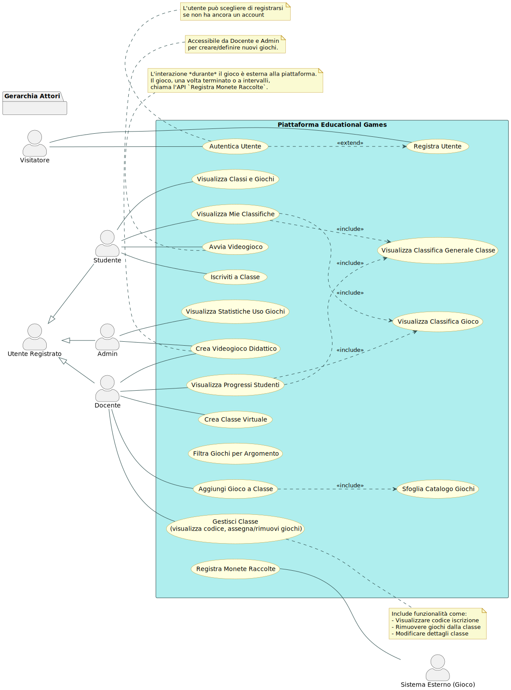
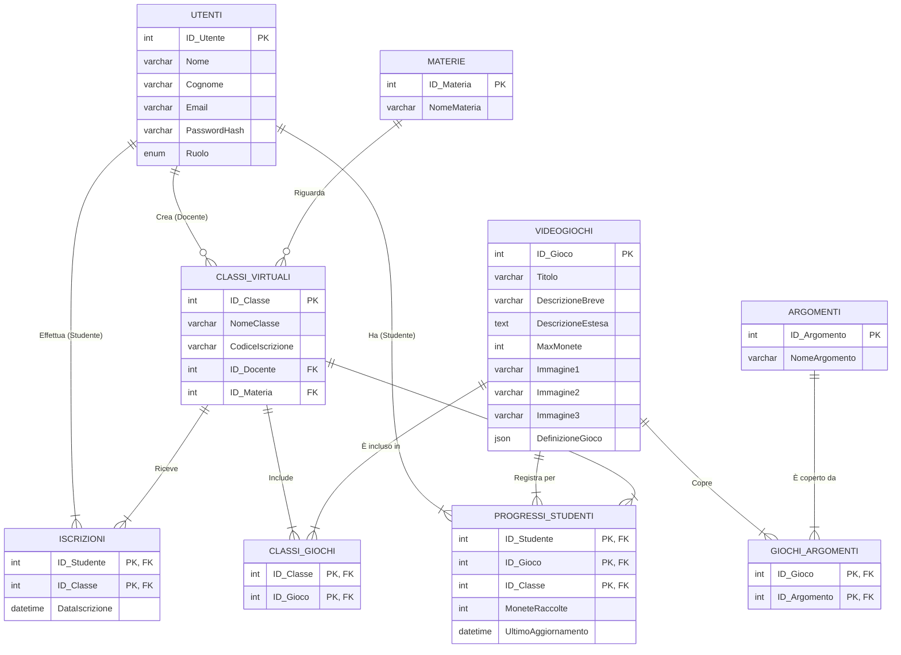
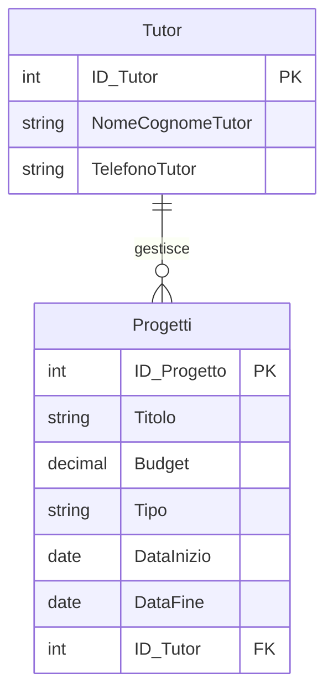

# Traccia "Educational Games"

- [Traccia "Educational Games"](#traccia-educational-games)
  - [Prima parte](#prima-parte)
    - [Punto 1: Analisi della Realtà di Riferimento, Requisiti, Schema Concettuale](#punto-1-analisi-della-realtà-di-riferimento-requisiti-schema-concettuale)
    - [Punto 2: Schema Logico Relazionale](#punto-2-schema-logico-relazionale)
    - [Punto 3: Definizione SQL (MariaDB) - Sottoinsieme con Vincoli](#punto-3-definizione-sql-mariadb---sottoinsieme-con-vincoli)
    - [Punto 4: Interrogazioni SQL](#punto-4-interrogazioni-sql)
    - [Punto 5: Progetto di Massima dell'Applicazione Web](#punto-5-progetto-di-massima-dellapplicazione-web)
      - [Architettura software/hardware](#architettura-softwarehardware)
      - [Moduli Principali](#moduli-principali)
      - [Possibili stack implementativi](#possibili-stack-implementativi)
    - [Fase 6: Parte Significativa dell'Applicazione Web (Esempio)](#fase-6-parte-significativa-dellapplicazione-web-esempio)
  - [Seconda parte](#seconda-parte)
    - [Domanda 1: *`In relazione al tema proposto nella prima parte, si sviluppi, in un linguaggio a scelta, una porzione di codice significativa delle pagine web necessarie a presentare la classifica generale degli studenti di una certa classe virtuale, in base alle monete raccolte in tutti i videogiochi di quella classe.`*](#domanda-1-in-relazione-al-tema-proposto-nella-prima-parte-si-sviluppi-in-un-linguaggio-a-scelta-una-porzione-di-codice-significativa-delle-pagine-web-necessarie-a-presentare-la-classifica-generale-degli-studenti-di-una-certa-classe-virtuale-in-base-alle-monete-raccolte-in-tutti-i-videogiochi-di-quella-classe)
    - [Domanda 2: Integrazione Feedback Studenti](#domanda-2-integrazione-feedback-studenti)
    - [Domanda 3: Raggruppamento in SQL (GROUP BY, Funzioni di Aggregazione, HAVING)](#domanda-3-raggruppamento-in-sql-group-by-funzioni-di-aggregazione-having)
    - [Domanda 4: Normalizzazione Tabella "Progetti"](#domanda-4-normalizzazione-tabella-progetti)

## Prima parte

### Punto 1: Analisi della Realtà di Riferimento, Requisiti, Schema Concettuale

Identifichiamo prima i requisiti basandoci sulla traccia, distinguendo tra quelli che definiscono i *dati* da memorizzare (utili per il modello E/R) e quelli che descrivono le *funzionalità* del sistema (utili per i casi d'uso).

**1.1 Requisiti di Dato (Cosa dobbiamo memorizzare?):**

- **RD1:** Dati degli utenti (Docenti e Studenti), inclusi dati per la registrazione/autenticazione.
- **RD2:** Dati delle classi virtuali: nome, materia di pertinenza, docente creatore, codice univoco di iscrizione (link/QR code).
- **RD3:** Dati del catalogo dei videogiochi didattici: titolo, descrizione breve (max 160 caratteri), descrizione estesa, numero massimo di monete virtuali ottenibili, fino a tre immagini associate, argomenti di classificazione.
- **RD4:** Elenco predefinito di argomenti per classificare i giochi.
- **RD5:** Elenco predefinito di materie associate alle classi.
- **RD6:** Associazione tra docenti e classi virtuali create da loro.
- **RD7:** Associazione tra studenti e classi virtuali a cui sono iscritti.
- **RD8:** Associazione tra classi virtuali e videogiochi inclusi in esse dal docente.
- **RD9:** Associazione tra videogiochi e argomenti che li classificano.
- **RD10:** Tracciamento delle monete raccolte da uno studente specifico, per un videogioco specifico, all'interno di una classe specifica.

**1.2 Requisiti Funzionali (Cosa deve fare il sistema?):**

- **RF1:** Permettere la registrazione di nuovi utenti (Docenti e Studenti).
- **RF2:** Permettere l'autenticazione degli utenti registrati.
- **RF3:** Permettere ai docenti di creare classi virtuali, specificando nome e materia.
- **RF4:** Generare e fornire un codice di iscrizione univoco (e/o link/QR code) per ogni classe virtuale creata.
- **RF5:** Permettere ai docenti di sfogliare il catalogo dei videogiochi didattici.
- **RF6:** Permettere ai docenti di filtrare/cercare i giochi per argomento. (Implicito da RD3/RD4, utile per query 4a)
- **RF7:** Permettere ai docenti di aggiungere uno o più videogiochi alle proprie classi virtuali.
- **RF8:** Permettere agli studenti di iscriversi a una classe virtuale usando il codice di iscrizione.
- **RF9:** Mostrare agli studenti iscritti i videogiochi associati a ciascuna delle loro classi.
- **RF10:** Registrare le monete ottenute da uno studente mentre gioca a un videogioco specifico nel contesto di una classe. (L'interfaccia di gioco è esterna, ma la piattaforma deve ricevere e salvare questo dato).
- **RF11:** Calcolare e visualizzare la classifica degli studenti per un singolo gioco all'interno di una classe, basata sulle monete raccolte.
- **RF12:** Calcolare e visualizzare la classifica generale degli studenti per una classe, sommando le monete di tutti i giochi in quella classe.
- **RF13:** Permettere ai docenti di monitorare l'andamento (monete raccolte) degli studenti nelle loro classi.
- **RF14:** Visualizzare l'elenco dei giochi per un argomento specifico. (Query 4a)
- **RF15:** Visualizzare la classifica degli studenti per un gioco in una classe. (Query 4b)
- **RF16:** Calcolare e visualizzare quante classi utilizzano ciascun videogioco. (Query 4c)

**1.3 Ipotesi di Lavoro (e Aggiuntive):**

- **Utenti:** Si assume un'unica entità per gli utenti (Docenti e Studenti) con un attributo `Ruolo` per distinguerli. Ogni utente ha credenziali univoche (es. email) e una password (memorizzata in modo sicuro, es. hash).
- **Materie e Argomenti:** Si ipotizza che `Materia` e `Argomento` siano entità separate con un proprio ID e nome, per garantire consistenza e permettere future gestioni (es. aggiunta/rimozione centralizzata).
- **Codice Iscrizione:** Sarà un codice alfanumerico univoco a livello globale per identificare l'invito a una classe. La generazione di link/QR code è una funzionalità dell'interfaccia basata su questo codice.
- **Immagini Gioco:** Memorizzeremo i percorsi (path o URL) delle immagini, non i file binari direttamente nel database. Ipotizziamo 3 campi distinti per i path delle immagini (`Immagine1`, `Immagine2`, `Immagine3`), che possono essere `NULL`.
- **Monete Raccolte:** Il numero di monete è specifico per la *combinazione* `Studente` - `Videogioco` - `ClasseVirtuale`. Uno studente potrebbe giocare lo stesso gioco in classi diverse (se assegnato) con progressi separati. Il valore massimo di monete è una proprietà del gioco, mentre quelle raccolte sono del progresso dello studente.
- **Requisiti di Unicità:**
    - Email utente: Univoca.
    - Nome Classe: Univoco *per Docente*. Una coppia (ID_Docente, NomeClasse) deve essere unica.
    - Titolo Videogioco: Univoco.
    - Nome Materia: Univoco.
    - Nome Argomento: Univoco.
    - Codice Iscrizione Classe: Univoco.
- **Relazioni M:N:** Le relazioni M:N (Studente-Classe, Classe-Gioco, Gioco-Argomento) saranno implementate con tabelle associative.
- **Integrità Referenziale:** Verranno usati vincoli di chiave esterna per garantire la coerenza tra le tabelle collegate. Si ipotizzano politiche `RESTRICT` o `NO ACTION` per `ON DELETE` / `ON UPDATE` come default sicuro, a meno che non sia logico propagare le modifiche (es. `CASCADE` se si cancella un utente, forse si cancellano le classi che ha creato? O si impedisce la cancellazione se ha classi? Ipotizziamo `RESTRICT` per sicurezza).

**1.4 Diagrammi dei Casi d'Uso (Use Case):**

Mostriamo l'interazione degli attori (Docente, Studente) con le funzionalità principali (derivate da RF).

- **Attori:**

    - Docente
    - Studente
    - Admin
- **Sistema:** Piattaforma Educational Games

- **Casi d'Uso Principali:**

    - `Registra Utente` (accessibile a tutti, ma porta a ruoli diversi)
    - `Autentica Utente` (accessibile a tutti)
    - **(Docente)** `Crea Classe Virtuale`
    - **(Docente)** `Gestisci Classe` (include: visualizza codice, aggiungi/rimuovi giochi)
    - **(Docente)** `Aggiungi Gioco a Classe` (potrebbe includere `Sfoglia Catalogo Giochi`)
    - **(Docente)** `Visualizza Progressi Studenti` (include `Visualizza Classifica Gioco` e `Visualizza Classifica Generale`)
    - **(Studente)** `Iscriviti a Classe` (usa codice)
    - **(Studente)** `Visualizza Classi e Giochi`
    - **(Studente)** `Avvia Videogioco` (l'interazione *durante* il gioco è esterna al backend, ma l'avvio parte da qui)
    - **(Sistema -> Sistema)** `Registra Monete Raccolte` (API chiamata dal gioco per registrare il progresso delle monete raccolte)
    - **(Studente)** `Visualizza Mie Classifiche`
    - **(Studente/Docente)** `Sfoglia Catalogo Giochi` (potrebbe essere accessibile anche prima del login o con permessi diversi)
    - **(Studente/Docente)** `Filtra Giochi per Argomento`
- **Casi d'Uso Aggiuntivi (non previsti dalla traccia, ma utili al prototipo)**
    - **(Docente/Admin)** `Crea videogioco` (crea l'oggetto che contiene i metadati e il JSON che definisce il videogioco)



Il diagramma dei casi d'uso è stato ottenuto con il seguente codice per [PlantUML](https://www.plantuml.com/plantuml)

```text
@startuml
' Impostazione della direzione del diagramma e dello stile
!pragma useVerticalIf on
allowmixing

left to right direction
skinparam actorStyle awesome
skinparam usecase {
    BackgroundColor LightYellow
    BorderColor DarkGoldenRod
    ArrowColor DarkSlateGray
    ActorBorderColor black
    ActorFontColor black
    ActorBackgroundColor MintCream
}
skinparam rectangle {
    BorderColor DarkSlateGray
    BackgroundColor PaleTurquoise
}
skinparam note {
    BackgroundColor LightGoldenRodYellow
    BorderColor DarkGoldenRod
}

' Definizione degli Attori come normali attori senza relazioni ancora
actor Visitatore
actor "Utente Registrato" as UtenteRegistrato
actor Docente
actor Studente
actor Admin
actor "Sistema Esterno (Gioco)" as SistemaEsternoGioco

' Contenitore del Sistema
rectangle "Piattaforma Educational Games" as PEG {

    ' Casi d'Uso per Visitatore
    usecase "Registra Utente" as UC_RegistraUtente
    usecase "Autentica Utente" as UC_AutenticaUtente

    ' Casi d'uso del Docente e Admin
    usecase "Sfoglia Catalogo Giochi" as UC_SfogliaCatalogo
    usecase "Filtra Giochi per Argomento" as UC_FiltraGiochi

    ' Casi d'uso del Docente
    usecase "Crea Classe Virtuale" as UC_CreaClasse
    usecase "Gestisci Classe\n(visualizza codice, assegna/rimuovi giochi)" as UC_GestisciClasse
    usecase "Aggiungi Gioco a Classe" as UC_AggiungiGiocoClasse
    usecase "Visualizza Progressi Studenti" as UC_VisProgressiStudenti
    usecase "Crea Videogioco Didattico" as UC_CreaVideogiocoDocenteAdmin

    ' Casi d'uso dello Studente
    usecase "Iscriviti a Classe" as UC_IscrivitiClasse
    usecase "Visualizza Classi e Giochi" as UC_VisClassiGiochi
    usecase "Avvia Videogioco" as UC_AvviaVideogioco
    usecase "Visualizza Mie Classifiche" as UC_VisMieClassifiche

    ' Caso d'Uso del Sistema Esterno
    usecase "Registra Monete Raccolte" as UC_RegistraMonete

    ' Sotto-casi d'uso / componenti per classifiche (RF11, RF12, RF15)
    usecase "Visualizza Classifica Gioco" as UC_VisClassificaGioco
    usecase "Visualizza Classifica Generale Classe" as UC_VisClassificaGenerale

    ' Caso d'Uso dell'Admin (da RF16 e aggiuntivo)
    usecase "Visualizza Statistiche Uso Giochi" as UC_StatisticheUsoGiochi
}

' Definire la gerarchia con un pacchetto separato per chiarezza
package "Gerarchia Attori" {
  UtenteRegistrato <|-- Docente
  UtenteRegistrato <|-- Studente
  UtenteRegistrato <|-- Admin
}

' Connessioni del Visitatore (non autenticato)
Visitatore -- UC_RegistraUtente
Visitatore -- UC_AutenticaUtente

' L'Utente Registrato base non ha casi d'uso specifici
' ma serve come generalizzazione per altri ruoli

' Connessioni del Docente - specifiche per questo ruolo
Docente -- UC_CreaClasse
Docente -- UC_GestisciClasse
Docente -- UC_AggiungiGiocoClasse
Docente -- UC_VisProgressiStudenti
Docente -- UC_CreaVideogiocoDocenteAdmin

' Connessioni dello Studente - specifiche per questo ruolo
Studente -- UC_IscrivitiClasse
Studente -- UC_VisClassiGiochi
Studente -- UC_AvviaVideogioco
Studente -- UC_VisMieClassifiche

' Connessioni dell'Admin - specifiche per questo ruolo
Admin -- UC_CreaVideogiocoDocenteAdmin
Admin -- UC_StatisticheUsoGiochi

' Connessioni del Sistema Esterno (Gioco) - posizionato a destra
UC_RegistraMonete -- SistemaEsternoGioco

' Include relazionali (NON per autenticazione)
UC_AggiungiGiocoClasse ..> UC_SfogliaCatalogo : <<include>>

UC_VisProgressiStudenti ..> UC_VisClassificaGioco : <<include>>
UC_VisProgressiStudenti ..> UC_VisClassificaGenerale : <<include>>

UC_VisMieClassifiche ..> UC_VisClassificaGioco : <<include>>
UC_VisMieClassifiche ..> UC_VisClassificaGenerale : <<include>>

' Note esplicative
note bottom of UC_AvviaVideogioco
  L'interazione *durante* il gioco è esterna alla piattaforma.
  Il gioco, una volta terminato o a intervalli,
  chiama l'API `Registra Monete Raccolte`.
end note

note right of UC_GestisciClasse
  Include funzionalità come:
  - Visualizzare codice iscrizione
  - Rimuovere giochi dalla classe
  - Modificare dettagli classe
end note

note top of UC_CreaVideogiocoDocenteAdmin
  Accessibile da Docente e Admin
  per creare/definire nuovi giochi.
end note

' Relazioni tra casi d'uso per flusso di autenticazione
UC_AutenticaUtente ..> UC_RegistraUtente : <<extend>>
note bottom of UC_AutenticaUtente
  L'utente può scegliere di registrarsi
  se non ha ancora un account
end note

' Posizionamento esplicito (in ordine da sx a dx)
Visitatore -[hidden]right-> UtenteRegistrato
UtenteRegistrato -[hidden]right-> PEG
PEG -[hidden]right-> SistemaEsternoGioco
@enduml
```

**1.5 Progettazione Concettuale (Modello E/R):**

- Modello E/R iniziale

    Basandoci sui requisiti di dato (RD) e le ipotesi, definiamo le entità e le associazioni.

    - **Entità:**
        - `UTENTE` (ID_Utente PK, Nome, Cognome, Email UNIQUE, PasswordHash, Ruolo ENUM('Docente', 'Studente'))
        - `MATERIA` (ID_Materia PK, NomeMateria UNIQUE)
        - `ARGOMENTO` (ID_Argomento PK, NomeArgomento UNIQUE)
        - `VIDEOGIOCO` (ID_Gioco PK, Titolo UNIQUE, DescrizioneBreve, DescrizioneEstesa, MaxMonete, Immagine1, Immagine2, Immagine3, DefinizioneGioco)
        - `CLASSE_VIRTUALE` (ID_Classe PK, NomeClasse, CodiceIscrizione UNIQUE, ID_Docente FK -> UTENTE, ID_Materia FK -> MATERIA) - Vincolo UNIQUE su (ID_Docente, NomeClasse)
    - **Associazioni (molti a molti M:N):**
        - `ISCRIZIONE` (Studente si iscrive a Classe - M:N): (ID_Studente FK -> UTENTE, ID_Classe FK -> CLASSE_VIRTUALE) - PK composita (ID_Studente, ID_Classe)
        - `CLASSE_GIOCO` (Classe include Gioco - M:N): (ID_Classe FK -> CLASSE_VIRTUALE, ID_Gioco FK -> VIDEOGIOCO) - PK composita (ID_Classe, ID_Gioco)
        - `GIOCO_ARGOMENTO` (Gioco appartiene a Argomento - M:N): (ID_Gioco FK -> VIDEOGIOCO, ID_Argomento FK -> ARGOMENTO) - PK composita (ID_Gioco, ID_Argomento)
        - `PROGRESSO_STUDENTE` (Tracciamento monete - relazione ternaria Studente-Gioco-Classe): (ID_Studente FK -> UTENTE, ID_Gioco FK -> VIDEOGIOCO, ID_Classe FK -> CLASSE_VIRTUALE, MoneteRaccolte INT >= 0 DEFAULT 0) - PK composita (ID_Studente, ID_Gioco, ID_Classe)

    ```mermaid
    erDiagram
    UTENTE {
        int ID_Utente "PK"
        string Nome
        string Cognome
        string Email
        string PasswordHash
        string Ruolo
        %% ENUM in SQL
    }
    MATERIA {
        int ID_Materia "PK"
        string NomeMateria
    }
    ARGOMENTO {
        int ID_Argomento "PK"
        string NomeArgomento
    }
    VIDEOGIOCO {
        int ID_Gioco "PK"
        string Titolo
        string DescrizioneBreve
        string DescrizioneEstesa
        %% TEXT in SQL
        int MaxMonete
        string Immagine1
        string Immagine2
        string Immagine3
        string DefinizioneGioco
        %% JSON in SQL
    }
    CLASSE_VIRTUALE {
        int ID_Classe "PK"
        string NomeClasse
        string CodiceIscrizione
        %% ID_Docente e ID_Materia sono rappresentati dalle relazioni
    }

    %% Entità Associative per relazioni M:N e Ternaria
    ISCRIZIONE {
        int ID_Studente "PK"
        int ID_Classe "PK"
        %% timestamp DataIscrizione omesso per semplicità E/R
    }
    CLASSE_GIOCO {
        int ID_Classe "PK"
        int ID_Gioco "PK"
    }
    GIOCO_ARGOMENTO {
        int ID_Gioco "PK"
        int ID_Argomento "PK"
    }
    PROGRESSO_STUDENTE {
        int ID_Studente "PK"
        int ID_Gioco "PK"
        int ID_Classe "PK"
        int MoneteRaccolte
        %% timestamp UltimoAggiornamento omesso per semplicità E/R
    }

    %% Relazioni 1:N dirette
    UTENTE ||--o{ CLASSE_VIRTUALE : "Insegna (Docente)"
    %% Un docente insegna 0 o più classi
    MATERIA ||--o{ CLASSE_VIRTUALE : "Tratta"
    %% Una materia è trattata in 0 o più classi

    %% Relazioni M:N rappresentate tramite Entità Associative
    UTENTE }o--|| ISCRIZIONE : "Effettua (Studente)"
    %% Uno studente effettua 0 o più iscrizioni
    CLASSE_VIRTUALE }o--|| ISCRIZIONE : "Riceve"
    %% Una classe riceve 0 o più iscrizioni

    CLASSE_VIRTUALE }o--|| CLASSE_GIOCO : "Include"
    %% Una classe include 0 o più giochi
    VIDEOGIOCO }o--|| CLASSE_GIOCO : "È incluso in"
    %% Un gioco è incluso in 0 o più classi

    VIDEOGIOCO }o--|| GIOCO_ARGOMENTO : "Copre"
    %% Un gioco copre 0 o più argomenti
    ARGOMENTO }o--|| GIOCO_ARGOMENTO : "È coperto da"
    %% Un argomento è coperto da 0 o più giochi

    %% Relazione Ternaria rappresentata tramite Entità Associativa
    UTENTE }o--|| PROGRESSO_STUDENTE : "Ha (Studente)"
    %% Uno studente ha 0 o più progressi
    VIDEOGIOCO }o--|| PROGRESSO_STUDENTE : "Registra per"
    %% Un gioco registra 0 o più progressi
    CLASSE_VIRTUALE }o--|| PROGRESSO_STUDENTE : "Registra in"
    %% Una classe registra 0 o più progressi
    ```

    *Nota sull'E/R Diagram:* Un diagramma grafico mostrerebbe queste entità come rettangoli, attributi come ovali (con PK sottolineato), e relazioni come rombi collegati alle entità con linee indicanti le cardinalità (1:N, M:N). Le tabelle associative sopra derivano direttamente dalla risoluzione delle relazioni M:N e della relazione ternaria nel modello logico.

- Raffinamento del modello concettuale (Modello E/R raffinato)

  - **Gestione caricamento videogiochi:**

      L'entità `VIDEOGIOCHI` non dovrebbe contenere solo metadati, ma anche un descrittore del videogioco, in modo che la piattaforma possa effettivamente erogare i videogiochi. Per Semplicità si assume che ciascun videogioco sia costituito da un quiz a risposta multipla, definito mediante un oggetto json. L'ipotesi di considerare i **quiz a risposta multipla definiti tramite un oggetto JSON** risulta molto pratica e adatta al contesto, per i seguenti motivi:

      1. **Flessibilità:** JSON permette di definire strutture dati anche complesse (domande, risposte multiple, indicazione della risposta corretta, risorse associate come link o immagini, punteggi parziali, ecc.) in modo leggibile e standard.
      2. **Creazione da Parte del Docente/Admin:** Si può immaginare un'interfaccia web all'interno della piattaforma (probabilmente accessibile ai Docenti o agli Admin) che guidi l'utente nella creazione del quiz (inserimento domande, risposte, ecc.) e che, al salvataggio, **generi questo oggetto JSON**.
      3. **Memorizzazione:** Questo JSON, che descrive l'intero gioco/quiz, deve essere salvato nel database.
      4. **Esecuzione Lato Client:** Una pagina web dedicata al gioco (accessibile dallo studente) può, tramite JavaScript:
          - **Scaricare** l'oggetto JSON relativo a quel gioco specifico dal backend.
          - **Interpretare** la struttura JSON.
          - **Renderizzare dinamicamente** l'interfaccia del quiz (mostrare una domanda alla volta, le opzioni di risposta, eventuali immagini/video associati).
          - **Gestire l'interazione** dello studente (selezione delle risposte).
          - **Verificare** le risposte confrontandole con quelle corrette definite nel JSON.
          - **Calcolare un punteggio** (es. percentuale di risposte corrette).
          - **Tradurre il punteggio in "Monete Raccolte"**, magari in proporzione al `MaxMonete` definito nei metadati del gioco.
          - **Inviare il risultato** (le `MoneteRaccolte`) al backend per la registrazione nella tabella `PROGRESSI_STUDENTI`.

      5. **Workflow Dettagliato relativo a questa ipotesi aggiuntiva (videogiochi creati a partire da un oggetto json):**

         1. **Creazione Gioco (Docente/Admin):**
             - Usa un'interfaccia web dedicata sulla piattaforma.
             - Inserisce metadati (Titolo, Descrizione, MaxMonete...).
             - Usa un editor visuale o form per definire le domande, le risposte (segnando quella corretta), le risorse (URL immagini/video).
             - Al salvataggio, il backend:
                 - Genera la stringa JSON che rappresenta la struttura del quiz.
                 - Salva i metadati e la stringa JSON nella tabella `VIDEOGIOCHI`.
         2. **Selezione Gioco (Studente):**
             - Lo studente vede l'elenco dei giochi assegnati alla classe (es. link con Titolo e DescrizioneBreve).
         3. **Avvio Gioco (Studente):**
             - Clicca sul link del gioco.
             - Viene caricata una pagina "player" generica nel frontend.
             - Il JavaScript di questa pagina esegue una `Workspace` a un endpoint API (es. `GET /api/giochi/{ID_Gioco}/play`), passando l'ID del gioco (e magari l'ID della classe per contesto).
         4. **Recupero Dati Gioco (Backend):**
             - L'endpoint API recupera dalla tabella `VIDEOGIOCHI` sia i metadati sia il contenuto della colonna `DefinizioneGioco` per l'ID richiesto.
             - Restituisce questi dati (probabilmente come un unico oggetto JSON) al frontend.
         5. **Rendering ed Esecuzione (Frontend JS):**
             - Il JavaScript nella pagina player riceve i dati.
             - Legge la `DefinizioneGioco` JSON.
             - Costruisce dinamicamente l'HTML per visualizzare la prima domanda, le opzioni di risposta, i link alle risorse, ecc.
             - Gestisce la navigazione tra le domande (se multi-domanda).
             - Registra le risposte dell'utente.
         6. **Valutazione e Invio Punteggio (Frontend JS):**
             - Al termine del quiz (o man mano), il JS confronta le risposte date con quelle corrette nel JSON.
             - Calcola la percentuale di successo.
             - Determina le `MoneteRaccolte` (es. `percentuale * MaxMonete / 100`).
             - Esegue una `Workspace` all'endpoint API per salvare il progresso (es. `POST /api/progressi`), inviando `{ ID_Studente, ID_Gioco, ID_Classe, MoneteRaccolte }`.
         7. **Salvataggio Progresso (Backend):**
             - L'endpoint API riceve i dati del progresso.
             - Li valida (es. l'utente è iscritto a quella classe? Il gioco è assegnato? Le monete non superano `MaxMonete`?).
             - Salva o aggiorna il record nella tabella `PROGRESSI_STUDENTI`.

         Questo approccio sposta la logica di *esecuzione* del gioco/quiz sul frontend (JavaScript), rendendolo molto flessibile, mentre il backend si occupa di orchestrare, memorizzare le definizioni e registrare i risultati. La tua intuizione di usare JSON è quindi un'ottima strada per implementare la funzionalità mancante.

  Qui si riporta il diagramma E/R ristrutturato.

### Punto 2: Schema Logico Relazionale

Traduciamo il modello E/R in uno schema relazionale (praticamente già delineato sopra):

1. `UTENTI` (<u>ID_Utente</u>, Nome, Cognome, Email UK, PasswordHash, Ruolo ENUM('Docente', 'Studente', 'Admin'))
2. `MATERIE` (<u>ID_Materia</u>, NomeMateria UK)
3. `ARGOMENTI` (<u>ID_Argomento</u>, NomeArgomento UK)
4. `VIDEOGIOCHI` (<u>ID_Gioco</u>, Titolo UK, DescrizioneBreve, DescrizioneEstesa, MaxMonete, Immagine1, Immagine2, Immagine3, DefinizioneGioco)
5. `CLASSI_VIRTUALI` (<u>ID_Classe</u>, NomeClasse, CodiceIscrizione UK, *ID_Docente* FK -> Utenti.ID_utente, *ID_Materia* FK -> Materia.ID_Materia, UK (ID_Docente, NomeClasse))
6. `ISCRIZIONI` (<u>*ID_Studente*</u> PK, FK -> Utenti.ID_Utente , <u>*ID_Classe*</u> PK, FK -> Classi_Virtuali.ID_classe, DataIscrizione) - *Nota: Assumiamo CASCADE qui: se studente o classe vengono rimossi, l'iscrizione non ha più senso.*
7. `CLASSI_GIOCHI` (<u>*ID_Classe*</u> PK, FK -> Classi_Virtuali.ID_classe, <u>*ID_Gioco*</u> PK, FK -> Videogiochi.ID_Gioco) - *Nota: Assumiamo CASCADE qui: se la classe o il gioco vengono rimossi, l'associazione non ha senso.*
8. `GIOCHI_ARGOMENTI` (<u>*ID_Gioco*</u> PK, FK -> Videogiochi.ID_Gioco, <u>*ID_Argomento*</u> PK, FK -> Argomenti.ID_Argomento) - *Nota: CASCADE: se gioco o argomento spariscono, la classificazione sparisce.*
9. `PROGRESSI_STUDENTI` (<u>*ID_Studente*</u> PK, FK -> Utenti.ID_Utente, <u>*ID_Gioco*</u> PK, FK -> Videogioghi.ID_Gioco, <u>*ID_Classe*</u> PK, FK -> Classi_Virtuali.ID_Classe, MoneteRaccolte, UltimoAggiornamento) - *Nota: CASCADE qui. Il check su MoneteRaccolte >= 0 è un vincolo di dominio.*

Lo schema logico si può rappresentare anche in forma grafica, come mostrato di seguito:



### Punto 3: Definizione SQL (MariaDB) - Sottoinsieme con Vincoli

Creiamo le tabelle del database in SQL. Le stesse tabelle potrebbero essere create anche a partire da una migrazione del modello dei dati dal codice applicativo (usando EF Core).

```sql

-- creazione del database

CREATE DATABASE IF NOT EXISTS educational_games;
USE educational_games;

-- --- TABELLE PRINCIPALI ---

-- Tabella Utenti (Docenti e Studenti)
CREATE TABLE UTENTI (
    ID_Utente INT AUTO_INCREMENT PRIMARY KEY,
    Nome VARCHAR(50) NOT NULL,
    Cognome VARCHAR(50) NOT NULL,
    Email VARCHAR(100) NOT NULL UNIQUE,
    PasswordHash VARCHAR(255) NOT NULL COMMENT 'Contiene l hash sicuro della password',
    Ruolo ENUM('Docente', 'Studente', 'Admin') NOT NULL COMMENT 'Ruolo dell utente nella piattaforma'
    -- L ENGINE, CHARSET e COLLATE useranno i default del database/server MariaDB
);

-- Tabella UTENTI nel prototipo (per testare il login, cambio password, ecc.)
    /* CREATE TABLE UTENTI (
        -- Colonne esistenti
        ID_Utente INT AUTO_INCREMENT PRIMARY KEY,
        Nome VARCHAR(50) NOT NULL,
        Cognome VARCHAR(50) NOT NULL,
        Email VARCHAR(100) NOT NULL UNIQUE,
        PasswordHash VARCHAR(255) NOT NULL COMMENT 'Contiene l hash sicuro della password',
        Ruolo ENUM('Admin', 'Docente', 'Studente') NOT NULL COMMENT 'Ruolo dell utente nella piattaforma', -- Assicurati che l'ordine corrisponda all'enum C#

    -- Nuove colonne per verifica email
    EmailVerificata BOOLEAN NOT NULL DEFAULT FALSE COMMENT 'Indica se l email è stata verificata',
    TokenVerificaEmail VARCHAR(100) NULL DEFAULT NULL COMMENT 'Token inviato per la verifica email',
    ScadenzaTokenVerificaEmail DATETIME NULL DEFAULT NULL COMMENT 'Scadenza del token di verifica email (UTC)',

    -- Nuove colonne per reset password
    TokenResetPassword VARCHAR(100) NULL DEFAULT NULL COMMENT 'Token inviato per il reset password',
    ScadenzaTokenResetPassword DATETIME NULL DEFAULT NULL COMMENT 'Scadenza del token di reset password (UTC)'

    -- L ENGINE, CHARSET e COLLATE useranno i default del database/server MariaDB/MySQL
    ) COMMENT 'Tabella degli utenti della piattaforma';

    -- Indici aggiuntivi (consigliati per performance)
    -- Indice sul token di verifica per velocizzare la ricerca
    CREATE INDEX IX_UTENTI_TokenVerificaEmail ON UTENTI (TokenVerificaEmail);
    -- Indice sul token di reset per velocizzare la ricerca
    CREATE INDEX IX_UTENTI_TokenResetPassword ON UTENTI (TokenResetPassword); */
    --

-- Tabella Materie
CREATE TABLE MATERIE (
    ID_Materia INT AUTO_INCREMENT PRIMARY KEY,
    NomeMateria VARCHAR(50) NOT NULL UNIQUE COMMENT 'Nome univoco della materia'
);

-- Tabella Argomenti per i videogiochi
CREATE TABLE ARGOMENTI (
    ID_Argomento INT AUTO_INCREMENT PRIMARY KEY,
    NomeArgomento VARCHAR(100) NOT NULL UNIQUE COMMENT 'Nome univoco dell argomento'
);

-- Tabella Videogiochi didattici
CREATE TABLE VIDEOGIOCHI (
    ID_Gioco INT AUTO_INCREMENT PRIMARY KEY,
    Titolo VARCHAR(100) NOT NULL UNIQUE COMMENT 'Titolo univoco del videogioco',
    DescrizioneBreve VARCHAR(160) COMMENT 'Descrizione breve (max 160 caratteri)',
    DescrizioneEstesa TEXT COMMENT 'Descrizione dettagliata del gioco',
    MaxMonete INT UNSIGNED NOT NULL DEFAULT 0 COMMENT 'Massimo numero di monete ottenibili nel gioco',
    Immagine1 VARCHAR(255) COMMENT 'URL o path della prima immagine',
    Immagine2 VARCHAR(255) COMMENT 'URL o path della seconda immagine',
    Immagine3 VARCHAR(255) COMMENT 'URL o path della terza immagine',
     -- COLONNA PER LA DEFINIZIONE DEL GIOCO/QUIZ --
    -- Usiamo il tipo JSON per MariaDB (consigliato per validazione e query)
    -- Altrimenti per MySQL, usiamo TEXT (più generico).
    -- https://mariadb.com/kb/en/json/
    DefinizioneGioco JSON NULL COMMENT 'Struttura JSON che definisce il contenuto/regole del gioco (es. quiz)'
    -- DefinizioneGioco TEXT NULL COMMENT 'Alternativa se il tipo JSON non è disponibile/voluto'

);

-- Tabella Classi Virtuali create dai docenti
CREATE TABLE CLASSI_VIRTUALI (
    ID_Classe INT AUTO_INCREMENT PRIMARY KEY,
    NomeClasse VARCHAR(50) NOT NULL COMMENT 'Nome della classe virtuale',
    CodiceIscrizione VARCHAR(20) NOT NULL UNIQUE COMMENT 'Codice univoco per l iscrizione degli studenti',
    ID_Docente INT NOT NULL COMMENT 'FK Riferimento al docente che ha creato la classe',
    ID_Materia INT NOT NULL COMMENT 'FK Riferimento alla materia della classe',

    -- Vincolo di integrità referenziale verso il docente creatore
    FOREIGN KEY (ID_Docente) REFERENCES UTENTI (ID_Utente) 
        ON DELETE RESTRICT -- Non permette di cancellare un docente se ha creato classi
        ON UPDATE CASCADE, -- Se l'ID del docente cambia (improbabile), aggiorna la FK

    -- Vincolo di integrità referenziale verso la materia
    FOREIGN KEY (ID_Materia) REFERENCES MATERIE (ID_Materia) 
        ON DELETE RESTRICT -- Non permette di cancellare una materia se usata in una classe
        ON UPDATE CASCADE,

    -- Vincolo di unicità: un docente non può avere due classi con lo stesso nome
    UNIQUE KEY (ID_Docente, NomeClasse) 
);

-- --- TABELLE ASSOCIATIVE (Molti-a-Molti e Progressi) ---

-- Tabella Iscrizioni (collega Studenti a Classi Virtuali - M:N)
CREATE TABLE ISCRIZIONI (
    ID_Studente INT NOT NULL COMMENT 'FK Riferimento allo studente iscritto (Utente con Ruolo=Studente)',
    ID_Classe INT NOT NULL COMMENT 'FK Riferimento alla classe a cui è iscritto',
    DataIscrizione DATETIME DEFAULT CURRENT_TIMESTAMP COMMENT 'Data e ora di iscrizione (ora locale del server)',
    PRIMARY KEY (ID_Studente, ID_Classe),
    FOREIGN KEY (ID_Studente) REFERENCES UTENTI (ID_Utente) ON DELETE CASCADE ON UPDATE CASCADE,
    FOREIGN KEY (ID_Classe) REFERENCES CLASSI_VIRTUALI (ID_Classe) ON DELETE CASCADE ON UPDATE CASCADE
);

-- Tabella ClassiGiochi (collega Classi Virtuali a Videogiochi - M:N)
-- Rappresenta quali giochi sono stati assegnati a quali classi
CREATE TABLE CLASSI_GIOCHI (
    ID_Classe INT NOT NULL COMMENT 'FK Riferimento alla classe virtuale',
    ID_Gioco INT NOT NULL COMMENT 'FK Riferimento al videogioco assegnato',

    -- Chiave primaria composta
    PRIMARY KEY (ID_Classe, ID_Gioco),

    -- Vincoli di integrità referenziale
    FOREIGN KEY (ID_Classe) REFERENCES CLASSI_VIRTUALI(ID_Classe)
    ON DELETE CASCADE   -- Se la classe viene cancellata, rimuovi le associazioni ai giochi
    ON UPDATE CASCADE,
    FOREIGN KEY (ID_Gioco) REFERENCES VIDEOGIOCHI(ID_Gioco)
    ON DELETE CASCADE   -- Se il gioco viene cancellato, rimuovilo dalle classi
    ON UPDATE CASCADE
);

-- Tabella GiochiArgomenti (collega Videogiochi a Argomenti - M:N)
CREATE TABLE GIOCHI_ARGOMENTI (
    ID_Gioco INT NOT NULL COMMENT 'FK Riferimento al videogioco',
    ID_Argomento INT NOT NULL COMMENT 'FK Riferimento all argomento associato',
    -- Chiave primaria composta
    PRIMARY KEY (ID_Gioco, ID_Argomento),
    -- Vincoli di integrità referenziale
    FOREIGN KEY (ID_Gioco) REFERENCES VIDEOGIOCHI(ID_Gioco)
    ON DELETE CASCADE   -- Se il gioco viene cancellato, rimuovi le sue classificazioni per argomento
    ON UPDATE CASCADE,
    FOREIGN KEY (ID_Argomento) REFERENCES ARGOMENTI(ID_Argomento)
    ON DELETE CASCADE   -- Se l'argomento viene cancellato, rimuovi le classificazioni relative
    ON UPDATE CASCADE
);

-- Tabella Progressi Studenti (traccia le monete raccolte da uno studente per un gioco in una classe)
CREATE TABLE PROGRESSI_STUDENTI (
    ID_Studente INT NOT NULL COMMENT 'FK Riferimento allo studente (Utente con Ruolo=Studente)',
    ID_Gioco INT NOT NULL COMMENT 'FK Riferimento al videogioco giocato',
    ID_Classe INT NOT NULL COMMENT 'FK Riferimento alla classe in cui il gioco è stato giocato',
    MoneteRaccolte INT UNSIGNED NOT NULL DEFAULT 0 COMMENT 'Numero di monete raccolte (non può essere negativo)',
    UltimoAggiornamento DATETIME DEFAULT CURRENT_TIMESTAMP ON UPDATE CURRENT_TIMESTAMP COMMENT 'Data e ora dell ultimo aggiornamento (ora locale del server)',
    PRIMARY KEY (
        ID_Studente,
        ID_Gioco,
        ID_Classe
    ),
    FOREIGN KEY (ID_Studente) REFERENCES UTENTI (ID_Utente) ON DELETE CASCADE ON UPDATE CASCADE,
    FOREIGN KEY (ID_Gioco) REFERENCES VIDEOGIOCHI (ID_Gioco) ON DELETE CASCADE ON UPDATE CASCADE,
    FOREIGN KEY (ID_Classe) REFERENCES CLASSI_VIRTUALI (ID_Classe) ON DELETE CASCADE ON UPDATE CASCADE
    -- CONSTRAINT chk_monete_non_negative CHECK (MoneteRaccolte >= 0) -- Opzionale
);

-- --- FINE DELLO SCHEMA ---
```

### Punto 4: Interrogazioni SQL

a) **Elenco giochi per argomento (es. 'Legge di Ohm') in ordine alfabetico:**

```sql
SELECT
    V.Titolo,
    V.DescrizioneBreve,
    V.MaxMonete
FROM
    VIDEOGIOCHI AS V
JOIN
    GIOCHI_ARGOMENTI AS GA ON V.ID_Gioco = GA.ID_Gioco
JOIN
    ARGOMENTI AS A ON GA.ID_Argomento = A.ID_Argomento
WHERE
    A.NomeArgomento = 'Legge di Ohm' -- Sostituire con l'argomento desiderato
ORDER BY
    V.Titolo ASC;
```

b) **Classifica studenti per un gioco (es. Gioco ID 5) in una classe (es. Classe ID 10):**

```sql
SELECT
    U.Nome,
    U.Cognome,
    PS.MoneteRaccolte
FROM
    PROGRESSI_STUDENTI AS PS
JOIN
    UTENTI AS U ON PS.ID_Studente = U.ID_Utente
WHERE
    PS.ID_Classe = 10 -- Sostituire con l'ID della classe desiderata
    AND PS.ID_Gioco = 5 -- Sostituire con l'ID del gioco desiderato
    AND U.Ruolo = 'Studente' -- Assicuriamoci siano studenti
ORDER BY
    PS.MoneteRaccolte DESC, -- Ordine decrescente per classifica
    U.Cognome ASC,           -- A parità di monete, ordine alfabetico
    U.Nome ASC;
```

c) **Numero di classi in cui è utilizzato ciascun videogioco:**

```sql
SELECT
    V.Titolo,
    COUNT(DISTINCT CG.ID_Classe) AS NumeroClassiUtilizzo
FROM
    VIDEOGIOCHI AS V
LEFT JOIN -- Usiamo LEFT JOIN per includere anche giochi non usati in nessuna classe (conteggio 0)
    CLASSI_GIOCHI AS CG ON V.ID_Gioco = CG.ID_Gioco
GROUP BY
    V.ID_Gioco, V.Titolo -- Raggruppiamo per gioco
ORDER BY
    NumeroClassiUtilizzo DESC, -- Opzionale: ordina per i più usati
    V.Titolo ASC;
```

### Punto 5: Progetto di Massima dell'Applicazione Web

#### Architettura software/hardware

- Applicazione Web multi-tier
    - **Client-Side (Browser):** HTML per la struttura, CSS (es. Bootstrap) per lo stile, JavaScript (es. Vanilla JS, React, Vue, Angular) per l'interattività, gestione eventi, chiamate API asincrone (Fetch API).
    - **Server-Side (Backend):**
        - Web Server (es. Nginx, Apache) per gestire richieste HTTP.
        - Application Server con un linguaggio/framework (es. ASP.NET Core) per gestire la logica di business, l'autenticazione/autorizzazione, l'interazione col database.
        - API RESTful per permettere la comunicazione tra client e server.
    - **Database:** MariaDB o MySQL.

#### Moduli Principali

- Componenti Funzionali richiesti dalla traccia
    - **Gestione Utenti:** Registrazione, Login, Gestione Profilo, Distinzione Ruoli (Docente/Studente).
    - **Gestione Classi (Docente):** Creazione, Visualizzazione, Generazione Codice Iscrizione, Associazione Giochi.
    - **Gestione Catalogo Giochi:** Visualizzazione, Ricerca/Filtro per Argomento (potrebbe esserci un'area admin per aggiungere giochi/argomenti).
    - **Gestione Iscrizioni (Studente):** Inserimento Codice, Visualizzazione Classi e Giochi.
    - **Interfaccia di Gioco/Progresso:** La traccia non chiede di *creare* i giochi, ma l'applicazione deve poter:
        - Fornire il link/accesso al gioco esterno.
        - Ricevere (probabilmente via API) aggiornamenti sulle monete raccolte dallo studente in quel gioco/classe.
    - **Visualizzazione Classifiche:** Per gioco e generale per classe (sia per studenti che per docenti).
    - **Dashboard Docente:** Riepilogo classi, monitoraggio progressi studenti.
    - **Dashboard Studente:** Riepilogo classi, giochi da svolgere, progressi personali.
- Componenti Funzionali non richiesti dalla traccia (ma molto importanti)
  - **Dashboard Admin:** Riepilogo delle principali risorse della piattaforma (videogiochi, classi virtuali, studenti, docenti, e link a pannelli amministrativi per la gestione dei giochi, degli utenti, delle classi virtuali)
  - **Simulazione della creazione dei giochi (non richiesta dalla traccia, ma utile per la creazione del prototipo**
    - Per la scrittura del prototipo dell'applicazione si può ipotizzare che la creazione del gioco sia fatta semplicemente con il caricamento di un oggetto JSON che contiene la struttura del quiz, con le domande, le possibili risposte e l'indicazione delle risposte corrette.

#### Possibili stack implementativi

Questo richiederebbe la scelta di tecnologie specifiche (es. ASP.NET Core + HTML/JS/Fetch API) e la scrittura di codice sia client che server. Ad esempio:

- **Per un progetto con frontend ti tipo SPA** si potrebbe ipotizzare un'architettura web moderna e disaccoppiata, composta da due applicazioni distinte che comunicano tramite API:

    1. **Backend API (ASP.NET Core Minimal API):**

        - **Tecnologia:** Sviluppata utilizzando ASP.NET Core con il pattern Minimal API. Questo approccio favorisce la creazione di endpoint HTTP leggeri e performanti con una sintassi concisa.
        - **Responsabilità:**
            - Implementazione di tutta la logica di business (creazione classi, gestione iscrizioni, calcolo classifiche, ecc.).
            - Gestione della sicurezza: autenticazione degli utenti (es. tramite token JWT rilasciati al login) e autorizzazione per l'accesso alle diverse funzionalità/dati in base al ruolo (Docente/Studente).
            - Interazione con il database: accesso e manipolazione dei dati nel database MariaDB. Si può utilizzare un ORM come Entity Framework Core (con il provider `Pomelo.EntityFrameworkCore.MySql` per la compatibilità con MariaDB) oppure un micro-ORM come Dapper per mappare i dati tra il database e gli oggetti C#.
            - Esposizione dei dati e delle funzionalità tramite endpoint RESTful ben definiti (es. `POST /api/utenti/registra`, `POST /api/utenti/login`, `GET /api/classi`, `POST /api/classi`, `GET /api/classi/{idClasse}/giochi`, `POST /api/classi/{idClasse}/iscrivi`, `GET /api/classifiche/classe/{idClasse}/gioco/{idGioco}`, `POST /api/progressi`).
        - **CORS (Cross-Origin Resource Sharing):** Essendo un'API separata dal frontend (potenzialmente su domini o porte diverse), sarà necessario configurare le policy CORS nell'applicazione Minimal API per permettere esplicitamente le richieste provenienti dall'origine (dominio/porta) dell'applicazione frontend.
    2. **Frontend Application (Separata):**

        - **Tecnologia (Opzione A - SPA-like con ASP.NET Server):** Un'applicazione ASP.NET Core configurata principalmente per servire file statici. L'applicazione frontend vera e propria risiede nel browser ed è costituita da:
            - `index.html`: Punto di ingresso principale.
            - CSS: Fogli di stile per la presentazione (es. utilizzando framework come Bootstrap o Tailwind CSS, o CSS custom).
            - JavaScript: Logica dell'interfaccia utente, gestione dello stato (semplice o con librerie), routing lato client (usando History API o hash routing per simulare la navigazione tra pagine senza ricaricamenti completi) e comunicazione asincrona (`Fetch` API o librerie come Axios) con il backend Minimal API per recuperare/inviare dati.
        - **Tecnologia (Opzione B - Framework Dedicato):** Un'applicazione sviluppata interamente con un framework/libreria JavaScript moderno come React, Angular, Vue.js, o Svelte, oppure con Blazor WebAssembly.
            - Questi framework offrono un approccio basato su componenti, gestione dello stato avanzata, routing integrato e un ecosistema ricco.
            - Il risultato del processo di build sono file statici (HTML, CSS, JS) che possono essere ospitati su un server web semplice (Nginx, Apache, CDN) o anche tramite un'app ASP.NET Core configurata per servire file statici.
        - **Responsabilità (Comune a Opzione A e B):**
            - Rendering dell'interfaccia utente basata sui dati ricevuti dall'API.
            - Gestione dell'interazione utente.
            - Invio di richieste all'API backend per eseguire azioni (es. login, creazione classe, iscrizione, invio progressi) e recuperare dati.
            - Gestione del token di autenticazione (es. memorizzazione sicura in `localStorage` o `sessionStorage` e invio nell'header `Authorization` delle richieste API).
    3. **Comunicazione e Deployment:**

        - **Comunicazione:** Avviene esclusivamente tramite chiamate HTTP/S tra il Frontend e il Backend API, utilizzando il formato JSON per lo scambio dei dati. L'API definisce il "contratto" che il frontend deve rispettare.
        - **Deployment:** Le due applicazioni sono installate in modo indipendente.
            - Il Backend API può essere ospitato su un server (IIS, Kestrel dietro reverse proxy come Nginx/Apache), in un container Docker, o su piattaforme cloud (es. Azure App Service, AWS Elastic Beanstalk).
            - Il Frontend (specialmente se basato su framework JS o Blazor Wasm) può essere installato come un insieme di file statici su servizi di hosting statico (es. Netlify, Vercel, GitHub Pages, Azure Static Web Apps, AWS S3/CloudFront) o servito da un web server tradizionale o da un'app ASP.NET Core.
        - **Domini/Porte:** Possono risiedere su domini, sottodomini o porte differenti (es. backend su `api.miosito.com` e frontend su `app.miosito.com`, oppure `localhost:7001` per l'API e `localhost:5173` per il frontend durante lo sviluppo), rendendo la configurazione CORS essenziale.

- **Per una soluzione con fronted di tipo Multi Page Application (MPA)** si potrebbe ipotizzare un'architettura web moderna (del tipo **Backend API Separato e Frontend Server Dedicato (BFF - Backend For Frontend)**) nella quale si ha una Minimal API strettamente come backend RESTful (che idealmente usa token JWT per autenticazione stateless), e un'altra applicazione web (es. un'app ASP.NET Core MVC o Razor Pages più tradizionale) che funge da Frontend Server, oppure una soluzione basata su una **Applicazione Unificata (Minimal API serve sia API che Pagine)**. Per lo svolgimento di questo esempio verrà proposta quest'ultima soluzione.

 1. **Applicazione Unificata (Minimal API serve sia API che Pagine):**
    - In questo scenario, l'applicazione ASP.NET Core Minimal API si occupa *sia* di esporre gli endpoint `/api/...` *sia* di servire le pagine HTML/CSS/JS tradizionali.

      1. **Configurazione:** bisogna configurare la Minimal API per servire anche pagine:
          - Servire file statici (HTML/CSS/JS) da una cartella `wwwroot`.
      2. **Autenticazione:** Utilizzare **l'autenticazione basata su Cookie** all'interno della stessa applicazione Minimal API.
          - **Login:** Si crea, ad esempio, un endpoint (es. `POST /account/login`, gestito da Minimal API) che riceve le credenziali, le valida contro il DB (tabella `UTENTI`), e se valide, usa i servizi di autenticazione di ASP.NET Core per creare il principal dell'utente (con i ruoli) ed **emettere il Cookie di Autenticazione**.
          - **Protezione API:** Gli endpoint API (es. `GET /api/classi`) vengono protetti usando la sintassi di Minimal API: `app.MapGet("/api/classi", ...).RequireAuthorization();` o `.RequireAuthorization(policy => policy.RequireRole("Docente"));`. Il middleware ASP.NET Core **validerà il cookie** inviato automaticamente dal browser con le richieste `Workspace` fatte dal JavaScript delle pagine.
          - **Protezione Pagine:** Anche le richieste per le *pagine* HTML (es. una richiesta `GET /CreaClasse`) vengono gestite dalla stessa applicazione. Si può definire un endpoint Minimal API che servono queste pagine e proteggerli allo stesso modo: `app.MapGet("/CreaClasse", (HttpContext context) => { ... return Results.File(...); }).RequireAuthorization(policy => policy.RequireRole("Docente"));`. Il middleware di autenticazione basato su cookie intercetterà la richiesta della pagina, verificherà il cookie e reindirizzerà al login se l'utente non è autenticato o alla pagina "Accesso Negato" se non ha il ruolo corretto.
      3. **Vantaggi:** Applicazione singola da gestire e installare, meccanismo di autenticazione (cookie) unificato sia per le chiamate API dal frontend JS sia per l'accesso diretto alle pagine.
      4. **Svantaggi:** L'applicazione Minimal API diventa un po' meno "minimal", dovendo gestire anche la logica di serving delle pagine. La separazione tra frontend e backend è meno netta, me in compenso l'applicazione è semplice da gestire.

### Fase 6: Parte Significativa dell'Applicazione Web (Esempio)

Per lo sviluppo di questo esempio verrà mostrato il codice necessario alla realizzazione di una **Applicazione Unificata (Minimal API serve sia API che Pagine)**. Realizziamo una struttura di progetto ASP.NET Core Minimal API che funge sia da backend API sia da server per le pagine HTML statiche, utilizzando l'autenticazione basata su cookie.

**1. Struttura del Progetto (cartelle e file principali):**

```text
EducationalGames/
│
├── Dependencies/                     # Dipendenze del progetto (NuGet, etc.)
│
├── Properties/
│   └── launchSettings.json           # Impostazioni di avvio per IIS Express, Kestrel
│
├── Auth/                             # Classi relative all'autenticazione esterna
│   ├── GoogleAuthEvents.cs           # Logica per eventi callback Google
│   └── MicrosoftAuthEvents.cs        # Logica per eventi callback Microsoft
│
├── Data/                             # Classi relative all'accesso ai dati
│   ├── AppDbContext.cs               # Contesto Entity Framework Core
│   └── DatabaseInitializer.cs        # Logica per migrazioni e seeding DB
│
├── DataProtection-Keys/              # Cartella per le chiavi di Data Protection
│
├── Endpoints/                        # Definizioni degli endpoint Minimal API
│   ├── AccountEndpoints.cs           # Endpoint relativi all'account (/api/account/*)
│   └── PageEndpoints.cs              # Endpoint per altre pagine/API 
│
├── Middlewares/                      # Middleware personalizzati
│   └── StatusCodeMiddleware.cs       # Middleware per gestione errori API
│
├── Migrations/                       # File generati da EF Core Migrations
│
├── Models/                           # Classi dei modelli del dominio/database
│
├── ModelsDTO/                        # Classi Data Transfer Object (se usate)
│
├── Utils/                            # Classi di utilità
│   └── RoleUtils.cs                  # Funzioni helper per i ruoli
│
├── wwwroot/                          # Radice per i file statici serviti dal web server
│   ├── assets/                       # Immagini, favicon, etc.
│   ├── components/                   # Componenti HTML riutilizzabili
│   │   ├── navbar.html
│   │   └── footer.html
│   ├── css/                          # Fogli di stile CSS
│   │   └── styles.css
│   ├── js/                           # Script JavaScript
│   │   ├── navbar.js                 # Logica comune navbar e logout
│   │   └── template-loader.js        # Script per caricare componenti HTML
│   ├── index.html                    # Pagina principale/Home
│   ├── profile.html                 # Pagina profilo utente loggato
│   ├── login-failed.html             # Pagina errore login esterno
│   ├── login-page.html               # Pagina dedicata al login
│   ├── not-found.html                # Pagina errore 404
│   └── register.html                 # Pagina dedicata alla registrazione
│
├── appsettings.json                  # File di configurazione principale
├── EducationalGames.http             # File per testare API con estensione REST Client (VS Code)
└── Program.cs                        # File principale di avvio e configurazione dell'applicazione Minimal API
```

**2. Visualizzazione delle classi a cui uno studente è iscritto:**

In questa sezione verrà descritto come creare la pagina del sito che permette di visualizzare le classi a cui uno studente è iscritto.

**Backend:**

```cs
// Models/ClasseIscrittaViewModel.cs

public class ClasseIscrittaViewModel
{
    public int IdClasse { get; set; }
    public string NomeClasse { get; set; } = string.Empty;
    public string NomeMateria { get; set; } = string.Empty;
    public string NomeCompletoDocente { get; set; } = string.Empty; // Es. "Rossi Mario"
    // public string CodiceIscrizione { get; set; } // Generalmente non mostrato allo studente dopo l'iscrizione
    public DateTime DataIscrizione { get; set; }
}


// ---  ENDPOINT  ---

// using Microsoft.EntityFrameworkCore;
// using System.Security.Claims;
// using TuoProgetto.DbContext; 
// using EducationalGames.Models; 

// Endpoint per recuperare le classi a cui lo studente loggato è iscritto
app.MapGet("/api/studenti/mie-classi", async (AppDbContext db, HttpContext httpContext) =>
{
    // 1. Recupera l'ID dello studente autenticato dal cookie
    var studenteIdString = httpContext.User.FindFirstValue(ClaimTypes.NameIdentifier);
    if (string.IsNullOrEmpty(studenteIdString) || !int.TryParse(studenteIdString, out var studenteId))
    {
        // Questo non dovrebbe accadere se .RequireAuthorization("RequireStudenteRole") funziona correttamente,
        // ma è un controllo di sicurezza aggiuntivo.
        return Results.Unauthorized();
    }

    // --- VERSIONE CON LINQ to Entities (Raccomandata) ---
    var classiIscritteLinq = await db.Iscrizioni
        .Where(i => i.ID_Studente == studenteId)
        .Select(i => new ClasseIscrittaViewModel
        {
            IdClasse = i.ClasseVirtuale.ID_Classe,
            NomeClasse = i.ClasseVirtuale.NomeClasse,
            NomeMateria = i.ClasseVirtuale.Materia.NomeMateria, // Navigazione attraverso le relazioni
            NomeCompletoDocente = i.ClasseVirtuale.Docente.Cognome + " " + i.ClasseVirtuale.Docente.Nome, // Navigazione
            DataIscrizione = i.DataIscrizione
        })
        .OrderBy(c => c.NomeClasse) // Ordina per nome classe
        .ToListAsync();

    if (classiIscritteLinq == null || !classiIscritteLinq.Any())
    {
        return Results.Ok(new List<ClasseIscrittaViewModel>()); // Restituisci lista vuota se non ci sono iscrizioni
    }

    return Results.Ok(classiIscritteLinq);

})
.RequireAuthorization(policy => policy.RequireRole("Studente")) // Solo gli studenti possono accedere
.Produces<List<ClasseIscrittaViewModel>>(StatusCodes.Status200OK)
.Produces(StatusCodes.Status401Unauthorized)
.Produces(StatusCodes.Status403Forbidden);


// --- VERSIONE ALTERNATIVA CON SQL RAW (EF Core 7.0+) ---

app.MapGet("/api/studenti/mie-classi-sqlraw", async (AppDbContext db, HttpContext httpContext) =>
{
    var studenteIdString = httpContext.User.FindFirstValue(ClaimTypes.NameIdentifier);
    if (string.IsNullOrEmpty(studenteIdString) || !int.TryParse(studenteIdString, out var studenteId))
    {
        return Results.Unauthorized();
    }

    // SQL Raw usando l'interpolazione di stringhe per la parametrizzazione sicura
    FormattableString sql = $@"
        SELECT
            CV.ID_Classe AS IdClasse,
            CV.NomeClasse AS NomeClasse,
            M.NomeMateria AS NomeMateria,
            CONCAT(U_Doc.Cognome, ' ', U_Doc.Nome) AS NomeCompletoDocente,
            I.DataIscrizione AS DataIscrizione
        FROM
            ISCRIZIONI AS I
        INNER JOIN
            CLASSI_VIRTUALI AS CV ON I.ID_Classe = CV.ID_Classe
        INNER JOIN
            MATERIE AS M ON CV.ID_Materia = M.ID_Materia
        INNER JOIN
            UTENTI AS U_Doc ON CV.ID_Docente = U_Doc.ID_Utente
        WHERE
            I.ID_Studente = {studenteId}  -- Parametro interpolato e sicuro
        ORDER BY
            CV.NomeClasse;
    ";

    try
    {
        var classiIscritteSqlRaw = await db.Database
            .SqlQuery<ClasseIscrittaViewModel>(sql) // EF Core 7.0+
            .ToListAsync();

        if (classiIscritteSqlRaw == null || !classiIscritteSqlRaw.Any())
        {
            return Results.Ok(new List<ClasseIscrittaViewModel>());
        }
        return Results.Ok(classiIscritteSqlRaw);
    }
    catch (Exception ex)
    {
        // Log dell'errore (usare un logger reale in produzione)
        Console.WriteLine($"Errore durante l'esecuzione della query SQL raw per mie-classi: {ex.Message}");
        return Results.Problem("Si è verificato un errore durante il recupero delle tue classi.", statusCode: 500);
    }
})
.RequireAuthorization(policy => policy.RequireRole("Studente"))
.Produces<List<ClasseIscrittaViewModel>>(StatusCodes.Status200OK)
.Produces(StatusCodes.Status401Unauthorized)
.Produces(StatusCodes.Status403Forbidden)
.ProducesProblem(StatusCodes.Status500InternalServerError);

// ---  PROTEZIONE PER LA PAGINA HTML STATICA (in Program.cs) ---

app.MapGet("/mie-classi.html", (HttpContext context) => {
    // Il middleware di auth farà il redirect a /login.html se non loggato
    // o a /accesso-negato.html se loggato ma non è Studente
    return Results.File("wwwroot/mie-classi.html", "text/html");
}).RequireAuthorization(policy => policy.RequireRole("Studente")); // Solo Studenti
```

**Frontend:**

```html
<!DOCTYPE html>
<html lang="it">
<head>
    <meta charset="UTF-8">
    <meta name="viewport" content="width=device-width, initial-scale=1.0">
    <title>Le Mie Classi - EduGames</title>
    <link href="https://cdn.jsdelivr.net/npm/bootstrap@5.3.3/dist/css/bootstrap.min.css" rel="stylesheet" integrity="sha384-QWTKZyjpPEjISv5WaRU9OFeRpok6YctnYmDr5pNlyT2bRjXh0JMhjY6hW+ALEwIH" crossorigin="anonymous">
    <link href="/css/style.css" rel="stylesheet">
    <style>
        .class-card {
            transition: transform 0.2s ease-in-out, box-shadow 0.2s ease-in-out;
        }
        .class-card:hover {
            transform: translateY(-5px);
            box-shadow: 0 4px 12px rgba(0,0,0,0.15);
        }
        .card-header-custom {
            background-color: #007bff; /* Blu primario Bootstrap */
            color: white;
        }
        .card-footer-custom {
            background-color: #f8f9fa; /* Grigio chiaro Bootstrap */
            font-size: 0.9em;
        }
    </style>
</head>
<body>
    <div id="navbar-placeholder">
        </div>

    <div class="container mt-4 mb-5">
        <header class="mb-4">
            <h1 class="display-5">Le Mie Classi</h1>
            <p class="lead text-muted">Qui trovi l'elenco di tutte le classi virtuali a cui sei attualmente iscritto.</p>
        </header>

        <div id="feedback-messages" class="mb-3" style="display: none;">
            </div>

        <div id="classi-container" class="row row-cols-1 row-cols-md-2 row-cols-lg-3 g-4">
            <div class="col-12 text-center" id="loading-state">
                <div class="spinner-border text-primary" role="status">
                    <span class="visually-hidden">Caricamento...</span>
                </div>
                <p class="mt-2">Caricamento delle tue classi...</p>
            </div>
            </div>
    </div>

    <script src="https://cdn.jsdelivr.net/npm/bootstrap@5.3.3/dist/js/bootstrap.bundle.min.js" integrity="sha384-YvpcrYf0tY3lHB60NNkmXc5s9fDVZLESaAA55NDzOxhy9GkcIdslK1eN7N6jIeHz" crossorigin="anonymous"></script>
    <script src="/js/navbar.js"></script>
    <script src="/js/mie-classi.js"></script>
</body>
</html>
```

```css
/* wwwroot/css/style.css */

/* Stili globali o di utility (se necessari) */
body {
    font-family: 'Segoe UI', Tahoma, Geneva, Verdana, sans-serif; /* Esempio di font di base */
    /* background-color: #f4f7f6; */ /* Un colore di sfondo leggermente diverso dal bianco puro, se desiderato */
}

/* Stile per il placeholder della navbar se viene caricata dinamicamente
   e si vuole evitare un "salto" del layout mentre viene effettuata la fetch. */
#navbar-placeholder:empty {
    min-height: 56px; /* Altezza tipica di una navbar Bootstrap */
    background-color: #e9ecef; /* Un grigio chiaro per indicare lo spazio riservato */
    /* Aggiungere un bordo o un'ombra se si preferisce un feedback visivo diverso */
    /* border-bottom: 1px solid #dee2e6; */
}

/* Esempio di stili aggiuntivi per le card (oltre a quelli inline nell'HTML)
   se si volessero centralizzare o rendere più complessi.
   Gli stili inline nell'HTML per .class-card, .card-header-custom, .card-footer-custom
   sono già abbastanza specifici, ma questo è un esempio di come si potrebbe fare qui.
*/

.class-card {
    border: 1px solid #dee2e6; // Bordo standard Bootstrap
}

.class-card .card-header {
    // Stili specifici per l'header se quelli di Bootstrap non bastano
}


/* Stile per i messaggi di feedback per renderli un po' più evidenti o personalizzati */
#feedback-messages .alert {
    /* Esempio: aggiungere un'ombra leggera */
    /* box-shadow: 0 .125rem .25rem rgba(0,0,0,.075); */
}

/* Stile per lo stato di caricamento se si vuole personalizzare oltre lo spinner */
#loading-state p {
    color: #6c757d; /* Colore secondario di Bootstrap per il testo "Caricamento..." */
}


/* Esempio: Stile per i titoli delle sezioni principali */

.container > header > h1.display-5 {
    color: #343a40; // Un grigio scuro per i titoli
}

```

```javascript
// wwwroot/js/mie-classi.js
document.addEventListener('DOMContentLoaded', async () => {
    const classiContainer = document.getElementById('classi-container');
    const loadingStateDiv = document.getElementById('loading-state');
    const feedbackMessagesDiv = document.getElementById('feedback-messages');

    /**
     * Mostra un messaggio di feedback (errore o informativo) all'utente.
     * @param {string} message Il messaggio da visualizzare.
     * @param {string} type Tipo di messaggio ('error', 'info', 'success'). Default 'info'.
     */
    const showFeedbackMessage = (message, type = 'info') => {
        feedbackMessagesDiv.innerHTML = ''; // Pulisce messaggi precedenti
        let alertClass = 'alert-info'; // Default
        if (type === 'error') {
            alertClass = 'alert-danger';
        } else if (type === 'success') {
            alertClass = 'alert-success';
        }

        const alertDiv = document.createElement('div');
        alertDiv.className = `alert ${alertClass} alert-dismissible fade show`;
        alertDiv.role = 'alert';
        alertDiv.innerHTML = `
            ${message}
            <button type="button" class="btn-close" data-bs-dismiss="alert" aria-label="Close"></button>
        `;
        feedbackMessagesDiv.appendChild(alertDiv);
        feedbackMessagesDiv.style.display = 'block';
    };

    /**
     * Crea l'HTML per una singola card di classe.
     * @param {object} classe Dati della classe (ViewModel dal backend).
     * @returns {string} Stringa HTML per la card.
     */
    const createClasseCard = (classe) => {
        // Formattazione data per renderla più leggibile
        const dataIscrizioneFormattata = new Date(classe.dataIscrizione).toLocaleDateString('it-IT', {
            year: 'numeric', month: 'long', day: 'numeric'
        });

        return `
            <div class="col">
                <div class="card h-100 class-card shadow-sm">
                    <div class="card-header card-header-custom">
                        <h5 class="card-title mb-0">${escapeHtml(classe.nomeClasse)}</h5>
                    </div>
                    <div class="card-body">
                        <p class="card-text">
                            <strong>Materia:</strong> ${escapeHtml(classe.nomeMateria)}<br>
                            <strong>Docente:</strong> ${escapeHtml(classe.nomeCompletoDocente)}
                        </p>
                        <a href="/giochi-classe.html?idClasse=${classe.idClasse}" class="btn btn-outline-primary btn-sm">
                            Visualizza Giochi
                        </a>
                         <a href="/classifica-generale.html?idClasse=${classe.idClasse}" class="btn btn-outline-success btn-sm ms-2">
                            Classifica Generale
                        </a>
                    </div>
                    <div class="card-footer card-footer-custom">
                        <small class="text-muted">Iscritto il: ${dataIscrizioneFormattata}</small>
                    </div>
                </div>
            </div>
        `;
    };

    /**
     * Carica e visualizza le classi a cui lo studente è iscritto.
     */
    const loadMieClassi = async () => {
        loadingStateDiv.style.display = 'block'; // Mostra indicatore di caricamento
        classiContainer.innerHTML = ''; // Pulisce eventuali card precedenti (tranne il loading)
        classiContainer.appendChild(loadingStateDiv); // Ri-aggiunge il loading se era stato rimosso
        feedbackMessagesDiv.style.display = 'none'; // Nasconde messaggi precedenti

        try {
            // Effettua la chiamata API
            // Il cookie di autenticazione viene inviato automaticamente dal browser
            const response = await fetch('/api/studenti/mie-classi'); // o '/api/studenti/mie-classi-sqlraw' per testare l'altra versione

            if (response.ok) {
                const classi = await response.json();
                loadingStateDiv.style.display = 'none'; // Nasconde indicatore di caricamento

                if (classi && classi.length > 0) {
                    classi.forEach(classe => {
                        const cardHtml = createClasseCard(classe);
                        classiContainer.insertAdjacentHTML('beforeend', cardHtml);
                    });
                } else {
                    showFeedbackMessage('Non sei attualmente iscritto a nessuna classe.', 'info');
                    // Potresti voler lasciare un messaggio più persistente nel classiContainer
                    classiContainer.innerHTML = '<div class="col-12"><p class="text-center text-muted">Nessuna classe trovata.</p></div>';
                }
            } else if (response.status === 401 || response.status === 403) {
                // Errore di Autenticazione o Autorizzazione
                // Il middleware backend dovrebbe già aver ridiretto alla pagina di login
                // o accesso negato se si accede direttamente alla pagina HTML protetta.
                // Questo errore qui potrebbe indicare una sessione scaduta o un problema.
                showFeedbackMessage('Errore di autorizzazione. Potrebbe essere necessario effettuare nuovamente il login.', 'error');
                loadingStateDiv.style.display = 'none';
                classiContainer.innerHTML = '<div class="col-12"><p class="text-center text-danger">Accesso non autorizzato.</p></div>';
                 // window.location.href = '/login.html'; // Opzionale: ridirigi al login
            } else {
                // Altri errori API (es. 500)
                console.error('Errore API:', response.status, await response.text());
                showFeedbackMessage(`Errore ${response.status} nel caricamento delle classi. Riprova più tardi.`, 'error');
                loadingStateDiv.style.display = 'none';
                classiContainer.innerHTML = `<div class="col-12"><p class="text-center text-danger">Impossibile caricare le classi (Errore: ${response.status}).</p></div>`;
            }
        } catch (error) {
            console.error('Errore di rete o JavaScript durante il fetch delle classi:', error);
            showFeedbackMessage('Errore di rete. Impossibile contattare il server per caricare le tue classi.', 'error');
            loadingStateDiv.style.display = 'none';
            classiContainer.innerHTML = '<div class="col-12"><p class="text-center text-danger">Errore di connessione.</p></div>';
        }
    };

    /**
     * Funzione semplice per escape dell'HTML.
     */
    const escapeHtml = (unsafe) => {
        if (typeof unsafe !== 'string') return unsafe;
        return unsafe
             .replace(/&/g, "&amp;")
             .replace(/</g, "&lt;")
             .replace(/>/g, "&gt;")
             .replace(/"/g, "&quot;")
             .replace(/'/g, "&#039;");
     };

    // Carica le classi dello studente all'avvio della pagina
    loadMieClassi();
});
```


## Seconda parte

### Domanda 1: *`In relazione al tema proposto nella prima parte, si sviluppi, in un linguaggio a scelta, una porzione di codice significativa delle pagine web necessarie a presentare la classifica generale degli studenti di una certa classe virtuale, in base alle monete raccolte in tutti i videogiochi di quella classe.`*

Di seguito vengono riportate due implementazioni con difficoltà differenti.

1. La prima implementazione proposta (`classifica-classe.html`) è una pagina che presenta la classifica generale per classe prendendo l'idClasse da un form presente nella pagina stessa.
2. La seconda versione (`classifica-classe-form.html`) è più strutturata e presenta due dropdown list che vengono popolate con le classi e i giochi dell'utente autenticato (che può essere `Docente` o `Studente`). La seconda dropdown viene popolata dopo che è stata selezionata la prima poiché viene caricata con i nomi dei giochi della classe selezionata nella prima dropdown.

- File: `classifica-classe.html`

    Si potrebbe ottenere l'idClasse dalla query string con un codice come quello riportato di seguito:

    ```js

    // Ottieni idClasse dalla query string
    const urlParams = new URLSearchParams(window.location.search);
    const idClasse = urlParams.get('idClasse');
    ```

    Nell'esempio seguente è stato scelto di prendere il parametro `idClasse` dal form della pagina stessa.

    ```html
    <!doctype html>
    <html lang="it">

    <head>
        <meta charset="utf-8">
        <meta name="viewport" content="width=device-width, initial-scale=1">
        <title>Classifica Classe - Educational Games</title>
        <link rel="icon" type="image/x-icon" href="/assets/favicon.ico">
        <link href="https://cdn.jsdelivr.net/npm/bootstrap@5.3.3/dist/css/bootstrap.min.css" rel="stylesheet"
            integrity="sha384-QWTKZyjpPEjISv5WaRU9OFeRpok6YctnYmDr5pNlyT2bRjXh0JMhjY6hW+ALEwIH" crossorigin="anonymous">
        <link rel="stylesheet" href="https://cdn.jsdelivr.net/npm/bootstrap-icons@1.11.3/font/bootstrap-icons.min.css">
        <link rel="stylesheet" href="/css/styles.css">
        <style>
            .table th {
                white-space: nowrap;
            }
        </style>
    </head>

    <body>

        <div id="navbar-container">
            <nav class="navbar navbar-expand-lg navbar-dark bg-dark fixed-top">
                <div class="container-fluid"><span class="navbar-brand">Caricamento...</span></div>
            </nav>
        </div>

        <main>
            <div class="container mt-4">
                <h1 id="pageTitle" class="mb-4">Visualizza Classifica Classe</h1>

                <!-- Form per inserire ID Classe -->
                <form id="classeForm" class="mb-4 card shadow-sm">
                    <div class="card-body">
                        <div class="mb-3">
                            <label for="idClasseInput" class="form-label">Inserisci ID Classe:</label>
                            <input type="text" class="form-control" id="idClasseInput" placeholder="Es: 1" required>
                        </div>
                        <button type="submit" class="btn btn-primary">Mostra Classifica</button>
                    </div>
                </form>

                <div id="loading" class="text-center py-5 d-none"> <!-- Nascosto inizialmente -->
                    <div class="spinner-border text-primary" role="status">
                        <span class="visually-hidden">Caricamento...</span>
                    </div>
                </div>

                <div id="error" class="alert alert-danger d-none" role="alert"></div>

                <div id="leaderboardContent" class="card shadow-sm d-none"> <!-- Nascosto inizialmente -->
                    <div class="card-header">
                        <h2 id="leaderboardSubtitle" class="h5 mb-0">Dettaglio Classifica</h2>
                    </div>
                    <div class="card-body">
                        <div class="table-responsive">
                            <table class="table table-striped table-hover align-middle">
                                <thead>
                                    <tr>
                                        <th scope="col">#</th>
                                        <th scope="col">Studente</th>
                                        <th scope="col" class="text-end">Monete Totali</th>
                                    </tr>
                                </thead>
                                <tbody id="leaderboardTableBody">
                                    <!-- Righe classifica verranno inserite qui -->
                                </tbody>
                            </table>
                        </div>
                        <p id="noLeaderboardData" class="text-center text-muted mt-3 d-none">
                            Nessun dato disponibile per questa classifica al momento.
                        </p>
                    </div>
                </div>
            </div>
        </main>

        <div id="footer-container"></div>

        <script src="https://cdn.jsdelivr.net/npm/bootstrap@5.3.3/dist/js/bootstrap.bundle.min.js"
            integrity="sha384-YvpcrYf0tY3lHB60NNkmXc5s9fDVZLESaAA55NDzOxhy9GkcIdslK1eN7N6jIeHz"
            crossorigin="anonymous"></script>
        <script src="/js/template-loader.js"></script>
        <script src="/js/navbar.js"></script>
        <script>
            // Riferimenti UI
            const loadingDiv = document.getElementById('loading');
            const errorDiv = document.getElementById('error');
            const leaderboardContentDiv = document.getElementById('leaderboardContent');
            const leaderboardTableBody = document.getElementById('leaderboardTableBody');
            const noLeaderboardDataP = document.getElementById('noLeaderboardData');
            const pageTitleH1 = document.getElementById('pageTitle'); // Titolo principale pagina
            const leaderboardSubtitleH2 = document.getElementById('leaderboardSubtitle'); // Sottotitolo nel card
            const classeForm = document.getElementById('classeForm');
            const idClasseInput = document.getElementById('idClasseInput');

            // Funzione helper escape HTML
            function escapeHtml(unsafe) {
                if (typeof unsafe !== 'string') return unsafe;
                return unsafe
                    .replace(/&/g, "&amp;")
                    .replace(/</g, "&lt;")
                    .replace(/>/g, "&gt;")
                    .replace(/"/g, "&quot;")
                    .replace(/'/g, "&#039;");
            }

            // Funzione per mostrare errori
            function showError(message) {
                console.error("Errore visualizzato:", message); // Log dell'errore
                if (errorDiv) {
                    errorDiv.textContent = message;
                    errorDiv.classList.remove('d-none');
                }
                if (loadingDiv) loadingDiv.classList.add('d-none');
                if (leaderboardContentDiv) leaderboardContentDiv.classList.add('d-none'); // Nasconde la tabella se c'è errore
            }

            // Funzione principale per caricare la classifica
            async function loadClassifica(idClasse) {
                if (!idClasse || idClasse.trim() === '') {
                    showError("ID della classe non specificato o non valido.");
                    return;
                }

                if (loadingDiv) loadingDiv.classList.remove('d-none');
                if (errorDiv) errorDiv.classList.add('d-none'); // Nasconde errori precedenti
                if (leaderboardContentDiv) leaderboardContentDiv.classList.add('d-none'); // Nasconde la tabella durante il caricamento

                try {
                    // Tentativo 1: Caricare la classifica
                    const responseClassifica = await fetch(`/api/classifiche/classe/${idClasse}`);

                    if (!responseClassifica.ok) {
                        let errorMsg = `Errore nel caricamento della classifica (Status: ${responseClassifica.status})`;
                        try {
                            const errData = await responseClassifica.json();
                            errorMsg = errData.title || errData.detail || errorMsg;
                        } catch { /* Ignora errore parsing JSON */ }
                        if (responseClassifica.status === 401) errorMsg = "Non sei autenticato. Effettua il login.";
                        if (responseClassifica.status === 403) errorMsg = "Non hai i permessi per visualizzare questa classifica.";
                        if (responseClassifica.status === 404) errorMsg = `Classe con ID ${idClasse} non trovata.`; // Messaggio specifico per 404
                        throw new Error(errorMsg);
                    }

                    const classifica = await responseClassifica.json();

                    // Tentativo 2: Caricare i dettagli della classe per il titolo (opzionale ma utile)
                    let nomeClasse = `ID: ${idClasse}`; // Default
                    try {
                        const responseClasse = await fetch(`/api/classi/${idClasse}`);
                        if (responseClasse.ok) {
                            const classeInfo = await responseClasse.json();
                            nomeClasse = classeInfo.nome || nomeClasse;
                        } else if (responseClasse.status === 404) {
                            // Se la classe non esiste, potremmo volerlo segnalare anche qui,
                            // ma l'errore principale dovrebbe arrivare dalla chiamata alla classifica.
                            console.warn(`Classe con ID ${idClasse} non trovata durante il recupero del nome.`);
                        }
                    } catch (classeError) {
                        console.warn("Errore nel recupero del nome della classe:", classeError);
                        // Non blocca la visualizzazione della classifica se la chiamata principale ha funzionato
                    }

                    // Aggiorna Titoli (Sottotitolo nel card)
                    if (leaderboardSubtitleH2) leaderboardSubtitleH2.textContent = `Classifica - Classe: ${escapeHtml(nomeClasse)}`;
                    // pageTitleH1 rimane statico o può essere aggiornato se preferito

                    // Popola la tabella
                    if (leaderboardTableBody) leaderboardTableBody.innerHTML = ''; // Pulisce prima
                    if (classifica && classifica.length > 0) {
                        if (noLeaderboardDataP) noLeaderboardDataP.classList.add('d-none');
                        classifica.forEach((entry, index) => {
                            const row = leaderboardTableBody.insertRow();
                            row.innerHTML = `
                                <th scope="row">${index + 1}</th>
                                <td>${escapeHtml(entry.nomeStudente)}</td>
                                <td class="text-end">${entry.monete}</td>
                            `;
                        });
                        // Mostra il contenuto della classifica
                        if (leaderboardContentDiv) leaderboardContentDiv.classList.remove('d-none');
                    } else {
                        // Mostra messaggio "nessun dato" se l'API ritorna array vuoto
                        if (noLeaderboardDataP) noLeaderboardDataP.classList.remove('d-none');
                        // Mostra comunque il contenitore della tabella/messaggio
                        if (leaderboardContentDiv) leaderboardContentDiv.classList.remove('d-none');
                    }


                } catch (error) {
                    console.error("Errore durante il caricamento:", error);
                    showError(error.message || "Si è verificato un errore imprevisto.");
                } finally {
                    // Nasconde l'indicatore di caricamento
                    if (loadingDiv) loadingDiv.classList.add('d-none');
                }
            }

            // --- Inizializzazione Pagina ---
            document.addEventListener('DOMContentLoaded', async function () {
                console.log("Classifica Classe page: Initializing templates...");
                try {
                    await TemplateLoader.initializeCommonTemplates();

                    let userData = null;
                    try {
                        const response = await fetch('/api/account/my-roles');
                        if (response.ok) {
                            userData = await response.json();
                        } else if (response.status === 401) {
                            // Non autenticato, mostra errore e disabilita form
                            showError("Non sei autenticato. Effettua il login per visualizzare le classifiche.");
                            if (classeForm) classeForm.classList.add('d-none'); // Nasconde il form
                            if (typeof updateNavbar === 'function') updateNavbar(null);
                            return; // Interrompe
                        } else {
                            throw new Error("Errore nel controllo autenticazione.");
                        }
                    } catch (authError) {
                        showError(authError.message);
                        if (classeForm) classeForm.classList.add('d-none'); // Nasconde il form
                        if (typeof updateNavbar === 'function') updateNavbar(null);
                        return; // Interrompe
                    }

                    // Se autenticato, aggiorna la navbar
                    if (typeof updateNavbar === 'function') {
                        updateNavbar(userData);
                    } else {
                        console.error("Funzione updateNavbar non trovata dopo il caricamento di navbar.js");
                    }

                    // Aggiungi listener per il submit del form
                    if (classeForm) {
                        classeForm.addEventListener('submit', function (event) {
                            event.preventDefault(); // Impedisce il submit tradizionale
                            const idClasse = idClasseInput.value;
                            loadClassifica(idClasse); // Carica la classifica con l'ID inserito
                        });
                    } else {
                        showError("Errore: Impossibile trovare il form per l'ID della classe.");
                    }

                    // NON caricare la classifica all'avvio, aspetta il submit del form

                } catch (error) {
                    console.error("Errore durante l'inizializzazione della pagina:", error);
                    showError("Errore grave durante l'inizializzazione della pagina.");
                    if (classeForm) classeForm.classList.add('d-none'); // Nasconde il form in caso di errore grave
                    if (typeof updateNavbar === 'function') updateNavbar(null); // Fallback navbar
                }
            });

        </script>

    </body>

    </html>
    ```

- **Spiegazione dettagliata del codice della pagina `classifica-classe.html` e del backend correlato:**

    Questa pagina HTML permette agli utenti (studenti o docenti) di visualizzare la classifica generale di una specifica classe virtuale, basata sulla somma delle monete raccolte dagli studenti in tutti i giochi associati a quella classe.

    - Struttura HTML (classifica-classe.html)

        La pagina è strutturata utilizzando Bootstrap per il layout e lo stile. Gli elementi principali sono:

        * **Navbar:** Caricata dinamicamente tramite `template-loader.js` e gestita da `navbar.js`.
        * **Titolo:** `<h1>Visualizza Classifica Classe</h1>`.
        * **Form (`#classeForm`):**
            * Un input (`#idClasseInput`) per inserire l'ID della classe.
            * Un pulsante (`type="submit"`) per inviare la richiesta.
        * **Indicatore di Caricamento (`#loading`):** Un elemento `spinner-border` mostrato durante le chiamate API.
        * **Area Errori (`#error`):** Un `div` per mostrare messaggi di errore.
        * **Contenuto Classifica (`#leaderboardContent`):**
            * Un `card` Bootstrap che contiene:
                * Un sottotitolo (`#leaderboardSubtitle`) che mostrerà il nome della classe.
                * Una tabella (`table`) con un `tbody` (`#leaderboardTableBody`) dove verranno inserite le righe della classifica.
                * Un paragrafo (`#noLeaderboardData`) mostrato se la classifica è vuota.
        * **Footer:** Caricato dinamicamente tramite `template-loader.js`.
        * **Script:** Include Bootstrap JS, i loader per template/navbar e lo script principale della pagina.

    - Logica JavaScript (`<script>` in classifica-classe.html)

        Lo script gestisce l'interattività della pagina.

        **a) Riferimenti agli Elementi DOM:** Vengono ottenuti riferimenti agli elementi HTML principali usando `document.getElementById` per poterli manipolare (mostrare/nascondere, aggiornare contenuto).

        ```js
            // ...existing code...
            // Riferimenti UI
            const loadingDiv = document.getElementById('loading');
            const errorDiv = document.getElementById('error');
            const leaderboardContentDiv = document.getElementById('leaderboardContent');
            const leaderboardTableBody = document.getElementById('leaderboardTableBody');
            const noLeaderboardDataP = document.getElementById('noLeaderboardData');
            const pageTitleH1 = document.getElementById('pageTitle'); // Titolo principale pagina
            const leaderboardSubtitleH2 = document.getElementById('leaderboardSubtitle'); // Sottotitolo nel card
            const classeForm = document.getElementById('classeForm');
            const idClasseInput = document.getElementById('idClasseInput');
            // ...existing code...
        ```

        **b) Funzioni Helper:**

        * `escapeHtml(unsafe)`: Previene attacchi XSS (Cross-Site Scripting) sostituendo caratteri HTML speciali nel testo prima di inserirlo nel DOM.
        * `showError(message)`: Mostra un messaggio di errore nell'elemento `#error`, nasconde il caricamento e la tabella.

        **c) Funzione Principale `loadClassifica(idClasse)`:**
        Questa funzione asincrona è il cuore della pagina. Viene chiamata quando l'utente invia il form.

        1. **Validazione Input:** Controlla se `idClasse` è stato fornito.
        2. **Gestione UI Iniziale:** Mostra l'indicatore di caricamento (`#loading`), nasconde eventuali errori precedenti (`#error`) e la tabella (`#leaderboardContent`).
        3. **Try...Catch...Finally:** Utilizzato per gestire le chiamate asincrone e gli eventuali errori.
        4. **Chiamata API 1: Recupero Classifica (`fetch('/api/classifiche/classe/{idClasse}')`)**
            * Effettua una richiesta `GET` all'endpoint del backend per ottenere i dati della classifica per la classe specificata.
            * **Controllo Risposta (`responseClassifica.ok`):** Verifica se la richiesta HTTP ha avuto successo (status code 2xx).
            * **Gestione Errori API:** Se la risposta non è `ok`:
                * Tenta di leggere un messaggio di errore JSON dal corpo della risposta.
                * Imposta messaggi specifici per errori comuni (401 Non Autorizzato, 403 Accesso Negato, 404 Non Trovato).
                * Lancia un `Error` che verrà catturato dal blocco `catch`.
            * **Parsing JSON:** Se la risposta è `ok`, estrae i dati della classifica (`classifica`) dal corpo della risposta JSON.

            ```mermaid
            sequenceDiagram
                participant Browser (classifica-classe.html)
                participant Server (ASP.NET Core API)
                participant Database

                Browser->>Server: GET /api/classifiche/classe/{idClasse}
                Server->>Server: Verifica Autenticazione/Autorizzazione (Cookie, Ruoli)
                alt Accesso Consentito
                    Server->>Database: Query ProgressiStudenti (WHERE ClasseId, GROUP BY StudenteId, SUM Monete)
                    Database-->>Server: Dati Aggregati (StudenteId, TotalMonete)
                    Server->>Database: Query Utenti (WHERE Id IN lista_studenti)
                    Database-->>Server: Dettagli Studenti (Id, Nome, Cognome)
                    Server->>Server: Combina dati e ordina -> List<ClassificaEntryDto>
                    Server-->>Browser: 200 OK (JSON: List<ClassificaEntryDto>)
                else Accesso Negato (401/403)
                    Server-->>Browser: 401 Unauthorized / 403 Forbidden (JSON Error)
                else Classe Non Trovata (Verifica Accesso)
                    Server-->>Browser: 403 Forbidden (Perché l'utente non ha accesso a una classe inesistente)
                    Note over Server: La verifica accesso fallisce se la classe non esiste o l'utente non è associato.
                end
                Browser->>Browser: Processa JSON o mostra errore
            ```

        5. **Chiamata API 2: Recupero Nome Classe (`fetch('/api/classi/{idClasse}')`)**
            * Effettua una seconda richiesta `GET` (opzionale ma utile) per ottenere il nome della classe da mostrare nel sottotitolo.
            * Viene eseguita solo se la prima chiamata ha avuto successo.
            * Gestisce la risposta in modo simile, ma un errore qui non blocca la visualizzazione della classifica (usa `console.warn`). Se la classe non viene trovata (404), usa l'ID come fallback.

            ```mermaid
            sequenceDiagram
                participant Browser (classifica-classe.html)
                participant Server (ASP.NET Core API)
                participant Database

                Browser->>Server: GET /api/classi/{idClasse}
                Server->>Server: Verifica Autenticazione/Autorizzazione (Docente/Admin)
                alt Accesso Consentito
                    Server->>Database: Query ClassiVirtuali (WHERE Id = idClasse, INCLUDE Materia, Docente)
                    alt Classe Trovata
                        Database-->>Server: Dati Classe
                        Server->>Server: Crea ClasseDetailDto (estrae nome)
                        Server-->>Browser: 200 OK (JSON: ClasseDetailDto)
                    else Classe Non Trovata
                        Database-->>Server: null
                        Server-->>Browser: 404 Not Found (JSON Error)
                    end
                else Accesso Negato (401/403)
                    Server-->>Browser: 401 Unauthorized / 403 Forbidden (JSON Error)
                end
                Browser->>Browser: Estrae nome classe o gestisce errore (warn)
            ```

        6. **Aggiornamento UI:**
            * Aggiorna il sottotitolo (`#leaderboardSubtitle`) con il nome della classe recuperato (o l'ID).
            * Pulisce il corpo della tabella (`#leaderboardTableBody`).
            * Se `classifica` contiene dati:
                * Nasconde il messaggio `#noLeaderboardData`.
                * Itera sull'array `classifica` e crea una riga (`<tr>`) per ogni studente, inserendo posizione, nome (escaped) e monete.
                * Mostra il contenitore della classifica (`#leaderboardContent`).
            * Se `classifica` è vuoto:
                * Mostra il messaggio `#noLeaderboardData`.
                * Mostra comunque il contenitore (`#leaderboardContent`) per visualizzare il messaggio.
        7. **Blocco `finally`:** Nasconde sempre l'indicatore di caricamento (`#loading`) al termine della funzione, sia in caso di successo che di errore.

        **d) Inizializzazione Pagina (`DOMContentLoaded`):**
        Questo codice viene eseguito quando il DOM della pagina è completamente caricato.

        1. **Caricamento Template:** Usa `TemplateLoader.initializeCommonTemplates()` per caricare navbar e footer.
        2. **Controllo Autenticazione:** Effettua una chiamata `fetch('/api/account/my-roles')` per verificare se l'utente è loggato e ottenere i suoi ruoli.
            * Se **non autenticato (401)**: Mostra un errore, nasconde il form e interrompe l'esecuzione.
            * Se **errore diverso**: Mostra un errore generico.
            * Se **autenticato**: Procede.
        3. **Aggiornamento Navbar:** Chiama `updateNavbar(userData)` (definita in `navbar.js`) per mostrare lo stato di login corretto.
        4. **Listener Form:** Aggiunge un listener all'evento `submit` del form (`#classeForm`):
            * `event.preventDefault()`: Impedisce al browser di ricaricare la pagina.
            * Recupera l'ID della classe dall'input (`idClasseInput.value`).
            * Chiama `loadClassifica(idClasse)` per avviare il caricamento dei dati.
        5. **Gestione Errori Inizializzazione:** Un blocco `try...catch` generale gestisce eventuali problemi durante l'inizializzazione.

    - Backend API Endpoints

        **a) `GET /api/classifiche/classe/{idClasse}` (in ClassificheEndpoints.cs)**

        * **Scopo:** Fornire la classifica *generale* per una data classe, sommando le monete di *tutti* i giochi per ogni studente.
        * **Autorizzazione:**
            * Recupera l'ID dell'utente loggato (`userId`) dai claims del token/cookie.
            * Verifica se l'utente è:
                * Uno studente iscritto a quella classe (`db.Iscrizioni`).
                * Il docente di quella classe (`db.ClassiVirtuali`).
                * Un amministratore (`ctx.User.IsInRole(nameof(RuoloUtente.Admin))`).
            * Se nessuna condizione è vera, restituisce `403 Forbidden`. Se l'utente non è loggato, restituisce `401 Unauthorized`.
        * **Logica Dati:**
            1. **Aggregazione:** Esegue una query LINQ sul database (`db.ProgressiStudenti`):
                * Filtra i progressi per `ClasseId`.
                * Raggruppa (`GroupBy`) i risultati per `StudenteId`.
                * Seleziona (`Select`) l'ID dello studente (`g.Key`) e la somma (`Sum`) delle `MoneteRaccolte` per quel gruppo (cast a `long` per evitare overflow durante la somma SQL, poi riconvertito a `uint`).
                * `ToListAsync()` esegue la query di aggregazione sul DB.
            2. **Recupero Dettagli Studenti:**
                * Estrae gli ID degli studenti (`studenteIds`) dai risultati aggregati.
                * Esegue una seconda query su `db.Utenti` per recuperare Nome e Cognome degli studenti i cui ID sono nella lista `studenteIds`.
                * `ToDictionaryAsync(u => u.Id)` crea un dizionario per un accesso rapido ai dati dello studente tramite ID.
            3. **Combinazione Dati:**
                * Itera sui risultati aggregati (`progressiAggregati`).
                * Per ogni studente, cerca i suoi dettagli nel dizionario `studenti`.
                * Crea un oggetto `ClassificaEntryDto` combinando l'ID, il nome completo (o "Studente Sconosciuto" se non trovato) e il totale delle monete.
            4. **Ordinamento:** Ordina la lista finale (`classificaGenerale`) in memoria per monete (discendente) e poi per nome studente (ascendente).
        * **Risposta:** Restituisce `200 OK` con la lista di `ClassificaEntryDto` in formato JSON, oppure `500 Internal Server Error` in caso di eccezioni durante l'accesso ai dati.

        **b) `GET /api/classi/{idClasse}` (in ClassiEndpoints.cs)**

        * **Scopo:** Fornire i dettagli di una specifica classe virtuale. In questo contesto, viene usato solo per recuperare il nome della classe.
        * **Autorizzazione:**
            * Recupera l'ID utente.
            * Trova la classe nel DB (`db.ClassiVirtuali`). Se non esiste, restituisce `404 Not Found`.
            * Verifica se l'utente loggato è il `DocenteId` associato alla classe o un `Admin`.
            * Se non autorizzato, restituisce `403 Forbidden`.
        * **Logica Dati:**
            * Usa `FirstOrDefaultAsync` per trovare la classe con l'ID specificato.
            * `Include(c => c.Materia)` e `Include(c => c.Docente)` caricano i dati correlati necessari per costruire il DTO. `AsNoTracking()` migliora le prestazioni per query di sola lettura.
        * **Risposta:** Restituisce `200 OK` con un oggetto `ClasseDetailDto` (che contiene il nome della classe, della materia, del docente, ecc.) in formato JSON.

    - Ruolo di Program.cs

        Il file Program.cs è il punto di ingresso dell'applicazione ASP.NET Core Minimal API. È responsabile di:

        * **Configurazione Servizi:** Imposta il database (`AddDbContext`), l'autenticazione (Cookie, Google, Microsoft), l'autorizzazione (policy come "AdminOnly"), CORS, Data Protection, servizi email, ecc.
        * **Configurazione Pipeline HTTP:** Definisce i middleware che gestiscono le richieste HTTP in arrivo:
            * `UseHttpsRedirection`, `UseStaticFiles`, `UseRouting`.
            * `UseCors`: Applica le policy CORS definite.
            * `UseAuthentication`: Legge i cookie/token per identificare l'utente.
            * `UseAuthorization`: Applica le regole di accesso basate sui ruoli o policy.
            * `UseMiddleware<StatusCodeMiddleware>`: Middleware personalizzato per restituire risposte JSON standard per errori API (401, 403, 404).
            * `UseStatusCodePagesWithRedirects`: Reindirizza a pagine HTML per errori non gestiti da API (es. 404 per file non trovati).
        * **Mapping Endpoint:** Collega gli URL (es. `/api/classifiche/classe/{idClasse}`) alle funzioni handler definite nei file `Endpoints` (come ClassificheEndpoints.cs, ClassiEndpoints.cs) usando `MapGroup` e i metodi di estensione specifici (`MapClassificheEndpoints`, `MapClassiEndpoints`, ecc.).
        * **Inizializzazione Database:** Esegue le migrazioni del database e il seeding (es. creazione utente admin) all'avvio tramite `DatabaseInitializer`.

        In sintesi, Program.cs orchestra l'intera applicazione, configurando come le richieste vengono gestite, come gli utenti vengono autenticati/autorizzati e quali pezzi di codice (gli endpoint) rispondono a specifici URL API.

- File: `classifica-classe-form.html`

    ```html
    <!doctype html>
    <html lang="it">

    <head>
        <meta charset="utf-8">
        <meta name="viewport" content="width=device-width, initial-scale=1">
        <title>Classifiche - Educational Games</title>
        <link rel="icon" type="image/x-icon" href="/assets/favicon.ico">
        <link href="https://cdn.jsdelivr.net/npm/bootstrap@5.3.3/dist/css/bootstrap.min.css" rel="stylesheet"
            integrity="sha384-QWTKZyjpPEjISv5WaRU9OFeRpok6YctnYmDr5pNlyT2bRjXh0JMhjY6hW+ALEwIH" crossorigin="anonymous">
        <link rel="stylesheet" href="https://cdn.jsdelivr.net/npm/bootstrap-icons@1.11.3/font/bootstrap-icons.min.css">
        <link rel="stylesheet" href="/css/styles.css">
        <style>
            .table th {
                white-space: nowrap;
            }

            #form-container {
                margin-bottom: 2rem;
            }
        </style>
    </head>

    <body>

        <div id="navbar-container">
            <nav class="navbar navbar-expand-lg navbar-dark bg-dark fixed-top">
                <div class="container-fluid"><span class="navbar-brand">Caricamento...</span></div>
            </nav>
        </div>

        <main>
            <div class="container mt-4">
                <h1 id="pageTitle" class="mb-4">Classifiche</h1>

                <!-- Form per selezione classe e gioco -->
                <div id="form-container" class="card shadow-sm mb-4">
                    <div class="card-header">
                        Seleziona Classe e Gioco
                    </div>
                    <div class="card-body">
                        <form id="selectClassificaForm">
                            <div class="row g-3">
                                <div class="col-md-6">
                                    <label for="selectClasse" class="form-label">Classe</label>
                                    <select id="selectClasse" class="form-select" aria-label="Seleziona classe" disabled>
                                        <option selected value="">Caricamento classi...</option>
                                    </select>
                                </div>
                                <div class="col-md-6">
                                    <label for="selectGioco" class="form-label">Gioco</label>
                                    <select id="selectGioco" class="form-select" aria-label="Seleziona gioco" disabled>
                                        <option selected value="">-- Prima seleziona una classe --</option>
                                    </select>
                                </div>
                            </div>
                        </form>
                        <div id="formLoading" class="text-center py-3 d-none">
                            <div class="spinner-border spinner-border-sm text-secondary" role="status">
                                <span class="visually-hidden">Caricamento dati...</span>
                            </div>
                        </div>
                        <div id="formError" class="alert alert-warning mt-3 d-none" role="alert"></div>
                    </div>
                </div>

                <!-- Area visualizzazione classifica -->
                <div id="loading" class="text-center py-5 d-none">
                    <div class="spinner-border text-primary" role="status">
                        <span class="visually-hidden">Caricamento classifica...</span>
                    </div>
                </div>

                <div id="error" class="alert alert-danger d-none" role="alert"></div>

                <div id="leaderboardContent" class="card shadow-sm d-none">
                    <div class="card-header">
                        <h2 id="leaderboardSubtitle" class="h5 mb-0">Dettaglio Classifica</h2>
                    </div>
                    <div class="card-body">
                        <div class="table-responsive">
                            <table class="table table-striped table-hover align-middle">
                                <thead>
                                    <tr>
                                        <th scope="col">#</th>
                                        <th scope="col">Studente</th>
                                        <th scope="col" class="text-end">Monete</th>
                                    </tr>
                                </thead>
                                <tbody id="leaderboardTableBody">
                                    <!-- Righe classifica verranno inserite qui -->
                                </tbody>
                            </table>
                        </div>
                        <p id="noLeaderboardData" class="text-center text-muted mt-3 d-none">
                            Nessun dato disponibile per questa classifica al momento.
                        </p>
                    </div>
                </div>
            </div>
        </main>

        <div id="footer-container"></div>

        <script src="https://cdn.jsdelivr.net/npm/bootstrap@5.3.3/dist/js/bootstrap.bundle.min.js"
            integrity="sha384-YvpcrYf0tY3lHB60NNkmXc5s9fDVZLESaAA55NDzOxhy9GkcIdslK1eN7N6jIeHz"
            crossorigin="anonymous"></script>
        <script src="/js/template-loader.js"></script>
        <script src="/js/navbar.js"></script>
        <script>
            // Riferimenti UI Form
            const formContainer = document.getElementById('form-container');
            const selectClasse = document.getElementById('selectClasse');
            const selectGioco = document.getElementById('selectGioco');
            const formLoading = document.getElementById('formLoading');
            const formError = document.getElementById('formError');

            // Riferimenti UI Classifica
            const loadingDiv = document.getElementById('loading');
            const errorDiv = document.getElementById('error');
            const leaderboardContentDiv = document.getElementById('leaderboardContent');
            const leaderboardTableBody = document.getElementById('leaderboardTableBody');
            const noLeaderboardDataP = document.getElementById('noLeaderboardData');
            const pageTitleH1 = document.getElementById('pageTitle');
            const leaderboardSubtitleH2 = document.getElementById('leaderboardSubtitle');

            let userRole = null; // 'Docente' o 'Studente'
            let availableClasses = []; // Cache delle classi caricate [{id, nome, giochi}]

            // Funzione helper escape HTML
            function escapeHtml(unsafe) {
                if (typeof unsafe !== 'string') return unsafe;
                return unsafe
                    .replace(/&/g, "&amp;")
                    .replace(/</g, "&lt;")
                    .replace(/>/g, "&gt;")
                    .replace(/"/g, "&quot;")
                    .replace(/'/g, "&#039;");
            }

            // Funzione per mostrare errori nel form
            function showFormError(message) {
                console.error("Errore form:", message);
                if (formError) {
                    formError.textContent = message;
                    formError.classList.remove('d-none');
                }
                if (formLoading) formLoading.classList.add('d-none');
                selectClasse.disabled = true;
                selectGioco.disabled = true;
            }

            // Funzione per mostrare errori nella sezione classifica
            function showLeaderboardError(message) {
                console.error("Errore classifica:", message);
                if (errorDiv) {
                    errorDiv.textContent = message;
                    errorDiv.classList.remove('d-none');
                }
                if (loadingDiv) loadingDiv.classList.add('d-none');
                if (leaderboardContentDiv) leaderboardContentDiv.classList.add('d-none');
            }

            // Funzione per caricare le classi in base al ruolo
            async function loadClassesForUser() {
                if (!userRole) {
                    showFormError("Ruolo utente non determinato.");
                    return;
                }

                const apiUrl = userRole === 'Docente' ? '/api/classi/mie' : '/api/iscrizioni/mie';
                // Determina i nomi corretti dei campi DTO in base all'endpoint
                const idField = userRole === 'Docente' ? 'id' : 'idClasse';
                const nameField = userRole === 'Docente' ? 'nome' : 'nomeClasse';
                const gamesField = userRole === 'Studente' ? 'giochiDisponibili' : null; // Solo Studente ha giochi qui

                if (formLoading) formLoading.classList.remove('d-none');
                if (formError) formError.classList.add('d-none');
                selectClasse.disabled = true;
                selectGioco.disabled = true;

                try {
                    const response = await fetch(apiUrl);
                    if (!response.ok) {
                        let errorMsg = `Errore nel caricamento delle classi (Status: ${response.status})`;
                        if (response.status === 401) errorMsg = "Non sei autenticato.";
                        if (response.status === 403) errorMsg = `Non hai i permessi (${userRole}) per vedere le classi.`;
                        throw new Error(errorMsg);
                    }
                    const classesData = await response.json();

                    availableClasses = []; // Resetta cache
                    selectClasse.innerHTML = '<option selected value="">-- Seleziona una classe --</option>';

                    if (classesData && classesData.length > 0) {
                        for (const classe of classesData) {
                            const classeInfo = {
                                id: classe[idField],
                                nome: classe[nameField],
                                // Inizializza giochi come array vuoto; verrà popolato dopo se Docente
                                // o direttamente qui se Studente
                                giochi: (userRole === 'Studente' && classe[gamesField]) ? classe[gamesField] : []
                            };

                            availableClasses.push(classeInfo);

                            const option = document.createElement('option');
                            option.value = classeInfo.id;
                            option.textContent = escapeHtml(classeInfo.nome);
                            selectClasse.appendChild(option);
                        }
                        selectClasse.disabled = false;
                    } else {
                        selectClasse.innerHTML = '<option selected value="">-- Nessuna classe trovata --</option>';
                    }

                } catch (error) {
                    showFormError(error.message || "Errore imprevisto durante il caricamento delle classi.");
                } finally {
                    if (formLoading) formLoading.classList.add('d-none');
                }
            }

            // Funzione per popolare il dropdown dei giochi
            async function populateGiocoDropdown(selectedClasseId) {
                selectGioco.innerHTML = '<option selected value="">-- Caricamento giochi... --</option>';
                selectGioco.disabled = true;
                leaderboardContentDiv.classList.add('d-none'); // Nasconde vecchia classifica

                const selectedClassData = availableClasses.find(c => c.id == selectedClasseId);

                if (!selectedClassData) {
                    selectGioco.innerHTML = '<option selected value="">-- Errore classe non trovata --</option>';
                    return;
                }

                try {
                    // Se Docente E i giochi non sono ancora stati caricati per questa classe
                    if (userRole === 'Docente' && selectedClassData.giochi.length === 0) {
                        if (formLoading) formLoading.classList.remove('d-none'); // Mostra loading form
                        console.log(`Docente: Caricamento giochi per classe ${selectedClasseId}...`);
                        // Usa l'endpoint GET /api/classi/{idClasse} che restituisce ClasseDetailDto
                        const detailResponse = await fetch(`/api/classi/${selectedClasseId}`);
                        if (!detailResponse.ok) {
                            throw new Error(`Errore ${detailResponse.status} caricamento giochi per classe ${selectedClasseId}`);
                        }
                        const classeDetail = await detailResponse.json();
                        // Il DTO ClasseDetailDto viene serializzato in JSON con camelCase
                        selectedClassData.giochi = classeDetail.giochiAssociati || []; // <-- Usa camelCase
                        console.log(`Giochi caricati per classe ${selectedClasseId}:`, selectedClassData.giochi);
                        if (formLoading) formLoading.classList.add('d-none');
                    }

                    // Popola dropdown
                    selectGioco.innerHTML = '<option selected value="">-- Classifica Generale --</option>'; // Opzione default per classifica generale
                    if (selectedClassData.giochi && selectedClassData.giochi.length > 0) {
                        // Ordina i giochi per titolo prima di aggiungerli
                        selectedClassData.giochi.sort((a, b) => a.titolo.localeCompare(b.titolo)).forEach(gioco => {
                            const option = document.createElement('option');
                            option.value = gioco.id;
                            option.textContent = escapeHtml(gioco.titolo);
                            selectGioco.appendChild(option);
                        });
                    }
                    selectGioco.disabled = false;

                    // Carica subito la classifica generale per la classe selezionata
                    await loadClassifica(selectedClasseId, null);

                } catch (error) {
                    console.error("Errore popolamento giochi:", error);
                    selectGioco.innerHTML = `<option selected value="">-- Errore caricamento giochi --</option>`;
                    showLeaderboardError("Impossibile caricare i giochi per la classe selezionata: " + error.message);
                    if (formLoading) formLoading.classList.add('d-none');
                }
            }


            // Funzione principale per caricare la classifica
            async function loadClassifica(idClasse, idGioco) {
                if (!idClasse) {
                    // Non fare nulla se non c'è una classe selezionata
                    leaderboardContentDiv.classList.add('d-none');
                    errorDiv.classList.add('d-none');
                    loadingDiv.classList.add('d-none');
                    return;
                }

                if (loadingDiv) loadingDiv.classList.remove('d-none');
                if (errorDiv) errorDiv.classList.add('d-none');
                if (leaderboardContentDiv) leaderboardContentDiv.classList.add('d-none');
                if (leaderboardTableBody) leaderboardTableBody.innerHTML = '';
                if (noLeaderboardDataP) noLeaderboardDataP.classList.add('d-none');

                let apiUrl = `/api/classifiche/classe/${idClasse}`;
                let subtitleText = `Classifica Generale`;
                let nomeClasse = availableClasses.find(c => c.id == idClasse)?.nome || `ID: ${idClasse}`;
                let nomeGioco = null;

                if (idGioco) {
                    apiUrl += `/gioco/${idGioco}`;
                    // Trova il gioco nella cache per ottenere il nome
                    const gioco = availableClasses.find(c => c.id == idClasse)?.giochi.find(g => g.id == idGioco);
                    nomeGioco = gioco?.titolo || `ID: ${idGioco}`;
                    subtitleText = `Classifica Gioco: ${escapeHtml(nomeGioco)}`;
                }

                if (pageTitleH1) pageTitleH1.textContent = `Classifica - Classe: ${escapeHtml(nomeClasse)}`;
                if (leaderboardSubtitleH2) leaderboardSubtitleH2.textContent = subtitleText;

                try {
                    const responseClassifica = await fetch(apiUrl);

                    if (!responseClassifica.ok) {
                        let errorMsg = `Errore nel caricamento della classifica (Status: ${responseClassifica.status})`;
                        try {
                            const errData = await responseClassifica.json();
                            errorMsg = errData.title || errData.detail || errData.message || errorMsg;
                        } catch { /* Ignora errore parsing JSON */ }
                        if (responseClassifica.status === 401) errorMsg = "Non sei autenticato. Effettua il login.";
                        if (responseClassifica.status === 403) errorMsg = "Non hai i permessi per visualizzare questa classifica.";
                        throw new Error(errorMsg);
                    }

                    const classifica = await responseClassifica.json();

                    // Popola la tabella
                    if (leaderboardTableBody) leaderboardTableBody.innerHTML = ''; // Pulisce prima
                    if (classifica && classifica.length > 0) {
                        if (noLeaderboardDataP) noLeaderboardDataP.classList.add('d-none');
                        classifica.forEach((entry, index) => {
                            const row = leaderboardTableBody.insertRow();
                            // L'endpoint restituisce ClassificaEntryDto { StudenteId, NomeStudente, Monete }
                            row.innerHTML = `
                                <th scope="row">${index + 1}</th>
                                <td>${escapeHtml(entry.nomeStudente)}</td>
                                <td class="text-end">${entry.monete}</td>
                            `;
                        });
                        // Mostra il contenuto della classifica
                        if (leaderboardContentDiv) leaderboardContentDiv.classList.remove('d-none');
                    } else {
                        // Mostra messaggio "nessun dato"
                        if (noLeaderboardDataP) noLeaderboardDataP.classList.remove('d-none');
                        // Mostra comunque il contenitore per far vedere il messaggio "nessun dato"
                        if (leaderboardContentDiv) leaderboardContentDiv.classList.remove('d-none');
                    }

                } catch (error) {
                    console.error("Errore durante il caricamento della classifica:", error);
                    showLeaderboardError(error.message || "Si è verificato un errore imprevisto durante il caricamento della classifica.");
                } finally {
                    // Nasconde l'indicatore di caricamento
                    if (loadingDiv) loadingDiv.classList.add('d-none');
                }
            }

            // --- Event Listeners ---
            selectClasse.addEventListener('change', async (event) => {
                const selectedClasseId = event.target.value;
                if (selectedClasseId) {
                    await populateGiocoDropdown(selectedClasseId);
                    // La classifica generale viene caricata automaticamente da populateGiocoDropdown
                } else {
                    selectGioco.innerHTML = '<option selected value="">-- Prima seleziona una classe --</option>';
                    selectGioco.disabled = true;
                    leaderboardContentDiv.classList.add('d-none'); // Nasconde classifica
                    loadingDiv.classList.add('d-none');
                    errorDiv.classList.add('d-none');
                }
            });

            selectGioco.addEventListener('change', async (event) => {
                const selectedClasseId = selectClasse.value;
                const selectedGiocoId = event.target.value; // Può essere "" per generale
                if (selectedClasseId) {
                    await loadClassifica(selectedClasseId, selectedGiocoId || null); // Passa null se ""
                }
            });


            // --- Inizializzazione Pagina ---
            document.addEventListener('DOMContentLoaded', async function () {
                console.log("Classifica Form page: Initializing templates...");
                try {
                    await TemplateLoader.initializeCommonTemplates();

                    let userData = null;
                    try {
                        const response = await fetch('/api/account/my-roles');
                        if (response.ok) {
                            userData = await response.json();
                            // Determina il ruolo primario (Docente ha priorità se entrambi veri?)
                            if (userData.isDocente) userRole = 'Docente';
                            else if (userData.isStudente) userRole = 'Studente';
                            else userRole = null; // Admin o altro ruolo non gestito qui
                            console.log("Ruolo utente determinato:", userRole);
                        } else if (response.status === 401) {
                            throw new Error("Non autenticato. Effettua il login per vedere le classifiche.");
                        } else {
                            throw new Error("Errore nel controllo autenticazione.");
                        }
                    } catch (authError) {
                        showFormError(authError.message); // Mostra errore nel form
                        showLeaderboardError(authError.message); // Mostra errore anche sotto
                        if (typeof updateNavbar === 'function') updateNavbar(null);
                        return; // Interrompe
                    }

                    if (typeof updateNavbar === 'function') updateNavbar(userData);

                    if (userRole) {
                        await loadClassesForUser(); // Carica le classi nel dropdown
                    } else {
                        const msg = "Ruolo utente non supportato (necessario Docente o Studente).";
                        showFormError(msg);
                        showLeaderboardError(msg);
                    }

                } catch (error) {
                    console.error("Errore durante l'inizializzazione della pagina:", error);
                    const initErrorMsg = "Errore grave durante l'inizializzazione della pagina.";
                    showFormError(initErrorMsg);
                    showLeaderboardError(initErrorMsg);
                    if (typeof updateNavbar === 'function') updateNavbar(null);
                }
            });

        </script>

    </body>

    </html>
    ```

- **Spiegazione dettagliata del codice: classifica-classe-form.html:**

    Questa pagina web permette agli utenti (sia Docenti che Studenti) di visualizzare le classifiche dei giochi educativi. Offre la possibilità di selezionare una classe specifica e, opzionalmente, un gioco all'interno di quella classe per vedere la classifica corrispondente (punteggio basato sulle "monete" guadagnate). Se non viene selezionato un gioco specifico, viene mostrata la classifica generale della classe (somma delle monete di tutti i giochi).

    - Struttura HTML (`<body>`)

        La pagina è strutturata in diverse sezioni principali:

        - **Navbar (`<div id="navbar-container">`):** Contiene la barra di navigazione superiore, caricata dinamicamente tramite JavaScript (`template-loader.js` e `navbar.js`). Mostra il nome dell'utente e link utili.
        - **Contenuto Principale (`<main>`):**
            * **Titolo (`<h1>`):** "Classifiche".
            * **Form di Selezione (`<div id="form-container">`):**
                * Una `card` Bootstrap che contiene i controlli per selezionare la classe e il gioco.
                * **Dropdown Classe (`<select id="selectClasse">`):** Permette all'utente di scegliere una classe dall'elenco delle classi a cui ha accesso. Inizialmente è disabilitato e mostra "Caricamento classi...".
                * **Dropdown Gioco (`<select id="selectGioco">`):** Permette di scegliere un gioco specifico della classe selezionata o l'opzione "Classifica Generale". È disabilitato finché non viene scelta una classe.
                * **Indicatori di Caricamento/Errore (`#formLoading`, `#formError`):** Mostrano feedback visivo durante il caricamento dei dati del form o in caso di errori.
            * **Area Visualizzazione Classifica:**
                * **Indicatore di Caricamento (`<div id="loading">`):** Mostra uno spinner mentre la classifica viene caricata.
                * **Messaggio di Errore (`<div id="error">`):** Mostra eventuali errori durante il caricamento della classifica.
                * **Contenuto Classifica (`<div id="leaderboardContent">`):**
                    * Una `card` Bootstrap che contiene il titolo della classifica specifica (`#leaderboardSubtitle`) e la tabella.
                    * **Tabella (`<table>`):** Mostra la classifica con le colonne: Posizione (#), Studente, Monete. Il corpo della tabella (`<tbody id="leaderboardTableBody">`) viene popolato dinamicamente con i dati ricevuti dal backend.
                    * **Messaggio "Nessun Dato" (`<p id="noLeaderboardData">`):** Mostrato se la classifica richiesta è vuota.
            **Footer (`<div id="footer-container">`):** Contiene il piè di pagina, caricato dinamicamente.
        - Styling CSS (`<style>`)

            Viene utilizzato Bootstrap 5 per la struttura e lo stile generale. Ci sono alcune regole CSS personalizzate per:

            * Evitare che il testo nelle intestazioni della tabella vada a capo (`white-space: nowrap`).
            * Aggiungere un margine inferiore al contenitore del form (`#form-container`).

    - Logica JavaScript (`<script>`)

        Questo è il cuore della pagina, dove avviene l'interazione con l'utente e la comunicazione con il backend (API).

        **Variabili Globali e Riferimenti UI:**

        * Vengono ottenuti riferimenti agli elementi HTML principali (dropdown, contenitori di loading/error, tabella, ecc.) usando `document.getElementById`.
        * `userRole`: Memorizza il ruolo dell'utente ('Docente' o 'Studente'), determinato all'avvio.
        * `availableClasses`: Un array che funge da cache per le classi caricate, inclusi i giochi associati (per evitare chiamate API ripetute).

        **Funzioni Chiave:**

        1. **`escapeHtml(unsafe)`:** Una funzione di utilità per prevenire attacchi Cross-Site Scripting (XSS) "sanificando" il testo prima di inserirlo nell'HTML.
        2. **`showFormError(message)` / `showLeaderboardError(message)`:** Funzioni per mostrare messaggi di errore nelle rispettive sezioni della pagina e loggare l'errore in console.
        3. **Inizializzazione (`DOMContentLoaded` event listener):** Questo codice viene eseguito non appena la struttura HTML della pagina è pronta.
            * **Caricamento Template:** Carica navbar e footer (`TemplateLoader.initializeCommonTemplates()`).
            * **Autenticazione e Ruolo Utente:**
                * Effettua una chiamata `fetch` all'endpoint backend **`GET /api/account/my-roles`**.
                * **Come funziona l'autenticazione?** Quando l'utente ha effettuato il login, il backend ha inviato al browser un **cookie** sicuro (spesso chiamato `.AspNetCore.Identity.Application` o simile). Questo cookie viene memorizzato dal browser e inviato automaticamente con *ogni* successiva richiesta allo stesso dominio (incluso questo `fetch`).
                * Il backend riceve la richiesta, legge il cookie, verifica l'identità dell'utente e determina i suoi ruoli.
                * Se l'utente è autenticato, l'endpoint risponde con un JSON tipo: `{ "userName": "nome.utente", "isStudente": true, "isDocente": false }`.
                * Se il cookie non è valido o mancante, il backend risponde con uno stato `401 Unauthorized`.
                * Il JavaScript frontend legge la risposta:
                    * Se `response.ok` è `true`, estrae i ruoli e imposta la variabile `userRole` ('Docente' o 'Studente').
                    * Se lo stato è `401`, mostra un errore "Non autenticato" e interrompe l'esecuzione.
                    * Gestisce altri eventuali errori di rete o del server.
            * **Aggiornamento Navbar:** Chiama `updateNavbar(userData)` (definita in `navbar.js`) per mostrare il nome utente corretto.
            * **Caricamento Classi Iniziale:** Se `userRole` è stato determinato correttamente, chiama `loadClassesForUser()`. Altrimenti, mostra un errore.
        4. **`loadClassesForUser()`:**
            * Determina quale endpoint API chiamare in base al `userRole`:
                * **Docente:** `GET /api/classi/mie` (restituisce un elenco di `ClasseSimpleDto` gestite dal docente).
                * **Studente:** `GET /api/iscrizioni/mie` (restituisce un elenco di `ClasseIscrizioneDto` a cui lo studente è iscritto, *includendo già i giochi disponibili per quella classe*).
            * Effettua la chiamata `fetch` all'endpoint scelto (il cookie di autenticazione viene inviato automaticamente).
            * **Autorizzazione:** Il backend, prima di eseguire la logica dell'endpoint, verifica non solo che l'utente sia autenticato (tramite cookie) ma anche che abbia il **ruolo corretto** (es. `[Authorize(Roles = "Docente")]` o `.RequireAuthorization(policy => policy.RequireRole("Studente"))`). Se il ruolo non corrisponde, risponde con `403 Forbidden`.
            * Processa la risposta JSON:
                * Itera sull'array di classi ricevuto.
                * Per ogni classe, estrae `id` e `nome` (usando i nomi dei campi corretti a seconda del DTO ricevuto: `id`/`nome` per Docente, `idClasse`/`nomeClasse` per Studente).
                * Se l'utente è Studente, estrae anche l'elenco dei `giochiDisponibili`.
                * Crea un oggetto `classeInfo` e lo aggiunge all'array `availableClasses`.
                * Crea un elemento `<option>` per il dropdown `selectClasse` e lo popola.
            * Abilita il dropdown `selectClasse`.
            * Gestisce errori (401, 403, altri errori).
        5. **`populateGiocoDropdown(selectedClasseId)`:**
            * Viene chiamata quando l'utente seleziona una classe dal primo dropdown.
            * Trova i dati della classe selezionata nella cache `availableClasses`.
            * **Logica Specifica per Docente:** Se l'utente è 'Docente' *e* i giochi per quella classe non sono ancora stati caricati nella cache (`selectedClassData.giochi.length === 0`):
                * Effettua una chiamata `fetch` all'endpoint **`GET /api/classi/{idClasse}`** (passando l'ID della classe selezionata). Questo endpoint restituisce un `ClasseDetailDto` che contiene informazioni dettagliate, inclusa la lista `giochiAssociati`.
                * Il backend verifica che il docente autenticato abbia i permessi per vedere i dettagli di *quella specifica* classe.
                * Aggiorna l'oggetto `selectedClassData` nella cache `availableClasses` con l'elenco dei giochi ricevuto (`classeDetail.giochiAssociati`).
            * **Popolamento Dropdown Giochi:**
                * Aggiunge l'opzione fissa `"-- Classifica Generale --"` con `value=""`.
                * Itera sull'array `selectedClassData.giochi` (che ora contiene i giochi sia per Docente che per Studente).
                * Ordina i giochi alfabeticamente per titolo.
                * Per ogni gioco, crea un `<option>` nel dropdown `selectGioco` con `value` pari all'ID del gioco e testo pari al titolo del gioco.
            * Abilita il dropdown `selectGioco`.
            * **Caricamento Automatico Classifica Generale:** Chiama `loadClassifica(selectedClasseId, null)` per mostrare subito la classifica generale della classe appena selezionata.
        6. **`loadClassifica(idClasse, idGioco)`:**
            * È la funzione che recupera e visualizza i dati della classifica vera e propria.
            * Mostra l'indicatore di caricamento (`loadingDiv`).
            * Determina l'URL dell'API da chiamare:
                * Se `idGioco` è `null` o `""`: `GET /api/classifiche/classe/{idClasse}` (Classifica Generale).
                * Se `idGioco` ha un valore: `GET /api/classifiche/classe/{idClasse}/gioco/{idGioco}` (Classifica Specifica).
            * Aggiorna i titoli della pagina (`pageTitleH1`, `leaderboardSubtitleH2`) per riflettere la classe e il gioco (se selezionato) correnti.
            * Effettua la chiamata `fetch` all'endpoint scelto (il cookie viene inviato).
            * **Autorizzazione Backend:** Il backend verifica che l'utente (Docente o Studente) abbia i permessi per visualizzare la classifica di *quella specifica* classe (ed eventualmente gioco). Risponde con `403 Forbidden` se non autorizzato.
            * Processa la risposta JSON. L'API restituisce un array di oggetti `ClassificaEntryDto`, ognuno con `nomeStudente` e `monete`.
            * **Popolamento Tabella:**
                * Pulisce il corpo della tabella precedente (`leaderboardTableBody.innerHTML = ''`).
                * Se l'array `classifica` contiene dati:
                    * Itera su ogni `entry` della classifica.
                    * Crea una nuova riga (`<tr>`) nella tabella.
                    * Popola le celle (`<td>`) con la posizione (`index + 1`), `entry.nomeStudente` (sanificato con `escapeHtml`) e `entry.monete`.
                    * Nasconde il messaggio "Nessun dato".
                * Se l'array `classifica` è vuoto:
                    * Mostra il messaggio "Nessun dato disponibile" (`noLeaderboardDataP`).
            * Mostra il contenitore della classifica (`leaderboardContentDiv`) e nasconde l'indicatore di caricamento (`loadingDiv`).
            * Gestisce errori (401, 403, altri errori) mostrando il messaggio in `errorDiv`.
        7. **Event Listeners:**
            * `selectClasse.addEventListener('change', ...)`: Quando l'utente cambia la selezione della classe, chiama `populateGiocoDropdown`. Se l'utente deseleziona la classe, resetta il dropdown dei giochi e nasconde la classifica.
            * `selectGioco.addEventListener('change', ...)`: Quando l'utente cambia la selezione del gioco (o sceglie "Classifica Generale"), chiama `loadClassifica` passando l'ID della classe e l'ID del gioco selezionato (o `null` per la generale).

    - Interazione Frontend-Backend (Diagrammi di Sequenza)

        **Diagramma 1: Caricamento Pagina e Classi (Utente Docente)**

        ```mermaid
        sequenceDiagram
            participant Browser
            participant WebServer (Backend)

            Browser->>WebServer: GET /classifica-classe-form.html
            WebServer-->>Browser: HTML della pagina

            Note over Browser: Esegue JS (DOMContentLoaded)
            Browser->>WebServer: GET /api/account/my-roles (invia Cookie)
            WebServer-->>Browser: 200 OK, JSON: { isDocente: true, ... }

            Note over Browser: Ruolo = 'Docente'
            Browser->>WebServer: GET /api/classi/mie (invia Cookie)
            Note over WebServer: Verifica Auth (Cookie) + Authz (Ruolo Docente)
            WebServer-->>Browser: 200 OK, JSON: [ {id: 1, nome: 'Classe Alpha'}, {id: 2, nome: 'Classe Beta'} ]

            Note over Browser: Popola dropdown Classi
        ```

        **Diagramma 2: Selezione Classe e Gioco (Utente Docente)**

        ```mermaid
        sequenceDiagram
            participant User
            participant Browser (JS)
            participant WebServer (Backend)

            User->>Browser (JS): Seleziona 'Classe Alpha' (ID: 1)
            Note over Browser (JS): Chiama populateGiocoDropdown(1)
            Note over Browser (JS): Giochi per classe 1 non in cache? Sì.
            Browser (JS)->>WebServer: GET /api/classi/1 (invia Cookie)
            Note over WebServer: Verifica Auth + Authz (Docente è owner/membro di classe 1?)
            WebServer-->>Browser (JS): 200 OK, JSON: { ..., giochiAssociati: [ {id: 10, titolo: 'Gioco Matematica'}, ... ] }

            Note over Browser (JS): Aggiorna cache 'availableClasses', Popola dropdown Giochi
            Note over Browser (JS): Chiama loadClassifica(1, null)
            Browser (JS)->>WebServer: GET /api/classifiche/classe/1 (invia Cookie)
            Note over WebServer: Verifica Auth + Authz (Accesso a classifica classe 1?)
            WebServer-->>Browser (JS): 200 OK, JSON: [ {nomeStudente: 'Mario', monete: 150}, ... ]

            Note over Browser (JS): Mostra Classifica Generale per 'Classe Alpha'

            User->>Browser (JS): Seleziona 'Gioco Matematica' (ID: 10)
            Note over Browser (JS): Chiama loadClassifica(1, 10)
            Browser (JS)->>WebServer: GET /api/classifiche/classe/1/gioco/10 (invia Cookie)
            Note over WebServer: Verifica Auth + Authz (Accesso a classifica gioco 10 in classe 1?)
            WebServer-->>Browser (JS): 200 OK, JSON: [ {nomeStudente: 'Luigi', monete: 80}, ... ]

            Note over Browser (JS): Mostra Classifica per 'Gioco Matematica' in 'Classe Alpha'
        ```

        *(Nota: Il flusso per lo Studente è simile, ma `loadClassesForUser` chiama `/api/iscrizioni/mie` che restituisce già i giochi, e `populateGiocoDropdown` non necessita della chiamata aggiuntiva a `/api/classi/{idClasse}`)*.

    - Riepilogo Backend Utilizzato

    * **Autenticazione:** Basata su Cookie HTTP-only impostati al login.
    * **Autorizzazione:** Basata sui ruoli ('Docente', 'Studente') verificati tramite attributi `[Authorize]` o policy `.RequireAuthorization()` sugli endpoint Minimal API.
    * **Endpoint API Coinvolti:**
        * `GET /api/account/my-roles`: Verifica autenticazione e recupera ruoli.
        * `GET /api/classi/mie`: Recupera classi del docente. (Richiede ruolo Docente)
        * `GET /api/iscrizioni/mie`: Recupera classi dello studente e giochi associati. (Richiede ruolo Studente)
        * `GET /api/classi/{idClasse}`: Recupera dettagli classe (inclusi giochi) per popolare dropdown giochi del docente. (Richiede Auth/Authz sulla classe)
        * `GET /api/classifiche/classe/{idClasse}`: Recupera classifica generale. (Richiede Auth/Authz sulla classe)
        * `GET /api/classifiche/classe/{idClasse}/gioco/{idGioco}`: Recupera classifica specifica gioco. (Richiede Auth/Authz sulla classe/gioco)

### Domanda 2: Integrazione Feedback Studenti

**Descrizione Integrazione Database:**

Per gestire i feedback degli studenti sui videogiochi, è necessario estendere il database. Si può introdurre una nuova tabella `Feedback`. Questa tabella conterrà le seguenti colonne:

- `ID_Feedback` (Chiave Primaria, auto-incrementale)
- `ID_Studente` (Chiave Esterna riferita alla tabella `Studenti`)
- `ID_Gioco` (Chiave Esterna riferita alla tabella `Giochi`)
- `Punteggio` (Intero, con vincolo CHECK tra 1 e 5)
- `Descrizione` (Stringa, massimo 160 caratteri)
- `DataFeedback` (Data/Ora, opzionale, per tracciare quando è stato lasciato il feedback)

**Struttura Pagine Web:**

La funzionalità di feedback potrebbe essere integrata nelle pagine dedicate ai singoli giochi all'interno della classe virtuale dello studente.

1. **Pagina Dettaglio Gioco (Lato Studente):**
    - Dopo le informazioni sul gioco e il link per giocarci, si potrebbe aggiungere una sezione "Lascia un Feedback".
    - Questa sezione conterrebbe un form con:
        - Un sistema di valutazione a stelle (o radio button) per selezionare il punteggio da 1 a 5.
        - Un'area di testo per inserire la descrizione (con un contatore di caratteri per rispettare il limite di 160).
        - Un pulsante "Invia Feedback".
    - Opzionalmente, si potrebbero visualizzare anche i feedback precedentemente lasciati dallo studente per quel gioco.
2. **Pagina Visualizzazione Feedback (Lato Docente):**
    - Il docente potrebbe avere una sezione dedicata nella sua dashboard (per classe o per gioco) dove visualizzare i feedback aggregati o individuali lasciati dagli studenti.
    - Si potrebbero mostrare statistiche come il punteggio medio per gioco e l'elenco dei commenti.

**Porzione di Codice Significativa (Esempio HTML/JavaScript per il Form Studente):**

```html
<div class="feedback-section">
    <h4>Lascia il tuo Feedback</h4>
    <form id="feedbackForm">
        <input type="hidden" id="giocoId" value="[ID_DEL_GIOCO]"> <input type="hidden" id="studenteId" value="[ID_DELLO_STUDENTE]"> <div class="rating">
            <label>Punteggio:</label>
            <input type="radio" id="star5" name="punteggio" value="5" required><label for="star5" title="Ottimo">5 stelle</label>
            <input type="radio" id="star4" name="punteggio" value="4"><label for="star4" title="Buono">4 stelle</label>
            <input type="radio" id="star3" name="punteggio" value="3"><label for="star3" title="Medio">3 stelle</label>
            <input type="radio" id="star2" name="punteggio" value="2"><label for="star2" title="Sufficiente">2 stelle</label>
            <input type="radio" id="star1" name="punteggio" value="1"><label for="star1" title="Scarso">1 stella</label>
        </div>

        <div class="comment">
            <label for="descrizione">Commento (max 160 caratteri):</label>
            <textarea id="descrizione" name="descrizione" maxlength="160" rows="3"></textarea>
            <div id="charCount">0/160</div>
        </div>

        <button type="submit">Invia Feedback</button>
    </form>
    <div id="feedbackMessage"></div>
</div>

<script>
    // Semplice script per contare i caratteri
    const descrizioneInput = document.getElementById('descrizione');
    const charCountDisplay = document.getElementById('charCount');
    descrizioneInput.addEventListener('input', () => {
        const count = descrizioneInput.value.length;
        charCountDisplay.textContent = `${count}/160`;
    });

    // Script (semplificato) per inviare il form con Fetch API (richiede implementazione backend)
    document.getElementById('feedbackForm').addEventListener('submit', function(event) {
        event.preventDefault(); // Impedisce l'invio standard del form

        const formData = {
            studenteId: document.getElementById('studenteId').value,
            giocoId: document.getElementById('giocoId').value,
            punteggio: document.querySelector('input[name="punteggio"]:checked').value,
            descrizione: document.getElementById('descrizione').value
        };

        // Qui andrebbe la logica per inviare i dati al backend (es. tramite fetch API)
        console.log("Dati da inviare:", formData);
        // fetch('/api/feedback', { method: 'POST', body: JSON.stringify(formData), ... })
        // .then(...)
        // .catch(...)

        // Messaggio di conferma (simulato)
        document.getElementById('feedbackMessage').textContent = 'Feedback inviato con successo!';
        // Resetta il form o disabilita dopo l'invio
        // event.target.reset();
    });
</script>
```

### Domanda 3: Raggruppamento in SQL (GROUP BY, Funzioni di Aggregazione, HAVING)

Il concetto di "raggruppamento" in SQL, implementato principalmente tramite la clausola `GROUP BY`, permette di aggregare righe che hanno gli stessi valori in una o più colonne specificate, applicando funzioni di aggregazione a ciascun gruppo.

**Clausola `GROUP BY`:**

- **Scopo:** Raggruppa le righe di una tabella basandosi sui valori comuni in una o più colonne.
- **Funzionamento:** Tutte le righe che condividono gli stessi valori nelle colonne specificate nella clausola `GROUP BY` vengono trattate come un singolo gruppo.
- **Utilizzo:** Viene usata in combinazione con le funzioni di aggregazione per calcolare un valore riassuntivo per ogni gruppo.

**Funzioni di Aggregazione:**

- **Scopo:** Eseguono un calcolo su un insieme di righe (un gruppo o l'intera tabella se `GROUP BY` non è presente) e restituiscono un singolo valore riassuntivo.
- **Esempi comuni:**
    - `COUNT()`: Conta il numero di righe nel gruppo. `COUNT(*)` conta tutte le righe, `COUNT(colonna)` conta le righe dove `colonna` non è NULL.
    - `SUM()`: Calcola la somma dei valori in una colonna numerica per il gruppo.
    - `AVG()`: Calcola la media dei valori in una colonna numerica per il gruppo.
    - `MAX()`: Trova il valore massimo in una colonna per il gruppo.
    - `MIN()`: Trova il valore minimo in una colonna per il gruppo.
- **Utilizzo con `GROUP BY`:** Le funzioni di aggregazione vengono applicate separatamente a ciascun gruppo creato da `GROUP BY`. Le colonne nella `SELECT` list devono essere o colonne presenti nella `GROUP BY` o risultati di funzioni di aggregazione.

**Clausola `HAVING`:**

- **Scopo:** Filtra i gruppi creati dalla clausola `GROUP BY` basandosi su una condizione specificata. È simile alla clausola `WHERE`, ma opera *dopo* che il raggruppamento e le aggregazioni sono state eseguite.
- **Funzionamento:** Valuta una condizione per ogni gruppo; solo i gruppi per cui la condizione è vera vengono inclusi nel risultato finale.
- **Utilizzo:** Permette di applicare condizioni sui risultati delle funzioni di aggregazione (es. "mostra solo i gruppi con più di 5 elementi" -> `HAVING COUNT(*) > 5`).

**Esempio:**

Supponiamo di avere una tabella `Punteggi` (ID_Studente, ID_Gioco, MoneteRaccolte). Vogliamo trovare il totale di monete raccolte per ogni gioco, ma solo per i giochi in cui sono state raccolte più di 1000 monete in totale.

```sql
SELECT
    ID_Gioco,
    SUM(MoneteRaccolte) AS TotaleMoneteGioco
FROM
    Punteggi
GROUP BY
    ID_Gioco -- Raggruppa le righe per ID_Gioco
HAVING
    SUM(MoneteRaccolte) > 1000; -- Filtra i gruppi mostrando solo quelli con somma > 1000

```

In questo esempio:

1. `GROUP BY ID_Gioco` crea gruppi di righe, uno per ogni `ID_Gioco` distinto.
2. `SUM(MoneteRaccolte)` calcola la somma delle monete per ciascun gruppo (gioco).
3. `HAVING SUM(MoneteRaccolte) > 1000` filtra questi gruppi, restituendo solo quelli la cui somma totale di monete supera 1000.

### Domanda 4: Normalizzazione Tabella "Progetti"

**Verifica Normalizzazione:**

Analizziamo la tabella "Progetti" fornita:

| ID  | Titolo                  | Budget | Tipo | DataInizio | DataFine   | Tutor         | TelTutor  |
| :-: | :---------------------- | -----: | :---: | :--------: | :--------: | :------------ | :-------: |
| 1   | Pensiero computazionale | 40.000 | PON  | 20/02/2023 | NULL       | Rossi Mario   | 345678910 |
| 2   | Robotica educativa      | 13.000 | PCTO | 10/11/2022 | 30/03/2023 | Bianchi Carlo | 333444555 |
| 3   | Tinkering               | 25.000 | PCTO | 14/10/2022 | 20/02/2023 | Bianchi Carlo | 333444555 |
| 4   | Realtà virtuale         | 30.000 | PCTO | 16/02/2023 | 30/05/2023 | Rossi Mario   | 345678910 |

- **Prima Forma Normale (1NF):** La tabella è in 1NF perché tutti i valori sono atomici (non ci sono gruppi ripetuti o array nelle celle) e ha una chiave primaria (presumibilmente `ID`).
- **Seconda Forma Normale (2NF):** La chiave primaria è `ID` (una singola colonna). Tutte le dipendenze funzionali da una parte della chiave primaria sono automaticamente dipendenze dalla chiave completa. Quindi, la tabella è in 2NF (la 2NF riguarda dipendenze parziali da chiavi composte, che qui non abbiamo).
- **Terza Forma Normale (3NF):** Dobbiamo verificare le dipendenze transitive. Una dipendenza transitiva esiste quando un attributo non-chiave dipende da un altro attributo non-chiave, che a sua volta dipende dalla chiave primaria.
    - Osserviamo che `TelTutor` dipende da `Tutor`, e `Tutor` dipende da `ID`. Cioè: `ID` -> `Tutor` -> `TelTutor`.
    - Questo viola la 3NF. `TelTutor` è un attributo che descrive il Tutor, non direttamente il Progetto (identificato da `ID`). Ogni volta che compare "Rossi Mario", il telefono è sempre "345678910". Lo stesso per "Bianchi Carlo".

**Conclusione:** La tabella "Progetti" non soddisfa la Terza Forma Normale (3NF) a causa della dipendenza transitiva `ID` -> `Tutor` -> `TelTutor`.

**Schema Relazionale Equivalente in 3NF:**

Per raggiungere la 3NF, dobbiamo separare l'entità "Tutor" dalla tabella "Progetti".

1. **Tabella `Tutor`:** Conterrà le informazioni specifiche dei tutor.

    - `ID_Tutor` (Chiave Primaria - potrebbe essere un codice univoco o usare il nome se univoco, ma un ID è preferibile)
    - `NomeCognomeTutor`
    - `TelefonoTutor`
2. **Tabella `Progetti` (Modificata):** Conterrà le informazioni sui progetti, con un riferimento al tutor.

    - `ID_Progetto` (Chiave Primaria - corrisponde all'originale `ID`)
    - `Titolo`
    - `Budget`
    - `Tipo`
    - `DataInizio`
    - `DataFine`
    - `ID_Tutor` (Chiave Esterna che referenzia `Tutor.ID_Tutor`)

Motivazione:

Questa decomposizione elimina la dipendenza transitiva. Nella nuova tabella Progetti, tutti gli attributi non-chiave (Titolo, Budget, Tipo, DataInizio, DataFine, ID_Tutor) dipendono direttamente e solamente dalla chiave primaria ID_Progetto. Nella tabella Tutor, gli attributi (NomeCognomeTutor, TelefonoTutor) dipendono dalla chiave primaria ID_Tutor. Si evitano così ridondanze (il numero di telefono del tutor non è ripetuto per ogni progetto che segue) e anomalie di aggiornamento (se il numero di telefono di un tutor cambia, va modificato in un solo posto).

**Implementazione SQL dello Schema Ottenuto:**



```sql
-- Creazione Tabella Tutor
CREATE TABLE Tutor (
    ID_Tutor INT PRIMARY KEY AUTO_INCREMENT, -- O altro tipo per PK se non auto-incrementale
    NomeCognomeTutor VARCHAR(100) NOT NULL UNIQUE, -- Assumendo che Nome+Cognome sia univoco, altrimenti rimuovere UNIQUE
    TelefonoTutor VARCHAR(20) -- O tipo più appropriato per numeri di telefono
);

-- Inserimento dati esempio per Tutor (basato sulla tabella originale)
INSERT INTO Tutor (NomeCognomeTutor, TelefonoTutor) VALUES
('Rossi Mario', '345678910'),
('Bianchi Carlo', '333444555');
-- Nota: L'ID_Tutor sarà generato automaticamente (es. 1 per Rossi, 2 per Bianchi)

-- Creazione Tabella Progetti (Normalizzata)
CREATE TABLE Progetti (
    ID_Progetto INT PRIMARY KEY, -- Mantiene l'ID originale
    Titolo VARCHAR(255) NOT NULL,
    Budget DECIMAL(10, 2), -- Tipo appropriato per valuta
    Tipo VARCHAR(50),
    DataInizio DATE,
    DataFine DATE NULL, -- Permette valori NULL
    ID_Tutor INT, -- Chiave Esterna
    FOREIGN KEY (ID_Tutor) REFERENCES Tutor(ID_Tutor) -- Vincolo di integrità referenziale
);

-- Inserimento dati esempio per Progetti (usando gli ID_Tutor corrispondenti)
-- Assumendo ID_Tutor 1 per Rossi Mario, ID_Tutor 2 per Bianchi Carlo
INSERT INTO Progetti (ID_Progetto, Titolo, Budget, Tipo, DataInizio, DataFine, ID_Tutor) VALUES
(1, 'Pensiero computazionale', 40000.00, 'PON', '2023-02-20', NULL, 1),
(2, 'Robotica educativa', 13000.00, 'PCTO', '2022-11-10', '2023-03-30', 2),
(3, 'Tinkering', 25000.00, 'PCTO', '2022-10-14', '2023-02-20', 2),
(4, 'Realtà virtuale', 30000.00, 'PCTO', '2023-02-16', '2023-05-30', 1);

```
