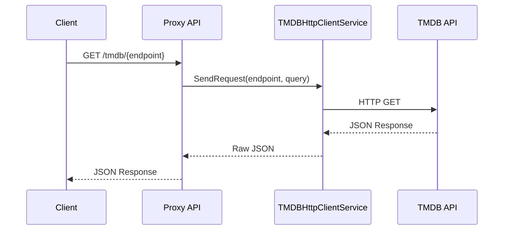

# Documentazione Tecnica: Implementazione Proxy TMDB

## Indice

- [Documentazione Tecnica: Implementazione Proxy TMDB](#documentazione-tecnica-implementazione-proxy-tmdb)
  - [Indice](#indice)
  - [Introduzione](#introduzione)
  - [Architettura del Sistema](#architettura-del-sistema)
  - [Configurazione](#configurazione)
    - [appsettings.json](#appsettingsjson)
    - [Program.cs](#programcs)
  - [Implementazione](#implementazione)
    - [TMDBHttpClientService](#tmdbhttpclientservice)
    - [Pattern Chiave](#pattern-chiave)
    - [Proxy Endpoints](#proxy-endpoints)
  - [Pattern e Best Practices](#pattern-e-best-practices)
  - [Guida all'Uso](#guida-alluso)
    - [Esempio di Chiamata Frontend](#esempio-di-chiamata-frontend)
    - [Endpoint Comuni](#endpoint-comuni)
  - [Troubleshooting](#troubleshooting)
    - [Errori Comuni](#errori-comuni)
    - [Soluzioni](#soluzioni)

## Introduzione

Il sistema implementa un proxy per le chiamate API verso The Movie Database (TMDB). Questo approccio offre diversi vantaggi:

- Nasconde le chiavi API del backend
- Centralizza la gestione delle richieste
- Permette il rate limiting
- Supporta la gestione dei proxy di rete

## Architettura del Sistema



## Configurazione

### appsettings.json

```json
{
  "TMDB": {
    "BaseUrl": "https://api.themoviedb.org/3",
    "BearerToken": "your_bearer_token"
  }
}
```

### Program.cs

```csharp
// Registrazione dei servizi
builder.Services.AddSingleton<ITMDBHttpClientService, TMDBHttpClientService>();
builder.Services.AddSingleton<IRequestValidationService, RequestValidationService>();

// Configurazione Rate Limiting
builder.Services.AddRateLimiter(options => {
    options.AddFixedWindowLimiter("TMDBPolicy", configure => {
        configure.PermitLimit = 100;
        configure.Window = TimeSpan.FromMinutes(1);
    });
});
```

## Implementazione

### TMDBHttpClientService

Il servizio gestisce le chiamate HTTP verso TMDB:

- Configurazione automatica del proxy di sistema
- Gestione dell'autenticazione Bearer
- Validazione degli endpoint
- Gestione delle risposte e degli errori

### Pattern Chiave

```csharp
public sealed class TMDBHttpClientService : ITMDBHttpClientService, IDisposable
{
    private readonly HttpClient _httpClient;
    private readonly string _baseUrl;

    public async Task<string> SendRequest(string endpoint, string query)
    {
        var url = $"{_baseUrl}/{endpoint.TrimStart('/')}";
        if (!string.IsNullOrEmpty(query))
        {
            url += query;
        }
        
        var response = await _httpClient.GetAsync(url);
        response.EnsureSuccessStatusCode();
        return await response.Content.ReadAsStringAsync();
    }
}
```

### Proxy Endpoints

Il sistema espone due endpoint:

1. `/tmdb/proxy?path={endpoint}` - Per documentazione Swagger
2. `/tmdb/{*endpoint}` - Per le chiamate effettive

Caratteristiche:

- Rate limiting con policy "TMDBPolicy"
- Validazione delle richieste
- Gestione centralizzata degli errori

## Pattern e Best Practices

1. **Dependency Injection**
   - Utilizzo di interfacce per i servizi
   - Registrazione come singleton per ottimizzare le risorse

2. **Rate Limiting**
   - Finestra fissa di 100 richieste/minuto
   - Coda di elaborazione FIFO

3. **Gestione Proxy**
   - Rilevamento automatico del proxy di sistema
   - Supporto multi-piattaforma (Windows/Altri OS)

4. **Sicurezza**
   - Validazione delle richieste
   - Nascondimento delle credenziali TMDB
   - Gestione sicura delle eccezioni

## Guida all'Uso

### Esempio di Chiamata Frontend

```javascript
async function fetchMovie(movieId) {
    try {
        const response = await fetch(`/api/tmdb/movie/${movieId}`);
        if (!response.ok) throw new Error('Network response was not ok');
        const data = await response.json();
        return data;
    } catch (error) {
        console.error('Error fetching movie:', error);
        throw error;
    }
}
```

### Endpoint Comuni

- `/api/tmdb/movie/{movie_id}` - Dettagli film
- `/api/tmdb/movie/popular` - Film popolari
- `/api/tmdb/search/movie?query={query}` - Ricerca film

## Troubleshooting

### Errori Comuni

1. **401 Unauthorized**
   - Verificare la configurazione del bearer token
   - Controllare la validità del token TMDB

2. **429 Too Many Requests**
   - Rispettare i limiti di rate limiting
   - Implementare retry con exponential backoff

3. **Errori Proxy**
   - Verificare la configurazione del proxy di sistema
   - Controllare la connettività di rete

### Soluzioni

1. **Problemi di Performance**
   - Implementare caching lato client
   - Utilizzare compression HTTP
   - Ottimizzare le query dei parametri

2. **Gestione Errori**
   - Implementare circuit breaker pattern
   - Logging dettagliato delle richieste fallite
   - Monitoraggio attivo delle metriche

---

Per ulteriori informazioni:

- [TMDB API Documentation](https://developers.themoviedb.org/3)
- [Rate Limiting Docs](https://developers.themoviedb.org/3/getting-started/request-rate-limiting)