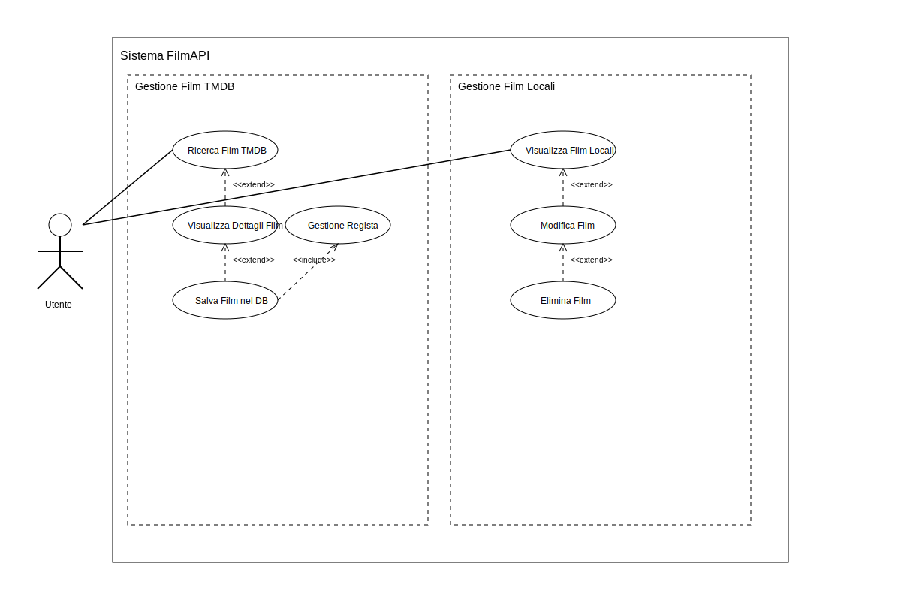
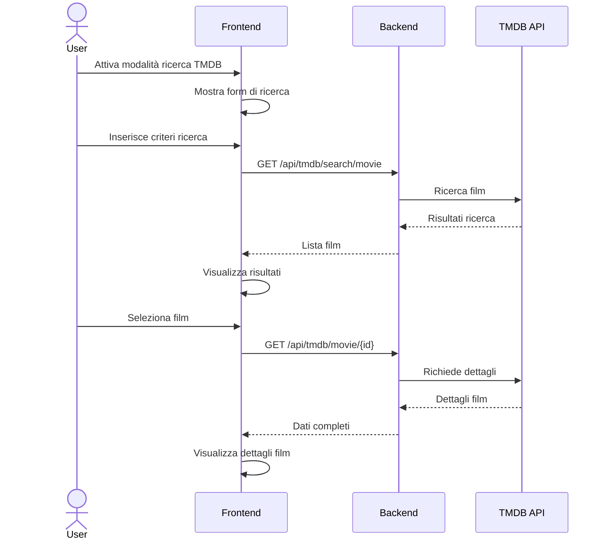
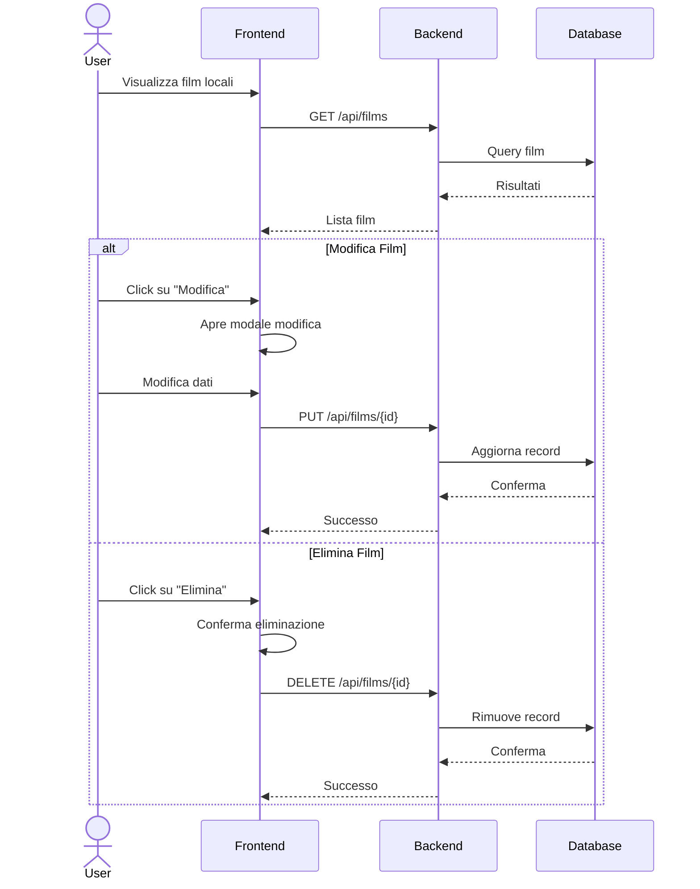

# Documentazione Frontend FilmAPI

## Indice

- [Documentazione Frontend FilmAPI](#documentazione-frontend-filmapi)
  - [Indice](#indice)
  - [Diagramma dei Casi d'Uso](#diagramma-dei-casi-duso)
  - [Gestione File Statici](#gestione-file-statici)
    - [Struttura e Distribuzione](#struttura-e-distribuzione)
    - [Organizzazione Directory wwwroot](#organizzazione-directory-wwwroot)
  - [Scenario Utente: Ricerca Film su TMDB](#scenario-utente-ricerca-film-su-tmdb)
    - [Diagramma di Sequenza - Ricerca Film su TMDB](#diagramma-di-sequenza---ricerca-film-su-tmdb)
    - [Implementazione Chiave](#implementazione-chiave)
  - [Scenario Utente: Gestione Film Locali](#scenario-utente-gestione-film-locali)
    - [Diagramma di Sequenza - Gestione Film Locali](#diagramma-di-sequenza---gestione-film-locali)
    - [Gestione Stato Interfaccia](#gestione-stato-interfaccia)
  - [Gestione Componenti Riutilizzabili](#gestione-componenti-riutilizzabili)
  - [Best Practices Implementate](#best-practices-implementate)

## Diagramma dei Casi d'Uso



## Gestione File Statici

### Struttura e Distribuzione

La distribuzione dei file statici avviene attraverso il middleware di ASP.NET Core, configurato per servire i contenuti dalla directory `wwwroot`. I file vengono serviti con le seguenti caratteristiche:

- Cache-Control configurato per ottimizzare le performance
- Supporto per file di diversi tipi (HTML, CSS, JavaScript, immagini)
- Gestione automatica degli header MIME type
- Compressione automatica (Gzip/Brotli) quando supportata

### Organizzazione Directory wwwroot

```text
wwwroot/
├── assets/         # Immagini e risorse statiche
├── components/     # Componenti HTML riutilizzabili
│   ├── header.html
│   └── footer.html
├── css/           # Fogli di stile
│   └── styles.css
├── js/            # Script JavaScript
│   └── template-loader.js
└── pages/         # Pagine dell'applicazione
    └── film/
        ├── index.html
        ├── movie-details.html
        ├── search.js
        └── movie-details.js
```

## Scenario Utente: Ricerca Film su TMDB

### Diagramma di Sequenza - Ricerca Film su TMDB



### Implementazione Chiave

```javascript
// Gestione ricerca TMDB
async function handleSearch(query, year, language) {
    const searchParams = new URLSearchParams();
    searchParams.append('query', query);
    if (language) {
        searchParams.append('language', language);
        searchParams.append('region', language.split('-')[1]);
    }
    if (year) searchParams.append('primary_release_year', year);
    
    const response = await fetch(`/api/tmdb/search/movie?${searchParams}`);
    const data = await response.json();
    return data.results;
}
```

## Scenario Utente: Gestione Film Locali

### Diagramma di Sequenza - Gestione Film Locali



### Gestione Stato Interfaccia

L'interfaccia utente mantiene due modalità principali:

1. Visualizzazione film locali (default)
2. Ricerca TMDB

La transizione tra le modalità è gestita tramite un toggle switch che modifica la visibilità delle sezioni corrispondenti:

```javascript
viewToggle.addEventListener('change', async function() {
    if (this.checked) {
        localFilmsSection.classList.add('d-none');
        searchSection.classList.remove('d-none');
        toggleLabel.textContent = 'Show Local Films';
    } else {
        searchSection.classList.add('d-none');
        localFilmsSection.classList.remove('d-none');
        toggleLabel.textContent = 'Show TMDB Search';
        await loadLocalFilms();
    }
});
```

## Gestione Componenti Riutilizzabili

Il sistema utilizza un TemplateLoader per gestire componenti HTML riutilizzabili come header e footer:

```javascript
class TemplateLoader {
    static async loadTemplate(elementId, templatePath) {
        const response = await fetch(templatePath);
        const content = await response.text();
        document.getElementById(elementId).innerHTML = content;
    }

    static async initializeTemplates() {
        await Promise.all([
            this.loadTemplate("header-container", "/components/header.html"),
            this.loadTemplate("footer-container", "/components/footer.html"),
        ]);
    }
}
```

## Best Practices Implementate

1. **Separazione delle Responsabilità**
   - HTML per struttura
   - CSS per stile
   - JavaScript per comportamento
   - Componenti riutilizzabili separati

2. **Gestione Errori**
   - Feedback visuale per operazioni asincrone
   - Gestione errori di rete
   - Validazione input utente

3. **User Experience**
   - Indicatori di caricamento
   - Feedback immediato per azioni utente
   - Conferme per operazioni distruttive
   - Interfaccia responsiva

4. **Performance**
   - Caricamento asincrono dei template
   - Gestione efficiente degli stati UI
   - Minimizzazione delle chiamate API