# Guida Completa alla Virtualizzazione e ai Container

- [Guida Completa alla Virtualizzazione e ai Container](#guida-completa-alla-virtualizzazione-e-ai-container)
  - [Parte 1: La Virtualizzazione Tradizionale (Macchine Virtuali)](#parte-1-la-virtualizzazione-tradizionale-macchine-virtuali)
    - [1.1 Cos'è una Macchina Virtuale (VM)?](#11-cosè-una-macchina-virtuale-vm)
    - [1.2 Approfondimento sulle Tecniche di Virtualizzazione](#12-approfondimento-sulle-tecniche-di-virtualizzazione)
      - [1.2.1 Full Virtualization (con Binary Translation)](#121-full-virtualization-con-binary-translation)
      - [1.2.2 Paravirtualizzazione](#122-paravirtualizzazione)
      - [1.2.3 Hardware-Assisted Virtualization (Intel VT-x \& AMD-V)](#123-hardware-assisted-virtualization-intel-vt-x--amd-v)
      - [Tabella Riassuntiva](#tabella-riassuntiva)
    - [1.3 Le VM nel Cloud (VPS)](#13-le-vm-nel-cloud-vps)
  - [Parte 2: La Containerizzazione](#parte-2-la-containerizzazione)
    - [2.1 Differenze Chiave: VM vs. Container](#21-differenze-chiave-vm-vs-container)
    - [2.2 Vantaggi dei Container](#22-vantaggi-dei-container)
    - [2.3 Quando usare le VM e quando i Container?](#23-quando-usare-le-vm-e-quando-i-container)
  - [Parte 3: Deep Dive su Docker](#parte-3-deep-dive-su-docker)
    - [3.1 Architettura di Docker](#31-architettura-di-docker)
    - [3.2 Docker Internals: I Pilastri del Kernel Linux](#32-docker-internals-i-pilastri-del-kernel-linux)
      - [3.2.1 Namespaces: L'Illusione dell'Isolamento](#321-namespaces-lillusione-dellisolamento)
      - [3.2.2 Control Groups (cgroups): La Gestione delle Risorse](#322-control-groups-cgroups-la-gestione-delle-risorse)
      - [3.2.3 Union File Systems: Il Filesystem a Strati Intelligente](#323-union-file-systems-il-filesystem-a-strati-intelligente)
    - [3.3 Anatomia di `docker run`](#33-anatomia-di-docker-run)
  - [Parte 4: Ecosistema e Orchestrazione](#parte-4-ecosistema-e-orchestrazione)
    - [4.1 Docker Compose (Sviluppo e Prototipazione Locale)](#41-docker-compose-sviluppo-e-prototipazione-locale)
    - [4.2 Alternative a Docker: Podman](#42-alternative-a-docker-podman)
    - [4.3 Orchestrazione in Produzione: Kubernetes e Oltre](#43-orchestrazione-in-produzione-kubernetes-e-oltre)
    - [4.4 Kubernetes in Locale (per apprendimento)](#44-kubernetes-in-locale-per-apprendimento)
    - [4.5 Orchestrazione nel Cloud: Servizi Gestiti](#45-orchestrazione-nel-cloud-servizi-gestiti)
  - [Conclusione](#conclusione)

Questo documento fornisce le basi teoriche e pratiche per comprendere le tecnologie di virtualizzazione e containerizzazione, strumenti fondamentali nello sviluppo software moderno e nelle pratiche DevOps.

## Parte 1: La Virtualizzazione Tradizionale (Macchine Virtuali)

La virtualizzazione è una tecnologia che permette di creare una versione virtuale di una risorsa informatica, come un server, un sistema di archiviazione, una rete o un sistema operativo.

### 1.1 Cos'è una Macchina Virtuale (VM)?

Una **Macchina Virtuale (VM)** è l'emulazione completa di un sistema hardware. Su questo hardware virtuale viene installato un sistema operativo completo (chiamato *Guest OS*), che funziona in modo isolato dal sistema operativo dell'hardware fisico sottostante (*Host OS*).

L'elemento chiave che rende possibile la virtualizzazione è l'**Hypervisor** (o Virtual Machine Monitor, VMM). L'Hypervisor è uno strato software che si interpone tra l'hardware fisico e le macchine virtuali, gestendo l'allocazione delle risorse fisiche (CPU, RAM, storage, rete) a ciascuna VM.

Esistono due tipi principali di Hypervisor:

- **Tipo 1 (Bare Metal):** Viene eseguito direttamente sull'hardware fisico dell'host. Esempi includono VMware vSphere/ESXi, Microsoft Hyper-V, KVM (Kernel-based Virtual Machine) su Linux. Questo tipo è il più performante ed è lo standard nei data center e nel cloud computing.

- **Tipo 2 (Hosted):** Viene eseguito come un'applicazione all'interno di un sistema operativo host. Esempi includono Oracle VirtualBox, VMware Workstation, Parallels Desktop. È comunemente usato per lo sviluppo e il testing su macchine locali.

\[Immagine di Architettura Hypervisor Tipo 1 e Tipo 2\]

### 1.2 Approfondimento sulle Tecniche di Virtualizzazione

Per comprendere le diverse tecniche di virtualizzazione, è fondamentale capire il problema architetturale che esse risolvono. L'architettura delle CPU x86 (usata dalla maggior parte dei server e PC) utilizza un sistema di anelli di protezione (*protection rings*) per la sicurezza.

- **Ring 0 (Kernel Mode):** Il livello più privilegiato. Qui opera il kernel del sistema operativo, che ha accesso diretto a tutto l'hardware.

- **Ring 3 (User Mode):** Il livello meno privilegiato. Qui vengono eseguite le applicazioni utente (es. browser, editor di testo). Le applicazioni non possono accedere direttamente all'hardware, ma devono chiedere al kernel di farlo per loro tramite chiamate di sistema (*system calls*).

Il problema della virtualizzazione classica è che il sistema operativo Guest si aspetta di girare in Ring 0 per poter gestire l'hardware. Tuttavia, il Ring 0 è già occupato dall'Hypervisor (o dall'Host OS). Far girare il Guest OS in Ring 3 non funziona, perché molte delle sue istruzioni (quelle per accedere all'hardware) sono "privilegiate" e possono essere eseguite solo in Ring 0. Le diverse tecniche di virtualizzazione sono, in sostanza, diverse strategie per risolvere questo conflitto.

#### 1.2.1 Full Virtualization (con Binary Translation)

La virtualizzazione completa emula l'intero hardware, permettendo di eseguire un sistema operativo Guest non modificato. L'approccio classico per raggiungere questo obiettivo su architetture x86 (prima dell'avvento del supporto hardware) era la **traduzione binaria**.

- **Come funziona:**

    1. Il kernel del Guest OS viene eseguito in una modalità non privilegiata (come Ring 1 o 3).

    2. L'Hypervisor analizza al volo il codice del Guest OS prima di eseguirlo.

    3. Le istruzioni "sicure" (non privilegiate) vengono eseguite direttamente sulla CPU alla massima velocità possibile.

    4. Le istruzioni "privilegiate" (che fallirebbero se eseguite in una modalità non privilegiata) vengono intercettate.

    5. L'Hypervisor **traduce** queste istruzioni privilegiate in una sequenza di nuove istruzioni sicure che emulano il comportamento originale. Queste istruzioni tradotte vengono poi eseguite.

    6. Per ottimizzare, i blocchi di codice tradotti vengono salvati in una cache, in modo che la traduzione non debba essere ripetuta.   Questo processo è noto anche come **Trap-and-Emulate**, anche se il "trap" è gestito dal software di traduzione e non dalla CPU stessa.

- **Schema del flusso:**

    ```mermaid
    sequenceDiagram
        participant GOS as Guest OS (User Mode)
        participant HV as Hypervisor (Kernel Mode)
        participant HW as Hardware (CPU)
        
        Note over GOS,HW: Binary Translation Process
        
        GOS->>HV: 1. Tenta istruzione privilegiata (es. IN/OUT, HLT)
        Note over HV: 2. Intercetta l'istruzione PRIMA dell'esecuzione
        Note over HV: 3. Traduce in sequenza sicura
        HV->>HW: 4. Esegue istruzioni tradotte
        HW-->>HV: 5. Risultato dell'esecuzione
        HV-->>GOS: 6. Ritorna il risultato
        Note over GOS: 7. Riceve risultato, ignaro della traduzione
    ```

- **Vantaggi:** Non richiede alcuna modifica al sistema operativo Guest.

- **Svantaggi:** L'overhead della traduzione binaria in tempo reale riduce le prestazioni.

#### 1.2.2 Paravirtualizzazione

La paravirtualizzazione adotta un approccio cooperativo: il sistema operativo Guest è "consapevole" di essere virtualizzato e collabora con l'Hypervisor per ottimizzare le prestazioni.

- **Come funziona:**

    1. Il kernel del sistema operativo Guest viene modificato specificamente per la virtualizzazione.

    2. Invece di tentare di eseguire istruzioni privilegiate (che dovrebbero essere intercettate e tradotte), il Guest OS effettua delle chiamate dirette all'Hypervisor, chiamate **hypercalls**.

    3. Una hypercall è simile a una system call: è un'interfaccia ben definita attraverso cui il Guest chiede all'Hypervisor di eseguire un'operazione privilegiata per suo conto.

    4. Questo elimina la necessità di intercettare e tradurre istruzioni, riducendo drasticamente l'overhead.

- **Schema del flusso:**

    ```mermaid
    sequenceDiagram
        participant GOS as Guest OS Modificato (User Mode)
        participant HV as Hypervisor (Kernel Mode)
        participant HW as Hardware (CPU)
        
        Note over GOS,HW: Paravirtualization Process
        
        Note over GOS: 1. Deve eseguire operazione privilegiata
        GOS->>GOS: Prepara hypercall invece di istruzione diretta
        GOS->>HV: 2. Esegue la Hypercall
        Note over HV: 3. Valida ed esegue l'operazione richiesta
        HV->>HW: 4. Esecuzione diretta sull'hardware
        HW-->>HV: Risultato dell'operazione
        HV-->>GOS: 5. Ritorna il risultato al Guest OS
        Note over GOS: 6. Guest OS riceve il risultato
    ```

    **Diagramma alternativo (flowchart):**

    ```mermaid
    flowchart TD
        A[Guest OS: Operazione privilegiata richiesta] --> B[Prepara Hypercall]
        B --> C[Invia Hypercall all'Hypervisor]
        C --> D{Hypervisor: Valida richiesta}
        D -->|Valida| E[Esegue operazione su hardware]
        D -->|Non valida| F[Rifiuta e ritorna errore]
        E --> G[Raccoglie risultato]
        F --> H[Ritorna risultato/errore al Guest OS]
        G --> H
        H --> I[Guest OS continua l'esecuzione]
        
        style A fill:#e3f2fd
        style C fill:#fff3e0
        style D fill:#f3e5f5
        style E fill:#e8f5e8
        style F fill:#ffebee
        style H fill:#fff9c4
    ```

- **Vantaggi:** Prestazioni molto elevate, quasi native, specialmente per operazioni di I/O.

- **Svantaggi:** Richiede la modifica del sistema operativo Guest, quindi non è possibile eseguire OS proprietari non modificabili (come versioni vecchie di Windows) in questa modalità.

#### 1.2.3 Hardware-Assisted Virtualization (Intel VT-x & AMD-V)

Questa è la tecnologia che ha rivoluzionato la virtualizzazione ed è oggi lo standard. Intel e AMD hanno introdotto estensioni nelle loro CPU per risolvere il problema dei ring di protezione direttamente a livello hardware.

- **Come funziona:**

    1. La CPU introduce due nuove modalità di operazione: **VMX root mode** (per l'Hypervisor) e **VMX non-root mode** (per il Guest OS). Entrambe le modalità hanno i loro Ring 0-3.

    2. L'Hypervisor gira in VMX root mode e configura una struttura dati in memoria, chiamata **VMCS (Virtual Machine Control Structure)**, per ogni VM. Nella VMCS, specifica quali istruzioni eseguite dal Guest devono causare un'uscita (*VM Exit*).

    3. Il Guest OS viene eseguito in VMX non-root mode. Può girare direttamente in Ring 0 (del suo mondo "non-root") ed eseguire le sue istruzioni privilegiate.

    4. Quando il Guest esegue un'istruzione critica (definita dall'Hypervisor nella VMCS), la CPU **automaticamente e a livello hardware** ferma l'esecuzione del Guest, salva il suo stato, e passa il controllo all'Hypervisor (un **VM Exit**).

    5. L'Hypervisor gestisce l'istruzione, emulandola o eseguendola in modo sicuro.

    6. Una volta terminato, l'Hypervisor esegue un'istruzione `VMRESUME`, e la CPU ripristina lo stato del Guest e ne riprende l'esecuzione (un **VM Entry**).

    Questo elimina la necessità sia della traduzione binaria (lenta) sia della modifica del kernel Guest (scomoda).

- **Schema del flusso:**

    ```mermaid
    sequenceDiagram
        participant GOS as Guest OS (VMX non-root mode)
        participant CPU as CPU (con VT-x/AMD-V)
        participant HV as Hypervisor (VMX root mode)
        
        Note over GOS,HV: Hardware-Assisted Virtualization Process
        
        GOS->>CPU: 1. Esegue istruzioni direttamente
        CPU->>CPU: 2. Esegue le istruzioni normalmente
        
        Note over GOS: 3. Tenta istruzione critica
        GOS->>CPU: (es. modifica registri di controllo)
        
        Note over CPU: 4. CPU rileva istruzione critica
        CPU->>CPU: Causa VM Exit - Salva stato Guest
        CPU->>HV: 5. Passa controllo all'Hypervisor
        
        Note over HV: 6. Legge causa del VM Exit
        Note over HV: 7. Emula l'operazione richiesta
        HV->>CPU: 8. Esegue VMRESUME
        
        CPU->>CPU: Ripristina stato del Guest
        CPU->>GOS: 9. Riprende esecuzione (VM Entry)
        Note over GOS: Esecuzione continua trasparentemente
    ```

    **Diagramma alternativo (flowchart):**

    ```mermaid
    flowchart TD
        A[Guest OS: Esecuzione normale] --> B[CPU: Esegue istruzioni direttamente]
        B --> C{Istruzione critica?}
        C -->|No| B
        C -->|Sì| D[CPU: VM Exit - Salva stato]
        D --> E[Hypervisor: Prende controllo]
        E --> F[Legge causa del VM Exit]
        F --> G[Emula operazione richiesta]
        G --> H[Esegue VMRESUME]
        H --> I[CPU: Ripristina stato Guest]
        I --> J[VM Entry - Riprende esecuzione]
        J --> A
        
        style A fill:#e3f2fd
        style B fill:#e8f5e8
        style C fill:#fff3e0
        style D fill:#ffecb3
        style E fill:#f3e5f5
        style G fill:#e1f5fe
        style I fill:#e8f5e8
        style J fill:#f1f8e9
    ```

- **Vantaggi:** Combina i vantaggi delle altre due: alte prestazioni (quasi native) e la capacità di eseguire sistemi operativi non modificati. È lo standard de facto oggi.

- **Svantaggi:** Richiede CPU moderne con supporto per queste estensioni.

#### Tabella Riassuntiva

| **Tecnica** | **Guest OS Modificato?** | **Meccanismo Principale** | **Prestazioni** | **Isolamento** |
| --- |  --- |  --- |  --- |  --- |
| **Full (Binary Translation)** | No | Intercettazione e traduzione software delle istruzioni privilegiate. | Medie (overhead da traduzione) | Alto |
| **Paravirtualizzazione** | Sì | Il Guest OS effettua *hypercalls* per le operazioni privilegiate. | Alte (overhead minimo) | Alto |
| **Hardware-Assisted** | No | La CPU gestisce automaticamente i *VM Exit* per le istruzioni critiche. | Molto Alte (quasi native) | Molto Alto |

### 1.3 Le VM nel Cloud (VPS)

Nel cloud computing, il modello **Infrastructure as a Service (IaaS)** si basa pesantemente sulla virtualizzazione. Quando si acquista una **Virtual Private Server (VPS)** da un provider cloud (come Azure, AWS, Google Cloud), si sta affittando una VM che gira su un hypervisor di tipo 1 (come KVM o Hyper-V) che sfrutta appieno la **virtualizzazione assistita da hardware**. Il provider gestisce l'hardware fisico e l'hypervisor, mentre l'utente ha il pieno controllo del sistema operativo Guest.

## Parte 2: La Containerizzazione

La containerizzazione è una forma di virtualizzazione a livello di sistema operativo. Invece di virtualizzare l'intero hardware, i container virtualizzano il sistema operativo, permettendo a più applicazioni di girare in processi isolati su un singolo kernel host.

### 2.1 Differenze Chiave: VM vs. Container

| **Caratteristica** | **Macchina Virtuale (VM)** | **Container** |
| --- |  --- |  --- |
| **Astrazione** | Hardware fisico | Sistema operativo |
| **Componenti** | App, Librerie/Dipendenze, **Sistema Operativo Guest completo** | App, Librerie/Dipendenze |
| **Isolamento** | Completo, a livello di Hypervisor (o Hardware) | A livello di processo, tramite funzionalità del kernel (Namespaces, cgroups) |
| **Risorse** | Gigabyte (GB) di RAM e storage | Megabyte (MB) di RAM e storage |
| **Tempo di avvio** | Minuti | Secondi o millisecondi |
| **Kernel** | Un kernel per ogni VM | Un unico kernel host condiviso tra tutti i container |
| **Portabilità** | Portabile, ma l'immagine della VM è molto grande | Altamente portabile, l'immagine del container è leggera |

```mermaid
graph TD
    subgraph VM_ARCH ["🖥️ VIRTUAL MACHINES"]
        direction TB
        
        subgraph VM1 ["Virtual Machine 1"]
            APP1[Applicazione 1]
            LIB1[Librerie e Dipendenze]
            OS1[Sistema Operativo Guest]
        end
        
        subgraph VM2 ["Virtual Machine 2"]
            APP2[Applicazione 2]
            LIB2[Librerie e Dipendenze]
            OS2[Sistema Operativo Guest]
        end
        
        subgraph VM3 ["Virtual Machine 3"]
            APP3[Applicazione 3]
            LIB3[Librerie e Dipendenze]
            OS3[Sistema Operativo Guest]
        end
        
        VM1 --- HYP[Hypervisor]
        VM2 --- HYP
        VM3 --- HYP
        HYP --- HOST1[Sistema Operativo Host]
        HOST1 --- HW1[Hardware Fisico]
    end
    
    subgraph CONT_ARCH ["📦 CONTAINERS"]
        direction TB
        
        subgraph C1 ["Container 1"]
            APP4[Applicazione 1]
            LIB4[Librerie e Dipendenze]
        end
        
        subgraph C2 ["Container 2"]
            APP5[Applicazione 2]
            LIB5[Librerie e Dipendenze]
        end
        
        subgraph C3 ["Container 3"]
            APP6[Applicazione 3]
            LIB6[Librerie e Dipendenze]
        end
        
        C1 --- ENGINE[Container Engine<br/>Docker/Podman]
        C2 --- ENGINE
        C3 --- ENGINE
        ENGINE --- HOST2[Sistema Operativo Host]
        HOST2 --- HW2[Hardware Fisico]
    end
    
    VM_ARCH ~~~ CONT_ARCH
    
    classDef vm fill:#ffebee,stroke:#c62828,stroke-width:2px
    classDef container fill:#e8f5e8,stroke:#2e7d32,stroke-width:2px
    classDef shared fill:#fff3e0,stroke:#ef6c00,stroke-width:2px
    classDef arch fill:#f3e5f5,stroke:#7b1fa2,stroke-width:2px
    
    class VM1,VM2,VM3 vm
    class C1,C2,C3 container
    class HOST1,HOST2,HYP,ENGINE shared
    class VM_ARCH,CONT_ARCH arch
```



### 2.2 Vantaggi dei Container

- **Efficienza:** I container sono molto più leggeri delle VM perché non includono un intero sistema operativo. Questo permette di eseguire molti più container su un singolo host rispetto alle VM.

- **Velocità:** Si avviano quasi istantaneamente, accelerando i cicli di sviluppo, test e deployment.

- **Portabilità:** Un'immagine container contiene tutto ciò di cui un'applicazione ha bisogno per funzionare (codice, runtime, librerie). Questo garantisce che l'applicazione si comporti allo stesso modo in qualsiasi ambiente: dal laptop dello sviluppatore al server di produzione.

- **Consistenza:** Risolvono il classico problema del "funziona sulla mia macchina". L'ambiente è immutabile e riproducibile.

### 2.3 Quando usare le VM e quando i Container?

- **Usa le VM quando:**

    - Hai bisogno di eseguire un sistema operativo diverso da quello dell'host (es. Windows su un server Linux).

    - Richiedi un livello di isolamento di sicurezza massimo, poiché un exploit nel kernel host potrebbe teoricamente compromettere tutti i container.

    - Devi gestire applicazioni legacy che richiedono un OS completo e specifico.

    - L'applicazione ha requisiti hardware particolari che devono essere emulati.

- **Usa i Container quando:**

    - L'obiettivo è pacchettizzare e distribuire microservizi.

    - La priorità è la velocità di deployment e la scalabilità (CI/CD).

    - Si vuole massimizzare l'utilizzo delle risorse hardware dell'host.

    - Lo sviluppo deve essere consistente tra diversi ambienti.

## Parte 3: Deep Dive su Docker

Docker è la piattaforma di containerizzazione più popolare. Non è una tecnologia di virtualizzazione nel senso classico; piuttosto, è un'applicazione user-friendly che orchestra primitive di isolamento già presenti nel kernel Linux per creare ambienti leggeri e portabili.

### 3.1 Architettura di Docker

Docker utilizza un'architettura client-server. Questo modello è fondamentale perché disaccoppia l'interfaccia utente dal motore di esecuzione, offrendo flessibilità e controllo remoto. I componenti sono:

1. **Docker Client (`docker`):** L'interfaccia a riga di comando (CLI) con cui l'utente interagisce. Quando si digita un comando, il client non fa altro che formattare questa richiesta in una chiamata API HTTP e inviarla al demone Docker. Non esegue alcuna logica di containerizzazione.

2. **Docker Daemon (`dockerd`):** È il cuore di Docker. Un processo server persistente che gira in background, esponendo un'API REST. Ascolta le richieste dal client (o da qualsiasi altro client API) e si occupa di tutto il lavoro pesante: costruire immagini, scaricarle, creare e gestire i container, configurare reti e volumi.

3. **Registry:** Un repository stateless e scalabile per archiviare e distribuire le immagini Docker. Concettualmente, è un servizio di storage per immagini. **Docker Hub** è il registry pubblico più noto. Un'immagine viene identificata da `[repository]:[tag]`, ad esempio `ubuntu:22.04`. Il tag `latest` è una convenzione, non una garanzia di "più recente". Per una referenza immutabile, si usa il **digest** (`<repository>@sha256:<hash>`), che garantisce di usare sempre la stessa identica versione dell'immagine.

Il dialogo tra client e demone avviene tramite l'API, solitamente attraverso un socket Unix locale (`/var/run/docker.sock`) per motivi di sicurezza, ma può essere configurato per accettare connessioni remote tramite TCP. Questo disaccoppiamento basato su API è estremamente potente, poiché permette a un'intera galassia di strumenti di terze parti (come interfacce grafiche, es. Portainer, o piattaforme CI/CD come Jenkins) di integrarsi e controllare Docker.

- **Diagramma dell'architettura Docker e del flusso di comandi (Mermaid):**

    ```mermaid
    graph TB
        User["`👤 **Utente**
        (CLI)`"] --> Client["`📱 **Docker Client**
        (docker ...)`"]
        
        Client -->|"🔗 API"| Daemon["`⚙️ **Docker Daemon**
        (dockerd)`"]
        
        Daemon -->|"📥 pull"| Images["`📦 **Immagini**`"]
        Daemon --> Container["`🐳 **Container**`"]
        
        Images -.->|"gestisce"| Daemon
        Container -.->|"gestisce"| Daemon
        
        Registry["`🌐 **Registry**
        (es. Docker Hub, Azure CR, ...)`"] -->|"⬇️ pull"| Daemon
        Daemon -->|"⬆️ push"| Registry
        
        classDef userStyle fill:#e1f5fe,stroke:#01579b,stroke-width:2px
        classDef clientStyle fill:#f3e5f5,stroke:#4a148c,stroke-width:2px
        classDef daemonStyle fill:#e8f5e8,stroke:#1b5e20,stroke-width:2px
        classDef resourceStyle fill:#fff3e0,stroke:#e65100,stroke-width:2px
        classDef registryStyle fill:#fce4ec,stroke:#880e4f,stroke-width:2px
        
        class User userStyle
        class Client clientStyle
        class Daemon daemonStyle
        class Images,Container resourceStyle
        class Registry registryStyle
    ```

In un ambiente WSL, il client Docker installato in Windows (`docker.exe`) è preconfigurato per comunicare, tramite un socket, con il demone `dockerd` in esecuzione all'interno della distribuzione Linux (Ubuntu).

### 3.2 Docker Internals: I Pilastri del Kernel Linux

Docker non sarebbe possibile senza tre tecnologie chiave del kernel Linux: **Namespaces**, **Control Groups (cgroups)** e **Union File Systems**. Docker le orchestra per fornire l'esperienza che conosciamo.

#### 3.2.1 Namespaces: L'Illusione dell'Isolamento

I Namespaces sono una feature del kernel che permette di partizionare risorse globali in modo che un gruppo di processi veda solo un sottoinsieme di tali risorse. Quando si avvia un container, Docker crea un set di namespace specifici per quel container e vi fa entrare il processo principale dell'applicazione.

Il kernel Linux offre diversi tipi di namespace:

- **`pid` (Process ID):** Isola l'albero dei processi. All'interno del container, il processo principale riceve il PID 1. Questo è fondamentale: in Linux, il processo con PID 1 (tipicamente `init` o `systemd`) è speciale, ha la responsabilità di "adottare" e terminare correttamente i processi orfani (noti come *zombie processes*). Se l'applicazione principale nel container non è progettata per questo, il container può accumulare processi zombie, sprecando risorse. Per questo, in scenari complessi, è buona pratica usare un init system leggero come `tini` come entrypoint del container.

    - **Esempio pratico:** `docker run --rm -it --name test-pid ubuntu bash`. All'interno, `ps aux` mostrerà `bash` come PID 1. Apri un altro terminale WSL e lancia `docker top test-pid`: vedrai il PID reale del processo `bash` sul sistema host.

- **`net` (Network):** Fornisce al container il proprio stack di rete isolato (interfacce, IP, tabelle di routing, porte). Tecnicamente, Docker crea una coppia di interfacce virtuali ethernet (`veth pair`), che agiscono come un cavo patch. Un'estremità viene inserita nel namespace di rete del container (e appare come `eth0`), mentre l'altra rimane nel namespace dell'host e viene collegata a un bridge virtuale (come `docker0`), permettendo la comunicazione. La mappatura delle porte (`-p 8080:80`) è realizzata dal demone Docker che configura regole di `iptables` (o `nftables`) sull'host per intercettare il traffico sulla porta 8080 dell'host e reindirizzarlo (NAT) all'IP e alla porta 80 del container.

- **`mnt` (Mount):** Isola i punti di mount. Un container ha il suo filesystem root, che è diverso da quello dell'host. Questo sandboxing è un confine di sicurezza fondamentale che impedisce ai processi del container di accedere a file arbitrari sul sistema host (a meno che non si usino i volumi). Alla base di questo c'è la system call `chroot()` (change root) o la più moderna e sicura `pivot_root`. In pratica, Docker monta il filesystem a strati (vedi UnionFS) in una directory e poi dice al processo del container: "Da ora in poi, questa directory è la tua radice (`/`)".

    - **Schema concettuale del `mnt` namespace:**

        ```text
        Filesystem Host                         Filesystem Container (Vista isolata)
        /
        |-- /home
        |-- /var
        |   |-- /lib
        |       |-- /docker
        |           |-- /overlay2
        |               |-- /<hash_del_container>
        |                   |-- /merged  <---- Docker esegue un chroot qui
        |                       |-- /bin
        |                       |-- /etc
        |                       |-- /app

        ```

        **Diagramma del Mount Namespace (Mermaid):**

        ```mermaid
        graph TB
            subgraph HostFS ["🖥️ Filesystem Host"]
                Root["📁 / (root)"]
                Home["🏠 /home"]
                Var["📂 /var"]
                Lib["📚 /lib"]
                Docker["🐳 /docker"]
                Overlay2["📦 /overlay2"]
                ContainerHash["🔐 /<hash_container>"]
                Merged["🔗 /merged"]
                
                Root --> Home
                Root --> Var
                Var --> Lib
                Lib --> Docker
                Docker --> Overlay2
                Overlay2 --> ContainerHash
                ContainerHash --> Merged
            end
            
            subgraph ContainerFS ["📱 Vista Container isolata"]
                CRoot["📁 / (chroot)"]
                CBin["⚙️ /bin"]
                CEtc["📄 /etc"]
                CApp["🚀 /app"]
                
                CRoot --> CBin
                CRoot --> CEtc
                CRoot --> CApp
            end
            
            Merged -.->|"🔄 chroot() - Docker esegue qui"| CRoot
            
            classDef hostStyle fill:#e3f2fd,stroke:#0277bd,stroke-width:2px
            classDef containerStyle fill:#e8f5e8,stroke:#2e7d32,stroke-width:2px
            classDef chrootStyle fill:#fff3e0,stroke:#f57c00,stroke-width:3px
            
            class Root,Home,Var,Lib,Docker,Overlay2,ContainerHash hostStyle
            class Merged chrootStyle
            class CRoot,CBin,CEtc,CApp containerStyle
        ```

- **`uts` (UNIX Timesharing System):** Isola l'hostname e il NIS domain name. Permette a ogni container di avere il proprio hostname, che può essere impostato con `docker run --hostname=mio-container`. Questo è utile per l'identificazione dei servizi in reti complesse.

- **`ipc` (Inter-Process Communication):** Isola le risorse per la comunicazione tra processi, come i semafori System V e la memoria condivisa. Senza questo isolamento, processi in container diversi sulla stessa macchina potrebbero leggere o scrivere aree di memoria condivisa altrui, creando gravi problemi di sicurezza e stabilità.

- **`user`:** Isola gli ID utente (UID) e gli ID gruppo (GID). Questa è una funzionalità più avanzata che permette il "rootless mode". Un processo può avere i privilegi di `root` (UID 0) all'interno del container, ma essere mappato a un utente non privilegiato (es. UID 1000) sull'host, migliorando notevolmente la sicurezza e riducendo la superficie di attacco in caso di evasione dal container.

#### 3.2.2 Control Groups (cgroups): La Gestione delle Risorse

Se i Namespaces creano l'isolamento, i **cgroups** impongono i limiti. Sono una feature del kernel che permette di allocare, limitare e monitorare le risorse di sistema (CPU, memoria, I/O del disco, banda di rete) per un gruppo di processi. La versione moderna, `cgroups v2`, unifica la gerarchia rendendola più semplice da gestire.

- **Come funziona:** Il kernel espone i cgroups come un filesystem virtuale, solitamente montato in `/sys/fs/cgroup`. Per ogni "sottosistema" (es. `memory`, `cpu`), c'è una gerarchia di directory. Quando Docker crea un container, crea una nuova directory in questa gerarchia e vi scrive i limiti.

- Esempio pratico (limiti CPU e Memoria):

    Quando si esegue docker run --memory=512m --cpu-shares=512 ..., il demone Docker:

    1. Crea una directory per il nuovo container, ad esempio `/sys/fs/cgroup/docker/<id_container>/`.

    2. Scrive il valore `536870912` (512 \* 1024 \* 1024) nel file `memory.max` per imporre un limite rigido alla RAM.

    3. Scrive il valore `512` nel file `cpu.weight`. Questo è un limite "relativo": un container con `--cpu-shares=1024` riceverà il doppio del tempo di CPU rispetto a uno con `512`, ma solo quando i due sono in competizione per le risorse.

    4. Aggiunge il PID del processo del container al file cgroup.procs.

        Da quel momento, il kernel si assicura che il gruppo di processi non superi i limiti. Se il limite di memoria viene superato, il kernel invoca l'OOM (Out Of Memory) Killer, che termina bruscamente il processo.

#### 3.2.3 Union File Systems: Il Filesystem a Strati Intelligente

Le immagini Docker sono leggere ed efficienti grazie agli **Union File Systems**. Il driver più comune oggi è **`OverlayFS`**.

- **Come funziona `OverlayFS`:** Combina più directory (i layer) in una singola vista unificata.

    - **`lowerdir`:** Uno o più layer di sola lettura. Questi sono i layer dell'immagine Docker. Sono immutabili e condivisi tra tutti i container che usano la stessa immagine.

    - **`upperdir`:** Un layer scrivibile, unico per ogni container. Tutte le modifiche ai file (creazioni, modifiche, cancellazioni) avvengono qui.

    - **`workdir`:** Una directory di lavoro interna, richiesta da OverlayFS.

    - **`merged`:** La vista unificata, che è ciò che il container vede come suo filesystem root.

- **Meccanismo di Copy-on-Write (CoW):**

    1. **Lettura:** Se un'applicazione nel container legge un file che esiste solo nei `lowerdir`, il file viene letto direttamente da lì, senza alcun overhead.

    2. **Scrittura/Modifica:** Se l'applicazione cerca di modificare un file che esiste in un `lowerdir`, `OverlayFS` intercetta l'operazione. Copia il file dal `lowerdir` all'`upperdir` e solo allora la modifica viene applicata alla copia nell'`upperdir`. Da quel momento in poi, il container vedrà la versione modificata del file.

    3. **Cancellazione:** Se un'applicazione cancella un file, `OverlayFS` non lo cancella dal `lowerdir` (che è read-only). Invece, crea un file speciale chiamato "whiteout" nell'`upperdir` che nasconde il file sottostante.

- **Diagramma OverlayFS (Mermaid):**

    ```mermaid
    graph BT
    subgraph Lower ["🔒 LOWERDIR - Read Only"]
        L1["📝 /app/index.html<br/>(versione originale)"]
        L2["⚙️ /bin/bash"]
    end
    
    subgraph Upper ["✏️ UPPERDIR - Read/Write"]
        U1["📝 /app/index.html<br/>(versione modificata)"]
        U2["📋 /tmp/log.txt<br/>(file nuovo)"]
    end
    
    subgraph Container ["🔍 CONTAINER (merged)"]
        C1["📝 /app/index.html (MODIFICATO)"]
        C2["⚙️ /bin/bash (ORIGINALE)"]
        C3["📋 /tmp/log.txt (NUOVO)"]
    end
    
    %% Collegamenti strutturali
    Lower ---|Sovrapposto a| Upper
    Upper ---|Vista Unificata| Container
    
    %% Collegamenti specifici dei file
    U1 -.-> C1
    U2 -.-> C3
    L2 -.-> C2
    
    classDef containerStyle fill:#d4edda,stroke:#155724,stroke-width:3px,color:#000
    classDef upperStyle fill:#fff3cd,stroke:#856404,stroke-width:3px,color:#000
    classDef lowerStyle fill:#cce5ff,stroke:#004085,stroke-width:3px,color:#000
    classDef fileStyle fill:#f8f9fa,stroke:#495057,stroke-width:2px,color:#000
    
    class Container containerStyle
    class Upper upperStyle
    class Lower lowerStyle
    class C1,C2,C3,U1,U2,L1,L2 fileStyle
    ```

Questa architettura rende la creazione di container quasi istantanea e incredibilmente efficiente in termini di spazio su disco. L'implicazione cruciale è che il layer scrivibile è **effimero**: viene distrutto quando il container viene rimosso. Per questo motivo, qualsiasi dato che deve sopravvivere alla vita del container (come i dati di un database) deve essere salvato in un **volume**, che è un meccanismo per mappare una directory dell'host all'interno del container, bypassando l'Union File System.

### 3.3 Anatomia di `docker run`

Per unire tutti i concetti, vediamo cosa succede quando si esegue un comando apparentemente semplice come `docker run hello-world`:

1. **Client -> API:** Il client `docker` analizza il comando e invia una richiesta all'endpoint `/containers/create` dell'API REST esposta dal demone `dockerd`.

2. **Daemon: Immagine?** Il demone riceve la richiesta. Controlla se l'immagine `hello-world:latest` esiste localmente nella sua cache di immagini.

3. **Daemon: Pull dal Registry:** Non trovandola, contatta il registry pubblico (Docker Hub), autenticandosi se necessario. Trova l'immagine e i suoi layer (descritti in un file manifest), ne verifica l'integrità e li scarica (fa un `pull`).

4. **Daemon: Preparazione del Container:**

    - **Filesystem:** Usando il driver `OverlayFS`, il demone crea una vista unificata del filesystem. Prende i layer dell'immagine `hello-world` (i `lowerdir`) e ci sovrappone un nuovo layer vuoto e scrivibile (`upperdir`).

    - **Rete:** Crea e assegna uno stack di rete al futuro container, creando un nuovo **network namespace** e collegando un'interfaccia di rete virtuale al bridge di default di Docker.

5. **Daemon -> containerd -> runc:** A questo punto, il demone Docker moderno non gestisce direttamente l'esecuzione. Delega il compito a componenti di livello inferiore, conformi alla **Open Container Initiative (OCI)**:

    - `dockerd` comunica con `containerd`, un demone più semplice il cui unico scopo è gestire il ciclo di vita dei container (start, stop, pause).

    - `containerd` a sua volta utilizza `runc`, uno strumento a riga di comando leggero che è l'effettivo runtime del container. `runc` riceve la configurazione (in formato JSON) e si interfaccia direttamente con il kernel Linux per:

        - Creare tutti i **namespaces** (`pid`, `mnt`, `uts`, etc.).

        - Impostare i **cgroups** secondo i limiti specificati.

        - Eseguire `chroot` sulla directory `merged` del filesystem.

6. **Esecuzione:** `runc` avvia il processo specificato dall'immagine (`/hello`) come processo figlio, facendolo entrare in tutti i namespace e sotto il controllo del cgroup appena creati.

7. **Output e Terminazione:** Il processo `/hello` scrive il suo messaggio sullo standard output. Il demone Docker, attraverso `containerd`, cattura questo output e lo invia in streaming al client `docker`, che lo visualizza sul terminale dell'utente. Una volta che il processo termina, il container si ferma.

8. **Rimozione (se `--rm`):** Se il flag `--rm` è presente, il demone distrugge il container, rimuovendo il layer scrivibile (`upperdir`) e liberando le risorse di rete. I layer dell'immagine rimangono nella cache locale per usi futuri.

## Parte 4: Ecosistema e Orchestrazione

Gestire un singolo container è semplice. Ma le applicazioni moderne sono raramente monolitiche; sono ecosistemi di servizi interconnessi. Gestire questo ciclo di vita complesso -- deployment, networking, scaling, aggiornamenti -- su più macchine richiede strumenti di **orchestrazione**. Questi strumenti automatizzano e semplificano la gestione di applicazioni containerizzate su larga scala.

### 4.1 Docker Compose (Sviluppo e Prototipazione Locale)

:memo: **Questa parte verrà spiegata in dettaglio nelle unità didattiche successive**. In questo paragrafo si vuole solo fornire un'anteprima di alcuni concetti molto importanti.

**Docker Compose** è lo strumento di orchestrazione di primo livello per ambienti di sviluppo e testing. Permette di definire e gestire un'applicazione multi-container attraverso un singolo file di configurazione, `docker-compose.yml`. La sua forza risiede nella capacità di replicare un'intera architettura software con un unico comando (`docker-compose up`), garantendo che ogni sviluppatore del team lavori con un ambiente identico e prevedibile.

Il file `docker-compose.yml` è il cuore di questo strumento. Analizziamone le sezioni principali in modo più approfondito:

- **`services`**: Definisce i singoli container che compongono l'applicazione. Ogni chiave sotto `services` è il nome logico di un servizio (es. `web-api`, `database`, `messaging-queue`). Questo nome è cruciale, poiché diventa l'**hostname** all'interno della rete creata da Compose, permettendo la risoluzione DNS tra i servizi.

    - **`build`**: Istruisce Compose a costruire un'immagine da un `Dockerfile`. La sintassi `context` specifica la directory di build, mentre `dockerfile` permette di indicare un nome di file diverso da quello standard.

    - **`image`**: Alternativa a `build`, specifica un'immagine pre-costruita da un registry.

    - **`ports`**: Mappa le porte nel formato `"HOST:CONTAINER"`. È il ponte tra il mondo esterno (la macchina host) e la rete isolata di Compose.

    - **`volumes`**: Gestisce la persistenza dei dati. La scelta tra *bind mount* e *named volume* è strategica:

        - **Bind Mounts** (`./codice:/app`): Ideali per lo sviluppo. Mappano una directory dell'host, permettendo il *hot-reloading* quando il codice sorgente viene modificato. Lo svantaggio è che sono legati al path del sistema operativo host, rendendoli meno portabili.

        - **Named Volumes** (`db-data:/var/lib/mariadb/data`): La scelta d'elezione per i dati che devono persistere (database, logs, uploads). Docker gestisce completamente il ciclo di vita del volume, che viene creato in un'area dedicata del filesystem dell'host (`/var/lib/docker/volumes/`). Sono portabili e possono essere facilmente backuppati o migrati.

    - **`environment`**: Permette di impostare variabili d'ambiente. Una pratica comune è usare un file `.env` nella root del progetto per non commettere dati sensibili (come password) nel controllo di versione. Compose legge automaticamente questo file e sostituisce le variabili nel file `yml` (es. `${DB_PASSWORD}`).

    - **`depends_on`**: Definisce l'ordine di avvio dei servizi. È importante notare che `depends_on` garantisce solo l'**ordine di avvio**, non che il servizio dipendente sia effettivamente *pronto* ad accettare connessioni. Per questo, in scenari di produzione, si usano meccanismi più robusti come gli *health checks*.

    - **`healthcheck`**: Una direttiva potente per verificare lo stato di salute di un servizio. Permette di definire un comando che, se eseguito con successo, dichiara il container "healthy". Ad esempio, per un database si potrebbe eseguire un comando che tenta una connessione. Compose può attendere che una dipendenza sia "healthy" prima di avviare il servizio dipendente.

- **`networks`**: Permette di definire reti personalizzate. Se non specificato, Compose crea una singola rete `bridge` di default. Creare reti esplicite permette di isolare gruppi di servizi o di connettersi a reti Docker preesistenti.

- **`volumes`**: La dichiarazione a livello radice dei *named volumes* usati nei servizi.

- **Esempio: Applicazione To-Do con ASP.NET Core e MariaDB** Creiamo un'API per una To-Do list che salva i dati su un database MariaDB.

    1. **Struttura del Progetto e Codice C#**

        - **`TodoApi.csproj`**:

            ```xml
            <Project Sdk="Microsoft.NET.Sdk.Web">
              <PropertyGroup>
                <TargetFramework>net9.0</TargetFramework>
                <Nullable>enable</Nullable>
                <ImplicitUsings>enable</ImplicitUsings>
              </PropertyGroup>
              <ItemGroup>
                
                 <PackageReference Include="Pomelo.EntityFrameworkCore.MySql" Version="9.0.0-preview.3.efcore.9.0.0" />
                
                <PackageReference Include="Microsoft.EntityFrameworkCore.Design" Version="9.0.4">
                    <IncludeAssets>runtime; build; native; contentfiles; analyzers; buildtransitive</IncludeAssets>
                    <PrivateAssets>all</PrivateAssets>
                </PackageReference>
              </ItemGroup>
            </Project>

            ```

        - **`Models/Todo.cs`**:

            ```cs
            public class Todo
            {
                public int Id { get; set; }
                public string? Title { get; set; }
                public bool IsCompleted { get; set; }
            }

            ```

        - **`Data/TodoDbContext.cs`**:

            ```cs
            using Microsoft.EntityFrameworkCore;
            using TodoApi.Models;

            public class TodoDbContext : DbContext
            {
                public TodoDbContext(DbContextOptions<TodoDbContext> options) : base(options) { }
                public DbSet<Todo> Todos { get; set; }
            }

            ```

        - **`Program.cs`**:

            ```cs
            using Microsoft.EntityFrameworkCore;
            using TodoApi.Data;
            using TodoApi.Models;

            var builder = WebApplication.CreateBuilder(args);

            // Legge la connection string dalla configurazione (passata via environment)
            var connectionString = builder.Configuration.GetConnectionString("DefaultConnection");

            // Configura il DbContext per usare MariaDB
            builder.Services.AddDbContext<TodoDbContext>(options =>
                options.UseMySql(connectionString, ServerVersion.AutoDetect(connectionString)));

            builder.Services.AddEndpointsApiExplorer();
            builder.Services.AddSwaggerGen();

            var app = builder.Build();

            if (app.Environment.IsDevelopment())
            {
                app.UseSwagger();
                app.UseSwaggerUI();
            }

            // Endpoint per ottenere tutti i To-Do
            app.MapGet("/todos", async (TodoDbContext context) =>
                await context.Todos.ToListAsync());

            // Endpoint per creare un nuovo To-Do
            app.MapPost("/todos", async (Todo todo, TodoDbContext context) =>
            {
                context.Todos.Add(todo);
                await context.SaveChangesAsync();
                return Results.Created($"/todos/{todo.Id}", todo);
            });

            // Applica automaticamente le migrazioni in sospeso all'avvio
            // Nota: In un ambiente di produzione reale, la gestione delle migrazioni
            // dovrebbe essere un processo più controllato.
            try
            {
                using (var scope = app.Services.CreateScope())
                {
                    var db = scope.ServiceProvider.GetRequiredService<TodoDbContext>();
                    db.Database.Migrate();
                }
            }
            catch (Exception ex)
            {
                // Log dell'errore di migrazione
                app.Logger.LogError(ex, "An error occurred while migrating the database.");
            }

            app.Run();

            ```

    2. **`Dockerfile`**:

        ```dockerfile
        # Fase 1: Build dell'applicazione usando l'SDK completo
        FROM mcr.microsoft.com/dotnet/sdk:9.0 AS build
        WORKDIR /src

        # Copia il file di progetto e ripristina le dipendenze per sfruttare la cache dei layer
        COPY *.csproj .
        RUN dotnet restore

        # Copia il resto del codice sorgente e pubblica l'applicazione
        COPY . .
        RUN dotnet publish -c Release -o /app/publish

        # Fase 2: Creazione dell'immagine finale basata sul runtime più leggero
        FROM mcr.microsoft.com/dotnet/aspnet:9.0 AS final
        WORKDIR /app
        COPY --from=build /app/publish .
        # Assicurarsi che il nome della DLL corrisponda al nome del progetto
        ENTRYPOINT ["dotnet", "TodoApi.dll"]

        ```

    3. **`docker-compose.yml`**:

        ```yml
        # Nelle versioni recenti di Compose, la chiave 'version' è omessa
        services:
          # Servizio per l'API web
          webapi:
            build: .
            ports:
              - "8080:8080"
            environment:
              # La connection string viene iniettata nel container
              # 'db' è l'hostname del servizio MariaDB, risolto dal DNS di Docker
              - ConnectionStrings__DefaultConnection=Server=db;Port=3306;Database=tododb;User=user;Password=password
            depends_on:
              db:
                # Attende che il DB sia "healthy" prima di avviare l'API
                condition: service_healthy

          # Servizio per il database MariaDB
          db:
            image: mariadb:11.4 # Versione aggiornata
            restart: always
            environment:
              # Credenziali per il database. In produzione, usare secrets.
              - MARIADB_ROOT_PASSWORD=verysecret
              - MARIADB_DATABASE=tododb
              - MARIADB_USER=user
              - MARIADB_PASSWORD=password
            volumes:
              # Volume nominato per persistere i dati del DB anche se il container viene rimosso
              - db-data:/var/lib/mysql
            healthcheck:
              # Usa lo script ufficiale di MariaDB per verificare lo stato di salute
              test: ["CMD", "healthcheck.sh", "--connect", "--user=user", "--password=password", "--database=tododb"]
              interval: 10s
              timeout: 5s
              retries: 5

        volumes:
          # Dichiarazione del volume nominato per la persistenza dei dati
          db-data:

        ```

    Dopo aver creato le migrazioni con `dotnet ef migrations add InitialCreate`, si può lanciare l'ambiente con `docker-compose up`. Il servizio `webapi` attenderà che il `healthcheck` del database abbia successo prima di avviarsi e applicare le migrazioni al database.

### 4.2 Alternative a Docker: Podman

Sebbene Docker sia dominante, non è l'unico runtime di container. **Podman** è un'alternativa popolare, sviluppata da Red Hat. La sua differenza principale è l'architettura **daemonless** (senza demone).

| **Caratteristica** | **Docker** | **Podman** |
| --- |  --- |  --- |
| **Architettura** | Client-Server (demone `dockerd` centrale) | Daemonless (comandi eseguiti direttamente) |
| **Sicurezza** | Il demone `dockerd` gira con privilegi `root` | Può essere eseguito da utenti non `root` (rootless), più sicuro |
| **Comandi** | `docker ...` | `podman ...` (la maggior parte dei comandi è identica) |
| **Docker Compose** | Supportato nativamente | Usa `podman-compose`, un progetto separato, o gestisce i pod |
| **Concetto di Pod** | Non nativo (introdotto da Kubernetes) | Concetto di **Pod** nativo, permette di raggruppare container che condividono risorse (es. namespace di rete) |

Per la maggior parte degli usi di base, è possibile creare un alias `alias docker=podman` e usare Podman in modo trasparente.

**Podman** si posiziona come un'alternativa sicura a Docker. La sua architettura **daemonless** è il punto di svolta: non esiste un processo `dockerd` centrale in esecuzione come `root`. Quando si esegue `podman run`, il comando interagisce direttamente con il kernel per creare il container come un processo figlio del processo utente.

- **Implicazioni di Sicurezza**: Questa architettura mitiga una classe intera di rischi. Con Docker, un utente autorizzato a comunicare con il demone (appartenente al gruppo `docker`) ha di fatto privilegi `root` sulla macchina host. Un exploit nel demone `dockerd` potrebbe compromettere l'intero sistema. Podman, eseguendo i container come processi utente non privilegiati (modalità *rootless*), limita drasticamente i danni in caso di compromissione: un attaccante che evade dal container otterrebbe solo i privilegi dell'utente che ha avviato il container, non di `root`.

- **Concetto di Pod**: Podman introduce nativamente il concetto di **Pod**, preso in prestito da Kubernetes. Un Pod è un gruppo di uno o più container che condividono gli stessi namespace di rete e IPC. Questo è utile per container strettamente accoppiati che devono comunicare tramite `localhost`, come un'applicazione web e un proxy "sidecar" per il logging o il monitoring. Questa funzionalità rende Podman un eccellente strumento per simulare localmente le architetture di Kubernetes.

### 4.3 Orchestrazione in Produzione: Kubernetes e Oltre

Quando si passa dalla macchina di uno sviluppatore a un cluster di produzione, le esigenze cambiano radicalmente. Servono alta disponibilità, tolleranza ai guasti, scaling automatico e aggiornamenti senza downtime. Qui entrano in gioco orchestratori su larga scala.

- **Docker Swarm**: L'orchestratore nativo di Docker. È apprezzato per la sua semplicità. Si abilita con `docker swarm init` e si gestiscono i servizi con comandi `docker service ...`. Include funzionalità essenziali come il **routing mesh**, che permette a qualsiasi nodo del cluster di ricevere traffico per un servizio e reindirizzarlo al container corretto, anche se si trova su un altro nodo. Sebbene meno flessibile di Kubernetes, è una scelta solida per cluster di piccole e medie dimensioni.

- **Kubernetes (K8s)**: Lo standard de facto. K8s è una piattaforma estensibile che tratta il data center come un unico grande computer. La sua complessità è giustificata dalla sua potenza. Oltre ai concetti base:

    - **StatefulSet**: Un tipo di risorsa per gestire applicazioni *stateful* (come i database). A differenza di un Deployment, fornisce ai Pod identità di rete stabili e storage persistente univoco, essenziale per i cluster di database.

    - **ConfigMap & Secret**: Permettono di disaccoppiare la configurazione e i dati sensibili (come password o chiavi API) dalle immagini dei container. Vengono montati nei Pod come file o variabili d'ambiente.

    - **Namespace (K8s)**: Forniscono un meccanismo per partizionare un singolo cluster fisico in più cluster virtuali, isolando le risorse per diversi team, progetti o ambienti (es. `development`, `staging`, `production`).

    - **Concetti base di K8s:**

        - **Pod:** L'unità di deployment più piccola. Un Pod contiene uno o più container che condividono lo storage e la rete.

        - **Service:** Fornisce un endpoint di rete stabile per un gruppo di Pod.

        - **Deployment:** Definisce lo stato desiderato per un set di Pod (es. "voglio 3 repliche del mio web server").

        - **Ingress:** Gestisce l'accesso esterno ai servizi nel cluster, tipicamente tramite HTTP.

### 4.4 Kubernetes in Locale (per apprendimento)

Per evitare sorprese durante il deployment, è fondamentale sviluppare in un ambiente il più simile possibile a quello di produzione. Gli strumenti per Kubernetes locale permettono proprio questo.

- **Minikube**: Crea un cluster K8s a singolo nodo all'interno di una VM o di un container. È ottimo per iniziare e testare le funzionalità di base. Il comando `minikube service <nome-servizio>` è una scorciatoia che apre un tunnel di rete verso il Pod e lancia il browser.

- **Kind (Kubernetes in Docker)**: Un'alternativa sempre più popolare. Kind esegue ogni "nodo" del cluster Kubernetes come un container Docker. Questo lo rende estremamente veloce da avviare e distruggere, ed è ideale per gli scenari di CI/CD dove è necessario creare e smantellare cluster di test in modo programmatico.

- **Flusso di lavoro con `kubectl`**: `kubectl` è il bisturi dello sviluppatore per interagire con il cluster.

    - `kubectl apply -f <file.yaml>`: È il comando dichiarativo per eccellenza. Dice a Kubernetes: "Voglio che lo stato del cluster corrisponda a quanto descritto in questo file". Kubernetes si occuperà di creare, aggiornare o eliminare le risorse necessarie per raggiungere quello stato.

    - `kubectl get pods,services`: Fornisce una vista rapida dello stato delle risorse.

    - `kubectl describe pod <nome-pod>`: Un comando di debugging fondamentale. Fornisce un resoconto dettagliato di un Pod, inclusi gli eventi recenti (es. errori nel pull dell'immagine, fallimento dell'health check), lo stato, gli IP e i volumi montati.

Per imparare Kubernetes senza un cluster in cloud, si possono usare strumenti come **Minikube** o **Kind**. Minikube crea un cluster Kubernetes a singolo nodo all'interno di una VM o di un container Docker.

- **Setup di Minikube con Docker su WSL/Ubuntu:**

    1. **Installare `kubectl` (il client di K8s):**

        ```ps
        curl -LO "https://dl.k8s.io/release/$(curl -L -s https://dl.k8s.io/release/stable.txt)/bin/linux/amd64/kubectl"
        sudo install -o root -g root -m 0755 kubectl /usr/local/bin/kubectl

        ```

    2. **Installare Minikube:**

        ```ps
        curl -Lo minikube https://storage.googleapis.com/minikube/releases/latest/minikube-linux-amd64
        sudo install minikube /usr/local/bin/

        ```

    3. **Avviare il cluster Minikube usando il driver Docker:**

        ```ps
        minikube start --driver=docker

        ```

    4. **Esempio: Deploy di un server Nginx** Crea un file `nginx-deployment.yaml`:

        ```yml
        apiVersion: apps/v1
        kind: Deployment
        metadata:
          name: nginx-deployment
        spec:
          replicas: 2 # Vogliamo 2 pod
          selector:
            matchLabels:
              app: nginx
          template:
            metadata:
              labels:
                app: nginx
            spec:
              containers:
              - name: nginx
                image: nginx:1.21
                ports:
                - containerPort: 80
        ---
        apiVersion: v1
        kind: Service
        metadata:
          name: nginx-service
        spec:
          selector:
            app: nginx
          ports:
            - protocol: TCP
              port: 80
              targetPort: 80
          type: NodePort

        ```

    5. **Applicare il manifest e esporre il servizio:**

        ```ps
        # Applica la configurazione al cluster
        kubectl apply -f nginx-deployment.yaml

        # Controlla che i pod siano in esecuzione
        kubectl get pods

        # Ottieni l'URL per accedere al servizio
        minikube service nginx-service

        ```

        Questo comando aprirà automaticamente il browser all'indirizzo IP del servizio Nginx.

### 4.5 Orchestrazione nel Cloud: Servizi Gestiti

Gestire un cluster Kubernetes (specialmente il *control plane*) è un lavoro a tempo pieno. I provider cloud offrono servizi gestiti per astrare questa complessità.

- **Azure**:

    - **Azure Kubernetes Service (AKS)**: L'offerta K8s completa. Azure gestisce il control plane (master nodes) gratuitamente, e l'utente paga solo per i nodi di lavoro (le VM). AKS si integra profondamente con l'ecosistema Azure, offrendo scaling automatico dei nodi, identità gestite con Azure AD, e integrazione con Azure Monitor e Azure Policy.

    - **Azure Container Apps (ACA)**: Un passo ulteriore nell'astrazione. È un servizio *serverless* per container basato su Kubernetes, ma nasconde completamente il cluster sottostante. L'utente effettua il deployment su "container apps" invece di Pod e Deployment. ACA è costruito su tecnologie open-source come **KEDA** (per lo scaling event-driven, es. scalare in base alla lunghezza di una coda), **Dapr** (per semplificare la creazione di microservizi) ed **Envoy** (per il networking). È ideale per architetture a microservizi e applicazioni web dove si vuole pagare solo per l'uso effettivo, senza preoccuparsi di gestire VM o cluster.

- **AWS & Google Cloud**: Anche gli altri principali provider offrono servizi analoghi. 
  - AWS ha **Amazon Elastic Kubernetes Service (EKS)** (la sua offerta K8s gestita) e **Amazon Elastic Container Service (ECS)** (un'alternativa proprietaria a K8s - si tratta di un suo orchestratore proprietario, più semplice). 
  - Google, che ha originato Kubernetes, offre **GKE (Google Kubernetes Engine)**, ampiamente considerato il servizio K8s gestito più maturo e ricco di funzionalità.

## Conclusione

La comprensione di queste tecnologie è cruciale. Le macchine virtuali hanno rivoluzionato l'IT permettendo un uso efficiente dell'hardware. I container, guidati da Docker, hanno portato questa efficienza a un livello superiore, rivoluzionando lo sviluppo e il deployment del software. Infine, orchestratori come Kubernetes sono diventati indispensabili per eseguire applicazioni resilienti e scalabili su larga scala, sia on-premise che nel cloud. Padroneggiare questi strumenti, partendo da Docker e Docker Compose per lo sviluppo locale fino ai concetti di Kubernetes per la produzione, è una competenza fondamentale per ogni sviluppatore moderno.
