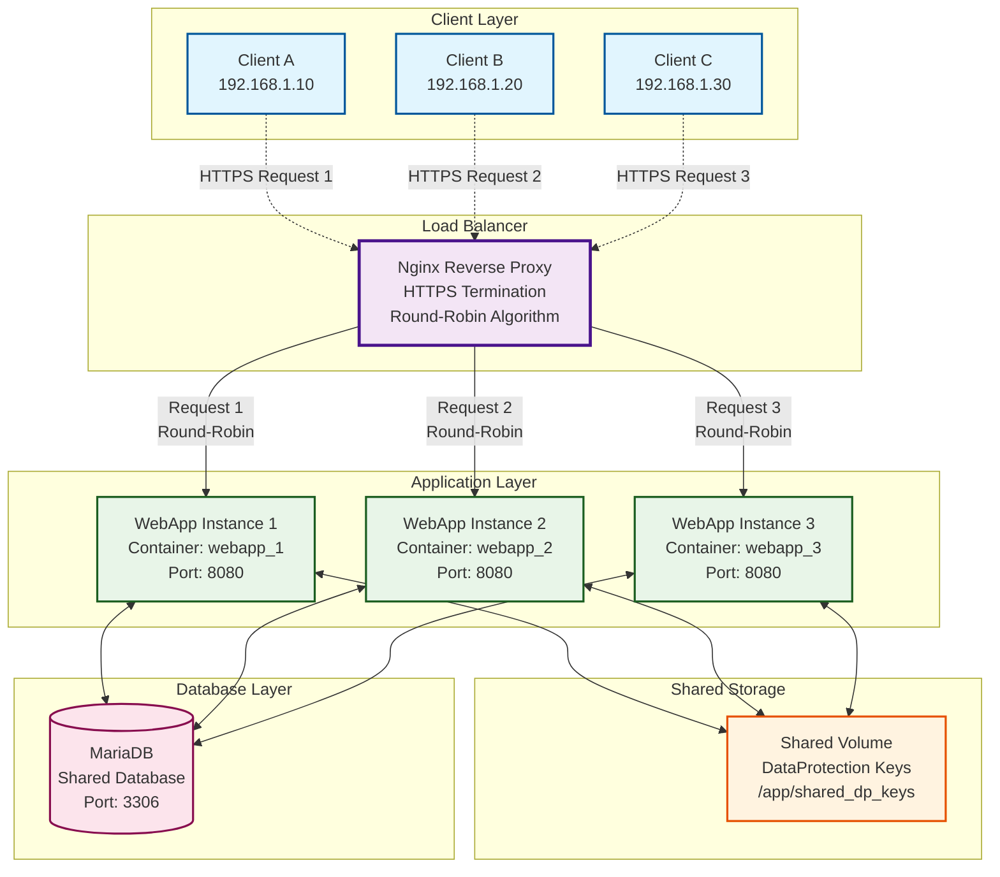
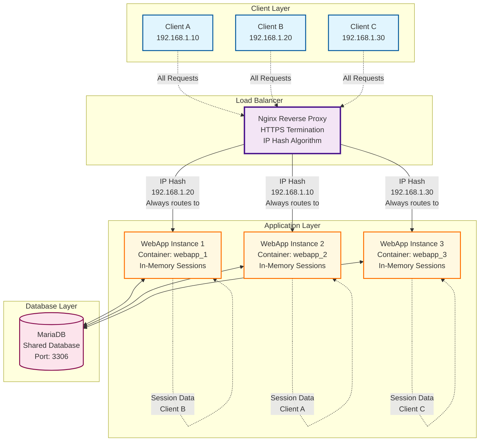
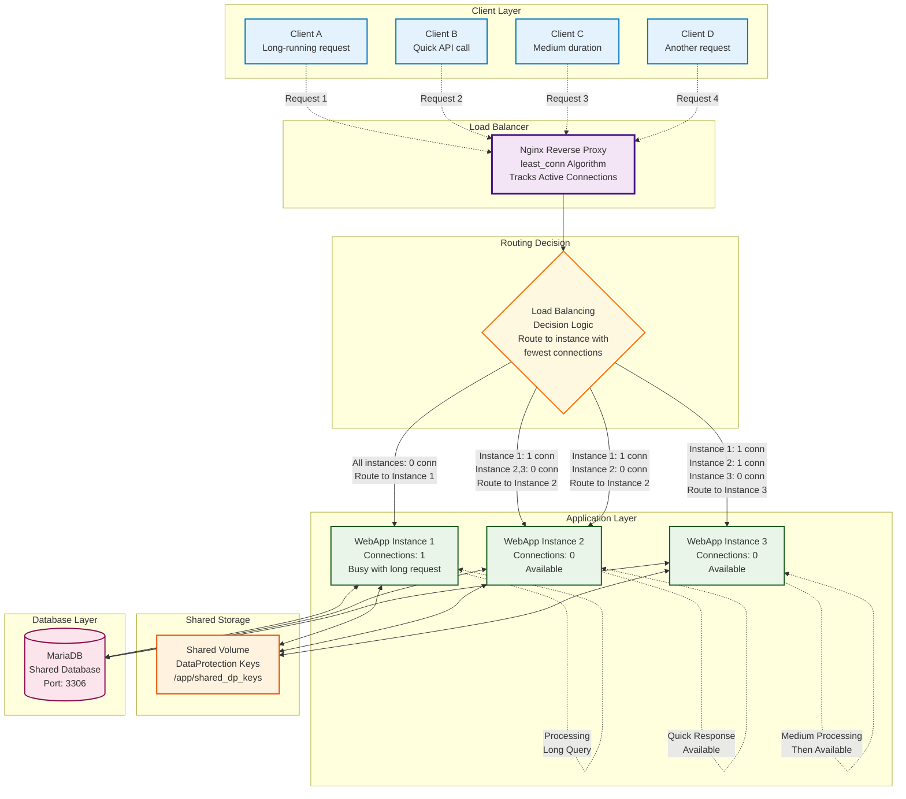
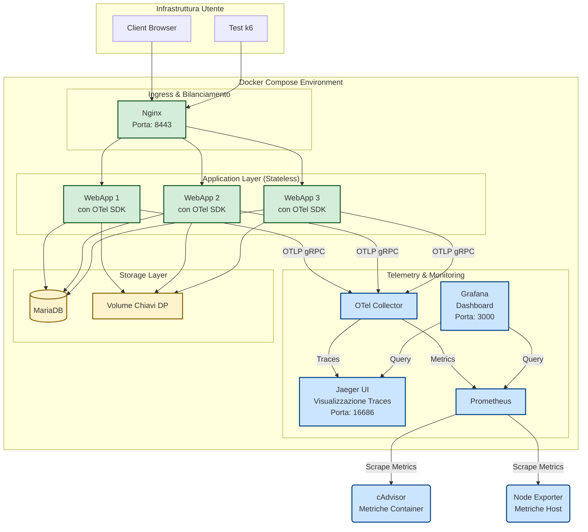

# Orchestrazione per sviluppo locale con `Docker Compose`; `Load Balancing`/`Reverse Proxy`/`HTTPS termination`/`DDoS mitigation` con `Nginx`; Analisi delle prestazioni con `K6`; Statistiche di funzionamento e Telemetria con `Prometheus`, `Grafana` e `OpenTelemetry`; gestione delle migrazioni del database con un progetto `Worker` separato; creazione di un account limitato mediante script SQL  - un esempio completo con la Web App `EducationalGames`

- [Orchestrazione per sviluppo locale con `Docker Compose`; `Load Balancing`/`Reverse Proxy`/`HTTPS termination`/`DDoS mitigation` con `Nginx`; Analisi delle prestazioni con `K6`; Statistiche di funzionamento e Telemetria con `Prometheus`, `Grafana` e `OpenTelemetry`; gestione delle migrazioni del database con un progetto `Worker` separato; creazione di un account limitato mediante script SQL  - un esempio completo con la Web App `EducationalGames`](#orchestrazione-per-sviluppo-locale-con-docker-compose-load-balancingreverse-proxyhttps-terminationddos-mitigation-con-nginx-analisi-delle-prestazioni-con-k6-statistiche-di-funzionamento-e-telemetria-con-prometheus-grafana-e-opentelemetry-gestione-delle-migrazioni-del-database-con-un-progetto-worker-separato-creazione-di-un-account-limitato-mediante-script-sql----un-esempio-completo-con-la-web-app-educationalgames)
  - [Fase 1: Configurazione iniziale con `Docker Compose`, `nginx`, più istanze di `webapp`, e il database di `MariaDB` - progetto `up and running in locale`](#fase-1-configurazione-iniziale-con-docker-compose-nginx-più-istanze-di-webapp-e-il-database-di-mariadb---progetto-up-and-running-in-locale)
    - [1. File `docker-compose.yml`](#1-file-docker-composeyml)
    - [2. Esempio di Configurazione Nginx](#2-esempio-di-configurazione-nginx)
      - [`nginx/nginx.conf` (base)](#nginxnginxconf-base)
      - [`nginx/conf.d/educationalgames.conf.template` (per il sito)](#nginxconfdeducationalgamesconftemplate-per-il-sito)
      - [Aspetti importanti relativi alla configurazione di Nginx](#aspetti-importanti-relativi-alla-configurazione-di-nginx)
        - [$host vs. $http\_host](#host-vs-http_host)
          - [Quale usare per X-Forwarded-Host in un Reverse Proxy?](#quale-usare-per-x-forwarded-host-in-un-reverse-proxy)
          - [Perché nello sviluppo locale è stata usata la variabile $http\_host al posto di $host e cosa fare in produzione?](#perché-nello-sviluppo-locale-è-stata-usata-la-variabile-http_host-al-posto-di-host-e-cosa-fare-in-produzione)
      - [File .env con le variabili d'ambiente e i secrets usati da `Docker Compose`](#file-env-con-le-variabili-dambiente-e-i-secrets-usati-da-docker-compose)
    - [3. Struttura delle cartelle del progetto](#3-struttura-delle-cartelle-del-progetto)
    - [3. Opzioni di Bilanciamento del Carico in Nginx](#3-opzioni-di-bilanciamento-del-carico-in-nginx)
  - [4. Progettazione di `Applicazioni Web Stateless` e Non Stateless in scenari `multi-istanza`](#4-progettazione-di-applicazioni-web-stateless-e-non-stateless-in-scenari-multi-istanza)
    - [Diagrammi Architetturali: Load Balancing e Session Affinity](#diagrammi-architetturali-load-balancing-e-session-affinity)
      - [Diagramma 1: Architettura Round-Robin per Applicazioni Stateless (EducationalGames)](#diagramma-1-architettura-round-robin-per-applicazioni-stateless-educationalgames)
      - [Diagramma 2: Architettura IP Hash per Applicazioni con Session Affinity](#diagramma-2-architettura-ip-hash-per-applicazioni-con-session-affinity)
      - [Diagramma 3: Algoritmo Least Connections per EducationalGames](#diagramma-3-algoritmo-least-connections-per-educationalgames)
      - [Tabella di Confronto degli Algoritmi di Load Balancing](#tabella-di-confronto-degli-algoritmi-di-load-balancing)
    - [Codice di `Program.cs` per gestire la condivisione della cartella dove si trovano le chiavi per la `Data Protection`](#codice-di-programcs-per-gestire-la-condivisione-della-cartella-dove-si-trovano-le-chiavi-per-la-data-protection)
    - [5. Mitigazione DDoS con Nginx (Descrizione)](#5-mitigazione-ddos-con-nginx-descrizione)
    - [6. File `.env` (Template)](#6-file-env-template)
    - [7. Utilizzo dei Certificati di Sviluppo ASP.NET Core (`dotnet dev-certs`)](#7-utilizzo-dei-certificati-di-sviluppo-aspnet-core-dotnet-dev-certs)
    - [8. Istruzioni per l'Uso](#8-istruzioni-per-luso)
  - [Fase 2: Stress test e analisi delle prestazioni con `K6`, `Prometheus` e `Grafana` in locale](#fase-2-stress-test-e-analisi-delle-prestazioni-con-k6-prometheus-e-grafana-in-locale)
    - [Introduzione ai Test di Carico e Stress con k6](#introduzione-ai-test-di-carico-e-stress-con-k6)
      - [Cos'è il Performance Testing?](#cosè-il-performance-testing)
      - [Perché k6? Un Tool Moderno per il Performance Testing](#perché-k6-un-tool-moderno-per-il-performance-testing)
      - [Principali caratteristiche di k6](#principali-caratteristiche-di-k6)
    - [Concetti Chiave di k6](#concetti-chiave-di-k6)
    - [Preparazione dell'ambiente di test per `K6`](#preparazione-dellambiente-di-test-per-k6)
    - [Diversi modi per lanciare `Docker Compose` con configurazioni differenti](#diversi-modi-per-lanciare-docker-compose-con-configurazioni-differenti)
      - [Metodo 1: Impostare le Variabili d'Ambiente nella Shell (Approccio Diretto)](#metodo-1-impostare-le-variabili-dambiente-nella-shell-approccio-diretto)
      - [Metodo 2: Usare un File `.env` Specifico per il Test (Approccio Pulito)](#metodo-2-usare-un-file-env-specifico-per-il-test-approccio-pulito)
      - [Metodo 3: Usare un File di Override (Approccio Più Strutturato)](#metodo-3-usare-un-file-di-override-approccio-più-strutturato)
    - [Uno script `K6` per effettuare un test di carico su `EducationalGames`](#uno-script-k6-per-effettuare-un-test-di-carico-su-educationalgames)
    - [Uno script `K6` per cercare il `punto di rottura` su `EducationalGames`](#uno-script-k6-per-cercare-il-punto-di-rottura-su-educationalgames)
    - [Passi necessari per l'esecuzione di un test K6](#passi-necessari-per-lesecuzione-di-un-test-k6)
    - [Come si interpretano i risultati di uno stress test](#come-si-interpretano-i-risultati-di-uno-stress-test)
    - [Monitoring Completo e Visuale con Prometheus + Grafana (Approccio Avanzato)](#monitoring-completo-e-visuale-con-prometheus--grafana-approccio-avanzato)
  - [Fase 3: Telemetria di una applicazione distribuita con `OpenTelemetry`](#fase-3-telemetria-di-una-applicazione-distribuita-con-opentelemetry)
    - [Cos'è OpenTelemetry (OTel)?](#cosè-opentelemetry-otel)
    - [Come si Integra OpenTelemetry nel Nostro Scenario (Docker Compose)?](#come-si-integra-opentelemetry-nel-nostro-scenario-docker-compose)
    - [Docker Stats vs. Prometheus vs. OpenTelemetry](#docker-stats-vs-prometheus-vs-opentelemetry)
    - [La Telemetria ha un Costo in Termini di Risorse? E Quanto?](#la-telemetria-ha-un-costo-in-termini-di-risorse-e-quanto)
    - [Modalità di funzionamento: sempre attiva o on-demand? La magia del campionamento](#modalità-di-funzionamento-sempre-attiva-o-on-demand-la-magia-del-campionamento)
    - [In quale ambiente va attivata la Telemetria? in Testing/Sviluppo o Produzione?](#in-quale-ambiente-va-attivata-la-telemetria-in-testingsviluppo-o-produzione)
    - [Integrazione di OpenTelemetry nel progetto `EducationalGames` per Sviluppo e Testing](#integrazione-di-opentelemetry-nel-progetto-educationalgames-per-sviluppo-e-testing)
    - [Analisi del Protocollo di Trasporto Telemetrico: OTLP su gRPC](#analisi-del-protocollo-di-trasporto-telemetrico-otlp-su-grpc)
      - [OTLP: Lo Standard per i Dati di Telemetria](#otlp-lo-standard-per-i-dati-di-telemetria)
      - [gRPC: Il Protocollo di Trasporto ad Alte Prestazioni](#grpc-il-protocollo-di-trasporto-ad-alte-prestazioni)
    - [Implementazione di OpenTelemetry in EducationalGames](#implementazione-di-opentelemetry-in-educationalgames)
      - [Passaggio 1: Aggiornare il `docker-compose.yml`](#passaggio-1-aggiornare-il-docker-composeyml)
      - [Passaggio 2: Creare la configurazione per l'OTel Collector](#passaggio-2-creare-la-configurazione-per-lotel-collector)
      - [Passaggio 3: Aggiornare la configurazione di Prometheus](#passaggio-3-aggiornare-la-configurazione-di-prometheus)
      - [Passaggio 4: Aggiungere i pacchetti NuGet al progetto ASP.NET Core](#passaggio-4-aggiungere-i-pacchetti-nuget-al-progetto-aspnet-core)
      - [Passaggio 5: Configurare OpenTelemetry in `Program.cs`](#passaggio-5-configurare-opentelemetry-in-programcs)
      - [Passaggio 6: Creare uno script K6 per verificare la telemetria](#passaggio-6-creare-uno-script-k6-per-verificare-la-telemetria)
      - [Passaggio 7: Esecuzione e Verifica](#passaggio-7-esecuzione-e-verifica)
  - [Passaggio da `Docker Compose` a `Kubernetes` (approfondimento)](#passaggio-da-docker-compose-a-kubernetes-approfondimento)
    - [1. Kompose (Lo Standard de Facto - Opzione Consigliata)](#1-kompose-lo-standard-de-facto---opzione-consigliata)
    - [2. Docker Compose CLI (Integrazione Diretta)](#2-docker-compose-cli-integrazione-diretta)
    - [3. Approccio Manuale (Il Percorso Educativo)](#3-approccio-manuale-il-percorso-educativo)
    - [Considerazioni Importanti sulla Conversione](#considerazioni-importanti-sulla-conversione)
    - [Raccomandazione Finale](#raccomandazione-finale)

Questa configurazione orchestra l'applicazione "EducationalGames" con Nginx come reverse proxy, load balancer e terminatore del protocollo HTTPS, utilizzando più istanze della webapp ASP.NET Core e un database MariaDB. Tutto il sistema è gestito tramite Docker Compose per un ambiente di sviluppo locale che simula una produzione scalabile. Si utilizzeranno i certificati di sviluppo ASP.NET Core per HTTPS in locale.

## Fase 1: Configurazione iniziale con `Docker Compose`, `nginx`, più istanze di `webapp`, e il database di `MariaDB` - progetto `up and running in locale`

Su GitHub è disponibile il [progetto di esempio funzionante](../../../../docker-projects/distributed-apps/educational-games/phase-1/EducationalGamesRoot/) per questa fase.

### 1. File `docker-compose.yml`

Questo file definisce i servizi, le reti e i volumi.

```yml
# Please refer https://aka.ms/HTTPSinContainer on how to setup an https developer certificate for your ASP.NET Core service.

services:
  # Database MariaDB
  mariadb:
    image: mariadb:11.4
    container_name: mariadb
    restart: unless-stopped # Riavvia il container a meno che non sia stato fermato esplicitamente
    ports:
      # Mappa la porta host (da .env, default 3306) alla porta interna del container (3306)
      # Utile per connettersi al DB da strumenti sull'host (es. DBeaver, MySQL Workbench).
      - "${MARIADB_HOST_PORT:-3306}:3306"
    environment:
      # Le password e i nomi sono presi dal file .env
      MARIADB_ROOT_PASSWORD: ${MARIADB_ROOT_PASSWORD}
      MARIADB_DATABASE: ${MARIADB_DATABASE}
      MARIADB_USER: ${MARIADB_USER_NAME}
      MARIADB_PASSWORD: ${MARIADB_USER_PASSWORD}
    volumes:
      - mariadb_data:/var/lib/mysql # Volume per la persistenza dei dati di MariaDB
    networks:
      - educationalgames_network
    healthcheck:
      test: ["CMD", "healthcheck.sh", "--connect", "--innodb_initialized"]
      interval: 20s
      timeout: 10s
      retries: 5
      start_period: 60s # Tempo di attesa iniziale prima del primo controllo di salute
    

  # WebApp "EducationalGames" (definita per poter effettuare scaling)
  webapp:
    image: webapp:latest # Assicurarsi che questa immagine sia costruita correttamente
    build:
      context: ./EducationalGames/EducationalGames # Assumendo che docker-compose.yml sia nella root del progetto e il progetto EducationalGames sia una sotto-cartella /EducationalGames/EducationalGames
      dockerfile: Dockerfile # Specifica il percorso del Dockerfile
    restart: unless-stopped
    depends_on:
      mariadb:
        condition: service_healthy # Attende che MariaDB sia healthy
    environment:
      ASPNETCORE_ENVIRONMENT: Production # O "Development" per debug nei container
      ASPNETCORE_URLS: http://+:${WEBAPP_CONTAINER_INTERNAL_PORT:-8080} # La porta su cui l'app ascolta DENTRO il container
      ConnectionStrings__EducationalGamesConnection: "Server=mariadb;Port=3306;Database=${MARIADB_DATABASE};Uid=root;Pwd=${MARIADB_ROOT_PASSWORD};AllowPublicKeyRetrieval=true;Pooling=true;"
      EmailSettings__SmtpServer: ${SMTP_SERVER}
      EmailSettings__Port: ${SMTP_PORT}
      EmailSettings__SenderName: ${SMTP_SENDER_NAME}
      EmailSettings__SenderEmail: ${SMTP_SENDER_EMAIL}
      EmailSettings__Username: ${SMTP_USERNAME}
      EmailSettings__Password: ${SMTP_PASSWORD}
      DefaultAdminCredentials__Nome: ${ADMIN_NAME}
      DefaultAdminCredentials__Cognome: ${ADMIN_SURNAME}
      DefaultAdminCredentials__Email: ${ADMIN_EMAIL}
      DefaultAdminCredentials__Password: ${ADMIN_PASSWORD}
      Authentication__Google__ClientId: ${GOOGLE_CLIENT_ID}
      Authentication__Google__ClientSecret: ${GOOGLE_CLIENT_SECRET}
      Authentication__Microsoft__ClientId: ${MICROSOFT_CLIENT_ID}
      Authentication__Microsoft__ClientSecret: ${MICROSOFT_CLIENT_SECRET}
      Authentication__Microsoft__TenantId: ${MICROSOFT_TENANT_ID}
      # Data Protection
      DATA_PROTECTION_KEYS_PATH: /app/shared_dp_keys
      DataProtection__AutoGenerateKeys: ${WEBAPP_DP_AUTO_GENERATE_KEYS:-true}
      DataProtection__KeyLifetime: ${WEBAPP_DP_KEY_LIFETIME:-30} 
      # CORS Settings
      CorsSettings__AllowedLocalOrigins__0: ${WEBAPP_CORS_ALLOWED_ORIGINS_0:-http://localhost:8080} 
      CorsSettings__AllowedLocalOrigins__1: ${WEBAPP_CORS_ALLOWED_ORIGINS_1:-https://localhost:8443} 
      # Si può aggiungere CorsSettings__AllowedLocalOrigins__2, __3, ecc. se necessario
      CorsSettings__TunnelOrProxyOrigin: ${WEBAPP_CORS_TUNNEL_OR_PROXY_ORIGIN:-} 
      # Altre
      Testing__BypassEmailVerification: ${TESTING_BYPASS_EMAIL_VERIFICATION:-false}
    volumes:
      - dp_keys_volume:/app/shared_dp_keys # Volume condiviso per le Data Protection Keys
    networks:
      - educationalgames_network

  # Nginx come Reverse Proxy e Load Balancer e terminatore HTTPS
  # Utilizza un template per la configurazione dinamica
  # Assicurarsi che il file educationalgames.conf.template sia presente nella cartella nginx/conf.d
  nginx:
    image: nginx:1.27.5
    container_name: nginx
    restart: unless-stopped
    ports:
      - "${NGINX_HTTP_HOST_PORT:-8080}:80"
      - "${NGINX_HTTPS_HOST_PORT:-8443}:443"
    volumes:
      - ./nginx/conf.d/educationalgames.conf.template:/etc/nginx/templates/educationalgames.conf.template:ro
      - ./nginx/ssl/dev-certs:/etc/nginx/ssl/dev-certs:ro
      - ./nginx/nginx.conf:/etc/nginx/nginx.conf:ro
    environment:
      # Variabili per il template Nginx
      - NGINX_SERVER_NAME=${NGINX_SERVER_NAME:-localhost}
      - NGINX_HTTPS_HOST_PORT=${NGINX_HTTPS_HOST_PORT:-8443}
      - WEBAPP_CONTAINER_INTERNAL_PORT=${WEBAPP_CONTAINER_INTERNAL_PORT:-8080} # Passa la porta interna della webapp
    command:
      - /bin/sh
      - -c
      - |
        set -e
        echo "Processing Nginx configuration template..."
        envsubst '$${NGINX_SERVER_NAME} $${NGINX_HTTPS_HOST_PORT} $${WEBAPP_CONTAINER_INTERNAL_PORT}' \
          < /etc/nginx/templates/educationalgames.conf.template \
          > /etc/nginx/conf.d/educationalgames.conf
        echo "Starting Nginx..."
        nginx -g 'daemon off;'
    networks:
      - educationalgames_network
    depends_on:
      - webapp

volumes:
  mariadb_data: # Volume per i dati di MariaDB
  dp_keys_volume: # Volume condiviso per le Data Protection Keys

networks:
  educationalgames_network:
    driver: bridge
```

Si noti che Docker Compose permette di specificare i parametri per le variabili d'ambiente (`environment`) utilizzando due notazioni principali:

1. **Formato Lista (Array YAML):**
    * La sezione `environment:` è seguita da un elenco (array) di stringhe.
    * Ogni stringa nell'elenco inizia con un trattino e uno spazio (`- `).
    * Il formato di ogni stringa è `NOME_VARIABILE=VALORE` o `- NOME_VARIABILE=${VALORE_DA_ENV_O_DEFAULT}`.
    * Questa è una sintassi YAML standard per un array ed è correttamente interpretata da Docker Compose.
    * Esempio:

        ```yaml
        environment:
          - ASPNETCORE_ENVIRONMENT=Production
          - DATABASE_HOST=mariadb
          - API_KEY=${MY_API_KEY_FROM_ENV_FILE}
        ```

2. **Formato Dizionario (Mappa YAML):**
    * La sezione `environment:` è seguita da una mappa di coppie chiave-valore.
    * Ogni variabile d'ambiente è una chiave, seguita da due punti e dal suo valore.
    * Il formato è `NOME_VARIABILE: VALORE` o `NOME_VARIABILE: ${VALORE_DA_ENV_O_DEFAULT}`.
    * Anche questa è una sintassi YAML standard per una mappa (o dizionario) ed è correttamente interpretata da Docker Compose.
    * Esempio:

        ```yaml
        environment:
          ASPNETCORE_ENVIRONMENT: Production
          DATABASE_HOST: mariadb
          API_KEY: ${MY_API_KEY_FROM_ENV_FILE}
        ```

Entrambe le sintassi sono valide e funzionalmente equivalenti per Docker Compose. La scelta tra le due è spesso una questione di preferenza stilistica o di leggibilità, specialmente con un gran numero di variabili. Il file `docker-compose.yml` fornito nell'esempio utilizza il formato lista per il servizio `webapp` e il formato dizionario (anche se con un solo elemento preceduto da trattino, che lo rende una lista di mappe con un solo elemento, ma più comunemente si vedrebbe senza il trattino se fosse un dizionario puro sotto `environment`) per il servizio `nginx`. Per chiarezza, il servizio `nginx` nel `docker-compose.yml` dell'esempio usa una lista di variabili, ciascuna definita come stringa `NOME=VALORE`.

### 2. Esempio di Configurazione Nginx

#### `nginx/nginx.conf` (base)

```nginx
user nginx;
worker_processes auto;
pid /var/run/nginx.pid;
include /etc/nginx/modules-enabled/*.conf;

events {
    worker_connections 768;
}

http {
    sendfile on;
    tcp_nopush on;
    tcp_nodelay on;
    keepalive_timeout 65;
    types_hash_max_size 2048;

    include /etc/nginx/mime.types;
    default_type application/octet-stream;

    ssl_protocols TLSv1.2 TLSv1.3;
    ssl_prefer_server_ciphers on;
    ssl_session_cache shared:SSL:10m;
    ssl_session_timeout 10m;

    access_log /var/log/nginx/access.log;
    error_log /var/log/nginx/error.log;

    gzip on;

    include /etc/nginx/conf.d/*.conf;
}
```

#### `nginx/conf.d/educationalgames.conf.template` (per il sito)

Di seguito è riportato un template di Nginx per la configurazione specifica del sito relativo alla web app `Educational Games`. Viene utilizzato un template script e non un semplice file di script per `Nginx` perché alcuni parametri dello script possono essere variati in base alle variabili d'ambiente presenti nel file `.env`. L'istruzione presente nel file `docker-compose.yml`:

```yaml
command:
      - /bin/sh
      - -c
      - |
        set -e
        echo "Processing Nginx configuration template..."
        envsubst '$${NGINX_SERVER_NAME} $${NGINX_HTTPS_HOST_PORT} $${WEBAPP_CONTAINER_INTERNAL_PORT}' \
          < /etc/nginx/templates/educationalgames.conf.template \
          > /etc/nginx/conf.d/educationalgames.conf
        echo "Starting Nginx..."
        nginx -g 'daemon off;'
```

Serve proprio a creare un file di script per `Nginx` a partire dal template e dalle variabili d'ambiente ogni volta che viene fatto partire il container di `Nginx`. Lo script  effettivo viene creato direttamente all'interno del container.

```nginx
# Template Script di configurazione di Nginx per la web app EducationalGames

# Definisce l'upstream per le istanze della webapp
upstream educationalgames_backend {
    
    # 1. IP Hash (Affinità di Sessione basata su IP)
    # Garantisce che le richieste da uno stesso client vadano sempre alla stessa istanza.
    # Utile per applicazioni stateful o per migliorare le performance della cache locale.
    #ip_hash;

    # 2. Least Connections
    # Invia le richieste all'istanza con il minor numero di connessioni attive.
    # Ottimo per distribuire il carico in modo efficiente.
    least_conn;

    # 3. Round Robin (Default)
    # Se non si specifica alcuna direttiva, Nginx usa il Round Robin,
    # inviando le richieste alle istanze in sequenza.
    
    # Usa la variabile per la porta interna della webapp
    server webapp:${WEBAPP_CONTAINER_INTERNAL_PORT};
}

# Server HTTP: reindirizza tutto a HTTPS
server {
    listen 80;
    listen [::]:80;
    server_name ${NGINX_SERVER_NAME};

    location / {
        return 301 https://${NGINX_SERVER_NAME}:${NGINX_HTTPS_HOST_PORT}$request_uri;
    }
}

# Server HTTPS (con certificati di sviluppo)
server {
    listen 443 ssl;
    listen [::]:443 ssl;
    http2 on;

    server_name ${NGINX_SERVER_NAME};

    # Assicurarsi che i nomi dei certificati siano corretti o usa NGINX_SERVER_NAME
    ssl_certificate /etc/nginx/ssl/dev-certs/${NGINX_SERVER_NAME}.crt;
    ssl_certificate_key /etc/nginx/ssl/dev-certs/${NGINX_SERVER_NAME}.key;

    # Impostazioni SSL consigliate (puoi personalizzarle)
    ssl_protocols TLSv1.2 TLSv1.3;
    ssl_prefer_server_ciphers on;
    ssl_ciphers ECDHE-ECDSA-AES128-GCM-SHA256:ECDHE-RSA-AES128-GCM-SHA256:ECDHE-ECDSA-AES256-GCM-SHA384:ECDHE-RSA-AES256-GCM-SHA384:DHE-RSA-AES128-GCM-SHA256:DHE-RSA-AES256-GCM-SHA384;
    ssl_session_cache shared:SSL:10m;
    ssl_session_timeout 1d;
    ssl_session_tickets off;

    # Header di sicurezza (opzionali ma consigliati)
    add_header Strict-Transport-Security "max-age=63072000; includeSubDomains; preload" always;
    # add_header X-Frame-Options DENY always;
    # add_header X-Content-Type-Options nosniff always;
    # add_header Referrer-Policy "strict-origin-when-cross-origin" always;
    # add_header Content-Security-Policy "default-src 'self'; script-src 'self' 'unsafe-inline'; style-src 'self' 'unsafe-inline'; img-src 'self' data:; font-src 'self';" always;
    # add_header Permissions-Policy "geolocation=(),midi=(),sync-xhr=(),microphone=(),camera=(),magnetometer=(),gyroscope=(),fullscreen=(self),payment=()" always;

    location / {
        proxy_pass http://educationalgames_backend;
        proxy_set_header Host $host; # L'host originale richiesto dal client
        proxy_set_header X-Real-IP $remote_addr; # L'IP reale del client
        proxy_set_header X-Forwarded-For $proxy_add_x_forwarded_for; # Lista degli IP (client, eventuali proxy)
        proxy_set_header X-Forwarded-Proto $scheme; # Lo schema originale (http o https)
        proxy_set_header X-Forwarded-Host $http_host; # L'host originale inclusa la porta, se specificata dal client

        proxy_http_version 1.1;
        proxy_set_header Upgrade $http_upgrade;
        proxy_set_header Connection "upgrade";
        proxy_read_timeout 86400s; # Timeout per connessioni lunghe (es. SignalR)
        proxy_send_timeout 86400s;
    }

    # Esempio per servire file statici direttamente da Nginx (se necessario)
    # location /static/ {
    #     alias /var/www/static/;
    #     expires 1d;
    #     access_log off;
    # }
}
```

#### Aspetti importanti relativi alla configurazione di Nginx

##### $host vs. $http_host

In Nginx, la differenza principale tra `$host` e `$http_host` risiede nella loro origine e nel modo in cui vengono popolati.

- `$http_host`: Questa variabile contiene il valore originale dell'header `Host` inviato dal client nella richiesta HTTP. È esattamente ciò che il browser o il client ha inviato.
- `$host`: Questa variabile è più complessa. Nginx la imposta secondo una priorità specifica:
    1. Il nome host dall'header `Host` della richiesta.
    2. Se l'header `Host` manca, il nome del server (`server_name`) che ha processato la richiesta.
    3. Se l'header `Host` non è valido (ad esempio, contiene un numero di porta), Nginx lo "pulisce" rimuovendo la porta.

###### Quale usare per X-Forwarded-Host in un Reverse Proxy?

In una configurazione di reverse proxy, la scelta migliore è quasi sempre **`$host`**.

Il motivo è che l'header `X-Forwarded-Host` ha lo scopo di comunicare al server applicativo (backend) quale host il client intendeva originariamente raggiungere. Usando `$host`, garantisci che venga passato un valore pulito e affidabile, anche se il client invia un header `Host` malformato o con la porta.

Ecco un esempio di configurazione per un reverse proxy:

```nginx
server {
    listen 80;
    server_name example.com www.example.com;

    location / {
        proxy_pass http://mio_backend;
        proxy_set_header Host $host;
        proxy_set_header X-Real-IP $remote_addr;
        proxy_set_header X-Forwarded-For $proxy_add_x_forwarded_for;

        # Imposta l'header X-Forwarded-Host
        proxy_set_header X-Forwarded-Host $host;
    }
}
```

In questo esempio:

- `proxy_set_header Host $host;`: Assicura che anche il server backend riceva l'header `Host` corretto.
- `proxy_set_header X-Forwarded-Host $host;`: Passa esplicitamente il nome host originale richiesto dal client al backend, una pratica fondamentale per applicazioni che gestiscono più domini o che costruiscono URL assoluti.

Usare `$http_host` potrebbe inoltrare valori inaspettati (come `example.com:8080`), che potrebbero causare problemi all'applicazione backend nel generare URL corretti o nel gestire le richieste. Pertanto, **`$host` è la scelta più sicura e raccomandata**.

###### Perché nello sviluppo locale è stata usata la variabile $http_host al posto di $host e cosa fare in produzione?

- **Passaggio da Sviluppo Locale a Produzione:**

    In locale, abbiamo dovuto affrontare una sfida specifica: non potevamo usare la porta HTTPS standard (`443`) e abbiamo quindi usato una porta non standard (es. `8443`). Questo ci ha costretto a fare una scelta specifica nella configurazione di Nginx. Vediamo perché e come questa scelta cambierà in produzione.

    - **1. Riepilogo del Problema in Locale (Sviluppo)**

    - **URL di accesso:** `https://localhost:8443`
    - **Header `Host` inviato dal browser:** `localhost:8443`
    - **Configurazione Nginx necessaria:** Per far funzionare l'autenticazione con Google/Microsoft, abbiamo dovuto usare `$http_host` per l'header `X-Forwarded-Host`.Nginx

        ```nginx
        # /etc/nginx/conf.d/educationalgames.conf.template (versione SVILUPPO)
        ...
        proxy_set_header X-Forwarded-Host $http_host; # Invia "localhost:8443" al backend
        ...
        ```

    - **Motivo:** Solo `$http_host` preserva la porta `:8443`, che è indispensabile per costruire l'URL di callback corretto (`redirect_uri`) da inviare ai provider di autenticazione.

- **2. Lo Scenario in Produzione (ad esempio Azure Container Apps)**

    In produzione, la situazione cambia radicalmente.

    - **URL di accesso:** `https://www.mia-app-fantastica.com` (il dominio personalizzato)
    - Il servizio di Ingress di Azure Container Apps gestirà il traffico sulla porta standard **`443`** per HTTPS. L'utente non dovrà specificare nessuna porta.
    - **Header `Host` inviato dal browser:** `www.mia-app-fantastica.com`
    - In questo scenario, non c'è una porta non standard da preservare. Sia `$host` che `$http_host` conterranno lo stesso valore: `www.mia-app-fantastica.com`.

    A questo punto, possiamo e **dobbiamo** tornare alla configurazione standard raccomandata, che è più sicura e robusta.

    - **3. Checklist per la Messa in Produzione**

    Ecco le tre modifiche fondamentali che dovremo apportare.

    - **A) Aggiornare la Configurazione di Nginx**

        Nel nostro file di template di Nginx (`educationalgames.conf.template`), torneremo a usare la variabile `$host`. È considerata una best practice perché "pulisce" l'input e si affida al `server_name` in caso di header `Host` mancante o malformato, rendendo la configurazione più stabile.

        ```nginx
        # /etc/nginx/conf.d/educationalgames.conf.template (versione PRODUZIONE)
        ...
        # Torniamo a usare $host, la scelta migliore per la produzione
        proxy_set_header X-Forwarded-Host $host;
        ...
        ```

    - **B) Aggiornare gli URI di Callback sui Provider OAuth**

        Questa è la parte più importante. Dobbiamo comunicare a Google e Microsoft i nuovi URL di produzione.

        1. Accedere alla **Google Cloud Console**.

        2. Andare alla sezione "API e servizi" > "Credenziali".

        3. Selezionare il tuo client ID OAuth 2.0.

        4. Nella sezione "URI di reindirizzamento autorizzati", **aggiungere** il nuovo URI di produzione:

            - `https://www.mia-app-fantastica.com/signin-google`
        5. Fare la stessa cosa sul portale **Azure Active Directory** per l'autenticazione Microsoft:

            - `https://www.mia-app-fantastica.com/signin-microsoft`

        > :memo:**Consiglio:** È una buona pratica mantenere anche gli URI di `localhost` per poter continuare a testare in locale senza doverli cambiare ogni volta.

    - **C) Aggiornare le Variabili d'Ambiente**

        Infine, dovremo assicurarci che Nginx e l'applicazione conoscano il nuovo nome del dominio. Nel nostro sistema di CI/CD o nelle configurazioni di Azure Container Apps, dovremo aggiornare la variabile d'ambiente usata per il nome del server.

        Ad esempio, se si usa un file `.env`, questo cambierà:

        Snippet di codice

        ```env
        # File .env (per la produzione)

        # Il server_name che Nginx userà per identificarsi
        NGINX_SERVER_NAME=www.mia-app-fantastica.com

        # La porta HTTPS in produzione è la standard, quindi non è più necessaria nel redirect
        # Si potrebbe voler rimuovere o ignorare NGINX_HTTPS_HOST_PORT nel template di redirect
        ...

        ```

        In particolare, il blocco di redirect da HTTP a HTTPS nel file di Nginx dovrà essere corretto per non includere più la porta in produzione.

        Versione Sviluppo:

        ```yml
        return 301 https://${NGINX_SERVER_NAME}:${NGINX_HTTPS_HOST_PORT}$request_uri;
        ```

        Versione Produzione (consigliata):

        ```yml

        return 301 https://${NGINX_SERVER_NAME}$request_uri;
        ```

        Si può gestire questa differenza con logica nello script di avvio del container Nginx o usando due file di template diversi.

#### File .env con le variabili d'ambiente e i secrets usati da `Docker Compose`

Il file .env può essere creato a partire dal file .env.example, fornendo i valori mancanti

```env
# EducationalGamesRoot/.env - NON COMMITTARE QUESTO FILE!

# Variabili d'ambiente per Docker Compose - EducationalGames


# Variabili per Nginx
NGINX_SERVER_NAME=localhost
NGINX_HTTP_HOST_PORT=8080
NGINX_HTTPS_HOST_PORT=8443

# Configurazione del WebApp
WEBAPP_CONTAINER_INTERNAL_PORT=8080
# Impostare a 'true' per bypassare la verifica dell'email durante la registrazione per i test.
TESTING_BYPASS_EMAIL_VERIFICATION=false
# Imposta a 'true' o 'false' per abilitare/disabilitare la generazione automatica delle chiavi per la DataProtection
WEBAPP_DP_AUTO_GENERATE_KEYS=true
# Durata della chiave di Data Protection in giorni
WEBAPP_DP_KEY_LIFETIME=30
# Docker Compose non gestisce direttamente gli array per le variabili d'ambiente in modo nativo
# Tuttavia, per la configurazione di ASP.NET Core, possiamo usare indici numerici.
WEBAPP_CORS_ALLOWED_ORIGINS_0=http://localhost:8080
WEBAPP_CORS_ALLOWED_ORIGINS_1=https://localhost:8443
# configurazione per il tunnel o proxy CORS, se necessario
# Se non si utilizza un tunnel o proxy, lasciare vuoto
WEBAPP_CORS_TUNNEL_OR_PROXY_ORIGIN=""

# Configurazione MariaDB
MARIADB_HOST_PORT=3306
MARIADB_ROOT_PASSWORD=SuperSecret123!
MARIADB_DATABASE=educationalgamesdb
MARIADB_USER_NAME=educationalgamesuser
MARIADB_USER_PASSWORD=PasswordUserSecret123!

# Impostazioni Email (SMTP)
SMTP_SERVER="" 				# Provide a value for SMTP_SERVER
SMTP_PORT="" 				# Provide a value for SMTP_PORT
SMTP_SENDER_NAME="" 				# Provide a value for SMTP_SENDER_NAME
SMTP_SENDER_EMAIL="" 				# Provide a value for SMTP_SENDER_EMAIL
SMTP_USERNAME="" 				# Provide a value for SMTP_USERNAME
SMTP_PASSWORD="" 				# Provide a value for SMTP_PASSWORD

# Credenziali Admin di Default per il Seed del Database
ADMIN_NAME=Admin
ADMIN_SURNAME=Default
ADMIN_EMAIL=admin@tuodominio.com
ADMIN_PASSWORD=PasswordBestSecret123!

# Autenticazione Google
GOOGLE_CLIENT_ID="" 				# Provide a value for GOOGLE_CLIENT_ID
GOOGLE_CLIENT_SECRET="" 				# Provide a value for GOOGLE_CLIENT_SECRET

# Autenticazione Microsoft Entra ID
MICROSOFT_CLIENT_ID="" 				# Provide a value for MICROSOFT_CLIENT_ID
MICROSOFT_CLIENT_SECRET="" 				# Provide a value for MICROSOFT_CLIENT_SECRET
MICROSOFT_TENANT_ID="" 				# Provide a value for MICROSOFT_TENANT_ID
```

**Come funziona con ASP.NET Core Configuration:**

- **Notazione `__` (doppio underscore):** ASP.NET Core interpreta i doppi underscore nelle variabili d'ambiente come separatori di gerarchia nella configurazione JSON. Quindi, `DataProtection__KeyLifetime` diventa `DataProtection:KeyLifetime`.
- **Array con Indici:** Per gli array, ASP.NET Core supporta la notazione `NomeSezione__NomeArray__Indice`. Quindi, `CorsSettings__AllowedLocalOrigins__0` e `CorsSettings__AllowedLocalOrigins__1` popoleranno l'array `AllowedLocalOrigins` all'interno della sezione `CorsSettings`.
- **Priorità delle Variabili d'Ambiente:** Le variabili d'ambiente hanno una priorità più alta rispetto ai file `appsettings.json` (e `appsettings.Development.json`, `appsettings.Production.json`). Quindi, i valori forniti tramite Docker Compose sovrascriveranno quelli definiti nei file JSON.

### 3. Struttura delle cartelle del progetto

```text
EducationalGamesRoot/
├── docker-compose.yml
├── .env
├── .env.example
├── .dockerignore
├── nginx/
│   ├── conf.d/
│   │   └── educationalgames.conf.template
│   ├── ssl/
│   │   └── dev-certs/  <-- QUI DEVONO ESSERE I FILE localhost.crt e localhost.key
│   │       ├── localhost.crt
│   │       └── localhost.key
│   └── nginx.conf
├── EducationalGames/         # Codice sorgente della applicazione ASP.NET Core
    ├── EducationalGames/     # Progetto principale
    │   ├── Dockerfile
    │   ├── Program.cs
    │   └── ... (altri file del progetto)
    └── ... (altre cartelle del progetto, es. solution file)
```

### 3. Opzioni di Bilanciamento del Carico in Nginx

Nginx offre diverse strategie (direttive) per bilanciare il carico tra le istanze di backend definite nel blocco `upstream`. Le più comuni sono:

- **Round Robin (Default):** Se non viene specificata alcuna direttiva, Nginx distribuisce le richieste alle istanze in sequenza. È semplice ed efficace se le istanze sono omogenee.

- **Least Connections (`least_conn`):** Nginx invia la richiesta successiva all'istanza che ha il minor numero di connessioni attive. Questa strategia è molto efficace quando le richieste possono avere tempi di completamento variabili, in quanto evita di sovraccaricare un'istanza che sta gestendo richieste onerose.

- **IP Hash (`ip_hash`):** Nginx calcola un hash basato sull'indirizzo IP del client per determinare a quale istanza inviare la richiesta. Questo garantisce che le richieste provenienti dallo stesso client vengano sempre inviate alla stessa istanza (a meno che l'istanza non sia offline). Questa è la tecnica di **affinità di sessione** (o "sticky session") più semplice da implementare con Nginx e può essere utile per applicazioni che beneficiano di uno stato mantenuto in memoria sull'istanza.

- **Weighted:** A ogni server nell'`upstream` può essere assegnato un peso (`weight`), influenzando la frequenza con cui riceve richieste. Utile se le istanze hanno capacità di calcolo diverse. Esempio: `server webapp:8080 weight=3;`.

Nell'esempio `educationalgames.conf` è stato impostato `least_conn`, ma è possibile commentare `least_conn` o non specificare nulla per usare il Round Robin.

## 4. Progettazione di `Applicazioni Web Stateless` e Non Stateless in scenari `multi-istanza`

L'applicazione della modalità `ip_hash` si rende necessaria quando si vuole implementare la cosiddetta `session affinity`, o `sticky sessions` per fare in modo che le richieste che provengono da un determinato indirizzo ip vadano sempre verso la stessa istanza di backend (`webapp` ASP.NET core nel nostro caso). Questo può essere necessario nel caso in cui si siano implementate le sessioni attive in memoria (ossia quelle sessioni memorizzate nella memoria volatile dell'istanza di backend che conservano informazioni importanti per il funzionamento della web app). Questo tipo di applicazioni non sono facilmente scalabili se non con l'utilizzo di queste tecniche di `session affinity`. L'applicazione `EducationalGames`, sebbene utilizzi la `Cookie Based Authentication and Authorization` è stata concepita utilizzando le `best practices` di `ASP.NET`, ed in particolare come applicazione web `stateless` in cui il `session cookie` è utilizzato solo per riconoscere l'utente e ottenere i `claims` ad esso associati, ma tutte le altre informazioni che riguardano l'applicazione sono memorizzate nel database comune a tutte le istanze. Inoltre per fare in modo che la `Cookie Based Authentication and Authorization` possa funzionare correttamente in uno scenario `multi-istanza` è necessario che tutte le istanze di backend di `webapp` condividano le stesse chiavi per effettuare le operazioni crittografiche necessarie a crittografare e firmare digitalmente il `session cookie` quando questo viene creato e poi inviato al client e le operazioni di decrittografia e validazione della firma digitale quando il `session cookie` viene letto ad ogni nuova richiesta del client che arriva a una qualsiasi delle istanze di backend, dopo che l'utente si è autenticato.

Per implementare correttamente la la `Cookie Based Authentication and Authorization`  in uno scenario `multi-istanza` l'applicazione di backend (`webapp`) è stata progettata in modo che le chiavi utilizzate per crittografare/de-crittografare e firmare il `session cookie` siano salvate in un volume docker condiviso da tutte le istanze di `webapp`. Nel codice mostrato di seguito vengono implementati due meccanismi differenti per la **persistenza e condivisione dei dati del sistema di `Data Protection` delle chiavi**, utilizzato per gli algoritmi crittografici connessi all'utilizzo dei cookie. In fase di `Development` viene utilizzato un percorso alla cartella (non condivisa) `DataProtection-Keys` direttamente in una sotto-cartella del progetto ASP.NET; in fase di `Production` (quindi con Docker Compose non dev oppure con Azure Container Apps) viene utilizzata una cartella condivisa accessibile a tutte le istanze di webapp in lettura e scrittura. Il percorso a questa cartella è gestito prioritariamente con variabili d'ambiente e in sub-ordine mediante parametri del file `appsettings.json`. Nel caso di applicazioni su container, come nell'esempio mostrato in questo paragrafo, la cartella condivisa su cui vengono salvate le chiavi per la `Data Protection` è montata su un volume condiviso da tutte le istanze (`dp_keys_volume` - Volume condiviso per le `Data Protection Keys`). Quando parte il sistema distribuito gestito da `docker-compose.yml` **la prima istanza di webapp che deve creare un cookie di sessione** crea le chiavi per la `Data Protection`. **Le altre istanze che troveranno le chiavi già create useranno quelle** e pertanto tutte le istanze di `webapp` saranno in grado di crittografare/de-crittografare, oppure firmare o validare il `session cookie` anche se non è stato generato dalla stessa istanza.

### Diagrammi Architetturali: Load Balancing e Session Affinity

I seguenti diagrammi illustrano il funzionamento delle richieste provenienti da più client in uno scenario multi-istanza con Nginx come reverse proxy e load balancer.

#### Diagramma 1: Architettura Round-Robin per Applicazioni Stateless (EducationalGames)



**Caratteristiche Applicazioni Stateless:**
- ✅ **Qualsiasi istanza** può gestire qualsiasi richiesta
- ✅ **Chiavi DataProtection condivise** permettono decrittografia cookie su qualsiasi istanza
- ✅ **Stato memorizzato nel database** condiviso
- ✅ **Nessuna session affinity** richiesta
- ✅ **Distribuzione uniforme del carico**

#### Diagramma 2: Architettura IP Hash per Applicazioni con Session Affinity



**Caratteristiche Session Affinity (IP Hash):**
- ⚠️ **Stesso client IP** sempre verso la stessa istanza
- ⚠️ **Richiesto per applicazioni stateful** con sessioni in memoria
- ⚠️ **Distribuzione non uniforme** del carico
- ⚠️ **Single point of failure** per client se un'istanza va offline

#### Diagramma 3: Algoritmo Least Connections per EducationalGames

Questo diagramma mostra l'algoritmo `least_conn` che è **ideale per EducationalGames** e applicazioni stateless con richieste di durata variabile. Offre prestazioni superiori al Round-Robin distribuendo intelligentemente il carico in base alle connessioni attive:



**Vantaggi Least Connections per EducationalGames:**

- ✅ **Ideale per applicazioni stateless** come EducationalGames
- ✅ **Distribuzione basata sul carico reale** anziché su rotazione cieca
- ✅ **Gestione ottimale** di richieste API con durata variabile (login vs. get-data)
- ✅ **Prevenzione sovraccarico** di istanze con richieste lente (es. query complesse)
- ✅ **Migliori prestazioni** rispetto al round-robin per workload misti
- ✅ **Compatibile con DataProtection Keys condivise** e database condiviso

#### Tabella di Confronto degli Algoritmi di Load Balancing

| Algoritmo | Caso d'Uso Ideale | Compatibilità EducationalGames | Vantaggi | Svantaggi |
|-----------|-------------------|--------------------------------|----------|-----------|
| **Round-Robin** | Richieste uniformi, applicazioni stateless | ✅ **Compatibile** - Semplice e efficace | • Distribuzione equa • Semplice da implementare • Basso overhead | • Non considera il carico effettivo • Problemi con richieste di durata variabile |
| **Least Connections** | Richieste di durata variabile, applicazioni stateless | ✅ **Raccomandato** - Ottimale per EducationalGames | • Distribuzione basata sul carico reale • Migliori prestazioni con workload misti • Adattivo al carico | • Overhead computazionale leggermente maggiore • Richiede tracking delle connessioni |
| **IP Hash** | Applicazioni stateful, session affinity | ❌ **Non necessario** - EducationalGames è stateless | • Garantisce consistency per client • Necessario per sessioni in memoria • Deterministic routing | • Distribuzione non uniforme • Problemi se un'istanza va offline • Non sfrutta i vantaggi stateless |
| **Weighted** | Istanze con capacità diverse | ✅ **Opzionale** - Utile con hardware eterogeneo | • Sfrutta al meglio risorse eterogenee • Flessibilità nella configurazione • Ottimizzazione risorse | • Richiede conoscenza delle capacità • Configurazione più complessa • Manutenzione aggiuntiva |

### Codice di `Program.cs` per gestire la condivisione della cartella dove si trovano le chiavi per la `Data Protection`

Di seguito si riporta un esempio di codice del file `Program.cs` nel quale si mostra la configurazione dei percorsi relativi alla cartella dove verranno condivise le chiavi per la `Data Protection`.

```cs

using Microsoft.AspNetCore.Authentication.Cookies;
using Microsoft.AspNetCore.Authentication.Google;
using Microsoft.AspNetCore.Authentication.OAuth;
using Microsoft.AspNetCore.DataProtection;
using Microsoft.AspNetCore.HttpOverrides;
using Microsoft.AspNetCore.Identity;
using Microsoft.EntityFrameworkCore;
using EducationalGames.Data;
using EducationalGames.Endpoints;
using EducationalGames.Middlewares;
using EducationalGames.Models;
using EducationalGames.Auth;
using Microsoft.AspNetCore.Authentication.MicrosoftAccount;
using Microsoft.AspNetCore.Identity.UI.Services;
using EducationalGames.Services;
var builder = WebApplication.CreateBuilder(args);

// Configurazione del sistema DataProtection per supportare più istanze
var dataProtectionSection = builder.Configuration.GetSection("DataProtection");

// Determina il percorso per le chiavi di Data Protection
string keysPath;
// Variabile d'ambiente per il percorso delle chiavi (ha la priorità in non-sviluppo)
string? dataProtectionKeysPathEnvVar = Environment.GetEnvironmentVariable("DATA_PROTECTION_KEYS_PATH");
// Percorso da appsettings.json
string? configuredKeysFolderAppsettings = dataProtectionSection["KeysFolder"];

if (builder.Environment.IsDevelopment())
{
    // In sviluppo, usa una cartella locale nel progetto
    keysPath = Path.Combine(builder.Environment.ContentRootPath, "DataProtection-Keys");
}
else // Produzione o ambienti simili (Docker Compose non-dev, Azure Container Apps)
{
    if (!string.IsNullOrEmpty(dataProtectionKeysPathEnvVar))
    {
        // Priorità 1: Variabile d'ambiente (per ACA o Docker Compose)
        keysPath = dataProtectionKeysPathEnvVar;
    }
    else if (!string.IsNullOrEmpty(configuredKeysFolderAppsettings))
    {
        // Priorità 2: Configurazione da appsettings.json (se presente)
        keysPath = configuredKeysFolderAppsettings;
    }
    else
    {
        // Priorità 3: Default per produzione se nient'altro è specificato.
        // Per ACA, questo path sarà /mnt/dataprotectionkeys (configurato tramite volume mount e env var)
        // Per Docker Compose, sarà il path del volume condiviso (configurato tramite volume mount e env var)
        keysPath = "/app/shared/default_keys_production"; // Un default generico se non specificato altrimenti
        // È FONDAMENTALE che questo path sia un volume condiviso in ambienti multi-istanza.
    }
}

// Assicurarsi che la directory esista (particolarmente utile in sviluppo o se il volume non è auto-creato)
if (!Directory.Exists(keysPath))
{
    try
    {
        Directory.CreateDirectory(keysPath);
        Console.WriteLine($"DataProtection keys directory created at: {keysPath}");
    }
    catch (Exception ex)
    {
        // Logga un errore se non è possibile creare la directory.
        // Questo è critico per il corretto funzionamento in produzione.
        var loggerFactoryTemp = LoggerFactory.Create(b => b.AddConsole().SetMinimumLevel(LogLevel.Error));
        var loggerTemp = loggerFactoryTemp.CreateLogger("DataProtectionSetup");
        loggerTemp.LogError(ex, "CRITICAL: Impossibile creare la directory per le chiavi DataProtection: {KeysPath}. L'autenticazione e altre funzionalità di sicurezza potrebbero non funzionare correttamente in un ambiente multi-istanza.", keysPath);
        // Considerare di terminare l'applicazione se le chiavi non possono essere persistite correttamente in produzione.
        // throw new InvalidOperationException($"Impossibile creare la directory per le chiavi DataProtection: {keysPath}", ex);
    }
}
else
{
    Console.WriteLine($"DataProtection keys will be persisted to: {keysPath}");
}


var dataProtectionBuilder = builder.Services.AddDataProtection()
    .SetApplicationName("EducationalGames") // Importante: stesso nome su tutte le istanze
    .PersistKeysToFileSystem(new DirectoryInfo(keysPath)) // Usa il percorso determinato
    .SetDefaultKeyLifetime(TimeSpan.FromDays(
        dataProtectionSection.GetValue<int?>("KeyLifetime") ?? 30));

if (!dataProtectionSection.GetValue<bool>("AutoGenerateKeys")) // Default a true se non specificato
{
    dataProtectionBuilder.DisableAutomaticKeyGeneration();
    using var loggerFactory = LoggerFactory.Create(logging =>
    {
        logging.AddConsole();
        logging.SetMinimumLevel(LogLevel.Warning);
    });
    var logger = loggerFactory.CreateLogger("DataProtectionSetup");
    logger.LogWarning("DataProtection:AutoGenerateKeys è impostato a false. La generazione automatica delle chiavi è disabilitata. " +
                      "Assicurarsi che le chiavi di protezione dati siano gestite manualmente o distribuite.");
}

//il resto del file program è nell'esempio fornito su GitHub

```

### 5. Mitigazione DDoS con Nginx (Descrizione)

Implementare una protezione DDoS completa richiede soluzioni dedicate, ma Nginx offre meccanismi di base per mitigare attacchi a livello applicativo e limitare l'abuso di risorse.

**ATTENZIONE:** Le seguenti direttive non sono abilitate nella configurazione per non interferire con i test di performance locali, ma vengono descritte qui a scopo didattico. Andrebbero aggiunte nel blocco `http` (per le `zone`) e `server` (per l'applicazione delle regole) del file di configurazione Nginx.

- **Rate Limiting (Limitazione della Frequenza delle Richieste):**

    - **Scopo:** Limita il numero di richieste che un client può fare in un dato periodo. È efficace contro attacchi di forza bruta o scraping aggressivo.

    - **Come si implementa:** Si definisce una zona di memoria condivisa nel blocco `http` per tenere traccia degli IP (`limit_req_zone`) e poi si applica la regola in un blocco `location` (`limit_req`).

    Ecco un esempio concreto di come implementare la limitazione della frequenza delle richieste.

    **1. Modifica al file `nginx/nginx.conf` (base):**

    Aggiungere la direttiva `limit_req_zone` all'interno del blocco `http`. Questa direttiva definisce la zona di memoria condivisa che Nginx userà per tracciare gli indirizzi IP dei client e il numero di richieste che hanno effettuato.

    ```nginx
    # Inserire questo dentro il blocco http { ... } del file nginx/nginx.conf

    # Definisce una zona chiamata 'ratelimit_per_ip' che usa l'IP del client ($binary_remote_addr) come chiave.
    # La zona ha una dimensione di 10MB (sufficiente per circa 160.000 stati IP).
    # Il rate è impostato a 1 richiesta al secondo (1r/s) per IP.
    limit_req_zone $binary_remote_addr zone=ratelimit_per_ip:10m rate=1r/s;
    ```

    Quindi, il blocco `http` in `nginx/nginx.conf` potrebbe assomigliare a questo:

    ```nginx
    http {
        # ... altre direttive http esistenti come sendfile, tcp_nopush, etc. ...

        limit_req_zone $binary_remote_addr zone=ratelimit_per_ip:10m rate=1r/s; # <-- NUOVA RIGA

        # ... altre direttive http esistenti come ssl_protocols, access_log, etc. ...

        include /etc/nginx/conf.d/*.conf;
    }
    ```

    **2. Modifica al file `nginx/conf.d/educationalgames.conf.template` (per il sito):**

    Applicare la regola di limitazione definita (`ratelimit_per_ip`) a una specifica `location` all'interno del blocco `server`. È possibile scegliere di applicarla a tutto il sito (es. `location /`) o a parti specifiche (es. `location /api/`).

    ```nginx
    # Template Script di configurazione di Nginx per la web app EducationalGames

    # ... (upstream educationalgames_backend e server HTTP come prima) ...

    # Server HTTPS (con certificati di sviluppo)
    server {
        listen 443 ssl;
        listen [::]:443 ssl;
        http2 on;

        server_name ${NGINX_SERVER_NAME};

        ssl_certificate /etc/nginx/ssl/dev-certs/${NGINX_SERVER_NAME}.crt;
        ssl_certificate_key /etc/nginx/ssl/dev-certs/${NGINX_SERVER_NAME}.key;

        # ... (impostazioni SSL e header di sicurezza come prima) ...

        # Esempio: applicare il rate limiting a tutte le richieste API
        location /api {
            # Applica la zona 'ratelimit_per_ip' definita in nginx.conf.
            # burst=5: Permette un "burst" di 5 richieste oltre il rate specificato (1r/s).
            #          Queste richieste vengono messe in coda e processate con un ritardo
            #          per rispettare il rate complessivo.
            # nodelay: Se specificato, le richieste in burst vengono processate immediatamente
            #          dal backend (se possibile), ma vengono comunque conteggiate nel rate.
            #          Se il rate (incluso il burst gestito immediatamente) è superato,
            #          Nginx restituisce 503 (Service Unavailable) o il codice specificato
            #          da limit_req_status. Per testare e vedere subito l'effetto 503,
            #          'nodelay' è utile. Senza 'nodelay', le richieste in burst vengono
            #          semplicemente ritardate.
            limit_req zone=ratelimit_per_ip burst=5 nodelay;

            # Opzionale: per restituire un codice di stato diverso da 503 (default)
            # limit_req_status 429; # Too Many Requests

            proxy_pass http://educationalgames_backend;
            proxy_set_header Host $host;
            proxy_set_header X-Real-IP $remote_addr;
            proxy_set_header X-Forwarded-For $proxy_add_x_forwarded_for;
            proxy_set_header X-Forwarded-Proto $scheme;
            proxy_set_header X-Forwarded-Host $http_host;

            proxy_http_version 1.1;
            proxy_set_header Upgrade $http_upgrade;
            proxy_set_header Connection "upgrade";
            proxy_read_timeout 86400s;
            proxy_send_timeout 86400s;
        }

        # Location principale per il resto dell'applicazione (senza rate limiting specifico o con un altro)
        location / {
            proxy_pass http://educationalgames_backend;
            proxy_set_header Host $host;
            proxy_set_header X-Real-IP $remote_addr;
            proxy_set_header X-Forwarded-For $proxy_add_x_forwarded_for;
            proxy_set_header X-Forwarded-Proto $scheme;
            proxy_set_header X-Forwarded-Host $http_host;

            proxy_http_version 1.1;
            proxy_set_header Upgrade $http_upgrade;
            proxy_set_header Connection "upgrade";
            proxy_read_timeout 86400s;
            proxy_send_timeout 86400s;
        }

        # ... (eventuali altre location o configurazioni server) ...
    }
    ```

    **Come testare:**

    1. Salvare le modifiche ai file `nginx.conf` e `educationalgames.conf.template`.
    2. Ricostruire l'immagine di Nginx e riavviare i container Docker: `docker-compose up -d --build nginx webapp` (o `docker-compose restart nginx` se solo la configurazione di Nginx è cambiata e il container `nginx` è già costruito per usare il template).
        Esempio con `curl` in bash (esegui da un terminale):
    3. Provare a inviare rapidamente più di 1 richiesta al secondo (più il burst di 5) a un endpoint sotto `/api` (es. `/api/account/userinfo` se esiste e non richiede autenticazione per un test semplice, o qualsiasi altro endpoint API). È possibile usare strumenti come `curl` in un loop, Postman, o strumenti di test di carico come `ab` (Apache Bench) o `k6`.

        ```sh
        for i in {1..10}; do curl -s -o /dev/null -w "%{http_code}\n" https://localhost:${NGINX_HTTPS_HOST_PORT:-8443}/api/qualche/endpoint; sleep 0.1; done
        ```

        (Assicurarsi di usare `https`, la porta corretta e un endpoint API valido).

    4. Si dovrebbe osservare che le prime richieste (fino a 1 + 5 con `nodelay`, o 1r/s con ritardo per le burst senza `nodelay`) passano con codice 200 (o altro codice di successo), mentre le successive richieste troppo rapide ricevono un codice HTTP 503 (Service Unavailable) o 429 (Too Many Requests) se è stato impostato `limit_req_status 429;`.

    Questo esempio fornisce una base. Si può regolare `rate`, `burst` e applicare la direttiva `limit_req` a diverse `location` con diverse policy a seconda delle necessità.

- **Connection Limiting (Limitazione delle Connessioni Concorrenti):**

    - **Scopo:** Limita il numero di connessioni simultanee che un singolo client può aprire. Utile per prevenire che un singolo IP esaurisca le connessioni disponibili sul server.

    - **Come si implementa:** Si definisce una zona di memoria condivisa nel blocco `http` (`limit_conn_zone`) e si applica la regola in un blocco `server` (`limit_conn`).
  
    Ecco come implementare la limitazione delle connessioni concorrenti:

    **1. Modifica al file `nginx/nginx.conf` (base):**

    Aggiungere la direttiva `limit_conn_zone` all'interno del blocco `http`. Questa direttiva definisce una zona di memoria condivisa che Nginx userà per tracciare il numero di connessioni attive per chiave (in questo caso, l'indirizzo IP del client).

    ```nginx
    # Inserire questo dentro il blocco http { ... } del file nginx/nginx.conf

    # Definisce una zona chiamata 'connlimit_per_ip' che usa l'IP del client ($binary_remote_addr) come chiave.
    # La zona ha una dimensione di 10MB (sufficiente per tracciare un gran numero di stati IP).
    limit_conn_zone $binary_remote_addr zone=connlimit_per_ip:10m;
    ```

    Quindi, il blocco `http` in `nginx/nginx.conf` potrebbe assomigliare a questo:

    ```nginx
    http {
        # ... altre direttive http esistenti come sendfile, tcp_nopush, etc. ...

        limit_conn_zone $binary_remote_addr zone=connlimit_per_ip:10m; # <-- NUOVA RIGA

        # ... altre direttive http esistenti come ssl_protocols, access_log, etc. ...

        include /etc/nginx/conf.d/*.conf;
    }
    ```

    **2. Modifica al file `nginx/conf.d/educationalgames.conf.template` (per il sito):**

    Applicare la regola di limitazione delle connessioni definita (`connlimit_per_ip`) a una specifica `location` o all'intero blocco `server`. La direttiva `limit_conn` specifica la zona e il numero massimo di connessioni consentite per chiave.

    ```nginx
    # Template Script di configurazione di Nginx per la web app EducationalGames

    # ... (upstream educationalgames_backend e server HTTP come prima) ...

    # Server HTTPS (con certificati di sviluppo)
    server {
        listen 443 ssl;
        listen [::]:443 ssl;
        http2 on;

        server_name ${NGINX_SERVER_NAME};

        ssl_certificate /etc/nginx/ssl/dev-certs/${NGINX_SERVER_NAME}.crt;
        ssl_certificate_key /etc/nginx/ssl/dev-certs/${NGINX_SERVER_NAME}.key;

        # ... (impostazioni SSL e header di sicurezza come prima) ...

        # Limitazione delle connessioni globale del server
        limit_conn connlimit_per_ip 10;
        
        # Opzionale: per restituire un codice di stato diverso da 503 (default)
        # limit_conn_status 429; # Too Many Requests

        # Endpoint API con limitazioni più stringenti
        location /api {
            # Limite più restrittivo per le API
            limit_conn connlimit_per_ip 5;
            
            proxy_pass http://educationalgames_backend;
            proxy_set_header Host $host;
            proxy_set_header X-Real-IP $remote_addr;
            proxy_set_header X-Forwarded-For $proxy_add_x_forwarded_for;
            proxy_set_header X-Forwarded-Proto $scheme;
            proxy_set_header X-Forwarded-Host $http_host;

            proxy_http_version 1.1;
            proxy_set_header Upgrade $http_upgrade;
            proxy_set_header Connection "upgrade";
            proxy_read_timeout 86400s;
            proxy_send_timeout 86400s;
        }

        # Configurazione per tutto il resto del sito
        location / {
            proxy_pass http://educationalgames_backend;
            proxy_set_header Host $host;
            proxy_set_header X-Real-IP $remote_addr;
            proxy_set_header X-Forwarded-For $proxy_add_x_forwarded_for;
            proxy_set_header X-Forwarded-Proto $scheme;
            proxy_set_header X-Forwarded-Host $http_host;

            proxy_http_version 1.1;
            proxy_set_header Upgrade $http_upgrade;
            proxy_set_header Connection "upgrade";
            proxy_read_timeout 86400s;
            proxy_send_timeout 86400s;
        }

        # ... (eventuali altre location o configurazioni server) ...
    }
    ```

    **Come testare:**

    1. Salvare le modifiche ai file `nginx.conf` e `educationalgames.conf.template`.
    2. Ricostruire l'immagine di Nginx e riavviare i container Docker: `docker-compose up -d --build nginx webapp` (o `docker-compose restart nginx`).
    3. Utilizzare uno strumento che possa aprire connessioni multiple e mantenerle attive (ad esempio, `curl` con download di file di grandi dimensioni, o strumenti di test di carico come `siege` o `ab` configurati per mantenere le connessioni aperte).
        Ad esempio, se si ha un endpoint che serve un file di grandi dimensioni o che impiega tempo a rispondere, si possono avviare più di 10 download contemporaneamente dallo stesso IP.

        ```sh
        # Esempio concettuale (richiede un endpoint che mantenga la connessione)
        # Aprire 11 terminali e lanciare in ognuno:
        # curl https://localhost:${NGINX_HTTPS_HOST_PORT:-8443}/qualche/risorsa_lenta
        ```

    4. Le prime 10 connessioni dovrebbero essere stabilite. L'undicesima (e successive) connessione dallo stesso IP dovrebbe ricevere un errore HTTP 503 (Service Unavailable) o il codice specificato da `limit_conn_status`.

    Questa configurazione aiuta a prevenire che un singolo client esaurisca le risorse del server aprendo troppe connessioni simultaneamente. È possibile regolare il numero di connessioni (`10` nell'esempio) in base alle esigenze dell'applicazione.

Queste tecniche rappresentano una prima linea di difesa gestibile direttamente da Nginx.

### 6. File `.env` (Template)

Creare un file chiamato `.env` nella stessa directory del `docker-compose.yml` con i seguenti contenuti (adattare i valori):

```env
# Variabili d'ambiente per Docker Compose - EducationalGames

# Variabile per Test di Carico
# Impostare a 'true' per bypassare la verifica dell'email durante la registrazione per i test.
TESTING_BYPASS_EMAIL_VERIFICATION=true

# Configurazione MariaDB
MARIADB_ROOT_PASSWORD=your_strong_mariadb_root_password
MARIADB_DATABASE=educationalgamesdb

# Impostazioni Email (SMTP)
SMTP_SERVER=smtp.gmail.com
SMTP_PORT=587
SMTP_SENDER_NAME="Educational Games Staff"
SMTP_SENDER_EMAIL=tuo_indirizzo_gmail@gmail.com
SMTP_USERNAME=tuo_indirizzo_gmail@gmail.com
SMTP_PASSWORD=tua_password_per_le_app_di_gmail

# Credenziali Admin di Default per il Seed del Database
ADMIN_USERNAME=admin
ADMIN_EMAIL=admin@example.com
ADMIN_PASSWORD=YourSecureAdminPassword123!

# Autenticazione Google
GOOGLE_CLIENT_ID=IL_TUO_GOOGLE_CLIENT_ID
GOOGLE_CLIENT_SECRET=IL_TUO_GOOGLE_CLIENT_SECRET

# Autenticazione Microsoft Entra ID
MICROSOFT_CLIENT_ID=IL_TUO_MICROSOFT_CLIENT_ID
MICROSOFT_CLIENT_SECRET=IL_TUO_MICROSOFT_CLIENT_SECRET
MICROSOFT_TENANT_ID=IL_TUO_MICROSOFT_TENANT_ID
```

### 7. Utilizzo dei Certificati di Sviluppo ASP.NET Core (`dotnet dev-certs`)

Per usare HTTPS in locale senza la complessità di Let's Encrypt, si possono utilizzare i certificati di sviluppo generati da `dotnet dev-certs`.

**Passaggi:**

1. **Assicurarsi che i certificati di sviluppo siano installati e attendibili sull'host:**

    - Eseguire nel terminale sull'host:

        ```sh
        dotnet dev-certs https --trust
        ```

    - Questo comando installa il certificato di sviluppo locale e lo configura come attendibile (potrebbe richiedere privilegi di amministratore).

2. **Esportare il certificato di sviluppo in formato PFX:**

    - Creare una cartella `dev-certs` in `cartella root del progetto`/nginx/ssl/.

    - Eseguire nel terminale sull'host:

        ```sh
        dotnet dev-certs https --export-path ./dev-certs/localhost.pfx --password TUASCELLTADIPASSWORD
        ```

    - Sostituire `TUASCELLTADIPASSWORD` con una password a scelta.

3. **Convertire il file PFX in file `.crt` (certificato) e `.key` (chiave privata) per Nginx:**

    - È necessario OpenSSL installato sull'host per questi comandi.

    - Aprire un terminale nella cartella `dev-certs`.

    - **Estrarre la chiave privata:**

        ```sh
        openssl pkcs12 -in localhost.pfx -nocerts -out localhost.key -nodes
        ```

        Quando richiesto, inserire la password scelta al momento dell'esportazione del PFX.

    - **Estrarre il certificato:**

        ```sh
        openssl pkcs12 -in localhost.pfx -clcerts -nokeys -out localhost.crt
        ```

        Quando richiesto, inserire la password del PFX.

4. **Verificare i file:** Ora nella cartella `./dev-certs` dovrebbero esserci `localhost.crt` e `localhost.key`. Il servizio Nginx nel `docker-compose.yml` è configurato per montare questa cartella.

### 8. Istruzioni per l'Uso

1. **Preparare il Progetto:** Assicurarsi che il Dockerfile per `EducationalGames` sia corretto e che il `Program.cs` sia stato aggiornato per poter essere eseguito dietro al reverse proxy, senza https.

2. **Esportare e Preparare i Certificati di Sviluppo:** 
  
     - Seguire i passaggi nella sezione "Utilizzo dei Certificati di Sviluppo ASP.NET Core" per creare i file `localhost.crt` e `localhost.key` nella cartella `dev-certs`.

3. **Creare il File `.env`:** Copiare il template e compilare con i propri valori.

4. **Creare le Configurazioni Nginx:** 

   - Creare la cartella `nginx` e i file `nginx.conf` e `nginx/conf.d/educationalgames.conf.template` come da esempi.

5. **Avviare i Servizi:**

    ```sh
    docker-compose up -d --build
    ```

6. **Scalare la WebApp (Esempio con 2 istanze):**

    ```sh
    docker-compose up -d --build --scale webapp=2
    ```

7. **Accedere all'Applicazione:** Aprire il browser all'indirizzo `https://localhost:8443`.

8- **Fermare i Servizi:**

    ```sh
    docker-compose down -v # Il flag -v rimuove anche i volumi
    ```

## Fase 2: Stress test e analisi delle prestazioni con `K6`, `Prometheus` e `Grafana` in locale

Su GitHub è disponibile il [progetto di esempio funzionante](../../../../docker-projects/distributed-apps/educational-games/phase-2/EducationalGamesRoot/) per questa fase.

### Introduzione ai Test di Carico e Stress con k6

Quando si sviluppa un'applicazione web, è fondamentale non solo assicurarsi che funzioni correttamente, ma anche che sia in grado di gestire il carico di lavoro previsto (e imprevisto) una volta in produzione. Qui entrano in gioco i test di performance, un insieme di pratiche volte a verificare la velocità, la reattività e la stabilità di un sistema sotto un determinato carico.

#### Cos'è il Performance Testing?

Il performance testing è una disciplina dell'ingegneria del software che mira a determinare come un sistema si comporta in termini di reattività e stabilità sotto un particolare carico di lavoro. L'obiettivo non è trovare bug funzionali, ma identificare i colli di bottiglia e i punti di debolezza delle performance.

Esistono diversi tipi di test di performance, tra cui i più comuni sono:

- **Load Testing (Test di Carico):** Simula il carico di utenti previsto o normale sull'applicazione per verificare che le performance rientrino nei requisiti di accettazione (es. tempi di risposta inferiori a 500ms). Aiuta a capire come si comporta il sistema in condizioni normali.

- **Stress Testing (Test di Stress):** Porta intenzionalmente il sistema oltre i suoi limiti operativi normali. Lo scopo è trovare il "punto di rottura" per capire come e quando l'applicazione fallisce. Questo aiuta a comprendere la robustezza del sistema e come si comporta in condizioni di fallimento (degrada gradualmente o crolla improvvisamente?).

- **Spike Testing (Test di Picco):** Simula un aumento improvviso e massiccio del numero di utenti. È utile per verificare come il sistema reagisce a picchi di traffico inaspettati (es. durante una campagna di marketing o un evento virale).

- **Soak Testing (o Endurance Testing):** Sottopone il sistema a un carico normale ma per un periodo di tempo prolungato (ore o giorni). Lo scopo è identificare problemi come i memory leak, che si manifestano solo dopo un lungo periodo di attività.

#### Perché k6? Un Tool Moderno per il Performance Testing

Per eseguire questi test, sono necessari strumenti specializzati. Uno degli strumenti più moderni e apprezzati in questo campo è **[Grafana k6](https://grafana.com/oss/k6/)**.

```text
      /\      |‾‾| /‾‾/   /‾‾/   
 /\  /  \     |  |/  /   /  /    
/  \/    \    |     (   /   ‾‾\  
/          \   |  |\  \ |  (‾)  | 
/ __________ \  |__| \__\ \_____/ .io
```

**k6** è uno strumento di load testing open-source, sviluppato da Grafana Labs, progettato per essere **developer-centric**. Ciò significa che è pensato per essere facile da usare per gli sviluppatori e per essere integrato facilmente nei moderni flussi di lavoro di sviluppo e CI/CD.

#### Principali caratteristiche di k6

1. **Script in JavaScript (ES2015/ES6):** I test non vengono creati tramite un'interfaccia grafica, ma scrivendo script in JavaScript. Questo rende i test estremamente potenti, flessibili e facili da versionare insieme al codice sorgente dell'applicazione (es. in un repository Git).

2. **Alte Prestazioni:** k6 è scritto in Go, un linguaggio noto per le sue performance. Questo permette a k6 di generare un carico significativo da una singola macchina, consumando meno risorse rispetto a strumenti più datati basati su Java come JMeter.

3. **Focalizzato sugli Obiettivi (Goal-Oriented):** k6 incoraggia a definire criteri di successo chiari per i test tramite **Checks** e **Thresholds**, rendendo facile l'automazione e l'integrazione nelle pipeline di CI/CD.

4. **Ecosistema Flessibile:** Sebbene k6 stesso sia un eseguibile da riga di comando, si integra perfettamente con un vasto ecosistema di strumenti, tra cui Grafana (per dashboard visuali), Prometheus (per la raccolta di metriche) e molti altri backend di observability.

5. **Riferimenti e documentazione:**
      1. [Progetto k6 su Github](https://github.com/grafana/k6)
      2. [Documentazione di k6](https://grafana.com/docs/k6/latest/)

### Concetti Chiave di k6

Per capire come funziona uno script k6, è utile conoscere alcuni concetti fondamentali:

- **Virtual Users (VUs):** Rappresentano gli utenti simultanei che generano carico sul sistema. k6 gestisce un pool di VU che eseguono lo script di test in parallelo.

- **Script (`default function`):** Il cuore del test. È una funzione JavaScript che contiene la logica che ogni VU eseguirà ripetutamente (es. fare login, navigare una pagina, chiamare un'API).

- **Scenarios e Stages:** Definiscono come il carico viene applicato nel tempo. Invece di lanciare subito tutti gli utenti, si può configurare una rampa di salita (es. da 0 a 50 utenti in 1 minuto), un periodo di carico costante e una rampa di discesa.

- **Checks:** Sono asserzioni simili ai test unitari. Vengono usate per verificare che la risposta del sistema sia corretta (es. `check(res, { 'status is 200': (r) => r.status === 200 });`). I checks non interrompono il test se falliscono, ma vengono conteggiati nei risultati finali.

- **Thresholds (Soglie):** Sono i criteri di pass/fail per l'intero test. Permettono di definire requisiti di performance formali, come "il 95° percentile dei tempi di risposta deve essere inferiore a 400ms" o "meno dell'1% delle richieste deve fallire". Se una soglia non viene rispettata, k6 terminerà con un codice di errore, rendendolo ideale per l'automazione CI/CD.

- **Metrics:** k6 raccoglie automaticamente una serie di metriche standard (es. `http_req_duration`, `http_req_failed`, `vus`). È anche possibile definire metriche personalizzate (es. `login_duration`) per misurare la performance di specifiche transazioni di business.

In conclusione, utilizzare uno strumento come k6 permette di spostare i test di performance "a sinistra" (*shift-left*), integrandoli direttamente nel ciclo di sviluppo. In questo modo, le performance non sono più un pensiero secondario, ma una parte integrante della qualità del software, garantendo che le applicazioni non solo funzionino, ma funzionino bene anche sotto pressione.

### Preparazione dell'ambiente di test per `K6`

Di seguito si riporta una guida dettagliata su come lanciare il test di carico k6 per il progetto `EducationalGames` dalla console, assumendo che si stia utilizzando l'ambiente Docker Compose precedentemente definito.

- **Preparazione dell'Ambiente (da fare una sola volta)**

    Prima di poter lanciare il test, bisogna assicurarsi di avere gli strumenti necessari e che l'ambiente sia configurato correttamente.

    - **1. Installare k6**

        Se non è stato già fatto, si deve installare k6 sulla macchina host. k6 è un eseguibile che si lancia dal terminale.

        - **Windows:** Si può usare `winget`.

            ```sh
            winget install k6.k6
            ```

        - **macOS:** Si può usare `brew`.

            ```sh
            brew install k6
            ```

        - **Linux:** Si può seguire le istruzioni per il package manager (es. `apt` su Debian/Ubuntu).Bash

            ```sh
            sudo gpg -k
            sudo gpg --no-default-keyring --keyring /usr/share/keyrings/k6-archive-keyring.gpg --keyserver hkp://keyserver.ubuntu.com:80 --recv-keys C5AD17C747E3415A3642D57D77C6C491D6AC1D69
            echo"deb [signed-by=/usr/share/keyrings/k6-archive-keyring.gpg] https://dl.k6.io/deb stable main" | sudo tee /etc/apt/sources.list.d/k6.list
            sudo apt-get update
            sudo apt-get install k6

            ```

    - **2. Installare Node.js e lo strumento per il Report HTML**

        Lo script k6 prima definito usa una libreria esterna per generare un report HTML visuale. Per usare questa libreria, si ha bisogno di `Node.js` e `npm` (che viene installato con `Node.js`). Nel caso in cui `Node.js` e `npm` non fossero già installati sul proprio computer, si può procedere come segue:

        - **Installare Node.js:** Scaricarlo dal [sito ufficiale](https://nodejs.org/). Per Windows si può usare  `Windows Installer (.msi)`, oppure, se si vuole maggiore flessibilità sulle versioni, si può installare tramite `fnm`:
        - Installare prima `fnm`

            ```sh
            winget install Schniz.fnm
            ```

        - Aggiungere la seguente riga al `proprio profilo` PowerShell

            ```ps1
            # aprire o creare il file del proprio profilo %userprofile%\Documents\PowerShell\Microsoft.PowerShell_profile.ps1
            # il modo più semplice è tramite l'istruzione:
            notepad $PROFILE

            # aggiungere la riga seguente al file Microsoft.PowerShell_profile.ps1
            fnm env --use-on-cd --shell powershell | Out-String | Invoke-Expression
            ```

        - Salvare esplicitamente il file del profilo.
        - Aprire una nuova PowerShell e installare una versione di `Node.js`, ad esempio:
  
        ```ps1
         fnm install 24.2.0
         fnm default v24.2.0
        ```

        - Configurare il `PATH di sistema` in modo che punti alla versione di default di `Node.js`

            Aggiungere `C:\Users\%username%\AppData\Roaming\fnm\aliases\default` al `PATH di sistema` in modo che sia disponibile l'alias `default` che punta alla versione di Node che corrisponde alla versione di default di Node.js

            In quella cartella, `fnm` crea un **link simbolico** (o "shim") che punta alla versione di Node definita come `default`.
            Quindi:

            - `node`, `npm`, `npx` diventano disponibili globalmente in qualsiasi shell, **incluso `cmd.exe`**. Anche `VS Code`, che lancia i suoi task via `cmd`, riesce a trovare `npx` correttamente, senza il bisogno di modificare manualmente lo script `.cmd`

### Diversi modi per lanciare `Docker Compose` con configurazioni differenti

Ci sono diversi modi per sovrascrivere variabili d'ambiente definite in `.env` o nel `docker-compose.yml` . Vediamo i modi più comuni.

#### Metodo 1: Impostare le Variabili d'Ambiente nella Shell (Approccio Diretto)

Questo è il metodo più immediato. Si impostano le variabili d'ambiente direttamente nel terminale, prima di eseguire il comando `docker-compose`. Docker Compose leggerà questa variabile dalla shell e la passerà al container.

Il file `docker-compose.yml` è già configurato correttamente per questo, ad esempio nel caso della variabile `TESTING_BYPASS_EMAIL_VERIFICATION`, grazie alla sintassi `${VARIABLE:-default}`:

```yml
      Testing__BypassEmailVerification: ${TESTING_BYPASS_EMAIL_VERIFICATION:-true}
```

Questo significa: *"Usa il valore della variabile d'ambiente `TESTING_BYPASS_EMAIL_VERIFICATION`. Se non è impostata, usa `true` come valore di default"*.

**Come lanciare il comando per sovrascriverla:**

- **Su Linux, macOS o WSL (Windows Subsystem for Linux):**

    ```sh
    # Per forzarla a 'true' 
    TESTING_BYPASS_EMAIL_VERIFICATION=true docker-compose up -d --build --scale webapp=3

    # Per forzarla a 'false' (per un test in cui si vuole la verifica email attiva)
    TESTING_BYPASS_EMAIL_VERIFICATION=false docker-compose up -d --build --scale webapp=3

    ```

- **Su Windows (Terminale CMD):**

    ```cmd
    set TESTING_BYPASS_EMAIL_VERIFICATION=true && docker-compose up -d --build --scale webapp=3
    ```

- **Su Windows (PowerShell):**

    ```ps1
    $env:TESTING_BYPASS_EMAIL_VERIFICATION="true"; docker-compose up -d --build --scale webapp=3
    ```

Questo metodo è perfetto per sovrascritture temporanee o per l'uso in script di CI/CD.

#### Metodo 2: Usare un File `.env` Specifico per il Test (Approccio Pulito)

È possibile creare un file `.env` specifico per i propri test di carico e dire a Docker Compose di usarlo.

1. **Creare un nuovo file**, ad esempio `test.env`, con il contenuto:

    Snippet di codice

    ```env
    # Contenuto di test.env
    TESTING_BYPASS_EMAIL_VERIFICATION=true

    # Includi anche le altre variabili necessarie che sono nel tuo .env principale
    MARIADB_ROOT_PASSWORD=your_strong_mariadb_root_password
    MARIADB_DATABASE=educationalgamesdb
    # ...e tutte le altre...
    ```

2. **Lanciare Docker Compose specificando quel file:**

    ```sh
    docker-compose --env-file test.env up -d --build --scale webapp=3
    ```

    Questo comando ignorerà il file `.env` di default e userà solo i valori presenti in `test.env`.

#### Metodo 3: Usare un File di Override (Approccio Più Strutturato)

Docker Compose permette di usare un file `docker-compose.override.yml` che viene automaticamente "fuso" con il `docker-compose.yml` principale. Questo è ideale per separare le configurazioni di sviluppo da quelle di test o produzione.

1. **Creare un file** chiamato `docker-compose.test.yml` (si può dare il nome che si vuole).

2. In questo file, definisci **solo** le modifiche che vuoi applicare:

    ```yml
    # Contenuto di docker-compose.test.yml
    services:
      webapp:
        environment:
          TESTING_BYPASS_EMAIL_VERIFICATION: "true"
          ASPNETCORE_ENVIRONMENT: "Development" # Si potrebbe voler cambiare anche questo per il testing

    ```

3. **Lanciare Docker Compose specificando entrambi i file.** L'ordine è importante: il secondo file sovrascrive il primo.

    ```sh
    docker-compose -f docker-compose.yml -f docker-compose.test.yml up -d --build --scale webapp=3
    ```

**Raccomandazione:**

- Per una semplice esecuzione di un test K6, il **Metodo 1** è il più rapido e diretto.
- Per una gestione più strutturata e a lungo termine di diversi ambienti (dev, test, staging), il **Metodo 2 (file `.env` separati)** o il **Metodo 3 (file di override)** sono considerati best practice.

### Uno script `K6` per effettuare un test di carico su `EducationalGames`

Lo script seguente simula il comportamento di un utente (studente), che si registra, si logga e visualizza i giochi. Include l'estrazione dell'authentication cookie e il suo riutilizzo nelle richieste successive.

```js
import http from "k6/http";
import { check, sleep, group } from "k6";
import { Trend } from "k6/metrics";
import { htmlReport } from "https://raw.githubusercontent.com/benc-uk/k6-reporter/main/dist/bundle.js";

// --- Metriche Personalizzate ---
const loginDuration = new Trend("login_duration");
const getMieClassiDuration = new Trend("get_mie_classi_duration");

// --- Opzioni del Test k6 ---
export const options = {
  insecureSkipTLSVerify: true,
  stages: [
    { duration: "30s", target: 10 },
    { duration: "1m", target: 10 },
    { duration: "30s", target: 20 },
    { duration: "2m", target: 20 },
    { duration: "30s", target: 0 },
  ],
  thresholds: {
    http_req_failed: ["rate<0.01"],
    http_req_duration: ["p(95)<800"],
    login_duration: ["p(95)<1000"],
    get_mie_classi_duration: ["p(95)<800"],
  },
};

// --- Funzione Principale del Test ---
export default function () {
  const baseUrl = "https://localhost:8443";
  const uniqueifier = `${__VU}-${__ITER}`;
  const user = {
    email: `testuser_${uniqueifier}@example.com`,
    password: "Password123!",
    nome: "Test",
    cognome: `User_${uniqueifier}`,
    ruolo: "Studente",
  };

  group("User Flow: Registrazione, Login e Attività", () => {
    let authCookie = null; // Inizializza a null

    // 1. Registrazione Utente
    group("1. Registrazione", () => {
      const registerPayload = JSON.stringify({
        nome: user.nome,
        cognome: user.cognome,
        email: user.email,
        password: user.password,
        ruolo: user.ruolo,
      });
      const registerParams = {
        headers: { "Content-Type": "application/json" },
      };
      const registerRes = http.post(
        `${baseUrl}/api/account/register`,
        registerPayload,
        registerParams
      );

      check(registerRes, {
        "Registrazione ha successo (status 200)": (r) => r.status === 200,
      });
    });

    sleep(1);

    // 2. Login e Ottenimento Cookie
    group("2. Login", () => {
      const loginPayload = JSON.stringify({
        email: user.email,
        password: user.password,
        rememberMe: false,
      });

      // Impostiamo `redirects: 0` per intercettare manualmente la risposta 302
      const loginParams = {
        headers: { "Content-Type": "application/json" },
        redirects: 0,
      };
      const loginRes = http.post(
        `${baseUrl}/api/account/login`,
        loginPayload,
        loginParams
      );

      loginDuration.add(loginRes.timings.duration);

      // Verifichiamo che il login restituisca un redirect (302) e che imposti il cookie
      check(loginRes, {
        "Login restituisce un redirect (status 302)": (r) => r.status === 302,
        "Cookie di autenticazione ricevuto nella risposta": (r) =>
          r.cookies[".AspNetCore.Authentication.EducationalGames"] !==
          undefined,
      });

      // Estraiamo il cookie dalla risposta 302
      if (
        loginRes.cookies[".AspNetCore.Authentication.EducationalGames"] &&
        loginRes.cookies[".AspNetCore.Authentication.EducationalGames"].length >
          0
      ) {
        authCookie =
          loginRes.cookies[".AspNetCore.Authentication.EducationalGames"][0];
      }
    });

    // Se il cookie non è stato ottenuto, interrompi il flusso per questo utente
    if (!authCookie) {
      console.error(
        `Login fallito: il cookie di autenticazione non è stato estratto per l'utente ${user.email}. Interruzione del flusso.`
      );
      return;
    }

    sleep(2); // --- 3. Visualizzazione Classi (come studente autenticato) ---
    group("3. Visualizzazione Classi", () => {
      // Prepariamo gli header con il cookie estratto manualmente
      const authParams = {
        headers: {
          Cookie: `${authCookie.name}=${authCookie.value}`,
        },
      };

      // Ottieni le classi a cui lo studente è iscritto
      const getMieClassiRes = http.get(
        `${baseUrl}/api/iscrizioni/mie`,
        authParams
      );
      getMieClassiDuration.add(getMieClassiRes.timings.duration);

      check(getMieClassiRes, {
        "Ottenute le mie classi (status 200)": (r) => r.status === 200,
        "Risposta contiene array": (r) => {
          try {
            const classi = r.json();
            return Array.isArray(classi);
          } catch (e) {
            console.error(
              `Errore nel parsing del JSON per /api/iscrizioni/mie: ${e}`
            );
            return false;
          }
        },
      });

      // Log per debug (opzionale)
      try {
        const classi = getMieClassiRes.json();
        console.log(
          `Studente ${user.email} - Classi trovate: ${classi.length}`
        );
      } catch (e) {
        console.error(
          `Errore nel parsing del JSON per /api/iscrizioni/mie: ${e}. Corpo della risposta: ${getMieClassiRes.body}`
        );
      }
    });

    sleep(3);

    // --- 4. Logout ---
    group("4. Logout", () => {
      const logoutParams = {
        headers: { Cookie: `${authCookie.name}=${authCookie.value}` },
      };
      const logoutRes = http.post(
        `${baseUrl}/api/account/logout`,
        null,
        logoutParams
      );
      check(logoutRes, {
        "Logout ha successo (status 204 o 302)": (r) =>
          r.status === 204 || r.status === 302,
      });
    });
  });
}

// --- Generazione Report HTML ---
export function handleSummary(data) {
  return {
    "summary.html": htmlReport(data, {
      title: "Report Performance EducationalGames",
    }),
  };
}

```

### Uno script `K6` per cercare il `punto di rottura` su `EducationalGames`

Anche questo script simula il comportamento di un utente (studente), che si registra, si logga e visualizza i giochi e include l'estrazione dell'authentication cookie e il suo riutilizzo nelle richieste successive, tuttavia in questo caso sono stati attivate delle metriche più precise e il carico a cui viene sottoposta l'applicazione è ben più alto.

```js
import http from "k6/http";
import { check, sleep, group } from "k6";
import { Trend, Counter } from "k6/metrics";
import { htmlReport } from "https://raw.githubusercontent.com/benc-uk/k6-reporter/main/dist/bundle.js";

// --- Metriche Personalizzate ---
const loginDuration = new Trend("login_duration");
const getMieClassiDuration = new Trend("get_mie_classi_duration");

// --- Contatori per Errori Specifici ---
const authErrorCounter = new Counter("auth_errors_401");
const loginFailureCounter = new Counter("login_failures");
const logoutFailureCounter = new Counter("logout_failures");
const classiErrorCounter = new Counter("classi_errors");

// --- Funzione per Logging Dettagliato ---
function logError(
  endpoint,
  vu,
  iter,
  status,
  error,
  responseBody = "",
  currentVUs = "unknown"
) {
  const timestamp = new Date().toISOString();
  console.error(
    `[${timestamp}] VU:${vu} ITER:${iter} CurrentVUs:${currentVUs} | ERRORE ${endpoint} | Status:${status} | Error:${error} | Body:${responseBody.substring(
      0,
      200
    )}`
  );
}

function logSuccess(endpoint, vu, iter, duration, currentVUs = "unknown") {
  const timestamp = new Date().toISOString();
  console.log(
    `[${timestamp}] VU:${vu} ITER:${iter} CurrentVUs:${currentVUs} | SUCCESS ${endpoint} | Duration:${duration}ms`
  );
}

// --- Funzione per ottenere VU correnti (approssimazione) ---
function getCurrentVUs() {
  const testStartTime = new Date("2025-06-12T15:42:42+02:00"); // Aggiorna con timestamp reale
  const now = new Date();
  const elapsedMinutes = (now - testStartTime) / (1000 * 60);

  if (elapsedMinutes < 2)
    return Math.floor(elapsedMinutes * 25); // 0-50 in 2min
  else if (elapsedMinutes < 5) return 50; // 50 per 3min
  else if (elapsedMinutes < 7)
    return 50 + Math.floor((elapsedMinutes - 5) * 25); // 50-100 in 2min
  else if (elapsedMinutes < 10) return 100; // 100 per 3min
  else if (elapsedMinutes < 12)
    return 100 + Math.floor((elapsedMinutes - 10) * 50); // 100-200 in 2min
  else if (elapsedMinutes < 15) return 200; // 200 per 3min
  else return Math.max(0, 200 - Math.floor((elapsedMinutes - 15) * 200)); // 200-0 in 1min
}

// --- Opzioni del Test k6 ---
export const options = {
  insecureSkipTLSVerify: true,
  // Scenari di STRESS TEST: l'obiettivo è aumentare il carico fino al punto di rottura.
  // Iniziamo con un carico leggero e aumentiamo costantemente il numero di utenti virtuali.
  stages: [
    { duration: "2m", target: 50 }, // Rampa graduale fino a 50 utenti in 2 minuti
    { duration: "3m", target: 50 }, // Mantiene 50 utenti per 3 minuti per stabilizzare
    { duration: "2m", target: 100 }, // Rampa fino a 100 utenti
    { duration: "3m", target: 100 }, // Mantiene 100 utenti
    { duration: "2m", target: 200 }, // Rampa fino a 200 utenti
    { duration: "3m", target: 200 }, // Mantiene 200 utenti per osservare il comportamento al limite
    { duration: "1m", target: 0 }, // Rampa verso il basso per vedere come il sistema si riprende
  ],
  thresholds: {
    http_req_failed: ["rate<0.01"],
    http_req_duration: ["p(95)<800"],
    login_duration: ["p(95)<1000"],
    get_mie_classi_duration: ["p(95)<800"],
    auth_errors_401: ["count<10"], // Massimo 10 errori 401
    login_failures: ["count<5"], // Massimo 5 fallimenti login
    logout_failures: ["count<5"], // Massimo 5 fallimenti logout
    classi_errors: ["count<5"], // Massimo 5 errori classi
  },
};

// --- Funzione Principale del Test ---
export default function () {
  const baseUrl = "https://localhost:8443";
  const uniqueifier = `${__VU}-${__ITER}`;
  const currentVUs = getCurrentVUs();
  const user = {
    email: `testuser_${uniqueifier}@example.com`,
    password: "Password123!",
    nome: "Test",
    cognome: `User_${uniqueifier}`,
    ruolo: "Studente",
  };

  console.log(
    `[START] VU:${__VU} ITER:${__ITER} CurrentVUs:${currentVUs} | Inizio flusso per ${user.email}`
  );

  group("User Flow: Registrazione, Login e Attività", () => {
    let authCookie = null; // Inizializza a null

    // 1. Registrazione Utente
    group("1. Registrazione", () => {
      const registerPayload = JSON.stringify({
        nome: user.nome,
        cognome: user.cognome,
        email: user.email,
        password: user.password,
        ruolo: user.ruolo,
      });
      const registerParams = {
        headers: { "Content-Type": "application/json" },
      };
      const registerRes = http.post(
        `${baseUrl}/api/account/register`,
        registerPayload,
        registerParams
      );
      check(registerRes, {
        "Registrazione ha successo (status 200)": (r) => r.status === 200,
      });

      // Log dettagliato registrazione
      if (registerRes.status === 200) {
        logSuccess(
          "REGISTER",
          __VU,
          __ITER,
          registerRes.timings.duration,
          currentVUs
        );
      } else {
        logError(
          "REGISTER",
          __VU,
          __ITER,
          registerRes.status,
          "Registration failed",
          registerRes.body,
          currentVUs
        );
      }
    });

    sleep(1);

    // 2. Login e Ottenimento Cookie
    group("2. Login", () => {
      const loginPayload = JSON.stringify({
        email: user.email,
        password: user.password,
        rememberMe: false,
      });

      // Impostiamo `redirects: 0` per intercettare manualmente la risposta 302
      const loginParams = {
        headers: { "Content-Type": "application/json" },
        redirects: 0,
      };
      const loginRes = http.post(
        `${baseUrl}/api/account/login`,
        loginPayload,
        loginParams
      );

      loginDuration.add(loginRes.timings.duration); // Verifichiamo che il login restituisca un redirect (302) e che imposti il cookie
      check(loginRes, {
        "Login restituisce un redirect (status 302)": (r) => r.status === 302,
        "Cookie di autenticazione ricevuto nella risposta": (r) =>
          r.cookies[".AspNetCore.Authentication.EducationalGames"] !==
          undefined,
      });

      // Log dettagliato login
      if (loginRes.status === 302) {
        logSuccess(
          "LOGIN",
          __VU,
          __ITER,
          loginRes.timings.duration,
          currentVUs
        );
      } else {
        logError(
          "LOGIN",
          __VU,
          __ITER,
          loginRes.status,
          "Login failed",
          loginRes.body,
          currentVUs
        );
        loginFailureCounter.add(1);
      }

      // Estraiamo il cookie dalla risposta 302
      if (
        loginRes.cookies[".AspNetCore.Authentication.EducationalGames"] &&
        loginRes.cookies[".AspNetCore.Authentication.EducationalGames"].length >
          0
      ) {
        authCookie =
          loginRes.cookies[".AspNetCore.Authentication.EducationalGames"][0];
        console.log(
          `[COOKIE] VU:${__VU} ITER:${__ITER} | Cookie estratto: ${
            authCookie.name
          }=${authCookie.value.substring(0, 20)}...`
        );
      } else {
        logError(
          "LOGIN",
          __VU,
          __ITER,
          loginRes.status,
          "Cookie non trovato",
          "",
          currentVUs
        );
      }
    }); // Se il cookie non è stato ottenuto, interrompi il flusso per questo utente
    if (!authCookie) {
      logError(
        "AUTH",
        __VU,
        __ITER,
        "NO_COOKIE",
        "Cookie di autenticazione non estratto",
        "",
        currentVUs
      );
      loginFailureCounter.add(1);
      return;
    }

    sleep(2); // --- 3. Visualizzazione Classi (come studente autenticato) ---
    group("3. Visualizzazione Classi", () => {
      // Prepariamo gli header con il cookie estratto manualmente
      const authParams = {
        headers: {
          Cookie: `${authCookie.name}=${authCookie.value}`,
        },
      };

      // Ottieni le classi a cui lo studente è iscritto
      const getMieClassiRes = http.get(
        `${baseUrl}/api/iscrizioni/mie`,
        authParams
      );
      getMieClassiDuration.add(getMieClassiRes.timings.duration);
      check(getMieClassiRes, {
        "Ottenute le mie classi (status 200)": (r) => r.status === 200,
        "Risposta contiene array": (r) => {
          try {
            const classi = r.json();
            return Array.isArray(classi);
          } catch (e) {
            console.error(
              `Errore nel parsing del JSON per /api/iscrizioni/mie: ${e}`
            );
            return false;
          }
        },
      });

      // Log dettagliato per endpoint classi
      if (getMieClassiRes.status === 200) {
        logSuccess(
          "CLASSI",
          __VU,
          __ITER,
          getMieClassiRes.timings.duration,
          currentVUs
        );
      } else {
        logError(
          "CLASSI",
          __VU,
          __ITER,
          getMieClassiRes.status,
          "Classi request failed",
          getMieClassiRes.body,
          currentVUs
        );
        classiErrorCounter.add(1);
        if (getMieClassiRes.status === 401) {
          authErrorCounter.add(1);
          console.error(
            `[AUTH_ERROR] VU:${__VU} ITER:${__ITER} | Cookie scaduto o invalido per /api/iscrizioni/mie`
          );
        }
      }

      // Log per debug (opzionale)
      try {
        const classi = getMieClassiRes.json();
        console.log(
          `[CLASSI_DATA] VU:${__VU} ITER:${__ITER} CurrentVUs:${currentVUs} | Studente ${user.email} - Classi trovate: ${classi.length}`
        );
      } catch (e) {
        logError(
          "CLASSI_PARSE",
          __VU,
          __ITER,
          getMieClassiRes.status,
          e.toString(),
          getMieClassiRes.body,
          currentVUs
        );
      }
    });

    sleep(3); // --- 4. Logout ---
    group("4. Logout", () => {
      const logoutParams = {
        headers: { Cookie: `${authCookie.name}=${authCookie.value}` },
      };
      const logoutRes = http.post(
        `${baseUrl}/api/account/logout`,
        null,
        logoutParams
      );

      check(logoutRes, {
        "Logout ha successo (status 204 o 302)": (r) =>
          r.status === 204 || r.status === 302,
      });

      // Log dettagliato logout
      if (logoutRes.status === 204 || logoutRes.status === 302) {
        logSuccess(
          "LOGOUT",
          __VU,
          __ITER,
          logoutRes.timings.duration,
          currentVUs
        );
      } else {
        logError(
          "LOGOUT",
          __VU,
          __ITER,
          logoutRes.status,
          "Logout failed",
          logoutRes.body,
          currentVUs
        );
        logoutFailureCounter.add(1);
        if (logoutRes.status === 401) {
          authErrorCounter.add(1);
          console.error(
            `[AUTH_ERROR] VU:${__VU} ITER:${__ITER} | Cookie scaduto o invalido per logout`
          );
        }
      }
    });

    console.log(
      `[END] VU:${__VU} ITER:${__ITER} CurrentVUs:${currentVUs} | Flusso completato per ${user.email}`
    );
  });
}

// --- Generazione Report HTML ---
export function handleSummary(data) {
  return {
    "summary-stress-test.html": htmlReport(data, {
      title: "Report Performance EducationalGames",
    }),
  };
}
```

### Passi necessari per l'esecuzione di un test K6

 - **1. Salvare lo Script di Test k6**

      Copiare il codice dello script **`k6 - Script di Test di Performance per EducationalGames`** e salvarlo in un file nella root del progetto (la stessa cartella dove si trova il `docker-compose.yml`). Chiamare questo file `test-performance.js`.

 - **2. Avviare l'Ambiente Applicativo con Docker Compose**

    Assicurarsi che l'ambiente locale sia in esecuzione con più istanze della webapp per simulare un vero scenario di bilanciamento del carico.

    - Dalla root del progetto, lanciare:

        ```sh
        # Il flag --build è importante se è stato modificato il codice (es. Program.cs) o il Dockerfile
        docker-compose up -d --build --scale webapp=3
        ```

        Questo avvierà 3 istanze della applicazione `webapp` dietro Nginx.

 - **3. Esecuzione del Test e Analisi**

    Una volta che l'ambiente è pronto, si è pronti per lanciare il test di carico.

 - **4. Lanciare il Test k6 dalla Console**

    Aprire un terminale nella cartella root del tuo progetto (dove è stato salvato `test-performance.js`).

    - Eseguire il seguente comando:

        ```sh
        k6 run load-test-performance.js --out json=risultati-load-test-performance.json
        # oppure
        k6 run stress-test-punto-di-rottura.js --out json=risultati-stress-test-punto-di-rottura.json
        ```

    - **Spiegazione del comando:**

        - `k6 run`: È il comando base per eseguire un test.
        - `--out json=risultati.json`: Questa opzione dice a k6 di salvare un riepilogo dettagliato dei risultati del test in un file chiamato `risultati.json`. Questo file è **essenziale** per poter generare il report HTML nel passo successivo.
        - `test-performance.js`: È il file dello script che k6 deve eseguire.
    - Cosa si dovrebbe vedere nella console:

        Durante l'esecuzione, k6 mostrerà una barra di avanzamento e metriche in tempo reale, come il numero di utenti virtuali (VU), il numero di richieste completate e lo stato dei checks definiti nello script.

        ```text
         ~  k6 run test-performance.js --out json=risultati.json

                 /\      Grafana   /‾‾/
            /\  /  \     |\  __   /  /
           /  \/    \    | |/ /  /   ‾‾\
          /          \   |   (  |  (‾)  |
         / __________ \  |_|\_\  \_____/

            execution: local
                script: test-performance.js
                output: json (risultati.json)

            scenarios: (100.00%) 1 scenario, 20 max VUs, 5m0s max duration (incl. graceful stop):
                    * default: Up to 20 looping VUs for 4m30s over 5 stages (gracefulRampDown: 30s, gracefulStop: 30s)

        INFO[0273] [k6-reporter v2.3.0] Generating HTML summary report  source=console

        running (4m33.7s), 00/20 VUs, 641 complete and 0 interrupted iterations
        default ✓ [======================================] 00/20 VUs  4m30s
        ```

 - **5. Analizzare i Risultati**

    Ora hai si hanno fonti di analisi:

    - **Riepilogo nella Console:** Alla fine del test, k6 stamperà un riepilogo testuale con le metriche principali:

        - `checks`: La percentuale di asserzioni andate a buon fine (es. `login ha successo`). Dovrebbe essere vicina al 100%.
        - `http_req_duration`: La metrica più importante. Mostra la durata media, minima, massima e i percentili (p90, p95). Ad esempio, `p(95) < 800ms` significa che il 95% delle richieste è stato più veloce di 800ms.
        - `http_req_failed`: La percentuale di richieste fallite (es. errori di rete, status code 5xx). Dovrebbe essere vicina allo 0%.
        - Le metriche custom (`login_duration`, etc.) verranno mostrate qui.
    - **Report HTML (`summary.html`):** Aprire questo file in un browser per avere una visione molto più ricca e visuale, con:

        - Grafici sull'andamento del numero di richieste al secondo (RPS).
        - Grafici sulla durata delle richieste nel tempo.
        - Tabelle dettagliate con tutte le metriche per ogni gruppo di richieste definito nello script (`Registrazione`, `Login`, etc.).

 - **Suggerimento Aggiuntivo**

    Mentre il test k6 è in esecuzione, si tengano aperti altri due terminali e lanciare:

    1. `docker-compose logs -f nginx` (per vedere la distribuzione delle richieste dal load balancer).
    2. `docker stats` (per vedere l'utilizzo di CPU e memoria di ogni singolo container in tempo reale).

    Questo darà una visione completa di come il sistema sta reagendo al carico.

### Come si interpretano i risultati di uno stress test

Di seguito una panoramica di come funziona uno stress test basato su k6, con dettagli su Virtual Users (VU), sessioni, durata media del ciclo e numero massimo di VU contemporanei.

1. Struttura del Test

   - **Stages**: sequenza di fasi (`ramp-up`, `steady`, `ramp-down`)

       ```sj
       stages: [
         { duration: "2m", target: 50 },   // da 0 → 50 VU in 2 minuti
         { duration: "3m", target: 50 },   // 50 VU stabili per 3 minuti
         { duration: "2m", target: 100 },  // da 50 → 100 VU in 2 minuti
         { duration: "3m", target: 100 },  // 100 VU stabili per 3 minuti
         { duration: "2m", target: 200 },  // da 100 → 200 VU in 2 minuti
         { duration: "3m", target: 200 },  // 200 VU stabili per 3 minuti
         { duration: "1m", target: 0 },    // 200 → 0 VU in 1 minuto
       ]
       ```

   - **Durata totale**: ~16 minuti

2. Creazione dei Virtual Users

   - k6 avvia i VU gradualmente secondo gli stage di **ramp-up**
   - Ogni VU viene identificato da [__VU] (1, 2, 3, ...)
   - Durante la fase di ramp-up, nuovi VU nascono a intervalli regolari (es. 1 VU ogni 2.4 s per 50 VU in 2 m)

3. Sessione di un VU

   - **Vita**: un VU "vive" dal momento in cui viene generato fino al termine del test (ramp-down incluso)
   - **Flusso** (in loop):
       1. **Registrazione** (`POST /api/account/register`)
       2. **Login** (`POST /api/account/login`) → estrazione cookie
       3. **Visualizzazione Classi** (`GET /api/iscrizioni/mie`)
       4. **Logout** (`POST /api/account/logout`)
   - Ogni VU ripete questo flusso finché è attivo

4. Durata Media di un Ciclo

   - **Sleep totali**:

       - 1 s dopo Registrazione
       - 2 s dopo Login
       - 3 s dopo Visualizzazione Classi
           → **6 s** di attesa complessivi
   - **Tempi di risposta medi**:

       - Registrazione ~100 ms
       - Login ~125 ms
       - Visualizzazione Classi ~10 ms
       - Logout ~20 ms
           → **≈ 0.25 s** di elaborazione
   - **Totale medio** ≃ **6.25 s** per iterazione

   - Confermato da `iteration_duration` del test: **≈ 6.3 s**

5. Numero Massimo di VU Contemporanei

   - **Max VU** (dal report "Other Stats"): **200 VU**
   - Durante la fase di picco, tutti i 200 VU sono attivi e in esecuzione contemporaneamente
   - Ogni VU esegue il suo ciclo indipendente, generando fino a ~32 iterazioni ognuno in 200 s di picco (200s ÷ 6.25s)

6. Riassunto

- **Durata test**: ~16 min
- **Max VU**: 200
- **Durata ciclo**: ~6.25 s
- **Sessione VU**: iterazioni continue Registrazione→Login→Classi→Logout
- **Obiettivo**: determinare limiti di carico e punto di rottura del sistema

Ogni Virtual User in K6 "vive" dall'istante in cui viene generato (durante la rampa-up) fino alla fine del ramp-down.

- Ad esempio in uno stress test con gli stage
{2m→50VU, 3m@50VU, 2m→100VU, 3m@100VU, 2m→200VU, 3m@200VU, 1m→0VU}
la prima VU parte all'inizio del test e rimane attiva fino al minuto 16:05.6, quindi **circa 16 minuti**.
Le VU generate in fasi successive hanno sessioni proporzionalmente più brevi (l'ultima VU #200 viene creata al minuto 12 e rimane attiva fino al 16:05 → durata ~4 min).

- Dal report HTML "Other Stats" →
Virtual Users: Min 1 -- Max 200

Quindi, nella seconda simulazione è stato toccato un picco di **200 VU concorrenti**, e la **sessione completa** di ogni VU dura dall'istante di spawn fino al termine del test (~16 minuti).

In uno stress-test k6 ogni VU esegue in loop la sua "User Flow" (ad esempio: Registrazione → Login → Visualizzazione Classi → Logout) per tutta la durata del test (≃ 16 minuti nel secondo script).

1. Quanti VU contemporanei?
    Dal report "Other Stats" → Virtual Users: Min 1 -- Max 200
    → Ci sono stati fino a **200 VU concorrenti**.

2. Quanto dura mediamente un ciclo completo?

    - Sleep totali: 1 s dopo la Registrazione + 2 s dopo il Login + 3 s dopo la Visualizzazione Classi = **6 s**
    - Tempi di risposta (Register ~100 ms, Login ~125 ms, Classi ~10 ms, Logout ~20 ms) = **≃0.25 s**
        → Totale "in media" ≃ 6.25 s per iterazione (`iteration_duration`).

In pratica ogni VU ripete il flusso **ogni ~6 secondi**, continuando così per tutti i ~16 minuti del test; al picco ci sono fino a 200 loop in corso contemporaneamente.

### Monitoring Completo e Visuale con Prometheus + Grafana (Approccio Avanzato)

Questa è la soluzione standard per un monitoraggio di livello professionale. Fornisce dashboard visuali, storicizzazione dei dati e allerte. È più complessa da configurare ma immensamente più potente.

- **Componenti:**

    - **cAdvisor:** Un servizio che espone metriche dettagliate (CPU, memoria, rete, file system) su tutti i container in esecuzione.
    - **Prometheus:** Un database time-series che "estrae" (scrape) periodicamente le metriche da cAdvisor e le memorizza.
    - **Grafana:** Uno strumento di visualizzazione che si connette a Prometheus per creare dashboard interattive.
    - **Node Exporter:** Un exporter di Prometheus per le metriche hardware e del sistema operativo. Espone una vasta gamma di metriche a livello di macchina, come l'utilizzo di CPU, memoria, disco, rete e molto altro.
    - **Differenza Chiave tra cAdvisor e Node Exporter:**
  
        - **cAdvisor (Container Advisor):** Si concentra specificamente sulle metriche dei **container Docker**. Fornisce informazioni dettagliate sull'utilizzo delle risorse (CPU, memoria, rete, I/O del disco) per ogni singolo container in esecuzione sull'host. È ideale per capire come si comportano le singole applicazioni containerizzate.
        - **Node Exporter:** Si concentra sulle metriche dell'**host (o "nodo")** stesso, ovvero la macchina (fisica o virtuale) su cui girano i container. Raccoglie metriche a livello di sistema operativo, come l'utilizzo complessivo della CPU dell'host, la memoria totale utilizzata, l'I/O del disco a livello di sistema, il traffico di rete dell'intera macchina, ecc.
        In sintesi: cAdvisor dice cosa sta facendo ogni *container*, Node Exporter dice cosa sta facendo la *macchina che ospita i container*. Sono complementari per un monitoraggio completo.

        ```mermaid
        graph TB
          subgraph "Host System"
            subgraph "Docker Compose Environment"
              subgraph "Application Stack"
                CLIENT[Client Browser]
                NGINX[Nginx<br/>Reverse Proxy<br/>Load Balancer<br/>Port: 8443]
                WEBAPP1[WebApp Instance 1<br/>Port: 8080]
                WEBAPP2[WebApp Instance 2<br/>Port: 8080]
                WEBAPP3[WebApp Instance 3<br/>Port: 8080]
                MARIADB[MariaDB<br/>Database<br/>Port: 3306]
              end
              
              subgraph "Monitoring Stack"
                CADVISOR[cAdvisor<br/>Container Metrics<br/>Port: 8081]
                NODEEXP[Node Exporter<br/>Host Metrics<br/>Port: 9100]
                PROMETHEUS[Prometheus<br/>Metrics Database<br/>Port: 9090]
                GRAFANA[Grafana<br/>Visualization<br/>Port: 3000]
              end
            end
            
            subgraph "Host Resources"
              DOCKER[Docker Engine]
              HOSTCPU[Host CPU]
              HOSTMEM[Host Memory]
              HOSTDISK[Host Disk]
              HOSTNET[Host Network]
            end
          end
          
          %% Application Flow
          CLIENT -->|HTTPS Requests| NGINX
          NGINX -->|Load Balance| WEBAPP1
          NGINX -->|Load Balance| WEBAPP2
          NGINX -->|Load Balance| WEBAPP3
          WEBAPP1 -->|Database Queries| MARIADB
          WEBAPP2 -->|Database Queries| MARIADB
          WEBAPP3 -->|Database Queries| MARIADB
          
          %% Monitoring Data Collection          CADVISOR -->|Scrapes Container Stats| DOCKER
          DOCKER -->|Exposes Container Metrics| CADVISOR
          NODEEXP -->|Reads System Stats| HOSTCPU
          NODEEXP -->|Reads System Stats| HOSTMEM
          NODEEXP -->|Reads System Stats| HOSTDISK
          NODEEXP -->|Reads System Stats| HOSTNET
          
          %% Prometheus Scraping
          PROMETHEUS -->|HTTP GET /metrics Every 5s| CADVISOR
          PROMETHEUS -->|HTTP GET /metrics Every 5s| NODEEXP
          
          %% Grafana Visualization
          GRAFANA -->|PromQL Queries| PROMETHEUS
            %% User Access
          CLIENT -.->|Monitor App Performance localhost:3000| GRAFANA
          CLIENT -.->|Direct Metrics Access localhost:9090| PROMETHEUS
          CLIENT -.->|Container Stats localhost:8081| CADVISOR
          CLIENT -.->|Host Stats localhost:9100| NODEEXP
          
          %% Enhanced Styling with larger fonts and better visibility
          classDef appComponent fill:#e8f5e8,stroke:#1b5e20,stroke-width:4px,font-size:22px,font-weight:bold,color:#000
          classDef mainAppComponent fill:#d4edda,stroke:#28a745,stroke-width:5px,font-size:22px,font-weight:bold,color:#000
          classDef monitorComponent fill:#fff3e0,stroke:#e65100,stroke-width:4px,font-size:22px,font-weight:bold,color:#000
          classDef dataComponent fill:#e3f2fd,stroke:#0277bd,stroke-width:4px,font-size:22px,font-weight:bold,color:#000
          classDef hostComponent fill:#fce4ec,stroke:#880e4f,stroke-width:4px,font-size:22px,font-weight:bold,color:#000
          classDef clientComponent fill:#f3e5f5,stroke:#4a148c,stroke-width:4px,font-size:22px,font-weight:bold,color:#000
          
          %% Styling for link labels with larger fonts
          classDef default font-size:18px,font-weight:bold,color:#000
          linkStyle default font-size:18px,font-weight:bold
          
          class NGINX,WEBAPP1,WEBAPP2,WEBAPP3,MARIADB mainAppComponent
          class CADVISOR,NODEEXP,PROMETHEUS,GRAFANA monitorComponent
          class DOCKER dataComponent
          class HOSTCPU,HOSTMEM,HOSTDISK,HOSTNET hostComponent
          class CLIENT clientComponent
        ```

        **Legenda del Diagramma:**

        - 🟢 **Componenti Applicativi** (Verde): Nginx, WebApp instances, MariaDB
        - 🟠 **Stack di Monitoraggio** (Arancione): cAdvisor, Node Exporter, Prometheus, Grafana  
        - 🔵 **Motore Docker** (Blu): Docker Engine che gestisce i container
        - 🟣 **Risorse Host** (Rosa): CPU, Memoria, Disco, Rete dell'host
        - 🟪 **Client** (Viola): Browser dell'utente

        **Flusso di Monitoraggio:**

        1. **cAdvisor** monitora tutti i container Docker (webapp, nginx, mariadb) raccogliendo metriche di utilizzo risorse specifiche per container
        2. **Node Exporter** monitora le risorse dell'host (CPU, RAM, disco, rete) a livello di sistema operativo
        3. **Prometheus** effettua scraping HTTP ogni 5 secondi da cAdvisor e Node Exporter per raccogliere e memorizzare le metriche
        4. **Grafana** si connette a Prometheus per creare dashboard visuali e grafici interattivi
        5. L'utente può accedere a Grafana per visualizzare le performance dell'applicazione distribuita in tempo reale

    - **Come si Implementa:**

    1. **modificare il `docker-compose.yml` come segue:**

        ```yml
        # Please refer https://aka.ms/HTTPSinContainer on how to setup an https developer certificate for your ASP.NET Core service.

        services:
        # Database MariaDB
        mariadb:
            image: mariadb:11.4
            container_name: mariadb
            restart: unless-stopped # Riavvia il container a meno che non sia stato fermato esplicitamente
            ports:
            # Mappa la porta host (da .env, default 3306) alla porta interna del container (3306)
            # Utile per connettersi al DB da strumenti sull'host (es. DBeaver, MySQL Workbench).
            - "${MARIADB_HOST_PORT:-3306}:3306"
            environment:
            # Le password e i nomi sono presi dal file .env
            MARIADB_ROOT_PASSWORD: ${MARIADB_ROOT_PASSWORD}
            MARIADB_DATABASE: ${MARIADB_DATABASE}
            MARIADB_USER: ${MARIADB_USER_NAME}
            MARIADB_PASSWORD: ${MARIADB_USER_PASSWORD}
            volumes:
            - mariadb_data:/var/lib/mysql # Volume per la persistenza dei dati di MariaDB
            networks:
            - educationalgames_network
            healthcheck:
            test: ["CMD", "healthcheck.sh", "--connect", "--innodb_initialized"]
            interval: 20s
            timeout: 10s
            retries: 5
            start_period: 60s # Tempo di attesa iniziale prima del primo controllo di salute
            

        # WebApp "EducationalGames" (definita per poter effettuare scaling)
        webapp:
            image: webapp:latest # Assicurarsi che questa immagine sia costruita correttamente
            build:
            context: ./EducationalGames/EducationalGames # Assumendo che docker-compose.yml sia nella root del progetto e il progetto EducationalGames sia una sotto-cartella /EducationalGames/EducationalGames
            dockerfile: Dockerfile # Specifica il percorso del Dockerfile
            restart: unless-stopped
            depends_on:
            mariadb:
                condition: service_healthy # Attende che MariaDB sia healthy
            environment:
            ASPNETCORE_ENVIRONMENT: Production # O "Development" per debug nei container
            ASPNETCORE_URLS: http://+:${WEBAPP_CONTAINER_INTERNAL_PORT:-8080} # La porta su cui l'app ascolta DENTRO il container
            ConnectionStrings__EducationalGamesConnection: "Server=mariadb;Port=3306;Database=${MARIADB_DATABASE};Uid=root;Pwd=${MARIADB_ROOT_PASSWORD};AllowPublicKeyRetrieval=true;Pooling=true;"
            EmailSettings__SmtpServer: ${SMTP_SERVER}
            EmailSettings__Port: ${SMTP_PORT}
            EmailSettings__SenderName: ${SMTP_SENDER_NAME}
            EmailSettings__SenderEmail: ${SMTP_SENDER_EMAIL}
            EmailSettings__Username: ${SMTP_USERNAME}
            EmailSettings__Password: ${SMTP_PASSWORD}
            DefaultAdminCredentials__Nome: ${ADMIN_NAME}
            DefaultAdminCredentials__Cognome: ${ADMIN_SURNAME}
            DefaultAdminCredentials__Email: ${ADMIN_EMAIL}
            DefaultAdminCredentials__Password: ${ADMIN_PASSWORD}
            Authentication__Google__ClientId: ${GOOGLE_CLIENT_ID}
            Authentication__Google__ClientSecret: ${GOOGLE_CLIENT_SECRET}
            Authentication__Microsoft__ClientId: ${MICROSOFT_CLIENT_ID}
            Authentication__Microsoft__ClientSecret: ${MICROSOFT_CLIENT_SECRET}
            Authentication__Microsoft__TenantId: ${MICROSOFT_TENANT_ID}
            # Data Protection
            DATA_PROTECTION_KEYS_PATH: /app/shared_dp_keys
            DataProtection__AutoGenerateKeys: ${WEBAPP_DP_AUTO_GENERATE_KEYS:-true}
            DataProtection__KeyLifetime: ${WEBAPP_DP_KEY_LIFETIME:-30} 
            # CORS Settings
            CorsSettings__AllowedLocalOrigins__0: ${WEBAPP_CORS_ALLOWED_ORIGINS_0:-http://localhost:8080} 
            CorsSettings__AllowedLocalOrigins__1: ${WEBAPP_CORS_ALLOWED_ORIGINS_1:-https://localhost:8443} 
            # Si può aggiungere CorsSettings__AllowedLocalOrigins__2, __3, ecc. se necessario
            CorsSettings__TunnelOrProxyOrigin: ${WEBAPP_CORS_TUNNEL_OR_PROXY_ORIGIN:-} 
            # Altre
            Testing__BypassEmailVerification: ${TESTING_BYPASS_EMAIL_VERIFICATION:-false}
            volumes:
            - dp_keys_volume:/app/shared_dp_keys # Volume condiviso per le Data Protection Keys
            networks:
            - educationalgames_network

        # Nginx come Reverse Proxy e Load Balancer e terminatore HTTPS
        # Utilizza un template per la configurazione dinamica
        # Assicurarsi che il file educationalgames.conf.template sia presente nella cartella nginx/conf.d
        nginx:
            image: nginx:1.27.5
            container_name: nginx
            restart: unless-stopped
            ports:
            - "${NGINX_HTTP_HOST_PORT:-8080}:80"
            - "${NGINX_HTTPS_HOST_PORT:-8443}:443"
            volumes:
            - ./nginx/conf.d/educationalgames.conf.template:/etc/nginx/templates/educationalgames.conf.template:ro
            - ./nginx/ssl/dev-certs:/etc/nginx/ssl/dev-certs:ro
            - ./nginx/nginx.conf:/etc/nginx/nginx.conf:ro
            environment:
            # Variabili per il template Nginx
            - NGINX_SERVER_NAME=${NGINX_SERVER_NAME:-localhost}
            - NGINX_HTTPS_HOST_PORT=${NGINX_HTTPS_HOST_PORT:-8443}
            - WEBAPP_CONTAINER_INTERNAL_PORT=${WEBAPP_CONTAINER_INTERNAL_PORT:-8080} # Passa la porta interna della webapp
            command:
            - /bin/sh
            - -c
            - |
                set -e
                echo "Processing Nginx configuration template..."
                envsubst '$${NGINX_SERVER_NAME} $${NGINX_HTTPS_HOST_PORT} $${WEBAPP_CONTAINER_INTERNAL_PORT}' \
                < /etc/nginx/templates/educationalgames.conf.template \
                > /etc/nginx/conf.d/educationalgames.conf
                echo "Starting Nginx..."
                nginx -g 'daemon off;'
            networks:
            - educationalgames_network
            depends_on:
            - webapp

        prometheus:
            image: prom/prometheus:latest
            container_name: prometheus
            restart: unless-stopped
            ports:
            - "9090:9090"
            volumes:
            - ./prometheus:/etc/prometheus
            - prometheus_data:/prometheus
            command:
            - '--config.file=/etc/prometheus/prometheus.yml'
            networks:
            - educationalgames_network

        cadvisor:
            image: gcr.io/cadvisor/cadvisor:latest
            container_name: cadvisor
            restart: unless-stopped
            ports:
            - "8081:8080"
            volumes:
            - /:/rootfs:ro
            - /var/run:/var/run:rw
            - /sys:/sys:ro
            - /var/lib/docker/:/var/lib/docker:ro
            networks:
            - educationalgames_network

        grafana:
            image: grafana/grafana:latest
            container_name: grafana
            restart: unless-stopped
            ports:
            - "3000:3000"
            volumes:
            - grafana_data:/var/lib/grafana
            networks:
            - educationalgames_network
        
        node-exporter:
            image: prom/node-exporter:latest
            container_name: node-exporter
            restart: unless-stopped
            ports:
            - "9100:9100"
            volumes:
            - '/proc:/host/proc:ro'
            - '/sys:/host/sys:ro'
            - '/:/rootfs:ro'
            command:
            - '--path.procfs=/host/proc'
            - '--path.sysfs=/host/sys'
            - '--path.rootfs=/rootfs'
            - '--collector.filesystem.mount-points-exclude=^/(sys|proc|dev|host|etc)($$|/)'
            networks:
            - educationalgames_network

        volumes:
        mariadb_data: # Volume per i dati di MariaDB
        dp_keys_volume: # Volume condiviso per le Data Protection Keys
        prometheus_data: # Volume per i dati di Prometheus
        grafana_data: # Volume per i dati di Grafana

        networks:
        educationalgames_network:
            driver: bridge

        ```

    2. **Creare un file di configurazione per Prometheus (`prometheus/prometheus.yml`):**

        ```yml
        global:
        scrape_interval: 15s

        scrape_configs:
        - job_name: 'cadvisor'
            static_configs:
            - targets: ['cadvisor:8080']
            scrape_interval: 5s
            metrics_path: /metrics

        - job_name: 'node-exporter'
            static_configs:
            - targets: ['node-exporter:9100']
            scrape_interval: 5s
        ```

    3. **Avviare tutto (ad esempio, da Powershell) con `$env:TESTING_BYPASS_EMAIL_VERIFICATION="true"; docker-compose up -d --scale webapp=3`**.
    4. **Configurare Grafana:**
        - Accedere a Grafana su `http://localhost:3000` (user/pass di default: admin/admin).
        - Aggiungere Prometheus come "Data Source" (URL: `http://prometheus:9090`).
- Cosa Ottieni:
        - Importare un paio di dashboard pre-costruite per il monitoraggio di Docker.
        - Un'ottima dashboard è **"Cadvisor Dashboard" (ID: `19792`)**. È possibile importarla direttamente in Grafana usando il suo ID.
        - Un'altra dashboard interessante è **"Node Exporter Full" (ID: `1860`)**.

Questo permette di osservare visivamente come il carico viene distribuito da Nginx e come ogni istanza di backend risponde in termini di consumo di risorse.

## Fase 3: Telemetria di una applicazione distribuita con `OpenTelemetry`

Su GitHub è disponibile il [progetto di esempio funzionante](../../../../docker-projects/distributed-apps/educational-games/phase-3/EducationalGamesRoot/) per questa fase.

OpenTelemetry si inserisce in questo discorso in modo complementare, spostando il focus dal monitoraggio dell'infrastruttura (come fa `docker stats` o cAdvisor/Prometheus) al **monitoraggio del comportamento interno della applicazione**.

Mentre gli strumenti come (Prometheus, Grafana, Nginx logs) sono eccellenti per rispondere alla domanda "**Cosa sta succedendo ai container?**", OpenTelemetry è progettato per rispondere alla domanda "**Cosa sta succedendo all'interno dell' applicazione mentre elabora una richiesta?**".

### Cos'è OpenTelemetry (OTel)?

**OpenTelemetry** non è un software di monitoraggio come Prometheus o Grafana, ma uno **standard aperto e un insieme di strumenti (SDK, API, Collector) per generare, raccogliere e esportare dati di telemetria**. È un progetto della `Cloud Native Computing Foundation (CNCF)`, supportato da tutti i principali provider cloud e vendor di observability, che mira a standardizzare come le applicazioni e i servizi riportano il loro stato.

Si basa su tre pilastri fondamentali, noti come i **"tre pilastri dell'osservabilità"**:

- **Traces (Tracciamenti):** Questo è la differenza principale rispetto a quanto discusso finora. Un trace rappresenta il percorso completo di una singola richiesta attraverso tutti i componenti del tuo sistema. Se un utente fa clic su "Vedi classifica", un trace mostra ogni "passo" (chiamato *span*) di quell'operazione. Ad esempio:

  - La richiesta arriva a Nginx.
  - Nginx la inoltra al container `webapp_2`.
  - L'endpoint API in ASP.NET Core viene eseguito.
  - Viene effettuata una specifica query al database MariaDB.
  - I dati vengono elaborati.
  - La risposta viene inviata.

  Ogni *span* ha una durata, permettendo di vedere immediatamente che, ad esempio, dei 200ms totali di una richiesta, 150ms sono stati spesi in attesa della query al database. Questo è impossibile da vedere con `docker stats`.

- **Metrics (Metriche):** Sono aggregazioni numeriche nel tempo (es. utilizzo CPU, numero di richieste al secondo, durata media delle richieste). Prometheus è un eccellente sistema per immagazzinare e interrogare metriche. OpenTelemetry può **generare queste metriche direttamente dall' applicazione** (es. quante volte è stato chiamato un certo metodo, la durata di una query EF Core) e poi esportarle verso Prometheus.

- **Logs (Registri):** Sono log testuali. OpenTelemetry può arricchire i log con informazioni di contesto dal trace a cui appartengono (es. "questo log è stato generato durante l'elaborazione del trace ID `xyz` per l'utente `abc`"), rendendo il debug molto più semplice.

### Come si Integra OpenTelemetry nel Nostro Scenario (Docker Compose)?

OpenTelemetry agisce come lo **strato di strumentazione** che si inserisce tra l' applicazione e gli strumenti di backend (Prometheus, Grafana, etc.).

Per aggiungere la telemetria ad una applicazione distribuita come `EducationalGames` sarebbe necessario:

- **Aggiungere strumenti di telemetria all'Applicazione ASP.NET Core:**
    - Aggiungere i pacchetti NuGet di OpenTelemetry al progetto "EducationalGames".
    - Nel `Program.cs`, configurare l'SDK di OpenTelemetry. Questo SDK può "attaccarsi" automaticamente a librerie comuni come ASP.NET Core, Entity Framework Core, HttpClient, ecc., e iniziare a generare *traces* e *metrics* per ogni richiesta HTTP e query al database, senza quasi nessuna modifica al codice esistente.
- **Aggiungere l'OpenTelemetry Collector:**
    - Aggiungere un nuovo servizio al `docker-compose.yml`: l'`otel-collector`.
    - L'applicazione ASP.NET Core invierebbe tutti i suoi dati di telemetria (traces, metrics, logs) a questo Collector.
- **Configurare il Collector per Esportare i Dati:**
    - Il Collector è un componente estremamente flessibile. Si può configurare per:
        - **Esportare le metriche** in un formato che **Prometheus** può "raschiare" (scrape). A questo punto, Prometheus raccoglierebbe sia le metriche dell'infrastruttura da cAdvisor e Node Explorer, sia le metriche applicative da OTel Collector.
        - **Esportare i traces** verso un backend di tracciamento dedicato come **Jaeger** o **Zipkin** (che possono anch'essi essere aggiunti come servizi a Docker Compose).
- **Visualizzare in Grafana:**
    - Grafana si connetterebbe a:
        - **Prometheus** per visualizzare le dashboard con le metriche (sia quelle dei container sia quelle dell'applicazione provenienti da OTel).
        - **Jaeger/Zipkin** per visualizzare i tracciamenti distribuiti, permettendo di esplorare il percorso di ogni singola richiesta.

### Docker Stats vs. Prometheus vs. OpenTelemetry

Si immagini di voler capire perché una pagina è lenta:

- **`docker stats` dice:** "Il container `webapp_2` sta usando l'80% della CPU". (Il "cosa")
- **Prometheus + Grafana dicono:** "L'utilizzo della CPU del container `webapp_2` è aumentato drasticamente negli ultimi 5 minuti, in corrispondenza di un picco di richieste all'endpoint `/api/classifiche/game/123`". (Il "cosa" con più contesto)
- **OpenTelemetry + Jaeger dicono:** "Per la richiesta all'endpoint `/api/classifiche/game/123`, il 95% del tempo di risposta è stato speso all'interno di una singola query SQL al database che sta facendo una full table scan sulla tabella `Progressi`". (Il "**perché**")

In conclusione, OpenTelemetry non sostituisce gli strumenti di monitoraggio dell'infrastruttura, ma li **arricchisce enormemente**, fornendo una visibilità profonda e dettagliata all'interno dell'applicazione. Permette di passare dal semplice monitoraggio (sapere se qualcosa è rotto) alla vera **osservabilità** (capire perché qualcosa si comporta in un certo modo).

### La Telemetria ha un Costo in Termini di Risorse? E Quanto?

L'attivazione della telemetria con OpenTelemetry ha un costo in termini di risorse (un "overhead"), ma è progettata per essere minima e, soprattutto, **gestibile**.

- **Da cosa è causato l'overhead?**

    1- **Strumentazione (Instrumentation):** L'SDK di OpenTelemetry si "aggancia" al codice. Quando arriva una richiesta HTTP o parte una query al database, l'SDK esegue una piccola quantità di codice aggiuntivo per creare e arricchire i dati di tracciamento (gli *span*).
    2- **Elaborazione dei Dati:** I dati raccolti vengono elaborati, serializzati (convertiti in un formato standard) e messi in coda per essere inviati.
    3- **Esportazione (Export):** Infine, i dati vengono inviati attraverso la rete a un ricevitore (come l'OpenTelemetry Collector o direttamente a un backend).

- **Quant'è in percentuale?**

    È quasi impossibile dare una percentuale fissa, poiché l'impatto dipende enormemente da:

    - **Quanto traffico riceve l'applicazione:** Un'app con 10 richieste al secondo avrà un overhead trascurabile. Un'app con 10.000 richieste al secondo, se tracciasse tutto, avrebbe un impatto notevole.
    - **Quanto è complessa la strumentazione:** Tracciare ogni singolo metodo è molto più costoso che tracciare solo le richieste HTTP in ingresso e le query al database.
    - **Come viene configurata la raccolta:** Questo è il punto più importante.

    In generale, con una configurazione ottimizzata per la produzione, l'overhead della CPU e della memoria causato da OpenTelemetry è considerato molto basso, spesso nell'ordine di **pochi punti percentuali (es. 1-5%)**. Gli SDK moderni sono estremamente ottimizzati per le performance. **Il vero "costo" non è tanto la CPU, quanto il volume di dati generato e immagazzinato se non si gestisce correttamente**.

### Modalità di funzionamento: sempre attiva o on-demand? La magia del campionamento

Qui sta la chiave per gestire l'overhead: la telemetria **viene mantenuta sempre attiva**, ma non si cattura il 100% di tutto. Si utilizza una tecnica chiamata **campionamento (sampling)**.

Si immagini di fare un controllo di qualità su una linea di produzione: non si analizza ogni singolo pezzo, ma se ne prende un campione statisticamente significativo. OpenTelemetry fa lo stesso con le richieste.

Esistono due strategie principali di campionamento:

- **Head-Based Sampling (Campionamento "in Testa"):**

    - **Come funziona:** La decisione se tracciare o meno una richiesta viene presa **all'inizio**, non appena la richiesta entra nel primo servizio. Ad esempio, si può decidere di "catturare il 10% di tutte le tracce".
    - **Vantaggi:** Molto efficiente e a basso costo, perché le richieste scartate non generano alcun dato di telemetria.
    - **Svantaggi:** È una decisione "cieca". Si potrebbe scartare una traccia che poi si rivela essere un errore o particolarmente lenta.

- **Tail-Based Sampling (Campionamento "in Coda"):**

    - **Come funziona:** L'applicazione raccoglie tutti gli span per una data richiesta. Solo **alla fine**, quando la traccia è completa, un componente centrale (come l'OpenTelemetry Collector) analizza l'intera traccia e decide se salvarla o scartarla.
    - **Vantaggi:** Estremamente potente. Permette di impostare regole intelligenti come: "Salva sempre tutte le tracce che contengono un errore" o "Salva tutte le tracce che hanno impiegato più di 500ms per essere completate".
    - **Svantaggi:** Richiede più risorse, perché tutti i dati devono essere inviati al Collector, che li tiene in memoria per un breve periodo prima di prendere una decisione.

In sintesi, la telemetria non è on-demand, ma è **sempre attiva con un campionamento intelligente** per mantenere l'overhead sotto controllo.

### In quale ambiente va attivata la Telemetria? in Testing/Sviluppo o Produzione?

La risposta è: **entrambi, ma con configurazioni diverse.**

- **In Ambiente di Testing e Sviluppo:**

    - **Obiettivo:** Massima visibilità per il debug.
    - **Configurazione:** Qui, tipicamente, si imposta il **campionamento al 100%**. Il volume di traffico è basso, quindi l'overhead è irrilevante. Si vuole vedere ogni singola richiesta per assicurarsi che tutto funzioni come previsto e per diagnosticare facilmente eventuali problemi.
- **In Ambiente di Produzione:**

    - **Obiettivo:** Ottenere informazioni significative sui problemi reali e sulle performance, senza degradare le prestazioni del sistema o generare costi di storage insostenibili.
    - **Configurazione:** Qui il campionamento intelligente è **fondamentale**. Una strategia di produzione comune è un approccio ibrido:
        1- Si usa un **head-based sampling a basso rate** (es. 5-10%) su tutte le richieste per avere una visione statistica del comportamento normale del sistema.
        2- Si usa un **tail-based sampling** per garantire di catturare il **100% delle tracce importanti** (quelle con errori, con alta latenza, o che toccano endpoint critici).

**Conclusione:** OpenTelemetry è uno strumento **progettato per la produzione**. Il suo valore massimo si esprime proprio quando aiuta a diagnosticare problemi complessi che si verificano con traffico e utenti reali. Viene mantenuto sempre attivo, ma configurato con strategie di campionamento intelligenti per bilanciare perfettamente la visibilità con l'impatto sulle performance e sui costi.

### Integrazione di OpenTelemetry nel progetto `EducationalGames` per Sviluppo e Testing

In questo paragrafo verrà mostrato come configurare la telemetria senza campionamento. Questo si tradurrà in uno scenario nel quale verranno tracciate il 100% delle richieste che arriveranno alla applicazione `EducationalGames`. In un paragrafo successivo verrà mostrata una configurazione adatta al deployment in produzione.

Aggiungeremo al `docker-compose.yml` della fase precedente due componenti chiave:

- **OTel Collector:** Un servizio che agisce come un "router" per tutti i dati di telemetria. Le nostre istanze `webapp` invieranno i loro dati a questo collettore.
- **Jaeger:** Un backend di tracciamento open-source che riceve i dati dei trace dal Collector e fornisce un'interfaccia utente per visualizzarli e analizzarli.

Il flusso dei dati sarà il seguente:

1. La **WebApp ASP.NET Core**, strumentata con l'SDK di OpenTelemetry, genera tracciati e metriche per ogni richiesta HTTP e query al database.
2. La WebApp **esporta** questi dati all'**OTel Collector**.
3. L'**OTel Collector** riceve i dati, li processa (es. raggruppandoli in batch) e li esporta a destinazioni diverse:
    - I **traces** vengono inviati a **Jaeger**.
    - Le **metrics** vengono esposte su un endpoint che **Prometheus** può "raschiare" (scrape).
4. **Grafana** si connette sia a **Prometheus** (per le metriche di infrastruttura e applicative) sia a **Jaeger** (per visualizzare i trace), fornendo una visione completa.



### Analisi del Protocollo di Trasporto Telemetrico: OTLP su gRPC

Per comprendere il meccanismo di comunicazione utilizzato per la telemetria è essenziale analizzare i ruoli dei protocolli `OTLP` e `gRPC`. Questa combinazione rappresenta lo standard industriale per il trasporto di dati di osservabilità in sistemi distribuiti moderni.

#### OTLP: Lo Standard per i Dati di Telemetria

**OTLP**, acronimo di **OpenTelemetry Protocol**, è la specifica che definisce il formato e la struttura dei dati di telemetria. Può essere descritto come il "linguaggio" o il "vocabolario" comune che i componenti di un sistema di osservabilità utilizzano per comunicare. Lo scopo primario di OTLP è garantire l'interoperabilità: definendo uno schema unificato per traces, metrics e logs, permette a qualsiasi SDK, collector o backend compatibile di scambiare informazioni senza la necessità di traduzioni o adattatori proprietari.

#### gRPC: Il Protocollo di Trasporto ad Alte Prestazioni

**gRPC** (gRPC Remote Procedure Call) è il **meccanismo di trasporto** che veicola i dati formattati secondo lo standard OTLP. Si tratta di un framework RPC (Remote Procedure Call) ad alte prestazioni, sviluppato da Google e basato sul protocollo HTTP/2. L'utilizzo di gRPC offre vantaggi significativi in termini di efficienza, latenza ridotta e supporto per lo streaming bidirezionale, rendendolo particolarmente adatto per la trasmissione di grandi volumi di dati di telemetria, tipici di sistemi sotto carico.

- Analogia Funzionale

  Per consolidare il concetto, si può utilizzare la seguente analogia:

  - **OTLP** è paragonabile al **contenuto e alla struttura di una lettera ufficiale**: definisce quali sezioni devono essere presenti (indirizzo del destinatario, data, oggetto, corpo del testo, firma) e in quale formato. Specifica *cosa* viene comunicato.
  - **gRPC** è il **servizio di corriere espresso**: un metodo di consegna altamente efficiente, sicuro e veloce, specializzato per questo tipo di comunicazioni. Definisce *come* la lettera viene trasportata dal mittente (l'applicazione) al destinatario (il collector).

  Esistono alternative, come OTLP/HTTP, che possono essere paragonate all'invio della stessa lettera tramite un servizio postale standard, funzionale ma potenzialmente meno performante per grandi volumi.

  In conclusione, la combinazione di **OTLP/gRPC** nel progetto `EducationalGames` rappresenta una scelta architetturale moderna e robusta, che garantisce il trasporto standardizzato ed efficiente dei dati di telemetria dall'applicazione ai sistemi di analisi e visualizzazione.

### Implementazione di OpenTelemetry in EducationalGames

#### Passaggio 1: Aggiornare il `docker-compose.yml`

Aggiungere i servizi per Jaeger e l'OTel Collector e modificare la `webapp` per comunicare con il collector.

**File:** `EducationalGamesRoot/docker-compose.yml`

```yml
# Please refer https://aka.ms/HTTPSinContainer on how to setup an https developer certificate for your ASP.NET Core service.

services: # Database MariaDB
  mariadb:
    image: mariadb:11.4
    container_name: mariadb
    restart: unless-stopped # Riavvia il container a meno che non sia stato fermato esplicitamente
    ports:
      # Mappa la porta host (da .env, default 3306) alla porta interna del container (3306)
      # Utile per connettersi al DB da strumenti sull'host (es. DBeaver, MySQL Workbench).
      - "${MARIADB_HOST_PORT:-3306}:3306"
    environment:
      # Le password e i nomi sono presi dal file .env
      MARIADB_ROOT_PASSWORD: ${MARIADB_ROOT_PASSWORD}
      MARIADB_DATABASE: ${MARIADB_DATABASE}
      MARIADB_USER: ${MARIADB_USER_NAME}
      MARIADB_PASSWORD: ${MARIADB_USER_PASSWORD}
    volumes:
      - mariadb_data:/var/lib/mysql # Volume per la persistenza dei dati di MariaDB
    networks:
      - educationalgames_network
    healthcheck:
      test: ["CMD", "healthcheck.sh", "--connect", "--innodb_initialized"]
      interval: 20s
      timeout: 10s
      retries: 5
      start_period: 60s # Tempo di attesa iniziale prima del primo controllo di salute

  # WebApp "EducationalGames" (definita per poter effettuare scaling)
  webapp:
    image: webapp:latest # Assicurarsi che questa immagine sia costruita correttamente
    build:
      context: ./EducationalGames/EducationalGames # Assumendo che docker-compose.yml sia nella root del progetto e il progetto EducationalGames sia una sotto-cartella /EducationalGames/EducationalGames
      dockerfile: Dockerfile # Specifica il percorso del Dockerfile
    restart: unless-stopped
    depends_on:
      mariadb:
        condition: service_healthy # Attende che MariaDB sia healthy
      otel-collector: # Aggiunta dipendenza dal collector
        condition: service_started
    environment:
      ASPNETCORE_ENVIRONMENT: Production # O "Development" per debug nei container
      ASPNETCORE_URLS: http://+:${WEBAPP_CONTAINER_INTERNAL_PORT:-8080} # La porta su cui l'app ascolta DENTRO il container
      ConnectionStrings__EducationalGamesConnection: "Server=mariadb;Port=3306;Database=${MARIADB_DATABASE};Uid=root;Pwd=${MARIADB_ROOT_PASSWORD};AllowPublicKeyRetrieval=true;Pooling=true;"
      EmailSettings__SmtpServer: ${SMTP_SERVER}
      EmailSettings__Port: ${SMTP_PORT}
      EmailSettings__SenderName: ${SMTP_SENDER_NAME}
      EmailSettings__SenderEmail: ${SMTP_SENDER_EMAIL}
      EmailSettings__Username: ${SMTP_USERNAME}
      EmailSettings__Password: ${SMTP_PASSWORD}
      DefaultAdminCredentials__Nome: ${ADMIN_NAME}
      DefaultAdminCredentials__Cognome: ${ADMIN_SURNAME}
      DefaultAdminCredentials__Email: ${ADMIN_EMAIL}
      DefaultAdminCredentials__Password: ${ADMIN_PASSWORD}
      Authentication__Google__ClientId: ${GOOGLE_CLIENT_ID}
      Authentication__Google__ClientSecret: ${GOOGLE_CLIENT_SECRET}
      Authentication__Microsoft__ClientId: ${MICROSOFT_CLIENT_ID}
      Authentication__Microsoft__ClientSecret: ${MICROSOFT_CLIENT_SECRET}
      Authentication__Microsoft__TenantId: ${MICROSOFT_TENANT_ID}
      # Data Protection
      DATA_PROTECTION_KEYS_PATH: /app/shared_dp_keys
      DataProtection__AutoGenerateKeys: ${WEBAPP_DP_AUTO_GENERATE_KEYS:-true}
      DataProtection__KeyLifetime: ${WEBAPP_DP_KEY_LIFETIME:-30}
      # CORS Settings
      CorsSettings__AllowedLocalOrigins__0: ${WEBAPP_CORS_ALLOWED_ORIGINS_0:-http://localhost:8080}
      CorsSettings__AllowedLocalOrigins__1: ${WEBAPP_CORS_ALLOWED_ORIGINS_1:-https://localhost:8443}
      # Si può aggiungere CorsSettings__AllowedLocalOrigins__2, __3, ecc. se necessario
      CorsSettings__TunnelOrProxyOrigin: ${WEBAPP_CORS_TUNNEL_OR_PROXY_ORIGIN:-} # Altre
      Testing__BypassEmailVerification: ${TESTING_BYPASS_EMAIL_VERIFICATION:-false}
      # VARIABILI PER OPENTELEMETRY
      OTEL_EXPORTER_OTLP_PROTOCOL: ${OTEL_EXPORTER_OTLP_PROTOCOL:-grpc}
      OTEL_EXPORTER_OTLP_ENDPOINT: ${OTEL_EXPORTER_OTLP_ENDPOINT:-http://otel-collector:4317}
      OTEL_SERVICE_NAME: ${OTEL_SERVICE_NAME:-EducationalGames}
      OTEL_SERVICE_VERSION: ${OTEL_SERVICE_VERSION:-1.0.0}
      OTEL_RESOURCE_ATTRIBUTES: ${OTEL_RESOURCE_ATTRIBUTES:-service.name=EducationalGames,service.version=1.0.0,deployment.environment=docker}
      OTEL_METRIC_EXPORT_INTERVAL: ${OTEL_METRIC_EXPORT_INTERVAL:-5000}
      OTEL_TRACES_EXPORTER: ${OTEL_TRACES_EXPORTER:-otlp}
      OTEL_METRICS_EXPORTER: ${OTEL_METRICS_EXPORTER:-otlp,prometheus}
      OTEL_LOGS_EXPORTER: ${OTEL_LOGS_EXPORTER:-otlp}
    volumes:
      - dp_keys_volume:/app/shared_dp_keys # Volume condiviso per le Data Protection Keys
    networks:
      - educationalgames_network

  # Nginx come Reverse Proxy e Load Balancer e terminatore HTTPS
  # Utilizza un template per la configurazione dinamica
  # Assicurarsi che il file educationalgames.conf.template sia presente nella cartella nginx/conf.d
  nginx:
    image: nginx:1.27.5
    container_name: nginx
    restart: unless-stopped
    ports:
      - "${NGINX_HTTP_HOST_PORT:-8080}:80"
      - "${NGINX_HTTPS_HOST_PORT:-8443}:443"
    volumes:
      - ./nginx/conf.d/educationalgames.conf.template:/etc/nginx/templates/educationalgames.conf.template:ro
      - ./nginx/ssl/dev-certs:/etc/nginx/ssl/dev-certs:ro
      - ./nginx/nginx.conf:/etc/nginx/nginx.conf:ro
    environment:
      # Variabili per il template Nginx
      - NGINX_SERVER_NAME=${NGINX_SERVER_NAME:-localhost}
      - NGINX_HTTPS_HOST_PORT=${NGINX_HTTPS_HOST_PORT:-8443}
      - WEBAPP_CONTAINER_INTERNAL_PORT=${WEBAPP_CONTAINER_INTERNAL_PORT:-8080}
    command:
      - /bin/sh
      - -c
      - |
        set -e
        echo "Removing default nginx configuration..."
        rm -f /etc/nginx/conf.d/default.conf
        echo "Processing Nginx configuration template..."
        echo "NGINX_SERVER_NAME: $NGINX_SERVER_NAME"
        echo "NGINX_HTTPS_HOST_PORT: $NGINX_HTTPS_HOST_PORT"
        echo "WEBAPP_CONTAINER_INTERNAL_PORT: $WEBAPP_CONTAINER_INTERNAL_PORT"
        envsubst '$$NGINX_SERVER_NAME $$NGINX_HTTPS_HOST_PORT $$WEBAPP_CONTAINER_INTERNAL_PORT' \
          < /etc/nginx/templates/educationalgames.conf.template \
          > /etc/nginx/conf.d/educationalgames.conf
        echo "Generated nginx configuration:"
        cat /etc/nginx/conf.d/educationalgames.conf
        echo "Listing configuration files:"
        ls -la /etc/nginx/conf.d/
        echo "Testing nginx configuration..."
        nginx -t
        echo "Starting Nginx..."
        nginx -g 'daemon off;'
    networks:
      - educationalgames_network
    depends_on:
      - webapp

  prometheus:
    image: prom/prometheus:latest
    container_name: prometheus
    restart: unless-stopped
    ports:
      - "9090:9090"
    volumes:
      - ./prometheus:/etc/prometheus
      - prometheus_data:/prometheus
    command:
      - "--config.file=/etc/prometheus/prometheus.yml"
    networks:
      - educationalgames_network

  cadvisor:
    image: gcr.io/cadvisor/cadvisor:latest
    container_name: cadvisor
    restart: unless-stopped
    ports:
      - "8081:8080"
    volumes:
      - /:/rootfs:ro
      - /var/run:/var/run:rw
      - /sys:/sys:ro
      - /var/lib/docker/:/var/lib/docker:ro
    networks:
      - educationalgames_network

  grafana:
    image: grafana/grafana:latest
    container_name: grafana
    restart: unless-stopped
    ports:
      - "3000:3000"
    volumes:
      - grafana_data:/var/lib/grafana
    networks:
      - educationalgames_network

  node-exporter:
    image: prom/node-exporter:latest
    container_name: node-exporter
    restart: unless-stopped
    ports:
      - "9100:9100"
    volumes:
      - "/proc:/host/proc:ro"
      - "/sys:/host/sys:ro"
      - "/:/rootfs:ro"
    command:
      - "--path.procfs=/host/proc"
      - "--path.sysfs=/host/sys"
      - "--path.rootfs=/rootfs"
      - "--collector.filesystem.mount-points-exclude=^/(sys|proc|dev|host|etc)($$|/)"
    networks:
      - educationalgames_network

  # OTel Collector
  otel-collector:
    image: otel/opentelemetry-collector-contrib:0.128.0
    container_name: otel-collector
    restart: unless-stopped
    command: ["--config=/etc/otelcol-contrib/config.yml"]
    volumes:
      - ./otel-collector-config.yml:/etc/otelcol-contrib/config.yml:ro
    ports:
      - "4317:4317" # OTLP gRPC
      - "4318:4318" # OTLP HTTP
      - "8889:8889" # Prometheus metrics exporter
    depends_on:
      - jaeger
    networks:
      - educationalgames_network # Jaeger per la visualizzazione dei Traces
  jaeger:
    image: jaegertracing/all-in-one:1.70.0
    container_name: jaeger
    restart: unless-stopped
    ports:
      - "16686:16686" # Jaeger UI
      - "14268:14268" # Per richieste client dirette (opzionale)
      - "14250:14250" # Per il Collector
    environment:
      - COLLECTOR_OTLP_ENABLED=true
    networks:
      - educationalgames_network
volumes:
  mariadb_data: # Volume per i dati di MariaDB
  dp_keys_volume: # Volume condiviso per le Data Protection Keys
  prometheus_data: # Volume per i dati di Prometheus
  grafana_data: # Volume per i dati di Grafana

networks:
  educationalgames_network:
    driver: bridge

```

L'architettura del progetto `EducationalGames` implementa il flusso OTLP/gRPC per centralizzare la raccolta dei dati di telemetria, come illustrato nel diagramma architetturale.

1. **L'Applicazione Web (Il Client OTLP):**

    - Il servizio `webapp`, come definito nel file `docker-compose.yml`, è configurato con la variabile d'ambiente `OTEL_EXPORTER_OTLP_ENDPOINT: "http://otel-collector:4317"`.
    - Questa variabile istruisce l'SDK di OpenTelemetry, configurato all'interno del file `Program.cs`, a comportarsi come un client gRPC.
    - L'SDK raccoglie automaticamente i dati di telemetria dall'applicazione (es. richieste HTTP, query al database), li serializza secondo il formato OTLP e li trasmette tramite una connessione gRPC all'endpoint specificato, ovvero il servizio `otel-collector` sulla sua porta `4317`.
2. **L'OpenTelemetry Collector (Il Server OTLP):**

    - Il servizio `otel-collector` agisce come il server che riceve i dati. La sua configurazione, definita nel file `otel-collector-config.yml`, specifica un `receiver` di tipo `otlp` che accetta connessioni sul protocollo `grpc`.
    - Il file `docker-compose.yml` mappa la porta `4317` del container per renderla accessibile all'interno della rete Docker del progetto.
    - Una volta ricevuti i dati, il collector li elabora attraverso la sua pipeline (ad esempio, raggruppandoli con il `batch` processor) e li esporta verso le destinazioni finali, come Jaeger per i traces e Prometheus per le metriche.

#### Passaggio 2: Creare la configurazione per l'OTel Collector

Crea un nuovo file nella root del progetto.

**Nuovo file:** `EducationalGamesRoot/otel-collector-config.yml`

```yml
# Configurazione per OpenTelemetry Collector
receivers:
  otlp:
    protocols:
      grpc:
        endpoint: 0.0.0.0:4317
      http:
        endpoint: 0.0.0.0:4318
        cors:
          allowed_origins:
            - "http://*"
            - "https://*"

processors:
  batch: # Raggruppa i dati prima di esportarli per efficienza
    timeout: 10s

exporters:
  debug:
    verbosity: detailed

  otlp/jaeger:
    endpoint: jaeger:4317
    tls:
      insecure: true

  prometheus:
    endpoint: "0.0.0.0:8889"

service:
  pipelines:
    traces:
      receivers: [otlp]
      processors: [batch]
      exporters: [otlp/jaeger, debug]
    metrics:
      receivers: [otlp]
      processors: [batch]
      exporters: [prometheus, debug]

```

#### Passaggio 3: Aggiornare la configurazione di Prometheus

Dobbiamo dire a Prometheus di "raschiare" (fare lo scrape) le metriche esposte dall'OTel Collector.

**File:** `EducationalGamesRoot/prometheus/prometheus.yml`

YAML

```yml
global:
  scrape_interval: 15s

scrape_configs:
  - job_name: 'educational-games-app'
    static_configs:
      - targets: ['webapp:8080']
    scrape_interval: 10s
    metrics_path: /metrics
    
  - job_name: 'cadvisor'
    static_configs:
      - targets: ['cadvisor:8080']
    scrape_interval: 5s
    metrics_path: /metrics

  - job_name: 'node-exporter'
    static_configs:
      - targets: ['node-exporter:9100']
    scrape_interval: 5s
    metrics_path: /metrics
  
  - job_name: 'otel-collector'
    static_configs:
      - targets: ['otel-collector:8889'] 
    scrape_interval: 10s
    metrics_path: /metrics
```

#### Passaggio 4: Aggiungere i pacchetti NuGet al progetto ASP.NET Core

Aggiungere i seguenti pacchetti al file `EducationalGames.csproj.csproj`.

```sh
# Con la shell posizionata sulla cartella che contiene il file -csproj eseguire i seguenti comandi:
dotnet add package OpenTelemetry.Exporter.OpenTelemetryProtocol
dotnet add package OpenTelemetry.Exporter.Prometheus.AspNetCore --prerelease
dotnet add package OpenTelemetry.Exporter.Zipkin
dotnet add package OpenTelemetry.Extensions.Hosting
dotnet add package OpenTelemetry.Instrumentation.AspNetCore
dotnet add package OpenTelemetry.Instrumentation.EntityFrameworkCore --prerelease
dotnet add package OpenTelemetry.Instrumentation.Http
dotnet add package OpenTelemetry.Instrumentation.Runtime
```

#### Passaggio 5: Configurare OpenTelemetry in `Program.cs`

Aggiungere il servizio di esempio

**File:** `EducationalGamesRoot/EducationalGames/EducationalGames/Services/TelemetryDemoService.cs`

```cs
using System.Diagnostics;

namespace EducationalGames.Services;

/// <summary>
/// Servizio di esempio per dimostrare l'uso di OpenTelemetry tracing con configurazione dinamica
/// </summary>
public class TelemetryDemoService : IDisposable
{
    private readonly ActivitySource _activitySource;
    private readonly ILogger<TelemetryDemoService> _logger;
    private readonly string _serviceName;
    private readonly string _serviceVersion; public TelemetryDemoService(ILogger<TelemetryDemoService> logger, IConfiguration configuration)
    {
        _logger = logger;

        // Legge le variabili d'ambiente OTEL per configurare l'ActivitySource
        _serviceName = configuration.GetValue<string>("OTEL_SERVICE_NAME") ?? "EducationalGames";
        _serviceVersion = configuration.GetValue<string>("OTEL_SERVICE_VERSION") ?? "1.0.0";

        // Crea l'ActivitySource usando il nome del servizio dalle variabili d'ambiente
        var activitySourceName = $"{_serviceName}.Demo";
        _activitySource = new ActivitySource(activitySourceName, _serviceVersion);

        _logger.LogInformation("TelemetryDemoService initialized with ActivitySource: {ActivitySourceName} v{Version}",
            activitySourceName, _serviceVersion);
    }

    /// <summary>
    /// Metodo di esempio che crea una traccia personalizzata
    /// </summary>
    public async Task<string> ProcessDataAsync(string inputData)
    {
        using var activity = _activitySource.StartActivity("ProcessData");
        activity?.SetTag("input.data", inputData);
        activity?.SetTag("operation.type", "data_processing");
        activity?.SetTag("service.name", _serviceName);
        activity?.SetTag("service.version", _serviceVersion);

        try
        {
            _logger.LogInformation("Starting data processing for input: {InputData}", inputData);

            // Simula operazioni di elaborazione
            await Step1ValidationAsync(inputData);
            var processedData = await Step2TransformationAsync(inputData);
            await Step3PersistenceAsync(processedData);

            activity?.SetTag("result.status", "success");
            activity?.SetTag("output.length", processedData.Length);

            _logger.LogInformation("Data processing completed successfully");
            return processedData;
        }
        catch (Exception ex)
        {
            activity?.SetTag("result.status", "error");
            activity?.SetTag("error.message", ex.Message);
            activity?.SetStatus(ActivityStatusCode.Error, ex.Message);

            _logger.LogError(ex, "Error processing data");
            throw;
        }
    }

    private async Task Step1ValidationAsync(string data)
    {
        using var activity = _activitySource.StartActivity("Step1.Validation");
        activity?.SetTag("step", "validation");

        await Task.Delay(50); // Simula elaborazione

        if (string.IsNullOrEmpty(data))
        {
            throw new ArgumentException("Input data cannot be null or empty");
        }

        activity?.SetTag("validation.result", "passed");
    }

    private async Task<string> Step2TransformationAsync(string data)
    {
        using var activity = _activitySource.StartActivity("Step2.Transformation");
        activity?.SetTag("step", "transformation");
        activity?.SetTag("input.length", data.Length);

        await Task.Delay(100); // Simula elaborazione

        var transformed = $"PROCESSED_{data.ToUpper()}_{DateTime.UtcNow:yyyyMMddHHmmss}";

        activity?.SetTag("output.length", transformed.Length);
        activity?.SetTag("transformation.type", "uppercase_with_timestamp");

        return transformed;
    }

    private async Task Step3PersistenceAsync(string data)
    {
        using var activity = _activitySource.StartActivity("Step3.Persistence");
        activity?.SetTag("step", "persistence");
        activity?.SetTag("data.length", data.Length);

        await Task.Delay(75); // Simula salvataggio

        activity?.SetTag("persistence.result", "saved");
        activity?.SetTag("persistence.location", "memory");
    }    /// <summary>
         /// Metodo che genera metriche personalizzate con informazioni dalle variabili OTEL
         /// </summary>
    public void RecordCustomMetrics(string operation, double duration, bool success)
    {
        // Le metriche possono essere registrate tramite OpenTelemetry Metrics
        // Questo è un esempio di come si potrebbero strutturare utilizzando le variabili OTEL
        _logger.LogInformation("Recording custom metrics: Service={ServiceName} v{ServiceVersion}, Operation={Operation}, Duration={Duration}ms, Success={Success}",
            _serviceName, _serviceVersion, operation, duration, success);

        // Qui si potrebbero aggiungere metriche personalizzate usando System.Diagnostics.Metrics
        // con le informazioni dal servizio configurato tramite variabili d'ambiente
    }

    /// <summary>
    /// Rilascia le risorse utilizzate dall'ActivitySource
    /// </summary>
    public void Dispose()
    {
        _activitySource?.Dispose();
        GC.SuppressFinalize(this);
    }
}

```

Aggiungere la configurazione di OpenTelemetry all'avvio dell'applicazione.

**File:** `EducationalGamesRoot/EducationalGames/EducationalGames/Program.cs`

```cs
// Aggiungere questi using all'inizio del file
using OpenTelemetry.Trace;
using OpenTelemetry.Metrics;
using OpenTelemetry.Resources;

var builder = WebApplication.CreateBuilder(args);

//altre configurazioni iniziali
// --- Configurazione DbContext ---

// --- Configurazione OpenTelemetry ---
var serviceName = builder.Configuration.GetValue<string>("OTEL_SERVICE_NAME") ?? "EducationalGames";
var serviceVersion = builder.Configuration.GetValue<string>("OTEL_SERVICE_VERSION") ?? "1.0.0";
var otlpEndpoint = builder.Configuration.GetValue<string>("OTEL_EXPORTER_OTLP_ENDPOINT") ?? "http://localhost:4317";
var otlpProtocol = builder.Configuration.GetValue<string>("OTEL_EXPORTER_OTLP_PROTOCOL")?.ToLower() == "http"
    ? OtlpExportProtocol.HttpProtobuf : OtlpExportProtocol.Grpc;
var metricExportInterval = builder.Configuration.GetValue<int>("OTEL_METRIC_EXPORT_INTERVAL", 5000);

// Parse resource attributes from configuration
var resourceAttributes = new Dictionary<string, object>
{
    ["deployment.environment"] = builder.Environment.EnvironmentName,
    ["service.instance.id"] = Environment.MachineName
};

// Add custom resource attributes from OTEL_RESOURCE_ATTRIBUTES if present
var customResourceAttributes = builder.Configuration.GetValue<string>("OTEL_RESOURCE_ATTRIBUTES");
if (!string.IsNullOrEmpty(customResourceAttributes))
{
    var attributes = customResourceAttributes.Split(',');
    foreach (var attr in attributes)
    {
        var keyValue = attr.Split('=');
        if (keyValue.Length == 2)
        {
            resourceAttributes[keyValue[0].Trim()] = keyValue[1].Trim();
        }
    }
}


builder.Services.AddOpenTelemetry()
    .ConfigureResource(resource => resource
        .AddService(serviceName: serviceName, serviceVersion: serviceVersion)
        .AddAttributes(resourceAttributes)).WithTracing(tracerProvider => tracerProvider
        .AddSource($"{serviceName}.Demo") // Activity source personalizzato dinamico
        .AddAspNetCoreInstrumentation(options =>
        {
            options.RecordException = true;
            options.Filter = httpContext =>
            {
                // Escludere le richieste per /health, /metrics, ecc.
                var path = httpContext.Request.Path.Value;
                return !path?.StartsWith("/health") == true &&
                       !path?.StartsWith("/metrics") == true;
            };
        })
        .AddHttpClientInstrumentation(options =>
        {
            options.RecordException = true;
        }).AddEntityFrameworkCoreInstrumentation(options =>
        {
            options.SetDbStatementForText = true;
            options.SetDbStatementForStoredProcedure = true;
        })
        .AddOtlpExporter(options =>
        {
            options.Endpoint = new Uri(otlpEndpoint);
            options.Protocol = otlpProtocol;
        })
        .AddConsoleExporter() // Utile per debugging
    ).WithMetrics(meterProvider => meterProvider
        .AddAspNetCoreInstrumentation()
        .AddHttpClientInstrumentation()
        .AddRuntimeInstrumentation()
        .AddPrometheusExporter()
        .AddOtlpExporter(options =>
        {
            options.Endpoint = new Uri(otlpEndpoint);
            options.Protocol = otlpProtocol;
            options.ExportProcessorType = ExportProcessorType.Batch;
            options.BatchExportProcessorOptions = new BatchExportProcessorOptions<System.Diagnostics.Activity>
            {
                ExporterTimeoutMilliseconds = metricExportInterval
            };
        })
        .AddConsoleExporter() // Utile per debugging
    );

// --- FINE Configurazione OpenTelemetry ---

// ... resto del file Program.cs 
// --- Configurazione Autenticazione (Cookie + Google + Microsoft) ---

//altre configurazioni
// Map API endpoints

// Map OpenTelemetry/Prometheus metrics endpoint
app.MapPrometheusScrapingEndpoint();

// Endpoint per health check (per monitoraggio)
app.MapGet("/health", () => Results.Ok(new { status = "healthy", timestamp = DateTime.UtcNow }))
   .WithTags("Health")
   .WithOpenApi();

// Endpoint di test per la telemetria
app.MapPost("/api/telemetry/test", async (
    string? testData,
    TelemetryDemoService telemetryService) =>
{
    try
    {
        var result = await telemetryService.ProcessDataAsync(testData ?? "sample_data");
        return Results.Ok(new
        {
            success = true,
            result = result,
            timestamp = DateTime.UtcNow
        });
    }
    catch (Exception ex)
    {
        return Results.BadRequest(new
        {
            success = false,
            error = ex.Message,
            timestamp = DateTime.UtcNow
        });
    }
})
.WithTags("Telemetry")
.WithOpenApi()
.WithSummary("Test endpoint per dimostrare OpenTelemetry tracing");
//altri endpoints
// Map Game Endpoints

```

#### Passaggio 6: Creare uno script K6 per verificare la telemetria

Questo script simula un flusso utente più complesso per generare un trace interessante che attraversa più endpoint.

**Nuovo file:** `EducationalGamesRoot/telemetry-verification-test.js`

JavaScript

```js
import http from 'k6/http';
import { check, sleep, group }from 'k6';

export const options = {
    insecureSkipTLSVerify: true,
    stages: [
        { duration: '10s', target: 1 }, // 1 solo utente virtuale
    ],
};

export default function () {
    const baseUrl = 'https://localhost:8443';
    // Genera un utente univoco per ogni esecuzione del test
    const uniqueifier = (new Date()).getTime();
    const teacherEmail = `teacher_${uniqueifier}@test.com`;
    const password = 'Password123!';
    let authCookie = null;
    let classeId = null;

    console.log(`Inizio flusso di verifica telemetria per ${teacherEmail}`);

    group('1. Registrazione Docente', () => {
        const registerPayload = JSON.stringify({
            nome: 'Telemetria',
            cognome: `Docente_${uniqueifier}`,
            email: teacherEmail,
            password: password,
            ruolo: 'Docente',
        });
        const registerRes = http.post(`${baseUrl}/api/account/register`, registerPayload, {
            headers: { 'Content-Type': 'application/json' },
        });
        check(registerRes, { 'Registrazione Docente OK (200)': (r) => r.status === 200 });
    });

    sleep(1);

    group('2. Login Docente', () => {
        const loginPayload = JSON.stringify({ email: teacherEmail, password: password });
        const loginRes = http.post(`${baseUrl}/api/account/login`, loginPayload, {
            headers: { 'Content-Type': 'application/json' },
            redirects: 0, // Intercetta il redirect per prendere il cookie
        });
        check(loginRes, { 'Login Docente OK (302)': (r) => r.status === 302 });
        if (loginRes.cookies['.AspNetCore.Authentication.EducationalGames']?.length > 0) {
            authCookie = loginRes.cookies['.AspNetCore.Authentication.EducationalGames'][0];
        }
    });

    if (!authCookie) {
        console.error('Login fallito, impossibile continuare il test di telemetria.');
        return;
    }

    sleep(1);

    group('3. Creazione Classe', () => {
        const creaClassePayload = JSON.stringify({ nomeClasse: `Classe di Telemetria ${uniqueifier}`, materiaId: 1 });
        const res = http.post(`${baseUrl}/api/classi`, creaClassePayload, {
            headers: {
                'Content-Type': 'application/json',
                'Cookie': `${authCookie.name}=${authCookie.value}`,
            },
        });
        check(res, { 'Creazione Classe OK (201)': (r) => r.status === 201 });
        if (res.status === 201) {
            classeId = res.json('id');
            console.log(`Classe creata con ID: ${classeId}`);
        }
    });

    if (!classeId) {
        console.error('Creazione classe fallita, impossibile continuare.');
        return;
    }

    sleep(1);

    group('4. Associazione Gioco', () => {
        const associaGiocoPayload = JSON.stringify({ giocoId: 1 }); // Associa gioco con ID 1
        const res = http.post(`${baseUrl}/api/classi/${classeId}/giochi`, associaGiocoPayload, {
            headers: {
                'Content-Type': 'application/json',
                'Cookie': `${authCookie.name}=${authCookie.value}`,
            },
        });
        check(res, { 'Associazione Gioco OK (204)': (r) => r.status === 204 });
    });

    sleep(1);

    group('5. Verifica Classe', () => {
        const res = http.get(`${baseUrl}/api/classi/${classeId}`, {
            headers: { 'Cookie': `${authCookie.name}=${authCookie.value}` },
        });
        check(res, {
            'Dettaglio Classe OK (200)': (r) => r.status === 200,
            'Gioco risulta associato': (r) => r.json('giochiAssociati.0.id') === 1,
        });
    });

    console.log('Flusso di verifica telemetria completato.');
}

```

#### Passaggio 7: Esecuzione e Verifica

1. **Avvia l'ambiente completo:** Nella root del progetto, esegui il comando. Il flag `--build` è cruciale per applicare le modifiche al `Dockerfile` (implicite con l'aggiunta di pacchetti NuGet) e al `docker-compose.yml`.

    Bash

    ```sh
    docker-compose up --build -d

    ```

2. **Esegui lo script K6:** Una volta che tutti i container sono in esecuzione, lancia il test di verifica della telemetria.

    Bash

    ```sh
    k6 run telemetry-verification-test.js

    ```

3. **Analizza i risultati in Jaeger:**

    - Apri Jaeger nel tuo browser: `http://localhost:16686`.
    - Nel menu a tendina "Service", seleziona **`EducationalGames`** (o il nome della tua applicazione).
    - Clicca sul pulsante **"Find Traces"**.
    - Dovresti vedere una o più tracce. Clicca su quella che inizia con `POST /api/account/register`.

    Vedrai una "waterfall view" che mostra il viaggio completo della tua richiesta attraverso il sistema. Potrai vedere:

    - Lo span principale per `POST /api/account/register`.
    - Sotto di esso, come figli, gli span per le altre chiamate API: `POST /api/account/login`, `POST /api/classi`, ecc.
    - All'interno di ogni span API, vedrai gli span generati da Entity Framework Core per le query al database, con il testo SQL completo.

    Questo ti permette di analizzare esattamente quanto tempo ha richiesto ogni singola operazione, fornendo una visibilità senza precedenti sul comportamento della tua applicazione.

## Passaggio da `Docker Compose` a `Kubernetes` (approfondimento)

Una volta che si ha una solida configurazione locale con Docker Compose e si vuole passare a un ambiente di produzione orchestrato super scalabile, occorre passare a `Kubernetes` che rappresenta lo standard de facto per il `DevOps` su larga scala. In questi casi si ha bisogno di tradurre la definizione del sistema fornito dal `Docker Compose` in un formato che Kubernetes possa capire.

Dato che `docker-compose.yml` è relativamente semplice e Kubernetes è molto più descrittivo e granulare, non esiste uno strumento che faccia una conversione 1:1 perfetta e pronta per la produzione. Tuttavia, ci sono strumenti eccellenti che fanno il 90% del lavoro e ti forniscono un punto di partenza fantastico.

Ecco i principali strumenti e approcci, dal più comune al più manuale.

### 1. Kompose (Lo Standard de Facto - Opzione Consigliata)

**Kompose** è lo strumento più diretto e raccomandato per questo compito. È un progetto ufficiale mantenuto dalla community di Kubernetes, progettato specificamente per tradurre i file `docker-compose.yml` in manifest Kubernetes.

- **Come funziona:** Legge il tuo file `docker-compose.yml` e genera un insieme di file YAML per Kubernetes che rappresentano i tuoi servizi.
- **Cosa crea:**
    - Per ogni servizio nel `docker-compose.yml` (es. `webapp`, `mariadb`), Kompose crea:
        - Un `Deployment`: che descrive come eseguire le repliche (pods) del tuo container.
        - Un `Service`: che fornisce un indirizzo di rete stabile e un DNS interno per permettere ai pods (container) di comunicare tra loro (es. per permettere alla `webapp` di trovare `mariadb`).
    - Per i volumi persistenti (`volumes`), crea un `PersistentVolumeClaim` (PVC), che è una richiesta di storage.
    - Per le porte esposte (`ports`), può creare un `Service` di tipo `LoadBalancer` o `NodePort`, a seconda delle opzioni.
- **Come si usa:**Bash

    ```sh
    # Il comando base per convertire il file
    kompose convert -f docker-compose.yml

    # Si può anche specificare un file di output
    kompose convert -f docker-compose.yml -o ./kubernetes-manifests/
    ```

- **Vantaggi:**
    - È lo strumento standard per questo lavoro.
    - Molto facile da usare.
    - Fornisce un'ottima base di partenza che ti costringe a vedere come i concetti di Compose vengono mappati su Kubernetes.
- **Svantaggi:**
    - **È solo un punto di partenza.** Il manifest generato non sarà quasi mai pronto per la produzione. Bisognerà quasi certamente modificarlo manualmente.
    - Non gestisce concetti più avanzati come l'**Ingress** (il modo preferito per esporre servizi HTTP/HTTPS al mondo esterno in Kubernetes) o la gestione complessa dei segreti. Tipicamente, si dovrà creare il manifest `Ingress` per Kubernetes a mano.

### 2. Docker Compose CLI (Integrazione Diretta)

Le versioni più recenti di `docker compose` hanno un'integrazione che permette di interagire con un backend Kubernetes, ma è meno focalizzata sulla generazione di file manifest.

- **Come funziona:** Invece di generare file, il comando `docker compose up` può, se configurato con un contesto Kubernetes, tentare di creare le risorse direttamente sul cluster.
- **Perché è meno ideale per nel nostro caso:** Il nostro obiettivo è ottenere i **file manifest** per poterli versionare, modificare e applicare tramite pipeline CI/CD. Questa funzionalità di Docker Compose astrae troppo il processo. È più utile per un rapido test di deployment che per la creazione di artefatti di configurazione robusti.

### 3. Approccio Manuale (Il Percorso Educativo)

Questo approccio consiste nell'usare il `docker-compose.yml` come una **specifica tecnica** per scrivere a mano i tuoi manifest Kubernetes.

- **Come funziona:** Si mappa manualmente ogni concetto:
    - `service webapp:` -> Si crea un `Deployment` per la webapp e un `Service` per la sua rete.
    - `ports: "443:443"` di nginx -> Si crea un `Service` di tipo `LoadBalancer` e, idealmente, un oggetto `Ingress` gestito da un Ingress Controller (come Nginx Ingress Controller) nel cluster.
    - `environment` da `.env` -> Si crea un `Secret` per i dati sensibili e un `ConfigMap` per la configurazione non sensibile.
    - `volumes: mariadb_data:/var/lib/mysql` -> Si crea un `PersistentVolumeClaim` per richiedere lo storage.
- **Vantaggi:**
    - Costringe a imparare Kubernetes in modo approfondito.
    - Il risultato finale è una configurazione **esattamente come la si vuole**, ottimizzata e pronta per la produzione.
- **Svantaggi:**
    - È il metodo che richiede più tempo e conoscenza.
    - Ha una curva di apprendimento molto più ripida.

### Considerazioni Importanti sulla Conversione

Indipendentemente dallo strumento, è fondamentale capire che Docker Compose e Kubernetes hanno modelli concettuali diversi:

- **Networking:** Compose crea una semplice rete bridge. Kubernetes ha un modello di rete più complesso basato su `Services` (per la comunicazione interna) e `Ingress` (per l'accesso esterno). `kompose` creerà i `Services`, ma quasi certamente dovrai creare o modificare un `Ingress` a mano per gestire il routing basato su host e la terminazione TLS.
- **Storage:** Compose usa semplici volumi Docker. Kubernetes astrae lo storage con `PersistentVolumeClaims` (la richiesta) e `PersistentVolumes` (la risorsa di storage effettiva). `kompose` crea il PVC, ma in un vero cluster cloud, dovrai assicurarti che ci sia un sistema (un "provisioner") che possa soddisfare quella richiesta creando un `PersistentVolume` (es. un disco su AWS, GCP, Azure).
- **Configurazione e Segreti:** `kompose` potrebbe tradurre le variabili d'ambiente direttamente nel manifest del `Deployment`. La best practice in Kubernetes è di esternalizzarle in oggetti `ConfigMap` e `Secret` e poi referenziarli nel `Deployment`.

### Raccomandazione Finale

Il flusso di lavoro più efficace è un approccio ibrido:

1. **Usare `Kompose`** come primo passo per generare una bozza di tutti i manifest. Questo fa risparmiare un'enorme quantità di tempo di scrittura.

    ```sh
    kompose convert

    ```

2. **Studiare e Analizzare i File Generati.** Usare i manifest creati da Kompose come uno strumento di apprendimento. Guardare come ha tradotto i servizi, le porte e i volumi.
3. **Modificare e Migliorare Manualmente i Manifest.** Iniziare a personalizzare i file generati. Le modifiche più comuni che si dovranno fare sono:
    - Creare un oggetto `Ingress` per gestire il traffico esterno in modo più robusto.
    - Estrarre le variabili d'ambiente in oggetti `Secret` e `ConfigMap`.
    - Aggiungere `readinessProbe` e `livenessProbe` ai tuoi `Deployments` per rendere il sistema più resiliente.
    - Configurare `resources:requests` e `resources:limits` per la CPU e la memoria.

In questo modo, si ottiene il meglio di entrambi i mondi: la velocità della generazione automatica e il controllo e la robustezza della configurazione manuale.
