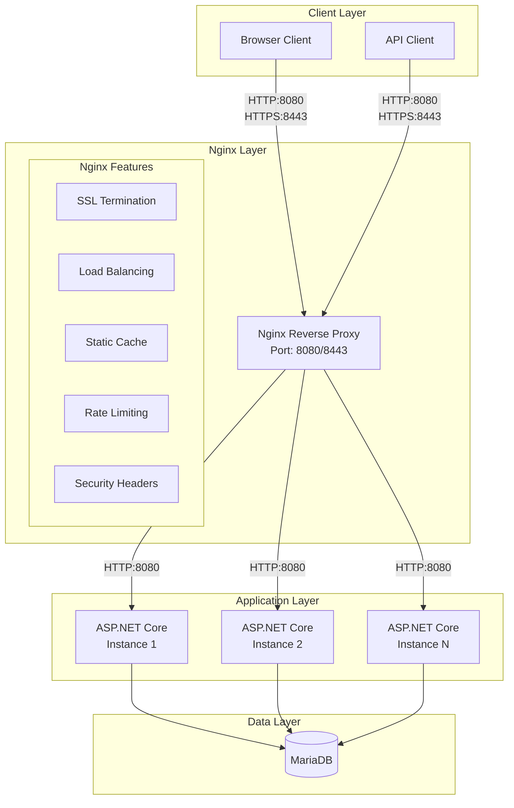
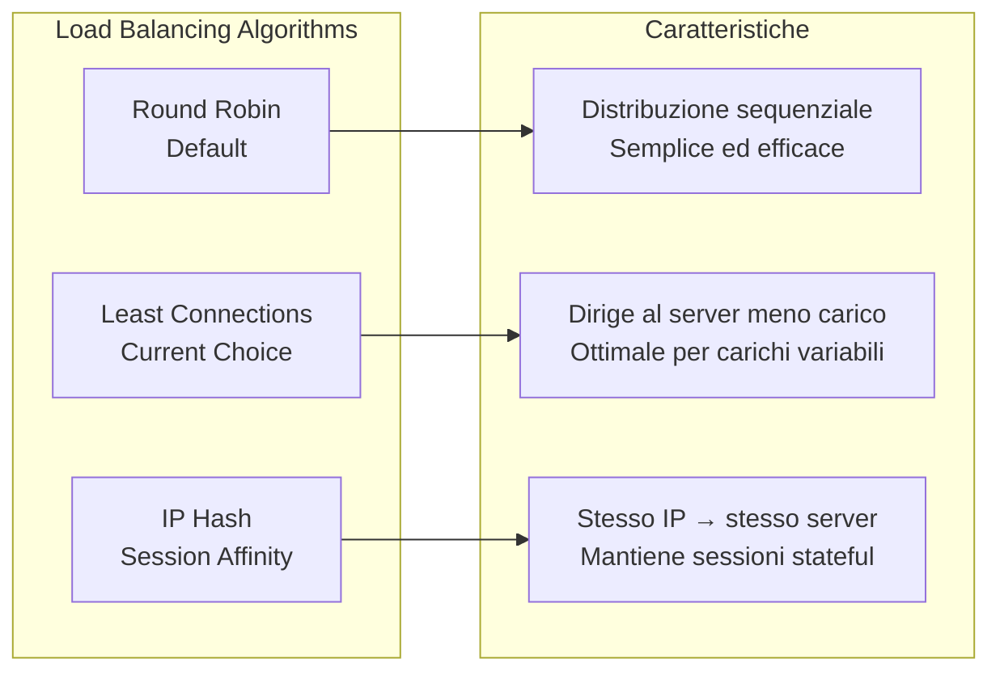
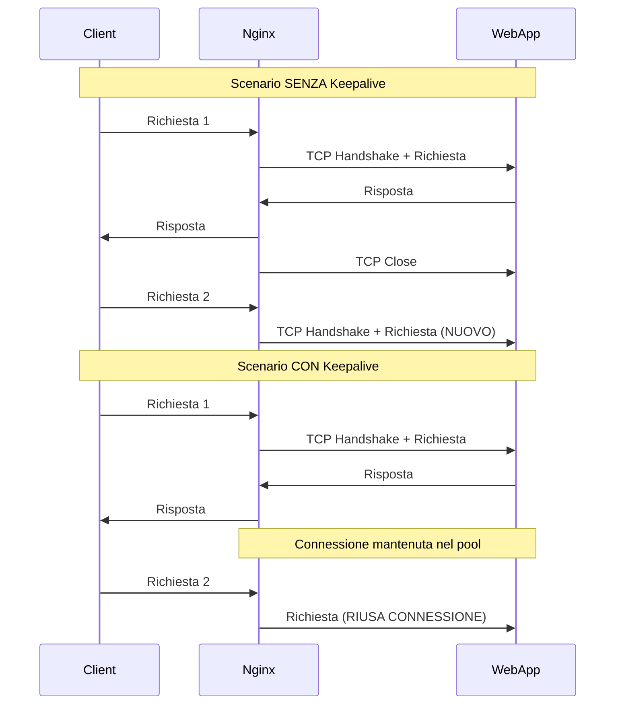
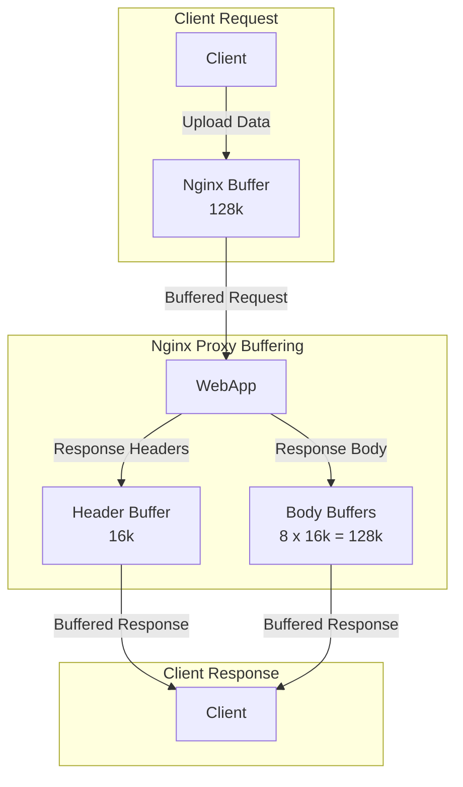
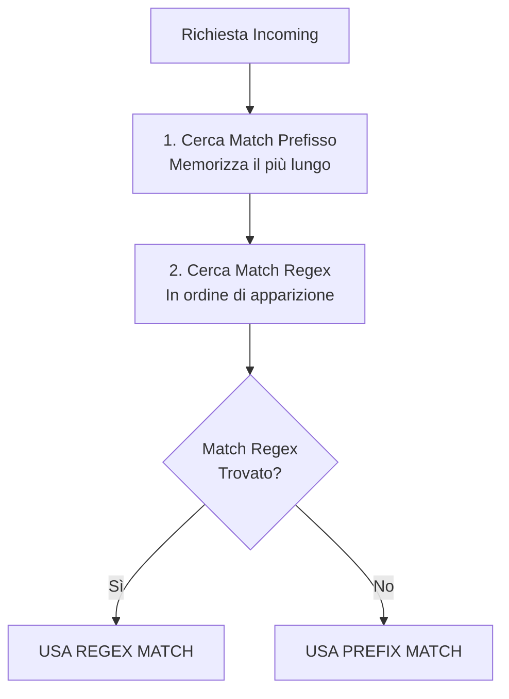
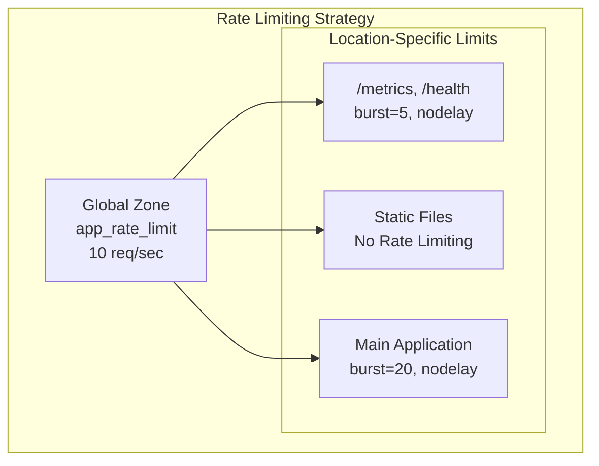
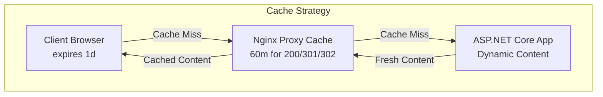

# Guida alla Configurazione Nginx per EducationalGames

## Indice

1. [Introduzione](#introduzione)
2. [Architettura e Ruolo di Nginx](#architettura-e-ruolo-di-nginx)
3. [Configurazione Docker](#configurazione-docker)
4. [Analisi della Configurazione](#analisi-della-configurazione)
5. [Configurazioni Globali](#configurazioni-globali)
6. [Configurazione Upstream](#configurazione-upstream)
7. [Configurazione SSL/TLS](#configurazione-ssltls)
8. [Header di Sicurezza](#header-di-sicurezza)
9. [Ottimizzazioni Performance](#ottimizzazioni-performance)
10. [Gestione delle Location](#gestione-delle-location)
11. [Rate Limiting](#rate-limiting)
12. [Caching Strategy](#caching-strategy)
13. [Monitoring e Debugging](#monitoring-e-debugging)
14. [Best Practices](#best-practices)

## Introduzione

Nginx nell'applicazione EducationalGames funge da **reverse proxy**, **load balancer** e **terminatore SSL/TLS**. Questa configurazione fornisce un livello di sicurezza, performance e scalabilità tra i client esterni e l'applicazione ASP.NET Core.

### Benefici dell'Architettura

- **Terminazione SSL**: Nginx gestisce la crittografia, liberando risorse dell'applicazione
- **Load Balancing**: Distribuzione del carico tra istanze multiple dell'applicazione
- **Caching**: Cache per file statici e risposte dinamiche
- **Security**: Rate limiting, header di sicurezza, controllo accessi
- **Performance**: Compressione, keep-alive, buffering ottimizzato

## Architettura e Ruolo di Nginx



## Configurazione Docker

### Container Nginx

```yaml
nginx:
  image: nginx:1.27.5
  container_name: nginx
  restart: unless-stopped
  ports:
    - "${NGINX_HTTP_HOST_PORT:-8080}:80"
    - "${NGINX_HTTPS_HOST_PORT:-8443}:443"
  volumes:
    - ./nginx/nginx.conf:/etc/nginx/nginx.conf:ro
    - ./nginx/conf.d/educationalgames.template.conf:/etc/nginx/templates/educationalgames.template.conf:ro
    - ./nginx/ssl/dev-certs:/etc/nginx/ssl/dev-certs:ro
  environment:
    - NGINX_SERVER_NAME=${NGINX_SERVER_NAME:-localhost}
    - WEBAPP_CONTAINER_INTERNAL_PORT=${WEBAPP_CONTAINER_INTERNAL_PORT:-8080}
    - NGINX_HTTPS_HOST_PORT=${NGINX_HTTPS_HOST_PORT:-8443}
  command: >
    /bin/bash -c "envsubst '$$NGINX_SERVER_NAME $$WEBAPP_CONTAINER_INTERNAL_PORT $$NGINX_HTTPS_HOST_PORT' 
    < /etc/nginx/templates/educationalgames.template.conf 
    > /etc/nginx/conf.d/default.conf && nginx -g 'daemon off;'"
  networks:
    - educationalgames_network
  depends_on:
    - webapp
```

### Mappaggio Porte

| Porta Host | Porta Container | Protocollo | Scopo |
|------------|-----------------|------------|--------|
| 8080 | 80 | HTTP | Redirection a HTTPS |
| 8443 | 443 | HTTPS | Traffico applicazione sicuro |

### Volumi Utilizzati

```yaml
volumes:
  # Configurazione principale Nginx
  - ./nginx/nginx.conf:/etc/nginx/nginx.conf:ro
  
  # Template di configurazione con variabili d'ambiente
  - ./nginx/conf.d/educationalgames.template.conf:/etc/nginx/templates/educationalgames.template.conf:ro
  
  # Certificati SSL per sviluppo
  - ./nginx/ssl/dev-certs:/etc/nginx/ssl/dev-certs:ro
```

## Analisi della Configurazione

### Struttura del File di Configurazione

```nginx
# Configurazioni globali (fuori dai blocchi server)
limit_req_zone ...
proxy_cache_path ...
upstream ...

# Server HTTP (reindirizzamento)
server {
    listen 80;
    # Reindirizza tutto a HTTPS
}

# Server HTTPS (principale)
server {
    listen 443 ssl;
    # Configurazione SSL
    # Header di sicurezza
    # Ottimizzazioni proxy
    # Location blocks
}
```

## Configurazioni Globali

### Rate Limiting Zone

```nginx
limit_req_zone $binary_remote_addr zone=app_rate_limit:10m rate=10r/s;
```

**Analisi della Configurazione:**
- **$binary_remote_addr**: Utilizza indirizzo IP client in formato binario (più efficiente)
- **zone=app_rate_limit:10m**: Crea zona di memoria condivisa di 10MB
- **rate=10r/s**: Permette media di 10 richieste per secondo per IP
- **Capacità**: 10MB supportano circa 160.000 indirizzi IP unici

### Proxy Cache Path

```nginx
proxy_cache_path /var/cache/nginx levels=1:2 keys_zone=static_cache:10m inactive=60m max_size=1g;
```

**Parametri della Cache:**
- **levels=1:2**: Struttura directory a due livelli per performance
- **keys_zone=static_cache:10m**: Zona chiavi in memoria di 10MB
- **inactive=60m**: Rimuove file non acceduti per 60 minuti
- **max_size=1g**: Dimensione massima cache su disco 1GB

## Configurazione Upstream

### Load Balancing Strategy

```nginx
upstream educationalgames_backend {
    least_conn;  # Algoritmo least connections
    
    server webapp:${WEBAPP_CONTAINER_INTERNAL_PORT} max_fails=3 fail_timeout=30s;
    
    keepalive 32;  # Pool di connessioni persistenti
}
```

### Algoritmi di Load Balancing Disponibili



### Health Check Configuration

```nginx
server webapp:8080 max_fails=3 fail_timeout=30s;
```

**Parametri Health Check:**
- **max_fails=3**: Considera server down dopo 3 fallimenti consecutivi
- **fail_timeout=30s**: Riprova il server dopo 30 secondi di pausa
- **Passive Check**: Nginx monitora le risposte naturali, non invia probe attivi

### Keepalive Optimization

```nginx
keepalive 32;
```

**Benefici del Connection Pooling:**



## Configurazione SSL/TLS

### Certificati e Protocolli

```nginx
ssl_certificate /etc/nginx/ssl/dev-certs/${NGINX_SERVER_NAME}.crt;
ssl_certificate_key /etc/nginx/ssl/dev-certs/${NGINX_SERVER_NAME}.key;

ssl_protocols TLSv1.2 TLSv1.3;
ssl_prefer_server_ciphers off;
```

### Session Management

```nginx
ssl_session_cache shared:SSL:10m;    # Cache condivisa 10MB
ssl_session_timeout 1d;              # Validità sessione 1 giorno
ssl_session_tickets off;             # Disabilita session tickets
```

**Analisi della Sicurezza SSL:**

| Configurazione | Valore | Rationale |
|----------------|---------|-----------|
| `ssl_protocols` | TLSv1.2 TLSv1.3 | Solo protocolli sicuri, esclusi SSLv3, TLS 1.0/1.1 |
| `ssl_prefer_server_ciphers` | off | Permette al client di scegliere cipher ottimale |
| `ssl_session_tickets` | off | Evita rischi Perfect Forward Secrecy |

### Supporto HTTP/2

```nginx
listen 443 ssl;
listen [::]:443 ssl;
http2 on;
```

**Benefici HTTP/2:**
- **Multiplexing**: Richieste parallele su singola connessione
- **Server Push**: Pre-caricamento risorse critiche
- **Header Compression**: Riduzione overhead HPACK
- **Binary Protocol**: Parsing più efficiente

## Header di Sicurezza

### Strict Transport Security (HSTS)

```nginx
add_header Strict-Transport-Security "max-age=63072000; includeSubDomains; preload" always;
```

**Configurazione HSTS:**
- **max-age=63072000**: 2 anni di enforcement HTTPS
- **includeSubDomains**: Applica a tutti i sottodomini
- **preload**: Idoneo per HSTS preload list

### Clickjacking Protection

```nginx
add_header X-Frame-Options "SAMEORIGIN" always;
```

**Livelli di Protezione X-Frame-Options:**
- **DENY**: Blocca completamente il framing
- **SAMEORIGIN**: Permette framing solo stesso dominio (configurazione attuale)
- **ALLOW-FROM**: Permette framing da domini specifici

### Content Type Protection

```nginx
add_header X-Content-Type-Options "nosniff" always;
add_header X-XSS-Protection "1; mode=block" always;
add_header Referrer-Policy "no-referrer-when-downgrade" always;
```

### Content Security Policy (Raccomandazione)

```nginx
# Esempio di CSP avanzato (da aggiungere se necessario)
add_header Content-Security-Policy "
    default-src 'self';
    script-src 'self' 'unsafe-inline' cdn.jsdelivr.net;
    style-src 'self' 'unsafe-inline' cdn.jsdelivr.net;
    img-src 'self' data: https:;
    font-src 'self' cdn.jsdelivr.net;
    connect-src 'self' wss:;
" always;
```

## Ottimizzazioni Performance

### Proxy Buffering

```nginx
proxy_buffering on;
proxy_buffer_size 16k;
proxy_buffers 8 16k;
client_body_buffer_size 128k;
```

**Configurazione del Buffering:**



### Timeout Configuration

```nginx
proxy_connect_timeout 60s;  # Timeout connessione backend
proxy_send_timeout 60s;     # Timeout invio dati backend
proxy_read_timeout 60s;     # Timeout lettura dati backend
```

**Strategia dei Timeout:**
- **60 secondi**: Bilanciamento tra responsiveness e resilienza
- **Shorter timeouts**: Rilevano problemi rapidamente
- **Longer timeouts**: Necessari per operazioni complesse (upload, reports)

## Gestione delle Location

### Priorità delle Location

Nginx utilizza un algoritmo di priorità specifico per le location:



### Location per Monitoring (Accesso Ristretto)

```nginx
location ~ ^/(metrics|health)$|^/api/telemetry/ {
    # Restrizioni IP
    allow 127.0.0.1;
    allow ::1;
    allow 10.0.0.0/8;
    allow 172.16.0.0/12;
    allow 192.168.0.0/16;
    deny all;
    
    # Rate limiting restrittivo
    limit_req zone=app_rate_limit burst=5 nodelay;
    
    proxy_pass http://educationalgames_backend;
}
```

**Analisi delle Restrizioni IP:**
- **127.0.0.1 / ::1**: Localhost IPv4/IPv6
- **10.0.0.0/8**: Reti private classe A
- **172.16.0.0/12**: Reti private classe B (include Docker)
- **192.168.0.0/16**: Reti private classe C

### Location per File Statici

```nginx
location ~* \.(jpg|jpeg|png|gif|ico|css|js|svg|woff|woff2|ttf)$ {
    proxy_pass http://educationalgames_backend;
    
    # Configurazione cache
    proxy_cache static_cache;
    proxy_cache_valid 200 301 302 60m;
    proxy_cache_use_stale error timeout invalid_header updating http_500 http_502 http_503 http_504;
    
    # Client-side caching
    expires 1d;
    
    # Performance
    access_log off;
    
    add_header X-Proxy-Cache $upstream_cache_status;
}
```

### Location Principale

```nginx
location / {
    limit_req zone=app_rate_limit burst=20 nodelay;
    proxy_pass http://educationalgames_backend;
    
    # Headers per WebSocket/SignalR
    proxy_set_header Upgrade $http_upgrade;
    proxy_set_header Connection "upgrade";
}
```

## Rate Limiting

### Configurazione Multi-Livello



### Parametri Rate Limiting

| Location | Base Rate | Burst | Nodelay | Strategia |
|----------|-----------|-------|---------|-----------|
| Monitoring | 10/sec | 5 | ✓ | Protezione endpoints sensibili |
| File Statici | N/A | N/A | N/A | Nessun limite (basso costo) |
| Applicazione | 10/sec | 20 | ✓ | Bilanciamento user experience |

### Algoritmo Token Bucket

```nginx
limit_req zone=app_rate_limit burst=20 nodelay;
```

**Funzionamento:**
- **Token Rate**: 10 token/secondo aggiunti al bucket
- **Bucket Size**: 20 token massimi (burst)
- **Nodelay**: Richieste burst servite immediatamente
- **Overflow**: Richieste oltre il limite ricevono 503

## Caching Strategy

### Cache Hierarchy



### Cache Configuration

```nginx
# Cache path globale
proxy_cache_path /var/cache/nginx levels=1:2 keys_zone=static_cache:10m inactive=60m max_size=1g;

# Cache nelle location
proxy_cache static_cache;
proxy_cache_valid 200 301 302 60m;
proxy_cache_use_stale error timeout invalid_header updating http_500 http_502 http_503 http_504;
```

### Cache Headers

```nginx
add_header X-Proxy-Cache $upstream_cache_status;
expires 1d;
```

**Valori X-Proxy-Cache:**
- **HIT**: Contenuto servito dalla cache
- **MISS**: Cache miss, contenuto dal backend
- **UPDATING**: Cache in aggiornamento, servito stale
- **STALE**: Contenuto scaduto servito per errore backend

## Monitoring e Debugging

### Log Configuration

```nginx
# Nel file nginx.conf principale
error_log /var/log/nginx/error.log warn;
access_log /var/log/nginx/access.log main;

# Per file statici (ottimizzazione)
access_log off;
```

### Metriche e Health Check

```nginx
location /nginx-health {
    access_log off;
    return 200 "healthy\n";
    add_header Content-Type text/plain;
}

location /nginx-status {
    stub_status on;
    access_log off;
    allow 127.0.0.1;
    deny all;
}
```

### Debug Headers

```nginx
# Aggiunti automaticamente dalla configurazione
add_header X-Proxy-Cache $upstream_cache_status;

# Headers per debugging (da aggiungere se necessario)
add_header X-Request-ID $request_id;
add_header X-Upstream-Addr $upstream_addr;
add_header X-Upstream-Response-Time $upstream_response_time;
```

## Best Practices

### Security Best Practices

1. **Principio del Minimo Privilegio**
   ```nginx
   # Accesso limitato a endpoint sensibili
   location ~ ^/(metrics|health)$ {
       allow 172.16.0.0/12;  # Solo rete Docker
       deny all;
   }
   ```

2. **Defense in Depth**
   ```nginx
   # Multipli layer di sicurezza
   limit_req zone=app_rate_limit burst=20 nodelay;  # Rate limiting
   add_header X-Frame-Options "SAMEORIGIN" always;  # Clickjacking
   ssl_protocols TLSv1.2 TLSv1.3;                   # TLS sicuro
   ```

3. **Hiding Server Information**
   ```nginx
   # Nel file nginx.conf
   server_tokens off;  # Nasconde versione Nginx
   ```

### Performance Best Practices

1. **Connection Optimization**
   ```nginx
   upstream backend {
       keepalive 32;          # Connection pooling
       keepalive_requests 100; # Richieste per connessione
       keepalive_timeout 60s; # Timeout keep-alive
   }
   ```

2. **Buffering Optimization**
   ```nginx
   proxy_buffering on;
   proxy_buffer_size 16k;      # Ottimale per header HTTP/2
   proxy_buffers 8 16k;        # 128k totali
   ```

3. **Cache Optimization**
   ```nginx
   # Cache aggressiva per asset statici
   location ~* \.(css|js|png|jpg)$ {
       expires 1y;
       add_header Cache-Control "public, immutable";
   }
   ```

### Scalability Best Practices

1. **Worker Processes**
   ```nginx
   # Nel file nginx.conf
   worker_processes auto;      # Un worker per CPU core
   worker_connections 1024;    # Connessioni per worker
   ```

2. **Resource Limits**
   ```nginx
   client_max_body_size 10m;   # Limite upload
   large_client_header_buffers 4 16k;  # Buffer grandi header
   ```

3. **Upstream Configuration**
   ```nginx
   upstream backend {
       least_conn;             # Bilanciamento ottimale
       server webapp1:8080 weight=3;    # Server più potente
       server webapp2:8080 weight=1;    # Server backup
   }
   ```

### Monitoring Best Practices

1. **Health Checks**
   ```nginx
   server webapp:8080 max_fails=3 fail_timeout=30s;
   ```

2. **Logging Strategy**
   ```nginx
   # Log dettagliati per debug
   log_format detailed '$remote_addr - $remote_user [$time_local] '
                      '"$request" $status $body_bytes_sent '
                      '"$http_referer" "$http_user_agent" '
                      'rt=$request_time uct="$upstream_connect_time" '
                      'uht="$upstream_header_time" urt="$upstream_response_time"';
   ```

3. **Metrics Collection**
   ```nginx
   # Endpoint per metriche Prometheus
   location /metrics {
       proxy_pass http://backend/metrics;
       access_log off;
   }
   ```

## Troubleshooting

### Comandi Diagnostici

```bash
# Test configurazione Nginx
nginx -t

# Reload configurazione
nginx -s reload

# Check status containers
docker-compose ps nginx

# Visualizza log real-time
docker-compose logs -f nginx

# Test connettività upstream
docker exec nginx nginx -T | grep upstream -A 10

# Test SSL certificate
openssl s_client -connect localhost:8443 -servername localhost
```

### Problemi Comuni e Soluzioni

#### 1. Errore 502 Bad Gateway

**Cause Comuni:**
- Backend non raggiungibile
- Timeout di connessione
- Problemi di rete Docker

**Diagnosi:**
```bash
# Verifica backend raggiungibile
docker exec nginx ping webapp

# Verifica configurazione upstream
docker exec nginx nginx -T | grep upstream
```

#### 2. Errore 413 Request Entity Too Large

**Soluzione:**
```nginx
client_max_body_size 10m;  # Aumenta limite upload
```

#### 3. Performance Lente

**Diagnosi:**
```bash
# Verifica metriche cache
curl -I http://localhost:8080/static/style.css
# Controlla header X-Proxy-Cache

# Verifica keep-alive
curl -v -H "Connection: keep-alive" http://localhost:8080/
```

### Log Analysis

```bash
# Analizza errori frequenti
docker exec nginx grep "error" /var/log/nginx/error.log | tail -10

# Analizza richieste lente
docker exec nginx awk '$NF > 1.0' /var/log/nginx/access.log

# Analizza rate limiting
docker exec nginx grep "503" /var/log/nginx/access.log | wc -l
```

## Conclusioni

La configurazione Nginx per EducationalGames implementa un stack completo di funzionalità enterprise:

- **Sicurezza**: TLS moderno, header di sicurezza, rate limiting
- **Performance**: Caching intelligente, connection pooling, buffering ottimizzato
- **Scalabilità**: Load balancing, health checks, timeout configurabili
- **Monitoring**: Logging dettagliato, metriche, debugging headers

Questa configurazione fornisce una base solida per un ambiente di produzione, con possibilità di estensione per funzionalità avanzate come WAF, geo-blocking, o caching Redis.
