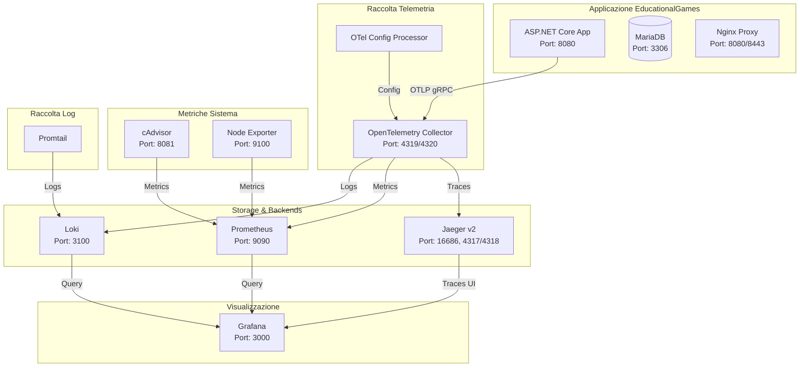
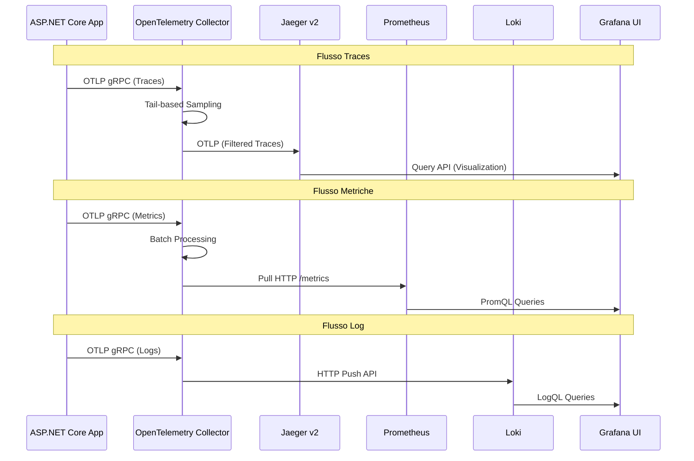
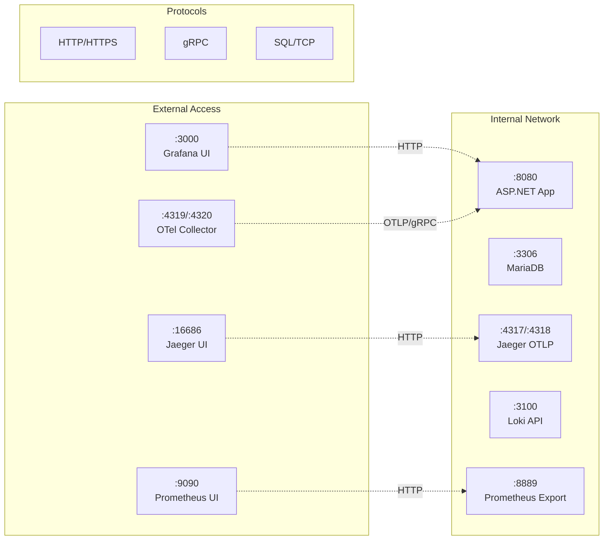

# Guida Completa all'Osservabilità con OpenTelemetry

## Indice

1. [Introduzione](#introduzione)
2. [Architettura dell'Osservabilità](#architettura-dellosservabilità)
3. [Componenti del Sistema](#componenti-del-sistema)
4. [Flusso dei Dati](#flusso-dei-dati)
5. [Configurazione Dettagliata](#configurazione-dettagliata)
6. [Implementazione OpenTelemetry in ASP.NET Core](#implementazione-opentelemetry-in-aspnet-core)
7. [Visualizzazione dei Dati](#visualizzazione-dei-dati)
8. [Testing e Verifica](#testing-e-verifica)
9. [Troubleshooting](#troubleshooting)
10. [Riferimenti e Documentazione](#riferimenti-e-documentazione)

## Introduzione

Questo documento fornisce una guida completa all'implementazione dell'osservabilità nell'applicazione distribuita EducationalGames utilizzando OpenTelemetry e un ecosistema di strumenti per la raccolta, elaborazione e visualizzazione di **metriche**, **log** e **traces**.

L'osservabilità è implementata seguendo i principi dei "Three Pillars of Observability":

- **Metriche**: Dati numerici aggregati nel tempo
- **Log**: Record di eventi discreti
- **Traces**: Rappresentazione del percorso di una richiesta attraverso il sistema distribuito

## Architettura dell'Osservabilità



## Componenti del Sistema

### 1. OpenTelemetry Collector

#### Funzionalità Principali

L'OpenTelemetry Collector è il componente centrale per la raccolta, elaborazione e routing dei dati di telemetria. Supporta:

- **Receivers**: Raccolta dati da diverse sorgenti (OTLP, Jaeger, Zipkin)
- **Processors**: Elaborazione e trasformazione dei dati (batch, tail sampling)
- **Exporters**: Invio dati a diversi backend (Jaeger, Prometheus, Loki)

#### Utilizzo nel Progetto

Nel contesto di EducationalGames, il Collector funge da hub centrale che:

- Riceve telemetria dall'applicazione ASP.NET Core via OTLP
- Applica tail-based sampling per ottimizzare le performance
- Distribuisce i dati ai backend appropriati (Jaeger per traces, Prometheus per metriche, Loki per log)

#### Configurazione Docker

```yaml
otel-collector:
  image: otel/opentelemetry-collector-contrib:0.128.0
  container_name: otel-collector
  restart: unless-stopped
  command: ["--config=/etc/otelcol-contrib/config.yml"]
  volumes:
    - otel_config_volume:/etc/otelcol-contrib:ro
  ports:
    - "4319:4317" # OTLP gRPC (mapped to avoid conflict)
    - "4320:4318" # OTLP HTTP (mapped to avoid conflict)
    - "8889:8889" # Prometheus metrics exporter
    - "8888:8888" # OTel Collector metrics
  environment:
    GOMEMLIMIT: ${OTEL_COLLECTOR_MEMORY_LIMIT:-512MiB}
  networks:
    - educationalgames_network
```

**Analisi della Configurazione:**

- **Porte**: 4319/4320 esposte all'host per evitare conflitti con Jaeger
- **Volumi**: Configurazione dinamica tramite volume condiviso
- **Memoria**: Limitata a 512MB con garbage collection ottimizzato
- **Network**: Comunicazione interna tramite rete Docker dedicata

#### Protocolli di Comunicazione

- **OTLP gRPC** (porta 4317): Protocollo principale per ricevere telemetria
- **OTLP HTTP** (porta 4318): Alternative HTTP per compatibilità
- **HTTP** (porta 8889): Esposizione metriche in formato Prometheus

### 2. Jaeger v2

#### 2.1 Funzionalità Principali

Jaeger v2 è il sistema di distributed tracing che fornisce:

- **Trace Collection**: Raccolta e storage delle traces distribuite
- **Query Service**: API per ricerca e recupero traces
- **Web UI**: Interfaccia grafica per visualizzazione e analisi
- **Sampling**: Configurazione del campionamento per ottimizzare performance

#### 2,2 Utilizzo nel Progetto

Jaeger traccia il percorso delle richieste attraverso l'applicazione distribuita, permettendo di:

- Identificare bottleneck di performance
- Analizzare dipendenze tra servizi
- Debuggare problemi in ambiente distribuito
- Monitorare SLA e latenze

#### 2.3 Configurazione Docker

```yaml
jaeger:
  image: jaegertracing/jaeger:2.7.0
  container_name: jaeger
  restart: unless-stopped
  ports:
    - "16686:16686" # Jaeger UI
    - "4317:4317"   # OTLP gRPC receiver
    - "4318:4318"   # OTLP HTTP receiver
  volumes:
    - ./jaeger/jaeger-config.yaml:/jaeger/config.yaml:ro
  command: ["--config", "/jaeger/config.yaml"]
  networks:
    - educationalgames_network
```

**Protocolli e Porte:**

- **HTTP** (16686): Web UI per visualizzazione traces
- **OTLP gRPC** (4317): Ricezione traces dal Collector
- **OTLP HTTP** (4318): Alternative HTTP per traces

### 3. Prometheus

#### 3.1 Funzionalità Principali

Prometheus è il sistema di monitoraggio e time-series database che offre:

- **Metric Collection**: Raccolta metriche via pull model
- **Time Series Storage**: Storage ottimizzato per dati temporali
- **Query Language (PromQL)**: Linguaggio di query per analisi
- **Alerting**: Sistema di alerting basato su regole

#### 3.2 Utilizzo nel Progetto

Prometheus centralizza la raccolta di metriche da:

- OpenTelemetry Collector (metriche applicazione)
- cAdvisor (metriche container)
- Node Exporter (metriche sistema)

#### 3.3 Configurazione Docker

```yaml
prometheus:
  image: prom/prometheus:latest
  container_name: prometheus
  restart: unless-stopped
  ports:
    - "9090:9090"
  volumes:
    - ./prometheus:/etc/prometheus
    - prometheus_data:/prometheus
  command:
    - "--config.file=/etc/prometheus/prometheus.yml"
    - "--storage.tsdb.path=/prometheus"
    - "--storage.tsdb.retention.time=15d"
    - "--storage.tsdb.retention.size=10GB"
    - "--web.enable-lifecycle"
  networks:
    - educationalgames_network
```

**Configurazione Storage:**

- **Retention**: 15 giorni o 10GB massimo
- **Volumi**: Configurazione e dati persistenti
- **Reload**: Supporto per ricarica configurazione dinamica

### 4. Grafana

#### 4.1 Funzionalità Principali

Grafana è la piattaforma di visualizzazione che fornisce:

- **Dashboard**: Cruscotti personalizzabili per metriche e log
- **Data Sources**: Connessioni a multiple sorgenti dati
- **Alerting**: Sistema di alerting avanzato
- **Plugin Ecosystem**: Estendibilità tramite plugin

#### 4.2 Utilizzo nel Progetto

Grafana unifica la visualizzazione di:

- Metriche da Prometheus
- Log da Loki
- Traces da Jaeger (tramite plugin)

#### 4.2 Configurazione Docker

```yaml
grafana:
  image: grafana/grafana:latest
  container_name: grafana
  restart: unless-stopped
  ports:
    - "3000:3000"
  volumes:
    - grafana_data:/var/lib/grafana
  networks:
    - educationalgames_network
```

### 5. Loki

#### 5.1 Funzionalità Principali

Loki è il sistema di log aggregation che offre:

- **Log Indexing**: Indicizzazione efficiente basata su label
- **LogQL**: Linguaggio di query simile a PromQL
- **Multi-tenancy**: Supporto per più tenant
- **Cost-effective**: Storage ottimizzato per costi

#### 5.2 Utilizzo nel Progetto

Loki raccoglie e indicizza:

- Log dell'applicazione ASP.NET Core
- Log dei container Docker
- Log di sistema tramite Promtail

#### 5.3 Configurazione Docker

```yaml
loki:
  image: grafana/loki:2.9.0
  container_name: loki
  restart: unless-stopped
  ports:
    - "3100:3100"
  volumes:
    - ./loki/config.yml:/etc/loki/local-config.yaml:ro
    - loki_data:/loki
  command: -config.file=/etc/loki/local-config.yaml
  networks:
    - educationalgames_network
```

### 6. Promtail

#### 6.1 Funzionalità Principali

Promtail è l'agente di raccolta log per Loki che:

- **Log Discovery**: Scoperta automatica file di log
- **Label Extraction**: Estrazione metadata dai log
- **Pipeline Processing**: Trasformazione e parsing log
- **Reliable Delivery**: Consegna affidabile a Loki

#### 6.2 Configurazione Docker

```yaml
promtail:
  image: grafana/promtail:2.9.0
  container_name: promtail
  restart: unless-stopped
  volumes:
    - ./promtail/config.yml:/etc/promtail/docker-config.yaml:ro
    - /var/log:/var/log:ro
    - /var/lib/docker/containers:/var/lib/docker/containers:ro
  command: -config.file=/etc/promtail/docker-config.yaml
  networks:
    - educationalgames_network
```

### 7. cAdvisor

#### 7.1 Funzionalità Principali

cAdvisor monitora le risorse e performance dei container:

- **Container Metrics**: CPU, memoria, rete, filesystem
- **Real-time Monitoring**: Metriche in tempo reale
- **Historical Data**: Dati storici delle performance
- **Web UI**: Interfaccia web per visualizzazione

#### 7.2 Configurazione Docker

```yaml
cadvisor:
  image: gcr.io/cadvisor/cadvisor:latest
  container_name: cadvisor
  restart: unless-stopped
  ports:
    - "8081:8080"
  volumes:
    - /:/rootfs:ro
    - /var/run:/var/run:rw
    - /sys:/sys:ro
    - /var/lib/docker/:/var/lib/docker:ro
  networks:
    - educationalgames_network
```

### 8. Node Exporter

#### 8.1 Funzionalità Principali

Node Exporter raccoglie metriche del sistema operativo:

- **System Metrics**: CPU, memoria, disco, rete
- **Process Monitoring**: Metriche dei processi
- **Filesystem Stats**: Statistiche filesystem
- **Network Stats**: Statistiche di rete

#### 8.2 Configurazione Docker

```yaml
node-exporter:
  image: prom/node-exporter:latest
  container_name: node-exporter
  restart: unless-stopped
  ports:
    - "9100:9100"
  volumes:
    - "/proc:/host/proc:ro"
    - "/sys:/host/sys:ro"
    - "/:/rootfs:ro"
  command:
    - "--path.procfs=/host/proc"
    - "--path.sysfs=/host/sys"
    - "--path.rootfs=/rootfs"
    - "--collector.filesystem.mount-points-exclude=^/(sys|proc|dev|host|etc)($$|/)"
  networks:
    - educationalgames_network
```

## Flusso dei Dati

### Architettura del Flusso Telemetrico



### Mappatura Porte e Protocolli



## Configurazione Dettagliata

### OpenTelemetry Collector Configuration

La configurazione del Collector è definita in `otel-collector-config.template.yml`:

```yaml
receivers:
  otlp:
    protocols:
      grpc:
        endpoint: 0.0.0.0:4317
      http:
        endpoint: 0.0.0.0:4318

processors:
  batch:
    timeout: 10s
  
  tail_sampling:
    decision_wait: 10s
    num_traces: 50000
    policies:
      - name: errors-policy
        type: status_code
        status_code:
          status_codes: [ERROR]
      - name: slow-traces-policy
        type: latency
        latency:
          threshold_ms: ${OTEL_TAIL_SAMPLING_LATENCY_THRESHOLD_MS}
      - name: statistical-sampling-policy
        type: probabilistic
        probabilistic:
          sampling_percentage: ${OTEL_TAIL_SAMPLING_PROBABILISTIC_PERCENT}

exporters:
  otlp/jaeger:
    endpoint: http://jaeger:4317
    tls:
      insecure: true
  
  loki:
    endpoint: http://loki:3100/loki/api/v1/push
    default_labels_enabled:
      exporter: false
      job: true
  
  prometheus:
    endpoint: "0.0.0.0:8889"

service:
  pipelines:
    traces:
      receivers: [otlp]
      processors: [batch, tail_sampling]
      exporters: [otlp/jaeger]
    metrics:
      receivers: [otlp]
      processors: [batch]
      exporters: [prometheus]
    logs:
      receivers: [otlp]
      processors: [batch]
      exporters: [loki]
```

### Jaeger v2 Configuration

La configurazione di Jaeger v2 è definita in `jaeger/jaeger-config.yaml`:

```yaml
extensions:
  jaeger_query:
    storage:
      traces: memory_storage
    grpc:
      endpoint: "0.0.0.0:16685"
    http:
      endpoint: "0.0.0.0:16686"

  jaeger_storage:
    backends:
      memory_storage:
        memory:
          max_traces: 50000

receivers:
  otlp:
    protocols:
      grpc:
        endpoint: "0.0.0.0:4317"
      http:
        endpoint: "0.0.0.0:4318"

service:
  extensions: [jaeger_storage, jaeger_query, remote_sampling, healthcheckv2]
  pipelines:
    traces:
      receivers: [otlp, jaeger, zipkin]
      processors: [batch]
      exporters: [jaeger_storage_exporter]
```

## Implementazione OpenTelemetry in ASP.NET Core

### Configurazione nel Program.cs

L'applicazione ASP.NET Core implementa OpenTelemetry attraverso il seguente setup:

```csharp
// Configurazione OpenTelemetry
builder.Services.AddOpenTelemetry()
    .ConfigureResource(resource => 
        resource.AddService(
            serviceName: builder.Configuration["OTEL_SERVICE_NAME"] ?? "EducationalGames",
            serviceVersion: builder.Configuration["OTEL_SERVICE_VERSION"] ?? "1.0.0"
        )
        .AddAttributes(resourceAttributes)
    )
    .WithTracing(tracing =>
        tracing
            .AddAspNetCoreInstrumentation(options =>
            {
                options.RecordException = true;
                options.Filter = (httpContext) => 
                {
                    var path = httpContext.Request.Path.Value;
                    return !path?.Contains("/metrics") == true &&
                           !path?.Contains("/health") == true;
                };
            })
            .AddEntityFrameworkCoreInstrumentation()
            .AddHttpClientInstrumentation()
            .AddOtlpExporter()
    )
    .WithMetrics(metrics =>
        metrics
            .AddAspNetCoreInstrumentation()
            .AddHttpClientInstrumentation()
            .AddRuntimeInstrumentation()
            .AddProcessInstrumentation()
            .AddOtlpExporter()
            .AddPrometheusExporter()
    )
    .WithLogging(logging =>
        logging.AddOtlpExporter()
    );
```

### Variabili di Ambiente OpenTelemetry

L'applicazione utilizza le seguenti variabili di ambiente per la configurazione:

```bash
# Endpoint e protocollo
OTEL_EXPORTER_OTLP_ENDPOINT=http://otel-collector:4317
OTEL_EXPORTER_OTLP_PROTOCOL=grpc

# Identificazione servizio
OTEL_SERVICE_NAME=EducationalGames
OTEL_SERVICE_VERSION=1.0.0

# Resource attributes
OTEL_RESOURCE_ATTRIBUTES=service.name=EducationalGames,service.version=1.0.0,deployment.environment=docker

# Configurazione export
OTEL_TRACES_EXPORTER=otlp
OTEL_METRICS_EXPORTER=otlp,prometheus
OTEL_LOGS_EXPORTER=otlp

# Ottimizzazioni batch
OTEL_BSP_SCHEDULE_DELAY=5000
OTEL_BSP_EXPORT_TIMEOUT=30000
OTEL_BSP_MAX_EXPORT_BATCH_SIZE=512
OTEL_BSP_MAX_QUEUE_SIZE=2048
```

### Instrumentation Automatica

L'applicazione beneficia di instrumentation automatica per:

- **ASP.NET Core**: Request/response tracing, HTTP metrics
- **Entity Framework Core**: Database operation tracing
- **HTTP Client**: Outbound HTTP request tracing
- **Runtime**: .NET runtime metrics (GC, memory, threads)
- **Process**: System process metrics

### Custom Instrumentation Example

Per aggiungere telemetria personalizzata:

```csharp
// Configurazione ActivitySource
private static readonly ActivitySource ActivitySource = new("EducationalGames.CustomOperations");

// Esempio di custom span
public async Task<IResult> CustomOperation()
{
    using var activity = ActivitySource.StartActivity("custom-operation");
    activity?.SetTag("operation.type", "business-logic");
    
    try
    {
        // Logica business
        await DoSomethingAsync();
        
        activity?.SetStatus(ActivityStatusCode.Ok);
        return Results.Ok();
    }
    catch (Exception ex)
    {
        activity?.SetStatus(ActivityStatusCode.Error, ex.Message);
        activity?.RecordException(ex);
        throw;
    }
}
```

## Visualizzazione dei Dati

### 1. Jaeger UI - Distributed Tracing

**URL**: http://localhost:16686

#### Funzionalità Principali:

- **Search**: Ricerca traces per servizio, operazione, tag
- **Timeline View**: Visualizzazione cronologica degli span
- **Service Map**: Mappa delle dipendenze tra servizi
- **Performance Analysis**: Analisi latenze e bottleneck

#### Come Utilizzare:

1. Accedere a http://localhost:16686
2. Selezionare il servizio "EducationalGames"
3. Impostare filtri temporali
4. Cliccare "Find Traces"
5. Analizzare traces individuali per identificare problemi

#### Esempi di Query:

- Traces con errori: `error=true`
- Traces lente: `duration > 1s`
- Specific endpoint: `http.route="/api/account/login"`

### 2. Prometheus UI - Metriche

**URL**: http://localhost:9090

#### Query Essenziali:

```promql
# Request rate per endpoint
rate(http_requests_total[5m])

# Latenza media
histogram_quantile(0.95, rate(http_request_duration_seconds_bucket[5m]))

# Error rate
rate(http_requests_total{status=~"5.."}[5m]) / rate(http_requests_total[5m])

# Memory usage
process_resident_memory_bytes / 1024 / 1024

# Database connection pool
dotnet_connection_pool_usage
```

### 3. Grafana - Dashboard Unificati

**URL**: http://localhost:3000
**Credenziali Default**: admin/admin

#### Setup Data Sources:

1. **Prometheus**:
   - URL: `http://prometheus:9090`
   - Access: Server (default)

2. **Loki**:
   - URL: `http://loki:3100`
   - Access: Server (default)

3. **Jaeger**:
   - URL: `http://jaeger:16686`
   - Access: Server (default)

#### Dashboard Consigliati:

##### Application Performance Dashboard

```json
{
  "dashboard": {
    "title": "EducationalGames - Application Performance",
    "panels": [
      {
        "title": "Request Rate",
        "targets": [
          {
            "expr": "rate(http_requests_total{job=\"educationalgames\"}[5m])"
          }
        ]
      },
      {
        "title": "Response Time P95",
        "targets": [
          {
            "expr": "histogram_quantile(0.95, rate(http_request_duration_seconds_bucket{job=\"educationalgames\"}[5m]))"
          }
        ]
      }
    ]
  }
}
```

##### Infrastructure Dashboard

```json
{
  "dashboard": {
    "title": "EducationalGames - Infrastructure",
    "panels": [
      {
        "title": "Container CPU Usage",
        "targets": [
          {
            "expr": "rate(container_cpu_usage_seconds_total{name=~\"webapp|mariadb|nginx\"}[5m]) * 100"
          }
        ]
      },
      {
        "title": "Container Memory Usage",
        "targets": [
          {
            "expr": "container_memory_usage_bytes{name=~\"webapp|mariadb|nginx\"} / 1024 / 1024"
          }
        ]
      }
    ]
  }
}
```

### 4. Log Analysis con Loki

#### LogQL Query Examples

```logql
# Log dell'applicazione
{container_name="webapp"}

# Errori nell'applicazione
{container_name="webapp"} |= "ERROR"

# Log di database
{container_name="mariadb"}

# Query con filtri temporali
{container_name="webapp"} | json | level="Error" | __error__ = ""

# Aggregazioni
rate({container_name="webapp"} |= "ERROR" [5m])
```

## Testing e Verifica

### 1. Test Connettività Base

```bash
#!/bin/bash
# File: test-connectivity.sh

echo "Testing basic connectivity..."

# Test Grafana
echo "Testing Grafana..."
curl -f http://localhost:3000 > /dev/null && echo "✅ Grafana OK" || echo "❌ Grafana FAIL"

# Test Prometheus
echo "Testing Prometheus..."
curl -f http://localhost:9090 > /dev/null && echo "✅ Prometheus OK" || echo "❌ Prometheus FAIL"

# Test Jaeger
echo "Testing Jaeger..."
curl -f http://localhost:16686 > /dev/null && echo "✅ Jaeger OK" || echo "❌ Jaeger FAIL"

# Test OpenTelemetry Collector metrics
echo "Testing OTel Collector..."
curl -f http://localhost:8889/metrics > /dev/null && echo "✅ OTel Collector OK" || echo "❌ OTel Collector FAIL"

# Test Loki
echo "Testing Loki..."
curl -f http://localhost:3100/ready > /dev/null && echo "✅ Loki OK" || echo "❌ Loki FAIL"
```

### 2. Test Generazione Telemetria

```bash
#!/bin/bash
# File: generate-telemetry.sh

echo "Generating telemetry data..."

# Genera traffico per creare traces e metriche
for i in {1..10}; do
    curl -s http://localhost:8080/ > /dev/null
    curl -s http://localhost:8080/api/account/profile > /dev/null
    sleep 1
done

echo "Telemetry generation completed."
echo "Check Jaeger UI: http://localhost:16686"
echo "Check Grafana: http://localhost:3000"
```

### 3. Test Metriche Specifiche

```bash
#!/bin/bash
# File: test-metrics.sh

echo "Testing specific metrics..."

# Test Prometheus metrics endpoint
METRICS_ENDPOINT="http://localhost:8889/metrics"
echo "Fetching metrics from $METRICS_ENDPOINT"

# Verifica presenza metriche chiave
curl -s $METRICS_ENDPOINT | grep -E "(http_requests_total|otelcol_process_uptime)" && echo "✅ Key metrics found" || echo "❌ Key metrics missing"

# Test Prometheus query API
PROM_ENDPOINT="http://localhost:9090/api/v1/query"
QUERY="up"
echo "Testing Prometheus query API..."

curl -s -G "$PROM_ENDPOINT" --data-urlencode "query=$QUERY" | jq '.status' | grep -q "success" && echo "✅ Prometheus query OK" || echo "❌ Prometheus query FAIL"
```

### 4. Test Log Ingestion

```bash
#!/bin/bash
# File: test-logs.sh

echo "Testing log ingestion..."

# Test Loki query API
LOKI_ENDPOINT="http://localhost:3100/loki/api/v1/query"
QUERY='{container_name="webapp"}'

echo "Testing Loki query API..."
curl -s -G "$LOKI_ENDPOINT" --data-urlencode "query=$QUERY" | jq '.status' | grep -q "success" && echo "✅ Loki query OK" || echo "❌ Loki query FAIL"

# Test Promtail health
echo "Testing Promtail..."
docker logs promtail 2>&1 | grep -q "Promtail started" && echo "✅ Promtail started" || echo "❌ Promtail issue"
```

### 5. Test Jaeger Traces

```bash
#!/bin/bash
# File: test-traces.sh

echo "Testing Jaeger traces..."

# Test Jaeger API
JAEGER_ENDPOINT="http://localhost:16686/api/services"

echo "Fetching services from Jaeger..."
SERVICES=$(curl -s $JAEGER_ENDPOINT | jq '.data[]' | grep -o '"EducationalGames"')

if [ ! -z "$SERVICES" ]; then
    echo "✅ EducationalGames service found in Jaeger"
else
    echo "❌ EducationalGames service not found in Jaeger"
fi

# Test per traces recenti
TRACES_ENDPOINT="http://localhost:16686/api/traces"
PARAMS="?service=EducationalGames&limit=10"

echo "Fetching recent traces..."
TRACES=$(curl -s "${TRACES_ENDPOINT}${PARAMS}" | jq '.data | length')

if [ "$TRACES" -gt 0 ]; then
    echo "✅ Found $TRACES traces"
else
    echo "❌ No traces found"
fi
```

### 6. Comprehensive Health Check

```powershell
# File: health-check.ps1
# Comprehensive health check script for PowerShell

Write-Host "=== EducationalGames Observability Health Check ===" -ForegroundColor Green

# Function to test HTTP endpoint
function Test-Endpoint {
    param($url, $name)
    try {
        $response = Invoke-WebRequest -Uri $url -Method GET -TimeoutSec 5 -UseBasicParsing
        if ($response.StatusCode -eq 200) {
            Write-Host "✅ $name OK" -ForegroundColor Green
            return $true
        }
    } catch {
        Write-Host "❌ $name FAIL: $($_.Exception.Message)" -ForegroundColor Red
        return $false
    }
}

# Test all endpoints
$endpoints = @(
    @{url="http://localhost:3000"; name="Grafana"},
    @{url="http://localhost:9090"; name="Prometheus"},
    @{url="http://localhost:16686"; name="Jaeger UI"},
    @{url="http://localhost:8889/metrics"; name="OTel Collector"},
    @{url="http://localhost:3100/ready"; name="Loki"},
    @{url="http://localhost:8081"; name="cAdvisor"},
    @{url="http://localhost:9100"; name="Node Exporter"}
)

$results = @()
foreach ($endpoint in $endpoints) {
    $result = Test-Endpoint -url $endpoint.url -name $endpoint.name
    $results += $result
}

# Summary
$successCount = ($results | Where-Object { $_ -eq $true }).Count
$totalCount = $results.Count

Write-Host "`n=== Summary ===" -ForegroundColor Yellow
Write-Host "✅ $successCount/$totalCount services healthy" -ForegroundColor Green

if ($successCount -eq $totalCount) {
    Write-Host "🎉 All observability services are running correctly!" -ForegroundColor Green
} else {
    Write-Host "⚠️  Some services need attention." -ForegroundColor Yellow
}
```

## Troubleshooting

### Problemi Comuni e Soluzioni

#### 1. Container in Restart Loop

**Sintomi**: Container Jaeger o OTel Collector in stato "Restarting"

**Diagnosi**:

```bash
docker-compose logs jaeger --tail=20
docker-compose logs otel-collector --tail=20
```

**Soluzioni**:

- Verificare configurazione YAML
- Controllare conflitti di porte
- Verificare volumi e permessi

#### 2. Metriche Non Visibili

**Sintomi**: Prometheus non raccoglie metriche

**Diagnosi**:

```bash
# Verifica targets Prometheus
curl http://localhost:9090/api/v1/targets

# Verifica endpoint metriche
curl http://localhost:8889/metrics
```

**Soluzioni**:

- Verificare configurazione Prometheus
- Controllare network connectivity
- Verificare formato metriche

#### 3. Traces Non Visibili

**Sintomi**: Jaeger non mostra traces

**Diagnosi**:

```bash
# Verifica configurazione OTel Collector
docker exec otel-collector cat /etc/otelcol-contrib/config.yml

# Verifica log Jaeger
docker-compose logs jaeger | grep ERROR
```

**Soluzioni**:

- Verificare OTLP endpoint configuration
- Controllare sampling policies
- Verificare network routes

#### 4. Log Non Indicizzati

**Sintomi**: Loki non riceve log

**Diagnosi**:

```bash
# Verifica Promtail
docker-compose logs promtail

# Test Loki API
curl -X POST "http://localhost:3100/loki/api/v1/push" \
  -H "Content-Type: application/json" \
  -d '{"streams": [{"stream": {"job": "test"}, "values": [["1640995200000000000", "test log"]]}]}'
```

### Debug Commands Utili

```bash
# Container status
docker-compose ps

# Resource usage
docker stats

# Network inspection
docker network inspect educationalgamesroot_educationalgames_network

# Volume inspection
docker volume ls
docker volume inspect educationalgamesroot_otel_config_volume

# Configuration files
docker exec otel-collector cat /etc/otelcol-contrib/config.yml
docker exec jaeger cat /jaeger/config.yaml

# Service discovery
docker-compose exec prometheus cat /etc/prometheus/prometheus.yml
```

## Riferimenti e Documentazione

### Documentazione Ufficiale

1. **OpenTelemetry**
   - [OpenTelemetry Official Docs](https://opentelemetry.io/docs/)
   - [OpenTelemetry .NET](https://opentelemetry.io/docs/instrumentation/net/)
   - [OpenTelemetry Collector](https://opentelemetry.io/docs/collector/)

2. **Jaeger**
   - [Jaeger Documentation](https://www.jaegertracing.io/docs/)
   - [Jaeger v2 Migration Guide](https://www.jaegertracing.io/docs/latest/migration/)

3. **Prometheus**
   - [Prometheus Documentation](https://prometheus.io/docs/)
   - [PromQL Guide](https://prometheus.io/docs/prometheus/latest/querying/basics/)

4. **Grafana**
   - [Grafana Documentation](https://grafana.com/docs/)
   - [Grafana Dashboards](https://grafana.com/grafana/dashboards/)

5. **Loki & Promtail**
   - [Loki Documentation](https://grafana.com/docs/loki/)
   - [LogQL Guide](https://grafana.com/docs/loki/latest/logql/)

### Best Practices

#### Performance Optimization

- Utilizzare tail-based sampling per ridurre overhead
- Configurare batch processors per ottimizzare network
- Impostare retention policies appropriate
- Monitorare resource usage dei componenti

#### Security Considerations

- Utilizzare TLS per comunicazioni esterne
- Configurare authentication per Grafana
- Limitare accesso alle metriche sensibili
- Implementare proper RBAC

#### Scalability Guidelines

- Configurare resource limits appropriati
- Utilizzare external storage per production
- Implementare load balancing per high traffic
- Considerare sharding per large datasets

### Risorse Aggiuntive

- [CNCF Observability Landscape](https://landscape.cncf.io/card-mode?category=observability-and-analysis)
- [OpenTelemetry Specification](https://github.com/open-telemetry/opentelemetry-specification)
- [Grafana Community Dashboards](https://grafana.com/grafana/dashboards/)
- [Prometheus Exporters](https://prometheus.io/docs/instrumenting/exporters/)

---

*Questa guida fornisce una panoramica completa dell'implementazione dell'osservabilità nel progetto EducationalGames. Per ulteriori dettagli su configurazioni specifiche, consultare la documentazione ufficiale dei singoli componenti.*
