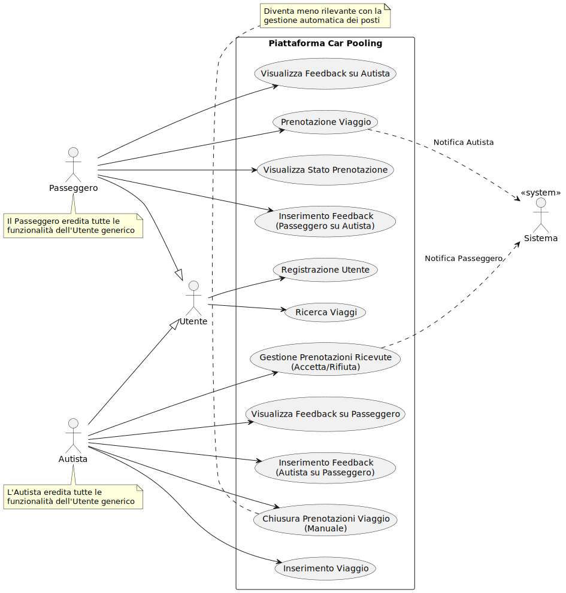
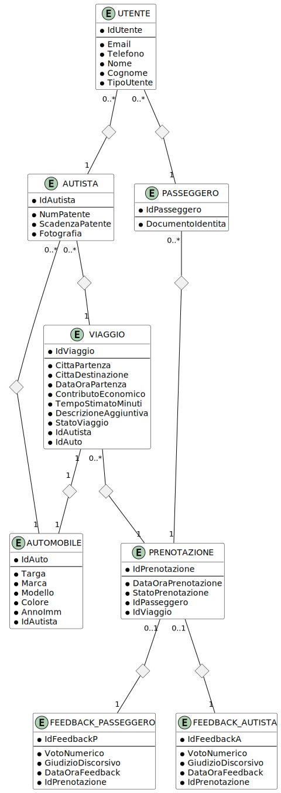
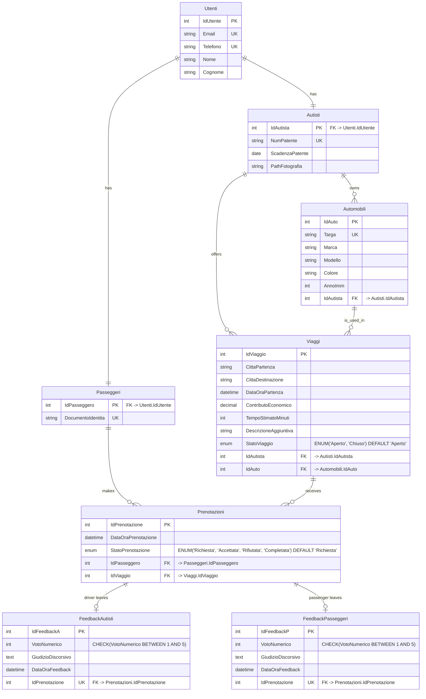
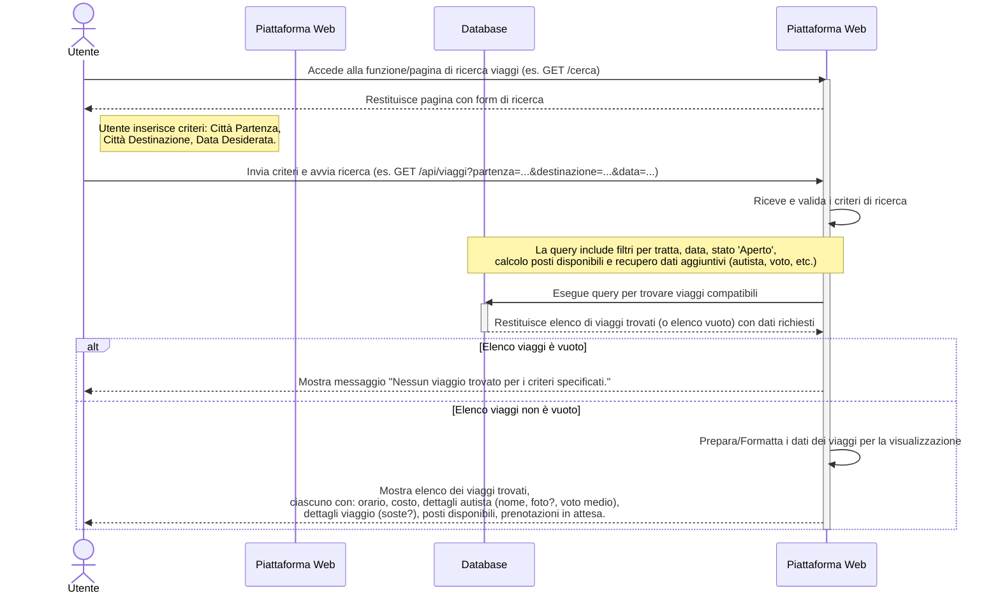

# Sessione ordinaria 2017 - seconda prova scritta - Indirizzo ITIA - INFORMATICA E TELECOMUNICAZIONI ARTICOLAZIONE "INFORMATICA" - Disciplina: INFORMATICA

## Traccia della prova

[La traccia della prova](https://www.istruzione.it/esame_di_stato/201617/Istituti%20tecnici/Ordinaria/I044_ORD17.pdf) è disponibile sul sito del Ministero dell'Istruzione e del Merito.

## Svolgimento della prima parte

### Prima Parte

#### 1\. Analisi della Realtà di Riferimento e Schema Concettuale (E/R)

Seguendo l'approccio RASD (Requisiti, Analisi, Specifica, Design) procediamo con l'analisi.

**A. Dizionario dei Dati e Requisiti:**

- **Utenti:** Entità generica che rappresenta chi interagisce con la piattaforma. Può specializzarsi in Autista o Passeggero. Ogni utente ha recapito telefonico ed email.
- **Autista:** Utente che offre passaggi. Deve registrarsi fornendo generalità, numero e scadenza patente, dati automobile, recapito telefonico, email, fotografia.
- **Passeggero:** Utente che cerca passaggi. Deve registrarsi fornendo cognome, nome, documento di identità, recapito telefonico, email.
- **Automobile:** Veicolo utilizzato dall'autista. Sono richiesti i "dati dell'automobile" (ipotizziamo marca, modello, targa, colore, anno immatricolazione). Un autista può avere una o più auto, ma per un viaggio ne usa una specifica.
- **Viaggio:** Tragitto offerto da un autista. Caratterizzato da città di partenza, città di destinazione, data e ora di partenza, contributo economico per passeggero, tempi di percorrenza stimati. Può avere dettagli aggiuntivi come soste previste, possibilità di caricare bagaglio o animali. Un viaggio ha uno stato (es: Aperto, Chiuso alle prenotazioni).
- **Prenotazione:** Richiesta di un passeggero per un determinato viaggio. Ha uno stato (es: Richiesta, Accettata, Rifiutata). Contiene un riferimento al passeggero e al viaggio.
- **Feedback:** Valutazione lasciata da un utente (passeggero o autista) su un altro utente al termine di un viaggio. Include un voto numerico e un giudizio discorsivo.
- **Funzionalità Principali:**
    - Registrazione Utenti (Autisti e Passeggeri).
    - Inserimento Viaggi da parte degli Autisti.
    - Ricerca Viaggi da parte dei Passeggeri (per città e data).
    - Visualizzazione Dettagli Viaggio e Autista (inclusi feedback).
    - Prenotazione Viaggio da parte dei Passeggeri.
    - Gestione Prenotazioni da parte degli Autisti (Accetta/Rifiuta, visualizzazione feedback passeggero).
    - Notifiche Email (prenotazione a autista, accettazione/rifiuto a passeggero).
    - Inserimento Feedback (Passeggero -> Autista, Autista -> Passeggero).
    - Chiusura Prenotazioni Viaggio da parte dell'Autista.

**B. Attori e Casi d'Uso (Use Case Diagram):**

:memo: Nota: Per il compito in classe basta elencarli e dettagliarne qualcuno, poi si scrive il diagramma dei casi d'uso principali come mostrato sotto.

**1\. Registrazione Utente**

- **Attori:** Utente non registrato, Sistema.
- **Descrizione/Flusso Base:**
    1. L'Utente accede alla pagina/sezione di registrazione della piattaforma.
    2. Il Sistema presenta un form per inserire i dati comuni (es. Email, Telefono, Nome, Cognome - basato sullo schema logico derivato).
    3. L'Utente sceglie se registrarsi principalmente come Autista o Passeggero (o il sistema potrebbe gestire i ruoli separatamente dopo la registrazione base).
    4. **Se Autista:** Il Sistema richiede dati aggiuntivi: generalità (già inserite), numero e scadenza patente, dati dell'automobile (marca, modello, targa, ecc.), fotografia.  
    5. **Se Passeggero:** Il Sistema richiede dati aggiuntivi: cognome e nome (già inseriti), documento di identità.  
    6. L'Utente inserisce i dati richiesti.
    7. Il Sistema valida i dati (es. formato email, unicità email/telefono/patente/documento).
    8. Il Sistema crea l'account utente e memorizza i dati specifici del ruolo (Autista/Passeggero).
    9. Il Sistema conferma all'utente l'avvenuta registrazione.
- **Precondizioni:** L'utente non deve avere già un account con la stessa email/telefono.
- **Postcondizioni (Successo):** L'utente ha un account sulla piattaforma con il ruolo specificato (Autista o Passeggero o entrambi) ed è in grado di effettuare il login.

**2\. Inserimento Viaggio**

- **Attori:** Autista, Sistema.
- **Descrizione/Flusso Base:**
    1. L'Autista effettua il login sulla piattaforma.
    2. L'Autista accede alla funzione per inserire un nuovo viaggio.
    3. Il Sistema presenta un form per inserire i dettagli del viaggio.
    4. L'Autista inserisce: città di partenza, città di destinazione, data ed ora di partenza, contributo economico richiesto per passeggero, tempi di percorrenza stimati.  
    5. (Opzionale, ma menzionato) L'Autista può inserire dettagli aggiuntivi: soste previste, possibilità di caricare bagaglio o animali.  
    6. (Aggiunta dal Quesito I) L'Autista inserisce il numero massimo di posti disponibili per quel viaggio.  
    7. L'Autista seleziona l'automobile che utilizzerà per il viaggio tra quelle associate al suo profilo.  
    8. L'Autista conferma l'inserimento.
    9. Il Sistema valida i dati.
    10. Il Sistema memorizza il nuovo viaggio associandolo all'autista e all'auto selezionata, impostando lo stato iniziale su 'Aperto'.  
    11. Il Sistema conferma all'autista l'avvenuto inserimento.
- **Precondizioni:** L'Autista deve essere registrato e loggato. L'Autista deve avere almeno un'automobile registrata sul proprio profilo.
- **Postcondizioni (Successo):** Un nuovo viaggio è stato creato, è visibile nelle ricerche (se soddisfa i criteri) ed è disponibile per le prenotazioni.

**3\. Ricerca Viaggi**

- **Attori:** Utente (registrato o non), Passeggero, Sistema.
- **Descrizione/Flusso Base:**
    1. L'Utente/Passeggero accede alla funzione di ricerca viaggi.
    2. Il Sistema presenta un form per inserire i criteri di ricerca.
    3. L'Utente/Passeggero inserisce almeno città di partenza, città di destinazione e data desiderata.  
    4. L'Utente/Passeggero avvia la ricerca.
    5. Il Sistema interroga il database cercando i viaggi che corrispondono ai criteri, che abbiano prenotazioni non ancora chiuse e (dal Quesito I) che abbiano posti disponibili.  
    6. Il Sistema presenta all'utente un elenco dei viaggi trovati. Per ogni viaggio mostra informazioni essenziali (orario, costo), le caratteristiche dell'autista (nome, foto?, voto medio ), e i dettagli del viaggio inseriti dall'autista (soste, bagaglio, animali ). (Dal Quesito I) Mostra anche il numero di posti disponibili e il numero di prenotazioni non ancora accettate.  
- **Precondizioni:** Nessuna particolare (accessibile anche a utenti non loggati).
- **Postcondizioni (Successo):** L'utente visualizza un elenco di viaggi che corrispondono ai suoi criteri di ricerca, oppure un messaggio che indica che non sono stati trovati viaggi.

**4\. Prenotazione Viaggio**

- **Attori:** Passeggero, Sistema.
- **Descrizione/Flusso Base:**
    1. Il Passeggero, dopo aver effettuato una ricerca (UC3) o navigato tra i viaggi disponibili, seleziona un viaggio di suo interesse.  
    2. Il Passeggero esamina i dettagli del viaggio, dell'autista e i relativi feedback.  
    3. Il Passeggero decide di prenotare e attiva l'apposita funzione (es. click su un bottone "Prenota").
    4. Il Sistema registra la richiesta di prenotazione, associandola al passeggero e al viaggio scelto, impostando lo stato iniziale su 'Richiesta'.
    5. Il Sistema invia una notifica (email) all'autista del viaggio scelto, informandolo della nuova prenotazione e fornendo le informazioni sul passeggero.  
    6. Il Sistema conferma al Passeggero che la richiesta di prenotazione è stata inviata all'autista.
- **Precondizioni:** Il Passeggero deve essere registrato e loggato. Il viaggio selezionato deve avere posti disponibili (vedi UC3) e stato 'Aperto'. Il Passeggero non deve essere l'autista del viaggio stesso. Il Passeggero non deve avere già una prenotazione attiva per lo stesso viaggio.
- **Postcondizioni (Successo):** Una nuova prenotazione è stata creata con stato 'Richiesta'. L'autista è stato notificato. Il passeggero è in attesa di una risposta.

**5\. Gestione Prenotazioni (Accetta/Rifiuta)**

- **Attori:** Autista, Sistema.
- **Descrizione/Flusso Base:**
    1. L'Autista riceve la notifica di una nuova richiesta di prenotazione (vedi UC4) o accede alla sezione "Le mie prenotazioni ricevute" sulla piattaforma.
    2. L'Autista visualizza i dettagli della prenotazione e del passeggero che l'ha effettuata.
    3. L'Autista può consultare sul portale il voto medio e i giudizi dei feedback ricevuti da quel passeggero da parte di altri autisti precedenti.  
    4. L'Autista decide se accettare o rifiutare la prenotazione.  
    5. **Se Accetta:** a. (Controllo dal Quesito I) Il Sistema verifica se ci sono ancora posti disponibili nel viaggio (considerando le prenotazioni già accettate). Se non ci sono posti, l'accettazione fallisce (flusso alternativo). b. Il Sistema aggiorna lo stato della prenotazione a 'Accettata'. c. (Gestione dal Quesito I) Il Sistema decrementa (logicamente) il numero di posti disponibili per quel viaggio. d. Il Sistema invia una notifica (email) di accettazione al passeggero, contenente un promemoria del viaggio (città, data, orario, dati autista e auto).  
    6. **Se Rifiuta:** a. Il Sistema aggiorna lo stato della prenotazione a 'Rifiutata'. b. Il Sistema invia una notifica (email) di rifiuto al passeggero.  
    7. Il Sistema aggiorna la visualizzazione delle prenotazioni per l'autista.
- **Precondizioni:** Esiste una prenotazione con stato 'Richiesta' per un viaggio offerto dall'autista. L'Autista è loggato.
- **Postcondizioni (Successo):** Lo stato della prenotazione è stato aggiornato ('Accettata' o 'Rifiutata'). Il passeggero è stato notificato della decisione. Se accettata, un posto nel viaggio è considerato occupato.

**6\. Inserimento Feedback**

- **Attori:** Passeggero, Autista, Sistema.
- **Descrizione/Flusso Base:**
    1. Dopo che un viaggio si è concluso (la prenotazione è stata completata o il sistema determina la conclusione del viaggio).
    2. Il Passeggero accede alla piattaforma e alla sezione per lasciare feedback.
    3. Il Sistema mostra le prenotazioni relative a viaggi conclusi per cui non è stato ancora lasciato feedback sull'autista.
    4. Il Passeggero seleziona la prenotazione/viaggio e inserisce un feedback sull'autista: voto numerico e giudizio discorsivo.  
    5. Il Sistema salva il feedback del passeggero associandolo alla prenotazione (e quindi implicitamente all'autista e al viaggio).
    6. Analogamente, l'Autista accede alla piattaforma per lasciare feedback.
    7. Il Sistema mostra le prenotazioni relative a viaggi conclusi per cui non è stato ancora lasciato feedback sul passeggero.
    8. L'Autista seleziona la prenotazione/passeggero e inserisce un feedback sul passeggero: voto numerico e giudizio discorsivo.  
    9. Il Sistema salva il feedback dell'autista associandolo alla prenotazione (e quindi implicitamente al passeggero e al viaggio).
    10. Il Sistema aggiorna i dati aggregati (voto medio) per l'autista e per il passeggero che hanno ricevuto il feedback.  
- **Precondizioni:** Il viaggio associato alla prenotazione deve essersi concluso. L'utente (Passeggero o Autista) deve essere loggato. Non deve essere già stato inserito un feedback per quella specifica interazione (Passeggero->Autista o Autista->Passeggero) relativa a quella prenotazione.
- **Postcondizioni (Successo):** Il feedback è stato salvato. Il voto medio dell'utente recensito è stato aggiornato. Il feedback è visibile ad altri utenti secondo le regole.  

**7\. Chiusura Prenotazioni Viaggio**

- **Attori:** Autista, Sistema.
- **Descrizione/Flusso Base:**
    1. L'Autista accede alla gestione di un viaggio che ha inserito precedentemente e le cui prenotazioni sono ancora 'Aperte'.
    2. L'Autista decide che non vuole più accettare nuove prenotazioni per quel viaggio (ad esempio perché ha raggiunto il numero desiderato di passeggeri accettati, o per altri motivi).  
    3. L'Autista attiva l'apposita funzione sul portale per "chiudere le prenotazioni".  
    4. Il Sistema aggiorna lo stato del viaggio a 'Chiuso'.
    5. Il Sistema conferma all'autista l'avvenuta modifica.
- **Precondizioni:** L'Autista è loggato ed è il proprietario del viaggio. Lo stato del viaggio è 'Aperto'.
- **Postcondizioni (Successo):** Lo stato del viaggio è 'Chiuso'. Il viaggio non apparirà più nelle ricerche di nuovi passeggeri (o verrà indicato come non prenotabile). Le prenotazioni esistenti con stato 'Richiesta' potrebbero rimanere gestibili dall'autista o essere automaticamente rifiutate (ipotesi aggiuntiva da definire). *Nota: Questo caso d'uso diventa meno rilevante o cambia natura con l'introduzione della gestione automatica dei posti del Quesito I, dove la chiusura avviene implicitamente quando i posti accettati raggiungono il massimo.*
- **Diagramma dei Casi d'Uso Principali:**



Immagine dei casi d'uso generata con il codice per [PlantUML](https://www.plantuml.com/plantuml/uml/):

```text
@startuml "Piattaforma Car Pooling - Casi d'Uso"

left to right direction

' Attori
actor "Utente" as utente
actor "Passeggero" as passeggero
actor "Autista" as autista
actor "Sistema" as sistema <<system>>

' Ereditarietà tra attori
passeggero --|> utente
autista --|> utente

rectangle "Piattaforma Car Pooling" {
  ' Casi d'uso dell'Utente generico
  usecase "Ricerca Viaggi" as RicercaViaggi
  usecase "Registrazione Utente" as Registrazione
  
  ' Casi d'uso del Passeggero
  usecase "Visualizza Feedback su Autista" as VisualizzaFeedbackAutista
  usecase "Prenotazione Viaggio" as PrenotaViaggio
  usecase "Visualizza Stato Prenotazione" as VisualizzaStato
  usecase "Inserimento Feedback\n(Passeggero su Autista)" as InserisciFeedbackP
  
  ' Casi d'uso dell'Autista
  usecase "Inserimento Viaggio" as InserisciViaggio
  usecase "Gestione Prenotazioni Ricevute\n(Accetta/Rifiuta)" as GestisciPrenotazioni
  usecase "Visualizza Feedback su Passeggero" as VisualizzaFeedbackPasseggero
  usecase "Inserimento Feedback\n(Autista su Passeggero)" as InserisciFeedbackA
  usecase "Chiusura Prenotazioni Viaggio\n(Manuale)" as ChiudiPrenotazioni
}

' Relazioni tra attori e casi d'uso
utente --> RicercaViaggi
utente --> Registrazione

passeggero --> VisualizzaFeedbackAutista
passeggero --> PrenotaViaggio
passeggero --> VisualizzaStato
passeggero --> InserisciFeedbackP

autista --> InserisciViaggio
autista --> GestisciPrenotazioni
autista --> VisualizzaFeedbackPasseggero
autista --> InserisciFeedbackA
autista --> ChiudiPrenotazioni

' Relazioni con il sistema (notifiche)
PrenotaViaggio ..> sistema : Notifica Autista
GestisciPrenotazioni ..> sistema : Notifica Passeggero

' Note aggiuntive
note bottom of passeggero
  Il Passeggero eredita tutte le 
  funzionalità dell'Utente generico
end note

note bottom of autista
  L'Autista eredita tutte le
  funzionalità dell'Utente generico
end note

note bottom of ChiudiPrenotazioni
  Diventa meno rilevante con la
  gestione automatica dei posti
end note

@enduml
```

**C. Schema Concettuale E/R (Entity-Relationship):**

- **Entità:**

    - `UTENTE` (IdUtente PK, Email, Telefono, Nome, Cognome, TipoUtente{'Autista', 'Passeggero'}) - *Nota: Generalizzazione/Specializzazione.*
    - `AUTISTA` (-> `UTENTE`) (NumPatente, ScadenzaPatente, Fotografia)
    - `PASSEGGERO` (-> `UTENTE`) (DocumentoIdentita)
    - `AUTOMOBILE` (IdAuto PK, Targa, Marca, Modello, Colore, AnnoImm) - *Ipotesi aggiuntiva sui dati.*
    - `VIAGGIO` (IdViaggio PK, CittaPartenza, CittaDestinazione, DataOraPartenza, ContributoEconomico, TempoStimato, DescrizioneAggiuntiva, StatoViaggio{'Aperto', 'Chiuso'})
    - `PRENOTAZIONE` (IdPrenotazione PK, DataOraPrenotazione, StatoPrenotazione{'Richiesta', 'Accettata', 'Rifiutata'})
    - `FEEDBACK` (IdFeedback PK, VotoNumerico, GiudizioDiscorsivo, DataOraFeedback)
- **Relazioni:**

    - `Possiede` (N:M tra `AUTISTA` e `AUTOMOBILE`, con attributo DataAssociazione) - *Ipotesi: un autista può avere più auto e un'auto può essere (teoricamente) condivisa, anche se improbabile. Semplificazione: 1:N tra Autista e Auto se un'auto appartiene a un solo autista.* Assumiamo 1:N per semplicità: `AUTISTA` (1) --- `Possiede` --- (N) `AUTOMOBILE`.
    - `Offre` (1:N tra `AUTISTA` e `VIAGGIO`)
    - `Utilizza` (1:1 tra `VIAGGIO` e `AUTOMOBILE`) - *Un viaggio specifico usa una sola auto*.
    - `Richiede` (1:N tra `PASSEGGERO` e `PRENOTAZIONE`)
    - `Riguarda` (1:N tra `VIAGGIO` e `PRENOTAZIONE`)
    - `LasciaFeedbackAutista` (1:N tra `PASSEGGERO` e `FEEDBACK`, riferito a un viaggio specifico) \- Ternaria tra PASSEGGERO, AUTISTA (ricevente), VIAGGIO. Semplificabile se il feedback è legato alla prenotazione.
    - `LasciaFeedbackPasseggero` (1:N tra `AUTISTA` e `FEEDBACK`, riferito a un viaggio specifico) \- Ternaria tra AUTISTA, PASSEGGERO (ricevente), VIAGGIO. Semplificabile.
    - `RiceveFeedbackAutista` (1:N tra `AUTISTA` e `FEEDBACK`)
    - `RiceveFeedbackPasseggero` (1:N tra `PASSEGGERO` e `FEEDBACK`)
- Schema E/R Ristrutturato (Semplificato):

    Per semplificare i feedback sono collegati alla PRENOTAZIONE (che lega implicitamente passeggero, autista e viaggio).

    

    Il modello E/R è stato ottenuto con il codice per [PlantUML](https://www.plantuml.com/plantuml/uml/):

    ```text
    @startuml "Car Pooling E/R Diagram"

    !define ENTITY entity
    !define RELATIONSHIP diamond

    ' Stile delle entità e relazioni
    skinparam class {
    BackgroundColor White
    ArrowColor Black
    BorderColor Black
    }
    skinparam diamond {
    BackgroundColor LightBlue
    BorderColor Blue
    }

    ' Entità
    ENTITY "UTENTE" as utente {
    * IdUtente
    --
    * Email
    * Telefono
    * Nome
    * Cognome
    * TipoUtente
    }

    ENTITY "AUTISTA" as autista {
    * IdAutista 
    --
    * NumPatente
    * ScadenzaPatente
    * Fotografia
    }

    ENTITY "PASSEGGERO" as passeggero {
    * IdPasseggero
    --
    * DocumentoIdentita
    }

    ENTITY "AUTOMOBILE" as automobile {
    * IdAuto
    --
    * Targa
    * Marca
    * Modello
    * Colore
    * AnnoImm
    * IdAutista
    }

    ENTITY "VIAGGIO" as viaggio {
    * IdViaggio
    --
    * CittaPartenza
    * CittaDestinazione
    * DataOraPartenza
    * ContributoEconomico
    * TempoStimatoMinuti
    * DescrizioneAggiuntiva
    * StatoViaggio
    * IdAutista
    * IdAuto
    }

    ENTITY "PRENOTAZIONE" as prenotazione {
    * IdPrenotazione
    --
    * DataOraPrenotazione
    * StatoPrenotazione
    * IdPasseggero  
    * IdViaggio
    }

    ENTITY "FEEDBACK_PASSEGGERO" as feedbackP {
    * IdFeedbackP
    --
    * VotoNumerico
    * GiudizioDiscorsivo
    * DataOraFeedback
    * IdPrenotazione
    }

    ENTITY "FEEDBACK_AUTISTA" as feedbackA {
    * IdFeedbackA
    --
    * VotoNumerico
    * GiudizioDiscorsivo
    * DataOraFeedback
    * IdPrenotazione
    }

    ' Relazioni con rombi
    RELATIONSHIP "is_a_autista" as r1
    RELATIONSHIP "is_a_passeggero" as r2
    RELATIONSHIP "possesses" as r3
    RELATIONSHIP "offers" as r4
    RELATIONSHIP "uses" as r5
    RELATIONSHIP "requests" as r6
    RELATIONSHIP "regards" as r7
    RELATIONSHIP "leaves_feedback_p" as r8
    RELATIONSHIP "leaves_feedback_a" as r9

    ' Collegamenti
    utente "0..*" -- r1
    r1 -- "1" autista

    utente "0..*" -- r2
    r2 -- "1" passeggero

    autista "0..*" -- r3
    r3 -- "1" automobile

    autista "0..*" -- r4
    r4 -- "1" viaggio

    viaggio "1" -- "1" r5
    r5 -- "1" automobile

    passeggero "0..*" -- r6
    r6 -- "1" prenotazione

    viaggio "0..*" -- r7
    r7 -- "1" prenotazione

    prenotazione "0..1" -- r8
    r8 -- "1" feedbackP

    prenotazione "0..1" -- r9
    r9 -- "1" feedbackA

    @enduml
    ```

- **Vincoli e Ipotesi Aggiuntive:**

    - Email e Telefono sono unici per `UTENTE`.
    - NumPatente, DocumentoIdentita, Targa sono unici.
    - Un utente non può essere contemporaneamente Autista e Passeggero (o meglio, si registra come utente e poi può agire in entrambi i ruoli, ma la specializzazione nello schema E/R potrebbe essere gestita diversamente nel logico, ad esempio con campi specifici nella tabella Utente). Assumiamo che un Utente possa avere entrambi i ruoli, quindi la specializzazione diventa attributi nullable nella tabella Utenti o tabelle separate collegate 1:1 a Utente. Scegliamo tabelle separate per chiarezza.
    - Il contributo economico è per passeggero.
    - Il voto numerico del feedback è in una scala definita (es. 1-5).
    - La fotografia dell'autista è memorizzata come BLOB o come path a un file storage. Scegliamo path per semplicità.
    - `StatoViaggio`: 'Aperto', 'Chiuso'.
    - `StatoPrenotazione`: 'Richiesta', 'Accettata', 'Rifiutata', 'Completata' (post-viaggio).
    - I feedback possono essere inseriti solo dopo che il viaggio è avvenuto (StatoPrenotazione = 'Completata').
    - Le città potrebbero essere normalizzate in una tabella `CITTA` a parte. Per semplicità le lasciamo come stringhe.

#### 2\. Schema Logico Relazionale

Mapping dello schema E/R ristrutturato in relazioni (tabelle) per un database relazionale (MariaDB).

- **Utenti** (`IdUtente` PK, `Email` UK, `Telefono` UK, `Nome`, `Cognome`)
    - *Nota:* Il TipoUtente non è necessario se usiamo tabelle separate per i ruoli.
- **Autisti** (`IdAutista` PK FK -> Utenti.IdUtente, `NumPatente` UK, `ScadenzaPatente`, `PathFotografia`)
- **Passeggeri** (`IdPasseggero` PK FK -> Utenti.IdUtente, `DocumentoIdentita` UK)
- **Automobili** (`IdAuto` PK, `Targa` UK, `Marca`, `Modello`, `Colore`, `AnnoImm`, `IdAutista` FK -> Autisti.IdAutista)
- **Viaggi** (`IdViaggio` PK, `CittaPartenza`, `CittaDestinazione`, `DataOraPartenza`, `ContributoEconomico`, `TempoStimatoMinuti`, `DescrizioneAggiuntiva`, `StatoViaggio` ENUM('Aperto', 'Chiuso') DEFAULT 'Aperto', `IdAutista` FK -> Autisti.IdAutista, `IdAuto` FK -> Automobili.IdAuto)
- **Prenotazioni** (`IdPrenotazione` PK, `DataOraPrenotazione`, `StatoPrenotazione` ENUM('Richiesta', 'Accettata', 'Rifiutata', 'Completata') DEFAULT 'Richiesta', `IdPasseggero` FK -> Passeggeri.IdPasseggero, `IdViaggio` FK -> Viaggi.IdViaggio)
- **FeedbackAutisti** (`IdFeedbackA` PK, `VotoNumerico` INT CHECK(VotoNumerico BETWEEN 1 AND 5), `GiudizioDiscorsivo` TEXT, `DataOraFeedback`, `IdPrenotazione` UK FK -> Prenotazioni.IdPrenotazione) - *Feedback lasciato dall'autista sul passeggero*
- **FeedbackPasseggeri** (`IdFeedbackP` PK, `VotoNumerico` INT CHECK(VotoNumerico BETWEEN 1 AND 5), `GiudizioDiscorsivo` TEXT, `DataOraFeedback`, `IdPrenotazione` UK FK -> Prenotazioni.IdPrenotazione) - *Feedback lasciato dal passeggero sull'autista*



Normalizzazione:

Lo schema proposto è ragionevolmente normalizzato (3NF). Le dipendenze funzionali sembrano rispettare le chiavi primarie. Ad esempio, in Viaggi, tutti gli attributi dipendono da IdViaggio. Non ci sono evidenti dipendenze transitive problematiche. La possibile denormalizzazione delle città è stata considerata ma scartata per semplicità. L'uso di ENUM per gli stati è una scelta implementativa valida in MariaDB/MySQL.

#### 3\. Interrogazioni SQL (MariaDB)

a) Elencare i viaggi disponibili per tratta e data:

```sql
SELECT
    -- Dati autista
    A.IdAutista,
    U.Nome AS NomeAutista,
    U.Cognome AS CognomeAutista,
    -- Dati auto
    AU.Marca AS MarcaAuto,
    AU.Modello AS ModelloAuto,
    AU.Targa AS TargaAuto,
    -- Dati viaggio
    V.DataOraPartenza,
    V.ContributoEconomico
FROM
    Viaggi AS V
JOIN
    Autisti AS A ON V.IdAutista = A.IdAutista
JOIN
    Utenti AS U ON A.IdAutista = U.IdUtente -- Join Utenti per nome/cognome autista
JOIN
    Automobili AS AU ON V.IdAuto = AU.IdAuto -- Join Automobili per dettagli auto
WHERE
    V.CittaPartenza = ?       -- Parametro: città di partenza fornita
    AND V.CittaDestinazione = ? -- Parametro: città di arrivo fornita
    AND DATE(V.DataOraPartenza) = ? -- Parametro: data fornita (es: '2024-12-25')
    AND V.StatoViaggio = 'Aperto'   -- Solo viaggi con prenotazioni non chiuse 
ORDER BY
    V.DataOraPartenza ASC;          -- Ordine crescente di orario 
```

b) Dati per promemoria prenotazione accettata:

```sql
SELECT
    -- Dati Viaggio
    V.CittaPartenza,
    V.CittaDestinazione,
    V.DataOraPartenza,
    -- Dati Autista (tramite Utenti alias U)
    U.Nome AS NomeAutista,
    U.Cognome AS CognomeAutista,
    U.Telefono AS TelefonoAutista,
    -- Dati Automobile
    AU.Marca AS MarcaAuto,
    AU.Modello AS ModelloAuto,
    AU.Targa AS TargaAuto,
    AU.Colore AS ColoreAuto
FROM
    Prenotazioni AS P
JOIN
    Viaggi AS V ON P.IdViaggio = V.IdViaggio -- Lega prenotazione al viaggio
JOIN
    Autisti AS A ON V.IdAutista = A.IdAutista -- Lega viaggio all'autista
JOIN
    Utenti AS U ON A.IdAutista = U.IdUtente -- Prende dati anagrafici autista (ALIAS RICHIESTO: U)
JOIN
    Automobili AS AU ON V.IdAuto = AU.IdAuto -- Prende dati auto usata per il viaggio
WHERE
    P.IdPrenotazione = ?          -- Parametro: ID della prenotazione specifica
    AND P.StatoPrenotazione = 'Accettata'; -- Assicura che sia stata accettata
```

c) Elenco passeggeri prenotati per un viaggio con voto medio superiore a X:

- **Soluzione con tabella temporanea (non modifica lo schema)**
  
    ```sql
    -- PASSO 1: Creare una tabella temporanea per memorizzare il voto medio di ciascun passeggero
    CREATE TEMPORARY TABLE TempFeedbackMedio (
        IdPasseggero INT PRIMARY KEY,
        AvgVoto DECIMAL(3, 2) -- Assumendo voti con max 1 decimale, es. 4.5
    );

    -- PASSO 2: Popolare la tabella temporanea calcolando il voto medio
    INSERT INTO TempFeedbackMedio (IdPasseggero, AvgVoto)
    SELECT
        Pre.IdPasseggero,
        AVG(FB.VotoNumerico) AS AvgVoto
    FROM
        Prenotazioni AS Pre -- Prenotazioni storiche (Alias: Pre)
    JOIN
        FeedbackAutisti AS FB ON Pre.IdPrenotazione = FB.IdPrenotazione -- Feedback ricevuti (Alias: FB)
    -- WHERE Pre.StatoPrenotazione = 'Completata' -- Opzionale: considera solo viaggi completati
    GROUP BY
        Pre.IdPasseggero;

    -- PASSO 3: Eseguire la query principale, unendo la tabella temporanea
    SELECT
        Pass.IdPasseggero,
        U.Nome AS NomePasseggero,
        U.Cognome AS CognomePasseggero,
        -- Prendo il voto medio dalla tabella temporanea (può essere NULL se il passeggero non è nella tabella temp)
        TFM.AvgVoto AS VotoMedioRicevutoDalPasseggero
    FROM
        Prenotazioni AS P -- Prenotazioni per il viaggio corrente (Alias: P)
    JOIN
        Passeggeri AS Pass ON P.IdPasseggero = Pass.IdPasseggero
    JOIN
        Utenti AS U ON Pass.IdPasseggero = U.IdUtente -- Dati anagrafici passeggero (Alias: U)
    LEFT JOIN
        TempFeedbackMedio AS TFM ON Pass.IdPasseggero = TFM.IdPasseggero -- Join con la tabella temporanea
    WHERE
        P.IdViaggio = ? -- Parametro: ID del viaggio che l'autista sta esaminando
        AND P.StatoPrenotazione = 'Richiesta' -- Solo prenotazioni in attesa
        AND (TFM.AvgVoto > ? OR TFM.AvgVoto IS NULL) -- Filtro: Voto medio > X OPPURE passeggero non trovato nella tabella temp (AvgVoto è NULL)
    ORDER BY
        VotoMedioRicevutoDalPasseggero DESC NULLS LAST, -- Opzionale: ordina per voto
        U.Cognome ASC,
        U.Nome ASC;

    -- PASSO 4: (Importante!) Rimuovere la tabella temporanea quando non serve più
    DROP TEMPORARY TABLE IF EXISTS TempFeedbackMedio;
    ```

    **Spiegazione dell'approccio con Tabella Temporanea:**

    1. **`CREATE TEMPORARY TABLE TempFeedbackMedio`**: Si crea una tabella che esisterà solo per la durata della sessione corrente. Conterrà l'ID del passeggero e il suo voto medio calcolato.
    2. **`INSERT INTO TempFeedbackMedio ... SELECT ...`**: Si esegue la query che calcola il voto medio per ogni passeggero (unendo `Prenotazioni` storiche `Pre` e `FeedbackAutisti` `FB` e raggruppando per passeggero) e si inseriscono i risultati nella tabella temporanea appena creata.
    3. **`SELECT ... FROM Prenotazioni P ... LEFT JOIN TempFeedbackMedio TFM ...`**: Si esegue la query finale. Questa seleziona i passeggeri dalla prenotazione corrente (`P`) e usa un `LEFT JOIN` con la tabella temporanea `TempFeedbackMedio` (`TFM`) per recuperare il voto medio precedentemente calcolato. Il `LEFT JOIN` è fondamentale per includere anche i passeggeri che non hanno una media (cioè, non sono presenti nella tabella temporanea). La clausola `WHERE` filtra poi in base al voto medio (o alla sua assenza).
    4. **`DROP TEMPORARY TABLE IF EXISTS TempFeedbackMedio`**: Alla fine, è buona norma eliminare esplicitamente la tabella temporanea per liberare risorse. `IF EXISTS` previene errori se, per qualche motivo, la tabella non dovesse esistere.

- **Soluzione con View (modifica lo schema)**

    **Passo 1 - Creazione della Vista:**

    Questa istruzione `CREATE VIEW` va eseguita una sola volta nel database per definire la vista.

    ```sql
    CREATE OR REPLACE VIEW VistaFeedbackMedioPasseggeri AS
    SELECT
        Pre.IdPasseggero,
        AVG(FB.VotoNumerico) AS AvgVoto
    FROM
        Prenotazioni AS Pre -- Prenotazioni storiche (Alias: Pre)
    JOIN
        FeedbackAutisti AS FB ON Pre.IdPrenotazione = FB.IdPrenotazione -- Feedback ricevuti (Alias: FB)
    -- WHERE Pre.StatoPrenotazione = 'Completata' -- Opzionale: considera solo viaggi completati
    GROUP BY
        Pre.IdPasseggero;
    ```

    **Spiegazione della Vista:**

    - `CREATE OR REPLACE VIEW VistaFeedbackMedioPasseggeri AS ...`: Crea una nuova vista chiamata `VistaFeedbackMedioPasseggeri` o la sostituisce se esiste già.
    - La query `SELECT` all'interno della vista è la stessa usata per popolare la tabella temporanea o nella CTE: calcola l'`IdPasseggero` e il suo voto medio (`AvgVoto`) basandosi sui feedback ricevuti nelle prenotazioni storiche.

    **Passo 2 - Utilizzo della Vista nella Query Finale:**

    Una volta che la vista è stata creata nel database, la query per ottenere l'elenco dei passeggeri diventa:

    ```sql
    SELECT
        Pass.IdPasseggero,
        U.Nome AS NomePasseggero,
        U.Cognome AS CognomePasseggero,
        -- Prendo il voto medio dalla vista (può essere NULL se il passeggero non è nella vista)
        VFMP.AvgVoto AS VotoMedioRicevutoDalPasseggero
    FROM
        Prenotazioni AS P -- Prenotazioni per il viaggio corrente (Alias: P)
    JOIN
        Passeggeri AS Pass ON P.IdPasseggero = Pass.IdPasseggero
    JOIN
        Utenti AS U ON Pass.IdPasseggero = U.IdUtente -- Dati anagrafici passeggero (Alias: U)
    LEFT JOIN
        VistaFeedbackMedioPasseggeri AS VFMP ON Pass.IdPasseggero = VFMP.IdPasseggero -- Join con la VISTA
    WHERE
        P.IdViaggio = ? -- Parametro: ID del viaggio che l'autista sta esaminando
        AND P.StatoPrenotazione = 'Richiesta' -- Solo prenotazioni in attesa
        AND (VFMP.AvgVoto > ? OR VFMP.AvgVoto IS NULL) -- Filtro: Voto medio > X OPPURE passeggero non trovato nella vista (AvgVoto è NULL)
    ORDER BY
        VotoMedioRicevutoDalPasseggero DESC NULLS LAST, -- Opzionale: ordina per voto
        U.Cognome ASC,
        U.Nome ASC;
    ```

**Spiegazione della Query Finale con Vista:**

- La struttura è molto simile a quella che usava la tabella temporanea .
- La differenza chiave è che invece di fare un `LEFT JOIN` con `TempFeedbackMedio`, facciamo un `LEFT JOIN` direttamente con `VistaFeedbackMedioPasseggeri` (alias `VFMP`).
- Il database tratterà `VistaFeedbackMedioPasseggeri` come se fosse una tabella, eseguendo la query definita nella vista per fornire i dati necessari al join.
- La logica del `WHERE` per filtrare in base al voto medio rimane la stessa.

Questo approccio incapsula la logica di calcolo della media in un oggetto riutilizzabile (la vista) e semplifica la query finale che deve solo concentrarsi sulla selezione dei passeggeri per il viaggio corrente e sull'applicazione del filtro usando i dati pre-aggregati dalla vista.

#### 4\. Progetto di Massima dell'Applicazione Web

**Architettura:** ASP.NET Core Minimal API con Frontend statico (HTML, CSS, JavaScript) servito da `wwwroot`.

**Struttura Funzionale:**

- **Backend (ASP.NET Core Minimal API):**

    - **Endpoints API (.NET Minimal API):**
        - `/api/auth/register`: Registrazione nuovi utenti.
        - `/api/auth/login`: Login utenti (Autisti/Passeggeri) - imposta un cookie di autenticazione.
        - `/api/auth/logout`: Logout.
        - `/api/auth/me`: Restituisce i dati dell'utente loggato.
        - `/api/viaggi`:
            - `POST /`: Inserimento nuovo viaggio (solo Autisti autorizzati).
            - `GET /`: Ricerca viaggi (parametri: `cittaPartenza`, `cittaDestinazione`, `data`).
            - `GET /{id}`: Dettagli di un viaggio specifico (include dati autista e auto).
            - `PUT /{id}/chiudi`: Chiusura prenotazioni per un viaggio (solo Autista proprietario).
        - `/api/prenotazioni`:
            - `POST /`: Creazione nuova prenotazione (solo Passeggeri autorizzati).
            - `GET /mie`: Elenco prenotazioni dell'utente loggato (passeggero).
            - `GET /viaggio/{idViaggio}`: Elenco prenotazioni per un viaggio (solo Autista proprietario, per accettare/rifiutare).
            - `PUT /{id}/accetta`: Accettazione prenotazione (solo Autista proprietario).
            - `PUT /{id}/rifiuta`: Rifiuto prenotazione (solo Autista proprietario).
        - `/api/feedback`:
            - `POST /autista`: Inserimento feedback su autista (solo Passeggero dopo viaggio completato).
            - `POST /passeggero`: Inserimento feedback su passeggero (solo Autista dopo viaggio completato).
            - `GET /autista/{idAutista}`: Visualizza feedback ricevuti da un autista.
            - `GET /passeggero/{idPasseggero}`: Visualizza feedback ricevuti da un passeggero.
        - `/api/utenti/{id}/profilo`: Dati profilo utente (per visualizzazione feedback, foto autista etc).
    - **Servizi Applicativi (C#):** Logica di business (validazioni, coordinamento operazioni).
    - **Data Access Layer (EF Core):** Interazione con il database MariaDB.
        - `DbContext`: Rappresentazione del database.
        - Repositories o uso diretto del DbContext negli endpoints (tipico delle Minimal API).
    - **Autenticazione/Autorizzazione:**
        - **Autenticazione:** Basata su Cookie. Dopo il login, viene creato un cookie sicuro (HttpOnly, Secure, SameSite=Strict) contenente i claims dell'utente (ID, ruoli - es. "Autista", "Passeggero").
        - **Autorizzazione:** Basata su Ruoli e Policy. Gli endpoint API sono protetti con attributi `[Authorize]` e policy specifiche (es. `[Authorize(Roles = "Autista")]`, `[Authorize(Policy = "IsViaggioOwner")]`). Le policy verificano se l'utente loggato ha il permesso di eseguire l'azione (es. se è l'autista che ha creato quel viaggio).
- **Frontend (HTML, CSS, JavaScript in `wwwroot`):**

    - **Pagine HTML:** Struttura delle viste (registrazione, login, ricerca viaggi, dettaglio viaggio, dashboard autista, dashboard passeggero, inserimento feedback).
    - **CSS:** Styling (possibilmente usando un framework come Bootstrap o Tailwind CSS).
    - **JavaScript (Vanilla JS o un framework leggero):**
        - Interazione con l'utente (gestione form, validazione client-side).
        - Chiamate API al backend tramite `Fetch API`.
        - Aggiornamento dinamico dell'interfaccia utente (DOM manipulation).
        - Gestione stato lato client (es. informazioni utente loggato).

**Segmento Significativo dell'Applicazione (Esempio: Ricerca Viaggi e Prenotazione):**

- **Diagramma di sequenza di Ricerca Viaggi**



- **Frontend (`wwwroot/index.html`, `wwwroot/js/app.js`):**

    - `index.html`: Contiene un form per inserire città di partenza, destinazione e data. Un'area per visualizzare i risultati.
    - `app.js`:
        - Al submit del form, previene il comportamento di default.
        - Recupera i valori dal form.
        - Esegue una chiamata `Fetch` a `GET /api/viaggi?cittaPartenza=...&cittaDestinazione=...&data=...`.
        - Popola l'area dei risultati con i viaggi trovati, mostrando dettagli base e un bottone "Vedi Dettagli/Prenota".
        - Al click su "Vedi Dettagli/Prenota", esegue una `Fetch` a `GET /api/viaggi/{id}` e mostra i dettagli completi (autista, auto, feedback medio autista, descrizione) in una modale o nuova sezione.
        - Se l'utente è loggato come Passeggero, mostra un bottone "Prenota Questo Viaggio".
        - Al click su "Prenota", esegue una chiamata `Fetch` a `POST /api/prenotazioni` con `{ idViaggio: ... }` nel body.
        - Gestisce la risposta (successo o errore) mostrando un messaggio all'utente.
- **Backend (ASP.NET Core Minimal API - `Program.cs` o file separati):**

    - **Endpoint Ricerca Viaggi:**

        ```cs
        // In Program.cs o file dedicato agli endpoints dei viaggi
        app.MapGet("/api/viaggi", async (string cittaPartenza, string cittaDestinazione, DateOnly data, AppDbContext db) => {
            // Logica per query SQL/LINQ simile alla query 3a
            var viaggi = await db.Viaggi
                .Include(v => v.Autista).ThenInclude(a => a.Utente) // Include dati Utente dell'Autista
                .Include(v => v.Auto)
                .Where(v => v.CittaPartenza == cittaPartenza &&
                             v.CittaDestinazione == cittaDestinazione &&
                             v.DataOraPartenza.Date == data.ToDateTime(TimeOnly.MinValue) && // Confronto solo data
                             v.StatoViaggio == StatoViaggio.Aperto)
                .OrderBy(v => v.DataOraPartenza)
                .Select(v => new { // Proiezione per non esporre tutto il modello
                    v.IdViaggio,
                    v.DataOraPartenza,
                    v.ContributoEconomico,
                    Autista = new { v.Autista.Utente.Nome, v.Autista.Utente.Cognome },
                    Auto = new { v.Auto.Marca, v.Auto.Modello }
                    // Aggiungere Voto Medio Autista se necessario qui
                })
                .ToListAsync();
            return Results.Ok(viaggi);
        }).Produces<IEnumerable<object>>(); // Definire un DTO appropriato

        ```

    - **Endpoint Creazione Prenotazione:**

        ```cs
        app.MapPost("/api/prenotazioni", async (PrenotazioneRequestDto request, AppDbContext db, HttpContext httpContext) => {
            // 1. Verifica Autenticazione/Autorizzazione (Assume middleware già configurato)
            if (!httpContext.User.Identity.IsAuthenticated || !httpContext.User.IsInRole("Passeggero")) {
                return Results.Forbid();
            }
            var idPasseggero = int.Parse(httpContext.User.FindFirstValue(ClaimTypes.NameIdentifier)); // Ottiene ID dal cookie

            // 2. Validazione (esiste viaggio? è aperto? utente non è l'autista? etc.)
            var viaggio = await db.Viaggi.FindAsync(request.IdViaggio);
            if (viaggio == null || viaggio.StatoViaggio != StatoViaggio.Aperto || viaggio.IdAutista == idPasseggero) {
                return Results.BadRequest("Viaggio non valido o non prenotabile.");
            }
             // Verifica se ha già prenotato questo viaggio
            var esisteGia = await db.Prenotazioni.AnyAsync(p => p.IdViaggio == request.IdViaggio && p.IdPasseggero == idPasseggero && p.StatoPrenotazione != StatoPrenotazione.Rifiutata);
            if(esisteGia) {
                 return Results.Conflict("Hai già una prenotazione attiva per questo viaggio.");
            }

            // 3. Creazione Prenotazione
            var prenotazione = new Prenotazione {
                IdViaggio = request.IdViaggio,
                IdPasseggero = idPasseggero,
                DataOraPrenotazione = DateTime.UtcNow,
                StatoPrenotazione = StatoPrenotazione.Richiesta
            };
            db.Prenotazioni.Add(prenotazione);
            await db.SaveChangesAsync();

            // 4. (Opzionale) Inviare notifica email all'autista - Logica da implementare separatamente

            return Results.Created($"/api/prenotazioni/{prenotazione.IdPrenotazione}", prenotazione); // Ritornare un DTO

        }).RequireAuthorization(policy => policy.RequireRole("Passeggero")) // Policy specifica per passeggeri
          .Produces<Prenotazione>(StatusCodes.Status201Created)
          .Produces(StatusCodes.Status400BadRequest)
          .Produces(StatusCodes.Status401Unauthorized)
          .Produces(StatusCodes.Status403Forbidden)
          .Produces(StatusCodes.Status409Conflict);

        // Definire PrenotazioneRequestDto
        public record PrenotazioneRequestDto(int IdViaggio);

        ```

- **Database Access (EF Core Examples):**

    - **LINQ (come nell'endpoint sopra):**

        ```cs
        var viaggi = await db.Viaggi
            .Where(v => v.CittaPartenza == "Milano" && v.StatoViaggio == StatoViaggio.Aperto)
            .Include(v => v.Autista.Utente) // Usa Include per Eager Loading
            .ToListAsync();

        ```

    - **SQL Puro (FromSqlRaw - per la query 3a):**

        ```cs
        // Assumiamo che 'db' sia l'istanza del DbContext
        // e che 'cittaPartenza', 'cittaDestinazione', 'data' siano le variabili C#
        // contenenti i valori dei parametri. 'data' dovrebbe essere DateOnly o DateTime.

        // SQL con interpolazione di stringhe C# ($"")
        // EF Core convertirà automaticamente le variabili C# in parametri SQL (@p0, @p1, @p2)
        var viaggiDto = await db.Database
            .SqlQuery<ViaggioDisponibileDto>(
                $@"SELECT
                    A.IdAutista,
                    U.Nome,          
                    U.Cognome,       
                    AU.Marca,        
                    AU.Modello,      
                    AU.Targa,        
                    V.DataOraPartenza,
                    V.ContributoEconomico
                FROM Viaggi AS V
                JOIN Autisti AS A ON V.IdAutista = A.IdAutista
                JOIN Utenti AS U ON A.IdAutista = U.IdUtente
                JOIN Automobili AS AU ON V.IdAuto = AU.IdAuto
                WHERE V.CittaPartenza = {cittaPartenza} 
                AND V.CittaDestinazione = {cittaDestinazione} 
                AND DATE(V.DataOraPartenza) = {data} 
                AND V.StatoViaggio = 'Aperto'
                ORDER BY V.DataOraPartenza ASC")
            .ToListAsync();

        // Il DTO ViaggioDisponibileDto:
        public class ViaggioDisponibileDto {
            public int IdAutista { get; set; }
            public string Nome { get; set; } // Corrisponde a U.Nome
            public string Cognome { get; set; } // Corrisponde a U.Cognome
            public string Marca { get; set; } // Corrisponde a AU.Marca
            public string Modello { get; set; } // Corrisponde a AU.Modello
            public string Targa { get; set; } // Corrisponde a AU.Targa
            public DateTime DataOraPartenza { get; set; }
            public decimal ContributoEconomico { get; set; }
        }

        // 'viaggiDto' contiene la lista di oggetti ViaggioDisponibileDto.
        // EF Core ha mappato automaticamente le colonne restituite dalla SELECT
        // alle proprietà del DTO con lo stesso nome (case-insensitive).
        ```

### Seconda Parte

#### Quesito I: Gestione Automatica Posti Disponibili

**1\. Integrazione del Modello:**

- **Schema Logico (Modifiche):**
    - Aggiungere alla tabella `Viaggi` il campo `PostiDisponibiliIniziali` (INT NOT NULL).
- **Considerazioni:**
    - Il numero di posti *effettivamente* disponibili in un dato momento non viene memorizzato direttamente, ma calcolato dinamicamente.
    - Una prenotazione impegna un posto solo quando è nello stato 'Accettata'.
    - Bisogna visualizzare sia i posti ancora liberi sia il numero di prenotazioni in attesa ('Richiesta').

**2\. Calcolo Posti Disponibili e Prenotazioni in Attesa (Logica/SQL):**

Per un dato `IdViaggio`:

- **Posti Occupati:** `SELECT COUNT(*) FROM Prenotazioni WHERE IdViaggio = ? AND StatoPrenotazione = 'Accettata'`
- **Posti Disponibili Attuali:** `Viaggi.PostiDisponibiliIniziali` - Posti Occupati
- **Prenotazioni in Attesa:** `SELECT COUNT(*) FROM Prenotazioni WHERE IdViaggio = ? AND StatoPrenotazione = 'Richiesta'`

**3\. Modifica Logica Applicativa:**

- **Inserimento/Modifica Viaggio (Autista):** Deve specificare `PostiDisponibiliIniziali`.
- **Ricerca Viaggi (Passeggero):** La query di ricerca (punto 3a) deve essere modificata per:
    - Calcolare i posti disponibili attuali.
    - Filtrare mostrando solo viaggi con `PostiDisponibiliAttuali > 0`.
    - Includere nel risultato il numero di posti disponibili attuali e il numero di prenotazioni in attesa.
- **Accettazione Prenotazione (Autista):** Prima di cambiare lo stato in 'Accettata', verificare se `PostiDisponibiliAttuali > 0`. Se sì, procedere; altrimenti, rifiutare o informare l'autista.

**4\. Pagina Web (Client/Server) per Informazioni Posti**

**Backend (Endpoint GET /api/viaggi/{id} modificato):**

Deve calcolare e restituire, oltre ai dati del viaggio, postiDisponibiliAttuali e prenotazioniInAttesa.

```cs
// Endpoint GET /api/viaggi/{id}
app.MapGet("/api/viaggi/{id}", async (int id, AppDbContext db) => {
    var viaggio = await db.Viaggi
        .Include(v => v.Autista.Utente)
        .Include(v => v.Auto)
        .FirstOrDefaultAsync(v => v.IdViaggio == id);

    if (viaggio == null) return Results.NotFound();

    var postiOccupati = await db.Prenotazioni.CountAsync(p => p.IdViaggio == id && p.StatoPrenotazione == StatoPrenotazione.Accettata);
    var prenotazioniInAttesa = await db.Prenotazioni.CountAsync(p => p.IdViaggio == id && p.StatoPrenotazione == StatoPrenotazione.Richiesta);
    var postiDisponibiliAttuali = viaggio.PostiDisponibiliIniziali - postiOccupati;

    // Creare un DTO per la risposta
    var resultDto = new ViaggioDetailDto {
        // ... altri dati del viaggio, autista, auto ...
        IdViaggio = viaggio.IdViaggio,
        CittaPartenza = viaggio.CittaPartenza,
        // ...
        PostiDisponibiliIniziali = viaggio.PostiDisponibiliIniziali,
        PostiDisponibiliAttuali = postiDisponibiliAttuali,
        PrenotazioniInAttesa = prenotazioniInAttesa
        // ... Dati Autista, Auto, Feedback Medio Autista etc.
    };

    return Results.Ok(resultDto);

}).Produces<ViaggioDetailDto>() // Definire ViaggioDetailDto
    .Produces(StatusCodes.Status404NotFound);

```

**Frontend (JavaScript nella pagina di dettaglio viaggio):**

Quando l'utente visualizza i dettagli di un viaggio specifico, viene eseguita una chiamata all'API `GET /api/viaggi/{id}`. La risposta JSON conterrà, tra le altre cose, i campi `postiDisponibiliAttuali`, `postiDisponibiliIniziali` e `prenotazioniInAttesa` calcolati dal backend. Il codice JavaScript lato client utilizzerà questi dati per aggiornare dinamicamente la pagina HTML, mostrando le informazioni sulla disponibilità dei posti e il pulsante di prenotazione solo se appropriato.

Ecco un esempio di come potrebbe essere implementato in un file `app.js` (o simile):

```javascript
/**
 * Funzione per recuperare e mostrare i dettagli di un viaggio, inclusa la disponibilità dei posti.
 * @param {number} idViaggio - L'ID del viaggio da visualizzare.
 */
function mostraDettagliViaggio(idViaggio) {
    // Effettua la chiamata fetch all'endpoint API per ottenere i dettagli del viaggio
    fetch(`/api/viaggi/${idViaggio}`)
        .then(response => {
            // Controlla se la risposta è andata a buon fine (es. status 200 OK)
            if (!response.ok) {
                // Se la risposta non è OK (es. 404 Not Found), lancia un errore
                throw new Error(`Viaggio non trovato o errore del server (status: ${response.status})`);
            }
            // Converte la risposta in formato JSON
            return response.json();
        })
        .then(viaggio => {
            // Una volta ottenuti i dati del viaggio in formato JSON:

            // --- Popola altri dettagli del viaggio ---
            // Esempio: aggiorna il titolo, la descrizione, i dati dell'autista, ecc.
            document.getElementById('viaggio-titolo').textContent = `${viaggio.cittaPartenza} - ${viaggio.cittaDestinazione}`;
            document.getElementById('viaggio-descrizione').textContent = viaggio.descrizioneAggiuntiva;
            // ... (altri aggiornamenti del DOM) ...

            // --- Gestione delle informazioni sui posti disponibili ---
            const infoPostiDiv = document.getElementById('info-posti'); // Trova il div nell'HTML destinato a contenere le info sui posti
            if (!infoPostiDiv) {
                console.error("Elemento con ID 'info-posti' non trovato nel DOM.");
                return; // Esce se l'elemento non esiste
            }

            // Controlla se ci sono posti disponibili
            if (viaggio.postiDisponibiliAttuali > 0) {
                // Se ci sono posti, mostra quanti, il totale iniziale, le prenotazioni in attesa e il bottone di prenotazione
                infoPostiDiv.innerHTML = `
                    <p><strong>Posti ancora disponibili:</strong> ${viaggio.postiDisponibiliAttuali} / ${viaggio.postiDisponibiliIniziali}</p>
                    <p><strong>Prenotazioni in attesa di approvazione:</strong> ${viaggio.prenotazioniInAttesa}</p>
                    <button id="prenota-btn" class="btn btn-primary" data-id="${viaggio.idViaggio}">Prenota Ora</button>
                `;
                // Aggiunge l'event listener al bottone SOLO DOPO averlo inserito nel DOM
                const prenotaBtn = document.getElementById('prenota-btn');
                if(prenotaBtn) {
                    prenotaBtn.addEventListener('click', handlePrenotaClick);
                }
            } else {
                // Se non ci sono posti disponibili, mostra un messaggio appropriato
                infoPostiDiv.innerHTML = `<p><strong>Viaggio completo!</strong> Non ci sono più posti disponibili.</p>`;
            }
        })
        .catch(error => {
            // Gestisce eventuali errori durante la fetch o l'elaborazione della risposta
            console.error('Errore nel caricare i dettagli del viaggio:', error);
            // Mostra un messaggio di errore all'utente nell'interfaccia, se possibile
            const infoPostiDiv = document.getElementById('info-posti');
            if (infoPostiDiv) {
                 infoPostiDiv.innerHTML = `<p class="text-danger">Impossibile caricare i dettagli del viaggio: ${error.message}</p>`;
            }
        });
}

/**
 * Funzione chiamata quando l'utente clicca sul pulsante "Prenota Ora".
 * @param {Event} event - L'oggetto evento del click.
 */
function handlePrenotaClick(event) {
    // Ottiene l'ID del viaggio dal data-attribute del bottone cliccato
    const idViaggio = event.target.dataset.id;
    console.log(`Tentativo prenotazione per viaggio ${idViaggio}`);

    // Qui andrebbe inserita la logica per effettuare la chiamata POST /api/prenotazioni
    // Esempio (semplificato):
    
    fetch('/api/prenotazioni', {
        method: 'POST',
        headers: {
            'Content-Type': 'application/json',
            // Aggiungere eventuali header di autenticazione (es. CSRF token se necessario)
        },
        body: JSON.stringify({ idViaggio: parseInt(idViaggio) }) // Invia l'ID del viaggio nel body
    })
    .then(response => {
        if (!response.ok) {
             // Gestire errori specifici (es. 401 non autorizzato, 400 bad request, 409 conflitto)
            throw new Error(`Errore durante la prenotazione (status: ${response.status})`);
        }
        return response.json(); // O response.text() se non ritorna JSON
    })
    .then(data => {
        console.log('Prenotazione effettuata con successo:', data);
        alert('Prenotazione inviata con successo! Attendi la conferma dall\'autista.');
        // Aggiornare l'UI se necessario (es. disabilitare il bottone)
        event.target.disabled = true;
        event.target.textContent = 'Prenotazione Inviata';
    })
    .catch(error => {
        console.error('Errore nella prenotazione:', error);
        alert(`Errore durante la prenotazione: ${error.message}`);
    });
    
}

// Esempio di come chiamare la funzione quando si carica la pagina o si seleziona un viaggio
// Presumendo che l'ID del viaggio sia disponibile, ad esempio, da un parametro URL
const urlParams = new URLSearchParams(window.location.search);
const idViaggioDaUrl = urlParams.get('id');
if (idViaggioDaUrl) {
  mostraDettagliViaggio(parseInt(idViaggioDaUrl));
}

```

**Struttura HTML necessaria:**

Affinché questo codice funzioni, la pagina HTML che mostra i dettagli del viaggio dovrà contenere un elemento con `id="info-posti"`. Ad esempio:

```html
<!DOCTYPE html>
<html lang="it">
<head>
    <meta charset="UTF-8">
    <meta name="viewport" content="width=device-width, initial-scale=1.0">
    <title>Dettaglio Viaggio - Car Pooling</title>
    <!-- Link a CSS  -->
</head>
<body>

    <header>
        <nav>
            <!-- Navigazione principale del sito (es. Logo, Home, Cerca, Profilo) -->
            <a href="/">Logo CarPooling</a> |
            <a href="/cerca">Cerca Viaggio</a> |
            <a href="/profilo">Mio Profilo</a>
        </nav>
    </header>

    <main>
        <h1>Dettaglio Viaggio</h1>

        <article class="viaggio-dettaglio">

            <section class="riepilogo-viaggio">
                <h2>Riepilogo Viaggio</h2>
                <p>
                    <strong>Da:</strong> <span id="viaggio-partenza">...</span>
                    <strong>A:</strong> <span id="viaggio-destinazione">...</span>
                </p>
                <p>
                    <strong>Data:</strong> <span id="viaggio-data">...</span>
                    <strong>Ora:</strong> <span id="viaggio-ora">...</span>
                </p>
            </section>

            <section class="info-autista">
                <h2>Autista</h2>
                <div>
                    
                    <p><strong>Nome:</strong> <span id="autista-nome">...</span></p>
                    <p><strong>Voto Medio:</strong> <span id="autista-voto">...</span> / 5</p>
                </div>
                <div>
                    <h3>Auto Utilizzata</h3>
                    <p><span id="auto-marca-modello">...</span> (<span id="auto-targa">...</span>)</p>
                    <p>Colore: <span id="auto-colore">...</span></p>
                </div>
            </section>

            <section class="dettagli-costo">
                <h2>Dettagli e Costo</h2>
                <p><strong>Contributo Richiesto:</strong> €<span id="viaggio-costo">...</span> (a passeggero)</p>
                <p><strong>Durata Stimata:</strong> <span id="viaggio-durata">...</span> minuti</p>
                <h3>Note Addizionali</h3>
                <p id="viaggio-note">...</p> <!-- Es. Bagagli, Animali, Soste -->
            </section>

            <hr>

            <!-- ============================================= -->
            <!-- SEZIONE DISPONIBILITÀ E PRENOTAZIONE  -->
            <!-- ============================================= -->
            <section class="disponibilita-prenotazione">
                <h2>Disponibilità e Prenotazione</h2>
                <div id="info-posti">
                    <!-- Contenuto iniziale, verrà sostituito da JavaScript -->
                    <p>Caricamento informazioni sulla disponibilità...</p>

                    <!-- Esempio di come apparirà DOPO il caricamento JS (se posti > 0) -->
                    <!--
                    <p><strong>Posti ancora disponibili:</strong> 2 / 3</p>
                    <p><strong>Prenotazioni in attesa di approvazione:</strong> 1</p>
                    <button id="prenota-btn" class="btn btn-primary" data-id="123">Prenota Ora</button>
                    -->

                    <!-- Esempio di come apparirà DOPO il caricamento JS (se posti == 0) -->
                    <!--
                    <p><strong>Viaggio completo!</strong> Non ci sono più posti disponibili.</p>
                    -->
                </div>
            </section>
            <!-- ============================================= -->

            <hr>

            <section class="feedback-autista">
                <h2>Feedback Recenti sull'Autista</h2>
                <ul id="lista-feedback">
                    <!-- Feedback caricati dinamicamente o staticamente -->
                    <li>Utente1 (*****) - Ottimo viaggio!</li>
                    <li>Utente2 (****) - Puntuale e gentile.</li>
                    <!-- ... -->
                </ul>
            </section>

        </article>

    </main>

    <footer>
        <p>&copy; 2025 Car Pooling App - Contatti - Termini</p>
    </footer>

    <!-- Link a JavaScript (es. app.js) -->
    <script src="/js/app.js"></script>
    <script>
        // Potrebbe esserci qui o in app.js la logica per estrarre l'ID viaggio
        // dall'URL e chiamare mostraDettagliViaggio(id);
        // Esempio:
        // const idViaggioDaUrl = new URLSearchParams(window.location.search).get('id');
        // if (idViaggioDaUrl) {
        //    mostraDettagliViaggio(parseInt(idViaggioDaUrl));
        // }
    </script>

</body>
</html>

```

In questo modo, il JavaScript popolerà dinamicamente il `div#info-posti` con le informazioni corrette sulla disponibilità e il pulsante di prenotazione, basandosi sui dati ricevuti dall'API.

### Discussione Architettura e Deployment

- **Architettura Implementativa:** L'approccio ASP.NET Core Minimal API unificata con frontend statico è semplice ed efficace per questo tipo di applicazione. EF Core facilita l'accesso ai dati. L'autenticazione cookie è standard e adatta.
- **Deployment (Semplificato):**
    - **Opzione 1: Azure App Service + Azure Database for MariaDB:**
        - **App:** L'applicazione ASP.NET Core viene pubblicata su un Azure App Service (piano Linux o Windows). Il codice viene installato tramite Git, zip deploy, o container.
        - **Database:** Si utilizza il servizio PaaS Azure Database for MariaDB. La connection string nell'app ASP.NET Core punterà a questo database gestito.
        - **Vantaggi:** Gestione semplificata dell'infrastruttura (scalabilità, patch, backup gestiti da Azure per entrambi i servizi).
        - **Costi:** Basati sul consumo dei servizi (tier scelti).
    - **Opzione 2: Container (Azure Container Instances / Azure Kubernetes Service / App Service for Containers):**
        - **App Container:** Si crea un'immagine Docker per l'app ASP.NET Core. L'immagine viene inviata su un registro (es. Azure Container Registry). Il container viene eseguito su ACI (semplice), AKS (orchestrato), o App Service (Web App for Containers).
        - **Database Container:** Si può creare un container Docker per MariaDB (meno consigliato per produzione per via della gestione della persistenza e backup) oppure usare Azure Database for MariaDB (come Opzione 1).
        - **Vantaggi:** Portabilità, consistenza tra ambienti (sviluppo, test, produzione). AKS offre scalabilità avanzata e resilienza.
        - **Complessità:** Leggermente maggiore rispetto all'App Service standard, specialmente con AKS. Gestire la persistenza del database in container richiede attenzione (volumi persistenti).
    - **Configurazione:** Le connection string e altre configurazioni sensibili vanno gestite tramite le impostazioni dell'applicazione nel servizio di hosting (es. Application Settings in App Service, Secrets in Kubernetes) e non hardcoded nel codice.

Questo svolgimento copre la prima parte della traccia e il primo quesito della seconda parte, includendo analisi, progettazione DB, SQL, architettura applicativa, esempi di codice e ipotesi di deployment.

### Script completo per la creazione del database (non richiesto dalla traccia)

```sql
-- PASSO 1: Creazione del Database (Schema)
CREATE DATABASE IF NOT EXISTS carpooling_db;
   -- CHARACTER SET utf8mb4 -- è il default
   -- COLLATE utf8mb4_unicode_ci; -- è il default

-- PASSO 2: Selezione del Database per le operazioni successive
USE carpooling_db;

-- PASSO 3: Creazione delle Tabelle 

-- Tabella Utenti
CREATE TABLE Utenti (
    IdUtente INT AUTO_INCREMENT PRIMARY KEY,
    Email VARCHAR(255) NOT NULL UNIQUE,
    Telefono VARCHAR(20) NOT NULL UNIQUE,
    Nome VARCHAR(100) NOT NULL,
    Cognome VARCHAR(100) NOT NULL,
    INDEX idx_utenti_cognome_nome (Cognome, Nome)
) ENGINE=InnoDB;

-- Tabella Autisti
CREATE TABLE Autisti (
    IdAutista INT PRIMARY KEY,
    NumPatente VARCHAR(50) NOT NULL UNIQUE,
    ScadenzaPatente DATE NOT NULL,
    PathFotografia VARCHAR(512),
    CONSTRAINT fk_autisti_utenti FOREIGN KEY (IdAutista) REFERENCES Utenti(IdUtente) ON DELETE CASCADE ON UPDATE CASCADE
) ENGINE=InnoDB;

-- Tabella Passeggeri
CREATE TABLE Passeggeri (
    IdPasseggero INT PRIMARY KEY,
    DocumentoIdentita VARCHAR(100) NOT NULL UNIQUE,
    CONSTRAINT fk_passeggeri_utenti FOREIGN KEY (IdPasseggero) REFERENCES Utenti(IdUtente) ON DELETE CASCADE ON UPDATE CASCADE
) ENGINE=InnoDB;

-- Tabella Automobili
CREATE TABLE Automobili (
    IdAuto INT AUTO_INCREMENT PRIMARY KEY,
    Targa VARCHAR(10) NOT NULL UNIQUE,
    Marca VARCHAR(50) NOT NULL,
    Modello VARCHAR(50) NOT NULL,
    Colore VARCHAR(30),
    AnnoImm INT,
    IdAutista INT NOT NULL,
    CONSTRAINT fk_automobili_autisti FOREIGN KEY (IdAutista) REFERENCES Autisti(IdAutista) ON DELETE RESTRICT ON UPDATE CASCADE,
    INDEX idx_automobili_autista (IdAutista)
) ENGINE=InnoDB;

-- Tabella Viaggi
CREATE TABLE Viaggi (
    IdViaggio INT AUTO_INCREMENT PRIMARY KEY,
    CittaPartenza VARCHAR(100) NOT NULL,
    CittaDestinazione VARCHAR(100) NOT NULL,
    DataOraPartenza DATETIME NOT NULL,
    ContributoEconomico DECIMAL(6, 2) NOT NULL,
    TempoStimatoMinuti INT,
    DescrizioneAggiuntiva TEXT,
    StatoViaggio ENUM('Aperto', 'Chiuso') NOT NULL DEFAULT 'Aperto',
    PostiDisponibiliIniziali INT NOT NULL DEFAULT 1,
    IdAutista INT NOT NULL,
    IdAuto INT NOT NULL,
    CONSTRAINT fk_viaggi_autisti FOREIGN KEY (IdAutista) REFERENCES Autisti(IdAutista) ON DELETE RESTRICT ON UPDATE CASCADE,
    CONSTRAINT fk_viaggi_automobili FOREIGN KEY (IdAuto) REFERENCES Automobili(IdAuto) ON DELETE RESTRICT ON UPDATE CASCADE,
    INDEX idx_viaggi_partenza_dest_data (CittaPartenza, CittaDestinazione, DataOraPartenza),
    INDEX idx_viaggi_autista (IdAutista),
    INDEX idx_viaggi_auto (IdAuto)
) ENGINE=InnoDB;

-- Tabella Prenotazioni
CREATE TABLE Prenotazioni (
    IdPrenotazione INT AUTO_INCREMENT PRIMARY KEY,
    DataOraPrenotazione DATETIME NOT NULL DEFAULT CURRENT_TIMESTAMP,
    StatoPrenotazione ENUM('Richiesta', 'Accettata', 'Rifiutata', 'Completata') NOT NULL DEFAULT 'Richiesta',
    IdPasseggero INT NOT NULL,
    IdViaggio INT NOT NULL,
    CONSTRAINT fk_prenotazioni_passeggeri FOREIGN KEY (IdPasseggero) REFERENCES Passeggeri(IdPasseggero) ON DELETE RESTRICT ON UPDATE CASCADE,
    CONSTRAINT fk_prenotazioni_viaggi FOREIGN KEY (IdViaggio) REFERENCES Viaggi(IdViaggio) ON DELETE CASCADE ON UPDATE CASCADE,
    UNIQUE INDEX uk_prenotazioni_passeggero_viaggio (IdPasseggero, IdViaggio),
    INDEX idx_prenotazioni_viaggio (IdViaggio),
    INDEX idx_prenotazioni_stato (StatoPrenotazione)
) ENGINE=InnoDB;

-- Tabella FeedbackAutisti
CREATE TABLE FeedbackAutisti (
    IdFeedbackA INT AUTO_INCREMENT PRIMARY KEY,
    VotoNumerico INT NOT NULL,
    GiudizioDiscorsivo TEXT,
    DataOraFeedback DATETIME NOT NULL DEFAULT CURRENT_TIMESTAMP,
    IdPrenotazione INT NOT NULL UNIQUE,
    CONSTRAINT fk_feedback_autisti_prenotazioni FOREIGN KEY (IdPrenotazione) REFERENCES Prenotazioni(IdPrenotazione) ON DELETE CASCADE ON UPDATE CASCADE,
    CONSTRAINT chk_voto_autista CHECK (VotoNumerico BETWEEN 1 AND 5)
) ENGINE=InnoDB;

-- Tabella FeedbackPasseggeri
CREATE TABLE FeedbackPasseggeri (
    IdFeedbackP INT AUTO_INCREMENT PRIMARY KEY,
    VotoNumerico INT NOT NULL,
    GiudizioDiscorsivo TEXT,
    DataOraFeedback DATETIME NOT NULL DEFAULT CURRENT_TIMESTAMP,
    IdPrenotazione INT NOT NULL UNIQUE,
    CONSTRAINT fk_feedback_passeggeri_prenotazioni FOREIGN KEY (IdPrenotazione) REFERENCES Prenotazioni(IdPrenotazione) ON DELETE CASCADE ON UPDATE CASCADE,
    CONSTRAINT chk_voto_passeggero CHECK (VotoNumerico BETWEEN 1 AND 5)
) ENGINE=InnoDB;


-- PASSO 4: Creazione dell'Utente per l'Applicazione Web
-- IMPORTANTE: Sostituisci 'SUA_PASSWORD_SICURA_QUI' con una password robusta e casuale!
CREATE USER IF NOT EXISTS 'carpooling_app_user'@'localhost'
    IDENTIFIED BY 'SUA_PASSWORD_SICURA_QUI';

-- PASSO 5: Concessione dei Privilegi all'Utente sul Database specifico
-- Concede solo i permessi necessari per le operazioni CRUD (Create, Read, Update, Delete)
GRANT SELECT, INSERT, UPDATE, DELETE ON carpooling_db.* TO 'carpooling_app_user'@'localhost';

-- Nota: Se l'applicazione gestisce le migrazioni dello schema (es. con EF Core migrations),
-- potrebbe aver bisogno anche di privilegi ALTER, CREATE, DROP, INDEX, REFERENCES.
-- È più sicuro eseguire le migrazioni con un utente diverso con privilegi più alti
-- o concedere temporaneamente questi privilegi all'utente dell'app durante il deployment.
-- Per il funzionamento base CRUD, i permessi sopra sono sufficienti.

-- PASSO 6: Applicare le modifiche ai privilegi
FLUSH PRIVILEGES;
```