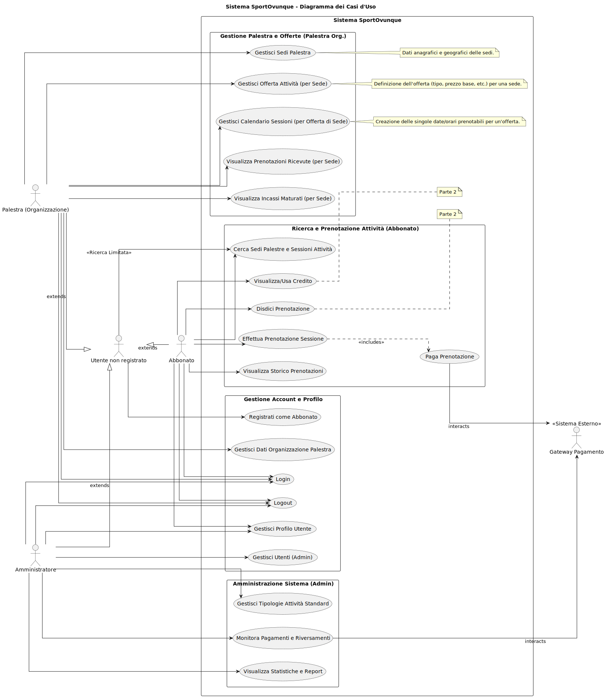
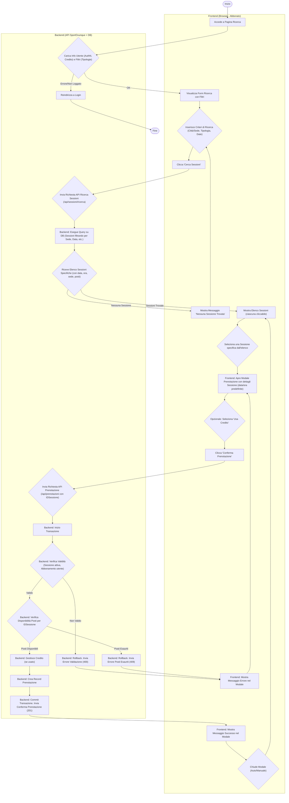
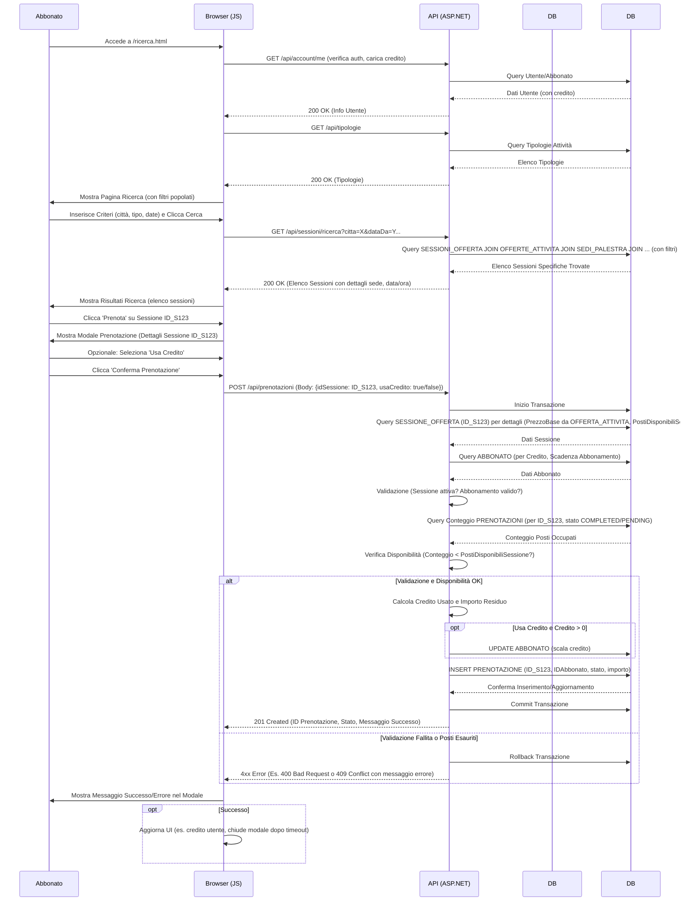

# Sessione suppletiva 2023 - seconda prova scritta - Indirizzo ITIA - INFORMATICA E TELECOMUNICAZIONI ARTICOLAZIONE "INFORMATICA" - Disciplina: INFORMATICA

- [Sessione suppletiva 2023 - seconda prova scritta - Indirizzo ITIA - INFORMATICA E TELECOMUNICAZIONI ARTICOLAZIONE "INFORMATICA" - Disciplina: INFORMATICA](#sessione-suppletiva-2023---seconda-prova-scritta---indirizzo-itia---informatica-e-telecomunicazioni-articolazione-informatica---disciplina-informatica)
  - [Traccia della prova](#traccia-della-prova)
  - [Svolgimento della prima parte - versione estesa (con calendario effettivo di sessioni per ciascuna offerta e con palestre che possono avere una o più sedi fisiche operative)](#svolgimento-della-prima-parte---versione-estesa-con-calendario-effettivo-di-sessioni-per-ciascuna-offerta-e-con-palestre-che-possono-avere-una-o-più-sedi-fisiche-operative)
    - [Prima Parte](#prima-parte)
      - [1. Analisi della Realtà di Riferimento e Schema Concettuale](#1-analisi-della-realtà-di-riferimento-e-schema-concettuale)
      - [2. Schema Logico Relazionale](#2-schema-logico-relazionale)
      - [3. Definizione SQL (MariaDB) di Tabelle Chiave](#3-definizione-sql-mariadb-di-tabelle-chiave)
      - [4. Interrogazioni SQL (MariaDB)](#4-interrogazioni-sql-mariadb)
      - [5. Progetto di massima della struttura funzionale della Applicazione Web](#5-progetto-di-massima-della-struttura-funzionale-della-applicazione-web)
      - [6. Parte Significativa dell'Applicazione Web (Registrazione, Login, Ricerca Sessioni, Prenotazione Sessione)](#6-parte-significativa-dellapplicazione-web-registrazione-login-ricerca-sessioni-prenotazione-sessione)
    - [B. Backend (ASP.NET Core Minimal API con EF Core e Cookie Auth)](#b-backend-aspnet-core-minimal-api-con-ef-core-e-cookie-auth)
    - [C. Frontend (HTML, CSS, JavaScript per Login, Ricerca Sessioni e Prenotazione)](#c-frontend-html-css-javascript-per-login-ricerca-sessioni-e-prenotazione)
  - [Svolgimento della seconda parte](#svolgimento-della-seconda-parte)
    - [Quesito I: disdetta prenotazione di un'attività e gestione del credito](#quesito-i-disdetta-prenotazione-di-unattività-e-gestione-del-credito)
      - [Quesito II: pagina dinamica che consenta all’utente di ottenere l’elenco delle palestre con mappa](#quesito-ii-pagina-dinamica-che-consenta-allutente-di-ottenere-lelenco-delle-palestre-con-mappa)
        - [Alternativa 1: Elenco Testuale delle Sedi Palestre](#alternativa-1-elenco-testuale-delle-sedi-palestre)
        - [Alternativa 2: Mappa Geografica delle Sedi Palestre](#alternativa-2-mappa-geografica-delle-sedi-palestre)
      - [Quesito III: le differenze, anche attraverso esempi, tra i predicati ANY, ALL ed EXISTS del linguaggio SQL](#quesito-iii-le-differenze-anche-attraverso-esempi-tra-i-predicati-any-all-ed-exists-del-linguaggio-sql)
      - [Quesito IV: Normalizzazione della Tabella Fornita](#quesito-iv-normalizzazione-della-tabella-fornita)

## Traccia della prova

[La traccia della prova](https://www.istruzione.it/esame_di_stato/202223/Istituti%20tecnici/Suppletiva/A038_SUP23.pdf) è disponibile sul sito del Ministero dell'Istruzione e del Merito.

## Svolgimento della prima parte - versione estesa (con calendario effettivo di sessioni per ciascuna offerta e con palestre che possono avere una o più sedi fisiche operative)

### Prima Parte

#### 1. Analisi della Realtà di Riferimento e Schema Concettuale

**A. Descrizione del Contesto e Obiettivi:**

La società SportOvunque intende creare un portale web innovativo per la gestione di abbonamenti fitness. L'obiettivo è fornire agli utenti un abbonamento unico annuale che consenta l'accesso non solo alle palestre direttamente gestite da SportOvunque, ma anche a una vasta rete di palestre partner distribuite su tutto il territorio nazionale.

Le palestre partner che aderiscono all'iniziativa possono essere singole strutture o organizzazioni/brand con **una o più sedi fisiche operative**. Ogni sede avrà un proprio indirizzo e potrà gestire autonomamente le proprie attività.

Gli utenti finali si registrano sulla piattaforma SportOvunque e acquistano l'abbonamento annuale online. Una volta abbonati, possono navigare il portale per cercare le attività fitness di loro interesse.

Le palestre partner, attraverso un account dedicato alla loro organizzazione, hanno la responsabilità di:

1. Registrare e gestire i dati anagrafici e geografici di ciascuna delle loro **sedi operative**.
2. Per ogni sede, definire le **offerte di attività fitness**. Queste offerte includono la tipologia di attività (attingendo a un catalogo standard fornito da SportOvunque), una descrizione, una frequenza settimanale di riferimento (es. "ogni lunedì alle 18:00"), un prezzo convenzionato base per gli abbonati SportOvunque e un numero massimo di posti di riferimento.
3. Fondamentalmente, per rendere un'offerta effettivamente prenotabile, la palestra deve creare e gestire un **calendario effettivo di sessioni** per ciascuna offerta in ogni sua sede. Questo significa specificare le date e gli orari concreti in cui una sessione di quell'offerta avrà luogo, quanti posti sono disponibili per quella specifica sessione e il suo stato (es. disponibile, cancellata dalla palestra). Questo approccio permette di gestire con precisione festività, chiusure straordinarie, variazioni di orario o capacità, o la natura stagionale di alcuni corsi.

Gli abbonati SportOvunque possono cercare le sessioni di attività disponibili, filtrando per città, tipologia di attività, data, e sede specifica. Una volta trovata la sessione desiderata, possono procedere alla prenotazione online. Il pagamento della singola prenotazione avviene attraverso il portale SportOvunque, che si occupa di incassare la quota e di riversarla mensilmente alle palestre competenti, distinguendo gli importi per ciascuna sede.

Un vincolo cruciale del sistema è impedire la prenotazione di una sessione qualora i posti disponibili per quella specifica data, ora e sede siano esauriti. Il sistema deve inoltre gestire la disdetta delle prenotazioni da parte degli utenti secondo termini specifici e l'eventuale accredito di somme.

**B. Identificazione Attori e Casi d'Uso:**

  - **Attori:**

      - **Utente non registrato/Potenziale Cliente:**
          - Naviga il portale.
          - Visualizza informazioni generali su SportOvunque e sul funzionamento dell'abbonamento.
          - Cerca sedi di palestre e offerte di attività (eventualmente con visibilità limitata sul calendario dettagliato delle sessioni).
          - Si registra come Abbonato.
      - **Abbonato (Cliente Registrato):**
          - Ha un ruolo specifico ("Abbonato").
          - Effettua Login/Logout.
          - Gestisce il proprio profilo utente (anagrafica, password).
          - Visualizza lo stato del proprio abbonamento.
          - Cerca sedi di palestre e sessioni di attività (con accesso completo ai dettagli: sede, data, ora, posti disponibili, prezzo).
          - Effettua la prenotazione di una specifica sessione presso una sede.
          - Paga online la quota per la sessione prenotata (interagendo con un gateway di pagamento).
          - Visualizza lo storico delle proprie prenotazioni.
          - (Parte 2) Gestisce il proprio credito virtuale (visualizzazione, utilizzo per nuove prenotazioni).
          - (Parte 2) Disdice una prenotazione esistente (se consentito dai termini).
      - **Palestra (Partner Organizzativo):**
          - Ha un ruolo specifico ("Palestra"). Questo attore rappresenta l'organizzazione o il brand che può avere più sedi.
          - Effettua Login/Logout.
          - Gestisce i dati anagrafici e fiscali della propria organizzazione.
          - **Gestisce le proprie Sedi Operative:** inserimento di nuove sedi, modifica dei dati anagrafici (nome specifico della sede, indirizzo, città, telefono, email) e geografici (latitudine, longitudine) di ciascuna sede.
          - **Per ciascuna Sede gestita:**
              - Definisce e gestisce le **Offerte di Attività** (selezione da tipologie standard, definizione di orari e giorni di riferimento, prezzo base convenzionato, numero di posti di riferimento).
              - Definisce e gestisce il **Calendario delle Sessioni Effettive** per ciascuna offerta: crea istanze specifiche di un'offerta per date e orari concreti, imposta il numero esatto di posti disponibili per quella sessione, ne modifica lo stato (es. cancella una sessione per una chiusura imprevista).
          - Visualizza le prenotazioni ricevute (con possibilità di filtrare per sede e periodo).
          - Visualizza il riepilogo degli incassi maturati (con dettaglio per sede).
      - **Amministratore SportOvunque:**
          - Ha un ruolo specifico ("Admin").
          - Gestisce gli account utente (Abbonati, Palestre Organizzative, altre utenze Admin).
          - Gestisce il catalogo delle Tipologie Standard di Attività Fitness.
          - Monitora i flussi di pagamento e le transazioni.
          - Gestisce il processo di riversamento periodico degli incassi alle palestre partner (considerando gli importi maturati da ciascuna sede).
          - Visualizza statistiche aggregate e report sull'utilizzo della piattaforma.
          - Configura parametri di sistema.
      - **Gateway di Pagamento (Sistema Esterno):**
          - Processa i pagamenti online per le prenotazioni.
          - Interagisce con il sistema SportOvunque per confermare o negare l'esito dei pagamenti.

  - **Diagramma dei Casi d'Uso (Principali):**
    Il diagramma illustra le interazioni principali tra gli attori e il sistema SportOvunque.

    

    Il diagramma dei casi d'uso è stato ottenuto con il seguente codice per [PlantUML](https://www.plantuml.com/plantuml/uml)

    ```text
    @startuml
    title Sistema SportOvunque - Diagramma dei Casi d'Uso

    ' Impostazioni di stile
    skinparam packageStyle rectangle
    skinparam linetype ortho
    left to right direction

    ' Definizione degli attori (tutti a sinistra)
    actor "Utente non registrato" as A1
    actor "Abbonato" as A2
    actor "Palestra (Organizzazione)" as A3
    actor "Amministratore" as A4
    actor "Gateway Pagamento" as PG_Ext << Sistema Esterno >>

    ' Posizionamento esplicito dell'utente non registrato a sinistra
    A1 -[hidden]-> A2

    ' Relazioni di generalizzazione tra attori
    A2 --|> A1 : extends
    A3 --|> A1 : extends
    A4 --|> A1 : extends

    ' Sistema a destra
    rectangle "Sistema SportOvunque" {
        package "Gestione Account e Profilo" as P1 {
            usecase "Registrati come Abbonato" as UC1
            usecase "Login" as UC2
            usecase "Logout" as UC3
            usecase "Gestisci Profilo Utente" as UC4
            usecase "Gestisci Dati Organizzazione Palestra" as UC9
            usecase "Gestisci Utenti (Admin)" as UC13
        }
        
        package "Ricerca e Prenotazione Attività (Abbonato)" as P2 {
            usecase "Cerca Sedi Palestre e Sessioni Attività" as UC5
            usecase "Effettua Prenotazione Sessione" as UC6
            usecase "Paga Prenotazione" as UC7
            usecase "Visualizza Storico Prenotazioni" as UC8
            usecase "Disdici Prenotazione" as UC17
            usecase "Visualizza/Usa Credito" as UC18
        }
        note right of UC17: Parte 2
        note right of UC18: Parte 2
        
        package "Gestione Palestra e Offerte (Palestra Org.)" as P3 {
            usecase "Gestisci Sedi Palestra" as UC9b
            usecase "Gestisci Offerta Attività (per Sede)" as UC10
            usecase "Gestisci Calendario Sessioni (per Offerta di Sede)" as UC10b
            usecase "Visualizza Prenotazioni Ricevute (per Sede)" as UC11
            usecase "Visualizza Incassi Maturati (per Sede)" as UC12
        }
        note right of UC9b: Dati anagrafici e geografici delle sedi.
        note right of UC10: Definizione dell'offerta (tipo, prezzo base, etc.) per una sede.
        note right of UC10b: Creazione delle singole date/orari prenotabili per un'offerta.
        
        package "Amministrazione Sistema (Admin)" as P4 {
            usecase "Gestisci Tipologie Attività Standard" as UC14
            usecase "Monitora Pagamenti e Riversamenti" as UC15
            usecase "Visualizza Statistiche e Report" as UC16
        }
    }

    ' Connessioni Utente non registrato
    A1 --> UC1
    A1 --> UC5 : <<Ricerca Limitata>>

    ' Connessioni Abbonato
    A2 --> UC2
    A2 --> UC3
    A2 --> UC4
    A2 --> UC5
    A2 --> UC6
    A2 --> UC8
    A2 --> UC17
    A2 --> UC18

    ' Connessioni Palestra (Organizzazione)
    A3 --> UC2
    A3 --> UC3
    A3 --> UC9
    A3 --> UC9b
    A3 --> UC10
    A3 --> UC10b
    A3 --> UC11
    A3 --> UC12

    ' Connessioni Amministratore
    A4 --> UC2
    A4 --> UC3
    A4 --> UC4
    A4 --> UC13
    A4 --> UC14
    A4 --> UC15
    A4 --> UC16

    ' Relazioni di inclusione e interazione con sistemi esterni
    UC6 ..> UC7 : <<includes>>
    UC7 --> PG_Ext : interacts
    UC15 --> PG_Ext : interacts
    @enduml
    ```

**Elenco dei Casi d'Uso (Principali Dettagliati):**

  - **(Utente non registrato):**
      - `Registrati come Abbonato`: Fornisce dati anagrafici, email, password per creare un account Abbonato.
      - `Cerca Sedi Palestre e Sessioni Attività (Limitata)`: Esplora le sedi e le tipologie di attività offerte, possibilmente senza vedere la disponibilità specifica delle sessioni o i prezzi convenzionati.
  - **(Abbonato):**
      - `Login/Logout`: Accesso e disconnessione dal sistema.
      - `Gestisci Profilo Utente`: Modifica dati personali, password, visualizza stato abbonamento.
      - `Cerca Sedi Palestre e Sessioni Attività`: Ricerca dettagliata per città, nome palestra/sede, tipologia attività, data e ora specifica per le sessioni. Visualizza posti disponibili e prezzi.
      - `Effettua Prenotazione Sessione`: Seleziona una sessione specifica (con data, ora, sede), conferma la prenotazione, che include il passo di pagamento.
      - `Paga Prenotazione`: Interagisce con il sistema di pagamento per saldare la quota della sessione. Può includere l'uso del credito.
      - `Visualizza Storico Prenotazioni`: Consulta l'elenco delle prenotazioni passate e future.
      - `Disdici Prenotazione`: Cancella una prenotazione futura, soggetto a regole (es. 48 ore prima), con eventuale riaccredito.
      - `Visualizza/Usa Credito`: Controlla il credito disponibile e lo utilizza per pagare (totalmente o parzialmente) nuove prenotazioni.
  - **(Palestra - Organizzazione):**
      - `Gestisci Dati Organizzazione Palestra`: Aggiorna informazioni del brand (NomeBrand, PIVA, contatti principali).
      - `Gestisci Sedi Palestra`: Aggiunge nuove sedi fisiche, ne modifica i dettagli (NomeSede, Indirizzo, Città, Lat/Lon, TelefonoSede) o le rimuove.
      - `Gestisci Offerta Attività (per Sede)`: Per una sede selezionata, crea un "template" di offerta (es. "Corso Yoga", Lunedì ore 18:00, Prezzo 10€, 15 posti max di riferimento).
      - `Gestisci Calendario Sessioni (per Offerta di Sede)`: Per un'offerta template di una sede, genera le istanze effettive prenotabili (es. "Corso Yoga" del Lunedì 02/06/2025 ore 18:00, con 12 posti disponibili per quella data; cancella la sessione del Lunedì 09/06/2025 per festività).
      - `Visualizza Prenotazioni Ricevute (per Sede)`: Monitora le prenotazioni per le sessioni delle proprie sedi.
      - `Visualizza Incassi Maturati (per Sede)`: Controlla i resoconti finanziari degli importi da ricevere da SportOvunque, dettagliati per sede.
  - **(Amministratore SportOvunque):**
      - `Gestisci Utenti`: Crea, modifica, sospende, elimina account Abbonato e Palestra Organizzazione.
      - `Gestisci Tipologie Attività Standard`: Mantiene il catalogo ufficiale delle attività (es. "Pilates", "Zumba", "Sala Pesi").
      - `Monitora Pagamenti e Riversamenti`: Supervisiona le transazioni economiche, gestisce i riversamenti alle palestre.
      - `Visualizza Statistiche e Report`: Analizza dati di utilizzo, finanziari, ecc.

**C. Dizionario dei Dati (Concetti Chiave):**

  - **Utente:** Entità generica che rappresenta chiunque interagisca con il sistema richiedendo autenticazione (<u>IDUtente</u>, Email, HashPassword, Ruolo).
  - **Abbonato:** Specializzazione di `Utente` con ruolo "Abbonato". Contiene dati anagrafici specifici (Nome, Cognome), la `DataScadenzaAbbonamento` e (per la Parte 2) il `CreditoDisponibile`.
  - **Palestra Organizzazione:** Specializzazione di `Utente` con ruolo "Palestra". Rappresenta l'entità legale o il brand che si affilia a SportOvunque (NomeBrand, PIVA). Può possedere più sedi.
  - **Sede Palestra:** Rappresenta una singola struttura fisica dove si svolgono le attività. È sempre associata a una `Palestra Organizzazione` (<u>IDSede</u>, NomeSedeSpecifico, Indirizzo, Città, Latitudine, Longitudine, TelefonoSede, EmailSede, *IDPalestraOrg* (FK)).
  - **Tipologia Attività:** Un elemento del catalogo standardizzato delle attività fitness offerte (<u></u>IDTipologia</u>, NomeTipologia, Descrizione). Gestito dall'Amministratore.
  - **Offerta Attività:** Un "template" o definizione generale di una `Tipologia Attività` proposta da una specifica `Sede Palestra`. Specifica dettagli come il giorno della settimana e l'orario di riferimento per la pianificazione, il prezzo convenzionato base e il numero massimo di posti di riferimento (<u>IDOfferta</u>, GiornoSettimanaRiferimento, OrarioInizioRiferimento, OrarioFineRiferimento, PrezzoConvenzionatoBase, MaxPostiRiferimento, *IDSede* (FK), *IDTipologia* (FK)).
  - **Sessione Offerta:** L'istanza concreta, effettivamente prenotabile, di una `Offerta Attività`. Ogni sessione ha una data e ora di inizio precise, un numero di posti disponibili per quella specifica istanza e uno stato. (<u>IDSessione</u>, DataOraInizioSessione, DataOraFineSessione, PostiDisponibiliSessione, StatoSessione ('Disponibile', 'Cancellata', 'Completa'), *IDOfferta* (FK)). Questa è l'entità chiave del calendario effettivo.
  - **Prenotazione:** La registrazione dell'interesse (e del pagamento) di un `Abbonato` per una specifica `Sessione Offerta` (<u>IDPrenotazione</u>, DataOraEffettuazionePrenotazione, StatoPagamento ('PENDING', 'COMPLETED', 'FAILED', 'CANCELLED'), ImportoPagato, *IDAbbonato* (FK), *IDSessione* (FK)). Include (per la Parte 2) `DataOraCancellazione`.

**D. Schema Entità/Relazione (E/R):**

  - **Entità Identificate:**

      - `UTENTE` (PK: IDUtente)
      - `ABBONATO` (PK: IDUtente - specializzazione di UTENTE)
      - `PALESTRA_ORGANIZZAZIONE` (PK: IDUtente - specializzazione di UTENTE)
      - `SEDE_PALESTRA` (PK: IDSede)
      - `TIPOLOGIA_ATTIVITA` (PK: IDTipologia)
      - `OFFERTA_ATTIVITA` (PK: IDOfferta)
      - `SESSIONE_OFFERTA` (PK: IDSessione)
      - `PRENOTAZIONE` (PK: IDPrenotazione)

  - **Relazioni Principali:**

      - `UTENTE` è generalizzazione di `ABBONATO` e `PALESTRA_ORGANIZZAZIONE` (Relazione ISA, 1:1 opzionale).
      - `PALESTRA_ORGANIZZAZIONE` (1) --- `Possiede` --- (N) `SEDE_PALESTRA`. (Una palestra organizzazione può avere molte sedi; una sede appartiene a una sola organizzazione).
      - `SEDE_PALESTRA` (1) --- `Propone_In_Sede` --- (N) `OFFERTA_ATTIVITA`. (Una sede propone molte offerte attività; un'offerta è specifica di una sede).
      - `TIPOLOGIA_ATTIVITA` (1) --- `È_Del_Tipo` --- (N) `OFFERTA_ATTIVITA`. (Una tipologia può caratterizzare molte offerte; un'offerta è di una sola tipologia).
      - `OFFERTA_ATTIVITA` (1) --- `Si_Svolge_In` --- (N) `SESSIONE_OFFERTA`. (Un'offerta template genera molte sessioni calendarizzate; una sessione deriva da una sola offerta template).
      - `ABBONATO` (1) --- `Effettua` --- (N) `PRENOTAZIONE`. (Un abbonato può effettuare molte prenotazioni; una prenotazione è di un solo abbonato).
      - `SESSIONE_OFFERTA` (1) --- `È_Prenotata_Da` --- (N) `PRENOTAZIONE`. (Una sessione può avere molte prenotazioni; una prenotazione si riferisce a una sola sessione).

  - **Attributi Chiave per Entità (Schema E/R con Mermaid):**

    ```mermaid
    erDiagram
    UTENTI {
        int IDUtente PK
        varchar Email "NOT NULL UK"
        varchar HashPassword "NOT NULL"
        enum Ruolo "('Abbonato', 'Palestra', 'Admin') NOT NULL"
    }
    
    ABBONATI {
        int IDUtente PK,FK "(UTENTI)"
        varchar Nome "NOT NULL"
        varchar Cognome "NOT NULL"
        date DataScadenzaAbbonamento "NOT NULL"
        decimal CreditoDisponibile "NOT NULL DEFAULT 0.00"
    }
    
    PALESTRE_ORGANIZZAZIONI {
        int IDUtente PK,FK "(UTENTI)"
        varchar NomeBrand "NOT NULL UK"
        varchar PIVA "NULL"
    }
    
    SEDI_PALESTRA {
        int IDSede PK
        int IDPalestraOrg FK "(PALESTRE_ORGANIZZAZIONI)"
        varchar NomeSede "NOT NULL"
        varchar Indirizzo "NOT NULL"
        varchar Citta "NOT NULL"
        decimal Latitudine "NOT NULL"
        decimal Longitudine "NOT NULL"
        varchar TelefonoSede "NULL"
    }
    
    TIPOLOGIE_ATTIVITA {
        int IDTipologia PK
        varchar NomeTipologia "NOT NULL UK"
        text Descrizione "NULL"
    }
    
    OFFERTE_ATTIVITA {
        int IDOfferta PK
        int IDSede FK "(SEDI_PALESTRA)"
        int IDTipologia FK "(TIPOLOGIE_ATTIVITA)"
        tinyint GiornoSettimanaRiferimento "NOT NULL"
        time OrarioInizioRiferimento "NOT NULL"
        decimal PrezzoConvenzionatoBase "NOT NULL"
        int MaxPostiRiferimento "NOT NULL"
    }
    
    SESSIONI_OFFERTA {
        int IDSessione PK
        int IDOfferta FK "(OFFERTE_ATTIVITA)"
        datetime DataOraInizioSessione "NOT NULL"
        int PostiDisponibiliSessione "NOT NULL"
        enum StatoSessione "('Disponibile', 'Cancellata', 'Completa') NOT NULL DEFAULT 'Disponibile'"
    }
    
    PRENOTAZIONI {
        int IDPrenotazione PK
        int IDAbbonato FK "(ABBONATI)"
        int IDSessione FK "(SESSIONI_OFFERTA)"
        datetime DataOraEffettuazionePrenotazione "NOT NULL DEFAULT NOW()"
        enum StatoPagamento "('PENDING', 'COMPLETED', 'FAILED', 'CANCELLED') NOT NULL DEFAULT 'PENDING'"
        decimal ImportoPagato "NULL"
        datetime DataOraCancellazione "NULL"
    }
    
    UTENTI ||--|| ABBONATI : "identifica (1:1)"
    UTENTI ||--|| PALESTRE_ORGANIZZAZIONI : "identifica (1:1)"
    PALESTRE_ORGANIZZAZIONI ||--o{ SEDI_PALESTRA : "possiede (1:N)"
    SEDI_PALESTRA ||--o{ OFFERTE_ATTIVITA : "propone (1:N)"
    TIPOLOGIE_ATTIVITA ||--o{ OFFERTE_ATTIVITA : "categorizza (1:N)"
    OFFERTE_ATTIVITA ||--o{ SESSIONI_OFFERTA : "è programmata come (1:N)"
    ABBONATI ||--o{ PRENOTAZIONI : "effettua (1:N)"
    SESSIONI_OFFERTA ||--o{ PRENOTAZIONI : "è prenotata per (1:N)"
    ```

  - **Vincoli e Ipotesi Aggiuntive:**

      - L'email è unica per tutti gli `UTENTI`.
      - Un `UTENTE` può avere un solo ruolo (`Abbonato`, `Palestra` o `Admin`).
      - `Latitudine` e `Longitudine` sono obbligatorie per `SEDE_PALESTRA` per funzionalità di mappa.
      - `DataOraInizioSessione` in `SESSIONE_OFFERTA` deve essere futura o odierna al momento della creazione/visualizzazione per nuove prenotazioni.
      - `PostiDisponibiliSessione` in `SESSIONE_OFFERTA` deve essere >= 0.
      - Lo `StatoSessione` ('Disponibile', 'Cancellata', 'Completa') gestisce la prenotabilità della sessione.
      - Lo `StatoPagamento` della `PRENOTAZIONE` traccia l'esito del pagamento.
      - Solo Abbonati con `DataScadenzaAbbonamento` futura possono effettuare prenotazioni.
      - Il pagamento è gestito esternamente da un Gateway di Pagamento.
      - La disdetta di una `PRENOTAZIONE` (Parte 2) è permessa solo se `SESSIONE_OFFERTA.DataOraInizioSessione - PRENOTAZIONE.DataOraCancellazione > 48 ore`.

#### 2. Schema Logico Relazionale

Deriviamo le tabelle dallo schema E/R, applicando le regole di traduzione, inclusa la gestione della generalizzazione/specializzazione e la nuova entità `SEDE_PALESTRA`. Verifichiamo la conformità alla Terza Forma Normale (3NF).

  - **UTENTI** (<u>IDUtente</u> PK, Email UK, HashPassword, Ruolo ENUM('Abbonato', 'Palestra', 'Admin'))

  - **ABBONATI** (<u>IDUtente</u> PK, FK --> UTENTI(IDUtente), Nome , Cognome, DataScadenzaAbbonamento, CreditoDisponibile)

  - **PALESTRE_ORGANIZZAZIONI** (<u>IDUtente</u> PK, FK --> UTENTI(IDUtente), NomeBrand UK, PIVA)

  - **SEDI_PALESTRA** (<u>IDSede</u> PK, IDPalestraOrg FK --> PALESTRE_ORGANIZZAZIONI(IDUtente), NomeSede, Indirizzo, Citta, Latitudine, Longitudine, TelefonoSede, EmailSede)

  - **TIPOLOGIE_ATTIVITA** (<u>IDTipologia</u> PK, NomeTipologia UK, Descrizione NULL)

  - **OFFERTE_ATTIVITA** (<u>IDOfferta</u> PK, IDSede FK --> SEDI_PALESTRA(IDSede), IDTipologia FK --> TIPOLOGIE_ATTIVITA(IDTipologia), GiornoSettimanaRiferimento, OrarioInizioRiferimento, OrarioFineRiferimento, PrezzoConvenzionatoBase, MaxPostiRiferimento,
    UK (IDSede, IDTipologia, GiornoSettimanaRiferimento, OrarioInizioRiferimento))

  - **SESSIONI_OFFERTA** (<u>IDSessione</u> PK, IDOfferta FK --> OFFERTE_ATTIVITA(IDOfferta), DataOraInizioSessione, DataOraFineSessione, PostiDisponibiliSessione, StatoSessione ENUM('Disponibile', 'Cancellata', 'Completa'), CHECK (PostiDisponibiliSessione >= 0))

  - **PRENOTAZIONI** (<u>IDPrenotazione</u> PK, IDAbbonato FK --> ABBONATI(IDUtente), IDSessione FK --> SESSIONI_OFFERTA(IDSessione), DataOraEffettuazionePrenotazione, StatoPagamento ENUM('PENDING', 'COMPLETED', 'FAILED', 'CANCELLED'), ImportoPagato NULL, DataOraCancellazione NULL)

    **Rappresentazione grafica del modello logico relazionale**:

    ```mermaid
    erDiagram
    UTENTI {
        int IDUtente PK
        varchar Email "NOT NULL UK"
        varchar HashPassword "NOT NULL"
        enum Ruolo "('Abbonato', 'Palestra', 'Admin') NOT NULL"
    }
    
    ABBONATI {
        int IDUtente PK,FK "(UTENTI)"
        varchar Nome "NOT NULL"
        varchar Cognome "NOT NULL"
        date DataScadenzaAbbonamento "NOT NULL"
        decimal CreditoDisponibile "NOT NULL DEFAULT 0.00"
    }
    
    PALESTRE_ORGANIZZAZIONI {
        int IDUtente PK,FK "(UTENTI)"
        varchar NomeBrand "NOT NULL UK"
        varchar PIVA "NULL"
    }
    
    SEDI_PALESTRA {
        int IDSede PK
        int IDPalestraOrg FK "(PALESTRE_ORGANIZZAZIONI)"
        varchar NomeSede "NOT NULL"
        varchar Indirizzo "NOT NULL"
        varchar Citta "NOT NULL"
        decimal Latitudine "NOT NULL"
        decimal Longitudine "NOT NULL"
        varchar TelefonoSede "NULL"
    }
    
    TIPOLOGIE_ATTIVITA {
        int IDTipologia PK
        varchar NomeTipologia "NOT NULL UK"
        text Descrizione "NULL"
    }
    
    OFFERTE_ATTIVITA {
        int IDOfferta PK
        int IDSede FK "(SEDI_PALESTRA)"
        int IDTipologia FK "(TIPOLOGIE_ATTIVITA)"
        tinyint GiornoSettimanaRiferimento "NOT NULL"
        time OrarioInizioRiferimento "NOT NULL"
        decimal PrezzoConvenzionatoBase "NOT NULL"
        int MaxPostiRiferimento "NOT NULL"
    }
    
    SESSIONI_OFFERTA {
        int IDSessione PK
        int IDOfferta FK "(OFFERTE_ATTIVITA)"
        datetime DataOraInizioSessione "NOT NULL"
        int PostiDisponibiliSessione "NOT NULL"
        enum StatoSessione "('Disponibile', 'Cancellata', 'Completa') NOT NULL DEFAULT 'Disponibile'"
    }
    
    PRENOTAZIONI {
        int IDPrenotazione PK
        int IDAbbonato FK "(ABBONATI)"
        int IDSessione FK "(SESSIONI_OFFERTA)"
        datetime DataOraEffettuazionePrenotazione "NOT NULL DEFAULT NOW()"
        enum StatoPagamento "('PENDING', 'COMPLETED', 'FAILED', 'CANCELLED') NOT NULL DEFAULT 'PENDING'"
        decimal ImportoPagato "NULL"
        datetime DataOraCancellazione "NULL"
    }
    
    UTENTI ||--|| ABBONATI : "identifica (1:1)"
    UTENTI ||--|| PALESTRE_ORGANIZZAZIONI : "identifica (1:1)"
    PALESTRE_ORGANIZZAZIONI ||--o{ SEDI_PALESTRA : "possiede (1:N)"
    SEDI_PALESTRA ||--o{ OFFERTE_ATTIVITA : "propone (1:N)"
    TIPOLOGIE_ATTIVITA ||--o{ OFFERTE_ATTIVITA : "categorizza (1:N)"
    OFFERTE_ATTIVITA ||--o{ SESSIONI_OFFERTA : "è programmata come (1:N)"
    ABBONATI ||--o{ PRENOTAZIONI : "effettua (1:N)"
    SESSIONI_OFFERTA ||--o{ PRENOTAZIONI : "è prenotata per (1:N)"
    ```

#### 3. Definizione SQL (MariaDB) di Tabelle Chiave

Di seguito la definizione SQL per le tabelle principali del database, basata sullo schema logico relazionale definito, con l'inclusione della **gestione delle sedi** e del **calendario effettivo delle sessioni**.

```sql
-- Tabella Utenti (Base per ruoli)
CREATE TABLE UTENTI (
    IDUtente INT AUTO_INCREMENT PRIMARY KEY,
    Email VARCHAR(255) NOT NULL UNIQUE,
    HashPassword VARCHAR(255) NOT NULL,
    Ruolo ENUM('Abbonato', 'Palestra', 'Admin') NOT NULL
) ENGINE=InnoDB CHARACTER SET=utf8mb4 COLLATE=utf8mb4_unicode_ci;

-- Tabella Abbonati (Specializzazione di Utenti)
CREATE TABLE ABBONATI (
    IDUtente INT PRIMARY KEY,
    Nome VARCHAR(100) NOT NULL,
    Cognome VARCHAR(100) NOT NULL,
    DataScadenzaAbbonamento DATE NOT NULL,
    CreditoDisponibile DECIMAL(10, 2) NOT NULL DEFAULT 0.00,
    FOREIGN KEY (IDUtente) REFERENCES UTENTI(IDUtente)
        ON DELETE CASCADE
        ON UPDATE CASCADE,
    CONSTRAINT CHK_CreditoAbbonato CHECK (CreditoDisponibile >= 0)
) ENGINE=InnoDB CHARACTER SET=utf8mb4 COLLATE=utf8mb4_unicode_ci;

-- Tabella Palestre_Organizzazioni (Rappresenta il brand/organizzazione)
CREATE TABLE PALESTRE_ORGANIZZAZIONI (
    IDUtente INT PRIMARY KEY,
    NomeBrand VARCHAR(150) NOT NULL UNIQUE,
    PIVA VARCHAR(20) NULL,
    FOREIGN KEY (IDUtente) REFERENCES UTENTI(IDUtente)
        ON DELETE CASCADE
        ON UPDATE CASCADE
) ENGINE=InnoDB CHARACTER SET=utf8mb4 COLLATE=utf8mb4_unicode_ci;

-- Tabella Sedi_Palestra (Singole location fisiche)
CREATE TABLE SEDI_PALESTRA (
    IDSede INT AUTO_INCREMENT PRIMARY KEY,
    IDPalestraOrg INT NOT NULL,
    NomeSede VARCHAR(150) NOT NULL,
    Indirizzo VARCHAR(255) NOT NULL,
    Citta VARCHAR(100) NOT NULL,
    Latitudine DECIMAL(10, 8) NOT NULL,
    Longitude DECIMAL(11, 8) NOT NULL,
    TelefonoSede VARCHAR(20) NULL,
    EmailSede VARCHAR(255) NULL,
    FOREIGN KEY (IDPalestraOrg) REFERENCES PALESTRE_ORGANIZZAZIONI(IDUtente)
        ON DELETE CASCADE -- Se l'organizzazione è rimossa, le sue sedi lo sono anche
        ON UPDATE CASCADE,
    INDEX IDX_Sedi_Citta (Citta)
) ENGINE=InnoDB CHARACTER SET=utf8mb4 COLLATE=utf8mb4_unicode_ci;

-- Tabella Tipologie Attività (Catalogo standard)
CREATE TABLE TIPOLOGIE_ATTIVITA (
    IDTipologia INT AUTO_INCREMENT PRIMARY KEY,
    NomeTipologia VARCHAR(100) NOT NULL UNIQUE,
    Descrizione TEXT NULL
) ENGINE=InnoDB CHARACTER SET=utf8mb4 COLLATE=utf8mb4_unicode_ci;

-- Tabella Offerte Attività (Template per le sessioni, per sede)
CREATE TABLE OFFERTE_ATTIVITA (
    IDOfferta INT AUTO_INCREMENT PRIMARY KEY,
    IDSede INT NOT NULL,
    IDTipologia INT NOT NULL,
    GiornoSettimanaRiferimento TINYINT NOT NULL COMMENT '1=Lunedì,...,7=Domenica (per template)',
    OrarioInizioRiferimento TIME NOT NULL COMMENT 'Orario di riferimento per il template',
    OrarioFineRiferimento TIME NULL COMMENT 'Orario di fine di riferimento (opzionale)',
    PrezzoConvenzionatoBase DECIMAL(10, 2) NOT NULL,
    MaxPostiRiferimento INT NOT NULL,
    FOREIGN KEY (IDSede) REFERENCES SEDI_PALESTRA(IDSede)
        ON DELETE CASCADE -- Se la sede è cancellata, le sue offerte lo sono anche
        ON UPDATE CASCADE,
    FOREIGN KEY (IDTipologia) REFERENCES TIPOLOGIE_ATTIVITA(IDTipologia)
        ON DELETE RESTRICT -- Non cancellare una tipologia se usata in offerte attive
        ON UPDATE CASCADE,
    UNIQUE KEY UQ_OffertaSedeUnica (IDSede, IDTipologia, GiornoSettimanaRiferimento, OrarioInizioRiferimento),
    CONSTRAINT CHK_GiornoRifOfferta CHECK (GiornoSettimanaRiferimento BETWEEN 1 AND 7),
    CONSTRAINT CHK_PrezzoOffertaBaseValido CHECK (PrezzoConvenzionatoBase >= 0),
    CONSTRAINT CHK_PostiOffertaRifValidi CHECK (MaxPostiRiferimento > 0),
    CONSTRAINT CHK_OrariOffertaRifValidi CHECK (OrarioFineRiferimento IS NULL OR OrarioFineRiferimento > OrarioInizioRiferimento)
) ENGINE=InnoDB CHARACTER SET=utf8mb4 COLLATE=utf8mb4_unicode_ci;

-- Tabella Sessioni Offerta (Calendario Effettivo delle istanze prenotabili)
CREATE TABLE SESSIONI_OFFERTA (
    IDSessione INT AUTO_INCREMENT PRIMARY KEY,
    IDOfferta INT NOT NULL,
    DataOraInizioSessione DATETIME NOT NULL,
    DataOraFineSessione DATETIME NULL,
    PostiDisponibiliSessione INT NOT NULL,
    StatoSessione ENUM('Disponibile', 'Cancellata', 'Completa') NOT NULL DEFAULT 'Disponibile',
    FOREIGN KEY (IDOfferta) REFERENCES OFFERTE_ATTIVITA(IDOfferta)
        ON DELETE CASCADE -- Se l'offerta template è cancellata, le sue sessioni specifiche lo sono anche
        ON UPDATE CASCADE,
    CONSTRAINT CHK_PostiSessioneNonNegativi CHECK (PostiDisponibiliSessione >= 0),
    CONSTRAINT CHK_DateSessioneValide CHECK (DataOraFineSessione IS NULL OR DataOraFineSessione > DataOraInizioSessione),
    INDEX IDX_Sessioni_DataOraInizio (IDOfferta, DataOraInizioSessione)
) ENGINE=InnoDB CHARACTER SET=utf8mb4 COLLATE=utf8mb4_unicode_ci;

-- Tabella Prenotazioni
CREATE TABLE PRENOTAZIONI (
    IDPrenotazione INT AUTO_INCREMENT PRIMARY KEY,
    IDAbbonato INT NOT NULL,
    IDSessione INT NOT NULL,
    DataOraEffettuazionePrenotazione DATETIME NOT NULL DEFAULT CURRENT_TIMESTAMP,
    StatoPagamento ENUM('PENDING', 'COMPLETED', 'FAILED', 'CANCELLED') NOT NULL DEFAULT 'PENDING',
    ImportoPagato DECIMAL(10, 2) NULL,
    DataOraCancellazione DATETIME NULL COMMENT 'Per Parte 2',
    FOREIGN KEY (IDAbbonato) REFERENCES ABBONATI(IDUtente)
        ON DELETE CASCADE -- Se l'abbonato è cancellato, le sue prenotazioni lo sono anche
        ON UPDATE CASCADE,
    FOREIGN KEY (IDSessione) REFERENCES SESSIONI_OFFERTA(IDSessione)
        ON DELETE RESTRICT -- Impedisce cancellazione di una sessione se ha prenotazioni attive (valutare CASCADE se si vuole cancellare prenotazioni collegate)
        ON UPDATE CASCADE,
    CONSTRAINT CHK_ImportoPagatoPrenotazioneValido CHECK (ImportoPagato IS NULL OR ImportoPagato >= 0),
    INDEX IDX_Prenotazioni_Sessione_Stato (IDSessione, StatoPagamento) -- Utile per contare posti occupati
) ENGINE=InnoDB CHARACTER SET=utf8mb4 COLLATE=utf8mb4_unicode_ci;
```

**Gestione Posti Esauriti (Vincolo Dinamico):**
Questo vincolo è cruciale e si applica al momento dell'inserimento di una nuova riga nella tabella `PRENOTAZIONI`. Deve verificare che il numero di prenotazioni esistenti per una `IDSessione` (con stato 'COMPLETED' o 'PENDING') non superi `PostiDisponibiliSessione` definito in `SESSIONI_OFFERTA`.

1. **Livello Applicativo (Backend - Metodo Preferito):** Prima di eseguire un `INSERT` nella tabella `PRENOTAZIONI`, l'applicazione backend deve:

      * Iniziare una transazione.
      * Leggere `PostiDisponibiliSessione` dalla tabella `SESSIONI_OFFERTA` per la `IDSessione` data.
      * Contare le prenotazioni attive (stato 'COMPLETED' o 'PENDING') per quella `IDSessione`:

        ```sql
        SELECT COUNT(*)
        FROM PRENOTAZIONI
        WHERE IDSessione = @IdSessioneFornita
        AND StatoPagamento IN ('COMPLETED', 'PENDING');
        ```

      * Se `COUNT(*) >= PostiDisponibiliSessione`, rifiutare l'inserimento della nuova prenotazione e fare il rollback della transazione.
      * Altrimenti, procedere con l'inserimento della prenotazione e fare il commit della transazione.
        Questo approccio offre maggiore flessibilità e mantiene la logica di business nell'applicazione.

2. **Trigger (Database - Alternativa):** Si può implementare un trigger `BEFORE INSERT` sulla tabella `PRENOTAZIONI`.

    ```sql
    DELIMITER //

    CREATE TRIGGER TRG_CheckDisponibilitaPostiSessione
    BEFORE INSERT ON PRENOTAZIONI
    FOR EACH ROW
    BEGIN
        DECLARE posti_occupati_sessione INT;
        DECLARE posti_massimi_sessione INT;

        -- Conta le prenotazioni attive per la sessione che si sta prenotando
        SELECT COUNT(*) INTO posti_occupati_sessione
        FROM PRENOTAZIONI
        WHERE IDSessione = NEW.IDSessione
          AND StatoPagamento IN ('COMPLETED', 'PENDING');

        -- Recupera i posti massimi disponibili per quella specifica sessione
        SELECT PostiDisponibiliSessione INTO posti_massimi_sessione
        FROM SESSIONI_OFFERTA
        WHERE IDSessione = NEW.IDSessione;

        -- Se i posti occupati sono uguali o maggiori dei posti massimi, impedisce l'inserimento
        IF posti_occupati_sessione >= posti_massimi_sessione THEN
            SIGNAL SQLSTATE '45000' -- Codice errore personalizzato
            SET MESSAGE_TEXT = 'Impossibile prenotare: posti esauriti per questa sessione.';
        END IF;
    END; //

    DELIMITER ;
    ```

    *Vantaggio del trigger:* Consistenza dei dati garantita a livello di database. *Svantaggio:* Logica di business nel database, può essere più difficile da manutenere e testare, potenziali impatti sulle performance per scritture frequenti.

#### 4. Interrogazioni SQL (MariaDB)

Le seguenti interrogazioni sono esempi basati sullo schema logico aggiornato che include la gestione delle sedi e del calendario effettivo delle sessioni. Si assume l'anno corrente 2025 per gli esempi.

**a) Elenco delle sessioni di attività disponibili in una specifica città (es. 'Milano') per una data precisa (es. 10 luglio 2025), mostrando il nome del brand della palestra, il nome della sede, la tipologia di attività, l'orario di inizio e fine, i posti liberi e il prezzo.**

```sql
SELECT
    po.NomeBrand,
    sp.NomeSede,
    ta.NomeTipologia,
    so.DataOraInizioSessione,
    so.DataOraFineSessione,
    (so.PostiDisponibiliSessione - IFNULL(pr_count.ConteggioPrenotazioni, 0)) AS PostiAttualmenteLiberi,
    oa.PrezzoConvenzionatoBase
FROM
    SESSIONI_OFFERTA so
JOIN
    OFFERTE_ATTIVITA oa ON so.IDOfferta = oa.IDOfferta
JOIN
    SEDI_PALESTRA sp ON oa.IDSede = sp.IDSede
JOIN
    PALESTRE_ORGANIZZAZIONI po ON sp.IDPalestraOrg = po.IDUtente
JOIN
    TIPOLOGIE_ATTIVITA ta ON oa.IDTipologia = ta.IDTipologia
LEFT JOIN
    (SELECT IDSessione, COUNT(*) AS ConteggioPrenotazioni
     FROM PRENOTAZIONI
     WHERE StatoPagamento IN ('COMPLETED', 'PENDING')
     GROUP BY IDSessione) AS pr_count ON so.IDSessione = pr_count.IDSessione
WHERE
    sp.Citta = 'Milano'                         -- Parametro: Città specifica
    AND DATE(so.DataOraInizioSessione) = '2025-07-10' -- Parametro: Data specifica
    AND so.StatoSessione = 'Disponibile'
    AND (so.PostiDisponibiliSessione - IFNULL(pr_count.ConteggioPrenotazioni, 0)) > 0 -- Solo se ci sono posti liberi
ORDER BY
    po.NomeBrand,
    sp.NomeSede,
    so.DataOraInizioSessione;
```

**b) Importo totale delle prenotazioni confermate relative a sessioni svoltesi nel mese di luglio 2025, da versare a una determinata SEDE di palestra (es. IDSede = 5).**

```sql
SELECT
    IFNULL(SUM(pr.ImportoPagato), 0.00) AS ImportoTotaleDaVersareSede
FROM
    PRENOTAZIONI pr
JOIN
    SESSIONI_OFFERTA so ON pr.IDSessione = so.IDSessione
JOIN
    OFFERTE_ATTIVITA oa ON so.IDOfferta = oa.IDOfferta
WHERE
    oa.IDSede = 5                             -- Parametro: ID della SEDE specifica
    AND pr.StatoPagamento = 'COMPLETED'
    AND MONTH(so.DataOraInizioSessione) = 7   -- Parametro: Mese della sessione (Luglio)
    AND YEAR(so.DataOraInizioSessione) = 2025 -- Parametro: Anno della sessione
GROUP BY
    oa.IDSede; -- Opzionale se si vuole l'ID Sede nel risultato, ma la query chiede solo l'importo
```

**c) Classifica annuale (per l'anno 2025) delle SEDI di palestre in una specifica città (es. 'Roma'), ordinate per numero decrescente di prenotazioni confermate.**

```sql
SELECT
    po.NomeBrand,
    sp.NomeSede,
    sp.Indirizzo AS IndirizzoSede,
    COUNT(pr.IDPrenotazione) AS NumeroPrenotazioniConfermateSede
FROM
    PRENOTAZIONI pr
JOIN
    SESSIONI_OFFERTA so ON pr.IDSessione = so.IDSessione
JOIN
    OFFERTE_ATTIVITA oa ON so.IDOfferta = oa.IDOfferta
JOIN
    SEDI_PALESTRA sp ON oa.IDSede = sp.IDSede
JOIN
    PALESTRE_ORGANIZZAZIONI po ON sp.IDPalestraOrg = po.IDUtente
WHERE
    sp.Citta = 'Roma'                         -- Parametro: Città specifica
    AND YEAR(so.DataOraInizioSessione) = 2025 -- Parametro: Anno della sessione
    AND pr.StatoPagamento = 'COMPLETED'       -- Considera solo prenotazioni confermate
GROUP BY
    sp.IDSede, po.NomeBrand, sp.NomeSede, sp.Indirizzo -- Raggruppa per sede
ORDER BY
    NumeroPrenotazioniConfermateSede DESC;
```

#### 5. Progetto di massima della struttura funzionale della Applicazione Web

L'applicazione web sarà strutturata in diverse aree funzionali per i differenti attori, tenendo conto della gestione delle sedi e del calendario delle sessioni.

  - **Area Pubblica (Accesso Anonimo):**

      - **Homepage:** Presentazione di SportOvunque, vantaggi dell'abbonamento.
      - **Ricerca Sedi/Attività (limitata):** Possibilità di cercare sedi di palestre per città o nome, visualizzare le tipologie di attività offerte in generale, ma senza dettagli su prezzi specifici o calendario sessioni completo.
      - **Dettaglio Sede Palestra (limitato):** Informazioni sulla sede (indirizzo, contatti), elenco delle offerte attività (template).
      - **Pagina di Registrazione Abbonato.**
      - **Pagina di Login** (per tutti i ruoli).

  - **Area Riservata Abbonato (Ruolo 'Abbonato'):**

      - **Dashboard Abbonato:** Riepilogo delle prossime sessioni prenotate, credito disponibile, scorciatoie per ricerca e profilo.
      - **Gestione Profilo:** Modifica dati anagrafici, password.
      - **Ricerca Sessioni Attività (completa):**
          - Filtri per: città, nome brand palestra, nome sede specifica, tipologia attività, data o range di date, orario.
          - Visualizzazione dei risultati con dettagli della sessione: brand, sede, tipologia, data e ora esatta, posti residui, prezzo.
      - **Pagina di Prenotazione Sessione:** Dettaglio della sessione selezionata, opzione per usare il credito, conferma e reindirizzamento al pagamento (se necessario).
      - **Storico Prenotazioni:** Elenco delle prenotazioni passate e future, con possibilità di disdetta (vedi Parte 2).
      - **Gestione Credito:** Visualizzazione del saldo e dello storico movimenti del credito.

  - **Area Riservata Palestra (Ruolo 'Palestra - Organizzazione'):**

      - **Dashboard Organizzazione:** Panoramica generale, numero di sedi, prenotazioni totali recenti, incassi recenti.
      - **Gestione Dati Organizzazione:** Modifica dati del brand (nome, PIVA, contatti principali).
      - **Gestione Sedi Palestra:**
          - Elenco delle sedi associate all'organizzazione.
          - CRUD (Create, Read, Update, Delete) per le sedi: inserimento nuovi indirizzi, modifica dati esistenti (nome sede, indirizzo, città, coordinate geografiche, contatti sede).
      - **Per ogni Sede Selezionata (o tramite un selettore di sede globale nell'area palestra):**
          - **Gestione Offerte Attività (Template):** CRUD per le offerte template (definizione del tipo attività, orari e giorni di riferimento, prezzo base, posti di riferimento).
          - **Gestione Calendario Sessioni:**
              - Visualizzazione del calendario delle sessioni esistenti per un'offerta.
              - Creazione di nuove sessioni singole o multiple (es. "genera per tutti i lunedì del prossimo mese") basate su un'offerta template, specificando data/ora esatta e posti disponibili per quella sessione.
              - Modifica di sessioni esistenti (es. cambio orario, posti).
              - Cancellazione/sospensione di sessioni (es. per festività, indisponibilità).
          - **Visualizzazione Prenotazioni Ricevute:** Elenco dettagliato delle prenotazioni per le sessioni della sede, con dati degli abbonati.
          - **Visualizzazione Incassi Maturati:** Report degli incassi generati dalla sede, in attesa di riversamento da SportOvunque.

  - **Area Amministrazione (Ruolo 'Admin'):**

      - **Gestione Utenti:** CRUD per account Abbonato e Palestra Organizzazione.
      - **Gestione Tipologie Attività:** Manutenzione del catalogo centrale delle tipologie.
      - **Monitoraggio Transazioni:** Supervisione dei pagamenti e gestione dei processi di riversamento alle palestre (con dettaglio per sede).
      - **Statistiche e Reporting:** Accesso a dati aggregati sull'utilizzo della piattaforma, performance finanziarie, ecc.
      - **Configurazioni di Sistema.**

**Architettura Implementativa:**
Si propone un'architettura basata su:

  - **Backend:** ASP.NET Core Minimal API, utilizzando .NET 8 (o versione LTS corrente).
      - **ORM:** Entity Framework Core con provider per MariaDB (es. `Pomelo.EntityFrameworkCore.MySql`).
      - **Autenticazione:** ASP.NET Core Identity configurata per Cookie Authentication.
      - **Autorizzazione:** Basata su Ruoli ('Abbonato', 'Palestra', 'Admin'), letti dal database e aggiunti come Claim.
      - **API:** Endpoint RESTful per tutte le funzionalità.
  - **Frontend:** Applicazione web statica (HTML, CSS, JavaScript) servita dalla directory `wwwroot` del backend.
      - **Struttura:** Pagine HTML.
      - **Stile:** CSS (es. Bootstrap 5 o custom).
      - **Interattività:** JavaScript (Vanilla JS o un framework leggero come Vue.js/React a scopo illustrativo, ma per la traccia si assume Vanilla JS con Fetch API) per interagire con le API backend.

#### 6. Parte Significativa dell'Applicazione Web (Registrazione, Login, Ricerca Sessioni, Prenotazione Sessione)

**A. Modelli CC# (DTOs e Entità EF Core):**

```csharp
// --- Entità EF Core ---
using Microsoft.EntityFrameworkCore;
using System.ComponentModel.DataAnnotations;
using System.ComponentModel.DataAnnotations.Schema;

// --- UTENTE E SPECIALIZZAZIONI ---
public class Utente
{
    [Key]
    public int IDUtente { get; set; }

    [Required]
    [EmailAddress]
    [StringLength(255)]
    public string Email { get; set; } = null!;

    [Required]
    [StringLength(255)] // Per l'hash
    public string HashPassword { get; set; } = null!;

    [Required]
    [StringLength(20)]
    public string Ruolo { get; set; } = null!; // "Abbonato", "Palestra", "Admin"

    // Navigation properties per specializzazioni
    public virtual Abbonato? Abbonato { get; set; }
    public virtual PalestraOrganizzazione? PalestraOrganizzazione { get; set; }
}

public class Abbonato
{
    [Key]
    [ForeignKey("Utente")]
    public int IDUtente { get; set; }

    [Required]
    [StringLength(100)]
    public string Nome { get; set; } = null!;

    [Required]
    [StringLength(100)]
    public string Cognome { get; set; } = null!;

    [Required]
    public DateOnly DataScadenzaAbbonamento { get; set; }

    [Required]
    [Precision(10, 2)]
    public decimal CreditoDisponibile { get; set; } = 0.00m;

    public virtual Utente Utente { get; set; } = null!;
    public virtual ICollection<Prenotazione> Prenotazioni { get; set; } = new List<Prenotazione>();
}

public class PalestraOrganizzazione // Rappresenta il brand/organizzazione
{
    [Key]
    [ForeignKey("Utente")]
    public int IDUtente { get; set; }

    [Required]
    [StringLength(150)]
    public string NomeBrand { get; set; } = null!;

    [StringLength(20)]
    public string? PIVA { get; set; }

    public virtual Utente Utente { get; set; } = null!;
    public virtual ICollection<SedePalestra> Sedi { get; set; } = new List<SedePalestra>();
}

// --- STRUTTURA PALESTRE E OFFERTE ---
public class SedePalestra // Singola location fisica
{
    [Key]
    public int IDSede { get; set; }

    [Required]
    public int IDPalestraOrg { get; set; } // FK a PalestraOrganizzazione.IDUtente

    [Required]
    [StringLength(150)]
    public string NomeSede { get; set; } = null!;

    [Required]
    [StringLength(255)]
    public string Indirizzo { get; set; } = null!;

    [Required]
    [StringLength(100)]
    public string Citta { get; set; } = null!;

    [Required]
    [Precision(10, 8)]
    public decimal Latitudine { get; set; }

    [Required]
    [Precision(11, 8)]
    public decimal Longitudine { get; set; }

    [StringLength(20)]
    public string? TelefonoSede { get; set; }

    [EmailAddress]
    [StringLength(255)]
    public string? EmailSede { get; set; }

    [ForeignKey("IDPalestraOrg")]
    public virtual PalestraOrganizzazione PalestraOrganizzazione { get; set; } = null!;
    public virtual ICollection<OffertaAttivita> OfferteAttivita { get; set; } = new List<OffertaAttivita>();
}

public class TipologiaAttivita
{
    [Key]
    public int IDTipologia { get; set; }

    [Required]
    [StringLength(100)]
    public string NomeTipologia { get; set; } = null!;

    public string? Descrizione { get; set; }
    public virtual ICollection<OffertaAttivita> OfferteAttivita { get; set; } = new List<OffertaAttivita>();
}

public class OffertaAttivita // Template per le sessioni, per sede
{
    [Key]
    public int IDOfferta { get; set; }

    [Required]
    public int IDSede { get; set; } // FK a SedePalestra

    [Required]
    public int IDTipologia { get; set; } // FK a TipologiaAttivita

    [Required]
    public byte GiornoSettimanaRiferimento { get; set; } // 1=Lunedì, ..., 7=Domenica

    [Required]
    public TimeOnly OrarioInizioRiferimento { get; set; }

    public TimeOnly? OrarioFineRiferimento { get; set; }

    [Required]
    [Precision(10, 2)]
    public decimal PrezzoConvenzionatoBase { get; set; }

    [Required]
    public int MaxPostiRiferimento { get; set; }

    [ForeignKey("IDSede")]
    public virtual SedePalestra SedePalestra { get; set; } = null!;

    [ForeignKey("IDTipologia")]
    public virtual TipologiaAttivita TipologiaAttivita { get; set; } = null!;
    public virtual ICollection<SessioneOfferta> SessioniOfferta { get; set; } = new List<SessioneOfferta>();
}

public class SessioneOfferta // Calendario Effettivo delle istanze prenotabili
{
    [Key]
    public int IDSessione { get; set; }

    [Required]
    public int IDOfferta { get; set; } // FK a OffertaAttivita

    [Required]
    public DateTime DataOraInizioSessione { get; set; }

    public DateTime? DataOraFineSessione { get; set; }

    [Required]
    public int PostiDisponibiliSessione { get; set; }

    [Required]
    [StringLength(20)]
    public string StatoSessione { get; set; } = null!; // "Disponibile", "Cancellata", "Completa"

    [ForeignKey("IDOfferta")]
    public virtual OffertaAttivita OffertaAttivita { get; set; } = null!;
    public virtual ICollection<Prenotazione> Prenotazioni { get; set; } = new List<Prenotazione>();
}

// --- PRENOTAZIONI ---
public class Prenotazione
{
    [Key]
    public int IDPrenotazione { get; set; }

    [Required]
    public int IDAbbonato { get; set; } // FK a Abbonato.IDUtente

    [Required]
    public int IDSessione { get; set; } // FK a SessioneOfferta

    [Required]
    public DateTime DataOraEffettuazionePrenotazione { get; set; } = DateTime.UtcNow;

    [Required]
    [StringLength(20)]
    public string StatoPagamento { get; set; } = null!; // "PENDING", "COMPLETED", "FAILED", "CANCELLED"

    [Precision(10, 2)]
    public decimal? ImportoPagato { get; set; }

    public DateTime? DataOraCancellazione { get; set; } // Per Parte 2

    [ForeignKey("IDAbbonato")]
    public virtual Abbonato Abbonato { get; set; } = null!;

    [ForeignKey("IDSessione")]
    public virtual SessioneOfferta SessioneOfferta { get; set; } = null!;
}


// --- DbContext ---
public class SportOvunqueDbContext : DbContext
{
    public SportOvunqueDbContext(DbContextOptions<SportOvunqueDbContext> options) : base(options) { }

    public DbSet<Utente> Utenti { get; set; } = null!;
    public DbSet<Abbonato> Abbonati { get; set; } = null!;
    public DbSet<PalestraOrganizzazione> PalestreOrganizzazioni { get; set; } = null!;
    public DbSet<SedePalestra> SediPalestra { get; set; } = null!;
    public DbSet<TipologiaAttivita> TipologieAttivita { get; set; } = null!;
    public DbSet<OffertaAttivita> OfferteAttivita { get; set; } = null!;
    public DbSet<SessioneOfferta> SessioniOfferta { get; set; } = null!;
    public DbSet<Prenotazione> Prenotazioni { get; set; } = null!;

    protected override void OnModelCreating(ModelBuilder modelBuilder)
    {
        base.OnModelCreating(modelBuilder);

        // Configurazione Utente e specializzazioni
        modelBuilder.Entity<Utente>(entity => {
            entity.HasIndex(e => e.Email).IsUnique();
        });

        modelBuilder.Entity<Abbonato>()
            .HasOne(a => a.Utente)
            .WithOne(u => u.Abbonato)
            .HasForeignKey<Abbonato>(a => a.IDUtente)
            .OnDelete(DeleteBehavior.Cascade);

        modelBuilder.Entity<PalestraOrganizzazione>(entity => {
            entity.HasOne(po => po.Utente)
                  .WithOne(u => u.PalestraOrganizzazione)
                  .HasForeignKey<PalestraOrganizzazione>(po => po.IDUtente)
                  .OnDelete(DeleteBehavior.Cascade);
            entity.HasIndex(po => po.NomeBrand).IsUnique();
        });
        
        // Configurazione SedePalestra
        modelBuilder.Entity<SedePalestra>()
            .HasOne(s => s.PalestraOrganizzazione)
            .WithMany(po => po.Sedi)
            .HasForeignKey(s => s.IDPalestraOrg)
            .OnDelete(DeleteBehavior.Cascade); // Se un'organizzazione è cancellata, le sue sedi lo sono.

        // Configurazione OffertaAttivita
        modelBuilder.Entity<OffertaAttivita>(entity => {
            entity.HasOne(oa => oa.SedePalestra)
                  .WithMany(s => s.OfferteAttivita)
                  .HasForeignKey(oa => oa.IDSede)
                  .OnDelete(DeleteBehavior.Cascade); // Se una sede è cancellata, le sue offerte lo sono.
            entity.HasOne(oa => oa.TipologiaAttivita)
                  .WithMany(t => t.OfferteAttivita)
                  .HasForeignKey(oa => oa.IDTipologia)
                  .OnDelete(DeleteBehavior.Restrict); // Non cancellare tipologia se usata.
            entity.HasIndex(oa => new { oa.IDSede, oa.IDTipologia, oa.GiornoSettimanaRiferimento, oa.OrarioInizioRiferimento }).IsUnique().HasDatabaseName("UQ_OffertaSedeUnica");
        });

        // Configurazione SessioneOfferta
        modelBuilder.Entity<SessioneOfferta>(entity => {
            entity.HasOne(so => so.OffertaAttivita)
                  .WithMany(oa => oa.SessioniOfferta)
                  .HasForeignKey(so => so.IDOfferta)
                  .OnDelete(DeleteBehavior.Cascade); // Se un'offerta template è cancellata, le sue sessioni lo sono.
            entity.Property(so => so.StatoSessione).HasConversion<string>().HasMaxLength(20);
            entity.HasIndex(so => new { so.IDOfferta, so.DataOraInizioSessione }).HasDatabaseName("IDX_Sessioni_DataOraInizio");
        });
        
        // Configurazione Prenotazione
        modelBuilder.Entity<Prenotazione>(entity => {
            entity.HasOne(p => p.Abbonato)
                  .WithMany(a => a.Prenotazioni)
                  .HasForeignKey(p => p.IDAbbonato)
                  .OnDelete(DeleteBehavior.Cascade); // Se un abbonato è cancellato, le sue prenotazioni lo sono.
            entity.HasOne(p => p.SessioneOfferta)
                  .WithMany(so => so.Prenotazioni)
                  .HasForeignKey(p => p.IDSessione)
                  .OnDelete(DeleteBehavior.Restrict); // Non cancellare sessione con prenotazioni attive.
            entity.Property(p => p.StatoPagamento).HasConversion<string>().HasMaxLength(20);
        });

        // Precisione per i tipi decimal (valuta)
        modelBuilder.Entity<Abbonato>().Property(a => a.CreditoDisponibile).HasPrecision(10, 2);
        modelBuilder.Entity<OffertaAttivita>().Property(oa => oa.PrezzoConvenzionatoBase).HasPrecision(10, 2);
        modelBuilder.Entity<Prenotazione>().Property(p => p.ImportoPagato).HasPrecision(10, 2);
    }
}

// --- DTOs (Data Transfer Objects) ---
public record RegistrazioneAbbonatoRequest(
    [Required][EmailAddress] string Email, 
    [Required][MinLength(6)] string Password, 
    [Required] string Nome, 
    [Required] string Cognome,
    [Required] DateOnly DataScadenzaAbbonamento // Generalmente impostata dal sistema
);

public record LoginRequest([Required][EmailAddress] string Email, [Required] string Password);

public record UserInfoResponse(int Id, string Email, string Ruolo, string? NomeCompletoOrBrand, decimal? CreditoDisponibile);

// DTO per i risultati della ricerca delle sessioni
public record SessioneRicercaResult(
    int IdSessione,
    string NomeBrandPalestra,
    string NomeSedePalestra,
    string NomeTipologia,
    DateTime DataOraInizioSessione,
    DateTime? DataOraFineSessione,
    decimal PrezzoConvenzionato,
    int PostiResidui // Calcolato dinamicamente
);

public record PrenotazioneRequest(
    [Required] int IdSessione, 
    bool UsaCredito = false
);

public record PrenotazioneResponse(
    int IdPrenotazione, 
    string Stato, 
    string Messaggio,
    decimal? ImportoResiduoDaPagare
);

// DTO per la visualizzazione delle prenotazioni dell'utente
public record PrenotazioneUtenteDetailsDto(
    int IdPrenotazione,
    string NomeBrandPalestra,
    string NomeSedePalestra,
    string NomeTipologiaAttivita,
    DateTime DataOraInizioSessione,
    decimal? ImportoPagato,
    string StatoPagamento
);

// DTO per la ricerca delle sedi (Quesito II)
public record SedePalestraResultDto(
    int IdSede,
    string NomeBrand,
    string NomeSede,
    string Indirizzo,
    string Citta,
    decimal Latitudine,
    decimal Longitudine
);
```

### B. Backend (ASP.NET Core Minimal API con EF Core e Cookie Auth)

Il file `Program.cs` conterrà la configurazione dei servizi, il middleware e la definizione degli endpoint API.

```csharp
// Program.cs
using Microsoft.AspNetCore.Authentication;
using Microsoft.AspNetCore.Authentication.Cookies;
using Microsoft.AspNetCore.Identity; // Per IPasswordHasher se non si usa ASP.NET Core Identity completo
using Microsoft.AspNetCore.Mvc;
using Microsoft.EntityFrameworkCore;
using System.Security.Claims;
// Assumere che le classi Entità, DbContext e DTO siano definite come sopra.

var builder = WebApplication.CreateBuilder(args);

// --- Configurazione Servizi ---
// 1. DbContext con EF Core per MariaDB
var connectionString = builder.Configuration.GetConnectionString("DefaultConnection");
builder.Services.AddDbContext<SportOvunqueDbContext>(options =>
    options.UseMySql(connectionString, ServerVersion.AutoDetect(connectionString))
           .LogTo(Console.WriteLine, LogLevel.Information)
           .EnableSensitiveDataLogging() // Solo in sviluppo
);

// 2. Autenticazione Cookie
builder.Services.AddAuthentication(CookieAuthenticationDefaults.AuthenticationScheme)
    .AddCookie(options =>
    {
        options.Cookie.Name = "SportOvunque.AuthCookie";
        options.Cookie.HttpOnly = true;
        options.Cookie.SecurePolicy = builder.Environment.IsDevelopment() ? CookieSecurePolicy.SameAsRequest : CookieSecurePolicy.Always;
        options.Cookie.SameSite = SameSiteMode.Lax;

        options.LoginPath = "/login.html";
        options.LogoutPath = "/api/account/logout";
        options.AccessDeniedPath = "/access-denied.html";

        options.ExpireTimeSpan = TimeSpan.FromHours(8);
        options.SlidingExpiration = true;

        options.Events = new CookieAuthenticationEvents
        {
            OnRedirectToLogin = context => { /* Gestione per API: non reindirizzare ma 401 */
                if (context.Request.Path.StartsWithSegments("/api")) {
                    context.Response.StatusCode = StatusCodes.Status401Unauthorized;
                } else { context.Response.Redirect(context.RedirectUri); }
                return Task.CompletedTask;
            },
            OnRedirectToAccessDenied = context => { /* Gestione per API: non reindirizzare ma 403 */
                if (context.Request.Path.StartsWithSegments("/api")) {
                    context.Response.StatusCode = StatusCodes.Status403Forbidden;
                } else { context.Response.Redirect(context.RedirectUri); }
                return Task.CompletedTask;
            }
        };
    });

// 3. Autorizzazione basata su Ruoli
builder.Services.AddAuthorizationBuilder()
    .AddPolicy("AbbonatoPolicy", policy => policy.RequireRole("Abbonato"))
    .AddPolicy("PalestraPolicy", policy => policy.RequireRole("Palestra"))
    .AddPolicy("AdminPolicy", policy => policy.RequireRole("Admin"));

// Servizi aggiuntivi
builder.Services.AddScoped<IPasswordHasher<Utente>, PasswordHasher<Utente>>();
builder.Services.AddHttpContextAccessor(); // Per accedere a HttpContext da altri servizi se necessario

var app = builder.Build();

// --- Middleware Pipeline ---
if (app.Environment.IsDevelopment()) {
    app.UseDeveloperExceptionPage();
} else {
    app.UseExceptionHandler("/error.html");
    app.UseHsts();
}

app.UseHttpsRedirection();
app.UseStaticFiles();   // Serve file da wwwroot
app.UseRouting();
app.UseAuthentication(); // Prima di UseAuthorization
app.UseAuthorization();

// --- Definizione Endpoint API ---

var accountApiGroup = app.MapGroup("/api/account");

// POST /api/account/register (Registrazione Abbonato)
accountApiGroup.MapPost("/register", async (
    [FromBody] RegistrazioneAbbonatoRequest req,
    SportOvunqueDbContext db,
    IPasswordHasher<Utente> passwordHasher) =>
{
    if (await db.Utenti.AnyAsync(u => u.Email == req.Email)) {
        return Results.Conflict(new { Message = "Email già registrata." });
    }

    var utente = new Utente {
        Email = req.Email,
        Ruolo = "Abbonato" // Ruolo fisso per questa registrazione
    };
    utente.HashPassword = passwordHasher.HashPassword(utente, req.Password);

    var abbonato = new Abbonato {
        Utente = utente, // EF Core gestirà l'inserimento dell'Utente
        Nome = req.Nome,
        Cognome = req.Cognome,
        DataScadenzaAbbonamento = req.DataScadenzaAbbonamento, // Generalmente da impostare lato server
        CreditoDisponibile = 0
    };
    db.Abbonati.Add(abbonato);

    try {
        await db.SaveChangesAsync();
        return Results.Created($"/api/account/utenti/{utente.IDUtente}", new { Message = "Registrazione completata." });
    } catch (DbUpdateException ex) {
        app.Logger.LogError(ex, "Errore DB durante la registrazione.");
        return Results.StatusCode(StatusCodes.Status500InternalServerError, new { Message = "Errore interno del server." });
    }
});

// POST /api/account/login
accountApiGroup.MapPost("/login", async (
    [FromBody] LoginRequest req,
    SportOvunqueDbContext db,
    IPasswordHasher<Utente> passwordHasher,
    HttpContext httpContext) =>
{
    var utente = await db.Utenti
        .Include(u => u.Abbonato) // Per nome e credito
        .Include(u => u.PalestraOrganizzazione) // Per nome brand
        .FirstOrDefaultAsync(u => u.Email == req.Email);

    if (utente == null || passwordHasher.VerifyHashedPassword(utente, utente.HashPassword, req.Password) == PasswordVerificationResult.Failed) {
        return Results.Unauthorized(new { Message = "Credenziali non valide." });
    }

    var claims = new List<Claim> {
        new Claim(ClaimTypes.NameIdentifier, utente.IDUtente.ToString()),
        new Claim(ClaimTypes.Email, utente.Email),
        new Claim(ClaimTypes.Role, utente.Ruolo)
    };
    
    string? nomeCompletoOrBrand = null;
    decimal? credito = null;

    if (utente.Ruolo == "Abbonato" && utente.Abbonato != null) {
        nomeCompletoOrBrand = $"{utente.Abbonato.Nome} {utente.Abbonato.Cognome}";
        credito = utente.Abbonato.CreditoDisponibile;
        claims.Add(new Claim(ClaimTypes.Name, nomeCompletoOrBrand));
    } else if (utente.Ruolo == "Palestra" && utente.PalestraOrganizzazione != null) {
        nomeCompletoOrBrand = utente.PalestraOrganizzazione.NomeBrand;
        claims.Add(new Claim(ClaimTypes.Name, nomeCompletoOrBrand));
    }

    var claimsIdentity = new ClaimsIdentity(claims, CookieAuthenticationDefaults.AuthenticationScheme);
    var authProperties = new AuthenticationProperties { IsPersistent = true, AllowRefresh = true };

    await httpContext.SignInAsync(CookieAuthenticationDefaults.AuthenticationScheme, new ClaimsPrincipal(claimsIdentity), authProperties);

    return Results.Ok(new UserInfoResponse(utente.IDUtente, utente.Email, utente.Ruolo, nomeCompletoOrBrand, credito));
});

// POST /api/account/logout
accountApiGroup.MapPost("/logout", async (HttpContext httpContext) => {
    await httpContext.SignOutAsync(CookieAuthenticationDefaults.AuthenticationScheme);
    return Results.Ok(new { Message = "Logout effettuato." });
}).RequireAuthorization();

// GET /api/account/me (Info utente loggato)
accountApiGroup.MapGet("/me", async (ClaimsPrincipal claimsUser, SportOvunqueDbContext db) => {
    if (!(claimsUser.Identity?.IsAuthenticated ?? false)) {
        return Results.Unauthorized();
    }
    var userIdClaim = claimsUser.FindFirstValue(ClaimTypes.NameIdentifier);
    if (!int.TryParse(userIdClaim, out var userId)) {
        return Results.Unauthorized(); // Claim ID non valido
    }

    var utente = await db.Utenti
        .Include(u => u.Abbonato)
        .Include(u => u.PalestraOrganizzazione)
        .FirstOrDefaultAsync(u => u.IDUtente == userId);

    if (utente == null) return Results.NotFound(new { Message = "Utente non trovato."});

    string? nomeCompletoOrBrand = null;
    decimal? credito = null;
    if (utente.Ruolo == "Abbonato" && utente.Abbonato != null) {
        nomeCompletoOrBrand = $"{utente.Abbonato.Nome} {utente.Abbonato.Cognome}";
        credito = utente.Abbonato.CreditoDisponibile;
    } else if (utente.Ruolo == "Palestra" && utente.PalestraOrganizzazione != null) {
        nomeCompletoOrBrand = utente.PalestraOrganizzazione.NomeBrand;
    }
    
    return Results.Ok(new UserInfoResponse(utente.IDUtente, utente.Email, utente.Ruolo, nomeCompletoOrBrand, credito));
}).RequireAuthorization();


// --- API Catalogo e Prenotazioni ---
var publicApiGroup = app.MapGroup("/api"); // Potrebbe essere necessario un gruppo diverso per endpoint protetti

// GET /api/tipologie (Pubblico)
publicApiGroup.MapGet("/tipologie", async (SportOvunqueDbContext db) => {
    var tipologie = await db.TipologieAttivita
                              .OrderBy(t => t.NomeTipologia)
                              .Select(t => new { t.IDTipologia, t.NomeTipologia, t.Descrizione })
                              .ToListAsync();
    return Results.Ok(tipologie);
});

// GET /api/sessioni/ricerca (Per Abbonati)
publicApiGroup.MapGet("/sessioni/ricerca", async (
    [FromQuery] string? citta,
    [FromQuery] int? idTipologia,
    [FromQuery] DateTime? dataDa,
    [FromQuery] DateTime? dataA,
    SportOvunqueDbContext db,
    ILogger<Program> logger) =>
{
    // Costruzione Query Base
    var query = db.SessioniOfferta
                    .Include(so => so.OffertaAttivita)
                        .ThenInclude(oa => oa.SedePalestra)
                            .ThenInclude(s => s.PalestraOrganizzazione)
                    .Include(so => so.OffertaAttivita)
                        .ThenInclude(oa => oa.TipologiaAttivita)
                    .Include(so => so.Prenotazioni) // Per calcolo posti
                    .Where(so => so.StatoSessione == "Disponibile")
                    .Where(so => so.DataOraInizioSessione >= DateTime.UtcNow); // Solo sessioni future

    // Applicazione Filtri
    if (!string.IsNullOrWhiteSpace(citta)) {
        query = query.Where(so => so.OffertaAttivita.SedePalestra.Citta.Contains(citta) ||
                                   so.OffertaAttivita.SedePalestra.NomeSede.Contains(citta) ||
                                   so.OffertaAttivita.SedePalestra.PalestraOrganizzazione.NomeBrand.Contains(citta));
    }
    if (idTipologia.HasValue && idTipologia > 0) {
        query = query.Where(so => so.OffertaAttivita.IDTipologia == idTipologia.Value);
    }
    DateTime dataDaEffettiva = dataDa.HasValue ? dataDa.Value.Date : DateTime.UtcNow.Date;
    query = query.Where(so => so.DataOraInizioSessione.Date >= dataDaEffettiva);
    if (dataA.HasValue) {
        query = query.Where(so => so.DataOraInizioSessione.Date <= dataA.Value.Date);
    }

    // Esecuzione Query e Proiezione
    var sessioniTrovate = await query
        .OrderBy(so => so.OffertaAttivita.SedePalestra.PalestraOrganizzazione.NomeBrand)
        .ThenBy(so => so.OffertaAttivita.SedePalestra.NomeSede)
        .ThenBy(so => so.DataOraInizioSessione)
        .Select(so => new SessioneRicercaResult(
            so.IDSessione,
            so.OffertaAttivita.SedePalestra.PalestraOrganizzazione.NomeBrand,
            so.OffertaAttivita.SedePalestra.NomeSede,
            so.OffertaAttivita.TipologiaAttivita.NomeTipologia,
            so.DataOraInizioSessione,
            so.DataOraFineSessione,
            so.OffertaAttivita.PrezzoConvenzionatoBase,
            so.PostiDisponibiliSessione - so.Prenotazioni.Count(p => p.StatoPagamento == "COMPLETED" || p.StatoPagamento == "PENDING")
        ))
        .ToListAsync();
    
    var sessioniDisponibili = sessioniTrovate.Where(s => s.PostiResidui > 0).ToList();
    return Results.Ok(sessioniDisponibili);

}).RequireAuthorization("AbbonatoPolicy");


// POST /api/prenotazioni (Per Abbonati)
publicApiGroup.MapPost("/prenotazioni", async (
    [FromBody] PrenotazioneRequest req,
    SportOvunqueDbContext db,
    ClaimsPrincipal claimsUser,
    ILogger<Program> logger) =>
{
    var idAbbonatoLoggatoClaim = claimsUser.FindFirstValue(ClaimTypes.NameIdentifier);
    if (!int.TryParse(idAbbonatoLoggatoClaim, out var idAbbonatoLoggato)) {
        return Results.Unauthorized(new { Message = "Utente non valido." });
    }

    using var transaction = await db.Database.BeginTransactionAsync();
    try {
        var sessione = await db.SessioniOfferta
            .Include(s => s.OffertaAttivita) // Per il prezzo
            .FirstOrDefaultAsync(s => s.IDSessione == req.IdSessione);

        var abbonato = await db.Abbonati.FindAsync(idAbbonatoLoggato);

        if (sessione == null) return Results.BadRequest(new PrenotazioneResponse(0, "Errore", "Sessione non trovata.", null));
        if (abbonato == null) return Results.Forbid(); // Utente autenticato ma non è un abbonato valido
        if (abbonato.DataScadenzaAbbonamento < DateOnly.FromDateTime(DateTime.UtcNow))
            return Results.BadRequest(new PrenotazioneResponse(0, "Errore", "Abbonamento scaduto.", null));
        if (sessione.StatoSessione != "Disponibile" || sessione.DataOraInizioSessione < DateTime.UtcNow)
            return Results.BadRequest(new PrenotazioneResponse(0, "Errore", "Sessione non disponibile.", null));

        var postiOccupati = await db.Prenotazioni
            .CountAsync(p => p.IDSessione == req.IdSessione && (p.StatoPagamento == "COMPLETED" || p.StatoPagamento == "PENDING"));
        if (postiOccupati >= sessione.PostiDisponibiliSessione)
            return Results.Conflict(new PrenotazioneResponse(0, "Conflitto", "Posti esauriti.", null));

        decimal prezzoSessione = sessione.OffertaAttivita.PrezzoConvenzionatoBase;
        decimal importoResiduoDaPagare = prezzoSessione;
        if (req.UsaCredito && abbonato.CreditoDisponibile > 0) {
            decimal creditoDaUsare = Math.Min(abbonato.CreditoDisponibile, importoResiduoDaPagare);
            abbonato.CreditoDisponibile -= creditoDaUsare;
            importoResiduoDaPagare -= creditoDaUsare;
        }

        var nuovaPrenotazione = new Prenotazione {
            IDAbbonato = idAbbonatoLoggato,
            IDSessione = req.IdSessione,
            DataOraEffettuazionePrenotazione = DateTime.UtcNow,
            StatoPagamento = (importoResiduoDaPagare <= 0) ? "COMPLETED" : "PENDING",
            ImportoPagato = prezzoSessione - importoResiduoDaPagare // Importo coperto
        };
        db.Prenotazioni.Add(nuovaPrenotazione);
        await db.SaveChangesAsync(); // Salva prenotazione e aggiornamento credito abbonato
        await transaction.CommitAsync();

        string messaggio = (importoResiduoDaPagare <= 0) ? "Prenotazione confermata." : $"Prenotazione in attesa. Pagare {importoResiduoDaPagare:C}.";
        return Results.Created($"/api/prenotazioni/{nuovaPrenotazione.IDPrenotazione}", 
            new PrenotazioneResponse(nuovaPrenotazione.IDPrenotazione, nuovaPrenotazione.StatoPagamento, messaggio, importoResiduoDaPagare > 0 ? importoResiduoDaPagare : null));

    } catch (Exception ex) {
        logger.LogError(ex, "Errore creazione prenotazione per sessione {IdSessione}", req.IdSessione);
        await transaction.RollbackAsync();
        return Results.StatusCode(StatusCodes.Status500InternalServerError, new PrenotazioneResponse(0, "Errore", "Errore interno del server.", null));
    }
}).RequireAuthorization("AbbonatoPolicy");

app.Run();
```

### C. Frontend (HTML, CSS, JavaScript per Login, Ricerca Sessioni e Prenotazione)

**1. CSS personalizzato (`wwwroot/css/style.css`)**
Questo file può contenere stili globali o specifici per migliorare l'aspetto dell'applicazione.

```css
/* wwwroot/css/style.css */
body {
    font-family: 'Segoe UI', Tahoma, Geneva, Verdana, sans-serif;
    background-color: #f4f7f6;
    color: #333;
    line-height: 1.6;
}

.page-container {
    background-color: #ffffff;
    padding: 20px;
    border-radius: 8px;
    box-shadow: 0 2px 10px rgba(0, 0, 0, 0.05);
    margin-top: 20px;
    margin-bottom: 20px;
}

.user-info {
    font-size: 0.9em;
    margin-bottom: 1rem;
    padding-bottom: 1rem;
    border-bottom: 1px solid #e0e0e0;
    text-align: right;
}
.user-info span { margin-right: 15px; }
.user-info a { color: #dc3545; font-weight: bold; text-decoration: none; }
.user-info a:hover { text-decoration: underline; }

h2, h3 { color: #0056b3; }

.form-label { font-weight: bold; }
.form-control, .form-select { margin-bottom: 1rem; }

/* Login Card */
.login-container { min-height: 80vh; display: flex; align-items: center; justify-content: center; }
.login-card { max-width: 450px; width: 100%; padding: 2rem; }

/* Risultati Ricerca */
#results .list-group-item {
    border-left: 5px solid #007bff;
    margin-bottom: 0.75rem;
    padding: 1rem;
}
#results .list-group-item h5 { color: #0056b3; }
#results .list-group-item p { font-size: 0.95rem; margin-bottom: 0.25rem; }
#results .list-group-item small { color: #555; }

/* Messaggi di stato (loading, no results) */
.status-message {
    padding: 1rem;
    text-align: center;
    color: #6c757d;
    font-style: italic;
    background-color: #f8f9fa;
    border-radius: 0.25rem;
    margin-top: 1rem;
}
.status-message .spinner-border { vertical-align: middle; margin-right: 0.5rem; }

/* Modale */
#bookingModal .modal-body p { margin-bottom: 0.5rem; }
#bookingModal .modal-body strong { color: #0056b3; }
#bookingModal .checkbox-group label { font-weight: normal; margin-left: 0.5rem; }
#bookingModal #creditInfo { font-size: 0.9em; color: #6c757d; }
#bookingMessage { margin-top: 1rem; }
```

**2. Pagina di Login (`wwwroot/login.html`)**

```html
<!DOCTYPE html>
<html lang="it">
<head>
    <meta charset="UTF-8">
    <meta name="viewport" content="width=device-width, initial-scale=1.0">
    <title>Login - SportOvunque</title>
    <link href="https://cdn.jsdelivr.net/npm/bootstrap@5.3.3/dist/css/bootstrap.min.css" rel="stylesheet">
    <link href="/css/style.css" rel="stylesheet">
</head>
<body>
    <div class="login-container container-fluid">
        <div class="card login-card shadow-sm">
            <div class="card-body">
                <h2 class="card-title text-center mb-4">Login SportOvunque</h2>
                <div id="messageAlert" class="alert" role="alert" style="display: none;"></div>
                <form id="loginForm" novalidate>
                    <div class="mb-3">
                        <label for="email" class="form-label">Email:</label>
                        <input type="email" class="form-control" id="email" name="email" required>
                        <div class="invalid-feedback">Inserisci un indirizzo email valido.</div>
                    </div>
                    <div class="mb-4">
                        <label for="password" class="form-label">Password:</label>
                        <input type="password" class="form-control" id="password" name="password" required>
                        <div class="invalid-feedback">La password è obbligatoria.</div>
                    </div>
                    <button type="submit" class="btn btn-primary w-100">Login</button>
                </form>
                <p class="text-center mt-4 mb-0">
                    Non hai un account? <a href="/registrazione.html">Registrati qui</a>
                </p>
            </div>
        </div>
    </div>
    <script src="https://cdn.jsdelivr.net/npm/bootstrap@5.3.3/dist/js/bootstrap.bundle.min.js"></script>
    <script src="/js/login.js"></script>
</body>
</html>
```

**3. Script per il Login (`wwwroot/js/login.js`)**

```javascript
document.addEventListener('DOMContentLoaded', () => {
    const loginForm = document.getElementById('loginForm');
    const emailInput = document.getElementById('email');
    const passwordInput = document.getElementById('password');
    const messageAlert = document.getElementById('messageAlert');

    if (loginForm) {
        loginForm.addEventListener('submit', async (event) => {
            event.preventDefault();
            loginForm.classList.remove('was-validated'); // Rimuovi validazione precedente
            messageAlert.style.display = 'none';
            messageAlert.textContent = '';
            messageAlert.className = 'alert';


            if (!loginForm.checkValidity()) {
                event.stopPropagation();
                loginForm.classList.add('was-validated');
                return;
            }

            const email = emailInput.value;
            const password = passwordInput.value;

            try {
                const response = await fetch('/api/account/login', {
                    method: 'POST',
                    headers: { 'Content-Type': 'application/json', 'Accept': 'application/json' },
                    body: JSON.stringify({ email, password })
                });

                const responseData = await response.json(); // Leggi sempre, anche per errori

                if (response.ok) {
                    messageAlert.textContent = `Login riuscito! Benvenuto ${responseData.nomeCompletoOrBrand || responseData.email}. Reindirizzamento...`;
                    messageAlert.classList.add('alert-success');
                    messageAlert.style.display = 'block';

                    setTimeout(() => {
                        // Reindirizza in base al ruolo
                        if (responseData.ruolo === 'Abbonato') {
                            window.location.href = '/ricerca.html'; // Pagina di ricerca attività per abbonati
                        } else if (responseData.ruolo === 'Palestra') {
                            window.location.href = '/dashboard-palestra.html'; // Dashboard per gestione palestra
                        } else if (responseData.ruolo === 'Admin') {
                            window.location.href = '/admin/dashboard.html'; // Dashboard admin
                        } else {
                            window.location.href = '/index.html'; // Fallback generico
                        }
                    }, 1500);
                } else {
                    messageAlert.textContent = responseData.message || `Errore ${response.status}: Impossibile effettuare il login.`;
                    messageAlert.classList.add('alert-danger');
                    messageAlert.style.display = 'block';
                    console.error('Login fallito:', response.status, responseData);
                }
            } catch (error) {
                messageAlert.textContent = 'Errore di connessione o durante l\'elaborazione della richiesta.';
                messageAlert.classList.add('alert-danger');
                messageAlert.style.display = 'block';
                console.error('Errore fetch login:', error);
            }
        });
    }
});
```

**4. Pagina di Ricerca Sessioni Attività (`wwwroot/ricerca.html`)**

```html
<!DOCTYPE html>
<html lang="it">
<head>
    <meta charset="UTF-8">
    <meta name="viewport" content="width=device-width, initial-scale=1.0">
    <title>Ricerca Sessioni Attività - SportOvunque</title>
    <link href="https://cdn.jsdelivr.net/npm/bootstrap@5.3.3/dist/css/bootstrap.min.css" rel="stylesheet">
    <link href="/css/style.css" rel="stylesheet">
</head>
<body>
    <div class="container page-container">
        <div class="user-info">
            <span id="welcomeMessage">Caricamento utente...</span>
            <a href="#" id="logoutButton">Logout</a>
        </div>

        <h2 class="mb-4">Ricerca Sessioni Attività</h2>
        
        <form id="searchForm" class="row g-3 align-items-end mb-4">
            <div class="col-md-3">
                <label for="citta" class="form-label">Città/Palestra:</label>
                <input type="text" class="form-control" id="citta" name="citta" placeholder="Es: Milano o Nome Palestra">
            </div>
            <div class="col-md-3">
                <label for="tipologia" class="form-label">Tipologia Attività:</label>
                <select id="tipologia" name="idTipologia" class="form-select">
                    <option value="" selected>Tutte le Tipologie</option>
                    </select>
            </div>
            <div class="col-md-2">
                <label for="dataDa" class="form-label">A partire dal:</label>
                <input type="date" class="form-control" id="dataDa" name="dataDa">
            </div>
            <div class="col-md-2">
                <label for="dataA" class="form-label">Fino al (opz.):</label>
                <input type="date" class="form-control" id="dataA" name="dataA">
            </div>
            <div class="col-md-2 d-flex align-items-end">
                <button type="submit" class="btn btn-primary w-100">Cerca Sessioni</button>
            </div>
        </form>

        <hr class="my-4">

        <h3 class="mb-3">Sessioni Disponibili</h3>
        <div id="resultsLoading" class="status-message" style="display:none;">
             <div class="spinner-border spinner-border-sm" role="status"></div> Ricerca in corso...
        </div>
        <div id="results">
            <p class="status-message">Inserisci i criteri di ricerca e premi "Cerca Sessioni".</p>
            </div>
    </div>

    <div class="modal fade" id="bookingModal" tabindex="-1" aria-labelledby="bookingModalLabel" aria-hidden="true">
        <div class="modal-dialog modal-dialog-centered">
            <div class="modal-content">
                <div class="modal-header">
                    <h5 class="modal-title" id="bookingModalLabel">Conferma Prenotazione</h5>
                    <button type="button" class="btn-close" data-bs-dismiss="modal" aria-label="Close"></button>
                </div>
                <div class="modal-body">
                    <p>Stai per prenotare la sessione:</p>
                    <p><strong id="bookingSessionDetails"></strong></p>
                    <p>Prezzo: <strong id="bookingSessionPrice"></strong></p>
                    <input type="hidden" id="bookingSessionId">
                    <div class="form-check mb-3 checkbox-group">
                        <input class="form-check-input" type="checkbox" value="" id="useCredit">
                        <label class="form-check-label" for="useCredit">
                            Usa Credito Disponibile?
                        </label>
                        <span id="creditInfo"></span>
                    </div>
                    <div id="bookingMessage" class="alert" role="alert" style="display: none;"></div>
                </div>
                <div class="modal-footer">
                    <button type="button" class="btn btn-secondary" data-bs-dismiss="modal">Annulla</button>
                    <button type="button" class="btn btn-primary" id="confirmBookingBtn">Conferma Prenotazione</button>
                </div>
            </div>
        </div>
    </div>

    <script src="https://cdn.jsdelivr.net/npm/bootstrap@5.3.3/dist/js/bootstrap.bundle.min.js"></script>
    <script src="/js/ricerca.js"></script>
</body>
</html>
```

**5. Script per Ricerca Sessioni e Prenotazione (`wwwroot/js/ricerca.js`)**

```javascript
document.addEventListener('DOMContentLoaded', () => {
    // Elementi del DOM per la ricerca
    const searchForm = document.getElementById('searchForm');
    const resultsDiv = document.getElementById('results');
    const resultsLoadingDiv = document.getElementById('resultsLoading');
    const tipologiaSelect = document.getElementById('tipologia');
    const dataDaInput = document.getElementById('dataDa');
    const dataAInput = document.getElementById('dataA');

    // Elementi del DOM per info utente e logout
    const welcomeMessageSpan = document.getElementById('welcomeMessage');
    const logoutButton = document.getElementById('logoutButton');

    // Elementi del Modale di Prenotazione
    const bookingModalElement = document.getElementById('bookingModal');
    const bookingModal = bookingModalElement ? new bootstrap.Modal(bookingModalElement) : null;
    const bookingSessionDetailsSpan = document.getElementById('bookingSessionDetails');
    const bookingSessionPriceSpan = document.getElementById('bookingSessionPrice');
    const bookingSessionIdInput = document.getElementById('bookingSessionId');
    const useCreditCheckbox = document.getElementById('useCredit');
    const creditInfoSpan = document.getElementById('creditInfo');
    const confirmBookingBtn = document.getElementById('confirmBookingBtn');
    const bookingMessageDiv = document.getElementById('bookingMessage');

    let currentUserCredit = 0; // Memorizza il credito dell'utente corrente

    // --- Gestione Logout ---
    if (logoutButton) {
        logoutButton.addEventListener('click', async (event) => {
            event.preventDefault();
            try {
                const response = await fetch('/api/account/logout', { method: 'POST' });
                if (response.ok) {
                    window.location.href = '/login.html';
                } else {
                    alert('Logout fallito. Riprova.');
                    console.error('Logout fallito:', response.status);
                }
            } catch (error) {
                console.error('Errore di connessione durante il logout:', error);
                alert('Errore di connessione durante il logout.');
            }
        });
    }

    // --- Caricamento Informazioni Utente (incluso credito) ---
    async function loadUserInfo() {
        try {
            const response = await fetch('/api/account/me');
            if (response.ok) {
                const userInfo = await response.json();
                if (welcomeMessageSpan) {
                    welcomeMessageSpan.textContent = `Benvenuto, ${userInfo.nomeCompletoOrBrand || userInfo.email}!`;
                }
                if (userInfo.ruolo === 'Abbonato') {
                    currentUserCredit = userInfo.creditoDisponibile || 0;
                }
                updateCreditDisplayModal(); // Aggiorna info credito nel modale
            } else if (response.status === 401) {
                window.location.href = '/login.html'; // Non autorizzato, reindirizza al login
            } else {
                console.error('Errore nel recuperare info utente:', response.status);
                if (welcomeMessageSpan) welcomeMessageSpan.textContent = 'Impossibile caricare i dati utente.';
            }
        } catch (error) {
            console.error('Errore fetch /api/account/me:', error);
            if (welcomeMessageSpan) welcomeMessageSpan.textContent = 'Errore di connessione.';
        }
    }

    function updateCreditDisplayModal() {
        if (creditInfoSpan && useCreditCheckbox) {
            creditInfoSpan.textContent = ` (Disponibile: ${currentUserCredit.toFixed(2)} €)`;
            useCreditCheckbox.disabled = currentUserCredit <= 0;
        }
    }

    // --- Caricamento Tipologie Attività nel select ---
    async function loadTipologieAttivita() {
        try {
            const response = await fetch('/api/tipologie');
            if (!response.ok) {
                throw new Error(`Errore HTTP ${response.status} nel caricare le tipologie.`);
            }
            const tipologie = await response.json();
            if (tipologiaSelect) {
                tipologie.forEach(t => {
                    const option = document.createElement('option');
                    option.value = t.idTipologia;
                    option.textContent = t.nomeTipologia;
                    tipologiaSelect.appendChild(option);
                });
            }
        } catch (error) {
            console.error('Errore durante il caricamento delle tipologie:', error);
            // Gestire l'errore nell'UI se necessario
        }
    }

    // --- Gestore per la sottomissione del form di ricerca sessioni ---
    if (searchForm) {
        searchForm.addEventListener('submit', async (event) => {
            event.preventDefault();
            if (resultsLoadingDiv) resultsLoadingDiv.style.display = 'block';
            if (resultsDiv) resultsDiv.innerHTML = '<p class="status-message">Ricerca delle sessioni in corso...</p>';
            if (bookingMessageDiv) bookingMessageDiv.style.display = 'none'; // Nascondi messaggi modale

            const formData = new FormData(searchForm);
            const params = new URLSearchParams();
            for (const [key, value] of formData.entries()) {
                if (value) { // Aggiungi solo parametri con un valore
                    params.append(key, value);
                }
            }
            // Assicura che dataDa sia sempre presente (almeno oggi)
            if (!params.has('dataDa') && dataDaInput && !dataDaInput.value) {
                 const oggi = new Date().toISOString().split('T')[0];
                 params.append('dataDa', oggi);
                 if(dataDaInput) dataDaInput.value = oggi; // Aggiorna anche l'input UI
            }


            try {
                const response = await fetch(`/api/sessioni/ricerca?${params.toString()}`);
                if (resultsLoadingDiv) resultsLoadingDiv.style.display = 'none';

                if (!response.ok) {
                    if (response.status === 401 || response.status === 403) { // Non autorizzato o accesso negato
                        alert('Sessione scaduta o accesso non autorizzato. Effettua nuovamente il login.');
                        window.location.href = '/login.html';
                    } else {
                        const errorData = await response.json().catch(() => ({ message: `Errore ${response.status} nella ricerca.` }));
                        throw new Error(errorData.message || `Errore ${response.status}`);
                    }
                    return;
                }

                const sessioni = await response.json();
                displaySearchResults(sessioni);

            } catch (error) {
                console.error('Errore durante la ricerca delle sessioni:', error);
                if (resultsDiv) resultsDiv.innerHTML = `<p class="status-message text-danger">Si è verificato un errore durante la ricerca: ${error.message}</p>`;
                if (resultsLoadingDiv) resultsLoadingDiv.style.display = 'none';
            }
        });
    }

    // --- Funzione per visualizzare i risultati della ricerca delle sessioni ---
    function displaySearchResults(sessioni) {
        if (!resultsDiv) return;
        resultsDiv.innerHTML = ''; // Pulisce risultati precedenti

        if (!sessioni || sessioni.length === 0) {
            resultsDiv.innerHTML = '<p class="status-message">Nessuna sessione trovata con i criteri specificati.</p>';
            return;
        }

        const listGroup = document.createElement('div');
        listGroup.className = 'list-group';

        sessioni.forEach(sessione => {
            const item = document.createElement('a'); // Usiamo 'a' per stile cliccabile Bootstrap
            item.href = '#'; // Prevenire navigazione default
            item.className = 'list-group-item list-group-item-action';
            // Salva i dati della sessione sull'elemento per un facile accesso
            item.dataset.sessionId = sessione.idSessione;
            item.dataset.sessionPrice = sessione.prezzoConvenzionato;
            item.dataset.sessionDetails = JSON.stringify(sessione); // Tutti i dettagli per il modale

            const dataOraInizio = new Date(sessione.dataOraInizioSessione);
            const dataFormattata = dataOraInizio.toLocaleDateString('it-IT', { day: '2-digit', month: 'long', year: 'numeric' });
            const oraFormattata = dataOraInizio.toLocaleTimeString('it-IT', { hour: '2-digit', minute: '2-digit' });

            item.innerHTML = `
                <div class="d-flex w-100 justify-content-between">
                    <h5 class="mb-1">${sessione.nomeTipologia}</h5>
                    <small class="text-muted">Posti residui: ${sessione.postiResidui}</small>
                </div>
                <p class="mb-1">
                    <strong>${sessione.nomeBrandPalestra}</strong> - ${sessione.nomeSedePalestra}<br>
                    <em>${dataFormattata} ore ${oraFormattata}</em>
                </p>
                <small>Prezzo: <strong>${sessione.prezzoConvenzionato.toFixed(2)} €</strong></small>
            `;
            item.addEventListener('click', (e) => {
                e.preventDefault();
                openBookingModal(JSON.parse(item.dataset.sessionDetails));
            });
            listGroup.appendChild(item);
        });
        resultsDiv.appendChild(listGroup);
    }

    // --- Funzione per aprire il modale di prenotazione ---
    function openBookingModal(sessione) {
        if (!bookingModal || !bookingSessionDetailsSpan || !bookingSessionIdInput || !bookingSessionPriceSpan) return;
        
        const dataOraInizio = new Date(sessione.dataOraInizioSessione);
        const dataFormattata = dataOraInizio.toLocaleDateString('it-IT', { weekday: 'long', day: 'numeric', month: 'long', year: 'numeric' });
        const oraFormattata = dataOraInizio.toLocaleTimeString('it-IT', { hour: '2-digit', minute: '2-digit' });

        bookingSessionDetailsSpan.textContent = 
            `${sessione.nomeTipologia} presso ${sessione.nomeBrandPalestra} (${sessione.nomeSedePalestra}) - ${dataFormattata} ore ${oraFormattata}`;
        bookingSessionPriceSpan.textContent = `${sessione.prezzoConvenzionato.toFixed(2)} €`;
        bookingSessionIdInput.value = sessione.idSessione;
        
        updateCreditDisplayModal(); // Aggiorna info credito
        useCreditCheckbox.checked = false; // Resetta checkbox

        bookingMessageDiv.textContent = '';
        bookingMessageDiv.className = 'alert'; // Resetta classi
        bookingMessageDiv.style.display = 'none';
        if(confirmBookingBtn) confirmBookingBtn.disabled = false; // Riabilita bottone
        
        bookingModal.show();
    }

    // --- Gestore per il bottone di conferma prenotazione nel modale ---
    if (confirmBookingBtn) {
        confirmBookingBtn.addEventListener('click', async () => {
            if (!bookingSessionIdInput || !bookingMessageDiv) return;

            const idSessione = parseInt(bookingSessionIdInput.value);
            const usaCredito = useCreditCheckbox ? useCreditCheckbox.checked : false;

            bookingMessageDiv.textContent = 'Invio prenotazione in corso...';
            bookingMessageDiv.className = 'alert alert-info'; // Classe Bootstrap per info
            bookingMessageDiv.style.display = 'block';
            confirmBookingBtn.disabled = true;

            try {
                const response = await fetch('/api/prenotazioni', {
                    method: 'POST',
                    headers: { 'Content-Type': 'application/json', 'Accept': 'application/json' },
                    body: JSON.stringify({ idSessione, usaCredito })
                });
                
                const result = await response.json(); // Prova sempre a leggere il JSON

                if (response.ok) { // Status 201 Created
                    bookingMessageDiv.textContent = `${result.messaggio || 'Prenotazione confermata!'} (ID: ${result.idPrenotazione})`;
                    bookingMessageDiv.classList.remove('alert-info', 'alert-danger');
                    bookingMessageDiv.classList.add('alert-success');
                    
                    // Se il credito è stato usato, ricarica le info utente per aggiornare il display del credito globalmente
                    if (usaCredito) {
                        loadUserInfo(); // Ricarica per aggiornare currentUserCredit e il display nel modale
                    }
                    
                    setTimeout(() => {
                        bookingModal.hide();
                        // Opzionale: ricaricare i risultati della ricerca per aggiornare i posti residui
                        if (searchForm && searchForm.querySelector('input[name="citta"]').value) { // Ricarica solo se c'era una ricerca
                             searchForm.dispatchEvent(new Event('submit', { bubbles: true, cancelable: true }));
                        }
                    }, 2500);

                } else { // Errore (400, 401, 403, 409, 500 etc.)
                    bookingMessageDiv.textContent = `Errore: ${result.messaggio || response.statusText || 'Impossibile completare la prenotazione.'}`;
                    bookingMessageDiv.classList.remove('alert-info', 'alert-success');
                    bookingMessageDiv.classList.add('alert-danger');
                    if (response.status === 401) { // Non autorizzato
                         setTimeout(() => window.location.href = '/login.html', 2000);
                    }
                }
            } catch (error) {
                console.error('Errore durante la conferma della prenotazione:', error);
                bookingMessageDiv.textContent = 'Errore di connessione o elaborazione della richiesta.';
                bookingMessageDiv.classList.remove('alert-info', 'alert-success');
                bookingMessageDiv.classList.add('alert-danger');
            } finally {
                if (confirmBookingBtn) confirmBookingBtn.disabled = false; // Riabilita il bottone in ogni caso
            }
        });
    }
    
    // --- Inizializzazione della Pagina ---
    // Imposta date default per filtri di ricerca (es. dataDa = oggi)
    if (dataDaInput) {
        const oggi = new Date().toISOString().split("T")[0];
        dataDaInput.value = oggi;
        // dataDaInput.min = oggi; // Impedisce di selezionare date passate
        // if (dataAInput) dataAInput.min = oggi;
    }

    loadUserInfo(); // Carica info utente (e gestisce redirect se non loggato)
    loadTipologieAttivita(); // Carica le opzioni per il filtro tipologie
});
```

**6. Spiegazione del funzionamento della pagina di ricerca sessioni attività**

1. **Caricamento della Pagina e Stato Iniziale:**

      * Quando l'abbonato accede alla pagina `ricerca.html`, visualizza l'interfaccia di ricerca.
      * In alto a destra, lo script `ricerca.js` effettua una chiamata all'endpoint `/api/account/me` per recuperare e mostrare un messaggio di benvenuto personalizzato (es. "Benvenuto, Mario Rossi\!") e il credito disponibile. Se l'utente non è autenticato o la sessione è scaduta, viene reindirizzato alla pagina di login. È presente anche un link per il "Logout".
      * Il modulo di ricerca (`<form id="searchForm">`) presenta i seguenti campi:
          * **Città/Palestra:** Un campo di testo per inserire il nome di una città, di un brand di palestra o di una sede specifica.
          * **Tipologia Attività:** Un menu a tendina (`<select>`) che viene popolato dinamicamente con le tipologie di attività disponibili (es. Yoga, Pilates) tramite una chiamata API a `/api/tipologie`. L'opzione predefinita è "Tutte le Tipologie".
          * **A partire dal:** Un campo data (`<input type="date">`) per specificare la data di inizio del periodo di ricerca. Viene preimpostato con la data odierna.
          * **Fino al (opz.):** Un campo data opzionale per specificare la data di fine del periodo di ricerca.
          * **Pulsante "Cerca Sessioni":** Per avviare la ricerca.
      * Sotto il form, la sezione dei risultati inizialmente mostra un messaggio come "Inserisci i criteri di ricerca e premi 'Cerca Sessioni'".

2. **Interazione con i Filtri e Avvio della Ricerca:**

      * L'utente compila i campi del form per definire i criteri. Può lasciare vuoti i campi opzionali.
      * Cliccando "Cerca Sessioni", lo script JavaScript intercetta l'evento, mostra un indicatore di caricamento ("Ricerca in corso...") e pulisce i risultati precedenti.
      * Lo script costruisce una query string con i parametri di ricerca (es. `?citta=Milano&idTipologia=2&dataDa=2025-05-18`) e invia una richiesta `GET` all'endpoint API `/api/sessioni/ricerca`.

3. **Visualizzazione dei Risultati delle Sessioni:**

      * Il backend elabora la richiesta, interrogando il database per le sessioni che corrispondono ai criteri (considerando la città/nome della sede, la tipologia, il range di date, la disponibilità futura e lo stato 'Disponibile' della sessione).
      * Lo script JavaScript riceve l'array JSON delle sessioni trovate e nasconde l'indicatore di caricamento.
      * Se non vengono trovate sessioni, mostra "Nessuna sessione trovata...".
      * Altrimenti, popola dinamicamente l'area dei risultati (`<div id="results">`) con un elenco. Ogni elemento dell'elenco rappresenta una **sessione specifica** e visualizza:
          * Nome della Tipologia di Attività.
          * Nome del Brand della Palestra e Nome della Sede specifica.
          * Data e Ora esatta di inizio della sessione.
          * Prezzo convenzionato della sessione.
          * Numero di posti residui per quella sessione.
      * Ogni sessione nell'elenco è cliccabile per avviare il processo di prenotazione.

4. **Apertura del Modale di Prenotazione:**

      * Cliccando su una sessione specifica nei risultati:
          * Lo script apre un modale (finestra popup Bootstrap).
          * Il modale mostra un riepilogo dettagliato della sessione selezionata (tipologia, brand, sede, data e ora esatta, prezzo). **L'utente non deve più inserire la data, poiché ha già selezionato una sessione calendarizzata.**
          * Viene presentata una checkbox "Usa Credito Disponibile?", con l'indicazione del credito attuale dell'utente. La checkbox è disabilitata se il credito è zero.
          * Sono presenti i pulsanti "Annulla" e "Conferma Prenotazione".
          * Un'area messaggi nel modale è pronta per il feedback.

5. **Conferma della Prenotazione:**

      * Se l'utente decide di procedere, clicca su "Conferma Prenotazione".
      * Il pulsante viene temporaneamente disabilitato e un messaggio "Invio prenotazione..." appare.
      * Lo script invia una richiesta `POST` all'endpoint API `/api/prenotazioni`, includendo nel corpo l'ID della sessione selezionata (`IdSessione`) e un booleano che indica se usare il credito.
      * Il backend processa la richiesta: verifica la validità della sessione, la disponibilità dei posti (rispetto a `SESSIONI_OFFERTA.PostiDisponibiliSessione` e le prenotazioni esistenti per `IDSessione`), la validità dell'abbonamento utente, e gestisce la logica del credito. Se tutto è corretto, crea la `PRENOTAZIONE` nel database e aggiorna il credito dell'abbonato (se usato), il tutto all'interno di una transazione.
      * Il backend risponde con un messaggio di successo o di errore.
      * Lo script JavaScript aggiorna l'area messaggi nel modale:
          * **Successo (HTTP 201 Created):** Mostra un messaggio verde (es. "Prenotazione confermata\! ID: 123"). Se il credito è stato usato, l'informazione sul credito dell'utente viene aggiornata (richiamando `loadUserInfo`). Dopo qualche secondo, il modale si chiude automaticamente e, opzionalmente, i risultati della ricerca possono essere ricaricati per riflettere la variazione dei posti disponibili.
          * **Errore (es. Posti Esauriti - HTTP 409 Conflict, Validazione - HTTP 400 Bad Request):** Mostra un messaggio rosso appropriato (es. "Errore: Posti esauriti per questa sessione."). Il modale rimane aperto e il pulsante "Conferma Prenotazione" viene riabilitato.
          * **Errore (Server - HTTP 500, Autenticazione - HTTP 401):** Mostra messaggio di errore e, in caso di 401, reindirizza al login.

6. **Chiusura del Modale:**

      * L'utente può chiudere il modale cliccando "Annulla", la 'X', o (se configurato) cliccando fuori.

In sintesi, l'interfaccia guida l'abbonato nella ricerca di sessioni di attività effettivamente calendarizzate dalle palestre presso le loro sedi, e facilita una prenotazione chiara e diretta per una data e ora specifiche, con gestione opzionale del credito.

**7. Diagramma di Attività: Ricerca e Prenotazione Sessione Attività (Abbonato)**
Questo diagramma illustra il flusso di azioni per la ricerca e prenotazione di una sessione specifica.



**8. Diagramma di Sequenza: Ricerca e Prenotazione Sessione Attività (Abbonato - flusso principale di successo)**
Questo diagramma mostra le interazioni temporali tra i componenti.



**9. Differenza tra Diagramma di Attività e Diagramma di Sequenza:**

  - **Diagramma di Attività:**

      - **Scopo:** Descrive il flusso di lavoro o il processo di un sistema, caso d'uso o operazione, focalizzandosi sulla sequenza delle **attività** e delle **decisioni**.
      - **Enfasi:** Sul **flusso di controllo** da un'attività all'altra, mostrando bivi (decisioni), flussi paralleli (fork/join), e il flusso di oggetti/dati tra attività. È utile per capire la logica del processo.
      - **Analogia:** Simile a un diagramma di flusso (flowchart) avanzato.

  - **Diagramma di Sequenza:**

      - **Scopo:** Mostra come gli oggetti (o attori, componenti del sistema) interagiscono tra loro nel **tempo** per realizzare una specifica funzionalità o uno scenario di un caso d'uso.
      - **Enfasi:** Sull'**ordine temporale** dello scambio di messaggi (chiamate di metodi, richieste API) tra le "linee di vita" (lifelines) che rappresentano i partecipanti. L'asse verticale rappresenta il tempo.
      - **Analogia:** Simile a uno "script" di una conversazione, specificando chi dice/fa cosa, a chi, e quando.

In sintesi, il diagramma di attività mostra *cosa succede e in che ordine logico generale*, mentre il diagramma di sequenza mostra *chi interagisce con chi e in quale sequenza temporale specifica* per realizzare quelle attività.

## Svolgimento della seconda parte

### Quesito I: disdetta prenotazione di un'attività e gestione del credito

Si suppone di offrire a un abbonato la possibilità di disdire la prenotazione di una specifica sessione di attività fino a 48 ore prima del suo effettivo orario di inizio (`SESSIONI_OFFERTA.DataOraInizioSessione`). In caso di disdetta nei termini, l'abbonato riceve sul portale un credito pari all'importo originariamente pagato per quella sessione. Tale credito potrà essere utilizzato per successive prenotazioni. Si descrivano le modifiche da apportare alla base di dati (se ulteriori rispetto a quelle già introdotte per il calendario e le sedi) e la struttura delle pagine web dedicate a tale funzionalità, scrivendo in un linguaggio a scelta una porzione di codice significativa di tali pagine.

**1. Modifiche alla Base di Dati (Revisione e Conferma):**

Le modifiche necessarie per questa funzionalità sono già state in gran parte integrate nel modello dati presentato nella Prima Parte per gestire il calendario effettivo e le prenotazioni:

  - **Tabella `ABBONATI`**:

      - La colonna `CreditoDisponibile DECIMAL(10, 2) NOT NULL DEFAULT 0.00` è già presente e idonea per memorizzare il credito accumulato dall'abbonato.
      - `CONSTRAINT CHK_CreditoAbbonato CHECK (CreditoDisponibile >= 0)` garantisce che il credito non sia negativo.

  - **Tabella `PRENOTAZIONI`**:

      - La colonna `StatoPagamento ENUM('PENDING', 'COMPLETED', 'FAILED', 'CANCELLED') NOT NULL DEFAULT 'PENDING'` include già lo stato `'CANCELLED'` necessario per marcare una prenotazione come disdetta.
      - La colonna `DataOraCancellazione DATETIME NULL` è già presente per registrare il momento esatto della disdetta.
      - La colonna `ImportoPagato DECIMAL(10, 2) NULL` memorizza l'importo che verrà riaccreditato.

  - **Tabella `SESSIONI_OFFERTA`**:

      - La colonna `DataOraInizioSessione DATETIME NOT NULL` è fondamentale, poiché il termine di 48 ore per la disdetta viene calcolato a partire da questo valore.

Non sono quindi necessarie ulteriori modifiche strutturali al database specificamente per questa funzionalità, se si assume che quelle precedenti siano state implementate.

**2. Modifiche ai Casi d'Uso Esistenti e Nuovi:**

  - **Caso d'Uso: Disdici Prenotazione per Abbonato**

    1. **Attore:** Abbonato.
    2. **Precondizioni:**
          * L'abbonato è autenticato.
          * L'abbonato ha almeno una prenotazione con `StatoPagamento = 'COMPLETED'`.
    3. **Flusso Principale:**
        a. L'abbonato accede alla sezione "Le Mie Prenotazioni" del portale.
        b. Il sistema visualizza l'elenco delle prenotazioni dell'abbonato, indicando per ciascuna se è ancora possibile la disdetta (in base alla regola delle 48 ore prima di `SESSIONI_OFFERTA.DataOraInizioSessione`).
        c. L'abbonato seleziona una prenotazione con stato 'COMPLETED' e idonea per la disdetta, e conferma l'intenzione di disdirla.
        d. Il sistema verifica nuovamente che la `DataOraInizioSessione` della sessione associata alla prenotazione sia ancora più di 48 ore nel futuro rispetto alla data e ora correnti.
        e. **Se la verifica ha successo (disdetta permessa):**
        i. Il sistema avvia una transazione database.
        ii. Aggiorna la riga corrispondente nella tabella `PRENOTAZIONI`: imposta `StatoPagamento = 'CANCELLED'` e popola `DataOraCancellazione` con il timestamp corrente.
        iii.Recupera l'`ImportoPagato` registrato per quella prenotazione.
        iv. Incrementa il valore del campo `CreditoDisponibile` nella tabella `ABBONATI` per l'utente corrente, dell'importo recuperato.
        v. Il sistema esegue il commit della transazione.
        vi. Il sistema conferma all'abbonato l'avvenuta cancellazione, l'importo riaccreditato e il nuovo saldo del credito. L'interfaccia utente aggiorna lo stato della prenotazione nell'elenco.
        f. **Se la verifica fallisce (es. termine delle 48 ore superato):**
        i. Il sistema informa l'abbonato che la disdetta non è più possibile per quella prenotazione.
    4. **Postcondizioni:**
          * Se la disdetta ha successo: la prenotazione è marcata come 'CANCELLED', la `DataOraCancellazione` è registrata, e il `CreditoDisponibile` dell'abbonato è aggiornato. I posti per la `SESSIONE_OFFERTA` originariamente prenotata potrebbero tornare disponibili (questo dipende da come si gestisce `PostiDisponibiliSessione` in `SESSIONI_OFFERTA` – se è un contatore fisso o calcolato; se calcolato, la cancellazione libera un posto).
          * Se la disdetta fallisce: lo stato della prenotazione e il credito dell'abbonato rimangono invariati.

  - **Caso d'Uso: Effettua Prenotazione Sessione (Modifica per Abbonato - Già Considerata)**

      - Durante il processo di pagamento/conferma di una nuova prenotazione, se l'abbonato ha `CreditoDisponibile > 0`, il sistema deve:
          - Mostrare il credito disponibile.
          - Offrire l'opzione di utilizzare il credito per coprire (parzialmente o totalmente) il costo della nuova sessione.
          - Se l'opzione è scelta: calcolare l'importo del credito da utilizzare, decrementare `CreditoDisponibile` dell'abbonato, calcolare l'eventuale importo residuo da pagare con altri metodi.
          - L'aggiornamento del credito e la registrazione della nuova prenotazione devono avvenire in una transazione atomica. (Questa logica è già stata inclusa nell'endpoint `POST /api/prenotazioni` nella Prima Parte).

**3. Struttura delle pagine web e codice significativo:**

**a. Pagina "Le Mie Prenotazioni" (`wwwroot/lemieprenotazioni.html` e `wwwroot/js/lemieprenotazioni.js`)**
Questa pagina mostrerà all'abbonato le sue prenotazioni attive e passate, e permetterà la disdetta per quelle idonee.

  - **`wwwroot/lemieprenotazioni.html` (Estratto Struttura):**

    ```html
    <!DOCTYPE html>
    <html lang="it">
    <head>
        <meta charset="UTF-8">
        <meta name="viewport" content="width=device-width, initial-scale=1.0">
        <title>Le Mie Prenotazioni - SportOvunque</title>
        <link href="https://cdn.jsdelivr.net/npm/bootstrap@5.3.3/dist/css/bootstrap.min.css" rel="stylesheet">
        <link href="/css/style.css" rel="stylesheet"> <style>
            .prenotazione-card { margin-bottom: 1.5rem; }
            .prenotazione-card .card-header { font-weight: bold; }
            .prenotazione-card .card-body p { margin-bottom: 0.5rem; }
            .status-badge { font-size: 0.9em; padding: 0.4em 0.7em; vertical-align: middle; }
            .text-muted-light { color: #888 !important; }
        </style>
    </head>
    <body>
        <div class="container page-container mt-4">
            <div class="user-info mb-4">
                <span id="welcomeMessagePrenotazioni">Caricamento...</span>
                <span>Credito: <strong id="userCreditDisplay">0.00 €</strong></span>
                <a href="/ricerca.html" class="btn btn-sm btn-outline-primary me-2">Nuova Ricerca</a>
                <a href="#" id="logoutButtonPrenotazioni">Logout</a>
            </div>

            <h2 class="mb-4">Le Mie Prenotazioni</h2>

            <div id="elencoPrenotazioniLoading" class="status-message">
                <div class="spinner-border spinner-border-sm" role="status"></div> Caricamento prenotazioni...
            </div>
            <div id="elencoPrenotazioniContainer" class="row">
                </div>
            <div id="nessunaPrenotazioneMessage" class="status-message" style="display: none;">
                Non hai effettuato nessuna prenotazione.
            </div>
        </div>

        <script src="https://cdn.jsdelivr.net/npm/bootstrap@5.3.3/dist/js/bootstrap.bundle.min.js"></script>
        <script src="/js/lemieprenotazioni.js"></script>
    </body>
    </html>
    ```

  - **`wwwroot/js/lemieprenotazioni.js` (Logica Frontend):**

    ```javascript
    document.addEventListener('DOMContentLoaded', () => {
        const elencoPrenotazioniContainer = document.getElementById('elencoPrenotazioniContainer');
        const loadingDiv = document.getElementById('elencoPrenotazioniLoading');
        const nessunaPrenotazioneMessageDiv = document.getElementById('nessunaPrenotazioneMessage');
        const welcomeMessageSpan = document.getElementById('welcomeMessagePrenotazioni');
        const userCreditDisplaySpan = document.getElementById('userCreditDisplay');
        const logoutButton = document.getElementById('logoutButtonPrenotazioni');

        let currentUserId = null;

        // --- Gestione Logout ---
        if (logoutButton) {
            logoutButton.addEventListener('click', async (event) => {
                event.preventDefault();
                try {
                    const response = await fetch('/api/account/logout', { method: 'POST' });
                    if (response.ok) window.location.href = '/login.html';
                    else console.error('Logout fallito:', response.status);
                } catch (error) { console.error('Errore logout:', error); }
            });
        }

        // --- Caricamento Info Utente (per welcome message e ID) ---
        async function loadUtenteCorrente() {
            try {
                const response = await fetch('/api/account/me');
                if (response.ok) {
                    const userInfo = await response.json();
                    currentUserId = userInfo.id;
                    if (welcomeMessageSpan) welcomeMessageSpan.textContent = `Utente: ${userInfo.nomeCompletoOrBrand || userInfo.email}`;
                    if (userCreditDisplaySpan && userInfo.creditoDisponibile !== undefined) {
                        userCreditDisplaySpan.textContent = `${userInfo.creditoDisponibile.toFixed(2)} €`;
                    }
                    return userInfo;
                } else if (response.status === 401) {
                    window.location.href = '/login.html';
                } else {
                    console.error('Errore recupero utente:', response.status);
                    if (welcomeMessageSpan) welcomeMessageSpan.textContent = "Errore caricamento dati utente.";
                }
            } catch (error) {
                console.error('Fetch error /api/account/me:', error);
                if (welcomeMessageSpan) welcomeMessageSpan.textContent = "Errore di connessione.";
            }
            return null;
        }

        // --- Caricamento Prenotazioni ---
        async function loadPrenotazioni() {
            const utente = await loadUtenteCorrente();
            if (!utente || utente.ruolo !== 'Abbonato') {
                if (loadingDiv) loadingDiv.style.display = 'none';
                if (elencoPrenotazioniContainer) elencoPrenotazioniContainer.innerHTML = '<div class="alert alert-warning status-message">Accesso riservato agli abbonati.</div>';
                return;
            }

            if (loadingDiv) loadingDiv.style.display = 'block';
            if (elencoPrenotazioniContainer) elencoPrenotazioniContainer.innerHTML = ''; // Pulisce
            if (nessunaPrenotazioneMessageDiv) nessunaPrenotazioneMessageDiv.style.display = 'none';

            try {
                // Questo endpoint API deve restituire i dati necessari, inclusa DataOraInizioSessione
                const response = await fetch('/api/abbonati/me/prenotazioni'); 
                if (!response.ok) {
                    if (response.status === 401) window.location.href = '/login.html';
                    else throw new Error(`Errore HTTP ${response.status}`);
                    return;
                }
                const prenotazioni = await response.json();
                if (loadingDiv) loadingDiv.style.display = 'none';
                displayPrenotazioni(prenotazioni);
            } catch (error) {
                console.error('Errore durante il caricamento delle prenotazioni:', error);
                if (loadingDiv) loadingDiv.style.display = 'none';
                if (elencoPrenotazioniContainer) elencoPrenotazioniContainer.innerHTML = `<div class="alert alert-danger status-message">Impossibile caricare le prenotazioni: ${error.message}</div>`;
            }
        }

        // --- Visualizzazione Prenotazioni con card Bootstrap ---
        function displayPrenotazioni(prenotazioni) {
            if (!elencoPrenotazioniContainer) return;
            elencoPrenotazioniContainer.innerHTML = ''; // Pulisce lo spinner o risultati precedenti

            if (!prenotazioni || prenotazioni.length === 0) {
                if (nessunaPrenotazioneMessageDiv) nessunaPrenotazioneMessageDiv.style.display = 'block';
                return;
            }

            prenotazioni.forEach(pren => {
                const col = document.createElement('div');
                col.className = 'col-md-6 col-lg-4'; // Layout a card reattivo

                const card = document.createElement('div');
                card.className = 'card prenotazione-card shadow-sm';
                card.id = `prenotazione-card-${pren.idPrenotazione}`;

                const dataOraInizioSessione = new Date(pren.dataOraInizioSessione);
                const oraAttuale = new Date();
                const limiteDisdetta = new Date(dataOraInizioSessione.getTime() - (48 * 60 * 60 * 1000));
                // La prenotazione è cancellabile se è 'COMPLETED' e la data attuale è prima del limite di disdetta
                const isCancellabile = pren.statoPagamento === 'COMPLETED' && oraAttuale < limiteDisdetta;
                const isPassata = oraAttuale > dataOraInizioSessione;

                let statusBadgeClass = 'bg-secondary';
                let statusText = pren.statoPagamento;
                switch (pren.statoPagamento) {
                    case 'COMPLETED': statusBadgeClass = isPassata ? 'bg-info' : 'bg-success'; statusText = isPassata ? 'Completata (Svolta)' : 'Confermata'; break;
                    case 'PENDING': statusBadgeClass = 'bg-warning text-dark'; statusText = 'In Attesa Pagamento'; break;
                    case 'CANCELLED': statusBadgeClass = 'bg-danger'; statusText = 'Cancellata'; break;
                    case 'FAILED': statusBadgeClass = 'bg-dark'; statusText = 'Pagamento Fallito'; break;
                }

                const dataFormattata = dataOraInizioSessione.toLocaleDateString('it-IT', {
                    weekday: 'short', year: 'numeric', month: 'short', day: 'numeric'
                });
                const oraFormattata = dataOraInizioSessione.toLocaleTimeString('it-IT', { hour: '2-digit', minute: '2-digit' });

                let bottoneHtml = '';
                if (pren.statoPagamento === 'COMPLETED' && !isPassata) { // Solo se confermata e non ancora svolta
                    if (isCancellabile) {
                        bottoneHtml = `<button id="btn-disdici-${pren.idPrenotazione}" class="btn btn-danger btn-sm float-end" data-idprenotazione="${pren.idPrenotazione}">Disdici</button>`;
                    } else {
                        bottoneHtml = `<button class="btn btn-outline-secondary btn-sm float-end" disabled title="Termine per la disdetta superato.">Disdetta non più disponibile</button>`;
                    }
                } else if (pren.statoPagamento === 'PENDING' && !isPassata) {
                    // bottoneHtml = `<button class="btn btn-warning btn-sm float-end">Paga Ora</button>`; // Esempio
                }


                card.innerHTML = `
                    <div class="card-header d-flex justify-content-between align-items-center">
                        <span>ID Prenotazione: ${pren.idPrenotazione}</span>
                        <span class="badge rounded-pill ${statusBadgeClass} status-badge" id="stato-prenotazione-${pren.idPrenotazione}">
                            ${statusText}
                        </span>
                    </div>
                    <div class="card-body prenotazione-details">
                        <h5 class="card-title">${pren.nomeTipologiaAttivita || 'N/D'}</h5>
                        <p class="card-text">
                            <strong>Palestra:</strong> ${pren.nomeBrandPalestra || 'N/D'} - ${pren.nomeSedePalestra || 'N/D'}<br>
                            <strong>Data e Ora:</strong> ${dataFormattata} ore ${oraFormattata}<br>
                            <strong>Costo Pagato:</strong> ${pren.importoPagato != null ? pren.importoPagato.toFixed(2) + ' €' : 'N/D'}
                        </p>
                        ${bottoneHtml}
                    </div>
                    <div class="card-footer" style="display: none;" id="msg-prenotazione-${pren.idPrenotazione}">
                        </div>
                `;
                col.appendChild(card);
                elencoPrenotazioniContainer.appendChild(col);

                // Aggiungi event listener al bottone disdici se esiste
                const btnDisdici = card.querySelector(`#btn-disdici-${pren.idPrenotazione}`);
                if (btnDisdici) {
                    btnDisdici.addEventListener('click', function() {
                        disdiciPrenotazione(this.dataset.idprenotazione);
                    });
                }
            });
        }

        // --- Funzione per Disdire Prenotazione (interna per gestione scope) ---
        async function disdiciPrenotazione(idPrenotazione) {
            if (!confirm("Confermi la disdetta di questa prenotazione? Riceverai un credito pari all'importo pagato.")) {
                return;
            }

            const messageDivCard = document.getElementById(`msg-prenotazione-${idPrenotazione}`);
            const bottoneDisdici = document.getElementById(`btn-disdici-${idPrenotazione}`);
            const spanStato = document.getElementById(`stato-prenotazione-${idPrenotazione}`);
            const cardFooter = document.getElementById(`msg-prenotazione-${idPrenotazione}`);


            if (messageDivCard && cardFooter) {
                messageDivCard.textContent = 'Cancellazione in corso...';
                messageDivCard.className = 'alert alert-info mb-0'; // Usa classi alert Bootstrap
                cardFooter.style.display = 'block';
            }
            if (bottoneDisdici) {
                bottoneDisdici.disabled = true;
                bottoneDisdici.innerHTML = '<span class="spinner-border spinner-border-sm" role="status" aria-hidden="true"></span> Attendere...';
            }

            try {
                const response = await fetch(`/api/prenotazioni/${idPrenotazione}/cancella`, {
                    method: 'POST',
                    headers: { 'Content-Type': 'application/json', 'Accept': 'application/json' }
                });
                const result = await response.json(); // Leggi sempre il corpo JSON

                if (response.ok) {
                    if (messageDivCard) {
                        messageDivCard.textContent = result.message || "Prenotazione cancellata e credito aggiornato.";
                        messageDivCard.classList.remove('alert-info', 'alert-danger');
                        messageDivCard.classList.add('alert-success');
                    }
                    if (spanStato) {
                        spanStato.textContent = 'Cancellata';
                        spanStato.className = 'badge rounded-pill bg-danger status-badge';
                    }
                    if (bottoneDisdici) bottoneDisdici.style.display = 'none'; // Nasconde il bottone
                    
                    // Ricarica le info utente per aggiornare il display del credito in alto
                    await loadUtenteCorrente(); 
                } else {
                    if (messageDivCard) {
                        messageDivCard.textContent = `Errore: ${result.message || response.statusText || 'Operazione fallita.'}`;
                        messageDivCard.classList.remove('alert-info', 'alert-success');
                        messageDivCard.classList.add('alert-danger');
                    }
                    if (bottoneDisdici) { // Riabilita se fallisce
                        bottoneDisdici.disabled = false;
                        bottoneDisdici.textContent = 'Disdici';
                    }
                    if (response.status === 401) window.location.href = '/login.html';
                }
            } catch (error) {
                console.error('Errore fetch disdetta:', error);
                if (messageDivCard) {
                    messageDivCard.textContent = "Errore di connessione durante la cancellazione.";
                    messageDivCard.classList.remove('alert-info', 'alert-success');
                    messageDivCard.classList.add('alert-danger');
                }
                if (bottoneDisdici) {
                    bottoneDisdici.disabled = false;
                    bottoneDisdici.textContent = 'Disdici';
                }
            }
        }

        // --- Inizializzazione ---
        loadPrenotazioni(); // Carica utente e poi le prenotazioni
    });
    ```

**b. Pagina/Componente di Checkout Prenotazione (Modifiche al JS della ricerca):**
Il file `wwwroot/js/ricerca.js` (presentato nella Parte 1, Sezione 6.C, già aggiornato per il calendario sessioni) gestisce la logica per l'uso del credito. Quando l'utente prenota una sessione:

  - Il modale di prenotazione mostra la checkbox "Usa Credito Disponibile?".
  - La funzione `loadUserInfo()` in `ricerca.js` recupera e memorizza `currentUserCredit`.
  - La funzione `updateCreditDisplayModal()` aggiorna la UI del modale con il credito.
  - Al momento dell'invio della prenotazione, il flag `usaCredito` viene inviato al backend.
  - L'endpoint backend `/api/prenotazioni` (Parte 1, Sezione 6.B, già aggiornato) gestisce la logica transazionale per scalare il credito dall'`ABBONATO` e registrare l'importo pagato e lo stato della prenotazione.

**c. Backend (ASP.NET Core Minimal API - Endpoint Disdetta e Recupero Prenotazioni):**

  - **Endpoint `POST /api/prenotazioni/{idPrenotazione}/cancella` (Solo Abbonati):**
    Questo endpoint è responsabile della logica di cancellazione di una prenotazione e dell'accredito.

    ```csharp
    // In Program.cs, all'interno della definizione degli endpoint API
    // Assumere che publicApiGroup o un gruppo specifico per abbonati sia definito
    // Esempio: var abbonatiApiGroup = app.MapGroup("/api/abbonati").RequireAuthorization("AbbonatoPolicy");

    app.MapPost("/api/prenotazioni/{idPrenotazione:int}/cancella", async (
        int idPrenotazione,
        SportOvunqueDbContext db,
        ClaimsPrincipal claimsUser, // ClaimsPrincipal è iniettato
        ILogger<Program> logger) =>
    {
        var idAbbonatoLoggatoClaim = claimsUser.FindFirstValue(ClaimTypes.NameIdentifier);
        if (!int.TryParse(idAbbonatoLoggatoClaim, out var idAbbonatoLoggato)) {
            return Results.Unauthorized(new { Message = "Utente non valido per questa operazione." });
        }

        using var transaction = await db.Database.BeginTransactionAsync();
        try
        {
            var prenotazioneDaCancellare = await db.Prenotazioni
                .Include(p => p.Abbonato) // Necessario per aggiornare il credito
                .Include(p => p.SessioneOfferta) // Necessario per DataOraInizioSessione
                .FirstOrDefaultAsync(p => p.IDPrenotazione == idPrenotazione && 
                                          p.IDAbbonato == idAbbonatoLoggato);

            if (prenotazioneDaCancellare == null) {
                await transaction.RollbackAsync();
                return Results.NotFound(new { Message = "Prenotazione non trovata o non appartenente all'utente." });
            }

            if (prenotazioneDaCancellare.SessioneOfferta == null) { // Controllo di integrità
                logger.LogError("Integrità dati: SessioneOfferta non trovata per la prenotazione ID {IDPrenotazione}", idPrenotazione);
                await transaction.RollbackAsync();
                return Results.StatusCode(StatusCodes.Status500InternalServerError, new { Message = "Errore interno: dati sessione mancanti." });
            }
            
            if (prenotazioneDaCancellare.StatoPagamento != "COMPLETED") {
                await transaction.RollbackAsync();
                return Results.BadRequest(new { Message = "Operazione non permessa: solo le prenotazioni confermate ('COMPLETED') possono essere disdette." });
            }

            // Calcolo limite disdetta (48 ore prima dell'inizio della sessione)
            var limiteDisdetta = prenotazioneDaCancellare.SessioneOfferta.DataOraInizioSessione.AddHours(-48);
            if (DateTime.UtcNow >= limiteDisdetta) {
                await transaction.RollbackAsync();
                return Results.BadRequest(new { Message = "Disdetta non consentita: il termine delle 48 ore prima dell'attività è stato superato." });
            }

            // Procedi con la cancellazione e l'accredito
            decimal importoDaAccreditare = prenotazioneDaCancellare.ImportoPagato ?? 0m;
            if (prenotazioneDaCancellare.Abbonato == null) { // Altro controllo integrità
                 logger.LogError("Integrità dati: Abbonato nullo per la prenotazione {IDPrenotazione}", idPrenotazione);
                 await transaction.RollbackAsync();
                 return Results.StatusCode(StatusCodes.Status500InternalServerError, new { Message = "Errore interno: dati utente associati mancanti." });
            }

            prenotazioneDaCancellare.Abbonato.CreditoDisponibile += importoDaAccreditare;
            prenotazioneDaCancellare.StatoPagamento = "CANCELLED";
            prenotazioneDaCancellare.DataOraCancellazione = DateTime.UtcNow;

            // EF Core traccia le modifiche a prenotazioneDaCancellare e prenotazioneDaCancellare.Abbonato
            await db.SaveChangesAsync();
            await transaction.CommitAsync();

            logger.LogInformation("Prenotazione {IDPrenotazione} cancellata da utente {IDAbbonato}. Accredito: {Importo}", idPrenotazione, idAbbonatoLoggato, importoDaAccreditare);
            return Results.Ok(new { 
                Message = $"Prenotazione {idPrenotazione} cancellata con successo. {importoDaAccreditare:C} sono stati aggiunti al tuo credito.",
                NuovoCredito = prenotazioneDaCancellare.Abbonato.CreditoDisponibile
            });
        }
        catch (DbUpdateException dbEx) {
            await transaction.RollbackAsync();
            logger.LogError(dbEx, "Errore DbUpdateException durante la cancellazione della prenotazione {IDPrenotazione}.", idPrenotazione);
            return Results.StatusCode(StatusCodes.Status500InternalServerError, new { Message = "Errore durante l'aggiornamento del database. Riprova." });
        }
        catch (Exception ex) {
            await transaction.RollbackAsync();
            logger.LogError(ex, "Errore generico durante la cancellazione della prenotazione {IDPrenotazione}.", idPrenotazione);
            return Results.StatusCode(StatusCodes.Status500InternalServerError, new { Message = "Si è verificato un errore interno durante la cancellazione." });
        }
    }).RequireAuthorization("AbbonatoPolicy"); // Assicura che solo Abbonati possano chiamare
    ```

  - **Endpoint `/api/abbonati/me/prenotazioni` (Backend - per la pagina "Le Mie Prenotazioni"):**
    Questo endpoint fornisce l'elenco delle prenotazioni dell'utente loggato, includendo i dettagli necessari per la visualizzazione e per la logica di disdetta (come `DataOraInizioSessione`).

    ```csharp
    // In Program.cs
    var abbonatiApiGroup = app.MapGroup("/api/abbonati").RequireAuthorization("AbbonatoPolicy");

    abbonatiApiGroup.MapGet("/me/prenotazioni", async (
        SportOvunqueDbContext db,
        ClaimsPrincipal claimsUser,
        ILogger<Program> logger) =>
    {
        var idAbbonatoLoggatoClaim = claimsUser.FindFirstValue(ClaimTypes.NameIdentifier);
        if (!int.TryParse(idAbbonatoLoggatoClaim, out var idAbbonatoLoggato)) {
            return Results.Unauthorized(new { Message = "Utente non riconosciuto." });
        }

        var prenotazioniUtente = await db.Prenotazioni
            .Where(p => p.IDAbbonato == idAbbonatoLoggato)
            .Include(p => p.SessioneOfferta) // Per DataOraInizioSessione
                .ThenInclude(so => so.OffertaAttivita)
                    .ThenInclude(oa => oa.TipologiaAttivita) // Per NomeTipologiaAttivita
            .Include(p => p.SessioneOfferta)
                .ThenInclude(so => so.OffertaAttivita)
                    .ThenInclude(oa => oa.SedePalestra) // Per NomeSedePalestra
                        .ThenInclude(s => s.PalestraOrganizzazione) // Per NomeBrandPalestra
            .OrderByDescending(p => p.SessioneOfferta.DataOraInizioSessione) // Ordina per data sessione
            .ThenByDescending(p => p.IDPrenotazione) // Poi per ID prenotazione
            .Select(p => new PrenotazioneUtenteDetailsDto( // Utilizza il DTO definito in precedenza
                p.IDPrenotazione,
                p.SessioneOfferta.OffertaAttivita.SedePalestra.PalestraOrganizzazione.NomeBrand,
                p.SessioneOfferta.OffertaAttivita.SedePalestra.NomeSede,
                p.SessioneOfferta.OffertaAttivita.TipologiaAttivita.NomeTipologia,
                p.SessioneOfferta.DataOraInizioSessione,
                p.ImportoPagato,
                p.StatoPagamento
            ))
            .ToListAsync();

        return Results.Ok(prenotazioniUtente);
    });
    ```

#### Quesito II: pagina dinamica che consenta all’utente di ottenere l’elenco delle palestre con mappa

L'obiettivo è realizzare una pagina dinamica (accessibile a tutti gli utenti, anche non registrati) che permetta di inserire il nome di una città (o parte del nome di un brand/sede) e ottenere:

  - **Alternativa 1:** Un elenco testuale delle sedi di palestre presenti che corrispondono alla ricerca.
  - **Alternativa 2:** Una mappa geografica interattiva che mostra la posizione delle sedi di palestre corrispondenti.

Dato il modello dati aggiornato, per "palestra" si intenderà una `SEDE_PALESTRA` specifica, mostrando anche il `NomeBrand` della `PALESTRA_ORGANIZZAZIONE` a cui appartiene.

**Backend: Endpoint `GET /api/sedi-palestre/ricerca`**
Questo endpoint, già parzialmente definito, verrà utilizzato da entrambe le alternative frontend.

```csharp
// In Program.cs (potrebbe essere in un gruppo pubblico se non richiede auth per ricerca base)
// var publicApiGroup = app.MapGroup("/api"); // Se già definito

publicApiGroup.MapGet("/sedi-palestre/ricerca", async (
    [FromQuery] string? searchTerm, // Un termine di ricerca generico per città, nome sede o brand
    SportOvunqueDbContext db,
    ILogger<Program> logger) =>
{
    var query = db.SediPalestra
                  .Include(s => s.PalestraOrganizzazione) // Per accedere al NomeBrand
                  .AsQueryable();

    if (!string.IsNullOrWhiteSpace(searchTerm))
    {
        string st = searchTerm.ToLower().Trim();
        query = query.Where(s => s.Citta.ToLower().Contains(st) ||
                                   s.NomeSede.ToLower().Contains(st) ||
                                   s.Indirizzo.ToLower().Contains(st) ||
                                   s.PalestraOrganizzazione.NomeBrand.ToLower().Contains(st));
    }

    var sedi = await query
        .OrderBy(s => s.PalestraOrganizzazione.NomeBrand)
        .ThenBy(s => s.NomeSede)
        .Select(s => new SedePalestraResultDto( // Utilizza il DTO definito in precedenza
            s.IDSede,
            s.PalestraOrganizzazione.NomeBrand,
            s.NomeSede,
            s.Indirizzo,
            s.Citta,
            s.Latitudine,
            s.Longitude
        ))
        .Take(100) // Limita i risultati per performance
        .ToListAsync();
    
    logger.LogInformation("Ricerca sedi con termine '{SearchTerm}', trovate {Count} sedi.", searchTerm, sedi.Count);
    return Results.Ok(sedi);
});
```

##### Alternativa 1: Elenco Testuale delle Sedi Palestre

1. **Pagina HTML (`wwwroot/trova_sedi_elenco.html`)**

    ```html
    <!DOCTYPE html>
    <html lang="it">
    <head>
        <meta charset="UTF-8">
        <meta name="viewport" content="width=device-width, initial-scale=1.0">
        <title>Elenco Sedi Palestre - SportOvunque</title>
        <link href="https://cdn.jsdelivr.net/npm/bootstrap@5.3.3/dist/css/bootstrap.min.css" rel="stylesheet">
        <link href="/css/style.css" rel="stylesheet">
    </head>
    <body>
        <div class="container page-container mt-4">
            <div class="d-flex justify-content-between align-items-center mb-3">
                <h2 class="mb-0">Cerca Sedi Palestre (Elenco)</h2>
                <a href="/index.html" class="btn btn-outline-secondary btn-sm">Torna alla Home</a>
            </div>

            <form id="cercaSediElencoForm" class="row g-3 align-items-end mb-4">
                <div class="col-sm-9">
                    <label for="searchTermElenco" class="form-label">Inserisci Città, Nome Sede o Brand:</label>
                    <input type="text" class="form-control form-control-lg" id="searchTermElenco" placeholder="Es: Roma, Fit Club, Green Gym..." required>
                </div>
                <div class="col-sm-3 d-flex align-items-end">
                    <button type="submit" class="btn btn-primary w-100 btn-lg">Cerca</button>
                </div>
            </form>
            <hr>
            <h3 class="mb-3" id="risultatiTitleElenco" style="display:none;">Sedi Trovate:</h3>
            <div id="elencoSediLoading" class="status-message" style="display:none;">
                <div class="spinner-border spinner-border-sm"></div> Ricerca in corso...
            </div>
            <div id="elencoSediRisultati">
                <p class="status-message">Inserisci un termine di ricerca e premi Cerca.</p>
            </div>
        </div>
        <script src="https://cdn.jsdelivr.net/npm/bootstrap@5.3.3/dist/js/bootstrap.bundle.min.js"></script>
        <script src="/js/trova_sedi_elenco.js"></script>
    </body>
    </html>
    ```

2. **Script JavaScript (`wwwroot/js/trova_sedi_elenco.js`)**

    ```javascript
    document.addEventListener('DOMContentLoaded', () => {
        const cercaForm = document.getElementById('cercaSediElencoForm');
        const searchTermInput = document.getElementById('searchTermElenco');
        const risultatiDiv = document.getElementById('elencoSediRisultati');
        const loadingDiv = document.getElementById('elencoSediLoading');
        const risultatiTitle = document.getElementById('risultatiTitleElenco');

        if (cercaForm) {
            cercaForm.addEventListener('submit', async (event) => {
                event.preventDefault();
                const searchTerm = searchTermInput.value.trim();

                if (!searchTerm) {
                    risultatiDiv.innerHTML = '<p class="status-message text-warning">Per favore, inserisci un termine di ricerca.</p>';
                    if(risultatiTitle) risultatiTitle.style.display = 'none';
                    return;
                }

                if (loadingDiv) loadingDiv.style.display = 'block';
                if (risultatiTitle) risultatiTitle.style.display = 'none';
                risultatiDiv.innerHTML = '';

                try {
                    const response = await fetch(`/api/sedi-palestre/ricerca?searchTerm=${encodeURIComponent(searchTerm)}`);
                    if (!response.ok) {
                        throw new Error(`Errore HTTP ${response.status} durante la ricerca.`);
                    }
                    const sedi = await response.json();
                    displayElencoSedi(sedi);
                } catch (error) {
                    console.error("Errore ricerca sedi (elenco):", error);
                    risultatiDiv.innerHTML = `<p class="status-message text-danger">Si è verificato un errore: ${error.message}</p>`;
                } finally {
                    if (loadingDiv) loadingDiv.style.display = 'none';
                }
            });
        }

        function displayElencoSedi(sedi) {
            risultatiDiv.innerHTML = ''; // Pulisce
            if (risultatiTitle) risultatiTitle.style.display = sedi && sedi.length > 0 ? 'block' : 'none';


            if (!sedi || sedi.length === 0) {
                risultatiDiv.innerHTML = '<p class="status-message">Nessuna sede trovata per il termine specificato.</p>';
                return;
            }

            const list = document.createElement('ul');
            list.className = 'list-group list-group-flush';

            sedi.forEach(s => {
                const listItem = document.createElement('li');
                listItem.className = 'list-group-item';
                listItem.innerHTML = `
                    <div class="d-flex w-100 justify-content-between">
                        <h5 class="mb-1">${s.nomeBrand} - ${s.nomeSede}</h5>
                        <small class="text-muted">${s.citta}</small>
                    </div>
                    <p class="mb-1">${s.indirizzo}</p>
                    `;
                list.appendChild(listItem);
            });
            risultatiDiv.appendChild(list);
        }
    });
    ```

##### Alternativa 2: Mappa Geografica delle Sedi Palestre

1. **Pagina HTML (`wwwroot/trova_sedi_mappa.html`)**

    ```html
    <!DOCTYPE html>
    <html lang="it">
    <head>
        <meta charset="UTF-8">
        <meta name="viewport" content="width=device-width, initial-scale=1.0">
        <title>Mappa Sedi Palestre - SportOvunque</title>
        <link href="https://cdn.jsdelivr.net/npm/bootstrap@5.3.3/dist/css/bootstrap.min.css" rel="stylesheet">
        <link rel="stylesheet" href="https://unpkg.com/leaflet@1.9.4/dist/leaflet.css" />
        <link href="/css/style.css" rel="stylesheet">
        <style>
            #mapid { height: 550px; width: 100%; border: 1px solid #ccc; border-radius: 0.25rem; margin-top: 1rem; }
        </style>
    </head>
    <body>
        <div class="container page-container mt-4">
            <div class="d-flex justify-content-between align-items-center mb-3">
                 <h2 class="mb-0">Cerca Sedi Palestre (Mappa)</h2>
                 <a href="/index.html" class="btn btn-outline-secondary btn-sm">Torna alla Home</a>
            </div>

            <form id="cercaSediMappaForm" class="row g-3 align-items-end mb-4">
                <div class="col-sm-9">
                    <label for="searchTermMappa" class="form-label">Inserisci Città, Nome Sede o Brand:</label>
                    <input type="text" class="form-control form-control-lg" id="searchTermMappa" placeholder="Es: Milano, Fit Club, Green Gym...">
                </div>
                <div class="col-sm-3 d-flex align-items-end">
                    <button type="submit" class="btn btn-primary w-100 btn-lg">Visualizza su Mappa</button>
                </div>
            </form>

            <div id="mapLoading" class="status-message" style="display:none;">
                <div class="spinner-border spinner-border-sm"></div> Caricamento mappa e sedi...
            </div>
            <div id="mapError" class="alert alert-danger status-message" role="alert" style="display:none;"></div>
            <div id="mapid"></div>
        </div>
        <script src="https://cdn.jsdelivr.net/npm/bootstrap@5.3.3/dist/js/bootstrap.bundle.min.js"></script>
        <script src="https://unpkg.com/leaflet@1.9.4/dist/leaflet.js"></script>
        <script src="/js/trova_sedi_mappa.js"></script>
    </body>
    </html>
    ```

2. **Script JavaScript (`wwwroot/js/trova_sedi_mappa.js`)**

    ```javascript
    document.addEventListener('DOMContentLoaded', () => {
        const cercaForm = document.getElementById('cercaSediMappaForm');
        const searchTermInput = document.getElementById('searchTermMappa');
        const mapContainer = document.getElementById('mapid');
        const loadingDiv = document.getElementById('mapLoading');
        const errorDiv = document.getElementById('mapError');

        let map = null; // Istanza mappa Leaflet
        let markersLayer = null; // Layer per i marker

        function initializeMap() {
            if (map || !mapContainer) return; // Inizializza solo una volta o se il container esiste
            try {
                map = L.map('mapid').setView([41.9028, 12.4964], 6); // Centro Italia
                L.tileLayer('https://{s}.tile.openstreetmap.org/{z}/{x}/{y}.png', {
                    maxZoom: 18,
                    attribution: '&copy; <a href="https://www.openstreetmap.org/copyright">OpenStreetMap</a> contributors'
                }).addTo(map);
                markersLayer = L.layerGroup().addTo(map);
                map.invalidateSize();
                 window.addEventListener('resize', () => setTimeout(() => { if(map) map.invalidateSize(); }, 200));
            } catch (e) {
                console.error("Errore inizializzazione mappa Leaflet:", e);
                if (errorDiv) {
                    errorDiv.textContent = "Impossibile inizializzare la mappa.";
                    errorDiv.style.display = 'block';
                }
                if (mapContainer) mapContainer.style.display = 'none';
            }
        }

        if (cercaForm) {
            cercaForm.addEventListener('submit', async (event) => {
                event.preventDefault();
                const searchTerm = searchTermInput.value.trim();
                // Non è necessario un searchTerm per visualizzare tutte le sedi inizialmente, o si può rendere obbligatorio
                // if (!searchTerm) { /* ... gestione errore ... */ return; }

                if (errorDiv) errorDiv.style.display = 'none';
                if (loadingDiv) loadingDiv.style.display = 'block';
                if (markersLayer) markersLayer.clearLayers();

                try {
                    const response = await fetch(`/api/sedi-palestre/ricerca?searchTerm=${encodeURIComponent(searchTerm)}`);
                    if (!response.ok) throw new Error(`Errore HTTP ${response.status}`);
                    const sedi = await response.json();
                    
                    if (!map) initializeMap(); // Assicura che la mappa sia pronta
                    if (map) addMarkersToMap(sedi);
                    else if(errorDiv && !errorDiv.textContent) { // Mappa non inizializzata e nessun errore precedente
                        errorDiv.textContent = "Mappa non disponibile per visualizzare i risultati.";
                        errorDiv.style.display = 'block';
                    }

                } catch (error) {
                    console.error("Errore ricerca sedi per mappa:", error);
                    if (errorDiv) {
                        errorDiv.textContent = `Si è verificato un errore: ${error.message}`;
                        errorDiv.style.display = 'block';
                    }
                } finally {
                    if (loadingDiv) loadingDiv.style.display = 'none';
                }
            });
        }

        function addMarkersToMap(sedi) {
            if (!map || !markersLayer) return;
            markersLayer.clearLayers();

            if (!sedi || sedi.length === 0) {
                if (errorDiv) {
                    errorDiv.textContent = 'Nessuna sede trovata per i criteri specificati.';
                    errorDiv.style.display = 'block';
                }
                map.setView([41.9028, 12.4964], 6); // Resetta vista
                return;
            }

            const bounds = L.latLngBounds();
            let markersAdded = 0;

            sedi.forEach(s => {
                if (s.latitudine != null && s.longitude != null) {
                    const lat = parseFloat(s.latitudine);
                    const lon = parseFloat(s.longitude);
                    if (!isNaN(lat) && !isNaN(lon)) {
                        const marker = L.marker([lat, lon]);
                        marker.bindPopup(`
                            <strong>${s.nomeBrand} - ${s.nomeSede}</strong><br>
                            ${s.indirizzo}<br>
                            ${s.citta}
                        `);
                        markersLayer.addLayer(marker);
                        bounds.extend([lat, lon]);
                        markersAdded++;
                    } else { console.warn(`Coordinate non valide per ${s.nomeSede}`); }
                } else { console.warn(`Coordinate mancanti per ${s.nomeSede}`); }
            });

            if (markersAdded > 0 && bounds.isValid()) {
                map.fitBounds(bounds, { padding: [50, 50], maxZoom: 15 });
            } else if (markersAdded === 0) {
                 if (errorDiv) {
                    errorDiv.textContent = 'Nessuna sede trovata con coordinate valide per la mappa.';
                    errorDiv.style.display = 'block';
                }
                map.setView([41.9028, 12.4964], 6); // Resetta vista
            }
             map.invalidateSize(); // Forza ridisegno mappa
        }
        initializeMap(); // Inizializza la mappa al caricamento della pagina
        // Opzionale: fare una ricerca iniziale se searchTermInput ha un valore o per visualizzare tutte le sedi
        // if (searchTermInput.value) cercaForm.dispatchEvent(new Event('submit'));
    });
    ```

#### Quesito III: le differenze, anche attraverso esempi, tra i predicati ANY, ALL ed EXISTS del linguaggio SQL

I predicati `ANY`, `ALL` ed `EXISTS` sono utilizzati nel linguaggio SQL all'interno delle clausole `WHERE` o `HAVING` per effettuare confronti o verifiche basate sui risultati di una subquery. Comprendere le loro differenze è fondamentale per scrivere query complesse ed efficienti.

**1. PREDICATO `EXISTS`**

  - **Scopo:** Il predicato `EXISTS` viene utilizzato per verificare se una subquery restituisce **almeno una riga**. Non si interessa dei valori specifici restituiti dalla subquery, ma solo del fatto che il risultato della subquery non sia vuoto.

  - **Sintassi:** `EXISTS (subquery)`

  - **Valutazione:**

      - Restituisce `TRUE` se la subquery produce una o più righe.
      - Restituisce `FALSE` se la subquery non produce alcuna riga.

  - **Caratteristiche Principali:**

      - **Efficienza:** Spesso `EXISTS` è molto efficiente, specialmente con subquery correlate, perché il database può fermare l'elaborazione della subquery non appena trova la prima riga che soddisfa la condizione.
      - **Subquery Correlate:** È comunemente usato con subquery correlate, dove la subquery fa riferimento a colonne della query esterna.
      - **Selezione nella Subquery:** La lista di selezione nella subquery (es. `SELECT *`, `SELECT 1`, `SELECT colonna`) è generalmente irrilevante per il risultato di `EXISTS`, poiché conta solo l'esistenza delle righe. Molti DBMS ottimizzano `SELECT *` in questo contesto.

  - **Esempio:** Trovare tutti i clienti (`Clienti(IDCliente, NomeCliente)`) che hanno effettuato almeno un ordine (`Ordini(IDOrdine, IDCliente, DataOrdine)`).

    ```sql
    SELECT c.NomeCliente
    FROM Clienti c
    WHERE EXISTS (
        SELECT 1 -- o SELECT *, SELECT o.IDOrdine
        FROM Ordini o
        WHERE o.IDCliente = c.IDCliente -- Correlazione con la query esterna
    );
    ```

    Per ogni cliente `c`, la subquery viene eseguita. Se trova almeno un ordine per quel cliente, `EXISTS` è vero e il cliente viene incluso.

  - **`NOT EXISTS`:** Verifica se la subquery **non** restituisce alcuna riga. È utile per trovare elementi che non hanno corrispondenze.
    Esempio: Clienti che non hanno mai effettuato ordini.

    ```sql
    SELECT c.NomeCliente
    FROM Clienti c
    WHERE NOT EXISTS (
        SELECT 1
        FROM Ordini o
        WHERE o.IDCliente = c.IDCliente
    );
    ```

**2. PREDICATO `ANY` (o `SOME`)**

  - **Scopo:** Il predicato `ANY` (sinonimo di `SOME`) confronta un valore scalare con **ciascun valore** in un insieme di valori restituito da una subquery (che deve restituire una singola colonna). La condizione complessiva è `TRUE` se il confronto specificato (usando operatori come `=`, `<`, `>`, `<=`, `>=`, `<>`) è vero per **almeno uno** dei valori nell'insieme.
  - **Sintassi:** `valore_scalare operatore_confronto ANY (subquery_che_restituisce_una_colonna)`
  - **Valutazione:**
      - Restituisce `TRUE` se l'operatore di confronto restituisce `TRUE` per almeno un valore prodotto dalla subquery.
      - Restituisce `FALSE` se la subquery non produce righe, o se l'operatore di confronto restituisce `FALSE` per tutti i valori della subquery (o se la subquery produce solo `NULL` e l'operatore non è `IS NULL`).
      - Restituisce `UNKNOWN` (che si comporta come `FALSE` in una `WHERE` clause) se il confronto non è mai `TRUE` e almeno un confronto con un valore della subquery produce `UNKNOWN` (es. confronto con `NULL`).
  - **Caratteristiche Principali:**
      - La subquery deve restituire una singola colonna di valori.
      - `= ANY` è logicamente equivalente a `IN`. Esempio: `colonna = ANY (subquery)` è come `colonna IN (subquery)`.
      - `<> ANY` (o `!= ANY`) significa "diverso da almeno un valore". Questo è spesso vero se la subquery ha più di un valore distinto o se il valore esterno non è presente.
  - **Esempio:** Trovare i prodotti (`Prodotti(IDProdotto, NomeProdotto, Prezzo)`) il cui prezzo è maggiore di *almeno uno* dei prezzi dei prodotti appartenenti a una categoria specifica (`ProdottiCategoriaSpeciale(PrezzoProdotto)`).

    ```sql
    SELECT p.NomeProdotto, p.Prezzo
    FROM Prodotti p
    WHERE p.Prezzo > ANY (
        SELECT pcs.PrezzoProdotto
        FROM ProdottiCategoriaSpeciale pcs
        WHERE pcs.PrezzoProdotto IS NOT NULL -- Importante gestire i NULL
    );
    ```

    Se `ProdottiCategoriaSpeciale` restituisce i prezzi (10, 20, 50), un prodotto con prezzo 25 sarà incluso (`25 > 10` è vero). Un prodotto con prezzo 5 non sarà incluso (non è maggiore di nessuno dei valori).

**3. PREDICATO `ALL`**

  - **Scopo:** Il predicato `ALL` confronta un valore scalare con **tutti** i valori in un insieme restituito da una subquery (che deve restituire una singola colonna). La condizione complessiva è `TRUE` se il confronto specificato è vero per **tutti** i valori nell'insieme, oppure se la subquery non restituisce alcuna riga (condizione vacuamente vera).
  - **Sintassi:** `valore_scalare operatore_confronto ALL (subquery_che_restituisce_una_colonna)`
  - **Valutazione:**
      - Restituisce `TRUE` se l'operatore di confronto restituisce `TRUE` per tutti i valori prodotti dalla subquery, OPPURE se la subquery è vuota.
      - Restituisce `FALSE` se l'operatore di confronto restituisce `FALSE` per almeno un valore della subquery.
      - Restituisce `UNKNOWN` se il confronto non è mai `FALSE` e almeno un confronto con un valore della subquery produce `UNKNOWN`.
  - **Caratteristiche Principali:**
      - La subquery deve restituire una singola colonna.
      - La condizione "vacuamente vera" se la subquery è vuota può essere controintuitiva ma è importante.
      - `<> ALL` (o `!= ALL`) è logicamente equivalente a `NOT IN`. Esempio: `colonna <> ALL (subquery)` è come `colonna NOT IN (subquery)`.
      - `> ALL (subquery)` significa "maggiore del valore massimo restituito dalla subquery".
      - `< ALL (subquery)` significa "minore del valore minimo restituito dalla subquery".
  - **Esempio:** Trovare i prodotti il cui prezzo è maggiore di *tutti* i prezzi dei prodotti appartenenti a `ProdottiCategoriaSpeciale`.
  
    ```sql
    SELECT p.NomeProdotto, p.Prezzo
    FROM Prodotti p
    WHERE p.Prezzo > ALL (
        SELECT pcs.PrezzoProdotto
        FROM ProdottiCategoriaSpeciale pcs
        WHERE pcs.PrezzoProdotto IS NOT NULL
    );
    ```

    Se `ProdottiCategoriaSpeciale` restituisce i prezzi (10, 20, 50), solo i prodotti con prezzo maggiore di 50 saranno inclusi. Se la subquery fosse vuota, tutti i prodotti della tabella `Prodotti` verrebbero selezionati.

**Tabella Riassuntiva delle Differenze Chiave:**

| Predicato           | Confronta con...                                 | Risultato `TRUE` Se...                                                              | Subquery Restituisce | Comportamento con Subquery Vuota | Note Importanti                                   |
| :------------------ | :------------------------------------------------ | :----------------------------------------------------------------------------------- | :------------------- | :------------------------------- | :------------------------------------------------ |
| **`EXISTS`** | Esistenza di righe                                | La subquery restituisce almeno una riga.                                            | Qualsiasi n. colonne | `FALSE`                          | Non guarda i valori, solo se ci sono righe.      |
| **`ANY` / `SOME`** | *Almeno un* valore della subquery                 | Il confronto (es. `=`, `>`, `<`) è vero per almeno un valore restituito.             | Singola colonna      | `FALSE`                          | `= ANY` è come `IN`.                             |
| **`ALL`** | *Tutti* i valori della subquery                   | Il confronto è vero per tutti i valori restituiti OPPURE la subquery è vuota.     | Singola colonna      | `TRUE` (vacuamente)              | `<> ALL` è come `NOT IN`. `> ALL` > max, `< ALL` < min. |

È fondamentale considerare il comportamento con i valori `NULL` restituiti dalle subquery, poiché possono portare a risultati `UNKNOWN` che influenzano la logica della clausola `WHERE`. Generalmente, è buona pratica escludere o gestire i `NULL` esplicitamente nelle subquery usate con `ANY` e `ALL` se il confronto non è un operatore `IS NULL` o `IS NOT NULL`.

#### Quesito IV: Normalizzazione della Tabella Fornita

Viene fornita la seguente tabella che rappresenta informazioni sugli atleti, le loro società sportive e i loro allenatori:

| Nome    | Cognome | Data di nascita | Città di nascita | Società Sportiva   | Tel-Squadra | Allenatore | Tel-Allenatore |
| :------ | :------ | :-------------- | :--------------- | :----------------- | :---------- | :--------- | :------------- |
| Mario   | Rossi   | 23-04-2004      | Taranto          | Atleti Taranto     | 099123123   | Vittorio   | 3331122331     |
| Luca    | Verdi   | 07-06-2001      | Milano           | Corridori Milanesi | 02987987    | Bruno      | 3501236786     |
| Bianca  | Rosa    | 01-01-2001      | Perugia          | Atleti Perugini    | 057893541   | Raffaele   | 3475641830     |
| Lorenzo | Verdi   | 04-05-2002      | Roma             | Roma sportivi      | 06549183    | Giulio     | 3465921344     |
| Manuela | Verdi   | 09-06-2002      | Roma             | Roma sportivi      | 06549183    | Maria      | 3468712533     |
| Umberto | Neri    | 01-03-2001      | Taranto          | Atleti Taranto     | 099123123   | Vittorio   | 3331122331     |

Si richiede di analizzare la tabella per verificarne le proprietà di normalizzazione e proporre uno schema equivalente che rispetti almeno la Terza Forma Normale (3NF), illustrando le dipendenze funzionali e le chiavi primarie.

**A. Analisi delle Dipendenze Funzionali (DF) e Chiave Primaria:**

Per normalizzare la tabella, identifichiamo prima le dipendenze funzionali tra gli attributi.

1. **Identificazione della Chiave Primaria Candidata:**
    Una combinazione di (`Nome`, `Cognome`, `Data di nascita`) sembra poter identificare univocamente un atleta, assumendo che non ci siano omonimie complete con la stessa data di nascita. Per robustezza, in un sistema reale si introdurrebbe un `IDAtleta` surrogato. Ai fini di questa analisi, consideriamo `PK_Atleta = {Nome, Cognome, Data di nascita}` come la chiave primaria della tabella fornita.

2. **Identificazione delle Dipendenze Funzionali:**
    Osservando i dati e facendo ipotesi plausibili sul dominio:

      - `{Nome, Cognome, Data di nascita}` $\rightarrow$ `Città di nascita` (Un atleta ha una sola città di nascita)
      - `{Nome, Cognome, Data di nascita}` $\rightarrow$ `Società Sportiva` (Un atleta, in un dato momento, appartiene a una società sportiva)
      - `{Nome, Cognome, Data di nascita}` $\rightarrow$ `Allenatore` (Un atleta, in un dato momento e contesto, ha un allenatore principale)
      - `Società Sportiva` $\rightarrow$ `Tel-Squadra` (Una società sportiva ha un numero di telefono specifico. Es: "Atleti Taranto" ha sempre "099123123").
      - `Allenatore` $\rightarrow$ `Tel-Allenatore` (Un allenatore ha un numero di telefono specifico. Es: "Vittorio" ha sempre "3331122331").

    Notiamo che "Roma sportivi" ha due allenatori diversi (Giulio e Maria) per atleti diversi. Questo conferma che l'allenatore è determinato dall'atleta (o dall'atleta all'interno di una squadra/società), non solo dalla società.

**B. Verifica delle Forme Normali:**

  - **Prima Forma Normale (1NF):**
    Una tabella è in 1NF se tutti i suoi attributi contengono valori atomici (indivisibili) e ogni riga è unica (grazie a una chiave primaria).

      - I valori nella tabella sembrano atomici (es. `Data di nascita` è una singola data, `Tel-Squadra` un singolo numero).
      - Ogni riga, identificata da `{Nome, Cognome, Data di nascita}`, è unica.
        **Conclusione: La tabella è in 1NF.**

  - **Seconda Forma Normale (2NF):**
    Una tabella è in 2NF se è in 1NF e ogni attributo non chiave dipende funzionalmente dall' *intera* chiave primaria. Non ci devono essere dipendenze parziali (attributi non chiave che dipendono solo da una parte della chiave primaria composita).
    Con la nostra chiave primaria `PK_Atleta = {Nome, Cognome, Data di nascita}`:

      - `Città di nascita` dipende completamente da `{Nome, Cognome, Data di nascita}`.
      - `Società Sportiva` dipende completamente da `{Nome, Cognome, Data di nascita}`.
      - `Allenatore` dipende completamente da `{Nome, Cognome, Data di nascita}`.
      - `Tel-Squadra` dipende da `Società Sportiva`, che a sua volta dipende dall'intera chiave primaria. Quindi, `Tel-Squadra` dipende funzionalmente dall'intera chiave primaria (seppur transitivamente, come vedremo per la 3NF). Non ci sono dipendenze parziali dirette sulla chiave `PK_Atleta`.
      - `Tel-Allenatore` dipende da `Allenatore`, che a sua volta dipende dall'intera chiave primaria. Anche qui, la dipendenza è transitiva ma non parziale rispetto a `PK_Atleta`.
        **Conclusione: La tabella è in 2NF.** (Assumendo che non ci siano attributi non chiave che dipendano, ad esempio, solo da `{Nome, Cognome}` e non dalla `Data di nascita`).

  - **Terza Forma Normale (3NF):**
    Una tabella è in 3NF se è in 2NF e tutti gli attributi non chiave non dipendono transitivamente dalla chiave primaria. Questo significa che nessun attributo non chiave deve dipendere da un altro attributo non chiave.
    Analizziamo le dipendenze transitive:

    1. **Dipendenza transitiva per `Tel-Squadra`**:
        `{Nome, Cognome, Data di nascita}` $\rightarrow$ `Società Sportiva` (DF1)
        `Società Sportiva` $\rightarrow$ `Tel-Squadra` (DF2, dove `Società Sportiva` non è una superchiave)
        Quindi, `{Nome, Cognome, Data di nascita}` $\rightarrow$ `Tel-Squadra` è una dipendenza transitiva. `Tel-Squadra` (attributo non chiave) dipende da `Società Sportiva` (altro attributo non chiave). Questo viola la 3NF.
        *Anomalie*:

          - *Aggiornamento*: Se il telefono di "Atleti Taranto" cambia, bisogna aggiornarlo in più righe (Mario Rossi e Umberto Neri), con rischio di inconsistenza.
          - *Inserimento*: Non si può inserire una nuova società sportiva con il suo telefono se non c'è ancora un atleta iscritto a quella società.
          - *Cancellazione*: Se si cancella l'ultimo atleta di una società (es. Lorenzo Verdi e Manuela Verdi da "Roma sportivi"), si perde l'informazione sul telefono della società "Roma sportivi".

    2. **Dipendenza transitiva per `Tel-Allenatore`**:
        `{Nome, Cognome, Data di nascita}` $\rightarrow$ `Allenatore` (DF3)
        `Allenatore` $\rightarrow$ `Tel-Allenatore` (DF4, dove `Allenatore` non è una superchiave)
        Quindi, `{Nome, Cognome, Data di nascita}` $\rightarrow$ `Tel-Allenatore` è una dipendenza transitiva. `Tel-Allenatore` (attributo non chiave) dipende da `Allenatore` (altro attributo non chiave). Questo viola la 3NF.
        *Anomalie simili*:

          - *Aggiornamento*: Se il telefono di "Vittorio" cambia, bisogna aggiornarlo in due righe.
          - *Inserimento*: Non si può inserire un nuovo allenatore con il suo telefono se non è ancora associato a un atleta.
          - *Cancellazione*: Se si cancella l'ultimo atleta allenato da "Vittorio", si perde il suo numero di telefono.

    **Conclusione: La tabella NON è in 3NF.**

**C. Proposta di Schema Equivalente in Terza Forma Normale (3NF):**

Per trasformare la tabella in 3NF, dobbiamo eliminare le dipendenze transitive creando tabelle separate per le entità che causano tali dipendenze (Società Sportive e Allenatori). È buona pratica introdurre chiavi primarie surrogate (ID numerici autoincrementanti) per ogni nuova entità.

**Tabelle Proposte:**

1. **`SocietaSportive`**

      - Scopo: Memorizzare le informazioni univoche di ogni società sportiva.
      - Attributi:
          - `IDSocieta` (PK, INT, AUTO_INCREMENT)
          - `NomeSocietaSportiva` (VARCHAR, NOT NULL, UNIQUE)
          - `TelSquadra` (VARCHAR, NULLABLE)
      - Dati di esempio:
  
        | IDSocieta | NomeSocietaSportiva | TelSquadra |
        | :-------- | :------------------ | :--------- |
        | 1         | Atleti Taranto      | 099123123  |
        | 2         | Corridori Milanesi  | 02987987   |
        | 3         | Atleti Perugini     | 057893541  |
        | 4         | Roma sportivi       | 06549183   |

      - DF in `SocietaSportive`: `IDSocieta` $\rightarrow$ `NomeSocietaSportiva`, `TelSquadra`. Questa tabella è in 3NF (e BCNF).

2. **`Allenatori`**

      - Scopo: Memorizzare le informazioni univoche di ogni allenatore.
      - Attributi:
          - `IDAllenatore` (PK, INT, AUTO_INCREMENT)
          - `NomeAllenatore` (VARCHAR, NOT NULL)
          - `TelAllenatore` (VARCHAR, NULLABLE, UNIQUE se un telefono identifica un solo allenatore, altrimenti no)
      - Dati di esempio (ipotizzando `NomeAllenatore` non univoco, quindi `IDAllenatore` è essenziale):
  
        | IDAllenatore | NomeAllenatore | TelAllenatore |
        | :----------- | :------------- | :------------ |
        | 1            | Vittorio       | 3331122331    |
        | 2            | Bruno          | 3501236786    |
        | 3            | Raffaele       | 3475641830    |
        | 4            | Giulio         | 3465921344    |
        | 5            | Maria          | 3468712533    |
      
      - DF in `Allenatori`: `IDAllenatore` $\rightarrow$ `NomeAllenatore`, `TelAllenatore`. Questa tabella è in 3NF (e BCNF).

3. **`Atleti`**

      - Scopo: Memorizzare le informazioni anagrafiche degli atleti e le loro associazioni con società e allenatori.
      - Attributi:
          - `IDAtleta` (PK, INT, AUTO_INCREMENT)
          - `Nome` (VARCHAR, NOT NULL)
          - `Cognome` (VARCHAR, NOT NULL)
          - `DataNascita` (DATE, NOT NULL)
          - `CittaNascita` (VARCHAR, NULLABLE)
          - `IDSocieta` (FK, INT, Riferimento a `SocietaSportive.IDSocieta`)
          - `IDAllenatore` (FK, INT, Riferimento a `Allenatori.IDAllenatore`)
      - Dati di esempio (con ID ipotetici per FK):

        | IDAtleta | Nome    | Cognome | DataNascita | CittaNascita | IDSocieta | IDAllenatore |
        | :------- | :------ | :------ | :---------- | :----------- | :-------- | :----------- |
        | 1        | Mario   | Rossi   | 2004-04-23  | Taranto      | 1         | 1            |
        | 2        | Luca    | Verdi   | 2001-06-07  | Milano       | 2         | 2            |
        | 3        | Bianca  | Rosa    | 2001-01-01  | Perugia      | 3         | 3            |
        | 4        | Lorenzo | Verdi   | 2002-05-04  | Roma         | 4         | 4            |
        | 5        | Manuela | Verdi   | 2002-06-09  | Roma         | 4         | 5            |
        | 6        | Umberto | Neri    | 2001-03-01  | Taranto      | 1         | 1            |

      - DF in `Atleti`: `IDAtleta` $\rightarrow$ `Nome`, `Cognome`, `DataNascita`, `CittaNascita`, `IDSocieta`, `IDAllenatore`.
        Inoltre, `{Nome, Cognome, DataNascita}` potrebbe essere una chiave candidata (UNIQUE).
        Tutti gli attributi non chiave dipendono direttamente e unicamente dalla chiave primaria `IDAtleta`. Non ci sono attributi non chiave che dipendono da altri attributi non chiave all'interno di questa tabella. Questa tabella è in 3NF.

**Schema Relazionale Risultante (Sintesi):**

  - **ATLETI** (<u>IDAtleta</u>, Nome, Cognome, DataNascita, CittaNascita, *IDSocieta* FK, *IDAllenatore* FK)
  - **SOCIETA_SPORTIVE** (<u>IDSocieta</u>, NomeSocietaSportiva UK, TelSquadra)
  - **ALLENATORI** (<u>IDAllenatore</u>, NomeAllenatore, TelAllenatore)

**Vantaggi della Normalizzazione in 3NF:**

  - **Riduzione della Ridondanza:** I dati di società e allenatori (come i loro telefoni) sono memorizzati una sola volta.
  - **Eliminazione delle Anomalie:**
      - *Aggiornamento*: La modifica del telefono di una società o di un allenatore avviene in un'unica riga nella tabella corrispondente.
      - *Inserimento*: È possibile aggiungere nuove società o allenatori anche senza atleti associati.
      - *Cancellazione*: La cancellazione di un atleta non comporta la perdita di informazioni su società o allenatori se questi sono referenziati altrove o se si desidera mantenerli.
  - **Migliore Integrità dei Dati:** Le dipendenze sono più chiare e dirette.
  - **Maggiore Flessibilità:** Il database è più facile da modificare ed estendere.

Questo schema decomposto rispetta la Terza Forma Normale, preserva tutte le informazioni originali e risolve le anomalie identificate.
