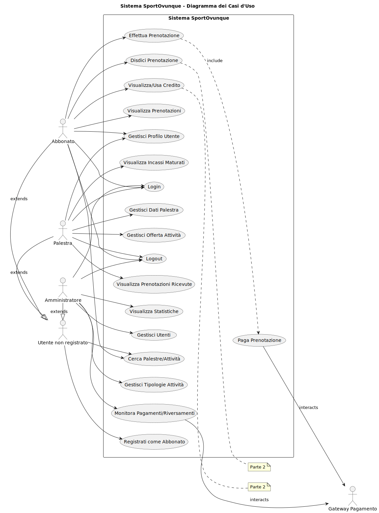

# Sessione suppletiva 2023 - seconda prova scritta - Indirizzo ITIA - INFORMATICA E TELECOMUNICAZIONI ARTICOLAZIONE "INFORMATICA" - Disciplina: INFORMATICA

- [Sessione suppletiva 2023 - seconda prova scritta - Indirizzo ITIA - INFORMATICA E TELECOMUNICAZIONI ARTICOLAZIONE "INFORMATICA" - Disciplina: INFORMATICA](#sessione-suppletiva-2023---seconda-prova-scritta---indirizzo-itia---informatica-e-telecomunicazioni-articolazione-informatica---disciplina-informatica)
  - [Traccia della prova](#traccia-della-prova)
  - [Svolgimento della prima parte](#svolgimento-della-prima-parte)
    - [Prima Parte](#prima-parte)
      - [1. Analisi della Realtà di Riferimento e Schema Concettuale](#1-analisi-della-realtà-di-riferimento-e-schema-concettuale)
      - [4. Interrogazioni SQL (MariaDB)](#4-interrogazioni-sql-mariadb)
      - [5. Progetto di massima della struttura funzionale della Applicazione Web](#5-progetto-di-massima-della-struttura-funzionale-della-applicazione-web)
      - [6. Parte Significativa dell'Applicazione Web (Registrazione, Login, Ricerca, Prenotazione)](#6-parte-significativa-dellapplicazione-web-registrazione-login-ricerca-prenotazione)
    - [B. Backend (ASP.NET Core Minimal API con EF Core e Cookie Auth)](#b-backend-aspnet-core-minimal-api-con-ef-core-e-cookie-auth)
    - [C. Frontend (HTML/CSS/JS per Login e Ricerca)](#c-frontend-htmlcssjs-per-login-e-ricerca)
  - [Svolgimento della seconda parte](#svolgimento-della-seconda-parte)
    - [Quesito I: disdetta prenotazione di un'attività e gestione del credito](#quesito-i-disdetta-prenotazione-di-unattività-e-gestione-del-credito)
      - [Quesito II: pagina dinamica che consenta all’utente di ottenere l’elenco delle palestre con mappa](#quesito-ii-pagina-dinamica-che-consenta-allutente-di-ottenere-lelenco-delle-palestre-con-mappa)
        - [Alternativa 1: Elenco Testuale delle Palestre](#alternativa-1-elenco-testuale-delle-palestre)
        - [Alternativa 2: Mappa Geografica delle Palestre](#alternativa-2-mappa-geografica-delle-palestre)
      - [Quesito III: le differenze, anche attraverso esempi, tra i predicati ANY, ALL ed EXISTS del linguaggio SQL](#quesito-iii-le-differenze-anche-attraverso-esempi-tra-i-predicati-any-all-ed-exists-del-linguaggio-sql)
      - [Quesito IV: Normalizzazione della Tabella Fornita](#quesito-iv-normalizzazione-della-tabella-fornita)

## Traccia della prova

[La traccia della prova](https://www.istruzione.it/esame_di_stato/202223/Istituti%20tecnici/Suppletiva/A038_SUP23.pdf) è disponibile sul sito del Ministero dell'Istruzione e del Merito.

## Svolgimento della prima parte

### Prima Parte

#### 1. Analisi della Realtà di Riferimento e Schema Concettuale

**A. Descrizione del Contesto e Obiettivi:**

La società SportOvunque gestisce palestre e vuole creare un portale web per offrire un abbonamento unico annuale. Questo abbonamento permette agli utenti di accedere non solo alle palestre di SportOvunque, ma anche a una rete di palestre partner su tutto il territorio nazionale. Le palestre partner, aderendo all'iniziativa, offrono tariffe di ingresso agevolate agli abbonati SportOvunque. Gli utenti si registrano e acquistano l'abbonamento online sul portale. Le palestre partner caricano autonomamente i propri dati (anagrafici, geografici) e le offerte di attività fitness (tipologie standard, giorni, orari, prezzi convenzionati, posti massimi). Gli abbonati possono cercare e prenotare le attività desiderate in qualsiasi palestra aderente, specificando data e ora, e pagando online l'importo della singola prenotazione a SportOvunque. SportOvunque gestisce questi incassi e li riversa mensilmente alle palestre competenti. Il sistema deve impedire prenotazioni se i posti per un'attività in una data specifica sono esauriti.  

**B. Identificazione Attori e Casi d'Uso:**

- **Attori:**

    - **Utente non registrato/Potenziale Cliente:** Naviga il sito, visualizza informazioni generali, cerca palestre/attività (in modo limitato?), si registra.
    - **Abbonato (Cliente Registrato):** Ha un ruolo specifico ("Abbonato"). Effettua login/logout, gestisce il proprio profilo, cerca palestre/attività (con tutti i dettagli), effettua prenotazioni (include pagamento), visualizza lo storico delle prenotazioni, (Parte 2) gestisce il credito, (Parte 2) disdice prenotazioni.
    - **Palestra (Partner):** Ha un ruolo specifico ("Palestra"). Effettua login/logout, gestisce i dati anagrafici e geografici della propria struttura, gestisce le proprie offerte di attività (inserimento, modifica, cancellazione), visualizza le prenotazioni ricevute, visualizza il riepilogo degli incassi maturati.
    - **Amministratore SportOvunque:** Ha un ruolo specifico ("Admin"). Gestisce gli account utente (Abbonati, Palestre), gestisce le tipologie standard di attività, monitora i flussi di pagamento, gestisce il processo di riversamento degli incassi alle palestre, visualizza statistiche e report.
- **Diagramma dei Casi d'Uso (Principali):**

    
    Il diagramma dei casi d'uso è stato ottenuto con il codice per [PlantUML](https://www.plantuml.com/plantuml/uml) riportato di seguito:

    ```text
    @startuml

    title Sistema SportOvunque - Diagramma dei Casi d'Uso

    ' Impostazione direzione generale
    top to bottom direction

    ' Definizione degli attori
    left to right direction
    actor "Utente non registrato" as A1
    actor "Abbonato" as A2
    actor "Palestra" as A3
    actor "Amministratore" as A4
    actor "Gateway Pagamento" as PG

    ' Relazioni di estensione tra attori
    A2 -|> A1 : extends
    A3 -|> A1 : extends
    A4 -|> A1 : extends

    ' Definizione dei casi d'uso
    rectangle "Sistema SportOvunque" {
    together {
        usecase "Registrati come Abbonato" as UC1
        usecase "Login" as UC2
        usecase "Logout" as UC3
        usecase "Gestisci Profilo Utente" as UC4
        usecase "Cerca Palestre/Attività" as UC5
        usecase "Effettua Prenotazione" as UC6
        usecase "Paga Prenotazione" as UC7
        usecase "Visualizza Prenotazioni" as UC8
        usecase "Gestisci Dati Palestra" as UC9
        usecase "Gestisci Offerta Attività" as UC10
        usecase "Visualizza Prenotazioni Ricevute" as UC11
        usecase "Visualizza Incassi Maturati" as UC12
        usecase "Gestisci Utenti" as UC13
        usecase "Gestisci Tipologie Attività" as UC14
        usecase "Monitora Pagamenti/Riversamenti" as UC15
        usecase "Visualizza Statistiche" as UC16
        usecase "Disdici Prenotazione" as UC17
        usecase "Visualizza/Usa Credito" as UC18
    }
    }

    note right of UC17 : Parte 2
    note right of UC18 : Parte 2

    ' Relazioni tra utente non registrato e casi d'uso
    A1 --> UC1
    A1 --> UC5

    ' Relazioni tra abbonato e casi d'uso
    A2 --> UC2
    A2 --> UC3
    A2 --> UC4
    A2 --> UC5
    A2 --> UC6
    A2 --> UC8
    A2 --> UC17
    A2 --> UC18

    ' Relazioni tra palestra e casi d'uso
    A3 --> UC2
    A3 --> UC3
    A3 --> UC4
    A3 --> UC9
    A3 --> UC10
    A3 --> UC11
    A3 --> UC12

    ' Relazioni tra amministratore e casi d'uso
    A4 --> UC2
    A4 --> UC3
    A4 --> UC13
    A4 --> UC14
    A4 --> UC15
    A4 --> UC16

    ' Relazioni di inclusione tra casi d'uso
    UC6 ..> UC7 : include

    ' Interazioni con il gateway di pagamento
    UC7 --> PG : interacts
    UC15 --> PG : interacts

    @enduml
    ```

**Elenco dei Casi d'Uso (Principali):**

- **(Utente non registrato):**
    - Visualizza Informazioni Portale
    - Registrati come Abbonato
- **(Abbonato):**
    - *Include:* Registrati come Abbonato
    - Login/Logout
    - Gestisci Profilo
    - Cerca Palestre/Attività
    - Effettua Prenotazione (include Pagamento Prenotazione)
    - Visualizza Prenotazioni
    - *Extend (Parte 2):* Disdici Prenotazione
    - *Extend (Parte 2):* Visualizza/Usa Credito
- **(Palestra):**
    - Login/Logout
    - Gestisci Dati Palestra (Anagrafica, Coordinate)
    - Gestisci Offerta Attività (Tipologie, Orari, Prezzi, Posti)
    - Visualizza Prenotazioni Ricevute
    - Visualizza Incassi Maturati
- **(Amministratore SportOvunque):**
    - Login/Logout
    - Gestisci Utenti (Abbonati, Palestre)
    - Gestisci Tipologie Attività Standard
    - Monitora Pagamenti
    - Gestisci Riversamenti Palestre
    - Visualizza Statistiche

**C. Dizionario dei Dati (Concetti Chiave):**

- **Abbonato:** Utente con ruolo "Abbonato", identificato da ID univoco, con dati anagrafici (Nome, Cognome, Email), credenziali (HashPassword), stato abbonamento (DataScadenza), e (Parte 2) credito (CreditoDisponibile).
- **Palestra:** Utente con ruolo "Palestra", identificato da ID univoco, con dati anagrafici (Nome, Indirizzo, Città), dati geografici (Latitudine, Longitudine), contatti (Email, Telefono).
- **Tipologia Attività:** Catalogo standardizzato di attività (ID, Nome, Descrizione). Gestito dall'Admin.
- **Offerta Attività:** Specifica proposta di una `Tipologia Attività` da parte di una `Palestra` in uno slot settimanale definito (ID, GiornoSettimana, OrarioInizio, OrarioFine, PrezzoConvenzionato, MaxPostiDisponibili). Collega `Palestra` e `Tipologia Attività`.
- **Prenotazione:** Registrazione dell'interesse (e poi del pagamento) di un `Abbonato` per una specifica `Offerta Attività` in una `DataAttivita` concreta (ID, DataOraPrenotazione, DataAttivita, StatoPagamento, ImportoPagato). Collega `Abbonato` e `Offerta Attività`. Include (Parte 2) stato `CANCELLED` e `DataOraCancellazione`.

**D. Schema Entità/Relazione (E/R):**

- **Entità:**

    - `UTENTE` (<u>IDUtente</u>, Email, HashPassword, Ruolo) --- *Generalizzazione per Abbonato, Palestra, Admin*
    - `ABBONATO` (<u>*IDUtente*</u> (FK), Nome, Cognome, DataScadenzaAbbonamento, CreditoDisponibile (Parte 2)) --- *Specializzazione*
    - `PALESTRA` (<u>*IDUtente*</u> (FK), NomePalestra, Indirizzo, Citta, Latitudine, Longitudine, TelefonoContatto) --- *Specializzazione*
    - `TIPOLOGIA_ATTIVITA` (<u>IDTipologia</u>, NomeTipologia, Descrizione)
    - `OFFERTA_ATTIVITA` (<u>IDOfferta</u>, GiornoSettimana, OrarioInizio, OrarioFine, PrezzoConvenzionato, MaxPostiDisponibili, *IDPalestra* (FK su UTENTE dove Ruolo='Palestra'), *IDTipologia* (FK))
    - `PRENOTAZIONE` (<u>IDPrenotazione</u>, DataOraPrenotazione, DataAttivita, StatoPagamento, ImportoPagato, DataOraCancellazione (Parte 2), *IDAbbonato* (FK su UTENTE dove Ruolo='Abbonato'), *IDOfferta* (FK))
- **Relazioni:**

    - ISA (Generalizzazione/Specializzazione): `ABBONATO` ISA `UTENTE`, `PALESTRA` ISA `UTENTE`. Un `UTENTE` può essere `ABBONATO` o `PALESTRA` (o `ADMIN`, anche se non ha attributi specifici qui).
    - `Propone` (1:N): `PALESTRA` (come UTENTE) propone N `OFFERTA_ATTIVITA`. Implementata tramite FK `IDPalestra` in `OFFERTA_ATTIVITA`.
    - `Classifica` (1:N): `TIPOLOGIA_ATTIVITA` classifica N `OFFERTA_ATTIVITA`. Implementata tramite FK `IDTipologia` in `OFFERTA_ATTIVITA`.
    - `Effettua` (1:N): `ABBONATO` (come UTENTE) effettua N `PRENOTAZIONE`. Implementata tramite FK `IDAbbonato` in `PRENOTAZIONE`.
    - `Riguarda` (1:N): `OFFERTA_ATTIVITA` riguarda N `PRENOTAZIONE`. Implementata tramite FK `IDOfferta` in `PRENOTAZIONE`.
- **Vincoli e Ipotesi Aggiuntive:**

    - Email è unica tra tutti gli utenti.
    - Ruolo in UTENTE può essere 'Abbonato', 'Palestra', 'Admin'.
    - Latitudine e Longitudine sono obbligatorie per le palestre.
    - `GiornoSettimana`: 1 (Lunedì) a 7 (Domenica).
    - `PrezzoConvenzionato`, `ImportoPagato`, `CreditoDisponibile`: >= 0.
    - `MaxPostiDisponibili`: > 0.
    - `DataAttivita` in `PRENOTAZIONE` deve essere futura/odierna e coerente con `GiornoSettimana` dell'offerta (verificato applicativamente o via trigger).
    - `StatoPagamento`: 'PENDING', 'COMPLETED', 'FAILED', 'CANCELLED' (Parte 2).
    - Solo Abbonati con `DataScadenzaAbbonamento` futura possono prenotare.
    - Pagamento gestito esternamente.
    - (Parte 2) Disdetta permessa solo se `DataAttivita - DataOraCancellazione > 48 ore`.

- **Schema E/R iniziale in versione Mermaid semplificata**
  
  ```mermaid
    erDiagram
    UTENTE {
        int IDUtente PK
        string Email UK
        string HashPassword
        enum Ruolo "Abbonato, Palestra, Admin"
    }
    
    ABBONATO {
        int IDUtente PK
        string Nome
        string Cognome
        date DataScadenzaAbbonamento
        decimal CreditoDisponibile
    }
    
    PALESTRA {
        int IDUtente PK
        string NomePalestra
        string Indirizzo
        string Citta
        decimal Latitudine
        decimal Longitudine
        string TelefonoContatto
    }
    
    TIPOLOGIA_ATTIVITA {
        int IDTipologia PK
        string NomeTipologia
        string Descrizione
    }
    
    OFFERTA_ATTIVITA {
        int IDOfferta PK
        int GiornoSettimana
        time OrarioInizio
        time OrarioFine
        decimal PrezzoConvenzionato
        int MaxPostiDisponibili
    }
    
    PRENOTAZIONE {
        int IDPrenotazione PK
        datetime DataOraPrenotazione
        date DataAttivita
        enum StatoPagamento "PENDING, COMPLETED, FAILED, CANCELLED"
        decimal ImportoPagato
        datetime DataOraCancellazione "Parte 2"
    }
    
    UTENTE ||--o{ ABBONATO : ISA
    UTENTE ||--o{ PALESTRA : ISA
    
    PALESTRA ||--o{ OFFERTA_ATTIVITA : "Propone"
    TIPOLOGIA_ATTIVITA ||--o{ OFFERTA_ATTIVITA : "Classifica"
    
    ABBONATO ||--o{ PRENOTAZIONE : "Effettua"
    OFFERTA_ATTIVITA ||--o{ PRENOTAZIONE : "Riguarda"
    ```

- **Schema E/R ristrutturato in versione Mermaid semplificata**

    Nel modello ristrutturato la gerarchia è stata tradotta in modo da mantenere sia l'entità genitore (UTENTE) che le entità figlie (ABBONATO, PALESTRA) collegate da relazioni "1:1".

    ```mermaid
    erDiagram
        UTENTE {
            int IDUtente PK
            string Email
            string HashPassword
            string Ruolo
        }
        
        ABBONATO {
            int IDUtente PK
            string Nome
            string Cognome
            date DataScadenzaAbbonamento
            decimal CreditoDisponibile
        }
        
        PALESTRA {
            int IDUtente PK
            string NomePalestra
            string Indirizzo
            string Citta
            decimal Latitudine
            decimal Longitudine
            string TelefonoContatto
        }
        
        TIPOLOGIE_ATTIVITA {
            int IDTipologia PK
            string NomeTipologia
            string Descrizione
        }
        
        OFFERTE_ATTIVITA {
            int IDOfferta PK
            int GiornoSettimana
            time OrarioInizio
            time OrarioFine
            decimal PrezzoConvenzionato
            int MaxPostiDisponibili
        }
        
        PRENOTAZIONE {
            int IDPrenotazione PK
            datetime DataOraPrenotazione
            date DataAttivita
            string StatoPagamento
            decimal ImportoPagato
            datetime DataOraCancellazione
        }
        
        UTENTE ||--|| ABBONATO : "1:1"
        UTENTE||--|| PALESTRA : "1:1"
        PALESTRA ||--o{ OFFERTE_ATTIVITA : "1:N"
        TIPOLOGIE_ATTIVITA ||--o{ OFFERTE_ATTIVITA : "1:N"
        ABBONATO ||--o{ PRENOTAZIONE : "1:N"
        OFFERTE_ATTIVITA ||--o{ PRENOTAZIONE : "1:N"
    ```

#### 2. Schema Logico Relazionale

Deriviamo le tabelle dallo schema E/R, applicando la generalizzazione/specializzazione e verificando la 3NF.

- **UTENTI** (<u>IDUtente</u> PK, Email UK, HashPassword, Ruolo)

- **ABBONATI** (<u>IDUtente</u> PK *FK -> UTENTI.IDUtente*, Nome, Cognome, DataScadenzaAbbonamento, CreditoDisponibile)

- **PALESTRE** (<u>IDUtente</u> PK *FK -> UTENTI.IDUtente*, NomePalestra, Indirizzo, Citta, Latitudine, Longitudine, TelefonoContatto NULL)

- **TIPOLOGIE_ATTIVITA** (<u>IDTipologia</u> PK, NomeTipologia UK, Descrizione NULL)

- **OFFERTE_ATTIVITA** (<u>IDOfferta</u> PK, GiornoSettimana, OrarioInizio, OrarioFine NULL, PrezzoConvenzionato, MaxPostiDisponibili, *IDPalestra* *FK -> PALESTRE.IDUtente*, *IDTipologia* *FK -> TIPOLOGIE_ATTIVITA.IDTipologia*, UK (IDPalestra, IDTipologia, GiornoSettimana, OrarioInizio))

- **PRENOTAZIONI** (<u>IDPrenotazione</u> PK, DataOraPrenotazione, DataAttivita, StatoPagamento, ImportoPagato NULL, DataOraCancellazione NULL, *IDAbbonato* *FK -> ABBONATI.IDUtente*, *IDOfferta* *FK -> OFFERTE_ATTIVITA.IDOfferta*)

    In forma grafica il modello logico relazionale si può rappresentare come mostrato di seguito:

    ```mermaid
    erDiagram
        UTENTI {
            int IDUtente PK
            varchar Email "NOT NULL UNIQUE"
            varchar HashPassword "NOT NULL"
            enum Ruolo "Abbonato, Palestra, Admin"
        }
        
        ABBONATI {
            int IDUtente PK,FK
            varchar Nome "NOT NULL"
            varchar Cognome "NOT NULL" 
            date DataScadenzaAbbonamento "NOT NULL"
            decimal CreditoDisponibile "NOT NULL DEFAULT 0.00"
        }
        
        PALESTRE {
            int IDUtente PK,FK
            varchar NomePalestra "NOT NULL"
            varchar Indirizzo "NOT NULL"
            varchar Citta "NOT NULL"
            decimal Latitudine "NOT NULL"
            decimal Longitudine "NOT NULL"
            varchar TelefonoContatto "NULL"
        }
        
        TIPOLOGIE_ATTIVITA {
            int IDTipologia PK
            varchar NomeTipologia "NOT NULL UNIQUE"
            text Descrizione "NULL"
        }
        
        OFFERTE_ATTIVITA {
            int IDOfferta PK
            tinyint GiornoSettimana "NOT NULL (1-7)"
            time OrarioInizio "NOT NULL"
            time OrarioFine "NULL"
            decimal PrezzoConvenzionato "NOT NULL"
            int MaxPostiDisponibili "NOT NULL"
            int IDPalestra "NOT NULL FK"
            int IDTipologia "NOT NULL FK"
        }
        
        PRENOTAZIONI {
            int IDPrenotazione PK
            datetime DataOraPrenotazione "NOT NULL DEFAULT CURRENT_TIMESTAMP"
            date DataAttivita "NOT NULL"
            enum StatoPagamento "PENDING, COMPLETED, FAILED, CANCELLED"
            decimal ImportoPagato "NULL"
            datetime DataOraCancellazione "NULL"
            int IDAbbonato "NOT NULL FK"
            int IDOfferta "NOT NULL FK"
        }
        
        UTENTI ||--|| ABBONATI : "1:1"
        UTENTI ||--|| PALESTRE : "1:1"
        PALESTRE ||--o{ OFFERTE_ATTIVITA : "propone"
        TIPOLOGIE_ATTIVITA ||--o{ OFFERTE_ATTIVITA : "classifica"
        ABBONATI ||--o{ PRENOTAZIONI : "effettua"
        OFFERTE_ATTIVITA ||--o{ PRENOTAZIONI : "riguarda"
    ```

#### 3. Definizione SQL (MariaDB) di Tabelle Chiave

```sql
-- Tabella Utenti (Base per ruoli)
CREATE TABLE UTENTI (
    IDUtente INT AUTO_INCREMENT PRIMARY KEY,
    Email VARCHAR(255) NOT NULL UNIQUE,
    HashPassword VARCHAR(255) NOT NULL,
    Ruolo ENUM('Abbonato', 'Palestra', 'Admin') NOT NULL
) ENGINE=InnoDB;

-- Tabella Abbonati (Specializzazione di Utenti)
CREATE TABLE ABBONATI (
    IDUtente INT PRIMARY KEY,
    Nome VARCHAR(100) NOT NULL,
    Cognome VARCHAR(100) NOT NULL,
    DataScadenzaAbbonamento DATE NOT NULL,
    CreditoDisponibile DECIMAL(10, 2) NOT NULL DEFAULT 0.00,
    FOREIGN KEY (IDUtente) REFERENCES UTENTI(IDUtente)
        ON DELETE CASCADE -- Se l'utente è cancellato, lo è anche l'abbonato
        ON UPDATE CASCADE,
    CONSTRAINT CHK_Credito CHECK (CreditoDisponibile >= 0)
) ENGINE=InnoDB;

-- Tabella Palestre (Specializzazione di Utenti)
CREATE TABLE PALESTRE (
    IDUtente INT PRIMARY KEY,
    NomePalestra VARCHAR(150) NOT NULL,
    Indirizzo VARCHAR(255) NOT NULL,
    Citta VARCHAR(100) NOT NULL,
    Latitudine DECIMAL(10, 8) NOT NULL,
    Longitude DECIMAL(11, 8) NOT NULL,
    TelefonoContatto VARCHAR(20),
    FOREIGN KEY (IDUtente) REFERENCES UTENTI(IDUtente)
        ON DELETE CASCADE -- Se l'utente è cancellato, lo è anche la palestra
        ON UPDATE CASCADE
) ENGINE=InnoDB;

-- Tabella Tipologie Attività
CREATE TABLE TIPOLOGIE_ATTIVITA (
    IDTipologia INT AUTO_INCREMENT PRIMARY KEY,
    NomeTipologia VARCHAR(100) NOT NULL UNIQUE,
    Descrizione TEXT NULL
) ENGINE=InnoDB;

-- Tabella Offerte Attività
CREATE TABLE OFFERTE_ATTIVITA (
    IDOfferta INT AUTO_INCREMENT PRIMARY KEY,
    GiornoSettimana TINYINT NOT NULL COMMENT '1=Lunedì, ..., 7=Domenica',
    OrarioInizio TIME NOT NULL,
    OrarioFine TIME NULL,
    PrezzoConvenzionato DECIMAL(10, 2) NOT NULL,
    MaxPostiDisponibili INT NOT NULL,
    IDPalestra INT NOT NULL COMMENT 'FK su UTENTI con Ruolo=Palestra',
    IDTipologia INT NOT NULL,
    FOREIGN KEY (IDPalestra) REFERENCES PALESTRE(IDUtente)
        ON DELETE CASCADE
        ON UPDATE CASCADE,
    FOREIGN KEY (IDTipologia) REFERENCES TIPOLOGIE_ATTIVITA(IDTipologia)
        ON DELETE RESTRICT -- Impedisce cancellazione tipologia usata in offerte
        ON UPDATE CASCADE,
    UNIQUE KEY UQ_OffertaUnica (IDPalestra, IDTipologia, GiornoSettimana, OrarioInizio),
    CONSTRAINT CHK_Giorno CHECK (GiornoSettimana BETWEEN 1 AND 7),
    CONSTRAINT CHK_PrezzoOfferta CHECK (PrezzoConvenzionato >= 0),
    CONSTRAINT CHK_PostiOfferta CHECK (MaxPostiDisponibili > 0),
    CONSTRAINT CHK_OrariOfferta CHECK (OrarioFine IS NULL OR OrarioFine > OrarioInizio)
) ENGINE=InnoDB;

-- Tabella Prenotazioni
CREATE TABLE PRENOTAZIONI (
    IDPrenotazione INT AUTO_INCREMENT PRIMARY KEY,
    DataOraPrenotazione DATETIME NOT NULL DEFAULT CURRENT_TIMESTAMP,
    DataAttivita DATE NOT NULL,
    StatoPagamento ENUM('PENDING', 'COMPLETED', 'FAILED', 'CANCELLED') NOT NULL DEFAULT 'PENDING',
    ImportoPagato DECIMAL(10, 2) NULL,
    DataOraCancellazione DATETIME NULL, -- Per Parte 2
    IDAbbonato INT NOT NULL COMMENT 'FK su UTENTI con Ruolo=Abbonato',
    IDOfferta INT NOT NULL,
    FOREIGN KEY (IDAbbonato) REFERENCES ABBONATI(IDUtente)
        ON DELETE CASCADE
        ON UPDATE CASCADE,
    FOREIGN KEY (IDOfferta) REFERENCES OFFERTE_ATTIVITA(IDOfferta)
        ON DELETE RESTRICT -- Impedisce cancellazione offerta con prenotazioni
        ON UPDATE CASCADE,
    CONSTRAINT CHK_ImportoPagato CHECK (ImportoPagato IS NULL OR ImportoPagato >= 0),
    INDEX IDX_Prenotazioni_DataAttivita (IDOfferta, DataAttivita) -- Indice utile per check disponibilità
) ENGINE=InnoDB;
```

**Gestione Posti Esauriti (Vincolo Dinamico):** Questo vincolo non può essere implementato direttamente con un `CHECK` constraint standard SQL perché richiede di contare le righe in un'altra tabella (`PRENOTAZIONI`) in relazione all' `OFFERTA_ATTIVITA` e alla `DataAttivita` specifica. Si gestisce tipicamente a livello applicativo o tramite trigger:  

1. **Livello Applicativo (Backend):** Prima di inserire una nuova prenotazione (INSERT in `PRENOTAZIONI`), l'applicazione esegue una query:

    ```sql
    SELECT COUNT(*) FROM PRENOTAZIONI
    WHERE IDOfferta = @IdOfferta AND DataAttivita = @DataAttivita
    AND StatoPagamento IN ('COMPLETED', 'PENDING');
    ```

    Confronta il risultato con `MaxPostiDisponibili` dell'`OFFERTA_ATTIVITA` corrispondente. Se `COUNT(*) >= MaxPostiDisponibili`, la prenotazione viene rifiutata. Questo deve avvenire all'interno di una **transazione** per evitare race conditions (due utenti che prenotano l'ultimo posto contemporaneamente).

   **Dentro la Transazione:** Quando si tenta di inserire una nuova prenotazione per `IDOfferta X` e `DataAttivita Y`:
    - Iniziare una transazione database.
    - Leggere `MaxPostiDisponibili` dall'offerta X.
    - Contare le prenotazioni esistenti per X e Y con stato 'COMPLETED' o 'PENDING' (prenotazioni attive).
    - Se `Conteggio >= MaxPostiDisponibili`, annullare la transazione (Rollback) e restituire un errore all'utente.
    - Altrimenti, procedere con l'inserimento della nuova prenotazione.
    - Completare la transazione (Commit).
  
    Questo approccio verrà mostrato negli esempi di codice backend.

2. **Trigger (Database):** Si può creare un trigger `BEFORE INSERT` sulla tabella `PRENOTAZIONI`.

    ```sql
    DELIMITER //

    CREATE TRIGGER CheckDisponibilitaPosti
    BEFORE INSERT ON PRENOTAZIONI
    FOR EACH ROW
    BEGIN
        DECLARE posti_occupati INT;
        DECLARE posti_max INT;

        -- Conta prenotazioni valide per quell'offerta in quella data
        SELECT COUNT(*) INTO posti_occupati
        FROM PRENOTAZIONI
        WHERE IDOfferta = NEW.IDOfferta
        AND DataAttivita = NEW.DataAttivita
        AND StatoPagamento IN ('COMPLETED', 'PENDING'); -- Considera anche pending

        -- Recupera i posti massimi per l'offerta
        SELECT MaxPostiDisponibili INTO posti_max
        FROM OFFERTE_ATTIVITA
        WHERE IDOfferta = NEW.IDOfferta;

        -- Se i posti sono esauriti, blocca l'inserimento
        IF posti_occupati >= posti_max THEN
            SIGNAL SQLSTATE '45000' -- Codice errore custom
            SET MESSAGE_TEXT = 'Posti esauriti per questa attività in questa data.';
        END IF;
    END; //

    DELIMITER ;
    ```

*Vantaggio:* Consistenza garantita a livello DB. *Svantaggio:* Logica di business nel DB, potenziali performance overhead. **L'approccio applicativo è spesso preferito in architetture moderne.**

#### 4. Interrogazioni SQL (MariaDB)

**a) Elenco attività disponibili in una data città il mercoledì:**

```sql
SELECT
    pa.NomePalestra,
    ta.NomeTipologia,
    oa.OrarioInizio,
    oa.OrarioFine,
    oa.MaxPostiDisponibili,
    oa.PrezzoConvenzionato
FROM OFFERTE_ATTIVITA oa
JOIN PALESTRE pa ON oa.IDPalestra = pa.IDUtente -- Join su IDUtente
JOIN TIPOLOGIE_ATTIVITA ta ON oa.IDTipologia = ta.IDTipologia
JOIN UTENTI u ON pa.IDUtente = u.IDUtente -- Per verificare il ruolo se necessario
WHERE
    pa.Citta = 'Milano' -- Parametro: Città specifica
    AND oa.GiornoSettimana = 3 -- Parametro: 3 = Mercoledì
    AND u.Ruolo = 'Palestra' -- Verifica aggiuntiva (opzionale se FK è sufficiente)
ORDER BY
    pa.NomePalestra,
    oa.OrarioInizio;

```

**b) Importo totale prenotazioni di aprile da versare a una determinata palestra:**

```sql
SELECT
    IFNULL(SUM(pr.ImportoPagato), 0.00) AS ImportoTotaleDaVersare
FROM PRENOTAZIONI pr
JOIN OFFERTE_ATTIVITA oa ON pr.IDOfferta = oa.IDOfferta
JOIN PALESTRE pa ON oa.IDPalestra = pa.IDUtente
WHERE
    pa.IDUtente = 123 -- Parametro: ID della palestra specifica
    AND pr.StatoPagamento = 'COMPLETED'
    AND MONTH(pr.DataAttivita) = 4 -- Parametro: Mese (Aprile)
    AND YEAR(pr.DataAttivita) = 2025; -- Parametro: Anno specifico (es: 2025)

```

**c) Classifica annuale palestre per numero prenotazioni in una città:**

```sql
SELECT
    pa.NomePalestra,
    COUNT(pr.IDPrenotazione) AS NumeroPrenotazioniAnnuali
FROM PRENOTAZIONI pr
JOIN OFFERTE_ATTIVITA oa ON pr.IDOfferta = oa.IDOfferta
JOIN PALESTRE pa ON oa.IDPalestra = pa.IDUtente
WHERE
    pa.Citta = 'Roma' -- Parametro: Città specifica
    AND YEAR(pr.DataAttivita) = 2025 -- Parametro: Anno specifico
    -- Si potrebbe voler contare solo le 'COMPLETED'
    AND pr.StatoPagamento = 'COMPLETED'
GROUP BY
    pa.IDUtente, pa.NomePalestra -- Raggruppa per ID e Nome palestra
ORDER BY
    NumeroPrenotazioniAnnuali DESC;
```

#### 5. Progetto di massima della struttura funzionale della Applicazione Web

La struttura rimane simile a quella descritta in precedenza, ma evidenziamo i ruoli:

- **Area Pubblica (Accesso Anonimo):** Homepage, Ricerca base palestre/attività, Dettaglio palestra/attività (senza prezzi?), Registrazione, Login.
- **Area Riservata Abbonato (Ruolo 'Abbonato'):** Dashboard (prenotazioni, credito), Profilo, Ricerca completa, Prenotazione (con pagamento/uso credito), Storico/Disdetta prenotazioni.
- **Area Riservata Palestra (Ruolo 'Palestra'):** Dashboard (offerte, prenotazioni ricevute), Gestione anagrafica/coordinate, Gestione offerte (CRUD), Visualizzazione prenotazioni/incassi.
- **Area Amministrazione (Ruolo 'Admin'):** Gestione utenti (tutti i ruoli), Gestione tipologie attività, Monitoraggio pagamenti/riversamenti, Statistiche.

**Architettura Implementativa:** ASP.NET Core Minimal API + Frontend Statico + Autenticazione Cookie

- **Backend (ASP.NET Core Minimal API):**
    - **Framework:** .NET 8 (o versione LTS corrente).
    - **Database ORM:** Entity Framework Core (EF Core) con provider per MariaDB (`Pomelo.EntityFrameworkCore.MySql`).
    - **Autenticazione:** ASP.NET Core Identity (configurata per Cookie Authentication). Memorizza gli utenti in `UTENTI` e tabelle correlate (se si usa Identity completo) o gestisce manualmente l'hashing e la verifica password sulla tabella `UTENTI`. Il login emette un cookie di autenticazione (`.AspNetCore.Identity.Application`).
    - **Autorizzazione:** Basata su Ruoli. I ruoli ('Abbonato', 'Palestra', 'Admin') vengono letti dalla tabella `UTENTI` durante il login e aggiunti come *Claim* al `ClaimsPrincipal` associato al cookie. Gli endpoint API vengono protetti usando `.RequireAuthorization(policy => policy.RequireRole("NomeRuolo"))`.
    - **API:** Endpoint RESTful Minimal API per le varie funzionalità.
    - **Servizio File Statici:** Configurato per servire HTML/CSS/JS da `wwwroot`.
- **Frontend (HTML, CSS, JavaScript in `wwwroot`):**
    - **Struttura:** Pagine HTML statiche.
    - **Stile:** CSS (es: Bootstrap, Tailwind, o custom).
    - **Interattività:** JavaScript (Vanilla JS o framework leggero) che usa `Fetch API` per chiamare le API backend. Il browser gestirà automaticamente l'invio del cookie di autenticazione con ogni richiesta dopo il login. JS dovrà gestire le risposte API (successo, errore 401/403 per autenticazione/autorizzazione fallita, errore 400 per dati non validi, errore 409 per conflitti come posti esauriti, errore 500 per problemi server).

#### 6. Parte Significativa dell'Applicazione Web (Registrazione, Login, Ricerca, Prenotazione)

**A. Modelli C# (DTOs e Entità EF Core):**

```cs
// --- Entità EF Core (semplificate, omettendo attributi non chiave/FK) ---
public class Utente {
    public int IDUtente { get; set; }
    public string Email { get; set; } = null!;
    public string HashPassword { get; set; } = null!;
    public string Ruolo { get; set; } = null!; // "Abbonato", "Palestra", "Admin"
    // Navigation properties (opzionali ma utili)
    public virtual Abbonato? Abbonato { get; set; }
    public virtual Palestra? Palestra { get; set; }
}

public class Abbonato {
    public int IDUtente { get; set; } // PK e FK
    public string Nome { get; set; } = null!;
    // ... altri campi ...
    public decimal CreditoDisponibile { get; set; }
    public virtual Utente Utente { get; set; } = null!;
}

public class Palestra {
    public int IDUtente { get; set; } // PK e FK
    public string NomePalestra { get; set; } = null!;
    // ... altri campi ...
    public virtual Utente Utente { get; set; } = null!;
    public virtual ICollection<OffertaAttivita> OfferteAttivita { get; set; } = new List<OffertaAttivita>();
}

public class TipologiaAttivita {
    public int IDTipologia { get; set; }
    public string NomeTipologia { get; set; } = null!;
    // ...
}

public class OffertaAttivita {
    public int IDOfferta { get; set; }
    // ... altri campi ...
    public int MaxPostiDisponibili { get; set; }
    public int IDPalestra { get; set; }
    public int IDTipologia { get; set; }
    public virtual Palestra Palestra { get; set; } = null!;
    public virtual TipologiaAttivita TipologiaAttivita { get; set; } = null!;
    public virtual ICollection<Prenotazione> Prenotazioni { get; set; } = new List<Prenotazione>();
}

public class Prenotazione {
    public int IDPrenotazione { get; set; }
    public DateOnly DataAttivita { get; set;} // Usa DateOnly per la data
    public string StatoPagamento { get; set; } = null!; // "PENDING", "COMPLETED", ...
    public int IDAbbonato { get; set; }
    public int IDOfferta { get; set; }
    // ...
    public virtual Abbonato Abbonato { get; set; } = null!;
    public virtual OffertaAttivita OffertaAttivita { get; set; } = null!;
}

// --- DbContext ---
public class SportOvunqueDbContext : DbContext {
    public SportOvunqueDbContext(DbContextOptions<SportOvunqueDbContext> options) : base(options) { }

    public DbSet<Utente> Utenti { get; set; } = null!;
    public DbSet<Abbonato> Abbonati { get; set; } = null!;
    public DbSet<Palestra> Palestre { get; set; } = null!;
    public DbSet<TipologiaAttivita> TipologieAttivita { get; set; } = null!;
    public DbSet<OffertaAttivita> OfferteAttivita { get; set; } = null!;
    public DbSet<Prenotazione> Prenotazioni { get; set; } = null!;

    protected override void OnModelCreating(ModelBuilder modelBuilder) {
        // Configura chiavi primarie, relazioni, tipi di dato specifici (ENUMs, DECIMAL), indici, ecc.
        // Esempio per relazione Utente-Abbonato (1-a-1)
        modelBuilder.Entity<Utente>()
            .HasOne(u => u.Abbonato)
            .WithOne(a => a.Utente)
            .HasForeignKey<Abbonato>(a => a.IDUtente);

        modelBuilder.Entity<Utente>()
            .HasOne(u => u.Palestra)
            .WithOne(p => p.Utente)
            .HasForeignKey<Palestra>(p => p.IDUtente);

        // Configura ENUM come stringhe o interi nel DB
        modelBuilder.Entity<Utente>()
            .Property(u => u.Ruolo)
            .HasConversion<string>() // Salva come stringa
            .HasMaxLength(20); // Lunghezza massima

        modelBuilder.Entity<Prenotazione>()
             .Property(p => p.StatoPagamento)
             .HasConversion<string>()
             .HasMaxLength(20);

        // Configura Decimal per MariaDB/MySQL
        modelBuilder.Entity<Abbonato>()
            .Property(a => a.CreditoDisponibile).HasPrecision(10, 2);
        modelBuilder.Entity<OffertaAttivita>()
            .Property(o => o.PrezzoConvenzionato).HasPrecision(10, 2);
        modelBuilder.Entity<Prenotazione>()
            .Property(p => p.ImportoPagato).HasPrecision(10, 2);
        // ... altre configurazioni ...
    }
}

// --- DTOs (Data Transfer Objects) ---
public record RegistrazioneAbbonatoRequest(string Email, string Password, string Nome, string Cognome);
public record LoginRequest(string Email, string Password);
public record UserInfoResponse(int Id, string Email, string Ruolo, string? NomeCompleto); // Info utente loggato
public record OffertaRicercaResult(int IdOfferta, string NomePalestra, string NomeTipologia, TimeOnly OrarioInizio, decimal PrezzoConvenzionato); // Usa TimeOnly
public record PrenotazioneRequest(int IdOfferta, DateOnly DataAttivita, bool UsaCredito = false); // Usa DateOnly
public record PrenotazioneResponse(int IdPrenotazione, string Stato, string Messaggio);

```

### B. Backend (ASP.NET Core Minimal API con EF Core e Cookie Auth)

Questo frammento di codice illustra la configurazione e l'implementazione degli endpoint principali del backend per l'applicazione SportOvunque, utilizzando ASP.NET Core Minimal API, Entity Framework Core per l'interazione con un database MariaDB, e un sistema di autenticazione basato su cookie con autorizzazione basata sui ruoli.

```cs
// Program.cs
using Microsoft.AspNetCore.Authentication;
using Microsoft.AspNetCore.Authentication.Cookies;
using Microsoft.AspNetCore.Identity; // Per IPasswordHasher
using Microsoft.AspNetCore.Mvc; // Per [FromBody], [FromQuery] etc.
using Microsoft.EntityFrameworkCore;
using MySql.Data.MySqlClient; // Per i parametri MySql specifici per Raw SQL con MariaDB/MySQL
using System.Security.Claims;

// Supponiamo che le classi DTO e le entità EF Core (Utente, Abbonato, ecc.)
// e SportOvunqueDbContext siano definite come al punto precedente.
// Ad esempio:
// public record RegistrazioneAbbonatoRequest(string Email, string Password, string Nome, string Cognome);
// public record LoginRequest(string Email, string Password);
// public record UserInfoResponse(int Id, string Email, string Ruolo, string? NomeCompleto);
// public record OffertaRicercaResult(int IdOfferta, string NomePalestra, string NomeTipologia, TimeOnly OrarioInizio, decimal PrezzoConvenzionato);
// public record PrenotazioneRequest(int IdOfferta, DateOnly DataAttivita, bool UsaCredito = false);
// public record PrenotazioneResponse(int IdPrenotazione, string Stato, string Messaggio);
// public class Utente { /* ... */ }
// public class Abbonato { /* ... */ }
// public class SportOvunqueDbContext : DbContext { /* ... */ }

var builder = WebApplication.CreateBuilder(args);

// --- Configurazione Servizi ---

// 1. DbContext con EF Core per MariaDB
var connectionString = builder.Configuration.GetConnectionString("DefaultConnection");
// Assicurati che Pomelo.EntityFrameworkCore.MySql sia referenziato nel progetto
builder.Services.AddDbContext<SportOvunqueDbContext>(options =>
    options.UseMySql(connectionString, ServerVersion.AutoDetect(connectionString))
           .LogTo(Console.WriteLine, LogLevel.Information) // Logga le query SQL generate da EF Core
           .EnableSensitiveDataLogging() // Utile in sviluppo per vedere i valori dei parametri
);

// 2. Autenticazione Cookie
builder.Services.AddAuthentication(CookieAuthenticationDefaults.AuthenticationScheme)
    .AddCookie(options =>
    {
        options.Cookie.Name = "SportOvunque.AuthCookie";
        options.Cookie.HttpOnly = true; // Il cookie non è accessibile da JavaScript lato client
        options.Cookie.SecurePolicy = CookieSecurePolicy.Always; // Richiede HTTPS (SameAsRequest in dev)
        options.Cookie.SameSite = SameSiteMode.Lax; // Protezione CSRF base

        options.LoginPath = "/login.html"; // Pagina a cui il middleware AuthN reindirizza (per browser)
        options.LogoutPath = "/api/account/logout"; // Path per il logout
        options.AccessDeniedPath = "/access-denied.html"; // Pagina per accesso negato

        options.ExpireTimeSpan = TimeSpan.FromHours(8); // Durata del cookie
        options.SlidingExpiration = true; // Rinnova la scadenza del cookie a ogni richiesta

        // Gestione custom per API: non reindirizzare ma restituire status code
        options.Events = new CookieAuthenticationEvents
        {
            OnRedirectToLogin = context =>
            {
                if (context.Request.Path.StartsWithSegments("/api"))
                {
                    context.Response.StatusCode = StatusCodes.Status401Unauthorized;
                }
                else
                {
                    context.Response.Redirect(context.RedirectUri);
                }
                return Task.CompletedTask;
            },
            OnRedirectToAccessDenied = context =>
            {
                if (context.Request.Path.StartsWithSegments("/api"))
                {
                    context.Response.StatusCode = StatusCodes.Status403Forbidden;
                }
                else
                {
                    context.Response.Redirect(context.RedirectUri);
                }
                return Task.CompletedTask;
            }
        };
    });

// 3. Autorizzazione basata su Ruoli
builder.Services.AddAuthorizationBuilder()
    .AddPolicy("AbbonatoPolicy", policy => policy.RequireRole("Abbonato"))
    .AddPolicy("PalestraPolicy", policy => policy.RequireRole("Palestra"))
    .AddPolicy("AdminPolicy", policy => policy.RequireRole("Admin"));

// Servizi aggiuntivi
builder.Services.AddScoped<IPasswordHasher<Utente>, PasswordHasher<Utente>>(); // Per hashing password

var app = builder.Build();

// --- Middleware Pipeline ---
if (app.Environment.IsDevelopment())
{
    app.UseDeveloperExceptionPage();
}
else
{
    app.UseExceptionHandler("/error.html"); // Pagina di errore generica per produzione
    app.UseHsts(); // Aggiunge header HSTS
}

app.UseHttpsRedirection(); // Reindirizza HTTP a HTTPS
app.UseStaticFiles();    // Serve file statici da wwwroot (HTML, CSS, JS)

app.UseRouting();        // Necessario per mappare gli endpoint

app.UseAuthentication(); // Identifica l'utente basato sul cookie
app.UseAuthorization();  // Verifica se l'utente ha i permessi per accedere alla risorsa

// --- Definizione Endpoint API ---

var accountApiGroup = app.MapGroup("/api/account");

// POST /api/account/register (Pubblico)
accountApiGroup.MapPost("/register", async (
    [FromBody] RegistrazioneAbbonatoRequest req,
    SportOvunqueDbContext db,
    IPasswordHasher<Utente> passwordHasher) =>
{
    // Validazione input (potrebbe essere più estesa con FluentValidation o DataAnnotations)
    if (string.IsNullOrWhiteSpace(req.Email) || string.IsNullOrWhiteSpace(req.Password) ||
        string.IsNullOrWhiteSpace(req.Nome) || string.IsNullOrWhiteSpace(req.Cognome))
    {
        return Results.BadRequest(new { Message = "Tutti i campi sono obbligatori." });
    }

    // --- Controllo Esistenza Email (LINQ) ---
    bool emailExistsLinq = await db.Utenti.AnyAsync(u => u.Email == req.Email);

    /*
    // --- Controllo Esistenza Email (Raw SQL con EF Core 7+) ---
    // Nota: SqlQuery richiede un tipo di ritorno. Per un booleano o conteggio,
    // si può proiettare su un tipo semplice o un DTO.
    // Qui usiamo un approccio per contare e poi verificare.

    // Assumendo che req.Email sia la stringa contenente l'email
    string emailDaCercare = req.Email; // Il valore da passare

    var countResult = await db.Database
        .SqlQuery<int>($"SELECT COUNT(*) FROM UTENTI WHERE Email = {emailDaCercare}")
        .SingleAsync(); // EF Core crea un DbParameter per emailDaCercare

    bool emailExistsRaw = countResult > 0;
    */

    if (emailExistsLinq) // o emailExistsRaw
    {
        return Results.Conflict(new { Message = "L'indirizzo email è già registrato." });
    }

    var utente = new Utente
    {
        Email = req.Email,
        Ruolo = "Abbonato" // Ruolo fisso per questa API di registrazione
    };
    utente.HashPassword = passwordHasher.HashPassword(utente, req.Password);

    var abbonato = new Abbonato
    {
        Utente = utente, // EF Core gestisce la relazione e l'inserimento dell'Utente
        Nome = req.Nome,
        Cognome = req.Cognome,
        DataScadenzaAbbonamento = DateOnly.FromDateTime(DateTime.UtcNow.AddYears(1)), // Abbonamento di 1 anno
        CreditoDisponibile = 0
    };

    db.Abbonati.Add(abbonato); // Aggiungendo Abbonato, anche Utente verrà aggiunto grazie alla relazione

    try
    {
        await db.SaveChangesAsync();
        // Non effettuare il login automatico, l'utente deve fare il login separatamente.
        return Results.Created($"/api/account/{utente.IDUtente}", new { Message = "Registrazione completata con successo." });
    }
    catch (DbUpdateException ex)
    {
        app.Logger.LogError(ex, "Errore durante il salvataggio della registrazione nel database.");
        return Results.StatusCode(StatusCodes.Status500InternalServerError, new { Message = "Errore interno del server durante la registrazione." });
    }
});

// POST /api/account/login (Pubblico)
accountApiGroup.MapPost("/login", async (
    [FromBody] LoginRequest req,
    SportOvunqueDbContext db,
    IPasswordHasher<Utente> passwordHasher,
    HttpContext httpContext,
    IConfiguration config // Per accedere a opzioni cookie se necessario
    ) =>
{
    if (string.IsNullOrWhiteSpace(req.Email) || string.IsNullOrWhiteSpace(req.Password))
    {
        return Results.BadRequest(new { Message = "Email e password sono obbligatori." });
    }

    // --- Recupero Utente (LINQ - Metodo Preferito per Complessità con Relazioni) ---
    var utenteLinq = await db.Utenti
        .Include(u => u.Abbonato) // Carica dati specifici dell'Abbonato se l'utente è un Abbonato
        .Include(u => u.Palestra) // Carica dati specifici della Palestra se l'utente è una Palestra
        .FirstOrDefaultAsync(u => u.Email == req.Email);

    // --- Esempio Alternativo: Recupero Utente Base con Raw SQL (EF Core 7+) ---
    // Questo esempio mostra come recuperare solo i dati base dell'entità UTENTI
    // usando SQL raw con la corretta parametrizzazione automatica fornita
    // dall'interpolazione di stringa di EF Core.

    // Il valore da cercare, preso dalla richiesta
    string emailDaCercare = req.Email;

    // Definiamo un record o una classe DTO (Data Transfer Object) per mappare
    // esattamente le colonne restituite dalla query SQL raw.
    // Questo è utile se la query non restituisce tutte le proprietà dell'entità 'Utente'
    // o se ha un formato diverso. Per questo esempio, assumiamo che restituisca
    // le proprietà base mappate in UtenteBaseDto.
    public record UtenteBaseDto(int IDUtente, string Email, string HashPassword, string Ruolo);

    /*
    // Esecuzione della query SQL raw interpolata
    var utenteBaseRaw = (await db.Database
        // Utilizziamo $"..." per l'interpolazione. EF Core creerà un DbParameter per {emailDaCercare}.
        .SqlQuery<UtenteBaseDto>($"SELECT IDUtente, Email, HashPassword, Ruolo FROM UTENTI WHERE Email = {emailDaCercare}")
        .ToListAsync()) // ToListAsync perché FirstOrDefaultAsync non è direttamente disponibile su IQueryable<T> da SqlQuery
        .FirstOrDefault(); // Applica FirstOrDefault sulla lista in memoria

    // Commento sulla gestione dei dati correlati con Raw SQL:
    // Se 'utenteBaseRaw' non è null, avremmo solo i dati della tabella UTENTI.
    // Per caricare i dati correlati dalle tabelle ABBONATI o PALESTRE usando SQL raw,
    // sarebbero necessarie query aggiuntive separate.
    // Ad esempio:
    // Abbonato? abbonatoCorrelato = null;
    // Palestra? palestraCorrelata = null;
    //
    // if (utenteBaseRaw != null) {
    //     if (utenteBaseRaw.Ruolo == "Abbonato") {
    //         int idUtenteParam = utenteBaseRaw.IDUtente;
    //         abbonatoCorrelato = (await db.Database
    //             .SqlQuery<Abbonato>($"SELECT IDUtente, Nome, Cognome, DataScadenzaAbbonamento, CreditoDisponibile FROM ABBONATI WHERE IDUtente = {idUtenteParam}")
    //             .ToListAsync())
    //             .FirstOrDefault();
    //     } else if (utenteBaseRaw.Ruolo == "Palestra") {
    //         int idUtenteParam = utenteBaseRaw.IDUtente;
    //         palestraCorrelata = (await db.Database
    //             .SqlQuery<Palestra>($"SELECT IDUtente, NomePalestra, Indirizzo, Citta, Latitudine, Longitude, TelefonoContatto FROM PALESTRE WHERE IDUtente = {idUtenteParam}")
    //             .ToListAsync())
    //             .FirstOrDefault();
    //     }
    //
    //     // A questo punto, si dovrebbe costruire un oggetto 'Utente' completo
    //     // assemblando 'utenteBaseRaw' con 'abbonatoCorrelato' o 'palestraCorrelata'.
    //     // Questo processo è manuale e più complesso rispetto all'uso di .Include() di LINQ.
    // }
    */

    // Per la logica di login completa, che necessita dei dati correlati per popolare
    // correttamente i Claims (es. nome completo dell'abbonato), l'approccio LINQ con .Include()
    // è generalmente più semplice e manutenibile.
    // Pertanto, continuiamo ad usare 'utenteLinq' per il resto della logica di login.
    var utente = utenteLinq;

    if (utente == null)
    {
        // Logica di gestione utente non trovato (come già presente)
        return Results.Unauthorized(new { Message = "Credenziali non valide." });
    }

    var verificationResult = passwordHasher.VerifyHashedPassword(utente, utente.HashPassword, req.Password);
    if (verificationResult == PasswordVerificationResult.Failed)
    {
        return Results.Unauthorized(new { Message = "Credenziali non valide." }); // Password errata
    }

    // Password corretta, procedi con la creazione del cookie di autenticazione
    var claims = new List<Claim>
    {
        new Claim(ClaimTypes.NameIdentifier, utente.IDUtente.ToString()),
        new Claim(ClaimTypes.Email, utente.Email),
        new Claim(ClaimTypes.Role, utente.Ruolo) // Aggiunge il ruolo dell'utente come Claim
    };

    // Aggiungi nome completo o nome palestra come Claim di tipo Name
    if (utente.Ruolo == "Abbonato" && utente.Abbonato != null)
    {
        claims.Add(new Claim(ClaimTypes.Name, $"{utente.Abbonato.Nome} {utente.Abbonato.Cognome}"));
    }
    else if (utente.Ruolo == "Palestra" && utente.Palestra != null)
    {
        claims.Add(new Claim(ClaimTypes.Name, utente.Palestra.NomePalestra));
    }

    var claimsIdentity = new ClaimsIdentity(claims, CookieAuthenticationDefaults.AuthenticationScheme);

    // Recupera ExpireTimeSpan dalle opzioni configurate per coerenza
    var cookieOptions = httpContext.RequestServices.GetRequiredService<Microsoft.Extensions.Options.IOptionsMonitor<CookieAuthenticationOptions>>()
                                .Get(CookieAuthenticationDefaults.AuthenticationScheme);

    var authProperties = new AuthenticationProperties
    {
        IsPersistent = true, // Rende il cookie persistente (non di sessione)
        AllowRefresh = true, // Permette il refresh del cookie (sliding expiration)
        ExpiresUtc = DateTimeOffset.UtcNow.Add(cookieOptions.ExpireTimeSpan)
    };

    await httpContext.SignInAsync(
        CookieAuthenticationDefaults.AuthenticationScheme,
        new ClaimsPrincipal(claimsIdentity),
        authProperties);

    return Results.Ok(new UserInfoResponse(
        utente.IDUtente,
        utente.Email,
        utente.Ruolo,
        claims.FirstOrDefault(c => c.Type == ClaimTypes.Name)?.Value // Nome per visualizzazione
    ));
});

// POST /api/account/logout (Richiede Autenticazione)
accountApiGroup.MapPost("/logout", async (HttpContext httpContext) =>
{
    await httpContext.SignOutAsync(CookieAuthenticationDefaults.AuthenticationScheme);
    return Results.Ok(new { Message = "Logout effettuato con successo." });
}).RequireAuthorization(); // L'utente deve essere loggato per effettuare il logout

// GET /api/account/me (Richiede Autenticazione) - Restituisce info dell'utente loggato
accountApiGroup.MapGet("/me", (ClaimsPrincipal user) =>
{
    // ClaimsPrincipal user è iniettato automaticamente dal middleware di autenticazione
    if (!(user.Identity?.IsAuthenticated ?? false))
    {
        return Results.Unauthorized();
    }
    var userInfo = new UserInfoResponse(
         int.Parse(user.FindFirstValue(ClaimTypes.NameIdentifier) ?? "0"),
         user.FindFirstValue(ClaimTypes.Email) ?? string.Empty,
         user.FindFirstValue(ClaimTypes.Role) ?? string.Empty,
         user.FindFirstValue(ClaimTypes.Name) // Può essere null
     );
    return Results.Ok(userInfo);
}).RequireAuthorization();

// --- API Catalogo ---
var catalogoApiGroup = app.MapGroup("/api");

// GET /api/tipologie (Pubblico)
catalogoApiGroup.MapGet("/tipologie", async (SportOvunqueDbContext db) =>
{
    // --- Versione LINQ ---
    var tipologieLinq = await db.TipologieAttivita
                            .OrderBy(t => t.NomeTipologia)
                            .Select(t => new { t.IDTipologia, t.NomeTipologia }) // Proiezione su un tipo anonimo
                            .ToListAsync();
    // return Results.Ok(tipologieLinq);

    // --- Versione Raw SQL con EF Core 7+ (SqlQuery) ---
    // Definisci un DTO per il risultato se le colonne non corrispondono esattamente a TipologiaAttivita
    // public record TipologiaDto(int IDTipologia, string NomeTipologia);
    // var tipologieRaw = await db.Database
    //    .SqlQuery<TipologiaDto>($"SELECT IDTipologia, NomeTipologia FROM TIPOLOGIE_ATTIVITA ORDER BY NomeTipologia")
    //    .ToListAsync();
    // return Results.Ok(tipologieRaw);

    // Scegliamo la versione LINQ per questo esempio
    return Results.Ok(tipologieLinq);
});

// GET /api/offerte/ricerca (Richiede ruolo "Abbonato")
catalogoApiGroup.MapGet("/offerte/ricerca", async (
    [FromQuery] string? citta,
    [FromQuery] int? idTipologia,
    [FromQuery] int? giorno, // 1-7 per Lunedì-Domenica
    SportOvunqueDbContext db) =>
{
    // --- Versione LINQ (Preferita per leggibilità e type safety con Include) ---
    var queryLinq = db.OfferteAttivita
                  .Include(oa => oa.Palestra) // Per accedere a NomePalestra e Citta
                  .Include(oa => oa.TipologiaAttivita) // Per accedere a NomeTipologia
                  .AsQueryable(); // Permette di costruire la query dinamicamente

    if (!string.IsNullOrWhiteSpace(citta))
    {
        queryLinq = queryLinq.Where(oa => oa.Palestra.Citta == citta);
    }
    if (idTipologia.HasValue && idTipologia > 0)
    {
        queryLinq = queryLinq.Where(oa => oa.IDTipologia == idTipologia.Value);
    }
    if (giorno.HasValue && giorno >= 1 && giorno <= 7)
    {
        // Assumendo che GiornoSettimana sia TINYINT 1 (Lunedì) - 7 (Domenica)
        queryLinq = queryLinq.Where(oa => oa.GiornoSettimana == giorno.Value);
    }

    var offerteLinq = await queryLinq
                        .OrderBy(oa => oa.Palestra.NomePalestra)
                        .ThenBy(oa => oa.OrarioInizio)
                        .Select(oa => new OffertaRicercaResult( // Proiezione sul DTO OffertaRicercaResult
                            oa.IDOfferta,
                            oa.Palestra.NomePalestra,
                            oa.TipologiaAttivita.NomeTipologia,
                            TimeOnly.FromTimeSpan(oa.OrarioInizio), // EF Core potrebbe mappare TIME a TimeSpan
                            oa.PrezzoConvenzionato
                         ))
                        .ToListAsync();
    // return Results.Ok(offerteLinq); // Commentato per mostrare l'alternativa Raw SQL


    // --- Versione Raw SQL con EF Core 7+ ---
    // Per questa query che coinvolge JOIN e proiezioni su un DTO specifico,
    // è cruciale definire un DTO che corrisponda esattamente alle colonne restituite.
    // Si userà l'interpolazione di stringa per la parametrizzazione sicura.

    // DTO specifico per il risultato della query Raw SQL, se diverso da OffertaRicercaResult
    // In questo caso, OffertaRicercaResult può essere riutilizzato se OrarioInizio è gestito come TimeSpan
    // oppure si adatta la query per restituire un tipo compatibile.
    // Per coerenza, manteniamo OffertaRicercaResult e convertiamo TimeSpan in TimeOnly dopo.
    public record RawOffertaDto(int IdOfferta, string NomePalestra, string NomeTipologia, TimeSpan OrarioInizio, decimal PrezzoConvenzionato);

    var sqlBuilder = new System.Text.StringBuilder();
    sqlBuilder.Append(
        "SELECT oa.IDOfferta, pa.NomePalestra, ta.NomeTipologia, oa.OrarioInizio, oa.PrezzoConvenzionato " +
        "FROM OFFERTE_ATTIVITA oa " +
        "JOIN PALESTRE pa ON oa.IDPalestra = pa.IDUtente " +
        "JOIN TIPOLOGIE_ATTIVITA ta ON oa.IDTipologia = ta.IDTipologia " +
        "WHERE 1=1 " // Condizione base per facilitare l'aggiunta di AND
    );

    // Lista per i parametri che verranno usati nell'interpolazione
    // EF Core gestirà la creazione di DbParameter da questi.
    var queryParams = new List<object>();
    int paramIndex = 0;

    if (!string.IsNullOrWhiteSpace(citta))
    {
        sqlBuilder.Append($"AND pa.Citta = {{{paramIndex++}}} ");
        queryParams.Add(citta);
    }
    if (idTipologia.HasValue && idTipologia > 0)
    {
        sqlBuilder.Append($"AND oa.IDTipologia = {{{paramIndex++}}} ");
        queryParams.Add(idTipologia.Value);
    }
    if (giorno.HasValue && giorno >= 1 && giorno <= 7)
    {
        sqlBuilder.Append($"AND oa.GiornoSettimana = {{{paramIndex++}}} ");
        queryParams.Add(giorno.Value);
    }
    sqlBuilder.Append("ORDER BY pa.NomePalestra, oa.OrarioInizio");

    // Formattazione della stringa SQL per SqlQueryRaw
    // Nota: SqlQueryRaw non supporta direttamente l'interpolazione come FromSqlInterpolated.
    // Dobbiamo costruire la stringa e passare i parametri separatamente,
    // oppure usare FromSqlInterpolated se il mapping diretto a tipi entità è possibile
    // o se si mappa a un tipo non-entità con SELECT INTO.
    // Per SqlQuery<T> con stringa interpolata, la sintassi è più diretta:
    // var offerteRaw = await db.Database.SqlQuery<RawOffertaDto>(FormattableStringFactory.Create(sqlBuilder.ToString(), queryParams.ToArray())).ToListAsync();
    //
    // Poiché SqlQuery<T> con stringa interpolata è più pulito per la parametrizzazione:
    FormattableString sqlQuery;
    if (!string.IsNullOrWhiteSpace(citta) && idTipologia.HasValue && giorno.HasValue)
    {
        sqlQuery = $"SELECT oa.IDOfferta, pa.NomePalestra, ta.NomeTipologia, oa.OrarioInizio, oa.PrezzoConvenzionato FROM OFFERTE_ATTIVITA oa JOIN PALESTRE pa ON oa.IDPalestra = pa.IDUtente JOIN TIPOLOGIE_ATTIVITA ta ON oa.IDTipologia = ta.IDTipologia WHERE pa.Citta = {citta} AND oa.IDTipologia = {idTipologia} AND oa.GiornoSettimana = {giorno} ORDER BY pa.NomePalestra, oa.OrarioInizio";
    }
    else if (!string.IsNullOrWhiteSpace(citta) && idTipologia.HasValue)
    {
         sqlQuery = $"SELECT oa.IDOfferta, pa.NomePalestra, ta.NomeTipologia, oa.OrarioInizio, oa.PrezzoConvenzionato FROM OFFERTE_ATTIVITA oa JOIN PALESTRE pa ON oa.IDPalestra = pa.IDUtente JOIN TIPOLOGIE_ATTIVITA ta ON oa.IDTipologia = ta.IDTipologia WHERE pa.Citta = {citta} AND oa.IDTipologia = {idTipologia} ORDER BY pa.NomePalestra, oa.OrarioInizio";
    }
    // ... (costruire tutte le combinazioni di FormattableString o usare un approccio più dinamico per la stringa SQL)
    // Per semplicità, mostriamo un caso e poi si sceglie una versione.
    // Questo approccio con multiple FormattableString diventa verboso.
    // L'approccio con StringBuilder e SqlQueryRaw + parametri separati è più gestibile per query dinamiche complesse.
    // Tuttavia, per usare l'interpolazione sicura di EF Core, `FormattableString` è la via.

    // Ai fini di questo esempio, e data la complessità nel costruire dinamicamente una FormattableString
    // in modo pulito per tutte le combinazioni di filtri, la versione LINQ è nettamente superiore
    // per leggibilità e manutenibilità in questo specifico scenario di ricerca con filtri opzionali.
    // Se si dovesse procedere con Raw SQL, si potrebbe fare:
    /*
    var finalQueryString = sqlBuilder.ToString(); // Stringa con placeholder {0}, {1}, ...
    // Per `SqlQueryRaw`, i parametri devono essere DbParameter
    var dbParameters = queryParams.Select((val, i) => new MySqlParameter($"@p{i}", val)).ToArray();
    var offerteRawMapped = await db.Database
        .SqlQueryRaw<RawOffertaDto>(finalQueryString.Replace("{0}", "@p0").Replace("{1}", "@p1").Replace("{2}", "@p2"), dbParameters) // Sostituzione manuale per MySqlParameter
        .ToListAsync();
    var offerteDtoRaw = offerteRawMapped.Select(r => new OffertaRicercaResult(
        r.IdOfferta, r.NomePalestra, r.NomeTipologia, TimeOnly.FromTimeSpan(r.OrarioInizio), r.PrezzoConvenzionato
    )).ToList();
    return Results.Ok(offerteDtoRaw);
    */

    // Data la superiorità di LINQ per questo caso d'uso specifico (query dinamica con include),
    // si ritorna il risultato della versione LINQ.
    return Results.Ok(offerteLinq);

}).RequireAuthorization("AbbonatoPolicy");


// POST /api/prenotazioni (Richiede ruolo "Abbonato")
catalogoApiGroup.MapPost("/prenotazioni", async (
    [FromBody] PrenotazioneRequest req,
    SportOvunqueDbContext db,
    ClaimsPrincipal user, // ClaimsPrincipal è iniettato dal middleware di autenticazione
    ILogger<Program> logger) => // Iniettato per logging
{
    // --- Validazione Iniziale Utente ---
    var idAbbonatoLoggatoClaim = user.FindFirstValue(ClaimTypes.NameIdentifier);
    // Controlla se il claim esiste, è un intero valido e non è zero
    if (idAbbonatoLoggatoClaim == null || !int.TryParse(idAbbonatoLoggatoClaim, out var idAbbonatoLoggato) || idAbbonatoLoggato == 0)
    {
        logger.LogWarning("Tentativo di prenotazione da utente non riconosciuto o con Claim ID mancante.");
        // Restituisce 401 Unauthorized se l'utente non è valido o non riconosciuto
        return Results.Unauthorized(new { Message = "Utente non riconosciuto." });
    }

    // Variabile per contenere la risposta finale da inviare
    object? httpResultPayload = null;

    // --- Inizio Transazione Esplicita ---
    // Usiamo una transazione per assicurare che tutte le operazioni (controllo posti,
    // aggiornamento credito, inserimento prenotazione) siano atomiche: o vanno
    // a buon fine tutte, o nessuna viene applicata.
    using var transaction = await db.Database.BeginTransactionAsync();
    
    try
    {
        // --- 1. Recupero dati necessari (Offerta e Abbonato) ---
        // Recuperiamo l'offerta senza tracciamento perché non la modificheremo.
        var offerta = await db.OfferteAttivita
                                .AsNoTracking() 
                                .FirstOrDefaultAsync(o => o.IDOfferta == req.IdOfferta);

        // Recuperiamo l'abbonato tracciato perché potremmo doverne modificare il credito.
        var abbonato = await db.Abbonati
                                 .FirstOrDefaultAsync(a => a.IDUtente == idAbbonatoLoggato);

        // --- 2. Validazioni preliminari sull'input e sullo stato delle entità ---
        // Controlla se l'offerta esiste
        if (offerta == null)
        {
            // Se non esiste, imposta una risposta di errore e esci dal blocco try
            httpResultPayload = Results.BadRequest(new PrenotazioneResponse(0, "ErroreValidazione", "Offerta specificata non trovata."));
            // Annulla la transazione prima di uscire
            await transaction.RollbackAsync(); 
            // Esce dal blocco try e va al blocco finally (implicito o esplicito) e poi alla gestione della risposta
            return httpResultPayload; 
        }
        // Controlla se l'abbonato esiste (controllo di sicurezza)
        if (abbonato == null)
        {
            logger.LogError("Abbonato non trovato per ID {IdAbbonato} nonostante l'autenticazione.", idAbbonatoLoggato);
            httpResultPayload = Results.BadRequest(new PrenotazioneResponse(0, "ErroreValidazione", "Profilo abbonato non trovato."));
            await transaction.RollbackAsync(); 
            return httpResultPayload;
        }
        // Controlla se l'abbonamento è scaduto
        if (abbonato.DataScadenzaAbbonamento < DateOnly.FromDateTime(DateTime.UtcNow))
        {
            httpResultPayload = Results.BadRequest(new PrenotazioneResponse(0, "ErroreValidazione", "L'abbonamento è scaduto. Rinnovalo per prenotare."));
            await transaction.RollbackAsync(); 
            return httpResultPayload;
        }
        // Controlla la coerenza tra giorno della settimana dell'offerta e data scelta
        if (req.DataAttivita.DayOfWeek != DayOfWeekHelper(offerta.GiornoSettimana))
        {
            httpResultPayload = Results.BadRequest(new PrenotazioneResponse(0, "ErroreValidazione", "La data scelta non corrisponde al giorno della settimana dell'offerta."));
            await transaction.RollbackAsync(); 
            return httpResultPayload;
        }
        // Controlla se si sta cercando di prenotare per una data passata
        if (req.DataAttivita < DateOnly.FromDateTime(DateTime.UtcNow))
        {
            httpResultPayload = Results.BadRequest(new PrenotazioneResponse(0, "ErroreValidazione", "Non è possibile effettuare prenotazioni per date passate."));
            await transaction.RollbackAsync(); 
            return httpResultPayload;
        }

        // --- 3. Verifica Disponibilità Posti ---
        // Conta le prenotazioni già esistenti (confermate o in attesa) per quell'offerta in quella data.
        // Versione LINQ:
        int postiOccupati = await db.Prenotazioni
                                    .AsNoTracking() 
                                    .CountAsync(p => p.IDOfferta == req.IdOfferta &&
                                                     p.DataAttivita == req.DataAttivita &&
                                                     (p.StatoPagamento == "COMPLETED" || p.StatoPagamento == "PENDING"));

        /*
        // Versione Raw SQL (con parametrizzazione automatica tramite interpolazione):
        int postiOccupati = await db.Database
            .SqlQuery<int>($"SELECT COUNT(*) FROM PRENOTAZIONI WHERE IDOfferta = {req.IdOfferta} AND DataAttivita = {req.DataAttivita} AND StatoPagamento IN ('COMPLETED', 'PENDING')")
            .SingleAsync(); 
        */

        // Controlla se i posti disponibili sono esauriti
        if (postiOccupati >= offerta.MaxPostiDisponibili)
        {
            // Se esauriti, imposta una risposta di conflitto (409) e esci
            httpResultPayload = Results.Conflict(new PrenotazioneResponse(0, "ConflittoDisponibilita", "Spiacenti, i posti per questa attività nella data selezionata sono esauriti."));
            await transaction.RollbackAsync(); 
            return httpResultPayload;
        }

        // --- 4. Gestione Credito dell'Abbonato ---
        decimal importoEffettivoDaPagare = offerta.PrezzoConvenzionato;
        decimal creditoUtilizzato = 0;

        // Se l'utente ha scelto di usare il credito e ne ha a disposizione
        if (req.UsaCredito && abbonato.CreditoDisponibile > 0)
        {
            // Calcola quanto credito usare (il minimo tra credito disponibile e costo)
            creditoUtilizzato = Math.Min(abbonato.CreditoDisponibile, importoEffettivoDaPagare);
            // Riduci l'importo da pagare esternamente
            importoEffettivoDaPagare -= creditoUtilizzato;
            // Scala il credito dall'oggetto abbonato (tracciato da EF Core)
            abbonato.CreditoDisponibile -= creditoUtilizzato; 
        }

        // --- 5. Creazione della Nuova Prenotazione ---
        var nuovaPrenotazione = new Prenotazione
        {
            DataOraPrenotazione = DateTime.UtcNow, // Ora attuale
            DataAttivita = req.DataAttivita, // Data scelta dall'utente
            // Se l'importo residuo è zero (o meno), la prenotazione è COMPLETED, altrimenti PENDING
            StatoPagamento = (importoEffettivoDaPagare <= 0) ? "COMPLETED" : "PENDING", 
            // Memorizza l'importo effettivamente coperto (da credito o pagamento futuro)
            ImportoPagato = offerta.PrezzoConvenzionato - importoEffettivoDaPagare, 
            IDAbbonato = idAbbonatoLoggato,
            IDOfferta = req.IdOfferta
        };

        // --- 6. Salvataggio delle Modifiche nel Database ---
        // Aggiungi la nuova prenotazione al contesto EF Core
        db.Prenotazioni.Add(nuovaPrenotazione);
        // Salva tutte le modifiche tracciate (aggiornamento credito abbonato e inserimento nuova prenotazione)
        // Se questo fallisce (es. per un vincolo DB o un errore non transiente), solleverà un'eccezione
        // che verrà catturata dal blocco catch sottostante.
        await db.SaveChangesAsync(); 

        /*
        // Alternativa Raw SQL (come commentato nelle risposte precedenti)
        // Richiederebbe comandi SQL separati per UPDATE ABBONATI e INSERT PRENOTAZIONI,
        // sempre all'interno della transazione.
        */

        // --- 7. Commit della Transazione ---
        // Se SaveChangesAsync ha successo, tutte le operazioni sono andate a buon fine.
        // Confermiamo la transazione rendendo le modifiche permanenti nel database.
        await transaction.CommitAsync(); 

        // Prepara la risposta di successo
        string messaggioSuccesso = nuovaPrenotazione.StatoPagamento == "COMPLETED"
            ? "Prenotazione confermata e interamente coperta (con credito o perché gratuita)."
            : $"Prenotazione registrata. Procedere al pagamento di {importoEffettivoDaPagare:C} per confermarla.";
        
        // Imposta il payload della risposta per indicare successo (Created 201)
        httpResultPayload = Results.Created(
            $"/api/prenotazioni/{nuovaPrenotazione.IDPrenotazione}", // URI della nuova risorsa
            new PrenotazioneResponse(
                nuovaPrenotazione.IDPrenotazione, // ID ottenuto da EF Core dopo SaveChangesAsync
                nuovaPrenotazione.StatoPagamento,
                messaggioSuccesso
            )
        );
    }
    // --- Gestione Errori ---
    catch (DbUpdateException dbEx) // Errore specifico durante il salvataggio DB (es. violazione vincoli)
    {
        logger.LogError(dbEx, "Errore DbUpdateException durante la transazione di prenotazione per utente {IdAbbonato}.", idAbbonatoLoggato);
        // Annulla la transazione in caso di errore DB
        await transaction.RollbackAsync(); 
        // Imposta una risposta di errore generica per il DB
        httpResultPayload = Results.StatusCode(StatusCodes.Status500InternalServerError, new PrenotazioneResponse(0, "ErroreDatabase", "Errore durante il salvataggio della prenotazione. Riprova."));
    }
    catch (Exception ex) // Cattura qualsiasi altra eccezione imprevista
    {
        logger.LogError(ex, "Errore generico durante la transazione di prenotazione per utente {IdAbbonato}.", idAbbonatoLoggato);
        // Assicura il rollback anche per errori generici nel blocco try
        await transaction.RollbackAsync(); 
        // Imposta una risposta di errore generica del server
        httpResultPayload = Results.StatusCode(StatusCodes.Status500InternalServerError, new PrenotazioneResponse(0, "ErroreServer", "Errore interno del server durante la creazione della prenotazione."));
    }
    // La transazione viene automaticamente disposta ('disposed') qui grazie al blocco 'using'

    // --- 8. Restituzione della Risposta HTTP ---
    // Restituisce il risultato impostato nel blocco try o catch.
    // Se per qualche motivo httpResultPayload fosse ancora null (non dovrebbe accadere),
    // restituisce un errore 500 generico.
    return httpResultPayload ?? Results.StatusCode(StatusCodes.Status500InternalServerError, new { Message = "Errore server imprevisto nel processo di prenotazione." });

}).RequireAuthorization("AbbonatoPolicy"); // Assicura che solo gli abbonati possano chiamare questo endpoint


// Funzione Helper per convertire GiornoSettimana (1=Lunedì..7=Domenica) in DayOfWeek System (0=Sunday..6=Saturday)
// Questa funzione è necessaria per confrontare il giorno della settimana dell'offerta con quello della data scelta.
DayOfWeek DayOfWeekHelper(int giornoSettimanaSportOvunque)
{
    // In .NET, DayOfWeek: Domenica (0), Lunedì (1), ..., Sabato (6)
    // Il nostro GiornoSettimana: Lunedì (1), Martedì (2), ..., Domenica (7)
    if (giornoSettimanaSportOvunque == 7) // La nostra Domenica
        return DayOfWeek.Sunday; // Corrisponde a DayOfWeek.Sunday (0)
    else // Il nostro Lunedì (1) through Sabato (6)
        return (DayOfWeek)giornoSettimanaSportOvunque; // Corrisponde a DayOfWeek.Monday (1) through DayOfWeek.Saturday (6)
}

app.Run();
```

### C. Frontend (HTML/CSS/JS per Login e Ricerca)

Questa sezione descrive la struttura HTML e la logica JavaScript per le funzionalità di login dell'utente e per la ricerca e prenotazione delle attività da parte di un abbonato. Si assume che questi file HTML siano serviti dalla directory `wwwroot` dell'applicazione ASP.NET Core e che il JavaScript interagisca con le API backend definite precedentemente, utilizzando Bootstrap 5 per il layout e i componenti UI.

**1. CSS personalizzato (`wwwroot/css/style.css`)**

Questo file contiene alcune regole CSS aggiuntive per personalizzare l'aspetto in aggiunta a Bootstrap.

```css
/* css/style.css */

body {
    background-color: #f8f9fa; /* Sfondo leggermente grigio di Bootstrap */
}

/* Stile per centrare il form di login verticalmente e orizzontalmente */
.login-container {
    min-height: 80vh; /* Occupa quasi tutta l'altezza della viewport */
    display: flex;
    align-items: center; /* Centra verticalmente */
    justify-content: center; /* Centra orizzontalmente */
}

.login-card {
    max-width: 450px;
    width: 100%;
    padding: 2rem;
}

/* Stile per la pagina di ricerca */
.page-container {
    background-color: #ffffff;
    padding: 25px;
    border-radius: 8px;
    box-shadow: 0 2px 12px rgba(0, 0, 0, 0.08);
    margin-top: 20px;
    margin-bottom: 20px;
}

.user-info {
    font-size: 0.9em;
    margin-bottom: 1rem;
    padding-bottom: 1rem;
    border-bottom: 1px solid #dee2e6;
}

.user-info span {
    font-style: italic;
    margin-right: 15px;
}

.user-info a {
    color: var(--bs-danger); /* Colore danger di Bootstrap */
    font-weight: bold;
}

#searchForm .form-label {
    font-weight: bold;
}

#searchForm .form-control, 
#searchForm .form-select {
    margin-bottom: 1rem; /* Spazio sotto ogni input/select */
}

#results .list-group-item {
    border-left: 5px solid var(--bs-primary); /* Colore primario di Bootstrap */
    margin-bottom: 0.75rem;
    display: flex;
    justify-content: space-between;
    align-items: center;
}

#results .list-group-item strong {
    color: var(--bs-primary);
}

/* Stile per il modale di prenotazione (Bootstrap gestisce molto, ma possiamo aggiungere) */
#bookingModal .modal-body label {
    font-weight: bold;
}

#bookingModal .checkbox-group label {
    font-weight: normal; /* Label normale per la checkbox */
    margin-left: 0.5rem;
}

#bookingModal #creditInfo {
    font-size: 0.9em;
    color: #6c757d; /* Colore secondary di Bootstrap */
    margin-left: 0.5rem;
}

/* Stile per i messaggi nel modale */
#bookingMessage {
    margin-top: 1rem;
}

/* Stile per i messaggi di caricamento/nessun risultato */
.status-message {
    padding: 1rem;
    text-align: center;
    color: #6c757d;
    font-style: italic;
    background-color: #f8f9fa;
    border-radius: 0.25rem;
    margin-top: 1rem;
}

```

**1. Pagina di Login (`login.html`)**

Questa pagina fornisce un form per l'autenticazione degli utenti.

```html
<!DOCTYPE html>
<html lang="it">
<head>
    <meta charset="UTF-8">
    <meta name="viewport" content="width=device-width, initial-scale=1.0">
    <title>Login - SportOvunque</title>
    <link href="https://cdn.jsdelivr.net/npm/bootstrap@5.3.3/dist/css/bootstrap.min.css" rel="stylesheet" integrity="sha384-QWTKZyjpPEjISv5WaRU9OFeRpok6YctnYmDr5pNlyT2bRjXh0JMhjY6hW+ALEwIH" crossorigin="anonymous">
    <link href="/css/style.css" rel="stylesheet">
</head>
<body>
    <div class="login-container container-fluid">
        <div class="card login-card shadow-sm">
            <div class="card-body">
                <h2 class="card-title text-center mb-4">Login SportOvunque</h2>
                
                <div id="message" class="alert" role="alert" style="display: none;">
                    </div>

                <form id="loginForm" novalidate>
                    <div class="mb-3">
                        <label for="email" class="form-label">Email:</label>
                        <input type="email" class="form-control" id="email" name="email" required>
                        <div class="invalid-feedback">
                            Inserisci un indirizzo email valido.
                        </div>
                    </div>
                    <div class="mb-4">
                        <label for="password" class="form-label">Password:</label>
                        <input type="password" class="form-control" id="password" name="password" required>
                        <div class="invalid-feedback">
                            La password è obbligatoria.
                        </div>
                    </div>
                    <button type="submit" class="btn btn-primary w-100">Login</button>
                </form>
                <p class="text-center mt-4 mb-0">
                    Non hai un account? <a href="/registrazione.html">Registrati qui</a>
                </p>
            </div>
        </div>
    </div>

    <script src="https://cdn.jsdelivr.net/npm/bootstrap@5.3.3/dist/js/bootstrap.bundle.min.js" integrity="sha384-YvpcrYf0tY3lHB60NNkmXc5s9fDVZLESaAA55NDzOxhy9GkcIdslK1eN7N6jIeHz" crossorigin="anonymous"></script>
    <script src="/js/login.js"></script>
</body>
</html>
```

**2. Script per il Login (`wwwroot/js/login.js`)**

Questo script gestisce l'invio del form di login e la risposta dal backend.

```javascript
document.addEventListener('DOMContentLoaded', () => {
    const loginForm = document.getElementById('loginForm');
    const emailInput = document.getElementById('email');
    const passwordInput = document.getElementById('password');
    const messageDiv = document.getElementById('message'); // L'elemento alert

    if (loginForm) {
        loginForm.addEventListener('submit', async (event) => {
            event.preventDefault(); // Impedisce l'invio standard

            // Validazione Bootstrap base (opzionale, si può fare di più)
            if (!loginForm.checkValidity()) {
                event.stopPropagation();
                loginForm.classList.add('was-validated');
                return;
            }
            loginForm.classList.remove('was-validated'); // Rimuove validazione se si procede

            // Nascondi messaggio precedente
            messageDiv.style.display = 'none';
            messageDiv.textContent = '';
            messageDiv.className = 'alert'; // Resetta classi specifiche (success/danger)

            const email = emailInput.value;
            const password = passwordInput.value;

            try {
                const response = await fetch('/api/account/login', {
                    method: 'POST',
                    headers: {
                        'Content-Type': 'application/json',
                        'Accept': 'application/json'
                    },
                    body: JSON.stringify({ email, password })
                });

                if (response.ok) {
                    const userInfo = await response.json();
                    messageDiv.textContent = `Login riuscito! Benvenuto ${userInfo.nomeCompleto || userInfo.email}. Reindirizzamento...`;
                    messageDiv.classList.add('alert-success'); // Classe Bootstrap per successo
                    messageDiv.style.display = 'block'; // Mostra messaggio

                    // Reindirizzamento dopo un breve ritardo
                    setTimeout(() => {
                        if (userInfo.ruolo === 'Abbonato') {
                            window.location.href = '/ricerca.html';
                        } else if (userInfo.ruolo === 'Palestra') {
                            window.location.href = '/dashboard-palestra.html';
                        } else if (userInfo.ruolo === 'Admin') {
                            window.location.href = '/admin/dashboard.html';
                        } else {
                            window.location.href = '/index.html'; // Fallback
                        }
                    }, 1500);

                } else {
                    const errorData = await response.json().catch(() => ({ message: 'Credenziali non valide o errore server.' }));
                    messageDiv.textContent = errorData.message || `Errore ${response.status}: Impossibile effettuare il login.`;
                    messageDiv.classList.add('alert-danger'); // Classe Bootstrap per errore
                    messageDiv.style.display = 'block'; // Mostra messaggio
                    console.error('Login fallito:', response.status, errorData);
                }
            } catch (error) {
                messageDiv.textContent = 'Errore di connessione o durante l'elaborazione della richiesta.';
                messageDiv.classList.add('alert-danger');
                messageDiv.style.display = 'block';
                console.error('Errore fetch login:', error);
            }
        });
    }
});
```

**3. Pagina di Ricerca Attività (`ricerca.html`)**

Questa pagina è accessibile agli abbonati loggati e permette di cercare e prenotare attività.

```html
<!DOCTYPE html>
<html lang="it">
<head>
    <meta charset="UTF-8">
    <meta name="viewport" content="width=device-width, initial-scale=1.0">
    <title>Ricerca Attività - SportOvunque</title>
    <link href="https://cdn.jsdelivr.net/npm/bootstrap@5.3.3/dist/css/bootstrap.min.css" rel="stylesheet" integrity="sha384-QWTKZyjpPEjISv5WaRU9OFeRpok6YctnYmDr5pNlyT2bRjXh0JMhjY6hW+ALEwIH" crossorigin="anonymous">
    <link href="/css/style.css" rel="stylesheet">
</head>
<body>
    <div class="container page-container">
        <div class="d-flex justify-content-end user-info">
            <span id="welcomeMessage">Caricamento utente...</span>
            <a href="#" id="logoutButton">Logout</a>
        </div>

        <h2 class="mb-4">Ricerca Attività</h2>
        
        <form id="searchForm" class="row g-3 align-items-end mb-4">
            <div class="col-md-3">
                <label for="citta" class="form-label">Città:</label>
                <input type="text" class="form-control" id="citta" name="citta" placeholder="Es: Milano">
            </div>
            <div class="col-md-3">
                <label for="tipologia" class="form-label">Tipologia:</label>
                <select id="tipologia" name="idTipologia" class="form-select">
                    <option value="" selected>Tutte le Tipologie</option>
                    </select>
            </div>
            <div class="col-md-3">
                <label for="giorno" class="form-label">Giorno:</label>
                <select id="giorno" name="giorno" class="form-select">
                    <option value="" selected>Qualsiasi Giorno</option>
                    <option value="1">Lunedì</option>
                    <option value="2">Martedì</option>
                    <option value="3">Mercoledì</option>
                    <option value="4">Giovedì</option>
                    <option value="5">Venerdì</option>
                    <option value="6">Sabato</option>
                    <option value="7">Domenica</option>
                </select>
            </div>
            <div class="col-md-3">
                <button type="submit" class="btn btn-success w-100">Cerca Attività</button>
            </div>
        </form>

        <h3 class="mb-3">Risultati della Ricerca</h3>
        <div id="resultsLoading" class="status-message" style="display:none;">
             <div class="spinner-border spinner-border-sm" role="status">
                 <span class="visually-hidden">Loading...</span>
            </div>
            Ricerca in corso...
        </div>
        <div id="results">
            <p class="status-message">Inserisci i criteri di ricerca e premi "Cerca Attività".</p>
            </div>

    </div> <div class="modal fade" id="bookingModal" tabindex="-1" aria-labelledby="bookingModalLabel" aria-hidden="true">
        <div class="modal-dialog modal-dialog-centered">
            <div class="modal-content">
                <div class="modal-header">
                    <h5 class="modal-title" id="bookingModalLabel">Dettagli Prenotazione</h5>
                    <button type="button" class="btn-close" data-bs-dismiss="modal" aria-label="Close"></button>
                </div>
                <div class="modal-body">
                    <p>Stai per prenotare: <strong id="bookingDetails"></strong></p>
                    <input type="hidden" id="bookingOfferId">
                    <div class="mb-3">
                        <label for="bookingDate" class="form-label">Seleziona Data per l'attività:</label>
                        <input type="date" class="form-control" id="bookingDate" required>
                    </div>
                    <div class="form-check mb-3 checkbox-group">
                        <input class="form-check-input" type="checkbox" value="" id="useCredit">
                        <label class="form-check-label" for="useCredit">
                            Usa Credito Disponibile?
                        </label>
                        <span id="creditInfo"></span>
                    </div>
                    <div id="bookingMessage" class="alert" role="alert" style="display: none;"></div>
                </div>
                <div class="modal-footer">
                    <button type="button" class="btn btn-secondary" data-bs-dismiss="modal">Annulla</button>
                    <button type="button" class="btn btn-primary" id="confirmBookingBtn">Conferma Prenotazione</button>
                </div>
            </div>
        </div>
    </div>

    <script src="https://cdn.jsdelivr.net/npm/bootstrap@5.3.3/dist/js/bootstrap.bundle.min.js" integrity="sha384-YvpcrYf0tY3lHB60NNkmXc5s9fDVZLESaAA55NDzOxhy9GkcIdslK1eN7N6jIeHz" crossorigin="anonymous"></script>
    <script src="/js/ricerca.js"></script>
</body>
</html>


```

**4. Script per Ricerca e Prenotazione (`wwwroot/js/ricerca.js`)**

Questo script gestisce il caricamento dei filtri, la ricerca delle attività, la visualizzazione dei risultati e il processo di prenotazione.

```javascript
document.addEventListener('DOMContentLoaded', () => {
    // Elementi del DOM
    const searchForm = document.getElementById('searchForm');
    const resultsDiv = document.getElementById('results');
    const resultsLoadingDiv = document.getElementById('resultsLoading');
    const tipologiaSelect = document.getElementById('tipologia');

    const bookingModal = document.getElementById('bookingModal');
    const bookingDetailsSpan = document.getElementById('bookingDetails');
    const bookingOfferIdInput = document.getElementById('bookingOfferId');
    const bookingDateInput = document.getElementById('bookingDate');
    const useCreditCheckbox = document.getElementById('useCredit');
    const creditInfoSpan = document.getElementById('creditInfo');
    const confirmBookingBtn = document.getElementById('confirmBookingBtn');
    const cancelBookingModalBtn = document.getElementById('cancelBookingModalBtn');
    const bookingMessageDiv = document.getElementById('bookingMessage');

    const welcomeMessageSpan = document.getElementById('welcomeMessage');
    const logoutButton = document.getElementById('logoutButton');

    let currentUserCredit = 0; // Memorizza il credito dell'utente corrente

    // Funzione per gestire il logout
    if (logoutButton) {
        logoutButton.addEventListener('click', async (event) => {
            event.preventDefault();
            try {
                const response = await fetch('/api/account/logout', { method: 'POST' });
                if (response.ok) {
                    window.location.href = '/login.html'; // Reindirizza al login dopo logout
                } else {
                    alert('Logout fallito. Riprova.');
                }
            } catch (error) {
                console.error('Errore logout:', error);
                alert('Errore di connessione durante il logout.');
            }
        });
    }

    // Funzione per caricare le informazioni dell'utente (incluso credito)
    async function loadUserInfo() {
        try {
            const response = await fetch('/api/account/me'); // L'autenticazione è gestita via cookie
            if (response.ok) {
                const userInfo = await response.json();
                if (welcomeMessageSpan) {
                    welcomeMessageSpan.textContent = `Benvenuto, ${userInfo.nomeCompleto || userInfo.email}! (Ruolo: ${userInfo.ruolo})`;
                }

                // Per il credito, l'endpoint /api/account/me non lo include.
                // Si dovrebbe estendere /me o creare un endpoint apposito tipo /api/abbonati/me/credito.
                // Qui simuliamo il recupero del credito, assumendo che un utente abbonato lo abbia.
                if (userInfo.ruolo === 'Abbonato') {
                    // Chiamata fittizia o da implementare:
                    // const creditResponse = await fetch('/api/abbonati/me/credito');
                    // if (creditResponse.ok) currentUserCredit = (await creditResponse.json()).creditoDisponibile;
                    currentUserCredit = 15.50; // Valore di esempio per testare l'UI

                    updateCreditDisplay();
                }
            } else if (response.status === 401) { // Non autorizzato
                window.location.href = '/login.html'; // Reindirizza alla pagina di login
            } else {
                console.error('Errore nel recuperare info utente:', response.status);
                if (welcomeMessageSpan) welcomeMessageSpan.textContent = 'Impossibile caricare i dati utente.';
            }
        } catch (error) {
            console.error('Errore fetch /api/account/me:', error);
            if (welcomeMessageSpan) welcomeMessageSpan.textContent = 'Errore di connessione.';
        }
    }

    function updateCreditDisplay() {
        if (creditInfoSpan && useCreditCheckbox) {
            creditInfoSpan.textContent = ` (Disponibile: ${currentUserCredit.toFixed(2)} €)`;
            useCreditCheckbox.disabled = currentUserCredit <= 0;
        }
    }

    // Funzione per caricare le Tipologie Attività nel select
    async function loadTipologieAttivita() {
        try {
            const response = await fetch('/api/tipologie');
            if (!response.ok) {
                throw new Error(`Errore HTTP ${response.status} nel caricare le tipologie.`);
            }
            const tipologie = await response.json();
            if (tipologiaSelect) {
                tipologie.forEach(t => {
                    const option = document.createElement('option');
                    option.value = t.idTipologia;
                    option.textContent = t.nomeTipologia;
                    tipologiaSelect.appendChild(option);
                });
            }
        } catch (error) {
            console.error('Errore durante il caricamento delle tipologie:', error);
            if (resultsDiv) resultsDiv.textContent = 'Impossibile caricare i filtri delle tipologie.';
        }
    }

    // Gestore per la sottomissione del form di ricerca
    if (searchForm) {
        searchForm.addEventListener('submit', async (event) => {
            event.preventDefault();
            if (resultsLoadingDiv) resultsLoadingDiv.style.display = 'block';
            if (resultsDiv) resultsDiv.innerHTML = '';
            if (bookingModal) bookingModal.style.display = 'none';

            const formData = new FormData(searchForm);
            const params = new URLSearchParams();
            for (const [key, value] of formData.entries()) {
                if (value) { // Aggiungi solo parametri con un valore
                    params.append(key, value);
                }
            }

            try {
                const response = await fetch(`/api/offerte/ricerca?${params.toString()}`);
                if (resultsLoadingDiv) resultsLoadingDiv.style.display = 'none';

                if (!response.ok) {
                    if (response.status === 401 || response.status === 403) {
                        alert('Sessione scaduta o accesso non autorizzato. Effettua nuovamente il login.');
                        window.location.href = '/login.html';
                    } else {
                        throw new Error(`Errore ${response.status} nella ricerca delle offerte.`);
                    }
                    return;
                }

                const offerte = await response.json();
                displaySearchResults(offerte);

            } catch (error) {
                console.error('Errore durante la ricerca delle attività:', error);
                if (resultsDiv) resultsDiv.textContent = 'Si è verificato un errore durante la ricerca.';
                if (resultsLoadingDiv) resultsLoadingDiv.style.display = 'none';
            }
        });
    }

    // Funzione per visualizzare i risultati della ricerca
    function displaySearchResults(offerte) {
        if (!resultsDiv) return;
        resultsDiv.innerHTML = ''; // Pulisce risultati precedenti

        if (!offerte || offerte.length === 0) {
            resultsDiv.textContent = 'Nessuna attività trovata con i criteri specificati.';
            return;
        }

        const ul = document.createElement('ul');
        offerte.forEach(offerta => {
            const li = document.createElement('li');
            li.innerHTML = `
                <span>
                    <strong>${offerta.nomePalestra}</strong> - ${offerta.nomeTipologia} <br>
                    Orario: ${offerta.orarioInizio} - Prezzo: ${offerta.prezzoConvenzionato.toFixed(2)} €
                </span>
            `;
            const bookButton = document.createElement('button');
            bookButton.textContent = 'Prenota';
            bookButton.onclick = () => openBookingModal(offerta);
            li.appendChild(bookButton);
            ul.appendChild(li);
        });
        resultsDiv.appendChild(ul);
    }

    // Funzione per aprire il modale di prenotazione
    function openBookingModal(offerta) {
        if (!bookingModal || !bookingDetailsSpan || !bookingOfferIdInput || !bookingDateInput || !bookingMessageDiv) return;

        bookingDetailsSpan.textContent = `${offerta.nomeTipologia} presso ${offerta.nomePalestra} (Orario: ${offerta.orarioInizio}, Prezzo: ${offerta.prezzoConvenzionato.toFixed(2)} €)`;
        bookingOfferIdInput.value = offerta.idOfferta;
        bookingDateInput.value = ''; // Resetta la data
        bookingDateInput.min = new Date().toISOString().split("T")[0]; // Imposta data minima a oggi

        updateCreditDisplay(); // Aggiorna info credito quando si apre il modale
        useCreditCheckbox.checked = false; // Deseleziona checkbox uso credito

        bookingMessageDiv.textContent = '';
        bookingMessageDiv.className = '';
        confirmBookingBtn.disabled = false; // Riabilita bottone conferma
        bookingModal.style.display = 'block';
    }

    // Gestore per il bottone di conferma prenotazione nel modale
    if (confirmBookingBtn) {
        confirmBookingBtn.addEventListener('click', async () => {
            if (!bookingOfferIdInput || !bookingDateInput || !bookingMessageDiv) return;

            const idOfferta = parseInt(bookingOfferIdInput.value);
            const dataAttivita = bookingDateInput.value; // Formato YYYY-MM-DD
            const usaCredito = useCreditCheckbox ? useCreditCheckbox.checked : false;

            if (!dataAttivita) {
                bookingMessageDiv.textContent = 'Per favore, seleziona una data per l\'attività.';
                bookingMessageDiv.className = 'error-message';
                return;
            }

            bookingMessageDiv.textContent = 'Invio prenotazione in corso...';
            bookingMessageDiv.className = '';
            confirmBookingBtn.disabled = true;

            try {
                const response = await fetch('/api/prenotazioni', {
                    method: 'POST',
                    headers: { 'Content-Type': 'application/json' },
                    body: JSON.stringify({ idOfferta, dataAttivita, usaCredito })
                });

                const result = await response.json(); // Prova sempre a leggere il JSON

                if (response.ok) { // Status 201 Created
                    bookingMessageDiv.textContent = `${result.messaggio || 'Prenotazione confermata!'} (ID: ${result.idPrenotazione})`;
                    bookingMessageDiv.className = 'success-message';
                    // Se il credito è stato usato, ricarica le info utente per aggiornare il display del credito
                    if (usaCredito) {
                        // Simula l'aggiornamento del credito o richiama loadUserInfo
                        currentUserCredit -= parseFloat(result.importoPagato) || 0; // Semplificazione
                        if (currentUserCredit <0) currentUserCredit = 0;
                        updateCreditDisplay();
                    }
                    setTimeout(() => {
                        if (bookingModal) bookingModal.style.display = 'none';
                    }, 3000);
                } else {
                    bookingMessageDiv.textContent = `Errore: ${result.messaggio || response.statusText || 'Impossibile completare la prenotazione.'}`;
                    bookingMessageDiv.className = 'error-message';
                    if (response.status === 401) window.location.href = '/login.html';
                }
            } catch (error) {
                console.error('Errore durante la conferma della prenotazione:', error);
                bookingMessageDiv.textContent = 'Errore di connessione o elaborazione della richiesta.';
                bookingMessageDiv.className = 'error-message';
            } finally {
                 if (confirmBookingBtn) confirmBookingBtn.disabled = false; // Riabilita il bottone in ogni caso
            }
        });
    }

    // Gestore per il bottone annulla nel modale
    if (cancelBookingModalBtn && bookingModal) {
        cancelBookingModalBtn.addEventListener('click', () => {
            bookingModal.style.display = 'none';
        });
    }

    // Inizializzazione della pagina
    loadUserInfo(); // Carica info utente (e gestisce redirect se non loggato)
    loadTipologieAttivita(); // Carica le opzioni per il filtro tipologie
});
```

**5. Spiegazione del funzionamento della pagina di ricerca attività (`ricerca.html`)**

  1. **Caricamento della Pagina e Stato Iniziale:**

      - Quando l'abbonato accede alla pagina `ricerca.html`, vede innanzitutto l'intestazione "Ricerca Attività".
      - In alto a destra, compare un messaggio di benvenuto personalizzato (es. "Benvenuto, Mario Rossi!") e un link "Logout". Questi dati vengono caricati dinamicamente tramite una chiamata API (`/api/account/me`). Se l'utente non è loggato o la sessione è scaduta, verrà reindirizzato alla pagina di login.
      - Sotto l'intestazione, è presente il modulo di ricerca (`<form id="searchForm">`) con i campi:
          - **Città:** Un campo di testo (`<input type="text">`) dove l'utente può digitare il nome della città desiderata.
          - **Tipologia:** Un menu a tendina (`<select>`) che inizialmente mostra "Tutte le Tipologie". Questo menu verrà popolato dinamicamente (tramite una chiamata API a `/api/tipologie`) con le tipologie di attività disponibili (es. Zumba, Pilates, Sala Macchine).
          - **Giorno:** Un menu a tendina (`<select>`) pre-compilato con i giorni della settimana (da Lunedì a Domenica) più un'opzione "Qualsiasi Giorno".
          - **Pulsante "Cerca Attività":** Un pulsante verde per avviare la ricerca.
      - Sotto il form, c'è la sezione "Risultati della Ricerca". Inizialmente, questa sezione mostra un messaggio indicativo come "Inserisci i criteri di ricerca e premi 'Cerca Attività'".
  2. **Interazione con i Filtri:**

      - L'utente compila uno o più campi del form per definire i criteri di ricerca. Può cercare per città, per una specifica tipologia di attività (selezionandola dal menu a tendina una volta caricato), e/o per un giorno specifico della settimana. Se un campo viene lasciato vuoto o con l'opzione predefinita ("Tutte le Tipologie", "Qualsiasi Giorno"), quel filtro non verrà applicato.
  3. **Avvio della Ricerca:**

      - Una volta impostati i filtri desiderati, l'utente clicca sul pulsante "Cerca Attività".
      - Lo script JavaScript intercetta questo evento, nasconde l'area dei risultati precedenti e mostra un indicatore di caricamento ("Ricerca in corso..." con uno spinner Bootstrap).
      - Lo script costruisce una query string con i parametri di ricerca forniti (es. `?citta=Milano&idTipologia=3`) e invia una richiesta `GET` all'endpoint API `/api/offerte/ricerca` del backend.
  4. **Visualizzazione dei Risultati:**

      - Il backend elabora la richiesta e restituisce un elenco (array JSON) delle offerte di attività che corrispondono ai criteri.
      - Lo script JavaScript riceve la risposta. Nasconde l'indicatore di caricamento.
      - Se l'elenco è vuoto, viene mostrato il messaggio "Nessuna attività trovata con i criteri specificati." nell'area dei risultati.
      - Se vengono trovate delle offerte:
          - L'area dei risultati viene popolata con un elenco (`<ul class="list-group">`).
          - Ogni elemento dell'elenco (`<li class="list-group-item">`) rappresenta un'offerta e mostra:
              - Il nome della palestra.
              - Il nome della tipologia di attività.
              - L'orario di inizio.
              - Il prezzo convenzionato.
          - Accanto ai dettagli di ogni offerta, è presente un pulsante blu "Prenota".
  5. **Apertura del Modale di Prenotazione:**

      - Quando l'utente clicca sul pulsante "Prenota" relativo a un'offerta specifica:
          - Lo script JavaScript apre un modale (finestra popup gestita da Bootstrap).
          - Il modale mostra un riepilogo dell'attività selezionata (es. "Zumba presso Palestra Sole (18:00, 8.00 €)").
          - Viene presentato un campo `<input type="date">` dove l'utente **deve** selezionare la data specifica in cui desidera svolgere l'attività. La data minima selezionabile è oggi.
          - Viene mostrata una checkbox "Usa Credito Disponibile?". Accanto, viene visualizzato l'eventuale credito che l'utente possiede (es. "(Disponibile: 15.50 €)"). La checkbox è disabilitata se il credito è zero.
          - Sono presenti due pulsanti: "Annulla" (o una 'X' per chiudere) e "Conferma Prenotazione".
          - Un'area messaggi all'interno del modale è pronta per mostrare feedback.
  6. **Conferma della Prenotazione:**

      - Dopo aver selezionato la data e (opzionalmente) la checkbox per usare il credito, l'utente clicca su "Conferma Prenotazione".
      - Il pulsante viene temporaneamente disabilitato e un messaggio "Invio prenotazione..." appare nel modale.
      - Lo script invia una richiesta `POST` all'endpoint API `/api/prenotazioni` del backend, includendo nel corpo della richiesta l'ID dell'offerta, la data selezionata e un booleano che indica se usare il credito.
      - Il backend processa la richiesta (verifica disponibilità posti, validità, gestisce il credito, crea la prenotazione nel DB).
      - Il backend risponde con un messaggio di successo o di errore.
      - Lo script JavaScript aggiorna l'area messaggi nel modale:
          - **Successo:** Mostra un messaggio verde (es. "Prenotazione confermata! (ID: 123)") e, dopo qualche secondo, chiude automaticamente il modale. Se il credito è stato usato, l'informazione sul credito disponibile visualizzata nel modale viene aggiornata (anche se l'aggiornamento persistente richiederebbe un refresh o una nuova chiamata API).
          - **Errore (es. Posti Esauriti):** Mostra un messaggio rosso (es. "Errore: Posti esauriti per questa attività in questa data."). Il modale rimane aperto e il pulsante "Conferma Prenotazione" viene riabilitato per permettere all'utente, ad esempio, di scegliere un'altra data (sebbene l'interfaccia attuale richieda di chiudere e riaprire il modale per una nuova offerta).
          - **Errore (Generico/Validazione):** Mostra un messaggio di errore rosso appropriato. Il pulsante viene riabilitato.
  7. **Chiusura del Modale:**

      - L'utente può chiudere il modale in qualsiasi momento cliccando sul pulsante "Annulla", sulla 'X' in alto a destra, o (a seconda della configurazione di Bootstrap) cliccando fuori dall'area del modale.

        In sintesi, l'interfaccia guida l'utente attraverso la definizione dei criteri di ricerca, la visualizzazione delle opzioni disponibili e un processo di prenotazione modale che richiede la selezione della data e gestisce opzionalmente l'uso del credito accumulato.

  8. **Diagramma di Attività: Ricerca e Prenotazione Attività (Abbonato):**

        Questo diagramma illustra il flusso di azioni compiute dall'abbonato e dal sistema durante la ricerca e l'inizio della prenotazione di un'attività.

        ```mermaid
            flowchart TD
        A([Inizio]) --> B["Accede alla Pagina Ricerca"]
        B --> C{"Carica Info Utente e Filtri"}
        
        C -->|OK| D["Visualizza Form Ricerca e Info Utente"]
        C -->|Errore/Non Loggato| E["Reindirizza a Login"]
        E --> Z([Fine])
        
        D --> F["Inserisce Criteri di Ricerca [Opzionale]"]
        F --> G["Clicca 'Cerca Attività'"]
        G --> H{"Invia Richiesta API Ricerca"}
        H --> I["Backend: Esegue Query su DB"]
        I --> J{"Riceve Risultati"}
        
        J -->|Nessun Risultato| K["Mostra Messaggio 'Nessun Risultato'"]
        J -->|Risultati Trovati| L["Mostra Elenco Offerte con Bottone 'Prenota'"]
        K --> F
        
        L --> M{"Clicca 'Prenota' su un'Offerta"}
        M --> N["Mostra Modale Prenotazione con Dettagli"]
        N --> O["Inserisce Data Attività"]
        O --> P{"Seleziona 'Usa Credito' [Opzionale]"}
        P --> Q["Clicca 'Conferma Prenotazione'"]
        Q --> R{"Invia Richiesta API Prenotazione"}
        R --> S["Backend: Verifica Disponibilità e Valida"]
        
        S -->|Posti Esauriti/Errore Validazione| T["Mostra Messaggio Errore nel Modale"]
        S -->|OK| U["Backend: Crea Prenotazione e Aggiorna Credito [Transazione]"]
        T --> N
        
        U --> V{"Riceve Conferma"}
        V --> W["Mostra Messaggio Successo nel Modale"]
        W --> X["Chiude Modale [Automatico/Manuale]"]
        X --> L
        
        subgraph "Frontend (Browser)"
            B
            D
            F
            G
            K
            L
            M
            N
            O
            P
            Q
            T
            W
            X
        end
        
        subgraph "Backend (API + DB)"
            C
            H
            I
            J
            R
            S
            U
            V
        end
        
        subgraph "Utente (Abbonato)"
            A
            F
            G
            M
            O
            P
            Q
        end
        ```

        **Spiegazione:**

       1. L'utente (Abbonato) inizia accedendo alla pagina di ricerca.

       2. Il frontend carica le informazioni dell'utente (verificando il login) e i filtri (come le tipologie di attività). Se non loggato, viene reindirizzato.

       3. L'utente inserisce i criteri di ricerca (città, tipologia, giorno) e clicca "Cerca".

       4. Il frontend invia la richiesta all'API backend.

       5. Il backend interroga il database e restituisce i risultati.

       6. Il frontend visualizza l'elenco delle offerte trovate o un messaggio se non ci sono risultati.

       7. L'utente clicca "Prenota" su un'offerta.

       8. Il frontend mostra un modale con i dettagli, richiedendo la data specifica e offrendo l'opzione di usare il credito.

       9. L'utente inserisce la data, sceglie (o meno) di usare il credito e clicca "Conferma".

       10. Il frontend invia la richiesta di prenotazione all'API backend.

       11. Il backend esegue le validazioni (disponibilità posti, scadenza abbonamento, coerenza data/giorno, ecc.) e, se tutto è corretto, crea la prenotazione e aggiorna il credito dell'utente all'interno di una transazione.

       12. Il backend invia una risposta (successo o errore).

       13. Il frontend mostra il messaggio appropriato nel modale. In caso di successo, il modale si chiude (o può essere chiuso dall'utente) e l'utente torna alla lista dei risultati. In caso di errore, l'utente rimane nel modale per eventuali correzioni (anche se l'interfaccia attuale potrebbe richiedere la chiusura).

  9. **Diagramma di Sequenza: Ricerca e Prenotazione Attività (Abbonato - flusso principale):**

        Questo diagramma mostra le interazioni tra i componenti principali durante il processo di ricerca e l'avvio della prenotazione.

        ```mermaid
        sequenceDiagram
            participant Abbonato
            participant BrowserFrontend as Browser (Frontend JS)
            participant APIBackend as API Backend (ASP.NET)
            participant Database

            Abbonato->>BrowserFrontend: Accede a /ricerca.html
            BrowserFrontend->>APIBackend: GET /api/account/me (verifica auth)
            APIBackend->>Database: Query Utente/Abbonato
            Database-->>APIBackend: Dati Utente/Credito (simulato)
            APIBackend-->>BrowserFrontend: 200 OK (Info Utente)
            BrowserFrontend->>APIBackend: GET /api/tipologie
            APIBackend->>Database: Query Tipologie
            Database-->>APIBackend: Elenco Tipologie
            APIBackend-->>BrowserFrontend: 200 OK (Tipologie)
            BrowserFrontend->>Abbonato: Mostra Pagina Ricerca (con filtri popolati)

            Abbonato->>BrowserFrontend: Inserisce Criteri e Clicca Cerca
            BrowserFrontend->>APIBackend: GET /api/offerte/ricerca?citta=X&...
            APIBackend->>Database: Query Offerte (con JOIN e WHERE)
            Database-->>APIBackend: Elenco Offerte Trovate
            APIBackend-->>BrowserFrontend: 200 OK (Elenco Offerte)
            BrowserFrontend->>Abbonato: Mostra Risultati Ricerca

            Abbonato->>BrowserFrontend: Clicca 'Prenota' su Offerta Y
            BrowserFrontend->>Abbonato: Mostra Modale Prenotazione (Dettagli Offerta Y)
            Abbonato->>BrowserFrontend: Seleziona Data e Opzione Credito
            BrowserFrontend->>Abbonato: (UI Aggiornata se necessario)
            Abbonato->>BrowserFrontend: Clicca 'Conferma Prenotazione'

            BrowserFrontend->>APIBackend: POST /api/prenotazioni (Body: {idOfferta: Y, dataAttivita: Z, usaCredito: true/false})
            APIBackend->>Database: Inizio Transazione
            APIBackend->>Database: Query Offerta Y (per MaxPosti, Prezzo)
            Database-->>APIBackend: Dati Offerta Y
            APIBackend->>Database: Query Abbonato (per Credito, Scadenza)
            Database-->>APIBackend: Dati Abbonato
            APIBackend->>APIBackend: Validazione (Scadenza, Data vs Giorno)
            alt Validazione OK
                APIBackend->>Database: Query Conteggio Prenotazioni Esistenti (per Offerta Y, Data Z)
                Database-->>APIBackend: Conteggio Posti Occupati
                APIBackend->>APIBackend: Verifica Disponibilità (Conteggio < MaxPosti)
                alt Disponibilità OK
                    APIBackend->>APIBackend: Calcola Credito Usato e Importo Residuo
                    opt Usa Credito
                        APIBackend->>Database: UPDATE Abbonato (scala credito)
                    end
                    APIBackend->>Database: INSERT Prenotazione (con stato PENDING o COMPLETED)
                    Database-->>APIBackend: Conferma Inserimento/Aggiornamento
                    APIBackend->>Database: Commit Transazione
                    APIBackend-->>BrowserFrontend: 201 Created (ID Prenotazione, Stato, Messaggio Successo)
                else Posti Esauriti
                    APIBackend->>Database: Rollback Transazione
                    APIBackend-->>BrowserFrontend: 409 Conflict (Messaggio Posti Esauriti)
                end
            else Validazione Fallita
                APIBackend->>Database: Rollback Transazione (se iniziata)
                APIBackend-->>BrowserFrontend: 400 Bad Request (Messaggio Errore Validazione)
            end

            BrowserFrontend->>Abbonato: Mostra Messaggio Successo/Errore nel Modale
            opt Successo
                BrowserFrontend->>Abbonato: Chiude Modale (dopo timeout)
            end

        ```

        **Spiegazione:**

        1. **Setup Iniziale:** L'abbonato apre la pagina. Il frontend verifica l'autenticazione e carica i dati necessari (info utente, tipologie) dal backend, che a sua volta li recupera dal database.

        2. **Ricerca:** L'abbonato imposta i filtri e avvia la ricerca. Il frontend invia una richiesta GET all'API con i parametri. L'API interroga il DB e restituisce le offerte filtrate.

        3. **Selezione e Modale:** L'abbonato sceglie un'offerta. Il frontend mostra il modale di prenotazione.

        4. **Conferma Prenotazione:** L'abbonato inserisce la data e conferma. Il frontend invia una richiesta POST all'API.

        5. **Processo Backend (Transazionale):**

            - L'API avvia una transazione.

            - Recupera i dati necessari (offerta, abbonato) per le validazioni.

            - Esegue le validazioni (scadenza, data, ecc.).

            - Se valido, conta le prenotazioni esistenti per verificare la disponibilità.

            - Se disponibile, calcola/aggiorna il credito (se usato) e inserisce la nuova prenotazione.

            - Se tutte le operazioni DB hanno successo, esegue il COMMIT della transazione.

            - Se una qualsiasi validazione fallisce o un'operazione DB dà errore, esegue il ROLLBACK.

        6. **Risposta e UI:** L'API restituisce il risultato (successo 201, errore 4xx/5xx). Il frontend aggiorna il modale con il messaggio appropriato e gestisce la chiusura del modale in caso di successo.

        Questi diagrammi aiutano a visualizzare sia il flusso logico delle attività sia le interazioni specifiche tra i componenti del sistema per il caso d'uso considerato.

     - **Diagramma di Attività (Activity Diagram):**

       - **Scopo:** Descrive il flusso di lavoro o il processo di un sistema, di un caso d'uso o di un'operazione. Si concentra sulla sequenza delle **attività** e delle **azioni** eseguite.
       - **Enfasi:** Sul **flusso di controllo** da un'attività all'altra. Mostra come le attività dipendono l'una dall'altra, includendo punti di decisione (bivi), flussi paralleli (fork/join), e il flusso di oggetti tra le attività.
       - **Analogia:** Può essere visto come un diagramma di flusso (flowchart) avanzato, specificamente progettato per modellare processi aziendali o logiche complesse all'interno del software.
       - **Esempio d'uso:** Modellare i passi necessari per completare un acquisto online, dalla ricerca del prodotto al pagamento; descrivere un algoritmo complesso; illustrare un processo aziendale come la gestione di un reclamo.

     - **Diagramma di Sequenza (Sequence Diagram):**

         - **Scopo:** Mostra come gli oggetti (o attori, componenti) interagiscono tra loro nel tempo per realizzare una specifica funzionalità o caso d'uso. Si concentra sullo **scambio di messaggi** tra questi oggetti.
         - **Enfasi:** Sull'**ordine temporale** in cui i messaggi vengono inviati e ricevuti tra le "linee di vita" (lifelines) che rappresentano gli oggetti partecipanti. L'asse verticale rappresenta il tempo (che scorre verso il basso), mentre le linee di vita sono disposte orizzontalmente.
         - **Analogia:** Simile a uno "script" che descrive una conversazione tra diversi attori o componenti, specificando chi dice cosa e quando.
         - **Esempio d'uso:** Illustrare come l'interfaccia utente, il controller e il database collaborano per salvare i dati di un utente; mostrare la sequenza di chiamate API tra diversi microservizi.

## Svolgimento della seconda parte

### Quesito I: disdetta prenotazione di un'attività e gestione del credito

Si suppone di offrire a un abbonato la possibilità di disdire la prenotazione di un'attività fino a 48 ore prima del suo svolgimento, ricevendo sul portale un credito pari al costo dell'attività che viene disdetta. Tale credito potrà essere utilizzato per successive prenotazioni. Si descrivano le modifiche da apportare alla base di dati e la struttura delle pagine web dedicate a tale funzionalità, scrivendo in un linguaggio a scelta una porzione di codice significativa di tali pagine.

**1. Modifiche alla Base di Dati:**

Per implementare questa funzionalità, sono necessarie le seguenti modifiche allo schema del database:

- **Tabella `ABBONATI`**:

    ```sql
    ALTER TABLE ABBONATI
    ADD COLUMN CreditoDisponibile DECIMAL(10, 2) NOT NULL DEFAULT 0.00
    CONSTRAINT CHK_CreditoDisponibile CHECK (CreditoDisponibile >= 0);
    ```

- **Tabella `PRENOTAZIONI`**:

    - Modificare la colonna `StatoPagamento` per includere il nuovo stato `'CANCELLED'`.

        ```sql
        -- La sintassi per modificare un ENUM può variare leggermente in base al DBMS (es. MariaDB)
        -- Potrebbe essere necessario ricreare la colonna o usare ALTER TABLE ... MODIFY COLUMN ...
        -- Esempio concettuale per MariaDB:
        ALTER TABLE PRENOTAZIONI
        MODIFY COLUMN StatoPagamento ENUM('PENDING', 'COMPLETED', 'FAILED', 'CANCELLED') NOT NULL DEFAULT 'PENDING';
        ```

    - Aggiungere una colonna `DataOraCancellazione DATETIME NULL`. Questa colonna registrerà la data e l'ora esatte in cui una prenotazione è stata cancellata.

        ```sql
        ALTER TABLE PRENOTAZIONI
        ADD COLUMN DataOraCancellazione DATETIME NULL;

        ```

**2. Modifiche ai Casi d'Uso Esistenti e Nuovi:**

- **Caso d'Uso: Disdici Prenotazione (Nuovo per Abbonato)**

    1. **Attore:** Abbonato.
    2. **Precondizioni:** L'abbonato è autenticato e ha almeno una prenotazione futura con stato 'COMPLETED'.
    3. **Flusso Principale:** a. L'abbonato visualizza l'elenco delle sue prenotazioni future che sono idonee per la disdetta (stato 'COMPLETED' e non ancora entro le 48 ore dall'inizio dell'attività). b. L'abbonato seleziona una prenotazione da disdire. c. Il sistema verifica che la `DataAttivita` della prenotazione selezionata sia più di 48 ore nel futuro rispetto alla data e ora correnti. d. Se la verifica ha successo: i. Il sistema aggiorna lo stato della `PRENOTAZIONE` a 'CANCELLED'. ii. Il sistema imposta `DataOraCancellazione` della `PRENOTAZIONE` alla data e ora correnti. iii.Il sistema recupera l'`ImportoPagato` originale per quella prenotazione. iv. Il sistema incrementa il `CreditoDisponibile` dell'`ABBONATO` dell'importo recuperato. v. Tutte le modifiche al database (aggiornamento prenotazione e aggiornamento credito abbonato) devono avvenire all'interno di una singola transazione atomica. vi. Il sistema conferma all'abbonato l'avvenuta cancellazione e l'accredito. e. Se la verifica fallisce (es. meno di 48 ore rimanenti), il sistema informa l'abbonato che la disdetta non è più possibile.
    4. **Postcondizioni:** La prenotazione è marcata come 'CANCELLED' e il credito dell'abbonato è aggiornato, oppure la prenotazione rimane invariata.
- **Caso d'Uso: Effettua Prenotazione (Modifica per Abbonato)**

    - Durante il processo di pagamento/conferma di una nuova prenotazione, se l'abbonato ha un `CreditoDisponibile > 0`, il sistema deve:
        - Mostrare all'abbonato il suo credito disponibile.
        - Offrire l'opzione di utilizzare tale credito per coprire, parzialmente o totalmente, il costo della nuova prenotazione.
        - Se l'abbonato sceglie di usare il credito:
            - Il sistema calcola l'importo del credito da utilizzare (massimo il costo della prenotazione o il credito disponibile).
            - Il sistema decrementa il `CreditoDisponibile` dell'abbonato.
            - Il sistema calcola l'eventuale `ImportoPagato` residuo con altri metodi di pagamento.
            - La registrazione della nuova prenotazione e l'aggiornamento del credito devono avvenire in una transazione atomica.

**3. Struttura delle pagine web e codice significativo:**

**a. Pagina "Le Mie Prenotazioni" (`lemieprenotazioni.html` e `js/lemieprenotazioni.js`)**

Questa pagina mostrerà all'abbonato le sue prenotazioni e permetterà la disdetta.

- **`lemieprenotazioni.html` (Estratto Struttura):**

    ```html
    <!DOCTYPE html>
    <html lang="it">
    <head>
        <meta charset="UTF-8">
        <meta name="viewport" content="width=device-width, initial-scale=1.0">
        <title>Le Mie Prenotazioni - SportOvunque</title>
        <link href="https://cdn.jsdelivr.net/npm/bootstrap@5.3.3/dist/css/bootstrap.min.css" rel="stylesheet" integrity="sha384-QWTKZyjpPEjISv5WaRU9OFeRpok6YctnYmDr5pNlyT2bRjXh0JMhjY6hW+ALEwIH" crossorigin="anonymous">
        <link href="/css/style.css" rel="stylesheet">
        <style>
            /* Stili specifici aggiuntivi per questa pagina, se necessario */
            .prenotazione-details p {
                margin-bottom: 0.3rem; /* Riduce spazio tra i paragrafi */
                font-size: 0.95em;
            }
            .prenotazione-details strong {
                color: #495057; /* Grigio scuro Bootstrap */
            }
            .status-badge {
                font-size: 0.85em;
                padding: 0.4em 0.7em;
                vertical-align: middle;
            }
        </style>
    </head>
    <body>
        <div class="container page-container mt-4">
            <div class="d-flex justify-content-end user-info">
                <span id="welcomeMessageLeMiePrenotazioni">Caricamento utente...</span>
                <a href="#" id="logoutButtonLeMiePrenotazioni" class="ms-3">Logout</a>
            </div>

            <h2 class="mb-4">Le Mie Prenotazioni</h2>

            <div id="elencoPrenotazioniContainer">
                <div class="d-flex justify-content-center status-message">
                    <div class="spinner-border spinner-border-sm me-2" role="status">
                        <span class="visually-hidden">Loading...</span>
                    </div>
                    Caricamento prenotazioni in corso...
                </div>
                </div>
        </div>

        <script src="https://cdn.jsdelivr.net/npm/bootstrap@5.3.3/dist/js/bootstrap.bundle.min.js" integrity="sha384-YvpcrYf0tY3lHB60NNkmXc5s9fDVZLESaAA55NDzOxhy9GkcIdslK1eN7N6jIeHz" crossorigin="anonymous"></script>
        <script src="/js/lemieprenotazioni.js"></script>
    </body>
    </html>

    ```

- **`js/lemieprenotazioni.js` (Logica Frontend):**

    ```javascript
    document.addEventListener('DOMContentLoaded', () => {
    const elencoPrenotazioniContainer = document.getElementById('elencoPrenotazioniContainer');
    const welcomeMessageSpan = document.getElementById('welcomeMessageLeMiePrenotazioni');
    const logoutButton = document.getElementById('logoutButtonLeMiePrenotazioni');

    // --- Gestione Logout (identica alle altre pagine) ---
    if (logoutButton) {
        logoutButton.addEventListener('click', async (event) => {
            event.preventDefault();
            try {
                const response = await fetch('/api/account/logout', { method: 'POST' });
                if (response.ok) {
                    window.location.href = '/login.html';
                } else {
                    alert('Logout fallito. Riprova.');
                    console.error('Logout fallito:', response.status, await response.text().catch(() => ''));
                }
            } catch (error) {
                console.error('Errore di connessione durante il logout:', error);
                alert('Errore di connessione durante il logout.');
            }
        });
    }

    // --- Caricamento Info Utente ---
    async function loadUtenteCorrente() {
        if (!welcomeMessageSpan) return null;
        try {
            const response = await fetch('/api/account/me');
            if (response.ok) {
                const userInfo = await response.json();
                welcomeMessageSpan.textContent = `Utente: ${userInfo.nomeCompleto || userInfo.email}`;
                return userInfo;
            } else if (response.status === 401) {
                window.location.href = '/login.html';
            } else {
                console.error('Errore recupero utente:', response.status);
                if (elencoPrenotazioniContainer) {
                    elencoPrenotazioniContainer.innerHTML = '<div class="alert alert-warning status-message">Impossibile caricare i dati utente.</div>';
                }
            }
        } catch (error) {
            console.error('Fetch error /api/account/me:', error);
            if (elencoPrenotazioniContainer) {
                elencoPrenotazioniContainer.innerHTML = '<div class="alert alert-danger status-message">Errore di connessione o elaborazione dati utente.</div>';
            }
        }
        return null;
    }

    // --- Caricamento Prenotazioni ---
    async function loadPrenotazioni() {
        const utente = await loadUtenteCorrente();
        if (!utente || utente.ruolo !== 'Abbonato') {
            if (elencoPrenotazioniContainer && utente) {
                elencoPrenotazioniContainer.innerHTML = '<div class="alert alert-warning status-message">Accesso riservato agli abbonati.</div>';
            }
            return;
        }

        if (!elencoPrenotazioniContainer) return;
        // Mostra spinner mentre carica (già presente nell'HTML iniziale)

        try {
            const response = await fetch('/api/abbonati/me/prenotazioni'); // Endpoint API
            if (!response.ok) {
                if (response.status === 401) { // Già gestito, ma per sicurezza
                    window.location.href = '/login.html';
                } else {
                    const errorText = await response.text().catch(() => `Errore HTTP ${response.status}`);
                    throw new Error(`Errore nel caricare le prenotazioni: ${errorText}`);
                }
                return;
            }
            const prenotazioni = await response.json();
            displayPrenotazioni(prenotazioni);
        } catch (error) {
            console.error('Errore durante il caricamento delle prenotazioni:', error);
            if (elencoPrenotazioniContainer) {
                elencoPrenotazioniContainer.innerHTML = `<div class="alert alert-danger status-message">Impossibile caricare le prenotazioni: ${error.message}</div>`;
            }
        }
    }

    // --- Visualizzazione Prenotazioni con Bootstrap ---
    function displayPrenotazioni(prenotazioni) {
        if (!elencoPrenotazioniContainer) return;
        elencoPrenotazioniContainer.innerHTML = ''; // Pulisce lo spinner o risultati precedenti

        if (!prenotazioni || prenotazioni.length === 0) {
            elencoPrenotazioniContainer.innerHTML = '<p class="status-message">Non hai nessuna prenotazione attiva.</p>';
            return;
        }

        const listGroup = document.createElement('div');
        listGroup.className = 'list-group'; // Contenitore Bootstrap

        prenotazioni.forEach(prenotazione => {
            const item = document.createElement('div');
            item.className = 'list-group-item list-group-item-action flex-column align-items-start mb-3 shadow-sm'; // Classi Bootstrap per item
            item.id = `prenotazione-wrapper-${prenotazione.idPrenotazione}`;

            const dataAttivitaDate = new Date(prenotazione.dataAttivita + 'T00:00:00'); // Oggetto Date per calcoli/formattazione
            const oraAttuale = new Date();
            const limiteDisdetta = new Date(dataAttivitaDate.getTime() - (48 * 60 * 60 * 1000));
            const isCancellabile = prenotazione.statoPagamento === 'COMPLETED' && oraAttuale < limiteDisdetta;

            // Determina la classe del badge per lo stato
            let statusBadgeClass = 'bg-secondary'; // Default
            switch (prenotazione.statoPagamento) {
                case 'COMPLETED': statusBadgeClass = 'bg-success'; break;
                case 'PENDING': statusBadgeClass = 'bg-warning text-dark'; break;
                case 'CANCELLED': statusBadgeClass = 'bg-danger'; break;
                case 'FAILED': statusBadgeClass = 'bg-dark'; break;
            }

            // Formattazione data
            const dataVisualizzata = dataAttivitaDate.toLocaleDateString('it-IT', {
                weekday: 'long', year: 'numeric', month: 'long', day: 'numeric'
            });

            let bottoneHtml = '';
            if (prenotazione.statoPagamento === 'COMPLETED') {
                 if (isCancellabile) {
                     bottoneHtml = `<button id="btn-disdici-${prenotazione.idPrenotazione}" class="btn btn-danger btn-sm mt-2" onclick="disdiciPrenotazione(${prenotazione.idPrenotazione})">Disdici Prenotazione</button>`;
                 } else {
                     bottoneHtml = `<button class="btn btn-secondary btn-sm mt-2" disabled title="Termine per la disdetta superato.">Disdetta non disponibile</button>`;
                 }
            } else if (prenotazione.statoPagamento === 'PENDING') {
                 // Potrebbe esserci un bottone "Paga Ora"
                 bottoneHtml = `<button class="btn btn-warning btn-sm mt-2" disabled>In attesa di Pagamento</button>`;
            }


            item.innerHTML = `
                <div class="d-flex w-100 justify-content-between mb-2">
                    <h5 class="mb-1">${prenotazione.nomeTipologiaAttivita || 'N/D'}</h5>
                    <span class="badge rounded-pill ${statusBadgeClass} status-badge" id="stato-prenotazione-${prenotazione.idPrenotazione}">
                        ${prenotazione.statoPagamento}
                    </span>
                </div>
                <div class="prenotazione-details">
                    <p class="mb-1"><strong>Palestra:</strong> ${prenotazione.nomePalestra || 'N/D'}</p>
                    <p class="mb-1"><strong>Data:</strong> ${dataVisualizzata}</p>
                    <p class="mb-1"><strong>Orario:</strong> ${prenotazione.orarioInizio || 'N/D'}</p>
                    <p class="mb-1"><strong>Costo:</strong> ${prenotazione.importoPagato != null ? prenotazione.importoPagato.toFixed(2) + ' €' : 'N/D'}</p>
                </div>
                <div class="mt-2 text-end">
                    ${bottoneHtml}
                </div>
                <div class="alert mt-2" role="alert" style="display: none;" id="msg-prenotazione-${prenotazione.idPrenotazione}"></div>
            `;
            listGroup.appendChild(item);
        });
        elencoPrenotazioniContainer.appendChild(listGroup);
    }

    // --- Funzione per Disdire Prenotazione ---
    // Definita globalmente per essere chiamata da onclick
    window.disdiciPrenotazione = async function(idPrenotazione) {
        if (!confirm("Confermi la disdetta di questa prenotazione? Riceverai un credito pari all'importo pagato.")) {
            return;
        }

        const messageDiv = document.getElementById(`msg-prenotazione-${idPrenotazione}`);
        const bottoneDisdici = document.getElementById(`btn-disdici-${idPrenotazione}`);
        const spanStato = document.getElementById(`stato-prenotazione-${idPrenotazione}`);

        if (messageDiv) {
            messageDiv.textContent = 'Cancellazione in corso...';
            messageDiv.className = 'alert alert-info mt-2'; // Usa classi alert Bootstrap
            messageDiv.style.display = 'block';
        }
        if (bottoneDisdici) {
            bottoneDisdici.disabled = true;
            bottoneDisdici.innerHTML = '<span class="spinner-border spinner-border-sm" role="status" aria-hidden="true"></span> Cancellazione...'; // Feedback visivo
        }

        try {
            const response = await fetch(`/api/prenotazioni/${idPrenotazione}/cancella`, {
                method: 'POST',
                headers: {
                    'Content-Type': 'application/json',
                    'Accept': 'application/json'
                }
            });

            if (response.ok) {
                const result = await response.json();
                if (messageDiv) {
                    messageDiv.textContent = result.message || "Prenotazione cancellata e credito aggiornato.";
                    messageDiv.className = 'alert alert-success mt-2';
                }
                if (spanStato) {
                    spanStato.textContent = 'CANCELLED';
                    spanStato.className = 'badge rounded-pill bg-danger status-badge'; // Aggiorna classe badge
                }
                if (bottoneDisdici) {
                    bottoneDisdici.style.display = 'none'; // Nasconde il bottone
                }
                // Aggiorna credito visualizzato altrove se necessario
                // loadUtenteCorrente(); // Ricarica info utente per aggiornare credito globale
            } else {
                const errorData = await response.json().catch(() => ({ message: 'Errore durante la cancellazione.' }));
                if (messageDiv) {
                    messageDiv.textContent = `Errore: ${errorData.message || response.statusText}`;
                    messageDiv.className = 'alert alert-danger mt-2';
                }
                if (bottoneDisdici) {
                    bottoneDisdici.disabled = false; // Riabilita
                    bottoneDisdici.textContent = 'Disdici Prenotazione'; // Ripristina testo
                }
                if (response.status === 401) {
                    window.location.href = '/login.html';
                }
            }
        } catch (error) {
            console.error('Errore fetch disdetta:', error);
            if (messageDiv) {
                messageDiv.textContent = "Errore di connessione durante la cancellazione.";
                messageDiv.className = 'alert alert-danger mt-2';
            }
            if (bottoneDisdici) {
                bottoneDisdici.disabled = false;
                 bottoneDisdici.textContent = 'Disdici Prenotazione';
            }
        }
    };

    // --- Inizializzazione ---
    loadPrenotazioni(); // Carica utente e poi le prenotazioni
    });
    ```

**b. Pagina/Componente di Checkout Prenotazione (Modifiche al JS della ricerca):**

Il file `wwwroot/js/ricerca.js` precedentemente mostrato (nella risposta relativa alla PRIMA PARTE, sezione 6.C) già include:

- Una checkbox `id="useCredit"`.
- Una `<span>` `id="creditInfo"` per mostrare il credito disponibile.
- Logica per inviare il booleano `usaCredito` all'endpoint `/api/prenotazioni`.
- La funzione `loadUserInfo()` che dovrebbe essere estesa (o affiancata da una nuova) per recuperare e aggiornare `currentUserCredit` dal backend.

L'endpoint backend `/api/prenotazioni` (mostrato nella PRIMA PARTE, sezione 6.B) già gestisce il parametro `UsaCredito` e la logica transazionale per scalare il credito e registrare la prenotazione.

**c. Backend (ASP.NET Core Minimal API):**

- **Endpoint `POST /api/prenotazioni/{idPrenotazione}/cancella` (Solo Abbonati):** Questo endpoint gestisce la logica di cancellazione di una prenotazione.

    ```cs
    // Endpoint per cancellare una prenotazione esistente e accreditare il costo all'abbonato.
    // Richiede che l'utente sia autenticato e abbia il ruolo "Abbonato".
    // L'ID della prenotazione da cancellare viene passato come parte dell'URL.
    app.MapPost("/api/prenotazioni/{idPrenotazione:int}/cancella", async (
        int idPrenotazione,          // ID della prenotazione dall'URL
        SportOvunqueDbContext db,    // Contesto del database iniettato
        ClaimsPrincipal user,        // Informazioni sull'utente autenticato
        ILogger<Program> logger) =>  // Servizio di logging iniettato
    {
        // --- 1. Verifica Autenticazione e Ottieni ID Abbonato ---
        // Estrae l'ID dell'utente (abbonato) dai claim presenti nel cookie di autenticazione.
        var idAbbonatoLoggatoClaim = user.FindFirstValue(ClaimTypes.NameIdentifier);
        // Controlla se il claim ID esiste e se è un intero valido.
        if (!int.TryParse(idAbbonatoLoggatoClaim, out var idAbbonatoLoggato) || idAbbonatoLoggato == 0)
        {
            // Se l'ID non è valido, registra un warning e restituisce 401 Unauthorized.
            logger.LogWarning("Tentativo di cancellazione prenotazione da utente non autenticato o con ID non valido.");
            return Results.Unauthorized(new { Message = "Autenticazione richiesta." });
        }

        // Variabile per conservare il risultato HTTP finale da restituire.
        object? httpResultPayload = null; 

        // --- 2. Inizio Transazione Esplicita ---
        // Avvia una transazione per garantire che le modifiche alla prenotazione
        // e al credito dell'abbonato siano atomiche (o tutte o nessuna).
        using var transaction = await db.Database.BeginTransactionAsync();
        
        try
        {
            // --- 3. Recupero Prenotazione e Abbonato associato ---
            // Utilizziamo LINQ con Include per caricare sia la prenotazione sia l'abbonato
            // correlato in un'unica query. L'abbonato è necessario per aggiornare il credito.
            // Filtriamo per ID prenotazione e ID abbonato per sicurezza.
            var prenotazioneDaCancellare = await db.Prenotazioni
                                                .Include(p => p.Abbonato) // Carica l'entità Abbonato correlata
                                                .FirstOrDefaultAsync(p => p.IDPrenotazione == idPrenotazione &&
                                                                        p.IDAbbonato == idAbbonatoLoggato);

            /*
            // --- Alternativa Raw SQL per recuperare Prenotazione e Abbonato ---
            // Richiederebbe query separate o un JOIN complesso mappato a un DTO custom,
            // rendendo più complessa la gestione delle entità tracciate da EF Core per gli update successivi.
            // L'approccio LINQ con Include è generalmente più pratico qui.
            */

            // --- 4. Validazioni sulla Prenotazione Trovata ---
            // Verifica se la prenotazione esiste e appartiene all'utente loggato.
            if (prenotazioneDaCancellare == null)
            {
                httpResultPayload = Results.NotFound(new { Message = "Prenotazione non trovata o non appartenente all'utente." });
                await transaction.RollbackAsync(); // Annulla la transazione
                return httpResultPayload; // Esce dalla funzione
            }
            // Verifica che l'entità Abbonato sia stata caricata correttamente (controllo di integrità).
            if (prenotazioneDaCancellare.Abbonato == null)
            {
                logger.LogError("Integrità dati: Abbonato collegato nullo per la prenotazione {IdPrenotazione}.", idPrenotazione);
                httpResultPayload = Results.StatusCode(StatusCodes.Status500InternalServerError, new { Message = "Errore interno: dati utente associati mancanti." });
                await transaction.RollbackAsync();
                return httpResultPayload;
            }
            // Verifica che la prenotazione sia nello stato corretto per la cancellazione (solo 'COMPLETED').
            if (prenotazioneDaCancellare.StatoPagamento != "COMPLETED")
            {
                httpResultPayload = Results.BadRequest(new { Message = "Operazione non permessa: solo le prenotazioni confermate ('COMPLETED') possono essere disdette." });
                await transaction.RollbackAsync();
                return httpResultPayload;
            }

            // --- 5. Validazione Limite Temporale (48 ore) ---
            // Calcola la data/ora limite per la disdetta (48 ore prima dell'inizio del giorno dell'attività).
            // Si assume che la disdetta sia permessa fino alle 00:00 di 2 giorni prima.
            var inizioGiornoAttivita = new DateTime(prenotazioneDaCancellare.DataAttivita.Year,
                                                    prenotazioneDaCancellare.DataAttivita.Month,
                                                    prenotazioneDaCancellare.DataAttivita.Day,
                                                    0, 0, 0, DateTimeKind.Unspecified); 
            var limiteDisdetta = inizioGiornoAttivita.AddHours(-48);

            // Confronta l'ora attuale con il limite.
            if (DateTime.UtcNow >= limiteDisdetta)
            {
                httpResultPayload = Results.BadRequest(new { Message = "Disdetta non consentita: il termine delle 48 ore prima dell'attività è stato superato." });
                await transaction.RollbackAsync();
                return httpResultPayload;
            }

            // --- 6. Esecuzione delle Modifiche (Atomiche grazie alla Transazione) ---

            // 6a. Aggiornamento Stato Prenotazione (usando EF Core / LINQ)
            // Modifica l'entità tracciata da EF Core.
            prenotazioneDaCancellare.StatoPagamento = "CANCELLED";
            prenotazioneDaCancellare.DataOraCancellazione = DateTime.UtcNow;

            // 6b. Aggiornamento Credito Abbonato (usando EF Core / LINQ)
            // Calcola l'importo da accreditare (costo originale pagato). Gestisce il caso in cui ImportoPagato fosse NULL.
            decimal importoDaAccreditare = prenotazioneDaCancellare.ImportoPagato ?? 0; 
            // Modifica l'entità Abbonato correlata (anch'essa tracciata grazie all'Include).
            prenotazioneDaCancellare.Abbonato.CreditoDisponibile += importoDaAccreditare;

            // 6c. Salvataggio delle Modifiche nel Database
            // EF Core rileva le modifiche fatte alle entità tracciate (Prenotazione e Abbonato)
            // e genera i comandi UPDATE appropriati. Questo avviene in modo atomico rispetto alla transazione.
            await db.SaveChangesAsync(); 

            /*
            // --- Alternativa Raw SQL per gli Aggiornamenti ---
            // Si dovrebbero eseguire due comandi UPDATE separati usando ExecuteSqlAsync,
            // sempre all'interno del blocco try e prima del Commit.
            // Esempio:
            // await db.Database.ExecuteSqlAsync(
            //    $"UPDATE PRENOTAZIONI SET StatoPagamento = 'CANCELLED', DataOraCancellazione = {DateTime.UtcNow} WHERE IDPrenotazione = {idPrenotazione}");
            // await db.Database.ExecuteSqlAsync(
            //    $"UPDATE ABBONATI SET CreditoDisponibile = CreditoDisponibile + {importoDaAccreditare} WHERE IDUtente = {idAbbonatoLoggato}");
            */

            // --- 7. Commit della Transazione ---
            // Se SaveChangesAsync (o le query raw) hanno successo, rendiamo permanenti le modifiche.
            await transaction.CommitAsync(); 

            // Imposta la risposta di successo (200 OK)
            httpResultPayload = Results.Ok(new { Message = $"Prenotazione {idPrenotazione} cancellata con successo. {importoDaAccreditare:C} sono stati aggiunti al tuo credito." });
        }
        // --- Gestione Errori ---
        catch (DbUpdateException dbEx) // Errore specifico durante il salvataggio DB
        {
            logger.LogError(dbEx, "Errore DbUpdateException durante la cancellazione della prenotazione {IdPrenotazione} per utente {IdAbbonato}.", idPrenotazione, idAbbonatoLoggato);
            // Annulla la transazione in caso di errore DB
            await transaction.RollbackAsync(); 
            // Imposta una risposta di errore 500
            httpResultPayload = Results.StatusCode(StatusCodes.Status500InternalServerError, new { Message = "Errore durante l'aggiornamento del database. Riprova." });
        }
        catch (Exception ex) // Cattura qualsiasi altra eccezione imprevista
        {
            logger.LogError(ex, "Errore generico durante la cancellazione della prenotazione {IdPrenotazione} per utente {IdAbbonato}.", idPrenotazione, idAbbonatoLoggato);
            // Assicura il rollback anche per errori generici
            await transaction.RollbackAsync(); 
            // Imposta una risposta di errore 500
            httpResultPayload = Results.StatusCode(StatusCodes.Status500InternalServerError, new { Message = "Si è verificato un errore interno durante la cancellazione." });
        }
        // La transazione viene automaticamente disposta ('disposed') qui grazie al blocco 'using'

        // --- 8. Restituzione della Risposta HTTP ---
        // Restituisce il risultato impostato nel blocco try o catch.
        // Se per qualche motivo httpResultPayload fosse ancora null, restituisce un errore 500 generico.
        return httpResultPayload ?? Results.StatusCode(StatusCodes.Status500InternalServerError, new { Message = "Errore server imprevisto nel processo di cancellazione." });

    }).RequireAuthorization("AbbonatoPolicy"); // Protegge l'endpoint, solo abbonati autorizzati.

    ```

- **Endpoint `/api/abbonati/me/prenotazioni` (Backend - Nuovo da implementare):** Questo endpoint (menzionato nel JS `lemieprenotazioni.js`) è necessario per fornire le prenotazioni all'utente loggato.

    ```cs
    // All'interno del gruppo API appropriato, ad esempio 'app.MapGroup("/api/abbonati")'
    // o direttamente su 'app' se si preferisce un path diverso.
    var abbonatiApiGroup = app.MapGroup("/api/abbonati").RequireAuthorization("AbbonatoPolicy");

    abbonatiApiGroup.MapGet("/me/prenotazioni", async (
        SportOvunqueDbContext db,
        ClaimsPrincipal user,
        ILogger<Program> logger) =>
    {
        var idAbbonatoLoggatoClaim = user.FindFirstValue(ClaimTypes.NameIdentifier);
        if (!int.TryParse(idAbbonatoLoggatoClaim, out var idAbbonatoLoggato) || idAbbonatoLoggato == 0)
        {
            return Results.Unauthorized(new { Message = "Utente non riconosciuto." });
        }

        // DTO per restituire le informazioni necessarie al frontend
        // Assicurati che questo DTO includa tutti i campi usati in displayPrenotazioni() nel JS.
        public record PrenotazioneUtenteDto(
            int IdPrenotazione,
            string NomePalestra,
            string NomeTipologiaAttivita,
            DateOnly DataAttivita, // Usa DateOnly per coerenza
            TimeOnly? OrarioInizio, // Usa TimeOnly se disponibile, altrimenti string o TimeSpan
            decimal? ImportoPagato,
            string StatoPagamento
        );

        // --- Versione LINQ (preferita per la proiezione e gli include) ---
        var prenotazioniUtente = await db.Prenotazioni
            .Where(p => p.IDAbbonato == idAbbonatoLoggato)
            .Include(p => p.OffertaAttivita)
                .ThenInclude(oa => oa.Palestra) // Per NomePalestra
            .Include(p => p.OffertaAttivita)
                .ThenInclude(oa => oa.TipologiaAttivita) // Per NomeTipologiaAttivita
            .OrderByDescending(p => p.DataAttivita) // Ordina per data, dalle più recenti
            .ThenByDescending(p => p.OffertaAttivita.OrarioInizio)
            .Select(p => new PrenotazioneUtenteDto(
                p.IDPrenotazione,
                p.OffertaAttivita.Palestra.NomePalestra,
                p.OffertaAttivita.TipologiaAttivita.NomeTipologia,
                p.DataAttivita,
                p.OffertaAttivita.OrarioInizio != null ? TimeOnly.FromTimeSpan(p.OffertaAttivita.OrarioInizio) : null,
                p.ImportoPagato,
                p.StatoPagamento
            ))
            .ToListAsync();

        // return Results.Ok(prenotazioniUtente);

        /*
        // --- Versione Raw SQL (con interpolazione sicura) ---
        // La query diventa più complessa a causa dei JOIN e della necessità di mappare a un DTO.
        FormattableString queryRaw = $@"
            SELECT
                pr.IDPrenotazione,
                pa.NomePalestra,
                ta.NomeTipologia AS NomeTipologiaAttivita,
                pr.DataAttivita,
                oa.OrarioInizio,
                pr.ImportoPagato,
                pr.StatoPagamento
            FROM PRENOTAZIONI pr
            JOIN OFFERTE_ATTIVITA oa ON pr.IDOfferta = oa.IDOfferta
            JOIN PALESTRE pa ON oa.IDPalestra = pa.IDUtente
            JOIN TIPOLOGIE_ATTIVITA ta ON oa.IDTipologia = ta.IDTipologia
            WHERE pr.IDAbbonato = {idAbbonatoLoggato}
            ORDER BY pr.DataAttivita DESC, oa.OrarioInizio DESC";

        // Il DTO per Raw SQL dovrebbe gestire TimeSpan per OrarioInizio se il DB lo restituisce così
        public record PrenotazioneUtenteRawDto(
            int IdPrenotazione, string NomePalestra, string NomeTipologiaAttivita,
            DateOnly DataAttivita, TimeSpan? OrarioInizio, // TimeSpan dal DB
            decimal? ImportoPagato, string StatoPagamento
        );

        var prenotazioniRawDto = await db.Database.SqlQuery<PrenotazioneUtenteRawDto>(queryRaw).ToListAsync();
        var prenotazioniPerFrontend = prenotazioniRawDto.Select(p => new PrenotazioneUtenteDto(
            p.IdPrenotazione, p.NomePalestra, p.NomeTipologiaAttivita, p.DataAttivita,
            p.OrarioInizio.HasValue ? TimeOnly.FromTimeSpan(p.OrarioInizio.Value) : null,
            p.ImportoPagato, p.StatoPagamento
        )).ToList();
        return Results.Ok(prenotazioniPerFrontend);
        */

        // Scegliamo la versione LINQ per la sua chiarezza con gli Include.
        return Results.Ok(prenotazioniUtente);

    });
    ```

#### Quesito II: pagina dinamica che consenta all’utente di ottenere l’elenco delle palestre con mappa

**Obiettivo:** Realizzare una pagina dinamica che permetta all'utente di inserire il nome di una città e ottenere:

- **Alternativa 1:** Un elenco testuale delle palestre presenti in quella città.
- **Alternativa 2:** Una mappa geografica che mostra la posizione delle palestre in quella città.

**Backend:** Si assume l'esistenza dell'endpoint `GET /api/palestre` (implementato precedentemente) che accetta un parametro opzionale `citta` e restituisce un array JSON di oggetti palestra. Ogni oggetto deve contenere almeno: `id` (o `idUtente`), `nomePalestra`, `indirizzo`, `citta`, e, per l'opzione mappa, `latitudine` e `longitude`.

```cs
// Endpoint Backend (Già definito - riferimento)
app.MapGet("/api/palestre", async ([FromQuery] string? citta, SportOvunqueDbContext db) => {
    record PalestraResult(int Id, string NomePalestra, string Indirizzo, string Citta, decimal? Latitudine, decimal? Longitudine);

    var query = db.Palestre.AsQueryable();
    if (!string.IsNullOrWhiteSpace(citta)) {
         query = query.Where(p => p.Citta == citta);
    }
    var palestre = await query
                         .OrderBy(p => p.NomePalestra)
                         .Select(p => new PalestraResult(
                             p.IDUtente,
                             p.NomePalestra,
                             p.Indirizzo,
                             p.Citta,
                             p.Latitudine,
                             p.Longitude // Assicurati che il nome corrisponda al modello DB
                         ))
                         .ToListAsync();
    return Results.Ok(palestre);
});

```

##### Alternativa 1: Elenco Testuale delle Palestre

Questa soluzione presenta un semplice form per inserire la città e visualizza i risultati come un elenco.

1. **Pagina HTML (`palestre_citta_elenco.html`)**

    ```html
    <!DOCTYPE html>
    <html lang="it">
    <head>
        <meta charset="UTF-8">
        <meta name="viewport" content="width=device-width, initial-scale=1.0">
        <title>Elenco Palestre per Città - SportOvunque</title>
        <link href="https://cdn.jsdelivr.net/npm/bootstrap@5.3.3/dist/css/bootstrap.min.css" rel="stylesheet" integrity="sha384-QWTKZyjpPEjISv5WaRU9OFeRpok6YctnYmDr5pNlyT2bRjXh0JMhjY6hW+ALEwIH" crossorigin="anonymous">
        <link href="/css/style.css" rel="stylesheet">
    </head>
    <body>
        <div class="container page-container mt-4">
            <div class="d-flex justify-content-end user-info mb-3">
                <a href="/index.html">Torna alla Home</a> </div>

            <h2 class="mb-4">Cerca Palestre per Città (Elenco)</h2>

            <form id="cercaPalestreForm" class="row g-3 align-items-end mb-4">
                <div class="col-sm-8">
                    <label for="cittaInputElenco" class="form-label">Inserisci la Città:</label>
                    <input type="text" class="form-control" id="cittaInputElenco" placeholder="Es: Roma" required>
                </div>
                <div class="col-sm-4">
                    <button type="submit" class="btn btn-primary w-100">Cerca</button>
                </div>
            </form>

            <hr>

            <h3 class="mb-3">Palestre Trovate:</h3>
            <div id="elencoLoading" class="status-message" style="display:none;">
                <div class="spinner-border spinner-border-sm me-2" role="status">
                    <span class="visually-hidden">Loading...</span>
                </div>
                Ricerca in corso...
            </div>
            <div id="elencoRisultati">
                <p class="status-message">Inserisci una città e premi Cerca.</p>
                </div>

        </div> <script src="https://cdn.jsdelivr.net/npm/bootstrap@5.3.3/dist/js/bootstrap.bundle.min.js" integrity="sha384-YvpcrYf0tY3lHB60NNkmXc5s9fDVZLESaAA55NDzOxhy9GkcIdslK1eN7N6jIeHz" crossorigin="anonymous"></script>
        <script src="/js/palestre_citta_elenco.js"></script>
    </body>
    </html>
    ```

2. Script JavaScript (`js/palestre_citta_elenco.js`)

    ```javascript
        document.addEventListener('DOMContentLoaded', () => {
            const cercaForm = document.getElementById('cercaPalestreForm');
            const cittaInput = document.getElementById('cittaInputElenco');
            const risultatiDiv = document.getElementById('elencoRisultati');
            const loadingDiv = document.getElementById('elencoLoading');

            if (cercaForm) {
                cercaForm.addEventListener('submit', async (event) => {
                    event.preventDefault(); // Impedisce ricaricamento pagina
                    const citta = cittaInput.value.trim();

                    if (!citta) {
                        risultatiDiv.innerHTML = '<p class="status-message text-warning">Per favore, inserisci il nome di una città.</p>';
                        return;
                    }

                    // Mostra loading e pulisce risultati precedenti
                    if (loadingDiv) loadingDiv.style.display = 'block';
                    risultatiDiv.innerHTML = '';

                    try {
                        // Chiama l'API backend
                        const response = await fetch(`/api/palestre?citta=${encodeURIComponent(citta)}`);

                        if (!response.ok) {
                            throw new Error(`Errore HTTP ${response.status} durante la ricerca.`);
                        }

                        const palestre = await response.json();
                        displayElencoPalestre(palestre);

                    } catch (error) {
                        console.error("Errore ricerca palestre:", error);
                        risultatiDiv.innerHTML = `<p class="status-message text-danger">Si è verificato un errore: ${error.message}</p>`;
                    } finally {
                        // Nasconde loading
                        if (loadingDiv) loadingDiv.style.display = 'none';
                    }
                });
            }

            function displayElencoPalestre(palestre) {
                risultatiDiv.innerHTML = ''; // Pulisce

                if (!palestre || palestre.length === 0) {
                    risultatiDiv.innerHTML = '<p class="status-message">Nessuna palestra trovata per la città specificata.</p>';
                    return;
                }

                const list = document.createElement('ul');
                list.className = 'list-group list-group-flush'; // Lista Bootstrap senza bordi esterni

                palestre.forEach(p => {
                    const listItem = document.createElement('li');
                    listItem.className = 'list-group-item';
                    listItem.innerHTML = `
                        <h5 class="mb-1">${p.nomePalestra || 'Nome non disponibile'}</h5>
                        <p class="mb-1">${p.indirizzo || 'Indirizzo non disponibile'}, ${p.citta || ''}</p>
                        `;
                    list.appendChild(listItem);
                });

                risultatiDiv.appendChild(list);
            }
        });
    ```

##### Alternativa 2: Mappa Geografica delle Palestre

Questa soluzione utilizza Leaflet.js per visualizzare le palestre su una mappa interattiva.

1. **Pagina HTML (`palestre_citta_mappa.html`)**

    ```html
    <!DOCTYPE html>
    <html lang="it">
    <head>
        <meta charset="UTF-8">
        <meta name="viewport" content="width=device-width, initial-scale=1.0">
        <title>Mappa Palestre per Città - SportOvunque</title>
        <link href="https://cdn.jsdelivr.net/npm/bootstrap@5.3.3/dist/css/bootstrap.min.css" rel="stylesheet" integrity="sha384-QWTKZyjpPEjISv5WaRU9OFeRpok6YctnYmDr5pNlyT2bRjXh0JMhjY6hW+ALEwIH" crossorigin="anonymous">
        <link rel="stylesheet" href="https://unpkg.com/leaflet@1.9.4/dist/leaflet.css" integrity="sha256-p4NxAoJBhIIN+hmNHrzRCf9tD/miZyoHS5obTRR9BMY=" crossorigin=""/>
        <link href="/css/style.css" rel="stylesheet">
        <style>
            #mapid { 
                height: 500px; /* Altezza definita per la mappa */
                width: 100%;
                border: 1px solid #ccc;
                border-radius: 0.25rem;
                margin-top: 1rem; /* Spazio sopra la mappa */
            }
        </style>
    </head>
    <body>
        <div class="container page-container mt-4">
            <div class="d-flex justify-content-end user-info mb-3">
                <a href="/index.html">Torna alla Home</a>
            </div>

            <h2 class="mb-4">Cerca Palestre per Città (Mappa)</h2>

            <form id="cercaPalestreMappaForm" class="row g-3 align-items-end mb-4">
                <div class="col-sm-8">
                    <label for="cittaInputMappa" class="form-label">Inserisci la Città:</label>
                    <input type="text" class="form-control" id="cittaInputMappa" placeholder="Es: Milano" required>
                </div>
                <div class="col-sm-4">
                    <button type="submit" class="btn btn-primary w-100">Visualizza su Mappa</button>
                </div>
            </form>

            <div id="mapLoading" class="status-message" style="display:none;">
                <div class="spinner-border spinner-border-sm me-2" role="status">
                    <span class="visually-hidden">Loading...</span>
                </div>
                Caricamento mappa e palestre...
            </div>
            
            <div id="mapError" class="alert alert-danger status-message" role="alert" style="display:none;">
                </div>

            <div id="mapid"></div>

        </div> <script src="https://cdn.jsdelivr.net/npm/bootstrap@5.3.3/dist/js/bootstrap.bundle.min.js" integrity="sha384-YvpcrYf0tY3lHB60NNkmXc5s9fDVZLESaAA55NDzOxhy9GkcIdslK1eN7N6jIeHz" crossorigin="anonymous"></script>
        <script src="https://unpkg.com/leaflet@1.9.4/dist/leaflet.js" integrity="sha256-20nQCchB9co0qIjJZRGuk2/Z9VM+kNiyxNV1lvTlZBo=" crossorigin=""></script>
        <script src="/js/palestre_citta_mappa.js"></script>
    </body>
    </html>
    ```

2. Script JavaScript (`js/palestre_citta_mappa.js`)

    ```javascript
    document.addEventListener('DOMContentLoaded', () => {
        const cercaForm = document.getElementById('cercaPalestreMappaForm');
        const cittaInput = document.getElementById('cittaInputMappa');
        const mapContainer = document.getElementById('mapid');
        const loadingDiv = document.getElementById('mapLoading');
        const errorDiv = document.getElementById('mapError');

        let map = null; // Variabile per l'istanza della mappa Leaflet
        let markersLayer = null; // Layer per raggruppare i marker

        // --- Inizializzazione Mappa ---
        function initializeMap() {
            if (map) return; // Inizializza solo una volta

            try {
                map = L.map('mapid').setView([41.9028, 12.4964], 6); // Centro Italia, zoom generico iniziale
                markersLayer = L.layerGroup().addTo(map); // Aggiunge il layer dei marker alla mappa

                L.tileLayer('https://{s}.tile.openstreetmap.org/{z}/{x}/{y}.png', {
                    maxZoom: 19,
                    attribution: '&copy; <a href="https://www.openstreetmap.org/copyright">OpenStreetMap</a> contributors'
                }).addTo(map);
                
                // Gestisce resize della finestra per adattare la mappa
                map.invalidateSize(); 
                window.addEventListener('resize', () => {
                    setTimeout(() => { map.invalidateSize(); }, 100); 
                });

            } catch (error) {
                console.error("Errore inizializzazione mappa Leaflet:", error);
                if (errorDiv) {
                    errorDiv.textContent = "Impossibile inizializzare la mappa.";
                    errorDiv.style.display = 'block';
                }
                if (mapContainer) {
                    mapContainer.style.display = 'none'; // Nasconde contenitore mappa se fallisce
                }
            }
        }

        // --- Gestione Form di Ricerca ---
        if (cercaForm) {
            cercaForm.addEventListener('submit', async (event) => {
                event.preventDefault();
                const citta = cittaInput.value.trim();

                if (!citta) {
                    if (errorDiv) {
                        errorDiv.textContent = 'Per favore, inserisci il nome di una città.';
                        errorDiv.style.display = 'block';
                    }
                    return;
                }

                // Nascondi errori precedenti e mostra loading
                if (errorDiv) errorDiv.style.display = 'none';
                if (loadingDiv) loadingDiv.style.display = 'block';
                if (markersLayer) markersLayer.clearLayers(); // Rimuove marker precedenti

                try {
                    // Chiama l'API
                    const response = await fetch(`/api/palestre?citta=${encodeURIComponent(citta)}`);
                    if (!response.ok) {
                        throw new Error(`Errore HTTP ${response.status} durante la ricerca.`);
                    }
                    const palestre = await response.json();
                    
                    if (!map) initializeMap(); // Assicura che la mappa sia inizializzata
                    
                    if (map) { // Procedi solo se la mappa è stata inizializzata correttamente
                        addMarkersToMap(palestre);
                    } else if (!errorDiv.textContent) { // Se la mappa non c'è e non c'è già un errore mappa
                        errorDiv.textContent = "Mappa non disponibile.";
                        errorDiv.style.display = 'block';
                    }

                } catch (error) {
                    console.error("Errore ricerca palestre per mappa:", error);
                    if (errorDiv) {
                        errorDiv.textContent = `Si è verificato un errore: ${error.message}`;
                        errorDiv.style.display = 'block';
                    }
                } finally {
                    if (loadingDiv) loadingDiv.style.display = 'none';
                }
            });
        }

        // --- Aggiunta Marker alla Mappa ---
        function addMarkersToMap(palestre) {
            if (!map || !markersLayer) return;

            markersLayer.clearLayers(); // Sicurezza: pulisce di nuovo

            if (!palestre || palestre.length === 0) {
                if (errorDiv) {
                    errorDiv.textContent = 'Nessuna palestra trovata per la città specificata.';
                    errorDiv.style.display = 'block';
                }
                // Potrebbe essere utile resettare la vista mappa a quella iniziale
                map.setView([41.9028, 12.4964], 6);
                return;
            }

            const bounds = L.latLngBounds(); // Oggetto per calcolare i limiti dei marker
            let markersAdded = 0;

            palestre.forEach(p => {
                // Verifica che latitudine e longitudine siano presenti e valide
                if (p.latitudine != null && p.longitude != null) {
                    const lat = parseFloat(p.latitudine);
                    const lon = parseFloat(p.longitude);

                    // Ulteriore controllo se parseFloat ha prodotto un numero valido
                    if (!isNaN(lat) && !isNaN(lon)) {
                        const marker = L.marker([lat, lon]);
                        // Contenuto del popup quando si clicca sul marker
                        marker.bindPopup(`
                            <strong>${p.nomePalestra || 'N/D'}</strong><br>
                            ${p.indirizzo || ''}<br>
                            ${p.citta || ''}
                        `);
                        markersLayer.addLayer(marker); // Aggiunge il marker al layer group
                        bounds.extend([lat, lon]); // Estende i confini per includere questo marker
                        markersAdded++;
                    } else {
                        console.warn(`Coordinate non numeriche per ${p.nomePalestra}: Lat ${p.latitudine}, Lon ${p.longitude}`);
                    }
                } else {
                    console.warn(`Coordinate mancanti per ${p.nomePalestra}`);
                }
            });

            // Adatta la vista della mappa per mostrare tutti i marker aggiunti
            if (markersAdded > 0 && bounds.isValid()) {
                map.fitBounds(bounds, { padding: [40, 40] }); // Adatta la vista con un po' di padding
            } else if (markersAdded === 0) {
                if (errorDiv) {
                    errorDiv.textContent = 'Nessuna palestra trovata con coordinate valide per la visualizzazione su mappa.';
                    errorDiv.style.display = 'block';
                }
                // Resetta vista se nessun marker valido
                map.setView([41.9028, 12.4964], 6);
            }
            // Se markersAdded > 0 ma bounds non è valido (raro, forse un solo punto), fitBounds potrebbe fallire
            // In tal caso, potresti centrare sul singolo punto con uno zoom predefinito:
            // else if (markersAdded === 1) { map.setView(bounds.getCenter(), 15); }
        }

        // --- Inizializzazione al caricamento della pagina ---
        initializeMap(); // Prova a inizializzare la mappa subito

    });
    ```

#### Quesito III: le differenze, anche attraverso esempi, tra i predicati ANY, ALL ed EXISTS del linguaggio SQL

I predicati `ANY`, `ALL` ed `EXISTS` in SQL sono utilizzati nelle clausole `WHERE` o `HAVING` per confrontare un valore con un insieme di valori restituiti da una subquery o per verificare l'esistenza di righe che soddisfano una certa condizione. Vediamoli nel dettaglio con esempi.

**1. PREDICATO `EXISTS`**

- **Scopo:** Il predicato `EXISTS` verifica se una subquery restituisce **almeno una riga**. Se la subquery restituisce una o più righe, `EXISTS` è VERO (`TRUE`); altrimenti, se la subquery non restituisce alcuna riga, `EXISTS` è FALSO (`FALSE`).

- **Sintassi:** `EXISTS (subquery)`

- **Caratteristiche:**

    - Non si preoccupa dei valori specifici restituiti dalla subquery, ma solo della loro esistenza.
    - Spesso, la subquery utilizzata con `EXISTS` è una *subquery correlata*, ovvero una subquery che fa riferimento a colonne della query esterna.
    - Tradizionalmente, nella subquery associata a `EXISTS`, si usa `SELECT *` o `SELECT 1` o `SELECT 'qualsiasi_costante'`, poiché i valori selezionati sono irrilevanti. L'efficienza non cambia significativamente tra queste opzioni nella maggior parte dei DBMS moderni.
- **Esempio:** Supponiamo di avere due tabelle: `Clienti(IDCliente, NomeCliente)` e `Ordini(IDOrdine, IDCliente, DataOrdine)`. Vogliamo trovare tutti i clienti che hanno effettuato almeno un ordine.

    ```sql
    SELECT NomeCliente
    FROM Clienti c
    WHERE EXISTS (
        SELECT 1
        FROM Ordini o
        WHERE o.IDCliente = c.IDCliente -- Subquery correlata
    );
    ```

    In questo caso, per ogni cliente `c` della tabella `Clienti`, la subquery verifica se esiste almeno un record nella tabella `Ordini` con lo stesso `IDCliente`. Se esiste, il cliente viene incluso nel risultato.

    Possiamo usare anche `NOT EXISTS` per trovare i clienti che *non* hanno effettuato ordini:

    ```sql
    SELECT NomeCliente
    FROM Clienti c
    WHERE NOT EXISTS (
        SELECT 1
        FROM Ordini o
        WHERE o.IDCliente = c.IDCliente
    );
    ```

**2. PREDICATO `ANY` (o `SOME`)**

- **Scopo:** Il predicato `ANY` (sinonimo di `SOME`) confronta un valore scalare con **almeno uno** dei valori restituiti da una subquery (che deve restituire una singola colonna di valori). Il risultato è VERO (`TRUE`) se il confronto specificato (usando operatori come `=`, `<`, `>`, `<=`, `>=`, `<>`) è vero per almeno un valore nell'insieme restituito dalla subquery. Se la subquery non restituisce righe, o se nessun confronto è vero, il risultato è FALSO (`FALSE`).

- **Sintassi:** `valore_scalare operatore_confronto ANY (subquery)`

- **Caratteristiche:**

    - La subquery deve restituire una singola colonna.
    - `= ANY` è equivalente a `IN`.
    - `<> ANY` (o `!= ANY`) significa "diverso da almeno uno". Se la subquery restituisce più valori, questo è quasi sempre vero a meno che il valore scalare non sia l'unico valore nella subquery o la subquery sia vuota.
- **Esempio:** Supponiamo di avere le tabelle `Prodotti(IDProdotto, NomeProdotto, PrezzoUnitario)` e `OrdiniDettaglio(IDOrdine, IDProdotto, Quantita, PrezzoVendita)`. Vogliamo trovare i prodotti il cui prezzo unitario è maggiore di *almeno uno* dei prezzi di vendita registrati per qualsiasi prodotto nella tabella `OrdiniDettaglio`.

    ```sql
    SELECT NomeProdotto, PrezzoUnitario
    FROM Prodotti p
    WHERE p.PrezzoUnitario > ANY (
        SELECT OD.PrezzoVendita
        FROM OrdiniDettaglio OD
        WHERE OD.PrezzoVendita IS NOT NULL -- È bene escludere i NULL se presenti
    );
    ```

    Questo significa: "seleziona i prodotti per cui il `PrezzoUnitario` è maggiore di *almeno un* `PrezzoVendita` trovato in `OrdiniDettaglio`". Se la subquery restituisce (10, 20, 30), un prodotto con `PrezzoUnitario` 15 soddisferà la condizione (`15 > 10`).

    Un altro esempio con `= ANY`: trovare i prodotti il cui prezzo è uguale a uno qualsiasi dei prezzi di una lista specifica.

    ```sql
    SELECT NomeProdotto
    FROM Prodotti
    WHERE PrezzoUnitario = ANY (SELECT Prezzo FROM ListinoPrezziSpeciali);
    -- È equivalente a:
    -- WHERE PrezzoUnitario IN (SELECT Prezzo FROM ListinoPrezziSpeciali);

    ```

**3. PREDICATO `ALL`**

- **Scopo:** Il predicato `ALL` confronta un valore scalare con **tutti** i valori restituiti da una subquery (che deve restituire una singola colonna di valori). Il risultato è VERO (`TRUE`) se il confronto specificato è vero per tutti i valori nell'insieme restituito dalla subquery, o se la subquery non restituisce alcuna riga (in questo caso la condizione è vacuamente vera). Se il confronto è falso per almeno un valore, il risultato è FALSO (`FALSE`).

- **Sintassi:** `valore_scalare operatore_confronto ALL (subquery)`

- **Caratteristiche:**

    - La subquery deve restituire una singola colonna.
    - Se la subquery restituisce un insieme vuoto, la condizione `ALL` è considerata VERA. Questo può sembrare controintuitivo, ma è definito così nello standard SQL.
    - `<> ALL` (o `!= ALL`) è equivalente a `NOT IN`.
- **Esempio:** Usando le stesse tabelle `Prodotti` e `OrdiniDettaglio`, vogliamo trovare i prodotti il cui prezzo unitario è maggiore di *tutti* i prezzi di vendita registrati per i prodotti nella tabella `OrdiniDettaglio` (cioè, più costoso del prodotto venduto al prezzo più alto).

    ```sql
    SELECT NomeProdotto, PrezzoUnitario
    FROM Prodotti p
    WHERE p.PrezzoUnitario > ALL (
        SELECT OD.PrezzoVendita
        FROM OrdiniDettaglio OD
        WHERE OD.PrezzoVendita IS NOT NULL
    );
    ```

    Questo significa: "seleziona i prodotti per cui il `PrezzoUnitario` è maggiore di *ogni singolo* `PrezzoVendita` trovato in `OrdiniDettaglio`". Se la subquery restituisce (10, 20, 30), solo un prodotto con `PrezzoUnitario` maggiore di 30 soddisferà la condizione. Se la subquery fosse vuota, tutti i prodotti verrebbero selezionati.

    Un altro esempio con `<> ALL`: trovare i prodotti il cui prezzo non è uguale a nessuno dei prezzi in una lista specifica.

    ```sql
    SELECT NomeProdotto
    FROM Prodotti
    WHERE PrezzoUnitario <> ALL (SELECT Prezzo FROM ListinoPrezziConcorrenti);
    -- È equivalente a:
    -- WHERE PrezzoUnitario NOT IN (SELECT Prezzo FROM ListinoPrezziConcorrenti);
    ```

**Tabella Riassuntiva delle Differenze Chiave:**

| Predicato | Scopo Principale | Risultato Vero Se... | La Subquery Restituisce | Note |
| :-- |  :-- |  :-- |  :-- |  :-- |
| `EXISTS` | Verifica l'esistenza di righe nella subquery. | La subquery restituisce almeno una riga. | Qualsiasi numero di colonne | Non considera i valori, solo l'esistenza. Spesso usata con subquery correlate. |
| `ANY` | Confronta un valore con *almeno un* valore della subquery. | Il confronto (es. `=`, `>`, `<`) è vero per almeno un valore restituito dalla subquery. | Una singola colonna | `= ANY` è come `IN`. Se la subquery è vuota, il risultato è FALSO. |
| `ALL` | Confronta un valore con *tutti* i valori della subquery. | Il confronto è vero per tutti i valori restituiti dalla subquery O la subquery è vuota. | Una singola colonna | `<> ALL` è come `NOT IN`. Se la subquery è vuota, il risultato è VERO. |

#### Quesito IV: Normalizzazione della Tabella Fornita

Analizziamo la tabella fornita per verificarne le proprietà di normalizzazione e proporre uno schema equivalente che rispetti la Terza Forma Normale (3NF).

**Tabella Originale:**

| Nome | Cognome | Data di nascita | Città di nascita | Società Sportiva | Tel-Squadra | Allenatore | Tel-Allenatore |
| :-- |  :-- |  :-- |  :-- |  :-- |  :-- |  :-- |  :-- |
| Mario | Rossi | 23-04-2004 | Taranto | Atleti Taranto | 099123123 | Vittorio | 3331122331 |
| Luca | Verdi | 07-06-2001 | Milano | Corridori Milanesi | 02987987 | Bruno | 3501236786 |
| Bianca | Rosa | 01-01-2001 | Perugia | Atleti Perugini | 057893541 | Raffaele | 3475641830 |
| Lorenzo | Verdi | 04-05-2002 | Roma | Roma sportivi | 06549183 | Giulio | 3465921344 |
| Manuela | Verdi | 09-06-2002 | Roma | Roma sportivi | 06549183 | Maria | 3468712533 |
| Umberto | Neri | 01-03-2001 | Taranto | Atleti Taranto | 099123123 | Vittorio | 3331122331 |

Esporta in Fogli

**A. Analisi delle Dipendenze Funzionali e Chiave Primaria:**

Per normalizzare, dobbiamo prima identificare le dipendenze funzionali (DF) e una chiave primaria per la tabella originale. Osservando i dati:

- `Nome`, `Cognome`, `Data di nascita` potrebbero formare una chiave primaria candidata per identificare un atleta, assumendo che non ci siano omonimie complete con stessa data di nascita. Tuttavia, è più robusto introdurre un `IDAtleta` univoco. Per l'analisi attuale, consideriamo (`Nome`, `Cognome`, `Data di nascita`) come chiave candidata per l'atleta.
- `Società Sportiva` determina `Tel-Squadra`. (DF: `Società Sportiva` → `Tel-Squadra`). Ad esempio, "Atleti Taranto" ha sempre "099123123".
- Sembra che un atleta sia associato a una società sportiva e a un allenatore specifico *in quel contesto*.
- `Allenatore` determina `Tel-Allenatore`. (DF: `Allenatore` → `Tel-Allenatore`). Ad esempio, "Vittorio" ha sempre "3331122331".
- Un atleta (`Nome`, `Cognome`, `Data di nascita`) determina la sua `Città di nascita`, `Società Sportiva` e l' `Allenatore` (per quella società/contesto). (DF: (`Nome`, `Cognome`, `Data di nascita`) → `Città di nascita`, `Società Sportiva`, `Allenatore`).
- Notiamo che "Roma sportivi" ha due allenatori diversi (Giulio e Maria) per atleti diversi (Lorenzo e Manuela). Questo suggerisce che l'allenatore non è determinato *solo* dalla società sportiva, ma potrebbe essere specifico per l'atleta o per un gruppo all'interno della società. Se `Allenatore` è specifico per l'atleta, allora la DF è corretta. Se l'allenatore è specifico per l'atleta *all'interno di una società*, la situazione è più complessa. Dall'esempio, sembra che l'allenatore sia associato all'atleta.

**Ipotesi per la chiave primaria della tabella originale (non normalizzata):** Assumiamo che un atleta sia univocamente identificato da (`Nome`, `Cognome`, `Data di nascita`). Chiameremo questa combinazione `PK_Atleta_Originale`.

**B. Verifica delle Forme Normali:**

- **Prima Forma Normale (1NF):** La tabella è in 1NF se tutti gli attributi contengono valori atomici e ogni riga è unica.

    - I valori sembrano atomici.
    - Le righe sono uniche. **Conclusione: La tabella è in 1NF.**
- **Seconda Forma Normale (2NF):** Una tabella è in 2NF se è in 1NF e ogni attributo non chiave dipende funzionalmente dall'intera chiave primaria. Non ci devono essere dipendenze parziali. Considerando `PK_Atleta_Originale` = (`Nome`, `Cognome`, `Data di nascita`):

    - `Città di nascita` dipende da `PK_Atleta_Originale`.
    - `Società Sportiva` dipende da `PK_Atleta_Originale`.
    - `Allenatore` dipende da `PK_Atleta_Originale`.
    - `Tel-Squadra`: Dipende da `Società Sportiva`. Poiché `Società Sportiva` dipende da `PK_Atleta_Originale`, `Tel-Squadra` dipende anch'esso da `PK_Atleta_Originale` (transitivamente, che vedremo per la 3NF), ma non ci sono dipendenze parziali sulla chiave primaria `PK_Atleta_Originale` per `Tel-Squadra`.
    - `Tel-Allenatore`: Dipende da `Allenatore`. Poiché `Allenatore` dipende da `PK_Atleta_Originale`, `Tel-Allenatore` dipende anch'esso da `PK_Atleta_Originale` (transitivamente). Se la chiave primaria fosse solo, ad esempio, `Nome` e `Cognome` (improbabile), e `Data di nascita` fosse un attributo non chiave, allora attributi come `Città di nascita` dipenderebbero solo da una parte della chiave. Ma con la nostra assunzione di chiave completa, non ci sono dipendenze parziali evidenti. **Conclusione: La tabella sembra essere in 2NF rispetto alla chiave primaria scelta.**
- **Terza Forma Normale (3NF):** Una tabella è in 3NF se è in 2NF e tutti gli attributi non chiave non dipendono transitivamente dalla chiave primaria. Cioè, nessun attributo non chiave deve dipendere da un altro attributo non chiave. Analizziamo le dipendenze transitive:

    1. `PK_Atleta_Originale` → `Società Sportiva` (DF1) `Società Sportiva` → `Tel-Squadra` (DF2) Quindi, `PK_Atleta_Originale` → `Tel-Squadra` è una **dipendenza transitiva**. `Tel-Squadra` dipende da `Società Sportiva` (attributo non chiave). Questo viola la 3NF. *Anomalia di aggiornamento:* Se il telefono della "Atleti Taranto" cambia, bisogna aggiornarlo in due righe (Mario e Umberto). *Anomalia di inserimento:* Non si può inserire una nuova società sportiva con il suo telefono se non c'è ancora un atleta iscritto. *Anomalia di cancellazione:* Se si cancella l'ultimo atleta di una società, si perde l'informazione sul telefono della società.

    2. `PK_Atleta_Originale` → `Allenatore` (DF3) `Allenatore` → `Tel-Allenatore` (DF4) Quindi, `PK_Atleta_Originale` → `Tel-Allenatore` è una **dipendenza transitiva**. `Tel-Allenatore` dipende da `Allenatore` (attributo non chiave). Questo viola la 3NF. *Anomalie simili:* aggiornamento del telefono di Vittorio in due posti, impossibilità di inserire un nuovo allenatore senza un atleta, perdita del telefono dell'allenatore se si cancella l'ultimo atleta da lui seguito.

    **Conclusione: La tabella NON è in 3NF.**

**C. Proposta di Schema Equivalente in Terza Forma Normale (3NF):**

Per raggiungere la 3NF, dobbiamo eliminare le dipendenze transitive creando nuove tabelle. È buona pratica introdurre chiavi primarie surrogate (ID numerici autoincrementanti) per semplificare le relazioni e garantire l'univocità.

**Tabelle Proposte:**

1. **`Allenatori`**

    - Obiettivo: Memorizzare le informazioni sugli allenatori, eliminando la dipendenza `Allenatore` → `Tel-Allenatore`.
    - Attributi:
        - `IDAllenatore` (PK, surrogate key, es. INT AUTO_INCREMENT)
        - `NomeAllenatore` (es. "Vittorio", "Bruno")
        - `TelAllenatore`
    - Dati di esempio da `Allenatori`: 
  
        | IDAllenatore | NomeAllenatore | TelAllenatore |
        | :----------- | :------------- | :------------ |
        | 1            | Vittorio       | 3331122331    |
        | 2            | Bruno          | 3501236786    |
        | 3            | Raffaele       | 3475641830    |
        | 4            | Giulio         | 3465921344    |
        | 5            | Maria          | 3468712533    |

    - DF: `IDAllenatore` → `NomeAllenatore`, `TelAllenatore`. (`NomeAllenatore` potrebbe essere reso UNIQUE se i nomi sono univoci, altrimenti la PK è `IDAllenatore`).
1. **`SocietaSportive`**

    - Obiettivo: Memorizzare le informazioni sulle società sportive, eliminando la dipendenza `Società Sportiva` → `Tel-Squadra`.
    - Attributi:
        - `IDSocieta` (PK, surrogate key, es. INT AUTO_INCREMENT)
        - `NomeSocieta` (es. "Atleti Taranto")
        - `TelSquadra`
    - Dati di esempio da `SocietaSportive`: 
  
        | IDSocieta | NomeSocieta        | TelSquadra |
        | :-------- | :----------------- | :--------- |
        | 1         | Atleti Taranto     | 099123123  |
        | 2         | Corridori Milanesi | 02987987   |
        | 3         | Atleti Perugini    | 057893541  |
        | 4         | Roma sportivi      | 06549183   |

    - DF: `IDSocieta` → `NomeSocieta`, `TelSquadra`. (`NomeSocieta` dovrebbe essere UNIQUE).
1. **`Atleti`**

    - Obiettivo: Memorizzare le informazioni anagrafiche degli atleti e le loro associazioni con società e allenatori.
    - Attributi:
        - `IDAtleta` (PK, surrogate key, es. INT AUTO_INCREMENT)
        - `Nome`
        - `Cognome`
        - `DataNascita` (tipo DATE)
        - `CittaNascita`
        - `IDSocieta` (FK che referenzia `SocietaSportive.IDSocieta`)
        - `IDAllenatore` (FK che referenzia `Allenatori.IDAllenatore`)
    - Dati di esempio da `Atleti` (con ID ipotetici): 
  
        | IDAtleta | Nome    | Cognome | DataNascita (YYYY-MM-DD) | CittaNascita | IDSocieta | IDAllenatore |
        | :------- | :------ | :------ | :----------------------- | :----------- | :-------- | :----------- |
        | 1        | Mario   | Rossi   | 2004-04-23               | Taranto      | 1         | 1            |
        | 2        | Luca    | Verdi   | 2001-06-07               | Milano       | 2         | 2            |
        | 3        | Bianca  | Rosa    | 2001-01-01               | Perugia      | 3         | 3            |
        | 4        | Lorenzo | Verdi   | 2002-05-04               | Roma         | 4         | 4            |
        | 5        | Manuela | Verdi   | 2002-06-09               | Roma         | 4         | 5            |
        | 6        | Umberto | Neri    | 2001-03-01               | Taranto      | 1         | 1            |

    - DF:
        - `IDAtleta` → `Nome`, `Cognome`, `DataNascita`, `CittaNascita`, `IDSocieta`, `IDAllenatore`. Tutti gli attributi non chiave dipendono direttamente dalla chiave primaria `IDAtleta`. Non ci sono dipendenze transitive interne a questa tabella.

**Motivazioni delle Scelte:**

- **Eliminazione delle Ridondanze:**
    - Il telefono della squadra è ora memorizzato una sola volta per ogni società in `SocietaSportive`.
    - Il telefono dell'allenatore è ora memorizzato una sola volta per ogni allenatore in `Allenatori`.
- **Risoluzione delle Anomalie:**
    - **Aggiornamento:** Modificare il telefono di una squadra o di un allenatore richiede l'aggiornamento di una singola riga nella tabella respectiva.
    - **Inserimento:** È possibile aggiungere una nuova società o un nuovo allenatore con i loro dettagli anche se non sono ancora associati ad alcun atleta.
    - **Cancellazione:** Cancellare un atleta non comporta la perdita di informazioni sulla sua società sportiva o sul suo allenatore, se questi sono referenziati da altri atleti o se si desidera mantenerli nel sistema.
- **Rispetto della 3NF:**
    - Nella tabella `Atleti`, tutti gli attributi non chiave (`Nome`, `Cognome`, `DataNascita`, `CittaNascita`, `IDSocieta`, `IDAllenatore`) dipendono direttamente e unicamente da `IDAtleta`. Non ci sono attributi non chiave che dipendono da altri attributi non chiave.
    - Nella tabella `SocietaSportive`, `NomeSocieta` e `TelSquadra` dipendono direttamente da `IDSocieta`.
    - Nella tabella `Allenatori`, `NomeAllenatore` e `TelAllenatore` dipendono direttamente da `IDAllenatore`.
- **Utilizzo di Chiavi Surrogate:** L'introduzione di `IDAtleta`, `IDSocieta`, e `IDAllenatore` come chiavi primarie surrogate:
    - Semplifica le chiavi esterne nella tabella `Atleti`.
    - Garantisce l'univocità anche se ci fossero omonimie (es. due allenatori con lo stesso nome).
    - Migliora le prestazioni nelle operazioni di join.
    - Permette di modificare attributi come `NomeSocieta` o `NomeAllenatore` senza impattare le chiavi esterne, se questi non fossero parte della chiave primaria.

**Schema Relazionale (con tipi di dato SQL ipotetici):**

- **ALLENATORI** (<u>IDAllenatore</u>, NomeAllenatore, TelAllenatore UK)

    - *Commento*: `TelAllenatore` è `NULL` per permettere allenatori senza telefono registrato; `UNIQUE` se si assume che ogni telefono, se presente, identifichi un solo allenatore. In alternativa, se i nomi fossero univoci e preferiti come chiave candidata, si potrebbe avere `NomeAllenatore UK`.
- **SOCIETA_SPORTIVE** (<u>IDSocieta</u>, NomeSocieta UK, TelSquadra NULL)

    - *Commento*: `NomeSocieta` è `UNIQUE` perché si presume che ogni società abbia un nome univoco. `TelSquadra` è `NULL` per flessibilità.
- **ATLETI** (<u>IDAtleta</u> PK, Nome, Cognome, DataNascita, CittaNascita, *IDSocieta* NULL FK -> SOCIETA_SPORTIVE.IDSocieta, *IDAllenatore* NULL FK -> ALLENATORI.IdAllenatore)

Un possibile schema in SQL per MariaDB (non richiesto dalla traccia) potrebbe essere:

```sql
CREATE TABLE Allenatori (
    IDAllenatore INT AUTO_INCREMENT PRIMARY KEY,
    NomeAllenatore VARCHAR(100) NOT NULL,
    TelAllenatore VARCHAR(20) UNIQUE -- Assumendo che il telefono sia univoco per allenatore
    -- Potrebbe essere NomeAllenatore + TelAllenatore come UNIQUE combinato se i nomi non sono univoci
);

CREATE TABLE SocietaSportive (
    IDSocieta INT AUTO_INCREMENT PRIMARY KEY,
    NomeSocieta VARCHAR(150) NOT NULL UNIQUE, -- Nome società univoco
    TelSquadra VARCHAR(20)
);

CREATE TABLE Atleti (
    IDAtleta INT AUTO_INCREMENT PRIMARY KEY,
    Nome VARCHAR(50) NOT NULL,
    Cognome VARCHAR(50) NOT NULL,
    DataNascita DATE NOT NULL,
    CittaNascita VARCHAR(100),
    IDSocieta INT,
    IDAllenatore INT,
    FOREIGN KEY (IDSocieta) REFERENCES SocietaSportive(IDSocieta) ON DELETE SET NULL ON UPDATE CASCADE,
    FOREIGN KEY (IDAllenatore) REFERENCES Allenatori(IDAllenatore) ON DELETE SET NULL ON UPDATE CASCADE,
    -- Eventuale vincolo di unicità per (Nome, Cognome, DataNascita) se necessario
    -- UNIQUE KEY UQ_Atleta (Nome, Cognome, DataNascita)
);
```

Le clausole `ON DELETE SET NULL` per le chiavi esterne permettono di mantenere l'atleta nel sistema anche se la sua società o il suo allenatore vengono rimossi (impostando i campi FK a NULL). A seconda dei requisiti, si potrebbe scegliere `ON DELETE RESTRICT` o `ON DELETE CASCADE`.

Questo schema decomposto è in Terza Forma Normale, preserva tutte le informazioni originali e risolve le anomalie di modifica, inserimento e cancellazione presenti nella tabella non normalizzata.
