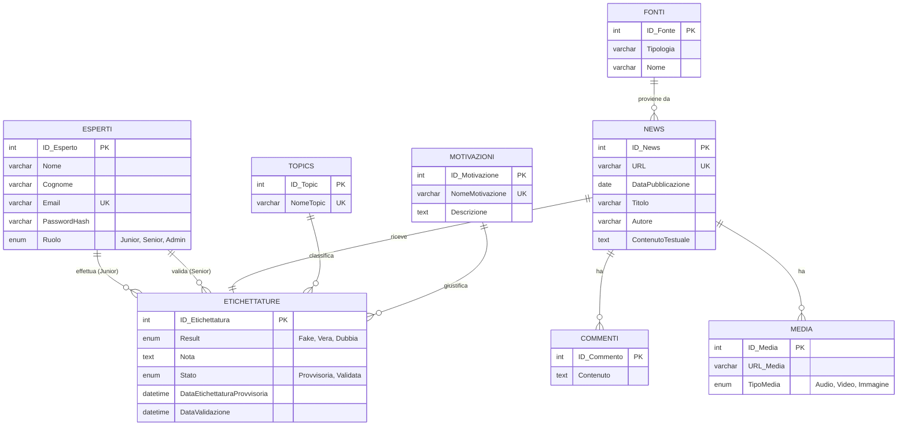

# Sessione ordinaria 2025 - seconda prova scritta - Indirizzo ITIA - INFORMATICA E TELECOMUNICAZIONI ARTICOLAZIONE "INFORMATICA" - Disciplina: INFORMATICA

- [Sessione ordinaria 2025 - seconda prova scritta - Indirizzo ITIA - INFORMATICA E TELECOMUNICAZIONI ARTICOLAZIONE "INFORMATICA" - Disciplina: INFORMATICA](#sessione-ordinaria-2025---seconda-prova-scritta---indirizzo-itia---informatica-e-telecomunicazioni-articolazione-informatica---disciplina-informatica)
  - [Traccia della prova](#traccia-della-prova)
  - [PRIMA PARTE](#prima-parte)
    - [1. Analisi della Realtà di Riferimento e Schema Concettuale](#1-analisi-della-realtà-di-riferimento-e-schema-concettuale)
      - [**Analisi dei Requisiti**](#analisi-dei-requisiti)
      - [**Attori e Casi d'Uso**](#attori-e-casi-duso)
      - [**Diagramma dei Casi d'Uso (UML)**](#diagramma-dei-casi-duso-uml)
      - [**Progettazione Concettuale: Schema E/R e Ipotesi Aggiuntive**](#progettazione-concettuale-schema-er-e-ipotesi-aggiuntive)
        - [**Ipotesi Aggiuntiva: Gestione delle Liste di Valori (ENUM vs Lookup Table)**](#ipotesi-aggiuntiva-gestione-delle-liste-di-valori-enum-vs-lookup-table)
        - [**Ipotesi Aggiuntiva: Gestione del Ruolo Amministratore**](#ipotesi-aggiuntiva-gestione-del-ruolo-amministratore)
        - [**Schema E/R (in versione Mermaid semplificata)**](#schema-er-in-versione-mermaid-semplificata)
        - [**Vincoli e Ipotesi Riepilogative**](#vincoli-e-ipotesi-riepilogative)
    - [2. Schema Logico Relazionale](#2-schema-logico-relazionale)
    - [3. Definizione del Database e Popolamento (SQL per MariaDB)](#3-definizione-del-database-e-popolamento-sql-per-mariadb)
    - [4. Interrogazioni in Linguaggio SQL](#4-interrogazioni-in-linguaggio-sql)
    - [5. Progetto di Massima dell'Applicazione Web](#5-progetto-di-massima-dellapplicazione-web)
      - [**Architettura Generale**](#architettura-generale)
      - [**Stack Tecnologico**](#stack-tecnologico)
      - [**Struttura del Progetto**](#struttura-del-progetto)
      - [**Progettazione delle API REST**](#progettazione-delle-api-rest)
      - [**Strategia di Deployment**](#strategia-di-deployment)
    - [6. Sviluppo di una Parte Significativa dell'Applicazione](#6-sviluppo-di-una-parte-significativa-dellapplicazione)
      - [Ipotetica struttura dei file principali dell'applicazione](#ipotetica-struttura-dei-file-principali-dellapplicazione)
      - [**Opzione (a): Modulo di Etichettatura Provvisoria**](#opzione-a-modulo-di-etichettatura-provvisoria)
      - [**Opzione (b): Visualizzazione Grafica Fake News per Argomento**](#opzione-b-visualizzazione-grafica-fake-news-per-argomento)
      - [**Opzione (c): Modulo di Analisi Fake News per Motivazione**](#opzione-c-modulo-di-analisi-fake-news-per-motivazione)
  - [SECONDA PARTE](#seconda-parte)
    - [I. Monitoraggio delle Performance di Etichettatura](#i-monitoraggio-delle-performance-di-etichettatura)
    - [II. Tracciamento delle Modifiche Effettuate dai Senior](#ii-tracciamento-delle-modifiche-effettuate-dai-senior)
    - [III. Autenticazione a Due Fattori (2FA)](#iii-autenticazione-a-due-fattori-2fa)
    - [IV. Gestione della Concorrenza e Integrità dei Dati](#iv-gestione-della-concorrenza-e-integrità-dei-dati)

## Traccia della prova

[La traccia della prova](https://www.istruzione.it/esame_di_stato/202425/Istituti%20tecnici/Ordinaria/A038_ORD25.pdf) è disponibile sul sito del Ministero dell'Istruzione e del Merito.

Per lo svolgimento della traccia si supporrà che si debba sviluppare il progetto *"VerifAI News"*, commissionato alla società informatica *VerifAI Labs*.

## PRIMA PARTE

### 1. Analisi della Realtà di Riferimento e Schema Concettuale

L'obiettivo di questa fase è comprendere a fondo il dominio del problema, identificare gli attori, i loro obiettivi e i dati da gestire, per poi tradurre questa comprensione in un modello concettuale.

#### **Analisi dei Requisiti**

La piattaforma *VerifAI News* deve soddisfare i seguenti requisiti:

- **RF1 - Gestione Dataset di News:** Il sistema deve archiviare e gestire un vasto insieme di notizie provenienti da diverse fonti.

- **RF2 - Dettaglio News:** Per ogni notizia, è necessario memorizzare: la fonte (con tipologia e nome), un URL univoco, data di pubblicazione, titolo, autore, contenuto testuale, e la possibilità di associare commenti e file multimediali (audio, video, immagini).

- **RF3 - Workflow di Etichettatura a Due Fasi:**

    - **Fase 1 (Etichettatura Provvisoria):** Gli "Esperti Junior" applicano una prima classificazione alle notizie non ancora elaborate.

    - **Fase 2 (Validazione):** Gli "Esperti Senior" revisionano le etichettature provvisorie, confermandole o modificandole per renderle definitive.

- **RF4 - Stati di Lavorazione:** Ogni notizia deve trovarsi in uno dei seguenti stati: `Non Etichettata`, `Etichettatura Provvisoria`, `Etichettatura Validata`.

- **RF5 - Struttura Etichetta:** L'etichettatura associa a ogni notizia due classificazioni:

    - **Topic:** L'argomento principale (es. Politica, Scienza e Tecnologia, etc.).

    - **Result:** La valutazione di veridicità (`Vera`, `Dubbia`, `Fake`).

- **RF6 - Dettaglio Fake News:** Per le notizie classificate come `Fake`, è obbligatorio specificare una `Motivazione` da un elenco predefinito e aggiungere una `Nota` esplicativa.

- **RF7 - Gestione Utenti:** Il sistema deve gestire gli account per gli Esperti Junior e Senior.

- **RF8 - Analisi e Reportistica:** La piattaforma deve fornire funzionalità per interrogare i dati e produrre analisi, come specificato nel punto 4 della traccia.

#### **Attori e Casi d'Uso**

**Gerarchia degli Attori:**

- **Esperto** (Attore base)
- **Esperto Junior** (eredita da Esperto)
- **Esperto Senior** (eredita da Esperto)
- **Amministratore** (eredita da Esperto)

**Casi d'Uso per Attore Base:**

- **Esperto:**
    - **UC1:** Esegue il login al sistema.
    - **UC2:** Esegue il logout dal sistema.

**Casi d'Uso Specifici per Ruolo:**

- **Esperto Junior:**

    - **UC3:** Visualizza una lista di notizie non ancora etichettate.
    - **UC4:** Seleziona una notizia e ne visualizza tutti i dettagli.
    - **UC5:** Compila e invia il form di etichettatura provvisoria.
- **Esperto Senior:**

    - **UC6:** Visualizza una lista di notizie con etichettatura provvisoria.
    - **UC7:** Seleziona una notizia e ne visualizza i dettagli, inclusa l'etichettatura del junior.
    - **UC8:** Conferma o modifica l'etichettatura, rendendola validata.
- **Amministratore:**

    - **UC9:** Gestisce l'anagrafica degli esperti (creazione, modifica ruolo).
    - **UC10:** Gestisce le liste di Topic e Motivazioni.
    - **UC11:** Accede alle dashboard di analisi e reportistica.


**Note sulla Gerarchia:**

- Tutti i ruoli (Esperto Junior, Esperto Senior, Amministratore) ereditano automaticamente i casi d'uso dell'attore base "Esperto"
- Ogni ruolo specializzato ha accesso alle funzionalità comuni (Login/Logout) più le proprie funzionalità specifiche

#### **Diagramma dei Casi d'Uso (UML)**


    Il diagramma dei casi d'uso è stato ottenuto con il codice per [PlantUML](https://www.plantuml.com/plantuml/uml) riportato di seguito:

```text
@startuml
!theme plain
skinparam actorStyle awesome
skinparam usecase {
    BackgroundColor lightblue
    BorderColor darkblue
    ArrowColor darkblue
}
skinparam direction top to bottom

title Diagramma dei Casi d'Uso - VerifAI News

' Attori posizionati a sinistra
left to right direction

' Gerarchia degli Attori
actor "Esperto" as Esperto
actor "Esperto Junior" as EJ
actor "Esperto Senior" as ES  
actor "Amministratore" as Admin

' Relazioni di ereditarietà
Esperto <|-- EJ
Esperto <|-- ES
Esperto <|-- Admin

' Sistema
rectangle "Sistema VerifAI News" {
    
    ' Casi d'uso dell'attore base
    usecase "UC1: Login al Sistema" as UC1
    usecase "UC2: Logout dal Sistema" as UC2
    
    ' Casi d'uso per Esperto Junior
    usecase "UC3: Visualizza Lista\nNotizie Non Etichettate" as UC3
    usecase "UC4: Visualizza Dettagli\nNotizia" as UC4
    usecase "UC5: Compila Form\nEtichettatura Provvisoria" as UC5
    
    ' Casi d'uso per Esperto Senior  
    usecase "UC6: Visualizza Lista\nNotizie con Etichettatura\nProvvisoria" as UC6
    usecase "UC7: Visualizza Dettagli\nNotizia e Etichettatura\nJunior" as UC7
    usecase "UC8: Conferma/Modifica\nEtichettatura\n(Validazione)" as UC8
    
    ' Casi d'uso per Amministratore
    usecase "UC9: Gestione Anagrafica\nEsperti" as UC9
    usecase "UC10: Gestione Liste\nTopic e Motivazioni" as UC10
    usecase "UC11: Accesso Dashboard\nAnalisi e Reportistica" as UC11
}

' Relazioni dell'attore base (tutti gli esperti ereditano login/logout)
Esperto --> UC1
Esperto --> UC2

' Relazioni Esperto Junior (casi d'uso specifici)
EJ --> UC3
EJ --> UC4
EJ --> UC5

' Relazioni Esperto Senior (casi d'uso specifici)
ES --> UC6
ES --> UC7
ES --> UC8

' Relazioni Amministratore (casi d'uso specifici)
Admin --> UC9
Admin --> UC10
Admin --> UC11

' Relazioni di inclusione/estensione
UC3 ..> UC4 : <<include>>
UC5 ..> UC4 : <<extend>>
UC6 ..> UC7 : <<include>>
UC8 ..> UC7 : <<extend>>

' Note per chiarimenti
note right of UC5
  Cambia stato notizia da
  "Non Etichettata" a
  "Etichettatura Provvisoria"
end note

note right of UC8
  Cambia stato notizia da
  "Etichettatura Provvisoria" a
  "Etichettatura Validata"
end note

note bottom of UC10
  Gestione delle tabelle di lookup
  per Topic e Motivazioni
end note

@enduml
```

#### **Progettazione Concettuale: Schema E/R e Ipotesi Aggiuntive**

Lo schema Entità-Relazione (E/R) modella le entità, gli attributi e le relazioni del dominio.

##### **Ipotesi Aggiuntiva: Gestione delle Liste di Valori (ENUM vs Lookup Table)**

Una decisione chiave nella progettazione riguarda come gestire le liste di valori predefiniti per `Topic`, `Result`, `Stato` e `Motivazione`. Esistono due approcci principali:

1. **Tipo `ENUM` nel Database:** Definisce una lista fissa di valori testuali direttamente nella struttura della tabella.

    - **Vantaggi:** Semplice, performante (non richiede `JOIN`), garantisce l'integrità del dato.

    - **Svantaggi:** Rigido. Aggiungere un nuovo valore richiede una modifica alla struttura del database (`ALTER TABLE`), un'operazione complessa e potenzialmente rischiosa.

2. **Tabelle Separate (Lookup Tables):** Crea tabelle dedicate (es. `TOPICS`, `MOTIVAZIONI`) contenenti i valori possibili. La tabella principale (`ETICHETTATURE`) conterrà una chiave esterna che fa riferimento all'ID del valore nella tabella di lookup.

    - **Vantaggi:** Flessibile e manutenibile. Nuovi valori possono essere aggiunti con un semplice `INSERT`, gestibile anche da un pannello di amministrazione dell'applicazione. Permette di aggiungere attributi descrittivi ai valori (es. una descrizione per ogni Topic).

    - **Svantaggi:** Richiede `JOIN` nelle query per recuperare il valore testuale, aumentando leggermente la complessità.

**Scelta Progettuale Adottata (Modello Ibrido):**

- Per `Result` e `Stato`, i cui valori (`Vera`/`Fake`/`Dubbia` e `Provvisoria`/`Validata`) sono fondamentali per la logica dell'applicazione e si possono considerare stabili, si adotta l'approccio con **`ENUM`** per la sua semplicità e performance.

- Per `Topic` e `Motivazione`, che sono soggetti a evoluzione nel tempo (si potrebbero voler aggiungere nuovi argomenti o tipi di disinformazione), si adotta l'approccio più flessibile con **tabelle di lookup separate** (`TOPICS` e `MOTIVAZIONI`).

##### **Ipotesi Aggiuntiva: Gestione del Ruolo Amministratore**

Sebbene l'Amministratore sia un attore con funzionalità dedicate, non è necessario modellarlo come un'entità separata. Si può considerare come un utente con un livello di privilegi superiore. Esistono due modi per implementarlo:

1. **Estensione del Ruolo Esistente:** Si amplia l'attributo `Ruolo` nell'entità `ESPERTI` per includere il valore `'Admin'`. È una soluzione semplice, diretta ed efficiente.

2. **Modello RBAC (Role-Based Access Control):** Si creano tabelle separate per `RUOLI` e per la loro associazione agli utenti (`UTENTE_RUOLI`). È un approccio molto più flessibile e granulare, tipico di applicazioni complesse, ma non strettamente necessario per la traccia in esame.

**Scelta Progettuale Adottata:** Si opta per la **prima soluzione**, più pragmatica e adatta al contesto. L'amministratore sarà un utente nella tabella `ESPERTI` con il campo `Ruolo` impostato su `'Admin'`.

##### **Schema E/R (in versione Mermaid semplificata)**



##### **Vincoli e Ipotesi Riepilogative**

1. **Univocità:** `ESPERTI.Email`, `NEWS.URL`, `TOPICS.NomeTopic` e `MOTIVAZIONI.NomeMotivazione` sono univoci.

2. **Relazione 1-a-1:** Tra `NEWS` ed `ETICHETTATURE` (garantita da `UNIQUE` su `ETICHETTATURE.ID_News`).

3. **Obbligatorietà Condizionale:** `ID_Motivazione` e `Nota` in `ETICHETTATURE` sono obbligatori se e solo se `Result` è 'Fake'.

4. **Integrità Referenziale:** Tutte le chiavi esterne garantiscono la coerenza dei dati.

5. **Stato e Attori:** `ID_EspertoSenior` e `DataValidazione` possono essere valorizzati solo quando `Stato` diventa `Validata`.

### 2. Schema Logico Relazionale

- **TOPICS** (**ID_Topic**, NomeTopic)

- **MOTIVAZIONI** (**ID_Motivazione**, NomeMotivazione, Descrizione)

- **FONTI** (**ID_Fonte**, Tipologia, Nome)

- **ESPERTI** (**ID_Esperto**, Nome, Cognome, Email, PasswordHash, Ruolo)

- **NEWS** (**ID_News**, URL, DataPubblicazione, Titolo, Autore, ContenutoTestuale, *ID_Fonte*)

- **ETICHETTATURE** (**ID_Etichettatura**, *ID_News* (UNIQUE), Result, Nota, Stato, DataEtichettaturaProvvisoria, DataValidazione, *ID_Topic*, *ID_Motivazione*, *ID_EspertoJunior*, *ID_EspertoSenior*)

- **COMMENTI** (**ID_Commento**, Contenuto, *ID_News*)

- **MEDIA** (**ID_Media**, URL_Media, TipoMedia, *ID_News*)

### 3. Definizione del Database e Popolamento (SQL per MariaDB)

```sql
-- SCRIPT COMPLETO DI CREAZIONE E POPOLAMENTO DEL DATABASE
-- -----------------------------------------------------
CREATE DATABASE IF NOT EXISTS verifai_db CHARACTER SET utf8mb4 COLLATE utf8mb4_unicode_ci;
USE verifai_db;

-- -----------------------------------------------------
-- Tabelle di Lookup
-- -----------------------------------------------------
CREATE TABLE IF NOT EXISTS TOPICS (
  ID_Topic INT AUTO_INCREMENT PRIMARY KEY,
  NomeTopic VARCHAR(100) NOT NULL UNIQUE
) ENGINE=InnoDB;

CREATE TABLE IF NOT EXISTS MOTIVAZIONI (
  ID_Motivazione INT AUTO_INCREMENT PRIMARY KEY,
  NomeMotivazione VARCHAR(100) NOT NULL UNIQUE,
  Descrizione TEXT
) ENGINE=InnoDB;

-- -----------------------------------------------------
-- Tabelle Principali
-- -----------------------------------------------------
CREATE TABLE IF NOT EXISTS FONTI (
  ID_Fonte INT AUTO_INCREMENT PRIMARY KEY,
  Tipologia VARCHAR(100) NOT NULL,
  Nome VARCHAR(255) NOT NULL UNIQUE
) ENGINE=InnoDB;

CREATE TABLE IF NOT EXISTS ESPERTI (
  ID_Esperto INT AUTO_INCREMENT PRIMARY KEY,
  Nome VARCHAR(100) NOT NULL,
  Cognome VARCHAR(100) NOT NULL,
  Email VARCHAR(255) NOT NULL UNIQUE,
  PasswordHash VARCHAR(255) NOT NULL,
  Ruolo ENUM('Junior', 'Senior', 'Admin') NOT NULL
) ENGINE=InnoDB;

CREATE TABLE IF NOT EXISTS NEWS (
  ID_News INT AUTO_INCREMENT PRIMARY KEY,
  URL VARCHAR(2048) NOT NULL UNIQUE,
  DataPubblicazione DATE NOT NULL,
  Titolo VARCHAR(512),
  Autore VARCHAR(255),
  ContenutoTestuale TEXT,
  ID_Fonte INT NOT NULL,
  FOREIGN KEY (ID_Fonte) REFERENCES FONTI(ID_Fonte) ON DELETE RESTRICT
) ENGINE=InnoDB;

CREATE TABLE IF NOT EXISTS ETICHETTATURE (
  ID_Etichettatura INT AUTO_INCREMENT PRIMARY KEY,
  ID_News INT NOT NULL UNIQUE,
  Result ENUM('Fake', 'Vera', 'Dubbia') NOT NULL,
  Nota TEXT,
  Stato ENUM('Provvisoria', 'Validata') NOT NULL,
  DataEtichettaturaProvvisoria DATETIME NOT NULL,
  DataValidazione DATETIME,
  ID_Topic INT NOT NULL,
  ID_Motivazione INT,
  ID_EspertoJunior INT NOT NULL,
  ID_EspertoSenior INT,
  FOREIGN KEY (ID_News) REFERENCES NEWS(ID_News) ON DELETE CASCADE,
  FOREIGN KEY (ID_Topic) REFERENCES TOPICS(ID_Topic) ON DELETE RESTRICT,
  FOREIGN KEY (ID_Motivazione) REFERENCES MOTIVAZIONI(ID_Motivazione) ON DELETE RESTRICT,
  FOREIGN KEY (ID_EspertoJunior) REFERENCES ESPERTI(ID_Esperto) ON DELETE RESTRICT,
  FOREIGN KEY (ID_EspertoSenior) REFERENCES ESPERTI(ID_Esperto) ON DELETE RESTRICT,
  CONSTRAINT chk_motivazione_fk CHECK ( (Result != 'Fake') OR (Result = 'Fake' AND ID_Motivazione IS NOT NULL AND Nota IS NOT NULL) )
) ENGINE=InnoDB;

CREATE TABLE IF NOT EXISTS COMMENTI (
  ID_Commento INT AUTO_INCREMENT PRIMARY KEY,
  Contenuto TEXT NOT NULL,
  ID_News INT NOT NULL,
  FOREIGN KEY (ID_News) REFERENCES NEWS(ID_News) ON DELETE CASCADE
) ENGINE=InnoDB;

CREATE TABLE IF NOT EXISTS MEDIA (
  ID_Media INT AUTO_INCREMENT PRIMARY KEY,
  URL_Media VARCHAR(2048) NOT NULL,
  TipoMedia ENUM('Audio', 'Video', 'Immagine') NOT NULL,
  ID_News INT NOT NULL,
  FOREIGN KEY (ID_News) REFERENCES NEWS(ID_News) ON DELETE CASCADE
) ENGINE=InnoDB;

-- -----------------------------------------------------
-- POPOLAMENTO DATI DI PROVA
-- -----------------------------------------------------
INSERT INTO TOPICS (NomeTopic) VALUES ('Economia'), ('Politica'), ('Medicina e Salute'), ('Cultura'), ('Cronaca'), ('Scienza e Tecnologia'), ('Sport');
INSERT INTO MOTIVAZIONI (NomeMotivazione, Descrizione) VALUES 
('contenuto fabbricato', 'Contenuto completamente falso, creato per ingannare.'),
('contenuto manipolato', 'Informazioni reali manipolate per trarre in inganno.'),
('contenuto diffuso da impostori', 'Fonti genuine impersonate da altri.'),
('falso contesto', 'Contenuto reale condiviso con informazioni contestuali false.'),
('contenuto ingannevole', 'Uso ingannevole di informazioni per incastrare un problema o un individuo.'),
('falsa connessione', 'Quando titoli, immagini o didascalie non supportano il contenuto.'),
('satira o parodia', 'Nessuna intenzione di causare danni, ma potenziale di ingannare.');

INSERT INTO FONTI (Tipologia, Nome) VALUES 
('Giornale Online', 'Corriere della Sera'), 
('Social Media', 'Facebook'), 
('Piattaforma di Streaming', 'YouTube'), 
('Blog', 'Blog di Beppe Grillo'), 
('Giornale Online', 'Il Fatto Quotidiano');

INSERT INTO ESPERTI (Nome, Cognome, Email, PasswordHash, Ruolo) VALUES 
('Luca', 'Verdi', 'luca.verdi@verifai.it', 'hash_pw_1', 'Junior'), 
('Giulia', 'Bianchi', 'giulia.bianchi@verifai.it', 'hash_pw_2', 'Junior'), 
('Mario', 'Rossi', 'mario.rossi@verifai.it', 'hash_pw_3', 'Senior'), 
('Anna', 'Neri', 'anna.neri@verifai.it', 'hash_pw_4', 'Senior'),
('Admin', 'User', 'admin@verifai.it', 'hash_pw_admin', 'Admin');

INSERT INTO NEWS (URL, DataPubblicazione, Titolo, Autore, ContenutoTestuale, ID_Fonte) VALUES 
('https://corriere.it/economia/news1', '2025-05-10', 'La BCE alza i tassi di interesse', 'Redazione Economia', 'La Banca Centrale Europea ha annunciato un nuovo rialzo...', 1), 
('https://youtube.com/watch?v=video1', '2025-04-22', 'La terra è piatta: le prove definitive', 'Terrapiattista Convinto', 'In questo video vi mostriamo perché la scienza ufficiale mente...', 3), 
('https://facebook.com/post/social1', '2025-03-15', 'Nuovo farmaco miracoloso contro il cancro', 'Pagina Notizie Salute', 'Una scoperta rivoluzionaria promette di curare tutti i tumori...', 2), 
('https://corriere.it/politica/news2', '2024-08-01', 'Riforma della giustizia approvata', 'Marco Bianchi', 'Il parlamento ha dato il via libera definitivo alla riforma...', 1), 
('https://ilfatto.it/cronaca/news3', '2025-05-20', 'Scandalo corruzione al ministero', 'Gianni Lannes', 'Un nuovo scandalo travolge il ministero dei trasporti...', 5), 
('https://beppegrillo.it/post/blog1', '2025-02-11', 'Le scie chimiche sono reali', 'Beppe Grillo', 'Il governo ci avvelena con le scie chimiche, ecco le prove...', 4), 
('https://corriere.it/sport/news4', '2025-05-01', 'La squadra X vince il campionato', 'Redazione Sport', 'Una vittoria storica per la squadra X...', 1),
('https://youtube.com/watch?v=video2', '2025-04-30', 'Documentario sulla vita delle api', 'Natural Geographic', 'Esploriamo il meraviglioso mondo delle api...', 3),
('https://facebook.com/post/social2', '2025-05-18', 'Gattini che suonano il pianoforte', 'Cute Animals', 'Un video virale che sta facendo il giro del web...', 2),
('https://ilfatto.it/scienza/news5', '2023-11-10', 'Scoperto nuovo esopianeta abitabile', 'Redazione Scienza', 'Il telescopio Webb individua un pianeta simile alla Terra...', 5);

INSERT INTO ETICHETTATURE (ID_News, ID_Topic, Result, Stato, DataEtichettaturaProvvisoria, DataValidazione, ID_EspertoJunior, ID_EspertoSenior) VALUES
(1, 1, 'Vera', 'Validata', '2025-05-11 10:00:00', '2025-05-12 09:30:00', 1, 3);
INSERT INTO ETICHETTATURE (ID_News, ID_Topic, Result, ID_Motivazione, Nota, Stato, DataEtichettaturaProvvisoria, DataValidazione, ID_EspertoJunior, ID_EspertoSenior) VALUES
(2, 6, 'Fake', 1, 'La teoria della Terra piatta è stata scientificamente smentita da secoli.', 'Validata', '2025-04-23 11:00:00', '2025-04-24 15:00:00', 1, 4);
INSERT INTO ETICHETTATURE (ID_News, ID_Topic, Result, ID_Motivazione, Nota, Stato, DataEtichettaturaProvvisoria, ID_EspertoJunior) VALUES
(3, 3, 'Fake', 5, 'Non esistono farmaci miracolosi, la fonte non è attendibile.', 'Provvisoria', '2025-03-16 14:00:00', 2);
INSERT INTO ETICHETTATURE (ID_News, ID_Topic, Result, Stato, DataEtichettaturaProvvisoria, DataValidazione, ID_EspertoJunior, ID_EspertoSenior) VALUES
(4, 2, 'Vera', 'Validata', '2024-08-02 10:00:00', '2024-08-03 11:00:00', 1, 3);
INSERT INTO ETICHETTATURE (ID_News, ID_Topic, Result, Stato, DataEtichettaturaProvvisoria, DataValidazione, ID_EspertoJunior, ID_EspertoSenior) VALUES
(5, 5, 'Dubbia', 'Validata', '2025-05-21 09:00:00', '2025-05-22 10:00:00', 2, 4);
INSERT INTO ETICHETTATURE (ID_News, ID_Topic, Result, ID_Motivazione, Nota, Stato, DataEtichettaturaProvvisoria, DataValidazione, ID_EspertoJunior, ID_EspertoSenior) VALUES
(6, 6, 'Fake', 6, 'Le scie di condensazione degli aerei non sono un programma di avvelenamento.', 'Validata', '2025-05-15 12:00:00', DATE_SUB(NOW(), INTERVAL 5 DAY), 1, 3);
INSERT INTO ETICHETTATURE (ID_News, ID_Topic, Result, Stato, DataEtichettaturaProvvisoria, ID_EspertoJunior) VALUES
(7, 7, 'Vera', 'Provvisoria', '2025-05-02 18:00:00', 2);

INSERT INTO MEDIA (URL_Media, TipoMedia, ID_News) VALUES ('https://youtube.com/watch?v=video1', 'Video', 2);
INSERT INTO COMMENTI (Contenuto, ID_News) VALUES ('Finalmente la verità!', 2), ('Ma non è possibile, siete dei pazzi.', 2);


```

### 4. Interrogazioni in Linguaggio SQL

**a. Il numero di news classificate come false (fake) per ciascun valore dell'etichetta Topic pubblicate nell'ultimo anno.**

```sql
SELECT
    T.NomeTopic,
    COUNT(E.ID_Etichettatura) AS NumeroNewsFake
FROM
    ETICHETTATURE E
JOIN
    NEWS N ON E.ID_News = N.ID_News
JOIN
    TOPICS T ON E.ID_Topic = T.ID_Topic
WHERE
    E.Result = 'Fake'
    AND E.Stato = 'Validata'
    AND N.DataPubblicazione >= DATE_SUB(CURDATE(), INTERVAL 1 YEAR)
GROUP BY
    T.ID_Topic, T.NomeTopic
ORDER BY
    NumeroNewsFake DESC;

```

**b. Il numero di news analizzate da un certo esperto senior di cui siano stati forniti il nome ed il cognome.**

```sql
SELECT
    COUNT(E.ID_Etichettatura) AS NumeroNewsValidate
FROM
    ETICHETTATURE E
JOIN
    ESPERTI S ON E.ID_EspertoSenior = S.ID_Esperto
WHERE
    S.Nome = 'Mario'
    AND S.Cognome = 'Rossi'
    AND E.Stato = 'Validata';

```

**c. Dato un argomento (Topic) e un periodo di pubblicazione, il numero delle news classificate come fake per ogni singola motivazione.**

```sql
-- Assumiamo ID_Topic = 6 ('Scienza e Tecnologia') e periodo '2025-01-01' - '2025-12-31'
SELECT
    M.NomeMotivazione,
    COUNT(E.ID_Etichettatura) AS NumeroNewsFake
FROM
    ETICHETTATURE E
JOIN
    NEWS N ON E.ID_News = N.ID_News
JOIN
    MOTIVAZIONI M ON E.ID_Motivazione = M.ID_Motivazione
WHERE
    E.ID_Topic = 6
    AND E.Result = 'Fake'
    AND E.Stato = 'Validata'
    AND N.DataPubblicazione BETWEEN '2025-01-01' AND '2025-12-31'
GROUP BY
    M.ID_Motivazione, M.NomeMotivazione
ORDER BY
    NumeroNewsFake DESC;

```

**d. Il nominativo dell'operatore senior che ha effettuato il maggior numero di validazioni nell'ultimo mese delle news di tipo "fake".**

```sql
SELECT
    S.Nome,
    S.Cognome,
    COUNT(E.ID_Etichettatura) AS NumeroValidazioniFake
FROM
    ETICHETTATURE E
JOIN
    ESPERTI S ON E.ID_EspertoSenior = S.ID_Esperto
WHERE
    E.Stato = 'Validata'
    AND E.Result = 'Fake'
    AND E.DataValidazione >= DATE_SUB(CURDATE(), INTERVAL 1 MONTH)
GROUP BY
    S.ID_Esperto, S.Nome, S.Cognome
ORDER BY
    NumeroValidazioniFake DESC
LIMIT 1;

```

### 5. Progetto di Massima dell'Applicazione Web

Si progetta un'applicazione web con un'architettura moderna, robusta e manutenibile, composta da un frontend statico multi-pagina e un backend basato su API.

#### **Architettura Generale**

Si adotta un'architettura a **servizi disaccoppiati**:

1. **Frontend (Client-Side):** Un'applicazione multi-pagina (MPA) costruita con file statici (HTML, CSS, JavaScript). Ogni "pagina" o funzionalità principale (es. login, dashboard junior, pagina di etichettatura) corrisponde a un file HTML distinto. La comunicazione con il backend avviene tramite chiamate asincrone con le **Fetch API** di JavaScript. Questo modello è semplice da sviluppare e da configurare (deployment).

2. **Backend (Server-Side):** Una **ASP.NET Core Minimal API** che espone endpoint RESTful. Gestisce tutta la logica di business, l'accesso ai dati e l'autenticazione. La scelta di Minimal API garantisce alte prestazioni e un codice snello. L'applicazione backend servirà anche i file statici del frontend dalla sua cartella `wwwroot`.

#### **Stack Tecnologico**

- **Linguaggio Backend:** C# 12

- **Framework Backend:** ASP.NET Core 8.0+ (Minimal API)

- **ORM (Object-Relational Mapper):** Entity Framework Core 8.0 per l'interazione con il database.

- **Database:** MariaDB 10.x

- **Linguaggi Frontend:** HTML5, CSS3, JavaScript (ES6+)

- **Framework CSS (Opzionale):** Bootstrap 5 per accelerare lo sviluppo di un'interfaccia responsive e gradevole.

#### **Struttura del Progetto**

```textarea
/VerifAI.sln
└── /VerifAI.App/
    ├── /wwwroot/                  <-- Contiene i file statici del frontend
    │   ├── /css/
    │   │   └── style.css
    │   ├── /js/
    │   │   ├── auth.js
    │   │   └── labeling.js
    │   ├── login.html
    │   ├── junior-dashboard.html
    │   ├── label-news.html
    │   └── senior-dashboard.html
    ├── /Data/                     <-- Contiene il DbContext e le entità EF Core
    │   ├── VerifaiDbContext.cs
    │   └── Entities.cs
    ├── /Models/                   <-- Contiene i DTOs (Data Transfer Objects)
    │   └── LabelingDtos.cs
    ├── /Services/                 <-- Contiene la logica di business (opzionale)
    │   └── AuthService.cs
    ├── appsettings.json
    ├── Program.cs                 <-- Entry point, configurazione e definizione API
    └── VerifAI.App.csproj

```

#### **Progettazione delle API REST**

| **Metodo** | **URL** | **Descrizione** |
| --- |  --- |  --- |
| `POST` | `/api/auth/login` | Autentica un esperto e restituisce un token. |
| `GET` | `/api/topics` | Restituisce l'elenco di tutti i Topic. |
| `GET` | `/api/motivations` | Restituisce l'elenco di tutte le Motivazioni. |
| `GET` | `/api/news/unlabeled` | Restituisce un elenco di news non ancora etichettate. |
| `GET` | `/api/news/{id}` | Restituisce i dettagli completi di una singola news. |
| `POST` | `/api/news/{id}/label` | Permette a un Junior di inviare un'etichettatura provvisoria. |
| `GET` | `/api/stats/fake-by-topic` | Restituisce i dati per la visualizzazione grafica (opzione b). |
| `GET` | `/api/stats/fake-by-motivation` | Restituisce i dati per il modulo con filtri (opzione c). |

#### **Strategia di Deployment**

Si ipotizza un deployment su cloud **Microsoft Azure** per la sua ottima integrazione con lo stack .NET.

1. **Containerizzazione:** L'applicazione ASP.NET Core (backend + frontend) viene inserita in un **container Docker**. Questo garantisce che l'ambiente di esecuzione sia identico a quello di sviluppo e semplifica il deployment.

2. **Hosting Applicazione:** Il container viene deployato su **Azure App Service for Containers**. Questo servizio PaaS (Platform as a Service) gestisce automaticamente la scalabilità, il bilanciamento del carico e l'applicazione di patch al sistema operativo sottostante.

3. **Hosting Database:** Il database MariaDB viene ospitato su **Azure Database for MariaDB**, un servizio DBaaS (Database as a Service). Questo delega ad Azure la gestione dell'infrastruttura del database (backup, alta disponibilità, sicurezza).

4. **CI/CD (Continuous Integration/Continuous Deployment):** Si configura una pipeline con **GitHub Actions**. Ad ogni `push` sul branch `main` del repository Git, la pipeline esegue in automatico:

    - **Build:** Compila il codice C# e crea l'immagine Docker.

    - **Test:** Esegue eventuali test automatici.

    - **Deploy:** Pubblica la nuova immagine Docker su Azure App Service.

Questo approccio automatizzato riduce gli errori manuali e accelera i tempi di rilascio

### 6. Sviluppo di una Parte Significativa dell'Applicazione

#### Ipotetica struttura dei file principali dell'applicazione

```cs
/*
================================================================================
 Progetto VerifAI News - Struttura Backend C# (ASP.NET Core 8)
================================================================================
Questo file illustra l'organizzazione del codice C# per il backend del progetto.
È suddiviso in tre sezioni principali:
1. Modelli/Entità (Data/Entities.cs): Le classi che mappano le tabelle del database.
2. DbContext (Data/VerifaiDbContext.cs): La classe che gestisce la sessione con 
    il database tramite Entity Framework Core.
3. Programma Principale (Program.cs): Il punto di ingresso dell'applicazione
    che configura i servizi, il middleware e gli endpoint della Minimal API.
================================================================================
*/

// =============================================================================
// 1. MODELLI / ENTITÀ (Tipicamente in /Data/Entities.cs o file separati)
// =============================================================================

using System.ComponentModel.DataAnnotations;
using System.ComponentModel.DataAnnotations.Schema;

namespace VerifAI.App.Data.Entities
{
    // --- Tabelle di Lookup ---

    [Table("TOPICS")]
    public class Topic
    {
        [Key]
        [Column("ID_Topic")]
        public int IdTopic { get; set; }

        [Required]
        [MaxLength(100)]
        public string NomeTopic { get; set; }
    }

    [Table("MOTIVAZIONI")]
    public class Motivazione
    {
        [Key]
        [Column("ID_Motivazione")]
        public int IdMotivazione { get; set; }

        [Required]
        [MaxLength(100)]
        public string NomeMotivazione { get; set; }

        public string? Descrizione { get; set; }
    }

    // --- Tabelle Principali ---

    [Table("ESPERTI")]
    public class Esperto
    {
        [Key]
        [Column("ID_Esperto")]
        public int IdEsperto { get; set; }

        [Required]
        [MaxLength(100)]
        public string Nome { get; set; }

        [Required]
        [MaxLength(100)]
        public string Cognome { get; set; }

        [Required]
        [MaxLength(255)]
        public string Email { get; set; }

        [Required]
        public string PasswordHash { get; set; }

        [Required]
        public string Ruolo { get; set; } // Junior, Senior, Admin
    }

    [Table("NEWS")]
    public class News
    {
        [Key]
        [Column("ID_News")]
        public int IdNews { get; set; }

        [Required]
        [MaxLength(2048)]
        public string URL { get; set; }

        public DateTime DataPubblicazione { get; set; }
        
        [MaxLength(512)]
        public string? Titolo { get; set; }

        // Relazione con Fonte (non mostrata per brevità)
        public int ID_Fonte { get; set; }

        // Proprietà di navigazione per l'etichettatura associata
        public virtual Etichettatura? Etichettatura { get; set; }
    }

    [Table("ETICHETTATURE")]
    public class Etichettatura
    {
        [Key]
        [Column("ID_Etichettatura")]
        public int IdEtichettatura { get; set; }

        [Required]
        public string Result { get; set; } // Fake, Vera, Dubbia

        public string? Nota { get; set; }

        [Required]
        public string Stato { get; set; } // Provvisoria, Validata

        public DateTime DataEtichettaturaProvvisoria { get; set; }
        public DateTime? DataValidazione { get; set; }

        // --- Chiavi Esterne ---

        [ForeignKey("News")]
        [Column("ID_News")]
        public int IdNews { get; set; }

        [ForeignKey("Topic")]
        [Column("ID_Topic")]
        public int IdTopic { get; set; }

        [ForeignKey("Motivazione")]
        [Column("ID_Motivazione")]
        public int? IdMotivazione { get; set; }

        [ForeignKey("EspertoJunior")]
        [Column("ID_EspertoJunior")]
        public int IdEspertoJunior { get; set; }

        [ForeignKey("EspertoSenior")]
        [Column("ID_EspertoSenior")]
        public int? IdEspertoSenior { get; set; }

        // --- Proprietà di Navigazione ---
        // Permettono a EF Core di gestire le relazioni
        
        public virtual News News { get; set; }
        public virtual Topic Topic { get; set; }
        public virtual Motivazione? Motivazione { get; set; }

        [InverseProperty("EtichettatureJunior")]
        public virtual Esperto EspertoJunior { get; set; }
        
        [InverseProperty("EtichettatureSenior")]
        public virtual Esperto? EspertoSenior { get; set; }
    }
}


// =============================================================================
// 2. DB CONTEXT (Tipicamente in /Data/VerifaiDbContext.cs)
// =============================================================================

using Microsoft.EntityFrameworkCore;
using VerifAI.App.Data.Entities;

namespace VerifAI.App.Data
{
    public class VerifaiDbContext : DbContext
    {
        // Costruttore che riceve le opzioni di configurazione (es. connection string)
        public VerifaiDbContext(DbContextOptions<VerifaiDbContext> options) : base(options)
        {
        }

        // DbSet per ogni entità/tabella che vogliamo interrogare
        public DbSet<Esperto> Esperti { get; set; }
        public DbSet<News> News { get; set; }
        public DbSet<Etichettatura> Etichettature { get; set; }
        public DbSet<Topic> Topics { get; set; }
        public DbSet<Motivazione> Motivazioni { get; set; }
        // ... DbSet per Fonti, Commenti, Media ...

        // Metodo per configurare il modello dati con la Fluent API
        protected override void OnModelCreating(ModelBuilder modelBuilder)
        {
            base.OnModelCreating(modelBuilder);

            // Configurazione della relazione uno-a-uno tra News e Etichettatura
            modelBuilder.Entity<News>()
                .HasOne(n => n.Etichettatura) // Una News ha una Etichettatura
                .WithOne(e => e.News)      // Una Etichettatura ha una News
                .HasForeignKey<Etichettatura>(e => e.IdNews); // La chiave esterna è in Etichettatura

            // Configurazione indici univoci per garantire l'integrità
            modelBuilder.Entity<Esperto>()
                .HasIndex(e => e.Email)
                .IsUnique();
            
            modelBuilder.Entity<News>()
                .HasIndex(n => n.URL)
                .IsUnique();

            modelBuilder.Entity<Topic>()
                .HasIndex(t => t.NomeTopic)
                .IsUnique();
        }
    }
}


// =============================================================================
// 3. PROGRAMMA PRINCIPALE (Program.cs)
// =============================================================================

using Microsoft.EntityFrameworkCore;
using VerifAI.App.Data;
using VerifAI.App.Models; // Namespace per i DTOs
using VerifAI.App.Data.Entities; // Namespace per le Entità

var builder = WebApplication.CreateBuilder(args);

// --- 1. REGISTRAZIONE DEI SERVIZI ---

// Recupera la stringa di connessione dal file appsettings.json
var connectionString = builder.Configuration.GetConnectionString("DefaultConnection");

// Aggiunge il DbContext ai servizi, specificando il provider MariaDB/MySQL
builder.Services.AddDbContext<VerifaiDbContext>(options =>
    options.UseMySql(connectionString, ServerVersion.AutoDetect(connectionString))
);

// (Opzionale) Aggiunge il supporto per la documentazione API con Swagger/OpenAPI
builder.Services.AddEndpointsApiExplorer();
builder.Services.AddSwaggerGen();


var app = builder.Build();

// --- 2. CONFIGURAZIONE DEL MIDDLEWARE (HTTP Request Pipeline) ---

// In ambiente di sviluppo, abilita Swagger per testare le API
if (app.Environment.IsDevelopment())
{
    app.UseSwagger();
    app.UseSwaggerUI();
}

// Abilita il serving dei file statici dalla cartella wwwroot (per il frontend)
app.UseDefaultFiles(); // Permette di servire index.html o default.html
app.UseStaticFiles();

// --- 3. DEFINIZIONE DEGLI ENDPOINT DELLA MINIMAL API ---

// Gruppo di API per le statistiche
var statsApi = app.MapGroup("/api/stats");

// Gruppo di API per le risorse principali
var api = app.MapGroup("/api");

// Endpoint per recuperare tutti i topics disponibili
api.MapGet("/topics", async (VerifaiDbContext db) => 
    await db.Topics.Select(t => new { t.IdTopic, t.NomeTopic }).ToListAsync());

// gli altri endpoint specifici sono mostrati nelle opzioni specifiche a) b) c)


// Avvio dell'applicazione
app.Run();

```

#### **Opzione (a): Modulo di Etichettatura Provvisoria**

- **Backend: Endpoint per Etichettatura**

    ```cs
    // File: Models/LabelingDtos.cs
    namespace VerifAI.App.Models;
    public record LabelingRequestDto(int IdTopic, string Result, int? IdMotivazione, string? Nota);

    // File: Program.cs (estratto)
    app.MapPost("/api/news/{idNews:int}/label",
        async (int idNews, LabelingRequestDto labelDto, VerifaiDbContext db) => {
        var idEspertoJunior = 1; // Esempio
        var news = await db.News.FindAsync(idNews);
        if (news == null) return Results.NotFound(new { message = "News non trovata." });
        var isAlreadyLabeled = await db.Etichettature.AnyAsync(e => e.ID_News == idNews);
        if (isAlreadyLabeled) return Results.Conflict(new { message = "Questa news è già stata etichettata." });

        var etichettatura = new Etichettatura {
            ID_News = idNews,
            ID_Topic = labelDto.IdTopic,
            Result = labelDto.Result,
            ID_Motivazione = labelDto.Result == "Fake" ? labelDto.IdMotivazione : null,
            Nota = labelDto.Result == "Fake" ? labelDto.Nota : null,
            Stato = "Provvisoria",
            DataEtichettaturaProvvisoria = DateTime.UtcNow,
            ID_EspertoJunior = idEspertoJunior
        };
        db.Etichettature.Add(etichettatura);
        await db.SaveChangesAsync();
        return Results.Created($"/api/labels/{etichettatura.ID_Etichettatura}", etichettatura);
    });

    ```

- **Frontend: `label-news.html` e `labeling.js`**

    ```html

    <!DOCTYPE html>
    <html lang="it">
    <head>
        <meta charset="UTF-8">
        <title>Etichetta News - VerifAI</title>
        <link rel="stylesheet" href="/css/style.css">
    </head>
    <body>
        <form id="labelForm">
            <label for="topic">Topic:</label>
            <select id="topic" name="IdTopic" required></select>
            <label for="result">Result:</label>
            <select id="result" name="Result" required>
                <option value="Vera">Vera</option>
                <option value="Dubbia">Dubbia</option>
                <option value="Fake">Fake</option>
            </select>
            <div id="fake-details" class="hidden">
                <label for="motivazione">Motivazione:</label>
                <select id="motivazione" name="IdMotivazione"></select>
                <label for="nota">Nota:</label>
                <textarea id="nota" name="Nota"></textarea>
            </div>
            <button type="submit">Invia</button>
        </form>
    </body>
    <script src="/js/labeling.js"></script>
    </html>
    ```

    ```js
    // wwwroot/js/labeling.js
    document.addEventListener('DOMContentLoaded', () => {
        const topicSelect = document.getElementById('topic');
        const motivationSelect = document.getElementById('motivazione');
        const resultSelect = document.getElementById('result');
        const fakeDetailsDiv = document.getElementById('fake-details');

        async function populateSelect(selectEl, apiUrl, valueField, textField) {
            const response = await fetch(apiUrl);
            const items = await response.json();
            items.forEach(item => {
                const option = document.createElement('option');
                option.value = item[valueField];
                option.textContent = item[textField];
                selectEl.appendChild(option);
            });
        }

        populateSelect(topicSelect, '/api/topics', 'idTopic', 'nomeTopic');
        populateSelect(motivationSelect, '/api/motivations', 'idMotivazione', 'nomeMotivazione');

        resultSelect.addEventListener('change', () => {
            fakeDetailsDiv.classList.toggle('hidden', resultSelect.value !== 'Fake');
        });

        // ... logica per il submit del form ...
    });

    ```

- **Spiegazione del codice:**

    Quando la pagina viene usata si verifica che:

    1. **Caricamento Pagina:** L'utente apre la pagina `label-news.html`.
    2. **Popolamento Dinamico:** Appena la pagina è pronta, il JavaScript esegue due chiamate di rete (`fetch`) al backend per ottenere la lista aggiornata di tutti i **Topic** e di tutte le **Motivazioni**. Riempie i menu a tendina (`<select>`) con questi dati. Questo rende il sistema flessibile, perché se un amministratore aggiunge un nuovo topic, questo apparirà automaticamente nel form senza dover modificare il codice HTML.
    3. **Interazione Utente:** L'utente compila il form: sceglie un Topic, un Result ("Vera", "Dubbia" o "Fake").
    4. **Logica Condizionale:** Se l'utente seleziona "Fake", il JavaScript mostra automaticamente i campi aggiuntivi per la Motivazione e la Nota. Se seleziona un altro valore, i campi rimangono nascosti.
    5. **Invio del Form:** L'utente clicca sul pulsante "Invia".
    6. **Richiesta Frontend:** Il JavaScript intercetta l'invio, raccoglie tutti i dati inseriti nel form, li impacchetta in formato **JSON** e li invia al backend tramite una richiesta HTTP di tipo `POST`.
    7. **Elaborazione Backend:** Il backend ASP.NET Core riceve la richiesta. L'endpoint C# corrispondente esegue una serie di controlli di sicurezza e validità (es. "questa news esiste?", "è già stata etichettata?").
    8. **Salvataggio su Database:** Se i controlli hanno successo, il backend crea un nuovo record nella tabella `ETICHETTATURE` del database con i dati ricevuti.
    9. **Risposta del Backend:** Il server invia una risposta al frontend per comunicare il risultato dell'operazione (es. "Successo, etichettatura creata" o "Errore, news già etichettata").
    10. **Feedback all'Utente:** Il JavaScript riceve la risposta e mostra un messaggio all'utente.

#### **Opzione (b): Visualizzazione Grafica Fake News per Argomento**

- **Backend: Endpoint per Statistiche**

    ```cs
    // File: Models/StatsDtos.cs
    public record TopicStatDto(string Topic, int Count);

    // File: Program.cs (estratto)
    app.MapGet("/api/stats/fake-by-topic", async (VerifaiDbContext db) => {
        var stats = await db.Etichettature
            .Where(e => e.Result == "Fake" && e.Stato == "Validata")
            .GroupBy(e => e.Topic.NomeTopic)
            .Select(g => new TopicStatDto(g.Key, g.Count()))
            .OrderByDescending(dto => dto.Count)
            .ToListAsync();
        return Results.Ok(stats);
    });

    ```

- **Frontend: `stats-topic.html` e `stats-topic.js`**

    ```html

    <!DOCTYPE html>
    <html lang="it">
    <head>
        <title>Statistiche Fake News - VerifAI</title>
        <script src="[https://cdn.jsdelivr.net/npm/chart.js](https://cdn.jsdelivr.net/npm/chart.js)"></script>
    </head>
    <body>
        <div style="width: 80%; margin: auto;">
            <canvas id="fakeNewsByTopicChart"></canvas>
        </div>
        <script src="/js/stats-topic.js"></script>
    </body>
    </html>
    ```

    ```javascript
    // wwwroot/js/stats-topic.js
    document.addEventListener('DOMContentLoaded', async () => {
        const ctx = document.getElementById('fakeNewsByTopicChart').getContext('2d');
        const response = await fetch('/api/stats/fake-by-topic');
        const stats = await response.json();
        new Chart(ctx, {
            type: 'bar',
            data: {
                labels: stats.map(s => s.topic),
                datasets: [{
                    label: 'Numero di Fake News Validate',
                    data: stats.map(s => s.count),
                    backgroundColor: 'rgba(211, 47, 47, 0.7)',
                    borderColor: 'rgba(211, 47, 47, 1)'
                }]
            },
            options: {
                responsive: true,
                scales: {
                    y: { beginAtZero: true }
                }
            }
        });
    });

    ```

- **Spiegazione del codice:**

L'obiettivo di questo codice è interrogare il database per ottenere il numero di "fake news" validate per ogni argomento (Topic) e presentare questi dati all'utente finale sotto forma di un **grafico a barre interattivo**.

Il processo è diviso in tre parti che lavorano in sequenza:

  1. **Backend (C#):** Prepara i dati eseguendo una query sul database.
  2. **Frontend (HTML):** Fornisce la struttura della pagina e l'area (`<canvas>`) su cui disegnare il grafico.
  3. **Logica Frontend (JavaScript):** Chiama il backend per ottenere i dati, e poi usa la libreria **Chart.js** per disegnare il grafico.

- **Il Flusso di Lavoro (End-to-End)**

Quando un utente apre la pagina `stats-topic.html` si verifica che:

1. **Caricamento Pagina:** Il browser richiede e carica il file HTML. Vede che deve caricare due script: la libreria `Chart.js` da un CDN e il nostro file locale `stats-topic.js`.
2. **Esecuzione Script JS:** Una volta caricato l'HTML, lo script `stats-topic.js` viene eseguito.
3. **Richiesta Dati:** Il JavaScript effettua una chiamata di rete (`fetch`) all'indirizzo `/api/stats/fake-by-topic`. Questa è una richiesta inviata al nostro server backend.
4. **Elaborazione Backend:** Il backend ASP.NET Core riceve la richiesta. L'endpoint C# corrispondente si attiva, interroga il database (`VerifaiDbContext`), filtra, raggruppa e conta i dati, creando una lista di oggetti.
5. **Risposta del Backend:** Il server converte la lista di oggetti in formato **JSON** (un formato testuale standard per lo scambio di dati) e la invia come risposta alla richiesta del browser.
6. **Ricezione Dati:** Il JavaScript riceve la risposta JSON e la converte in un array di oggetti JavaScript.
7. **Renderizzazione Grafico:** Infine, il JavaScript passa questo array di dati alla libreria Chart.js, dicendole di disegnare un grafico a barre nell'elemento `<canvas>` presente sulla pagina.

#### **Opzione (c): Modulo di Analisi Fake News per Motivazione**

- **Backend - Endpoint per Statistiche**

    ```cs
    // File: Models/StatsDtos.cs
    public record MotivationStatDto(string Motivazione, int Count);

    // File: Program.cs (estratto)
    app.MapGet("/api/stats/fake-by-motivation",
        async (int idTopic, DateTime startDate, DateTime endDate, VerifaiDbContext db) => {
        var stats = await db.Etichettature
            .Where(e => e.Result == "Fake" && e.Stato == "Validata" && e.ID_Topic == idTopic &&
                        e.News.DataPubblicazione >= startDate && e.News.DataPubblicazione <= endDate)
            .GroupBy(e => e.Motivazione.NomeMotivazione)
            .Select(g => new MotivationStatDto(g.Key, g.Count()))
            .ToListAsync();
        return Results.Ok(stats);
    });

    ```

- **Frontend: `stats-motivation.html` e `stats-motivation.js`**

    ```cs

    <!DOCTYPE html>
    <html lang="it">
    <head><title>Analisi Motivazioni - VerifAI</title></head>
    <body>
        <form id="filterForm">
            <select id="topicFilter" name="idTopic"></select>
            <input type="date" id="startDate" name="startDate">
            <input type="date" id="endDate" name="endDate">
            <button type="submit">Applica</button>
        </form>
        <table id="resultsTable">
            <thead><tr><th>Motivazione</th><th>Numero</th></tr></thead>
            <tbody id="resultsBody"></tbody>
        </table>
        <script src="/js/stats-motivation.js"></script>
    </body>
    </html>
    ```

    ```javascript
    // wwwroot/js/stats-motivation.js
    document.addEventListener('DOMContentLoaded', () => {
        const topicFilterSelect = document.getElementById('topicFilter');
        const filterForm = document.getElementById('filterForm');
        const resultsBody = document.getElementById('resultsBody');

        async function populateTopics() {
            const response = await fetch('/api/topics');
            const topics = await response.json();
            topics.forEach(topic => {
                const option = document.createElement('option');
                option.value = topic.idTopic;
                option.textContent = topic.nomeTopic;
                topicFilterSelect.appendChild(option);
            });
        }

        filterForm.addEventListener('submit', async (event) => {
            event.preventDefault();
            const formData = new FormData(filterForm);
            const params = new URLSearchParams(formData);
            const response = await fetch(`/api/stats/fake-by-motivation?${params.toString()}`);
            const stats = await response.json();

            resultsBody.innerHTML = '';
            stats.forEach(stat => {
                const row = resultsBody.insertRow();
                row.insertCell(0).textContent = stat.motivazione;
                row.insertCell(1).textContent = stat.count;
            });
        });

        populateTopics();
    });

    ```

- **Spiegazione del codice:**

  - Struttura HTML (`stats-motivation.html`)

      La pagina HTML è molto semplice e ha due elementi principali:

      1. **Un `<form>` con `id="filterForm"`**:

          - Contiene un menu a tendina (`<select>`) per scegliere il **Topic**. Nota che è vuoto; sarà il JavaScript a popolarlo. Il suo attributo `name` è `idTopic`.
          - Due campi di tipo data (`<input type="date">`) per selezionare un **periodo di tempo**. I loro nomi sono `startDate` e `endDate`.
          - Un pulsante (`<button type="submit">`) che, quando cliccato, scatena l'evento di "submit" del form.
      2. **Una `<table>` con `id="resultsTable"`**:

          - Ha un'intestazione fissa (`<thead>`).
          - Il corpo della tabella (`<tbody>` con `id="resultsBody"`) è inizialmente vuoto e verrà riempito dal JavaScript con i risultati ottenuti dal server.

  - Logica JavaScript (`stats-motivation.js`)

      Il file JavaScript è il cuore della funzionalità. Ecco cosa fa, in ordine di esecuzione:

      1. **`DOMContentLoaded`**: L'intero script è avvolto in questo evento, che assicura che il codice venga eseguito solo dopo che tutta la pagina HTML è stata caricata. Questo previene errori dovuti al tentativo di manipolare elementi che non esistono ancora.

      2. **`populateTopics()`**:

          - Questa funzione viene chiamata immediatamente. Il suo scopo è riempire il menu a tendina dei Topic, che in HTML era vuoto.
          - Esegue una `fetch` (una chiamata di rete) all'endpoint `/api/topics` del backend.
          - Il backend risponde con una lista di tutti i topic disponibili nel database (es. `[{ "idTopic": 1, "nomeTopic": "Economia" }, { "idTopic": 2, "nomeTopic": "Politica" }]`).
          - Il JavaScript scorre questa lista e, per ogni topic, crea un elemento `<option>` e lo aggiunge al menu a tendina `<select>`. Imposta il valore (`value`) dell'opzione sull'ID numerico (`idTopic`) e il testo visibile sul nome (`nomeTopic`).
      3. **`filterForm.addEventListener('submit', ...)`**:

          - Questa è la parte più importante. Il codice si mette in ascolto dell'evento "submit" del form, che si verifica quando l'utente clicca sul pulsante "Applica".
          - `event.preventDefault();` impedisce al browser di ricaricare la pagina, che è il comportamento predefinito di un form. Questo ci permette di gestire tutto dinamicamente.
          - `const formData = new FormData(filterForm);` crea un oggetto speciale che raccoglie i valori di tutti i campi del form. Le "chiavi" di questo oggetto sono prese dall'attributo `name` di ogni campo (`idTopic`, `startDate`, `endDate`).
          - **`const params = new URLSearchParams(formData);`**: `URLSearchParams` è un'utilità del browser che serve a costruire "query string" per gli URL (la parte dopo il `?`). Quando viene creata con `new URLSearchParams(formData)`, fa questo:

            1. Prende le chiavi (i `name` dei campi) e i valori correnti dal `formData`.
            2. Li trasforma in una stringa di testo nel formato `chiave1=valore1&chiave2=valore2&...`.

            **Esempio pratico:**

            Immaginiamo che l'utente abbia:

            - Selezionato "Politica" dal menu a tendina (che ha `value="2"`).
            - Scelto `2025-01-01` come data di inizio.
            - Scelto `2025-05-31` come data di fine.

            In questo caso:

            1. `formData` conterrà le coppie: `{'idTopic': '2', 'startDate': '2025-01-01', 'endDate': '2025-05-31'}`.
            2. `params.toString()` produrrà la stringa: **`"idTopic=2&startDate=2025-01-01&endDate=2025-05-31"`**.

            Questa stringa è esattamente ciò che serve per passare i parametri a un'API REST tramite metodo GET.

      4. Utilizzo finale di `params`:

          La riga successiva del codice usa questa stringa:

          ```js
          const response = await fetch(`/api/stats/fake-by-motivation?${params.toString()}`);

          ```

          L'URL finale che viene chiamato sarà: `/api/stats/fake-by-motivation?idTopic=2&startDate=2025-01-01&endDate=2025-05-31`

          In questo modo, il backend riceve i filtri scelti dall'utente come parametri della richiesta e può usarli per eseguire la query corretta sul database.

## SECONDA PARTE

### I. Monitoraggio delle Performance di Etichettatura

Per monitorare l'attività degli esperti, si arricchisce la tabella `ETICHETTATURE` con i timestamp di inizio lavoro: `InizioLavorazioneJunior` (DATETIME) e `InizioLavorazioneSenior` (DATETIME). Questi campi verranno popolati da endpoint API specifici (`POST /api/news/{id}/start-labeling`) chiamati dal frontend quando un esperto inizia a lavorare su una news. Questo permette di calcolare il tempo esatto di lavorazione e di generare report dettagliati sull'efficienza individuale e di gruppo.

### II. Tracciamento delle Modifiche Effettuate dai Senior

Per tenere traccia delle modifiche, si introduce una tabella di auditing.

**Struttura Tabella `ETICHETTATURE_STORICO`:**

```sql
CREATE TABLE IF NOT EXISTS ETICHETTATURE_STORICO (
    ID_Storico INT AUTO_INCREMENT PRIMARY KEY,
    ID_Etichettatura INT NOT NULL,
    ID_Topic_Originale INT NOT NULL,
    Result_Originale ENUM('Fake', 'Vera', 'Dubbia') NOT NULL,
    ID_Motivazione_Originale INT,
    Nota_Originale TEXT,
    DataModifica DATETIME NOT NULL,
    ID_EspertoSeniorModifica INT NOT NULL,
    FOREIGN KEY (ID_Etichettatura) REFERENCES ETICHETTATURE(ID_Etichettatura),
    FOREIGN KEY (ID_EspertoSeniorModifica) REFERENCES ESPERTI(ID_Esperto)
);
```

L'endpoint `PUT /api/labels/{id}/validate` deve eseguire le seguenti operazioni all'interno di una **transazione di database** per garantire l'atomicità:

1. Leggere l'etichettatura provvisoria dal database.

2. Confrontare i dati esistenti con quelli inviati dal senior.

3. **Se ci sono differenze:** a. Creare e inserire un nuovo record in `ETICHETTATURE_STORICO` con i valori originali. b. Aggiornare il record in `ETICHETTATURE` con i nuovi dati, impostando `Stato = 'Validata'`.

4. **Se non ci sono differenze:** a. Aggiornare solo lo `Stato`, `ID_EspertoSenior` e `DataValidazione` in `ETICHETTATURE`.

5. Eseguire il `COMMIT` della transazione. In caso di errore, eseguire il `ROLLBACK`.

### III. Autenticazione a Due Fattori (2FA)

L'autenticazione a più fattori (MFA) aumenta la sicurezza combinando diverse prove di identità. I fattori si classificano in:

- **Qualcosa che so (Knowledge):** Password, PIN. Facile da usare, ma vulnerabile al furto.

- **Qualcosa che ho (Possession):** Smartphone (con app Authenticator o per ricevere SMS), token fisico (ad esempio YubiKey). Molto più sicuro, ma l'oggetto può essere perso.

- **Qualcosa che sono (Inherence):** Impronta digitale, volto. Comodo e sicuro, ma solleva questioni di privacy e i dati biometrici compromessi non possono essere cambiati.

L'**Autenticazione a Due Fattori (2FA)** richiede due di questi fattori.

**Implementazione 2FA via Email (adatta al contesto didattico):**

**1. Modifiche alla Tabella `ESPERTI`:**

Si aggiungono campi per gestire il codice temporaneo (OTP).

`ESPERTI`(... , `TwoFactorEnabled` (BOOLEAN), `EmailOtpCode` (VARCHAR), `EmailOtpExpiry` (DATETIME))

**2. Flusso di Autenticazione (lato server):**

1. **Fase 1 (Credenziali):** L'utente invia email e password. Il server le valida. Se non sono corrette, l'accesso è negato.

2. **Fase 2 (Controllo 2FA):** Se le credenziali sono corrette, il server controlla `TwoFactorEnabled`.

    - Se `false`, l'accesso è concesso immediatamente.

    - Se `true`, il server procede al passo successivo.

3. **Fase 3 (Invio OTP):**

    - Il server genera un codice OTP di 6 cifre e una scadenza (es. 5 minuti).

    - Salva l'hash del codice e la scadenza nel record dell'utente.

    - Utilizzando una libreria come **MailKit** in ASP.NET Core, invia un'email all'utente con il codice OTP.

4. **Fase 4 (Verifica OTP):**

    - Il frontend mostra una pagina per l'inserimento dell'OTP.

    - L'utente invia il codice a un endpoint di verifica (`/api/auth/verify-2fa`).

    - Il server confronta il codice inviato con quello salvato e controlla la scadenza.

    - Se il codice è valido, l'accesso è concesso e viene creata la sessione utente. Altrimenti, l'accesso è negato.

### IV. Gestione della Concorrenza e Integrità dei Dati

L'accesso concorrente di più utenti a un database può causare problemi che minano l'integrità dei dati.

**Problematiche Principali:**

- **Aggiornamento Perso (Lost Update):** Due transazioni modificano lo stesso dato e una sovrascrive l'altra. Esempio: due senior validano la stessa news contemporaneamente, la modifica di uno viene persa.

- **Lettura Sporca (Dirty Read):** Una transazione legge un dato modificato da un'altra transazione non ancora conclusa (non "committata").

- **Lettura non Ripetibile (Non-Repeatable Read):** Una transazione rilegge un dato e lo trova cambiato.

**Soluzioni - Transazioni ACID e Meccanismi di Locking:**

La soluzione principale è l'uso delle **transazioni di database**, che garantiscono le proprietà **ACID**:

- **Atomicity (Atomicità):** Una transazione è un'unità indivisibile: o tutte le sue operazioni hanno successo (`COMMIT`) o nessuna (`ROLLBACK`).

- **Consistency (Coerenza):** Una transazione porta il database da uno stato valido a un altro.

- **Isolation (Isolamento):** Le transazioni in esecuzione non dovrebbero interferire tra loro. I DBMS implementano l'isolamento tramite meccanismi di locking (blocco delle risorse).

- **Durability (Durabilità):** I risultati di una transazione committata sono permanenti.

**Applicazione Pratica:** In ASP.NET Core con EF Core, operazioni complesse che coinvolgono più scritture (come quella per lo storico nel punto II) devono essere racchiuse in una transazione esplicita per garantire che vengano eseguite come un'unica unità atomica.

```cs
public async Task ValidateAndLogChangeAsync(int idEtichettatura, /* ... dati dal senior ... */)
{
    using (var transaction = await _dbContext.Database.BeginTransactionAsync())
    {
        try
        {
            // 1. Leggere i dati
            var etichettatura = await _dbContext.Etichettature.FindAsync(idEtichettatura);

            // 2. Inserire nello storico
            var storico = new EtichettaturaStorico
            {
                ID_Etichettatura = etichettatura.ID_Etichettatura,
                ID_Topic_Originale = etichettatura.ID_Topic,
                Result_Originale = etichettatura.Result,
                ID_Motivazione_Originale = etichettatura.ID_Motivazione,
                Nota_Originale = etichettatura.Nota,
                DataModifica = DateTime.UtcNow,
                ID_EspertoSeniorModifica = /* id del senior corrente */
            };
            _dbContext.EtichettatureStorico.Add(storico);
            await _dbContext.SaveChangesAsync();

            // 3. Aggiornare l'entità principale
            etichettatura.ID_Topic = /* nuovo id topic */;
            etichettatura.Result = /* nuovo result */;
            // ...
            etichettatura.Stato = "Validata";
            etichettatura.DataValidazione = DateTime.UtcNow;
            await _dbContext.SaveChangesAsync();

            // Conferma tutte le modifiche
            await transaction.CommitAsync();
        }
        catch (Exception)
        {
            // Annulla tutto in caso di errore
            await transaction.RollbackAsync();
            throw;
        }
    }
}

```
