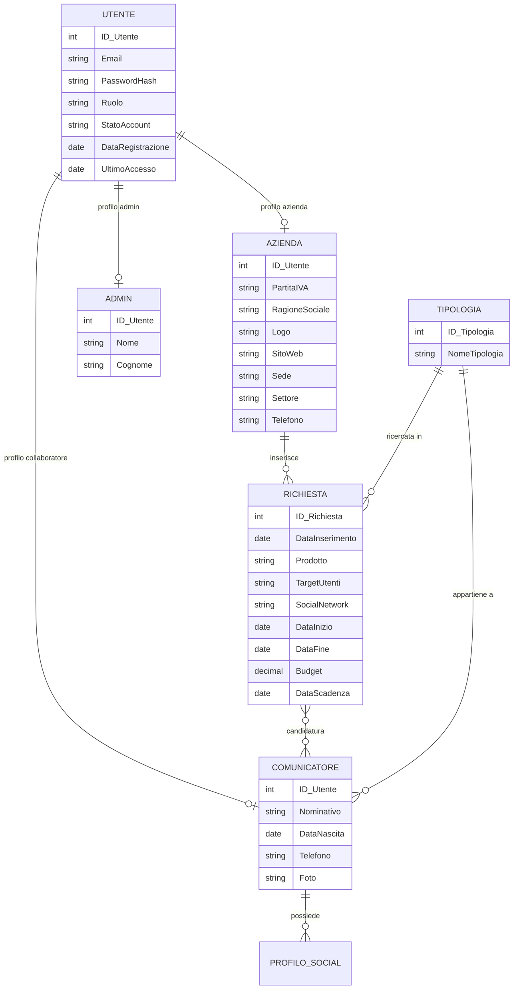
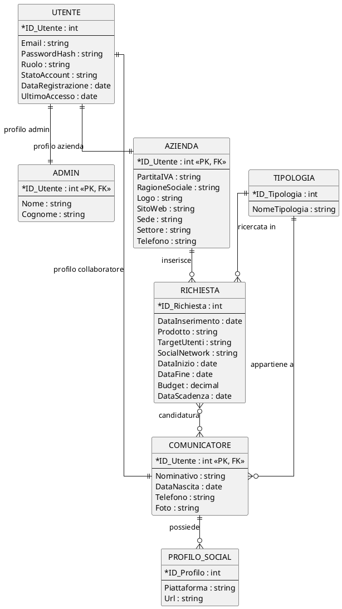
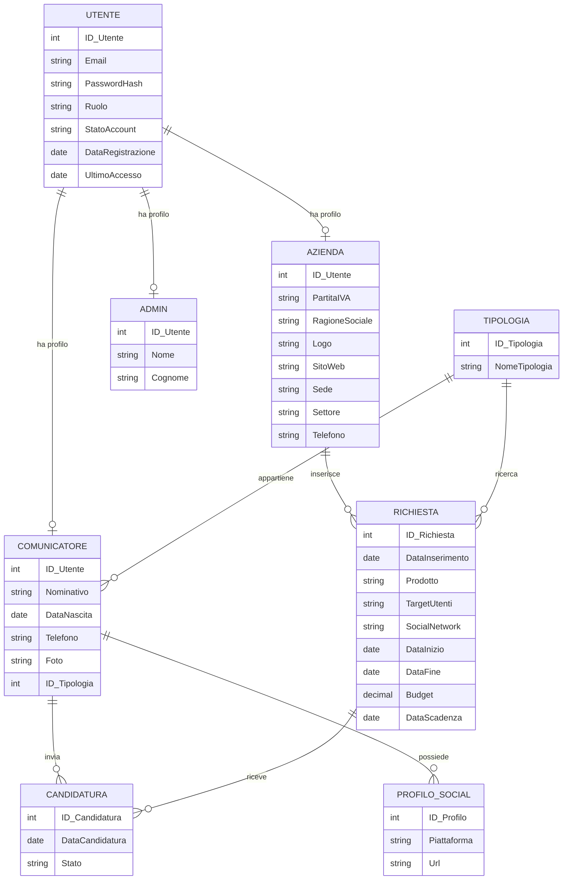
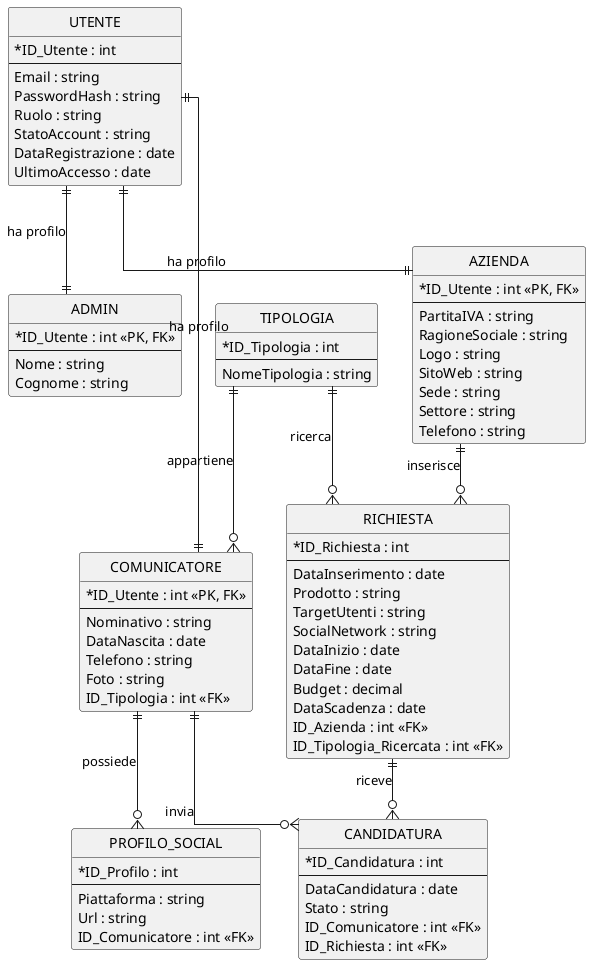

# Soluzione Verifica di Informatica: Piattaforma Sponsorizzazioni Social

Versione ridotta della [traccia ministeriale](https://www.istruzione.it/esame_di_stato/202425/Istituti%20tecnici/Suppletiva/A038_SUP25.pdf), con solo i punti essenziali richiesti. Per la versione estesa, con analisi dettagliata, progettazione E/R completa, SQL e codice web, si veda il file [svolgimento-esteso.md](./svolgimento-esteso.md).

## Traccia

> **Argomento:** Progettazione e Sviluppo di una piattaforma web per il matching
> Il successo di un prodotto commerciale può essere determinato da opportune campagne di sponsorizzazione che si avvalgono del contributo di personaggi noti o esperti di comunicazione. In questo contesto, una startup vuole realizzare una piattaforma web per permettere alle aziende di potersi sponsorizzare online attraverso la collaborazione di comunicatori attivi sui vari social, categorizzati in determinate tipologie (influencer, esperto di settore, personaggio pubblico, divulgatore scientifico, ecc.). I comunicatori si iscrivono alla piattaforma riportando nel loro profilo i seguenti dati: nominativo, data di nascita, informazioni di contatto, foto, i riferimenti ai loro profili social, la propria tipologia. Ciascuna azienda interessata ad ottenere la collaborazione dei comunicatori potrà registrarsi sulla piattaforma fornendo i propri dati aziendali (ragione sociale, l’immagine del logo, sito web, sede, ecc.), il settore prevalente di operatività, una e-mail e un contatto telefonico. Una volta completata la registrazione, potrà inserire in piattaforma le proprie richieste di sponsorizzazione. Ogni richiesta di sponsorizzazione dovrà indicare la data di inserimento della stessa, il prodotto da sponsorizzare, il target di utenti destinatari, il social network di interesse, il periodo durante il quale dovrà essere attivata la sponsorizzazione, la tipologia di comunicatore ricercato, il budget offerto e la data di scadenza entro la quale i comunicatori potranno presentare le proprie candidature. Alla scadenza delle candidature, in un’area riservata della piattaforma, l’azienda selezionerà il comunicatore scelto, il quale successivamente pubblicherà sul social indicato i contenuti sul prodotto da sponsorizzare nei periodi concordati.
>
> Il candidato, effettuate le opportune ipotesi aggiuntive, sviluppi le seguenti fasi:
>
> [Punti 4] Scrivere lo schema E-R, completo in ogni sua parte, della realtà ora descritta. Definire eventuali ipotesi aggiuntive a supporto delle scelte fatte e i vincoli d’integrità dei dati. Riportare tutta la documentazione a corredo delle fasi progettuali.
>
> [Punti 2] Ristrutturare il modello E-R sviluppato al passo precedente, discutendo i punti che vanno affrontati durante la ristrutturazione. Se necessario ridisegnare il modello E/R ristrutturato.
>
> [Punti 2] Eseguire il mapping del modello E/R ristrutturato nel corrispondente modello Relazionale. Usare la convenzione di sottolineare le chiavi primarie e di denotare con * le chiavi esterne. Gli attributi che possono assumere il valore nullo devono essere distinguibili da quelli che non possono assumere il valore nullo.
>
> [Punti 1] Descrivere il progetto di massima della struttura dell’applicazione web per la gestione della realtà sopra presentata, indicando quali risorse tecnologiche sia di tipo hardware che di tipo software si ritengono idonee alla realizzazione;
>
> [Punti 1] Scrivere una parte significativa dell’applicazione web che consente l’interazione con la base di dati, utilizzando appropriati linguaggi a scelta, sia lato client che lato server.

## 1. Progettazione Concettuale

$$Punti 4$$

### 1.1 Ipotesi Aggiuntive e Regole di Business

Per completare e rendere coerente il modello rispetto alla realtà descritta, si formulano le seguenti ipotesi aggiuntive:

1. **Univocità del vincitore:** Un'azienda può selezionare **un solo** comunicatore per ogni singola richiesta di sponsorizzazione. Se l'azienda desidera più comunicatori per lo stesso prodotto, inserirà più richieste distinte (magari con target o tipologie diverse).

2. **Profili Social Multipli:** Un comunicatore può avere più profili social su piattaforme diverse (es. Instagram, TikTok, YouTube). Questo rappresenta un attributo multivalore che andrà gestito in fase di ristrutturazione.

3. **Tipologia standardizzata:** Si assume che le "tipologie" (influencer, divulgatore, esperto, ecc.) siano predefinite dalla piattaforma e selezionabili da un elenco, per evitare incongruenze nei dati.

4. **Stato della Candidatura:** Poiché i comunicatori si candidano e l'azienda ne sceglie uno, la relazione di candidatura deve prevedere uno "Stato" (es. *In attesa, Accettata, Rifiutata*).

5. **Autenticazione e ruoli:** Tutti i soggetti che accedono alla piattaforma sono modellati tramite l'entità **UTENTE**, usata per il login. L'attributo `Ruolo` distingue gli account `AZIENDA`, `COLLABORATORE` e `ADMIN`. Il ruolo `COLLABORATORE` corrisponde al comunicatore/influencer descritto dalla traccia.

6. **Separazione tra account e profilo:** Email, password hash, ruolo e stato dell'account appartengono a `UTENTE`; i dati aziendali stanno in `AZIENDA`, i dati personali/professionali stanno in `COMUNICATORE`, i dati minimi dell'amministratore stanno in `ADMIN`.

7. **Specializzazione disgiunta:** Ogni utente ha un solo profilo applicativo coerente con il proprio ruolo: un account `AZIENDA` è collegato a una sola azienda, un account `COLLABORATORE` a un solo comunicatore, un account `ADMIN` a un solo amministratore.

### 1.2 Schema E/R Iniziale



### 1.3 Schema E/R Iniziale in PlantUML



## 2. Ristrutturazione del Modello E/R

$$Punti 2$$

### 2.1 Analisi delle criticità e ristrutturazione

Durante la fase di ristrutturazione verso il modello relazionale, affrontiamo i seguenti punti:

1. **Introduzione dell'entità di login:** gli attributi comuni all'accesso (`Email`, `PasswordHash`, `Ruolo`, `StatoAccount`) vengono spostati in `UTENTE`. In questo modo non si duplicano credenziali dentro `AZIENDA`, `COMUNICATORE` e `ADMIN`.

2. **Ristrutturazione della gerarchia:** la specializzazione `UTENTE -> AZIENDA | COMUNICATORE | ADMIN` viene tradotta con tre relazioni 1:1. La chiave primaria dei profili specifici coincide con la chiave esterna verso `UTENTE`.

3. **Risoluzione delle relazioni N:M:** La relazione `candidatura` tra `RICHIESTA` e `COMUNICATORE` è molti-a-molti (un comunicatore si candida a più richieste, una richiesta riceve più comunicatori). Viene creata una nuova entità associativa **CANDIDATURA**, che conterrà gli attributi specifici della relazione (Data di invio della candidatura, Stato).

4. **Attributi Multivalore:** I "riferimenti ai profili social" del comunicatore sono stati già sdoppiati in un'entità debole **PROFILO\_SOCIAL** (1:N rispetto al comunicatore).

5. **Ottimizzazione delle Tipologie:**
   L'entità **TIPOLOGIA** funge da *lookup table* (dizionario), collegandosi in relazione 1:N sia con `COMUNICATORE` (la categoria a cui appartiene) sia con `RICHIESTA` (la categoria ricercata dall'azienda).

6. **Vincoli principali:** `UTENTE.Email` è univoca; `UTENTE.Ruolo` può assumere solo i valori `AZIENDA`, `COLLABORATORE`, `ADMIN`; per ogni richiesta può esistere al massimo una candidatura con stato `Accettata`; la scadenza candidature deve precedere o coincidere con la data di inizio della sponsorizzazione.

### 2.2 Schema E/R Ristrutturato



### 2.3 Schema E/R Ristrutturato in PlantUML



## 3. Progettazione Logica (Modello Relazionale)

$$Punti 2$$

Di seguito il mapping del modello E/R ristrutturato nel modello logico relazionale.

**Convenzioni utilizzate:**

- <u>Sottolineato</u>: Chiave Primaria (PK).
- Asterisco (\*): Chiave Esterna (FK).
- *Corsivo*: Attributo che può assumere valore nullo (Nullable / Opzionale). I restanti sono da intendersi NOT NULL.

**Tabelle:**

- **UTENTE**(<u>ID\_Utente</u>, Email, PasswordHash, Ruolo, StatoAccount, DataRegistrazione, *UltimoAccesso*)
- **AZIENDA**(<u>ID\_Utente</u>\*, PartitaIVA, RagioneSociale, *Logo*, *SitoWeb*, Sede, Settore, Telefono)
- **ADMIN**(<u>ID\_Utente</u>\*, Nome, Cognome)
- **TIPOLOGIA**(<u>ID\_Tipologia</u>, NomeTipologia)
- **COMUNICATORE**(<u>ID\_Utente</u>\*, Nominativo, DataNascita, Telefono, *Foto*, ID\_Tipologia\*)
- **PROFILO\_SOCIAL**(<u>ID\_Profilo</u>, Piattaforma, Url, ID\_Comunicatore\*)
- **RICHIESTA**(<u>ID\_Richiesta</u>, DataInserimento, Prodotto, TargetUtenti, SocialNetwork, DataInizio, DataFine, Budget, DataScadenza, ID\_Azienda\*, ID\_Tipologia\_Ricercata\*)
- **CANDIDATURA**(<u>ID\_Candidatura</u>, DataCandidatura, Stato, ID\_Comunicatore\*, ID\_Richiesta\*)

**Ulteriori vincoli d'integrità:**

- `UTENTE.Email` deve essere univoca.
- `UTENTE.Ruolo` ammette solo `AZIENDA`, `COLLABORATORE`, `ADMIN`.
- `AZIENDA.ID_Utente`, `COMUNICATORE.ID_Utente` e `ADMIN.ID_Utente` sono sia PK sia FK verso `UTENTE(ID_Utente)`.
- `AZIENDA.PartitaIVA` deve essere univoca.
- `CANDIDATURA(ID_Comunicatore, ID_Richiesta)` deve essere univoca, per impedire candidature duplicate.
- Per ogni `RICHIESTA` può esistere al massimo una candidatura con `Stato = 'Accettata'`.

## 4. Architettura dell'Applicazione Web

$$Punti 1$$

Il progetto prevede un'architettura **Client-Server a 3 livelli (Three-tier)**, con il backend sviluppato come servizio RESTful:

1. **Presentation Layer (Livello Client):** L'interfaccia utente (UI) single-page application (SPA) oppure multi-page application (MPA) eseguita sul browser.
2. **Business Logic Layer (Livello Application Server):** Web API che espone gli endpoint REST per l'elaborazione dei dati, gestisce login/autorizzazioni e controlla i ruoli `AZIENDA`, `COLLABORATORE`, `ADMIN`.
3. **Data Access Layer (Livello Database):** Il RDBMS che ospita i dati persistenti.

**Risorse Tecnologiche Ipotizzate:**

- **Hardware:**
  - *Server Cloud (es. Azure App Service, AWS EC2)*: per garantire scalabilità.
  - *Dispositivi Client*: PC, Tablet, Smartphone (interfaccia Responsive).
- **Software (Stack Tecnologico):**
  - **Front-end:** HTML5, CSS3, JavaScript Vanilla (o framework come Vue.js/React) e chiamate Fetch API.
  - **Back-end:** C# con **ASP.NET Core (Minimal API)**, autenticazione tramite JWT e autorizzazione basata su ruoli. L'interazione con il database avviene tramite l'ORM **Entity Framework Core**.
  - **Database:** MySQL (o SQL Server).
  - **Web Server:** Kestrel (integrato in .NET) posizionato eventualmente dietro un reverse proxy come IIS o Nginx.

## 5. Codice Significativo (Interazione DB Client/Server)

$$Punti 2$$

Viene sviluppata la funzionalità lato Azienda che permette di **visualizzare le candidature ricevute per una specifica richiesta di sponsorizzazione**. Il client effettua una richiesta asincrona (GET) all'endpoint Minimal API, il quale interroga il database utilizzando Entity Framework Core e la sintassi **Fluent LINQ**, per poi restituire un JSON.

L'endpoint è accessibile solo a un utente autenticato con ruolo `AZIENDA`; l'email dei comunicatori candidati viene recuperata dalla tabella `UTENTE`.

### Lato Server (C# ASP.NET Core Minimal API + EF Core - `Program.cs`)

```csharp
using System;
using Microsoft.AspNetCore.Builder;
using Microsoft.AspNetCore.Authentication.JwtBearer;
using Microsoft.EntityFrameworkCore;
using Microsoft.Extensions.DependencyInjection;
using System.Security.Claims;

var builder = WebApplication.CreateBuilder(args);

builder.Services.AddCors(options =>
{
    options.AddDefaultPolicy(policy =>
        policy.AllowAnyOrigin().AllowAnyHeader().AllowAnyMethod());
});

string connectionString = "Server=localhost;Database=sponsor_db;User=root;Password=;";
builder.Services.AddDbContext<SponsorDbContext>(options =>
    options.UseMySql(connectionString, ServerVersion.AutoDetect(connectionString)));

builder.Services
    .AddAuthentication(JwtBearerDefaults.AuthenticationScheme)
    .AddJwtBearer();

builder.Services.AddAuthorization();

var app = builder.Build();
app.UseCors();
app.UseAuthentication();
app.UseAuthorization();

app.MapGet("/api/richieste/{idRichiesta:int}/candidature", async (
    int idRichiesta,
    SponsorDbContext db,
    ClaimsPrincipal user) =>
{
    var idUtenteClaim = user.FindFirst(ClaimTypes.NameIdentifier)?.Value;

    if (!int.TryParse(idUtenteClaim, out int idAzienda))
    {
        return Results.Unauthorized();
    }

    var richiesta = await db.Richieste
        .FirstOrDefaultAsync(r => r.ID_Richiesta == idRichiesta);

    if (richiesta is null)
    {
        return Results.NotFound(new { error = "Richiesta non trovata." });
    }

    if (richiesta.ID_Azienda != idAzienda)
    {
        return Results.Forbid();
    }

    var candidature = await db.Candidature
        .Include(c => c.Comunicatore)
            .ThenInclude(com => com.Utente)
        .Include(c => c.Comunicatore)
            .ThenInclude(com => com.Tipologia)
        .Where(c => c.ID_Richiesta == idRichiesta)
        .OrderBy(c => c.DataCandidatura)
        .Select(c => new
        {
            c.ID_Candidatura,
            DataCandidatura = c.DataCandidatura.ToString("dd/MM/yyyy"),
            c.Stato,
            c.Comunicatore.Nominativo,
            Email = c.Comunicatore.Utente.Email,
            c.Comunicatore.Foto,
            NomeTipologia = c.Comunicatore.Tipologia.NomeTipologia
        })
        .ToListAsync();

    return Results.Ok(new { status = "success", data = candidature });
})
.RequireAuthorization(policy => policy.RequireRole("AZIENDA"));

app.Run();

public class SponsorDbContext : DbContext
{
    public SponsorDbContext(DbContextOptions<SponsorDbContext> options) : base(options) { }

    public DbSet<Utente> Utenti { get; set; }
    public DbSet<Azienda> Aziende { get; set; }
    public DbSet<Candidatura> Candidature { get; set; }
    public DbSet<Comunicatore> Comunicatori { get; set; }
    public DbSet<Richiesta> Richieste { get; set; }
    public DbSet<Tipologia> Tipologie { get; set; }

    protected override void OnModelCreating(ModelBuilder modelBuilder)
    {
        modelBuilder.Entity<Utente>().ToTable("UTENTE").HasKey(u => u.ID_Utente);
        modelBuilder.Entity<Azienda>().ToTable("AZIENDA").HasKey(a => a.ID_Utente);
        modelBuilder.Entity<Candidatura>().ToTable("CANDIDATURA").HasKey(c => c.ID_Candidatura);
        modelBuilder.Entity<Comunicatore>().ToTable("COMUNICATORE").HasKey(c => c.ID_Utente);
        modelBuilder.Entity<Richiesta>().ToTable("RICHIESTA").HasKey(r => r.ID_Richiesta);
        modelBuilder.Entity<Tipologia>().ToTable("TIPOLOGIA").HasKey(t => t.ID_Tipologia);

        modelBuilder.Entity<Utente>()
            .HasIndex(u => u.Email)
            .IsUnique();

        modelBuilder.Entity<Azienda>()
            .HasOne(a => a.Utente)
            .WithOne()
            .HasForeignKey<Azienda>(a => a.ID_Utente);

        modelBuilder.Entity<Comunicatore>()
            .HasOne(c => c.Utente)
            .WithOne()
            .HasForeignKey<Comunicatore>(c => c.ID_Utente);

        modelBuilder.Entity<Richiesta>()
            .HasOne(r => r.Azienda)
            .WithMany()
            .HasForeignKey(r => r.ID_Azienda);

        modelBuilder.Entity<Candidatura>()
            .HasOne(c => c.Comunicatore)
            .WithMany()
            .HasForeignKey(c => c.ID_Comunicatore);

        modelBuilder.Entity<Candidatura>()
            .HasOne(c => c.Richiesta)
            .WithMany()
            .HasForeignKey(c => c.ID_Richiesta);

        modelBuilder.Entity<Candidatura>()
            .HasIndex(c => new { c.ID_Comunicatore, c.ID_Richiesta })
            .IsUnique();

        modelBuilder.Entity<Comunicatore>()
            .HasOne(c => c.Tipologia)
            .WithMany()
            .HasForeignKey(c => c.ID_Tipologia);
    }
}

public class Utente
{
    public int ID_Utente { get; set; }
    public string Email { get; set; } = "";
    public string PasswordHash { get; set; } = "";
    public string Ruolo { get; set; } = "";
    public string StatoAccount { get; set; } = "ATTIVO";
}

public class Azienda
{
    public int ID_Utente { get; set; }
    public string RagioneSociale { get; set; } = "";
    public Utente Utente { get; set; } = null!;
}

public class Tipologia
{
    public int ID_Tipologia { get; set; }
    public string NomeTipologia { get; set; } = "";
}

public class Comunicatore
{
    public int ID_Utente { get; set; }
    public string Nominativo { get; set; } = "";
    public string? Foto { get; set; }
    public int ID_Tipologia { get; set; }
    public Utente Utente { get; set; } = null!;
    public Tipologia Tipologia { get; set; } = null!;
}

public class Richiesta
{
    public int ID_Richiesta { get; set; }
    public int ID_Azienda { get; set; }
    public string Prodotto { get; set; } = "";
    public Azienda Azienda { get; set; } = null!;
}

public class Candidatura
{
    public int ID_Candidatura { get; set; }
    public DateTime DataCandidatura { get; set; }
    public string Stato { get; set; } = "";
    public int ID_Richiesta { get; set; }
    public int ID_Comunicatore { get; set; }
    public Richiesta Richiesta { get; set; } = null!;
    public Comunicatore Comunicatore { get; set; } = null!;
}
```

### Lato Client (HTML + JavaScript Vanilla)

```html
<!DOCTYPE html>
<html lang="it">
<head>
    <meta charset="UTF-8">
    <meta name="viewport" content="width=device-width, initial-scale=1.0">
    <title>Visualizza Candidature - Azienda</title>
    <style>
        body { font-family: 'Segoe UI', Tahoma, Geneva, Verdana, sans-serif; padding: 20px; color: #333; }
        table { width: 100%; border-collapse: collapse; margin-top: 20px; box-shadow: 0 0 10px rgba(0,0,0,0.1); }
        th, td { border: 1px solid #ddd; padding: 12px; text-align: left; }
        th { background-color: #0078D4; color: white; }
        .btn-accetta { background-color: #107C10; color: white; padding: 8px 12px; border: none; border-radius: 4px; cursor: pointer;}
        .btn-accetta:hover { background-color: #0b5a0b; }
    </style>
</head>
<body>

    <h2>Candidature Ricevute</h2>
    <p>Di seguito le candidature relative alla richiesta di sponsorizzazione selezionata.</p>

    <div id="loading">Caricamento in corso...</div>

    <table id="tabellaCandidature" style="display: none;">
        <thead>
            <tr>
                <th>Nominativo</th>
                <th>Tipologia</th>
                <th>Data Candidatura</th>
                <th>Stato</th>
                <th>Azione</th>
            </tr>
        </thead>
        <tbody id="corpoTabella">
            
        </tbody>
    </table>

    <script>
        // Simuliamo l'ID di una richiesta di sponsorizzazione
        const idRichiesta = 12;
        const apiUrl = `http://localhost:5000/api/richieste/${idRichiesta}/candidature`;
        const accessToken = localStorage.getItem('accessToken');

        document.addEventListener('DOMContentLoaded', () => {
            fetch(apiUrl, {
                headers: {
                    'Accept': 'application/json',
                    'Authorization': `Bearer ${accessToken}`
                }
            })
                .then(response => {
                    if(response.status === 401 || response.status === 403) {
                        throw new Error('Accesso non autorizzato: effettuare il login come azienda');
                    }
                    if(!response.ok) throw new Error('Errore di rete o server');
                    return response.json();
                })
                .then(result => {
                    document.getElementById('loading').style.display = 'none';
                    if(result.status === 'success') {
                        popolaTabella(result.data);
                    } else {
                        alert("Impossibile recuperare i dati.");
                    }
                })
                .catch(error => {
                    document.getElementById('loading').innerText = "Errore nel caricamento dei dati.";
                    console.error('Errore nel fetch API:', error);
                });
        });

        function popolaTabella(candidature) {
            const tbody = document.getElementById('corpoTabella');
            const table = document.getElementById('tabellaCandidature');

            if(candidature.length === 0) {
                tbody.innerHTML = '<tr><td colspan="5" style="text-align:center">Nessuna candidatura ricevuta per questa richiesta.</td></tr>';
            } else {
                candidature.forEach(cand => {
                    // ASP.NET Core trasforma i nomi delle proprietà in camelCase durante la serializzazione JSON
                    const tr = document.createElement('tr');
                    tr.innerHTML = `
                        <td><strong>${cand.nominativo}</strong></td>
                        <td>${cand.nomeTipologia}</td>
                        <td>${cand.dataCandidatura}</td>
                        <td><em>${cand.stato}</em></td>
                        <td>
                            ${cand.stato === 'In attesa'
                                ? `<button class="btn-accetta" onclick="accettaCandidato(${cand.iD_Candidatura})">Seleziona Vincitore</button>`
                                : 'Azione Completata'}
                        </td>
                    `;
                    tbody.appendChild(tr);
                });
            }
            table.style.display = 'table';
        }

        function accettaCandidato(idCandidatura) {
            if(confirm('Confermi di voler selezionare questo comunicatore per la campagna?')) {
                alert(`Candidatura ${idCandidatura} accettata!`);
            }
        }
    </script>
</body>
</html>

```
