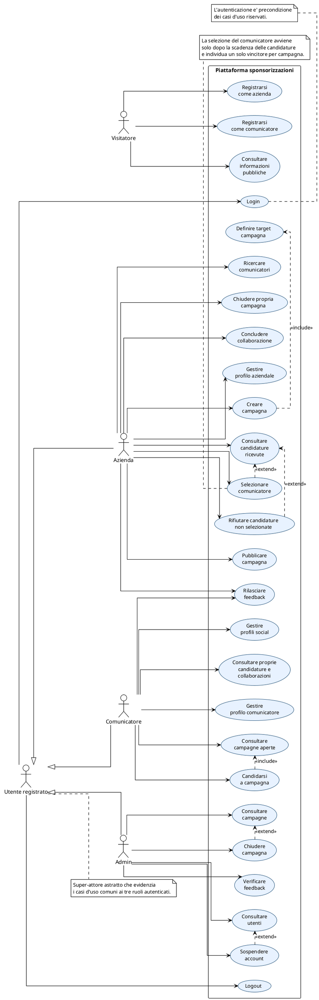
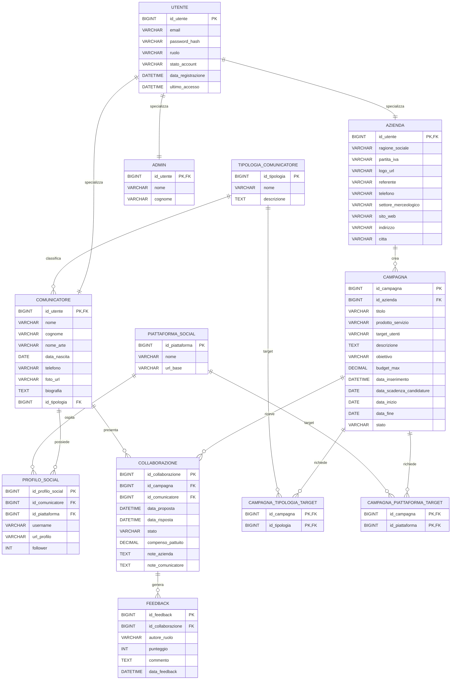
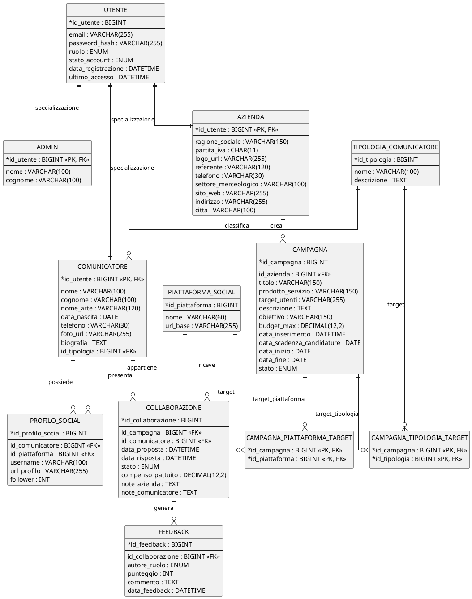

# Traccia A038 – Sessione suppletiva 2025

## Svolgimento della prima parte: analisi, E/R, mapping, SQL MariaDB e progetto web

> **Nota metodologica**
>
> Questa versione rappresenta lo svolgimento completo della traccia di maturità della prova suppletiva di Informatica e Telecomunicazioni del 2025, gestendo anche un aspetto
> fondamentale in una piattaforma reale:
>
> - **azienda** e **comunicatore** devono poter accedere al sistema tramite
>   autenticazione;
> - è quindi opportuno modellare un **super-tipo `Utente`** dal quale derivano
>   gerarchicamente:
>   - `Azienda`
>   - `Comunicatore`
>   - `Admin`
>
> La soluzione resta volutamente **didattica**, ma più vicina a
> un’implementazione realistica:
>
> - autenticazione centralizzata;
> - specializzazione dei profili applicativi;
> - recupero esplicito dei dati richiesti dalla traccia (`logo` aziendale e
>   `target utenti destinatari`);
> - vincolo di selezione di **un solo comunicatore** per campagna dopo la
>   scadenza delle candidature;
> - casi d’uso riscritti;
> - modello E/R aggiornato;
> - schema relazionale e SQL coerenti;
> - endpoint backend concreto per la candidatura a una campagna;
> - pagina HTML/CSS/JS completa lato client.

---

## 1. Analisi della realtà di riferimento

Il dominio applicativo riguarda una **piattaforma web** che mette in relazione:

- **aziende** che vogliono promuovere prodotti o servizi;
- **comunicatori** attivi sui social network;
- **amministratori** che gestiscono e moderano la piattaforma.

L’obiettivo è consentire alle aziende di pubblicare **campagne di
sponsorizzazione**, individuare o ricevere candidature da comunicatori idonei e
gestire l’evoluzione delle collaborazioni fino al loro completamento e ai
feedback reciproci.

Per rendere il modello coerente con un sistema reale, si assume che:

- ogni soggetto che interagisce operativamente con la piattaforma abbia un
  **account di accesso**;
- l’accesso sia centralizzato in una entità generale **Utente**;
- i diversi profili applicativi siano ottenuti tramite specializzazione:
  - `Utente` → `Azienda`
  - `Utente` → `Comunicatore`
  - `Utente` → `Admin`

Questa scelta è corretta sia dal punto di vista concettuale sia dal punto di
vista software, perché:

- evita duplicazioni di dati di accesso;
- rende uniforme login, autorizzazione e stato dell’account;
- consente di aggiungere in futuro nuovi ruoli senza ripensare tutto il modello.

---

## 2. Attori del sistema

Gli attori principali sono i seguenti.

## 2.1 Visitatore

Utente non autenticato che può:

- consultare informazioni pubbliche;
- registrarsi come azienda o comunicatore;
- accedere alla procedura di autenticazione.

## 2.2 Utente registrato

Attore **astratto** usato nel diagramma dei casi d’uso per rappresentare le
funzioni comuni a chi possiede già un account nella piattaforma. Può:

- effettuare il login;
- effettuare il logout.

## 2.3 Azienda

Utente autenticato con ruolo applicativo **Azienda**. Può:

- gestire il proprio profilo;
- creare campagne;
- definire target per le campagne;
- pubblicare e chiudere le proprie campagne;
- cercare comunicatori;
- visualizzare le candidature ricevute;
- selezionare, dopo la scadenza, il comunicatore prescelto;
- rifiutare le candidature non selezionate;
- monitorare collaborazioni e rilasciare feedback.

## 2.4 Comunicatore

Utente autenticato con ruolo applicativo **Comunicatore**. Può:

- gestire il proprio profilo;
- gestire i propri profili social;
- consultare campagne aperte;
- candidarsi a una campagna entro la scadenza;
- seguire lo stato delle proprie candidature/collaborazioni;
- rilasciare feedback all’azienda a conclusione della collaborazione.

## 2.5 Admin

Utente autenticato con ruolo applicativo **Admin**. Può:

- consultare utenti e campagne;
- verificare feedback e anomalie;
- sospendere account;
- chiudere campagne scorrette;
- intervenire in caso di abuso o anomalia.

---

## 3. Requisiti funzionali

Di seguito si distinguono i servizi richiesti al sistema.

## 3.1 Requisiti funzionali essenziali

### RF1 – Registrazione

Il sistema deve consentire la registrazione di nuovi utenti come:

- azienda;
- comunicatore.

### RF2 – Login e logout

Il sistema deve consentire a:

- azienda;
- comunicatore;
- admin

di autenticarsi e terminare la sessione.

### RF3 – Gestione account

Il sistema deve consentire la gestione dei dati comuni di accesso:

- email;
- password;
- stato account;
- ultimo accesso;
- refresh token di sessione.

### RF4 – Gestione profilo aziendale

L’azienda autenticata deve poter:

- completare o aggiornare il profilo aziendale;
- gestire il logo aziendale;
- visualizzare le proprie campagne;
- visualizzare candidature e collaborazioni collegate alle proprie campagne.

### RF5 – Gestione profilo comunicatore

Il comunicatore autenticato deve poter:

- aggiornare il proprio profilo personale/professionale;
- indicare la tipologia di appartenenza;
- aggiornare foto e biografia;
- gestire i riferimenti ai propri profili social.

### RF6 – Ricerca comunicatori

L’azienda deve poter ricercare comunicatori per:

- tipologia;
- piattaforma social;
- stato del profilo;
- eventuale disponibilità a candidarsi.

### RF7 – Gestione campagne

L’azienda deve poter:

- creare una campagna;
- indicarne prodotto, target utenti destinatari, descrizione, budget e periodo;
- specificare il social network di interesse e la tipologia ricercata;
- nella presente soluzione estesa, specificare uno o più target per tipologia e
  piattaforme social;
- pubblicarla;
- chiuderla.

### RF8 – Consultazione campagne aperte

Il comunicatore deve poter visualizzare le campagne ancora aperte alle
candidature.

### RF9 – Candidatura a una campagna

Il comunicatore autenticato deve poter candidarsi a una campagna se:

- la campagna è pubblicata;
- la data di scadenza candidature non è superata;
- non esiste già una candidatura/collaborazione per la stessa campagna.

### RF10 – Selezione del comunicatore e gestione collaborazione

L’azienda deve poter:

- visualizzare le candidature ricevute;
- dopo la scadenza candidature, selezionare il comunicatore prescelto;
- rifiutare le candidature non selezionate;
- segnare una collaborazione come conclusa.

### RF11 – Gestione stato della collaborazione

Il sistema deve registrare l’evoluzione temporale di una relazione
campagna–comunicatore tramite uno stato, ad esempio:

- `CANDIDATURA_INVIATA`
- `APPROVATA`
- `RIFIUTATA`
- `CONCLUSA`

Per ogni campagna si ammette al massimo **una sola** collaborazione nello stato
`APPROVATA` o `CONCLUSA`.

### RF12 – Feedback reciproco

Al termine di una collaborazione conclusa:

- l’azienda può rilasciare un feedback sul comunicatore;
- il comunicatore può rilasciare un feedback sull’azienda.

### RF13 – Supervisione amministrativa

L’admin può:

- consultare utenti e campagne;
- sospendere account;
- chiudere campagne improprie;
- verificare anomalie nei feedback.

---

## 4. Requisiti di dato

I requisiti di dato descrivono le informazioni da memorizzare in modo
persistente.

## 4.1 Dati comuni di accesso: Utente

Per ogni utente si memorizzano:

- identificativo;
- email univoca;
- password hash;
- ruolo (`AZIENDA`, `COMUNICATORE`, `ADMIN`);
- stato account (`ATTIVO`, `SOSPESO`, `DISATTIVATO`);
- data registrazione;
- ultimo accesso.

## 4.2 Dati specifici dell’azienda

Per ogni azienda si memorizzano:

- identificativo utente associato;
- ragione sociale;
- partita IVA;
- logo;
- referente;
- telefono;
- settore merceologico;
- sito web;
- indirizzo;
- città.

## 4.3 Dati specifici del comunicatore

Per ogni comunicatore si memorizzano:

- identificativo utente associato;
- nome;
- cognome;
- eventuale nome d’arte;
- data di nascita;
- telefono;
- foto;
- biografia;
- tipologia di appartenenza.

## 4.4 Dati specifici dell’admin

Per ogni admin si memorizzano, in forma minima:

- identificativo utente associato;
- nome;
- cognome.

## 4.5 Dati relativi alla tipologia del comunicatore

Per ogni tipologia:

- identificativo;
- nome;
- descrizione.

## 4.6 Dati relativi alle piattaforme social

Per ogni piattaforma:

- identificativo;
- nome;
- URL base o descrizione.

## 4.7 Dati relativi ai profili social

Per ogni profilo social di un comunicatore:

- identificativo;
- comunicatore di appartenenza;
- piattaforma;
- username;
- URL profilo;
- follower (ipotesi aggiuntiva utile alla selezione).

## 4.8 Dati relativi alle campagne

Per ogni campagna:

- identificativo;
- azienda promotrice;
- titolo;
- prodotto/servizio;
- target utenti destinatari;
- descrizione;
- obiettivo;
- budget massimo;
- data inserimento;
- data scadenza candidature;
- data inizio;
- data fine;
- stato.

### Interpretazione delle date di campagna

Nel presente svolgimento si assume che:

- `data_inserimento` sia la data di pubblicazione/inserimento nel sistema;
- `data_scadenza_candidature` sia il termine ultimo per candidarsi;
- `data_inizio` e `data_fine` delimitino il periodo operativo della campagna.

Deve quindi valere il vincolo:

```text
data_inserimento <= data_scadenza_candidature <= data_inizio <= data_fine
```

## 4.9 Dati relativi al target della campagna

In aderenza alla traccia ogni campagna deve specificare almeno:

- una tipologia di comunicatore ricercata;
- un social network di interesse.

Nella presente soluzione estesa, per maggiore flessibilità, si possono
memorizzare anche:

- una o più tipologie target;
- una o più piattaforme target.

## 4.10 Dati relativi a candidature/collaborazioni

Per ogni relazione tra campagna e comunicatore si memorizzano:

- identificativo;
- campagna;
- comunicatore;
- data proposta/candidatura;
- data risposta;
- stato;
- compenso pattuito;
- note azienda;
- note comunicatore.

> In questa soluzione **non si introduce un’entità separata `Candidatura`**.  
> La candidatura viene modellata tramite l’entità `Collaborazione`, che nasce
> con stato iniziale `CANDIDATURA_INVIATA` e può poi evolvere in `APPROVATA`,
> `RIFIUTATA` o `CONCLUSA`.
>
> Per una stessa campagna possono esistere più candidature, ma al massimo una
> sola può essere selezionata e quindi passare allo stato `APPROVATA` e poi
> `CONCLUSA`.

## 4.11 Dati relativi ai feedback

Per ogni feedback si memorizzano:

- identificativo;
- collaborazione a cui si riferisce;
- autore del feedback (`AZIENDA` oppure `COMUNICATORE`);
- punteggio da 1 a 5;
- commento;
- data feedback.

## 4.12 Dati relativi alla sessione applicativa

Per supportare autenticazione moderna con JWT e refresh token si memorizzano
anche:

- refresh token hashato;
- data scadenza;
- data revoca;
- user agent/IP opzionali;
- riferimento all’utente.

---

## 5. Ipotesi di lavoro

## 5.1 Ipotesi principali

1. Ogni **azienda**, **comunicatore** e **admin** possiede un account nella
   tabella `utente`.
2. La specializzazione `Utente → Azienda | Comunicatore | Admin` è **totale e
   disgiunta**:
   - ogni utente appartiene a un solo ruolo principale;
   - ogni profilo specifico corrisponde a un solo utente.
3. Una campagna è creata da una sola azienda.
4. Una campagna può ricevere candidature da più comunicatori.
5. Un comunicatore può candidarsi a più campagne.
6. Per semplicità progettuale, la candidatura è rappresentata nella tabella
   `collaborazione`.
7. Per una coppia `(campagna, comunicatore)` si ammette al massimo una riga di
   collaborazione attiva/storica.
8. Alla scadenza delle candidature, l’azienda seleziona **un solo** comunicatore
   per campagna.
9. Le candidature non selezionate possono essere marcate come `RIFIUTATA`.
10. I feedback possono essere rilasciati solo su collaborazioni concluse.
11. Su una collaborazione possono esistere al massimo due feedback:

- uno dell’azienda;
- uno del comunicatore.

## 5.2 Ipotesi aggiuntive

1. I follower dei profili social sono memorizzati come dato indicativo.
2. Il logo aziendale è memorizzato come URL o path del file.
3. Il `target_utenti` della campagna è memorizzato come descrizione testuale
   sintetica del pubblico destinatario.
4. Pur se la traccia menziona una sola tipologia ricercata e un solo social di
   interesse, la soluzione estesa consente target multipli su tipologie e
   piattaforme, restando compatibile con il caso base.
5. L’admin non crea campagne né candidature, ma gestisce la moderazione.
6. Il ruolo applicativo viene riportato sia come concetto concettuale sia come
   informazione utile all’autorizzazione software.
7. Le password non vengono mai memorizzate in chiaro.
8. I refresh token opachi vengono conservati in forma hashata o comunque
   protetta.
9. La piattaforma può in futuro essere estesa con messaggistica interna,
   contratti o analytics.

---

## 6. Diagramma dei casi d’uso

## 6.1 Elenco sintetico dei casi d’uso

> Nel diagramma seguente si introduce il super-attore **Utente registrato**, che
> rende esplicita la gerarchia tra attori e raccoglie i casi d'uso comuni a
> **Azienda**, **Comunicatore** e **Admin**.

### Visitatore

- registrarsi come azienda;
- registrarsi come comunicatore;
- consultare informazioni pubbliche.

### Utente registrato

- effettuare login;
- effettuare logout.

### Azienda

- gestire profilo aziendale;
- creare campagna;
- definire target campagna;
- pubblicare campagna;
- cercare comunicatori;
- consultare candidature ricevute;
- selezionare comunicatore;
- rifiutare candidature non selezionate;
- chiudere propria campagna;
- concludere collaborazione;
- rilasciare feedback.

### Comunicatore

- gestire profilo comunicatore;
- gestire profili social;
- consultare campagne aperte;
- candidarsi a una campagna;
- consultare proprie candidature/collaborazioni;
- rilasciare feedback.

### Admin

- consultare utenti;
- sospendere account;
- consultare campagne;
- chiudere campagne;
- verificare feedback.

## 6.2 Diagramma dei casi d’uso (PlantUML)



---

## 7. Progettazione concettuale – Modello E/R

## 7.1 Entità principali

### UTENTE

Attributi:

- idUtente
- email
- passwordHash
- ruolo
- statoAccount
- dataRegistrazione
- ultimoAccesso

### AZIENDA

Sottotipo di `Utente`. Attributi specifici:

- idUtente
- ragioneSociale
- partitaIVA
- logoUrl
- referente
- telefono
- settoreMerceologico
- sitoWeb
- indirizzo
- citta

### COMUNICATORE

Sottotipo di `Utente`. Attributi specifici:

- idUtente
- nome
- cognome
- nomeArte
- dataNascita
- telefono
- fotoUrl
- biografia
- idTipologia

### ADMIN

Sottotipo di `Utente`. Attributi specifici:

- idUtente
- nome
- cognome

### TIPOLOGIA_COMUNICATORE

- idTipologia
- nome
- descrizione

### PIATTAFORMA_SOCIAL

- idPiattaforma
- nome
- urlBase

### PROFILO_SOCIAL

- idProfiloSocial
- username
- urlProfilo
- follower
- idComunicatore
- idPiattaforma

### CAMPAGNA

- idCampagna
- idAzienda
- titolo
- prodottoServizio
- targetUtenti
- descrizione
- obiettivo
- budgetMax
- dataInserimento
- dataScadenzaCandidature
- dataInizio
- dataFine
- stato

### COLLABORAZIONE

- idCollaborazione
- idCampagna
- idComunicatore
- dataProposta
- dataRisposta
- stato
- compensoPattuito
- noteAzienda
- noteComunicatore

### FEEDBACK

- idFeedback
- idCollaborazione
- autoreRuolo
- punteggio
- commento
- dataFeedback

## 7.2 Relazioni principali

1. `UTENTE` si specializza in:
   - `AZIENDA`
   - `COMUNICATORE`
   - `ADMIN`

2. Una `TIPOLOGIA_COMUNICATORE` classifica molti `COMUNICATORE`.

3. Un `COMUNICATORE` possiede molti `PROFILO_SOCIAL`.

4. Una `PIATTAFORMA_SOCIAL` è associata a molti `PROFILO_SOCIAL`.

5. Una `AZIENDA` crea molte `CAMPAGNA`.

6. Una `CAMPAGNA` memorizza anche il `targetUtenti` descritto dalla traccia.

7. Una `CAMPAGNA` può avere più tipologie target e più piattaforme target.

8. Una `CAMPAGNA` può essere associata a molti `COMUNICATORE` tramite
   `COLLABORAZIONE`.

9. Un `COMUNICATORE` può partecipare a molte `CAMPAGNA` tramite
   `COLLABORAZIONE`.

10. Per ogni `CAMPAGNA` al massimo una `COLLABORAZIONE` può raggiungere lo stato
    `APPROVATA` o `CONCLUSA`.

11. Una `COLLABORAZIONE` può avere al massimo due `FEEDBACK`, uno per parte.

## 7.3 Diagramma E/R in Mermaid



## 7.4 Diagramma E/R in PlantUML



---

## 8. Osservazioni di ristrutturazione concettuale

## 8.1 Perché introdurre `Utente`

L’introduzione di `Utente` è opportuna perché:

- centralizza l’autenticazione;
- evita duplicazione di `email`, `password_hash`, `stato_account`;
- consente controlli di autorizzazione uniformi;
- rende più naturale l’implementazione software con JWT.

## 8.2 Perché mantenere `Azienda`, `Comunicatore` e `Admin` come sottotipi

I sottotipi consentono di distinguere:

- dati anagrafici/aziendali specifici;
- permessi operativi diversi;
- flussi funzionali diversi.

## 8.3 Perché usare `Collaborazione` anche per la candidatura

Si evita di introdurre una nuova entità `Candidatura`, mantenendo il modello più
semplice.  
La riga di `Collaborazione` nasce quando il comunicatore si candida e viene
inizialmente marcata con:

- `stato = 'CANDIDATURA_INVIATA'`

Successivamente lo stato evolve:

- a `APPROVATA` se l’azienda seleziona quella candidatura dopo la scadenza;
- a `RIFIUTATA` se la candidatura non viene selezionata;
- a `CONCLUSA` quando la collaborazione selezionata termina.

## 8.4 Perché inserire `data_scadenza_candidature` in `Campagna`

La presenza di:

- `data_inserimento`
- `data_scadenza_candidature`
- `data_inizio`
- `data_fine`

consente di distinguere chiaramente:

1. pubblicazione;
2. finestra temporale per candidarsi;
3. esecuzione della campagna.

## 8.5 Perché esplicitare il vincolo di vincitore unico

La traccia ministeriale specifica che, alla scadenza delle candidature,
l’azienda **seleziona il comunicatore scelto**. Di conseguenza il modello deve
rendere chiaro che:

- una campagna può ricevere più candidature;
- ma al massimo una sola candidatura può diventare `APPROVATA` e poi `CONCLUSA`.

---

## 9. Mapping al modello relazionale

## 9.1 Gerarchia `Utente` → sottotipi

La gerarchia viene tradotta con:

- una tabella per il supertipo `utente`;
- una tabella per ciascun sottotipo:
  - `azienda`
  - `comunicatore`
  - `admin`

La chiave primaria del sottotipo coincide con la chiave primaria del supertipo
ed è anche chiave esterna.

### Tabella UTENTE

```text
UTENTE(
    id_utente PK,
    email UNIQUE,
    password_hash,
    ruolo,
    stato_account,
    data_registrazione,
    ultimo_accesso
)
```

### Tabella AZIENDA

```text
AZIENDA(
    id_utente PK FK -> UTENTE(id_utente),
    ragione_sociale,
    partita_iva UNIQUE,
    logo_url,
    referente,
    telefono,
    settore_merceologico,
    sito_web,
    indirizzo,
    citta
)
```

### Tabella COMUNICATORE

```text
COMUNICATORE(
    id_utente PK FK -> UTENTE(id_utente),
    id_tipologia FK -> TIPOLOGIA_COMUNICATORE(id_tipologia),
    nome,
    cognome,
    nome_arte,
    data_nascita,
    telefono,
    foto_url,
    biografia
)
```

### Tabella ADMIN

```text
ADMIN(
    id_utente PK FK -> UTENTE(id_utente),
    nome,
    cognome
)
```

## 9.2 Entità semplici

```text
TIPOLOGIA_COMUNICATORE(
    id_tipologia PK,
    nome UNIQUE,
    descrizione
)
```

```text
PIATTAFORMA_SOCIAL(
    id_piattaforma PK,
    nome UNIQUE,
    url_base
)
```

## 9.3 Relazioni 1:N

```text
PROFILO_SOCIAL(
    id_profilo_social PK,
    id_comunicatore FK -> COMUNICATORE(id_utente),
    id_piattaforma FK -> PIATTAFORMA_SOCIAL(id_piattaforma),
    username,
    url_profilo,
    follower,
    UNIQUE(id_comunicatore, id_piattaforma, username)
)
```

```text
CAMPAGNA(
    id_campagna PK,
    id_azienda FK -> AZIENDA(id_utente),
    titolo,
    prodotto_servizio,
    target_utenti,
    descrizione,
    obiettivo,
    budget_max,
    data_inserimento,
    data_scadenza_candidature,
    data_inizio,
    data_fine,
    stato
)
```

## 9.4 Relazioni N:M senza attributi

```text
CAMPAGNA_TIPOLOGIA_TARGET(
    id_campagna PK FK -> CAMPAGNA(id_campagna),
    id_tipologia PK FK -> TIPOLOGIA_COMUNICATORE(id_tipologia)
)
```

```text
CAMPAGNA_PIATTAFORMA_TARGET(
    id_campagna PK FK -> CAMPAGNA(id_campagna),
    id_piattaforma PK FK -> PIATTAFORMA_SOCIAL(id_piattaforma)
)
```

## 9.5 Relazione N:M con attributi: `Collaborazione`

```text
COLLABORAZIONE(
    id_collaborazione PK,
    id_campagna FK -> CAMPAGNA(id_campagna),
    id_comunicatore FK -> COMUNICATORE(id_utente),
    data_proposta,
    data_risposta,
    stato,
    compenso_pattuito,
    note_azienda,
    note_comunicatore,
    UNIQUE(id_campagna, id_comunicatore)
)
```

## 9.6 Feedback

```text
FEEDBACK(
    id_feedback PK,
    id_collaborazione FK -> COLLABORAZIONE(id_collaborazione),
    autore_ruolo,
    punteggio,
    commento,
    data_feedback,
    UNIQUE(id_collaborazione, autore_ruolo)
)
```

## 9.7 Vincoli di business non banali

I seguenti vincoli non sono espressi completamente con sole chiavi e foreign
key, quindi richiedono logica applicativa o trigger:

- la candidatura è ammessa solo fino a `data_scadenza_candidature`;
- la selezione del comunicatore può avvenire solo dopo la scadenza;
- per ogni campagna può esistere al massimo una collaborazione
  `APPROVATA`/`CONCLUSA`.

## 9.8 Refresh token

```text
REFRESH_TOKEN(
    id_refresh_token PK,
    id_utente FK -> UTENTE(id_utente),
    token_hash,
    data_scadenza,
    data_revoca,
    created_at
)
```

---

## 10. Schema logico relazionale finale

```text
UTENTE(
    id_utente PK,
    email UNIQUE NOT NULL,
    password_hash NOT NULL,
    ruolo NOT NULL,
    stato_account NOT NULL,
    data_registrazione NOT NULL,
    ultimo_accesso
)

AZIENDA(
    id_utente PK FK -> UTENTE(id_utente),
    ragione_sociale NOT NULL,
    partita_iva UNIQUE NOT NULL,
    logo_url,
    referente,
    telefono,
    settore_merceologico,
    sito_web,
    indirizzo,
    citta
)

COMUNICATORE(
    id_utente PK FK -> UTENTE(id_utente),
    id_tipologia FK -> TIPOLOGIA_COMUNICATORE(id_tipologia),
    nome NOT NULL,
    cognome NOT NULL,
    nome_arte,
    data_nascita,
    telefono,
    foto_url,
    biografia
)

ADMIN(
    id_utente PK FK -> UTENTE(id_utente),
    nome NOT NULL,
    cognome NOT NULL
)

TIPOLOGIA_COMUNICATORE(
    id_tipologia PK,
    nome UNIQUE NOT NULL,
    descrizione
)

PIATTAFORMA_SOCIAL(
    id_piattaforma PK,
    nome UNIQUE NOT NULL,
    url_base
)

PROFILO_SOCIAL(
    id_profilo_social PK,
    id_comunicatore FK -> COMUNICATORE(id_utente),
    id_piattaforma FK -> PIATTAFORMA_SOCIAL(id_piattaforma),
    username NOT NULL,
    url_profilo NOT NULL,
    follower,
    UNIQUE(id_comunicatore, id_piattaforma, username)
)

CAMPAGNA(
    id_campagna PK,
    id_azienda FK -> AZIENDA(id_utente),
    titolo NOT NULL,
    prodotto_servizio NOT NULL,
    target_utenti NOT NULL,
    descrizione NOT NULL,
    obiettivo,
    budget_max NOT NULL,
    data_inserimento NOT NULL,
    data_scadenza_candidature NOT NULL,
    data_inizio NOT NULL,
    data_fine NOT NULL,
    stato NOT NULL
)

CAMPAGNA_TIPOLOGIA_TARGET(
    id_campagna PK FK -> CAMPAGNA(id_campagna),
    id_tipologia PK FK -> TIPOLOGIA_COMUNICATORE(id_tipologia)
)

CAMPAGNA_PIATTAFORMA_TARGET(
    id_campagna PK FK -> CAMPAGNA(id_campagna),
    id_piattaforma PK FK -> PIATTAFORMA_SOCIAL(id_piattaforma)
)

COLLABORAZIONE(
    id_collaborazione PK,
    id_campagna FK -> CAMPAGNA(id_campagna),
    id_comunicatore FK -> COMUNICATORE(id_utente),
    data_proposta NOT NULL,
    data_risposta,
    stato NOT NULL,
    compenso_pattuito,
    note_azienda,
    note_comunicatore,
    UNIQUE(id_campagna, id_comunicatore)
)

FEEDBACK(
    id_feedback PK,
    id_collaborazione FK -> COLLABORAZIONE(id_collaborazione),
    autore_ruolo NOT NULL,
    punteggio NOT NULL,
    commento,
    data_feedback NOT NULL,
    UNIQUE(id_collaborazione, autore_ruolo)
)

REFRESH_TOKEN(
    id_refresh_token PK,
    id_utente FK -> UTENTE(id_utente),
    token_hash NOT NULL,
    data_scadenza NOT NULL,
    data_revoca,
    created_at NOT NULL
)
```

Vincoli logici aggiuntivi:

- per ogni campagna al massimo una riga di `COLLABORAZIONE` può trovarsi in
  stato `APPROVATA` o `CONCLUSA`;
- il passaggio a `APPROVATA` è ammesso solo dopo `data_scadenza_candidature`.

---

## 11. SQL del database fisico (MariaDB)

```sql
CREATE DATABASE IF NOT EXISTS sponsorship_hub
CHARACTER SET utf8mb4
COLLATE utf8mb4_unicode_ci;

USE sponsorship_hub;

CREATE TABLE utente (
    id_utente BIGINT AUTO_INCREMENT PRIMARY KEY,
    email VARCHAR(255) NOT NULL,
    password_hash VARCHAR(255) NOT NULL,
    ruolo ENUM('AZIENDA', 'COMUNICATORE', 'ADMIN') NOT NULL,
    stato_account ENUM('ATTIVO', 'SOSPESO', 'DISATTIVATO') NOT NULL DEFAULT 'ATTIVO',
    data_registrazione DATETIME NOT NULL DEFAULT CURRENT_TIMESTAMP,
    ultimo_accesso DATETIME NULL,
    CONSTRAINT uq_utente_email UNIQUE (email)
);

CREATE TABLE tipologia_comunicatore (
    id_tipologia BIGINT AUTO_INCREMENT PRIMARY KEY,
    nome VARCHAR(100) NOT NULL,
    descrizione TEXT NULL,
    CONSTRAINT uq_tipologia_nome UNIQUE (nome)
);

CREATE TABLE azienda (
    id_utente BIGINT PRIMARY KEY,
    ragione_sociale VARCHAR(150) NOT NULL,
    partita_iva CHAR(11) NOT NULL,
    logo_url VARCHAR(255) NULL,
    referente VARCHAR(120) NULL,
    telefono VARCHAR(30) NULL,
    settore_merceologico VARCHAR(100) NULL,
    sito_web VARCHAR(255) NULL,
    indirizzo VARCHAR(255) NULL,
    citta VARCHAR(100) NULL,
    CONSTRAINT uq_azienda_partita_iva UNIQUE (partita_iva),
    CONSTRAINT fk_azienda_utente
        FOREIGN KEY (id_utente) REFERENCES utente(id_utente)
        ON DELETE CASCADE
);

CREATE TABLE comunicatore (
    id_utente BIGINT PRIMARY KEY,
    id_tipologia BIGINT NOT NULL,
    nome VARCHAR(100) NOT NULL,
    cognome VARCHAR(100) NOT NULL,
    nome_arte VARCHAR(120) NULL,
    data_nascita DATE NULL,
    telefono VARCHAR(30) NULL,
    foto_url VARCHAR(255) NULL,
    biografia TEXT NULL,
    CONSTRAINT fk_comunicatore_utente
        FOREIGN KEY (id_utente) REFERENCES utente(id_utente)
        ON DELETE CASCADE,
    CONSTRAINT fk_comunicatore_tipologia
        FOREIGN KEY (id_tipologia) REFERENCES tipologia_comunicatore(id_tipologia)
);

CREATE TABLE admin (
    id_utente BIGINT PRIMARY KEY,
    nome VARCHAR(100) NOT NULL,
    cognome VARCHAR(100) NOT NULL,
    CONSTRAINT fk_admin_utente
        FOREIGN KEY (id_utente) REFERENCES utente(id_utente)
        ON DELETE CASCADE
);

CREATE TABLE piattaforma_social (
    id_piattaforma BIGINT AUTO_INCREMENT PRIMARY KEY,
    nome VARCHAR(60) NOT NULL,
    url_base VARCHAR(255) NULL,
    CONSTRAINT uq_piattaforma_nome UNIQUE (nome)
);

CREATE TABLE profilo_social (
    id_profilo_social BIGINT AUTO_INCREMENT PRIMARY KEY,
    id_comunicatore BIGINT NOT NULL,
    id_piattaforma BIGINT NOT NULL,
    username VARCHAR(100) NOT NULL,
    url_profilo VARCHAR(255) NOT NULL,
    follower INT NULL,
    CONSTRAINT fk_profilo_social_comunicatore
        FOREIGN KEY (id_comunicatore) REFERENCES comunicatore(id_utente)
        ON DELETE CASCADE,
    CONSTRAINT fk_profilo_social_piattaforma
        FOREIGN KEY (id_piattaforma) REFERENCES piattaforma_social(id_piattaforma),
    CONSTRAINT uq_profilo_social UNIQUE (id_comunicatore, id_piattaforma, username)
);

CREATE TABLE campagna (
    id_campagna BIGINT AUTO_INCREMENT PRIMARY KEY,
    id_azienda BIGINT NOT NULL,
    titolo VARCHAR(150) NOT NULL,
    prodotto_servizio VARCHAR(150) NOT NULL,
    target_utenti VARCHAR(255) NOT NULL,
    descrizione TEXT NOT NULL,
    obiettivo VARCHAR(150) NULL,
    budget_max DECIMAL(12,2) NOT NULL,
    data_inserimento DATETIME NOT NULL DEFAULT CURRENT_TIMESTAMP,
    data_scadenza_candidature DATE NOT NULL,
    data_inizio DATE NOT NULL,
    data_fine DATE NOT NULL,
    stato ENUM('BOZZA', 'PUBBLICATA', 'CHIUSA') NOT NULL DEFAULT 'PUBBLICATA',
    CONSTRAINT fk_campagna_azienda
        FOREIGN KEY (id_azienda) REFERENCES azienda(id_utente),
    CONSTRAINT chk_campagna_budget
        CHECK (budget_max >= 0),
    CONSTRAINT chk_campagna_date_1
        CHECK (DATE(data_inserimento) <= data_scadenza_candidature),
    CONSTRAINT chk_campagna_date_2
        CHECK (data_scadenza_candidature <= data_inizio),
    CONSTRAINT chk_campagna_date_3
        CHECK (data_inizio <= data_fine)
);

CREATE TABLE campagna_tipologia_target (
    id_campagna BIGINT NOT NULL,
    id_tipologia BIGINT NOT NULL,
    PRIMARY KEY (id_campagna, id_tipologia),
    CONSTRAINT fk_ctt_campagna
        FOREIGN KEY (id_campagna) REFERENCES campagna(id_campagna)
        ON DELETE CASCADE,
    CONSTRAINT fk_ctt_tipologia
        FOREIGN KEY (id_tipologia) REFERENCES tipologia_comunicatore(id_tipologia)
);

CREATE TABLE campagna_piattaforma_target (
    id_campagna BIGINT NOT NULL,
    id_piattaforma BIGINT NOT NULL,
    PRIMARY KEY (id_campagna, id_piattaforma),
    CONSTRAINT fk_cpt_campagna
        FOREIGN KEY (id_campagna) REFERENCES campagna(id_campagna)
        ON DELETE CASCADE,
    CONSTRAINT fk_cpt_piattaforma
        FOREIGN KEY (id_piattaforma) REFERENCES piattaforma_social(id_piattaforma)
);

CREATE TABLE collaborazione (
    id_collaborazione BIGINT AUTO_INCREMENT PRIMARY KEY,
    id_campagna BIGINT NOT NULL,
    id_comunicatore BIGINT NOT NULL,
    data_proposta DATETIME NOT NULL DEFAULT CURRENT_TIMESTAMP,
    data_risposta DATETIME NULL,
    stato ENUM(
        'CANDIDATURA_INVIATA',
        'APPROVATA',
        'RIFIUTATA',
        'CONCLUSA'
    ) NOT NULL DEFAULT 'CANDIDATURA_INVIATA',
    compenso_pattuito DECIMAL(12,2) NULL,
    note_azienda TEXT NULL,
    note_comunicatore TEXT NULL,
    CONSTRAINT fk_collaborazione_campagna
        FOREIGN KEY (id_campagna) REFERENCES campagna(id_campagna)
        ON DELETE CASCADE,
    CONSTRAINT fk_collaborazione_comunicatore
        FOREIGN KEY (id_comunicatore) REFERENCES comunicatore(id_utente)
        ON DELETE CASCADE,
    CONSTRAINT uq_collaborazione UNIQUE (id_campagna, id_comunicatore),
    CONSTRAINT chk_compenso_non_negativo
        CHECK (compenso_pattuito IS NULL OR compenso_pattuito >= 0)
);

CREATE TABLE feedback (
    id_feedback BIGINT AUTO_INCREMENT PRIMARY KEY,
    id_collaborazione BIGINT NOT NULL,
    autore_ruolo ENUM('AZIENDA', 'COMUNICATORE') NOT NULL,
    punteggio TINYINT NOT NULL,
    commento TEXT NULL,
    data_feedback DATETIME NOT NULL DEFAULT CURRENT_TIMESTAMP,
    CONSTRAINT fk_feedback_collaborazione
        FOREIGN KEY (id_collaborazione) REFERENCES collaborazione(id_collaborazione)
        ON DELETE CASCADE,
    CONSTRAINT uq_feedback_ruolo UNIQUE (id_collaborazione, autore_ruolo),
    CONSTRAINT chk_feedback_punteggio CHECK (punteggio BETWEEN 1 AND 5)
);

CREATE TABLE refresh_token (
    id_refresh_token BIGINT AUTO_INCREMENT PRIMARY KEY,
    id_utente BIGINT NOT NULL,
    token_hash CHAR(64) NOT NULL,
    data_scadenza DATETIME NOT NULL,
    data_revoca DATETIME NULL,
    created_at DATETIME NOT NULL DEFAULT CURRENT_TIMESTAMP,
    CONSTRAINT fk_refresh_token_utente
        FOREIGN KEY (id_utente) REFERENCES utente(id_utente)
        ON DELETE CASCADE,
    INDEX idx_refresh_token_utente (id_utente),
    INDEX idx_refresh_token_hash (token_hash)
);
```

## 11.1 Trigger di rinforzo logico

```sql
DELIMITER $$

CREATE TRIGGER trg_feedback_only_on_concluded
BEFORE INSERT ON feedback
FOR EACH ROW
BEGIN
    DECLARE v_stato VARCHAR(30);

    SELECT stato
      INTO v_stato
      FROM collaborazione
     WHERE id_collaborazione = NEW.id_collaborazione;

    IF v_stato <> 'CONCLUSA' THEN
        SIGNAL SQLSTATE '45000'
        SET MESSAGE_TEXT = 'Feedback solo per collaborazioni concluse';
    END IF;
END$$

CREATE TRIGGER trg_collaborazione_only_on_open_campaign
BEFORE INSERT ON collaborazione
FOR EACH ROW
BEGIN
    DECLARE v_stato VARCHAR(20);
    DECLARE v_scadenza DATE;

    SELECT stato, data_scadenza_candidature
      INTO v_stato, v_scadenza
      FROM campagna
     WHERE id_campagna = NEW.id_campagna;

    IF v_stato <> 'PUBBLICATA' THEN
        SIGNAL SQLSTATE '45000'
        SET MESSAGE_TEXT = 'La campagna non è pubblicata';
    END IF;

    IF CURRENT_DATE() > v_scadenza THEN
        SIGNAL SQLSTATE '45000'
        SET MESSAGE_TEXT = 'La scadenza candidature è superata';
    END IF;
END$$

CREATE TRIGGER trg_collaborazione_select_rules
BEFORE UPDATE ON collaborazione
FOR EACH ROW
BEGIN
    DECLARE v_scadenza DATE;
    DECLARE v_count INT;

    SELECT ca.data_scadenza_candidature
      INTO v_scadenza
      FROM campagna ca
     WHERE ca.id_campagna = NEW.id_campagna;

    IF NEW.stato = 'APPROVATA' AND OLD.stato <> 'APPROVATA' THEN
        IF CURRENT_DATE() <= v_scadenza THEN
            SIGNAL SQLSTATE '45000'
            SET MESSAGE_TEXT = 'La selezione del comunicatore è ammessa solo dopo la scadenza candidature';
        END IF;

        SELECT COUNT(*)
          INTO v_count
          FROM collaborazione col
         WHERE col.id_campagna = NEW.id_campagna
           AND col.id_collaborazione <> NEW.id_collaborazione
           AND col.stato IN ('APPROVATA', 'CONCLUSA');

        IF v_count > 0 THEN
            SIGNAL SQLSTATE '45000'
            SET MESSAGE_TEXT = 'Esiste già un comunicatore selezionato per questa campagna';
        END IF;
    END IF;

    IF NEW.stato = 'CONCLUSA' THEN
        IF OLD.stato <> 'APPROVATA' AND OLD.stato <> 'CONCLUSA' THEN
            SIGNAL SQLSTATE '45000'
            SET MESSAGE_TEXT = 'Solo una collaborazione approvata può essere conclusa';
        END IF;

        SELECT COUNT(*)
          INTO v_count
          FROM collaborazione col
         WHERE col.id_campagna = NEW.id_campagna
           AND col.id_collaborazione <> NEW.id_collaborazione
           AND col.stato IN ('APPROVATA', 'CONCLUSA');

        IF v_count > 0 THEN
            SIGNAL SQLSTATE '45000'
            SET MESSAGE_TEXT = 'Esiste già un comunicatore selezionato o concluso per questa campagna';
        END IF;
    END IF;
END$$

DELIMITER ;
```

---

## 12. Query SQL – svolgimento

## Query 1 – Elencare i comunicatori di una certa tipologia

```sql
SELECT
    c.id_utente AS id_comunicatore,
    c.nome,
    c.cognome,
    c.nome_arte,
    t.nome AS tipologia,
    u.email
FROM comunicatore c
JOIN utente u
    ON c.id_utente = u.id_utente
JOIN tipologia_comunicatore t
    ON c.id_tipologia = t.id_tipologia
WHERE t.nome = 'Influencer'
  AND u.stato_account = 'ATTIVO'
ORDER BY c.cognome, c.nome;
```

## Query 2 – Trovare i comunicatori presenti su una certa piattaforma social

```sql
SELECT DISTINCT
    c.id_utente AS id_comunicatore,
    c.nome,
    c.cognome,
    c.nome_arte,
    ps.username,
    ps.url_profilo
FROM comunicatore c
JOIN utente u
    ON c.id_utente = u.id_utente
JOIN profilo_social ps
    ON c.id_utente = ps.id_comunicatore
JOIN piattaforma_social p
    ON ps.id_piattaforma = p.id_piattaforma
WHERE p.nome = 'Instagram'
  AND u.stato_account = 'ATTIVO'
ORDER BY c.cognome, c.nome;
```

## Query 3 – Visualizzare le campagne create da una certa azienda

```sql
SELECT
    a.ragione_sociale,
    c.id_campagna,
    c.titolo,
    c.prodotto_servizio,
    c.target_utenti,
    c.data_inserimento,
    c.data_scadenza_candidature,
    c.data_inizio,
    c.data_fine,
    c.stato,
    c.budget_max
FROM campagna c
JOIN azienda a
    ON c.id_azienda = a.id_utente
WHERE a.partita_iva = '12345678901'
ORDER BY c.data_inizio DESC;
```

## Query 4 – Contare quante collaborazioni concluse ha avuto ogni comunicatore

```sql
SELECT
    c.id_utente AS id_comunicatore,
    c.nome,
    c.cognome,
    COUNT(*) AS numero_collaborazioni_concluse
FROM comunicatore c
JOIN collaborazione col
    ON c.id_utente = col.id_comunicatore
WHERE col.stato = 'CONCLUSA'
GROUP BY
    c.id_utente,
    c.nome,
    c.cognome
ORDER BY numero_collaborazioni_concluse DESC, c.cognome, c.nome;
```

## Query 5 – Calcolare la media dei feedback ricevuti dai comunicatori

```sql
SELECT
    c.id_utente AS id_comunicatore,
    c.nome,
    c.cognome,
    ROUND(AVG(f.punteggio), 2) AS media_feedback_aziende,
    COUNT(f.id_feedback) AS numero_feedback
FROM comunicatore c
JOIN collaborazione col
    ON c.id_utente = col.id_comunicatore
JOIN feedback f
    ON col.id_collaborazione = f.id_collaborazione
WHERE f.autore_ruolo = 'AZIENDA'
GROUP BY
    c.id_utente,
    c.nome,
    c.cognome
HAVING COUNT(f.id_feedback) > 0
ORDER BY media_feedback_aziende DESC, numero_feedback DESC;
```

## Query 6 – Collaborazioni concluse di un’azienda con feedback reciproco

```sql
SELECT
    a.ragione_sociale,
    ca.titolo AS campagna,
    c.nome,
    c.cognome,
    col.id_collaborazione,
    fa.punteggio AS punteggio_azienda_verso_comunicatore,
    fc.punteggio AS punteggio_comunicatore_verso_azienda
FROM azienda a
JOIN campagna ca
    ON a.id_utente = ca.id_azienda
JOIN collaborazione col
    ON ca.id_campagna = col.id_campagna
JOIN comunicatore c
    ON col.id_comunicatore = c.id_utente
LEFT JOIN feedback fa
    ON fa.id_collaborazione = col.id_collaborazione
   AND fa.autore_ruolo = 'AZIENDA'
LEFT JOIN feedback fc
    ON fc.id_collaborazione = col.id_collaborazione
   AND fc.autore_ruolo = 'COMUNICATORE'
WHERE a.partita_iva = '12345678901'
  AND col.stato = 'CONCLUSA'
ORDER BY col.id_collaborazione DESC;
```

## Query 7 – Comunicatori idonei per tipologia e piattaforma

```sql
SELECT DISTINCT
    c.id_utente AS id_comunicatore,
    c.nome,
    c.cognome,
    t.nome AS tipologia,
    p.nome AS piattaforma,
    ps.username
FROM campagna ca
JOIN campagna_tipologia_target ctt
    ON ca.id_campagna = ctt.id_campagna
JOIN tipologia_comunicatore t
    ON ctt.id_tipologia = t.id_tipologia
JOIN comunicatore c
    ON c.id_tipologia = t.id_tipologia
JOIN utente u
    ON c.id_utente = u.id_utente
JOIN profilo_social ps
    ON ps.id_comunicatore = c.id_utente
JOIN piattaforma_social p
    ON p.id_piattaforma = ps.id_piattaforma
JOIN campagna_piattaforma_target cpt
    ON cpt.id_campagna = ca.id_campagna
   AND cpt.id_piattaforma = p.id_piattaforma
WHERE ca.id_campagna = 15
  AND u.stato_account = 'ATTIVO'
ORDER BY c.cognome, c.nome;
```

## Query 8 – Visualizzare le candidature ricevute da una campagna

```sql
SELECT
    ca.id_campagna,
    ca.titolo,
    c.id_utente AS id_comunicatore,
    c.nome,
    c.cognome,
    col.data_proposta,
    col.stato
FROM campagna ca
JOIN collaborazione col
    ON ca.id_campagna = col.id_campagna
JOIN comunicatore c
    ON col.id_comunicatore = c.id_utente
WHERE ca.id_campagna = 15
  AND col.stato IN ('CANDIDATURA_INVIATA', 'APPROVATA', 'RIFIUTATA')
ORDER BY col.data_proposta DESC;
```

---

## 13. Esempi di operazioni di manipolazione dati

## 13.1 Inserimento di un’azienda con account

```sql
INSERT INTO utente (email, password_hash, ruolo)
VALUES ('info@acme.it', 'HASH_PASSWORD_ACME', 'AZIENDA');

INSERT INTO azienda (
    id_utente, ragione_sociale, partita_iva, logo_url, referente, telefono,
    settore_merceologico, sito_web, indirizzo, citta
)
VALUES (
    LAST_INSERT_ID(), 'ACME S.r.l.', '12345678901', '/uploads/loghi/acme.png',
    'Mario Rossi', '0811234567',
    'Cosmetica', 'https://www.acme.it', 'Via Roma 10', 'Napoli'
);
```

## 13.2 Inserimento di un comunicatore con account

```sql
INSERT INTO utente (email, password_hash, ruolo)
VALUES ('giulia.creator@example.com', 'HASH_PASSWORD_GIULIA', 'COMUNICATORE');

INSERT INTO comunicatore (
    id_utente, id_tipologia, nome, cognome, nome_arte,
    data_nascita, telefono, foto_url, biografia
)
VALUES (
    LAST_INSERT_ID(), 1, 'Giulia', 'Bianchi', 'GiuliaCreator',
    '2000-05-20', '3331234567', '/uploads/giulia.jpg',
    'Creator specializzata in beauty e lifestyle'
);
```

## 13.3 Inserimento di una campagna

```sql
INSERT INTO campagna (
    id_azienda, titolo, prodotto_servizio, target_utenti, descrizione, obiettivo,
    budget_max, data_inserimento, data_scadenza_candidature,
    data_inizio, data_fine, stato
)
VALUES (
    1,
    'Lancio nuova linea eco',
    'Cosmetici eco-friendly',
    'Giovani adulti sensibili ai temi della sostenibilita',
    'Campagna digitale per il lancio della nuova linea',
    'Aumentare notorietà del brand',
    5000.00,
    NOW(),
    '2026-05-10',
    '2026-05-15',
    '2026-06-15',
    'PUBBLICATA'
);
```

## 13.4 Candidatura di un comunicatore a una campagna

```sql
INSERT INTO collaborazione (
    id_campagna, id_comunicatore, data_proposta, stato, note_comunicatore
)
VALUES (
    10, 2, NOW(), 'CANDIDATURA_INVIATA',
    'Disponibile a produrre 2 reel e 3 stories'
);
```

## 13.5 Selezione del comunicatore da parte dell’azienda

```sql
START TRANSACTION;

UPDATE collaborazione
SET stato = 'APPROVATA',
    data_risposta = NOW(),
    compenso_pattuito = 800.00,
    note_azienda = 'Comunicatore selezionato dopo la scadenza candidature'
WHERE id_collaborazione = 5;

UPDATE collaborazione
SET stato = 'RIFIUTATA',
    data_risposta = NOW(),
    note_azienda = 'Candidatura non selezionata'
WHERE id_campagna = 10
  AND id_collaborazione <> 5
  AND stato = 'CANDIDATURA_INVIATA';

COMMIT;
```

---

## 14. Progetto di massima dell’applicazione web

## 14.1 Obiettivo

Si ipotizza una soluzione didattica costituita da:

1. **backend ASP.NET Core Minimal API**
   - accesso al database MariaDB tramite EF Core;
   - autenticazione JWT + refresh token opaco;
   - esposizione di endpoint REST JSON;

2. **frontend ASP.NET Core**
   - erogazione di pagine statiche HTML/CSS/vanilla JS;
   - modello MPA (Multi Page Application);
   - utilizzo di `fetch()` per comunicare con il backend.

Le due applicazioni possono essere pubblicate su:

- `https://frontend.sponsorshiphub.local:5001`
- `https://api.sponsorshiphub.local:7001`

con configurazione CORS adeguata.

## 14.2 Perché questa soluzione è didatticamente adatta

La scelta MPA servita da ASP.NET Core è una semplificazione utile in ambito
scolastico, perché:

- evita di introdurre framework frontend complessi;
- consente di concentrarsi su:
  - HTML;
  - CSS;
  - JavaScript;
  - Fetch API;
  - ASP.NET Minimal API;
  - JWT;
  - database relazionale.

In una soluzione più professionale si potrebbero citare anche:

- React;
- Vue;
- Angular;
- Blazor.

## 14.3 Struttura dei progetti

### Progetto backend: `SponsorshipHub.Api`

Contiene:

- `Program.cs`
- `Data/AppDbContext.cs`
- `Entities/`
- `Dtos/`
- eventuali servizi per JWT, hashing, refresh token.

### Progetto frontend: `SponsorshipHub.Web`

Contiene:

- `wwwroot/`
  - `css/`
  - `js/`
  - `pages/`
- pagine statiche HTML servite da ASP.NET Core.

## 14.4 Flusso di autenticazione

Il login avviene contro il backend:

- `POST /auth/login`
- il backend verifica le credenziali;
- restituisce:
  - access token JWT;
  - refresh token opaco;
- il frontend usa il bearer token nelle chiamate protette.

## 14.5 Endpoint principali

### Auth

- `POST /auth/register/company`
- `POST /auth/register/communicator`
- `POST /auth/login`
- `POST /auth/refresh`
- `POST /auth/logout`

### Campagne

- `GET /api/campaigns/open`
- `POST /api/campaigns`
- `PUT /api/campaigns/{id}/publish`
- `PUT /api/campaigns/{id}/close`
- `GET /api/campaigns/{id}`
- `POST /api/campaigns/{id}/apply`

### Collaborazioni

- `GET /api/collaborations/my`
- `PUT /api/collaborations/{id}/select`
- `PUT /api/collaborations/{id}/reject`
- `PUT /api/collaborations/{id}/complete`

### Profili

- `PUT /api/companies/me`
- `PUT /api/communicators/me`
- `POST /api/communicators/me/social-profiles`

### Feedback

- `POST /api/collaborations/{id}/feedback`

## 14.6 Validazioni applicative fondamentali

1. solo un utente con ruolo `COMUNICATORE` può candidarsi;
2. una candidatura è ammessa solo su campagna `PUBBLICATA`;
3. la candidatura è ammessa solo entro `data_scadenza_candidature`;
4. non devono esistere duplicati `(campagna, comunicatore)`;
5. solo l’azienda proprietaria della campagna può selezionare o rifiutare;
6. la selezione del comunicatore è ammessa solo dopo la scadenza candidature;
7. per ogni campagna può esistere al massimo una collaborazione `APPROVATA` o
   `CONCLUSA`;
8. il feedback è ammesso solo su collaborazioni `CONCLUSA`.

## 14.7 Esempio di modello EF Core

```csharp
public sealed class Utente
{
    public long IdUtente { get; set; }
    public string Email { get; set; } = "";
    public string PasswordHash { get; set; } = "";
    public string Ruolo { get; set; } = "";
    public string StatoAccount { get; set; } = "ATTIVO";
    public DateTime DataRegistrazione { get; set; } = DateTime.UtcNow;
    public DateTime? UltimoAccesso { get; set; }

    public Azienda? Azienda { get; set; }
    public Comunicatore? Comunicatore { get; set; }
    public Admin? Admin { get; set; }
}

public sealed class Azienda
{
    public long IdUtente { get; set; }
    public string RagioneSociale { get; set; } = "";
    public string PartitaIva { get; set; } = "";
    public string? LogoUrl { get; set; }
    public string? Referente { get; set; }

    public Utente Utente { get; set; } = null!;
    public ICollection<Campagna> Campagne { get; set; } = new List<Campagna>();
}

public sealed class Comunicatore
{
    public long IdUtente { get; set; }
    public long IdTipologia { get; set; }
    public string Nome { get; set; } = "";
    public string Cognome { get; set; } = "";
    public string? NomeArte { get; set; }
    public string? Biografia { get; set; }

    public Utente Utente { get; set; } = null!;
    public ICollection<Collaborazione> Collaborazioni { get; set; } = new List<Collaborazione>();
}

public sealed class Campagna
{
    public long IdCampagna { get; set; }
    public long IdAzienda { get; set; }
    public string Titolo { get; set; } = "";
    public string ProdottoServizio { get; set; } = "";
    public string TargetUtenti { get; set; } = "";
    public string Descrizione { get; set; } = "";
    public string? Obiettivo { get; set; }
    public decimal BudgetMax { get; set; }
    public DateTime DataInserimento { get; set; }
    public DateOnly DataScadenzaCandidature { get; set; }
    public DateOnly DataInizio { get; set; }
    public DateOnly DataFine { get; set; }
    public string Stato { get; set; } = "PUBBLICATA";

    public Azienda Azienda { get; set; } = null!;
    public ICollection<Collaborazione> Collaborazioni { get; set; } = new List<Collaborazione>();
}

public sealed class Collaborazione
{
    public long IdCollaborazione { get; set; }
    public long IdCampagna { get; set; }
    public long IdComunicatore { get; set; }
    public DateTime DataProposta { get; set; }
    public DateTime? DataRisposta { get; set; }
    public string Stato { get; set; } = "CANDIDATURA_INVIATA";
    public decimal? CompensoPattuito { get; set; }
    public string? NoteAzienda { get; set; }
    public string? NoteComunicatore { get; set; }

    public Campagna Campagna { get; set; } = null!;
    public Comunicatore Comunicatore { get; set; } = null!;
}
```

## 14.8 `AppDbContext`

```csharp
using Microsoft.EntityFrameworkCore;

public sealed class AppDbContext : DbContext
{
  public AppDbContext(DbContextOptions<AppDbContext> options)
    : base(options) { }

    public DbSet<Utente> Utenti => Set<Utente>();
    public DbSet<Azienda> Aziende => Set<Azienda>();
    public DbSet<Comunicatore> Comunicatori => Set<Comunicatore>();
    public DbSet<Campagna> Campagne => Set<Campagna>();
    public DbSet<Collaborazione> Collaborazioni => Set<Collaborazione>();

    protected override void OnModelCreating(ModelBuilder modelBuilder)
    {
        modelBuilder.Entity<Utente>(entity =>
        {
            entity.ToTable("utente");
            entity.HasKey(x => x.IdUtente);
            entity.Property(x => x.IdUtente).HasColumnName("id_utente");
            entity.Property(x => x.Email).HasColumnName("email");
            entity.Property(x => x.PasswordHash).HasColumnName("password_hash");
            entity.Property(x => x.Ruolo).HasColumnName("ruolo");
            entity.Property(x => x.StatoAccount).HasColumnName("stato_account");
            entity.Property(x => x.DataRegistrazione).HasColumnName("data_registrazione");
            entity.Property(x => x.UltimoAccesso).HasColumnName("ultimo_accesso");
        });

        modelBuilder.Entity<Azienda>(entity =>
        {
            entity.ToTable("azienda");
            entity.HasKey(x => x.IdUtente);
            entity.Property(x => x.IdUtente).HasColumnName("id_utente");
            entity.Property(x => x.RagioneSociale).HasColumnName("ragione_sociale");
            entity.Property(x => x.PartitaIva).HasColumnName("partita_iva");
            entity.Property(x => x.LogoUrl).HasColumnName("logo_url");
            entity.Property(x => x.Referente).HasColumnName("referente");

            entity.HasOne(x => x.Utente)
                  .WithOne(x => x.Azienda)
                  .HasForeignKey<Azienda>(x => x.IdUtente);
        });

        modelBuilder.Entity<Comunicatore>(entity =>
        {
            entity.ToTable("comunicatore");
            entity.HasKey(x => x.IdUtente);
            entity.Property(x => x.IdUtente).HasColumnName("id_utente");
            entity.Property(x => x.IdTipologia).HasColumnName("id_tipologia");
            entity.Property(x => x.Nome).HasColumnName("nome");
            entity.Property(x => x.Cognome).HasColumnName("cognome");
            entity.Property(x => x.NomeArte).HasColumnName("nome_arte");
            entity.Property(x => x.Biografia).HasColumnName("biografia");

            entity.HasOne(x => x.Utente)
                  .WithOne(x => x.Comunicatore)
                  .HasForeignKey<Comunicatore>(x => x.IdUtente);
        });

        modelBuilder.Entity<Campagna>(entity =>
        {
            entity.ToTable("campagna");
            entity.HasKey(x => x.IdCampagna);
            entity.Property(x => x.IdCampagna).HasColumnName("id_campagna");
            entity.Property(x => x.IdAzienda).HasColumnName("id_azienda");
            entity.Property(x => x.Titolo).HasColumnName("titolo");
            entity.Property(x => x.ProdottoServizio).HasColumnName("prodotto_servizio");
            entity.Property(x => x.TargetUtenti).HasColumnName("target_utenti");
            entity.Property(x => x.Descrizione).HasColumnName("descrizione");
            entity.Property(x => x.Obiettivo).HasColumnName("obiettivo");
            entity.Property(x => x.BudgetMax).HasColumnName("budget_max");
            entity.Property(x => x.DataInserimento).HasColumnName("data_inserimento");
            entity.Property(x => x.DataScadenzaCandidature).HasColumnName("data_scadenza_candidature");
            entity.Property(x => x.DataInizio).HasColumnName("data_inizio");
            entity.Property(x => x.DataFine).HasColumnName("data_fine");
            entity.Property(x => x.Stato).HasColumnName("stato");
        });

        modelBuilder.Entity<Collaborazione>(entity =>
        {
            entity.ToTable("collaborazione");
            entity.HasKey(x => x.IdCollaborazione);
            entity.Property(x => x.IdCollaborazione).HasColumnName("id_collaborazione");
            entity.Property(x => x.IdCampagna).HasColumnName("id_campagna");
            entity.Property(x => x.IdComunicatore).HasColumnName("id_comunicatore");
            entity.Property(x => x.DataProposta).HasColumnName("data_proposta");
            entity.Property(x => x.DataRisposta).HasColumnName("data_risposta");
            entity.Property(x => x.Stato).HasColumnName("stato");
            entity.Property(x => x.CompensoPattuito).HasColumnName("compenso_pattuito");
            entity.Property(x => x.NoteAzienda).HasColumnName("note_azienda");
            entity.Property(x => x.NoteComunicatore).HasColumnName("note_comunicatore");

            entity.HasIndex(x => new { x.IdCampagna, x.IdComunicatore }).IsUnique();
        });
    }
}
```

## 14.9 Estratto di `Program.cs`

```csharp
using System.Security.Claims;
using Microsoft.AspNetCore.Authentication.JwtBearer;
using Microsoft.EntityFrameworkCore;

var builder = WebApplication.CreateBuilder(args);

builder.Services.AddCors(options =>
{
    options.AddPolicy("frontend", policy =>
    {
        policy.WithOrigins("https://frontend.sponsorshiphub.local:5001")
              .AllowAnyHeader()
              .AllowAnyMethod()
              .AllowCredentials();
    });
});

builder.Services
    .AddAuthentication(JwtBearerDefaults.AuthenticationScheme)
    .AddJwtBearer(options =>
    {
        // In un progetto reale qui si configurano issuer, audience e signing key.
    });

builder.Services.AddAuthorization();

builder.Services.AddDbContext<AppDbContext>(options =>
    options.UseMySql(
        builder.Configuration.GetConnectionString("MariaDb"),
        ServerVersion.AutoDetect(builder.Configuration.GetConnectionString("MariaDb"))
    ));

var app = builder.Build();

app.UseCors("frontend");
app.UseAuthentication();
app.UseAuthorization();
```

## 14.10 Endpoint: campagne aperte

```csharp
app.MapGet("/api/campaigns/open", async (AppDbContext db) =>
{
    var today = DateOnly.FromDateTime(DateTime.UtcNow);

    var campaigns = await db.Campagne
        .Where(c => c.Stato == "PUBBLICATA" && c.DataScadenzaCandidature >= today)
        .OrderBy(c => c.DataScadenzaCandidature)
        .Select(c => new
        {
            c.IdCampagna,
            c.Titolo,
            c.ProdottoServizio,
            c.TargetUtenti,
            c.Descrizione,
            c.DataScadenzaCandidature,
            c.DataInizio,
            c.DataFine
        })
        .ToListAsync();

    return Results.Ok(campaigns);
});
```

## 14.11 Endpoint richiesto: `POST /api/campaigns/{id}/apply`

Questo endpoint consente al comunicatore autenticato di candidarsi a una
campagna.

```csharp
app.MapPost("/api/campaigns/{id:long}/apply", async (
    long id,
    AppDbContext db,
    ClaimsPrincipal user) =>
{
    if (!user.IsInRole("COMUNICATORE"))
        return Results.Forbid();

    var userIdClaim = user.FindFirst(ClaimTypes.NameIdentifier)?.Value
        ?? user.FindFirst("sub")?.Value;

    if (!long.TryParse(userIdClaim, out var idUtente))
        return Results.Unauthorized();

    var comunicatoreExists = await db.Comunicatori
        .AnyAsync(c => c.IdUtente == idUtente);

    if (!comunicatoreExists)
        return Results.BadRequest(new
        {
            error = "L'utente autenticato non possiede un profilo comunicatore valido."
        });

    var campaign = await db.Campagne
        .FirstOrDefaultAsync(c => c.IdCampagna == id);

    if (campaign is null)
        return Results.NotFound(new { error = "Campagna non trovata." });

    if (campaign.Stato != "PUBBLICATA")
        return Results.BadRequest(new { error = "La campagna non è aperta." });

    var today = DateOnly.FromDateTime(DateTime.UtcNow);

    if (today > campaign.DataScadenzaCandidature)
      return Results.BadRequest(
        new { error = "La scadenza per candidarsi è superata." });

    var alreadyApplied = await db.Collaborazioni
        .AnyAsync(col => col.IdCampagna == id && col.IdComunicatore == idUtente);

    if (alreadyApplied)
        return Results.Conflict(new
        {
            error = "Esiste già una candidatura o collaborazione per questa campagna."
        });

    var candidatura = new Collaborazione
    {
        IdCampagna = campaign.IdCampagna,
        IdComunicatore = idUtente,
        DataProposta = DateTime.UtcNow,
        Stato = "CANDIDATURA_INVIATA",
        NoteComunicatore = "Candidatura inviata dal portale"
    };

    db.Collaborazioni.Add(candidatura);
    await db.SaveChangesAsync();

    return Results.Created(
      $"/api/collaborations/{candidatura.IdCollaborazione}",
      new
    {
        candidatura.IdCollaborazione,
        candidatura.IdCampagna,
        candidatura.IdComunicatore,
        candidatura.DataProposta,
        candidatura.Stato
    });
})
.RequireAuthorization();
```

## 14.12 Pagina HTML completa per la candidatura del comunicatore

### File `pages/campagne-aperte.html`

```html
<!DOCTYPE html>
<html lang="it">
  <head>
    <meta charset="UTF-8" />
    <meta name="viewport" content="width=device-width, initial-scale=1.0" />
    <title>Campagne aperte</title>
    <link rel="stylesheet" href="/css/site.css" />
  </head>
  <body>
    <header class="page-header">
      <div class="container">
        <h1>Campagne aperte alle candidature</h1>
        <p>
          Se sei un comunicatore autenticato puoi candidarti direttamente dal
          portale.
        </p>
      </div>
    </header>

    <main class="container">
      <section class="card">
        <div class="toolbar">
          <button id="btn-load" type="button">Carica campagne</button>
        </div>
        <p id="message" class="message" aria-live="polite"></p>
        <div id="campaign-list" class="campaign-list"></div>
      </section>
    </main>

    <script src="/js/campagne-aperte.js"></script>
  </body>
</html>
```

## 14.13 CSS essenziale

### File `wwwroot/css/site.css`

```css
:root {
  --bg: #f4f7fb;
  --card: #ffffff;
  --border: #d8e1ec;
  --text: #1f2937;
  --muted: #5b6678;
  --accent: #1d4ed8;
  --danger: #b91c1c;
  --success: #15803d;
}

* {
  box-sizing: border-box;
}

body {
  margin: 0;
  font-family: Arial, Helvetica, sans-serif;
  background: var(--bg);
  color: var(--text);
}

.container {
  width: min(100%, 1000px);
  margin: 0 auto;
  padding: 0 16px;
}

.page-header {
  background: var(--card);
  border-bottom: 1px solid var(--border);
  padding: 24px 0;
}

.card {
  margin: 24px 0;
  background: var(--card);
  border: 1px solid var(--border);
  border-radius: 12px;
  padding: 20px;
}

.toolbar {
  display: flex;
  gap: 12px;
  margin-bottom: 16px;
}

button {
  border: 0;
  border-radius: 8px;
  padding: 10px 14px;
  background: var(--accent);
  color: #fff;
  cursor: pointer;
}

button[disabled] {
  opacity: 0.7;
  cursor: not-allowed;
}

.message {
  min-height: 24px;
  color: var(--muted);
}

.message.error {
  color: var(--danger);
}

.message.success {
  color: var(--success);
}

.campaign-list {
  display: grid;
  gap: 16px;
}

.campaign-item {
  border: 1px solid var(--border);
  border-radius: 10px;
  padding: 16px;
  background: #fafcff;
}

.campaign-item h2 {
  margin-top: 0;
  margin-bottom: 12px;
}

.meta {
  margin: 6px 0;
  color: var(--muted);
}

.actions {
  margin-top: 16px;
}
```

## 14.14 JavaScript con Fetch API

### File `wwwroot/js/campagne-aperte.js`

```javascript
const apiBaseUrl = "https://api.sponsorshiphub.local:7001";
const btnLoad = document.getElementById("btn-load");
const messageBox = document.getElementById("message");
const campaignList = document.getElementById("campaign-list");

btnLoad.addEventListener("click", loadCampaigns);

async function loadCampaigns() {
  setMessage("Caricamento campagne...", "");
  campaignList.innerHTML = "";

  try {
    const response = await fetch(`${apiBaseUrl}/api/campaigns/open`, {
      method: "GET",
      headers: { Accept: "application/json" },
    });

    if (!response.ok) {
      throw new Error(`Errore HTTP ${response.status}`);
    }

    const campaigns = await response.json();

    if (!Array.isArray(campaigns) || campaigns.length === 0) {
      setMessage("Nessuna campagna aperta disponibile.", "");
      return;
    }

    setMessage("", "");

    for (const campaign of campaigns) {
      campaignList.appendChild(renderCampaign(campaign));
    }
  } catch (error) {
    console.error(error);
    setMessage("Impossibile caricare le campagne aperte.", "error");
  }
}

function renderCampaign(campaign) {
  const article = document.createElement("article");
  article.className = "campaign-item";

  article.innerHTML = `
    <h2>${escapeHtml(campaign.titolo)}</h2>
    <p>${escapeHtml(campaign.descrizione)}</p>
    <p class="meta"><strong>Prodotto/servizio:</strong> ${escapeHtml(campaign.prodottoServizio)}</p>
    <p class="meta"><strong>Target utenti:</strong> ${escapeHtml(campaign.targetUtenti)}</p>
    <p class="meta"><strong>Scadenza candidature:</strong> ${campaign.dataScadenzaCandidature}</p>
    <p class="meta"><strong>Periodo:</strong> dal ${campaign.dataInizio} al ${campaign.dataFine}</p>
    <div class="actions">
      <button type="button" data-id="${campaign.idCampagna}">Candidati</button>
    </div>
  `;

  const button = article.querySelector("button");
  button.addEventListener("click", () =>
    applyToCampaign(campaign.idCampagna, button),
  );

  return article;
}

async function applyToCampaign(campaignId, button) {
  const accessToken = localStorage.getItem("accessToken");

  if (!accessToken) {
    setMessage(
      "Devi effettuare il login come comunicatore per candidarti.",
      "error",
    );
    return;
  }

  button.disabled = true;
  const originalText = button.textContent;
  button.textContent = "Invio...";

  try {
    const response = await fetch(
      `${apiBaseUrl}/api/campaigns/${campaignId}/apply`,
      {
        method: "POST",
        headers: {
          Accept: "application/json",
          Authorization: `Bearer ${accessToken}`,
        },
      },
    );

    if (!response.ok) {
      const problem = await response.json().catch(() => null);
      throw new Error(problem?.error || `Errore HTTP ${response.status}`);
    }

    const result = await response.json();

    setMessage(
      `Candidatura inviata con successo. Id collaborazione: ${result.idCollaborazione}.`,
      "success",
    );

    button.textContent = "Candidatura inviata";
    button.disabled = true;
  } catch (error) {
    console.error(error);
    setMessage(error.message || "Errore durante la candidatura.", "error");
    button.disabled = false;
    button.textContent = originalText;
  }
}

function setMessage(text, cssClass) {
  messageBox.textContent = text;
  messageBox.className = "message";
  if (cssClass) {
    messageBox.classList.add(cssClass);
  }
}

function escapeHtml(value) {
  return String(value)
    .replaceAll("&", "&amp;")
    .replaceAll("<", "&lt;")
    .replaceAll(">", "&gt;")
    .replaceAll('"', "&quot;")
    .replaceAll("'", "&#39;");
}
```

## 14.15 Osservazioni didattiche sulla parte implementativa

Questa parte può essere considerata “significativa” perché mostra in modo
completo:

- il collegamento tra modello dati e codice EF Core;
- la configurazione base di Minimal API;
- un endpoint REST realistico con controllo di ruolo e validazioni;
- una pagina MPA HTML/CSS/JS;
- una chiamata `fetch()` autenticata con bearer token;
- la persistenza della candidatura sul database.

---

## 15. Conclusione

Con questa revisione la soluzione risulta più coerente con una piattaforma
reale, perché:

- tutti gli attori con account (`Azienda`, `Comunicatore`, `Admin`) effettuano
  login e logout;
- l’admin viene modellato come ruolo applicativo specifico;
- il modello recepisce in modo esplicito dati centrali della traccia, come
  `logo` aziendale e `target utenti destinatari`;
- il processo di candidatura rispetta il vincolo di selezione di un solo
  comunicatore dopo la scadenza;
- il modello dati separa bene:
  - credenziali e stato dell’account;
  - dati di dominio specifici di ciascun profilo;
- i casi d’uso riflettono correttamente l’interazione tra gli attori;
- la parte implementativa mostra davvero una porzione concreta di applicazione
  web.

La scelta di usare:

- `Utente` come supertipo;
- `Azienda`, `Comunicatore`, `Admin` come sottotipi;
- `Collaborazione` per rappresentare anche la candidatura iniziale

è un buon compromesso tra:

- correttezza concettuale;
- semplicità didattica;
- implementabilità concreta con ASP.NET Core Minimal API, EF Core e frontend
  MPA.

---
