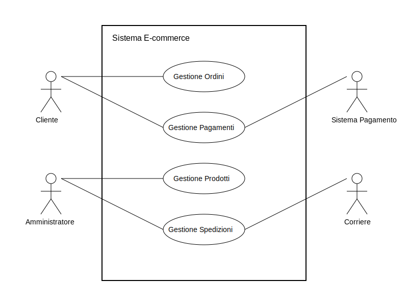
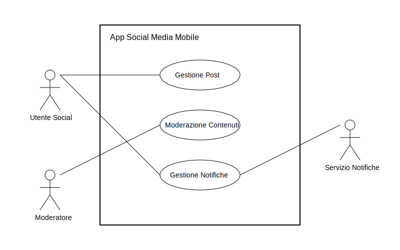
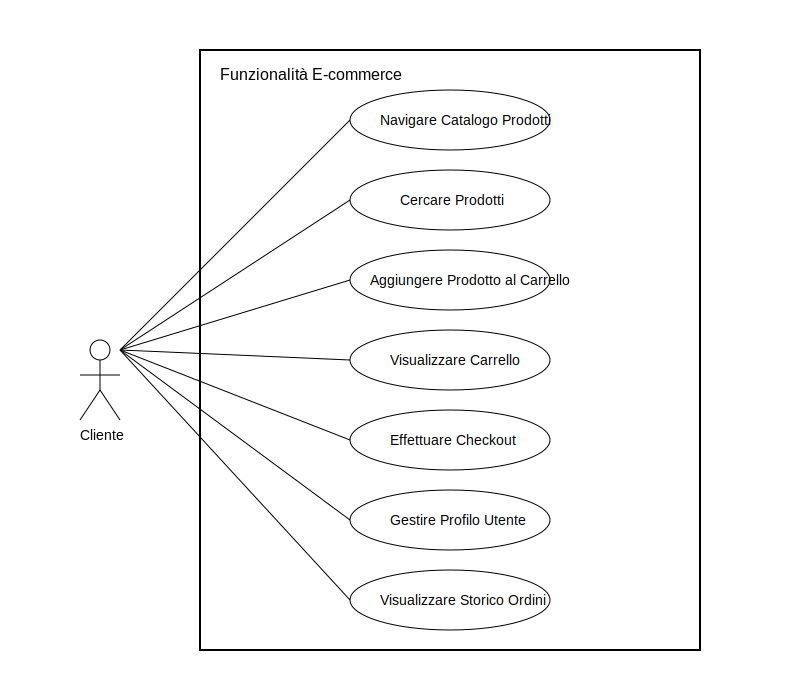
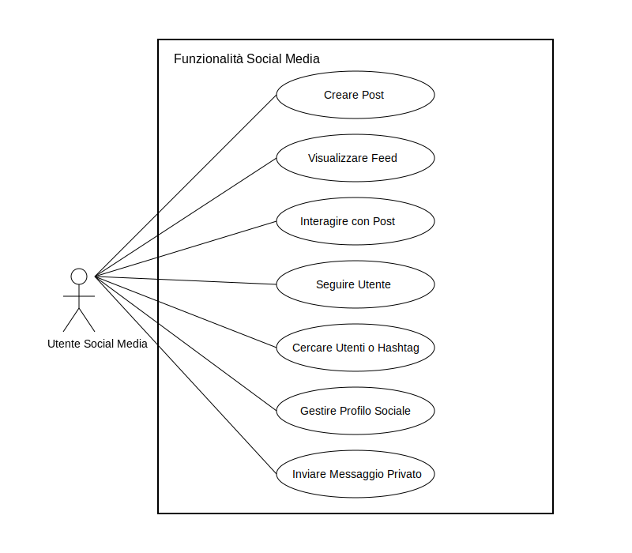

# Introduzione ai Diagrammi UML dei Casi d'Uso

- [Introduzione ai Diagrammi UML dei Casi d'Uso](#introduzione-ai-diagrammi-uml-dei-casi-duso)
  - [Componenti Chiave dei Diagrammi dei Casi d'Uso](#componenti-chiave-dei-diagrammi-dei-casi-duso)
    - [1. Attori (Actors)](#1-attori-actors)
    - [2. Casi d'Uso (Use Cases)](#2-casi-duso-use-cases)
    - [3. Relazioni tra Attori e Casi d'Uso](#3-relazioni-tra-attori-e-casi-duso)
      - [a. Associazione (Association)](#a-associazione-association)
      - [b. Inclusione (Include)](#b-inclusione-include)
      - [c. Estensione (Extend)](#c-estensione-extend)
      - [d. Generalizzazione (Generalization)](#d-generalizzazione-generalization)
  - [Esempi Pratici in Applicazioni Web e Mobile](#esempi-pratici-in-applicazioni-web-e-mobile)
  - [Conclusione](#conclusione)

I **diagrammi dei casi d'uso** (Use Case Diagrams) sono uno strumento fondamentale nella modellazione UML (Unified Modeling Language) per la **raccolta e la specificazione dei requisiti di un sistema software**.  Essi forniscono una visione ad alto livello delle funzionalità del sistema dal punto di vista dell'**utente**.  In altre parole, descrivono cosa il sistema *deve fare* per i suoi utenti.

**Obiettivi principali dei diagrammi dei casi d'uso:**

* **Definire i confini del sistema**: Identificare chiaramente cosa è dentro e cosa è fuori dal sistema in sviluppo.
* **Raccogliere i requisiti funzionali**:  Comprendere le necessità degli utenti e tradurle in funzionalità concrete del sistema.
* **Comunicare con gli stakeholder**: Fornire una rappresentazione visuale e comprensibile delle funzionalità del sistema a tutti gli interessati (clienti, sviluppatori, manager, ecc.).
* **Validare i requisiti**:  Assicurarsi che i requisiti raccolti siano completi, coerenti e soddisfino le esigenze degli utenti.
* **Pianificare lo sviluppo**: Fornire una base per la pianificazione delle attività di sviluppo, identificando le funzionalità principali da implementare.

I diagrammi dei casi d'uso non si concentrano sull'implementazione interna del sistema, ma piuttosto sull'**interazione tra il sistema e gli attori esterni**.  Sono particolarmente utili nelle prime fasi del ciclo di vita dello sviluppo software, durante l'analisi dei requisiti.

## Componenti Chiave dei Diagrammi dei Casi d'Uso

Un diagramma dei casi d'uso è composto da diversi elementi principali:

### 1. Attori (Actors)

Un **attore** rappresenta un'entità esterna al sistema che interagisce con esso.  Un attore può essere:

* **Un utente umano**:  La persona che utilizza il sistema (es: cliente, amministratore, utente generico).
* **Un altro sistema software**: Un sistema esterno che interagisce con il sistema in esame (es: sistema di pagamento esterno, database, servizio web).
* **Un dispositivo hardware**: Un dispositivo fisico che interagisce con il sistema (es: sensore, stampante).
* **Un'organizzazione o un ruolo**:  Un'entità organizzativa che interagisce con il sistema (es: banca, fornitore).

**Caratteristiche degli Attori:**

* Gli attori sono **esterni** al sistema; rappresentano ciò che si trova al di fuori del confine del sistema.
* Un attore interagisce con il sistema per raggiungere un **obiettivo** specifico.
* Un attore può essere **primario** (avvia il caso d'uso per raggiungere un obiettivo) o **secondario** (supporta il sistema nel caso d'uso, ma non lo avvia direttamente).
* Un singolo utente fisico può ricoprire il ruolo di più attori (es: un utente può essere sia "Cliente" che "Venditore" in un sistema di e-commerce).
* È importante identificare gli attori **prima** di definire i casi d'uso, poiché i casi d'uso esistono proprio per fornire valore agli attori.

**Rappresentazione UML degli Attori:**

In UML, un attore viene rappresentato come una **figura stilizzata di un omino**.  Il nome dell'attore viene scritto sotto la figura.

**Esempio di Attori in un'applicazione web di e-commerce:**

* **Cliente**: L'utente che naviga nel sito, cerca prodotti, effettua ordini.
* **Amministratore del Sito**:  Gestisce i prodotti, gli utenti, gli ordini, le configurazioni del sito.
* **Sistema di Pagamento Esterno**:  Gestisce le transazioni di pagamento (es: PayPal, Stripe).
* **Corriere**:  Sistema esterno che gestisce la spedizione degli ordini.

**Diagramma degli Attori (Esempio E-commerce):**

**Esempio di Attori in un'applicazione mobile di social media:**

* **Utente Social Media**: Utilizza l'app per postare contenuti, interagire con altri utenti, visualizzare il feed.
* **Moderatore**:  Gestisce i contenuti inappropriati, gli utenti problematici.
* **Servizio di Notifiche Push**:  Sistema esterno che invia notifiche all'utente (es: Firebase Cloud Messaging, Apple Push Notification Service).

**Diagramma degli Attori (Esempio Social Media Mobile):**

### 2. Casi d'Uso (Use Cases)

Un **caso d'uso** rappresenta una **funzionalità specifica** del sistema, un'azione o un compito che un attore può eseguire per raggiungere un **obiettivo** di valore per sé. In altre parole, un caso d'uso descrive "cosa" il sistema fa per un attore.

**Caratteristiche dei Casi d'Uso:**

* Un caso d'uso è **avviato da un attore** (attore primario).
* Un caso d'uso deve fornire un **valore** all'attore che lo avvia.
* Un caso d'uso descrive un'**interazione completa** tra l'attore e il sistema, dall'inizio alla fine.
* I casi d'uso sono descritti dal punto di vista dell'**attore**, non dal punto di vista del sistema.
* Un caso d'uso dovrebbe essere **autonomo** e rappresentare un'unità di funzionalità significativa.
* I nomi dei casi d'uso sono solitamente espressi come **verbi all'infinito** (es: "Effettuare il login", "Aggiungere prodotto al carrello", "Inviare messaggio").

**Come Identificare i Casi d'Uso:**

Per identificare i casi d'uso, puoi porre le seguenti domande per ogni attore identificato:

* Quali sono gli **obiettivi** che questo attore vuole raggiungere interagendo con il sistema?
* Quali **funzionalità** il sistema deve fornire per permettere all'attore di raggiungere questi obiettivi?
* Quali **compiti** l'attore può svolgere utilizzando il sistema?
* Quali **valori** l'attore ottiene dall'utilizzo del sistema?

**Rappresentazione UML dei Casi d'Uso:**

In UML, un caso d'uso viene rappresentato come un'**ellisse**. Il nome del caso d'uso viene scritto all'interno dell'ellisse.

**Esempi di Casi d'Uso in un'applicazione web di e-commerce (per l'attore "Cliente"):**

* **Navigare Catalogo Prodotti**:  Il cliente può esplorare le categorie e i prodotti disponibili nel sito.
* **Cercare Prodotti**: Il cliente può utilizzare una funzione di ricerca per trovare prodotti specifici.
* **Aggiungere Prodotto al Carrello**: Il cliente può aggiungere prodotti selezionati al proprio carrello.
* **Visualizzare Carrello**: Il cliente può vedere i prodotti attualmente nel suo carrello.
* **Effettuare Checkout**: Il cliente può procedere con l'ordine e il pagamento dei prodotti nel carrello.
* **Gestire Profilo Utente**: Il cliente può visualizzare e modificare le proprie informazioni personali e le impostazioni dell'account.
* **Visualizzare Storico Ordini**: Il cliente può consultare gli ordini effettuati in precedenza.

**Diagramma dei Casi d'Uso (Esempio E-commerce):**

**Esempi di Casi d'Uso in un'applicazione mobile di social media (per l'attore "Utente Social Media"):**

* **Creare Post**: L'utente può scrivere e pubblicare nuovi post (testo, immagini, video).
* **Visualizzare Feed**: L'utente può visualizzare il flusso di contenuti pubblicati dagli utenti che segue.
* **Interagire con Post**: L'utente può mettere "mi piace", commentare, condividere i post.
* **Seguire Utente**: L'utente può iniziare a seguire altri utenti per vedere i loro post nel feed.
* **Cercare Utenti o Hashtag**: L'utente può trovare altri utenti o contenuti specifici utilizzando la ricerca.
* **Gestire Profilo Sociale**: L'utente può modificare le informazioni del proprio profilo, la foto, la bio.
* **Inviare Messaggio Privato**: L'utente può inviare messaggi privati ad altri utenti.

**Diagramma dei Casi d'Uso (Esempio Social Media Mobile):**

### 3. Relazioni tra Attori e Casi d'Uso

Oltre agli attori e ai casi d'uso, i diagrammi dei casi d'uso includono anche delle **relazioni** per mostrare come questi elementi sono collegati tra loro. Le relazioni principali sono:

#### a. Associazione (Association)

La relazione di **associazione** indica la **comunicazione** tra un attore e un caso d'uso.  Rappresenta la partecipazione di un attore in un caso d'uso, indicando che l'attore interagisce con il sistema per eseguire quel caso d'uso.

**Rappresentazione UML dell'Associazione:**

L'associazione è rappresentata da una **linea continua** che collega l'attore al caso d'uso.

**Diagramma di Associazione (Esempio E-commerce):**

Questo diagramma indica che l'attore "Cliente" è associato al caso d'uso "Effettuare Checkout", ovvero il cliente può avviare e partecipare al processo di checkout.

#### b. Inclusione (Include)

La relazione di **inclusione** ("include") indica che un caso d'uso (**caso d'uso base**) **include** o **utilizza** un altro caso d'uso (**caso d'uso incluso**) come parte della sua logica.  L'inclusione serve per **fattorizzare** comportamenti comuni tra più casi d'uso, evitando la duplicazione e migliorando la modularità. Il caso d'uso incluso è **sempre eseguito** come parte del caso d'uso base.

**Rappresentazione UML dell'Inclusione:**

L'inclusione è rappresentata da una **linea tratteggiata con freccia aperta** che punta dal caso d'uso base al caso d'uso incluso.  La relazione è etichettata con la parola **`<<include>>`**.

**Esempio di Inclusione (E-commerce - Caso d'uso "Effettuare Checkout"):**

Il caso d'uso "Effettuare Checkout" potrebbe includere il caso d'uso "Verifica Dati di Pagamento".  Questo perché la verifica dei dati di pagamento è un passo **obbligatorio** durante il checkout e potrebbe essere un caso d'uso riutilizzabile anche in altri contesti (es: per pagamenti in abbonamento).

**Diagramma di Inclusione (Esempio E-commerce):**

#### c. Estensione (Extend)

La relazione di **estensione** ("extend") indica che un caso d'uso (**caso d'uso esteso**) **estende** o **aggiunge** comportamento a un altro caso d'uso (**caso d'uso base**) in **punti di estensione** specifici.  L'estensione è utilizzata per rappresentare comportamenti **opzionali** o **condizionali**. Il caso d'uso esteso viene eseguito **solo se si verifica una certa condizione** o in un punto specifico del caso d'uso base.

**Rappresentazione UML dell'Estensione:**

L'estensione è rappresentata da una **linea tratteggiata con freccia aperta** che punta dal caso d'uso esteso al caso d'uso base.  La relazione è etichettata con la parola **`<<extend>>`**.

**Esempio di Estensione (E-commerce - Caso d'uso "Navigare Catalogo Prodotti"):**

Il caso d'uso "Navigare Catalogo Prodotti" potrebbe essere esteso dal caso d'uso "Filtra Prodotti per Categoria".  Questo perché il filtraggio per categoria è un comportamento **opzionale** durante la navigazione del catalogo; l'utente può scegliere di filtrare o meno. Il punto di estensione potrebbe essere "Dopo aver visualizzato la lista iniziale dei prodotti".

**Diagramma di Estensione (Esempio E-commerce):**

#### d. Generalizzazione (Generalization)

La relazione di **generalizzazione** in UML può essere applicata sia agli **attori** che ai **casi d'uso**.

**d.1. Generalizzazione degli Attori:**

La generalizzazione degli attori indica una **specializzazione** o **ereditarietà** tra attori. Un attore **specializzato** (attore figlio) eredita tutte le associazioni e le generalizzazioni dell'attore **generale** (attore padre) e può avere associazioni e generalizzazioni aggiuntive specifiche.  La generalizzazione degli attori è utile per modellare ruoli più specifici derivati da ruoli più generali.

**Rappresentazione UML della Generalizzazione degli Attori:**

La generalizzazione degli attori è rappresentata da una **linea continua con una freccia triangolare vuota** che punta dall'attore specializzato all'attore generale.

**Esempio di Generalizzazione degli Attori (E-commerce):**

Potremmo avere un attore generale "Cliente".  Da questo, potremmo derivare attori specializzati come "Cliente Registrato" e "Cliente Ospite".  "Cliente Registrato" è una specializzazione di "Cliente" che eredita tutte le interazioni di "Cliente" e può avere funzionalità aggiuntive come "Gestire Profilo Utente" o "Visualizzare Storico Ordini", che non sono disponibili per il "Cliente Ospite".

**Diagramma di Generalizzazione degli Attori (Esempio E-commerce):**

**d.2. Generalizzazione dei Casi d'Uso:**

La generalizzazione dei casi d'uso indica una relazione di **specializzazione** tra casi d'uso. Un caso d'uso **specializzato** (caso d'uso figlio) eredita il comportamento e le associazioni del caso d'uso **generale** (caso d'uso padre) e può estenderlo o specializzarlo ulteriormente.  La generalizzazione dei casi d'uso è utile per modellare variazioni o specializzazioni di funzionalità esistenti.

**Rappresentazione UML della Generalizzazione dei Casi d'Uso:**

La generalizzazione dei casi d'uso è rappresentata da una **linea continua con una freccia triangolare vuota** che punta dal caso d'uso specializzato al caso d'uso generale.

**Esempio di Generalizzazione dei Casi d'Uso (Applicazione di Pagamenti Mobile):**

Potremmo avere un caso d'uso generale "Effettuare Pagamento".  Da questo, potremmo derivare casi d'uso specializzati come "Pagamento con Carta di Credito", "Pagamento con PayPal", "Pagamento con Bonifico Bancario".  Tutti questi casi d'uso specializzati sono variazioni di "Effettuare Pagamento" e ne ereditano il comportamento di base, ma specificano il metodo di pagamento.

**Diagramma di Generalizzazione dei Casi d'Uso (Esempio Pagamenti Mobile):**

## Esempi Pratici in Applicazioni Web e Mobile

I diagrammi dei casi d'uso sono applicabili sia nello sviluppo di applicazioni web che mobile. Ecco alcuni esempi per consolidare i concetti:

**Applicazione Web - Gestione di un Blog:**

* **Attori**: Autore del Blog, Visitatore, Amministratore
* **Casi d'Uso (per Autore del Blog)**: Scrivere Articolo, Modificare Articolo, Pubblicare Articolo, Gestire Commenti, Gestire Categorie
* **Casi d'Uso (per Visitatore)**: Visualizzare Articoli, Cercare Articoli, Inserire Commento
* **Casi d'Uso (per Amministratore)**: Gestire Utenti, Configurare il Blog, Effettuare Backup

**Applicazione Mobile - Prenotazione Ristoranti:**

* **Attori**: Utente App, Gestore Ristorante, Sistema di Pagamento
* **Casi d'Uso (per Utente App)**: Cercare Ristoranti, Visualizzare Dettagli Ristorante, Prenotare Tavolo, Cancellare Prenotazione, Valutare Ristorante, Gestire Profilo Utente
* **Casi d'Uso (per Gestore Ristorante)**: Gestire Tavoli, Confermare Prenotazioni, Visualizzare Valutazioni, Gestire Menu
* **Casi d'Uso (per Sistema di Pagamento)**: Elaborare Pagamento (per eventuali pre-pagamenti o caparre)

## Conclusione

I diagrammi UML dei casi d'uso sono uno strumento potente per la modellazione dei requisiti software.  Forniscono una visione chiara e concisa delle funzionalità del sistema dal punto di vista degli utenti, facilitando la comunicazione, la validazione dei requisiti e la pianificazione dello sviluppo. Comprendere i componenti chiave (attori, casi d'uso, relazioni) e le diverse tipologie di relazioni (associazione, include, extend, generalizzazione) è fondamentale per creare diagrammi efficaci e utili. Spero che questa introduzione dettagliata e ricca di esempi ti sia stata d'aiuto!  Se hai altre domande, non esitare a chiedere.