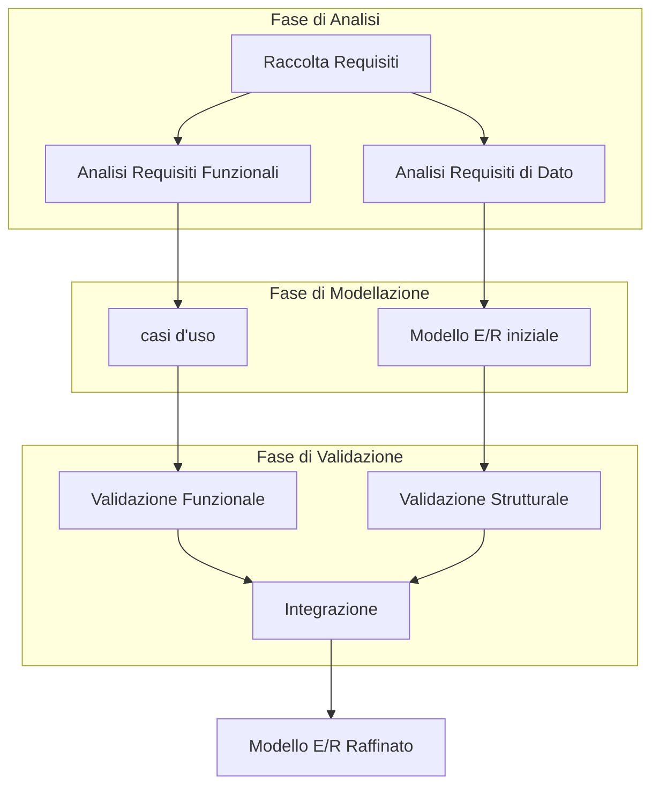
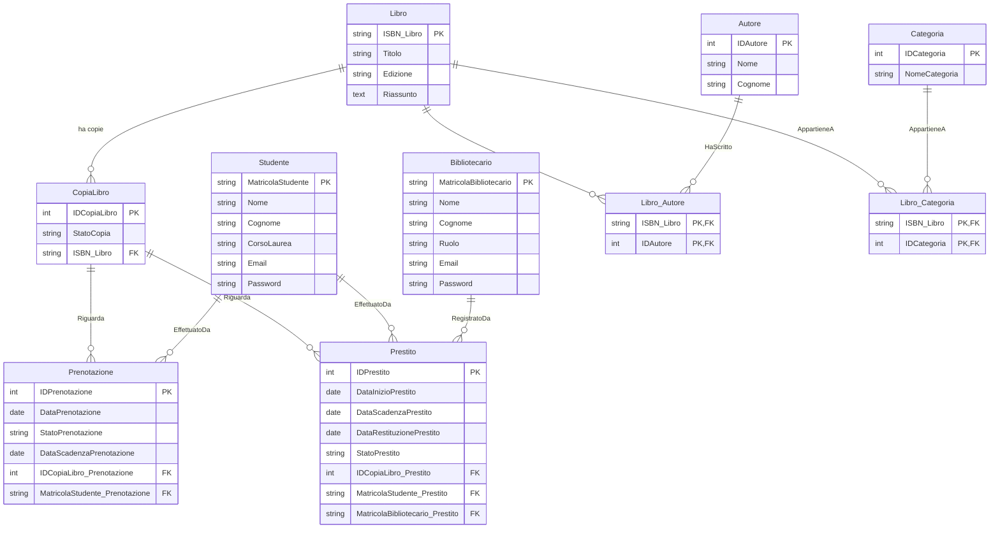
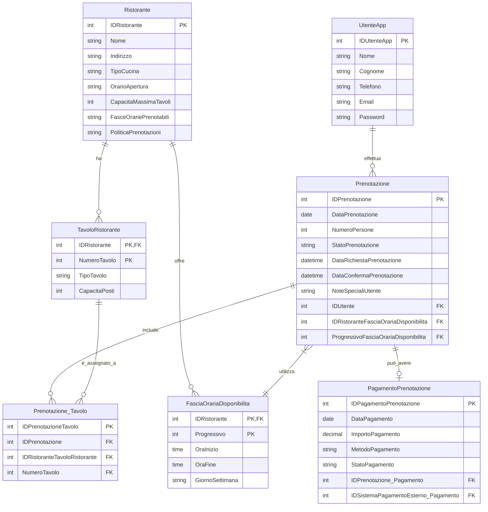
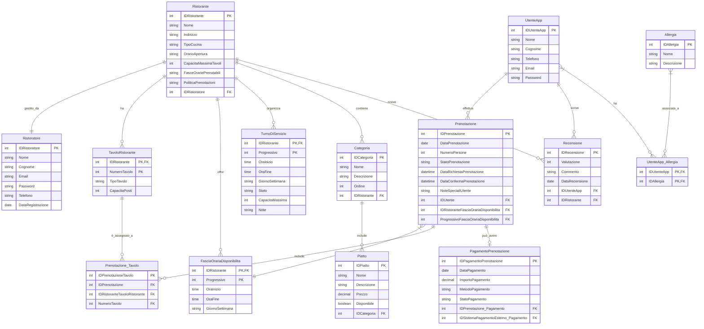

# Casi d'Uso, Progettazione Concettuale e Logica

- [Casi d'Uso, Progettazione Concettuale e Logica](#casi-duso-progettazione-concettuale-e-logica)
  - [Collegamento tra casi d'uso, analisi dei requisiti e progettazione concettuale](#collegamento-tra-casi-duso-analisi-dei-requisiti-e-progettazione-concettuale)
  - [Fase di analisi dei requisiti: Il ruolo dei casi d'uso](#fase-di-analisi-dei-requisiti-il-ruolo-dei-casi-duso)
  - [Come i casi d'Uso aiutano nell'analisi dei vincoli](#come-i-casi-duso-aiutano-nellanalisi-dei-vincoli)
  - [Progettazione concettuale e modello Entity/Relationship (E/R)](#progettazione-concettuale-e-modello-entityrelationship-er)
  - [Il Legame diretto tra casi d'uso e modello E/R](#il-legame-diretto-tra-casi-duso-e-modello-er)
  - [Processo Metodologico: Dai casi d'uso al Modello E/R](#processo-metodologico-dai-casi-duso-al-modello-er)
  - [Esempio semplificato: Applicazione Mobile di Prenotazione Ristoranti](#esempio-semplificato-applicazione-mobile-di-prenotazione-ristoranti)
  - [Esempio completo: Sistema di Gestione di una Biblioteca Universitaria](#esempio-completo-sistema-di-gestione-di-una-biblioteca-universitaria)
    - [Documento di Specifica Testuale (Traccia)](#documento-di-specifica-testuale-traccia)
    - [Analisi dei Requisiti Funzionali e di Dato](#analisi-dei-requisiti-funzionali-e-di-dato)
      - [Requisiti Funzionali](#requisiti-funzionali)
      - [Requisiti di Dato](#requisiti-di-dato)
    - [Definizione dei casi d'uso](#definizione-dei-casi-duso)
      - [Attori](#attori)
      - [Casi d'uso per Studente](#casi-duso-per-studente)
      - [Casi d'uso per Bibliotecario](#casi-duso-per-bibliotecario)
      - [Diagramma dei casi d'uso Iniziale](#diagramma-dei-casi-duso-iniziale)
    - [Modello E/R Iniziale (Progettazione Concettuale)](#modello-er-iniziale-progettazione-concettuale)
      - [Entità Iniziali](#entità-iniziali)
      - [Relazioni Iniziali](#relazioni-iniziali)
      - [Diagramma E/R Iniziale](#diagramma-er-iniziale)
    - [Integrazione e Raffinamento del Modello E/R](#integrazione-e-raffinamento-del-modello-er)
    - [Modello E/R Raffinato](#modello-er-raffinato)
      - [Entità Raffinate](#entità-raffinate)
      - [Relazioni Raffinate ( con regole di lettura)](#relazioni-raffinate--con-regole-di-lettura)
      - [Diagramma E/R Raffinato](#diagramma-er-raffinato)
    - [Progettazione logica database "Biblioteca Universitaria"](#progettazione-logica-database-biblioteca-universitaria)
      - [Schema Relazionale (progetto logico)](#schema-relazionale-progetto-logico)
        - [Mapping da E/R raffinato a modello logico](#mapping-da-er-raffinato-a-modello-logico)
        - [Rappresentazione grafica del modello logico](#rappresentazione-grafica-del-modello-logico)
        - [Tabelle per la gestione degli utenti (progetto fisico)](#tabelle-per-la-gestione-degli-utenti-progetto-fisico)
        - [Salvataggio delle password](#salvataggio-delle-password)
        - [Visualizzazione di views, trigger, stored procedure in MariaDB](#visualizzazione-di-views-trigger-stored-procedure-in-mariadb)
      - [Conclusioni](#conclusioni)
      - [Note sulla Progettazione](#note-sulla-progettazione)
  - [Esempio completo: "Prenota il tuo tavolo con app"](#esempio-completo-prenota-il-tuo-tavolo-con-app)
  - [E/R Iniziale](#er-iniziale)
  - [Raffinamento delle Entità e del Modello E/R](#raffinamento-delle-entità-e-del-modello-er)
    - [Mapping dal modello E/R ristrutturato al modello logico](#mapping-dal-modello-er-ristrutturato-al-modello-logico)
    - [Conclusione](#conclusione)
  - [Esempio completo: web app per prenotazioni al ristorante](#esempio-completo-web-app-per-prenotazioni-al-ristorante)
    - [Traccia di Input](#traccia-di-input)
    - [Casi d'uso](#casi-duso)
      - [Caso d'uso: UC1 - Cerca Ristorante](#caso-duso-uc1---cerca-ristorante)
      - [Caso d'uso: UC2 - Effettua Prenotazione](#caso-duso-uc2---effettua-prenotazione)
      - [Caso d'uso: UC3 - Gestisce Disponibilità](#caso-duso-uc3---gestisce-disponibilità)
      - [Caso d'uso: UC4 - Autentica Utente](#caso-duso-uc4---autentica-utente)
      - [Caso d'uso: UC5 - Verifica Disponibilità](#caso-duso-uc5---verifica-disponibilità)
      - [Caso d'uso: UC6 - Invia Conferma](#caso-duso-uc6---invia-conferma)
      - [Caso d'uso: UC7 - Gestisce Pagamento](#caso-duso-uc7---gestisce-pagamento)
    - [Modello E/R Iniziale (Progettazione Concettuale - prenotazioni ristorante)](#modello-er-iniziale-progettazione-concettuale---prenotazioni-ristorante)
      - [Diagramma E/R Iniziale - prenotazioni ristorante](#diagramma-er-iniziale---prenotazioni-ristorante)
    - [Integrazione e Raffinamento del Modello E/R - prenotazioni ristorante](#integrazione-e-raffinamento-del-modello-er---prenotazioni-ristorante)
    - [Modello E/R Raffinato - prenotazioni ristorante](#modello-er-raffinato---prenotazioni-ristorante)
      - [Entità Raffinate aggiuntive - prenotazioni ristorante](#entità-raffinate-aggiuntive---prenotazioni-ristorante)
      - [Relazioni Raffinate aggiuntive - prenotazioni ristorante](#relazioni-raffinate-aggiuntive---prenotazioni-ristorante)
      - [Modello logico - prenotazioni ristorante](#modello-logico---prenotazioni-ristorante)
    - [Schema Logico SQL (MariaDB) - prenotazioni ristorante](#schema-logico-sql-mariadb---prenotazioni-ristorante)

## Collegamento tra casi d'uso, analisi dei requisiti e progettazione concettuale

I **diagrammi dei casi d'uso** sono nati proprio per essere un ponte tra le esigenze degli stakeholder (utenti, clienti, esperti di dominio, ecc.) e la progettazione tecnica di un sistema informativo. Essi si inseriscono perfettamente nella fase di **analisi dei requisiti** e preparano il terreno per la **progettazione concettuale**.

## Fase di analisi dei requisiti: Il ruolo dei casi d'uso

La fase di analisi dei requisiti è il momento in cui si cerca di comprendere a fondo **cosa deve fare il sistema**. Si raccolgono informazioni dalle diverse fonti, si identificano le esigenze degli utenti, si definiscono le funzionalità attese e si prendono in considerazione i **vincoli** (tecnici, economici, di tempo, di sicurezza, legali, ecc.).

I casi d'uso sono uno strumento **potente e versatile** per questa fase perché:

1. **Focalizzazione sull'utente**: I casi d'uso sono centrati sull'utente (attore) e sul valore che il sistema deve fornirgli. Questo aiuta a mantenere l'attenzione sulle **vere esigenze** e non perdersi in dettagli implementativi prematuri.
2. **Comunicazione efficace**: I diagrammi dei casi d'uso sono facilmente comprensibili da persone con background diversi (tecnici e non tecnici). Sono un ottimo strumento per la **comunicazione e la validazione** dei requisiti con gli stakeholder.
3. **Strutturazione dei requisiti funzionali**: I casi d'uso organizzano i requisiti funzionali in unità discrete e significative (i casi d'uso stessi). Questo facilita la **gestione della complessità** e la suddivisione del lavoro.
4. **Identificazione dei confini del sistema**: La distinzione tra attori (esterni) e sistema (interno) aiuta a **definire i confini** del sistema in modo chiaro.
5. **Base per la progettazione**: I casi d'uso non sono solo un documento statico di requisiti. Essi forniscono una solida **base per le fasi di progettazione** successive, inclusa la progettazione concettuale.

## Come i casi d'Uso aiutano nell'analisi dei vincoli

Oltre ai requisiti funzionali, è fondamentale considerare i **vincoli**. I casi d'uso possono aiutare anche in questo aspetto:

* **Vincoli di performance/scalabilità**: Alcuni casi d'uso, come "Gestire un elevato numero di transazioni simultanee" (per un sistema di e-commerce) o "Elaborare dati in tempo reale" (per un'applicazione di monitoraggio), possono evidenziare vincoli di performance e scalabilità che devono essere presi in considerazione nella progettazione.
* **Vincoli di sicurezza**: Casi d'uso come "Autenticare Utente", "Autorizzare Accesso a Risorse", "Proteggere dati sensibili" fanno emergere i requisiti di sicurezza e i vincoli correlati (es: protocolli di sicurezza da utilizzare, politiche di accesso).
* **Vincoli di usabilità**: I casi d'uso descrivono le interazioni utente-sistema. Una buona analisi dei casi d'uso, magari con l'aiuto di prototipi o storyboard, può far emergere vincoli di usabilità, come la necessità di interfacce intuitive, accessibilità per utenti con disabilità, ecc.
* **Vincoli tecnici e piattaforma**: La scelta delle tecnologie e della piattaforma può essere influenzata dai casi d'uso. Ad esempio, se ci sono molti casi d'uso che richiedono elaborazioni intensive lato server, si potrebbe optare per architetture cloud-based o tecnologie server-side specifiche. Se l'applicazione deve essere disponibile su dispositivi mobili, i casi d'uso influenzeranno la progettazione dell'interfaccia utente mobile-first.
* **Vincoli di budget e tempi**: La priorità e la complessità dei casi d'uso possono influenzare la pianificazione dei costi e dei tempi di sviluppo. Casi d'uso critici o complessi potrebbero richiedere più risorse e tempo.

## Progettazione concettuale e modello Entity/Relationship (E/R)

Una volta definiti i casi d'uso e compresi i requisiti e i vincoli, si passa alla **progettazione concettuale**. Questa fase si concentra sulla definizione **dell'architettura dei dati** del sistema, ovvero su **quali dati** il sistema deve gestire, **come sono strutturati** e **quali relazioni** esistono tra loro.

La tecnica più diffusa per la progettazione concettuale di basi di dati è il modello **Entity/Relationship (E/R)**. Il modello E/R fornisce una rappresentazione grafica e concettuale dei dati attraverso:

* **Entità**: Rappresentano "cose" o "concetti" del mondo reale di cui si vogliono memorizzare informazioni (es: Cliente, Prodotto, Ordine, Articolo del Blog, Prenotazione). Sono i **sostantivi** del sistema informativo.
* **Attributi**: Sono le **caratteristiche** o **proprietà** delle entità (es: per l'entità "Cliente", gli attributi potrebbero essere Nome, Cognome, Indirizzo, Email).
* **Relazioni**: Descrivono le **associazioni** o **legami** tra le entità (es: un "Cliente" *effettua* uno o più "Ordini"; un "Ordine" *contiene* uno o più "Prodotti"). Sono i **verbi** che collegano le entità.

## Il Legame diretto tra casi d'uso e modello E/R

Ecco come i casi d'uso guidano la creazione del modello E/R:

1. **Identificazione delle entità dai nomi e dai verbi nei casi d'uso**: I **nomi** che compaiono nella descrizione dei casi d'uso (attori, oggetti manipolati) spesso suggeriscono le **entità** principali del sistema. I **verbi** che descrivono le azioni nei casi d'uso possono indicare le **relazioni** tra queste entità.

	 * **Esempio caso d'uso (E-commerce):** "Cliente *effettua* un *Ordine* e *aggiunge* *Prodotti* al *Carrello*".
		 * **Entità suggerite**: Cliente, Ordine, Prodotto, Carrello
		 * **Relazioni suggerite**: Cliente - Ordine ("effettua"), Ordine - Prodotto ("contiene"), Cliente - Carrello ("possiede", implicitamente)

2. **Analisi dei flussi dei Casi d'uso per Scoprire gli Attributi**: La descrizione dettagliata dei **flussi principali e alternativi** di un caso d'uso spesso rivela quali **informazioni** sono necessarie per eseguire il caso d'uso stesso. Queste informazioni diventano candidati per gli **attributi** delle entità.

	 * **Esempio Caso d'uso: "Effettuare Checkout"**:
		 * Flusso principale: Cliente inserisce *dati di spedizione*, *dati di pagamento*, *conferma ordine*. Sistema *verifica dati di pagamento*, *crea ordine*, *invia email di conferma*.
		 * **Attributi potenziali**: Per l'entità "Ordine": DataOrdine, IndirizzoSpedizione, TotaleOrdine, MetodoPagamento, StatoOrdine. Per l'entità "Cliente": IndirizzoFatturazione, DatiCartaCredito (se gestiti direttamente, altrimenti riferimento a sistema esterno).

3. **Relazioni tra casi d'uso e Cardinalità delle Relazioni E/R**: Le **relazioni** tra i casi d'uso (include, extend, generalizzazione) possono riflettersi nelle **cardinalità** delle relazioni del modello E/R. Ad esempio, se un caso d'uso "Effettuare Checkout" *include* "Verifica Dati di Pagamento", questo suggerisce una dipendenza tra i dati dell'ordine e i dati di pagamento, che potrebbe influenzare la progettazione delle relazioni E/R (anche se più a livello logico/fisico che concettuale). Più direttamente, le associazioni tra attori e casi d'uso non si traducono direttamente in relazioni E/R, ma aiutano a capire *chi* interagisce con *quali* dati.

4. **Vincoli emersi dai casi d'uso e Vincoli nel Modello E/R**: I vincoli identificati durante l'analisi dei casi d'uso (performance, sicurezza, usabilità, ecc.) possono influenzare le decisioni di progettazione del modello E/R, sebbene non siano direttamente rappresentati nel diagramma E/R concettuale. Ad esempio, vincoli di performance potrebbero portare a scelte di denormalizzazione (a livelli successivi di progettazione logica e fisica) o a ottimizzazioni nell'accesso ai dati, che sono indirettamente influenzate dal modello concettuale. Vincoli di sicurezza possono influenzare la scelta di quali dati criptare, quali informazioni tenere separate, ecc., influenzando la granularità delle entità e delle relazioni.

## Processo Metodologico: Dai casi d'uso al Modello E/R

Un tipico flusso metodologico che collega i casi d'uso alla progettazione concettuale con E/R potrebbe essere:

1. **Raccolta dei Requisiti e Identificazione degli Attori**: Incontri con gli stakeholder, interviste, workshop, analisi di documenti esistenti per comprendere le esigenze e identificare gli attori principali.
2. **Definizione dei casi d'uso**: Per ogni attore, identificare i casi d'uso principali, ovvero le funzionalità che il sistema deve fornire per soddisfare gli obiettivi dell'attore. Descrivere brevemente ogni caso d'uso (nome, attore primario, breve descrizione, precondizioni, postcondizioni, flusso principale, flussi alternativi). Disegnare il diagramma dei casi d'uso per avere una visione d'insieme.
3. **Analisi Dettagliata dei casi d'uso**: Per ogni caso d'uso, approfondire i flussi, identificare i dati manipolati, le informazioni necessarie, i vincoli specifici (performance, sicurezza, ecc.). Spesso si utilizza una *descrizione testuale* più dettagliata del caso d'uso (scenario).
4. **Estrazione delle Entità, Attributi e Relazioni dai casi d'uso**: Analizzare i nomi, i verbi, i flussi e i dati menzionati nelle descrizioni dei casi d'uso per identificare le entità principali, i loro attributi e le relazioni tra loro. Creare una prima bozza del diagramma E/R.
5. **Raffinamento e Validazione del Modello E/R**: Rivedere e raffinare il modello E/R, normalizzare le entità (per ridurre la ridondanza), definire i tipi di dati, le chiavi primarie, le chiavi esterne, le cardinalità delle relazioni, etc. Validare il modello E/R con gli stakeholder, magari ripercorrendo i casi d'uso e verificando se il modello dati supporta correttamente le funzionalità descritte. Iterare se necessario.
6. **Documentazione del Modello E/R**: Documentare il modello E/R in modo chiaro e completo, includendo la descrizione delle entità, degli attributi, delle relazioni e dei vincoli di integrità.



## Esempio semplificato: Applicazione Mobile di Prenotazione Ristoranti

Riprendiamo l'esempio dell'applicazione mobile di prenotazione ristoranti.

* **Caso d'uso:** "Prenotare Tavolo" (per l'attore "Utente App").
	* Descrizione semplificata del flusso principale: Utente seleziona *ristorante*, *data*, *ora*, *numero di persone*. Sistema verifica disponibilità, richiede *dati utente* (nome, telefono), conferma prenotazione.
	* Dati impliciti: Ristorante (nome, indirizzo, cucina, orari, capacità tavoli), Prenotazione (data, ora, numero persone, stato), Utente (nome, telefono).

* **Entità E/R Emergenti:**
	* **Ristorante**: Attributi: Nome, Indirizzo, TipoCucina, OrarioApertura, CapacitàMassimaTavoli.
	* **Prenotazione**: Attributi: DataPrenotazione, OraPrenotazione, NumeroPersone, StatoPrenotazione.
	* **Utente**: Attributi: Nome, Telefono.

* **Relazioni E/R Emergenti:**
	* Ristorante **ha** (uno a molti) Prenotazioni.
	* Utente **effettua** (uno a molti) Prenotazioni.

Questo è un esempio molto semplificato, ma illustra come l'analisi di un singolo caso d'uso può iniziare a far emergere gli elementi del modello E/R. Analizzando tutti i casi d'uso principali per tutti gli attori, si può costruire un modello E/R più completo e robusto.

## Esempio completo: Sistema di Gestione di una Biblioteca Universitaria

### Documento di Specifica Testuale (Traccia)

Immaginiamo di dover progettare un sistema informativo per una biblioteca universitaria. Ecco una specifica testuale semplificata:

"Il sistema deve gestire le operazioni di una biblioteca universitaria. Gli utenti principali sono gli **Studenti** e i **Bibliotecari**.

Gli **Studenti** devono poter:

* **Consultare il catalogo** dei libri disponibili, cercando per titolo, autore, ISBN, o parola chiave.
* **Visualizzare i dettagli** di un libro (titolo, autore, edizione, riassunto, disponibilità, ecc.).
* **Prendere in prestito** libri disponibili.
* **Restituire** libri presi in prestito.
* **Prenotare** libri non disponibili al momento.
* **Visualizzare la propria situazione prestiti** (libri in prestito, scadenze, prenotazioni).
* **Gestire il proprio profilo utente** (modificare email, password, ecc.).

I **Bibliotecari** devono poter:

* **Gestire il catalogo dei libri**:
	* **Aggiungere** nuovi libri (inserendo titolo, autore, ISBN, edizione, categoria, riassunto, numero di copie, ecc.).
	* **Modificare** le informazioni dei libri esistenti.
	* **Eliminare** libri dal catalogo.
	* **Ricercare** libri nel catalogo.
* **Gestire i prestiti**:
	* **Registrare un prestito** (associando uno studente a un libro).
	* **Registrare una restituzione**.
	* **Visualizzare lo storico dei prestiti** per libro e per studente.
	* **Gestire le prenotazioni**: visualizzare le prenotazioni, gestire l'assegnazione dei libri prenotati quando diventano disponibili.
* **Gestire gli utenti** (Studenti e Bibliotecari):
	* **Registrare nuovi studenti** (dati personali, matricola, corso di laurea, ecc.).
	* **Registrare nuovi bibliotecari** (dati personali, matricola, ruolo, ecc.).
	* **Modificare i dati degli utenti**.
	* **Eliminare utenti** (con attenzione alla gestione dei prestiti pendenti).
* **Generare report**:
	* **Libri più prestati**.
	* **Libri in ritardo di restituzione**.
	* **Situazione prestiti per studente**.

Il sistema deve tenere traccia delle **categorie** dei libri e degli **autori**. Ogni libro appartiene a una o più categorie e può avere uno o più autori. Il sistema deve gestire la **disponibilità** delle copie dei libri. Devono essere gestite le **scadenze** dei prestiti e le eventuali **penalità** per i ritardi (anche se la specifica non dettaglia le penalità, dobbiamo considerare la gestione delle scadenze).

Il sistema dovrà essere accessibile tramite un'**interfaccia web**."

### Analisi dei Requisiti Funzionali e di Dato

#### Requisiti Funzionali

(dedotti dalla specifica testuale)

* **Gestione Catalogo Libri**: Aggiungere, modificare, eliminare, ricercare, visualizzare dettagli libri, navigare per categorie.
* **Gestione Prestiti**: Prestito libri, restituzione libri, prenotazione libri, visualizzazione storico prestiti, gestione disponibilità libri, gestione scadenze.
* **Gestione Utenti**: Registrazione studenti, registrazione bibliotecari, modifica dati utenti, eliminazione utenti, visualizzazione situazione prestiti per studente, gestione profili utenti.
* **Reporting**: Generazione report su libri più prestati, libri in ritardo, situazione prestiti studenti.
* **Autenticazione e Autorizzazione**: Implicita necessità di autenticazione per studenti e bibliotecari per accedere alle funzionalità appropriate. Autorizzazione per definire quali azioni possono essere fatte da quali utenti (es: solo bibliotecari possono gestire il catalogo).
* **Interfaccia Web**: Accesso al sistema tramite browser web.

#### Requisiti di Dato

(entità e informazioni da gestire, dedotte dalla specifica testuale)

* **Libro**: Titolo, Autore, ISBN, Edizione, Categoria, Riassunto, NumeroCopie, Disponibilità.
* **Autore**: Nome, Cognome, (potrebbe servire ID Autore).
* **Categoria**: NomeCategoria (potrebbe servire ID Categoria).
* **Studente**: Nome, Cognome, Matricola, CorsoLaurea, Email, Password, (altri dati personali?).
* **Bibliotecario**: Nome, Cognome, Matricola, Ruolo, Email, Password, (altri dati personali?).
* **Prestito**: DataInizioPrestito, DataScadenzaPrestito, DataRestituzione (null se non restituito), StatoPrestito (in corso, restituito, scaduto).
* **Prenotazione**: DataPrenotazione, StatoPrenotazione (in attesa, confermata, cancellata, completata).

### Definizione dei casi d'uso

Identifichiamo gli **Attori** e i **casi d'uso** per ciascun attore, basandoci sui requisiti funzionali:

#### Attori

* **Studente**
* **Bibliotecario**

#### Casi d'uso per Studente

* **CU1: Consultare Catalogo Libri**
* **CU2: Visualizzare Dettagli Libro**
* **CU3: Prendere in Prestito Libro**
* **CU4: Restituire Libro**
* **CU5: Prenotare Libro**
* **CU6: Visualizzare Situazione Prestiti**
* **CU7: Gestire Profilo Utente** (Modificare Password, Email)

#### Casi d'uso per Bibliotecario

* **CU8: Gestire Catalogo Libri** (Caso d'uso genitore che include i seguenti):
	* **CU8.1: Aggiungere Libro**
	* **CU8.2: Modificare Libro**
	* **CU8.3: Eliminare Libro**
	* **CU8.4: Ricercare Libro**
* **CU9: Gestire Prestiti** (Caso d'uso genitore che include i seguenti):
	* **CU9.1: Registrare Prestito**
	* **CU9.2: Registrare Restituzione**
	* **CU9.3: Visualizzare Storico Prestiti**
* **CU10: Gestire Prenotazioni** (Visualizzare prenotazioni, assegnare libri prenotati)
* **CU11: Gestire Utenti** (Caso d'uso genitore che include i seguenti):
	* **CU11.1: Registrare Studente**
	* **CU11.2: Registrare Bibliotecario**
	* **CU11.3: Modificare Utente**
	* **CU11.4: Eliminare Utente**
* **CU12: Generare Report** (Caso d'uso genitore che include i seguenti):
	* **CU12.1: Generare Report Libri Più Prestati**
	* **CU12.2: Generare Report Libri in Ritardo**
	* **CU12.3: Generare Report Situazione Prestiti Studente**

#### Diagramma dei casi d'uso Iniziale


### Modello E/R Iniziale (Progettazione Concettuale)

Basandoci sui requisiti di dato e sui casi d'uso, iniziamo a definire un modello E/R iniziale.

#### Entità Iniziali

* **Libro**: (ISBN, Titolo, Edizione, Riassunto, NumeroCopie)
* **Autore**: (IDAutore, Nome, Cognome)
* **Categoria**: (IDCategoria, NomeCategoria)
* **Studente**: (MatricolaStudente, Nome, Cognome, CorsoLaurea, Email, Password)
* **Bibliotecario**: (MatricolaBibliotecario, Nome, Cognome, Ruolo, Email, Password)
* **Prestito**: (IDPrestito, DataInizio, DataScadenza, DataRestituzione, Stato)
* **Prenotazione**: (IDPrenotazione, DataPrenotazione, Stato)

#### Relazioni Iniziali

* **Libro - Autore**: Un Libro *può essere scritto da* uno o più Autori. Un Autore *può scrivere* uno o più Libri. (Relazione Molti-a-Molti)
* **Libro - Categoria**: Un Libro *appartiene a* una o più Categorie. Una Categoria *può contenere* molti Libri. (Relazione Molti-a-Molti)
* **Prestito - Libro**: Un Prestito *riguarda* un Libro. Un Libro *può essere oggetto di* molti Prestiti. (Relazione Uno-a-Molti)
* **Prestito - Studente**: Un Prestito *è effettuato da* uno Studente. Uno Studente *può effettuare* molti Prestiti. (Relazione Uno-a-Molti)
* **Prenotazione - Libro**: Una Prenotazione *riguarda* un Libro. Un Libro *può essere oggetto di* molte Prenotazioni. (Relazione Uno-a-Molti)
* **Prenotazione - Studente**: Una Prenotazione *è effettuata da* uno Studente. Uno Studente *può effettuare* molte Prenotazioni. (Relazione Uno-a-Molti)

#### Diagramma E/R Iniziale


### Integrazione e Raffinamento del Modello E/R

Rivediamo il modello E/R iniziale e i casi d'uso per individuare possibili miglioramenti e raffinamenti:

* **Gestione della Disponibilità dei Libri**: L'attributo `NumeroCopie` in `Libro` è insufficiente per tracciare la disponibilità reale. Dobbiamo distinguere tra il *libro* come entità concettuale e le *copie fisiche* del libro. Introduciamo l'entità **CopiaLibro** che rappresenta una singola copia fisica di un libro.

	* **Nuova Entità: CopiaLibro**: (IDCopiaLibro, StatoCopia (disponibile, prestata, in riparazione, ecc.)). La chiave primaria `ISBN` in `Libro` ora identifica il libro *concettuale*, mentre `IDCopiaLibro` identifica una specifica copia fisica.
	* **Relazione Libro - CopiaLibro**: Un Libro *ha* una o più CopieLibro. Una CopiaLibro *è una copia di* un Libro. (Relazione Uno-a-Molti, Chiave esterna ISBN in CopiaLibro).
	* La relazione Prestito ora riguarderà `CopiaLibro` invece di `Libro`. Analogamente per Prenotazione.

* **Dettagli su Autori e Categorie**: Potremmo voler aggiungere più informazioni sugli autori (es: biografia, data di nascita) e sulle categorie (es: descrizione della categoria, categoria genitore per gerarchie). Per ora, manteniamo la semplicità, ma è un punto da considerare per future espansioni.
* **Attributi di Prestito e Prenotazione**: L'entità `Prestito` potrebbe beneficiare di un attributo per registrare il bibliotecario che ha effettuato il prestito. Per la `Prenotazione`, potrebbe essere utile aggiungere una data di scadenza della prenotazione (oltre la quale la prenotazione decade se il libro è disponibile e non ritirato).
* **Gestione Chiavi Primarie e Straniere**: Esplicitiamo meglio le chiavi primarie PK. Usiamo nomi più descrittivi per le chiavi.
* **Cardinalità delle Relazioni**: Rivediamo le cardinalità. Confermiamo che le relazioni Molti-a-Molti tra Libro-Autore e Libro-Categoria sono corrette (un libro può avere più autori e appartenere a più categorie, e un autore può aver scritto più libri, una categoria può contenere più libri). Le relazioni uno-a-molti Libro-CopiaLibro, Prestito-CopiaLibro, Prestito-Studente, Prenotazione-CopiaLibro, Prenotazione-Studente sembrano corrette.

### Modello E/R Raffinato

Applichiamo i raffinamenti al modello E/R.

#### Entità Raffinate

* **Libro**: (ISBN_Libro PK, Titolo, Edizione, Riassunto)
* **CopiaLibro**: (IDCopiaLibro PK, StatoCopia)
* **Autore**: (IDAutore PK, Nome, Cognome)
* **Categoria**: (IDCategoria PK, NomeCategoria)
* **Studente**: (MatricolaStudente PK, Nome, Cognome, CorsoLaurea, Email, Password)
* **Bibliotecario**: (MatricolaBibliotecario PK, Nome, Cognome, Ruolo, Email, Password)
* **Prestito**: (IDPrestito PK, DataInizioPrestito, DataScadenzaPrestito, DataRestituzionePrestito, StatoPrestito)
* **Prenotazione**: (IDPrenotazione PK, DataPrenotazione, StatoPrenotazione, DataScadenzaPrenotazione)

#### Relazioni Raffinate ( con regole di lettura)

* **Libro - Autore**: (Molti-a-Molti, invariata)
* **Libro - Categoria**: (Molti-a-Molti, invariata)
* **Libro - CopiaLibro**: Libro *ha* CopieLibro, CopiaLibro *è copia di* Libro (Uno-a-Molti)
* **Prestito - CopiaLibro**: Prestito *riguarda* CopiaLibro, CopiaLibro *può essere oggetto di* Prestiti (Uno-a-Molti)
* **Prestito - Studente**: Prestito *effettuato da* Studente, Studente *effettua* Prestiti (Uno-a-Molti)
* **Prestito - Bibliotecario**: Prestito *registrato da* Bibliotecario, Bibliotecario *registra* Prestiti (Uno-a-Molti)
* **Prenotazione - CopiaLibro**: Prenotazione *riguarda* CopiaLibro, CopiaLibro *può essere oggetto di* Prenotazioni (Uno-a-Molti)
* **Prenotazione - Studente**: Prenotazione *effettuata da* Studente, Studente *effettua* Prenotazioni (Uno-a-Molti)

#### Diagramma E/R Raffinato


### Progettazione logica database "Biblioteca Universitaria"

#### Schema Relazionale (progetto logico)

Applicando le regole di mapping della progettazione logica si ottiene il modello logico descritto dalle seguenti relazioni.

##### Mapping da E/R raffinato a modello logico

Si riportano di seguito le relazioni dedotte dal modello E/R ristrutturato (mapping) con le associazioni *molti a molti* **ScrittoDa** e **AppartieneA** vengono rispettivamente rinominate in **Libro_Autore** e **Libro_Catalogo**.

* **Libro**: (ISBN_Libro PK, Titolo, Edizione, Riassunto)
* **CopiaLibro**: (IDCopiaLibro PK, StatoCopia, ISBN_Libro FK)
* **Autore**: (IDAutore PK, Nome, Cognome)
* **Categoria**: (IDCategoria PK, NomeCategoria)
* **Studente**: (MatricolaStudente PK, Nome, Cognome, CorsoLaurea, Email, Password)
* **Bibliotecario**: (MatricolaBibliotecario PK, Nome, Cognome, Ruolo, Email, Password)
* **Prestito**: (IDPrestito PK, DataInizioPrestito, DataScadenzaPrestito, DataRestituzionePrestito, StatoPrestito, IDCopiaLibro_Prestito FK, MatricolaStudente_Prestito FK, MatricolaBibliotecario_Prestito FK)
* **Prenotazione**: (IDPrenotazione PK, DataPrenotazione, StatoPrenotazione, DataScadenzaPrenotazione, IDCopiaLibro_Prenotazione FK, MatricolaStudente_Prenotazione FK)
* **Libro_Autore**: (ISBN_Libro PK/FK, IDAutore PK/FK)
* **Libro_Categoria**: (ISBN_Libro PK/FK, IDCategoria PK/FK)

##### Rappresentazione grafica del modello logico



##### Tabelle per la gestione degli utenti (progetto fisico)

Sono utilizzati i tipi di dato e le caratteristiche specifiche di MariaDB.

```sql
-- Creazione del database
CREATE DATABASE IF NOT EXISTS BibliotecaUniversitaria;
USE BibliotecaUniversitaria;

-- Tabella Studente
CREATE TABLE Studente (
    matricola_studente VARCHAR(10) PRIMARY KEY,
    nome VARCHAR(50) NOT NULL,
    cognome VARCHAR(50) NOT NULL,
    corso_laurea VARCHAR(100) NOT NULL,
    email VARCHAR(100) NOT NULL UNIQUE,
    -- hash della password con algoritmo SHA-512 --> 512 bit --> 64 byte --> 128 HEX CHAR
    Password CHAR(128) NOT NULL,
    data_registrazione DATETIME DEFAULT CURRENT_TIMESTAMP,
    CONSTRAINT check_email CHECK (email LIKE '%@%')
);

-- Tabella Bibliotecario
CREATE TABLE Bibliotecario (
    matricola_bibliotecario VARCHAR(10) PRIMARY KEY,
    nome VARCHAR(50) NOT NULL,
    cognome VARCHAR(50) NOT NULL,
    ruolo VARCHAR(50) NOT NULL,
    email VARCHAR(100) NOT NULL UNIQUE,
    -- hash della password con algoritmo SHA-512 --> 512 bit --> 64 byte --> 128 HEX CHAR
    Password CHAR(128) NOT NULL,
    data_registrazione DATETIME DEFAULT CURRENT_TIMESTAMP,
    CONSTRAINT check_email_bib CHECK (email LIKE '%@%')
);

-- Tabelle per la Gestione del Catalogo

-- Tabella Libro
CREATE TABLE Libro (
    isbn VARCHAR(13) PRIMARY KEY,
    titolo VARCHAR(255) NOT NULL,
    edizione VARCHAR(50),
    riassunto TEXT,
    data_inserimento DATETIME DEFAULT CURRENT_TIMESTAMP,
    CONSTRAINT check_isbn CHECK (isbn REGEXP '^[0-9]{13}$')
);

-- Tabella Autore
CREATE TABLE Autore (
    id_autore INT AUTO_INCREMENT PRIMARY KEY,
    nome VARCHAR(50) NOT NULL,
    cognome VARCHAR(50) NOT NULL,
    UNIQUE KEY nome_cognome_unique (nome, cognome)
);

-- Tabella Categoria
CREATE TABLE Categoria (
    id_categoria INT AUTO_INCREMENT PRIMARY KEY,
    nome_categoria VARCHAR(100) NOT NULL UNIQUE
);

-- Tabella di associazione Libro-Autore (relazione molti-a-molti)
CREATE TABLE Libro_Autore (
    isbn VARCHAR(13),
    id_autore INT,
    PRIMARY KEY (isbn, id_autore),
    FOREIGN KEY (isbn) REFERENCES Libro(isbn)
        ON DELETE CASCADE ON UPDATE CASCADE,
    FOREIGN KEY (id_autore) REFERENCES Autore(id_autore)
        ON DELETE RESTRICT ON UPDATE CASCADE
);

-- Tabella di associazione Libro-Categoria (relazione molti-a-molti)
CREATE TABLE Libro_Categoria (
    isbn VARCHAR(13),
    id_categoria INT,
    PRIMARY KEY (isbn, id_categoria),
    FOREIGN KEY (isbn) REFERENCES Libro(isbn)
        ON DELETE CASCADE ON UPDATE CASCADE,
    FOREIGN KEY (id_categoria) REFERENCES Categoria(id_categoria)
        ON DELETE RESTRICT ON UPDATE CASCADE
);

-- Tabella CopiaLibro per gestire le copie fisiche dei libri
CREATE TABLE CopiaLibro (
    id_copia INT AUTO_INCREMENT PRIMARY KEY,
    isbn VARCHAR(13) NOT NULL,
    stato_copia ENUM('disponibile', 'prestata', 'in_riparazione', 'smarrita') 
        DEFAULT 'disponibile',
    data_acquisizione DATETIME DEFAULT CURRENT_TIMESTAMP,
    note TEXT,
    FOREIGN KEY (isbn) REFERENCES Libro(isbn)
        ON DELETE RESTRICT ON UPDATE CASCADE
);

-- Tabelle per la Gestione dei Prestiti e Prenotazioni

-- Tabella Prestito
CREATE TABLE Prestito (
    id_prestito INT AUTO_INCREMENT PRIMARY KEY,
    id_copia INT NOT NULL,
    matricola_studente VARCHAR(10) NOT NULL,
    matricola_bibliotecario VARCHAR(10) NOT NULL,
    data_inizio DATETIME DEFAULT CURRENT_TIMESTAMP,
    data_scadenza DATETIME NOT NULL,
    data_restituzione DATETIME NULL,
    stato_prestito ENUM('in_corso', 'restituito', 'scaduto') DEFAULT 'in_corso',
    FOREIGN KEY (id_copia) REFERENCES CopiaLibro(id_copia)
        ON DELETE RESTRICT ON UPDATE CASCADE,
    FOREIGN KEY (matricola_studente) REFERENCES Studente(matricola_studente)
        ON DELETE RESTRICT ON UPDATE CASCADE,
    FOREIGN KEY (matricola_bibliotecario) REFERENCES Bibliotecario(matricola_bibliotecario)
        ON DELETE RESTRICT ON UPDATE CASCADE
);

-- Tabella Prenotazione
CREATE TABLE Prenotazione (
    id_prenotazione INT AUTO_INCREMENT PRIMARY KEY,
    isbn VARCHAR(13) NOT NULL,  -- Riferimento al libro (non alla copia)
    matricola_studente VARCHAR(10) NOT NULL,
    data_prenotazione DATETIME DEFAULT CURRENT_TIMESTAMP,
    data_scadenza DATETIME NOT NULL,
    stato_prenotazione ENUM('in_attesa', 'confermata', 'completata', 'cancellata') 
        DEFAULT 'in_attesa',
    FOREIGN KEY (isbn) REFERENCES Libro(isbn)
        ON DELETE RESTRICT ON UPDATE CASCADE,
    FOREIGN KEY (matricola_studente) REFERENCES Studente(matricola_studente)
        ON DELETE RESTRICT ON UPDATE CASCADE
);

-- Trigger e Procedure

-- Trigger per aggiornare lo stato della copia quando viene effettuato un prestito
DELIMITER //
CREATE TRIGGER after_prestito_insert 
AFTER INSERT ON Prestito
FOR EACH ROW
BEGIN
    UPDATE CopiaLibro 
    SET stato_copia = 'prestata' 
    WHERE id_copia = NEW.id_copia;
END //
DELIMITER ;

-- Trigger per aggiornare lo stato della copia quando viene restituito un libro
DELIMITER //
CREATE TRIGGER after_prestito_return
AFTER UPDATE ON Prestito
FOR EACH ROW
BEGIN
    IF NEW.data_restituzione IS NOT NULL AND OLD.data_restituzione IS NULL THEN
        UPDATE CopiaLibro 
        SET stato_copia = 'disponibile' 
        WHERE id_copia = NEW.id_copia;
    END IF;
END //
DELIMITER ;

-- Procedura per verificare la disponibilità di un libro
DELIMITER //
CREATE PROCEDURE VerificaDisponibilitaLibro(IN isbn_libro VARCHAR(13))
BEGIN
    SELECT 
        l.titolo,
        COUNT(cl.id_copia) as totale_copie,
        SUM(CASE WHEN cl.stato_copia = 'disponibile' THEN 1 ELSE 0 END) as copie_disponibili,
        SUM(CASE WHEN cl.stato_copia = 'prestata' THEN 1 ELSE 0 END) as copie_in_prestito,
        COUNT(p.id_prenotazione) as prenotazioni_attive
    FROM Libro l
    LEFT JOIN CopiaLibro cl ON l.isbn = cl.isbn
    LEFT JOIN Prenotazione p ON l.isbn = p.isbn 
        AND p.stato_prenotazione = 'in_attesa'
    WHERE l.isbn = isbn_libro
    GROUP BY l.isbn, l.titolo;
END //
DELIMITER ;

-- Views

-- Vista per libri più prestati
CREATE VIEW LibriPiuPrestati AS
SELECT 
    l.isbn,
    l.titolo,
    COUNT(p.id_prestito) as numero_prestiti
FROM Libro l
LEFT JOIN CopiaLibro cl ON l.isbn = cl.isbn
LEFT JOIN Prestito p ON cl.id_copia = p.id_copia
GROUP BY l.isbn, l.titolo
ORDER BY numero_prestiti DESC;

-- Vista per prestiti scaduti
CREATE VIEW PrestitiScaduti AS
SELECT 
    p.id_prestito,
    l.titolo,
    s.nome as nome_studente,
    s.cognome as cognome_studente,
    p.data_scadenza,
    DATEDIFF(CURRENT_TIMESTAMP, p.data_scadenza) as giorni_ritardo
FROM Prestito p
JOIN CopiaLibro cl ON p.id_copia = cl.id_copia
JOIN Libro l ON cl.isbn = l.isbn
JOIN Studente s ON p.matricola_studente = s.matricola_studente
WHERE p.stato_prestito = 'in_corso' 
AND p.data_scadenza < CURRENT_TIMESTAMP;

-- Vista per situazione prestiti per studente
CREATE VIEW SituazionePrestitiStudente AS
SELECT 
    s.matricola_studente,
    s.nome,
    s.cognome,
    COUNT(CASE WHEN p.stato_prestito = 'in_corso' THEN 1 END) as prestiti_attivi,
    COUNT(CASE WHEN p.stato_prestito = 'scaduto' THEN 1 END) as prestiti_scaduti,
    COUNT(CASE WHEN p.stato_prestito = 'restituito' THEN 1 END) as prestiti_completati
FROM Studente s
LEFT JOIN Prestito p ON s.matricola_studente = p.matricola_studente
GROUP BY s.matricola_studente, s.nome, s.cognome;
```

Di seguito si riporta anche uno script di esempio per popolare il database:

```sql
-- Script per popolare il database BibliotecaUniversitaria
USE BibliotecaUniversitaria;

-- Inserimento dati nella tabella Studente
INSERT INTO Studente (matricola_studente, nome, cognome, corso_laurea, email, Password) VALUES
('S00001', 'Mario', 'Rossi', 'Informatica', 'mario.rossi@studenti.uni.it', SHA2('password123', 512)),
('S00002', 'Laura', 'Bianchi', 'Ingegneria', 'laura.bianchi@studenti.uni.it', SHA2('password123', 512)),
('S00003', 'Antonio', 'Verdi', 'Matematica', 'antonio.verdi@studenti.uni.it', SHA2('password123', 512)),
('S00004', 'Giulia', 'Ferrari', 'Fisica', 'giulia.ferrari@studenti.uni.it', SHA2('password123', 512)),
('S00005', 'Marco', 'Esposito', 'Chimica', 'marco.esposito@studenti.uni.it', SHA2('password123', 512));

-- Inserimento dati nella tabella Bibliotecario
INSERT INTO Bibliotecario (matricola_bibliotecario, nome, cognome, ruolo, email, Password) VALUES
('B00001', 'Carla', 'Romano', 'Responsabile', 'carla.romano@uni.it', SHA2('admin123', 512)),
('B00002', 'Paolo', 'Marini', 'Assistente', 'paolo.marini@uni.it', SHA2('admin123', 512));

-- Inserimento dati nella tabella Categoria
INSERT INTO Categoria (nome_categoria) VALUES
('Informatica'),
('Matematica'),
('Fisica'),
('Letteratura'),
('Storia'),
('Filosofia');

-- Inserimento dati nella tabella Autore
INSERT INTO Autore (nome, cognome) VALUES
('Donald', 'Knuth'),
('Thomas', 'Cormen'),
('Stephen', 'Hawking'),
('Alessandro', 'Manzoni'),
('Umberto', 'Eco'),
('Isaac', 'Asimov');

-- Inserimento dati nella tabella Libro
INSERT INTO Libro (isbn, titolo, edizione, riassunto) VALUES
('9780201896831', 'The Art of Computer Programming', '3rd Edition', 'Classic series of books on computer programming by Donald Knuth.'),
('9780262033848', 'Introduction to Algorithms', '3rd Edition', 'Comprehensive overview of algorithms in computer science.'),
('9780553380163', 'A Brief History of Time', '10th Anniversary', 'Popular science book on cosmology by renowned physicist Stephen Hawking.'),
('9788811361701', 'I Promessi Sposi', 'Edizione Integrale', 'Romanzo storico italiano di Alessandro Manzoni.'),
('9788845292613', 'Il Nome della Rosa', '2012', 'Romanzo storico di Umberto Eco ambientato nel Medioevo.'),
('9780553293357', 'Foundation', 'Mass Market', 'The first novel in Isaac Asimov\'s Foundation Series.');

-- Associazione Libro-Autore
INSERT INTO Libro_Autore (isbn, id_autore) VALUES
('9780201896831', 1), -- Knuth - The Art of Computer Programming
('9780262033848', 2), -- Cormen - Introduction to Algorithms
('9780553380163', 3), -- Hawking - A Brief History of Time
('9788811361701', 4), -- Manzoni - I Promessi Sposi
('9788845292613', 5), -- Eco - Il Nome della Rosa
('9780553293357', 6); -- Asimov - Foundation

-- Associazione Libro-Categoria
INSERT INTO Libro_Categoria (isbn, id_categoria) VALUES
('9780201896831', 1), -- The Art of Computer Programming - Informatica
('9780201896831', 2), -- The Art of Computer Programming - Matematica
('9780262033848', 1), -- Introduction to Algorithms - Informatica
('9780262033848', 2), -- Introduction to Algorithms - Matematica
('9780553380163', 3), -- A Brief History of Time - Fisica
('9788811361701', 4), -- I Promessi Sposi - Letteratura
('9788811361701', 5), -- I Promessi Sposi - Storia
('9788845292613', 4), -- Il Nome della Rosa - Letteratura
('9788845292613', 6), -- Il Nome della Rosa - Filosofia
('9780553293357', 4); -- Foundation - Letteratura

-- Inserimento copie dei libri
INSERT INTO CopiaLibro (isbn, stato_copia, note) VALUES
-- The Art of Computer Programming (3 copie)
('9780201896831', 'disponibile', 'Buono stato'),
('9780201896831', 'disponibile', 'Copertina rovinata'),
('9780201896831', 'in_riparazione', 'Pagine strappate'),

-- Introduction to Algorithms (3 copie)
('9780262033848', 'disponibile', 'Nuovo'),
('9780262033848', 'disponibile', 'Buono stato'),
('9780262033848', 'disponibile', 'Leggermente usurato'),

-- A Brief History of Time (2 copie)
('9780553380163', 'disponibile', 'Buono stato'),
('9780553380163', 'disponibile', 'Nuovo'),

-- I Promessi Sposi (4 copie)
('9788811361701', 'disponibile', 'Edizione tascabile'),
('9788811361701', 'disponibile', 'Copertina rigida'),
('9788811361701', 'disponibile', 'Con note'),
('9788811361701', 'smarrita', 'Non trovato durante inventario 2024'),

-- Il Nome della Rosa (2 copie)
('9788845292613', 'disponibile', 'Buono stato'),
('9788845292613', 'disponibile', 'Annotato'),

-- Foundation (2 copie)
('9780553293357', 'disponibile', 'Traduzione italiana'),
('9780553293357', 'disponibile', 'Edizione originale');

-- Inserimento prestiti (alcuni attivi, alcuni restituiti, alcuni scaduti)
-- Data corrente: consideriamo come esempio il 2025-04-02

-- Prestiti in corso
INSERT INTO Prestito (id_copia, matricola_studente, matricola_bibliotecario, data_inizio, data_scadenza, data_restituzione, stato_prestito) VALUES
-- Prestito attivo di "The Art of Computer Programming" a Mario Rossi
(1, 'S00001', 'B00001', '2025-03-20', '2025-04-20', NULL, 'in_corso'),

-- Prestito attivo di "Introduction to Algorithms" a Laura Bianchi
(4, 'S00002', 'B00001', '2025-03-25', '2025-04-25', NULL, 'in_corso'),

-- Prestito attivo di "A Brief History of Time" ad Antonio Verdi
(7, 'S00003', 'B00002', '2025-03-15', '2025-04-15', NULL, 'in_corso');

-- Prestiti scaduti
INSERT INTO Prestito (id_copia, matricola_studente, matricola_bibliotecario, data_inizio, data_scadenza, data_restituzione, stato_prestito) VALUES
-- Prestito scaduto di "I Promessi Sposi" a Giulia Ferrari
(9, 'S00004', 'B00002', '2025-02-15', '2025-03-15', NULL, 'scaduto'),

-- Prestito scaduto di "Il Nome della Rosa" a Marco Esposito
(13, 'S00005', 'B00001', '2025-02-20', '2025-03-20', NULL, 'scaduto');

-- Prestiti restituiti
INSERT INTO Prestito (id_copia, matricola_studente, matricola_bibliotecario, data_inizio, data_scadenza, data_restituzione, stato_prestito) VALUES
-- Prestito restituito di "Foundation" a Mario Rossi
(16, 'S00001', 'B00002', '2025-01-10', '2025-02-10', '2025-02-05', 'restituito'),

-- Prestito restituito di "The Art of Computer Programming" a Laura Bianchi
(2, 'S00002', 'B00001', '2025-01-15', '2025-02-15', '2025-02-10', 'restituito'),

-- Prestito restituito di "Introduction to Algorithms" ad Antonio Verdi
(5, 'S00003', 'B00002', '2025-01-20', '2025-02-20', '2025-02-18', 'restituito');

-- Prenotazioni
INSERT INTO Prenotazione (isbn, matricola_studente, data_prenotazione, data_scadenza, stato_prenotazione) VALUES
-- Prenotazione attiva di "Il Nome della Rosa" da parte di Mario Rossi
('9788845292613', 'S00001', '2025-03-30', '2025-04-30', 'in_attesa'),

-- Prenotazione attiva di "Foundation" da parte di Laura Bianchi
('9780553293357', 'S00002', '2025-03-28', '2025-04-28', 'in_attesa'),

-- Prenotazione completata di "I Promessi Sposi" da parte di Antonio Verdi
('9788811361701', 'S00003', '2025-02-01', '2025-03-01', 'completata'),

-- Prenotazione confermata di "A Brief History of Time" da parte di Giulia Ferrari
('9780553380163', 'S00004', '2025-03-29', '2025-04-29', 'confermata'),

-- Prenotazione annullata di "Introduction to Algorithms" da parte di Marco Esposito
('9780262033848', 'S00005', '2025-03-01', '2025-04-01', 'cancellata');

-- Nota: I trigger after_prestito_insert e after_prestito_return non verranno eseguiti durante il caricamento
-- di questi dati perché stiamo specificando esplicitamente gli stati delle copie.
-- Per testare i trigger, inserire nuovi prestiti o aggiornare prestiti esistenti.

-- Aggiornamento manuale dello stato delle copie per i prestiti in corso e scaduti
UPDATE CopiaLibro SET stato_copia = 'prestata' WHERE id_copia IN (1, 4, 7, 9, 13);
```

Di seguito si riporta anche uno script per testare alcune funzionalità avanzate come le view e i trigger:

```sql
-- Test della procedura
CALL VerificaDisponibilitaLibro('9780201896831');  -- The Art of Computer Programming

-- Test delle views
SELECT * FROM LibriPiuPrestati;
SELECT * FROM PrestitiScaduti;
SELECT * FROM SituazionePrestitiStudente;

-- Test dei trigger (inserimento nuovo prestito)
INSERT INTO Prestito (id_copia, matricola_studente, matricola_bibliotecario, data_scadenza) 
VALUES (6, 'S00004', 'B00001', '2025-05-02');
-- Verifica che lo stato della copia si sia aggiornato
SELECT * FROM CopiaLibro WHERE id_copia = 6;

-- Test dei trigger (restituzione prestito)
UPDATE Prestito SET data_restituzione = NOW(), stato_prestito = 'restituito' 
WHERE id_prestito = 1;
-- Verifica che lo stato della copia si sia aggiornato
SELECT * FROM CopiaLibro WHERE id_copia = 1;
```

##### Salvataggio delle password

Si noti, in particolare, come le password siano state memorizzate in forma crittografata per ragioni di sicurezza. In questo esempio è stato utilizzato l'algoritmo SHA-512 per effettuare l'hash della password. L'uso dell'hashing semplice per memorizzare la password non è propriamente la pratica più sicura (si dovrebbero applicare algoritmi crittografici più sicuri come **bcrypt**, **Argon2** o **PBKDF2**), ma questi algoritmi non sono supportati nativamente da MariaDB e richiederebbero l'utilizzo di librerie crittografiche nel codice applicativo (in ASP.NET per esempio).

Quando si utilizza un algoritmo di hash per memorizzare la password si dovrebbe utilizzare un campo a lunghezza fissa per memorizzare il valore dell'hash, poiché, qualunque sia la lunghezza della password, l'algoritmo di hash restituirà una stringa di lunghezza fissa. Il funzionamento di un algoritmo di hash è tale che l'hash della password in chiaro nella corrispondente stringa di hash (digest) avviene in pochissimo tempo, mentre l'operazione inversa non è possibile con un algoritmo diretto e pertanto, solo con meccanismi di `brute force attack` è possibile risalire alla password in chiaro a partire dall'hash.

* **Lunghezze degli hash SHA-2**

    SHA-2 include diversi algoritmi con lunghezze diverse:

    | Algoritmo | Bit | Byte | Caratteri HEX |
    | --- |  --- |  --- |  --- |
    | `SHA-224` | 224 | 28 | 56 |
    | --- |  --- |  --- |  --- |
    | `SHA-256` | 256 | 32 | 64 |
    | `SHA-384` | 384 | 48 | 96 |
    | `SHA-512` | 512 | 64 | 128 |

    Gli hash sono rappresentati in **esadecimale**, quindi ogni byte occupa **2 caratteri**.

* **Scelta del tipo di colonna in MariaDB**

    MariaDB ha la funzione `SHA2(password, bit)`, dove `bit` può essere **224, 256, 384 o 512**.

    Se si usano `SHA2(password, 256)`, l'output sarà lungo **64 caratteri**, quindi si dovranno usare:

    ```sql
    `VARCHAR(64)  -- Consigliato per SHA-256`
    ```

    Oppure, se si usa **SHA-512**, servirà:

    ```sql
    `VARCHAR(128) -- Per SHA-512`
    ```

    Alternativamente, si può usare **BINARY**, che è più efficiente per archiviare hash:

    ```sql
    `BINARY(32)  -- SHA-256 (32 byte = 64 hex chars)BINARY(64)  -- SHA-512 (64 byte = 128 hex chars)`
    ```

* **Esempio di query che coinvolge l'hash della password**
    Di seguito si riporta una query SQL per verificare le credenziali di accesso di uno studente, utilizzando l'email come username e la password in chiaro:

    ```sql
    SELECT
        matricola_studente,
        nome,
        cognome,
        corso_laurea,
        email
    FROM
        Studente
    WHERE
        email = 'email_inserita@esempio.it'
        AND Password = SHA2('password_in_chiaro', 512);
    ```

    In questa query:

    1. Si utilizza `SHA2('password_in_chiaro', 512)` per calcolare l'hash SHA-512 della password inserita in chiaro
    2. Il sistema confronta questo hash con quello memorizzato nel database
    3. Se c'è corrispondenza sia dell'email che della password, la query restituirà i dati dello studente
    4. Se non c'è corrispondenza, la query non restituirà alcuna riga

    Naturalmente, in un'applicazione reale, i valori `email_inserita@esempio.it` e `password_in_chiaro` sarebbero sostituiti da parametri o variabili forniti dall'utente durante il processo di login.

##### Visualizzazione di views, trigger, stored procedure in MariaDB

Per visualizzare le views, i trigger e le stored procedures in MariaDB dalla command line, puoi utilizzare i seguenti comandi:

* **Per vedere tutte le views in un database:**

    ```sql
    SHOW FULL TABLES WHERE TABLE_TYPE = 'VIEW';
    ```

* **Per vedere tutti i trigger in un database:**

    ```sql
    SHOW TRIGGERS;
    ```

* **Per vedere tutte le stored procedures in un database:**

    ```sql
    SHOW PROCEDURE STATUS WHERE Db = 'nome_database';
    ```

    Oppure più semplicemente:

    ```sql
    SHOW PROCEDURE STATUS;
    ```

* **Per vedere i dettagli specifici di una view:**

    ```sql
    SHOW CREATE VIEW nome_view;
    ```

* **Per vedere i dettagli specifici di un trigger:**

    ```sql
    SHOW CREATE TRIGGER nome_trigger;
    ```

* **Per vedere i dettagli specifici di una stored procedure:**

    ```sql
    SHOW CREATE PROCEDURE nome_procedura;
    ```

    Nel caso specifico del database BibliotecaUniversitaria, è possibile eseguire:

    ```sql
    USE BibliotecaUniversitaria;
    SHOW FULL TABLES WHERE TABLE_TYPE = 'VIEW';
    SHOW TRIGGERS;
    SHOW PROCEDURE STATUS;
    ```

#### Conclusioni

Questo esempio dimostra come, partendo da una specifica testuale di requisiti, possiamo procedere attraverso l'analisi dei requisiti funzionali e di dato, la definizione dei casi d'uso e la progettazione concettuale con il modello E/R, fino ad arrivare a un modello E/R raffinato. Il processo è iterativo e beneficia della revisione e del raffinamento continuo, guidato sia dai casi d'uso che da una comprensione più profonda del dominio applicativo e dei vincoli.

#### Note sulla Progettazione

1. **Sicurezza**:
   - Password memorizzate come hash
   - Vincoli di integrità referenziale su tutte le chiavi esterne
   - Controlli di validità su email e ISBN

2. **Gestione Stati**:
   - Utilizzo di ENUM per stati predefiniti (copie, prestiti, prenotazioni)
   - Trigger per mantenere la coerenza degli stati

3. **Performance**:
   - Indici impliciti su tutte le chiavi primarie
   - Indici UNIQUE su campi come email e ISBN
   - Views materializzate per report frequenti

4. **Integrità dei Dati**:
   - ON DELETE RESTRICT per prevenire la cancellazione di record riferiti
   - ON UPDATE CASCADE per propagare gli aggiornamenti delle chiavi
   - Constraint per garantire la validità dei dati

5. **Flessibilità**:
   - Separazione tra libro concettuale (Libro) e copie fisiche (CopiaLibro)
   - Gestione separata di prestiti e prenotazioni
   - Supporto per relazioni molti-a-molti

6. **Tracciabilità**:
   - Timestamp automatici per registrazioni e modifiche
   - Logging delle operazioni critiche tramite trigger
   - Storico completo dei prestiti e delle prenotazioni

## Esempio completo: "Prenota il tuo tavolo con app"

Creare una piattaforma che consenta ad un utente di prenotare, tramite App,  un tavolo ad un ristorante. La piattaforma deve consentire agli utenti di poter prenotare un tavolo in uno dei vari ristoranti convenzionati per una determinata fascia oraria, mentre i gestori dei ristoranti dovrebbero poter inserire le loro disponibilità. Per alcuni ristoranti, oppure per determinate fasce orarie il sistema di prenotazione potrebbe richiedere il pagamento di un acconto per la prenotazione. Il sistema gestisce solo le prenotazioni online e non anche i pagamenti a consumazione avvenuta.

**Nome del Caso d'uso:** Prenotare Tavolo

**Attore Primario:** Utente App

**Attori Secondari:** Sistema di Notifiche Push (per conferma prenotazione), (opzionalmente) Sistema di Pagamento (se richiesto acconto/prepagamento)

**Scopo:** Permettere all'Utente App di prenotare un tavolo in un ristorante disponibile per una data, ora e numero di persone specificati.

**Precondizioni:**

* L'Utente App deve aver effettuato l'accesso all'applicazione (autenticato).
* L'Utente App deve aver selezionato un ristorante di interesse (es. tramite ricerca o navigazione).

**Postcondizioni:**

* **Caso di Successo:** Un tavolo viene prenotato per l'Utente App presso il ristorante selezionato, per la data, ora e numero di persone specificati.  Una conferma di prenotazione viene inviata all'Utente App (e opzionalmente al ristorante). Lo stato della prenotazione viene aggiornato nel sistema.
* **Caso di Fallimento:** La prenotazione non viene effettuata.  L'Utente App viene informato del motivo del fallimento (es. tavolo non disponibile, errore di sistema). Lo stato della prenotazione rimane inalterato (o viene registrato un tentativo fallito).

**Flusso Principale (Scenario di Successo):**

1. **Avvio:** L'Utente App avvia il caso d'uso selezionando l'opzione "Prenota Tavolo" dall'interfaccia dell'applicazione (tipicamente dalla pagina di dettaglio del ristorante).
2. **Inserimento Dettagli Prenotazione:** Il sistema presenta una schermata per l'inserimento dei dettagli:
   * **Data Prenotazione**: L'Utente App seleziona la data desiderata per la prenotazione.
   * **Ora Prenotazione**: L'Utente App seleziona l'ora desiderata per la prenotazione (es. tramite un selettore di orario o fasce orarie disponibili).
   * **Numero di Persone**: L'Utente App indica il numero di persone per cui vuole prenotare il tavolo.
3. **Verifica Disponibilità Tavoli:** Il sistema riceve i dettagli della prenotazione e verifica la disponibilità di tavoli nel ristorante selezionato per la data e ora richieste, considerando il numero di persone.
4. **Tavolo Disponibile:** Se il sistema trova un tavolo disponibile:
   * **Richiesta Dati Utente (se necessario):** Se l'utente non ha già fornito dati di contatto (es. in fase di registrazione o profilo), il sistema richiede Nome e Numero di Telefono (o altri dati necessari per la prenotazione).
   * **Conferma Prenotazione:** Il sistema visualizza un riepilogo della prenotazione (ristorante, data, ora, numero persone, dati utente) e richiede conferma all'Utente App.
5. **Conferma Utente:** L'Utente App conferma la prenotazione.
6. **Registrazione Prenotazione:** Il sistema registra la prenotazione nel database, associandola al ristorante, all'utente, e ai dettagli forniti (data, ora, numero persone, stato iniziale "in attesa di conferma" o "confermata").
7. **Notifica di Conferma (Utente):** Il sistema invia una notifica di conferma all'Utente App (es. notifica push, email, o messaggio in-app) con i dettagli della prenotazione.
8. **Fine:** Il caso d'uso termina con successo.

**Flussi Alternativi (Scenari di Fallimento o Variazioni):**

* **4a. Tavolo NON Disponibile:** Se il sistema non trova tavoli disponibili per la data e ora richieste:
* **Suggerimento Alternative:** Il sistema può offrire all'Utente App opzioni alternative:
  * **Orari Alternativi:** Proporre orari vicini con disponibilità.
  * **Date Alternative:** Proporre date vicine con disponibilità.
  * **Lista d'Attesa (se supportata):** Offrire la possibilità di essere inserito in lista d'attesa (caso d'uso "Iscriversi a Lista d'Attesa").
  * **Notifica di Non Disponibilità:** Il sistema notifica all'Utente App che non ci sono tavoli disponibili per la selezione attuale e presenta le opzioni alternative (o comunica semplicemente la non disponibilità se non ci sono alternative).
  * Il caso d'uso termina con fallimento (per la selezione originale), ma potrebbe riprendere con una selezione alternativa.

* **5a. Annullamento Prenotazione da Utente:** Prima della conferma (passo 5), l'Utente App può decidere di annullare la prenotazione (es. cliccando un pulsante "Annulla").  Il caso d'uso termina con fallimento (annullato dall'utente).

* **6a. Errore di Sistema:** Durante qualsiasi passo del flusso principale, potrebbe verificarsi un errore di sistema (es. errore di connessione al database, errore nel servizio di verifica disponibilità).
  * **Notifica di Errore:** Il sistema notifica all'Utente App che si è verificato un errore e che la prenotazione non può essere completata.
  * Il caso d'uso termina con fallimento (errore tecnico).

* **(Opzionale) 5b. Richiesta Acconto/Prepagamento:** Per alcuni ristoranti o in determinate fasce orarie, il sistema potrebbe richiedere un acconto o un prepagamento per confermare la prenotazione.
  * Dopo il passo 4 (Tavolo Disponibile), prima della conferma (passo 5), il sistema **richiede il pagamento**.
  * L'Utente App viene reindirizzato al sistema di pagamento esterno (o integrato).
  * **5b.1 Pagamento Successo:** Se il pagamento va a buon fine, si prosegue con il passo 5 (Conferma Utente, etc.).
  * **5b.2 Pagamento Fallito/Annullato:** Se il pagamento fallisce o l'utente annulla il pagamento, la prenotazione non viene completata. Il sistema informa l'Utente App e il caso d'uso termina con fallimento (pagamento non riuscito).

**Diagramma dei casi d'uso per "Prenotare Tavolo":**


**Spiegazione del Diagramma:**

* **Utente App** avvia il caso d'uso "Prenotare Tavolo".
* "Prenotare Tavolo" utilizza "Verifica Disponibilità Tavoli" per controllare se ci sono tavoli disponibili.
* Se non disponibili, "Suggerisci Alternative Tavoli" offre opzioni.
* Se disponibili, "Prenotare Tavolo" utilizza "Richiedi Dati Utente" (se necessario) e poi "Conferma Prenotazione" con l'utente.
* "Conferma Prenotazione" porta a "Registra Prenotazione" nel sistema.
* "Registra Prenotazione" *include* "Notifica Conferma Prenotazione", che a sua volta *include* l'invio tramite "Sistema Notifiche Push".
* "Prenotare Tavolo" *estende* in modo opzionale "Gestisci Pagamento Prenotazione" se richiesto acconto, che *include* l'interazione con "Sistema di Pagamento Esterno".

## E/R Iniziale

* **Ristorante**: Nome, Indirizzo, TipoCucina, OrarioApertura, CapacitàMassimaTavoli, FasceOrariePrenotabili, PoliticaPrenotazioni (es. preavviso minimo, politica di cancellazione, richiesta acconto/prepagamento).
* **Prenotazione**: `IDPrenotazione` PK, DataPrenotazione, OraPrenotazione, NumeroPersone, StatoPrenotazione (es. "in attesa di conferma", "confermata", "cancellata", "completata", "non presentata"), DataRichiestaPrenotazione, DataConfermaPrenotazione, NoteSpecialiUtente.
* **UtenteApp**:  `IDUtenteApp` PK, Nome, Cognome, Telefono, Email, (altri dati profilo utente), `Password` (se gestita direttamente, altrimenti gestione autenticazione esterna).
* **TavoloRistorante**: `NumeroTavolo` PK, `IDRistorante` PK, TipoTavolo (es. "normale", "tavolo alto", "privato"), CapacitàPosti.
* **(Opzionale) PagamentoPrenotazione**:  Entità per tracciare i pagamenti delle prenotazioni (se richiesti acconti/prepagamenti). `IDPagamentoPrenotazione` PK, DataPagamento, ImportoPagamento, MetodoPagamento, StatoPagamento.


## Raffinamento delle Entità e del Modello E/R

Riconsiderando il caso d'uso "Prenotare Tavolo" dettagliato, possiamo raffinare le entità e il modello E/R iniziale.

**Entità E/R Raffinate (per "Prenotare Tavolo" e contesti correlati):**

* **Ristorante** (già presente):  Manteniamo gli attributi iniziali: Nome, Indirizzo, TipoCucina, OrarioApertura, CapacitàMassimaTavoli. Potremmo aggiungere:  `IDRistorante` come chiave primaria, FasceOrariePrenotabili, PoliticaPrenotazioni (es. preavviso minimo, politica di cancellazione, richiesta acconto/prepagamento).
* **Prenotazione** (già presente, ma raffinata):  Miglioriamo gli attributi: `IDPrenotazione` PK, DataPrenotazione, OraPrenotazione, NumeroPersone, StatoPrenotazione (es. "in attesa di conferma", "confermata", "cancellata", "completata", "non presentata"), DataRichiestaPrenotazione, DataConfermaPrenotazione, NoteSpecialiUtente.  Potremmo aggiungere anche un riferimento al tavolo specifico prenotato (se si vuole gestire l'assegnazione tavoli).
* **UtenteApp** (inizialmente "Utente", rinominiamo per chiarezza):  `IDUtenteApp` PK, Nome, Cognome, Telefono, Email, (altri dati profilo utente), `Password` (se gestita direttamente, altrimenti gestione autenticazione esterna).
* **TavoloRistorante**: `NumeroTavolo` PK, `IDRistorante` PK, TipoTavolo (es. "normale", "tavolo alto", "privato"), CapacitàPosti.
* **FasciaOrariaDisponibilità**: Nuova entità per definire orari di disponibilità per prenotazioni. `IDFasciaOraria` PK, OraInizio, OraFine, GiornoSettimana.  Questo permette di definire fasce orarie prenotabili per ristorante (es. pranzo 12:00-14:30, cena 19:00-22:30).
* **(Opzionale) PagamentoPrenotazione**:  Entità per tracciare i pagamenti delle prenotazioni (se richiesti acconti/prepagamenti). `IDPagamentoPrenotazione` PK, DataPagamento, ImportoPagamento, MetodoPagamento, StatoPagamento.

**Associazioni E/R Raffinate con regole di lettura (per "Prenotare Tavolo" e contesti correlati):**

* **Ristorante - TavoloRistorante**:  Ristorante *ha* TavoliRistorante (Uno-a-Molti).
* **Ristorante - FasciaOrariaDisponibilità**: Ristorante *offre* FasceOrarieDisponibilità (Uno-a-Molti).
* **Prenotazione - Ristorante**: Prenotazione *riguarda* Ristorante (Uno-a-Molti).
* **Prenotazione - UtenteApp**: Prenotazione *effettuata da* UtenteApp (Uno-a-Molti).
* **Prenotazione - Tavolo** (indicata come *"ApplicataA"* nel diagramma E/R): Una prenotazione *include* uno o più tavoli; un tavolo può essere assegnato a una o più prenotazioni (in diverse fasce orarie). Si tratta di una Molti-a-Molti.
* **(Opzionale) Prenotazione - PagamentoPrenotazione**: Prenotazione *può avere* PagamentoPrenotazione (Uno-a-Uno o Uno-a-Zero/Uno, a seconda se il pagamento è sempre obbligatorio o opzionale).

**Diagramma E/R Raffinato (per "Prenotare Tavolo" e contesti correlati, semplificato, senza tutti gli attributi):**


* **Spiegazione del Modello E/R Raffinato:**

  * **Nuova Entità TavoloRistorante**: Permette di gestire la disponibilità a livello di singolo tavolo, se necessario (es. per ristoranti che vogliono gestire prenotazioni su tavoli specifici).
  * **Nuova Entità FasciaOrariaDisponibilità**: Permette di definire orari prenotabili per ristorante in modo strutturato.
  * **Attributi Aggiuntivi in Prenotazione**: Più dettagli sulla prenotazione (data/ora richiesta, conferma, stato, note).
  * **Entità PagamentoPrenotazione (Opzionale)**: Per gestire la parte dei pagamenti, se richiesta.
  * **Relazioni Raffinate**:  Definite relazioni più precise, incluse quelle per la disponibilità e i tavoli.

### Mapping dal modello E/R ristrutturato al modello logico

* **Ristorante** (`IDRistorante` PK, Nome, Indirizzo, TipoCucina, OrarioApertura, CapacitàMassimaTavoli,FasceOrariePrenotabili, PoliticaPrenotazioni)
* **Prenotazione** (`IDPrenotazione` PK, DataPrenotazione, NumeroPersone, StatoPrenotazione, DataRichiestaPrenotazione, DataConfermaPrenotazione, NoteSpecialiUtente, `IDUtente` FK, `IDRistoranteFasciaOrariaDisponibilita` FK, `ProgressivoFasciaOrariaDisponibilita` FK).
* **Prenotazione_Tavolo** (`IDPrenotazioneTavolo` PK, `IDPrenotazione` FK,`IDRistoranteTavoloRistorante` FK , `NumeroTavolo` FK)
* **UtenteApp** (`IDUtenteApp` PK, Nome, Cognome, Telefono, Email, `Password`).
* **TavoloRistorante**(`IDRistorante` PK/FK,`NumeroTavolo` PK, TipoTavolo, CapacitàPosti).
* **FasciaOrariaDisponibilità** (,`IDRistorante` PK/FK,`Progressivo` PK, OraInizio, OraFine, GiornoSettimana)
* **(Opzionale) PagamentoPrenotazione** (`IDPagamentoPrenotazione` PK, DataPagamento, ImportoPagamento, MetodoPagamento, StatoPagamento, `IDPrenotazione_Pagamento` FK, `IDSistemaPagamentoEsterno_Pagamento` FK)

Il modello Logico può essere rappresentato con il seguente diagramma:



### Conclusione

Questo sviluppo dettagliato del caso d'uso "Prenotare Tavolo" ha mostrato come si possa partire da una descrizione semplificata, espanderla in flussi dettagliati (principale e alternativi), disegnare diagrammi dei casi d'uso per visualizzare le interazioni, e infine raffinare il modello E/R per supportare pienamente la funzionalità e i requisiti emersi.  Il processo iterativo di analisi dei casi d'uso e del modello dati permette di arrivare a una progettazione più completa e robusta del sistema informativo.

:memo: **Si noti che il modello E/R descrive soltanto i dati e i collegamenti tra essi. Il modello E/R non deve descrivere le interazioni dell'utente con la piattaforma, oppure tra parti della piattaforma stessa. Per descrivere le interazioni tra gli attori e il sistema ci sono i casi d'uso che assieme al modello E/R aiutano a specificare il comportamento atteso per il sistema informativo.**

## Esempio completo: web app per prenotazioni al ristorante

### Traccia di Input

Il sistema di prenotazione ristoranti deve gestire le prenotazioni di tavoli per i clienti. I ristoranti possono registrarsi sulla piattaforma fornendo informazioni come nome, posizione, tipo di cucina, fascia di prezzo e dettagli sui tavoli disponibili. I clienti possono cercare ristoranti usando vari criteri (nome, posizione, tipo di cucina, fascia di prezzo) e effettuare prenotazioni per date e orari specifici. Il sistema deve gestire la disponibilità dei tavoli in tempo reale e supportare pagamenti anticipati quando richiesti dal ristorante. Ogni prenotazione deve essere confermata via email/SMS. I ristoratori possono gestire le loro disponibilità, bloccare fasce orarie e visualizzare le prenotazioni.

### Casi d'uso


#### Caso d'uso: UC1 - Cerca Ristorante

**Attore Primario:** Cliente

**Attori Secondari:** Nessuno

**Scopo:** Permettere al Cliente di cercare un ristorante nel sistema in base a vari criteri (nome, posizione, tipo di cucina, etc.).

**Precondizioni:**

* Il Cliente ha accesso al sistema di prenotazione

**Postcondizioni:**

* **Caso di Successo:** Il sistema mostra al Cliente una lista di ristoranti che corrispondono ai criteri di ricerca
* **Caso di Fallimento:** Il sistema informa il Cliente che nessun ristorante corrisponde ai criteri di ricerca

**Flusso Principale:**

1. Il Cliente accede alla funzione di ricerca ristoranti
2. Il sistema presenta l'interfaccia di ricerca con vari filtri disponibili
3. Il Cliente inserisce uno o più criteri di ricerca:
	 * Nome del ristorante (opzionale)
	 * Posizione/zona (opzionale)
	 * Tipo di cucina (opzionale)
	 * Fascia di prezzo (opzionale)
4. Il sistema elabora la ricerca e mostra i risultati
5. Il Cliente può visualizzare i dettagli di ciascun ristorante nei risultati

**Flussi Alternativi:**

* **4a. Nessun Risultato:**
	* Il sistema informa il Cliente che non ci sono ristoranti corrispondenti ai criteri
	* Suggerisce di modificare i criteri di ricerca
	* Il Cliente può tornare al punto 3

#### Caso d'uso: UC2 - Effettua Prenotazione

**Attore Primario:** Cliente

**Attori Secondari:** Sistema di Pagamento (opzionale)

**Scopo:** Permettere al Cliente di prenotare un tavolo presso il ristorante selezionato.

**Precondizioni:**

* Il Cliente è autenticato nel sistema
* Il Cliente ha selezionato un ristorante

**Postcondizioni:**

* **Caso di Successo:** La prenotazione viene registrata nel sistema e confermata
* **Caso di Fallimento:** La prenotazione non viene effettuata

**Flusso Principale:**

1. Il Cliente seleziona l'opzione di prenotazione
2. Il sistema richiede:
	 * Data della prenotazione
	 * Ora della prenotazione
	 * Numero di persone
3. Il sistema verifica la disponibilità
4. Se disponibile, il sistema richiede conferma
5. Il Cliente conferma la prenotazione
6. Il sistema registra la prenotazione
7. Il sistema invia una conferma al Cliente

**Flussi Alternativi:**

* **3a. Tavolo Non Disponibile:**
	* Il sistema propone orari/date alternative
	* Il Cliente può scegliere un'alternativa o annullare
* **5a. Richiesta Pagamento Anticipato:**
	* Il sistema reindirizza al sistema di pagamento
	* Il Cliente effettua il pagamento
	* Se il pagamento ha successo, continua dal punto 6
	* Se il pagamento fallisce, la prenotazione viene annullata

#### Caso d'uso: UC3 - Gestisce Disponibilità

**Attore Primario:** Ristoratore

**Attori Secondari:** Nessuno

**Scopo:** Permettere al Ristoratore di gestire la disponibilità dei tavoli nel proprio ristorante.

**Precondizioni:**

* Il Ristoratore è autenticato nel sistema

**Postcondizioni:**

* **Caso di Successo:** Le disponibilità dei tavoli vengono aggiornate nel sistema
* **Caso di Fallimento:** Le disponibilità rimangono invariate

**Flusso Principale:**

1. Il Ristoratore accede alla gestione disponibilità
2. Il sistema mostra il calendario delle prenotazioni
3. Il Ristoratore può:
	 * Visualizzare le prenotazioni esistenti
	 * Modificare la disponibilità dei tavoli
	 * Bloccare/sbloccare fasce orarie
4. Il sistema salva le modifiche
5. Il sistema aggiorna la disponibilità visibile ai clienti

**Flussi Alternativi:**

* **4a. Errore di Salvataggio:**
	* Il sistema notifica l'errore al Ristoratore
	* Le modifiche non vengono salvate
	* Il Ristoratore può riprovare

#### Caso d'uso: UC4 - Autentica Utente

**Attore Primario:** Cliente/Ristoratore

**Attori Secondari:** Nessuno

**Scopo:** Verificare l'identità dell'utente per l'accesso al sistema.

**Precondizioni:**

* L'utente ha un account nel sistema

**Postcondizioni:**

* **Caso di Successo:** L'utente viene autenticato e ottiene l'accesso al sistema
* **Caso di Fallimento:** L'accesso viene negato

**Flusso Principale:**

1. L'utente inserisce le credenziali (email/username e password)
2. Il sistema verifica le credenziali
3. Il sistema concede l'accesso

**Flussi Alternativi:**

* **2a. Credenziali Errate:**
	* Il sistema notifica l'errore
	* L'utente può riprovare o richiedere il reset della password

#### Caso d'uso: UC5 - Verifica Disponibilità

**Attore Primario:** Sistema

**Attori Secondari:** Nessuno

**Scopo:** Verificare la disponibilità di tavoli per una specifica data e ora.

**Precondizioni:**

* Data, ora e numero di persone sono stati specificati

**Postcondizioni:**

* **Caso di Successo:** Il sistema conferma la disponibilità dei tavoli
* **Caso di Fallimento:** Il sistema segnala la non disponibilità

**Flusso Principale:**

1. Il sistema riceve la richiesta di verifica
2. Il sistema controlla il database delle prenotazioni
3. Il sistema verifica la capacità dei tavoli disponibili
4. Il sistema comunica il risultato

**Flussi Alternativi:**

* **3a. Nessun Tavolo Disponibile:**
	* Il sistema cerca disponibilità in orari/date alternative
	* Il sistema propone le alternative trovate

#### Caso d'uso: UC6 - Invia Conferma

**Attore Primario:** Sistema

**Attori Secondari:** Nessuno

**Scopo:** Inviare la conferma della prenotazione al cliente.

**Precondizioni:**

* La prenotazione è stata effettuata con successo

**Postcondizioni:**

* **Caso di Successo:** La conferma viene inviata al cliente
* **Caso di Fallimento:** La conferma non viene inviata ma la prenotazione rimane valida

**Flusso Principale:**

1. Il sistema prepara il messaggio di conferma con i dettagli
2. Il sistema invia la conferma via email/SMS
3. Il sistema registra l'invio della conferma

**Flussi Alternativi:**

* **2a. Errore di Invio:**
	* Il sistema ritenta l'invio
	* Se il nuovo tentativo fallisce, registra l'errore
	* La prenotazione rimane valida

#### Caso d'uso: UC7 - Gestisce Pagamento

**Attore Primario:** Cliente

**Attori Secondari:** Sistema di Pagamento

**Scopo:** Gestire il pagamento anticipato o la caparra per la prenotazione.

**Precondizioni:**

* La prenotazione è stata iniziata
* Il pagamento anticipato è richiesto

**Postcondizioni:**

* **Caso di Successo:** Il pagamento viene processato e la prenotazione confermata
* **Caso di Fallimento:** Il pagamento non viene completato e la prenotazione non viene confermata

**Flusso Principale:**

1. Il sistema calcola l'importo da pagare
2. Il sistema reindirizza al gateway di pagamento
3. Il Cliente inserisce i dati di pagamento
4. Il sistema di pagamento processa la transazione
5. Il sistema riceve la conferma del pagamento
6. Il sistema completa la prenotazione

**Flussi Alternativi:**

* **4a. Pagamento Rifiutato:**
	* Il sistema notifica il fallimento al Cliente
	* Il Cliente può riprovare o annullare
* **4b. Errore di Comunicazione:**
	* Il sistema verifica lo stato del pagamento
	* Se il pagamento è andato a buon fine, procede
	* Se il pagamento non è confermato, annulla la prenotazione

### Modello E/R Iniziale (Progettazione Concettuale - prenotazioni ristorante)

Si può partire dal modello E/R ristrutturato elaborato nel paragrafo precedente e aggiungere altre parti per gestire i casi d'uso aggiuntivi del modello completo.

#### Diagramma E/R Iniziale - prenotazioni ristorante

### Integrazione e Raffinamento del Modello E/R - prenotazioni ristorante

Analizziamo alcuni aspetti che possono essere migliorati:

1. **Gestione Menu**: Aggiungiamo entità per gestire il menu del ristorante
   - Nuova entità **Categoria** per classificare i piatti
   - Nuova entità **Piatto** per i singoli elementi del menu

2. **Gestione Recensioni**: Aggiungiamo la possibilità di lasciare recensioni
   - Nuova entità **Recensione** per feedback dei clienti

3. **Preferenze e Allergie**:
   - Nuova entità **Allergia** per tracciare allergie/intolleranze
   - Relazione molti-a-molti tra Cliente e Allergia

4. **Turni di Servizio**:
   - Modifichiamo FasciaOraria in **TurnoServizio** più strutturato
   - Aggiungiamo attributi per capacità massima per turno

5. **Stati Prenotazione**:
   - Aggiungiamo enum per gli stati possibili della prenotazione
   - Aggiungiamo attributi per gestire modifiche/cancellazioni

6. **UtenteApp**:
   - Rinominiamo Cliente in **UtenteApp** per chiarezza e per meglio integrare il modello precedentemente già realizzato.

### Modello E/R Raffinato - prenotazioni ristorante

#### Entità Raffinate aggiuntive - prenotazioni ristorante

* **Ristoratore**: (IDRistoratore PK, Nome, Cognome, Email, Password, Telefono, DataRegistrazione)
* **TurnoDiServizio** (,`IDRistorante` PK/FK,`Progressivo` PK, OraInizio, OraFine, GiornoSettimana,Stato, CapacitàMassima, Note)
* **Categoria**: (IDCategoria PK, Nome, Descrizione, Ordine)
* **Piatto**: (IDPiatto PK, Nome, Descrizione, Prezzo, Disponibile)
* **Recensione**: (IDRecensione PK, Valutazione, Commento, DataRecensione)
* **Allergia**: (IDAllergia PK, Nome, Descrizione)

#### Relazioni Raffinate aggiuntive - prenotazioni ristorante

* **Ristorante - Ristoratore**: (Uno-a-Uno)
* **Ristorante - TurnoServizio**: (Uno-a-Molti)
* **Ristorante - Categoria**: (Uno-a-Molti)
* **Categoria - Piatto**: (Uno-a-Molti)
* **UtenteApp - Allergia**: (Molti-a-Molti)
* **UtenteApp - Recensione**: (Uno-a-Molti)
* **Ristorante - Recensione**: (Uno-a-Molti)

:memo: :warning: **Il diagramma E/R proposto nei paragrafi precedenti andrebbe esteso per includere anche le entità e associazioni aggiuntive, ma, per brevità, in questo caso si passa direttamente al modello logico completo.**

#### Modello logico - prenotazioni ristorante

Si riporta di seguito il modello logico relazionale completo con le nuove entità e relazioni aggiunte:



Il modello logico relazionale completo in forma testuale con l'indicazione delle chiavi primarie PK e delle chiavi esterne FKè riportato di seguito:

1. **Ristorante** (`IDRistorante` PK, Nome, Indirizzo, TipoCucina, OrarioApertura, CapacitaMassimaTavoli, FasceOrariePrenotabili, PoliticaPrenotazioni, `IDRistoratore` FK)

2. **Ristoratore** (`IDRistoratore` PK, Nome, Cognome, Email, Password, Telefono, DataRegistrazione)

3. **Prenotazione** (`IDPrenotazione` PK, DataPrenotazione, NumeroPersone, StatoPrenotazione, DataRichiestaPrenotazione, DataConfermaPrenotazione, NoteSpecialiUtente, `IDUtente` FK, `IDRistoranteFasciaOrariaDisponibilita` FK, `ProgressivoFasciaOrariaDisponibilita` FK)

4. **Prenotazione_Tavolo** (`IDPrenotazioneTavolo` PK, `IDPrenotazione` FK, `IDRistoranteTavoloRistorante` FK, `NumeroTavolo` FK)

5. **UtenteApp** (`IDUtenteApp` PK, Nome, Cognome, Telefono, Email, Password)

6. **TavoloRistorante** (`IDRistorante` PK/FK, `NumeroTavolo` PK, TipoTavolo, CapacitaPosti)

7. **FasciaOrariaDisponibilita** (`IDRistorante` PK/FK, `Progressivo` PK, OraInizio, OraFine, GiornoSettimana)

8. **TurnoDiServizio** (`IDRistorante` PK/FK, `Progressivo` PK, OraInizio, OraFine, GiornoSettimana, Stato, CapacitaMassima, Note)

9. **Categoria** (`IDCategoria` PK, Nome, Descrizione, Ordine, `IDRistorante` FK)

10. **Piatto** (`IDPiatto` PK, Nome, Descrizione, Prezzo, Disponibile, `IDCategoria` FK)

11. **Recensione** (`IDRecensione` PK, Valutazione, Commento, DataRecensione, `IDUtenteApp` FK, `IDRistorante` FK)

12. **Allergia** (`IDAllergia` PK, Nome, Descrizione)

13. **UtenteApp_Allergia** (`IDUtenteApp` PK/FK, `IDAllergia` PK/FK) - Tabella di associazione per la relazione molti-a-molti

14. **PagamentoPrenotazione** (`IDPagamentoPrenotazione` PK, DataPagamento, ImportoPagamento, MetodoPagamento, StatoPagamento, `IDPrenotazione_Pagamento` FK, `IDSistemaPagamentoEsterno_Pagamento` FK)

Le relazioni tra le tabelle sono:

- Ristorante-Ristoratore: Uno a uno (un ristorante è gestito da un solo ristoratore)
- Ristorante-TavoloRistorante: Uno a molti (un ristorante ha molti tavoli)
- Ristorante-FasciaOrariaDisponibilita: Uno a molti (un ristorante offre molte fasce orarie)
- Ristorante-TurnoDiServizio: Uno a molti (un ristorante organizza molti turni)
- Ristorante-Categoria: Uno a molti (un ristorante contiene molte categorie di menu)
- Categoria-Piatto: Uno a molti (una categoria include molti piatti)
- UtenteApp-Prenotazione: Uno a molti (un utente effettua molte prenotazioni)
- UtenteApp-Recensione: Uno a molti (un utente scrive molte recensioni)
- Ristorante-Recensione: Uno a molti (un ristorante riceve molte recensioni)
- UtenteApp-Allergia: Molti a molti (gestita tramite tabella di associazione UtenteApp_Allergia)
- Prenotazione-FasciaOrariaDisponibilita: Molti a uno (una prenotazione utilizza una fascia oraria)
- Prenotazione-Prenotazione_Tavolo: Uno a molti (una prenotazione include tavoli tramite tabella di associazione)
- TavoloRistorante-Prenotazione_Tavolo: Uno a molti (un tavolo è assegnato a prenotazioni tramite tabella di associazione)
- Prenotazione-PagamentoPrenotazione: Uno a zero/uno (una prenotazione può avere un pagamento)

### Schema Logico SQL (MariaDB) - prenotazioni ristorante

Di seguito è riportato lo schema logico del database in SQL per MariaDB, comprensivo di vincoli e relazioni:

```sql
-- Creazione del database
CREATE DATABASE IF NOT EXISTS PrenotazioneRistorante;
USE PrenotazioneRistorante;

-- Tabella Ristoratore
CREATE TABLE IF NOT EXISTS Ristoratore (
    IDRistoratore INT AUTO_INCREMENT PRIMARY KEY,
    Nome VARCHAR(50) NOT NULL,
    Cognome VARCHAR(50) NOT NULL,
    Email VARCHAR(100) NOT NULL UNIQUE,
-- hash della password con algoritmo SHA-512 --> 512 bit --> 64 byte --> 128 HEX CHAR
    Password CHAR(128) NOT NULL,
    Telefono VARCHAR(20) NOT NULL,
    DataRegistrazione DATE NOT NULL,
    CONSTRAINT UC_Ristoratore_Email UNIQUE (Email)
);

-- Tabella Ristorante
CREATE TABLE IF NOT EXISTS Ristorante (
    IDRistorante INT AUTO_INCREMENT PRIMARY KEY,
    Nome VARCHAR(100) NOT NULL,
    Indirizzo VARCHAR(255) NOT NULL,
    TipoCucina VARCHAR(50) NOT NULL,
    OrarioApertura TEXT NOT NULL,
    CapacitaMassimaTavoli INT NOT NULL,
    FasceOrariePrenotabili TEXT,
    PoliticaPrenotazioni TEXT,
    IDRistoratore INT UNIQUE,
    CONSTRAINT FK_Ristorante_Ristoratore FOREIGN KEY (IDRistoratore) REFERENCES Ristoratore(IDRistoratore) ON DELETE SET NULL
);

-- Tabella UtenteApp
CREATE TABLE IF NOT EXISTS UtenteApp (
    IDUtenteApp INT AUTO_INCREMENT PRIMARY KEY,
    Nome VARCHAR(50) NOT NULL,
    Cognome VARCHAR(50) NOT NULL,
    Telefono VARCHAR(20) NOT NULL,
    Email VARCHAR(100) NOT NULL UNIQUE,
    -- hash della password con algoritmo SHA-512 --> 512 bit --> 64 byte --> 128 HEX CHAR
    Password CHAR(128) NOT NULL,
    CONSTRAINT UC_UtenteApp_Email UNIQUE (Email)
);

-- Tabella FasciaOrariaDisponibilita
CREATE TABLE IF NOT EXISTS FasciaOrariaDisponibilita (
    IDRistorante INT NOT NULL,
    Progressivo INT NOT NULL,
    OraInizio TIME NOT NULL,
    OraFine TIME NOT NULL,
    GiornoSettimana VARCHAR(20) NOT NULL,
    PRIMARY KEY (IDRistorante, Progressivo),
    CONSTRAINT FK_FasciaOrariaDisponibilita_Ristorante FOREIGN KEY (IDRistorante) REFERENCES Ristorante(IDRistorante) ON DELETE CASCADE
);

-- Tabella TurnoDiServizio
CREATE TABLE IF NOT EXISTS TurnoDiServizio (
    IDRistorante INT NOT NULL,
    Progressivo INT NOT NULL,
    OraInizio TIME NOT NULL,
    OraFine TIME NOT NULL,
    GiornoSettimana VARCHAR(20) NOT NULL,
    Stato VARCHAR(20) NOT NULL,
    CapacitaMassima INT NOT NULL,
    Note TEXT,
    PRIMARY KEY (IDRistorante, Progressivo),
    CONSTRAINT FK_TurnoDiServizio_Ristorante FOREIGN KEY (IDRistorante) REFERENCES Ristorante(IDRistorante) ON DELETE CASCADE
);

-- Tabella TavoloRistorante
CREATE TABLE IF NOT EXISTS TavoloRistorante (
    IDRistorante INT NOT NULL,
    NumeroTavolo INT NOT NULL,
    TipoTavolo VARCHAR(50) NOT NULL,
    CapacitaPosti INT NOT NULL,
    PRIMARY KEY (IDRistorante, NumeroTavolo),
    CONSTRAINT FK_TavoloRistorante_Ristorante FOREIGN KEY (IDRistorante) REFERENCES Ristorante(IDRistorante) ON DELETE CASCADE
);

-- Tabella Categoria
CREATE TABLE IF NOT EXISTS Categoria (
    IDCategoria INT AUTO_INCREMENT PRIMARY KEY,
    Nome VARCHAR(50) NOT NULL,
    Descrizione TEXT,
    Ordine INT NOT NULL,
    IDRistorante INT NOT NULL,
    CONSTRAINT FK_Categoria_Ristorante FOREIGN KEY (IDRistorante) REFERENCES Ristorante(IDRistorante) ON DELETE CASCADE
);

-- Tabella Piatto
CREATE TABLE IF NOT EXISTS Piatto (
    IDPiatto INT AUTO_INCREMENT PRIMARY KEY,
    Nome VARCHAR(100) NOT NULL,
    Descrizione TEXT,
    Prezzo DECIMAL(10, 2) NOT NULL,
    Disponibile BOOLEAN NOT NULL DEFAULT TRUE,
    IDCategoria INT NOT NULL,
    CONSTRAINT FK_Piatto_Categoria FOREIGN KEY (IDCategoria) REFERENCES Categoria(IDCategoria) ON DELETE CASCADE
);

-- Tabella Allergia
CREATE TABLE IF NOT EXISTS Allergia (
    IDAllergia INT AUTO_INCREMENT PRIMARY KEY,
    Nome VARCHAR(50) NOT NULL,
    Descrizione TEXT
);

-- Tabella associativa UtenteApp_Allergia
CREATE TABLE IF NOT EXISTS UtenteApp_Allergia (
    IDUtenteApp INT NOT NULL,
    IDAllergia INT NOT NULL,
    PRIMARY KEY (IDUtenteApp, IDAllergia),
    CONSTRAINT FK_UtenteAppAllergia_UtenteApp FOREIGN KEY (IDUtenteApp) REFERENCES UtenteApp(IDUtenteApp) ON DELETE CASCADE,
    CONSTRAINT FK_UtenteAppAllergia_Allergia FOREIGN KEY (IDAllergia) REFERENCES Allergia(IDAllergia) ON DELETE CASCADE
);

-- Tabella Prenotazione
CREATE TABLE IF NOT EXISTS Prenotazione (
    IDPrenotazione INT AUTO_INCREMENT PRIMARY KEY,
    DataPrenotazione DATE NOT NULL,
    NumeroPersone INT NOT NULL,
    StatoPrenotazione VARCHAR(30) NOT NULL,
    DataRichiestaPrenotazione DATETIME NOT NULL,
    DataConfermaPrenotazione DATETIME,
    NoteSpecialiUtente TEXT,
    IDUtente INT NOT NULL,
    IDRistoranteFasciaOrariaDisponibilita INT NOT NULL,
    ProgressivoFasciaOrariaDisponibilita INT NOT NULL,
    CONSTRAINT FK_Prenotazione_UtenteApp FOREIGN KEY (IDUtente) REFERENCES UtenteApp(IDUtenteApp) ON DELETE CASCADE,
    CONSTRAINT FK_Prenotazione_FasciaOrariaDisponibilita FOREIGN KEY (IDRistoranteFasciaOrariaDisponibilita, ProgressivoFasciaOrariaDisponibilita) 
        REFERENCES FasciaOrariaDisponibilita(IDRistorante, Progressivo) ON DELETE CASCADE
);

-- Tabella Prenotazione_Tavolo (associativa)
CREATE TABLE IF NOT EXISTS Prenotazione_Tavolo (
    IDPrenotazioneTavolo INT AUTO_INCREMENT PRIMARY KEY,
    IDPrenotazione INT NOT NULL,
    IDRistoranteTavoloRistorante INT NOT NULL,
    NumeroTavolo INT NOT NULL,
    CONSTRAINT FK_PrenotazioneTavolo_Prenotazione FOREIGN KEY (IDPrenotazione) REFERENCES Prenotazione(IDPrenotazione) ON DELETE CASCADE,
    CONSTRAINT FK_PrenotazioneTavolo_TavoloRistorante FOREIGN KEY (IDRistoranteTavoloRistorante, NumeroTavolo) 
        REFERENCES TavoloRistorante(IDRistorante, NumeroTavolo) ON DELETE CASCADE
);

-- Tabella Recensione
CREATE TABLE IF NOT EXISTS Recensione (
    IDRecensione INT AUTO_INCREMENT PRIMARY KEY,
    Valutazione INT NOT NULL CHECK (Valutazione BETWEEN 1 AND 5),
    Commento TEXT,
    DataRecensione DATE NOT NULL,
    IDUtenteApp INT NOT NULL,
    IDRistorante INT NOT NULL,
    CONSTRAINT FK_Recensione_UtenteApp FOREIGN KEY (IDUtenteApp) REFERENCES UtenteApp(IDUtenteApp) ON DELETE CASCADE,
    CONSTRAINT FK_Recensione_Ristorante FOREIGN KEY (IDRistorante) REFERENCES Ristorante(IDRistorante) ON DELETE CASCADE
);

-- Tabella PagamentoPrenotazione
CREATE TABLE IF NOT EXISTS PagamentoPrenotazione (
    IDPagamentoPrenotazione INT AUTO_INCREMENT PRIMARY KEY,
    DataPagamento DATE NOT NULL,
    ImportoPagamento DECIMAL(10, 2) NOT NULL,
    MetodoPagamento VARCHAR(50) NOT NULL,
    StatoPagamento VARCHAR(30) NOT NULL,
    IDPrenotazione_Pagamento INT UNIQUE,
    IDSistemaPagamentoEsterno_Pagamento VARCHAR(100),
    CONSTRAINT FK_PagamentoPrenotazione_Prenotazione FOREIGN KEY (IDPrenotazione_Pagamento) REFERENCES Prenotazione(IDPrenotazione) ON DELETE CASCADE
);

-- Creazione di indici per migliorare le performance
CREATE INDEX idx_prenotazione_data ON Prenotazione(DataPrenotazione);
CREATE INDEX idx_prenotazione_stato ON Prenotazione(StatoPrenotazione);
CREATE INDEX idx_piatto_disponibile ON Piatto(Disponibile);
CREATE INDEX idx_recensione_data ON Recensione(DataRecensione);
CREATE INDEX idx_recensione_valutazione ON Recensione(Valutazione);
```

Note sullo schema SQL:

1. **Vincoli di integrità referenziale**:
    - Tutte le chiavi esterne (FK) sono state definite con i rispettivi vincoli FOREIGN KEY
    - Aggiunto CASCADE per DELETE in molte relazioni, per garantire che l'eliminazione di record principali rimuova automaticamente i record correlati
2. **Tipi di dati appropriati**:
    - VARCHAR per stringhe di lunghezza variabile
    - TEXT per campi di testo più lunghi
    - INT per identificatori numerici
    - DATE e DATETIME per date e timestamp
    - TIME per orari
    - DECIMAL per valori monetari (con 2 decimali di precisione)
    - BOOLEAN per campi vero/falso
3. **Vincoli aggiuntivi**:
    - Campi NOT NULL dove necessario
    - Vincoli UNIQUE per garantire unicità (es. email)
    - CHECK per la valutazione delle recensioni (1-5)
    - AUTO_INCREMENT per le chiavi primarie che lo richiedono
4. **Indici**:
    - Creati indici sui campi frequentemente utilizzati nelle ricerche per migliorare le performance
