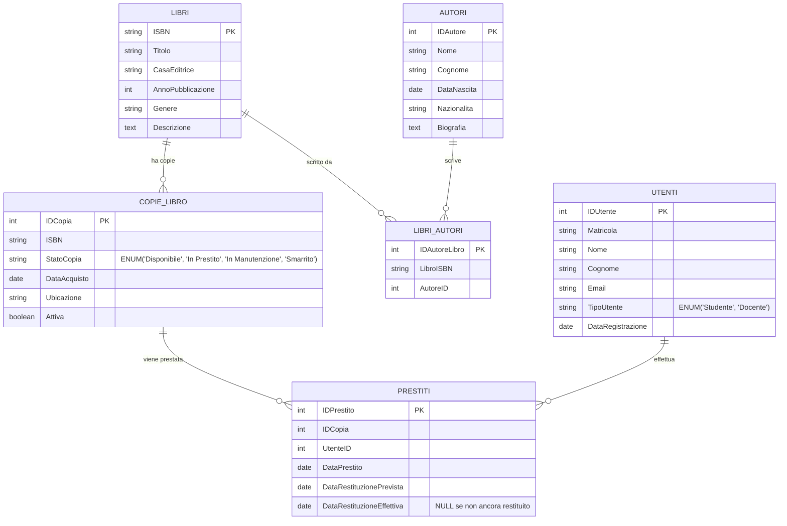

# Esercitazione SQL: Gestione Biblioteca Universitaria - Traccia

- [Esercitazione SQL: Gestione Biblioteca Universitaria - Traccia](#esercitazione-sql-gestione-biblioteca-universitaria---traccia)
  - [Contesto](#contesto)
  - [Diagramma ER semplificato in versione Mermaid](#diagramma-er-semplificato-in-versione-mermaid)
  - [Schema Logico del Database](#schema-logico-del-database)
  - [Soluzione dell'esercizio (solo per controllo finale)](#soluzione-dellesercizio-solo-per-controllo-finale)
  - [Istruzioni per lo svolgimento](#istruzioni-per-lo-svolgimento)
  - [Discussione sui Campi Ridondanti e Gestione mediante Trigger](#discussione-sui-campi-ridondanti-e-gestione-mediante-trigger)
    - [Panoramica dei Campi Ridondanti](#panoramica-dei-campi-ridondanti)
    - [Campo Ridondante Identificato](#campo-ridondante-identificato)
      - [Campo `StatoCopia` nella tabella `CopieLibro`](#campo-statocopia-nella-tabella-copielibro)
    - [Gestione mediante Trigger](#gestione-mediante-trigger)
      - [1. Trigger `DopoNuovoPrestito` (AFTER INSERT su Prestiti)](#1-trigger-doponuovoprestito-after-insert-su-prestiti)
      - [2. Trigger `DopoRestituzioneLibro` (AFTER UPDATE su Prestiti)](#2-trigger-doporestituzionelibro-after-update-su-prestiti)
    - [Vantaggi dell'Approccio con Trigger](#vantaggi-dellapproccio-con-trigger)
      - [1. **Prestazioni Ottimizzate**](#1-prestazioni-ottimizzate)
      - [2. **Semplicità nell'Applicazione**](#2-semplicità-nellapplicazione)
      - [3. **Gestione di Stati Complessi**](#3-gestione-di-stati-complessi)
      - [4. **Integrità e Consistenza**](#4-integrità-e-consistenza)
    - [Svantaggi e Considerazioni](#svantaggi-e-considerazioni)
      - [1. **Complessità di Manutenzione**](#1-complessità-di-manutenzione)
      - [2. **Rischi di Inconsistenza**](#2-rischi-di-inconsistenza)
      - [3. **Impatto sulle Prestazioni di Scrittura**](#3-impatto-sulle-prestazioni-di-scrittura)
    - [Strategie Alternative](#strategie-alternative)
      - [1. **Calcolo Dinamico**](#1-calcolo-dinamico)
      - [2. **Cache a Livello Applicativo**](#2-cache-a-livello-applicativo)
      - [3. **Stato Ibrido**](#3-stato-ibrido)
      - [4. **Viste Materializzate** (dove supportate)](#4-viste-materializzate-dove-supportate)
      - [5. **Simulazione di Viste Materializzate in MariaDB**](#5-simulazione-di-viste-materializzate-in-mariadb)
    - [Esempio di Utilizzo Pratico](#esempio-di-utilizzo-pratico)
    - [Raccomandazioni per l'Implementazione](#raccomandazioni-per-limplementazione)
    - [Conclusioni](#conclusioni)

## Contesto

Si intende progettare e implementare un database per la gestione dei prestiti di libri in una biblioteca universitaria. Il sistema deve tenere traccia dei libri (intesi come titoli/opere), delle singole copie fisiche di ciascun libro (con la loro collocazione e stato), degli autori, degli utenti registrati (studenti e docenti) e dei prestiti effettuati.

## Diagramma ER semplificato in versione Mermaid

Il seguente diagramma mostra il diagramma ER del database della biblioteca universitaria con tutte le entità e le relazioni:



**Legenda delle relazioni:**

- **Libri ↔ CopieLibro**: Un libro può avere molte copie fisiche (1:N)
- **Libri ↔ AutoriLibri ↔ Autori**: Relazione molti-a-molti tra libri e autori
- **CopieLibro ↔ Prestiti**: Una copia può essere prestata più volte nel tempo (1:N)
- **Utenti ↔ Prestiti**: Un utente può effettuare più prestiti (1:N)

**Vincoli di integrità principali:**

- Una copia può essere prestata solo se `StatoCopia = 'Disponibile'`
- `DataRestituzionePrevista` dipende dal `TipoUtente` (30 giorni per Studenti, 90 per Docenti)
- `DataRestituzioneEffettiva` può essere NULL (prestito ancora attivo)

## Schema Logico del Database

Lo schema logico prevede le seguenti entità e relazioni:

1. **Autori**:

    - `IDAutore` (Identificativo univoco dell'autore, Numerico, Chiave Primaria Autoincrementante)

    - `Nome` (Testo, max 50 caratteri, Obbligatorio)

    - `Cognome` (Testo, max 50 caratteri, Obbligatorio)

    - `DataNascita` (Data, Opzionale)

    - `Nazionalita` (Testo, max 30 caratteri)

2. **Libri** (Intesi come opere/titoli):

    - `ISBN` (Codice ISBN del libro, Testo, 13 caratteri, Chiave Primaria)

    - `Titolo` (Testo, max 200 caratteri, Obbligatorio)    - `AnnoPubblicazione` (Numerico, 4 cifre, Opzionale)

    - `Editore` (Testo, max 100 caratteri, Opzionale)

    - `NumeroPagine` (Numerico, Opzionale)

    - `Lingua` (Testo, max 20 caratteri, Default: 'Italiano')

3. **CopieLibro**:

    - `IDCopia` (Identificativo univoco della copia, Numerico, Chiave Primaria Autoincrementante)

    - `LibroISBN` (Testo, 13 caratteri, Chiave Esterna verso Libri.ISBN, Obbligatorio)

    - `Collocazione` (Testo, max 50 caratteri, Es. "Scaffale A-3", Opzionale)

    - `StatoCopia` (Testo, ENUM('Disponibile', 'In Prestito', 'In Manutenzione', 'Smarrito'), Default: 'Disponibile', Obbligatorio)

4. **LibriAutori** (Tabella di associazione per la relazione N:M tra Libri e Autori):

    - `IDLibroAutore` (Identificativo univoco, Numerico, Chiave Primaria Autoincrementante)

    - `LibroISBN` (Testo, 13 caratteri, Chiave Esterna verso Libri.ISBN, Obbligatorio)

    - `AutoreID` (Numerico, Chiave Esterna verso Autori.IDAutore, Obbligatorio)

    - *Vincolo*: La coppia (LibroISBN, AutoreID) deve essere univoca.

5. **Utenti**:

    - `IDUtente` (Identificativo univoco dell'utente, Numerico, Chiave Primaria Autoincrementante)

    - `Matricola` (Testo, max 20 caratteri, Univoco, Obbligatorio)

    - `Nome` (Testo, max 50 caratteri, Obbligatorio)

    - `Cognome` (Testo, max 50 caratteri, Obbligatorio)

    - `Email` (Testo, max 100 caratteri, Univoco, Obbligatorio)

    - `TipoUtente` (Testo, ENUM('Studente', 'Docente'), Obbligatorio)

    - `DataRegistrazione` (Data, Default: Data corrente)

6. **Prestiti**:

    - `IDPrestito` (Identificativo univoco del prestito, Numerico, Chiave Primaria Autoincrementante)

    - `IDCopia` (Numerico, Chiave Esterna verso CopieLibro.IDCopia, Obbligatorio)

    - `UtenteID` (Numerico, Chiave Esterna verso Utenti.IDUtente, Obbligatorio)

    - `DataPrestito` (Data, Obbligatorio, Default: Data corrente)

    - `DataRestituzionePrevista` (Data, Obbligatorio) - Calcolata come DataPrestito + 30 giorni per Studenti, + 90 giorni per Docenti.

    - `DataRestituzioneEffettiva` (Data, Opzionale) - Null se la copia non è stata ancora restituita.

    - *Vincolo*: Una copia non può essere prestata se `CopieLibro.StatoCopia` non è 'Disponibile'. (Questo sarà gestito a livello procedurale o applicativo, o con un check più complesso se il DB lo supporta prima dell'insert).

    - *Vincolo*: `DataRestituzioneEffettiva` deve essere maggiore o uguale a `DataPrestito`.

## Soluzione dell'esercizio (solo per controllo finale)

La soluzione a tutti i quesiti posti nelle sezioni seguenti è presentata nello script [`biblioteca.sql`](../../sql-scripts/cumulative-exercize-01-biblioteca/biblioteca.sql) nel quale sono riportati anche dei dati di prova per testare le query, le view, i trigger e le stored procedure/functions direttamente dalla shell di MariaDB.

## Istruzioni per lo svolgimento

1. **Creazione dello Schema Fisico**:

    - Creare un database MariaDB chiamato `BibliotecaUniversitariaDB`.

    - Implementare le tabelle definite nel nuovo schema logico, specificando tipi di dato appropriati, chiavi primarie, chiavi esterne, vincoli di integrità (NOT NULL, UNIQUE, CHECK, ENUM, DEFAULT) e relazioni.

    - Assicurarsi che le chiavi esterne abbiano un comportamento appropriato in caso di cancellazione o aggiornamento dei record referenziati.

2. **Popolamento del Database**:

    - Inserire almeno:

        - 5 autori.

        - 8 libri (titoli).

        - Circa 15-20 `CopieLibro` totali (alcuni libri con più copie, altri con una sola; variare `Collocazione` e `StatoCopia` iniziale per alcune).

        - 8 utenti (un mix di studenti e docenti).

        - 10 prestiti, utilizzando `IDCopia`. Alcuni prestiti già restituiti, altri in corso, alcuni in ritardo. Assicurarsi che lo `StatoCopia` sia coerente.

3. Interrogazioni SQL:

    Scrivere e testare le seguenti query SQL:

    - **Query di Base**:

        - Punto 1. Selezionare tutti i libri (titoli) pubblicati dopo il 1970, ordinati per anno di pubblicazione decrescente.

        - Punto 2. Selezionare nome, cognome ed email di tutti gli utenti di tipo 'Docente'.

        - Punto 3. Trovare tutte le copie di libri con `StatoCopia` = 'In Manutenzione', visualizzando Titolo del libro, ISBN e Collocazione della copia.

        - Punto 4. Elencare tutte le copie disponibili (`StatoCopia` = 'Disponibile') del libro con un certo ISBN (es. '9788845248790'), mostrando `IDCopia` e `Collocazione`.

    - Query con JOIN:

        - Punto 5. Visualizzare il titolo del libro, la collocazione della copia, il nome e cognome dell'utente che ha preso in prestito ogni copia attualmente non restituita.

        - Punto 6. Elencare tutti i libri (titoli) scritti da "Italo Calvino".

        - Punto 7. Mostrare i dettagli dei prestiti (IDPrestito, Titolo Libro, IDCopia, Nome Utente, Data Prestito, Data Restituzione Prevista) per i prestiti effettuati nel mese corrente.

    - Query con Funzioni Aggregate e Raggruppamento:

        - Punto 8. Contare quante copie di ciascun libro (titolo) sono presenti in biblioteca. Visualizzare ISBN, Titolo del libro e il numero di copie.

        - Punto 9. Calcolare il numero totale di prestiti effettuati da ciascun utente. Visualizzare Matricola, Nome, Cognome dell'utente e il numero di prestiti.

        - Punto 10. Trovare il numero di copie disponibili per ogni libro (titolo). Visualizzare ISBN, Titolo e numero di copie con StatoCopia = 'Disponibile'.

    - Subquery e Query Complesse:

        - Punto 11. Elencare gli utenti che non hanno mai effettuato un prestito.

        - Punto 12. Trovare i libri (titoli) che hanno almeno una copia che è stata presa in prestito più di una volta.

4. **Viste (View)**:

    1. Creare una vista chiamata `VistaTitoliConCopieDisponibili` che mostri ISBN, Titolo, Editore e il numero di copie attualmente disponibili per ogni libro che ha almeno una copia disponibile.

    2. Creare una vista chiamata `VistaPrestitiInRitardo` che elenchi IDPrestito, Titolo del libro, IDCopia, Nome e Cognome dell'utente, Email dell'utente, DataRestituzionePrevista per tutti i prestiti la cui DataRestituzioneEffettiva è NULL e la DataRestituzionePrevista è passata rispetto alla data attuale.

5. **Trigger**:

    1. Creare un trigger chiamato `DopoNuovoPrestito` che, dopo l'inserimento di un nuovo record nella tabella `Prestiti`, gestisca automaticamente lo `StatoCopia` nella tabella `CopieLibro`:

        - Se `DataRestituzioneEffettiva` è NULL (prestito attivo), imposta `StatoCopia` a 'In Prestito'
        - Se `DataRestituzioneEffettiva` non è NULL (prestito inserito come già restituito), imposta `StatoCopia` a 'Disponibile'

    2. Creare un trigger chiamato `DopoRestituzioneLibro` che, dopo l'aggiornamento di un record nella tabella `Prestiti` (quando `DataRestituzioneEffettiva` viene impostata e non è NULL), imposti automaticamente lo `StatoCopia` a 'Disponibile' nella tabella `CopieLibro` per la `IDCopia` corrispondente.

6. **Stored Procedure/Function**:
    1. Creare una stored procedure chiamata `RegistraPrestitoLibro` che accetti come parametri `p_LibroISBN` (ISBN del titolo desiderato), `p_UtenteID` e due parametri OUT: `p_IDPrestito` e `p_IDCopiaPrestata`. La procedura deve:
        - Verificare se l'utente esiste. Se non esiste, segnalare un errore.
        - Trovare una `IDCopia` disponibile (`StatoCopia` = 'Disponibile') per il `p_LibroISBN` fornito.
        - Se non ci sono copie disponibili per quel libro, segnalare un errore.
        - Se una copia è disponibile:
            - Calcolare la `DataRestituzionePrevista` (DataCorrente + 30 giorni per 'Studente', DataCorrente + 90 giorni per 'Docente').
            - Inserire un nuovo record nella tabella `Prestiti` utilizzando l'`IDCopia` trovata.
            - (L'aggiornamento dello `StatoCopia` sarà gestito dal trigger `DopoNuovoPrestito`).
            - Restituire l'`IDPrestito` e l'`IDCopia` del prestito registrato tramite i parametri OUT.

    2. Creare una funzione chiamata `ContaCopieDisponibiliLibro` che accetti `f_LibroISBN` come parametro e restituisca il numero totale di copie di quel libro con `StatoCopia` = 'Disponibile'.

Si raccomanda di commentare adeguatamente il codice SQL prodotto e di testare ogni query e oggetto del database per verificarne il corretto funzionamento.

## Discussione sui Campi Ridondanti e Gestione mediante Trigger

### Panoramica dei Campi Ridondanti

Nel modello logico della biblioteca universitaria implementato, il principale campo ridondante è rappresentato dal campo **`StatoCopia`** nella tabella `CopieLibro`. Questo campo viene mantenuto aggiornato automaticamente mediante l'uso di **trigger** che rispondono alle operazioni di prestito e restituzione dei libri.

### Campo Ridondante Identificato

#### Campo `StatoCopia` nella tabella `CopieLibro`

**Descrizione**: Il campo `StatoCopia` indica lo stato attuale di ogni singola copia fisica di un libro ('Disponibile', 'In Prestito', 'In Manutenzione', 'Smarrito'). Questo campo è considerato ridondante perché lo stato 'In Prestito' può essere derivato dalla presenza di un record attivo nella tabella `Prestiti` (dove `DataRestituzioneEffettiva` è NULL).

**Calcolo alternativo senza ridondanza**:

```sql
-- Per determinare se una copia è in prestito senza campo ridondante
SELECT CL.IDCopia, CL.LibroISBN, CL.Collocazione,
       CASE 
           WHEN P.IDPrestito IS NOT NULL THEN 'In Prestito'
           ELSE 'Disponibile'
       END AS StatoCalcolato
FROM CopieLibro CL
LEFT JOIN Prestiti P ON CL.IDCopia = P.IDCopia 
                    AND P.DataRestituzioneEffettiva IS NULL;
```

**Motivazione della Ridondanza**:

- **Prestazioni**: Evita JOIN complessi tra `CopieLibro` e `Prestiti` per ogni query di ricerca copie disponibili
- **Semplicità delle query**: Le ricerche di copie disponibili diventano semplici filtri WHERE
- **Gestione di stati multipli**: Permette di gestire facilmente stati che non sono derivabili dai prestiti (In Manutenzione, Smarrito)
- **Controlli di business logic**: Facilita la validazione prima di creare nuovi prestiti

### Gestione mediante Trigger

#### 1. Trigger `DopoNuovoPrestito` (AFTER INSERT su Prestiti)

```sql
CREATE TRIGGER DopoNuovoPrestito
AFTER INSERT ON Prestiti
FOR EACH ROW
BEGIN
    IF NEW.DataRestituzioneEffettiva IS NOT NULL THEN
        -- Prestito inserito come già restituito
        UPDATE CopieLibro SET StatoCopia = 'Disponibile' WHERE IDCopia = NEW.IDCopia;
    ELSE
        -- Prestito attivo
        UPDATE CopieLibro SET StatoCopia = 'In Prestito' WHERE IDCopia = NEW.IDCopia;
    END IF;
END;
```

**Funzionalità**:

- Si attiva automaticamente quando viene registrato un nuovo prestito
- Imposta lo stato della copia a 'In Prestito' se il prestito è attivo
- Gestisce anche il caso di prestiti inseriti come già restituiti (per dati storici)

#### 2. Trigger `DopoRestituzioneLibro` (AFTER UPDATE su Prestiti)

```sql
CREATE TRIGGER DopoRestituzioneLibro
AFTER UPDATE ON Prestiti
FOR EACH ROW
BEGIN
    -- Quando un libro viene restituito
    IF NEW.DataRestituzioneEffettiva IS NOT NULL AND OLD.DataRestituzioneEffettiva IS NULL THEN
        UPDATE CopieLibro SET StatoCopia = 'Disponibile' WHERE IDCopia = NEW.IDCopia;
    END IF;
    -- Gestione del caso inverso (correzione errori)
    IF NEW.DataRestituzioneEffettiva IS NULL AND OLD.DataRestituzioneEffettiva IS NOT NULL THEN
        UPDATE CopieLibro SET StatoCopia = 'In Prestito' WHERE IDCopia = NEW.IDCopia;
    END IF;
END;
```

**Funzionalità**:

- Si attiva quando viene aggiornato un record di prestito esistente
- Rileva quando una copia viene restituita (DataRestituzioneEffettiva passa da NULL a un valore)
- Gestisce anche correzioni di errori nel caso opposto

### Vantaggi dell'Approccio con Trigger

#### 1. **Prestazioni Ottimizzate**

- Le query per trovare copie disponibili sono immediate: `WHERE StatoCopia = 'Disponibile'`
- Eliminazione di JOIN costosi nelle operazioni più frequenti di ricerca
- Velocità nelle interfacce utente per la ricerca di libri disponibili

#### 2. **Semplicità nell'Applicazione**

- Le stored procedure di prestito possono facilmente verificare la disponibilità
- Riduzione della complessità delle query nelle funzioni di ricerca
- Logica di business centralizzata nel database

#### 3. **Gestione di Stati Complessi**

- Supporto per stati che non sono derivabili dai prestiti (In Manutenzione, Smarrito)
- Facilità nell'aggiungere nuovi stati senza modificare la logica applicativa
- Controllo centralizzato dello stato delle risorse fisiche

#### 4. **Integrità e Consistenza**

- I trigger garantiscono la sincronizzazione automatica tra prestiti e stato copie
- Impossibilità di avere prestiti attivi con copie marcate come disponibili
- Atomicità delle operazioni: se fallisce l'aggiornamento dello stato, fallisce tutto

### Svantaggi e Considerazioni

#### 1. **Complessità di Manutenzione**

- Necessità di gestire correttamente tutti i casi edge nei trigger
- Debug più complesso quando si verificano inconsistenze
- Maggiore attenzione durante modifiche strutturali al database

#### 2. **Rischi di Inconsistenza**

- Possibili problemi se i trigger contengono errori logici
- Difficoltà nel recupero da situazioni di dati corrotti
- Necessità di procedure di verifica e correzione periodica

#### 3. **Impatto sulle Prestazioni di Scrittura**

- Ogni operazione di prestito/restituzione comporta un aggiornamento aggiuntivo
- Possibili problemi di concorrenza in scenari ad alto carico
- Maggior tempo di esecuzione per le transazioni

### Strategie Alternative

#### 1. **Calcolo Dinamico**

```sql
-- Vista che calcola lo stato senza campo ridondante
CREATE VIEW VistaStatoCopie AS
SELECT CL.IDCopia, CL.LibroISBN, CL.Collocazione,
       CASE 
           WHEN CL.StatoCopia IN ('In Manutenzione', 'Smarrito') THEN CL.StatoCopia
           WHEN P.IDPrestito IS NOT NULL THEN 'In Prestito'
           ELSE 'Disponibile'
       END AS StatoEffettivo
FROM CopieLibro CL
LEFT JOIN Prestiti P ON CL.IDCopia = P.IDCopia 
                    AND P.DataRestituzioneEffettiva IS NULL;
```

#### 2. **Cache a Livello Applicativo**

- Gestione dello stato delle copie nella cache dell'applicazione
- Refresh periodico o event-driven della cache
- Maggiore controllo sulla strategia di invalidazione

#### 3. **Stato Ibrido**

- Mantenere solo stati fisici nel database (In Manutenzione, Smarrito)
- Calcolare dinamicamente lo stato di prestito
- Compromesso tra prestazioni e semplicità

#### 4. **Viste Materializzate** (dove supportate)

Anche se MariaDB non supporta nativamente le viste materializzate, in sistemi che le supportano (PostgreSQL, Oracle) potrebbero rappresentare una soluzione ottimale:

```sql
-- Esempio concettuale di vista materializzata per stati copie
CREATE MATERIALIZED VIEW StatoCopieCalcolato AS
SELECT CL.IDCopia, CL.LibroISBN, CL.Collocazione,
       CASE 
           WHEN CL.StatoCopia IN ('In Manutenzione', 'Smarrito') THEN CL.StatoCopia
           WHEN P.IDPrestito IS NOT NULL THEN 'In Prestito'
           ELSE 'Disponibile'
       END AS StatoEffettivo,
       CURRENT_TIMESTAMP AS UltimoAggiornamento
FROM CopieLibro CL
LEFT JOIN Prestiti P ON CL.IDCopia = P.IDCopia 
                    AND P.DataRestituzioneEffettiva IS NULL;

-- Refresh programmato o su richiesta
REFRESH MATERIALIZED VIEW StatoCopieCalcolato;
```

**Vantaggi delle viste materializzate**:

- Prestazioni di lettura ottimali (dati pre-calcolati)
- Controllo granulare sulla frequenza di aggiornamento
- Nessun overhead sui trigger per operazioni di scrittura
- Possibilità di aggiornamento incrementale in alcuni DBMS

**Limitazioni**:

- Non supportate nativamente in MariaDB
- Latenza dei dati (aggiornate solo durante il refresh)
- Complessità nella gestione delle dipendenze

#### 5. **Simulazione di Viste Materializzate in MariaDB**

```sql
-- Tabella che simula una vista materializzata
CREATE TABLE StatoCopieCache (
    IDCopia INT PRIMARY KEY,
    LibroISBN VARCHAR(13),
    Collocazione VARCHAR(50),
    StatoEffettivo ENUM('Disponibile', 'In Prestito', 'In Manutenzione', 'Smarrito'),
    UltimoAggiornamento TIMESTAMP DEFAULT CURRENT_TIMESTAMP,
    FOREIGN KEY (IDCopia) REFERENCES CopieLibro(IDCopia)
);

-- Stored procedure per refresh
DELIMITER //
CREATE PROCEDURE RefreshStatoCopieCache()
BEGIN
    DELETE FROM StatoCopieCache;
    
    INSERT INTO StatoCopieCache (IDCopia, LibroISBN, Collocazione, StatoEffettivo)
    SELECT CL.IDCopia, CL.LibroISBN, CL.Collocazione,
           CASE 
               WHEN CL.StatoCopia IN ('In Manutenzione', 'Smarrito') THEN CL.StatoCopia
               WHEN P.IDPrestito IS NOT NULL THEN 'In Prestito'
               ELSE 'Disponibile'
           END
    FROM CopieLibro CL
    LEFT JOIN Prestiti P ON CL.IDCopia = P.IDCopia 
                        AND P.DataRestituzioneEffettiva IS NULL;
END //
DELIMITER ;

-- Event scheduler per refresh automatico
CREATE EVENT refresh_stato_copie_event
ON SCHEDULE EVERY 1 HOUR
DO CALL RefreshStatoCopieCache();
```

### Esempio di Utilizzo Pratico

La stored procedure `RegistraPrestitoLibro` beneficia direttamente del campo ridondante:

```sql
-- Ricerca semplificata di copie disponibili
SELECT IDCopia INTO v_IDCopiaDisponibile
FROM CopieLibro
WHERE LibroISBN = p_LibroISBN AND StatoCopia = 'Disponibile'
ORDER BY IDCopia LIMIT 1;
```

Senza il campo ridondante, questa operazione richiederebbe:

```sql
-- Query più complessa senza campo ridondante
SELECT CL.IDCopia INTO v_IDCopiaDisponibile
FROM CopieLibro CL
LEFT JOIN Prestiti P ON CL.IDCopia = P.IDCopia 
                    AND P.DataRestituzioneEffettiva IS NULL
WHERE CL.LibroISBN = p_LibroISBN 
  AND CL.StatoCopia NOT IN ('In Manutenzione', 'Smarrito')
  AND P.IDPrestito IS NULL
ORDER BY CL.IDCopia LIMIT 1;
```

### Raccomandazioni per l'Implementazione

1. **Test dei Trigger**: Verificare tutti i trigger con scenari completi di prestito/restituzione
2. **Controlli di Integrità**: Implementare procedure periodiche per verificare la coerenza
3. **Gestione Transazioni**: Assicurarsi che tutte le operazioni siano atomiche
4. **Monitoring**: Monitorare le prestazioni e l'integrità dei dati
5. **Documentazione**: Mantenere documentazione dettagliata sui trigger e le loro dipendenze

### Conclusioni

Nel contesto di una biblioteca universitaria, l'uso del campo ridondante `StatoCopia` gestito tramite trigger rappresenta una soluzione efficace. Le operazioni di ricerca di libri disponibili sono molto più frequenti delle operazioni di prestito/restituzione, rendendo questo compromesso vantaggioso in termini di prestazioni complessive del sistema.

La gestione automatica tramite trigger garantisce la consistenza dei dati e semplifica significativamente la logica applicativa, pur richiedendo una maggiore attenzione nella fase di progettazione e testing.
