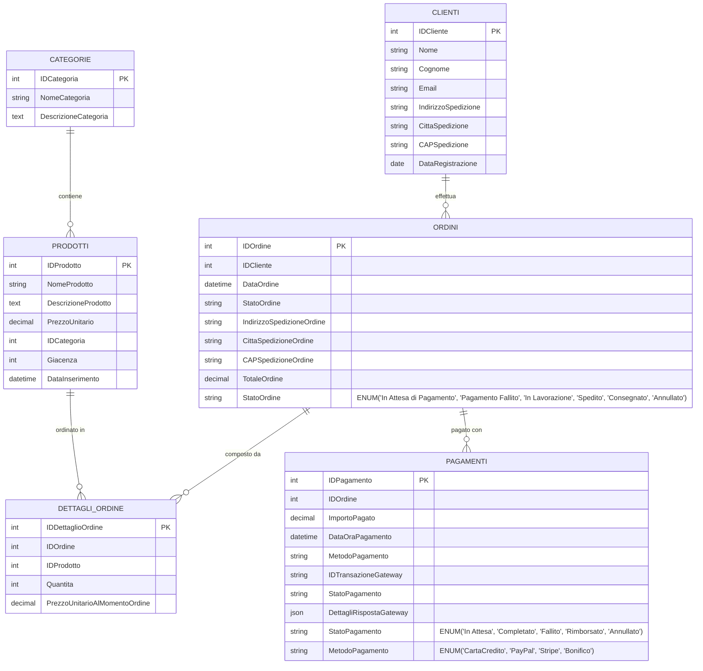

# Esercitazione SQL: Gestione E-commerce con Pagamenti - Traccia

- [Esercitazione SQL: Gestione E-commerce con Pagamenti - Traccia](#esercitazione-sql-gestione-e-commerce-con-pagamenti---traccia)
  - [Contesto](#contesto)
  - [Diagramma ER semplificato in versione Mermaid](#diagramma-er-semplificato-in-versione-mermaid)
  - [Schema Logico del Database](#schema-logico-del-database)
  - [Soluzione dell'esercizio (solo per controllo finale)](#soluzione-dellesercizio-solo-per-controllo-finale)
  - [Istruzioni per lo svolgimento](#istruzioni-per-lo-svolgimento)
  - [Discussione sui Campi Ridondanti e Gestione mediante Trigger](#discussione-sui-campi-ridondanti-e-gestione-mediante-trigger)
    - [Panoramica dei Campi Ridondanti](#panoramica-dei-campi-ridondanti)
    - [Campi Ridondanti Identificati](#campi-ridondanti-identificati)
      - [1. Campo `TotaleOrdine` nella tabella `Ordini`](#1-campo-totaleordine-nella-tabella-ordini)
      - [2. Campo `Giacenza` nella tabella `Prodotti`](#2-campo-giacenza-nella-tabella-prodotti)
    - [Vantaggi dell'Approccio con Trigger](#vantaggi-dellapproccio-con-trigger)
      - [1. **Prestazioni Ottimizzate**](#1-prestazioni-ottimizzate)
      - [2. **Consistenza dei Dati**](#2-consistenza-dei-dati)
      - [3. **Trasparenza per l'Applicazione**](#3-trasparenza-per-lapplicazione)
    - [Svantaggi e Considerazioni](#svantaggi-e-considerazioni)
      - [1. **Complessità di Manutenzione**](#1-complessità-di-manutenzione)
      - [2. **Impatto sulle Prestazioni di Scrittura**](#2-impatto-sulle-prestazioni-di-scrittura)
      - [3. **Rischi di Inconsistenza**](#3-rischi-di-inconsistenza)
    - [Strategie Alternative](#strategie-alternative)
      - [1. **Calcolo Dinamico**](#1-calcolo-dinamico)
      - [2. **Viste Materializzate** (Non supportate in MariaDB, ma supportate in PostgreSQL, SQL Server, Oracle, etc.)](#2-viste-materializzate-non-supportate-in-mariadb-ma-supportate-in-postgresql-sql-server-oracle-etc)
      - [3. **Cache a Livello Applicativo**](#3-cache-a-livello-applicativo)
    - [Raccomandazioni per l'Implementazione](#raccomandazioni-per-limplementazione)
    - [Conclusioni](#conclusioni)

## Contesto

Si intende progettare e implementare un database per la gestione di un negozio online. Il sistema deve tracciare i clienti, i prodotti (organizzati in categorie), gli ordini effettuati, i dettagli di ciascun ordine e le informazioni relative ai pagamenti, simulando l'interazione con gateway esterni.

## Diagramma ER semplificato in versione Mermaid

Il seguente diagramma mostra il modello ER del database e-commerce con tutte le entità e le relazioni:



**Legenda delle relazioni:**

- **Clienti ↔ Ordini**: Un cliente può effettuare più ordini (1:N)
- **Categorie ↔ Prodotti**: Una categoria contiene più prodotti (1:N)
- **Ordini ↔ DettagliOrdine**: Un ordine è composto da più dettagli (1:N)
- **Prodotti ↔ DettagliOrdine**: Un prodotto può essere in più ordini (1:N)
- **Ordini ↔ Pagamenti**: Un ordine può avere un pagamento principale (1:1)

**Vincoli di integrità principali:**

- `TotaleOrdine` è ridondante e gestito tramite trigger
- La `Giacenza` viene aggiornata automaticamente quando si inseriscono dettagli ordine
- `PrezzoUnitarioAlMomentoOrdine` conserva il prezzo storico al momento dell'ordine
- L'`IDTransazioneGateway` deve essere univoco se presente

## Schema Logico del Database

Lo schema logico prevede le seguenti entità e relazioni:

1. **Clienti**:

    - `IDCliente` (Identificativo univoco del cliente, Numerico, Chiave Primaria Autoincrementante)

    - `Nome` (Testo, max 50 caratteri, Obbligatorio)

    - `Cognome` (Testo, max 50 caratteri, Obbligatorio)

    - `Email` (Testo, max 100 caratteri, Univoco, Obbligatorio)

    - `IndirizzoSpedizione` (Testo, max 200 caratteri)

    - `CittaSpedizione` (Testo, max 50 caratteri)

    - `CAPSpedizione` (Testo, max 10 caratteri)

    - `DataRegistrazione` (Data, Default: Data corrente)

2. **Categorie**:

    - `IDCategoria` (Identificativo univoco della categoria, Numerico, Chiave Primaria Autoincrementante)

    - `NomeCategoria` (Testo, max 100 caratteri, Univoco, Obbligatorio)

    - `DescrizioneCategoria` (Testo, Opzionale)

3. **Prodotti**:

    - `IDProdotto` (Identificativo univoco del prodotto, Numerico, Chiave Primaria Autoincrementante)

    - `NomeProdotto` (Testo, max 150 caratteri, Obbligatorio)

    - `DescrizioneProdotto` (Testo, Opzionale)

    - `PrezzoUnitario` (Numerico, DECIMALE(10,2), Obbligatorio, Positivo)

    - `IDCategoria` (Numerico, Chiave Esterna verso Categorie.IDCategoria, Obbligatorio)

    - `Giacenza` (Numerico, INT, Default: 0, Non negativo)

    - `DataInserimento` (DataTime, Default: Data e ora correnti)

4. **Ordini**:

    - `IDOrdine` (Identificativo univoco dell'ordine, Numerico, Chiave Primaria Autoincrementante)

    - `IDCliente` (Numerico, Chiave Esterna verso Clienti.IDCliente, Obbligatorio)

    - `DataOrdine` (DataTime, Default: Data e ora correnti)

    - `StatoOrdine` (Testo, ENUM('In Attesa di Pagamento', 'Pagamento Fallito', 'In Lavorazione', 'Spedito', 'Consegnato', 'Annullato'), Default: 'In Attesa di Pagamento')

    - `IndirizzoSpedizioneOrdine` (Testo, max 200 caratteri)

    - `CittaSpedizioneOrdine` (Testo, max 50 caratteri)

    - `CAPSpedizioneOrdine` (Testo, max 10 caratteri)

    - `TotaleOrdine` (Numerico, DECIMALE(10,2), Default: 0.00) - Calcolato dalla somma dei prezzi dei dettagli ordine. Il suo valore corrente è mantenuto aggiornato mediante trigger

5. **DettagliOrdine**:

    - `IDDettaglioOrdine` (Identificativo univoco, Numerico, Chiave Primaria Autoincrementante)

    - `IDOrdine` (Numerico, Chiave Esterna verso Ordini.IDOrdine, Obbligatorio)

    - `IDProdotto` (Numerico, Chiave Esterna verso Prodotti.IDProdotto, Obbligatorio)

    - `Quantita` (Numerico, INT, Obbligatorio, Positivo)

    - `PrezzoUnitarioAlMomentoOrdine` (Numerico, DECIMALE(10,2), Obbligatorio)

    - *Vincolo*: La coppia (IDOrdine, IDProdotto) deve essere univoca.

6. **Pagamenti**:

    - `IDPagamento` (Identificativo univoco del pagamento, Numerico, Chiave Primaria Autoincrementante)

    - `IDOrdine` (Numerico, Chiave Esterna verso Ordini.IDOrdine, Obbligatorio, Univoco - si assume un tentativo di pagamento principale per ordine per semplicità)

    - `DataOraPagamento` (DataTime, Default: Data e ora correnti)

    - `ImportoPagato` (Numerico, DECIMALE(10,2), Obbligatorio)

    - `MetodoPagamento` (Testo, ENUM('CartaCredito', 'PayPal', 'Stripe', 'Bonifico'), Obbligatorio)

    - `IDTransazioneGateway` (Testo, max 100 caratteri, Opzionale, Univoco se presente) - ID fornito dal gateway di pagamento.

    - `StatoPagamento` (Testo, ENUM('In Attesa', 'Completato', 'Fallito', 'Rimborsato', 'Annullato'), Obbligatorio, Default: 'In Attesa')

    - `DettagliRispostaGateway` (JSON o TEXT, Opzionale) - Per memorizzare la risposta del gateway.

## Soluzione dell'esercizio (solo per controllo finale)

La soluzione a tutti i quesiti posti nelle sezioni seguenti è presentata nello script [`e-commerce.sql`](../../sql-scripts/cumulative-exercize-02-e-commerce/e-commerce.sql) nel quale sono riportati anche dei dati di prova per testare le query, le view, i trigger e le stored procedure/functions direttamente dalla shell di MariaDB.

## Istruzioni per lo svolgimento

1. **Creazione dello Schema Fisico**:

    - Creare un database MariaDB chiamato `EcommerceDB` (o aggiornare il precedente).

    - Implementare le tabelle definite nel nuovo schema logico.

    - Prestare attenzione ai tipi di dato, chiavi, vincoli e relazioni, inclusa la nuova tabella `Pagamenti` e le modifiche a `Ordini`.

2. **Popolamento del Database**:

    - Inserire almeno:

        - 5 clienti.

        - 3 categorie.

        - 10 prodotti.

        - 8 ordini. Lo `StatoOrdine` iniziale sarà 'In Attesa di Pagamento'.

        - Ogni ordine deve avere almeno 1-3 prodotti in `DettagliOrdine`.

        - Per ciascun ordine, inserire un record corrispondente nella tabella `Pagamenti`, simulando diversi `StatoPagamento` ('Completato', 'Fallito', 'In Attesa') e `MetodoPagamento`.

        - Aggiornare lo `StatoOrdine` di alcuni ordini in base all'esito del `StatoPagamento`.

3. Interrogazioni SQL:

    Scrivere e testare le seguenti query SQL:

    - **Query di Base (alcune invariate, altre nuove/modificate)**:

        - Punto 1. Selezionare tutti i prodotti con `PrezzoUnitario` > 50.00 €, ordinati per prezzo.

        - Punto 2. Trovare i clienti registrati nell'ultimo anno.

        - Punto 3. Elencare tutti gli ordini (`IDOrdine`, `DataOrdine`, `TotaleOrdine`) con `StatoOrdine` = 'In Lavorazione'.

        - Punto 4. Visualizzare tutti i pagamenti effettuati tramite 'PayPal' con `StatoPagamento` = 'Completato'.

        - Punto 5. Trovare gli ordini per i quali il pagamento è 'Fallito'.

    - Query con JOIN:

        - Punto 6. Mostrare NomeProdotto e NomeCategoria per ogni prodotto.

        - Punto 7. Per un IDOrdine specifico, elencare NomeProdotto, Quantita e PrezzoUnitarioAlMomentoOrdine, e anche i dettagli del pagamento associato (MetodoPagamento, StatoPagamento, DataOraPagamento).

        - Punto 8. Visualizzare Nome e Cognome del cliente, IDOrdine, DataOrdine e StatoPagamento per tutti gli ordini con StatoPagamento = 'Completato'.

    - Query con Funzioni Aggregate e Raggruppamento:

        - Punto 9. Calcolare il numero di prodotti per categoria.

        - Punto 10. Calcolare l'importo totale incassato per ciascun MetodoPagamento (considerando solo i pagamenti 'Completato').

        - Punto 11. Trovare l'importo medio degli ordini il cui pagamento è stato 'Completato'.

    - Subquery e Query Complesse:

        - Punto 12. Elencare i clienti che hanno effettuato ordini con pagamento 'Completato' per un TotaleOrdine aggregato superiore a 200.00 €.

        - Punto 13. Trovare i prodotti che sono stati inclusi in ordini con pagamento 'Fallito'.

4. **Viste (View)**:

    1. Creare una vista chiamata `VistaOrdiniConDettagliPagamento` che mostri tutte le informazioni principali di ordini e pagamenti in un unico punto di accesso.

    2. Creare una vista chiamata `VistaRiepilogoIncassiGiornalieri` che mostri, per ogni giorno, il numero di pagamenti 'Completato' e l'importo totale incassato.

5. **Trigger**:

    Implementare i seguenti trigger per automatizzare la gestione dei dati:

    1. **`AggiornaGiacenzaDopoInserimentoDettaglio`** (AFTER INSERT su DettagliOrdine): Controlla e aggiorna la giacenza dei prodotti quando viene inserito un nuovo dettaglio ordine.

    2. **`AggiornaTotaleOrdineDopoInserimentoDettaglio`** (AFTER INSERT su DettagliOrdine): Aggiorna automaticamente il totale dell'ordine.    3. **`DopoAggiornamentoPagamento`** (AFTER UPDATE su Pagamenti): Cambia lo stato dell'ordine in base all'esito del pagamento.

    3. **Trigger opzionali** per gestione UPDATE e DELETE di DettagliOrdine.

6. **Stored Procedure/Function**:

    1. Creare una stored procedure chiamata `CreaNuovoOrdine` che accetti parametri per cliente, indirizzo, prodotto, quantità e metodo di pagamento, e crei automaticamente ordine, dettaglio e record di pagamento.

    2. Creare una stored procedure chiamata `RegistraEsitoPagamentoGateway` per aggiornare lo stato di un pagamento con i dettagli ricevuti dal gateway.

    3. Mantenere la funzione `GetTotaleVendutoProdotto` che calcoli il totale venduto per un prodotto specifico considerando solo ordini con pagamento completato.

Si raccomanda di commentare adeguatamente il codice SQL prodotto e di testare ogni query e oggetto del database per verificarne il corretto funzionamento.

## Discussione sui Campi Ridondanti e Gestione mediante Trigger

### Panoramica dei Campi Ridondanti

Nel modello logico implementato, sono presenti diversi **campi ridondanti** che vengono mantenuti aggiornati automaticamente mediante l'uso di **trigger**. Questi campi memorizzano informazioni che potrebbero essere calcolate dinamicamente tramite query, ma la loro presenza migliora significativamente le prestazioni delle operazioni di lettura più frequenti.

### Campi Ridondanti Identificati

#### 1. Campo `TotaleOrdine` nella tabella `Ordini`

**Descrizione**: Il campo `TotaleOrdine` memorizza la somma totale di tutti i prodotti presenti in un ordine, calcolata come:

```sql
SUM(Quantita * PrezzoUnitarioAlMomentoOrdine) 
FROM DettagliOrdine 
WHERE IDOrdine = [IDOrdine_specifico]
```

**Motivazione della Ridondanza**:

- **Prestazioni**: Evita di eseguire una query di aggregazione ogni volta che si deve visualizzare il totale di un ordine
- **Frequenza di accesso**: Il totale dell'ordine viene consultato molto più frequentemente di quanto venga modificato
- **Semplicità nelle query**: Semplifica drasticamente le query che devono mostrare informazioni sugli ordini

**Gestione mediante Trigger**:

1. **`AggiornaTotaleOrdineDopoInserimentoDettaglio`** (AFTER INSERT su DettagliOrdine):

   ```sql
   UPDATE Ordini
   SET TotaleOrdine = TotaleOrdine + (NEW.Quantita * NEW.PrezzoUnitarioAlMomentoOrdine)
   WHERE IDOrdine = NEW.IDOrdine;
   ```

2. **`AggiornaDatiDopoUpdateDettaglio`** (AFTER UPDATE su DettagliOrdine):
   - Calcola la differenza tra i valori vecchi e nuovi
   - Aggiorna il totale dell'ordine di conseguenza

3. **`RipristinaGiacenzaDopoDeleteDettaglio`** (AFTER DELETE su DettagliOrdine):
   - Sottrae dal totale dell'ordine il valore del dettaglio eliminato

#### 2. Campo `Giacenza` nella tabella `Prodotti`

**Descrizione**: Il campo `Giacenza` mantiene il numero di unità disponibili per ogni prodotto, che viene decrementato automaticamente quando vengono inseriti nuovi dettagli ordine.

**Motivazione della Ridondanza**:

- **Controllo in tempo reale**: Permette verifiche immediate sulla disponibilità dei prodotti
- **Prestazioni**: Evita complessi calcoli basati su tutti gli ordini storici
- **Integrità dei dati**: Facilita l'implementazione di controlli di business logic

**Gestione mediante Trigger**:

1. **`AggiornaGiacenzaDopoInserimentoDettaglio`** (AFTER INSERT su DettagliOrdine):

   ```sql
   IF giacenzaAttuale < NEW.Quantita THEN
       SIGNAL SQLSTATE '45000' SET MESSAGE_TEXT = 'Errore: Giacenza non sufficiente';
   ELSE
       UPDATE Prodotti SET Giacenza = Giacenza - NEW.Quantita
       WHERE IDProdotto = NEW.IDProdotto;
   END IF;
   ```

2. **Gestione di UPDATE e DELETE**: I trigger gestiscono anche modifiche e cancellazioni dei dettagli ordine

### Vantaggi dell'Approccio con Trigger

#### 1. **Prestazioni Ottimizzate**

- Le query di lettura sono molto più veloci
- Eliminazione di JOIN complessi nelle operazioni più frequenti
- Riduzione del carico computazionale sui report e dashboard

#### 2. **Consistenza dei Dati**

- I trigger garantiscono che i campi ridondanti siano sempre sincronizzati
- Impossibilità di avere dati inconsistenti (se i trigger funzionano correttamente)
- Atomicità delle operazioni: se fallisce l'aggiornamento del campo ridondante, fallisce tutta la transazione

#### 3. **Trasparenza per l'Applicazione**

- L'applicazione non deve preoccuparsi di mantenere sincronizzati i campi ridondanti
- Le operazioni DML (INSERT, UPDATE, DELETE) mantengono automaticamente la coerenza
- Riduzione della complessità del codice applicativo

### Svantaggi e Considerazioni

#### 1. **Complessità di Manutenzione**

- I trigger aumentano la complessità del database schema
- Debug più difficile in caso di problemi di performance o dati inconsistenti
- Necessità di testare accuratamente tutti i scenari di modifica dati

#### 2. **Impatto sulle Prestazioni di Scrittura**

- Le operazioni di INSERT, UPDATE, DELETE sono più lente
- Maggior utilizzo di risorse durante le modifiche
- Possibili problemi di concorrenza in scenari ad alto carico

#### 3. **Rischi di Inconsistenza**

- Se i trigger contengono errori, possono causare inconsistenze nei dati
- Difficoltà nel recupero da situazioni di dati corrotti
- Problemi durante operazioni di migrazione o manutenzione del database

### Strategie Alternative

#### 1. **Calcolo Dinamico**

```sql
-- Alternativa senza campo ridondante
SELECT O.IDOrdine, O.DataOrdine, 
       SUM(DO.Quantita * DO.PrezzoUnitarioAlMomentoOrdine) AS TotaleOrdine
FROM Ordini O
JOIN DettagliOrdine DO ON O.IDOrdine = DO.IDOrdine
GROUP BY O.IDOrdine, O.DataOrdine;
```

#### 2. **Viste Materializzate** (Non supportate in MariaDB, ma supportate in PostgreSQL, SQL Server, Oracle, etc.)

Le viste materializzate rappresenterebbero una soluzione ideale per gestire i campi ridondanti in un sistema e-commerce:

```sql
-- Esempio per PostgreSQL (completamente compatibile)
CREATE MATERIALIZED VIEW OrdiniConTotali AS
SELECT O.IDOrdine, O.IDCliente, O.DataOrdine, O.StatoOrdine,
       SUM(DO.Quantita * DO.PrezzoUnitarioAlMomentoOrdine) AS TotaleCalcolato,
       COUNT(DO.IDDettaglioOrdine) AS NumeroArticoli,
       NOW() AS UltimoAggiornamento  -- NOW() è più idiomatico in PostgreSQL
FROM Ordini O
JOIN DettagliOrdine DO ON O.IDOrdine = DO.IDOrdine
GROUP BY O.IDOrdine, O.IDCliente, O.DataOrdine, O.StatoOrdine;

-- Vista materializzata per giacenze aggiornate
CREATE MATERIALIZED VIEW GiacenzeAggiornate AS
SELECT P.IDProdotto, P.NomeProdotto, P.PrezzoUnitario,
       P.Giacenza AS GiacenzaIniziale,
       COALESCE(SUM(DO.Quantita), 0) AS QuantitaVenduta,
       P.Giacenza - COALESCE(SUM(DO.Quantita), 0) AS GiacenzaCalcolata,
       NOW() AS UltimoAggiornamento
FROM Prodotti P
LEFT JOIN DettagliOrdine DO ON P.IDProdotto = DO.IDProdotto
LEFT JOIN Ordini O ON DO.IDOrdine = O.IDOrdine 
    AND O.StatoOrdine NOT IN ('Annullato', 'In Attesa di Pagamento')
GROUP BY P.IDProdotto, P.NomeProdotto, P.PrezzoUnitario, P.Giacenza;

-- Creazione di indici per ottimizzare le performance
CREATE UNIQUE INDEX idx_ordini_totali_pk ON OrdiniConTotali (IDOrdine);
CREATE INDEX idx_ordini_totali_cliente ON OrdiniConTotali (IDCliente);
CREATE UNIQUE INDEX idx_giacenze_pk ON GiacenzeAggiornate (IDProdotto);

-- Refresh manuale delle viste materializzate
REFRESH MATERIALIZED VIEW OrdiniConTotali;
REFRESH MATERIALIZED VIEW GiacenzeAggiornate;

-- Refresh concorrente (PostgreSQL 9.4+) - non blocca le letture
REFRESH MATERIALIZED VIEW CONCURRENTLY OrdiniConTotali;
REFRESH MATERIALIZED VIEW CONCURRENTLY GiacenzeAggiornate;

-- Refresh automatico tramite funzione PostgreSQL
CREATE OR REPLACE FUNCTION refresh_materialized_views()
RETURNS void AS $$
BEGIN
    REFRESH MATERIALIZED VIEW CONCURRENTLY OrdiniConTotali;
    REFRESH MATERIALIZED VIEW CONCURRENTLY GiacenzeAggiornate;
    
    -- Log dell'operazione
    INSERT INTO view_refresh_log (view_name, refresh_time) 
    VALUES ('OrdiniConTotali', NOW()), ('GiacenzeAggiornate', NOW());
    
EXCEPTION
    WHEN OTHERS THEN
        -- Gestione errori
        RAISE NOTICE 'Errore durante il refresh delle viste: %', SQLERRM;
END;
$$ LANGUAGE plpgsql;

-- Scheduling automatico con pg_cron (se disponibile)
-- SELECT cron.schedule('refresh-views', '0 2 * * *', 'SELECT refresh_materialized_views();');
```

**Vantaggi specifici per l'e-commerce**:

- Prestazioni eccellenti per dashboard e report
- Refresh controllato durante ore di basso traffico
- Consistenza dei dati per analisi storiche
- Riduzione del carico sui trigger durante picchi di vendita

**Simulazione in MariaDB**:

```sql
-- Tabella che simula vista materializzata per totali ordini
CREATE TABLE OrdiniTotaliCache (
    IDOrdine INT PRIMARY KEY,
    TotaleCalcolato DECIMAL(10,2),
    NumeroArticoli INT,
    UltimoAggiornamento TIMESTAMP DEFAULT CURRENT_TIMESTAMP,
    FOREIGN KEY (IDOrdine) REFERENCES Ordini(IDOrdine)
);

-- Stored procedure per refresh
DELIMITER //
CREATE PROCEDURE RefreshOrdiniTotaliCache()
BEGIN
    DELETE FROM OrdiniTotaliCache;
    
    INSERT INTO OrdiniTotaliCache (IDOrdine, TotaleCalcolato, NumeroArticoli)
    SELECT O.IDOrdine, 
           SUM(DO.Quantita * DO.PrezzoUnitarioAlMomentoOrdine),
           COUNT(DO.IDDettaglioOrdine)
    FROM Ordini O
    JOIN DettagliOrdine DO ON O.IDOrdine = DO.IDOrdine
    GROUP BY O.IDOrdine;
END //
DELIMITER ;

-- Event per refresh notturno
CREATE EVENT refresh_ordini_totali_event
ON SCHEDULE EVERY 1 DAY
STARTS '2025-01-01 02:00:00'
DO CALL RefreshOrdiniTotaliCache();
```

- Combinano i vantaggi di prestazioni e flessibilità
- Refresh controllato dei dati aggregati
- Maggiore controllo sulla sincronizzazione

#### 3. **Cache a Livello Applicativo**

- Gestione della ridondanza nell'applicazione
- Maggiore flessibilità nella strategia di cache
- Minore impatto sul database

### Raccomandazioni per l'Implementazione

1. **Test Approfonditi**: Verificare tutti i trigger con scenari edge-case
2. **Monitoring**: Implementare controlli periodici per verificare la consistenza dei dati
3. **Documentazione**: Mantenere documentazione aggiornata sui trigger e le loro dipendenze
4. **Backup Strategy**: Considerare strategie di backup che tengano conto dei trigger
5. **Performance Monitoring**: Monitorare l'impatto dei trigger sulle prestazioni

### Conclusioni

L'uso di campi ridondanti gestiti da trigger rappresenta un compromesso efficace tra prestazioni di lettura e complessità di gestione. Nel contesto di un sistema e-commerce, dove le consultazioni di ordini e la verifica delle giacenze sono operazioni molto frequenti, questo approccio risulta giustificato e vantaggioso, purché sia implementato con attenzione e monitorato adeguatamente.
