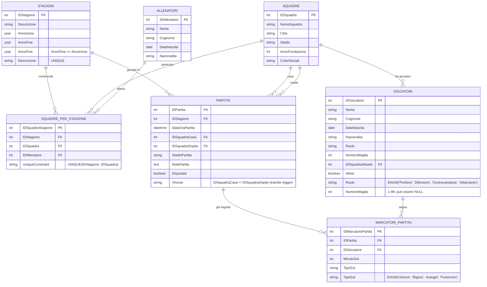

# Esercitazione SQL: Gestione Campionato Sportivo - Modello Normalizzato - Traccia

- [Esercitazione SQL: Gestione Campionato Sportivo - Modello Normalizzato - Traccia](#esercitazione-sql-gestione-campionato-sportivo---modello-normalizzato---traccia)
  - [Contesto](#contesto)
  - [Diagramma ER semplificato in versione Mermaid](#diagramma-er-semplificato-in-versione-mermaid)
  - [Schema Logico del Database](#schema-logico-del-database)
  - [Analisi della Ridondanza](#analisi-della-ridondanza)
  - [Soluzione dell'esercizio (solo per controllo finale)](#soluzione-dellesercizio-solo-per-controllo-finale)
  - [Istruzioni per lo svolgimento](#istruzioni-per-lo-svolgimento)
  - [Discussione sui Campi Ridondanti e Approccio Normalizzato](#discussione-sui-campi-ridondanti-e-approccio-normalizzato)
    - [Panoramica dell'Approccio Normalizzato](#panoramica-dellapproccio-normalizzato)
    - [Campi Ridondanti Eliminati](#campi-ridondanti-eliminati)
      - [1. **Risultati delle Partite (GolCasa/GolOspite)**](#1-risultati-delle-partite-golcasagolospite)
      - [2. **Statistiche di Classifica (Punti, Vittorie, Sconfitte, ecc.)**](#2-statistiche-di-classifica-punti-vittorie-sconfitte-ecc)
    - [Vantaggi dell'Approccio Normalizzato](#vantaggi-dellapproccio-normalizzato)
      - [1. **Integrità dei Dati Garantita**](#1-integrità-dei-dati-garantita)
      - [2. **Flessibilità e Manutenibilità**](#2-flessibilità-e-manutenibilità)
      - [3. **Semplicità della Logica di Business**](#3-semplicità-della-logica-di-business)
      - [4. **Gestione Elegante degli Autogol**](#4-gestione-elegante-degli-autogol)
    - [Svantaggi e Considerazioni](#svantaggi-e-considerazioni)
      - [1. **Prestazioni delle Query Complesse**](#1-prestazioni-delle-query-complesse)
      - [2. **Complessità delle Query di Lettura**](#2-complessità-delle-query-di-lettura)
      - [3. **Utilizzo di CTE (Common Table Expressions)**](#3-utilizzo-di-cte-common-table-expressions)
    - [Strategie Alternative per Migliorare le Prestazioni](#strategie-alternative-per-migliorare-le-prestazioni)
      - [1. **Viste Materializzate** (PostgreSQL, Oracle, SQL Server)](#1-viste-materializzate-postgresql-oracle-sql-server)
      - [2. **Tabelle di Cache con Aggiornamento Programmatico**](#2-tabelle-di-cache-con-aggiornamento-programmatico)
      - [3. **Indici Strategici per Ottimizzazione**](#3-indici-strategici-per-ottimizzazione)
    - [Confronto con Altri Approcci](#confronto-con-altri-approcci)
    - [Raccomandazioni per l'Implementazione](#raccomandazioni-per-limplementazione)
      - [1. **Monitoraggio delle Prestazioni**](#1-monitoraggio-delle-prestazioni)
      - [2. **Strategia di Caching Ibrida**](#2-strategia-di-caching-ibrida)
      - [3. **Ottimizzazione delle CTE**](#3-ottimizzazione-delle-cte)
    - [Conclusioni](#conclusioni)

## Contesto

Si intende progettare e implementare un database per la gestione di un campionato di calcio multi-stagione. Il sistema deve tenere traccia delle stagioni, delle squadre partecipanti per ogni stagione, degli allenatori, dei giocatori, delle partite giocate (con relativi risultati e marcatori) e generare dinamicamente la classifica del campionato per una specifica stagione, adottando un approccio normalizzato per evitare la ridondanza dei dati.

## Diagramma ER semplificato in versione Mermaid

Il seguente diagramma mostra il modello ER del campionato sportivo con tutte le entità e le relazioni:



**Legenda delle relazioni:**

- **Stagioni ↔ SquadrePerStagione**: Una stagione include più squadre (1:N)
- **Squadre ↔ SquadrePerStagione**: Una squadra partecipa a più stagioni (1:N)
- **Allenatori ↔ SquadrePerStagione**: Un allenatore può allenare più squadre in stagioni diverse (1:N)
- **Squadre ↔ Giocatori**: Una squadra ha più giocatori (1:N)
- **Stagioni ↔ Partite**: Una stagione ha più partite (1:N)
- **Squadre ↔ Partite**: Una squadra gioca più partite (relazione per casa e ospite) (1:N)
- **Partite ↔ MarcatoriPartita**: Una partita ha più gol (1:N)
- **Giocatori ↔ MarcatoriPartita**: Un giocatore può segnare più gol (1:N)

**Caratteristiche del modello normalizzato:**

- **Nessun campo ridondante**: I risultati delle partite sono calcolati dinamicamente da `MarcatoriPartita`
- **Fonte unica di verità**: Solo la tabella `MarcatoriPartita` determina punteggi e classifiche
- **Gestione autogol elegante**: Il campo `TipoGol = 'Autogol'` permette calcolo automatico per la squadra avversaria
- **Storicità completa**: Tutti i gol sono tracciati individualmente con marcatore e minuto
- **Flessibilità regole**: Cambiare il sistema di punteggio richiede solo modificare le viste/query

**Vincoli di integrità principali:**

- `AnnoFine >= AnnoInizio` nelle stagioni
- `IDSquadraCasa ≠ IDSquadraOspite` nelle partite (gestito tramite trigger)
- Il marcatore deve appartenere a una delle due squadre che giocano la partita
- Una squadra può partecipare solo una volta per stagione
- Il numero di maglia deve essere unico per squadra (se specificato)

## Schema Logico del Database

Lo schema logico prevede le seguenti entità e relazioni:

1. **Stagioni**:

    - `IDStagione` (Identificativo univoco della stagione, Numerico, Chiave Primaria Autoincrementante)

    - `Descrizione` (Testo, max 50 caratteri, Es. "Stagione 2023/2024", Univoco, Obbligatorio)

    - `AnnoInizio` (Numerico, 4 cifre, Obbligatorio)

    - `AnnoFine` (Numerico, 4 cifre, Obbligatorio)

    - *Vincolo*: `AnnoFine` deve essere uguale o successivo ad `AnnoInizio`.

2. **Squadre**:

    - `IDSquadra` (Identificativo univoco della squadra, Numerico, Chiave Primaria Autoincrementante)

    - `NomeSquadra` (Testo, max 100 caratteri, Univoco, Obbligatorio)

    - `Citta` (Testo, max 50 caratteri)

    - `Stadio` (Testo, max 100 caratteri)

    - `AnnoFondazione` (Numerico, 4 cifre)

    - `ColoriSociali` (Testo, max 50 caratteri)

3. **Allenatori**:

    - `IDAllenatore` (Identificativo univoco dell'allenatore, Numerico, Chiave Primaria Autoincrementante)

    - `Nome` (Testo, max 50 caratteri, Obbligatorio)

    - `Cognome` (Testo, max 50 caratteri, Obbligatorio)

    - `DataNascita` (Data)

    - `Nazionalita` (Testo, max 30 caratteri)

4. **SquadrePerStagione**:

    - `IDSquadraStagione` (Identificativo univoco, Numerico, Chiave Primaria Autoincrementante)

    - `IDStagione` (Numerico, Chiave Esterna verso Stagioni.IDStagione, Obbligatorio)

    - `IDSquadra` (Numerico, Chiave Esterna verso Squadre.IDSquadra, Obbligatorio)

    - `IDAllenatore` (Numerico, Chiave Esterna verso Allenatori.IDAllenatore, Opzionale)

    - *Vincolo*: La coppia (`IDStagione`, `IDSquadra`) deve essere univoca.

5. **Giocatori**:

    - `IDGiocatore` (Identificativo univoco del giocatore, Numerico, Chiave Primaria Autoincrementante)

    - `Nome` (Testo, max 50 caratteri, Obbligatorio)

    - `Cognome` (Testo, max 50 caratteri, Obbligatorio)

    - `DataNascita` (Data)

    - `Nazionalita` (Testo, max 30 caratteri)

    - `Ruolo` (Testo, ENUM('Portiere', 'Difensore', 'Centrocampista', 'Attaccante'), Obbligatorio)

    - `NumeroMaglia` (Numerico, Opzionale, compreso tra 1 e 99)

    - `IDSquadraAttuale` (Numerico, Chiave Esterna verso Squadre.IDSquadra, Obbligatorio)

    - `Attivo` (Booleano, Default: True)

6. **Partite** (Schema Normalizzato):

    - `IDPartita` (Identificativo univoco della partita, Numerico, Chiave Primaria Autoincrementante)

    - `IDStagione` (Numerico, Chiave Esterna verso Stagioni.IDStagione, Obbligatorio)

    - `DataOraPartita` (DataTime, Obbligatorio)

    - `IDSquadraCasa` (Numerico, Chiave Esterna verso Squadre.IDSquadra, Obbligatorio)

    - `IDSquadraOspite` (Numerico, Chiave Esterna verso Squadre.IDSquadra, Obbligatorio)

    - `StadioPartita` (Testo, max 100 caratteri, Opzionale)

    - `NotePartita` (Testo, Opzionale)

    - `Disputata` (Booleano, Default: False)

    - *Vincolo*: `IDSquadraCasa` deve essere diverso da `IDSquadraOspite`.

7. **MarcatoriPartita**:

    - `IDMarcatorePartita` (Identificativo univoco, Numerico, Chiave Primaria Autoincrementante)

    - `IDPartita` (Numerico, Chiave Esterna verso Partite.IDPartita, Obbligatorio)

    - `IDGiocatore` (Numerico, Chiave Esterna verso Giocatori.IDGiocatore, Obbligatorio)

    - `MinutoGol` (Numerico, INT, Opzionale)

    - `TipoGol` (Testo, ENUM('Azione', 'Rigore', 'Autogol', 'Punizione'), Default: 'Azione')

## Analisi della Ridondanza

Nella tabella `Partite` avremmo potuto inserire le colonne `GolSquadraCasa` e `GolSquadraOspite`. Questo approccio, sebbene apparentemente comodo, introduce **ridondanza dei dati**. Il risultato finale di una partita (il numero di gol) è un'informazione che può essere **derivata** dalla somma dei gol segnati da ciascun giocatore nella tabella `MarcatoriPartita`.

Mantenere i totali dei gol in `Partite` e i singoli gol in `MarcatoriPartita` crea due "fonti di verità" e richiede meccanismi complessi (come trigger) per mantenerle sincronizzate, aumentando il rischio di inconsistenza dei dati.

In questo modello normalizzato, si adotta un approccio più robusto:

1. **Single Source of Truth (Fonte Unica di Verità)**: La tabella `MarcatoriPartita` è l'unica fonte di verità per il punteggio di una partita.

2. **Dati Calcolati al Momento**: Il risultato di una partita non viene memorizzato, ma viene calcolato dinamicamente (ad esempio, tramite una vista) ogni volta che è necessario. Questo garantisce che il risultato rifletta sempre esattamente i dati dei marcatori.

3. **Gestione degli Autogol**: Questo modello permette una gestione elegante degli autogol. Il calcolo dinamico può interpretare `TipoGol = 'Autogol'` e assegnare correttamente il punto alla squadra avversaria del giocatore che ha commesso l'autogol.

Questo approccio favorisce l'integrità dei dati e riduce la complessità della logica di manutenzione del database.

## Soluzione dell'esercizio (solo per controllo finale)

La soluzione a tutti i quesiti posti nelle sezioni seguenti è presentata nello script [`campionato-sportivo.sql`](../../sql-scripts/cumulative-exercize-03-campionato-sportivo/campionato-sportivo.sql) nel quale sono riportati anche dei dati di prova per testare le query, le view, i trigger e le stored procedure/functions direttamente dalla shell di MariaDB.

## Istruzioni per lo svolgimento

1. **Creazione dello Schema Fisico**:

    - Creare un database MariaDB chiamato `CampionatoDB`.

    - Implementare le tabelle definite nel nuovo schema logico normalizzato.

    - Definire le azioni ON DELETE e ON UPDATE per le chiavi esterne.

2. **Popolamento del Database**:

    - Inserire almeno:

        - 2 stagioni.

        - 4-5 squadre.

        - 5-6 allenatori.

        - Associare le squadre alle stagioni in `SquadrePerStagione`.

        - 20-25 giocatori.

        - 8-10 partite distribuite nelle due stagioni.

        - Per le partite disputate, inserire i record in `MarcatoriPartita`, includendo almeno un autogol per testare la logica.

3. Interrogazioni SQL:

    Scrivere e testare le seguenti query SQL:

    - **Query di Base**:

        - Punto 1. Elencare tutte le stagioni registrate.

        - Punto 2. Selezionare tutti i giocatori con ruolo 'Attaccante' di una squadra a scelta.

        - Punto 3. Trovare le squadre e i rispettivi allenatori per una specifica stagione.

        - Punto 4. Visualizzare tutte le partite non ancora disputate per la stagione corrente.

    - Query con JOIN:

        - Punto 5. Mostrare NomeSquadra, Nome e Cognome dell'allenatore per tutte le squadre di una specifica stagione.

        - Punto 6. Visualizzare i dettagli di una partita specifica (ID, nomi squadre, data, stagione). Poiché non ci sono più le colonne dei gol in Partite, per visualizzare il risultato sarà necessario calcolarlo unendo MarcatoriPartita.

        - Punto 7. Per ogni gol segnato in una specifica partita, mostrare nome e cognome del marcatore, la sua squadra e il tipo di gol.

    - Query con Funzioni Aggregate e Raggruppamento:

        - Punto 8. Calcolare il numero di squadre partecipanti per ogni stagione.

        - Punto 9. Creare la classifica marcatori per una specifica stagione (visualizzare nome, cognome e totale gol, escludendo gli autogol).

        - Punto 10. Calcolare il numero medio di gol totali per partita per una specifica stagione.

    - Subquery e Query Complesse:

        - Punto 11. Elencare le squadre che, in una specifica stagione, non hanno subito gol in casa (un gol subito può essere un gol normale di un avversario o un autogol).

        - Punto 12. Trovare i giocatori che hanno segnato in più di una stagione differente.

4. **Viste (View)**:

    1. Creare una vista chiamata `VistaCalendarioCompleto` che mostri i dati principali delle partite e includa il risultato finale (`GolCasaEffettivi`, `GolOspiteEffettivi`) calcolato dinamicamente dalla tabella `MarcatoriPartita`.

    2. Creare una vista chiamata `VistaClassificaStagione`. Questa vista deve calcolare dinamicamente Punti, PartiteGiocate, Vittorie, Pareggi, Sconfitte, GolFatti, GolSubiti, e DifferenzaReti per ogni squadra in ogni stagione, basandosi unicamente sui dati presenti in `MarcatoriPartita` e gestendo correttamente gli autogol. La classifica deve essere ordinata per Punti, DifferenzaReti e GolFatti.

5. **Trigger**:

    1. Creare trigger `CHK_SquadreDiverse_INSERT` e `CHK_SquadreDiverse_UPDATE` per sostituire il vincolo CHECK che impedisce che una squadra giochi contro se stessa (MariaDB non supporta CHECK su confronti tra colonne).

    2. (Opzionale) Creare un trigger `VerificaMarcatoreSquadra` che si attivi `BEFORE INSERT` su `MarcatoriPartita` per assicurarsi che il giocatore appartenga a una delle due squadre in campo.

6. **Stored Procedure/Function**:

    1. Creare una stored procedure chiamata `MarcaPartitaComeDisputata` che accetti `p_IDPartita`. La sua unica responsabilità è impostare il flag `Partite.Disputata` a `TRUE`, segnalando che il risultato può essere calcolato dai marcatori inseriti.

    2. Creare una funzione chiamata `GetAllenatoreSquadraStagione` che accetti `f_IDSquadra` e `f_IDStagione` e restituisca il nome e cognome dell'allenatore.

    3. Creare una stored procedure chiamata `MostraClassificaStagione` che accetti `p_IDStagione` e visualizzi i risultati della `VistaClassificaStagione` filtrati per la stagione fornita.

Si raccomanda di commentare adeguatamente il codice SQL prodotto.

## Discussione sui Campi Ridondanti e Approccio Normalizzato

### Panoramica dell'Approccio Normalizzato

Nel modello del campionato sportivo implementato, è stato adottato un **approccio completamente normalizzato** che **elimina la ridondanza dei dati** a favore del **calcolo dinamico**. Questo rappresenta una strategia opposta rispetto al sistema [biblioteca](../sql-cumulative-exercize-1/index.md), dove alcuni campi ridondanti venivano mantenuti e gestiti tramite trigger.

### Campi Ridondanti Eliminati

#### 1. **Risultati delle Partite (GolCasa/GolOspite)**

**Scelta progettuale**: Nella tabella `Partite` **non sono presenti** le colonne `GolSquadraCasa` e `GolSquadraOspite`.

**Motivazione della scelta**:

- Il risultato di ogni partita viene calcolato dinamicamente dalla tabella `MarcatoriPartita`
- Elimina la duplicazione di informazioni tra `Partite` e `MarcatoriPartita`
- Garantisce una **fonte unica di verità** (Single Source of Truth)

**Calcolo dinamico del risultato**:

```sql
-- Calcolo risultato partita senza campi ridondanti
SELECT 
    p.IDPartita,
    SUM(CASE 
        WHEN mp.TipoGol <> 'Autogol' AND g.IDSquadraAttuale = p.IDSquadraCasa THEN 1 
        WHEN mp.TipoGol = 'Autogol' AND g.IDSquadraAttuale = p.IDSquadraOspite THEN 1 
        ELSE 0 
    END) AS GolCasaEffettivi,
    SUM(CASE 
        WHEN mp.TipoGol <> 'Autogol' AND g.IDSquadraAttuale = p.IDSquadraOspite THEN 1 
        WHEN mp.TipoGol = 'Autogol' AND g.IDSquadraAttuale = p.IDSquadraCasa THEN 1 
        ELSE 0 
    END) AS GolOspiteEffettivi
FROM Partite p
LEFT JOIN MarcatoriPartita mp ON p.IDPartita = mp.IDPartita
LEFT JOIN Giocatori g ON mp.IDGiocatore = g.IDGiocatore
WHERE p.Disputata = TRUE
GROUP BY p.IDPartita;
```

#### 2. **Statistiche di Classifica (Punti, Vittorie, Sconfitte, ecc.)**

**Scelta progettuale**: Non esistono tabelle o campi che memorizzano punti, vittorie, pareggi, sconfitte di ogni squadra.

**Calcolo dinamico tramite vista**:

```sql
-- La vista VistaClassificaStagione calcola tutto dinamicamente
SELECT
    SPS.IDStagione, ST.Descrizione AS DescrizioneStagione, SQ.NomeSquadra,
    COALESCE(SUM(SP.PartiteGiocate), 0) AS PartiteGiocate,
    COALESCE(SUM(SP.Vittorie), 0) AS Vittorie,
    COALESCE(SUM(SP.Pareggi), 0) AS Pareggi,
    COALESCE(SUM(SP.Sconfitte), 0) AS Sconfitte,
    (COALESCE(SUM(SP.Vittorie), 0) * 3) + COALESCE(SUM(SP.Pareggi), 0) AS Punti,
    COALESCE(SUM(SP.GolFatti), 0) AS GolFatti,
    COALESCE(SUM(SP.GolSubiti), 0) AS GolSubiti,
    (COALESCE(SUM(SP.GolFatti), 0) - COALESCE(SUM(SP.GolSubiti), 0)) AS DifferenzaReti
FROM SquadrePerStagione SPS
-- ...complessa logica di aggregazione...
```

### Vantaggi dell'Approccio Normalizzato

#### 1. **Integrità dei Dati Garantita**

- **Impossibilità di inconsistenze**: Non possono esistere discrepanze tra risultati memorizzati e marcatori effettivi
- **Fonte unica di verità**: Tutti i calcoli derivano esclusivamente da `MarcatoriPartita`
- **Gestione automatica degli autogol**: La logica è centralizzata nelle viste e query

#### 2. **Flessibilità e Manutenibilità**

- **Modifiche semplici**: Cambiare le regole di calcolo punti richiede solo aggiornare le viste
- **Storicità**: Eventuali correzioni ai marcatori si riflettono automaticamente nelle classifiche
- **Estensibilità**: Aggiungere nuove statistiche non richiede modifiche strutturali

#### 3. **Semplicità della Logica di Business**

- **Nessun trigger complesso**: Eliminati i rischi associati ai trigger di sincronizzazione
- **Operazioni atomiche**: Inserire/modificare marcatori non richiede aggiornamenti multipli
- **Debug facilitato**: Tutti i problemi sono tracciabili alla fonte (MarcatoriPartita)

#### 4. **Gestione Elegante degli Autogol**

```sql
-- Gli autogol sono gestiti automaticamente nel calcolo
CASE 
    WHEN mp.TipoGol = 'Autogol' AND g.IDSquadraAttuale = p.IDSquadraOspite THEN 1  -- Gol per la casa
    WHEN mp.TipoGol = 'Autogol' AND g.IDSquadraAttuale = p.IDSquadraCasa THEN 1    -- Gol per l'ospite
    ELSE 0 
END
```

### Svantaggi e Considerazioni

#### 1. **Prestazioni delle Query Complesse**

- **Calcoli intensivi**: Le viste per la classifica richiedono aggregazioni complesse
- **Query multiple**: Ogni consultazione della classifica ricalcola tutto da zero
- **Scalabilità**: Con molte partite/stagioni, le prestazioni potrebbero degradare

#### 2. **Complessità delle Query di Lettura**

- **Viste complesse**: La `VistaClassificaStagione` richiede logica sofisticata
- **Subquery annidate**: Query per ottenere risultati semplici diventano complesse
- **Curva di apprendimento**: Maggiore difficoltà per sviluppatori non esperti

#### 3. **Utilizzo di CTE (Common Table Expressions)**

Il codice utilizza **CTE** (Common Table Expressions) che sono un argomento avanzato:

```sql
-- Esempio di CTE nel calcolo della classifica
WITH GolCalcolati AS (
    -- Prima CTE: calcola i gol per ogni partita
    SELECT p.IDPartita, p.IDStagione, p.IDSquadraCasa, p.IDSquadraOspite,
           SUM(CASE WHEN ... END) AS GolCasaEffettivi,
           SUM(CASE WHEN ... END) AS GolOspiteEffettivi
    FROM Partite p
    LEFT JOIN MarcatoriPartita mp ON p.IDPartita = mp.IDPartita
    -- ...
),
StatistichePartite AS (
    -- Seconda CTE: aggrega le statistiche per squadra
    SELECT gc.IDStagione, gc.IDSquadraCasa AS IDSquadra,
           COUNT(gc.IDPartita) AS PartiteGiocate,
           SUM(CASE WHEN gc.GolCasaEffettivi > gc.GolOspiteEffettivi THEN 1 ELSE 0 END) AS Vittorie
    -- ...
)
-- Query finale che utilizza le CTE
SELECT SPS.IDStagione, ST.Descrizione, SQ.NomeSquadra, ...
```

**Spiegazione delle CTE**:

- **Common Table Expressions** sono "tabelle temporanee" definite all'interno di una query
- Permettono di spezzare query complesse in passaggi logici più semplici
- Migliorano la leggibilità e manutenibilità del codice SQL
- Sono supportate da **MariaDB 10.2+** (2017), MySQL 8.0+, PostgreSQL, SQL Server, Oracle

### Strategie Alternative per Migliorare le Prestazioni

#### 1. **Viste Materializzate** (PostgreSQL, Oracle, SQL Server)

```sql
-- Esempio concettuale per PostgreSQL
CREATE MATERIALIZED VIEW ClassificaStagioneMaterialized AS
SELECT IDStagione, NomeSquadra, Punti, PartiteGiocate, Vittorie, Pareggi, Sconfitte,
       GolFatti, GolSubiti, DifferenzaReti, NOW() AS UltimoAggiornamento
FROM VistaClassificaStagione;

-- Refresh periodico (dopo ogni giornata di campionato)
REFRESH MATERIALIZED VIEW ClassificaStagioneMaterialized;
```

**Vantaggi per il campionato**:

- Prestazioni eccellenti per consultazione classifiche
- Refresh controllato (tipicamente dopo ogni giornata)
- Mantiene la coerenza dei dati storici

#### 2. **Tabelle di Cache con Aggiornamento Programmatico**

```sql
-- Tabella cache per statistiche stagione
CREATE TABLE StatisticheStagioneCache (
    IDStagione INT,
    IDSquadra INT,
    PartiteGiocate INT,
    Punti INT,
    GolFatti INT,
    GolSubiti INT,
    UltimoAggiornamento TIMESTAMP,
    PRIMARY KEY (IDStagione, IDSquadra)
);

-- Stored procedure per aggiornamento cache
DELIMITER //
CREATE PROCEDURE AggiornaCacheClassifica(IN p_IDStagione INT)
BEGIN
    DELETE FROM StatisticheStagioneCache WHERE IDStagione = p_IDStagione;
    
    INSERT INTO StatisticheStagioneCache (IDStagione, IDSquadra, PartiteGiocate, Punti, GolFatti, GolSubiti)
    SELECT IDStagione, IDSquadra, PartiteGiocate, Punti, GolFatti, GolSubiti
    FROM VistaClassificaStagione 
    WHERE IDStagione = p_IDStagione;
END //
DELIMITER ;
```

#### 3. **Indici Strategici per Ottimizzazione**

```sql
-- Indici per velocizzare i calcoli della classifica
CREATE INDEX idx_marcatori_partita_calc ON MarcatoriPartita (IDPartita, IDGiocatore, TipoGol);
CREATE INDEX idx_partite_stagione_disputate ON Partite (IDStagione, Disputata);
CREATE INDEX idx_giocatori_squadra ON Giocatori (IDSquadraAttuale);
```

### Confronto con Altri Approcci

| Approccio | Vantaggi | Svantaggi | Caso d'Uso Ideale |
|-----------|----------|-----------|-------------------|
| **Normalizzato** (Campionato) | Integrità garantita, flessibilità | Performance query complesse | Sistemi con calcoli complessi e dati critici |
| **Campi Ridondanti + Trigger** (Biblioteca) | Performance lettura, semplicità query | Complessità trigger, rischio inconsistenza | Sistemi con operazioni di lettura frequenti |
| **Viste Materializzate** | Ottimo compromesso | Latenza dati, complessità gestione | Sistemi con report periodici |
| **Cache Applicativo** | Massimo controllo | Complessità applicazione | Sistemi ad alta concorrenza |

### Raccomandazioni per l'Implementazione

#### 1. **Monitoraggio delle Prestazioni**

- Implementare logging delle query più lente
- Monitorare l'utilizzo della vista `VistaClassificaStagione`
- Considerare partizionamento per stagioni molto popolose

#### 2. **Strategia di Caching Ibrida**

```sql
-- Vista semplificata per query frequenti
CREATE VIEW ClassificaRapida AS
SELECT IDStagione, NomeSquadra, 
       (Vittorie * 3 + Pareggi) AS Punti,
       (GolFatti - GolSubiti) AS DifferenzaReti
FROM VistaClassificaStagione
ORDER BY IDStagione, Punti DESC, DifferenzaReti DESC;
```

#### 3. **Ottimizzazione delle CTE**

- Considerare la riscrittura di CTE complesse come viste separate
- Utilizzare `EXPLAIN` per analizzare i piani di esecuzione
- Valutare l'uso di tabelle temporanee per calcoli molto complessi

### Conclusioni

L'approccio normalizzato del sistema campionato sportivo rappresenta una **scelta progettuale coraggiosa** che privilegia l'**integrità dei dati** e la **flessibilità** rispetto alle prestazioni pure. Questa strategia è particolarmente appropriata per sistemi dove:

1. **L'accuratezza dei dati è critica** (risultati sportivi)
2. **Le modifiche alle regole sono frequenti** (sistemi di punteggio)
3. **La trasparenza e tracciabilità sono essenziali** (sport professionistici)
4. **Il volume di dati è gestibile** (campionati regionali/nazionali)

Per implementazioni su larga scala o con requisiti di performance estremi, l'approccio normalizzato può essere integrato con strategie di caching o viste materializzate per ottenere il meglio di entrambi i mondi.
