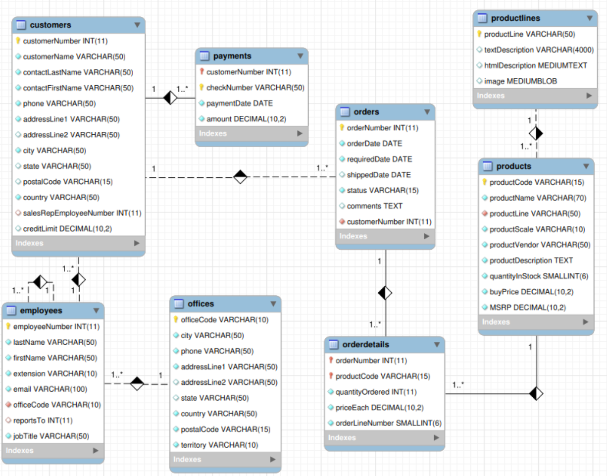

# SQL in MySQL/MariaDB - Subquery, insiemi, viste, tabelle temporanee

- [SQL in MySQL/MariaDB - Subquery, insiemi, viste, tabelle temporanee](#sql-in-mysqlmariadb---subquery-insiemi-viste-tabelle-temporanee)
  - [Subquery](#subquery)
    - [Subquery in colonne calcolate](#subquery-in-colonne-calcolate)
      - [Esempi di subquery in colonne calcolate - database `piscine_milano`](#esempi-di-subquery-in-colonne-calcolate---database-piscine_milano)
    - [Subquery nella clausola `WHERE`](#subquery-nella-clausola-where)
      - [Esempi di subquery nella clausola `WHERE` - database `classicmodels`](#esempi-di-subquery-nella-clausola-where---database-classicmodels)
      - [Esempi di subquery nella clausola `WHERE` - database `piscine_milano`](#esempi-di-subquery-nella-clausola-where---database-piscine_milano)
      - [Esempi di subquery nella clausola `WHERE` - database `studenti_stages_aziende`](#esempi-di-subquery-nella-clausola-where---database-studenti_stages_aziende)
    - [Subquery nella clausola `FROM`](#subquery-nella-clausola-from)
      - [Esempi di subquery nella clausola `FROM` - database `classicmodels`](#esempi-di-subquery-nella-clausola-from---database-classicmodels)
    - [Subquery correlate](#subquery-correlate)
      - [Esempi di subquery correlate - database `classicmodels`](#esempi-di-subquery-correlate---database-classicmodels)
      - [Esempi di subquery correlate - database `studenti_stages_aziende`](#esempi-di-subquery-correlate---database-studenti_stages_aziende)
  - [Operazioni sugli insiemi](#operazioni-sugli-insiemi)
    - [standard SQL](#standard-sql)
    - [Emulazione di `INTERSECT` in MySQL/MariaDb](#emulazione-di-intersect-in-mysqlmariadb)
    - [Emulazione di `EXCEPT` in MySQL/MariaDb](#emulazione-di-except-in-mysqlmariadb)
  - [Viste (Views)](#viste-views)
    - [Vantaggi delle Viste](#vantaggi-delle-viste)
    - [Primi esempi di Viste](#primi-esempi-di-viste)
    - [Sintassi per la creazione delle viste](#sintassi-per-la-creazione-delle-viste)
    - [Funzionamento delle viste](#funzionamento-delle-viste)
    - [Vincoli sulle viste](#vincoli-sulle-viste)
    - [Cancellazione di una vista](#cancellazione-di-una-vista)
      - [Esempi di cancellazione di viste](#esempi-di-cancellazione-di-viste)
    - [Modifica di una vista](#modifica-di-una-vista)
    - [Query complesse con viste](#query-complesse-con-viste)
      - [Esempi di query con viste - database `studenti_stages_aziende`](#esempi-di-query-con-viste---database-studenti_stages_aziende)
      - [Esempi di query con viste - database `dbscuola2`](#esempi-di-query-con-viste---database-dbscuola2)
    - [Operazioni di aggiornamento con viste - updatable and insertable views](#operazioni-di-aggiornamento-con-viste---updatable-and-insertable-views)
      - [Un esempio didattico di viste aggiornabili](#un-esempio-didattico-di-viste-aggiornabili)
  - [Common Table Expression (CTE)](#common-table-expression-cte)
    - [Vantaggi delle CTE](#vantaggi-delle-cte)
    - [Sintassi delle CTE](#sintassi-delle-cte)
    - [CTE vs VIEW](#cte-vs-view)
    - [Quando usare CTE vs VIEW](#quando-usare-cte-vs-view)
    - [Esempi di CTE con i database di esempio del corso](#esempi-di-cte-con-i-database-di-esempio-del-corso)
      - [Esempio 1: CTE semplice - database `classicmodels`](#esempio-1-cte-semplice---database-classicmodels)
      - [Esempio 2: CTE multiple - database `classicmodels`](#esempio-2-cte-multiple---database-classicmodels)
      - [Esempio 3: CTE con aggregazioni multiple - database `piscine_milano`](#esempio-3-cte-con-aggregazioni-multiple---database-piscine_milano)
      - [Esempio 4: CTE per semplificare query complesse - database `dbscuola2`](#esempio-4-cte-per-semplificare-query-complesse---database-dbscuola2)
    - [CTE ricorsive](#cte-ricorsive)
      - [Come funzionano le CTE ricorsive](#come-funzionano-le-cte-ricorsive)
      - [Sintassi delle CTE ricorsive](#sintassi-delle-cte-ricorsive)
      - [Esempio 1: Gerarchia di categorie - database `classicmodels`](#esempio-1-gerarchia-di-categorie---database-classicmodels)
      - [Esempio 2: Generare una sequenza di date - database `piscine_milano`](#esempio-2-generare-una-sequenza-di-date---database-piscine_milano)
      - [Esempio 3: Gerarchia di stage multi-livello - database `studenti_stages_aziende`](#esempio-3-gerarchia-di-stage-multi-livello---database-studenti_stages_aziende)
      - [Esempio 4: Gerarchia che mostra studenti e aziende con livelli di relazione - database `studenti_stages_aziende`](#esempio-4-gerarchia-che-mostra-studenti-e-aziende-con-livelli-di-relazione---database-studenti_stages_aziende)
      - [Esempio 5: Espandere categorie con livelli - database `classicmodels`](#esempio-5-espandere-categorie-con-livelli---database-classicmodels)
      - [Best practices per le CTE ricorsive](#best-practices-per-le-cte-ricorsive)
      - [Limitazioni e considerazioni delle CTE ricorsive](#limitazioni-e-considerazioni-delle-cte-ricorsive)
      - [Quando usare le CTE ricorsive](#quando-usare-le-cte-ricorsive)
    - [Best practices per le CTE](#best-practices-per-le-cte)
    - [Limitazioni delle CTE](#limitazioni-delle-cte)
  - [Tabelle temporanee](#tabelle-temporanee)
    - [Esempi di tabelle temporanee](#esempi-di-tabelle-temporanee)
    - [Caratteristiche delle tabelle temporanee](#caratteristiche-delle-tabelle-temporanee)
  - [Riepilogo comparativo: VIEW, CTE, Tabelle temporanee e Subquery](#riepilogo-comparativo-view-cte-tabelle-temporanee-e-subquery)
    - [Scenari d'uso consigliati](#scenari-duso-consigliati)
    - [Esempio pratico comparativo](#esempio-pratico-comparativo)
    - [Considerazioni finali](#considerazioni-finali)

## Subquery

Una subquery (sotto-interrogazione o query interna) è un'interrogazione inserita all’interno della definizione di un’altra query.

In una query che ne richiama un'altra al suo interno sono presenti:

- La query esterna, individuata dalla prima SELECT;
- La query interna (o annidata), la cui definizione è delimitata da una coppia di parentesi tonde

Una subquery può richiamare altre subquery creando strutture di interrogazione a più livelli.

Esistono diversi tipi di subquery[^1]:

- subquery in colonne calcolate
- subquery nella clausola `WHERE`
- subquery nella clausola `FROM`
- `correlated subquery`

[^1]: [MySQL Tutorial - subquery](https://www.mysqltutorial.org/mysql-basics/mysql-subquery/)

### Subquery in colonne calcolate

#### Esempi di subquery in colonne calcolate - database `piscine_milano`

Con riferimento al database [`piscine_milano`](../../sql-scripts/02-piscine/Piscine-Milano-FW-engineering.sql), si supponga di voler eseguire le seguenti query:

```sql
-- riportare lo scarto rispetto alla media dei prezzi dei corsi delle piscine
SELECT corsi.Costo - (SELECT AVG(corsi.Costo) FROM corsi) 
    AS 'Scarto rispetto alla media'
    FROM corsi;

-- per formattare i dati con un numero di cifre significative assegnato è possibile utilizzare la funzione CONVERT(expr, type), oppure la funzione CONVERT(expr, USING transcoding_name)
SELECT CONVERT(corsi.Costo - (SELECT AVG(corsi.Costo) FROM corsi), DECIMAL(8,2))
    AS 'Scarto rispetto alla media'
    FROM corsi;

-- riportare il costo dei corsi delle piscine e lo scarto dei prezzi rispetto alla media dei costi di tutti i corsi
SELECT NomeC, Piscina, Costo,
       CONVERT (Costo - (SELECT AVG(c1.Costo) FROM corsi c1), DECIMAL(8,2))
       AS 'Scarto rispetto alla media'
    FROM corsi;
```

| NomeC               | Piscina | Costo  | Scarto rispetto alla media |
|---------------------|---------|--------|----------------------------|
| Acquagym            | Cozzi   | 126.00 |                    -156.67 |
| Corso di Salvamento | Cozzi   | 500.00 |                     217.33 |
| Nuoto Libero        | Cozzi   |  80.00 |                    -202.67 |
| Acquagym            | Lido    | 190.00 |                     -92.67 |
| Corso di Salvamento | Lido    | 700.00 |                     417.33 |
| Nuoto Libero        | Lido    | 100.00 |                    -182.67 |

Nell'esempio precedente si è fatto uso della funzione [`Convert` di MySQL](https://dev.mysql.com/doc/refman/9.1/en/cast-functions.html#function_convert), oppure la funzione [`Convert` di MariaDb](https://mariadb.com/kb/en/convert/)

### Subquery nella clausola `WHERE`

#### Esempi di subquery nella clausola `WHERE` - database `classicmodels`

Con riferimento al database [`classicmodels`](../../sql-scripts/00-classicmodels/mysqlsampledatabase.sql), il cui schema E/R è riportato di seguito, si considerino le seguenti query:



```sql
-- trovare il cliente che ha fatto il pagamento di importo maggiore
SELECT 
    customerNumber, 
    checkNumber, 
    amount
FROM
    payments
WHERE
    amount = (SELECT MAX(amount) FROM payments);

-- trovare i clienti che hanno fatto pagamenti superiori alla media dei pagamenti
SELECT 
    customerNumber, 
    checkNumber, 
    amount
FROM
    payments
WHERE
    amount > (SELECT AVG(amount) FROM payments);
```

Negli esempi precedenti la subquery restituisce un solo valore. Nel caso in cui la subquery restituisca più valori è possibile utilizzare gli operatori insiemistici `IN` e `NOT IN`:

```sql
SELECT <ElencoColonne> 
    FROM <ElencoTabelle>
    WHERE NomeColonna [NOT] IN (<Subquery>)
```

Confronta i valori di `NomeColonna` con quelli restituiti dalla subquery. Le due colonne possono avere un nome diverso, ma devono avere lo stesso dominio.

Ad esempio, per trovare i clienti che non hanno ancora sottomesso alcun ordine si può eseguire la seguente query:

```sql
-- i clienti che non hanno ancora emesso ordini
SELECT 
    customerName
FROM
    customers
WHERE
    customerNumber NOT IN (SELECT DISTINCT customerNumber
                           FROM
                           orders);
```

In generale, quando si ha una subquery nella clausola `WHERE` si possono presentare diversi operatori del linguaggio SQL che rientrano nello schema seguente:

```sql
SELECT <ElencoColonne>
    FROM <ElencoTabelle>
    WHERE NomeColonna <Operatore>  (<QueryInterna>);
```

Dove`<Operatore>` può essere un operatore:

- di confronto: `=, <=>, <=, >=, <>`
- operatore speciale dell'SQL: `EXISTS, IN, NOT IN`
- booleani: `OR, AND, NOT`

In particolare, nel caso in cui una subquery sia utilizzata assieme ad operatori di confronto per definire una condizione di ricerca, si possono utilizzare le parole chiave `[ANY | ALL]`:

```sql
WHERE NomeColonna <OperatoreConfronto> [ANY | ALL]  (<QueryInterna>);
```

Nell'espressione precedente:

- se compare `ANY`, la condizione è vera se il valore della colonna (`NomeColonna`) compare almeno una volta nell'insieme fornito dalla subquery
- se compare `ALL`, la condizione è vera se il valore della colonna (`NomeColonna`) compare in tutti i valori restituiti dalla subquery.

Ad esempio, per trovare i clienti che non hanno ancora emesso ordini, si può scrivere la query seguente:

```sql
-- i clienti che non hanno ancora emesso ordini
SELECT 
    customerName
FROM
    customers
WHERE
    customerNumber<>ALL(SELECT DISTINCT customerNumber
                           FROM
                           orders);

-- i clienti che non hanno ancora emesso ordini (versione con LEFT JOIN)
SELECT DISTINCT customerName
FROM customers c LEFT JOIN orders o ON c.customerNumber=o.customerNumber
WHERE o.customerNumber IS NULL;

-- i clienti che hanno emesso ordini
SELECT
    customerName
FROM
    customers
WHERE
    customerNumber=ANY(SELECT DISTINCT customerNumber FROM orders);

-- i clienti che hanno emesso ordini (versione con NATURAL JOIN)
SELECT DISTINCT customerName
FROM customers NATURAL JOIN orders;

-- i clienti che hanno emesso ordini (versione con INNER JOIN)
SELECT DISTINCT customerName
FROM customers c JOIN orders o ON c.customerNumber=o.customerNumber;
```

In SQL sono talvolta utilizzati anche gli operatori `EXISTS` e `NOT EXISTS`:

```sql
SELECT <ElencoColonne> 
    FROM <ElencoTabelle>
    WHERE [NOT] EXISTS (<Subquery>)
```

Per ogni riga che esiste (`EXISTS`) o non esiste (`NOT EXISTS`) nella tabella derivata dalla subquery viene calcolata la query esterna (questo tipo di subquery si chiama subquery correlata e verrà descritta con maggiore dettaglio negli esempi seguenti)

Ad esempio, per trovare i clienti che non hanno ancora emesso ordini si può utilizzare la seguente query:

```sql
-- i clienti che non hanno ancora emesso ordini (versione con NOT EXISTS)
SELECT 
    customerName
FROM
    customers
WHERE NOT EXISTS (SELECT *
                  FROM
                  orders 
                  WHERE orders.customerNumber=customers.customerNumber);

-- i clienti che hanno emesso ordini (versione con EXISTS)
SELECT 
    customerName
FROM
    customers
WHERE EXISTS (SELECT *
                  FROM
                  orders 
                  WHERE orders.customerNumber=customers.customerNumber);

```

#### Esempi di subquery nella clausola `WHERE` - database `piscine_milano`

Altri esempi di subquery nella clausola `WHERE` con riferimento al database [`piscine_milano`](../../sql-scripts/02-piscine/Piscine-Milano-FW-engineering.sql):

```sql
-- trovare le piscine per le quali c’è almeno un corso attivo di Acquagym
SELECT NomeP
    FROM piscine
    WHERE NomeP = ANY (SELECT Piscina FROM corsi WHERE NomeC = 'Acquagym');
-- trovare le piscine per le quali c’è almeno un corso attivo di Acquagym (versione con JOIN)
SELECT NomeP
    FROM 
    piscine p
        JOIN
    corsi c
        ON p.NomeP = c.Piscina
    WHERE c.NomeC= 'Acquagym';

-- trovare i corsi che hanno un costo inferiore di almeno il 20% rispetto al costo medio dei corsi
SELECT NomeC, Piscina, Costo
    FROM corsi
    WHERE Costo <= (SELECT AVG(c1.Costo) FROM corsi c1) * (1 - 20/100);
```

#### Esempi di subquery nella clausola `WHERE` - database `studenti_stages_aziende`

```sql
-- trovare i dati anagrafici degli studenti delle classi quinte che hanno effettuato (anche in anni diversi) stage con una durata complessiva (in ore) superiore a 100

SELECT Cognome, Nome
FROM studenti
WHERE 
    Codice IN (SELECT Codice FROM studenti WHERE Classe LIKE '5%' )
    AND
    Codice IN (SELECT Studente FROM stages WHERE DurataComplessiva >100);
```

### Subquery nella clausola `FROM`

Quando si utilizza una subquery nella clausola `FROM` il `result set` restituito dalla subquery è inserito all'interno di una tabella temporanea, indicata come `tabella derivata`, oppure `subquery materializzata`.

#### Esempi di subquery nella clausola `FROM` - database `classicmodels`

Ad esempio, la query seguente trova il numero massimo, minimo e medio del numero di articoli negli ordini.

```sql
SELECT 
    MAX(items), 
    MIN(items), 
    FLOOR(AVG(items))
FROM
    (SELECT 
        orderNumber, COUNT(orderNumber) AS items
    FROM
        orderdetails
    GROUP BY orderNumber) AS lineitems;
```

### Subquery correlate

Una subquery correlata è una subquery che utilizza dati della query esterna. Una subquery correlata dipende dalla query esterna ed è eseguita tante volte quanti sono i valori distinti della query esterna su cui è dipendente.

Si supponga, ad esempio, di voler trovare i prodotti il cui prezzo di acquisto è maggiore del prezzo medio di acquisto nella relativa categoria di prodotto.

#### Esempi di subquery correlate - database `classicmodels`

Con riferimento al database [`classicmodels`](../../sql-scripts/00-classicmodels/mysqlsampledatabase.sql) si considerino le seguenti query:

```sql
-- trovare i prodotti il cui prezzo di acquisto è superiore alla media del prezzo di acquisto nella categoria (product line)
SELECT 
    productname, 
    buyprice
FROM
    products p1
WHERE
    buyprice > (SELECT AVG(buyprice)
                FROM
                    products
                WHERE
                    productline = p1.productline);

-- trovare i prodotti il cui prezzo di acquisto è superiore alla media del prezzo di acquisto nella categoria, riportando anche il nome della categoria e il relativo prezzo.

-- i prezzi medi per categoria sono:
SELECT p.productline, ROUND(AVG(buyprice), 2) `Prezzo Medio`
FROM products p 
GROUP BY p.productline;

-- i prodotti il cui prezzo di acquisto è superiore al prezzo medio medio della relativa categoria, con indicazione della categoria e del prezzo medio
SELECT p.productName, p.buyprice, pc.productline `Categoria`, pc.prezzoMedio `Prezzo medio`
FROM 
    products p
        JOIN 
    (SELECT p.productline, ROUND(AVG(buyprice), 2) `prezzoMedio`
    FROM products p GROUP BY p.productline) AS pc
        ON p.productline= pc.productline 
WHERE p.buyprice > pc.prezzoMedio
ORDER BY pc.productline;
```

Si supponga di voler trovare i clienti che hanno sottomesso ordini per un valore complessivo superiore a 60000€.

```sql
-- gli ordini di importo superiore a 60000€
SELECT 
    orderNumber, 
    SUM(priceEach * quantityOrdered) total
FROM
    orderdetails
        NATURAL JOIN
    orders
GROUP BY orderNumber
HAVING total > 60000;

-- i clienti che hanno sottomesso almeno un ordine di importo superiore a 60000€
SELECT 
    customerNumber, 
    customerName
FROM
    customers
WHERE
    EXISTS( SELECT orderNumber, SUM(priceEach * quantityOrdered) total
            FROM
                orderdetails
                    NATURAL JOIN
                orders
            WHERE customerNumber = customers.customerNumber -- 👈 la query interna è calcolata tante volte quanti sono i valori di customers.customerNumber
            GROUP BY orderNumber
            HAVING total > 60000);
```

#### Esempi di subquery correlate - database `studenti_stages_aziende`

Con riferimento al database [`studenti_stages_aziende`](../../sql-scripts/03-stages/studenti_stages_aziende.sql) si considerino le seguenti query:

```sql
-- trovare gli studenti che hanno lo stesso cognome e nome (casi di omonimia)
SELECT * FROM studenti s
WHERE EXISTS (SELECT * FROM studenti s2 
              WHERE 
                s.Cognome = s2.Cognome AND 
                s.Nome = s2.Nome AND 
                s.Codice <> s2.Codice);
-- i casi di omonimia si possono trovare anche ricorrendo ad un SELF JOIN 
-- con prodotto cartesiano e clausola WHERE
SELECT s.* FROM 
studenti s, studenti s2 
WHERE s.Cognome = s2.Cognome  AND 
             s.Nome = s2.Nome AND s.Codice <> s2.Codice;
-- con operatore JOIN (versione ottimizzata)
SELECT s.* FROM 
studenti s 
    JOIN 
studenti s2 
    ON (s.Cognome = s2.Cognome AND s.Nome = s2.Nome)
WHERE s.Codice <> s2.Codice;
```

## Operazioni sugli insiemi

### standard SQL

Lo standard SQL dispone di alcuni operatori che realizzano le principali operazioni della teoria degli insiemi sulle tabelle intese come insiemi di righe.

Secondo lo standard SQL le operazioni insiemistiche sono:

```sql
<PrimaQuery>
UNION | INTERSECT | EXCEPT [ALL]
<SecondaQuery>
```

:memo: A differenza della teoria degli insiemi, in SQL è possibile avere righe duplicate per effetto di una interrogazione: l’opzione ALL serve a mantenere le righe duplicate.

:memo: **Gli operatori insiemistici possono essere applicati solo a tabelle cha hanno lo stesso schema, ovvero con lo stesso numero di colonne e lo stesso dominio (anche se con nomi diversi).**

Non tutti i DBMS dispongono di questi operatori, infatti **in MySQL/MariaDb è disponibile solo `UNION`, mentre gli altri operatori possono essere ricavati mediante altre istruzioni SQL**.

Ad esempio, con l'operatore `UNION` è possibile realizzare una query come la seguente:

```sql
(SELECT e_name AS name, email FROM employees)
UNION
(SELECT c_name AS name, email FROM customers);
```

Con qualche semplice ragionamento si può facilmente capire che:

- `INTERSECT` :arrow_right: può essere ricavato mediante `INNER JOIN`.
- `EXCEPT` (la differenza tra insiemi) :arrow_right: può essere tradotto mediante una subquery, oppure mediante un `LEFT OUTER JOIN`.

### Emulazione di `INTERSECT` in MySQL/MariaDb

Una intersezione tra le tuple di due query può semplicemente essere realizzata mediante un `INNER JOIN`, come nel seguente esempio:

```sql
SELECT Col1, Col2 FROM tabellaA
INTERSECT
SELECT Col1, Col2 FROM tabellaB
```

È equivalente a:

```sql
SELECT a.Col1, a.Col2 
FROM 
tabellaA a 
    INNER JOIN 
tabellaB b 
    ON a.Col1 = b.Col1 AND a.Col2 = b.Col2;
```

### Emulazione di `EXCEPT` in MySQL/MariaDb

Una differenza tra le tuple di due query può semplicemente essere realizzata mediante una subquery, come nel seguente esempio:

```sql
SELECT Col1, Col2 FROM tabellaA
EXCEPT
SELECT Col1, Col2 FROM tabellaB
```

È equivalente a:

```sql
SELECT a.Col1, a.Col2 
FROM tabellaA a WHERE (a.Col1, a.Col2) NOT IN 
(SELECT b.Col1, b.Col2 FROM tabellaB b)
-- Oppure:
SELECT a.Col1, a.Col2 
FROM tabellaA a LEFT OUTER JOIN tabellaB b  
ON a.Col1 = b.Col1 AND a.Col2 = b.Col2
WHERE (b.Col1 IS NULL) AND (b.Col2 IS NULL);
```

## Viste (Views)

Una [vista o vista logica (logic view)](https://www.mysqltutorial.org/mysql-views/) è una tabella derivata le cui colonne sono legate ad altre tabelle del database mediante un’interrogazione salvata in un DBMS. Una vista è una tabella virtuale, il cui contenuto è ottenuto effettuando una query sulle tabelle del database.

:memo: **Importante: Con una vista non si memorizzano tuple**, come per le normali tabelle, **ma si memorizza una query SQL.**

### Vantaggi delle Viste

1. **Semplificare query complesse**
2. **Realizzare schemi esterni** della base di dati per gli utenti del sistema informativo
   1. Per problemi di sicurezza
   2. Per creare versioni semplificate dei dati del database
3. Creare **operazioni di aggiornamento semplificate** sul database
4. Organizzare **insiemi di dati da esportare** in altri DBMS o applicazioni esterne

### Primi esempi di Viste

Con riferimento al database [`piscine_milano`](../../sql-scripts/02-piscine/Piscine-Milano-FW-engineering.sql) si supponga di dover eseguire le seguenti query:

```sql
-- Creare l’elenco di tutti gli iscritti ai corsi delle piscine di Milano ordinato per piscina, nome del corso, cognome e nome di ogni iscritto.
CREATE VIEW elenco_iscritti AS
SELECT fc.Piscina, fc.NomeC, p.Cognome, p.Nome 
    FROM 
    persone p
        JOIN
    iscritti_corsi ic
        ON p.CodiceFiscale = ic.Persona
        JOIN
         frequenta_corsi fc
        ON ic.Persona = fc.Persona
    ORDER BY fc.Piscina, fc.NomeC, p.Cognome, p.Nome;
```

Una volta creata la view `elenco_iscritti` è possibile effettuare una `SELECT` come se fosse una tabella reale del database.

```sql
SELECT * FROM elenco_iscritti;
```

| Piscina | NomeC               | Cognome     | Nome    |
|---------|---------------------|-------------|---------|
| Cozzi   | Corso di Salvamento | Di Giovanni | Mattia  |
| Cozzi   | Nuoto Libero        | Di Giovanni | Mattia  |
| Lido    | Acquagym            | Caruso      | Alessio |

```sql
SELECT DISTINCT Cognome, Nome 
FROM elenco_iscritti
WHERE Piscina = 'Cozzi';
```

| Cognome     | Nome   |
|-------------|--------|
| Di Giovanni | Mattia |

Si supponga di voler ricavare il calendario delle lezioni per tutti gli iscritti ai corsi:

```sql
SELECT ei.*, l.Giorno, l.Ora
FROM elenco_iscritti ei NATURAL JOIN corsi c NATURAL JOIN lezioni l; 
```

È possibile creare una vista a partire da un'altra vista. Ad esempio, è possibile creare la vista `calendario_iscritti` come mostrato di seguito:

```sql
CREATE VIEW calendario_iscritti AS
SELECT ei.*, l.Giorno, l.Ora
FROM elenco_iscritti ei NATURAL JOIN corsi c NATURAL JOIN lezioni l;

-- recuperare i dati dalla view calendario iscritti
SELECT * FROM calendario_iscritti;
```

### Sintassi per la creazione delle viste

[Sintassi di MariaDb](https://mariadb.com/kb/en/create-view/)

```sql
CREATE
    [OR REPLACE]
    [ALGORITHM = {UNDEFINED | MERGE | TEMPTABLE}]
    [DEFINER = { user | CURRENT_USER | role | CURRENT_ROLE }]
    [SQL SECURITY { DEFINER | INVOKER }]
    VIEW [IF NOT EXISTS] view_name [(column_list)]
    AS select_statement
    [WITH [CASCADED | LOCAL] CHECK OPTION]
```

[Sintassi di MySQL](https://dev.mysql.com/doc/refman/9.1/en/create-view.html)

```sql
CREATE
    [OR REPLACE]
    [ALGORITHM = {UNDEFINED | MERGE | TEMPTABLE}]
    [DEFINER = user]
    [SQL SECURITY { DEFINER | INVOKER }]
    VIEW view_name [(column_list)]
    AS select_statement
    [WITH [CASCADED | LOCAL] CHECK OPTION]

CREATE
    [ALGORITHM = {UNDEFINED | MERGE | TEMPTABLE}]
    [DEFINER = user]
    [SQL SECURITY { DEFINER | INVOKER }]
    [IF NOT EXISTS] VIEW view_name [(column_list)]
    AS select_statement
    [WITH [CASCADED | LOCAL] CHECK OPTION]
```

:memo: **Nota:**

- Il comando `CREATE VIEW` dichiara una nuova tabella di nome `view_name` le cui colonne coincidono, anche con nome diverso, con quelle fornite dalla query `select_statement`.
- Se nella vista non vengono definite le colonne, esse coincidono con quelle della select_statement.

### Funzionamento delle viste

Quando una vista è richiamata in un comando SQL, l’interprete SQL del DBMS esegue la `select_statement` e assegna le colonne della tabella derivata dalla query a quelle della vista.

- **I dati della tabella virtuale sono sempre aggiornati con quelli memorizzati nel database.**
- `select_statement` è una `SELECT` che riporta dati da tabelle del database oppure da altre viste.
- La definizione di una vista, seppur effettuata attraverso una query, è **"congelata"** al momento della sua creazione.
  - Cambiamenti nella struttura delle tabelle da cui la view è ricavata non incidono sulla definizione della view.
  - Ad esempio, se una view è definita mediante una `SELECT *` su una tabella e in seguito alla tabella si aggiunge una colonna, tale colonna non sarà riportata nella view.
- Una vista appartiene ad un database.
  - Di default una vista appartiene al database di default (quello che si seleziona dal DBMS server quando si specifica `USE db_name`)
  - Se si vuole creare una vista su un database specifico si può usare la notazione puntata

    ```sql
    CREATE VIEW nome_db.nome_vista  AS select_statement;
    ```

- In una view non si possono avere colonne duplicate.
- In un database non si possono avere view e tabelle con lo stesso nome
- Per definire nomi specifici per le colonne di una view si può riportare l’elenco delle colonne tra parentisi:
  
    ```sql
    CREATE VIEW nome_vista (Nome_col1, Nome_col2, …)  AS select_statement;
    ```

  - In questo caso il numero di colonne riportate nell’elenco deve essere lo stesso di quello restituito dalla `select_statement`;

### Vincoli sulle viste

La definizione di una view è soggetta ad alcuni vincoli:

- una tabella o una view riferita all’interno della `select_statement` deve esistere al momento della definizione della view
- La `select_statement` non può riferirsi a variabili di sistema o di utente
- L’elenco completo dei vincoli è sul [manuale di MySQL](https://dev.mysql.com/doc/refman/9.1/en/create-view.html), oppure sul [manuale di MariaDb](https://mariadb.com/kb/en/create-view/)

### Cancellazione di una vista

Una vista può essere cancellata con il comando:

```sql
DROP VIEW [IF EXISTS] NomeVista {RESTRICT|CASCADE}
```

Se si cancella una view usata in altre view si pone il problema di cosa fare con le altre:

- Lo standard SQL definisce le clausole `{RESTRICT|CASCADE}` per specificare di eliminare solo la view specificata, oppure anche tutte le dipendenti.

- in MySQL e MariaDb l’opzione  `{RESTRICT|CASCADE}` è ignorata. Si vedano la [pagina del manuale di MySQL](https://dev.mysql.com/doc/refman/9.1/en/drop-view.html), oppure la [pagina del manuale di MariaDb](https://mariadb.com/kb/en/drop-view/) per i dettagli.

#### Esempi di cancellazione di viste

Cosa succede se si prova a cancellare la vista `elenco_iscritti`, utilizzata nella definizione della vista `calendario_iscritti`?

```sql
DROP VIEW elenco_iscritti;
-- l'istruzione seguente genera un errore
SELECT * FROM calendario_iscritti;
-- l'istruzione seguente mostra la CREATE VIEW
SHOW CREATE VIEW calendario_iscritti \G
```

È possibile cancellare la view `elenco_iscritti` senza causare una cancellazione della view `calendario_iscritti` (dipendente); tuttavia, quando si invoca la view `calendario_iscritti`, si ottiene un errore.

### Modifica di una vista

L’istruzione `CREATE VIEW` crea una nuova vista oppure ne sostituisce una già esistente, se è usata la clausola `OR REPLACE`.

- Se una vista non esiste la clausola `CREATE OR REPLACE VIEW`  è equivalente a `CREATE VIEW`.
- Se una vista esiste già la clausola `CREATE OR REPLACE VIEW` è equivalete a `ALTER VIEW`

La sintassi di [`ALTER VIEW` di MariaDb](https://mariadb.com/kb/en/alter-view/) è:

```sql
ALTER
    [ALGORITHM = {UNDEFINED | MERGE | TEMPTABLE}]
    [DEFINER = { user | CURRENT_USER }]
    [SQL SECURITY { DEFINER | INVOKER }]
    VIEW view_name [(column_list)]
    AS select_statement
    [WITH [CASCADED | LOCAL] CHECK OPTION]
```

La sintassi di [`ALTER VIEW` di MySQL](https://dev.mysql.com/doc/refman/9.1/en/alter-view.html) è:

```sql
ALTER
    [ALGORITHM = {UNDEFINED | MERGE | TEMPTABLE}]
    [DEFINER = user]
    [SQL SECURITY { DEFINER | INVOKER }]
    VIEW view_name [(column_list)]
    AS select_statement
    [WITH [CASCADED | LOCAL] CHECK OPTION]
```

:memo: l'opzione `CHECK OPTION` sarà discussa più avanti

### Query complesse con viste

Un'interrogazione in cui compaiono viste è eseguita da un DBMS:

1. Aggiornando le viste, mediante l’esecuzione delle query che le definiscono
2. Impiegando i dati delle tabelle di base e delle viste per realizzare le operazioni definite nella nuova query.

:memo: **Le viste sono un’alternativa alle subquery nelle query annidate, anche se le viste sono uno strumento più potente delle subquery.**

Le viste risultano uno strumento fondamentale per realizzare interrogazioni che richiedono di applicare più volte in cascata le funzioni di aggregazione (`COUNT(), MAX(), AVG(), etc.`).

#### Esempi di query con viste - database `studenti_stages_aziende`

Con riferimento al database [`studenti_stages_aziende`](../../sql-scripts/03-stages/studenti_stages_aziende.sql) si considerino le seguenti query:

```sql
-- riportare tutti i dati dell’azienda (o delle aziende) che hanno offerto, negli anni, il numero maggiore di stage

-- si procede per passi successivi, riportando prima il numero di stages offerti da ciascuna azienda negli anni

CREATE VIEW numero_stages (Azienda, Nr) AS
SELECT Azienda, COUNT(*)
FROM stages
GROUP BY Azienda;

SELECT * FROM numero_stages;
```

| Azienda     | Nr |
|-------------|----|
| 11122233344 |  1 |
| 11223344556 |  2 |
| 12332145665 |  1 |
| 12345678901 |  2 |
| 23456789012 |  1 |
| 33344455566 |  1 |
| 55443322110 |  1 |
| 55566677788 |  2 |
| 66778899001 |  2 |
| 66778899912 |  1 |
| 78945612300 |  1 |
| 88899900011 |  1 |
| 98765123458 |  1 |
| 98765432100 |  2 |
| 99988877766 |  1 |

I dati delle aziende che hanno offerto gli stages si possono trovare con un `JOIN` tra la tabella `aziende` e la vista  `numero_stages` appena creata:

```sql
SELECT a.* 
FROM 
aziende a 
    JOIN 
numero_stages ns
    ON a.Codice = ns.Azienda;
```

| Codice      | Denominazione  | Indirizzo                 | Sede                       | Telefono  | EMail                  |
|-------------|----------------|---------------------------|----------------------------|-----------|------------------------|
| 11122233344 | StartUp Inc.   | Via Startup 1, Bologna    | Via Innovazione 3, Bologna | 051456789 | hello@startup.com      |
| 11223344556 | EduSoft        | Via Garibaldi 33, Firenze | Via Firenze 45, Firenze    | 055678123 | info@edusoft.com       |
| 12332145665 | SoundWave      | Via Musica 7, Venezia     | Via San Marco 9, Venezia   | 041987321 | info@soundwave.com     |
| 12345678901 | Tech Solutions | Via Roma 10, Milano       | Via Milano 15, Milano      | 025678901 | info@techsolutions.com |
| 23456789012 | MediCare       | Via Salute 40, Bari       | Via Bari 50, Bari          | 080654123 | contact@medicare.com   |
| 33344455566 | Future Energy  | Via Sole 14, Roma         | Via Roma 19, Roma          | 066543210 | info@futureenergy.com  |
| 55443322110 | Foodies        | Via Cucina 30, Torino     | Via Sapori 3, Torino       | 011765432 | info@foodies.com       |
| 55566677788 | Fast Logistics | Via Napoli 5, Napoli      | Via Napoli 10, Napoli      | 081987654 | logistics@fast.com     |
| 66778899001 | BioFarm        | Via Campagna 8, Parma     | Via Emilia 20, Parma       | 052198765 | farm@biofarm.com       |
| 66778899912 | OceanLife      | Via Mare 55, Palermo      | Via Porto 9, Palermo       | 091765123 | info@oceanlife.com     |
| 78945612300 | AutoMaster     | Via Motori 12, Modena     | Via Ferrari 21, Modena     | 059987654 | service@automaster.com |
| 88899900011 | Travel Co.     | Via Mare 88, Genova       | Via Porto 20, Genova       | 010123678 | support@travelco.com   |
| 98765123458 | Digital Dreams | Via Fantasia 23, Roma     | Via Colosseo 11, Roma      | 067890123 | info@digitaldreams.com |
| 98765432100 | Eco Green      | Via Verdi 22, Torino      | Via Torino 12, Torino      | 011234567 | contact@ecogreen.com   |
| 99988877766 | Innovatech     | Via Scienza 5, Pisa       | Via Galileo 10, Pisa       | 050789456 | innovatech@info.com    |

I dati delle aziende che hanno offerto il maggior numero di stages si può trovare con la seguente query:

```sql
SELECT a.*, ns.Nr `Numero stage offerti`
FROM 
aziende a 
    JOIN 
numero_stages ns
ON a.Codice = ns.Azienda
WHERE ns.Nr = (SELECT MAX(Nr) FROM numero_stages);
```

#### Esempi di query con viste - database `dbscuola2`

Con riferimento al database [`dbscuola2`](../../sql-scripts/06-scuola2/dbscuola2.sql) si eseguano le seguenti query:

```sql
-- trovare le classi che in tutto l'anno scolastico hanno registrato il maggior numero di assenze e ritardi

-- Il numero totale di assenze in un anno scolastico si può ricavare con una view
CREATE VIEW tot_assenze (Classe, Nr) AS
SELECT Classe, COUNT(*) 
FROM 
studenti s 
    JOIN 
assenze a 
    ON s.Matricola = a.Studente 
WHERE a.Data BETWEEN '2023-09-12'  AND '2024-06-08' 
GROUP BY Classe;

-- le classi con il maggior numero di assenze e ritardi si possono ricavare con la query
SELECT Classe, Nr `Numero assenze o ritardi` 
FROM tot_assenze
WHERE Nr=(SELECT MAX(Nr) FROM tot_assenze);
```

| Classe | Numero assenze o ritardi |
|--------|--------------------------|
| 3IA    |                        6 |

```sql
-- riportare, in ordine alfabetico, la classe, il cognome e il nome degli studenti che hanno un numero di assenze non giustificate maggiore di quello della media della scuola. 

-- passo 1:  creare una tabella virtuale che riporta per ogni studente il numero di assenze 'AA ' (non giustificate). 
CREATE VIEW tot_assenze_non_giu (Studente, Nr) AS 
SELECT Studente, COUNT(*) 
FROM assenze
WHERE Tipo = 'AA ' 
GROUP BY studente;

-- passo 2:  fare la JOIN tra la tabella Studente e la view tot_assenze_non_giu e selezionare solo le righe che soddisfano la condizione che Nr sia maggiore di AVG(Nr)
SELECT s.Classe, s.Cognome, s.Nome 
FROM 
studenti s 
    JOIN 
tot_assenze_non_giu tang 
    ON s.Matricola = tang.Studente  
WHERE tang.Nr > (SELECT AVG(Nr) FROM tot_assenze_non_giu)
ORDER BY s.Classe, s.Cognome, s.Nome;
```

### Operazioni di aggiornamento con viste - updatable and insertable views

Una vista può essere impiegata per semplificare le operazioni di aggiornamento.
Una vista aggiornabile è una tabella virtuale in cui possono essere effettuate operazioni di aggiornamento (`UPDATE, DELETE, INSERT`).
Le eventuali modifiche o cancellazioni eseguite su una vista aggiornabile sono tradotte dal DBMS in operazioni di aggiornamento sulle tabelle di base.

Lo standard SQL impone numerose restrizioni affinché una vista sia aggiornabile.

Una vista è aggiornabile se:

- Le  modifiche o cancellazioni su una riga si riflettono su un’analoga operazione su una singola riga di un’unica tabella di base
  - corrispondenza 1 a 1 tra le righe delle vista e le righe dell’unica tabella sottostante.
- Le modifiche o cancellazioni non riguardano attributi calcolati
- Le modifiche o cancellazioni non violano l’integrità referenziale

 L’elenco dettagliato dei vincoli è sulle [pagine del manuale di MySQL](https://dev.mysql.com/doc/refman/9.1/en/view-updatability.html), oppure sulle [pagine del manuale di MariaDb](https://mariadb.com/kb/en/inserting-and-updating-with-views/).

- Una vista aggiornabile è dichiarata come una normale vista. Alla definizione della vista aggiornabile si può aggiungere una riga opzionale riguardante la clausola `CHECK OPTION`.

    ```sql
    CREATE [OR REPLACE] VIEW view_name [(column_list)] AS select_statement 
    [WITH [CASCADED | LOCAL] CHECK OPTION] 
    ```

- `WITH CHECK OPTION` impone che tutti i dati inseriti nella vista verifichino le condizioni contenute nella select_statement della vista.

- Se una vista è definita in termini di altre viste, l’opzione `CASCADED` controlla che le modifiche/inserimenti soddisfino sia i vincoli della view corrente (locale) che di quelle a cui è legata.

- L’uso di `LOCAL` impone che siano soddisfatte solo le condizioni della vista locale.

- L’opzione `CASCADED` è quella di default

- **MySQL e MariaDb supportano le viste aggiornabili.**

#### Un esempio didattico di viste aggiornabili

In questa sezione vengono mostrati alcuni esempi di viste aggiornabili, tratti dalle pagine della documentazione di MySQL/MariaDb:

```sql
USE test;
CREATE TABLE t1 (a INT); 
CREATE VIEW v1 AS SELECT * FROM t1 WHERE a < 2 
    WITH CHECK OPTION; 
CREATE VIEW v2 AS SELECT * FROM v1 WHERE a > 0 
     WITH LOCAL CHECK OPTION; 
CREATE VIEW v3 AS SELECT * FROM v1 WHERE a > 0 
     WITH CASCADED CHECK OPTION; 
-- v2 e v3 sono definite in termini della vista v1. 
-- v1 e v3 sono definite con l’opzione CASCADED (implicita in v1 ed esplicita in v3). 
-- v2 è definita con l’opzione LOCAL
-- si provi ad eseguire le seguenti operazioni

INSERT INTO v2 VALUES (2); -- ok
INSERT INTO v3 VALUES (2);  -- fails
```

Per ottenere una [lista delle view presenti](https://www.mysqltutorial.org/mysql-views/mysql-show-view/) in un database:

```sql
SHOW FULL TABLES 
WHERE table_type = 'VIEW';
-- oppure, per vedere le view in uno specific database
SHOW FULL TABLES IN database_name 
WHERE table_type='VIEW';
-- per visualizzare le view con un dato nome:
SHOW FULL TABLES 
FROM test
LIKE 'v%';
```

## Common Table Expression (CTE)

Una **Common Table Expression (CTE)** è una tabella temporanea denominata definita all'interno di una singola query SQL. A differenza delle viste, le CTE non vengono memorizzate nel database ma esistono solo per la durata dell'esecuzione della query principale. La sintassi utilizza la clausola `WITH`.

Le CTE sono state introdotte nello **standard SQL:1999** e sono supportate da MySQL a partire dalla versione **8.0** e da MariaDB a partire dalla versione **10.2.1**.

### Vantaggi delle CTE

✅ **Leggibilità**: La logica è chiara e strutturata, suddivisa in passaggi logici

✅ **Manutenibilità**: Non si ripete la stessa subquery (principio DRY - Don't Repeat Yourself)

✅ **Performance**: Il database può ottimizzare meglio l'esecuzione rispetto alle subquery nidificate

✅ **Riutilizzabilità**: Una CTE può essere referenziata multiple volte nella query principale

### Sintassi delle CTE

```sql
WITH cte_name (column1, column2, ...) AS (
    SELECT ...
)
SELECT * FROM cte_name;
```

È possibile definire **CTE multiple** separandole con la virgola:

```sql
WITH 
    cte1 AS (SELECT ...),
    cte2 AS (SELECT ...),
    cte3 AS (SELECT ...)
SELECT * FROM cte1 JOIN cte2 ON ... JOIN cte3 ON ...;
```

### CTE vs VIEW

| Caratteristica | CTE | VIEW |
|----------------|-----|------|
| **Persistenza** | Solo per la query | Memorizzata nel database |
| **Visibilità** | Solo nella query | Globale per il database |
| **Dati aggiornati** | Sempre aggiornati | Sempre aggiornati |
| **Performance** | Ottima ottimizzazione | Buona |
| **Quando usarla** | Logica specifica per report | Query riutilizzate frequentemente |

### Quando usare CTE vs VIEW

**Usare una CTE quando:**

✅ Si ha bisogno di una tabella temporanea per una query complessa specifica per un report

✅ Si vuole suddividere la logica in passaggi più leggibili

✅ Si deve referenziare la stessa subquery multiple volte nella stessa query

✅ Si sta usando MySQL 8.0+ o MariaDB 10.2.1+

✅ La logica è specifica per questo report e non verrà usata altrove

**Usare una VIEW quando:**

✅ La query è riutilizzata frequentemente in molte parti dell'applicazione

✅ Si vuole semplificare l'accesso ai dati per altri utenti/sviluppatori

✅ Si deve nascondere complessità o colonne sensibili per motivi di sicurezza

✅ Si hanno strumenti legacy che non supportano CTE (MySQL 5.x)

✅ La logica è stabile e non cambia spesso

### Esempi di CTE con i database di esempio del corso

#### Esempio 1: CTE semplice - database `classicmodels`

Trovare i clienti con credito superiore alla media, mostrando anche la differenza rispetto alla media.

```sql
WITH media_crediti AS (
    SELECT AVG(creditLimit) AS media
    FROM customers
)
SELECT 
    customerName, 
    creditLimit,
    CONVERT(creditLimit - (SELECT media FROM media_crediti), DECIMAL(10,2)) AS differenza
FROM customers
WHERE creditLimit > (SELECT media FROM media_crediti);
```

#### Esempio 2: CTE multiple - database `classicmodels`

Trovare i prodotti il cui prezzo di acquisto è superiore alla media della loro categoria, mostrando anche il prezzo medio della categoria.

```sql
WITH prezzo_medio_per_categoria AS (
    SELECT 
        productline, 
        AVG(buyprice) AS prezzo_medio
    FROM products
    GROUP BY productline
),
prodotti_sopra_media AS (
    SELECT 
        p.productName,
        p.productline,
        p.buyprice,
        pmc.prezzo_medio
    FROM products p
    JOIN prezzo_medio_per_categoria pmc 
        ON p.productline = pmc.productline
    WHERE p.buyprice > pmc.prezzo_medio
)
SELECT * FROM prodotti_sopra_media
ORDER BY productline, buyprice DESC;
```

#### Esempio 3: CTE con aggregazioni multiple - database `piscine_milano`

Analizzare i corsi per piscina, mostrando statistiche dettagliate.

```sql
WITH stats_piscina AS (
    SELECT 
        Piscina,
        COUNT(*) AS numero_corsi,
        AVG(Costo) AS costo_medio,
        MIN(Costo) AS costo_minimo,
        MAX(Costo) AS costo_massimo
    FROM corsi
    GROUP BY Piscina
),
corsi_costosi AS (
    SELECT 
        Piscina,
        NomeC,
        Costo
    FROM corsi
    WHERE Costo > (SELECT AVG(Costo) FROM corsi)
)
SELECT 
    sp.Piscina,
    sp.numero_corsi,
    CONVERT(sp.costo_medio, DECIMAL(8,2)) AS costo_medio,
    cc.NomeC AS corso_costoso,
    cc.Costo
FROM stats_piscina sp
LEFT JOIN corsi_costosi cc ON sp.Piscina = cc.Piscina
ORDER BY sp.Piscina, cc.Costo DESC;
```

#### Esempio 4: CTE per semplificare query complesse - database `dbscuola2`

Trovare le classi con numero di assenze superiore alla media, mostrando anche gli studenti con più assenze.

```sql
WITH tot_assenze_per_classe AS (
    SELECT 
        s.Classe,
        COUNT(*) AS tot_assenze
    FROM studenti s
    JOIN assenze a ON s.Matricola = a.Studente
    WHERE a.Data BETWEEN '2023-09-12' AND '2024-06-08'
    GROUP BY s.Classe
),
media_assenze AS (
    SELECT AVG(tot_assenze) AS media
    FROM tot_assenze_per_classe
),
classi_sopra_media AS (
    SELECT Classe, tot_assenze
    FROM tot_assenze_per_classe
    WHERE tot_assenze > (SELECT media FROM media_assenze)
)
SELECT 
    csm.Classe,
    csm.tot_assenze AS numero_assenze,
    s.Cognome,
    s.Nome,
    COUNT(a.ID) AS assenze_studente
FROM classi_sopra_media csm
JOIN studenti s ON csm.Classe = s.Classe
JOIN assenze a ON s.Matricola = a.Studente
GROUP BY csm.Classe, s.Matricola, s.Cognome, s.Nome
ORDER BY csm.Classe, assenze_studente DESC;
```

### CTE ricorsive

Le CTE ricorsive sono particolarmente utili per interrogare dati gerarchici o a struttura ad albero, come organigrammi aziendali, categorie con sottocategorie, relazioni padre-figlio, o generare sequenze. La sintassi richiede la parola chiave `RECURSIVE`.

#### Come funzionano le CTE ricorsive

Una CTE ricorsiva è composta da due parti fondamentali:

1. **Anchor member**: La query non ricorsiva che definisce il punto di partenza della gerarchia
2. **Recursive member**: La query che si richiama ricorsivamente, unendo i risultati ottenuti fino a quel momento con il livello successivo della gerarchia

Il database esegue la CTE ricorsiva in questo modo:

- Esegue l'anchor member e pone i risultati in un insieme temporaneo
- Esegue il recursive member usando l'insieme temporaneo come input
- Aggiunge i nuovi risultati all'insieme temporaneo
- Ripete il recursive member finché non vengono prodotti nuovi risultati
- Restituisce l'unione di tutti i risultati

#### Sintassi delle CTE ricorsive

```sql
WITH RECURSIVE cte_name (col1, col2, ...) AS (
    -- Anchor member: query non ricorsiva che definisce il livello base
    SELECT col1, col2, ...
    FROM tabella
    WHERE condizione_di_base
    
    UNION ALL
    
    -- Recursive member: query che si richiama
    SELECT t.col1, t.col2, ...
    FROM tabella t
    JOIN cte_name c ON t.col_riferimento = c.col_id
    WHERE condizione_di_terminazione
)
SELECT * FROM cte_name;
```

:memo: **Importante**:

- L'anchor member e il recursive member devono avere lo stesso numero di colonne e tipi di dati compatibili
- Usare sempre `UNION ALL` per evitare la rimozione di duplicati (più efficiente)
- Il recursive member deve fare riferimento alla CTE stessa (`FROM cte_name`)
- È fondamentale avere una condizione di terminazione per evitare cicli infiniti

#### Esempio 1: Gerarchia di categorie - database `classicmodels`

Creare una gerarchia delle linee di prodotto con livelli (esempio didattico):

```sql
WITH RECURSIVE gerarchia_prodotti AS (
    -- Anchor member: seleziona le categorie radice (senza padre)
    SELECT 
        productLine,
        productLine AS categoria_radice,
        0 AS livello
    FROM productlines
    WHERE productLine IN ('Classic Cars', 'Motorcycles')
    
    UNION ALL
    -- Recursive member: aggiunge prodotti come "figli" delle categorie
    SELECT 
        p.productName,
        gp.categoria_radice,
        gp.livello + 1
    FROM products p
    JOIN gerarchia_prodotti gp ON p.productLine = gp.productLine
    WHERE gp.livello < 2
)
SELECT 
    categoria_radice,
    livello,
    productLine AS elemento
FROM gerarchia_prodotti
ORDER BY categoria_radice, livello, elemento;
```

#### Esempio 2: Generare una sequenza di date - database `piscine_milano`

Generare tutte le date di lezioni per un mese specifico:

```sql
WITH RECURSIVE date_lezioni AS (
    -- Anchor member: data di inizio
    SELECT '2025-10-01' AS data_lezione
    UNION ALL
    -- Recursive member: aggiunge un giorno alla volta
    SELECT DATE_ADD(data_lezione, INTERVAL 1 DAY)
    FROM date_lezioni
    WHERE data_lezione < '2025-10-31'
)
SELECT 
    dl.data_lezione,
    l.Piscina,
    l.Ora
FROM date_lezioni dl
LEFT JOIN lezioni l ON dl.data_lezione = l.Giorno
WHERE l.Giorno IS NOT NULL
ORDER BY dl.data_lezione;
```

#### Esempio 3: Gerarchia di stage multi-livello - database `studenti_stages_aziende`

Creare una gerarchia di stage per studenti (esempio didattico).

```sql
WITH RECURSIVE stage_hierarchy AS (
    -- Anchor member: seleziona gli stage base
    SELECT 
        Studente,
        Azienda,
        DurataComplessiva,
        1 AS livello
    FROM stages
    WHERE DurataComplessiva >= 100
    UNION ALL
    -- Recursive member: aggiunge livelli
    SELECT 
        s.Studente,
        s.Azienda,
        s.DurataComplessiva,
        sh.livello + 1
    FROM stages s
    JOIN stage_hierarchy sh 
        ON s.Studente = sh.Studente
    WHERE sh.livello < 3
)
SELECT * FROM stage_hierarchy;
```

#### Esempio 4: Gerarchia che mostra studenti e aziende con livelli di relazione - database `studenti_stages_aziende`

```sql
WITH RECURSIVE esperienze_studente AS (
    -- Anchor member: studenti con stage di base (durata >= 100 ore)
    SELECT 
        s.Codice,
        s.Cognome,
        s.Nome,
        st.Azienda,
        st.DurataComplessiva,
        1 AS livello_stage,
        CAST(st.Azienda AS CHAR(200)) AS percorso_aziende
    FROM studenti s
    JOIN stages st ON s.Codice = st.Studente
    WHERE st.DurataComplessiva >= 100
    UNION ALL
    -- Recursive member: aggiunge stage successivi dello stesso studente
    SELECT 
        s.Codice,
        s.Cognome,
        s.Nome,
        st.Azienda,
        st.DurataComplessiva,
        es.livello_stage + 1,
        CONCAT(es.percorso_aziende, ' -> ', st.Azienda)
    FROM studenti s
    JOIN stages st ON s.Codice = st.Studente
    JOIN esperienze_studente es ON s.Codice = es.Codice
    WHERE st.Azienda != es.Azienda
      AND es.livello_stage < 3
)
SELECT 
    Cognome,
    Nome,
    Azienda,
    DurataComplessiva,
    livello_stage,
    percorso_aziende
FROM esperienze_studente
ORDER BY Codice, livello_stage;
```

#### Esempio 5: Espandere categorie con livelli - database `classicmodels`

Mostrare tutti i prodotti con il loro livello di profondità nella gerarchia delle categorie:

```sql
WITH RECURSIVE prodotti_livellati AS (
    -- Anchor member: linee di prodotto come livello 0
    SELECT 
        productLine,
        productLine AS elemento,
        0 AS livello,
        NULL AS elemento_padre
    FROM productlines
    UNION ALL
    -- Recursive member: prodotti come livello 1
    SELECT 
        pl.productLine,
        p.productName,
        pl.livello + 1,
        pl.elemento
    FROM prodotti_livellati pl
    JOIN products p ON pl.productLine = p.productLine
    WHERE pl.livello = 0
)
SELECT 
    elemento_padre AS categoria,
    livello,
    elemento AS nome_prodotto
FROM prodotti_livellati
WHERE livello > 0
ORDER BY categoria, nome_prodotto;
```

#### Best practices per le CTE ricorsive

1. **Definire sempre un limite massimo di ricorsione**: Usare una colonna `livello` e una condizione `WHERE livello < max_livello` per evitare cicli infiniti
2. **Testare l'anchor member separatamente**: Assicurarsi che l'anchor member restituisca i risultati attesi prima di aggiungere la parte ricorsiva
3. **Verificare la condizione di terminazione**: Assicurarsi che il recursive member abbia una condizione che eventualmente diventa falsa
4. **Usare UNION ALL invece di UNION**: UNION ALL è più efficiente perché non rimuove i duplicati
5. **Documenta la logica ricorsiva**: Aggiungere commenti che spiegano cosa rappresenta ciascun livello della gerarchia
6. **Limitare la profondità**: Per gerarchie molto profonde, considerare di limitare i livelli per performance

#### Limitazioni e considerazioni delle CTE ricorsive

- **Profondità massima**: MySQL ha un limite predefinito di 1000 iterazioni ricorsive (configurabile con `cte_max_recursion_depth`)
- **Performance**: Le CTE ricorsive possono essere lente su grandi dataset o gerarchie molto profonde
- **Cicli infiniti**: Se non c'è una condizione di terminazione corretta, si può creare un ciclo infinito
- **Memoria**: I risultati intermedi sono memorizzati in memoria, quindi attenzione a dataset molto grandi
- **Indici**: Non è possibile creare indici sulle CTE ricorsive, il che può impattare le performance

#### Quando usare le CTE ricorsive

✅ **Gerarchie organizzative**: Dipendenze manager-dipendente, strutture aziendali

✅ **Categorie e sottocategorie**: Alberi di categorie, menu navigazione

✅ **Dati temporali**: Generare sequenze di date, calcolare periodi

✅ **Grafi e reti**: Trovare percorsi, analizzare connessioni (con limitazioni)

✅ **Elaborazioni iterative**: Calcoli che richiedono passaggi ripetuti

❌ **Evitare le CTE ricorsive quando**:

- Si ha bisogno di performance massime su grandi dataset
- La gerarchia è molto profonda (> 10-15 livelli)
- Si può risolvere il problema con una struttura tabellare piana
- Si ha a disposizione strumenti specifici per grafi (come Neo4j)

Per ulteriori dettagli sulle CTE ricorsive si veda la [documentazione ufficiale di MySQL](https://dev.mysql.com/doc/refman/9.1/en/with.html#common-table-expressions-recursive) o la [documentazione di MariaDB](https://mariadb.com/kb/en/recursive-common-table-expressions-overview/).

### Best practices per le CTE

1. **Nomina le CTE in modo descrittivo**: Usa nomi che spiegano chiaramente cosa rappresenta la CTE
2. **Non abusare delle CTE**: Per logiche semplici, una subquery inline può essere più leggibile
3. **Considera le performance**: In alcuni casi, una CTE può essere meno performante di una subquery se referenziata molte volte
4. **Documenta le CTE complesse**: Aggiungi commenti per spiegare la logica di CTE intricate
5. **Test le CTE individualmente**: Puoi testare una CTE eseguendo solo la query interna

### Limitazioni delle CTE

- Le CTE non possono essere create in MySQL versioni precedenti alla 8.0 o MariaDB precedenti alla 10.2.1
- Le CTE esistono solo per la durata della query principale
- Non possono essere condivise tra diverse query
- Non supportano indici (a differenza delle tabelle temporanee)

Per ulteriori dettagli sulle CTE si veda la [documentazione ufficiale di MySQL](https://dev.mysql.com/doc/refman/9.1/en/with.html) o la [documentazione di MariaDB](https://mariadb.com/kb/en/non-recursive-common-table-expressions-overview/).

## Tabelle temporanee

Una tabella temporanea è utile quando è conveniente memorizzare i dati che richiedono una specifica istruzione `SELECT`. In questi casi, si può usare una tabella temporanea per memorizzare il risultato della prima query e usare un'altra query per elaborarlo.

Per creare una tabella temporanea la sintassi è:

```sql
CREATE TEMPORARY TABLE table_name(
   column1 datatype constraints,
   column1 datatype constraints,
   ...,
   table_constraints
);
```

È anche possibile creare una tabella temporanea a partire da un'altra tabella:

```sql
CREATE TEMPORARY TABLE temp_table_name
SELECT * FROM original_table
LIMIT 0;
-- con limit 0 si copia solo la struttura e non anche i valori
```

### Esempi di tabelle temporanee

Con riferimento al database [`classicmodels`](../../sql-scripts/00-classicmodels/mysqlsampledatabase.sql), si riportano di seguito alcuni esempi di tabelle temporanee:

```sql
-- creazione della tabella temporanea
CREATE TEMPORARY TABLE credits(
  customerNumber INT PRIMARY KEY, 
  creditLimit DEC(10, 2)
);

-- inserimento valori nella tabella temporanea
INSERT INTO credits(customerNumber, creditLimit)
SELECT 
  customerNumber, 
  creditLimit 
FROM 
  customers 
WHERE 
  creditLimit > 0;
```

Creazione di una tabella temporanea sulla base di una query

```sql
CREATE TEMPORARY TABLE top_customers
SELECT p.customerNumber, 
       c.customerName, 
       ROUND(SUM(p.amount),2) sales
FROM payments p
INNER JOIN customers c ON c.customerNumber = p.customerNumber
GROUP BY p.customerNumber
ORDER BY sales DESC
LIMIT 10;
```

Una volta creata la tabella temporanea è possibile operarci come se fosse una normale tabella.

### Caratteristiche delle tabelle temporanee

Una tabella temporanea MySQL/MariaDb ha le seguenti caratteristiche:

- Una tabella temporanea viene creata usando l'istruzione `CREATE TEMPORARY TABLE`.
- MySQL/MariaDb rimuove automaticamente la tabella temporanea quando la sessione termina o la connessione viene terminata. Inoltre, è possibile usare l'istruzione `DROP TABLE` per rimuovere una tabella temporanea esplicitamente quando non serve più.
- Una tabella temporanea è disponibile e accessibile solo al client che la crea. Diversi client possono creare tabelle temporanee con lo stesso nome senza causare errori perché solo il client che crea la tabella temporanea può vederla. Tuttavia, nella stessa sessione, due tabelle temporanee non possono condividere lo stesso nome.
- Una tabella temporanea può avere lo stesso nome di una tabella normale in un database. Ad esempio, se si crea una tabella temporanea denominata `employees` nel database di esempio [`classicmodels`](../../sql-scripts/00-classicmodels/mysqlsampledatabase.sql), la tabella `employees` esistente diventa inaccessibile. Ogni query che si esegue sulla tabella `employees` farà riferimento alla tabella temporary `employees`. Quando si elimina la tabella temporanea `employees`, la tabella normale `employees` sarà nuovamente disponibile e accessibile.
- Per ulteriori dettagli sulle tabelle temporanee si veda [MySQL tutorial - temporary tables](https://www.mysqltutorial.org/mysql-basics/mysql-temporary-table/)

## Riepilogo comparativo: VIEW, CTE, Tabelle temporanee e Subquery

Nella seguente tabella sono riassunte le principali differenze tra le diverse tecniche per creare tabelle derivate in SQL:

| Caratteristica | VIEW | CTE | Tabella temporanea | Subquery (FROM) |
|----------------|------|-----|-------------------|-----------------|
| **Persistenza** | Memorizzata nel database | Solo per la query | Solo per la sessione | Solo per la query |
| **Visibilità** | Globale per il database | Solo nella query | Solo per la sessione | Solo nella query |
| **Dati aggiornati** | Sempre aggiornati | Sempre aggiornati | Snapshot al momento della creazione | Sempre aggiornati |
| **Memorizzazione** | Definizione salvata | Definizione temporanea | Dati materializzati temporaneamente | Definizione inline |
| **Indicizzazione** | No (ma può usare indici delle tabelle base) | No | Sì (può creare indici) | No |
| **Riutilizzabilità** | Molto alta (definita una volta, usata ovunque) | Media (nella stessa query) | Media (nella stessa sessione) | Bassa (solo nella query specifica) |
| **Performance** | Buona (ottimizzazione del DBMS) | Ottima (ottimizzazione moderna) | Dipende dall'uso e dagli indici | Può essere subottimale se nidificata |
| **Versione minima MySQL** | Tutte le versioni | 8.0+ | Tutte le versioni | Tutte le versioni |
| **Versione minima MariaDB** | Tutte le versioni | 10.2.1+ | Tutte le versioni | Tutte le versioni |
| **Quando usarla** | Query frequenti, sicurezza, semplicità d'uso | Query complesse, leggibilità, DRY | Dati intermedi complessi, performance | Semplicità, query semplici |

### Scenari d'uso consigliati

**VIEW**: Ideale quando la stessa logica di query viene utilizzata frequentemente in diverse parti dell'applicazione. Perfetta per nascondere la complessità dello schema, implementare la sicurezza a livello di riga o fornire un'interfaccia dati semplificata agli utenti.

**CTE**: Eccellente per query complesse che richiedono passaggi intermedi. La leggibilità è il suo punto di forza principale, specialmente con CTE multiple. Perfetta per report specifici e quando si deve riferire alla stessa subquery più volte.

**Tabella temporanea**: Ottima quando si devono materializzare i risultati intermedi per migliorare le performance, specialmente con dati molto grandi. Utile quando si devono creare indici sui risultati intermedi o quando si lavora con dati che richiedono elaborazioni multi-step nella stessa sessione.

**Subquery nella clausola FROM**: Perfetta per query semplici e dirette. Non richiede sintassi aggiuntiva ed è supportata da tutte le versioni di MySQL/MariaDB. Tuttavia, può diventare difficile da leggere e mantenere se troppo nidificata.

### Esempio pratico comparativo

Con riferimento al database `classicmodels`, supponiamo di voler trovare i clienti con pagamenti totali sopra la media:

**Con VIEW** (riutilizzabile in tutto il database):

```sql
CREATE VIEW clienti_con_totale_pagamenti AS
SELECT 
    c.customerNumber,
    c.customerName,
    SUM(p.amount) AS totale_pagamenti
FROM customers c
JOIN payments p ON c.customerNumber = p.customerNumber
GROUP BY c.customerNumber;

SELECT * FROM clienti_con_totale_pagamenti
WHERE totale_pagamenti > (SELECT AVG(totale_pagamenti) FROM clienti_con_totale_pagamenti);
```

**Con CTE** (leggibile e temporanea):

```sql
WITH clienti_con_totale_pagamenti AS (
    SELECT 
        c.customerNumber,
        c.customerName,
        SUM(p.amount) AS totale_pagamenti
    FROM customers c
    JOIN payments p ON c.customerNumber = p.customerNumber
    GROUP BY c.customerNumber
)
SELECT * FROM clienti_con_totale_pagamenti
WHERE totale_pagamenti > (SELECT AVG(totale_pagamenti) FROM clienti_con_totale_pagamenti);
```

**Con Tabella temporanea** (materializzata e indicizzabile):

```sql
CREATE TEMPORARY TABLE clienti_con_totale_pagamenti
SELECT 
    c.customerNumber,
    c.customerName,
    SUM(p.amount) AS totale_pagamenti
FROM customers c
JOIN payments p ON c.customerNumber = p.customerNumber
GROUP BY c.customerNumber;

CREATE INDEX idx_totale ON clienti_con_totale_pagamenti(totale_pagamenti);

SELECT * FROM clienti_con_totale_pagamenti
WHERE totale_pagamenti > (SELECT AVG(totale_pagamenti) FROM clienti_con_totale_pagamenti);

DROP TEMPORARY TABLE clienti_con_totale_pagamenti;
```

**Con Subquery** (semplice ma meno leggibile):

```sql
SELECT * FROM (
    SELECT 
        c.customerNumber,
        c.customerName,
        SUM(p.amount) AS totale_pagamenti
    FROM customers c
    JOIN payments p ON c.customerNumber = p.customerNumber
    GROUP BY c.customerNumber
) AS clienti_con_totale_pagamenti
WHERE totale_pagamenti > (
    SELECT AVG(totale_pagamenti) FROM (
        SELECT SUM(p.amount) AS totale_pagamenti
        FROM customers c
        JOIN payments p ON c.customerNumber = p.customerNumber
        GROUP BY c.customerNumber
    ) AS sub
);
```

### Considerazioni finali

La scelta tra queste tecniche dipende da diversi fattori:

- **Frequenza d'uso**: VIEW per uso frequente, CTE/subquery per uso occasionale
- **Performance**: Tabelle temporanee per grandi volumi di dati e query complesse
- **Manutenibilità**: CTE per leggibilità, VIEW per centralizzare la logica
- **Compatibilità**: Subquery per massima compatibilità con versioni precedenti
- **Sicurezza**: VIEW per implementare politiche di accesso ai dati

In generale, per query complesse moderne su MySQL 8.0+/MariaDB 10.2.1+, le **CTE** rappresentano il miglior compromesso tra leggibilità, manutenibilità e performance.
