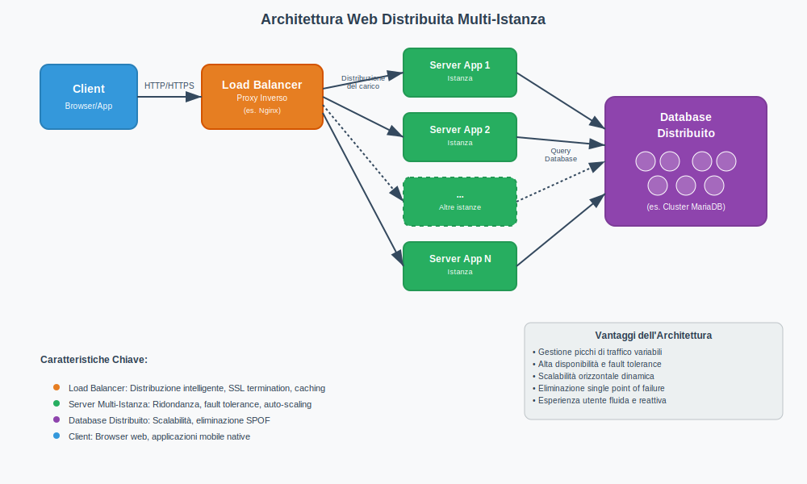

# Scalabilità e Fault Tolerance nei Database Moderni: Tecniche e Implementazioni con MariaDB

- [Scalabilità e Fault Tolerance nei Database Moderni: Tecniche e Implementazioni con MariaDB](#scalabilità-e-fault-tolerance-nei-database-moderni-tecniche-e-implementazioni-con-mariadb)
  - [1. Introduzione alla Scalabilità nelle Applicazioni Web Distribuite](#1-introduzione-alla-scalabilità-nelle-applicazioni-web-distribuite)
    - [1.1. Architettura di Riferimento: Applicazione Web Multi-Istanza](#11-architettura-di-riferimento-applicazione-web-multi-istanza)
    - [1.2. Il Ruolo del Database Distribuito](#12-il-ruolo-del-database-distribuito)
  - [2. Concetti Chiave: Scalabilità e Fault Tolerance per i Database](#2-concetti-chiave-scalabilità-e-fault-tolerance-per-i-database)
    - [2.1. Scalabilità (Scaling)](#21-scalabilità-scaling)
    - [2.2. Fault Tolerance (Resilienza ai Guasti)](#22-fault-tolerance-resilienza-ai-guasti)
  - [3. Tecniche di Implementazione della Scalabilità e Fault Tolerance nei Database](#3-tecniche-di-implementazione-della-scalabilità-e-fault-tolerance-nei-database)
    - [3.1. Replicazione dei Dati](#31-replicazione-dei-dati)
    - [3.2. Partizionamento dei Dati (Sharding)](#32-partizionamento-dei-dati-sharding)
    - [3.3. Clustering di Database](#33-clustering-di-database)
  - [4. MariaDB e la Scalabilità/Fault Tolerance](#4-mariadb-e-la-scalabilitàfault-tolerance)
    - [4.1. MariaDB Galera Cluster](#41-mariadb-galera-cluster)
    - [4.2. MariaDB Replication (Asincrona e Semi-Sincrona)](#42-mariadb-replication-asincrona-e-semi-sincrona)
    - [4.3 Un esempio di configurazione di applicazione ASP.NET Core con EF Core e MariaDB con più istanze database](#43-un-esempio-di-configurazione-di-applicazione-aspnet-core-con-ef-core-e-mariadb-con-più-istanze-database)
    - [4.4 Un esempio di applicazione ASP.NET Core con MariaDB e replicazione Master-Slave Tradizionale (senza MaxScale)](#44-un-esempio-di-applicazione-aspnet-core-con-mariadb-e-replicazione-master-slave-tradizionale-senza-maxscale)
    - [4.4. Proxy SQL (es. MariaDB MaxScale, ProxySQL, HAProxy)](#44-proxy-sql-es-mariadb-maxscale-proxysql-haproxy)
  - [5. Connessione a un Database Distribuito da Applicazioni ASP.NET Core](#5-connessione-a-un-database-distribuito-da-applicazioni-aspnet-core)
    - [5.2. Stringhe di Connessione per Ambienti Clusterizzati/Replicati (ADO.NET e EF Core)](#52-stringhe-di-connessione-per-ambienti-clusterizzatireplicati-adonet-e-ef-core)
    - [5.3. Configurazione di Entity Framework Core per Database Distribuiti](#53-configurazione-di-entity-framework-core-per-database-distribuiti)
  - [6. Gestione delle Operazioni di Lettura e Scrittura in un Ambiente Distribuito](#6-gestione-delle-operazioni-di-lettura-e-scrittura-in-un-ambiente-distribuito)
    - [6.1. Scritture: Indirizzamento al Nodo Primario o a Nodi Scrivibili](#61-scritture-indirizzamento-al-nodo-primario-o-a-nodi-scrivibili)
    - [6.2. Letture](#62-letture)
    - [6.3. Bilanciamento del Carico per le Letture](#63-bilanciamento-del-carico-per-le-letture)
  - [7. Considerazioni Finali](#7-considerazioni-finali)

## 1. Introduzione alla Scalabilità nelle Applicazioni Web Distribuite

Le moderne applicazioni web sono spesso progettate per servire un numero elevato e, soprattutto, variabile di utenti concorrenti. Questa variabilità, che può manifestarsi con picchi di traffico improvvisi (ad esempio, durante campagne promozionali o eventi specifici) e periodi di minore attività, pone sfide significative all'infrastruttura sottostante. Per gestire tale carico in modo efficiente, garantendo al contempo un'esperienza utente fluida e reattiva, queste applicazioni vengono frequentemente implementate come sistemi distribuiti multi-istanza. L'incapacità di gestire adeguatamente questi picchi può tradursi in rallentamenti, errori o, nel peggiore dei casi, indisponibilità del servizio.

### 1.1. Architettura di Riferimento: Applicazione Web Multi-Istanza

Consideriamo un'architettura tipica, ormai standard per molte applicazioni web di medie e grandi dimensioni:

- **Client:** Browser web su desktop o dispositivi mobili, oppure applicazioni native (mobile app) che inviano richieste HTTP/HTTPS al backend.

- **Load Balancer/Proxy Inverso:** Questo componente agisce come un "vigile urbano" del traffico di rete. Non si limita a distribuire le richieste, ma può anche svolgere funzioni aggiuntive come la terminazione SSL (decrittografando le richieste HTTPS per alleggerire i server applicativi), la compressione dei dati, il caching di contenuti statici e la protezione da alcuni tipi di attacchi (es. DDoS a livello applicativo). La sua capacità di distribuire il carico in modo intelligente (es. round-robin, least connections, IP hash) è fondamentale per evitare che singole istanze del server applicativo vengano sovraccaricate.

- **Istanze del Server Applicativo:** Molteplici copie identiche (cloni) del backend dell'applicazione. Se un'istanza dovesse fallire o diventare troppo lenta, il load balancer può smettere di inviarle traffico, reindirizzandolo verso le altre istanze sane. Questa ridondanza è il primo livello di fault tolerance dell'applicazione. La capacità di aggiungere o rimuovere dinamicamente queste istanze (auto-scaling) in base al carico effettivo è una caratteristica chiave delle piattaforme cloud moderne.

- **Database Distribuito:** Il cuore della persistenza dei dati. Se tutte le istanze applicative si affidassero a un singolo server di database monolitico, questo diventerebbe inevitabilmente il collo di bottiglia (bottleneck) e il single point of failure (SPOF) dell'intera architettura. Un database distribuito, invece, è esso stesso composto da più nodi che collaborano per archiviare e servire i dati, implementando meccanismi intrinseci di scalabilità e fault tolerance.



Quando un'istanza del server applicativo necessita di accedere o modificare i dati (eseguire una query di lettura o un'operazione di scrittura), si connette al sistema di database distribuito. Se il database non fosse distribuito, un aumento del numero di istanze applicative porterebbe rapidamente alla saturazione delle risorse del singolo server di database (CPU, RAM, I/O del disco, numero massimo di connessioni), vanificando i benefici della scalabilità a livello applicativo.

### 1.2. Il Ruolo del Database Distribuito

Un database distribuito è cruciale in questo scenario perché deve essere in grado di:

1. **Gestire un elevato numero di connessioni e query:** Ogni istanza applicativa può mantenere un pool di connessioni verso il database. Con decine o centinaia di istanze applicative, il numero totale di connessioni e query concorrenti può diventare molto elevato. Il database deve gestire efficientemente queste connessioni e parallelizzare l'esecuzione delle query.

2. **Scalare:** Man mano che l'applicazione cresce (più utenti, più dati, funzionalità più complesse), il database deve poter aumentare la propria capacità di elaborazione e archiviazione. Se il database non scala, diventa il freno principale alla crescita dell'intera applicazione.

3. **Garantire la fault tolerance:** In un sistema con molti componenti, i guasti sono inevitabili. Un database distribuito deve essere progettato per continuare a funzionare, o almeno a garantire l'integrità e l'accessibilità dei dati, anche in caso di guasto di uno o più dei suoi nodi server, dischi o connessioni di rete. La perdita di dati o un downtime prolungato del database possono avere impatti economici e reputazionali devastanti.

## 2. Concetti Chiave: Scalabilità e Fault Tolerance per i Database

### 2.1. Scalabilità (Scaling)

La scalabilità di un database si riferisce alla sua capacità di aumentare le proprie prestazioni (es. numero di transazioni al secondo, tempi di risposta delle query) e/o la capacità di archiviazione in risposta a un aumento della domanda, mantenendo o migliorando i livelli di servizio.

- **Scalabilità Verticale (Scale-Up):** Consiste nell'aumentare le risorse di un singolo server di database. Ad esempio, si potrebbe passare da una CPU a 8 core a una a 32 core, aumentare la RAM da 64GB a 256GB, o sostituire dischi SSD SATA con dischi NVMe più performanti.

    - **Vantaggi:** Relativamente semplice da implementare a livello infrastrutturale, poiché non richiede modifiche significative all'architettura del software del database stesso o dell'applicazione che vi accede (la stringa di connessione, ad esempio, rimane la stessa).

    - **Svantaggi:** Ha un limite fisico e tecnologico superiore (non esistono server infinitamente potenti). Il costo delle componenti hardware di fascia alta cresce in modo non lineare, spesso esponenziale, rendendo questa soluzione antieconomica oltre una certa soglia. Inoltre, un guasto al singolo server, per quanto potente, comporta un downtime completo del database, rendendolo un single point of failure.

- **Scalabilità Orizzontale (Scale-Out):** Consiste nell'aggiungere più server (nodi) a un sistema di database distribuito o cluster. Il carico di lavoro (query) e i dati stessi vengono distribuiti tra questi nodi. Ad esempio, invece di un server con 32 core, si potrebbero usare quattro server con 8 core ciascuno.

    - **Vantaggi:** Potenzialmente illimitata in termini di capacità e prestazioni (si possono teoricamente aggiungere nodi all'infinito, anche se con rendimenti decrescenti oltre un certo punto). Può migliorare intrinsecamente la fault tolerance, poiché il guasto di un nodo non compromette l'intero sistema se i dati sono replicati. Generalmente offre un rapporto prezzo/prestazioni migliore per carichi molto elevati rispetto allo scale-up estremo.

    - **Svantaggi:** Molto più complessa da progettare, implementare e gestire. Richiede meccanismi sofisticati per la distribuzione dei dati (sharding), la sincronizzazione delle modifiche tra i nodi (replicazione), la gestione della consistenza dei dati (es. protocolli di consenso distribuito), il routing delle query al nodo corretto e la gestione della membership del cluster.

Quando e perché Scalare:

La necessità di scalare sorge quando le prestazioni del database degradano al di sotto di soglie accettabili. Questo può manifestarsi con:

- Tempi di risposta delle query che aumentano progressivamente.

- Utilizzo elevato e costante di CPU, RAM o I/O del disco sui server di database.

- Errori di timeout o connessioni rifiutate dall'applicazione a causa del sovraccarico del database.

- Impossibilità di gestire picchi di traffico senza un degrado significativo delle prestazioni.

Un esempio pratico: un sito di e-commerce che durante il Black Friday vede un aumento di 10 volte del traffico. Se il database non è scalabile, gli utenti potrebbero non riuscire a caricare le pagine dei prodotti, aggiungere articoli al carrello o completare gli acquisti, con una diretta perdita di vendite.

### 2.2. Fault Tolerance (Resilienza ai Guasti)

La fault tolerance è la capacità di un sistema di continuare a operare correttamente, possibilmente a un livello di prestazioni ridotto (concetto di "graceful degradation", ad esempio il sistema potrebbe rispondere più lentamente ma continuare a servire le richieste essenziali), anche in presenza di guasti hardware (rottura di un disco, guasto della CPU o della RAM, interruzione dell'alimentazione), software (bug nel DBMS, crash del sistema operativo) o di rete (interruzione della connettività tra nodi).

Importanza della Fault Tolerance:

Per molte aziende, specialmente quelle online, un downtime del database si traduce direttamente in:

- **Perdita economica:** Mancate vendite, interruzione di processi produttivi.

- **Danno alla reputazione:** Perdita di fiducia da parte degli utenti, che potrebbero rivolgersi alla concorrenza.

- **Implicazioni legali o contrattuali:** Mancato rispetto degli Service Level Agreement (SLA) con i clienti.

- **Perdita di produttività interna:** Se i sistemi interni dipendono dal database.

La fault tolerance mira a minimizzare la probabilità di downtime e, in caso di guasto, a ridurre il tempo di ripristino (Mean Time To Recovery - MTTR).

Tecniche Comuni:

Le tecniche principali per ottenere la fault tolerance si basano sulla ridondanza:

- **Ridondanza dei dati:** Mantenere copie multiple dei dati su server o dischi distinti (tramite replicazione).

- **Ridondanza dei componenti hardware:** Utilizzare alimentatori ridondanti, schede di rete multiple, configurazioni RAID per i dischi.

- Ridondanza dei server: Avere server di backup pronti a subentrare (failover).

    Il failover automatico è il processo mediante il quale il sistema rileva un guasto e reindirizza automaticamente il carico di lavoro dal componente guasto a un componente ridondante funzionante, idealmente senza intervento manuale e con un'interruzione minima o nulla del servizio percepita dall'utente. Ad esempio, se un nodo master di un database fallisce, un sistema di fault tolerance potrebbe promuovere automaticamente una delle sue repliche a nuovo master.

## 3. Tecniche di Implementazione della Scalabilità e Fault Tolerance nei Database

### 3.1. Replicazione dei Dati

Cos'è la Replicazione:

La replicazione è il processo di creazione e mantenimento di copie multiple (chiamate repliche o slave) degli stessi dati su server di database fisicamente distinti (nodi). Ogni modifica apportata ai dati sul server "sorgente" (master o primario) viene propagata alle repliche.

Benefici:

Oltre a quelli già menzionati (fault tolerance, read scaling, disaster recovery, analisi), la replicazione può anche facilitare migrazioni di database o aggiornamenti con downtime minimo, permettendo di operare su una replica mentre il sistema primario continua a funzionare.

**Tipi di Replicazione:**

1. **Master-Slave (o Primario-Replica):**

    - Il Master è il punto di riferimento autorevole per i dati. La sua criticità risiede nel fatto che, se fallisce e non esiste un meccanismo di failover rapido ed efficiente, le operazioni di scrittura sull'intero sistema si bloccano. La promozione di uno Slave a nuovo Master può essere un processo complesso, che richiede la ri-configurazione degli altri Slave e delle applicazioni per puntare al nuovo Master. Se la replicazione è asincrona, c'è anche il rischio che le transazioni commesse sul vecchio Master poco prima del suo fallimento non siano state ancora propagate allo Slave scelto per la promozione, causando una potenziale perdita di dati.

    - Il "replication lag" (ritardo di replicazione) è un parametro importante da monitorare: un lag eccessivo significa che le letture dagli Slave potrebbero restituire dati significativamente obsoleti.

2. **Master-Master (o Multi-Primario):**

    - La sfida principale è la gestione dei conflitti di scrittura. Ad esempio, se due utenti modificano lo stesso record cliente su due nodi Master diversi contemporaneamente, quale modifica deve prevalere? Le strategie di risoluzione dei conflitti includono: "last writer wins" (l'ultima scrittura sovrascrive le precedenti, basandosi su timestamp), "first writer wins", oppure meccanismi più complessi che richiedono l'intervento manuale o logiche applicative specifiche. Alcuni sistemi multi-master, come Galera Cluster, utilizzano un approccio di certificazione delle transazioni per prevenire i conflitti a monte.

```mermaid
---
title: Replicazione Master-Slave vs Master-Master
---
flowchart TD
    subgraph LEGEND ["📋 Legenda"]
        L1["📊 Master: Scrittura + Lettura"]
        L2["📖 Slave: Solo Lettura"]  
        L3["🔄 Replicazione Asincrona"]
        L4["⚡ Possibile Replication Lag"]
    end
    
    LEGEND --- MS
    LEGEND --- MM
    
    subgraph MS ["🔄 Master-Slave"]
        direction TB
        M1["📊 MASTER<br/>Read/Write<br/>Primary Source"]
        
        S1["📖 SLAVE 1<br/>Read Only<br/>Replica"]
        S2["📖 SLAVE 2<br/>Read Only<br/>Replica"]
        S3["📖 SLAVE 3<br/>Read Only<br/>Replica"]
        
        M1 -->|"Async Replication<br/>Binary Log"| S1
        M1 -->|"Async Replication<br/>Binary Log"| S2  
        M1 -->|"Async Replication<br/>Binary Log"| S3
    end
    
    subgraph MM ["⚖️ Master-Master"]
        direction TB
        M2["📊 MASTER 1<br/>Read/Write<br/>Active-Active"]
        M3["📊 MASTER 2<br/>Read/Write<br/>Active-Active"]
        S4["📖 SLAVE A<br/>Read Only"]
        S5["📖 SLAVE B<br/>Read Only"]
        
        M2 <-->|"Bidirectional<br/>Replication<br/>Conflict Resolution"| M3
        M2 -->|Replication| S4
        M3 -->|Replication| S5
    end
    
    classDef masterStyle fill:#e74c3c,stroke:#c0392b,stroke-width:3px,color:#fff,font-size:12px,font-weight:bold
    classDef slaveStyle fill:#27ae60,stroke:#229954,stroke-width:3px,color:#fff,font-size:12px,font-weight:bold
    classDef legendStyle fill:#f8f9fa,stroke:#6c757d,stroke-width:2px,font-size:11px
    
    class M1,M2,M3 masterStyle
    class S1,S2,S3,S4,S5 slaveStyle
    class L1,L2,L3,L4 legendStyle
```



**Replicazione Sincrona vs. Asincrona:**

- **Replicazione Sincrona:** Immaginate di dover spedire un pacco importante e di volere la certezza assoluta che sia arrivato a destinazione prima di considerare il vostro compito concluso. Con la replicazione sincrona, il server Master attende una conferma esplicita da (almeno) una o più repliche che la modifica sia stata scritta con successo sui loro dischi. Questo garantisce che, in caso di fallimento del Master, i dati sulle repliche sincrone siano perfettamente aggiornati. Tuttavia, se una replica sincrona è lenta o irraggiungibile, l'intera operazione di scrittura sul Master viene rallentata o bloccata, impattando la latenza e la disponibilità delle scritture.

- **Replicazione Asincrona:** Il Master processa la scrittura e la conferma all'applicazione immediatamente dopo averla scritta localmente. La propagazione alle repliche avviene "in background", senza che il Master attenda il loro completamento. Questo offre la minima latenza di scrittura possibile, ma introduce il rischio che, in caso di crash improvviso del Master, le transazioni più recenti potrebbero non essere ancora arrivate alle repliche.

- **Replicazione Semi-Sincrona:** Un compromesso: il Master attende la conferma che almeno una replica abbia *ricevuto* i dati della transazione (tipicamente scritti nel suo relay log), ma non necessariamente che li abbia *applicati* (commessi) al dataset. Questo riduce significativamente la finestra di potenziale perdita di dati rispetto alla replicazione asincrona, pur mantenendo una latenza di scrittura inferiore rispetto a quella completamente sincrona.

Implicazioni per Consistenza, Disponibilità e Latenza (Teorema CAP):

Il [Teorema CAP](https://en.wikipedia.org/wiki/CAP_theorem) (Consistency, Availability, Partition Tolerance)[^1] postula che in un sistema distribuito è impossibile garantire contemporaneamente tutte e tre queste proprietà. Poiché la tolleranza alle partizioni di rete (la capacità del sistema di continuare a funzionare nonostante interruzioni di comunicazione tra i nodi) è generalmente considerata un requisito non negoziabile per i sistemi distribuiti reali, la scelta si riduce spesso a un trade-off tra Consistenza e Disponibilità.

- La **replicazione sincrona** privilegia la Consistenza (tutti i nodi vedono gli stessi dati) a scapito della Disponibilità (se i nodi non possono comunicare per sincronizzarsi, il sistema potrebbe bloccarsi per le scritture).

- La **replicazione asincrona** privilegia la Disponibilità e la bassa latenza di scrittura, ma può portare a una consistenza più debole (consistenza eventuale), dove le repliche potrebbero temporaneamente divergere dal master.

### 3.2. Partizionamento dei Dati (Sharding)

Cos'è lo Sharding:

Lo sharding è una tecnica di database design in cui un database molto grande viene suddiviso orizzontalmente in porzioni più piccole, più veloci e più facili da gestire, chiamate shard. Ogni shard è di fatto un database indipendente, con il proprio sottoinsieme di dati, e può risiedere su un server separato. L'obiettivo è distribuire il carico di dati e di query su più server.

**Strategie di Sharding (Scelta della Chiave di Sharding):**

- **Range-based sharding:** Ad esempio, in un database di ordini, gli ordini di Gennaio-Marzo potrebbero essere sullo Shard 1, Aprile-Giugno sullo Shard 2, ecc. Oppure, utenti con cognome A-F su uno shard, G-M su un altro. Facile da implementare, ma può portare a "hot spot" se i dati non sono distribuiti uniformemente (es. molti più ordini a Dicembre).

- **Hash-based sharding:** Si applica una funzione hash alla chiave di sharding (es. `hash(ID_Cliente) % NumeroDiShard`). Questo tende a distribuire i dati in modo più casuale e uniforme tra gli shard, riducendo il rischio di hot spot. Tuttavia, le query che richiedono un intervallo di dati (es. "tutti gli utenti con ID tra 100 e 200") diventano complesse, poiché i dati relativi potrebbero essere sparsi su più shard.

- **Directory-based sharding:** Una tabella di lookup (la directory) mantiene una mappa esplicita tra ogni valore della chiave di sharding (o un suo range) e lo shard fisico su cui risiedono i dati. Offre grande flessibilità (si possono spostare dati tra shard aggiornando la directory), ma la directory stessa può diventare un collo di bottiglia o un single point of failure se non è a sua volta distribuita e altamente disponibile.

```mermaid
---
title: Database Sharding Strategies
---
flowchart TD
    subgraph RANGE ["📊 Range-Based Sharding"]
        RS1[🗄️ SHARD A<br/>Users: A-F<br/>Range: 1-1000]
        RS2[🗄️ SHARD B<br/>Users: G-M<br/>Range: 1001-2000]
        RS3[🗄️ SHARD C<br/>Users: N-Z<br/>Range: 2001-3000]
    end
    
    subgraph HASH ["🔀 Hash-Based Sharding"]
        HS1[🗄️ SHARD 1<br/>hash key mod 3 = 0]
        HS2[🗄️ SHARD 2<br/>hash key mod 3 = 1] 
        HS3[🗄️ SHARD 3<br/>hash key mod 3 = 2]
    end
    
    subgraph DIRECTORY ["📋 Directory-Based Sharding"]
        DIR[📚 DIRECTORY<br/>Lookup Table<br/>Key → Shard Mapping]
        DS1[🗄️ SHARD X]
        DS2[🗄️ SHARD Y]
        DS3[🗄️ SHARD Z]
        
        DIR --> DS1
        DIR --> DS2
        DIR --> DS3
    end
    
    subgraph COMPARISON ["⚖️ Confronto Strategie"]
        C1[📊 Range: Semplice ma Hot-Spots]
        C2[🔀 Hash: Distribuzione uniforme]
        C3[📋 Directory: Flessibile ma overhead]
    end
    
    RANGE --> HASH
    HASH --> DIRECTORY
    DIRECTORY --> COMPARISON
    
    classDef shardNode fill:#f39c12,stroke:#e67e22,stroke-width:3px,color:#fff
    classDef directoryNode fill:#95a5a6,stroke:#7f8c8d,stroke-width:3px,color:#fff
    classDef comparisonNode fill:#3498db,stroke:#2980b9,stroke-width:2px,color:#fff
    
    class RS1,RS2,RS3,HS1,HS2,HS3,DS1,DS2,DS3 shardNode
    class DIR directoryNode
    class C1,C2,C3 comparisonNode
```



**Svantaggi e Complessità dello Sharding:**

- **Query Cross-Shard:** Se una query necessita di dati che risiedono su più shard (es. un `JOIN` tra una tabella `Clienti` su Shard A e una tabella `Ordini` su Shard B, o una query aggregata che copre tutti gli shard), l'applicazione o un livello intermedio (router di query) deve interrogare i singoli shard e poi aggregare i risultati. Questo aumenta la latenza e la complessità.

- **Hot Spot:** Se la chiave di sharding non distribuisce uniformemente l'attività di scrittura o lettura, alcuni shard possono diventare sovraccarichi ("hot") mentre altri rimangono sottoutilizzati ("cold"). Ad esempio, in un social network, i dati di una celebrità potrebbero concentrare un enorme traffico su un singolo shard.

- **Resharding:** Aggiungere nuovi shard a un sistema esistente o ribilanciare i dati tra shard (ad esempio, perché uno shard sta diventando troppo grande o troppo "caldo") è un'operazione complessa che può richiedere la movimentazione di grandi quantità di dati e deve essere eseguita con attenzione per minimizzare l'impatto sulla disponibilità dell'applicazione.

### 3.3. Clustering di Database

Cos'è un Cluster di Database:

Un cluster di database è un insieme di server (nodi) interconnessi che lavorano collettivamente e si presentano all'applicazione come una singola entità logica di database. Il clustering è la base per molte soluzioni di alta disponibilità e scalabilità.

**Architetture di Cluster:**

- **Shared-Nothing:** Ogni nodo possiede le proprie risorse computazionali (CPU, RAM) e di storage (dischi). I dati sono tipicamente partizionati (sharding) e/o replicati tra i nodi. La comunicazione e la coordinazione avvengono esclusivamente tramite la rete. Questa architettura è altamente scalabile orizzontalmente.

- **Shared-Disk:** Tutti i nodi del cluster accedono a un sistema di storage centralizzato e condiviso (tipicamente una Storage Area Network - SAN). Ogni nodo ha la propria CPU e RAM, ma i dati risiedono su dischi accessibili da tutti. Questo richiede un sofisticato Distributed Lock Manager (DLM) per coordinare l'accesso concorrente ai blocchi di dati sullo storage condiviso ed evitare corruzioni. È più complesso da scalare rispetto a shared-nothing a causa dei potenziali colli di bottiglia nello storage condiviso o nel DLM.

- **Shared-Memory:** Tutti i processori (nodi) condividono la stessa memoria fisica. Questa architettura è tipica dei sistemi multiprocessore simmetrici (SMP) su un singolo server e non è generalmente considerata un'architettura di clustering di database distribuito tra più server fisici.

## 4. MariaDB e la Scalabilità/Fault Tolerance

### 4.1. MariaDB Galera Cluster

Architettura e Funzionamento:

MariaDB Galera Cluster si basa sul concetto di "certificazione" delle transazioni. Quando un nodo riceve una transazione, prima di commetterla localmente, la invia a tutti gli altri nodi del cluster. Ogni nodo verifica se la transazione può essere applicata senza conflitti con altre transazioni in corso (processo di certificazione). Se tutti i nodi concordano, la transazione viene commessa su tutti i nodi contemporaneamente (o quasi, da cui "virtually synchronous"). Se un nodo rileva un conflitto, la transazione viene abortita su tutti i nodi e l'applicazione riceve un errore, dovendo tipicamente ritentare la transazione. Questo garantisce una forte consistenza.

```mermaid
---
title: MariaDB Galera Cluster Architecture
---
flowchart TD
    subgraph GALERA ["🔗 MariaDB Galera Cluster"]
        direction TB
        N1[📊 NODE 1<br/>Master<br/>Read/Write]
        N2[📊 NODE 2<br/>Master<br/>Read/Write] 
        N3[📊 NODE 3<br/>Master<br/>Read/Write]
        
        N1 <-->|Sync Replication<br/>wsrep| N2
        N2 <-->|Sync Replication<br/>wsrep| N3
        N3 <-->|Sync Replication<br/>wsrep| N1
    end
    
    subgraph FEATURES ["✨ Caratteristiche Galera"]
        F1[🎯 Replicazione Sincrona Virtuale]
        F2[🏆 Tutti i nodi sono Master]
        F3[✅ Certificazione Trans.]
        F4[🛡️ Prevenzione Split-Brain]
        F5[📊 Forte Consistenza]
    end
    
    GALERA --> FEATURES
    
    classDef galeraNode fill:#e74c3c,stroke:#c0392b,stroke-width:3px,color:#fff
    classDef featureNode fill:#3498db,stroke:#2980b9,stroke-width:2px,color:#fff
    
    class N1,N2,N3 galeraNode
    class F1,F2,F3,F4,F5 featureNode
```



Con Galera Cluster e EF Core + Pomelo, la gestione delle connessioni è diversa rispetto a una configurazione master-slave tradizionale.

Nel **Galera Cluster** tutti i nodi sono master (multi-master), quindi ogni nodo può gestire sia letture che scritture. Ecco come configurarlo:

**Configurazione Connection String con un Galera Cluster:**

```json
// appsettings.json
{"ConnectionStrings":{"DefaultConnection":"Server=galera-node1,galera-node2,galera-node3;Port=3306;Database=MyApp;Uid=myuser;Pwd=mypass;ConnectionTimeout=30;CommandTimeout=300;"}}
```

**Approcci di gestione:**

**1. Connection String con Multiple Hosts (Pomelo supporta failover automatico):**

- Pomelo MySQL prova automaticamente i server nell'ordine specificato
- Se un nodo fallisce, passa automaticamente al successivo

**2. Load Balancer Database (HAProxy/ProxySQL):**

```text
// Connessione tramite proxy database"Server=db-proxy;Port=3306;Database=MyApp;..."
```

**3. Configurazione EF Core per ottimizzare Galera:**

```cs
services.AddDbContext<ApplicationDbContext>(options =>
{    
  options.UseMySql(connectionString, serverVersion, mySqlOptions =>
  {// Ottimizzazioni per Galera        
  mySqlOptions.EnableRetryOnFailure(
    maxRetryCount:3,
    maxRetryDelay: TimeSpan.FromSeconds(5),
    errorNumbersToAdd:null);
  });
});
```

**Vantaggi del Galera Cluster:**

- Non serve distinguere tra letture/scritture
- Failover automatico
- Sincronizzazione sincrona tra nodi
- Ogni nodo ASP.NET può connettersi a qualsiasi nodo Galera

**Vantaggi per Scalabilità e Alta Disponibilità:**

- La scalabilità delle scritture in Galera è limitata dal fatto che ogni scrittura deve essere processata da ogni nodo del cluster. L'aggiunta di nodi aumenta la capacità di gestire letture e la resilienza, ma può aumentare la latenza delle scritture se la rete è lenta o se i nodi sono sovraccarichi.

**Considerazioni:**

- Il problema dello "split-brain" si verifica se una partizione di rete divide il cluster in due o più sottogruppi isolati, ognuno dei quali potrebbe pensare di essere il gruppo primario e continuare ad accettare scritture, portando a divergenze di dati. Avere un numero dispari di nodi (almeno 3) permette al cluster di raggiungere un quorum (la maggioranza dei nodi) e decidere quale partizione continua ad operare, mentre le altre si mettono in uno stato di sola lettura o si spengono per prevenire divergenze.

- La latenza di rete è critica: poiché le transazioni richiedono comunicazione tra tutti i nodi per la certificazione, una rete lenta o con alta latenza impatterà direttamente i tempi di commit delle transazioni. Per questo motivo, i nodi di un cluster Galera sono spesso collocati nello stesso data center o in data center con connessioni a bassissima latenza.

**MariaDB Galera Cluster vs Sharding:**

- MariaDB Galera Cluster non implementa lo sharding nativamente come sua funzionalità principale.

- Galera Cluster è una soluzione di **clustering multi-master sincrono**. Questo significa che:

  - Ogni nodo nel cluster Galera contiene una copia completa di **tutti i dati**.
  - Le scritture possono avvenire su qualsiasi nodo e vengono replicate in modo sincrono (o virtualmente sincrono) su tutti gli altri nodi, garantendo forte consistenza.

- Lo **sharding**, invece, è una tecnica di **partizionamento orizzontale dei dati**, dove il dataset viene diviso in sottoinsiemi più piccoli (shard), e ogni shard contiene una porzione differente dei dati totali. Ogni shard può poi essere ospitato su un server o un cluster separato.

- In sintesi:

  - **Galera Cluster:** Replica l'intero dataset su ogni nodo per alta disponibilità e consistenza.
  - **Sharding:** Divide il dataset tra più server/cluster, dove ogni server/cluster gestisce solo una parte dei dati.

- Strumenti come MariaDB MaxScale (con il suo Spider storage engine o specifici router) possono essere usati per implementare logiche di sharding sopra a infrastrutture MariaDB, che potrebbero includere nodi Galera.

### 4.2. MariaDB Replication (Asincrona e Semi-Sincrona)

**Configurazione Master-Slave:**

- Il **binary log** (binlog) del Master è il cuore della replicazione. È un file (o una serie di file) in cui il Master registra tutte le istruzioni SQL che modificano i dati (INSERT, UPDATE, DELETE) o la struttura delle tabelle (CREATE TABLE, ALTER TABLE). Gli Slave si connettono al Master, leggono questi eventi dal binlog e li riproducono sui propri dati.

- **Global Transaction ID (GTID):** Prima dei GTID, la replicazione si basava sulla posizione nel file di log binario (nome del file e offset). Questo rendeva operazioni come il failover o l'aggiunta di un nuovo slave più complesse e soggette a errori. Con i GTID, ogni transazione riceve un identificatore univoco (es. `server_uuid:transaction_id`) che è lo stesso su tutti i server della topologia. Questo permette a uno slave di sapere esattamente quali transazioni ha già applicato, indipendentemente dal server da cui le riceve, semplificando enormemente la promozione di uno slave a master o la riconfigurazione della topologia.

**Tipi di Replicazione Supportati:**

- **Semi-Sincrona:** Quando si configura la replicazione semi-sincrona, il Master, dopo aver commesso una transazione localmente, attende che almeno N slave (configurabile, solitamente N=1) confermino di aver ricevuto gli eventi di log nel loro relay log. Solo dopo questa conferma, il Master sblocca la sessione client. Questo non garantisce che lo slave abbia *applicato* la transazione, ma solo che l'abbia *ricevuta*, riducendo la finestra temporale per la perdita di dati in caso di crash del master.
- **I 3 tipi di replicazione** che si possono configurare:

  | **Tipo** | **Master aspetta?** | **Garanzia** | **Performance** | **Durabilità** |
  | --- |  --- |  --- |  --- |  --- |
  | **Asincrona** | No | Nessuna | 🚀 Massima | ⚠️ Possibile perdita dati |
  | **Semi-Sincrona** | Sì (ricezione) | Media | 🔶 Buona | ✅ Perdita dati minima |
  | **Sincrona** | Sì (applicazione) | Massima | 🐌 Lenta | 🛡️ Zero perdita dati |

- ⚙️ **Configurazione Semi-Sincrona in Docker:**

```yaml
# docker-compose.yml
services:
  mariadb-master:
    image: mariadb:10.11
    environment:
      MYSQL_ROOT_PASSWORD: rootpassword
    volumes:
      - ./master-semisync.cnf:/etc/mysql/mariadb.conf.d/master.cnf
    command: >
      --plugin-load=semisync_master=semisync_master.so
      --rpl_semi_sync_master_enabled=1
      --rpl_semi_sync_master_wait_for_slave_count=1
      --rpl_semi_sync_master_timeout=1000

  mariadb-slave1:
    image: mariadb:10.11
    command: >
      --plugin-load=semisync_slave=semisync_slave.so
      --rpl_semi_sync_slave_enabled=1
```

- **master-semisync.cnf:**

```ini
[mysqld]
server-id=1
log-bin=mysql-bin
binlog-format=ROW

# GTID Configuration
gtid_strict_mode=1
log_slave_updates=1

# Semi-Sync Replication
rpl_semi_sync_master_enabled=1
rpl_semi_sync_master_wait_for_slave_count=1
rpl_semi_sync_master_timeout=1000  # 1 secondo timeout
```

- 🎯 **Implicazioni pratiche per ASP.NET Core:**

  - **Connection String con Semi-Sync:**

    ```json
    {
      "ConnectionStrings": {
        "WriteConnection": "Server=master:3306;Database=myapp;Uid=user;Pwd=pass;CommandTimeout=5;",
        "ReadConnection": "Server=slave1,slave2:3306;Database=myapp;Uid=user;Pwd=pass;"
      }
    }
    ```

  - **EF Core con Retry Policy per Semi-Sync:**

    ```cs
    services.AddDbContext<ApplicationDbContext>(options =>
    {
        options.UseMySql(writeConnectionString, serverVersion, mySqlOptions =>
        {
            mySqlOptions.EnableRetryOnFailure(
                maxRetryCount: 3,
                maxRetryDelay: TimeSpan.FromSeconds(2),
                errorNumbersToAdd: null);
            
            // Timeout più alto per semi-sync
            mySqlOptions.CommandTimeout(5);
        });
    });
    ```

### 4.3 Un esempio di configurazione di applicazione ASP.NET Core con EF Core e MariaDB con più istanze database

Il codice applicativo ASP.NET di fatto non cambia rispetto al caso in cui si ha una solo backend ASP.NET e una sola istanza di database di MariaDB. Quello che cambia sono le configurazioni di EF Core e il setup dell'infrastruttura del database. Ad esempio, una semplice ASP.NET Minimal API come la seguente:

```cs
// Program.cs - Minimal API
using Microsoft.EntityFrameworkCore;

var builder = WebApplication.CreateBuilder(args);

// Configurazione DbContext - STESSO CODICE per Single DB, Galera o Master-Slave
builder.Services.AddDbContext<ApplicationDbContext>(options =>
{
    var connectionString = builder.Configuration.GetConnectionString("DefaultConnection");
    options.UseMySql(connectionString, ServerVersion.AutoDetect(connectionString), mySqlOptions =>
    {
        mySqlOptions.EnableRetryOnFailure(
            maxRetryCount: 3,
            maxRetryDelay: TimeSpan.FromSeconds(2),
            errorNumbersToAdd: null);
    });
});

// Repository registration
builder.Services.AddScoped<IProductRepository, ProductRepository>();

var app = builder.Build();

// Minimal API Endpoints - STESSO CODICE!
app.MapGet("/products", async (ApplicationDbContext context) =>
{
    var products = await context.Products.ToListAsync();
    return Results.Ok(products);
});

app.MapPost("/products", async (Product product, ApplicationDbContext context) =>
{
    context.Products.Add(product);
    await context.SaveChangesAsync(); // Stesso codice!
    return Results.Ok(product);
});

app.MapGet("/products/{id}", async (int id, ApplicationDbContext context) =>
{
    var product = await context.Products.FindAsync(id);
    return product is not null ? Results.Ok(product) : Results.NotFound();
});

app.MapPut("/products/{id}", async (int id, Product product, ApplicationDbContext context) =>
{
    var existingProduct = await context.Products.FindAsync(id);
    if (existingProduct is null) return Results.NotFound();
    
    existingProduct.Name = product.Name;
    existingProduct.Price = product.Price;
    
    await context.SaveChangesAsync(); // Stesso codice!
    return Results.Ok(existingProduct);
});

app.MapDelete("/products/{id}", async (int id, ApplicationDbContext context) =>
{
    var product = await context.Products.FindAsync(id);
    if (product is null) return Results.NotFound();
    
    context.Products.Remove(product);
    await context.SaveChangesAsync(); // Stesso codice!
    return Results.NoContent();
});

// Endpoints con Repository Pattern - STESSO CODICE!
app.MapGet("/api/products", async (IProductRepository repository) =>
{
    var products = await repository.GetAllAsync();
    return Results.Ok(products);
});

app.MapPost("/api/products", async (Product product, IProductRepository repository) =>
{
    await repository.AddAsync(product); // Identico!
    return Results.Ok(product);
});

app.MapGet("/api/products/{id}", async (int id, IProductRepository repository) =>
{
    var product = await repository.GetByIdAsync(id);
    return product is not null ? Results.Ok(product) : Results.NotFound();
});

app.Run();

// Repository Implementation - STESSO CODICE!
public class ProductRepository : IProductRepository
{
    private readonly ApplicationDbContext _context;

    public ProductRepository(ApplicationDbContext context)
    {
        _context = context;
    }

    public async Task<IEnumerable<Product>> GetAllAsync()
    {
        return await _context.Products.ToListAsync();
    }

    public async Task<Product?> GetByIdAsync(int id)
    {
        return await _context.Products.FindAsync(id);
    }

    public async Task AddAsync(Product product)
    {
        _context.Products.Add(product);
        await _context.SaveChangesAsync(); // Identico!
    }

    public async Task UpdateAsync(Product product)
    {
        _context.Products.Update(product);
        await _context.SaveChangesAsync(); // Identico!
    }

    public async Task DeleteAsync(int id)
    {
        var product = await _context.Products.FindAsync(id);
        if (product is not null)
        {
            _context.Products.Remove(product);
            await _context.SaveChangesAsync(); // Identico!
        }
    }
}

// Interface
public interface IProductRepository
{
    Task<IEnumerable<Product>> GetAllAsync();
    Task<Product?> GetByIdAsync(int id);
    Task AddAsync(Product product);
    Task UpdateAsync(Product product);
    Task DeleteAsync(int id);
}

// Entity
public class Product
{
    public int Id { get; set; }
    public string Name { get; set; } = string.Empty;
    public decimal Price { get; set; }
    public DateTime CreatedAt { get; set; } = DateTime.UtcNow;
}

// DbContext
public class ApplicationDbContext : DbContext
{
    public ApplicationDbContext(DbContextOptions<ApplicationDbContext> options) : base(options) { }
    
    public DbSet<Product> Products { get; set; }
    
    protected override void OnModelCreating(ModelBuilder modelBuilder)
    {
        modelBuilder.Entity<Product>(entity =>
        {
            entity.HasKey(e => e.Id);
            entity.Property(e => e.Name).IsRequired().HasMaxLength(200);
            entity.Property(e => e.Price).HasColumnType("decimal(18,2)");
        });
    }
}
```

Potrebbe funzionare allo stesso modo (ma con prestazioni differenti) in base alla differente stringa di connessione e al differente setup del cluster database:

🎯 **Connection String Configurations:**

- **Single MariaDB:**

```json

{"ConnectionStrings":{"DefaultConnection":"Server=localhost:3306;Database=myapp;Uid=user;Pwd=pass;"}}
```

- **Galera Cluster (open source e gratuito):**

```json
{"ConnectionStrings":{"DefaultConnection":"Server=galera-node1,galera-node2,galera-node3:3306;Database=myapp;Uid=user;Pwd=pass;"}}
```

- **Master-Slave con MaxScale (software a pagamento):**

```json
{"ConnectionStrings":{"DefaultConnection":"Server=maxscale-proxy:4006;Database=myapp;Uid=user;Pwd=pass;"}}
```

🔄 **Il punto chiave:**

Tutto il codice con `await context.SaveChangesAsync()` e `await context.Products.ToListAsync()` rimane **identico** perché:

- **EF Core** astrae la connessione database
- **Pomelo MySQL** gestisce failover e load balancing
- **Connection pooling** è trasparente
- **Retry policies** sono configurate una volta

Che si abbia un singolo MariaDB, un Galera Cluster a 5 nodi, o un Master-Slave con 10 repliche di lettura, **il codice applicativo non cambia mai!**

**Setup di un Galera Cluster con Docker Compose:**

MariaDB Galera Cluster è completamente gratuito e open source.

Configurazione Docker per Galera Cluster:

Si riporta di seguito un esempio di `docker-compose.yml` per creare un cluster a 3 nodi:

```yaml
services:
  mariadb-galera-1:
    image: mariadb:10.11
    environment:
      MYSQL_ROOT_PASSWORD: rootpassword
      MYSQL_DATABASE: myapp
      MYSQL_USER: appuser
      MYSQL_PASSWORD: apppassword
    volumes:
      - galera1_data:/var/lib/mysql
      - ./galera.cnf:/etc/mysql/mariadb.conf.d/galera.cnf
    ports:
      - "3306:3306"
    networks:
      - galera-network
    command: >
      --wsrep-new-cluster
      --wsrep-node-address=mariadb-galera-1
      --wsrep-node-name=galera-1

  mariadb-galera-2:
    image: mariadb:10.11
    environment:
      MYSQL_ROOT_PASSWORD: rootpassword
      MYSQL_DATABASE: myapp
      MYSQL_USER: appuser
      MYSQL_PASSWORD: apppassword
    volumes:
      - galera2_data:/var/lib/mysql
      - ./galera.cnf:/etc/mysql/mariadb.conf.d/galera.cnf
    ports:
      - "3307:3306"
    networks:
      - galera-network
    command: >
      --wsrep-node-address=mariadb-galera-2
      --wsrep-node-name=galera-2
    depends_on:
      - mariadb-galera-1

  mariadb-galera-3:
    image: mariadb:10.11
    environment:
      MYSQL_ROOT_PASSWORD: rootpassword
      MYSQL_DATABASE: myapp
      MYSQL_USER: appuser
      MYSQL_PASSWORD: apppassword
    volumes:
      - galera3_data:/var/lib/mysql
      - ./galera.cnf:/etc/mysql/mariadb.conf.d/galera.cnf
    ports:
      - "3308:3306"
    networks:
      - galera-network
    command: >
      --wsrep-node-address=mariadb-galera-3
      --wsrep-node-name=galera-3
    depends_on:
      - mariadb-galera-1

volumes:
  galera1_data:
  galera2_data:
  galera3_data:

networks:
  galera-network:
    driver: bridge
```

File di configurazione `galera.cnf`:

```ini
[galera]
wsrep_on=ON
wsrep_provider=/usr/lib/galera/libgalera_smm.so
wsrep_cluster_name="galera_cluster"
wsrep_cluster_address="gcomm://mariadb-galera-1,mariadb-galera-2,mariadb-galera-3"
wsrep_sst_method=rsync
binlog_format=ROW
default_storage_engine=InnoDB
innodb_autoinc_lock_mode=2
```

Come avviare:

```sh
# Crea i file di configurazione
mkdir galera-cluster && cd galera-cluster

# Crea galera.cnf (copia il contenuto sopra)

# Avvia il cluster
docker-compose up -d

# Verifica lo stato del cluster
docker exec -it galera-cluster_mariadb-galera-1_1 mysql -u root -p -e "SHOW STATUS LIKE 'wsrep_cluster_size';"
```

Connection string ASP.NET Core:

```json

{"ConnectionStrings":{"DefaultConnection":"Server=localhost:3306,localhost:3307,localhost:3308;Database=myapp;Uid=appuser;Pwd=apppassword;"}}
```

Vantaggi:

- **Completamente gratuito** (MariaDB è open source)
- **Alta disponibilità** automatica
- **Sincronizzazione sincrona** dei dati
- **Failover automatico** senza perdita dati
- **Scalabilità orizzontale** per letture e scritture

Graficamente lo scenario in cui il database è costituito da un **Galera Cluster** è rappresentato nel seguente mermaid nel quale è stata anche ipotizzata una architettura multi-server con reverse proxy/load balancer che fa anche da terminatore della connessione HTTPS:

```mermaid
graph TB
    %% Client Layer
    C1[📱 Mobile Client]
    C2[💻 Web Browser]
    C3[🖥️ Desktop App]
    C4[⚙️ API Client]
    
    %% Load Balancer/Reverse Proxy
    LB[🔄 Reverse Proxy/Load Balancer<br/>NGINX/HAProxy/YARP/Traefik<br/>HTTPS Termination]
    
    %% ASP.NET Core Backend Instances
    subgraph "Backend Cluster"
        BE1[🌐 ASP.NET Core<br/>Instance 1<br/>:5001]
        BE2[🌐 ASP.NET Core<br/>Instance 2<br/>:5002]
        BE3[🌐 ASP.NET Core<br/>Instance 3<br/>:5003]
        BE4[🌐 ASP.NET Core<br/>Instance N<br/>:500N]
    end
    
    %% MariaDB Galera Cluster
    subgraph "MariaDB Galera Cluster"
        direction TB
        GAL1[(🗄️ Galera Node 1<br/>MariaDB:3306<br/>Master-Master)]
        GAL2[(🗄️ Galera Node 2<br/>MariaDB:3307<br/>Master-Master)]
        GAL3[(🗄️ Galera Node 3<br/>MariaDB:3308<br/>Master-Master)]
        
        %% Galera synchronous replication
        GAL1 <==>|Synchronous<br/>Replication| GAL2
        GAL2 <==>|Synchronous<br/>Replication| GAL3
        GAL3 <==>|Synchronous<br/>Replication| GAL1
    end
    
    %% Client to Load Balancer (HTTPS)
    C1 -->|HTTPS| LB
    C2 -->|HTTPS| LB
    C3 -->|HTTPS| LB
    C4 -->|HTTPS| LB
    
    %% Load Balancer to Backend (HTTP)
    LB -->|HTTP| BE1
    LB -->|HTTP| BE2
    LB -->|HTTP| BE3
    LB -->|HTTP| BE4
    
    %% Backend to Galera Cluster (Read/Write to any node)
    BE1 -->|Read/Write| GAL1
    BE1 -->|Read/Write| GAL2
    BE1 -->|Read/Write| GAL3
    
    BE2 -->|Read/Write| GAL1
    BE2 -->|Read/Write| GAL2
    BE2 -->|Read/Write| GAL3
    
    BE3 -->|Read/Write| GAL1
    BE3 -->|Read/Write| GAL2
    BE3 -->|Read/Write| GAL3
    
    BE4 -->|Read/Write| GAL1
    BE4 -->|Read/Write| GAL2
    BE4 -->|Read/Write| GAL3
    
    %% Connection String representation
    CS[📝 Connection String:<br/>Server=galera-node1,galera-node2,galera-node3<br/>Automatic Failover]
    
    BE1 -.->|EF Core + Pomelo| CS
    BE2 -.->|EF Core + Pomelo| CS
    BE3 -.->|EF Core + Pomelo| CS
    BE4 -.->|EF Core + Pomelo| CS
    
    %% Styling
    classDef client fill:#e1f5fe,stroke:#0277bd,stroke-width:2px
    classDef proxy fill:#f3e5f5,stroke:#7b1fa2,stroke-width:3px
    classDef backend fill:#e8f5e8,stroke:#2e7d32,stroke-width:2px
    classDef galera fill:#fff8e1,stroke:#ff8f00,stroke-width:3px
    classDef connection fill:#fce4ec,stroke:#c2185b,stroke-width:2px
    
    class C1,C2,C3,C4 client
    class LB proxy
    class BE1,BE2,BE3,BE4 backend
    class GAL1,GAL2,GAL3 galera
    class CS connection
```



L'uso di container aggiunge un livello di agilità e coerenza che è difficile ottenere con installazioni tradizionali su macchine virtuali o bare-metal.

**Considerazioni importanti per Cluster MariaDB in Docker:**

1. **Persistenza dei Dati:** Se un container viene fermato e rimosso senza volumi persistenti, tutti i dati scritti al suo interno durante la sua esecuzione vengono persi perché il layer scrivibile del container è effimero. I volumi Docker (o i bind mount) permettono di mappare una directory all'interno del container (es. `/var/lib/mysql` dove MariaDB archivia i suoi dati) a una directory sul filesystem dell'host Docker (o su uno storage di rete come NFS o volumi cloud specifici). Questo garantisce che i dati sopravvivano ai cicli di vita dei container.

2. **Networking tra Container:** Le reti definite dall'utente in Docker (user-defined bridge networks o overlay networks per Docker Swarm/Kubernetes) forniscono isolamento e un servizio DNS interno. I container sulla stessa rete personalizzata possono comunicare tra loro usando i loro nomi come hostname. Ad esempio, `galera-node1` può raggiungere `galera-node2` semplicemente usando il nome `galera-node2`.

3. **Configurazione dei Nodi Clusterizzati in Container:** Un file `my.cnf` (o specifici per Galera come `galera.cnf`) può contenere direttive come `wsrep_cluster_address=gcomm://node1,node2,node3` per dire a un nodo Galera come trovare gli altri membri del cluster. Questo file può essere montato come volume all'interno di ogni container.

4. **Service Discovery:** In Docker Compose, se si definiscono servizi chiamati `galera-node1`, `galera-node2`, `galera-node3`, questi nomi sono risolvibili tramite DNS all'interno della rete creata da Compose. Questo è fondamentale per la configurazione `wsrep_cluster_address`.

5. **Immagini Docker:** L'immagine ufficiale `mariadb` è un ottimo punto di partenza. Per Galera, si potrebbe estendere questa immagine o cercare immagini pre-configurate che includano già i pacchetti Galera e script di entrypoint per facilitare la configurazione del cluster.

L'uso di Docker e orchestratori come Kubernetes per gestire cluster di database è diventato uno standard de facto in molte organizzazioni, poiché permette di astrarre la complessità dell'hardware sottostante e di applicare pratiche DevOps (come Infrastructure as Code) anche alla gestione dei database.

**Considerazioni relative alla cifratura della connessione tra il backend applicativo e il database:**

Per default, le connessioni tra ASP.NET Core e MariaDB/MySQL **NON sono crittografate**, ma si potrebbe (e si dovrebbe) abilitare SSL/TLS.

Configurazione SSL/TLS per MariaDB Galera

 1. Connection String con SSL:

    ```json
      {
        "ConnectionStrings": {
          "DefaultConnection": "Server=galera-node1,galera-node2,galera-node3;Port=3306;Database=MyApp;Uid=myuser;Pwd=mypass;SslMode=Required;SslCert=client-cert.pem;SslKey=client-key.pem;SslCa=ca-cert.pem;"
        }
      }
    ```

 2. Opzioni SSL più comuni:

    ```json
      {
        "ConnectionStrings": {
          // SSL richiesto ma senza validazione certificato (dev/test)
          "DefaultConnection": "...;SslMode=Required;",
          
          // SSL con validazione completa certificati (produzione)
          "DefaultConnection": "...;SslMode=VerifyCA;SslCa=ca-cert.pem;",
          
          // SSL disabilitato (NON raccomandato)
          "DefaultConnection": "...;SslMode=None;"
        }
      }
    ```

 3. Configurazione Docker per Galera con SSL:

    ```yaml
    # docker-compose.yml
    services:
      mariadb-galera-1:
        image: mariadb:10.11
        environment:
          MYSQL_ROOT_PASSWORD: rootpassword
        volumes:
          - ./ssl-certs:/etc/mysql/ssl
          - ./galera-ssl.cnf:/etc/mysql/mariadb.conf.d/galera.cnf
        command: >
          --ssl-cert=/etc/mysql/ssl/server-cert.pem
          --ssl-key=/etc/mysql/ssl/server-key.pem
          --ssl-ca=/etc/mysql/ssl/ca-cert.pem
    ```

 4. File configurazione `galera-ssl.cnf`:

    ```ini
    [galera]
    wsrep_on=ON
    wsrep_provider=/usr/lib/galera/libgalera_smm.so
    wsrep_cluster_name="galera_cluster"
    wsrep_cluster_address="gcomm://mariadb-galera-1,mariadb-galera-2,mariadb-galera-3"

    # SSL Configuration
    ssl-cert=/etc/mysql/ssl/server-cert.pem
    ssl-key=/etc/mysql/ssl/server-key.pem
    ssl-ca=/etc/mysql/ssl/ca-cert.pem
    require_secure_transport=ON

    # Galera SSL
    wsrep_provider_options="socket.ssl_key=/etc/mysql/ssl/server-key.pem;socket.ssl_cert=/etc/mysql/ssl/server-cert.pem;socket.ssl_ca=/etc/mysql/ssl/ca-cert.pem"
    ```

**Best Practices per la Sicurezza:**

1. **Sempre abilitare SSL in produzione**
2. **Usare certificati validi**, non self-signed
3. **Configurare firewall** per limitare accesso alle porte database
4. **Network segmentation** - database in subnet privata
5. **VPN o private networks** per comunicazioni interne

In sintesi:

- **Default**: Connessioni **NON crittografate**
- **Raccomandato**: Sempre abilitare SSL/TLS in produzione
- **Configurazione**: Semplice tramite connection string
- **Performance**: Overhead SSL minimo con hardware moderno

**In alcuni casi SSL potrebbe essere omesso:**

- ✅ **Scenario sicuro senza SSL:**

- Database in **subnet privata isolata**
- **Firewall rules** che permettono accesso solo ai server ASP.NET
- **Network segmentation** fisica o virtuale
- **VPC/VNET** con routing controllato
- **Zero accesso esterno** alla rete database
- **Monitoring di rete** per rilevare accessi anomali

- 📊 **Impact delle performance:**

  ```text
  SSL Overhead tipico:
  - CPU: +5-15% per crittografia/decrittografia
  - Latency: +1-3ms per handshake iniziale
  - Throughput: -10-20% in scenari high-frequency
  ```

- **Architettura di rete sicura:**

  ```text
  Internet → Load Balancer (DMZ)
      ↓
  Backend Servers (Private Subnet A)
      ↓ (only internal routing)
  Database Cluster (Private Subnet B)
  ```

- 🛡️ **Controlli di sicurezza alternativi:**

  1. **Network ACLs** molto restrittivi
  2. **Security Groups** con whitelist precisa
  3. **Database firewall** con IP filtering
  4. **Connection pooling** per ridurre handshakes
  5. **VPN site-to-site** se multi-datacenter

- **Raccomandazione pragmatica:**

  **Per performance-critical applications con architettura di rete sicura**, omettere SSL è accettabile SE:

  - Network security è iron-clad
  - Compliance non lo richiede esplicitamente
  - Hai monitoring per anomalie di rete
  - Benefici performance sono significativi

  **Ma bisogna considerare sempre:**

  - Molte compliance (GDPR, PCI-DSS) richiedono encryption in transit
  - Overhead SSL moderno è spesso accettabile
  - "Defense in depth" è sempre preferibile

  Quindi: **network isolation può essere sufficiente** per molti scenari enterprise, ma la scelta dipende dai requisiti e dal rischio che si è disposti a correre.

### 4.4 Un esempio di applicazione ASP.NET Core con MariaDB e replicazione Master-Slave Tradizionale (senza MaxScale)

MariaDB supporta perfettamente la **replicazione Master-Slave tradizionale**, che è spesso più performante di Galera per molti scenari.

**Configurazione Master-Slave MariaDB:**

- Docker Compose per Master-Slave:

  ```yaml
  services:
    mariadb-master:
      image: mariadb:10.11
      environment:
        MYSQL_ROOT_PASSWORD: rootpassword
        MYSQL_DATABASE: myapp
        MYSQL_USER: appuser
        MYSQL_PASSWORD: apppassword
        MYSQL_REPLICATION_USER: replicator
        MYSQL_REPLICATION_PASSWORD: replicatorpass
      volumes:
        - master_data:/var/lib/mysql
        - ./master.cnf:/etc/mysql/mariadb.conf.d/master.cnf
      ports:
        - "3306:3306"
      networks:
        - db-network

    mariadb-slave1:
      image: mariadb:10.11
      environment:
        MYSQL_ROOT_PASSWORD: rootpassword
        MYSQL_DATABASE: myapp
        MYSQL_USER: appuser
        MYSQL_PASSWORD: apppassword
      volumes:
        - slave1_data:/var/lib/mysql
        - ./slave.cnf:/etc/mysql/mariadb.conf.d/slave.cnf
      ports:
        - "3307:3306"
      networks:
        - db-network
      depends_on:
        - mariadb-master

    mariadb-slave2:
      image: mariadb:10.11
      environment:
        MYSQL_ROOT_PASSWORD: rootpassword
        MYSQL_DATABASE: myapp  
        MYSQL_USER: appuser
        MYSQL_PASSWORD: apppassword
      volumes:
        - slave2_data:/var/lib/mysql
        - ./slave.cnf:/etc/mysql/mariadb.conf.d/slave.cnf
      ports:
        - "3308:3306"
      networks:
        - db-network
      depends_on:
        - mariadb-master

  volumes:
    master_data:
    slave1_data:
    slave2_data:

  networks:
    db-network:
      driver: bridge
  ```

- Configurazione Master (`master.cnf`):

  ```ini
  [mysqld]
  server-id=1
  log-bin=mysql-bin
  binlog-format=ROW
  gtid_strict_mode=1
  log-slave-updates=1
  ```

- Configurazione Slave (`slave.cnf`):

  ```ini
  [mysqld]
  server-id=2  # diverso per ogni slave (2,3,4...)
  relay-log=relay-log
  read_only=1
  gtid_strict_mode=1
  ```

Configurazione EF Core per Read/Write Splitting:

1. **Due Connection Strings separate:**

    ```json
      {
        "ConnectionStrings": {
          "WriteConnection": "Server=localhost:3306;Database=myapp;Uid=appuser;Pwd=apppassword;",
          "ReadConnection": "Server=localhost:3307,localhost:3308;Database=myapp;Uid=appuser;Pwd=apppassword;"
        }
      }
    ```

2. **DbContext configurato per Read/Write splitting:**

    ```cs
    public class ApplicationDbContext : DbContext
    {
        private readonly string _writeConnectionString;
        private readonly string _readConnectionString;

        public ApplicationDbContext(DbContextOptions<ApplicationDbContext> options,
                                  IConfiguration configuration) : base(options)
        {
            _writeConnectionString = configuration.GetConnectionString("WriteConnection");
            _readConnectionString = configuration.GetConnectionString("ReadConnection");
        }

        // Per operazioni di scrittura
        public async Task<int> SaveChangesAsync(CancellationToken cancellationToken = default)
        {
            // Usa sempre il master per le scritture
            Database.SetConnectionString(_writeConnectionString);
            return await base.SaveChangesAsync(cancellationToken);
        }

        // Per operazioni di lettura
        public IQueryable<T> ReadOnlyQuery<T>() where T : class
        {
            Database.SetConnectionString(_readConnectionString);
            return Set<T>().AsNoTracking();
        }
    }
    ```

3. **Service Pattern per gestire Read/Write:**

    ```cs
    public class ProductService
    {
        private readonly ApplicationDbContext _context;

        public async Task<List<Product>> GetProductsAsync()
        {
            // Lettura dagli slave
            return await _context.ReadOnlyQuery<Product>().ToListAsync();
        }

        public async Task<Product> CreateProductAsync(Product product)
        {
            // Scrittura sul master
            _context.Products.Add(product);
            await _context.SaveChangesAsync();
            return product;
        }
    }
    ```

Vantaggi Master-Slave vs Galera:

| **Master-Slave** | **Galera Cluster** |
| --- |  --- |
| ✅ Performance superiori per letture | ❌ Overhead sincronizzazione |
| ✅ Scaling orizzontale letture | ❌ Conflitti write-write |
| ✅ Meno overhead di rete | ❌ Latenza replicazione sincrona |
| ✅ Replicazione asincrona più veloce | ✅ Consistency immediata |
| ❌ Single point of failure (master) | ✅ Alta disponibilità |
| ❌ Possibile lag replicazione | ✅ Multi-master |

Quando usare Master-Slave:

- **Workload read-heavy** (80%+ letture)
- **Performance critiche**
- **Scaling orizzontale** delle letture
- **Costi infrastrutturali** più bassi

```mermaid
graph TB
    %% Livello 1: Client Layer
    subgraph "📱 CLIENT LAYER"
        direction LR
        C1[📱 Mobile Client]
        C2[💻 Web Browser]
        C3[🖥️ Desktop App]
        C4[⚙️ API Client]
    end
    
    %% Livello 2: Load Balancer
    LB[🔄 Load Balancer<br/>NGINX/HAProxy/YARP]
    
    %% Livello 3: Backend Cluster
    subgraph "🌐 BACKEND CLUSTER"
        direction LR
        BE1[ASP.NET Core<br/>Instance 1<br/>:5001]
        BE2[ASP.NET Core<br/>Instance 2<br/>:5002]
        BE3[ASP.NET Core<br/>Instance 3<br/>:5003]
        BE4[ASP.NET Core<br/>Instance N<br/>:500N]
    end
    
    %% Livello 4: Connection Management
    subgraph "📝 CONNECTION MANAGEMENT"
        direction LR
        WRITE_CS[Write Connection<br/>Master DB Only<br/>INSERT/UPDATE/DELETE]
        READ_CS[Read Connection<br/>Load Balanced Slaves<br/>SELECT Queries]
    end
    
    %% Livello 5: Database Cluster
    subgraph "🗄️ MARIADB CLUSTER"
        direction TB
        subgraph "Master Node"
            MASTER[(Master DB<br/>MariaDB:3306<br/>Read/Write)]
        end
        
        subgraph "Slave Nodes"
            direction LR
            SLAVE1[(Slave DB 1<br/>:3307<br/>Read Only)]
            SLAVE2[(Slave DB 2<br/>:3308<br/>Read Only)]
            SLAVE3[(Slave DB N<br/>:330N<br/>Read Only)]
        end
        
        %% Replication
        MASTER -.->|Async Replication| SLAVE1
        MASTER -.->|Async Replication| SLAVE2
        MASTER -.->|Async Replication| SLAVE3
    end
    
    %% Livello 6: Performance Info
    subgraph "⚡PERFORMANCE BENEFITS"
        PERF[• Horizontal scaling per letture<br/>• Master dedicato alle scritture<br/>• Ridotta concorrenza<br/>• Throughput migliorato<br/>• Failover automatico]
    end
    
    %% Connessioni principali (semplificate)
    C1 --> LB
    C2 --> LB
    C3 --> LB
    C4 --> LB
    
    LB --> BE1
    LB --> BE2
    LB --> BE3
    LB --> BE4
    
    %% Backend to Connection Management
    BE1 --> WRITE_CS
    BE1 --> READ_CS
    BE2 --> WRITE_CS
    BE2 --> READ_CS
    BE3 --> WRITE_CS
    BE3 --> READ_CS
    BE4 --> WRITE_CS
    BE4 --> READ_CS
    
    %% Connection Management to Database
    WRITE_CS --> MASTER
    READ_CS --> SLAVE1
    READ_CS --> SLAVE2
    READ_CS --> SLAVE3
    
    %% Styling migliorato
    classDef clientLayer fill:#e3f2fd,stroke:#1565c0,stroke-width:2px,color:#000
    classDef loadBalancer fill:#f3e5f5,stroke:#7b1fa2,stroke-width:3px,color:#000
    classDef backendCluster fill:#e8f5e8,stroke:#2e7d32,stroke-width:2px,color:#000
    classDef connectionMgmt fill:#fff3e0,stroke:#ef6c00,stroke-width:2px,color:#000
    classDef masterDb fill:#ffebee,stroke:#d32f2f,stroke-width:3px,color:#000
    classDef slaveDb fill:#e1f5fe,stroke:#0277bd,stroke-width:2px,color:#000
    classDef performance fill:#f1f8e9,stroke:#689f38,stroke-width:2px,color:#000
    
    class C1,C2,C3,C4 clientLayer
    class LB loadBalancer
    class BE1,BE2,BE3,BE4 backendCluster
    class WRITE_CS,READ_CS connectionMgmt
    class MASTER masterDb
    class SLAVE1,SLAVE2,SLAVE3 slaveDb
    class PERF performance
```



**:fire:Importante: il failover automatico NON è incluso di default nella replicazione Master-Slave tradizionale di MariaDB.** È uno dei principali svantaggi rispetto a Galera.

🚨 **Cosa succede se il Master va giù:**

- Senza failover automatico:
  - ❌ **Scritture si bloccano** completamente
  - ✅ **Letture continuano** a funzionare sugli slave
  - ❌ **Applicazione va in errore** per INSERT/UPDATE/DELETE
  - ❌ **Intervento manuale** necessario per promuovere uno slave

🔧 **Soluzioni per Failover Automatico:**

  1. **MariaDB MaxScale** (Soluzione ufficiale a pagamento)

      ```yaml
      # docker-compose.yml con MaxScale
      services:
        maxscale:
          image: mariadb/maxscale:latest
          ports:
            - "4006:4006"  # Read/Write port
            - "4008:4008"  # Read-only port
          volumes:
            - ./maxscale.cnf:/etc/maxscale.cnf
          depends_on:
            - mariadb-master
            - mariadb-slave1
            - mariadb-slave2
      ```

      ```ini
      # maxscale.cnf
      [maxscale]
      threads=auto

      [server1]
      type=server
      address=mariadb-master
      port=3306
      protocol=MariaDBBackend

      [server2]
      type=server
      address=mariadb-slave1
      port=3306
      protocol=MariaDBBackend

      [server3]
      type=server
      address=mariadb-slave2
      port=3306
      protocol=MariaDBBackend

      # Auto-failover monitor
      [MariaDB-Monitor]
      type=monitor
      module=mariadbmon
      servers=server1,server2,server3
      user=maxscale
      password=maxscale_pw
      auto_failover=true
      auto_rejoin=true

      # Read/Write splitting service
      [Read-Write-Service]
      type=service
      router=readwritesplit
      servers=server1,server2,server3
      user=maxscale
      password=maxscale_pw
      ```

  2. **Orchestrator** (Open source)

      ```yaml
      orchestrator:
        image: openark/orchestrator:latest
        ports:
          - "3000:3000"
        environment:
          - ORC_TOPOLOGY_USER=orchestrator
          - ORC_TOPOLOGY_PASSWORD=orchestrator_pw
        volumes:
          - ./orchestrator.conf.json:/etc/orchestrator.conf.json
      ```

  3. **MHA (Master High Availability)**

     - Tool dedicato per failover automatico MySQL/MariaDB

  4. **ProxySQL con monitoring**

      ```sql
      -- ProxySQL configuration per failover
      INSERT INTO mysql_servers(hostgroup_id, hostname, port, weight) VALUES
      (0, 'mariadb-master', 3306, 1000),
      (1, 'mariadb-slave1', 3306, 900),
      (1, 'mariadb-slave2', 3306, 900);

      -- Monitoring e failover rules
      INSERT INTO mysql_replication_hostgroups VALUES (0,1,'read_only','');
      ```

📝 **Connection String con MaxScale:**

```json
{
  "ConnectionStrings": {
    // MaxScale gestisce automaticamente read/write splitting e failover
    "DefaultConnection": "Server=maxscale-host:4006;Database=myapp;Uid=appuser;Pwd=apppassword;"
  }
}
```

⚖️ **Confronto Soluzioni:**


| **Soluzione** | **Complessità** | **Failover Time** | **Costo** |
| --- |  --- |  --- |  --- |
| **Manuale** | Bassa | 5-30 minuti | Gratis |
| **MaxScale** | Media | 10-30 secondi | A pagamento |
| **Orchestrator** | Alta | 5-15 secondi | Gratis |
| **Galera Cluster** | Media | 1-5 secondi | Gratis |

🎯 **Raccomandazione:**

**Per produzione con alta disponibilità:**

- **MaxScale** se budget lo permette (soluzione ufficiale)
- **Galera Cluster** se si vuole semplicità e failover rapido
- **Master-Slave + Orchestrator** se si vuole controllo completo

**Per dev/staging:**

- Master-Slave semplice è accettabile

Il **Galera Cluster** rimane superiore per alta disponibilità automatica, mentre **Master-Slave** è meglio per performance pure quando si possono accettare un intervento manuale in caso di failure del master.

### 4.4. Proxy SQL (es. MariaDB MaxScale, ProxySQL, HAProxy)

**Ruolo nel Bilanciamento del Carico e Failover:**

- **MariaDB MaxScale:** Può eseguire un "query routing" intelligente, ad esempio, inviando query analitiche complesse a repliche specifiche con più risorse, o bloccando query dannose. Può anche mascherare le scritture durante un failover, mettendo in coda le richieste di scrittura per un breve periodo finché il nuovo master non è pronto.

- **ProxySQL:** È noto per le sue capacità avanzate di caching dei risultati delle query e per le regole di riscrittura delle query, che possono essere usate per ottimizzare le prestazioni senza modificare il codice applicativo.

- **HAProxy:** Essendo un load balancer di livello 4 (TCP) e 7 (HTTP), può essere usato per distribuire connessioni TCP ai nodi di un cluster Galera (dove ogni nodo è accessibile sulla porta 3306). Può eseguire health check sui nodi e smettere di inviare traffico a nodi non responsivi, ma non ha la consapevolezza del protocollo SQL che hanno MaxScale o ProxySQL per il read/write splitting.

```mermaid
---
title: "🏗️ Proxy SQL Architecture & Load Balancing"
---
flowchart TD
    %% Features Section - Top Level
    subgraph FEATURES ["🛠️ PROXY FEATURES"]
        direction LR
        FEAT1[🎯 Read/Write Split]
        FEAT2[📊 Connection Pool]
        FEAT3[🔄 Auto Failover]
        FEAT4[💾 Query Cache]
        FEAT5[🛡️ Health Check]
        FEAT6[⚡ Performance]
    end
    
    %% Client Layer
    subgraph CLIENT ["👥 CLIENT APPLICATIONS"]
        direction LR
        APP1[📱 Web App<br/>CRUD Ops]
        APP2[🖥️ Desktop App<br/>Data Mgmt]
        APP3[📊 Analytics<br/>Heavy Queries]
        APP4[🔌 API Services<br/>Background]
    end
    
    %% Proxy Layer - Enhanced
    subgraph PROXY ["🌐 PROXY LAYER"]
        PROXY_NODE[🔀 Database Proxy<br/>MaxScale/ProxySQL<br/>⚡ Query Routing<br/>📊 Load Balancing<br/>🔄 Auto Failover]
    end
    
    %% Load Balancing Strategy
    subgraph STRATEGY ["⚖️ LOAD BALANCING"]
        direction TB
        STRAT1[🔄 Round Robin]
        STRAT2[📈 Least Connections]
        STRAT3[🎯 Query Based]
    end
    
    %% Database Cluster - Enhanced
    subgraph DATABASE ["🗄️ DATABASE CLUSTER"]
        direction TB
        
        subgraph MASTER_GROUP ["🏆 MASTER"]
            MASTER[📊 PRIMARY<br/>🔴 Write Ops<br/>INSERT/UPDATE<br/>Port: 3306]
        end
        
        subgraph SLAVE_GROUP ["📚 READ REPLICAS"]
            direction LR
            SLAVE1[📖 SLAVE 1<br/>🟢 SELECT<br/>Reports<br/>Port: 3307]
            
            SLAVE2[📖 SLAVE 2<br/>🟢 SELECT<br/>API Data<br/>Port: 3308]
            
            SLAVE3[📊 SLAVE 3<br/>🟡 Analytics<br/>Heavy Queries<br/>Port: 3309]
        end
    end
    
    %% Performance Metrics
    subgraph METRICS ["📈 METRICS"]
        direction LR
        METRIC1[⚡ Response<br/>< 100ms]
        METRIC2[🔄 Pool Efficiency<br/>95%]
        METRIC3[📊 Read/Write<br/>80/20]
        METRIC4[🛡️ Uptime<br/>99.9%]
    end
    
    %% Connections with enhanced labels
    CLIENT --> PROXY
    FEATURES -.-> PROXY
    PROXY --> STRATEGY
    
    %% Client to Proxy connections
    APP1 -->|HTTPS/TCP<br/>Web Traffic| PROXY_NODE
    APP2 -->|Direct Connection<br/>Business Logic| PROXY_NODE
    APP3 -->|Analytics Queries<br/>Batch Processing| PROXY_NODE
    APP4 -->|API Calls<br/>Microservices| PROXY_NODE
    
    %% Proxy to Database routing
    PROXY_NODE -->|Write Operations<br/>INSERT/UPDATE/DELETE<br/>🔴 Master Only| MASTER
    PROXY_NODE -->|Read Operations<br/>SELECT Queries<br/>🟢 Load Balanced| SLAVE1
    PROXY_NODE -->|Read Operations<br/>SELECT Queries<br/>🟢 Load Balanced| SLAVE2
    PROXY_NODE -->|Heavy Analytics<br/>Complex Queries<br/>🟡 Specialized| SLAVE3
    
    %% Replication with enhanced styling
    MASTER ==>|📡 Binary Log<br/>Async Replication<br/>Real-time Sync| SLAVE1
    MASTER ==>|📡 Binary Log<br/>Async Replication<br/>Real-time Sync| SLAVE2
    MASTER ==>|📡 Binary Log<br/>Async Replication<br/>Real-time Sync| SLAVE3
    
    %% Strategy connections
    STRATEGY -.-> PROXY_NODE
    PROXY_NODE -.-> METRICS
    
    %% Enhanced Styling
    classDef clientStyle fill:#6c5ce7,stroke:#5f3dc4,stroke-width:3px,color:#fff,font-weight:bold
    classDef proxyStyle fill:#fd79a8,stroke:#e84393,stroke-width:4px,color:#fff,font-weight:bold
    classDef masterStyle fill:#e17055,stroke:#d63031,stroke-width:4px,color:#fff,font-weight:bold
    classDef slaveStyle fill:#00b894,stroke:#00a085,stroke-width:3px,color:#fff,font-weight:bold
    classDef featureStyle fill:#0984e3,stroke:#074f7f,stroke-width:2px,color:#fff,font-weight:bold
    classDef strategyStyle fill:#a29bfe,stroke:#6c5ce7,stroke-width:3px,color:#fff,font-weight:bold
    classDef metricsStyle fill:#fd79a8,stroke:#e84393,stroke-width:2px,color:#fff,font-weight:bold
    classDef analyticsStyle fill:#fdcb6e,stroke:#e17055,stroke-width:3px,color:#000,font-weight:bold
    
    %% Apply styles
    class APP1,APP2,APP3,APP4 clientStyle
    class PROXY_NODE proxyStyle
    class MASTER masterStyle
    class SLAVE1,SLAVE2 slaveStyle
    class SLAVE3 analyticsStyle
    class FEAT1,FEAT2,FEAT3,FEAT4,FEAT5,FEAT6 featureStyle
    class STRAT1,STRAT2,STRAT3 strategyStyle
    class METRIC1,METRIC2,METRIC3,METRIC4 metricsStyle
```



## 5. Connessione a un Database Distribuito da Applicazioni ASP.NET Core

### 5.2. Stringhe di Connessione per Ambienti Clusterizzati/Replicati (ADO.NET e EF Core)

A. Connessione a un Proxy (es. MaxScale, ProxySQL) - Approccio Raccomandato

Questo approccio non solo semplifica la configurazione iniziale ma facilita enormemente la manutenzione e l'evoluzione dell'architettura del database. Se si aggiunge un nodo al cluster, si modifica la configurazione del proxy, non quella di decine o centinaia di istanze applicative.

B. Connessione a un Elenco di Nodi (con gestione del failover a livello di driver/connettore)

Per MySqlConnector, l'opzione LoadBalance può avere diverse strategie:

- `Random`: Seleziona un host casuale dall'elenco per ogni nuova connessione. Utile per distribuire il carico in un cluster Galera dove tutti i nodi sono ugualmente capaci.

- `RoundRobin`: Scorre l'elenco degli host in ordine sequenziale per ogni nuova connessione. Simile a Random per la distribuzione.

- `LeastConnections`: Tenta di connettersi all'host con il minor numero di connessioni attive (richiede che il driver possa tracciare questa informazione, il che può essere complesso e non sempre accurato).

- Failover: Si connette al primo host dell'elenco e passa ai successivi solo se il precedente fallisce. Utile per una configurazione Master-Slave dove il primo host è il Master e gli altri sono Slave per il failover.

    È fondamentale consultare la documentazione del connettore specifico (MySqlConnector, MySql.Data, ecc.) per comprendere appieno le opzioni disponibili e il loro comportamento.

### 5.3. Configurazione di Entity Framework Core per Database Distribuiti

**Esempio (utilizzando `Pomelo.EntityFrameworkCore.MySql` e una stringa di connessione a un proxy):**

```cs
// In Program.cs
// ... (using statements) ...

var builder = WebApplication.CreateBuilder(args);
string connectionString = builder.Configuration.GetConnectionString("MariaDbClusterProxyConnection");

builder.Services.AddDbContext<ApplicationDbContext>(options =>
    options.UseMySql(connectionString,
                     ServerVersion.AutoDetect(connectionString),
                     mySqlOptions =>
                         mySqlOptions.EnableRetryOnFailure(
                             maxRetryCount: 5, // Numero massimo di tentativi
                             maxRetryDelay: TimeSpan.FromSeconds(30), // Massimo ritardo tra tentativi
                             errorNumbersToAdd: null // Elenco di errori specifici del DB da considerare transitori
                         )
                         // Altre opzioni specifiche del provider MySql possono essere configurate qui
                         // mySqlOptions.CommandTimeout(60); // Timeout per i comandi SQL
                    )
);
// ... (resto della configurazione) ...

```

Spiegazione:

EnableRetryOnFailure: Questa funzionalità è particolarmente utile per gestire problemi transitori comuni in ambienti distribuiti e cloud, come brevi interruzioni di rete, un nodo del database che si riavvia durante un failover, o il proxy che momentaneamente non riesce a raggiungere un backend. Senza una logica di retry, questi errori transitori potrebbero causare il fallimento di richieste utente che altrimenti avrebbero successo con un semplice tentativo successivo. Configurare maxRetryCount e maxRetryDelay permette di bilanciare la resilienza con il tempo massimo di attesa per l'utente.

**Considerazioni Specifiche per EF Core:**

- **Read/Write Splitting con EF Core:** L'approccio con proxy è nettamente superiore perché il proxy ha una visione globale dello stato del cluster (es. lag di replicazione, salute dei nodi) che l'applicazione difficilmente può avere. Tentare di implementare read/write splitting a livello applicativo con EF Core introduce una logica complessa e fragile.

## 6. Gestione delle Operazioni di Lettura e Scrittura in un Ambiente Distribuito

### 6.1. Scritture: Indirizzamento al Nodo Primario o a Nodi Scrivibili

- **Configurazione Master-Slave:** Scrivere direttamente su uno Slave (bypassando il Master) è una pratica da evitare assolutamente in una configurazione di replicazione standard. Lo Slave non propagherebbe queste modifiche al Master né agli altri Slave, portando a una **divergenza dei dati**. Lo Slave modificato avrebbe dati diversi dal Master, rompendo la consistenza e rendendo i dati inaffidabili. Eventuali tentativi successivi di replicare modifiche dal Master potrebbero fallire a causa di conflitti (es. chiavi duplicate o record non trovati).

### 6.2. Letture

- **Consistenza Eventuale (Eventual Consistency):** Immaginate un utente che pubblica un commento su un social network (scrittura sul Master). Se l'utente aggiorna immediatamente la pagina e la sua richiesta di lettura viene servita da uno Slave che non ha ancora ricevuto quel commento a causa del replication lag, il commento non apparirà. Potrebbe apparire dopo qualche secondo o dopo ulteriori refresh. Questo è un esempio di consistenza eventuale. Per molte funzionalità (es. feed di notizie, numero di visualizzazioni), questo ritardo è accettabile. Per altre (es. transazioni finanziarie, inventario critico), è necessaria una consistenza forte.

- **Quando è accettabile leggere dati leggermente "stale":**

    - Raccomandazioni di prodotti personalizzate.

    - Contatori di visualizzazioni o "mi piace" non critici.

    - Log di attività recenti dell'utente (dove un piccolo ritardo non è problematico).

    - Dati di geolocalizzazione che non richiedono precisione al secondo.

### 6.3. Bilanciamento del Carico per le Letture

- **Least Connections:** Questa strategia richiede che il load balancer (o proxy) mantenga un conteggio delle connessioni attive per ogni server di backend. Quando arriva una nuova richiesta di connessione, viene instradata al server che attualmente ha il minor numero di connessioni. L'obiettivo è distribuire il carico in modo più uniforme assumendo che un minor numero di connessioni implichi un carico minore, il che è spesso vero ma non sempre (una singola connessione potrebbe eseguire una query molto pesante).

## 7. Considerazioni Finali

- **Complessità vs. Benefici:** La scelta della giusta architettura (o combinazione) è un esercizio di bilanciamento. Un cluster Galera offre forte consistenza e alta disponibilità per le scritture, ma può avere una latenza di scrittura più alta e non scalare le scritture linearmente come lo sharding. Lo sharding scala molto bene per grandi volumi di dati e scritture, ma introduce complessità applicativa significativa. La replicazione Master-Slave è più semplice ma offre consistenza eventuale per le letture dalle repliche e un single point of failure per le scritture se non gestita con un failover robusto.

- **Importanza del Monitoraggio e della Gestione:** È necessario monitorare metriche come:

    - Utilizzo CPU, RAM, I/O disco, rete per ogni nodo.

    - Latenza delle query (mediana, 95 percentile, 99 percentile).

    - Numero di connessioni attive e in attesa.

    - Per la replicazione: lag di replicazione (in secondi o numero di transazioni), stato degli slave (es. `Seconds_Behind_Master`).

    - Per Galera: stato del cluster (dimensione, nodi sincronizzati), flusso di controllo, lunghezza delle code di certificazione e replicazione.

    - Errori del database, deadlock, timeout.

        Strumenti come Prometheus, Grafana, Percona Monitoring and Management (PMM) o soluzioni specifiche dei provider cloud sono fondamentali.

- **Evoluzione delle Tecnologie Cloud Native:** Questi servizi (DBaaS - Database as a Service) spesso gestiscono automaticamente il patching, i backup, la configurazione della replicazione e il failover, permettendo ai team di sviluppo di concentrarsi sull'applicazione piuttosto che sulla gestione dell'infrastruttura del database. Tuttavia, possono comportare costi maggiori e un certo grado di "vendor lock-in".

- **Curva di Apprendimento:** L'implementazione e la gestione di database distribuiti richiedono competenze specialistiche. Comprendere i meccanismi interni, le opzioni di configurazione e le tecniche di troubleshooting è un investimento significativo in termini di formazione e tempo.

Comprendere i principi alla base di queste tecniche è essenziale per gli sviluppatori e gli amministratori di sistema per progettare, costruire e mantenere applicazioni robuste, performanti e resilienti. MariaDB, con le sue diverse opzioni e la sua crescente integrazione con ecosistemi containerizzati, fornisce una piattaforma potente e flessibile per implementare queste architetture complesse.

[^1]: CAP Theorem:
https://www.ibm.com/it-it/topics/cap-theorem e https://medium.com/@ajayverma23/demystifying-the-cap-theorem-understanding-consistency-availability-and-partition-tolerance-446de8452fac