# Scalabilità nelle Applicazioni Web Distribuite - Il ruolo del reverse Proxy/Load Balancer - Esempi con Nginx

- [Scalabilità nelle Applicazioni Web Distribuite - Il ruolo del reverse Proxy/Load Balancer - Esempi con Nginx](#scalabilità-nelle-applicazioni-web-distribuite---il-ruolo-del-reverse-proxyload-balancer---esempi-con-nginx)
  - [Introduzione alla Scalabilità nelle Applicazioni Web Distribuite](#introduzione-alla-scalabilità-nelle-applicazioni-web-distribuite)
    - [Architettura di Riferimento: Applicazione Web Multi-Istanza](#architettura-di-riferimento-applicazione-web-multi-istanza)
  - [Il Ruolo Centrale del Load Balancer / Reverse Proxy](#il-ruolo-centrale-del-load-balancer--reverse-proxy)
    - [Introduzione a Nginx](#introduzione-a-nginx)
      - [Esempio 1: Nginx come Web Server per Contenuti Statici](#esempio-1-nginx-come-web-server-per-contenuti-statici)
    - [Nginx come Reverse Proxy](#nginx-come-reverse-proxy)
  - [Scalabilità Orizzontale di una Web App tramite Load Balancing](#scalabilità-orizzontale-di-una-web-app-tramite-load-balancing)
    - [Alta Disponibilità (High Availability) e Tolleranza ai Guasti (Fault Tolerance)](#alta-disponibilità-high-availability-e-tolleranza-ai-guasti-fault-tolerance)
      - [Esempio 2: Nginx come Load Balancer per 3 Istanze API](#esempio-2-nginx-come-load-balancer-per-3-istanze-api)
    - [Rendere il Load Balancer Altamente Disponibile](#rendere-il-load-balancer-altamente-disponibile)
      - [Coppia Active-Passive con un Virtual IP (VIP) - Approfondimento\*\*](#coppia-active-passive-con-un-virtual-ip-vip---approfondimento)
      - [Soluzioni Cloud-Native (Approccio Moderno)\*\*](#soluzioni-cloud-native-approccio-moderno)
    - [Terminazione SSL/TLS e Mitigazione DDoS](#terminazione-ssltls-e-mitigazione-ddos)
      - [Terminazione SSL/TLS](#terminazione-ssltls)
      - [Mitigazione di base degli attacchi DDoS](#mitigazione-di-base-degli-attacchi-ddos)
    - [Soluzioni Cloud vs. Container On-Premise](#soluzioni-cloud-vs-container-on-premise)
    - [Scalabilità Globale: Architetture per Miliardi di Utenti (Hyperscale)](#scalabilità-globale-architetture-per-miliardi-di-utenti-hyperscale)
      - [Routing Globale del Traffico: DNS Geografico e Anycast](#routing-globale-del-traffico-dns-geografico-e-anycast)
      - [Content Delivery Network (CDN)](#content-delivery-network-cdn)
      - [La Sfida più Grande: la Replicazione Globale dei Dati](#la-sfida-più-grande-la-replicazione-globale-dei-dati)

## Introduzione alla Scalabilità nelle Applicazioni Web Distribuite

Le moderne applicazioni web sono spesso progettate per servire un numero elevato e, soprattutto, variabile di utenti concorrenti. Questa variabilità non è quasi mai prevedibile con esattezza. Può manifestarsi con andamenti ciclici, come i picchi diurni e le flessioni notturne, ma anche con "ondate di piena" improvvise e intense, note come *flash crowds*, scatenate da una campagna promozionale, un evento virale sui social media o un'importante notizia. L'incapacità di gestire adeguatamente questi picchi di carico si traduce in un'esperienza utente scadente: rallentamenti, timeout, errori HTTP (come `503 Service Unavailable`) o, nel peggiore dei casi, l'indisponibilità totale del servizio. Le conseguenze economiche e reputazionali possono essere significative, causando perdita di fatturato e di fiducia da parte degli utenti.

Per affrontare queste sfide, l'architettura dei sistemi web si è evoluta verso modelli distribuiti multi-istanza, progettati per essere intrinsecamente resilienti e scalabili.

### Architettura di Riferimento: Applicazione Web Multi-Istanza

Consideriamo un'architettura tipica, ormai uno standard de facto per applicazioni web che devono garantire alta affidabilità e prestazioni.

- **Client:** Sebbene il browser web rimanga il client primario, l'ecosistema si è espanso. Include applicazioni native per dispositivi mobili (iOS/Android), applicazioni desktop, dispositivi IoT (Internet of Things) che comunicano tramite API, e altri servizi backend che interagiscono programmaticamente. Tutti questi client inviano richieste, tipicamente tramite HTTP/HTTPS, al punto di ingresso dell'infrastruttura.

- **Load Balancer/Proxy Inverso:** Questo componente è il "direttore d'orchestra" del traffico in entrata. Agisce come un unico punto di contatto per tutti i client, nascondendo la complessità della rete interna. Le sue responsabilità vanno ben oltre la semplice distribuzione del carico; svolge infatti funzioni cruciali come:

    - **Terminazione SSL/TLS:** Decrittografa le richieste HTTPS in entrata, alleggerendo i server applicativi da questo compito computazionalmente oneroso. Questo permette anche di ispezionare il traffico per funzioni di sicurezza avanzate.

    - **Caching:** Memorizza e serve direttamente risposte a richieste frequenti (es. file statici, risposte API non personalizzate), riducendo drasticamente il carico sui backend e migliorando la latenza per l'utente finale.

    - **Compressione:** Comprime le risposte (es. con Gzip o Brotli) per ridurre la larghezza di banda utilizzata e accelerare i tempi di caricamento per il client, un aspetto fondamentale per le connessioni mobili.

    - **Sicurezza e WAF (Web Application Firewall):** Può integrare un WAF per ispezionare il traffico e bloccare minacce comuni a livello applicativo come SQL Injection e Cross-Site Scripting (XSS).

    - **Mitigazione DDoS (Distributed Denial of Service):** Funge da prima linea di difesa contro attacchi volti a esaurire le risorse dell'applicazione. Implementa tecniche come il *rate limiting* (limitando il numero di richieste per secondo da un singolo indirizzo IP), il blocco di IP malevoli noti e il filtraggio di traffico anomalo, proteggendo i server di backend da inondazioni di richieste illegittime.

    - **Routing Intelligente:** Inoltra le richieste basandosi non solo sulla disponibilità dei server, ma anche su regole complesse (es. percorsi URL come `/api/*` a un gruppo di server e `/images/*` a un altro, tipo di dispositivo del client, geolocalizzazione).

- **Istanze del Server Applicativo:** Invece di un unico, grande server monolitico (scalabilità verticale), l'applicazione viene eseguita su molteplici copie identiche (cloni), ciascuna in esecuzione sulla propria macchina virtuale o container (scalabilità orizzontale). Questo approccio favorisce le applicazioni **stateless**, ovvero quelle che non memorizzano dati specifici della sessione di un utente nella propria memoria locale. In un'architettura stateless, qualsiasi istanza può gestire qualsiasi richiesta da qualsiasi utente, poiché tutto lo stato necessario viene recuperato da un servizio esterno (come il database o una cache distribuita) a ogni richiesta. Questa caratteristica è la chiave per una scalabilità orizzontale semplice ed efficace e per una maggiore resilienza.

- **Database Distribuito:** Se tutte le istanze applicative si affidassero a un singolo server di database, questo diventerebbe il collo di bottiglia (*bottleneck*) e il *single point of failure* (SPOF) dell'intera architettura. Un database distribuito, invece, è esso stesso un sistema composto da più nodi. Utilizza tecniche come la **replicazione** (mantenere copie identiche dei dati su più nodi per la fault tolerance e la scalabilità in lettura) e lo **sharding** (partizionare i dati su più nodi per la scalabilità in scrittura) per garantire alte prestazioni, disponibilità e resilienza.

```mermaid
graph TB
    %% Client Layer
    subgraph "🌐 CLIENT LAYER"
        C1[📱 Mobile App]
        C2[🖥️ Web Browser]
        C3[💻 Desktop App]
        C4[🔗 IoT Devices]
        C5[⚙️ Backend Services]
    end

    %% Load Balancer/Reverse Proxy
    subgraph "🔄 INFRASTRUCTURE"
        LB[Load Balancer / Reverse Proxy<br/>NGINX<br/>─────────────────────────────<br/>🔒 SSL/TLS Termination<br/>⚡ Caching & Compression<br/>🛡️ WAF & DDoS Mitigation<br/>🎯 Intelligent Routing<br/>📊 Rate Limiting]
    end

    %% Application Layer
    subgraph "🌐 APPLICATION LAYER"
        subgraph "Stateless Web Instances"
            WA1[ASP.NET Core<br/>Instance 1]
            WA2[ASP.NET Core<br/>Instance 2]
            WA3[ASP.NET Core<br/>Instance 3]
            WA4[ASP.NET Core<br/>Instance N]
        end
    end

    %% Database Layer
    subgraph "💾 DATA LAYER"
        subgraph "Database Cluster"
            direction LR
            DB1[(Primary<br/>Node)]
            DB2[(Replica<br/>Node)]
            DB3[(Replica<br/>Node)]
            DB4[(Shard<br/>Node)]
        end
        
        CACHE[⚡ Distributed Cache<br/>Redis / Memcached]
    end

    %% Client connections
    C1 -.->|HTTPS| LB
    C2 -.->|HTTPS| LB
    C3 -.->|API| LB
    C4 -.->|HTTP| LB
    C5 -.->|API| LB

    %% Load balancer to app instances (multiple algorithms)
    LB --> WA1
    LB --> WA2
    LB --> WA3
    LB --> WA4

    %% App instances to database
    WA1 --> DB1
    WA2 --> DB2
    WA3 --> DB3
    WA4 --> DB1

    %% App instances to cache
    WA1 -.-> CACHE
    WA2 -.-> CACHE
    WA3 -.-> CACHE
    WA4 -.-> CACHE

    %% Database replication
    DB1 -.->|Replication| DB2
    DB1 -.->|Replication| DB3
    DB1 -.->|Sharding| DB4

    %% Styling
    classDef clientStyle fill:#e3f2fd,stroke:#1976d2,stroke-width:2px,color:#000
    classDef proxyStyle fill:#f3e5f5,stroke:#7b1fa2,stroke-width:3px,color:#000
    classDef appStyle fill:#e8f5e8,stroke:#388e3c,stroke-width:2px,color:#000
    classDef dbStyle fill:#fff8e1,stroke:#f57c00,stroke-width:2px,color:#000
    classDef cacheStyle fill:#fce4ec,stroke:#c2185b,stroke-width:2px,color:#000

    class C1,C2,C3,C4,C5 clientStyle
    class LB proxyStyle
    class WA1,WA2,WA3,WA4 appStyle
    class DB1,DB2,DB3,DB4 dbStyle
    class CACHE cacheStyle
```



## Il Ruolo Centrale del Load Balancer / Reverse Proxy

Nell'architettura di riferimento, il componente che si interpone tra i client e le istanze del server applicativo è il **Load Balancer**, che spesso opera anche come **Reverse Proxy**. Sebbene i termini siano talvolta usati in modo intercambiabile, svolgono funzioni distinte ma complementari.

- **Reverse Proxy:** È un server che si posiziona di fronte a uno o più server web/applicativi, inoltrando le richieste dei client a questi server. Dal punto di vista del client, sembra di comunicare direttamente con il reverse proxy stesso, che nasconde la topologia della rete interna. Funzioni tipiche includono: SSL/TLS termination, caching, compressione, e servire contenuti statici.

- **Load Balancer:** È una forma specializzata di reverse proxy che ha lo scopo primario di distribuire il traffico in entrata su *più* server di backend. L'obiettivo è ottimizzare l'uso delle risorse, massimizzare il throughput, ridurre la latenza e garantire la tolleranza ai guasti (fault tolerance).

Uno degli strumenti più popolari, potenti e versatili per implementare questa funzionalità è **Nginx**.

### Introduzione a Nginx

**Nginx** (pronunciato "engine-x") è un software open-source ad alte prestazioni che eccelle in diversi ruoli: web server, reverse proxy, load balancer, mail proxy e cache HTTP. La sua architettura è basata su eventi (event-driven) e asincrona. A differenza dei web server tradizionali che spesso adottano un modello "un processo per richiesta" o "un thread per richiesta" (come le vecchie versioni di Apache), Nginx utilizza un piccolo numero di processi *worker*. Ciascun worker può gestire migliaia di connessioni simultanee in un unico thread, ascoltando gli eventi su tutti i socket e processandoli in un ciclo di eventi (event loop) non bloccante. Questo approccio riduce drasticamente l'overhead di context-switching e l'impronta di memoria, rendendolo ideale per gestire un elevato numero di connessioni, specialmente quelle a lunga durata o a basso traffico come le connessioni keep-alive.

Per i nostri esempi, utilizzeremo sempre Nginx all'interno di un container Docker, una pratica standard che garantisce portabilità, isolamento e riproducibilità dell'ambiente.

#### Esempio 1: Nginx come Web Server per Contenuti Statici

Il caso d'uso più semplice per Nginx è servire file statici (HTML, CSS, JavaScript, immagini). Vediamo come configurarlo.

**Struttura del Progetto:**

```text
nginx-static/
├── docker-compose.yml
└── www/
    └── index.html
```

Il file `index.html` può contenere un semplice saluto:

```html
<!DOCTYPE html>
<html>
<head>
    <title>Benvenuti!</title>
</head>
<body>
    <h1>Sito servito da Nginx!</h1>
</body>
</html>

```

Il file `docker-compose.yml` definisce il servizio Nginx:

```yml
services:
  webserver:
    image: nginx:1.27-alpine
    container_name: nginx_static_server
    ports:
      - "8080:80" # Mappa la porta 8080 dell'host alla 80 del container
    volumes:
      # Monta la nostra directory 'www' nella directory predefinita di Nginx per servire i file
      - ./www:/usr/share/nginx/html:ro # 'ro' sta per read-only
    restart: unless-stopped
```

**Analisi Approfondita della Configurazione:**

- `image: nginx:1.27-alpine`: Utilizziamo un'immagine ufficiale di Nginx. La variante `alpine` è basata su Alpine Linux, una distribuzione estremamente leggera, che si traduce in immagini Docker più piccole, download più veloci e una superficie di attacco ridotta.

- `ports: - "8080:80"`: Questa direttiva crea una mappatura tra la porta 8080 della macchina host e la porta 80 all'interno del container. Qualsiasi traffico che arriva sulla porta 8080 dell'host viene inoltrato da Docker alla porta 80 del container, dove Nginx è in ascolto per le connessioni HTTP.

- `volumes: - ./www:/usr/share/nginx/html:ro`: Questa è la parte cruciale per servire i nostri contenuti. Indichiamo a Docker di montare la nostra cartella locale `www` nella directory `/usr/share/nginx/html` all'interno del container. Questa è la cartella radice (document root) da cui Nginx, nella sua configurazione predefinita, serve i file statici. L'opzione `:ro` (read-only) è una buona pratica di sicurezza che segue il principio del privilegio minimo: il container ha solo bisogno di leggere questi file, non di modificarli, quindi gli neghiamo il permesso di scrittura.

Eseguendo `docker-compose up` nella directory `nginx-static`, Nginx si avvierà e, visitando `http://localhost:8080` in un browser, si vedrà il messaggio di benvenuto.

### Nginx come Reverse Proxy

Ora complichiamo leggermente lo scenario. Vogliamo che Nginx agisca da intermediario per la nostra applicazione ASP.NET Core. Il client si connette a Nginx, e Nginx inoltra la richiesta all'applicazione.

**Struttura del Progetto:**

```text
nginx-reverse-proxy/
├── docker-compose.yml
├── nginx/
│   └── nginx.conf
└── simple-api/
    ├── Program.cs
    ├── simple-api.csproj
    └── Dockerfile
```

L'applicazione ASP.NET Core è una Minimal API basilare:

**`simple-api/Program.cs`**

```cs
var builder = WebApplication.CreateBuilder(args);
var app = builder.Build();
app.MapGet("/", () => "Hello from ASP.NET Core Minimal API!");
app.MapGet("/api/data", () => new { Message = "Questa è una risposta JSON.", Timestamp = DateTime.UtcNow });
app.Run();

```

**`simple-api/Dockerfile`**

```dockerfile
FROM mcr.microsoft.com/dotnet/sdk:8.0 AS build
WORKDIR /src
COPY *.csproj .
RUN dotnet restore
COPY . .
RUN dotnet publish -c Release -o /app/publish

FROM mcr.microsoft.com/dotnet/aspnet:8.0 AS final
WORKDIR /app
COPY --from=build /app/publish .
ENTRYPOINT ["dotnet", "simple-api.dll"]
```

Il file di configurazione di Nginx (`nginx/nginx.conf`) è il cuore di questa configurazione:

```nginx
# File: nginx/nginx.conf

# Definisce con quale utente girano i processi worker di Nginx
user nginx;
# Definisce il numero di processi worker. 'auto' lo imposta al numero di core della CPU.
worker_processes auto;

# File dove vengono loggati gli errori
error_log /var/log/nginx/error.log warn;
# File dove viene salvato il PID del processo master
pid /var/run/nginx.pid;

events {
    # Numero massimo di connessioni simultanee per ogni worker process
    worker_connections 1024;
}

http {
    # Includi i tipi MIME standard per mappare le estensioni dei file ai tipi di contenuto HTTP
    include /etc/nginx/mime.types;
    # Tipo di contenuto di default
    default_type application/octet-stream;

    # Formato del log di accesso
    log_format main '$remote_addr - $remote_user [$time_local] "$request" '
                    '$status $body_bytes_sent "$http_referer" '
                    '"$http_user_agent" "$http_x_forwarded_for"';

    # Dove salvare i log di accesso
    access_log /var/log/nginx/access.log main;

    # Ottimizzazione per l'invio di file
    sendfile on;
    # tcp_nopush permette di inviare gli header HTTP in un unico pacchetto
    tcp_nopush on;

    # Tempo massimo di inattività di una connessione keep-alive
    keepalive_timeout 65;

    # Abilita la compressione gzip per ridurre la dimensione delle risposte
    # gzip on;

    # Blocco 'server', definisce un server virtuale
    server {
        # Ascolta sulla porta 80
        listen 80;

        # Qualsiasi richiesta a questo server viene inoltrata
        location / {
            # Inoltra la richiesta al servizio 'webapp' sulla sua porta 8080
            # 'webapp' è il nome del servizio definito nel docker-compose.yml
            proxy_pass http://webapp:8080;

            # Imposta alcuni header HTTP per passare informazioni sull'origine della richiesta
            # al server di backend (la nostra API). Questo è fondamentale perché l'API
            # veda l'IP del client originale e non quello del container Nginx.
            proxy_set_header Host $host;
            proxy_set_header X-Real-IP $remote_addr;
            proxy_set_header X-Forwarded-For $proxy_add_x_forwarded_for;
            proxy_set_header X-Forwarded-Proto $scheme;
        }
    }
}
```

Infine, il `docker-compose.yml` orchestra i due container:

```yml
services:
  webapp:
    build:
      context: ./simple-api
    container_name: simple_api_instance_1
    restart: unless-stopped
    environment:
      - ASPNETCORE_URLS=http://+:8080 # L'API ascolta sulla porta 8080 all'interno del suo container
    networks:
      - proxy-network

  nginx:
    image: nginx:1.27-alpine
    container_name: nginx_reverse_proxy
    ports:
      - "8080:80"
    volumes:
      - ./nginx/nginx.conf:/etc/nginx/nginx.conf:ro
    depends_on:
      - webapp
    networks:
      - proxy-network
    restart: unless-stopped

networks:
  proxy-network:
    driver: bridge
```

**Analisi Approfondita della Configurazione:**

- **Rete Condivisa:** I due servizi, `webapp` e `nginx`, sono connessi alla stessa rete Docker `proxy-network`. Questo permette loro di comunicare usando i nomi dei servizi (es. `webapp`) come se fossero nomi host risolvibili via DNS. È un meccanismo di service discovery integrato in Docker Compose.

- **`proxy_pass http://webapp:8080;`**: Questa è la direttiva chiave del reverse proxy. Dice a Nginx: "quando ricevi una richiesta che corrisponde a questo blocco `location` (in questo caso, qualsiasi richiesta, `/`), inoltrala (`proxy_pass`) al servizio `webapp` sulla porta `8080`".

- **`proxy_set_header`**: Queste direttive sono essenziali per non perdere informazioni vitali sulla richiesta originale del client. Quando Nginx fa da proxy, crea una nuova richiesta HTTP verso il backend. Senza queste direttive, il backend vedrebbe solo una richiesta provenire dall'IP del container Nginx.

    - `proxy_set_header Host $host;`: Preserva l'header `Host` originale inviato dal client. È cruciale per le applicazioni che ospitano più siti web (virtual hosting) e decidono quale contenuto servire in base a questo valore.

    - `proxy_set_header X-Real-IP $remote_addr;`: Crea un header `X-Real-IP` contenente l'indirizzo IP del client reale. `$remote_addr` è una variabile di Nginx che contiene l'IP del client che si è connesso a Nginx.

    - `proxy_set_header X-Forwarded-For $proxy_add_x_forwarded_for;`: Questo è l'header standard per specificare l'IP del client. Se ci sono più proxy in catena, questo header può contenere una lista di indirizzi IP separati da virgola. `$proxy_add_x_forwarded_for` è una variabile intelligente che aggiunge `$remote_addr` a un eventuale header `X-Forwarded-For` già esistente.

    - `proxy_set_header X-Forwarded-Proto $scheme;`: Informa il backend se la connessione originale dal client a Nginx era `http` o `https`. È fondamentale per l'applicazione per generare URL corretti (es. in redirect) e per impostare flag di sicurezza sui cookie (es. `Secure`).

È importante notare che l'applicazione di backend deve essere configurata per riconoscere e utilizzare questi header. In ASP.NET Core, questo si fa tipicamente con il middleware `app.UseForwardedHeaders()`.

## Scalabilità Orizzontale di una Web App tramite Load Balancing

Il vero potenziale di questa architettura si sblocca quando introduciamo più istanze della nostra applicazione e usiamo Nginx per distribuire il carico tra di esse. Questo processo è noto come **scalabilità orizzontale** (aggiungere più macchine/istanze), in contrapposizione alla **scalabilità verticale** (aumentare le risorse, CPU/RAM, di una singola macchina). La scalabilità verticale ha dei limiti fisici ed economici, mentre quella orizzontale, specialmente in ambienti cloud, è virtualmente illimitata.

### Alta Disponibilità (High Availability) e Tolleranza ai Guasti (Fault Tolerance)

Due concetti strettamente correlati sono:

- **Alta Disponibilità (HA):** È la capacità di un sistema di rimanere operativo e accessibile per una percentuale di tempo estremamente alta (es. 99.999%, i famosi "cinque nove"). Si ottiene eliminando i *Single Points of Failure* (SPOF), ovvero i componenti la cui avaria causerebbe un'interruzione del servizio.

- **Tolleranza ai Guasti (Fault Tolerance):** È la proprietà che permette a un sistema di continuare a funzionare correttamente anche in caso di guasto (fault) di uno o più dei suoi componenti.

Nei nostri esempi, un cluster di istanze applicative dietro a Nginx fornisce HA e fault tolerance per il *backend*: se un'istanza dell'applicazione fallisce, Nginx la esclude dal pool e il servizio continua a funzionare. Ma questo introduce una nuova domanda: cosa succede se il server Nginx stesso fallisce? In quel caso, l'intero sito diventa irraggiungibile. Il load balancer è diventato il nostro nuovo SPOF.

#### Esempio 2: Nginx come Load Balancer per 3 Istanze API

Modifichiamo la configurazione precedente per eseguire tre istanze della nostra `simple-api` e bilanciare il carico tra di esse, assumendo per ora che il nostro Nginx sia un singolo punto di ingresso.

La configurazione Nginx (`nginx/nginx.conf`) introduce il blocco `upstream` e i controlli di salute:

```nginx
# File: nginx/nginx.conf
# ... (sezioni iniziali invariate) ...

http {
    # ... (direttive http globali invariate) ...

    # Definiamo un gruppo di server di backend.
    upstream backend_servers {
        # Metodo di load balancing di default: round-robin.
        # Le richieste verranno distribuite in modo sequenziale.
        server webapp1:8080 max_fails=3 fail_timeout=30s;
        server webapp2:8080 max_fails=3 fail_timeout=30s;
        server webapp3:8080 max_fails=3 fail_timeout=30s;
    }

    server {
        listen 80;
        location / {
            proxy_pass http://backend_servers;
            proxy_set_header Host $host;
            proxy_set_header X-Real-IP $remote_addr;
            proxy_set_header X-Forwarded-For $proxy_add_x_forwarded_for;
            proxy_set_header X-Forwarded-Proto $scheme;
        }
    }
}

```

Il `docker-compose.yml` viene aggiornato per definire e avviare le tre istanze dell'API:

```yml
services:
  webapp1: # Prima istanza
    build:
      context: ./simple-api
    container_name: simple_api_instance_1
    hostname: webapp1
    restart: unless-stopped
    environment:
      - ASPNETCORE_URLS=http://+:8080
    networks:
      - lb-network

  webapp2: # Seconda istanza
    build:
      context: ./simple-api
    container_name: simple_api_instance_2
    hostname: webapp2
    restart: unless-stopped
    environment:
      - ASPNETCORE_URLS=http://+:8080
    networks:
      - lb-network

  webapp3: # Terza istanza
    build:
      context: ./simple-api
    container_name: simple_api_instance_3
    hostname: webapp3
    restart: unless-stopped
    environment:
      - ASPNETCORE_URLS=http://+:8080
    networks:
      - lb-network

  nginx-lb:
    image: nginx:1.27-alpine
    container_name: nginx_load_balancer
    ports:
      - "8080:80"
    volumes:
      - ./nginx/nginx.conf:/etc/nginx/nginx.conf:ro
    depends_on:
      - webapp1
      - webapp2
      - webapp3
    networks:
      - lb-network
    restart: unless-stopped
networks:
  lb-network:
    driver: bridge

```

**Analisi Approfondita della Configurazione:**

- **Blocco `upstream`:** Questo blocco definisce un pool di server. All'interno elenchiamo le istanze, specificando anche i parametri per gli **health checks**:

    - `max_fails=3`: Nginx considererà un server non disponibile dopo 3 tentativi di connessione falliti consecutivi.

    - `fail_timeout=30s`: Una volta che un server è marcato come non disponibile, Nginx non tenterà di inviargli richieste per 30 secondi. Dopo questo periodo, proverà a inviare di nuovo una richiesta per vedere se il server è tornato online.

- **Algoritmi di Load Balancing:**

    - **Round Robin (default):** Semplice ed efficace per backend stateless con richieste omogenee.

    - **Least Connections (`least_conn`):** Inoltra la richiesta al server che ha il minor numero di connessioni attive. È preferibile quando la durata delle richieste varia significativamente, evitando di sovraccaricare un server bloccato su una richiesta lunga.

    - **IP Hash (`ip_hash`):** Garantisce che le richieste provenienti dallo stesso indirizzo IP del client vengano sempre inviate allo stesso server di backend. Questo crea la cosiddetta "session affinity" o "sticky session". È una soluzione necessaria per applicazioni *stateful* che mantengono lo stato della sessione in memoria, ma introduce problemi come un bilanciamento non uniforme e difficoltà per i client dietro NAT. L'approccio moderno preferisce sempre applicazioni stateless.

### Rendere il Load Balancer Altamente Disponibile

Per eliminare il load balancer come SPOF, è necessario rendere ridondante anche questo livello. Le strategie principali sono due.

#### Coppia Active-Passive con un Virtual IP (VIP) - Approfondimento**

Questo è l'approccio tradizionale e molto robusto, comunemente usato in ambienti on-premise o IaaS (Infrastructure as a Service) nel cloud, dove si ha il controllo sulla rete.

- **Concetto in Dettaglio:** Si allestiscono due server Nginx (chiamiamoli LB1 e LB2) con configurazioni identiche. In qualsiasi momento, solo uno dei due è `ATTIVO` (stato `MASTER` in Keepalived) e gestisce attivamente il traffico. L'altro è `PASSIVO` (stato `BACKUP`) e rimane in attesa, pronto a subentrare.

- **L'Indirizzo IP Virtuale (VIP):** Il cuore del sistema è un indirizzo IP "fluttuante", non legato permanentemente a una macchina. I record DNS del servizio (es. `www.miosito.com`) puntano a questo VIP. I client, quindi, inviano sempre le loro richieste al VIP, ignari di quale server fisico stia effettivamente rispondendo.

- **Il Protocollo VRRP e Keepalived:** Il coordinamento è gestito da un demone come **Keepalived**, che implementa il *Virtual Router Redundancy Protocol (VRRP)*.

    - **Elezione del Master:** All'avvio, i demoni Keepalived sui due server comunicano tra loro. Il server con la `priority` più alta nella configurazione di Keepalived diventa il `MASTER`. Questo server si appropria del VIP, aggiungendolo alla sua interfaccia di rete. Da quel momento, il kernel del suo sistema operativo sa di dover rispondere al traffico indirizzato al VIP.

    - **Heartbeat e Monitoraggio:** Il `MASTER` inizia a inviare regolarmente (tipicamente ogni secondo) pacchetti multicast o broadcast sulla rete, noti come *heartbeat*, per segnalare la sua presenza. Il server `BACKUP` si mette in ascolto di questi heartbeat.

    - **Processo di Failover:** Se il server `BACKUP` non riceve più heartbeat dal `MASTER` per un certo periodo di tempo (configurabile), assume che il `MASTER` sia andato in crash (o che ci sia un problema di rete). A questo punto, il `BACKUP` si auto-promuove a `MASTER`, si appropria del VIP e inizia a inviare i propri heartbeat. Il traffico indirizzato al VIP inizia a fluire verso il nuovo `MASTER`. Il failover è automatico e rapidissimo.

    - **Failback (Ripristino):** Se il server originale (LB1) torna online, Keepalived lo rileva. Se è configurato per il *preempt* (prelazione), essendo stato configurato con una priorità più alta, reclamerà il suo ruolo di `MASTER`, causando un secondo (ma controllato) failover. Spesso, per evitare cambi repentini, si disabilita la prelazione, e il server ripristinato rimarrà `BACKUP` fino a un eventuale fallimento del nuovo `MASTER`.

    - **Prevenzione dello "Split-Brain":** Una situazione pericolosa è lo "split-brain", in cui un problema di rete isola i due load balancer, che smettono di vedersi. In questo scenario, entrambi potrebbero pensare di essere il `MASTER` e reclamare il VIP, causando un conflitto di IP e un'interruzione del servizio. VRRP include meccanismi per mitigare questo rischio, ma una corretta progettazione della rete è fondamentale.

```mermaid
graph TB
    %% DNS Layer
    subgraph "🌍 DNS LAYER"
        DNS[DNS Server<br/>www.miosito.com -&gt; 192.168.1.100<br/>────────────────────────<br/>⚠️ DNS NEVER CHANGES!<br/>Always points to VIP]
    end
    %% Client Layer
    subgraph "🌐 CLIENT LAYER"
        C1[📱 Mobile App]
        C2[🖥️ Web Browser]
        C3[💻 Desktop App]
        C4[🔗 IoT Devices]
    end
    %% High Availability Layer
    subgraph "🔄 H.A. LAYER"
        direction TB
        
        %% Virtual IP at the top
        VIP[🎯 Virtual IP Address<br/>192.168.1.100<br/>─────────────────<br/>Floating IP<br/>NO physical server<br/>Currently owned by LB1]
        
        %% Load Balancers side by side below VIP
        subgraph "Load Balancer Cluster"
            LB1_BLOCK[🟢 NGINX LB1 MASTER<br/>192.168.1.101<br/>─────────────<br/>Keepalived Priority: 100<br/>💓 Sends Heartbeats<br/>🎯 Owns VIP<br/>📡 VRRP MASTER]
            
            LB2_BLOCK[🔵 NGINX LB2 BACKUP<br/>192.168.1.102<br/>─────────────<br/>Keepalived Priority: 90<br/>👂 Listens Heartbeats<br/>⏳ Standby for VIP<br/>📡 VRRP BACKUP]
        end
    end

    %% Application Layer
    subgraph "🌐 APPLICATION LAYER"
        subgraph "Backend Instances"
            WA1[ASP.NET Core<br/>Instance 1]
            WA2[ASP.NET Core<br/>Instance 2]
            WA3[ASP.NET Core<br/>Instance 3]
            WA4[ASP.NET Core<br/>Instance N]
        end
    end

    %% Database Layer
    subgraph "💾 DATA LAYER"
        direction TB
        subgraph "Database Cluster"
            direction TB
            DB1[(Primary)]
            DB2[(Replica)]
            DB3[(Shard)]
        end
        CACHE[⚡ Distributed Cache]
    end

    %% Client connections
    C1 -.->|DNS Lookup| DNS
    C2 -.->|DNS Lookup| DNS
    C3 -.->|DNS Lookup| DNS
    C4 -.->|DNS Lookup| DNS

    DNS -.->|Returns VIP: 192.168.1.100| C1
    DNS -.->|Returns VIP: 192.168.1.100| C2
    DNS -.->|Returns VIP: 192.168.1.100| C3
    DNS -.->|Returns VIP: 192.168.1.100| C4

    %% Client to VIP (clients always connect to VIP)
    C1 -->|HTTPS to 192.168.1.100| VIP
    C2 -->|HTTPS to 192.168.1.100| VIP
    C3 -->|API to 192.168.1.100| VIP
    C4 -->|HTTP to 192.168.1.100| VIP

    %% VIP currently handled by LB1
    VIP -.->|VIP bound to LB1 interface| LB1_BLOCK

    %% Keepalived daemons communication
    LB1_BLOCK <-.->|💓 VRRP Heartbeat<br/>Multicast 224.0.0.18| LB2_BLOCK

    %% Active load balancer to backends (LB1 currently active)
    LB1_BLOCK --> WA1
    LB1_BLOCK --> WA2
    LB1_BLOCK --> WA3
    LB1_BLOCK --> WA4

    %% Passive load balancer connections (ready but not active)
    LB2_BLOCK -.->|Ready to takeover| WA1
    LB2_BLOCK -.->|Ready to takeover| WA2
    LB2_BLOCK -.->|Ready to takeover| WA3
    LB2_BLOCK -.->|Ready to takeover| WA4

    %% Backend to database
    WA1 --> DB1
    WA2 --> DB2
    WA3 --> DB3
    WA4 --> DB1

    WA1 -.-> CACHE
    WA2 -.-> CACHE
    WA3 -.-> CACHE
    WA4 -.-> CACHE

    %% Database replication
    DB1 -.-> DB2
    DB1 -.-> DB3

    %% Styling
    classDef clientStyle fill:#e3f2fd,stroke:#1976d2,stroke-width:2px
    classDef dnsStyle fill:#f1f8e9,stroke:#689f38,stroke-width:2px
    classDef vipStyle fill:#fff3e0,stroke:#f57c00,stroke-width:3px
    classDef masterStyle fill:#e8f5e8,stroke:#2e7d32,stroke-width:2px
    classDef backupStyle fill:#e8eaf6,stroke:#3f51b5,stroke-width:2px
    classDef appStyle fill:#f3e5f5,stroke:#7b1fa2,stroke-width:2px
    classDef dbStyle fill:#fff8e1,stroke:#ff8f00,stroke-width:2px
    classDef cacheStyle fill:#fce4ec,stroke:#c2185b,stroke-width:2px

    class C1,C2,C3,C4 clientStyle
    class DNS dnsStyle
    class VIP vipStyle
    class LB1_BLOCK masterStyle
    class LB2_BLOCK backupStyle
    class WA1,WA2,WA3,WA4 appStyle
    class DB1,DB2,DB3 dbStyle
    class CACHE cacheStyle
```



**Elementi chiave dell'architettura:**

  1. **DNS Layer**: I client risolvono [www.miosito.com](http://www.miosito.com) verso il Virtual IP
  2. **Virtual IP (VIP)**: L'indirizzo IP fluttuante (192.168.1.100) gestito da VRRP
  3. **Load Balancer Cluster**:
      - **LB1 (MASTER)**: Attivo, con priorità 100, possiede il VIP e invia heartbeat
      - **LB2 (BACKUP)**: Passivo, con priorità 90, ascolta gli heartbeat e pronto per il failover
  4. **Keepalived Daemon**: Gestisce il protocollo VRRP con tutte le sue funzioni

  :memo: **Il daemon Keepalived NON è su una VM/container separata e NON notifica il DNS.**

**Come funziona realmente:**

  1. **Keepalived è un daemon locale**: Ogni load balancer (LB1 e LB2) ha il proprio daemon Keepalived che gira **sulla stessa VM/container**
  2. **Il DNS non cambia mai**: Il DNS server ha un record statico che punta sempre al VIP (192.168.1.100). Non c'è alcuna comunicazione tra Keepalived e DNS.
  3. **Il VIP "si sposta"**:
      - Normalmente il VIP è "legato" all'interfaccia di rete di LB1 (MASTER)
      - Se LB1 va down, Keepalived su LB2 rileva l'assenza di heartbeat
      - KA2 si auto-promuove a MASTER e "si appropria" del VIP aggiungendolo alla sua interfaccia di rete
      - Il traffico ora fluisce verso LB2, ma i client continuano a connettersi allo stesso IP (192.168.1.100)
  4. **Comunicazione VRRP**: I due daemon Keepalived comunicano tra loro tramite multicast VRRP (224.0.0.18) per coordinarsi

**Punti chiave:**

  - Ogni load balancer ha il suo IP fisico (192.168.1.101 e 192.168.1.102)
  - Il VIP (192.168.1.100) è un IP "virtuale" che non appartiene fisicamente a nessuna macchina
  - Il failover è trasparente per i client perché continuano a usare lo stesso IP
  - Non serve modificare DNS o notificare nessuno: è tutto automatico a livello di rete

#### Soluzioni Cloud-Native (Approccio Moderno)**

  Questo è l'approccio standard quando si opera su piattaforme cloud come Azure, AWS o Google Cloud.

  - **Concetto:** Invece di costruire e gestire manualmente una coppia di Nginx con Keepalived, si utilizza un servizio di load balancing gestito dal provider cloud (es. Azure Application Gateway, AWS Elastic Load Balancer).

  - **Come Funziona:** Quando si richiede un load balancer cloud, il provider non fornisce un singolo server, ma un servizio intrinsecamente distribuito e fault-tolerant. Dietro le quinte, il provider gestisce una flotta di nodi di bilanciamento distribuiti su più data center fisici (le cosiddette "Availability Zones"). L'utente interagisce con un unico endpoint stabile (un IP o un nome DNS), ma l'infrastruttura sottostante è già progettata per l'alta disponibilità. Se un nodo del load balancer del provider fallisce, il traffico viene automaticamente e istantaneamente reindirizzato attraverso altri nodi sani, senza alcun impatto visibile e senza richiedere alcun intervento manuale.

  Questo approccio astrae completamente la complessità della gestione dell'HA per il livello di load balancing, ed è uno dei principali vantaggi dell'utilizzo di servizi PaaS (Platform as a Service) cloud.

### Terminazione SSL/TLS e Mitigazione DDoS

Finora abbiamo comunicato in HTTP semplice. In produzione, tutta la comunicazione tra il client e il nostro sistema deve essere crittografata tramite HTTPS.

#### Terminazione SSL/TLS

La crittografia e decrittografia delle connessioni SSL/TLS è un'operazione computazionalmente onerosa. Invece di farla gestire a ogni singola istanza dell'applicazione, è molto più efficiente centralizzarla a livello del load balancer. Questo processo è chiamato **SSL/TLS Termination**. Il traffico tra Nginx e i server di backend viaggia non crittografato, ma questo è accettabile solo se avviene su una rete interna sicura e isolata, come una rete virtuale privata (VNet) in cloud o una rete Docker bridge.

**Procedura per Configurare SSL/TLS con Certificati di Sviluppo per Nginx in Docker:**

Per abilitare HTTPS nel nostro ambiente di sviluppo, dobbiamo ottenere un certificato SSL/TLS. Per scopi di sviluppo e test, possiamo utilizzare i certificati self-signed generati dal comando `dotnet dev-certs`, che sono automaticamente considerati fidati dal browser quando si sviluppa in locale.

**1. Generare il certificato di sviluppo:**

```bash
# Genera e installa il certificato di sviluppo per HTTPS
dotnet dev-certs https --trust

# Esporta il certificato in formato PFX con una password
# Su Windows:
dotnet dev-certs https -ep %USERPROFILE%\.aspnet\https\aspnetapp.pfx -p MiaPasswordSicura123

# Su Linux/macOS:
dotnet dev-certs https -ep ${HOME}/.aspnet/https/aspnetapp.pfx -p MiaPasswordSicura123
```

**2. Convertire il certificato per Nginx:**

Nginx ha bisogno del certificato (`.crt`) e della chiave privata (`.key`) come file separati, mentre `dotnet dev-certs` genera un file PFX che li contiene entrambi. Usiamo OpenSSL per estrarli:

```bash
# Navigare nella directory dove è stato salvato il file PFX
cd ~/.aspnet/https  # Linux/macOS
# oppure
cd %USERPROFILE%\.aspnet\https  # Windows

# Estrarre la chiave privata dal file PFX
openssl pkcs12 -in aspnetapp.pfx -nocerts -out aspnetapp.key -nodes
# Ti verrà chiesta la password che hai usato nel passo 1

# Estrarre il certificato dal file PFX
openssl pkcs12 -in aspnetapp.pfx -clcerts -nokeys -out aspnetapp.crt
# Ti verrà chiesta nuovamente la password

# Rimuovere la passphrase dalla chiave privata (opzionale, per semplicità)
openssl rsa -in aspnetapp.key -out aspnetapp.key
```

**3. Organizzare i file per Docker:**

Crea una struttura di directory per i certificati nel progetto:

```text
nginx-ssl-lb/
├── docker-compose.yml
├── nginx/
│   └── nginx.conf
├── certs/
│   ├── aspnetapp.crt
│   └── aspnetapp.key
└── simple-api/
  └── ... (file dell'API)
```

Copiare i file generati nella cartella `certs/`:

```bash
# Dalla directory ~/.aspnet/https (o %USERPROFILE%\.aspnet\https)
cp aspnetapp.crt aspnetapp.key /percorso/del/tuo/progetto/certs/
```

**4. Aggiornare docker-compose.yml:**

```yml
services:
  # ... (servizi webapp come prima) ...
  
  nginx-lb:
  image: nginx:1.27-alpine
  container_name: nginx_ssl_load_balancer
  ports:
    - "80:80"   # HTTP (per il redirect)
    - "443:443" # HTTPS
  volumes:
    - ./nginx/nginx.conf:/etc/nginx/nginx.conf:ro
    - ./certs/aspnetapp.crt:/etc/ssl/certs/aspnetapp.crt:ro
    - ./certs/aspnetapp.key:/etc/ssl/private/aspnetapp.key:ro
  depends_on:
    - webapp1
    - webapp2
    - webapp3
  networks:
    - lb-network
  restart: unless-stopped
```

**Note di Sicurezza per la Produzione:**

- I certificati `dev-certs` sono **solo per sviluppo**. In produzione, usa certificati emessi da una Certificate Authority (CA) riconosciuta o strumenti come Let's Encrypt.
- Assicurati che i file `.key` abbiano permessi restrittivi (`chmod 600`) e non siano mai committati nel repository Git.
- Per la produzione, considera l'uso di secret management systems per gestire i certificati in modo sicuro.

3. **Montare i certificati in Nginx:** Aggiungiamo un volume al servizio Nginx nel `docker-compose.yml`.

La configurazione Nginx (`nginx.conf`) viene aggiornata per gestire HTTPS e per reindirizzare il traffico HTTP:

```nginx
# ... (upstream backend_servers come prima) ...
server {
    # Questo blocco gestisce le richieste HTTP e le reindirizza a HTTPS
    listen 80;
    server_name localhost;
    return 301 https://$host$request_uri;
}
server {
    # Ascolta sulla porta 443 per connessioni SSL/TLS e abilita HTTP/2
    listen 443 ssl http2;
    server_name localhost;

    # Percorsi dei file del certificato e della chiave
    ssl_certificate /etc/ssl/certs/aspnetapp.crt;
    ssl_certificate_key /etc/ssl/private/aspnetapp.key;

    # Impone l'uso di protocolli moderni e sicuri
    ssl_protocols TLSv1.2 TLSv1.3;
    ssl_prefer_server_ciphers off;

    location / {
        proxy_pass http://backend_servers;
        proxy_set_header Host $host;
        proxy_set_header X-Real-IP $remote_addr;
        proxy_set_header X-Forwarded-For $proxy_add_x_forwarded_for;
        proxy_set_header X-Forwarded-Proto $scheme;
    }
}
```

#### Mitigazione di base degli attacchi DDoS

Nginx può aiutare a mitigare attacchi di tipo *Distributed Denial of Service* (DDoS), in particolare quelli a livello applicativo, limitando il rate delle richieste e il numero di connessioni.

- **Rate Limiting:** Le direttive `limit_req_zone` e `limit_req` sono usate per limitare la frequenza delle richieste per client (identificato dall'IP). Questo è utile per bloccare attacchi di tipo "request flooding".

- **Connection Limiting:** Le direttive `limit_conn_zone` e `limit_conn` limitano il numero di *connessioni simultanee* che un singolo client può aprire. Questo protegge dall'esaurimento delle risorse del server.

```nginx
http {
    # ...
    # Zona per il rate limiting (10 richieste/secondo per IP)
    limit_req_zone $binary_remote_addr zone=apilimit:10m rate=10r/s;
    # Zona per il connection limiting (massimo 10 connessioni simultanee per IP)
    limit_conn_zone $binary_remote_addr zone=connlimit:10m;

    server {
        # ...
        limit_conn connlimit 10; # Applica il limite di connessioni a tutto il server

        location /api {
            # Applica il rate limit alle API, con un 'burst' di 20 richieste
            limit_req zone=apilimit burst=20 nodelay;
            proxy_pass http://backend_servers;
            # ... (proxy_set_header) ...
        }
        # ...
    }
}

```

Il `burst=20` permette a un client di superare brevemente il limite, mettendo in coda le richieste in eccesso. `nodelay` serve le richieste in burst immediatamente, finché il burst non si esaurisce. Queste sono protezioni di base; per attacchi su larga scala sono necessari servizi specializzati.

### Soluzioni Cloud vs. Container On-Premise

Le soluzioni discusse finora, basate su Nginx in container Docker, sono perfette per lo sviluppo locale e per deployment *on-premise* (su server propri) o su macchine virtuali (VM) nel cloud (un approccio noto come IaaS - Infrastructure as a Service). Tuttavia, le principali piattaforme cloud offrono servizi gestiti (PaaS - Platform as a Service) che astraggono gran parte della complessità.

**Confronto tra Approcci:**

| **Caratteristica** | **Approccio DIY (Nginx su Docker/VM)** | **Approccio Cloud Gestito (es. Azure App Gateway)** |
| --- |  --- |  --- |
| **Controllo** | **Massimo.** Pieno controllo su ogni aspetto della configurazione di Nginx e del sistema operativo. | **Limitato.** Si configura il servizio tramite API o interfaccia web, senza accesso alla macchina sottostante. |
| **Flessibilità** | **Alta.** Si può usare qualsiasi software o configurazione. | **Media.** Legata alle funzionalità offerte dal servizio specifico. |
| **Overhead di Gestione** | **Alto.** Richiede patching del S.O., aggiornamenti di Nginx, gestione della sicurezza, configurazione HA. | **Basso.** Il provider cloud gestisce l'infrastruttura, la disponibilità, la sicurezza e gli aggiornamenti. |
| **Scalabilità** | **Manuale o Semiautomatica.** Richiede la scrittura di script di automazione. | **Automatica ed Elastica.** L'auto-scaling è una funzionalità nativa basata su metriche (CPU, RAM, etc.). |
| **Costo** | Potenzialmente inferiore per carichi di lavoro stabili e prevedibili, ma richiede un investimento iniziale in competenze. | Modello pay-as-you-go. Può essere più costoso, ma il costo totale di proprietà (TCO) è spesso inferiore. |
| **Sicurezza** | Completamente a carico dell'utente. | **Responsabilità Condivisa.** Il provider protegge l'infrastruttura; l'utente configura le regole (es. WAF). |

**Servizi di Load Balancing in Azure:**

- **Azure Load Balancer:** È un servizio di bilanciamento del carico di Livello 4 (TCP/UDP). Opera a livello di rete. È estremamente veloce e a bassa latenza, ideale per bilanciare il carico tra VM all'interno di una rete virtuale.

- **Azure Application Gateway:** È un load balancer di Livello 7 (HTTP/HTTPS), analogo al nostro Nginx. Offre routing basato su percorsi URL, terminazione SSL, e integra un potente **Web Application Firewall (WAF)**.

- **Azure Front Door:** È un servizio globale di bilanciamento del carico e accelerazione delle applicazioni. Invece di operare in una singola regione, distribuisce il traffico tra i diversi datacenter di Azure nel mondo, indirizzando gli utenti al backend più vicino e performante. Include funzionalità di WAF, caching e failover tra regioni.

In conclusione, comprendere i principi di funzionamento di un'architettura distribuita costruendola con Nginx e Docker è un'esperienza formativa fondamentale. Permette di capire cosa succede "sotto il cofano". Tuttavia, in un ambiente di produzione cloud-native, i servizi gestiti offrono un livello di automazione, resilienza, sicurezza e scalabilità che è difficile ed economicamente svantaggioso replicare manualmente.

### Scalabilità Globale: Architetture per Miliardi di Utenti (Hyperscale)

Le architetture viste finora garantiscono alta disponibilità all'interno di una singola regione geografica (es. Europa Occidentale). Ma come fanno servizi come Google, Netflix o Instagram a servire istantaneamente un utente a Roma e uno a Tokyo, mantenendo prestazioni elevate e un'esperienza coerente? La risposta sta nel passare da una scala regionale a una **scala globale**.

Questo richiede di risolvere due problemi fondamentali:

1. **Latenza di Rete:** La velocità della luce è un limite fisico. Una richiesta da Tokyo a un server in Europa impiegherà centinaia di millisecondi solo per il viaggio dei pacchetti, rendendo l'applicazione lenta per l'utente giapponese.

2. **Disponibilità Globale:** Un'interruzione su larga scala che colpisce un'intera regione geografica (es. un terremoto, un blackout) metterebbe offline il servizio per tutti gli utenti del mondo.

Per superare questi limiti si utilizzano tecniche di rete e di gestione dei dati molto avanzate, il cui obiettivo è portare i dati e la logica applicativa il più vicino possibile all'utente finale.

#### Routing Globale del Traffico: DNS Geografico e Anycast

Come fa `www.google.com` a rispondere con un indirizzo IP di un server a Milano per un utente italiano e con un IP di un server a Singapore per un utente locale? La magia avviene a livello di DNS e di routing di rete.

- **DNS Geografico (GeoDNS):** È una tecnica in cui i server DNS sono configurati per restituire indirizzi IP diversi per la stessa richiesta di nome di dominio (es. `www.esempio.com`) in base alla posizione geografica da cui proviene la richiesta DNS. Quando il tuo PC chiede al suo server DNS "Qual è l'IP di `www.google.com`?", il sistema GeoDNS di Google vede che la richiesta arriva dall'Italia e risponde con l'IP del datacenter più "vicino" o "performante" per quella regione.

- **Networking Anycast:** Questa è una tecnica di rete ancora più potente. Con Anycast, **lo stesso identico indirizzo IP viene annunciato da più datacenter in diverse parti del mondo contemporaneamente**. Quando un utente invia una richiesta a questo indirizzo IP, i router di Internet, utilizzando il protocollo di routing BGP (Border Gateway Protocol), indirizzano automaticamente il traffico verso la destinazione "topologicamente" più vicina sulla rete. Non è necessariamente la più vicina in linea d'aria, ma quella raggiungibile nel minor numero di "salti" di rete. Questo garantisce non solo bassa latenza ma anche un failover automatico: se il datacenter di Milano smette di annunciare l'IP, BGP reindirizzerà automaticamente il traffico verso la successiva destinazione più vicina (es. Francoforte o Parigi) senza che il DNS debba cambiare. Servizi come i DNS pubblici di Google (`8.8.8.8`) e Cloudflare (`1.1.1.1`) si basano su Anycast.

#### Content Delivery Network (CDN)

Una CDN è l'applicazione pratica più comune dei principi di routing globale, specialmente per i **contenuti statici** (immagini, video, file CSS, JavaScript).

- **Funzionamento:** Una CDN è una rete globale di server proxy, chiamati **PoP (Points of Presence)** o **Edge Server**, distribuiti strategicamente in centinaia di città nel mondo.

    1. Quando un utente richiede per la prima volta un'immagine, il PoP più vicino a lui non la possiede.

    2. Il PoP inoltra la richiesta al server di "origine" (il tuo backend principale), recupera l'immagine e la salva nella sua cache locale.

    3. Serve l'immagine all'utente.

    4. Quando un altro utente nella stessa area geografica richiede la stessa immagine, il PoP la serve direttamente dalla sua cache, con una latenza bassissima e senza mai contattare il server di origine.

Questo riduce drasticamente il carico sui server principali e accelera enormemente i tempi di caricamento per gli utenti. Servizi come Azure Front Door, AWS CloudFront e Cloudflare sono esempi di CDN avanzate che possono anche eseguire logica applicativa "al margine" (Edge Computing).

#### La Sfida più Grande: la Replicazione Globale dei Dati

Se il routing del traffico e il caching dei contenuti statici sono problemi in gran parte risolti, la gestione dei **dati dinamici e delle scritture** su scala globale è immensamente più complessa. Se un utente in Italia carica una foto, come fa un suo amico in California a vederla quasi istantaneamente?

Qui entrano in gioco architetture di database distribuite a livello globale e i compromessi descritti dal **Teorema CAP**, che afferma che un sistema distribuito può garantire al massimo due delle seguenti tre proprietà: **Consistenza** (tutti vedono gli stessi dati nello stesso momento), **Disponibilità** (il sistema risponde sempre) e **Tolleranza alle Partizioni** (il sistema continua a funzionare anche se la comunicazione tra datacenter si interrompe). Poiché la tolleranza alle partizioni è un requisito non negoziabile su Internet, la scelta è tra consistenza e disponibilità.

- **Consistenza Finale (Eventual Consistency):** La maggior parte dei sistemi hyperscale sceglie la disponibilità e adotta un modello di consistenza finale. Questo significa che quando un dato viene scritto in un datacenter (es. Europa), il sistema garantisce che "prima o poi" (eventually) verrà replicato in tutti gli altri datacenter (es. USA, Asia). Per un breve periodo, un utente in Asia potrebbe non vedere l'ultimo aggiornamento fatto in Europa. Questo modello è perfetto per social network, blog e molti servizi e-commerce, dove un piccolo ritardo nella propagazione dei dati è un compromesso accettabile in cambio di un'applicazione sempre veloce e disponibile.

- **Database Multi-Master o Active-Active:** Per implementare la consistenza finale, si usano database con capacità di replicazione multi-master. Ogni regione geografica ha una copia completa (o una partizione) del database e può accettare sia letture che scritture. Le scritture vengono poi propagate agli altri datacenter in background.

- **Database Globali come Servizio (Globally Distributed Databases):** Per superare queste complessità, sono nati database cloud-native progettati per la scala globale. Servizi come **Azure Cosmos DB**, **Google Spanner** e **Amazon Aurora Global Database** gestiscono la replicazione, la consistenza e la localizzazione dei dati in modo trasparente, permettendo agli sviluppatori di costruire applicazioni globali senza dover gestire la complessa infrastruttura del database sottostante. Questi sistemi offrono spesso livelli di consistenza configurabili, permettendo di scegliere il giusto compromesso per ogni tipo di dato all'interno della stessa applicazione.