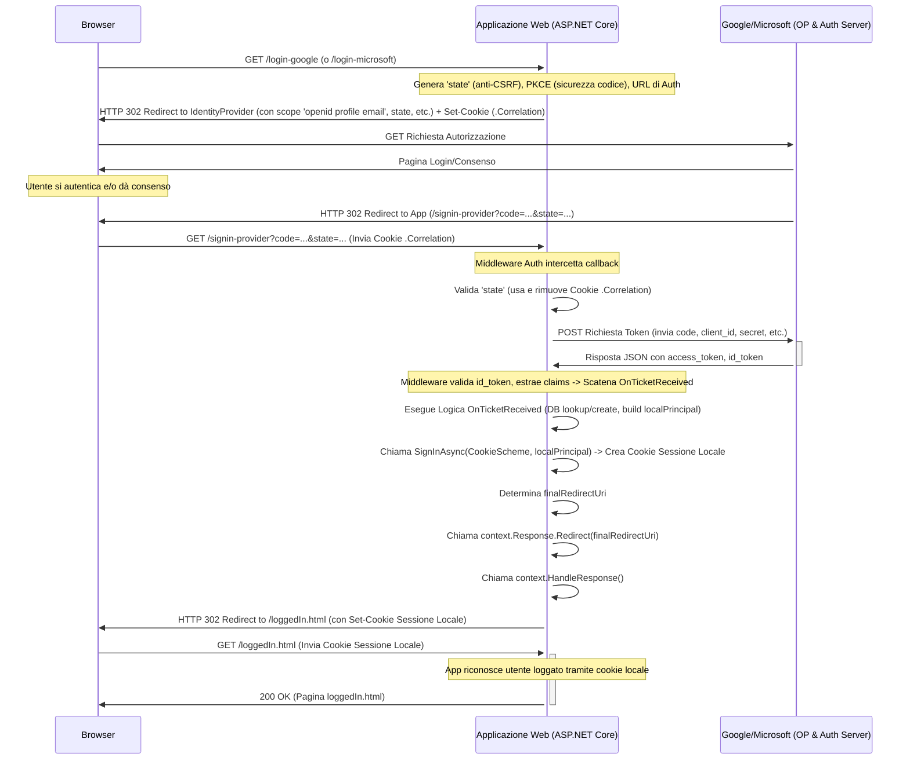

# Comprensione di OAuth 2.0 e OpenID Connect

- [Comprensione di OAuth 2.0 e OpenID Connect](#comprensione-di-oauth-20-e-openid-connect)
  - [OAuth 2.0: Il Protocollo di Delega (Autorizzazione)](#oauth-20-il-protocollo-di-delega-autorizzazione)
  - [OpenID Connect (OIDC): Il Livello di Identità (Autenticazione)](#openid-connect-oidc-il-livello-di-identità-autenticazione)
  - [Relazione e Flusso Combinato](#relazione-e-flusso-combinato)
  - [Approfondimento: Parametri Chiave del Flusso](#approfondimento-parametri-chiave-del-flusso)
    - [5. Riferimenti agli Standard](#5-riferimenti-agli-standard)
  - [Conclusione](#conclusione)

L'interazione con pulsanti quali "Accedi con Google" o "Accedi con Microsoft" coinvolge l'impiego congiunto di due protocolli fondamentali: **OAuth 2.0** e **OpenID Connect (OIDC)**. Questo tutorial si propone di chiarire le rispettive funzioni e le loro interrelazioni, avvalendosi di un esempio pratico.

Si consideri uno scenario in cui un utente desideri utilizzare un'applicazione web (denominata "App Studenti") per visualizzare documenti personali archiviati su Google Drive. È evidente che fornire le credenziali di accesso Google direttamente all'applicazione "App Studenti" costituirebbe una pratica insicura. In tale contesto, intervengono i protocolli OAuth 2.0 e OIDC.

## OAuth 2.0: Il Protocollo di Delega (Autorizzazione)

**Scopo Principale:** Consentire a un'applicazione client (il **Client**, es. "App Studenti") di accedere a risorse protette ospitate su un server differente (il **Resource Server**, es. Google Drive) per conto di un utente (il **Resource Owner**), **senza** che l'applicazione client entri in possesso delle credenziali dirette (username/password) dell'utente. Il meccanismo si basa sulla concessione di un'autorizzazione limitata e specifica.

**Funzionamento (Concetto Base):**

1. **Richiesta di Autorizzazione:** L'applicazione "App Studenti" richiede all'utente l'autorizzazione per accedere ai suoi file su Google Drive.

2. **Intervento dell'Authorization Server:** L'utente non interagisce direttamente con l'applicazione per fornire il consenso, ma viene reindirizzato a un server dedicato del provider (es. Google), noto come **Authorization Server**. Questo server agisce da intermediario fidato, gestendo l'autenticazione dell'utente e la concessione dei permessi.

3. **Autenticazione Utente e Consenso:** L'Authorization Server richiede all'utente di autenticarsi (se non già autenticato presso il provider) e presenta una schermata di consenso che elenca i permessi specifici richiesti dall'applicazione "App Studenti" (es. "visualizzare i file"). L'utente ha la facoltà di approvare o negare tale richiesta.

4. **Emissione del Codice di Autorizzazione:** In caso di approvazione da parte dell'utente, l'Authorization Server reindirizza il browser dell'utente all'URI di reindirizzamento precedentemente registrato dall'applicazione "App Studenti", includendo nell'URL un **codice di autorizzazione**. Questo codice è una credenziale temporanea, monouso e a breve scadenza.

5. **Scambio Codice per Access Token:** L'applicazione "App Studenti", avendo ricevuto il codice di autorizzazione tramite il browser dell'utente, effettua una richiesta diretta (back-channel, server-to-server) all'endpoint token dell'Authorization Server. In questa richiesta, presenta il codice di autorizzazione ricevuto e le proprie credenziali client (Client ID e Client Secret), autenticandosi così presso l'Authorization Server.

6. **Emissione dell'Access Token:** L'Authorization Server valida il codice di autorizzazione e le credenziali del client. Se la validazione ha successo, emette un **Access Token** e lo restituisce all'applicazione "App Studenti". L'Access Token è una credenziale che rappresenta l'autorizzazione concessa dall'utente all'applicazione per accedere a specifiche risorse per un periodo di tempo limitato.

7. **Accesso alla Risorsa Protetta:** L'applicazione "App Studenti" può ora utilizzare l'Access Token per effettuare richieste al Resource Server (Google Drive). Includerà l'Access Token nell'header `Authorization` della richiesta HTTP (tipicamente come token di tipo `Bearer`). Il Resource Server valida l'Access Token (spesso verificandone la validità e i permessi associati presso l'Authorization Server o tramite meccanismi di introspezione/validazione locale) e, se valido, concede l'accesso alla risorsa richiesta (i file dell'utente).

**In sintesi:** OAuth 2.0 è un framework focalizzato sull'**autorizzazione delegata**. Definisce diversi flussi (come l'Authorization Code flow descritto) per consentire a un client di ottenere un accesso limitato a risorse protette per conto dell'utente, senza la necessità di gestire le credenziali primarie dell'utente stesso.

## OpenID Connect (OIDC): Il Livello di Identità (Autenticazione)

**Scopo Principale:** Fornire un meccanismo standard per un'applicazione client (la **Relying Party (RP)**, es. "App Studenti") per **verificare l'identità** di un utente finale basandosi sull'autenticazione eseguita da un **OpenID Provider (OP)** (es. Google, Microsoft) e per ottenere un set basilare di informazioni sul profilo dell'utente (claims) in modo interoperabile e sicuro.

**Come si Relaziona a OAuth 2.0:** OpenID Connect non è un protocollo alternativo, bensì uno **strato di identità costruito sopra OAuth 2.0**. Esso sfrutta l'infrastruttura e i flussi di OAuth 2.0, principalmente l'Authorization Code flow, per aggiungere funzionalità specifiche relative all'autenticazione e alla gestione dell'identità dell'utente. Questa integrazione permette di utilizzare un unico protocollo sottostante per gestire sia l'autorizzazione all'accesso a risorse (tramite gli scope OAuth 2.0) sia l'autenticazione dell'utente (tramite le estensioni OIDC). Le principali aggiunte di OIDC sono:

1. **Scope `openid`:** L'inclusione dello scope `"openid"` nella richiesta di autorizzazione OAuth 2.0 è il segnale che attiva il flusso OIDC. Indica all'Authorization Server (che agisce anche come OP) che il client richiede l'autenticazione dell'utente e desidera ricevere un ID Token.

2. **ID Token:** Rappresenta l'artefatto centrale di OIDC. Quando il client scambia il codice di autorizzazione presso l'endpoint token, l'OP include nella risposta un **ID Token**, oltre all'Access Token (se richiesto).

    - L'ID Token è un **JSON Web Token (JWT)**, un formato standardizzato (RFC 7519) per rappresentare claims in modo sicuro tra due parti.

    - Contiene claims standardizzati sull'utente (es. `sub` - Subject Identifier, un ID univoco e stabile per l'utente presso l'OP) e sull'evento di autenticazione (es. `iss` - Issuer Identifier, l'URL dell'OP; `aud` - Audience, l'ID del client; `exp` - Expiration Time; `iat` - Issued At; `auth_time` - orario di autenticazione dell'utente; `nonce` - valore opzionale per mitigare attacchi di replay).

    - L'ID Token è **firmato digitalmente** dall'OP usando algoritmi crittografici (es. RSA o ECDSA). La Relying Party **deve** validare questa firma utilizzando la chiave pubblica dell'OP (ottenuta tipicamente tramite un endpoint di discovery OIDC, es. `/.well-known/openid-configuration`) per garantire l'autenticità e l'integrità del token. Questa validazione è essenziale per stabilire la fiducia nell'identità asserita.

3. **UserInfo Endpoint:** OIDC definisce un endpoint API standard (`/userinfo`) protetto da OAuth 2.0. La Relying Party può effettuare una richiesta autenticata a questo endpoint, presentando l'Access Token ottenuto, per recuperare claims aggiuntivi sul profilo utente (es. nome, email, immagine) che potrebbero non essere inclusi nell'ID Token. L'utilizzo di questo endpoint è opzionale e dipende dagli scope richiesti (es. `profile`, `email`, `address`, `phone`).

**In sintesi:** OpenID Connect estende OAuth 2.0 per fornire un framework standardizzato di **autenticazione**. Permette a un client di verificare l'identità di un utente e ottenere informazioni di base sul suo profilo in modo sicuro e interoperabile, basandosi sull'autenticazione gestita da un OpenID Provider.

## Relazione e Flusso Combinato

Nell'implementazione dell'accesso tramite Google/Microsoft:

- Si utilizza **OpenID Connect** come obiettivo primario per l'autenticazione dell'utente e il recupero dei dati identificativi (email, nome) necessari per la gestione dell'account nell'applicazione locale.

- Si impiega **OAuth 2.0** come protocollo sottostante per orchestrare l'intero flusso di interazione: i reindirizzamenti sicuri, la gestione del consenso, lo scambio del codice di autorizzazione per i token (ID Token e Access Token) e l'implementazione di meccanismi di sicurezza come il parametro `state` (anti-CSRF) e PKCE.

Il flusso completo implementato (ad esempio, con la gestione tramite l'evento `OnTicketReceived` in ASP.NET Core) aderisce a questo schema combinato:

## Approfondimento: Parametri Chiave del Flusso

Per comprendere meglio l'interazione tra la nostra applicazione ASP.NET Core, il browser dell'utente e l'Identity Provider (Google/Microsoft), analizziamo i parametri più importanti scambiati durante il flusso "Authorization Code" di OAuth 2.0 / OIDC:

**A. Richiesta all'Endpoint di Autorizzazione (da App a IdP, via Browser):**

- **`response_type=code`**: Indica all'Authorization Server che stiamo usando il flusso Authorization Code e che ci aspettiamo di ricevere un codice di autorizzazione (`code`) come risultato del consenso utente.

- **`client_id`**: L'identificativo univoco della nostra applicazione, ottenuto durante la registrazione su Google Cloud Console o Azure Portal. Permette all'Authorization Server di sapere quale applicazione sta richiedendo l'accesso.

- **`redirect_uri`**: L'URL esatto della nostra applicazione a cui l'Authorization Server deve reindirizzare il browser dell'utente dopo l'autenticazione e il consenso. Deve corrispondere perfettamente a uno degli URI registrati per il client. Nel nostro caso, è `https://.../signin-google` o `https://.../signin-microsoft`.

- **`scope`**: Specifica i permessi richiesti dall'applicazione. Per OIDC, include sempre `openid`. Per ottenere informazioni sul profilo, si aggiungono `profile` e `email`. Se l'app avesse bisogno di accedere ad API specifiche (es. Google Drive), aggiungerebbe gli scope OAuth 2.0 corrispondenti (es. `https://www.googleapis.com/auth/drive.readonly`). L'utente vedrà questi scope nella schermata di consenso.

- **`state`**: Un valore casuale, opaco e univoco generato dalla nostra applicazione (dal middleware ASP.NET Core) per ogni richiesta di autenticazione. Viene inviato all'Authorization Server e restituito inalterato nel callback al `redirect_uri`. La nostra applicazione verifica che lo `state` ricevuto corrisponda a quello inviato inizialmente (spesso usando un cookie di correlazione temporaneo). Questo previene attacchi di tipo Cross-Site Request Forgery (CSRF), garantendo che la risposta del callback provenga da una richiesta iniziata legittimamente dalla nostra app.

- **`code_challenge` / `code_challenge_method=S256` (PKCE):** Parametri per la protezione Proof Key for Code Exchange (PKCE), fondamentale per client pubblici e web app server-side. L'app genera un valore segreto (`code_verifier`), ne calcola un hash (`code_challenge` usando SHA256), e invia l'hash all'Authorization Server. Questo lega il codice di autorizzazione (`code`) alla richiesta iniziale.

- **Altri parametri specifici del provider:** (es. `prompt`, `login_hint`, ecc.)

**B. Risposta dall'Endpoint di Autorizzazione (da IdP ad App, via Browser - nel Redirect):**

- **`code`**: Il codice di autorizzazione monouso e a breve scadenza, generato dall'Authorization Server dopo l'autenticazione e il consenso dell'utente. Verrà scambiato con i token.

- **`state`**: Lo stesso valore `state` inviato nella richiesta iniziale, restituito per la verifica CSRF.

- **`error` / `error_description` (In caso di fallimento):** Se l'utente nega l'accesso o si verifica un errore, l'IdP reindirizza comunque al `redirect_uri` ma include parametri di errore invece del `code`.

**C. Richiesta all'Endpoint Token (da App Server-Side a IdP):**

- **`grant_type=authorization_code`**: Indica che stiamo scambiando un codice di autorizzazione per ottenere dei token.

- **`code`**: Il codice di autorizzazione ricevuto nel passaggio precedente.

- **`redirect_uri`**: Lo stesso `redirect_uri` usato nella richiesta di autorizzazione iniziale. Serve come ulteriore verifica di sicurezza.

- **`client_id`**: L'ID della nostra applicazione.

- **`client_secret`**: Il segreto della nostra applicazione (per client confidenziali come le web app server-side). Questo autentica l'applicazione stessa presso l'Authorization Server.

- **`code_verifier` (PKCE):** L'app invia il valore segreto originale (`code_verifier`) generato all'inizio. L'Authorization Server calcola l'hash di questo verifier e lo confronta con il `code_challenge` ricevuto nella richiesta iniziale. Se corrispondono, conferma che la richiesta di token proviene dallo stesso client che ha iniziato il flusso, prevenendo attacchi di intercettazione del codice.

**D. Risposta dall'Endpoint Token (da IdP ad App Server-Side):**

- **`access_token`**: Il token (spesso JWT, ma può essere opaco) che l'applicazione può usare per accedere alle risorse protette (API, UserInfo Endpoint) per conto dell'utente. Ha una scadenza limitata.

- **`token_type`**: Indica il tipo di token (solitamente `Bearer`).

- **`expires_in`**: La durata di validità dell'Access Token in secondi.

- **`id_token` (Se richiesto scope `openid`):** Il JWT firmato contenente i claims sull'identità dell'utente e sull'autenticazione.

- **`refresh_token` (Opzionale):** Un token a lunga scadenza che l'applicazione può usare per ottenere nuovi Access Token (e potenzialmente ID Token) senza richiedere nuovamente l'interazione dell'utente, una volta che l'Access Token originale è scaduto. Viene rilasciato solo per alcuni flussi e se configurato.

Comprendere questi parametri aiuta a visualizzare lo scambio di informazioni e le misure di sicurezza implementate in ogni fase del processo di autenticazione e autorizzazione delegata.

### 5\. Riferimenti agli Standard

Per approfondire i dettagli tecnici dei protocolli, si possono consultare le specifiche ufficiali:

- **OAuth 2.0 Framework:** [RFC 6749](https://datatracker.ietf.org/doc/html/rfc6749 "null")

- **OAuth 2.0 Bearer Token Usage:** [RFC 6750](https://datatracker.ietf.org/doc/html/rfc6750 "null")

- **Proof Key for Code Exchange (PKCE):** [RFC 7636](https://datatracker.ietf.org/doc/html/rfc7636 "null")

- **OpenID Connect Core 1.0:** [Specifica OpenID Connect Core](https://openid.net/specs/openid-connect-core-1_0.html "null")

- **JSON Web Token (JWT):** [RFC 7519](https://datatracker.ietf.org/doc/html/rfc7519 "null")

## Conclusione

L'orchestrazione di questo flusso combinato, conforme alle specifiche di entrambi i protocolli, permette all'applicazione il conseguimento di due obiettivi distinti e tuttavia complementari. Primariamente, mediante l'impiego dei meccanismi propri di OpenID Connect, l'applicazione acquisisce un'attestazione affidabile dell'identità dell'utente; tale verifica si realizza prevalentemente attraverso la ricezione e la successiva validazione crittografica di un ID Token, tipicamente un JSON Web Token (JWT), firmato digitalmente dall'Identity Provider, il quale certifica l'avvenuta autenticazione e fornisce un identificativo univoco per l'utente medesimo (`sub` claim). Questo ID Token, intrinsecamente auto-contenuto e verificabile, costituisce la prova fondamentale dell'identità asserita. Secondariamente, avvalendosi delle fondamenta strutturali di OAuth 2.0 su cui OpenID Connect si innesta, l'applicazione ha la facoltà -- subordinata alla richiesta di ambiti (scope) supplementari rispetto a quelli standard di OIDC (`openid`, `profile`, `email`) -- di ottenere altresì un Access Token. Quest'ultimo token, a differenza dell'ID Token che riguarda l'identità, incarna l'autorizzazione delegata dall'utente, conferendo all'applicazione la capacità di accedere a determinate risorse protette, quali API o set di dati specifici (ad esempio, l'accesso a Google Drive menzionato inizialmente), in sua vece e in maniera funzionalmente disgiunta dalla mera verifica identitaria. L'Access Token opera quindi nel dominio dell'autorizzazione, definendo *cosa* l'applicazione può fare, mentre l'ID Token opera nel dominio dell'autenticazione, definendo *chi* è l'utente. L'intero processo, dalla richiesta iniziale al recupero delle risorse, è condotto nel pieno rispetto degli standard aperti definiti dalle RFC pertinenti e prevede l'implementazione rigorosa di misure di sicurezza consolidate. Queste includono, ma non si limitano a, la comunicazione sicura end-to-end tramite HTTPS, l'utilizzo del parametro `state` come meccanismo essenziale di contromisura per attacchi di tipo Cross-Site Request Forgery (CSRF) durante il ciclo di redirect, l'adozione del meccanismo Proof Key for Code Exchange (PKCE) per mitigare i rischi di intercettazione del codice di autorizzazione, specialmente per i client pubblici o mobile, e l'impiego sistematico di firme digitali per garantire l'autenticità e l'integrità dei token scambiati. Tale aderenza agli standard e alle pratiche di sicurezza non solo assicura l'interoperabilità tra sistemi eterogenei ma stabilisce anche un elevato livello di protezione contro le vulnerabilità e le minacce comunemente associate ai flussi di autenticazione e autorizzazione distribuiti.