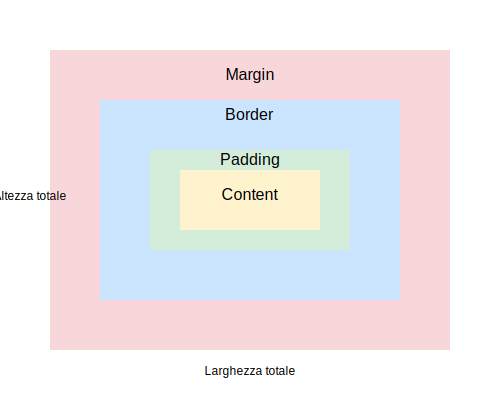

# Responsive User Interface

- [Responsive User Interface](#responsive-user-interface)
  - [Il Box Model](#il-box-model)
    - [Il Content (Contenuto)](#il-content-contenuto)
    - [Il Padding](#il-padding)
    - [Il Border](#il-border)
    - [Il Margin](#il-margin)
  - [Regole di applicazione dei selettori CSS](#regole-di-applicazione-dei-selettori-css)
    - [I selettori del CSS](#i-selettori-del-css)
    - [Ordine di priorità](#ordine-di-priorità)
    - [Specificità dei selettori](#specificità-dei-selettori)
    - [Convenzione BEM (Block, Element, Modifier)](#convenzione-bem-block-element-modifier)
      - [Struttura della metodologia BEM](#struttura-della-metodologia-bem)
      - [Esempio pratico](#esempio-pratico)
      - [Vantaggi di BEM](#vantaggi-di-bem)
  - [Panoramica sui selettori DOM e CSS in JavaScript](#panoramica-sui-selettori-dom-e-css-in-javascript)
    - [Introduzione](#introduzione)
    - [Metodi Base di Selezione](#metodi-base-di-selezione)
      - [getElementById](#getelementbyid)
      - [getElementsByClassName](#getelementsbyclassname)
      - [getElementsByTagName](#getelementsbytagname)
    - [Selettori Moderni](#selettori-moderni)
      - [querySelector](#queryselector)
      - [querySelectorAll](#queryselectorall)
    - [Navigazione del DOM](#navigazione-del-dom)
      - [Relazioni Parent-Child](#relazioni-parent-child)
      - [Relazioni tra Fratelli](#relazioni-tra-fratelli)
    - [Selettori CSS Avanzati](#selettori-css-avanzati)
      - [Selettori di Attributi](#selettori-di-attributi)
      - [Selettori Combinatori](#selettori-combinatori)
    - [Gestione delle Collezioni di Elementi](#gestione-delle-collezioni-di-elementi)
    - [Performance e Best Practices](#performance-e-best-practices)
      - [Ottimizzazione delle Selezioni](#ottimizzazione-delle-selezioni)
      - [Gestione Dinamica del DOM](#gestione-dinamica-del-dom)
    - [Conclusioni](#conclusioni)
  - [CSS Media Query](#css-media-query)
    - [Mozilla - CSS Media Query fundamentals](#mozilla---css-media-query-fundamentals)
    - [W3schools - Using CSS Media Query](#w3schools---using-css-media-query)
    - [Mozilla - Using CSS Media Query](#mozilla---using-css-media-query)
    - [CSS tricks - CSS Media Queries Guide](#css-tricks---css-media-queries-guide)
  - [Variabili in CSS](#variabili-in-css)
    - [Un esempio di pagina con tema chiaro/scuro, utilizzando le variabili CSS e JavaScript - versione con toggle button](#un-esempio-di-pagina-con-tema-chiaroscuro-utilizzando-le-variabili-css-e-javascript---versione-con-toggle-button)
    - [Un esempio di pagina con tema chiaro/scuro, utilizzando le variabili CSS e JavaScript - versione con dropdown list](#un-esempio-di-pagina-con-tema-chiaroscuro-utilizzando-le-variabili-css-e-javascript---versione-con-dropdown-list)
  - [CSS FlexBox](#css-flexbox)
    - [Mozilla - introduction to CSS Flexbox](#mozilla---introduction-to-css-flexbox)
    - [W3schools - CSS FlexBox](#w3schools---css-flexbox)
    - [Mozilla - Basic concepts of Flexbox](#mozilla---basic-concepts-of-flexbox)
    - [CSS tricks - CSS Flexbox Layout Guide](#css-tricks---css-flexbox-layout-guide)
    - [Josh Comeau - An Interactive Guide to Flexbox](#josh-comeau---an-interactive-guide-to-flexbox)
    - [W3schools - Responsive Layout con Flexbox e Media Query](#w3schools---responsive-layout-con-flexbox-e-media-query)
  - [CSS Grid](#css-grid)
    - [W3schools - CSS Grid Layout](#w3schools---css-grid-layout)
    - [Mozilla - CSS Grid Layout](#mozilla---css-grid-layout)
    - [Mozilla - Basic concepts of Grid Layout](#mozilla---basic-concepts-of-grid-layout)
    - [CSS Tricks - CSS Grid Layout Guide](#css-tricks---css-grid-layout-guide)
    - [Josh Comeau - An Interactive Guide to CSS Grid](#josh-comeau---an-interactive-guide-to-css-grid)
  - [The Layout Algorithm](#the-layout-algorithm)
    - [Josh Comeau - Understanding Layout Algorithms](#josh-comeau---understanding-layout-algorithms)
  - [Panoramica completa su CSS Layout](#panoramica-completa-su-css-layout)
    - [Layout CSS](#layout-css)
      - [Tipi Principali di Layout](#tipi-principali-di-layout)
        - [Normal Flow (Flusso Normale)](#normal-flow-flusso-normale)
          - [Table Layout](#table-layout)
          - [Float Layout](#float-layout)
        - [Positioned Layout](#positioned-layout)
        - [Multi-column Layout](#multi-column-layout)
        - [Flexbox Layout](#flexbox-layout)
        - [Grid Layout](#grid-layout)
        - [Conclusioni](#conclusioni-1)
  - [Confronto tra CSS Flexbox e CSS Grid con esempi strutturati](#confronto-tra-css-flexbox-e-css-grid-con-esempi-strutturati)
    - [Flexbox](#flexbox)
      - [Concetti Base di Flexbox](#concetti-base-di-flexbox)
      - [Proprietà Principali del Flex Container](#proprietà-principali-del-flex-container)
      - [Proprietà dei Flex Items](#proprietà-dei-flex-items)
      - [Esempio Pratico con Flexbox](#esempio-pratico-con-flexbox)
      - [Un esempio strutturato con CSS Flex](#un-esempio-strutturato-con-css-flex)
    - [Grid](#grid)
      - [Concetti Base di Grid](#concetti-base-di-grid)
      - [Proprietà Principali del Grid Container](#proprietà-principali-del-grid-container)
      - [Unità di Misura Speciali per Grid](#unità-di-misura-speciali-per-grid)
      - [Esempio Pratico con Grid](#esempio-pratico-con-grid)
      - [Un esempio strutturato con Grid](#un-esempio-strutturato-con-grid)
    - [Quando Usare Flex e Quando Grid?](#quando-usare-flex-e-quando-grid)
    - [Suggerimenti Pratici](#suggerimenti-pratici)
      - [Un esempio strutturato che utilizza sia Flex CSS che Grid CSS](#un-esempio-strutturato-che-utilizza-sia-flex-css-che-grid-css)
  - [Bootstrap](#bootstrap)
    - [Bootstrap](#bootstrap-1)
    - [Getting started with Bootstrap 5](#getting-started-with-bootstrap-5)
    - [W3schools Bootstrap 5 tutorial](#w3schools-bootstrap-5-tutorial)
    - [Bootstrap vs Flex vs Grid](#bootstrap-vs-flex-vs-grid)
      - [Bootstrap con Flexbox e Grid](#bootstrap-con-flexbox-e-grid)
      - [Sistema Grid di Bootstrap](#sistema-grid-di-bootstrap)
      - [Classi Flexbox in Bootstrap](#classi-flexbox-in-bootstrap)
      - [Vantaggi dell'Uso di Bootstrap](#vantaggi-delluso-di-bootstrap)
      - [Svantaggi di Bootstrap](#svantaggi-di-bootstrap)
      - [Quando Usare Bootstrap e quando usare CSS Puro?](#quando-usare-bootstrap-e-quando-usare-css-puro)
      - [Approccio Ibrido](#approccio-ibrido)
      - [Suggerimenti per l'Uso Combinato](#suggerimenti-per-luso-combinato)
      - [Un esempio strutturato di utilizzo combinato di Bootstrap, Flex e Grid](#un-esempio-strutturato-di-utilizzo-combinato-di-bootstrap-flex-e-grid)

## Il Box Model



Il CSS Box Model rappresenta uno dei concetti fondamentali per comprendere come gli elementi HTML vengono renderizzati in una pagina web. Questo modello descrive come ogni elemento è rappresentato come una scatola rettangolare, composta da diverse aree concentriche che ne determinano le dimensioni e lo spazio occupato.

Le componenti principali del Box Model sono:

### Il Content (Contenuto)

Il content rappresenta l'area dove viene mostrato il contenuto effettivo dell'elemento, come testo o immagini. Le dimensioni di quest'area possono essere definite utilizzando le proprietà width e height.

Esempio pratico del content:

```css
.element {
    width: 200px;    /* Larghezza del contenuto */
    height: 100px;   /* Altezza del contenuto */
    background: #f0f0f0;
}
```

### Il Padding

Il padding costituisce lo spazio tra il contenuto e il bordo dell'elemento. Questo spazio interno può essere controllato su tutti e quattro i lati dell'elemento in modo indipendente.

Esempio di utilizzo del padding:

```css
.element {
    padding-top: 10px;
    padding-right: 20px;
    padding-bottom: 10px;
    padding-left: 20px;
    /* Oppure utilizzando la scrittura abbreviata */
    padding: 10px 20px 10px 20px;
}
```

### Il Border

Il border rappresenta la linea che delimita l'elemento, posizionandosi tra il padding e il margin. È possibile definirne lo spessore, lo stile e il colore.

Esempio di personalizzazione del border:

```css
.element {
    border-width: 2px;
    border-style: solid;
    border-color: #000;
    /* Oppure utilizzando la scrittura abbreviata */
    border: 2px solid #000;
}
```

### Il Margin

Il margin definisce lo spazio esterno all'elemento, ovvero la distanza tra il bordo dell'elemento e gli elementi circostanti. Anche il margin può essere controllato indipendentemente su tutti i lati.

Esempio di gestione del margin:

```css
.element {
    margin-top: 15px;
    margin-right: 30px;
    margin-bottom: 15px;
    margin-left: 30px;
    /* Oppure utilizzando la scrittura abbreviata */
    margin: 15px 30px;
}
```

Un aspetto fondamentale da comprendere è il calcolo delle dimensioni totali di un elemento. La larghezza totale si calcola sommando:

- width (larghezza del contenuto)
- padding-left + padding-right
- border-left-width + border-right-width
- margin-left + margin-right

Esempio pratico di calcolo delle dimensioni totali:

```css
.box {
    width: 200px;
    padding: 20px;
    border: 5px solid black;
    margin: 10px;
}
```

In questo caso, la larghezza totale occupata dall'elemento sarà:
200px (width) + 40px (padding totale) + 10px (border totale) + 20px (margin totale) = 270px

È possibile modificare questo comportamento utilizzando la proprietà box-sizing. Impostando box-sizing: border-box, width e height includeranno padding e border, ma non il margin:

```css
.box {
    box-sizing: border-box;
    width: 200px;
    padding: 20px;
    border: 5px solid black;
}
```

In questo caso, la larghezza effettiva del contenuto verrà automaticamente ridotta per mantenere la larghezza totale dell'elemento (inclusi padding e border) a 200px.

Questa comprensione approfondita del Box Model è essenziale per creare layouts precisi e gestire correttamente lo spazio tra gli elementi in una pagina web.

## Regole di applicazione dei selettori CSS

In questo paragrafo viene mostrato come il browser determina quali stili CSS applicare quando esistono più regole che potrebbero influenzare lo stesso elemento. Questo processo è fondamentale per comprendere come il CSS funziona realmente.

### I selettori del CSS

In questo paragrafo viene riportata una spiegazione approfondita dei selettori CSS, partendo dai concetti base fino ad arrivare a quelli più avanzati. Si seguirà un percorso logico che permetterà di comprendere come questi elementi lavorano insieme per essere applicati alle pagine web.

1. **Selettori base**

    **Il selettore universale (*)** è il più ampio e si applica a tutti gli elementi della pagina. È come una rete che cattura ogni elemento HTML:

    ```css
    * {
        margin: 0;
        padding: 0;
    } /* Questo resetta i margini e i padding di tutti gli elementi */
    ```

    **I selettori di tipo** selezionano tutti gli elementi di un determinato tag HTML:

    ```css
    p {
        color: blue;
    } /* Tutti i paragrafi saranno blu */
    ```

    **Il selettore di classe (.)** è uno dei più utilizzati e permette di applicare stili a elementi che condividono la stessa classe:

    ```css
    .highlight {
        background-color: yellow;
    } /* Tutti gli elementi con class="highlight" avranno sfondo giallo */
    ```

    **Il selettore di ID (#)** è simile alla classe ma deve essere unico nella pagina:

    ```css
    #header {
        height: 80px;
    } /* L'elemento con id="header" avrà altezza di 80px */
    ```

2. **Selettori di relazione** che sono selettori fondamentali per gestire la gerarchia degli elementi:

    Il selettore discendente (spazio) seleziona tutti i discendenti di un elemento:

    ```css
    article p {
        line-height: 1.6;
    } /* Tutti i paragrafi dentro article avranno interlinea 1.6 */
    ```

    Il selettore figlio diretto (>) è più specifico e seleziona solo i figli diretti:

    ```css
    nav > ul {
        list-style: none;
    } /* Solo le liste che sono figlie dirette di nav */
    ```

    Il selettore fratello adiacente (+) seleziona l'elemento immediatamente successivo:

    ```css
    h2 + p {
        font-size: 1.2em;
    } /* Il paragrafo che viene subito dopo un h2 */
    ```

    Il selettore fratello generale (~) seleziona tutti i fratelli successivi:

    ```css
    h3 ~ p {
        color: gray;
    } /* Tutti i paragrafi che seguono un h3 */
    ```

3. **Selettori di attributo**, molto potenti per selezionare elementi in base alle loro proprietà:

    ```css
    /* Seleziona elementi con un attributo specifico */
    [disabled] {
        opacity: 0.5;
    }

    /* Seleziona elementi con un attributo dal valore esatto */
    [type="text"] {
        border: 1px solid gray;
    }

    /* Seleziona elementi il cui attributo contiene una parola */
    [class*="btn"] {
        cursor: pointer;
    } /* Seleziona elementi con classi che contengono "btn" */
    ```

4. **Le pseudo-classi** permettono di selezionare elementi in base al loro stato:

    ```css
    a:hover {
        text-decoration: underline;
    } /* Link al passaggio del mouse */

    input:focus {
        border-color: blue;
    } /* Input quando riceve il focus */

    li:first-child {
        font-weight: bold;
    } /* Primo elemento di una lista */

    p:nth-child(odd) {
        background: #f0f0f0;
    } /* Paragrafi in posizione dispari */
    ```

5. **Gli pseudo-elementi** permettono di stilizzare parti specifiche di un elemento:

    ```css
    p::first-letter {
        font-size: 2em;
    } /* Prima lettera di ogni paragrafo */

    div::before {
        content: "→";
    } /* Aggiunge una freccia prima di ogni div */
    ```

6. **I selettori di negazione e combinatori**:

    ```css
    /* Seleziona tutti i p che NON hanno la classe 'special' */
    p:not(.special) {
        color: black;
    }

    /* Combinazione di selettori */
    .btn.btn-primary {
        background: blue;
    } /* Elementi che hanno ENTRAMBE le classi */
    ```

Per gestire la specificità, è importante capire che i selettori hanno un "peso" diverso:

- ID selectors (più specifici)
- Class selectors, attribute selectors, pseudo-classes
- Type selectors, pseudo-elements (meno specifici)

Un esempio pratico di come la specificità funziona:

```css
#header p { color: blue; }         /* Più specifico */
.content p { color: red; }         /* Meno specifico */
p { color: green; }               /* Ancora meno specifico */
```

In questo caso, un paragrafo all'interno di un elemento con id="header" sarà blu, indipendentemente dagli altri selettori.

Questi selettori possono essere combinati in modi molto potenti per creare regole CSS precise e mirate. La chiave è utilizzarli in modo appropriato per mantenere il codice manutenibile e evitare conflitti di stile indesiderati.

:memo: :warning: :fire:**Osservazione importante**: `.btn.btn-primary` e `.btn .btn-primary` non sono la stessa cosa. Questa è una differenza molto importante nella sintassi CSS che può portare a comportamenti completamente diversi. Si analizzi la differenza in dettaglio:

  1. `.btn.btn-primary` (senza spazio)
  Quando si scrivono due classi attaccate, si sta dicendo all'algoritmo di rendering del CSS di **selezionare elementi che hanno ENTRAMBE le classi contemporaneamente**. È come dire *"trova un elemento che ha sia la classe `btn` CHE la classe `btn-primary`"*.

      Esempio:

      ```html
      <button class="btn btn-primary">Questo bottone sarà selezionato</button>
      <button class="btn">Questo bottone NON sarà selezionato</button>
      <div class="btn-primary">Questo div NON sarà selezionato</div>
      ```

  2. `.btn .btn-primary` (con spazio)
  Quando si mette uno spazio tra le classi, **si sta utilizzando un selettore discendente**. Si sta dicendo all'algoritmo di rendering del CSS *"trova un elemento con classe `btn-primary` che si trova DENTRO un elemento con classe `btn`"*. **È una relazione gerarchica, di discendenza**.

      Esempio:

      ```html
      <div class="btn">
          <button class="btn-primary">Questo bottone sarà selezionato</button>
      </div>

      <button class="btn btn-primary">Questo bottone NON sarà selezionato</button>
      ```

  3. Per capire meglio la differenza, si immagini un caso pratico. Si supponga di avere un sistema di bottoni in cui:

     - `.btn` definisce lo stile base di tutti i bottoni
     - `.btn-primary` definisce uno stile specifico per i bottoni principali

     Se si usasse `.btn.btn-primary`, si creerebbe uno stile che si applica direttamente al bottone che ha entrambe le classi:

     ```html
     <!-- Approccio con classi concatenate -->
     <button class="btn btn-primary">Bottone Primario</button>
     ```

     Mentre se si usasse `.btn .btn-primary`, si creerebbe un elemento con classe `.btn-primary` che è figlio di un elemento con classe `.btn`:

     ```html
     <!-- Approccio con selettore discendente (raramente utile in questo caso) -->
     <div class="btn">
         <span class="btn-primary">Questo è diverso!</span>
     </div>
     ```

  4. In termini di prestazioni, `.btn.btn-primary` è generalmente più efficiente perché il browser deve controllare solo le classi di un singolo elemento, mentre `.btn .btn-primary` richiede al browser di verificare la gerarchia degli elementi, cercando prima gli elementi con classe `.btn` e poi cercando al loro interno elementi con classe `.btn-primary`.
  
  Nel contesto dei framework CSS come Bootstrap, quasi sempre si usa la sintassi senza spazio (`.btn.btn-primary`) quando si lavora con varianti di componenti, perché si applicano più classi allo stesso elemento per ottenere la combinazione di stili desiderata.

### Ordine di priorità

L'ordine di priorità, dal più importante (che sovrascrive tutto) al meno importante, è il seguente:

1) Stili in linea (inline styles)
    Questi sono gli stili scritti direttamente nell'attributo style di un elemento HTML. Hanno la massima priorità:

    ```html
    <p style="color: red; font-size: 16px;">
        Questo testo sarà rosso indipendentemente da altre regole CSS
    </p>
    ```

2) Stili interni nel tag `<style>` nell'HTML
    Questi sono definiti nell'header del documento HTML:

    ```html
    <head>
        <style>
            p {
                color: blue;  /* Questo verrà sovrascritto dagli stili in linea */
            }
        </style>
    </head>
    ```

3) Stili esterni in file .css collegati
    Questi vengono caricati attraverso il tag `<link>`:

    ```html
    <head>
        <link rel="stylesheet" href="styles.css">
    </head>
    ```

Di seguito viene mostrato un esempio completo che mostra come questi tre livelli interagiscono:

```html
<!-- index.html -->
<head>
    <link rel="stylesheet" href="styles.css">
    <style>
        p {
            color: blue;
            font-size: 18px;
            margin: 20px;
        }
        .highlighted {
            background-color: yellow;
        }
    </style>
</head>
<body>
    <p style="color: red; font-size: 16px;" class="highlighted">
        Questo paragrafo avrà:
        - colore rosso (dall'inline style)
        - font-size 16px (dall'inline style)
        - margin 20px (dal tag style interno)
        - sfondo giallo (dal tag style interno)
    </p>
</body>
```

```css
/* styles.css */
p {
    color: green;
    font-size: 14px;
    margin: 10px;
    background-color: white;
}
```

In questo esempio:

- Il colore sarà rosso (inline vince su tutto)
- La dimensione del font sarà 16px (inline vince)
- Il margine sarà 20px (style interno vince su esterno)
- Lo sfondo sarà giallo (la classe .highlighted nel tag style vince sulla regola nel file esterno)

Ma c'è un'eccezione importante: `!important`
L'attributo `!important` può sovvertire questo ordine naturale:

```css
p {
    color: green !important;  /* Questo vincerà anche sugli stili inline */
}
```

È anche importante capire che quando più file CSS esterni sono collegati, l'ordine di caricamento conta:

```html
<head>
    <link rel="stylesheet" href="reset.css">
    <link rel="stylesheet" href="styles.css">
    <link rel="stylesheet" href="custom.css">
</head>
```

In questo caso, a parità di specificità, le regole in `custom.css` sovrascriveranno quelle in `styles.css`, che a loro volta sovrascriveranno quelle in `reset.css`.

### Specificità dei selettori

**Un altro fattore cruciale è la specificità dei selettori**. Anche all'interno dello stesso livello (inline, interno o esterno), un selettore più specifico vincerà su uno meno specifico:

```css
#main-content .sidebar p.special {  /* Molto specifico */
    color: purple;
}

p {  /* Poco specifico */
    color: blue;
}
```

La formula per calcolare la specificità è:

- style inline = 1000 punti
- ID = 100 punti
- classe, attributo, pseudo-classe = 10 punti
- elemento, pseudo-elemento = 1 punto

Questo sistema complesso di priorità permette una grande flessibilità nella gestione degli stili, ma richiede anche attenzione per evitare conflitti indesiderati. Per questo motivo, è considerata una buona pratica:

- Evitare l'uso eccessivo di `!important`
- Preferire classi a ID quando possibile
- Mantenere una specificità dei selettori il più bassa possibile
- Organizzare i file CSS in modo logico e modulare

Di seguito si riporta un esempio pratico di come il browser calcola e applica la specificità CSS. Si creerà una situazione con diversi selettori che mirano allo stesso elemento e si vedrà quale regola viene effettivamente applicata.

Si consideri questo HTML:

```html
<div id="main-content" class="container">
    <article class="post featured">
        <p class="text highlight">Questo è un paragrafo di esempio</p>
    </article>
</div>
```

E ora si considerino diverse regole CSS che puntano allo stesso paragrafo, con calcoli di specificità per ciascuna regola:

```css
/* Regola 1: elemento (0,0,0,1) */
p {
    color: blue;
    font-size: 16px;
}

/* Regola 2: classe (0,0,1,0) */
.text {
    color: red;
    font-size: 18px;
}

/* Regola 3: due classi (0,0,2,0) */
.post .text {
    color: green;
    font-size: 20px;
}

/* Regola 4: ID, classe ed elemento (0,1,1,1) */
#main-content article p {
    color: purple;
    font-size: 22px;
}

/* Regola 5: ID e due classi (0,1,2,0) */
#main-content .post .text {
    color: orange;
    font-size: 24px;
}
```

Si analizzi come il browser calcola la specificità per ogni regola. Il formato è (inline, ID, classi, elementi):

1. `p` = 0,0,0,1 (1 punto)
2. `.text` = 0,0,1,0 (10 punti)
3. `.post .text` = 0,0,2,0 (20 punti)
4. `#main-content article p` = 0,1,0,2 (102 punti)
5. `#main-content .post .text` = 0,1,2,0 (120 punti)

Quindi, l'ordine di priorità dalla regola più debole alla più forte sarà:

1. `p` (1 punto)
2. `.text` (10 punti)
3. `.post .text` (20 punti)
4. `#main-content article p` (102 punti)
5. `#main-content .post .text` (120 punti)

Il risultato finale sarà:

- color: orange (dalla regola 5, la più specifica)
- font-size: 24px (dalla regola 5, la più specifica)

Se si aggiungesse uno stile in linea, questo avrebbe la precedenza su tutte le regole precedenti:

```html
<p class="text highlight" style="color: pink; font-size: 26px;">
    Questo è un paragrafo di esempio
</p>
```

E se si volesse forzare una regola meno specifica a prevalere, si potrebbe usare `!important`:

```css
.text {
    color: red !important;  /* Questa vincerà su tutto tranne altri !important */
    font-size: 18px !important;
}
```

Per rendere ancora più chiaro come funziona questo sistema, si immagini di aggiungere una nuova regola:

```css
/* Regola 6: ID, due classi e elemento (0,1,2,1) */
#main-content .post .text.highlight {
    color: yellow;
    font-size: 28px;
}
```

Questa nuova regola avrebbe una specificità di 0,1,2,1 (121 punti), superando tutte le regole precedenti perché:

- Ha un ID (#main-content) = 100 punti
- Ha due classi (.post e .text) = 20 punti
- Ha una classe aggiuntiva (.highlight) = 10 punti
- È un elemento specifico = 1 punto
Totale: 121 punti

Questo sistema di calcolo della specificità è cruciale quando si lavora con CSS complessi, specialmente in progetti di grandi dimensioni. Per questo motivo, molti sviluppatori preferiscono:

1. Mantenere bassa la specificità quando possibile
2. Usare metodologie come BEM per evitare conflitti di specificità
3. Organizzare il CSS in modo modulare
4. Evitare l'uso di !important se non assolutamente necessario

### Convenzione BEM (Block, Element, Modifier)

La metodologia **BEM** (Block, Element, Modifier) è una convenzione di naming per il CSS che aiuta a organizzare il codice in modo modulare e a evitare conflitti di specificità, facilitando la manutenzione e la scalabilità dei progetti. È particolarmente utile per progetti di grandi dimensioni, in cui il CSS potrebbe diventare complesso e difficile da gestire.

#### Struttura della metodologia BEM

BEM divide i componenti in tre categorie principali:

1. **Block** (Blocco):

    - Rappresenta un'entità indipendente e riutilizzabile.
    - Può essere, ad esempio, una sezione della pagina, un modulo o un widget.
    - Nome: `nome-blocco`.
        - **Esempio**: `menu`, `card`, `form`.
2. **Element** (Elemento):

    - Rappresenta una parte interna del blocco che non può esistere autonomamente.
    - Viene collegato al nome del blocco con un doppio underscore (`__`).
    - Nome: `blocco__elemento`.
        - **Esempio**: `menu__item`, `card__title`, `form__input`.
3. **Modifier** (Modificatore):

    - Rappresenta una variazione o uno stato particolare del blocco o dell'elemento.
    - Viene collegato al nome del blocco o dell'elemento con un doppio trattino (`--`).
    - Nome: `blocco--modificatore` o `blocco__elemento--modificatore`.
        - **Esempio**: `menu--active`, `card__title--highlighted`.

#### Esempio pratico

Si supponga di avere un menu di navigazione con elementi cliccabili:

HTML:

```html
<nav class="menu">
  <ul class="menu__list">
    <li class="menu__item menu__item--active">Home</li>
    <li class="menu__item">About</li>
    <li class="menu__item">Contact</li>
  </ul>
</nav>
```

CSS:

```css
/* Block */
.menu {
  background-color: #f8f8f8;
  padding: 10px;
}

/* Element */
.menu__list {
  list-style: none;
  margin: 0;
  padding: 0;
}

.menu__item {
  display: inline-block;
  margin-right: 10px;
}

/* Modifier */
.menu__item--active {
  font-weight: bold;
  color: #007BFF;
}
```

#### Vantaggi di BEM

1. **Modularità**: I componenti CSS sono isolati, riducendo al minimo i conflitti tra stili.
2. **Specificità ridotta**: Grazie alla struttura piatta, non è necessario annidare selettori complessi.
3. **Riutilizzabilità**: Blocchi ed elementi possono essere riutilizzati in altri contesti senza dover riscrivere il CSS.
4. **Manutenzione semplificata**: La struttura chiara rende il codice più leggibile e facile da aggiornare.

In sintesi, BEM è una metodologia potente per evitare conflitti di specificità e per mantenere il CSS organizzato in modo chiaro e scalabile.

## Panoramica sui selettori DOM e CSS in JavaScript

### Introduzione

In questo paragrafo si fornisce una panoramica completa delle modalità di accesso agli elementi del Document Object Model (DOM) e dei selettori CSS attraverso JavaScript.

### Metodi Base di Selezione

#### getElementById

Il metodo più diretto per selezionare un elemento specifico del DOM. Questo metodo restituisce un singolo elemento basandosi sul suo attributo ID.

```javascript
// HTML: <div id="mainContent">Contenuto principale</div>
const elemento = document.getElementById('mainContent');
```

#### getElementsByClassName

Permette di selezionare tutti gli elementi che condividono una determinata classe CSS. Restituisce una HTMLCollection live che si aggiorna automaticamente quando vengono aggiunti o rimossi elementi dal DOM.

```javascript
// HTML: <div class="highlight">Primo</div>
//       <div class="highlight">Secondo</div>
const elementi = document.getElementsByClassName('highlight');
// elementi[0] accede al primo elemento con classe 'highlight'
```

#### getElementsByTagName

Seleziona tutti gli elementi di un determinato tipo HTML. Anche questo metodo restituisce una HTMLCollection live.

```javascript
// Seleziona tutti i paragrafi
const paragrafi = document.getElementsByTagName('p');
```

### Selettori Moderni

#### querySelector

Rappresenta il metodo più versatile per la selezione di elementi. Accetta qualsiasi selettore CSS valido e restituisce il primo elemento che corrisponde al criterio di ricerca.

```javascript
// Seleziona il primo elemento con classe 'box'
const box = document.querySelector('.box');

// Seleziona il primo link all'interno di un nav
const link = document.querySelector('nav a');

// Seleziona un elemento con un attributo specifico
const input = document.querySelector('input[type="email"]');
```

#### querySelectorAll

Simile a querySelector, ma restituisce una NodeList contenente tutti gli elementi che corrispondono al selettore specificato.

```javascript
// Seleziona tutti gli elementi con classe 'item'
const items = document.querySelectorAll('.item');

// Seleziona tutti i link in un menu
const menuLinks = document.querySelectorAll('.menu a');

// Seleziona elementi con pseudoclassi
const pariElementi = document.querySelectorAll('li:nth-child(even)');
```

### Navigazione del DOM

#### Relazioni Parent-Child

JavaScript offre diverse proprietà per navigare le relazioni tra elementi del DOM:

```javascript
// Accesso al genitore
const parent = elemento.parentNode;
const parentElement = elemento.parentElement;

// Accesso ai figli
const children = elemento.children; // HTMLCollection
const childNodes = elemento.childNodes; // NodeList (include nodi di testo)
const firstChild = elemento.firstElementChild;
const lastChild = elemento.lastElementChild;
```

#### Relazioni tra Fratelli

```javascript
// Accesso ai fratelli
const nextSibling = elemento.nextElementSibling;
const previousSibling = elemento.previousElementSibling;
```

### Selettori CSS Avanzati

#### Selettori di Attributi

```javascript
// Seleziona elementi con un attributo specifico
const elementiDataId = document.querySelectorAll('[data-id]');

// Seleziona elementi con un valore specifico dell'attributo
const elementiLang = document.querySelectorAll('[lang="it"]');

// Seleziona elementi con attributo che inizia con un valore
const elementiDataUser = document.querySelectorAll('[data-user^="admin"]');
```

#### Selettori Combinatori

```javascript
// Selettore discendente (spazio)
const nestedElements = document.querySelectorAll('.container .item');

// Selettore figlio diretto (>)
const directChildren = document.querySelectorAll('.parent > .child');

// Selettore fratello adiacente (+)
const nextElement = document.querySelectorAll('.trigger + .target');

// Selettore fratelli generali (~)
const allSiblings = document.querySelectorAll('.reference ~ .siblings');
```

### Gestione delle Collezioni di Elementi

È importante notare che getElementsBy* restituisce una HTMLCollection mentre querySelectorAll restituisce una NodeList. Ecco come iterare su entrambe:

```javascript
// Iterazione su HTMLCollection
const collection = document.getElementsByClassName('item');
Array.from(collection).forEach(elemento => {
    // Manipolazione dell'elemento
});

// Iterazione su NodeList
const nodeList = document.querySelectorAll('.item');
nodeList.forEach(elemento => {
    // Manipolazione dell'elemento
});
```

### Performance e Best Practices

#### Ottimizzazione delle Selezioni

Per ottenere le migliori performance, si consiglia di:

```javascript
// Mettere in cache i risultati delle selezioni frequenti
const container = document.querySelector('.container');
const items = container.querySelectorAll('.item');

// Utilizzare selettori specifici
// Preferibile:
document.querySelector('#unique-id');
// Da evitare:
document.querySelector('.container .wrapper .box .element');
```

#### Gestione Dinamica del DOM

Quando si lavora con elementi dinamici, è importante considerare:

```javascript
// Osservare modifiche al DOM
const observer = new MutationObserver(mutations => {
    mutations.forEach(mutation => {
        // Gestione delle modifiche
    });
});

observer.observe(targetNode, {
    childList: true,
    subtree: true
});
```

### Conclusioni

La corretta selezione degli elementi del DOM è fondamentale per la manipolazione efficace delle pagine web. La scelta del metodo di selezione appropriato dipende da diversi fattori:

- La specificità richiesta
- La necessità di selezionare uno o più elementi
- Le performance dell'applicazione
- La compatibilità con i browser target

Si consiglia di utilizzare i metodi moderni (querySelector/querySelectorAll) per la maggior parte dei casi d'uso, ricorrendo ai metodi specifici (getElementById) solo quando si necessita di performance ottimali per selezioni frequenti.

## CSS Media Query

### [Mozilla - CSS Media Query fundamentals](https://developer.mozilla.org/en-US/docs/Learn_web_development/Core/CSS_layout/Media_queries)

### [W3schools - Using CSS Media Query](https://www.w3schools.com/css/css3_mediaqueries.asp)

### [Mozilla - Using CSS Media Query](https://developer.mozilla.org/en-US/docs/Web/CSS/CSS_media_queries/Using_media_queries)

### [CSS tricks - CSS Media Queries Guide](https://css-tricks.com/a-complete-guide-to-css-media-queries/)

## Variabili in CSS

Le variabili CSS rappresentano uno strumento fondamentale per la gestione efficiente dei fogli di stile. Si tratta di contenitori che permettono di memorizzare valori riutilizzabili all'interno del codice CSS.

Per dichiarare una variabile CSS, detta anche proprietà personalizzata, si utilizza una sintassi specifica che inizia con due trattini (--). La dichiarazione avviene tipicamente all'interno del selettore :root, che rappresenta l'elemento radice del documento HTML. Ecco un esempio:

```css
:root {
  --colore-primario: #007bff;
  --spaziatura-base: 16px;
  --font-principale: 'Arial', sans-serif;
}
```

Per utilizzare una variabile precedentemente dichiarata, si adopera la funzione `var()`. È possibile anche specificare **un valore di fallback** che verrà utilizzato nel caso in cui la variabile non sia stata definita o non sia supportata dal browser:

```css
.bottone {
  background-color: var(--colore-primario, #000000);
  padding: var(--spaziatura-base);
  font-family: var(--font-principale);
}
```

Le variabili CSS godono della proprietà di ereditarietà. Questo significa che se una variabile viene dichiarata in un elemento genitore, sarà disponibile per tutti gli elementi figli. È possibile ridefinire una variabile all'interno di un selettore specifico per modificarne il valore localmente:

```css
:root {
  --colore-testo: black;
}

.sezione-scura {
  --colore-testo: white;
  background-color: #333;
}

.testo {
  color: var(--colore-testo);
}
```

Le variabili CSS supportano anche l'utilizzo delle media query, permettendo di modificare i valori in base alle caratteristiche del dispositivo:

```css
:root {
  --dimensione-testo: 16px;
}

@media screen and (min-width: 768px) {
  :root {
    --dimensione-testo: 18px;
  }
}

p {
  font-size: var(--dimensione-testo);
}
```

È possibile utilizzare le variabili CSS anche all'interno di calcoli matematici mediante la funzione calc():

```css
:root {
  --margine-base: 20px;
}

.contenitore {
  padding: calc(var(--margine-base) * 2);
  width: calc(100% - var(--margine-base) * 4);
}
```

Un aspetto particolarmente utile delle variabili CSS è la possibilità di manipolarle attraverso JavaScript, rendendo possibile la creazione di temi dinamici:

```javascript
// Modifica di una variabile CSS tramite JavaScript
document.documentElement.style.setProperty('--colore-primario', '#ff0000');
```

Per quanto riguarda il supporto dei browser, le variabili CSS sono ampiamente supportate dai browser moderni. Tuttavia, è buona pratica fornire sempre un valore di fallback per garantire la retrocompatibilità:

```css
.elemento {
  /* Valore di fallback seguito dalla variabile */
  color: blue;
  color: var(--colore-personalizzato, blue);
}
```

L'utilizzo delle variabili CSS porta numerosi vantaggi nella manutenzione del codice:

- Riduce la ripetizione dei valori
- Facilita la gestione dei temi
- Migliora la leggibilità del codice
- Semplifica gli aggiornamenti globali
- Permette la creazione di interfacce dinamiche

Il sistema di variabili CSS continua ad evolversi con l'introduzione di nuove funzionalità e miglioramenti nelle specifiche CSS, rendendo questo strumento sempre più potente e versatile per lo sviluppo web moderno.

### Un esempio di pagina con tema chiaro/scuro, utilizzando le variabili CSS e JavaScript - versione con toggle button

```html
<!DOCTYPE html>
<html lang="it">

<head>
    <meta charset="UTF-8">
    <meta name="viewport" content="width=device-width, initial-scale=1.0">
    <title>Tema Chiaro/Scuro Demo</title>
    <style>
        /* Definiamo le variabili per il tema chiaro */
        :root {
            /* Colori di base */
            --colore-sfondo: #ffffff;
            --colore-testo: #333333;
            --colore-primario: #007bff;
            --colore-secondario: #6c757d;

            /* Colori specifici dei componenti */
            --colore-card: #f8f9fa;
            --colore-bordo: #dee2e6;

            /* Transizioni per rendere fluido il cambio di tema */
            --transizione-base: all 0.3s ease-in-out;
        }

        /* Variabili per il tema scuro */
        [data-theme="dark"] {
            --colore-sfondo: #1a1a1a;
            --colore-testo: #ffffff;
            --colore-primario: #4dabf7;
            --colore-secondario: #adb5bd;
            --colore-card: #2d2d2d;
            --colore-bordo: #404040;
        }

        /* Stili base */
        body {
            font-family: 'Segoe UI', Tahoma, Geneva, Verdana, sans-serif;
            margin: 0;
            min-height: 100vh;
            background-color: var(--colore-sfondo);
            color: var(--colore-testo);
            transition: var(--transizione-base);
        }

        .container {
            max-width: 800px;
            margin: 0 auto;
            padding: 2rem;
            display: flex;
            flex-direction: column;
            align-items: center;
            gap: 2rem;
        }

        /* Stile per il bottone del tema */
        .theme-toggle {
            background-color: var(--colore-primario);
            color: white;
            border: none;
            padding: 0.8rem 1.5rem;
            border-radius: 8px;
            cursor: pointer;
            font-size: 1rem;
            transition: var(--transizione-base);
        }

        .theme-toggle:hover {
            opacity: 0.9;
            transform: translateY(-2px);
        }

        /* Stile per la card di esempio */
        .card {
            background-color: var(--colore-card);
            border: 1px solid var(--colore-bordo);
            border-radius: 12px;
            padding: 1.5rem;
            width: 100%;
            max-width: 500px;
            transition: var(--transizione-base);
        }

        .card h2 {
            color: var(--colore-primario);
            margin-top: 0;
        }

        .card p {
            color: var(--colore-secondario);
            line-height: 1.6;
        }
    </style>
</head>

<body>
    <div class="container">
        <button class="theme-toggle" onclick="toggleTheme()">
            Cambia Tema
        </button>

        <div class="card">
            <h2>Esempio di Card</h2>
            <p>
                Questo è un esempio di come il tema influenza l'aspetto dei componenti.
                Il testo, lo sfondo e i bordi cambiano colore in base al tema selezionato.
                La transizione tra i temi è fluida grazie all'uso delle variabili CSS.
            </p>
        </div>
    </div>

    <script>
        // Funzione per gestire il cambio di tema
        function toggleTheme() {
            // Otteniamo il tema corrente
            const currentTheme = document.documentElement.getAttribute('data-theme');

            // Determiniamo il nuovo tema
            const newTheme = currentTheme === 'dark' ? 'light' : 'dark';

            // Applichiamo il nuovo tema
            document.documentElement.setAttribute('data-theme', newTheme);

            // Salviamo la preferenza dell'utente
            localStorage.setItem('theme', newTheme);
        }

        // Funzione per caricare il tema salvato
        function loadSavedTheme() {
            const savedTheme = localStorage.getItem('theme');
            if (savedTheme) {
                document.documentElement.setAttribute('data-theme', savedTheme);
            }
        }

        // Carichiamo il tema salvato quando la pagina si carica
        loadSavedTheme();
    </script>
</body>

</html>
```

### Un esempio di pagina con tema chiaro/scuro, utilizzando le variabili CSS e JavaScript - versione con dropdown list

```html
<!DOCTYPE html>
<html lang="it">

<head>
    <meta charset="UTF-8">
    <meta name="viewport" content="width=device-width, initial-scale=1.0">
    <title>Selettore Tema Multiplo</title>
    <style>
        /* Sistema base di variabili CSS per il tema predefinito (chiaro) */
        :root {
            /* Colori di base */
            --colore-sfondo: #ffffff;
            --colore-testo: #333333;
            --colore-primario: #007bff;
            --colore-secondario: #6c757d;
            --colore-accent: #28a745;
            --colore-card: #f8f9fa;
            --colore-bordo: #dee2e6;
            --colore-input: #ffffff;
            --transizione-base: all 0.3s ease-in-out;
        }

        /* Tema Scuro */
        [data-theme="dark"] {
            --colore-sfondo: #1a1a1a;
            --colore-testo: #ffffff;
            --colore-primario: #4dabf7;
            --colore-secondario: #adb5bd;
            --colore-accent: #40c463;
            --colore-card: #2d2d2d;
            --colore-bordo: #404040;
            --colore-input: #333333;
        }

        /* Tema Sepia */
        [data-theme="sepia"] {
            --colore-sfondo: #f4ecd8;
            --colore-testo: #5c4b37;
            --colore-primario: #a0522d;
            --colore-secondario: #8b7355;
            --colore-accent: #6b8e23;
            --colore-card: #fff9e6;
            --colore-bordo: #d3c4a8;
            --colore-input: #fff9e6;
        }

        /* Tema Nord */
        [data-theme="nord"] {
            --colore-sfondo: #2e3440;
            --colore-testo: #eceff4;
            --colore-primario: #88c0d0;
            --colore-secondario: #81a1c1;
            --colore-accent: #a3be8c;
            --colore-card: #3b4252;
            --colore-bordo: #4c566a;
            --colore-input: #434c5e;
        }

        /* Stili base */
        body {
            font-family: 'Segoe UI', Tahoma, Geneva, Verdana, sans-serif;
            margin: 0;
            min-height: 100vh;
            background-color: var(--colore-sfondo);
            color: var(--colore-testo);
            transition: var(--transizione-base);
        }

        .container {
            max-width: 1000px;
            margin: 0 auto;
            padding: 2rem;
        }

        .header {
            text-align: center;
            margin-bottom: 3rem;
        }

        .theme-selector {
            background-color: var(--colore-input);
            color: var(--colore-testo);
            border: 2px solid var(--colore-bordo);
            padding: 0.8rem 1.5rem;
            border-radius: 8px;
            font-size: 1rem;
            cursor: pointer;
            transition: var(--transizione-base);
            margin-bottom: 2rem;
        }

        .theme-selector:hover {
            border-color: var(--colore-primario);
        }

        .cards-container {
            display: grid;
            grid-template-columns: repeat(auto-fit, minmax(300px, 1fr));
            gap: 2rem;
        }

        .card {
            background-color: var(--colore-card);
            border: 1px solid var(--colore-bordo);
            border-radius: 12px;
            padding: 1.5rem;
            transition: var(--transizione-base);
            /* Aggiungiamo il display flex e flex direction column */
            display: flex;
            flex-direction: column;
            /* Impostiamo un'altezza minima per uniformità */
            min-height: 300px;
        }

        /* Il contenuto della card (tutto tranne il bottone) dovrebbe espandersi per occupare lo spazio disponibile */
        .card-content {
            flex-grow: 1;
        }

        .card:hover {
            transform: translateY(-5px);
            box-shadow: 0 5px 15px rgba(0, 0, 0, 0.1);
        }

        .card h2 {
            color: var(--colore-primario);
            margin-top: 0;
        }

        .card p {
            color: var(--colore-secondario);
            line-height: 1.6;
        }

        /* Il bottone rimarrà in fondo */
        .button {
            margin-top: auto; /* Questo sostituisce il margin-top: 1rem precedente */
            background-color: var(--colore-primario);
            color: white;
            border: none;
            padding: 0.8rem 1.5rem;
            border-radius: 8px;
            cursor: pointer;
            font-size: 1rem;
            transition: var(--transizione-base);
            width: 100%;
        }

        .button:hover {
            opacity: 0.9;
            transform: translateY(-2px);
        }

        .accent-text {
            color: var(--colore-accent);
            font-weight: bold;
        }
    </style>
</head>

<body>
    <div class="container">
        <div class="header">
            <h1>Selettore di Temi</h1>
            <select class="theme-selector" onchange="changeTheme(this.value)" aria-label="Seleziona il tema">
                <option value="light">Tema Chiaro</option>
                <option value="dark">Tema Scuro</option>
                <option value="sepia">Tema Sepia</option>
                <option value="nord">Tema Nord</option>
            </select>
        </div>

        <div class="cards-container">
                <div class="card">
                    <div class="card-content">
                        <h2>Componenti Base</h2>
                        <p>
                            Questo è un esempio di testo normale con un
                            <span class="accent-text">accento colorato</span>.
                            Mostra come i diversi elementi reagiscono al cambio di tema.
                        </p>
                    </div>
                    <button class="button">Bottone Primario</button>
                </div>
                
                <div class="card">
                    <div class="card-content">
                        <h2>Palette Colori</h2>
                        <p>
                            Ogni tema include una palette completa di colori coordinati:
                            primario, secondario, accent, e varianti per sfondo e testo.
                        </p>
                    </div>
                    <button class="button">Esplora Palette</button>
                </div>
                
                <div class="card">
                    <div class="card-content">
                        <h2>Transizioni</h2>
                        <p>
                            Tutti i cambiamenti di tema sono animati per una transizione
                            fluida tra le diverse palette di colori.
                        </p>
                    </div>
                    <button class="button">Vedi Animazioni</button>
                </div>
        </div>
    </div>

    <script>
        // Funzione per cambiare il tema
        function changeTheme(theme) {
            // Applichiamo il nuovo tema
            document.documentElement.setAttribute('data-theme', theme);

            // Salviamo la preferenza dell'utente
            localStorage.setItem('theme', theme);
        }

        // Funzione per caricare il tema salvato
        function loadSavedTheme() {
            const savedTheme = localStorage.getItem('theme');
            if (savedTheme) {
                document.documentElement.setAttribute('data-theme', savedTheme);
                // Aggiorniamo anche il selettore
                document.querySelector('.theme-selector').value = savedTheme;
            }
        }

        // Carichiamo il tema salvato quando la pagina si carica
        loadSavedTheme();
    </script>
</body>

</html>
```

## CSS FlexBox

### [Mozilla - introduction to CSS Flexbox](https://developer.mozilla.org/en-US/docs/Learn_web_development/Core/CSS_layout/Flexbox)

### [W3schools - CSS FlexBox](https://www.w3schools.com/css/css3_flexbox.asp)

### [Mozilla - Basic concepts of Flexbox](https://developer.mozilla.org/en-US/docs/Web/CSS/CSS_flexible_box_layout/Basic_concepts_of_flexbox)

### [CSS tricks - CSS Flexbox Layout Guide](https://css-tricks.com/snippets/css/a-guide-to-flexbox/)

### [Josh Comeau - An Interactive Guide to Flexbox](https://www.joshwcomeau.com/css/interactive-guide-to-flexbox/)

### [W3schools - Responsive Layout con Flexbox e Media Query](https://www.w3schools.com/css/css3_flexbox_responsive.asp)

## CSS Grid

### [W3schools - CSS Grid Layout](https://www.w3schools.com/css/css_grid.asp)

### [Mozilla - CSS Grid Layout](https://developer.mozilla.org/en-US/docs/Learn_web_development/Core/CSS_layout/Grids)

### [Mozilla - Basic concepts of Grid Layout](https://developer.mozilla.org/en-US/docs/Web/CSS/CSS_grid_layout/Basic_concepts_of_grid_layout)

### [CSS Tricks - CSS Grid Layout Guide](https://css-tricks.com/snippets/css/complete-guide-grid/)

### [Josh Comeau - An Interactive Guide to CSS Grid](https://www.joshwcomeau.com/css/interactive-guide-to-grid/)

## The Layout Algorithm

### [Josh Comeau - Understanding Layout Algorithms](https://www.joshwcomeau.com/css/understanding-layout-algorithms/)

## Panoramica completa su CSS Layout

### Layout CSS

Un **layout CSS** è un algoritmo che determina la posizione e la dimensione degli elementi (boxes) in una pagina web, basandosi su come questi interagiscono tra di loro e con i loro elementi "genitori". Non tutti i **CSS properties** funzionano allo stesso modo con ogni tipo di layout; la maggior parte si applica a uno o due tipi specifici, senza avere alcun effetto se usati in un altro contesto. Per questo motivo, è fondamentale capire i diversi **layout modes** e come utilizzarli.

#### Tipi Principali di Layout

Esistono diversi tipi di layout, ognuno con le proprie caratteristiche e casi d'uso.

##### Normal Flow (Flusso Normale)

Questo è il layout di default, dove gli elementi sono disposti in sequenza, dall'alto verso il basso. Include due sottotipi:

  - **Block Layout:** Gli elementi di tipo "block", come i paragrafi `<p>` e le intestazioni `<h1>`, occupano l'intera larghezza disponibile e si impilano verticalmente.
  - **Inline Layout:** Gli elementi "inline", come `<span>` e `<strong>`, si dispongono orizzontalmente uno accanto all'altro, andando a capo se necessario. Questo layout è simile a quello di un documento di testo. Gli elementi inline hanno uno spazio verticale aggiuntivo per garantire che non siano troppo vicini al testo della riga successiva.
  - **Esempio:**

      ```html
        <p>Questo è un <span>testo inline</span> all'interno di un paragrafo.</p>
        <h1>Questo è un titolo block</h1>

      ```

Di seguito viene mostrato un altro esempio strutturato di Normal Flow con elementi sia block che inline.

```html
<!DOCTYPE html>
<html lang="en">
<head>
    <meta charset="UTF-8">
    <meta name="viewport" content="width=device-width, initial-scale=1.0">
    <title>Block and Inline Elements Demo</title>
    <style>
        /* Aggiungo bordi colorati per rendere più chiaro il comportamento */
        .block-element {
            border: 2px solid blue;
            margin: 10px 0;
        }

        .inline-element {
            border: 2px solid red;
            padding: 2px;
        }
    </style>
</head>

<body>
    <!-- Elementi Block -->
    <h1 class="block-element">Questo è un titolo</h1>

    <p class="block-element">
        Questo è un paragrafo block. Occupa tutta la larghezza disponibile.
    </p>

    <div class="block-element">
        Questo è un div block con elementi inline al suo interno:
        <span class="inline-element">Primo span inline</span>
        <span class="inline-element">Secondo span inline</span>
        <strong class="inline-element">Testo in grassetto inline</strong>
        che si dispongono uno accanto all'altro.
    </div>

    <p class="block-element">
        Un altro paragrafo con elementi inline:
        <span class="inline-element">Questo span</span> e
        <span class="inline-element">quest'altro span</span>
        si comportano come parole in un testo.
    </p>
</body>
</html>
```

In questo esempio si può osservare:

1. Gli elementi block (`h1`, `p`, `div`):
   - Occupano tutta la larghezza disponibile
   - Si impilano verticalmente uno sotto l'altro
   - Iniziano sempre su una nuova riga

2. Gli elementi inline (`span`, `strong`):
   - Si dispongono orizzontalmente
   - Occupano solo lo spazio necessario al loro contenuto
   - Non causano interruzioni di riga (a meno che non raggiungano il bordo del contenitore)
   - Si comportano come parole in un testo

:memo: Sono stati aggiunti bordi colorati per rendere più chiara la differenza:

   - Bordi blu per gli elementi block
   - Bordi rossi per gli elementi inline

Questo è il comportamento naturale del normal flow, senza l'uso di positioning o float.

###### Table Layout

È un layout progettato per la visualizzazione di tabelle, con righe e colonne ben definite. Di seguito è mostrato un esempio pratico di Table Layout che include varie caratteristiche comuni delle tabelle in HTML e CSS.

```html
<!DOCTYPE html>
<html lang="en">
<head>
    <meta charset="UTF-8">
    <meta name="viewport" content="width=device-width, initial-scale=1.0">
    <title>Product Table</title>
    <style>
        table {
            border-collapse: collapse;
            width: 100%;
            max-width: 800px;
            margin: 20px 0;
        }

        /* Stile per header della tabella */
        thead {
            background-color: #f2f2f2;
        }

        th {
            padding: 12px;
            text-align: left;
            border-bottom: 2px solid #ddd;
        }

        /* Stile per celle normali */
        td {
            padding: 10px;
            border-bottom: 1px solid #ddd;
        }

        /* Stile per righe alternate */
        tbody tr:nth-child(even) {
            background-color: #f9f9f9;
        }

        /* Hover effect sulle righe */
        tbody tr:hover {
            background-color: #f5f5f5;
        }

        /* Stile per colonna specifica */
        .price-column {
            text-align: right;
            width: 100px;
        }

        /* Stile per il footer della tabella */
        tfoot {
            font-weight: bold;
            background-color: #f2f2f2;
        }
    </style>
</head>

<body>
    <table>
        <thead>
            <tr>
                <th>Prodotto</th>
                <th>Descrizione</th>
                <th class="price-column">Prezzo</th>
            </tr>
        </thead>
        <tbody>
            <tr>
                <td>Laptop Pro</td>
                <td>Laptop professionale con 16GB RAM</td>
                <td class="price-column">€1.299,00</td>
            </tr>
            <tr>
                <td>Mouse Wireless</td>
                <td>Mouse ergonomico senza fili</td>
                <td class="price-column">€49,99</td>
            </tr>
            <tr>
                <td>Monitor 4K</td>
                <td>Monitor 27" Ultra HD</td>
                <td class="price-column">€399,00</td>
            </tr>
        </tbody>
        <tfoot>
            <tr>
                <td colspan="2">Totale</td>
                <td class="price-column">€1.747,99</td>
            </tr>
        </tfoot>
    </table>
</body>
</html>
```

Questo esempio mostra diverse caratteristiche importanti del Table Layout:

1. Struttura semantica della tabella:
   - `<thead>`: per l'intestazione
   - `<tbody>`: per il contenuto principale
   - `<tfoot>`: per il footer della tabella

2. Caratteristiche CSS:
   - `border-collapse: collapse` per unire i bordi delle celle
   - Larghezza fissa per colonne specifiche (`width` nella classe price-column)
   - Stili alternati per le righe usando `nth-child(even)`
   - Effetto hover sulle righe
   - Allineamento specifico per la colonna dei prezzi

3. Features avanzate:
   - `colspan` nel footer per far estendere una cella su più colonne
   - Bordi differenti per header e celle normali
   - Padding interno per una migliore leggibilità

Questa tabella è responsiva (grazie al `max-width`) e mantiene una struttura chiara e ordinata per i dati. È particolarmente utile per:

- Listini prezzi
- Cataloghi prodotti
- Dati strutturati in generale
- Report finanziari
- Confronti di caratteristiche

###### Float Layout

Permette di posizionare un elemento a sinistra o a destra, con il resto del contenuto che scorre intorno ad esso. **Questo layout è considerato obsoleto e meno flessibile rispetto ad altre opzioni.**
Di seguito è riportato un esempio pratico di Float Layout, anche se, come già detto, è considerato un approccio legacy. È comunque utile conoscerlo poiché presentarsi in codice esistente.

```html
<!DOCTYPE html>
<html lang="en">
<head>
    <meta charset="UTF-8">
    <meta name="viewport" content="width=device-width, initial-scale=1.0">
    <title>Floating Elements Demo</title>
    <style>
        .container {
            width: 100%;
            max-width: 800px;
            margin: 20px auto;
            border: 1px solid #ccc;
            padding: 15px;
            /* Clearfix per contenere gli elementi flottanti */
            overflow: hidden;
        }

        .image-left {
            float: left;
            width: 200px;
            height: 200px;
            margin-right: 15px;
            margin-bottom: 10px;
            background-color: #ddd;
        }

        .image-right {
            float: right;
            width: 200px;
            height: 200px;
            margin-left: 15px;
            margin-bottom: 10px;
            background-color: #ddd;
        }

        /* Clearfix alternativo usando pseudo-elemento */
        .clearfix::after {
            content: "";
            clear: both;
            display: table;
        }

        /* Stile per il testo che scorre attorno */
        p {
            margin-bottom: 10px;
            line-height: 1.6;
        }
    </style>
</head>
<body>
    <div class="container">
        <!-- Elemento flottante a sinistra -->
        <div class="image-left">
            Immagine flottante a sinistra
        </div>

        <p>
            Questo è un testo che scorre attorno all'immagine flottante a sinistra.
            Il testo continuerà a scorrere naturalmente intorno all'elemento con float: left.
            Lorem ipsum dolor sit amet, consectetur adipiscing elit. Sed do eiusmod tempor
            incididunt ut labore et dolore magna aliqua.
        </p>

        <!-- Elemento flottante a destra -->
        <div class="image-right">
            Immagine flottante a destra
        </div>

        <p>
            Questo testo scorrerà invece attorno all'immagine flottante a destra.
            Il comportamento è simile ma speculare rispetto al float: left.
            Ut enim ad minim veniam, quis nostrud exercitation ullamco laboris
            nisi ut aliquip ex ea commodo consequat.
        </p>

        <p>
            Questo ultimo paragrafo mostra come il testo continui a scorrere
            attorno a entrambi gli elementi flottanti finché non termina il loro spazio.
            Duis aute irure dolor in reprehenderit in voluptate velit esse
            cillum dolore eu fugiat nulla pariatur.
        </p>
    </div>
</body>
</html>
```

Questo esempio illustra diversi aspetti importanti del Float Layout:

1. Comportamento base del float:
   - `float: left` fa flottare l'elemento a sinistra
   - `float: right` fa flottare l'elemento a destra
   - Il testo scorre naturalmente intorno agli elementi flottanti

2. Problemi comuni e soluzioni:
   - Uso del `clearfix` per contenere gli elementi flottanti
   - Due approcci diversi per il clearfix:
     - `overflow: hidden` sul contenitore
     - Pseudo-elemento `::after` con `clear: both`

3. Considerazioni di layout:
   - Margini per creare spazio tra elementi flottanti e testo
   - Dimensioni fisse per gli elementi flottanti
   - Padding nel contenitore per evitare che il contenuto tocchi i bordi

Le ragioni principali per cui questo approccio è considerato obsoleto sono:

- Comportamento poco prevedibile con layout complessi
- Difficoltà nel gestire il responsive design
- Necessità di tecniche come clearfix per gestire il flusso
- Alternativa moderne migliori come Flexbox e Grid

Per progetti moderni, è consigliabile utilizzare:

- Flexbox per layout monodimensionali
- Grid per layout bidimensionali
- CSS Multi-column per layout tipo giornale

##### Positioned Layout

Questo layout consente di posizionare gli elementi in modo preciso, senza interagire con altri elementi. Questo layout include le seguenti varianti:

  - **`position: relative;`**: L'elemento viene posizionato in relazione alla sua posizione normale nel flusso del documento.
  - **`position: absolute;`**: L'elemento viene posizionato in relazione al suo antenato posizionato più vicino (o al contenitore di blocco iniziale se non ci sono antenati posizionati), **rimuovendolo dal flusso normale**. È spesso usato per posizionare elementi sopra o all'interno di altri elementi.
  - **`position: fixed;`**: L'elemento viene posizionato in relazione alla finestra del browser e rimane fisso durante lo scorrimento della pagina.
  - **`position: sticky;`**: L'elemento si comporta come un elemento `relative` finché non raggiunge una certa posizione nella finestra, a quel punto si comporta come un elemento `fixed`.
  - **Esempio:**

      ```html
      <div style="position: relative; border: 1px solid black; width: 200px; height: 100px;">
        <div style="position: absolute; top: 10px; left: 10px; background-color: lightblue;">
          Elemento posizionato
        </div>
      </div>
      ```

Di seguito si riporta un esempio completo che illustra tutti i tipi di positioning in CSS.

```html
<!DOCTYPE html>
<html lang="en">

<head>
    <meta charset="UTF-8">
    <meta name="viewport" content="width=device-width, initial-scale=1.0">
    <title>Positioning Demo</title>
    <style>
        body {
            margin: 0;
            padding: 20px;
            min-height: 200vh;
            /* Per mostrare lo scrolling */
        }

        .container {
            position: relative;
            width: 600px;
            height: 400px;
            margin: 50px auto;
            border: 2px solid #333;
            padding: 20px;
            background: #f0f0f0;
        }

        /* Elemento con position: relative */
        .relative-box {
            position: relative;
            width: 200px;
            height: 100px;
            background: #ff6b6b;
            left: 20px;
            top: 20px;
            z-index: 1;
        }

        /* Elemento con position: absolute */
        .absolute-box {
            position: absolute;
            width: 150px;
            height: 150px;
            background: #4ecdc4;
            right: 30px;
            top: 50px;
            z-index: 2;
        }

        /* Elemento con position: fixed */
        .fixed-box {
            position: fixed;
            width: 150px;
            height: 50px;
            background: #95a5a6;
            right: 20px;
            bottom: 20px;
            z-index: 3;
        }

        /* Elemento con position: sticky */
        .sticky-box {
            position: sticky;
            top: 20px;
            width: 100%;
            height: 50px;
            background: #f1c40f;
            margin-top: 20px;
            z-index: 4;
        }

        /* Stili comuni per tutti i box */
        .box {
            padding: 15px;
            color: white;
            border-radius: 5px;
            box-shadow: 0 2px 5px rgba(0, 0, 0, 0.2);
        }

        .scroll-content {
            height: 1000px;
            padding: 20px;
        }
    </style>
</head>

<body>
    <div class="container">
        <!-- Box relativo -->
        <div class="box relative-box">
            Position: Relative
            <br>
            Spostato di 20px da top e left
        </div>

        <!-- Box assoluto -->
        <div class="box absolute-box">
            Position: Absolute
            <br>
            Posizionato rispetto al container
        </div>
    </div>

    <!-- Box fisso -->
    <div class="box fixed-box">
        Position: Fixed
        <br>
        Rimane fisso durante lo scroll
    </div>

    <!-- Box sticky -->
    <div class="box sticky-box">
        Position: Sticky
    <div class="scroll-content">
        Si blocca quando raggiungi la sua posizione
    </div>

    <!-- Contenuto aggiuntivo per dimostrare lo scrolling -->
    <div class="scroll-content">
        Scorri la pagina per vedere gli effetti dei vari positioning
    </div>
</body>

</html>
```

Questo esempio mostra le quattro tipologie di positioning:

1. `position: relative`
   - Il box rosso è spostato di 20px da top e left
   - Mantiene il suo spazio nel normal flow
   - Altri elementi si comportano come se fosse nella sua posizione originale

2. `position: absolute`
   - Il box verde è posizionato rispetto al container (che ha position: relative)
   - È rimosso dal normal flow
   - Non influenza la posizione degli altri elementi

3. `position: fixed`
   - Il box grigio rimane fisso nell'angolo in basso a destra
   - Mantiene la sua posizione durante lo scrolling
   - È posizionato rispetto alla viewport

4. `position: sticky`
   - Il box giallo si comporta come relative fino a quando non raggiunge la posizione specificata
   - Quando raggiungi la sua posizione durante lo scroll, si "blocca" e rimane visibile
   - Torna al suo comportamento normale quando il suo contenitore esce dalla view

Caratteristiche aggiuntive implementate:

- Uso di `z-index` per controllare la sovrapposizione
- Contenitore con `position: relative` per gli elementi absolute
- Shadow e bordi arrotondati per migliore aspetto visivo
- Altezza del body sufficiente per dimostrare lo scrolling

Questo tipo di positioning è molto utile per:

- Menu di navigazione fissi
- Modali e popup
- Elementi sovrapposti
- Header sticky
- Widget che devono rimanere visibili durante lo scroll

##### Multi-column Layout

Il layout Multi-column è ideale per disporre i contenuti in colonne, come in un giornale.
Di seguito si riporta un esempio pratico del **Multi-column Layout**

```html
<!DOCTYPE html>
<html lang="en">

<head>
    <meta charset="UTF-8">
    <meta name="viewport" content="width=device-width, initial-scale=1.0">
    <title>Multi-column Layout Example</title>
    <style>
        body {
            font-family: Arial, sans-serif;
            line-height: 1.6;
            margin: 20px;
        }

        .multicolumn {
            column-count: 3;
            /* Numero di colonne */
            column-gap: 20px;
            /* Spaziatura tra le colonne */
        }

        h1 {
            text-align: center;
        }

        p {
            margin: 0 0 10px;
        }

        .highlight {
            -webkit-column-break-before: always;
            -moz-column-break-before: always;
            /* break-before: column; */
            /* Inizia in una nuova colonna */
            background-color: lightyellow;
            padding: 5px;
        }
    </style>
</head>

<body>
    <h1>Multi-column Layout Example</h1>
    <div class="multicolumn">
        <p>
            Il multi-column layout permette di dividere il contenuto in più colonne, come in un giornale.
            Questo layout è particolarmente utile per contenuti di testo lungo e leggibile, dove
            l'utente può scorrere visivamente in modo più agevole.
        </p>
        <p>
            CSS rende facile creare layout a colonne usando proprietà come <code>column-count</code>,
            <code>column-gap</code>, e altre opzioni per personalizzare il comportamento delle colonne.
        </p>
        <p>
            Ad esempio, è possibile specificare il numero di colonne e la spaziatura tra di esse,
            oppure lasciare che il browser determini la larghezza ottimale per il contenuto.
        </p>
        <p class="highlight">
            Questo paragrafo inizia in una nuova colonna grazie alla proprietà <code>break-before: column;</code>.
        </p>
        <p>
            Puoi anche aggiungere stili personalizzati a elementi specifici per rendere il layout più interessante
            e utile per gli utenti. Prova a sperimentare con varie opzioni!
        </p>
    </div>
</body>

</html>
```

1. **Proprietà CSS Principali:**

    - **`column-count: 3;`**: Divide il contenitore `.multicolumn` in tre colonne.
    - **`column-gap: 20px;`**: Imposta uno spazio di 20px tra ciascuna colonna.
2. **Break tra le colonne:**

    - La proprietà **`break-before: column;`** nella classe `.highlight` forza il paragrafo a iniziare in una nuova colonna.
3. **Aspetto visivo:**

    - Ogni colonna contiene un flusso di contenuti che viene automaticamente distribuito dal browser, mantenendo una lettura ordinata e fluida.

4. **Come appare nel browser**

   - Il contenuto è distribuito su tre colonne, con uno spazio di 20px tra di esse.
   - Il paragrafo con la classe `.highlight` inizia in una nuova colonna, separato dal resto del contenuto.

Questo layout è perfetto per articoli, riviste o testi con un design simile a un giornale.

##### Flexbox Layout

Il Flexbox Layout è un potente strumento per creare layout flessibili e adattabili, particolarmente utile per pagine complesse. **Il flexbox è ideale per layout monodimensionali (righe o colonne).**

  - I **parent attributes** più importanti sono `display: flex;`, `justify-content`, e `align-items`.
      - `justify-content` allinea gli elementi orizzontalmente, con valori come `flex-start`, `flex-end`, `center`, `space-between`, e `space-around`.
      - `align-items` allinea gli elementi verticalmente.
  - Le **child properties** più importanti sono `flex-grow` (quanto l'elemento cresce), `flex-basis` (la dimensione iniziale dell'elemento) e `flex-shrink` (quanto l'elemento può rimpicciolirsi). Gli attributi `flex-grow` e `flex-shrink` vengono applicati dopo che è stato calcolato lo spazio complessivo occupato dagli elementi figli sulla base del loro  `flex-basis`: se il container può espandersi ulteriormente viene applicata un'espansione anche agli elementi figli in base al `flex-grow`; se non c'è abbastanza spazio per il container (ad esempio la somma delle width degli elementi figli calcolata sulla base `flex-basis` è inferiore alla width assegnata al container viene applicata una riduzione anche degli elementi figli in base al loro `flex-shrink`)
  - **Esempio:**

      ```html
      <div style="display: flex; justify-content: space-between; align-items: center; border: 1px solid black;">
        <div>Elemento 1</div>
        <div>Elemento 2</div>
        <div>Elemento 3</div>
      </div>
      ```

Di seguito vengono mostrati due esempi strutturati di Flex Layout che mettono in evidenza le principali proprietà del container parent e degli elementi figli.

1. **Primo esempio**

    ```html
    <!DOCTYPE html>
    <html lang="en">

    <head>
        <meta charset="UTF-8">
        <meta name="viewport" content="width=device-width, initial-scale=1.0">
        <title>Flex Container Examples</title>
        <style>
            /* Container flex principale */
            .flex-container {
                display: flex;
                justify-content: space-between;
                align-items: center;
                min-height: 300px;
                background-color: #f0f0f0;
                padding: 20px;
                margin: 20px;
                border: 2px solid #333;
            }

            /* Elementi flex figli */
            .flex-item {
                padding: 20px;
                color: white;
                text-align: center;
                border-radius: 5px;
            }

            /* Dimensioni diverse per i figli */
            .item-1 {
                background-color: #FF6B6B;
                flex-grow: 1;
                flex-basis: 100px;
            }

            .item-2 {
                background-color: #4ECDC4;
                flex-grow: 2;
                flex-basis: 100px;
            }

            .item-3 {
                background-color: #45B7D1;
                flex-grow: 1;
                flex-basis: 100px;
            }

            /* Container con direzione colonna */
            .flex-container-column {
                display: flex;
                flex-direction: column;
                justify-content: space-around;
                align-items: stretch;
                min-height: 400px;
                background-color: #f0f0f0;
                padding: 20px;
                margin: 20px;
                border: 2px solid #333;
            }

            /* Container con wrap */
            .flex-container-wrap {
                display: flex;
                flex-wrap: wrap;
                justify-content: center;
                align-items: center;
                gap: 10px;
                background-color: #f0f0f0;
                padding: 20px;
                margin: 20px;
                border: 2px solid #333;
            }

            .small-item {
                background-color: #95A5A6;
                width: 100px;
                height: 100px;
                margin: 5px;
            }
        </style>
    </head>

    <body>
        <!-- Container flex orizzontale -->
        <h3>Flex Container Orizzontale (space-between)</h3>
        <div class="flex-container">
            <div class="flex-item item-1">
                Item 1<br>
                flex-grow: 1
            </div>
            <div class="flex-item item-2">
                Item 2<br>
                flex-grow: 2
            </div>
            <div class="flex-item item-3">
                Item 3<br>
                flex-grow: 1
            </div>
        </div>

        <!-- Container flex verticale -->
        <h3>Flex Container Verticale (space-around)</h3>
        <div class="flex-container-column">
            <div class="flex-item item-1">Item 1</div>
            <div class="flex-item item-2">Item 2</div>
            <div class="flex-item item-3">Item 3</div>
        </div>

        <!-- Container flex con wrap -->
        <h3>Flex Container con Wrap</h3>
        <div class="flex-container-wrap">
            <div class="flex-item small-item">1</div>
            <div class="flex-item small-item">2</div>
            <div class="flex-item small-item">3</div>
            <div class="flex-item small-item">4</div>
            <div class="flex-item small-item">5</div>
            <div class="flex-item small-item">6</div>
        </div>
    </body>

    </html>
    ```

    Questo esempio mostra tre diversi utilizzi di Flexbox:

    1. Container Orizzontale (row):
         - `justify-content: space-between` distribuisce lo spazio tra gli elementi
         - `align-items: center` centra verticalmente gli elementi
         - Gli elementi figli hanno diverse proprietà `flex-grow` per mostrare proporzioni diverse

    2. Container Verticale (column):
         - `flex-direction: column` cambia la direzione del flusso
         - `justify-content: space-around` distribuisce lo spazio intorno agli elementi
         - `align-items: stretch` fa estendere gli elementi per occupare la larghezza disponibile

    3. Container con Wrap:
         - `flex-wrap: wrap` permette agli elementi di andare a capo
         - `justify-content: center` centra gli elementi orizzontalmente
         - `gap` crea spazio uniforme tra gli elementi

    Proprietà chiave utilizzate:

    Per i container:

    - `display: flex`
    - `justify-content`
    - `align-items`
    - `flex-direction`
    - `flex-wrap`
    - `gap`

    Per gli elementi figli:

    - `flex-grow`
    - `flex-basis`

    Questo layout è particolarmente utile per:

    - Navigazione responsive
    - Card layout
    - Distribuzione di contenuti
    - Allineamenti complessi
    - Layout adattivi

2. **Secondo esempio**

    ```html
    <!DOCTYPE html>
    <html lang="it">
    <head>
        <meta charset="UTF-8">
        <meta name="viewport" content="width=device-width, initial-scale=1.0">
        <title>Flex Properties Demo</title>
        <style>
            /* Container styles */
            .flex-container {
                display: flex;
                /* provare a vedere come cambia la dimensione degli elementi figli quando si imposta una dimensione fissa per la larghezza del container */
                /* width: 800px; */
                height: 200px;
                margin: 20px auto;
                background-color: #f0f0f0;
                padding: 10px;
                gap: 10px;
                border: 2px solid #333;
            }

            /* Base styles for flex items */
            .flex-item {
                padding: 20px;
                background-color: #4CAF50;
                color: white;
                text-align: center;
                border-radius: 4px;
            }

            /* Container with individual properties */
            .individual-properties {
                margin-bottom: 30px;
            }

            .individual-properties .item1 {
                flex-grow: 1;
                flex-shrink: 1;
                flex-basis: 100px;
            }

            .individual-properties .item2 {
                flex-grow: 2;
                flex-shrink: 1;
                flex-basis: 100px;
            }

            .individual-properties .item3 {
                flex-grow: 1;
                flex-shrink: 5;
                flex-basis: 100px;
            }

            /* Container with shorthand properties */
            .shorthand-properties .item1 {
                flex: 1 1 100px;
                /* grow shrink basis */
            }

            .shorthand-properties .item2 {
                flex: 2 1 100px;
            }

            .shorthand-properties .item3 {
                flex: 1 5 100px;
            }

            /* Helper styles */
            h2 {
                text-align: center;
                color: #333;
            }

            .explanation {
                width: 800px;
                margin: 20px auto;
                padding: 15px;
                background-color: #f9f9f9;
                border-left: 4px solid #4CAF50;
            }
        </style>
    </head>
    <body>
        <h2>Proprietà Individuali</h2>
        <div class="flex-container individual-properties">
            <div class="flex-item item1">
                Item 1<br>
                grow: 1<br>
                shrink: 1<br>
                basis: 100px
            </div>
            <div class="flex-item item2">
                Item 2<br>
                grow: 2<br>
                shrink: 1<br>
                basis: 100px
            </div>
            <div class="flex-item item3">
                Item 3<br>
                grow: 1<br>
                shrink: 5<br>
                basis: 100px
            </div>
        </div>

        <h2>Shorthand Properties</h2>
        <div class="flex-container shorthand-properties">
            <div class="flex-item item1">
                Item 1<br>
                flex: 1 1 100px
            </div>
            <div class="flex-item item2">
                Item 2<br>
                flex: 2 1 100px
            </div>
            <div class="flex-item item3">
                Item 3<br>
                flex: 1 5 100px
            </div>
        </div>

        <div class="explanation">
            <p><strong>Spiegazione delle proprietà:</strong></p>
            <ul>
                <li><strong>flex-grow</strong>: determina quanto un elemento si espanderà rispetto agli altri elementi
                    (proporzione)</li>
                <li><strong>flex-shrink</strong>: determina quanto un elemento si restringerà rispetto agli altri quando lo
                    spazio è insufficiente</li>
                <li><strong>flex-basis</strong>: definisce la dimensione iniziale dell'elemento prima che lo spazio
                    rimanente sia distribuito</li>
                <li><strong>shorthand flex</strong>: combina le tre proprietà in un'unica dichiarazione (grow shrink basis)
                </li>
            </ul>
        </div>
    </body>

    </html>
    ```

    Questo esempio mostra due container flex identici, ma con sintassi diverse:

    1. Nel primo container vengono usate le proprietà individuali per gli elementi figli:
         - `flex-grow`
         - `flex-shrink`
         - `flex-basis`

    2. Nel secondo container si usa la sintassi shorthand per gli elementi figli:
         - `flex: grow shrink basis`

    In entrambi i casi:

    - Item 1: crescita normale (1), restringimento normale (1)
    - Item 2: crescita doppia (2), restringimento normale (1)
    - Item 3: crescita normale (1), restringimento quintuplo (5)

    Comportamenti chiave dimostrati:

    1. `flex-grow: 2` fa crescere l'elemento 2 il doppio rispetto agli altri
    2. `flex-shrink: 5` fa restringere l'elemento 3 cinque volte più velocemente
    3. `flex-basis: 100px` imposta la dimensione iniziale di ogni elemento

    La differenza principale tra le due sintassi è la leggibilità:

    - Proprietà individuali: più verbose ma più chiare
    - Shorthand: più concisa ma potenzialmente meno intuitiva

    Lo shorthand `flex` ha anche alcuni valori predefiniti comuni:

    - `flex: 1` = `flex: 1 1 0`
    - `flex: auto` = `flex: 1 1 auto`
    - `flex: none` = `flex: 0 0 auto`
    - `flex: initial` = `flex: 0 1 auto`

3. **Terzo esempio**

    Il comportamento di `flex-shrink` diventa visibile solo quando lo spazio disponibile è minore della somma dei `flex-basis` degli elementi, costringendo gli elementi a restringersi. Nell'esempio precedente, questo non era facilmente osservabile.

    Ora viene mostrato un esempio modificato che rende più chiaro il comportamento di `flex-shrink`:

    ```html
    <!DOCTYPE html>
    <html lang="it">
    <head>
        <meta charset="UTF-8">
        <meta name="viewport" content="width=device-width, initial-scale=1.0">
        <title>Flex Properties Demo</title>
        <style>
            .flex-container {
                display: flex;
                width: 400px;
                /* Larghezza ridotta per forzare il restringimento */
                margin: 20px auto;
                background-color: #f0f0f0;
                padding: 10px;
                gap: 10px;
                border: 2px solid #333;
            }
        
            .flex-item {
                padding: 20px;
                background-color: #4CAF50;
                color: white;
                text-align: center;
                border-radius: 4px;
            }
        
            /* Ogni elemento ha un flex-basis di 200px, che somma a 600px,
                  superando la larghezza del container di 400px */
            .item1 {
                flex: 1 1 200px;
                /* grow shrink basis */
                background-color: #f44336;
            }
        
            .item2 {
                flex: 1 1 200px;
                background-color: #2196F3;
            }
        
            .item3 {
                flex: 1 5 200px;
                /* Questo elemento si restringerà 5 volte più velocemente */
                background-color: #4CAF50;
            }
        
            .explanation {
                width: 400px;
                margin: 20px auto;
                padding: 15px;
                background-color: #f9f9f9;
                border-left: 4px solid #4CAF50;
            }
        </style>
    </head>
    <body>
        <div class="flex-container">
            <div class="flex-item item1">
                flex: 1 1 200px
            </div>
            <div class="flex-item item2">
                flex: 1 1 200px
            </div>
            <div class="flex-item item3">
                flex: 1 5 200px
            </div>
        </div>
        
        <div class="explanation">
            <p><strong>Spiegazione:</strong></p>
            <ul>
                <li>Il container è largo 400px</li>
                <li>Ogni elemento ha un flex-basis di 200px (totale 600px)</li>
                <li>Poiché 600px > 400px, gli elementi devono restringersi</li>
                <li>L'elemento verde (item3) ha flex-shrink: 5, quindi si restringe di più</li>
            </ul>
        </div>
    </body>

    </html>
    ```

In questo esempio rivisto:

   1. Il container è largo 400px
   2. Ogni elemento ha un `flex-basis` di 200px
   3. La somma dei `flex-basis` è 600px (200px × 3)
   4. Poiché 600px > 400px, gli elementi devono restringersi
   5. L'elemento verde con `flex-shrink: 5` si restringe cinque volte di più rispetto agli altri

Ora si vede chiaramente che:

   - L'elemento verde è più stretto degli altri due
   - Gli elementi rosso e blu hanno la stessa larghezza (perché hanno `flex-shrink: 1`)
   - L'elemento verde è il più stretto (perché ha `flex-shrink: 5`)

La chiave per vedere l'effetto di `flex-shrink` è creare una situazione in cui la somma dei `flex-basis` supera lo spazio disponibile nel container. 

##### Grid Layout

Il Grid Layout è ottimo per layout complessi, in due dimensioni, in cui gli elementi sono disposti all'interno di una griglia.

  - È utile per situazioni dove ci sono sia elementi orizzontali che verticali.
  - Per usare **grid**, si deve impostare il parent a `display: grid;`.
  - `grid-template-columns` e `grid-template-rows` permettono di definire le colonne e le righe della griglia, anche usando la funzione `repeat()`.
  - `grid-column` e `grid-row` permettono di specificare la posizione e la dimensione di ogni elemento all'interno della griglia, in termini di `span` (quante righe o colonne occupa).
  - `grid-template-areas` permette di creare layout complessi e personalizzati assegnando un nome a ogni area della griglia.
  - **Esempio:**

      ```html
      <div style="display: grid; grid-template-columns: repeat(3, 1fr); grid-gap: 10px;">
        <div style="grid-column: span 2;">Elemento 1</div>
        <div>Elemento 2</div>
        <div>Elemento 3</div>
        <div style="grid-column: span 3;">Elemento 4</div>
      </div>
      ```

    - Per layout più semplici, dove tutti gli elementi hanno la stessa dimensione, si può usare `grid-template-columns: repeat(auto-fill, minmax(300px, 1fr));`.

Di seguito vengono mostrati alcuni esempi strutturati di Grid Layout

1. **Primo esempio**

    ```html
    <!DOCTYPE html>
    <html lang="en">

    <head>
        <meta charset="utf-8">
        <meta name="viewport" content="width=device-width, initial-scale=1.0">
        <title>Grid Layout Examples</title>
        <style>
            body {
                margin: 20px;
                font-family: Arial, sans-serif;
            }

            /* Layout principale usando grid-template-areas */
            .grid-container {
                display: grid;
                grid-template-areas:
                    "header header header"
                    "sidebar main main"
                    "sidebar content-1 content-2"
                    "footer footer footer";
                grid-template-columns: 200px 1fr 1fr;
                grid-template-rows: auto auto auto auto;
                gap: 20px;
                padding: 20px;
                background-color: #f0f0f0;
            }

            /* Stili per le aree della griglia */
            .header {
                grid-area: header;
                background-color: #FF6B6B;
            }

            .sidebar {
                grid-area: sidebar;
                background-color: #4ECDC4;
            }

            .main {
                grid-area: main;
                background-color: #45B7D1;
            }

            .content-1 {
                grid-area: content-1;
                background-color: #96CEB4;
            }

            .content-2 {
                grid-area: content-2;
                background-color: #FFEEAD;
            }

            .footer {
                grid-area: footer;
                background-color: #D4A5A5;
            }

            /* Container per mostrare repeat() e frazioni */
            .grid-gallery {
                display: grid;
                grid-template-columns: repeat(3, 1fr);
                gap: 10px;
                margin-top: 20px;
                padding: 20px;
                background-color: #f0f0f0;
            }

            /* Container per mostrare posizionamento esplicito */
            .grid-positioning {
                display: grid;
                grid-template-columns: repeat(4, 1fr);
                grid-template-rows: repeat(3, 100px);
                gap: 10px;
                margin-top: 20px;
                padding: 20px;
                background-color: #f0f0f0;
            }

            .positioned-item {
                background-color: #FF9999;
            }

            .span-item {
                grid-column: span 2;
                grid-row: span 2;
                background-color: #99FF99;
            }

            /* Stili comuni per tutti gli elementi grid */
            .grid-item {
                padding: 20px;
                color: white;
                border-radius: 5px;
                display: flex;
                align-items: center;
                justify-content: center;
                min-height: 100px;
            }
        </style>
    </head>

    <body>
        <h2>Layout con Grid Template Areas</h2>
        <div class="grid-container">
            <header class="grid-item header">Header</header>
            <aside class="grid-item sidebar">Sidebar</aside>
            <main class="grid-item main">Main Content</main>
            <div class="grid-item content-1">Content 1</div>
            <div class="grid-item content-2">Content 2</div>
            <footer class="grid-item footer">Footer</footer>
        </div>

        <h2>Gallery con repeat() e frazioni</h2>
        <div class="grid-gallery">
            <div class="grid-item" style="background-color: #FF9999;">1</div>
            <div class="grid-item" style="background-color: #99FF99;">2</div>
            <div class="grid-item" style="background-color: #9999FF;">3</div>
            <div class="grid-item" style="background-color: #FFFF99;">4</div>
            <div class="grid-item" style="background-color: #FF99FF;">5</div>
            <div class="grid-item" style="background-color: #99FFFF;">6</div>
        </div>

        <h2>Posizionamento Esplicito e Spanning</h2>
        <div class="grid-positioning">
            <div class="grid-item positioned-item" style="grid-column: 1; grid-row: 1;">1</div>
            <div class="grid-item span-item">Spanned Item</div>
            <div class="grid-item positioned-item" style="grid-column: 4; grid-row: 1;">3</div>
            <div class="grid-item positioned-item" style="grid-column: 1; grid-row: 3;">4</div>
            <div class="grid-item positioned-item" style="grid-column: 4; grid-row: 3;">5</div>
        </div>
    </body>

    </html>
    ```

    Questo esempio mostra tre diversi utilizzi di Grid:

    1. Layout con Grid Template Areas:
         - Usa `grid-template-areas` per definire un layout complesso
         - Divide la pagina in header, sidebar, main content, contenuti aggiuntivi e footer
         - Usa nomi descrittivi per le aree

    2. Gallery con repeat() e frazioni:
         - Usa `repeat(3, 1fr)` per creare tre colonne di uguale larghezza
         - Dimostra l'uso della funzione `repeat()` e dell'unità `fr`
         - Crea un layout a griglia uniforme

    3. Posizionamento Esplicito:
         - Mostra come posizionare elementi in specifiche celle della griglia
         - Dimostra l'uso di `grid-column` e `grid-row`
         - Include un elemento che occupa più celle (`span`)

    Caratteristiche chiave implementate:
    - `grid-template-areas`
    - `grid-template-columns`
    - `grid-template-rows`
    - `gap`
    - Posizionamento esplicito
    - Spanning di celle
    - Unità frazionarie (fr)
    - Funzione repeat()

    Questo tipo di layout è particolarmente utile per:
    - Layout di pagine complete
    - Dashboard
    - Gallerie di immagini
    - Interfacce complesse
    - Layout responsive

2. **Secondo esempio**

    Di seguito viene riportato un secondo esempio di grid layout che usa `auto-fill` e `minmax` per creare un layout responsive dove gli elementi si adattano automaticamente allo spazio disponibile.

    ```html
    <!DOCTYPE html>
    <html lang="en">

    <head>
        <meta charset="UTF-8">
        <meta name="viewport" content="width=device-width, initial-scale=1.0">
        <title>Responsive Card Grid</title>
        <style>
            .grid-container {
                display: grid;
                /* Crea colonne automatiche di minimo 300px che si espandono a 1fr */
                grid-template-columns: repeat(auto-fill, minmax(300px, 1fr));
                gap: 20px;
                padding: 20px;
                background-color: #f0f0f0;
            }

            .card {
                background-color: white;
                border-radius: 8px;
                padding: 20px;
                box-shadow: 0 2px 4px rgba(0, 0, 0, 0.1);
            }

            .card img {
                width: 100%;
                height: 200px;
                object-fit: cover;
                border-radius: 4px;
                background-color: #ddd;
            }

            .card h3 {
                margin: 15px 0 10px 0;
                color: #333;
            }

            .card p {
                color: #666;
                line-height: 1.5;
                margin: 0;
            }
        </style>
    </head>

    <body>
        <div class="grid-container">
            <div class="card">
                
                <h3>Card Title 1</h3>
                <p>Lorem ipsum dolor sit amet, consectetur adipiscing elit. Sed do eiusmod tempor incididunt ut labore.</p>
            </div>
            <div class="card">
                
                <h3>Card Title 2</h3>
                <p>Ut enim ad minim veniam, quis nostrud exercitation ullamco laboris nisi ut aliquip ex ea commodo.</p>
            </div>
            <div class="card">
                
                <h3>Card Title 3</h3>
                <p>Duis aute irure dolor in reprehenderit in voluptate velit esse cillum dolore eu fugiat nulla.</p>
            </div>
            <div class="card">
                
                <h3>Card Title 4</h3>
                <p>Excepteur sint occaecat cupidatat non proident, sunt in culpa qui officia deserunt mollit anim.</p>
            </div>
            <div class="card">
                
                <h3>Card Title 5</h3>
                <p>Sed ut perspiciatis unde omnis iste natus error sit voluptatem accusantium doloremque laudantium.</p>
            </div>
            <div class="card">
                
                <h3>Card Title 6</h3>
                <p>Nemo enim ipsam voluptatem quia voluptas sit aspernatur aut odit aut fugit, sed quia consequuntur.</p>
            </div>
        </div>
    </body>

    </html>
    ```

    Questo esempio mostra diversi aspetti interessanti:

    1. La proprietà chiave:

        ```css
        grid-template-columns: repeat(auto-fill, minmax(300px, 1fr));
        ```

        Questa linea fa diverse cose:
        - `auto-fill`: crea automaticamente il numero di colonne necessario
        - `minmax(300px, 1fr)`: ogni colonna sarà di minimo 300px ma potrà espandersi per occupare lo spazio disponibile
        - Il layout si adatta automaticamente al ridimensionamento della finestra

    2. Vantaggi di questo approccio:
         - Totalmente responsive senza media queries
         - Gli elementi si riorganizzano automaticamente
         - Mantengono una larghezza minima leggibile
         - Si espandono uniformemente nello spazio disponibile

    3. Use cases perfetti per questo layout:
         - Gallerie di immagini
         - Blog post
         - Cataloghi prodotti
         - Portfolio
         - Dashboard di card
         - Liste di contenuti

    Il layout è particolarmente efficace perché:
       - Non richiede breakpoint
       - Mantiene gli elementi sempre proporzionati
       - Si adatta a qualsiasi dimensione dello schermo
       - È facile da mantenere e modificare

##### Conclusioni

Imparare a gestire i layout in CSS richiede la comprensione degli algoritmi di layout, piuttosto che la semplice memorizzazione delle proprietà. La chiave è visualizzare ogni elemento come un box, capire le relazioni genitore-figlio, e scegliere il layout più appropriato per ogni situazione. Non esitare a sperimentare con diversi layout per capire appieno come funzionano.

Considerando tutti gli esempi e i concetti discussi, si possono fare alcune considerazioni importanti sulla gestione dei layout in CSS:

1. Approccio Box Model:

    Il concetto fondamentale di "tutto è un box" è cruciale. Per esempio:

    ```html
    <!DOCTYPE html>
    <html lang="en">

    <head>
        <meta charset="UTF-8">
        <meta name="viewport" content="width=device-width, initial-scale=1.0">
        <title>Responsive UI Test</title>
        <style>
            /* Visualizzazione esplicita dei box per debug */
            .debug-mode * {
                border: 1px solid red;
                padding: 10px;
                margin: 5px;
            }

            /* Container principale */
            .layout-container {
                max-width: 1200px;
                margin: 0 auto;
                padding: 20px;
            }

            /* Esempio di gestione immagini inline */
            .image-container {
                /* Risolve il problema dello spazio sotto le immagini */
                line-height: 0;
            }

            .image-container img {
                display: block;
                /* Altra soluzione per lo spazio sotto */
                max-width: 100%;
                height: auto;
            }

            /* Layout responsivo ibrido */
            .hybrid-layout {
                display: grid;
                grid-template-columns: repeat(auto-fit, minmax(300px, 1fr));
                gap: 20px;
            }

            .card {
                display: flex;
                flex-direction: column;
                background: white;
                box-shadow: 0 2px 5px rgba(0, 0, 0, 0.1);
            }

            /* Media query per layout specifici */
            @media (max-width: 768px) {
                .hybrid-layout {
                    display: block;
                    /* Torna al flow layout per mobile */
                }

                .card {
                    margin-bottom: 20px;
                }
            }
        </style>
    </head>

    <body>
        <!-- Container con debug visivo -->
        <div class="debug-mode">
            <div class="layout-container">
                <div class="hybrid-layout">
                    <div class="card">
                        <div class="image-container">
                            
                        </div>
                        <div class="content">
                            <h3>Card Title</h3>
                            <p>Content that demonstrates box model</p>
                        </div>
                    </div>
                    <div class="card">
                        <div class="image-container">
                            
                        </div>
                        <div class="content">
                            <h3>Card Title</h3>
                            <p>Content that demonstrates box model</p>
                        </div>
                    </div>
                    <div class="card">
                        <div class="image-container">
                            
                        </div>
                        <div class="content">
                            <h3>Card Title</h3>
                            <p>Content that demonstrates box model</p>
                        </div>
                    </div>
                    <!-- Altri card simili -->
                </div>
            </div>
        </div>
    </body>

    </html>
    ```

Considerazioni chiave dai vari layout:

1. Priorità dei Layout:
   - Positioned > Flex/Grid > Flow layout
   - Un elemento usa un solo layout primario
   - Z-index funziona solo in contesti specifici

2. Scelta del Layout:
   - Flow: per documenti testuali semplici
   - Flexbox: per layout monodimensionali
   - Grid: per layout bidimensionali complessi
   - Table: per dati tabulari
   - Position: per sovrapposizioni e elementi fissi

3. Responsività Moderna:
   - Preferire unità relative (%, vw, vh, rem)
   - Usare Grid/Flexbox per layout adattivi
   - Media queries solo quando necessario
   - Mobile-first approach

4. Best Practices:

    ```css
    /* Esempio di reset moderno */
    * {
        margin: 0;
        padding: 0;
        box-sizing: border-box;
    }

    /* Container responsivo */
    .container {
        width: 100%;
        max-width: 1200px;
        margin: 0 auto;
        padding: 0 20px;
    }

    /* Gestione immagini responsiva */
    img {
        max-width: 100%;
        height: auto;
        display: block;
    }
    ```

5. Debug e Sviluppo:
   - Usare bordi colorati per debug
   - Strumenti browser per ispezione
   - Testare su diversi dispositivi
   - Considerare accessibilità

6. Problemi Comuni:

    ```css
    /* Soluzione spazio immagini */
    .image-fix {
        display: block;
        /* oppure */
        vertical-align: bottom;
    }

    /* Centraggio verticale moderno */
    .center {
        display: flex;
        align-items: center;
        justify-content: center;
    }
    ```

7. Gli aspetti principali nello sviluppo di un layout:

      1. Ogni layout ha i suoi punti di forza
      2. La combinazione di layout può essere potente
      3. La responsività dovrebbe essere pianificata dall'inizio
      4. Il debugging visuale è fondamentale
      5. La semantica HTML è importante quanto il CSS

## Confronto tra CSS Flexbox e CSS Grid con esempi strutturati

Si riporta di seguito un confronto tra CSS Flexbox e CSS Grid, partendo dalle basi fino ad arrivare agli esempi pratici.

### Flexbox

Flexbox è un sistema di layout unidimensionale, pensato per organizzare elementi in una singola riga o colonna.

#### Concetti Base di Flexbox

1. **Container e Items**
   - Il contenitore padre diventa un flex container quando gli viene assegnata la proprietà `display: flex`
   - Gli elementi diretti al suo interno diventano automaticamente flex items

2. **Assi**
   - **Asse principale (main axis)**: di default è orizzontale
   - **Asse trasversale (cross axis)**: di default è verticale

#### Proprietà Principali del Flex Container

1. **flex-direction**

    ```css
      .container {
          display: flex;
          flex-direction: row; /* default */
          /* Altri valori:
          flex-direction: column;
          flex-direction: row-reverse;
          flex-direction: column-reverse; */
      }
    ```

2. **justify-content** (allineamento sull'asse principale)

    ```css
        .container {
            justify-content: flex-start; /* default */
            /* Altri valori comuni:
            justify-content: center;
            justify-content: space-between;
            justify-content: space-around; */
        }
      ```

3. **align-items** (allineamento sull'asse trasversale)

    ```css
      .container {
          align-items: stretch; /* default */
          /* Altri valori comuni:
          align-items: center;
          align-items: flex-start;
          align-items: flex-end; */
      }
    ```

#### Proprietà dei Flex Items

1. **flex-grow** (capacità di crescere)

    ```css

      .item {
          flex-grow: 0; /* default */
      }

    ```

2. **flex-shrink** (capacità di rimpicciolire)

    ```css
    .item {
        flex-shrink: 1; /* default */
    }
    ```

3. **flex-basis** (dimensione base dell'elemento)

    ```css
      .item {
          flex-basis: auto; /* default */
      }
    ```

#### Esempio Pratico con Flexbox

```html
<div class="flex-container">
    <div class="flex-item">1</div>
    <div class="flex-item">2</div>
    <div class="flex-item">3</div>
</div>
```

```css
.flex-container {
    display: flex;
    justify-content: space-between;
    align-items: center;
    height: 200px;
    background-color: #f0f0f0;
}

.flex-item {
    padding: 20px;
    background-color: #3498db;
    color: white;
}
```

#### [Un esempio strutturato con CSS Flex](../../web-examples/flexbox-example1/)

### Grid

Grid è un sistema di layout bidimensionale che permette di organizzare contenuti sia in righe che in colonne contemporaneamente.

#### Concetti Base di Grid

1. **Grid Container e Grid Items**
   - Il contenitore diventa grid container con `display: grid`
   - Gli elementi diretti diventano grid items

2. **Grid Lines**
   - Le linee che separano le righe e le colonne
   - Numerate partendo da 1

3. **Grid Track**
   - Lo spazio tra due grid lines (righe o colonne)

#### Proprietà Principali del Grid Container

1. **grid-template-columns e grid-template-rows**

    ```css
    .container {
        display: grid;
        grid-template-columns: 100px 200px 100px;
        grid-template-rows: auto 200px;
    }
    ```

2. **gap** (spazio tra gli elementi)

    ```css
    .container {
        gap: 20px; /* spazio uniforme */
        /* oppure */
        row-gap: 20px;
        column-gap: 10px;
    }
    ```

3. **justify-items e align-items**

    ```css
    .container {
        justify-items: start; /* orizzontale */
        align-items: center; /* verticale */
    }
    ```

#### Unità di Misura Speciali per Grid

1. **fraction (fr)**

    ```css
    .container {
        grid-template-columns: 1fr 2fr 1fr;
        /* La seconda colonna sarà doppia rispetto alle altre */
    }
    ```

2. **repeat()**

    ```css
    .container {
        grid-template-columns: repeat(3, 1fr);
        /* Crea 3 colonne uguali */
    }
    ```

#### Esempio Pratico con Grid

```html
<div class="grid-container">
    <div class="grid-item">1</div>
    <div class="grid-item">2</div>
    <div class="grid-item">3</div>
    <div class="grid-item">4</div>
</div>
```

```css
.grid-container {
    display: grid;
    grid-template-columns: repeat(2, 1fr);
    gap: 20px;
    padding: 20px;
    background-color: #f0f0f0;
}

.grid-item {
    padding: 30px;
    background-color: #e74c3c;
    color: white;
    text-align: center;
}
```

#### [Un esempio strutturato con Grid](../../web-examples/grid-example1/)

### Quando Usare Flex e Quando Grid?

**Si usa Flexbox quando:**

   - Si ha un layout unidimensionale (riga o colonna)
   - Si vuole distribuire spazio tra elementi in una direzione
   - Si ha un numero variabile di elementi
   - Si lavora con allineamenti semplici

**Si usa Grid quando:**

   - Si ha un layout bidimensionale (righe e colonne)
   - Si vuole creare layout complessi
   - Si ha bisogno di controllo preciso sul posizionamento
   - Si lavora con griglie di elementi

### Suggerimenti Pratici

1. **Inizio Semplice**
   - Prima si deve comprendere bene il layout che si vuole creare
   - Poi si parte con le proprietà base e si aggiunge complessità gradualmente

2. **Strumenti di Sviluppo**
   - I browser moderni hanno alcuni strumenti per visualizzare grid e flex
   - Chrome DevTools mostra le linee della griglia e gli assi flex

3. **Responsive Design**
   - Sia Flex che Grid si adattano naturalmente a diverse dimensioni dello schermo
   - Si usino le media queries per modificare il layout quando necessario

#### [Un esempio strutturato che utilizza sia Flex CSS che Grid CSS](../../web-examples/flex-grid-example1/)

## Bootstrap

### [Bootstrap](https://getbootstrap.com/)

### [Getting started with Bootstrap 5](https://getbootstrap.com/docs/5.3/getting-started/introduction/)

### [W3schools Bootstrap 5 tutorial](https://www.w3schools.com/bootstrap5/)

### Bootstrap vs Flex vs Grid

In questo paragrafo si riporta come Bootstrap si integra con Flexbox e Grid, e si analizzano i vantaggi/svantaggi del suo utilizzo.

#### Bootstrap con Flexbox e Grid

Bootstrap 5 (l'ultima versione) è costruito proprio su Flexbox e Grid CSS, offrendo un sistema più strutturato e standardizzato.

#### Sistema Grid di Bootstrap

Bootstrap utilizza un sistema a 12 colonne basato su Flexbox:

```html
<div class="container">
  <div class="row">
    <div class="col-6">Occupa 6 colonne</div>
    <div class="col-6">Occupa 6 colonne</div>
  </div>
</div>
```

Questo è equivalente al seguente CSS puro:

```css
.container {
    width: 100%;
    padding-right: 15px;
    padding-left: 15px;
    margin-right: auto;
    margin-left: auto;
}

.row {
    display: flex;
    flex-wrap: wrap;
    margin-right: -15px;
    margin-left: -15px;
}

.col-6 {
    flex: 0 0 50%;
    max-width: 50%;
}
```

#### Classi Flexbox in Bootstrap

Bootstrap fornisce classi utility per le proprietà Flexbox più comuni:

```html
<!-- Esempio di flex container con allineamento -->
<div class="d-flex justify-content-between align-items-center">
    <div>Elemento 1</div>
    <div>Elemento 2</div>
</div>
```

#### Vantaggi dell'Uso di Bootstrap

1. **Rapidità di Sviluppo**
   - Classi predefinite pronte all'uso
   - Non devi scrivere CSS da zero
   - Sistema di grid già testato e funzionante

2. **Consistenza**
   - Design coerente tra diverse parti dell'applicazione
   - Comportamento prevedibile su diversi browser
   - Standard di naming consolidati

3. **Responsive Design Integrato**
   - Breakpoint predefiniti (xs, sm, md, lg, xl, xxl)
   - Classi responsive pronte (es: col-md-6)

      ```html
      <div class="col-12 col-md-6 col-lg-4">
        <!-- Occupa 12 colonne su mobile, 6 su tablet, 4 su desktop -->
      </div>
      ```

4. **Componenti Aggiuntivi**
   - Navbar, modal, carousel già pronti
   - Componenti già responsive e accessibili
   - JavaScript incluso per funzionalità interattive

#### Svantaggi di Bootstrap

1. **Peso Aggiuntivo**
   - File CSS e JS più pesanti
   - Molte classi potrebbero non essere mai utilizzate

2. **Minore Flessibilità**
   - Personalizzazione più complessa
   - Vincolato al sistema a 12 colonne
   - Stile "Bootstrap" riconoscibile

3. **Complessità del DOM**
   - Markup HTML più verbose
   - Molte classi per elemento

      ```html
      <div class="col-12 col-md-6 col-lg-4 d-flex justify-content-center align-items-center p-3">
        <!-- Molte classi per un singolo elemento -->
      </div>
      ```

#### Quando Usare Bootstrap e quando usare CSS Puro?

**Bootstrap quando:**

   - Si ha bisogno di sviluppare rapidamente
   - Si lavora in team e serve consistenza
   - Non si hanno requisiti di design molto specifici
   - Si vuole un sistema responsive già pronto

**CSS Puro (Flexbox/Grid) quando:**

   - Si hanno design custom complessi
   - Si vuole il massimo controllo sul layout
   - La dimensione del file è critica
   - Si hanno pochi componenti UI da gestire

#### Approccio Ibrido

Una soluzione comune è utilizzare un approccio ibrido:

1. **Utilizzare il Sistema Grid di Bootstrap**

   ```html
   <div class="container">
     <div class="row">
       <div class="col-md-6">
         <!-- Qui usi Flexbox/Grid custom -->
         <div class="custom-component">
           ...
         </div>
       </div>
     </div>
   </div>
   ```

2. **Custom CSS per Componenti Specifici**

   ```css
   .custom-component {
     display: grid;
     grid-template-columns: repeat(auto-fit, minmax(200px, 1fr));
     gap: 1rem;
   }
   ```

#### Suggerimenti per l'Uso Combinato

1. **Impiego di Utility Classes**
   - Si usino le classi Bootstrap per spaziature e allineamenti comuni
   - Si definiscono classi css specifiche solo quando necessario

2. **Mobile First**
   - Bootstrap segue l'approccio mobile-first
   - Si progetta prima per mobile, poi si espande per schermi più grandi

3. **Performance**
   - Si valuti di importare solo i moduli Bootstrap necessari
   - Si dovrebbe utilizzare un build tool del CSS (SASS ad esempio) per eliminare il CSS inutilizzato

4. **Manutenibilità**
   - Si documenti quando e perché si usa un custom CSS invece di Bootstrap
   - Si mantenga consistenza nei naming delle classi custom

La scelta tra Bootstrap e CSS puro dipende molto dal progetto specifico. L'importante è valutare i trade-off in termini di tempo di sviluppo, performance e manutenibilità.

#### [Un esempio strutturato di utilizzo combinato di Bootstrap, Flex e Grid](../../web-examples/bootstrap-examples/grid-example1/)
