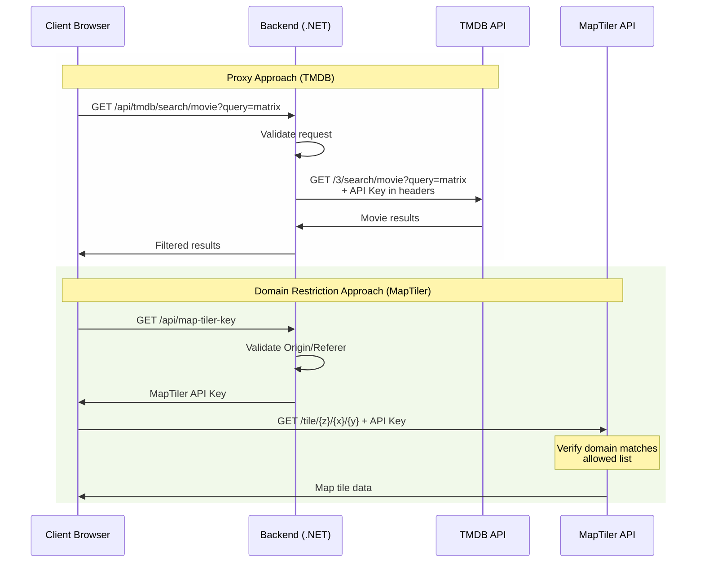

# Sicurezza delle API mediante API Key

Le API Key sono credenziali che identificano e autorizzano un'applicazione client a utilizzare un servizio API. La loro protezione è cruciale poiché, se compromesse, potrebbero permettere a malintenzionati di utilizzare il servizio a nome dell'applicazione legittima, potenzialmente causando danni finanziari o di sicurezza.

## Approccio 1: Backend Proxy

Il pattern del backend proxy prevede che tutte le chiamate API passino attraverso il server backend invece di essere effettuate direttamente dal client. Questo approccio offre diversi vantaggi:

1. La chiave API non viene mai esposta al frontend
2. Possibilità di implementare caching e rate limiting
3. Capacità di arricchire o filtrare le risposte prima di inviarle al client
4. Maggior controllo sul traffico API

## Approccio 2: Controllo del Domain e Origin

Questo approccio si basa sulla configurazione di restrizioni lato servizio API per accettare richieste solo da domini specifici. Include:

1. Configurazione CORS (Cross-Origin Resource Sharing)
2. Verifica dell'header Origin
3. Validazione del Referer
4. Limitazione degli IP consentiti

Di seguito si riportano i diagrammi di sequenza per entrambi gli approcci applicati in un paio di casi già analizzati:

- API di TheMovieDb.org
- API di MapTiler

Si analizzino in dettaglio le implementazioni:

### Implementazione del Backend Proxy (TMDB)

1. **Configurazione HttpClient**: Viene configurato un HttpClient dedicato per TMDB con l'API key inclusa nei headers di default.

2. **Endpoint Proxy**: L'endpoint `/api/tmdb/{*endpoint}` cattura qualsiasi path dopo `/api/tmdb/` e lo inoltra a TMDB, preservando i query parameter.

3. **Sicurezza**: 
   - L'API key non è mai esposta al client
   - Tutte le richieste passano attraverso il backend
   - Possibilità di implementare caching e rate limiting

### Implementazione del Domain Restriction (MapTiler)

1. **Configurazione CORS**: Definisce una policy che permette solo origini specifiche.

2. **Middleware Referer**: Verifica l'header Referer per un ulteriore livello di sicurezza.

3. **Endpoint API Key**:
   - Verifica l'origine della richiesta
   - Fornisce la chiave solo a domini autorizzati
   - La chiave è protetta dalle restrizioni di dominio configurate su MapTiler

### Considerazioni sulla Sicurezza

1. **Proxy Approach (TMDB)**:
   - Vantaggi:
     - Controllo totale sul traffico API
     - Possibilità di implementare caching
     - API key completamente nascosta
   - Svantaggi:
     - Maggior carico sul backend
     - Latenza aggiuntiva
     - Necessità di gestire la scalabilità

2. **Domain Restriction (MapTiler)**:
   - Vantaggi:
     - Minor carico sul backend
     - Minor latenza
     - Scalabilità gestita dal servizio API
   - Svantaggi:
     - API key esposta nel frontend
     - Minor controllo sul traffico
     - Dipendenza dalle restrizioni del servizio

### Best Practices Aggiuntive

1. **Rate Limiting**: Implementare limiti di chiamate sia lato proxy che per la distribuzione delle API key.

2. **Monitoring**: Implementare logging e monitoring per identificare anomalie nel traffico.

3. **Caching**: Implementare strategie di caching appropriate per ridurre il carico sulle API.

4. **Error Handling**: Gestire correttamente gli errori e non esporre dettagli sensibili nei messaggi di errore.
