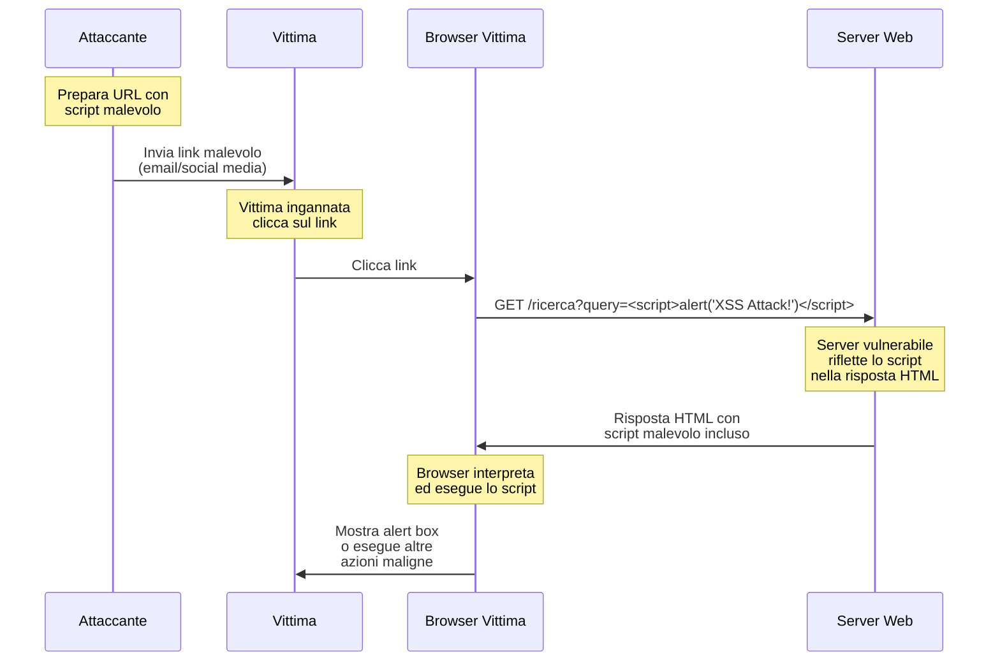
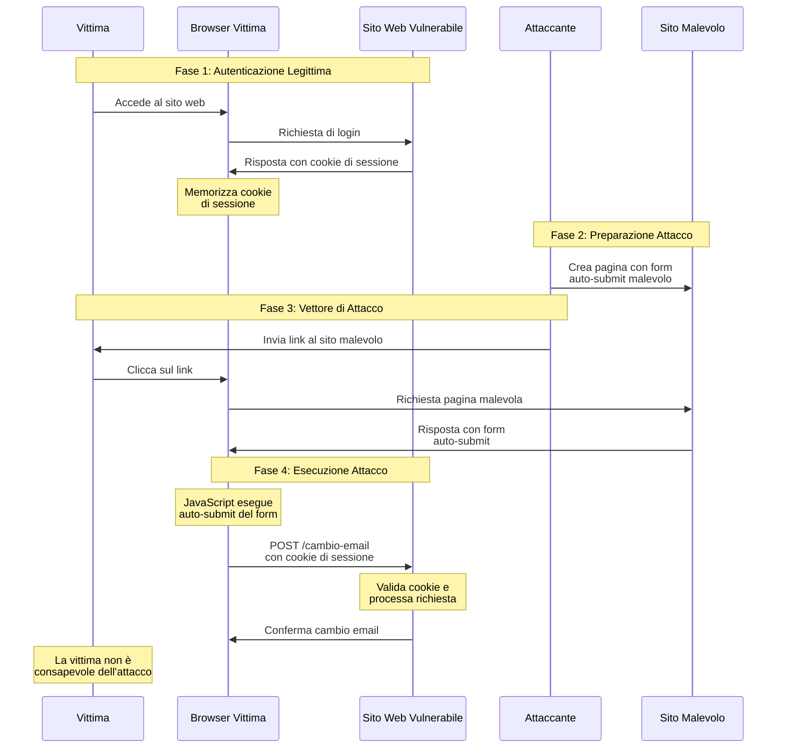

# Attacchi XSS e CSRF

- [Attacchi XSS e CSRF](#attacchi-xss-e-csrf)
	- [Attacchi Cross-Site Scripting (XSS)](#attacchi-cross-site-scripting-xss)
		- [Diagramma di Sequenza di un Attacco XSS Riflesso](#diagramma-di-sequenza-di-un-attacco-xss-riflesso)
		- [Esempio di Attacco XSS Riflesso Facilmente Replicabile (Frontend e Backend separati)](#esempio-di-attacco-xss-riflesso-facilmente-replicabile-frontend-e-backend-separati)
	- [Attacchi Cross-Site Request Forgery (CSRF)](#attacchi-cross-site-request-forgery-csrf)
		- [Diagramma di Sequenza di un Attacco CSRF](#diagramma-di-sequenza-di-un-attacco-csrf)
		- [Esempio di Attacco CSRF Facilmente Replicabile (Frontend e Backend Separati)](#esempio-di-attacco-csrf-facilmente-replicabile-frontend-e-backend-separati)
		- [Analisi delle memorie/storage sensibili `Lato Client` e vulnerabilità a XSS e CSRF](#analisi-delle-memoriestorage-sensibili-lato-client-e-vulnerabilità-a-xss-e-csrf)
			- [Tabella riassuntiva delle vulnerabilità delle memorie/storage Lato Client](#tabella-riassuntiva-delle-vulnerabilità-delle-memoriestorage-lato-client)
			- [Best Practice per la Gestione dei dati sensibili Lato Client e la Protezione da CSRF e XSS](#best-practice-per-la-gestione-dei-dati-sensibili-lato-client-e-la-protezione-da-csrf-e-xss)
		- [Ragioni per la "**cautela**" nella validazione di `Origin` e `Referer` per la protezione CSRF](#ragioni-per-la-cautela-nella-validazione-di-origin-e-referer-per-la-protezione-csrf)
		- [Perché i Token CSRF (Synchronizer Token Pattern) sono preferibili a validazione di `Origin` e `Referer` per la protezione CSRF](#perché-i-token-csrf-synchronizer-token-pattern-sono-preferibili-a-validazione-di-origin-e-referer-per-la-protezione-csrf)

## Attacchi Cross-Site Scripting (XSS)

Gli attacchi Cross-Site Scripting (XSS) rappresentano una seria vulnerabilità di sicurezza web che permette a un attaccante di iniettare script malevoli (solitamente JavaScript) all'interno di pagine web visualizzate da altri utenti.  Quando un utente visita una pagina web compromessa, lo script malevolo viene eseguito dal browser dell'utente, potenzialmente rubando informazioni sensibili, manipolando la pagina web, o eseguendo azioni per conto dell'utente vittima.

Esistono principalmente tre tipi di attacchi XSS:

1. **XSS Riflesso (Reflected XSS):**  In questo scenario, lo script malevolo viene iniettato attraverso la richiesta HTTP corrente, come ad esempio nei parametri URL o nei campi di un modulo. Il server riceve la richiesta, include lo script malevolo nella risposta HTML generata e la invia al browser dell'utente. Il browser esegue lo script malevolo poiché sembra provenire dal server legittimo. Questo tipo di attacco è "riflesso" perché lo script "rimbalza" dal server al browser dell'utente nella risposta immediata alla richiesta.

2. **XSS Memorizzato (Stored XSS):**  Anche noto come XSS persistente, questo tipo di attacco si verifica quando lo script malevolo viene memorizzato in modo permanente sul server (ad esempio, in un database, in un forum, nei commenti di un blog, ecc.). Ogni volta che un utente richiede la pagina che contiene i dati memorizzati, lo script malevolo viene servito dal server come parte della pagina web. Questo tipo di attacco è più pericoloso perché colpisce tutti gli utenti che visitano la pagina compromessa.

3. **XSS DOM-based:** Questo tipo di attacco sfrutta le vulnerabilità nel codice JavaScript lato client per iniettare script malevoli direttamente nel Document Object Model (DOM) della pagina. In questo caso, la vulnerabilità non risiede nel codice lato server, ma nel codice JavaScript client-side che manipola l'ambiente DOM in modo insicuro. L'attacco XSS DOM-based non coinvolge necessariamente il server nella risposta, rendendolo talvolta più difficile da rilevare dai sistemi di sicurezza lato server.

### Diagramma di Sequenza di un Attacco XSS Riflesso



Descrizione dettagliata di un attacco XSS riflesso:

1. **Attaccante prepara URL Malevolo:** L'attaccante crea un URL contenente uno script XSS malevolo come parametro. Ad esempio: `https://www.esempio.com/ricerca?query=<script>alert('XSS Attack!')</script>`.
2. **Attaccante Inganna Vittima:** L'attaccante inganna la vittima affinché clicchi sul link malevolo, ad esempio tramite email phishing o link su social media.
3. **Vittima Invia Richiesta Malevola:** Il browser della vittima invia una richiesta al server `www.esempio.com` con l'URL malevolo.
4. **Server Riflette Script Malevolo:** Il server, vulnerabile a XSS riflesso, include lo script malevolo nella risposta HTML, ad esempio all'interno del codice HTML della pagina dei risultati di ricerca.
5. **Browser della Vittima Esegue Script Malevolo:** Il browser della vittima riceve la risposta e interpreta l'HTML. Quando il browser esegue lo script malevolo incluso nella risposta (in questo caso, `alert('XSS Attack!')`), viene mostrato un alert box. In scenari reali, lo script malevolo potrebbe eseguire azioni più dannose, come rubare cookie di sessione o reindirizzare l'utente a un sito web malevolo.

Link di approfondimento:

* [OWASP - Cross Site Scripting (XSS)](https://owasp.org/www-community/attacks/xss/)
* [Mozilla MDN - Cross-site scripting (XSS)](https://developer.mozilla.org/en-US/docs/Web/Security/Attacks/XSS)

### Esempio di Attacco XSS Riflesso Facilmente Replicabile (Frontend e Backend separati)

Consideriamo una architettura con frontend (HTML, CSS, JS) e backend (ASP.NET Minimal API) separati.

**Backend (ASP.NET Minimal API - `Program.cs`):**

```csharp
using Microsoft.AspNetCore.Mvc;

var builder = WebApplication.CreateBuilder(args);
var app = builder.Build();

app.MapGet("/ricerca", (string query) =>
{
	// Vulnerabile a XSS - Non sanifica l'input 'query'
	return Results.Content($"<html><body><h1>Risultati della ricerca per: {query}</h1></body></html>", "text/html");
});

app.Run();
```

**Frontend (HTML - `index.html`):**

Un frontend HTML potrebbe avere un semplice form per la ricerca:

```html
<!DOCTYPE html>
<html>
<head>
	<title>Ricerca</title>
</head>
<body>
	<h1>Effettua una ricerca</h1>
	<form action="/ricerca" method="get">
		<input type="text" id="query" name="query" placeholder="Inserisci la tua ricerca">
		<button type="submit">Cerca</button>
	</form>
	<div id="risultati">
		</div>
</body>
</html>
```

**Replicazione dell'Attacco:**

1. Avviare l'API ASP.NET Minimal API.
2. Aprire `index.html` in un browser o navigare direttamente all'endpoint `/ricerca` (anche se `index.html` è più interattivo).
3. Inserire nel campo di ricerca (o direttamente nell'URL) uno script malevolo come: `<script>alert('Attacco XSS Riflesso!')</script>`.
4. Cliccare su "Cerca" o premere Invio.
5. Si noterà l'esecuzione dello script malevolo (in questo caso, un alert box) nella pagina dei risultati, dimostrando la vulnerabilità XSS riflessa.

Questo esempio evidenzia come la mancanza di sanificazione dell'input lato server possa portare a vulnerabilità XSS.

## Attacchi Cross-Site Request Forgery (CSRF)

Gli attacchi Cross-Site Request Forgery (CSRF) si basano sullo sfruttamento della fiducia che un sito web ha nel browser di un utente autenticato. In un attacco CSRF, un attaccante induce il browser della vittima ad eseguire una richiesta HTTP indesiderata verso un sito web vulnerabile in cui la vittima è autenticata. Questo permette all'attaccante di forzare l'utente autenticato a eseguire azioni non volute sul sito web vulnerabile, come cambiare la password, effettuare transazioni, o modificare informazioni personali, senza che la vittima ne sia consapevole.

### Diagramma di Sequenza di un Attacco CSRF



1. **Vittima Autenticata al Sito Web Vulnerabile:** La vittima si autentica normalmente al sito web vulnerabile (`www.esempio.com`) e il browser memorizza i cookie di sessione per autenticare le richieste successive.
2. **Attaccante Prepara Richiesta Malevola:** L'attaccante crea una pagina web malevola (o un email) contenente codice (ad esempio, un form HTML con un submit automatico tramite JavaScript) che invia una richiesta al sito web vulnerabile per eseguire un'azione specifica (es. cambiare email utente). Questa richiesta verrà inviata dal browser della vittima quando la pagina malevola viene caricata.
3. **Attaccante Inganna Vittima:** L'attaccante induce la vittima a visitare la pagina web malevola, ad esempio tramite link in un'email o su un sito web compromesso.
4. **Browser della Vittima Invia Richiesta Malevola:** Quando la vittima visita la pagina malevola, il codice malevolo viene eseguito nel browser. Questo codice automaticamente (o con un'interazione minima della vittima, come cliccare un bottone) invia una richiesta al sito web vulnerabile (`www.esempio.com`). Importante: il browser include automaticamente i cookie di sessione del sito vulnerabile nella richiesta perché proviene dallo stesso dominio della vittima autenticata.
5. **Sito Web Vulnerabile Esegue Azione Indesiderata:** Il sito web vulnerabile riceve la richiesta, la valida (apparentemente proviene da un utente autenticato grazie ai cookie di sessione), e esegue l'azione richiesta (es. cambia l'email dell'utente), senza verificare se l'utente ha realmente autorizzato tale azione.

Link di approfondimento:

* [OWASP - Cross Site Request Forgery (CSRF)](https://owasp.org/www-community/attacks/csrf)
* [Mozilla MDN - Cross-site request forgery (CSRF)](https://developer.mozilla.org/en-US/docs/Web/Security/Types_of_attacks#cross-site_request_forgery_csrf)

### Esempio di Attacco CSRF Facilmente Replicabile (Frontend e Backend Separati)

Consideriamo la stessa architettura frontend (HTML, CSS, JS) e backend (ASP.NET Minimal API).

**Backend (ASP.NET Minimal API - `Program.cs`):**

```csharp
using Microsoft.AspNetCore.Mvc;

var builder = WebApplication.CreateBuilder(args);
var app = builder.Build();

// Simula un sistema di autenticazione molto semplificato
app.MapPost("/cambiaemail", (HttpContext context, [FromForm] string nuovoEmail) =>
{
	// Vulnerabile a CSRF - Nessuna protezione CSRF implementata
	// In uno scenario reale, qui si dovrebbe cambiare l'email dell'utente autenticato
	// ... logica per cambiare email ...

	string utente = "utenteAutenticato"; // Dovrebbe essere derivato dalla sessione/autenticazione
	return Results.Content($"<html><body><h1>Email dell'utente {utente} cambiata in: {nuovoEmail}</h1></body></html>", "text/html");
});

app.Run();
```

**Pagina Web Malevola (Attaccante - `attacco_csrf.html`):**

```html
<!DOCTYPE html>
<html>
<head>
	<title>Pagina Malevola CSRF</title>
</head>
<body>
	<h1>Questa è una pagina malevola!</h1>
	<p>Se sei autenticato sul sito vulnerabile, verrà eseguita un'azione indesiderata...</p>
	<form action="http://localhost:<PORTA_API>/cambiaemail" method="post" id="csrf_form">
		<input type="hidden" name="nuovoEmail" value="email.attaccante@esempio.com">
	</form>
	<script>
		document.getElementById('csrf_form').submit(); // Submit automatico del form
	</script>
</body>
</html>
```

**Replicazione dell'Attacco:**

1. Avviare l'API ASP.NET Minimal API sulla porta specificata (`<PORTA_API>`, ad esempio 5000).
2. Autenticarsi sul sito web vulnerabile (in questo caso, per semplicità, si simula solo l'autenticazione presupponendo di essere autenticati, senza implementare un vero sistema di login).
3. Aprire `attacco_csrf.html` in un browser **nello stesso browser in cui si è autenticati al sito vulnerabile**.
4. Visitando `attacco_csrf.html`, il form verrà automaticamente inviato al backend vulnerabile, cambiando (simulando) l'email dell'utente a `email.attaccante@esempio.com`, senza alcuna interazione diretta da parte della vittima, dimostrando la vulnerabilità CSRF.

Questo esempio dimostra come la mancanza di protezione CSRF sul backend permetta ad un attaccante di forzare azioni indesiderate per conto di un utente autenticato.

### Analisi delle memorie/storage sensibili `Lato Client` e vulnerabilità a XSS e CSRF

Diverse memorie lato client possono essere bersaglio o essere sfruttate in attacchi XSS e CSRF: variabili JavaScript, cookie, Session Storage, Local Storage

1. **Variabili JavaScript (in Memoria)**

   - **Cosa sono**: Variabili dichiarate in JavaScript che esistono nella memoria del browser **solo per la durata della pagina web corrente** (o fino a quando non vengono esplicitamente cancellate dal codice JavaScript).
   - **Vulnerabilità CSRF**: **Non direttamente vulnerabili a CSRF**. Gli attacchi CSRF mirano a far eseguire azioni *sul server*, sfruttando le sessioni di autenticazione. Le variabili JavaScript sono puramente lato client e non influenzano direttamente le richieste al server.
   - **Vulnerabilità XSS**: **Altamente vulnerabili a XSS**. Se un attaccante riesce a iniettare codice XSS nella pagina, **può accedere e manipolare liberamente tutte le variabili JavaScript presenti nella pagina**, inclusi dati sensibili (token, informazioni personali) che potrebbero essere erroneamente memorizzati in variabili JavaScript. Questo è uno dei principali pericoli dell'XSS.

2. **Cookie HTTP**

   - **Cosa sono**: Piccoli file di testo che i siti web possono memorizzare nel browser dell'utente. I cookie vengono inviati automaticamente dal browser al server con ogni richiesta successiva **allo stesso dominio** (o domini specificati nelle proprietà del cookie).
   - **Vulnerabilità CSRF**:
       - **Cookie di Autenticazione (senza protezioni aggiuntive): *Vulnerabili a CSRF***. Gli attacchi CSRF sfruttano proprio il fatto che il browser invia *automaticamente* i cookie (inclusi quelli di autenticazione) con le richieste cross-site. È per questo che è necessario implementare meccanismi di protezione CSRF come gli Anti-Forgery Tokens.
       - **Cookie con `SameSite: Strict` o `SameSite: Lax`**: **Mitigano significativamente il rischio CSRF**. L'attributo `SameSite` nei cookie controlla quando i cookie vengono inviati in richieste cross-site. `SameSite: Strict` impedisce l'invio del cookie in qualsiasi richiesta cross-site (tranne navigazione top-level per `Lax`), rendendo gli attacchi CSRF molto più difficili da realizzare.
   - **Vulnerabilità XSS**:
       - **Cookie *senza* `HttpOnly`**: **Vulnerabili a XSS**. Se un cookie non ha l'attributo `HttpOnly`, il codice JavaScript (iniettato tramite XSS) può accedere al contenuto del cookie tramite `document.cookie`. Questo permette agli attaccanti di **rubare cookie di sessione, token di autenticazione** e altre informazioni sensibili memorizzate nei cookie, compromettendo la sessione dell'utente.
       - **Cookie *con* `HttpOnly`**: **Protetti da XSS (in termini di *accesso JavaScript*)**. L'attributo `HttpOnly` impedisce al codice JavaScript di accedere al cookie tramite `document.cookie`. Questo è un **importante meccanismo di difesa contro XSS per i cookie sensibili** (come quelli di sessione). Tuttavia, i cookie `HttpOnly` vengono **ancora inviati automaticamente al server** dal browser, quindi **non proteggono *da soli* contro CSRF** (anche se possono essere parte di strategie di difesa combinate).

3. **Session Storage**

   - **Cosa è**: Meccanismo di storage lato client simile a Local Storage, ma i dati sono disponibili **solo per la durata della sessione del browser** (finché la finestra o la tab del browser è aperta). I dati vengono cancellati quando la sessione termina.
   - **Vulnerabilità CSRF**: **Non direttamente vulnerabile a CSRF**. Session Storage, come le variabili JavaScript, è lato client e non influenza direttamente le richieste server-side.
   - **Vulnerabilità XSS**: **Vulnerabile a XSS**. Codice JavaScript malevolo iniettato tramite XSS può accedere e manipolare i dati memorizzati in Session Storage tramite l'oggetto `sessionStorage`. Questo può portare al furto di dati sensibili o alla manipolazione del comportamento dell'applicazione.

4. **Local Storage**

   - **Cosa è**: Meccanismo di storage lato client che permette di memorizzare dati **in modo persistente nel browser dell'utente**, anche dopo la chiusura del browser e il riavvio. I dati rimangono disponibili finché non vengono esplicitamente cancellati tramite JavaScript o dalle impostazioni del browser.
   - **Vulnerabilità CSRF**: **Non direttamente vulnerabile a CSRF**. Local Storage è lato client.
   - **Vulnerabilità XSS**: **Vulnerabile a XSS e *particolarmente pericoloso***. Come per Session Storage e variabili JavaScript, codice XSS può accedere e manipolare i dati in Local Storage tramite `localStorage`. La persistenza dei dati in Local Storage rende l'XSS **ancora più grave**, poiché i dati rubati o modificati possono rimanere compromessi anche dopo che l'utente ha chiuso e riaperto il browser. **Memorizzare informazioni sensibili in Local Storage è generalmente sconsigliato, soprattutto se l'applicazione è vulnerabile a XSS.**

#### Tabella riassuntiva delle vulnerabilità delle memorie/storage Lato Client

| Memoria Lato Client | Vulnerabilità CSRF | Vulnerabilità XSS | Note Importanti |
| --- |  --- |  --- |  --- |
| **Variabili JS** | No (diretta) | **Sì (Alta)** | Estremamente vulnerabili a XSS. **Non memorizzare dati sensibili in variabili JS se possibile.** Durata limitata alla pagina. |
| **Cookie (senza protezioni)** | **Sì** | **Sì** | Cookie di autenticazione *senza protezioni CSRF* sono bersaglio di attacchi CSRF. Cookie *senza HttpOnly* sono vulnerabili a XSS. **Utilizzare SEMPRE Anti-Forgery Tokens per proteggere da CSRF. Utilizzare HttpOnly per cookie sensibili.** |
| **Cookie (`SameSite` e `HttpOnly`)** | **Mitigata** | **Mitigata** | `SameSite` riduce rischio CSRF. `HttpOnly` protegge da accesso JavaScript (XSS). **Combinazione di `SameSite` e `HttpOnly` è best practice per cookie sensibili.** |
| **Session Storage** | No (diretta) | **Sì** | Vulnerabile a XSS. Durata limitata alla sessione del browser. |
| **Local Storage** | No (diretta) | **Sì (Alta)** | **Particolarmente pericoloso se compromesso da XSS** a causa della persistenza dei dati. **Evitare di memorizzare dati sensibili in Local Storage, specialmente in applicazioni con rischio XSS.** |

#### Best Practice per la Gestione dei dati sensibili Lato Client e la Protezione da CSRF e XSS

- **Non memorizzare dati *veramente* sensibili lato client**: Idealmente, si dovrebbe minimizzare la quantità di dati sensibili memorizzati lato client. Se possibile, bisognerebbe gestire le informazioni sensibili **solo lato server**, utilizzando sessioni sicure (con HTTPS) e database protetti.
- **Utilizzare cookie solo quando necessario e con protezioni**: Se si deve usare cookie per sessioni, autenticazione o altre informazioni, **impostare sempre gli attributi `HttpOnly`, `Secure` e `SameSite`** (configurando il backend per farlo).
- **Evitare Local Storage per dati sensibili**: A meno che non ci sia una ragione specifica e ben ponderata, **evitare di memorizzare dati altamente sensibili in Local Storage** a causa del rischio XSS persistente. Considerare alternative più sicure come cookie `HttpOnly` o gestione lato server.
- **Sanitizzare l'input e fare encoding dell'output (contro XSS)**: Implementare **rigorose pratiche di sanitizzazione dell'input** (validando e pulendo i dati in ingresso) e di **encoding dell'output** (codificando i dati prima di mostrarli nella pagina web) sia lato server che lato client. Utilizzare librerie e framework che offrono funzioni di encoding sicure.
- **Implementare Content Security Policy (CSP) (contro XSS)**: Utilizzare CSP per definire una politica di sicurezza che **limita le fonti da cui il browser può caricare risorse** (script, immagini, stili, ecc.). Questo può ridurre significativamente l'impatto degli attacchi XSS.
- **Utilizzare Anti-Forgery Tokens (contro CSRF)**: Implementare sempre la protezione Anti-Forgery Tokens su **tutti gli endpoint server-side che modificano lo stato** (POST, PUT, DELETE), specialmente quelli che gestiscono form o API utilizzate dal frontend.
- **Utilizzare HTTPS**: **HTTPS è fondamentale** per proteggere la trasmissione di tutti i dati, inclusi cookie, sessioni e dati memorizzati lato client, da intercettazioni e attacchi man-in-the-middle.
- **Formazione e consapevolezza sulla sicurezza**: Formare gli sviluppatori sulle vulnerabilità XSS e CSRF e sulle best practice per prevenirle è essenziale.

### Ragioni per la "**cautela**" nella validazione di `Origin` e `Referer` per la protezione CSRF

1. **Affidabilità e Presenza degli Header:**
    * **Header `Referer`:** L'header `Referer` è *opzionale*. Ciò significa che i browser non sono obbligati a inviarlo in tutte le richieste. In alcune situazioni, il `Referer` può essere omesso per motivi di privacy, politiche di sicurezza del browser, o configurazioni utente (es. estensioni del browser, impostazioni di sicurezza, firewalls). Inoltre, in scenari come richieste HTTPS a HTTP, il `Referer` potrebbe essere omesso per ragioni di sicurezza.
    * **Header `Origin`:** L'header `Origin` è generalmente più affidabile di `Referer` in quanto è *obbligatorio* per le richieste `POST` e altre richieste cross-origin moderne (come `Fetch` API con `cors` mode). Tuttavia, non è presente in *tutte* le tipologie di richieste. Ad esempio, richieste same-origin o form submission tradizionali same-origin potrebbero non includere sempre l'header `Origin` in tutti i browser storici (anche se è più comune ora). In passato, alcuni browser meno recenti avevano un supporto inconsistente per `Origin`.

    **Implicazioni per la Sicurezza:** Se si basa la difesa CSRF esclusivamente sulla validazione di questi header e questi sono assenti nella richiesta (per ragioni legittime o manipolazione), la protezione fallisce. Un attaccante potrebbe, in determinate circostanze, cercare di innescare scenari in cui questi header sono omessi o modificati in modo da eludere i controlli.

2. **Possibilità di Spoofing e Manipolazione (anche se Complesse):**
    * **Header `Referer`:**  Sebbene sia più difficile rispetto al passato, l'header `Referer` può essere soggetto a spoofing o manipolazione in alcune situazioni, soprattutto in contesti più datati o specifici.  Esistevano (e in teoria potrebbero ancora esistere, sebbene siano rare) tecniche per influenzare l'header `Referer` in certi scenari, anche se i browser moderni hanno rafforzato le protezioni. In generale, affidarsi al `Referer` per la sicurezza è sempre stato sconsigliato per la sua natura controllata dal client e non garantita.
    * **Header `Origin`:** L'header `Origin` è *molto* più difficile da spoofare rispetto al `Referer`. È gestito direttamente dal browser e le moderne implementazioni lo rendono resistente a manipolazioni dirette da parte di script malevoli. Tuttavia, in scenari *molto* avanzati e ipotetici, sono state discusse possibilità teoriche di manipolazione, sebbene estremamente complesse e poco pratiche nello scenario di attacchi CSRF comuni. Il rischio principale non è tanto lo spoofing diretto, quanto la *mancanza* dell'header in certe richieste o la dipendenza da un comportamento specifico del browser che potrebbe variare.

    **Implicazioni per la Sicurezza:** Sebbene lo spoofing diretto sia complesso, la *possibilità teorica* di manipolazione (seppur remota per `Origin` e più datata per `Referer`) contribuisce alla raccomandazione di cautela. La sicurezza non dovrebbe basarsi su assunzioni che potrebbero essere violate, anche se con difficoltà.

3. **Validazione Complessa e Soggetta a Errori:**
    * Validare correttamente l'header `Origin` o `Referer` richiede una logica di validazione accurata lato server. Si deve verificare che l'origine o il referrer corrispondano a un'origine *attesa* e *valida* per l'applicazione. Errori nella configurazione o nella logica di validazione possono facilmente introdurre vulnerabilità. Ad esempio, validare in modo errato i sottodomini, omettendo controlli su protocolli (HTTP vs HTTPS), o permettendo wildcard in modo non sicuro, potrebbe vanificare la protezione.
    * Inoltre, la validazione di questi header può diventare complessa in architetture distribuite, con load balancer, proxy inversi, o quando si gestiscono più domini e sottodomini.

4. **Non Proteggono da Tutti i Tipi di CSRF:**
    * La validazione di `Origin` e `Referer` è *principalmente* efficace contro attacchi CSRF che sfruttano richieste *cross-origin* (ovvero, da un dominio malevolo a quello vulnerabile). Tuttavia, in scenari più complessi, come attacchi CSRF *same-site* (meno comuni ma possibili in certe configurazioni, specialmente con cookie `SameSite=None` in browser datati o in assenza di `SameSite`), o attacchi che sfruttano vulnerabilità all'interno dello stesso sito (es. XSS per aggirare le protezioni), la sola validazione di questi header potrebbe non essere sufficiente.

5. **`Referer` e `Origin` sono Header HTTP, non Meccanismi CSRF Dedicati:**
    * È importante ricordare che `Referer` e `Origin` sono header HTTP nati per altri scopi (tracciamento del referrer, indicazione dell'origine della richiesta per CORS, etc.), non sono stati *progettati specificamente* come meccanismi di difesa CSRF. Utilizzarli per la protezione CSRF è un "uso secondario" e, come tale, non offrono la robustezza e la specificità di meccanismi *dedicati* come i token CSRF.

### Perché i Token CSRF (Synchronizer Token Pattern) sono preferibili a validazione di `Origin` e `Referer` per la protezione CSRF

I token CSRF, al contrario, sono progettati *specificamente* per la protezione CSRF e offrono una difesa molto più robusta:

* **Generati e Validati dal Server:** I token CSRF sono generati in modo casuale dal server, associati alla sessione dell'utente, e validati dal server ad ogni richiesta che modifica lo stato. Questo processo lato server offre un livello di controllo e sicurezza molto superiore rispetto agli header forniti dal client.
* **Specifici per Sessione e Azione:**  Ogni token è unico per la sessione dell'utente (o per una specifica azione), rendendo molto difficile per un attaccante prevedere o riutilizzare un token valido.
* **Resistenti a Spoofing e Omissione (se Implementati Correttamente):**  Un'implementazione corretta di token CSRF rende estremamente difficile per un attaccante aggirare la protezione, poiché il token deve essere presente e valido nella richiesta per essere accettata dal server.
* **Standard del Settore:** L'uso di token CSRF è una best practice consolidata e uno standard de facto per la protezione CSRF in applicazioni web.

**In Conclusione:**

La validazione degli header `Origin` e `Referer` può essere considerata come una **misura di difesa *aggiuntiva* e *stratificata*** contro gli attacchi CSRF, soprattutto in combinazione con altre tecniche. Possono offrire una certa protezione in scenari semplici o come parte di una strategia di difesa in profondità.

Tuttavia, **non dovrebbero essere considerate la *principale* o *unica* difesa CSRF**.  Affidarsi esclusivamente a questi header è rischioso a causa delle loro limitazioni in termini di affidabilità, possibilità teoriche di manipolazione, complessità di validazione, e perché non proteggono da tutte le varianti di attacchi CSRF.

La **best practice** rimane sempre l'implementazione robusta di **token CSRF (Synchronizer Token Pattern)** come meccanismo *primario* di difesa, integrata eventualmente con validazioni di `Origin` e `Referer` come *misure complementari* per una maggiore sicurezza. L'avvertenza "con cautela" è quindi un promemoria dell'importanza di non sopravvalutare la protezione offerta dalla sola validazione di questi header e di privilegiare soluzioni più robuste e dedicate come i token CSRF.
