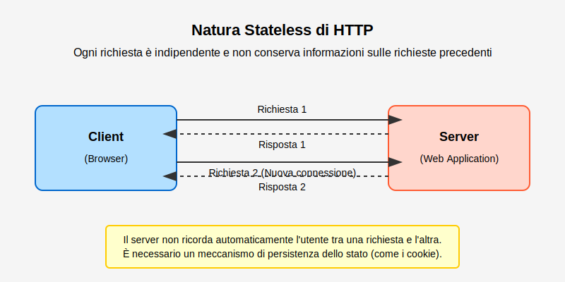
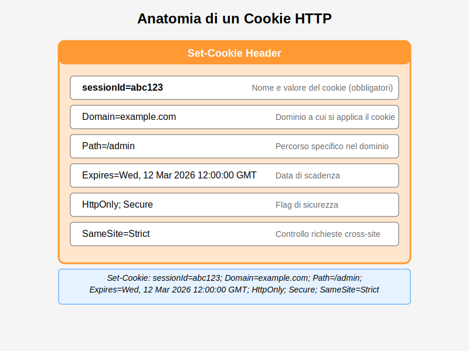
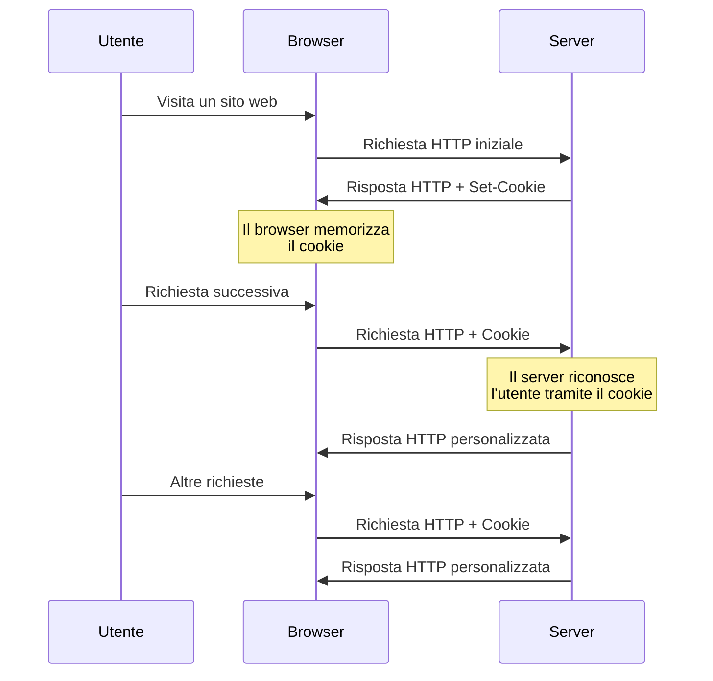
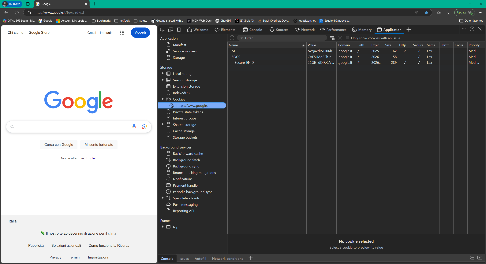
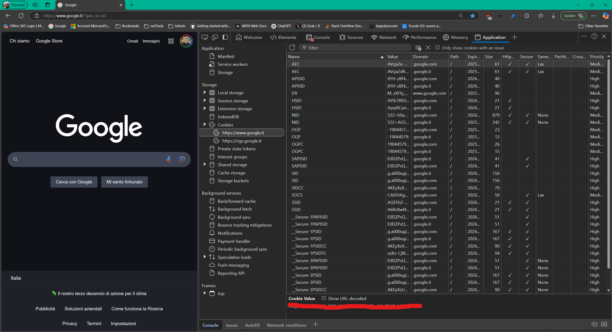

# Introduzione al Riconoscimento dell'Utente e Protocollo HTTP Stateless

- [Introduzione al Riconoscimento dell'Utente e Protocollo HTTP Stateless](#introduzione-al-riconoscimento-dellutente-e-protocollo-http-stateless)
  - [Introduzione](#introduzione)
  - [La necessità del Riconoscimento dell'Utente](#la-necessità-del-riconoscimento-dellutente)
  - [Protocollo HTTP Stateless](#protocollo-http-stateless)
    - [Cookie: Riconoscimento dell'Utente nel Web](#cookie-riconoscimento-dellutente-nel-web)
      - [Proprietà dei Cookie](#proprietà-dei-cookie)
      - [Esplorazione dei Cookie con Developer Tools del Browser](#esplorazione-dei-cookie-con-developer-tools-del-browser)
      - [Accesso ai Cookie Tramite JavaScript](#accesso-ai-cookie-tramite-javascript)
      - [Impostare un cookie lato server in ASP.NET Minimal API (modo sicuro con HttpOnly)](#impostare-un-cookie-lato-server-in-aspnet-minimal-api-modo-sicuro-con-httponly)
      - [Recuperare un cookie lato server in ASP.NET](#recuperare-un-cookie-lato-server-in-aspnet)
  - [Riepilogo](#riepilogo)
  - [Risorse Aggiuntive](#risorse-aggiuntive)

Questa lezione introduce il concetto fondamentale del riconoscimento dell'utente nelle applicazioni web e mobile. Si esplorerà la necessità di identificare e mantenere lo stato degli utenti in un ambiente web intrinsecamente stateless, introducendo i cookie come meccanismo tradizionale per il riconoscimento dell'utente nel contesto web.

## Introduzione

Il riconoscimento dell'utente rappresenta una funzionalità imprescindibile per la maggior parte delle applicazioni web e mobile moderne. Che si tratti di personalizzare l'esperienza utente, garantire la sicurezza degli accessi o semplicemente mantenere traccia delle azioni compiute da un singolo individuo durante una sessione, la capacità di identificare e "ricordare" l'utente è cruciale.

Questa lezione introduttiva pone le basi per la comprensione dei meccanismi di riconoscimento dell'utente. Si partirà dall'analisi della natura *stateless* del protocollo HTTP, elemento centrale che definisce le sfide e le soluzioni adottate nel contesto web. Successivamente, si introdurrà il concetto di cookie come soluzione tradizionale per superare i limiti del protocollo HTTP e implementare il riconoscimento dell'utente nelle applicazioni web.

## La necessità del Riconoscimento dell'Utente

Per comprendere appieno l'importanza del riconoscimento dell'utente, è utile analizzare alcuni scenari comuni in cui questa funzionalità si rivela essenziale:

* **Personalizzazione dell'Esperienza Utente:** Immaginiamo un sito di e-commerce. Il riconoscimento dell'utente permette di personalizzare l'esperienza di navigazione, mostrando prodotti visti in precedenza, suggerimenti basati sugli interessi, o offerte dedicate. Senza riconoscimento dell'utente, ogni visita risulterebbe anonima e impersonale, limitando l'efficacia del sito e la soddisfazione dell'utente.

    

    *Esempio di personalizzazione in un sito e-commerce: prodotti consigliati basati sulla cronologia di navigazione dell'utente.*

* **Gestione del Carrello e delle Sessioni:**  Nei siti di e-commerce, il carrello rappresenta un elemento dinamico e legato all'utente. Il sistema deve essere in grado di associare gli articoli inseriti nel carrello a uno specifico utente, anche durante la navigazione tra diverse pagine del sito e in accessi successivi.  Analogamente, in applicazioni web complesse, può essere necessario mantenere una "sessione" utente per tracciare lo stato di avanzamento in un processo o le preferenze impostate. Il riconoscimento dell'utente è il fondamento per la gestione efficace di carrelli e sessioni.

* **Sicurezza e Autenticazione:**  Molte applicazioni web offrono aree riservate o funzionalità protette accessibili solo a utenti autenticati. Il riconoscimento dell'utente è indispensabile per implementare meccanismi di autenticazione (login) e autorizzazione (controllo degli accessi).  Senza la capacità di riconoscere gli utenti, non sarebbe possibile distinguere tra utenti autorizzati e non autorizzati, compromettendo la sicurezza e l'integrità dell'applicazione.  Ad esempio, una piattaforma di home banking richiede un robusto sistema di riconoscimento dell'utente per garantire che solo il legittimo proprietario dell'account possa accedere alle informazioni finanziarie e operare sul conto.

* **Tracciamento delle Preferenze e delle Attività:**  Per migliorare l'esperienza utente e ottimizzare le funzionalità di un'applicazione, può essere utile tracciare le preferenze degli utenti (es. lingua, tema, layout) e le loro attività (es. pagine visitate, azioni compiute). Il riconoscimento dell'utente permette di raccogliere e analizzare questi dati in modo mirato e personalizzato.  Le informazioni raccolte possono essere utilizzate per migliorare l'usabilità del sito, offrire contenuti più pertinenti e personalizzare le comunicazioni con l'utente.

Questi esempi evidenziano come il riconoscimento dell'utente sia un requisito fondamentale per lo sviluppo di applicazioni web interattive, personalizzate, sicure e orientate all'utente.

## Protocollo HTTP Stateless

Per comprendere le tecniche di riconoscimento dell'utente nel web, è cruciale analizzare la caratteristica fondamentale del protocollo **HTTP (Hypertext Transfer Protocol)**: la sua natura **stateless**, ovvero "senza stato".

In termini semplici, "stateless" significa che ogni richiesta HTTP inviata da un client (ad esempio un browser web) a un server viene trattata dal server in maniera **completamente indipendente** da tutte le richieste precedenti.  Il server non "ricorda" nulla delle interazioni passate con lo stesso client. Ogni richiesta è un'entità isolata e autosufficiente.



*Schema del ciclo richiesta-risposta HTTP stateless. Ogni richiesta è indipendente dalle precedenti.*

Per illustrare meglio il concetto, si può utilizzare un'analogia. Immaginiamo un ristorante con un cameriere "stateless". Ogni volta che un cliente (browser) fa un ordine (richiesta HTTP), il cameriere (server) serve l'ordine senza ricordare chi è il cliente, cosa ha ordinato prima, o se è già stato servito in precedenza.  Ogni interazione è isolata e non mantiene una "memoria" della conversazione precedente.

**Caratteristiche chiave del protocollo HTTP stateless:**

* **Indipendenza delle richieste:** Ogni richiesta HTTP contiene tutte le informazioni necessarie al server per elaborarla. Non si fa affidamento su informazioni memorizzate da interazioni precedenti.
* **Nessuna memoria lato server:** Il server non mantiene attivamente informazioni sullo stato di ogni client tra le richieste. Non esiste una "sessione" intrinseca a livello di protocollo HTTP.
* **Scalabilità e semplicità:** La natura stateless semplifica la progettazione e la scalabilità dei server web.  Non è necessario gestire lo stato delle sessioni per migliaia o milioni di client simultanei. Ogni server può gestire qualsiasi richiesta in modo indipendente, facilitando il bilanciamento del carico e la resilienza del sistema.

**Limitazioni del protocollo HTTP stateless per le applicazioni web:**

Sebbene la natura stateless di HTTP offra vantaggi in termini di scalabilità e semplicità, essa presenta una sfida significativa per lo sviluppo di applicazioni web interattive e orientate all'utente.  Come si è visto negli esempi precedenti, molte funzionalità desiderabili (personalizzazione, carrello, autenticazione) richiedono la capacità di mantenere lo stato dell'utente tra diverse richieste.

Se il protocollo HTTP è stateless, come è possibile implementare il riconoscimento dell'utente e le funzionalità che dipendono dallo stato utente nelle applicazioni web?  La risposta risiede nell'introduzione di meccanismi aggiuntivi che "aggirano" la natura stateless del protocollo, permettendo di simulare una sessione utente e mantenere informazioni tra le richieste. Il meccanismo tradizionale e ampiamente utilizzato per raggiungere questo scopo nel contesto web è rappresentato dai **cookie**.

### Cookie: Riconoscimento dell'Utente nel Web

I **cookie** rappresentano la soluzione storica e ancora oggi prevalente per implementare il riconoscimento dell'utente nelle applicazioni web, superando la natura stateless del protocollo HTTP.

**Concetto e funzionamento dei cookie:**

Un cookie è un piccolo file di testo che un server web può inviare al browser dell'utente. Il browser, a sua volta, memorizza questo cookie localmente sul computer dell'utente. Ad ogni successiva richiesta HTTP che il browser invia *allo stesso dominio* del server che ha originariamente impostato il cookie, il browser **includerà automaticamente** il cookie nella richiesta.


In questo modo, il server può "ricordare" l'utente tra diverse richieste stateless.  Il cookie funge da "biglietto da visita" che il browser presenta al server ad ogni interazione successiva, permettendo al server di identificare l'utente e recuperare informazioni associate (es. sessione, preferenze).



*Schema del flusso di funzionamento dei cookie. Il server imposta il cookie, il browser lo memorizza e lo rinvia ad ogni richiesta successiva.*

**Tipi di Cookie:**

Esistono diverse tipologie di cookie, classificate in base alla loro durata e al loro scopo:

* **Cookie di Sessione:** Questi cookie sono temporanei e vengono eliminati automaticamente dal browser alla chiusura della finestra o del browser stesso. Sono utilizzati principalmente per gestire le sessioni utente durante la navigazione in un sito web.  Ad esempio, un cookie di sessione può essere utilizzato per memorizzare l'ID di sessione dell'utente, permettendo al server di associare le richieste successive alla stessa sessione.

* **Cookie Persistenti:** Questi cookie hanno una data di scadenza impostata dal server. Rimangono memorizzati sul computer dell'utente anche dopo la chiusura del browser e vengono inviati al server ad ogni visita successiva al sito web, fino alla data di scadenza. I cookie persistenti sono utilizzati per memorizzare informazioni a lungo termine, come le preferenze dell'utente (es. lingua, tema) o per tracciare le visite ripetute di un utente.

* **Cookie di Terze Parti:** Questi cookie sono impostati da un dominio diverso da quello del sito web che l'utente sta visitando. Sono spesso utilizzati per il tracciamento cross-site, ovvero per monitorare il comportamento dell'utente su diversi siti web e per scopi pubblicitari. I cookie di terze parti sollevano maggiori preoccupazioni in termini di privacy e sono sempre più bloccati dai browser moderni per impostazione predefinita.

#### Proprietà dei Cookie

Un cookie è definito da diverse proprietà che ne determinano il comportamento e le caratteristiche:

* **Nome e Valore (Name & Value):**  Ogni cookie è identificato da una coppia nome-valore. Il nome è una stringa univoca che identifica il cookie, mentre il valore contiene l'informazione effettiva da memorizzare. Ad esempio, un cookie potrebbe avere nome "sessionID" e valore "abc123xyz".
* **Dominio (Domain):** Specifica il dominio (e i sottodomini) per il quale il cookie è valido. Il browser invierà il cookie solo alle richieste HTTP dirette a questo dominio o sottodomini. Ad esempio, se il dominio è impostato su "esempio.com", il cookie verrà inviato a richieste verso "esempio.com", "[www.esempio.com](https://www.esempio.com)", "[blog.esempio.com](https://blog.esempio.com)", ma non a "[altro-esempio.com](https://altro-esempio.com)".
* **Path (Percorso):** Definisce il percorso all'interno del dominio per il quale il cookie è valido. Il browser invierà il cookie solo alle richieste HTTP che corrispondono a questo percorso o a un percorso inferiore. Ad esempio, se il path è impostato su "/blog", il cookie verrà inviato a richieste verso "[esempio.com/blog](https://esempio.com/blog)", "[esempio.com/blog/articoli](https://esempio.com/blog/articoli)", ma non a "[esempio.com/contatti](https://esempio.com/contatti)".
* **Data di Scadenza (Expires/Max-Age):** Indica la data e l'ora in cui il cookie scade e viene automaticamente eliminato dal browser. Può essere impostata una data specifica (Expires) o una durata in secondi a partire dal momento in cui il cookie viene impostato (Max-Age). Se non viene specificata una data di scadenza, il cookie viene considerato un cookie di sessione e viene eliminato alla chiusura del browser.
* **HttpOnly:** Attributo booleano. Se impostato a `true`, impedisce l'accesso al cookie tramite JavaScript lato client. Questo aumenta la sicurezza, prevenendo attacchi Cross-Site Scripting (XSS), in quanto script malevoli non potranno leggere o manipolare cookie marcati come HttpOnly. È fortemente raccomandato impostare `HttpOnly` per cookie contenenti informazioni sensibili come ID di sessione o token di autenticazione.
* **Secure:** Attributo booleano. Se impostato a `true`, indica che il cookie deve essere trasmesso solo tramite connessioni **HTTPS** (protocollo HTTP sicuro). Questo protegge il cookie da intercettazioni in reti non sicure (es. Wi-Fi pubbliche). È essenziale impostare `Secure` per cookie che trasportano informazioni sensibili.
* **SameSite:** Attributo che controlla se il cookie deve essere inviato con richieste cross-site (richieste provenienti da un dominio diverso da quello del sito web).  L'attributo `SameSite` aiuta a prevenire attacchi Cross-Site Request Forgery (CSRF). Valori comuni per `SameSite` sono:

* **1️⃣ SameSite=Strict**

    🔒 **Massima sicurezza, minore usabilità.**
    Il cookie **viene inviato solo** se la richiesta proviene dallo stesso sito che ha impostato il cookie. Non viene mai inviato in richieste cross-site, nemmeno se l'utente ha cliccato un link che porta al sito.

    📌 **Esempio:**

    - Il sito `example.com` imposta un cookie con `SameSite=Strict`.
    - Un utente clicca un link su `another-site.com` che porta a `example.com`.
    - **Il browser NON invia il cookie**. L'utente dovrà autenticarsi nuovamente.

    🛠 **Quando usarlo?**

    - Per cookie sensibili come token di autenticazione, per prevenire attacchi CSRF.
    - Quando non è necessario mantenere l'utente autenticato tra navigazioni da siti esterni.

* **2️⃣ SameSite=Lax (default nei browser moderni)**

    🔄 **Bilanciamento tra sicurezza e usabilità.**
    Il cookie **viene inviato solo per navigazioni "safe"**, ovvero quando l'utente naviga direttamente al sito tramite link GET (clic su un link, digitazione URL, apertura in una nuova scheda).

    📌 **Esempio:**

    - Il sito `example.com` imposta un cookie con `SameSite=Lax`.
    - L'utente clicca un link su `another-site.com` che porta a `example.com`.
    - ✅ **Il browser invia il cookie** perché la richiesta è di tipo GET.

    ❌ Tuttavia, il cookie **NON** viene inviato se la richiesta è una POST, iframe o AJAX proveniente da un altro sito.

    🛠 **Quando usarlo?**

    - Per cookie di autenticazione che devono funzionare se l'utente accede tramite link.
    - Per la maggior parte dei casi d'uso in cui non è richiesto un comportamento cross-site avanzato.

* **3️⃣ SameSite=None (necessario per richieste cross-site)**

    🌍 **Richiesto per scenari cross-site (terze parti, API, SSO, CDN, embed, ecc.).**
    Il cookie **viene inviato in tutte le richieste**, incluse le richieste cross-site. **Deve sempre essere usato con `Secure`.**

    📌 **Esempio:**

    - `example.com` imposta un cookie con `SameSite=None; Secure`.
    - Un iframe di `example.com` è incorporato su `another-site.com`.
    - ✅ **Il cookie viene inviato** anche se la richiesta è da un dominio diverso.

    🔴 **Attenzione:**

    - Se un cookie ha `SameSite=None` ma **non ha `Secure`**, il browser lo rifiuta.
    - Alcuni browser vecchi non supportano `SameSite=None`, quindi il comportamento potrebbe variare.

    🛠 **Quando usarlo?**

    - Quando il sito è caricato in un iframe (es. pagamenti con Stripe, login SSO).
    - Per API che devono essere accessibili da più origini.
    - Per gestire autenticazione cross-site in architetture distribuite.

* **💡 Riepilogo rapido**

    | SameSite Value | Cookie inviato in richieste di navigazione diretta (GET) | Cookie inviato in richieste cross-site (POST, AJAX, iframe) | Sicurezza contro CSRF |
    | --- |  --- |  --- |  --- |
    | **Strict** | ✅ Sì | ❌ No | 🔒 Alta |
    | --- |  --- |  --- |  --- |
    | **Lax** (default) | ✅ Sì | ❌ No (solo richieste GET da link esterni) | 🟠 Media |
    | **None** (con Secure) | ✅ Sì | ✅ Sì | 🔴 Bassa (ma necessario per scenari cross-site) |

* **Esempio di impostazione di un cookie con SameSite**

📌 **In JavaScript (se non HttpOnly)**

```js
document.cookie = "AuthToken=abc123; path=/; Secure; SameSite=Strict";

```

📌 **In ASP.NET Minimal API**

```cs
context.Response.Cookies.Append("AuthToken", "abc123", new CookieOptions
{
    HttpOnly = true,
    Secure = true,
    SameSite = SameSiteMode.Strict
});

```

* **📢 Conclusione**

- **Se si vuole la massima sicurezza**, usare `SameSite=Strict`.
- **Se si vuole un compromesso tra sicurezza e usabilità**, usa `SameSite=Lax` (default).
- **Se devi supportare richieste cross-site**, usare `SameSite=None; Secure`, ma con attenzione ai rischi di sicurezza.

#### Esplorazione dei Cookie con Developer Tools del Browser

I browser moderni offrono strumenti di sviluppo ("Developer Tools") che permettono di visualizzare e gestire i cookie memorizzati per un sito web.

**Esercitazione:**

1. Aprire un browser web (es. Chrome, Firefox, Edge).
2. Navigare verso un sito web (es. un sito di e-commerce o un social network).
3. Aprire i Developer Tools del browser. Solitamente si possono aprire premendo il tasto **F12** o cliccando con il tasto destro sulla pagina e selezionando **"Ispeziona"** o **"Analizza elemento"**.
4. Nei Developer Tools, individuare la sezione relativa ai cookie.  La posizione esatta può variare a seconda del browser:
    * **Chrome/Edge:** Sezione "Application" (Applicazione) -> "Cookies" (Cookie) nel menu a sinistra.
    * **Firefox:** Sezione "Storage" (Archiviazione) -> "Cookies" (Cookie) nel menu a sinistra.
5. Selezionare il dominio del sito web nella lista dei cookie.
6. Esaminare la lista dei cookie memorizzati per quel dominio.  Per ogni cookie, si possono visualizzare le sue proprietà (Name, Value, Domain, Path, Expires/Max-Age, HttpOnly, Secure, SameSite).


*Schermata dei Developer Tools di Edge che mostra la sezione "Cookies" all'interno del tab "Application". Pagina gi www.google.it in incognito senza accettare i cookie non strettamente necessari (tecnici)*


*Schermata dei Developer Tools di Edge che mostra la sezione "Cookies" all'interno del tab "Application". Pagina gi www.google.it nel caso di utente che ha effettuato l'accesso e ha abilitato i cookie*

Questa esercitazione permette di comprendere concretamente come i browser gestiscono i cookie e di visualizzare le diverse proprietà che li definiscono.  Analizzare i cookie di siti web reali può fornire una visione più chiara del loro utilizzo pratico e della varietà di impostazioni possibili.

#### Accesso ai Cookie Tramite JavaScript

In un contesto web dinamico, JavaScript lato client può interagire con i cookie, leggendoli, impostandoli e modificandoli. L'accesso ai cookie tramite JavaScript avviene attraverso l'oggetto `document.cookie`.

**Operazioni principali con i cookie tramite JavaScript:**

* **Leggere i cookie:**  La proprietà `document.cookie` restituisce una stringa contenente tutti i cookie associati alla pagina corrente, separati da punto e virgola.

    ```javascript
    console.log(document.cookie);
    ```

    **Esercitazione:** Aprire la console JavaScript del browser (all'interno dei Developer Tools, sezione "Console") e digitare `document.cookie`.  Verrà visualizzata la stringa contenente i cookie (se presenti).

* **Impostare un nuovo cookie:** Per impostare un nuovo cookie o modificare un cookie esistente, si assegna una stringa formattata alla proprietà `document.cookie`. La stringa deve contenere la coppia nome-valore del cookie e può includere opzionalmente altre proprietà come `path`, `expires`, `domain`, `secure`, `httponly`, `samesite`.

    ```javascript
    document.cookie = "nomeCookie=valoreCookie; path=/; max-age=3600; secure; samesite=Strict";
    // Imposta un cookie di nome "nomeCookie" con valore "valoreCookie"
    // Valido per il path "/" (intero sito)
    // Scade dopo 3600 secondi (1 ora)
    // Trasmissione solo su HTTPS (secure)
    // SameSite impostato a Strict
    ```

    **Esercitazione:**  Nella console JavaScript, eseguire il comando sopra riportato per impostare un nuovo cookie.  Verificare la creazione del cookie nella sezione "Cookies" dei Developer Tools.

* **Eliminare un cookie:** Per eliminare un cookie, è necessario impostare un cookie con lo stesso nome e path del cookie da eliminare, ma con una **data di scadenza passata** (es. `max-age=0` o una data nel passato).

    ```javascript
    document.cookie = "nomeCookie=; path=/; max-age=0;";
    // Imposta un cookie con nome "nomeCookie" e path "/"
    // con data di scadenza immediata (max-age=0), causando l'eliminazione del cookie
    ```

    **Esercitazione:**  Nella console JavaScript, eseguire il comando sopra riportato per eliminare il cookie precedentemente creato. Verificare l'eliminazione del cookie nella sezione "Cookies" dei Developer Tools.

**Considerazioni importanti sull'accesso ai cookie tramite JavaScript:**

* JavaScript può accedere solo ai cookie che **non** sono stati impostati con l'attributo `HttpOnly`. I cookie `HttpOnly` sono accessibili solo dal server, per ragioni di sicurezza.
* JavaScript può impostare, modificare ed eliminare solo cookie validi per il **dominio corrente** della pagina web.
* L'utilizzo di JavaScript per la gestione dei cookie deve essere fatto con cautela, soprattutto per cookie contenenti informazioni sensibili. Un uso improprio di JavaScript può introdurre vulnerabilità di sicurezza, come attacchi XSS.

In JavaScript, quando si imposta un cookie con `document.cookie`, il **domain** non viene specificato perché il cookie viene automaticamente associato al dominio della pagina da cui è stato impostato.

Esempio:
Se la pagina gira su **`https://example.com`** e si imposta:

```js
document.cookie = "AuthToken=abc123; path=/; max-age=3600; Secure; SameSite=Strict";

```

Il cookie sarà valido solo per **`example.com`** e tutte le sue sottodirectory.

* **Perché non specificare il domain in JavaScript?**

1. **Sicurezza:**

    - Se si specifica `domain=example.com`, il cookie sarà accessibile da tutti i sottodomini (`sub.example.com`, `api.example.com`).
    - Questo potrebbe esporre il cookie a più superfici di attacco.
    - Se non si specifica `domain`, il cookie è valido solo per il sottodominio da cui è stato impostato.
2. **JavaScript ha un accesso limitato ai cookie cross-domain:**

    - I browser non permettono a JavaScript di leggere o scrivere cookie su domini diversi per motivi di sicurezza.
    - Se tentassi di impostare `document.cookie = "AuthToken=abc123; domain=api.example.com;"` da `example.com`, il cookie non verrebbe accettato.
3. **Il browser assegna automaticamente il dominio corretto:**

    - Se non si specifica `domain`, il cookie viene automaticamente collegato al dominio corrente e funziona senza problemi.

* **Quando impostare il domain?**

Se si ha bisogno che il cookie sia disponibile su più sottodomini, si deve impostare il cookie **lato server** con `domain=example.com`.
Ad esempio, in ASP.NET Minimal API:

```cs
context.Response.Cookies.Append("AuthToken", "abc123", new CookieOptions
{
    HttpOnly = true,
    Secure = true,
    SameSite = SameSiteMode.Strict,
    Domain = "example.com",  // Valido su tutti i sottodomini
    Path = "/"
});

```

Ora il cookie sarà inviato automaticamente su `example.com`, `api.example.com`, `dashboard.example.com`, ecc.

* **In sintesi:**

✅ **In JavaScript, non serve specificare il dominio** perché il browser assegna automaticamente il dominio della pagina corrente.

✅ **Se si vuole che il cookie sia valido su più sottodomini, impostare `Domain` lato server.**

✅ **Evitare di impostare `Domain` se non è necessario, per ridurre i rischi di attacco.**

#### Impostare un cookie lato server in ASP.NET Minimal API (modo sicuro con HttpOnly)

Se il cookie deve essere protetto e non accessibile a JavaScript, è meglio impostarlo lato server con il flag `HttpOnly`. Ecco un esempio con ASP.NET Minimal API:

```cs
app.MapPost("/login", async (HttpContext context) =>
{
    var token = "abc123"; // Simula un token generato
    context.Response.Cookies.Append("AuthToken", token, new CookieOptions
    {
        HttpOnly = true,  // Il cookie non è accessibile da JS
        Secure = true,    // Solo su HTTPS
        SameSite = SameSiteMode.Strict,
        Expires = DateTime.UtcNow.AddHours(1) // Scadenza di 1 ora
    });

    return Results.Ok(new { message = "Login successful" });
});

```

**Vantaggi di questo approccio:**

- Il cookie viene inviato automaticamente dal browser in ogni richiesta.
- È più sicuro perché JavaScript non può accedere al valore (`HttpOnly`).
- Il flag `Secure` garantisce che il cookie venga trasmesso solo su connessioni HTTPS.

#### Recuperare un cookie lato server in ASP.NET

Se il client invia automaticamente il cookie (es. in una richiesta API protetta), il backend può accedervi in questo modo:

```cs
app.MapGet("/protected", (HttpContext context) =>
{
    if (context.Request.Cookies.TryGetValue("AuthToken", out var token))
    {
        return Results.Ok(new { message = "Access granted", token });
    }
    return Results.Unauthorized();
});
```

## Riepilogo

In questa prima lezione, sono stati introdotti i concetti fondamentali del riconoscimento dell'utente e del protocollo HTTP stateless. Si è evidenziata la necessità di meccanismi per mantenere lo stato utente nelle applicazioni web, nonostante la natura stateless di HTTP. I cookie sono stati presentati come la soluzione tradizionale per il web, analizzandone il funzionamento, le proprietà e la gestione da parte dei browser.  È stata anche illustrata la possibilità di interagire con i cookie tramite JavaScript e l'importanza di utilizzare i Developer Tools del browser per esplorare e comprendere i cookie.

La prossima lezione approfondirà i potenziali pericoli associati ai cookie e le vulnerabilità di sicurezza a cui possono essere esposti.  Successivamente, si passerà all'analisi del riconoscimento dell'utente in contesti diversi dal web, in particolare nelle applicazioni mobile, introducendo l'utilizzo dei token (JWT) come alternativa ai cookie e discutendone i vantaggi e le caratteristiche specifiche.  Si inizierà a delineare le differenze fondamentali tra l'approccio basato su cookie per il web e l'approccio basato su token per le app mobile.

## Risorse Aggiuntive

- [HTTP Overview - MDN](https://developer.mozilla.org/en-US/docs/Web/HTTP/Overview)

- [Cookies - MDN](https://developer.mozilla.org/en-US/docs/Web/HTTP/Cookies)

- [httpbin.org](https://httpbin.org) - Per test pratici su HTTP.
