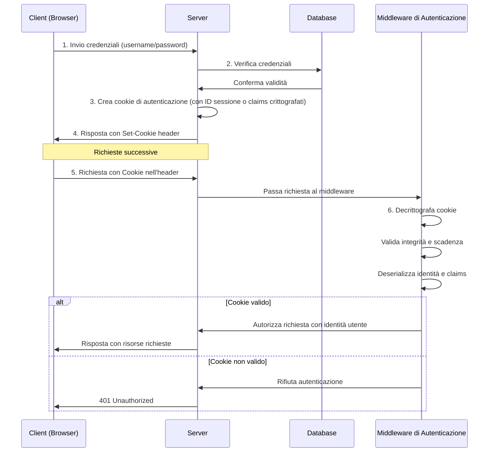

# Cookie based Authentication and Authorization in ASP NET Minimal API

- [Cookie based Authentication and Authorization in ASP NET Minimal API](#cookie-based-authentication-and-authorization-in-asp-net-minimal-api)
  - [Autenticazione vs. Autorizzazione](#autenticazione-vs-autorizzazione)
  - [Autenticazione in ASP.NET Core Minimal APIs](#autenticazione-in-aspnet-core-minimal-apis)
  - [Autorizzazione in ASP.NET Core Minimal APIs](#autorizzazione-in-aspnet-core-minimal-apis)
  - [Autenticazione Basata sui Cookie in Dettaglio](#autenticazione-basata-sui-cookie-in-dettaglio)
    - [Vantaggi dell'Autenticazione con Cookie](#vantaggi-dellautenticazione-con-cookie)
    - [Svantaggi dell'Autenticazione con Cookie](#svantaggi-dellautenticazione-con-cookie)
  - [Concetto e Uso dei Claims](#concetto-e-uso-dei-claims)
    - [Gestione dei Claims e Identificazione dell'Utente nel Middleware di Autenticazione](#gestione-dei-claims-e-identificazione-dellutente-nel-middleware-di-autenticazione)
    - [Uso dei Claims per l'Autorizzazione](#uso-dei-claims-per-lautorizzazione)
    - [Gestione delle Policies di Autorizzazione](#gestione-delle-policies-di-autorizzazione)
  - [Un esempio completo di autenticazione basata su cookie con Minimal API](#un-esempio-completo-di-autenticazione-basata-su-cookie-con-minimal-api)
  - [Un esempio completo di autenticazione basata su cookie e gestione dei ruoli con Minimal API](#un-esempio-completo-di-autenticazione-basata-su-cookie-e-gestione-dei-ruoli-con-minimal-api)
  - [Conclusioni](#conclusioni)
  - [Riferimenti](#riferimenti)

Questa lezione introduttiva mira a fornire una comprensione dei concetti fondamentali di autenticazione e autorizzazione nel contesto delle ASP.NET Core Minimal APIs. Comprendere questi concetti è cruciale per costruire applicazioni web sicure e funzionali.

## Autenticazione vs. Autorizzazione

È fondamentale distinguere tra **autenticazione** e **autorizzazione**:

  * **Autenticazione:** È il processo di verifica dell'identità di un utente. In altre parole, si tratta di accertare *chi* è l'utente che sta accedendo all'applicazione. Questo processo di solito coinvolge la richiesta di credenziali (come nome utente e password) e la loro validazione.
  * **Autorizzazione:** È il processo di determinare a quali risorse o funzionalità un utente autenticato ha il permesso di accedere. Si tratta di stabilire *cosa* può fare l'utente una volta che la sua identità è stata verificata.

In sintesi, l'autenticazione risponde alla domanda "Chi sei?", mentre l'autorizzazione risponde alla domanda "Cosa puoi fare?".

## Autenticazione in ASP.NET Core Minimal APIs

ASP.NET Core offre un sistema di autenticazione flessibile ed estensibile che può essere integrato facilmente anche nelle Minimal APIs. Esistono diversi meccanismi di autenticazione che possono essere utilizzati, tra cui:

  * **Autenticazione basata su cookie:** Un metodo tradizionale in cui il server invia un cookie al browser dopo l'autenticazione, e il browser lo include nelle richieste successive.
  * **Autenticazione basata su token (es. JWT):** Comunemente usata nelle API stateless, dove un token viene rilasciato dopo l'autenticazione e incluso nelle richieste successive.
  * **Autenticazione esterna (es. OAuth 2.0, OpenID Connect):** Permette agli utenti di autenticarsi tramite provider di identità esterni (come Google, Facebook, ecc.).

In questa lezione introduttiva, ci concentreremo sull'**autenticazione basata sui cookie**.

## Autorizzazione in ASP.NET Core Minimal APIs

Una volta che un utente è stato autenticato, è necessario determinare se ha il permesso di accedere a specifiche risorse o eseguire determinate azioni. ASP.NET Core fornisce meccanismi di autorizzazione basati su:

  * **Ruoli:** Si definiscono ruoli (es. "Amministratore", "Utente", "Moderatore") e si assegnano gli utenti a questi ruoli. L'autorizzazione viene quindi concessa o negata in base al ruolo dell'utente.
  * **Policies (Criteri):** Permettono di definire regole di autorizzazione più complesse, basate su uno o più requisiti (ad esempio, l'utente deve avere un certo claim, appartenere a un certo ruolo, o soddisfare una logica personalizzata).

Nelle Minimal APIs, l'autorizzazione può essere applicata a singoli endpoint utilizzando il metodo di estensione `.RequireAuthorization()`.

## Autenticazione Basata sui Cookie in Dettaglio

L'autenticazione basata sui cookie è un meccanismo stateful, in quanto il server mantiene una sorta di "sessione" con il client tramite il cookie. Ecco come funziona tipicamente:



*Diagramma di flusso di un tipico scenario di accesso ad una server che utilizza la `cookie based authentication`. Nel diagramma il `Middleware di Autenticazione` è stato separato dal `Server` per poter mostrare l'attività che il middleware gestisce. In realtà il `Middleware di Autenticazione` è parte integrate della pipeline del `Server`*

1. **Richiesta di Login:** L'utente invia le proprie credenziali (nome utente e password) al server tramite una richiesta (solitamente un form HTML o una chiamata API).
2. **Validazione delle Credenziali:** Il server verifica le credenziali ricevute confrontandole con quelle memorizzate (ad esempio, in un database).
3. **Creazione del Cookie di Autenticazione:** Se le credenziali sono valide, il server crea un cookie di autenticazione. Questo cookie contiene un identificatore di sessione o, più comunemente nel contesto dei claims, una rappresentazione serializzata e crittografata dell'identità dell'utente e dei suoi claims.
4. **Invio del Cookie al Client:** Il server invia il cookie al browser dell'utente tramite l'header `Set-Cookie` nella risposta HTTP.
5. **Richieste Successive:** Per le richieste successive alla stessa applicazione, il browser include automaticamente il cookie di autenticazione nell'header `Cookie` della richiesta HTTP.
6. **Validazione del Cookie:** Il server riceve la richiesta con il cookie. Il **middleware di autenticazione** legge il cookie, lo **decrittografa** e ne **valida l'integrità** (ad esempio, verificando la firma digitale per assicurarsi che non sia stato manomesso e che non sia scaduto). Se il cookie è valido, il middleware deserializza le informazioni sull'identità dell'utente e i suoi claims.

### Vantaggi dell'Autenticazione con Cookie

  * **Facile da implementare** per applicazioni web tradizionali con interfacce utente basate su browser.
  * **Supportato nativamente dai browser.**
  * Permette di mantenere lo stato dell'utente tra le richieste.

### Svantaggi dell'Autenticazione con Cookie

  * Può essere meno adatto per le API stateless o per applicazioni che devono essere accessibili da diversi tipi di client (es. applicazioni mobili).
  * Richiede la gestione dello stato lato server (anche se spesso questo è astratto dal framework).
  * Suscettibile ad attacchi CSRF (Cross-Site Request Forgery), se non implementate misure di protezione adeguate (come l'uso di `SameSiteMode.Strict`).

## Concetto e Uso dei Claims

I **claims** sono affermazioni che riguardano un utente autenticato. Rappresentano informazioni specifiche sull'utente, come il suo nome, indirizzo email, ruoli, permessi o qualsiasi altro dato rilevante per l'applicazione. I claims sono strutturati come coppie chiave-valore (tipo di claim e valore del claim). Per una descrizione dettagliata, si può consultare la documentazione su [Claims-based identity in ASP.NET Core](https://www.google.com/url?sa=E&source=gmail&q=https://learn.microsoft.com/en-us/aspnet/core/security/claims?view=aspnetcore-9.0).

Un oggetto `Claim` ha due proprietà principali:

  * **Type:** Una stringa che rappresenta il tipo di informazione che il claim contiene (ad esempio, `ClaimTypes.Name`, `ClaimTypes.Role`). La classe `ClaimTypes` definisce un insieme di tipi di claim standard.
  * **Value:** Una stringa che contiene il valore effettivo del claim (ad esempio, "Mario Rossi", "Amministratore").

### Gestione dei Claims e Identificazione dell'Utente nel Middleware di Autenticazione

Quando il **middleware di autenticazione** (`app.UseAuthentication()`) riceve una richiesta, esamina l'header `Cookie` alla ricerca del cookie di autenticazione configurato.

1. **Lettura e Decrittografia del Cookie:** Se il cookie viene trovato, il middleware lo legge e lo decrittografa. **Il cookie di autenticazione è tipicamente crittografato** per proteggere le informazioni sensibili sull'utente e i suoi claims da accessi non autorizzati. La crittografia è gestita dal sistema di protezione dei dati di ASP.NET Core.
2. **Validazione dell'Integrità:** Il middleware verifica l'integrità del cookie, assicurandosi che non sia stato manomesso (spesso tramite una firma digitale). Potrebbe anche verificare se il cookie è scaduto.
3. **Deserializzazione dell'Identità:** Se il cookie è valido, il middleware deserializza l'oggetto `ClaimsPrincipal` (che contiene uno o più `ClaimsIdentity` e la relativa collezione di `Claim`s) che era stato serializzato e memorizzato nel cookie al momento del login.
4. **Impostazione di `HttpContext.User`:** Il `ClaimsPrincipal` deserializzato viene quindi impostato come valore della proprietà `User` dell'oggetto `HttpContext` (`ctx.User`). Questo rende l'identità dell'utente autenticato e i suoi claims disponibili per le richieste successive nella pipeline di middleware e all'interno degli endpoint.

**Grazie a questo processo, all'interno di un endpoint, è possibile sapere automaticamente se l'utente è autenticato o meno semplicemente accedendo alla proprietà `ctx.User.Identity.IsAuthenticated`.** Questa proprietà sarà `true` se un cookie di autenticazione valido è stato trovato e processato con successo, altrimenti sarà `false`.

### Uso dei Claims per l'Autorizzazione

Una volta che l'utente è autenticato e i suoi claims sono disponibili in `HttpContext.User`, il **middleware di autorizzazione** (`app.UseAuthorization()`) entra in gioco. Il suo ruolo è quello di valutare se l'utente autenticato ha il permesso di accedere alla risorsa richiesta. Questa valutazione si basa sulle **policies** di autorizzazione configurate nell'applicazione. Per ulteriori dettagli, consultare la documentazione su [Authorization in ASP.NET Core](https://learn.microsoft.com/en-us/aspnet/core/security/authorization/introduction).

### Gestione delle Policies di Autorizzazione

Le **policies** di autorizzazione sono definite durante la configurazione dei servizi nell'applicazione (solitamente nel metodo `ConfigureServices` del file `Program.cs` o in una classe di configurazione). Le policies sono regole che specificano i requisiti che un utente deve soddisfare per essere autorizzato.

Le policies possono essere basate su:

  * **Ruoli:** Si specifica che l'utente deve appartenere a uno o più ruoli specifici (ad esempio, "Amministratore", "Utente"). Questo si ottiene usando il metodo `RequireRole` nella definizione della policy.
  * **Claims:** Si specifica che l'utente deve possedere uno o più claims specifici, con un determinato tipo e, opzionalmente, un valore specifico. Questo si ottiene usando il metodo `RequireClaim` nella definizione della policy.
  * **Requisiti Personalizzati:** È possibile definire logiche di autorizzazione più complesse creando requisiti personalizzati e implementando degli "handler" che valutano se un utente soddisfa tali requisiti.

**Esempio di definizione di policies:**

```csharp
builder.Services.AddAuthorization(options =>
{
    // Policy che richiede che l'utente abbia il ruolo "Administrator"
    options.AddPolicy("RequireAdminRole", policy =>
        policy.RequireRole("Administrator"));

    // Policy che richiede che l'utente abbia un claim di tipo "Permission" con valore "Edit"
    options.AddPolicy("RequireEditPermission", policy =>
        policy.RequireClaim("Permission", "Edit"));

    // Policy che combina più requisiti (deve essere amministratore E avere il permesso di modifica)
    options.AddPolicy("AdminAndEdit", policy =>
        policy.RequireRole("Administrator")
              .RequireClaim("Permission", "Edit"));
});
```

**Applicazione delle Policies agli Endpoint:**

Una volta definite le policies, è possibile applicarle a specifici endpoint delle Minimal APIs utilizzando il metodo `.RequireAuthorization()`:

```csharp
// Richiede che l'utente sia autenticato (policy predefinita)
app.MapGet("/protected", () => "Endpoint protetto")
    .RequireAuthorization();

// Richiede che l'utente soddisfi la policy "RequireAdminRole"
app.MapGet("/admin", () => "Endpoint per amministratori")
    .RequireAuthorization("RequireAdminRole");

// Richiede che l'utente soddisfi la policy "RequireEditPermission"
app.MapPost("/edit", () => "Endpoint per l'editing")
    .RequireAuthorization("RequireEditPermission");

// Richiede che l'utente soddisfi la policy "AdminAndEdit"
app.MapDelete("/delete", () => "Endpoint per l'eliminazione")
    .RequireAuthorization("AdminAndEdit");
```

In sintesi, il middleware di autorizzazione intercetta le richieste dopo l'autenticazione e verifica se l'utente corrente (rappresentato dal suo `ClaimsPrincipal`) soddisfa i requisiti della policy specificata per l'endpoint. Se la verifica ha successo, la richiesta prosegue verso l'handler dell'endpoint; altrimenti, viene restituito un errore di autorizzazione (tipicamente un codice di stato 403 Forbidden).

## Un esempio completo di autenticazione basata su cookie con Minimal API

Nell'esempio [Cookie Based Login](../../../../asp.net/api-samples/minimal-api/AuthenticationAuthorizationDemos/BasicExamples/cookie-based-login/) viene mostrato un progetto di Minimal API .NET che implementa uno schema di autenticazione e autorizzazione basato su cookie.

La documentazione di questo esempio è riportata in [questa pagina](../../../../asp.net/api-samples/minimal-api/AuthenticationAuthorizationDemos/BasicExamples/cookie-based-login/docs/index.md).

## Un esempio completo di autenticazione basata su cookie e gestione dei ruoli con Minimal API

Nell'esempio [Cookie Based Login With Roles](../../../../asp.net/api-samples/minimal-api/AuthenticationAuthorizationDemos/BasicExamples/cookie-based-login-with-roles/) viene mostrato un progetto di Minimal API .NET che implementa uno schema di autenticazione e autorizzazione basato su cookie con anche la gestione dei ruoli.

La documentazione di questo esempio è riportata in [questa pagina](../../../../asp.net/api-samples/minimal-api/AuthenticationAuthorizationDemos/BasicExamples/cookie-based-login-with-roles/docs/index.md).

## Conclusioni

L'autenticazione e l'autorizzazione sono pilastri fondamentali per la sicurezza delle applicazioni web. L'autenticazione basata sui cookie, supportata da claims, offre un meccanismo efficace per gestire l'identità degli utenti. Il middleware di autenticazione si occupa di stabilire l'identità dell'utente leggendo e validando il cookie, rendendo i claims disponibili. Il middleware di autorizzazione, basandosi sulle policies configurate, decide se l'utente autenticato ha il permesso di accedere alle risorse richieste. Comprendere il funzionamento di questi componenti è essenziale per sviluppare applicazioni ASP.NET Core Minimal APIs sicure e robuste.

## Riferimenti

[Overview of ASP.NET Core authentication](https://learn.microsoft.com/en-us/aspnet/core/security/authentication/)

[ASP.NET Core Middleware](https://learn.microsoft.com/en-us/aspnet/core/fundamentals/middleware/)

[Overview of ASP.NET Core authentication](https://learn.microsoft.com/en-us/aspnet/core/security/authentication/#authentication-middleware)

[Use cookie authentication without ASP.NET Core Identity](https://learn.microsoft.com/en-us/aspnet/core/security/authentication/cookie)
