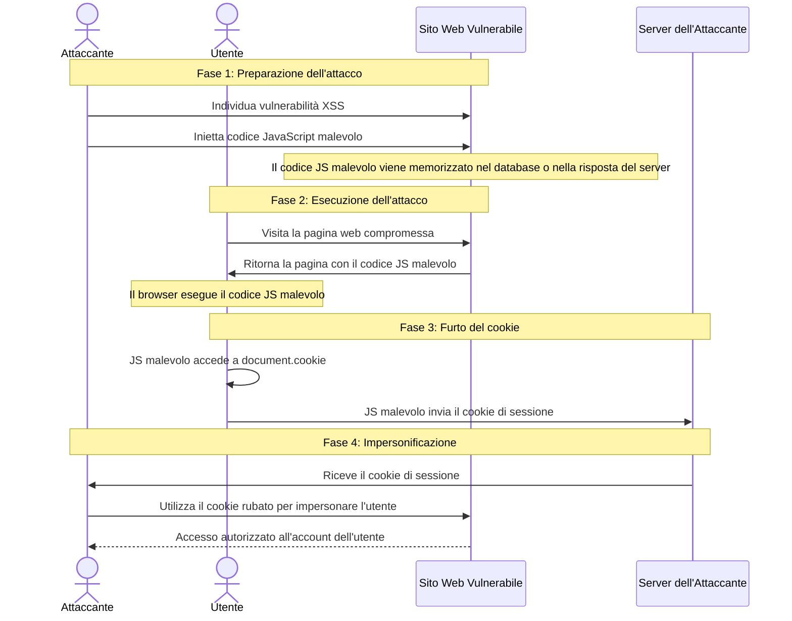
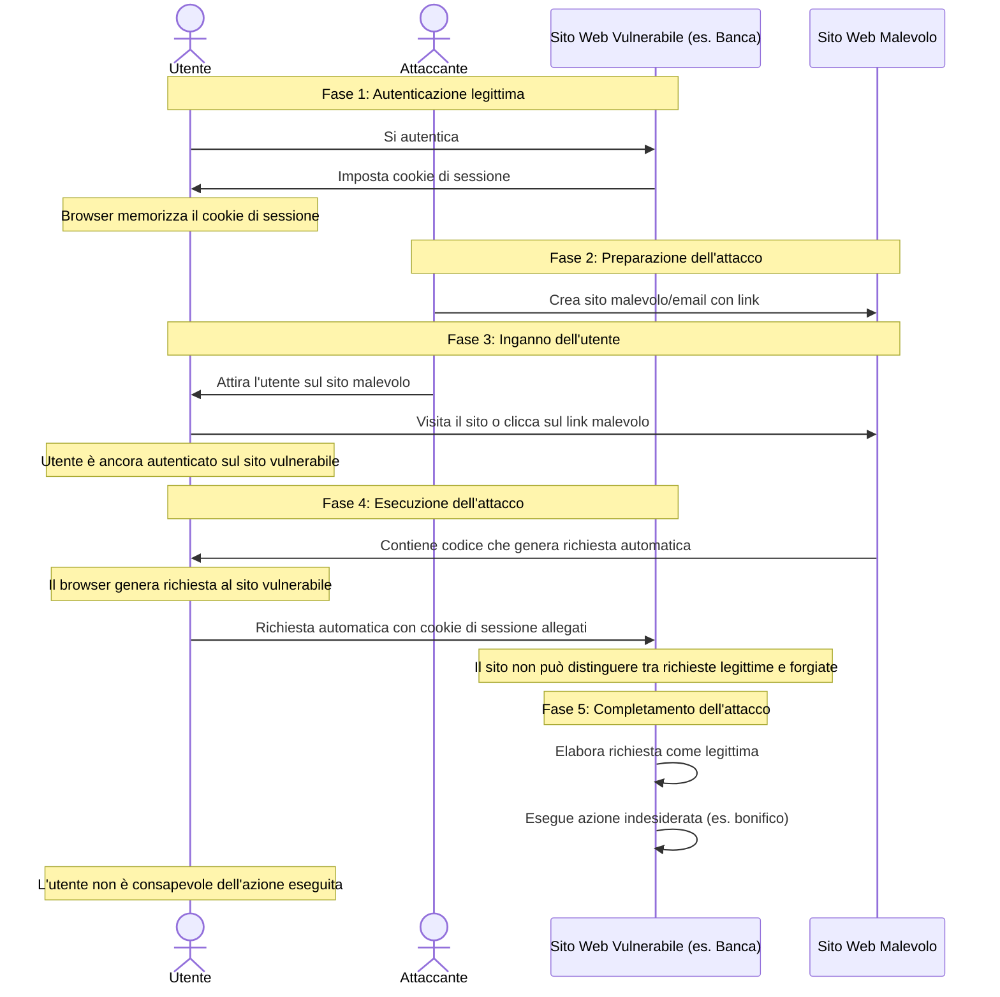

# Pericoli e Vulnerabilità dei Cookie

- [Pericoli e Vulnerabilità dei Cookie](#pericoli-e-vulnerabilità-dei-cookie)
    - [Cross-Site Scripting (XSS)](#cross-site-scripting-xss)
      - [Mitigazione del rischio XSS e Cookie](#mitigazione-del-rischio-xss-e-cookie)
    - [Cross-Site Request Forgery (CSRF)](#cross-site-request-forgery-csrf)
      - [Mitigazione del rischio CSRF](#mitigazione-del-rischio-csrf)
    - [Intercettazione (Man-in-the-Middle Attack)](#intercettazione-man-in-the-middle-attack)
      - [Mitigazione del rischio di Intercettazione](#mitigazione-del-rischio-di-intercettazione)
    - [Furto Fisico di Cookie](#furto-fisico-di-cookie)
      - [Mitigazione del rischio di Furto Fisico](#mitigazione-del-rischio-di-furto-fisico)

Nonostante la loro utilità per il riconoscimento dell'utente nel contesto web, i cookie non sono esenti da rischi di sicurezza. Una comprensione approfondita delle vulnerabilità associate ai cookie è fondamentale per sviluppare applicazioni web sicure e robuste.

**Principali Pericoli e Attacchi basati sui Cookie:**

### Cross-Site Scripting (XSS)

XSS è una delle vulnerabilità web più diffuse e sfruttabili. Un attacco XSS si verifica quando un attaccante riesce a iniettare codice malevolo (solitamente JavaScript) in una pagina web visualizzata da altri utenti.  Se un sito web è vulnerabile a XSS e i cookie di sessione *non* sono protetti con l'attributo `HttpOnly`, un attaccante può utilizzare JavaScript malevolo per rubare il cookie di sessione dell'utente.

*Diagramma semplificato di un attacco XSS che mira a rubare cookie di sessione.*

**Scenario di Attacco XSS e Furto di Cookie:**

  1. Un attaccante individua una vulnerabilità XSS in un sito web (es. un campo di input non correttamente validato).
  2. L'attaccante inietta codice JavaScript malevolo nel sito web attraverso la vulnerabilità XSS. Il codice JavaScript potrebbe essere memorizzato nel database del sito o iniettato in una risposta del server.
  3. Un utente legittimo visita la pagina web compromessa.
  4. Il browser dell'utente esegue il codice JavaScript malevolo iniettato.
  5. Il codice JavaScript malevolo utilizza `document.cookie` per accedere al cookie di sessione dell'utente.
  6. Il codice JavaScript invia il cookie di sessione a un server controllato dall'attaccante.
  7. L'attaccante, ora in possesso del cookie di sessione dell'utente legittimo, può impersonare l'utente e accedere all'account senza conoscerne le credenziali (username e password).

#### Mitigazione del rischio XSS e Cookie

 * **Sanificazione e Validazione Input:**  Implementare rigorose procedure di sanificazione e validazione di tutti gli input utente (sia lato client che lato server) per prevenire l'iniezione di codice malevolo.
 * **Utilizzo di `HttpOnly`:** Impostare sempre l'attributo `HttpOnly` per i cookie che contengono informazioni sensibili, come gli ID di sessione. Questo impedisce a JavaScript lato client di accedere a questi cookie, mitigando il rischio di furto tramite XSS.
 * **Content Security Policy (CSP):** Implementare Content Security Policy per controllare le risorse che il browser può caricare ed eseguire, riducendo la superficie di attacco per XSS.

### Cross-Site Request Forgery (CSRF)

CSRF è un tipo di attacco in cui un attaccante induce un utente autenticato a effettuare azioni indesiderate su un sito web a sua insaputa.  L'attaccante sfrutta il fatto che **il browser invia automaticamente i cookie (inclusi i cookie di sessione) con ogni richiesta verso il sito web target**.

*Diagramma di un attacco CSRF. L'attaccante inganna l'utente autenticato per eseguire azioni indesiderate.*

**Scenario di Attacco CSRF:**

1. Un utente è autenticato su un sito web vulnerabile (es. una piattaforma di home banking). Il browser ha memorizzato il cookie di sessione per quel sito.
2. Un attaccante crea un sito web malevolo o invia una email con un link malevolo.
3. L'utente, mentre è ancora autenticato sul sito web vulnerabile, visita il sito web malevolo o clicca sul link malevolo.
4. Il sito web malevolo contiene codice (es. immagini, form, JavaScript) che induce il browser dell'utente a inviare una richiesta HTTP al sito web vulnerabile (es. una richiesta per effettuare un bonifico bancario).
5. Poiché il browser invia automaticamente i cookie (incluso il cookie di sessione) con la richiesta, il sito web vulnerabile riceve una richiesta apparentemente legittima dall'utente autenticato.
6. Se il sito web vulnerabile non ha protezioni CSRF, elabora la richiesta, eseguendo l'azione indesiderata (es. bonifico bancario non autorizzato) *con l'identità dell'utente autenticato*, senza che l'utente ne sia consapevole o l'abbia intenzionalmente richiesta.

#### Mitigazione del rischio CSRF

 * **Token Anti-CSRF (Synchronizer Token Pattern):**  Utilizzare token anti-CSRF. Il server genera un token univoco per ogni sessione utente (o per ogni form). Questo token viene incluso in ogni form o richiesta "sensibile" (es. richieste POST, PUT, DELETE). Quando il server riceve una richiesta, verifica la presenza e la validità del token anti-CSRF. Se il token manca o non è valido, la richiesta viene rifiutata. Questo impedisce agli attaccanti di creare richieste valide per conto dell'utente, poiché non sono in grado di conoscere o generare il token anti-CSRF corretto.
 * **SameSite Cookie Attribute (con cautela):** L'attributo `SameSite` con valore `Strict` o `Lax` può offrire una certa protezione contro attacchi CSRF, limitando l'invio dei cookie in contesti cross-site. Tuttavia, `SameSite` non è una protezione CSRF completa e dovrebbe essere utilizzato in combinazione con altre misure (es. token anti-CSRF).

### Intercettazione (Man-in-the-Middle Attack)

Se i cookie vengono trasmessi su connessioni HTTP non sicure (senza HTTPS) e l'attributo `Secure` non è impostato, un attaccante che intercetta il traffico di rete (es. in una rete Wi-Fi pubblica non sicura) può rubare i cookie, inclusi i cookie di sessione.

#### Mitigazione del rischio di Intercettazione

* **Utilizzo di HTTPS:** Utilizzare sempre il protocollo HTTPS per tutte le comunicazioni web, in particolare per i siti web che gestiscono informazioni sensibili o autenticazione utente. HTTPS cifra il traffico di rete, proteggendo i cookie e altre informazioni da intercettazioni.
* **Attributo `Secure`:** Impostare sempre l'attributo `Secure` per i cookie, specialmente per i cookie di sessione. Questo assicura che i cookie vengano trasmessi solo su connessioni HTTPS.

### Furto Fisico di Cookie

In scenari meno comuni, un attaccante potrebbe riuscire ad accedere fisicamente al computer dell'utente e rubare i file cookie memorizzati dal browser. Questo potrebbe permettere all'attaccante di impersonare l'utente, specialmente se i cookie di sessione hanno una lunga durata.

#### Mitigazione del rischio di Furto Fisico

* **Limitare la durata dei cookie di sessione:** Ridurre al minimo la durata dei cookie di sessione. Sessioni più brevi riducono la finestra temporale in cui un cookie rubato può essere utilizzato.
* **Logout Inattivo (Session Timeout):** Implementare un meccanismo di logout automatico per inattività. Se l'utente è inattivo per un certo periodo di tempo, la sessione viene invalidata e il cookie di sessione diventa inutilizzabile.
* **Crittografia del disco (Full Disk Encryption):**  L'utilizzo della crittografia completa del disco del sistema operativo rende più difficile per un attaccante accedere ai file cookie memorizzati, anche in caso di accesso fisico al computer.